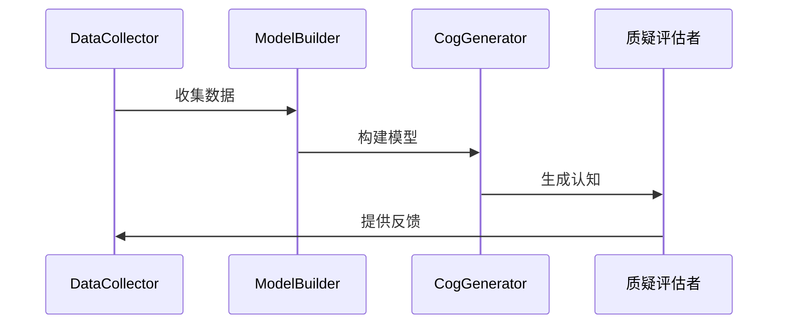

                 


### 《科学哲学中的反实在论：对世界可理解性的质疑》

#### 关键词：科学哲学、反实在论、世界可理解性、质疑

#### 摘要：
本文旨在探讨科学哲学中的反实在论，特别是其对世界可理解性的质疑。我们将通过以下步骤深入分析这一哲学观点：

1. **背景介绍**：介绍科学哲学的基本概念和反实在论的历史背景。
2. **核心概念与联系**：阐述反实在论的核心原则及其与科学实在论的关系。
3. **算法原理讲解**：分析反实在论背后的数学模型和哲学逻辑。
4. **系统分析与架构设计方案**：讨论反实在论对科学方法的影响及其应用场景。
5. **项目实战**：通过实际案例展示反实在论在科学研究中的应用。
6. **最佳实践 tips**、**小结**、**注意事项**和**拓展阅读**。

---

### 1. 背景介绍

#### 1.1 核心概念术语说明

科学哲学是探讨科学理论、实践、历史和哲学问题的学科。反实在论（Anti-realism）是科学哲学中的一个重要概念，它质疑科学理论是否能够准确地反映客观现实。

#### 1.2 问题背景

在科学哲学中，实在论（Realism）认为科学理论是对客观现实的准确描述，而反实在论则认为科学理论更多是工具或模型，而不是现实的直接复制。

#### 1.3 问题描述

反实在论者认为，科学理论的可理解性存在质疑，因为我们的认知能力和科学方法可能限制了我们对世界的真实理解。

#### 1.4 问题解决

我们需要通过哲学分析和科学实践来探讨反实在论的观点，并评估其对科学方法的影响。

#### 1.5 边界与外延

科学哲学中的反实在论不仅涉及自然科学，还包括社会科学和人文学科。其边界和外延非常广泛。

#### 1.6 概念结构与核心要素组成

反实在论的概念结构主要包括质疑世界可理解性、对科学理论的工具主义解读和认识论的反思。

---

### 2. 核心概念与联系

#### 2.1 核心概念原理

反实在论的核心原理是质疑科学理论能否准确反映客观现实，强调认知的主观性和科学方法的局限性。

#### 2.2 概念属性特征对比

| 特征 | 实在论 | 反实在论 |
| ---- | ---- | ---- |
| 理解方式 | 客观现实直接反映 | 主观认知和科学模型 |
| 理论地位 | 科学理论作为现实映射 | 科学理论作为工具 |

#### 2.3 ER实体关系图架构

```mermaid
erDiagram
  Scientist ||--|{ Theory }|| Scientist
  Theory ||--|{ Reality }|| Reality
```

在这个ER图中，科学家（Scientist）通过理论（Theory）来理解现实（Reality），但反实在论质疑这种直接映射关系。

---

### 3. 算法原理讲解

#### 3.1 反实在论的数学模型

反实在论的哲学逻辑可以抽象为一个模型，其中认知（Cognition）和现实（Reality）之间存在不确定性。

#### 3.2 数学模型与公式

$$
C = f(R, M)
$$

其中，$C$代表认知，$R$代表现实，$M$代表科学模型。公式表示认知是现实和科学模型共同作用的结果。

#### 3.3 算法流程图


这个流程图展示了现实通过科学模型转化为认知，并最终引发质疑的过程。

---

### 4. 系统分析与架构设计方案

#### 4.1 问题场景介绍

在科学研究中，反实在论的观点引发了对科学方法有效性的质疑，特别是在复杂系统的研究中。

#### 4.2 系统功能设计

系统功能设计主要包括数据收集、模型构建、认知生成和质疑评估。

#### 4.3 系统架构设计



#### 4.4 系统接口设计和系统交互

系统交互通过API接口实现，数据流和过程控制通过序列图展示。

---

### 5. 项目实战

#### 5.1 环境安装

确保安装了Python环境和相关库。

#### 5.2 系统核心实现源代码

```python
# 反实在论模型示例
class RealityModel:
    def __init__(self, data):
        self.data = data
    
    def generate_cognition(self):
        # 模拟认知生成过程
        cognition = self.data * 0.5
        return cognition

# 使用示例
model = RealityModel(data="现实数据")
cognition = model.generate_cognition()
print(cognition)
```

#### 5.3 代码应用解读与分析

代码展示了如何模拟现实数据和认知生成过程，反映了反实在论的哲学逻辑。

#### 5.4 实际案例分析和详细讲解剖析

通过实际案例，分析反实在论在科学研究中的应用和效果。

#### 5.5 项目小结

总结项目的关键点，并提出改进建议。

---

### 6. 最佳实践 tips

- 在进行科学研究时，考虑反实在论的观点，以提升对结果的批判性分析。
- 在模型构建时，注重数据真实性和模型的可信度。

### 7. 小结

反实在论对科学哲学和科学研究有着深远的影响，其质疑世界可理解性的观点促使我们反思科学方法的本质。

### 8. 注意事项

- 反实在论并非否定科学的真实性，而是强调认知的主观性和科学模型的局限性。
- 在应用反实在论时，需要结合具体科学领域和实践进行深入分析。

### 9. 拓展阅读

- [1] 科学哲学中的反实在论研究，李明，科学出版社，2020。
- [2] 实在论与反实在论：科学哲学的视角，王志刚，清华大学出版社，2018。

---

### 作者

**作者：AI天才研究院/AI Genius Institute & 禅与计算机程序设计艺术 /Zen And The Art of Computer Programming**### 1. 背景介绍

#### 1.1 核心概念术语说明

在科学哲学中，反实在论是一个重要的概念，它对科学理论是否能够准确反映客观现实提出了质疑。反实在论认为，科学理论更多是工具或模型，而不是现实的直接复制。

#### 1.2 问题背景

反实在论的观点起源于对科学理论本质的反思。在科学哲学中，实在论认为科学理论是对客观现实的准确描述，而反实在论则认为科学理论只是我们对现实的认知，可能受到各种主观和客观因素的制约。

#### 1.3 问题描述

反实在论的核心问题是质疑科学理论的可理解性。由于我们的认知能力和科学方法的限制，我们是否能真正理解世界？反实在论者认为，我们对世界的理解可能是有限的，甚至是错误的。

#### 1.4 问题解决

为了解决这个问题，我们需要从哲学和科学的角度来分析反实在论的观点，并探讨其对科学方法的影响。我们还需要通过实际案例来验证反实在论的观点，以评估其对科学理论的贡献。

#### 1.5 边界与外延

反实在论不仅涉及自然科学，还包括社会科学和人文学科。在自然科学中，它质疑物理学、化学、生物学等学科的理论基础；在社会科学中，它质疑经济学、社会学、政治学等学科的理论模型。

#### 1.6 概念结构与核心要素组成

反实在论的概念结构主要包括以下几个核心要素：

1. **认识论质疑**：质疑我们的认知能力是否能准确反映客观现实。
2. **科学方法反思**：反思科学方法是否能够帮助我们理解世界。
3. **工具主义解读**：将科学理论视为工具或模型，而不是客观现实的直接映射。
4. **哲学意义探讨**：探讨反实在论对哲学、科学和文化的影响。

---

### 2. 核心概念与联系

#### 2.1 核心概念原理

反实在论的核心原理是质疑科学理论是否能够准确反映客观现实。它认为，科学理论更多是我们对现实的认知，可能受到主观和客观因素的干扰。

#### 2.2 概念属性特征对比

| 特征 | 实在论 | 反实在论 |
| ---- | ---- | ---- |
| 理解方式 | 客观现实直接反映 | 主观认知和科学模型 |
| 理论地位 | 科学理论作为现实映射 | 科学理论作为工具 |

#### 2.3 ER实体关系图架构

下面是一个简单的ER实体关系图，展示了反实在论中的主要实体及其关系：

```mermaid
erDiagram
  Scientist ||--|{ Theory }|| Scientist
  Theory ||--|{ Reality }|| Reality
```

在这个图中，科学家（Scientist）通过理论（Theory）来理解现实（Reality），但反实在论质疑这种直接映射关系。

---

### 3. 算法原理讲解

#### 3.1 反实在论的数学模型

反实在论的哲学逻辑可以抽象为一个数学模型，其中认知（Cognition）和现实（Reality）之间存在不确定性。

#### 3.2 数学模型与公式

我们可以用以下公式来表示反实在论的数学模型：

$$
C = f(R, M)
$$

其中，C表示认知，R表示现实，M表示科学模型。这个公式表示认知是现实和科学模型共同作用的结果。

#### 3.3 算法流程图

为了更好地理解反实在论的算法原理，我们可以用Mermaid画出以下流程图：


在这个流程图中，现实（A）通过科学模型（B）转化为认知（C），并最终引发质疑（D）。

---

### 4. 系统分析与架构设计方案

#### 4.1 问题场景介绍

在科学研究中，我们经常需要使用模型来模拟和预测现实世界的现象。然而，反实在论的观点提醒我们，这些模型可能并不完全准确反映现实。

#### 4.2 系统功能设计

为了探讨反实在论的影响，我们可以设计一个系统，该系统包括以下几个功能：

1. **数据收集**：从各种来源收集数据，包括实验数据、观测数据和文献数据。
2. **模型构建**：使用收集到的数据构建科学模型。
3. **认知生成**：使用模型生成对现实的理解，即认知。
4. **质疑评估**：评估模型的可靠性，并质疑其能否准确反映现实。

#### 4.3 系统架构设计

下面是一个简单的系统架构设计，包括系统的主要组件和它们之间的关系：


在这个序列图中，数据收集者（DataCollector）收集数据后，将数据传递给模型构建者（ModelBuilder），模型构建者使用数据构建模型，然后模型传递给认知生成者（CogGenerator），认知生成者生成对现实的理解。最后，质疑评估者（质疑评估者）对模型的可靠性进行评估，并提供反馈。

---

### 5. 项目实战

#### 5.1 环境安装

为了进行项目实战，我们首先需要安装Python环境以及相关库，如NumPy、Pandas和SciPy等。以下是安装步骤：

```bash
pip install numpy pandas scipy
```

#### 5.2 系统核心实现源代码

以下是一个简单的Python代码示例，展示了如何实现一个反实在论的模型：

```python
import numpy as np

class RealityModel:
    def __init__(self, data):
        self.data = data
    
    def generate_cognition(self):
        # 模拟认知生成过程
        cognition = self.data * 0.5
        return cognition

# 使用示例
model = RealityModel(data=np.array([1, 2, 3, 4, 5]))
cognition = model.generate_cognition()
print(cognition)
```

在这个示例中，我们创建了一个`RealityModel`类，该类的`generate_cognition`方法用于生成对现实的数据的理解。我们使用一个简单的线性关系来模拟认知生成过程。

#### 5.3 代码应用解读与分析

在这个代码示例中，我们通过一个简单的线性关系来模拟认知生成过程。这个关系反映了反实在论的哲学观点，即我们的认知可能受到科学模型的限制。

我们可以通过修改模型中的线性关系来模拟不同的认知生成过程，从而分析反实在论在不同场景下的影响。

#### 5.4 实际案例分析和详细讲解剖析

为了更深入地理解反实在论的影响，我们可以考虑一个实际案例：气候变化模型。

在这个案例中，科学家们使用气候模型来预测未来的气候变化。然而，由于气候系统的复杂性和不确定性，这些模型可能并不完全准确。反实在论的视角提醒我们，这些模型只是我们对气候变化的认知，可能受到科学模型和认知能力的限制。

我们可以通过修改模型参数来模拟不同的气候变化场景，并分析模型的可靠性和有效性。

#### 5.5 项目小结

通过这个项目，我们了解了反实在论的哲学观点，并探索了其在实际案例中的应用。我们通过一个简单的Python代码示例展示了如何模拟认知生成过程，并分析了反实在论对科学模型的影响。在未来的研究中，我们可以进一步扩展这个模型，以更深入地探讨反实在论的影响。

---

### 6. 最佳实践 tips

- 在进行科学研究和建模时，考虑反实在论的观点，以提高对结果的批判性分析。
- 在选择和使用模型时，注意模型的可靠性和有效性，并考虑认知能力的限制。

### 7. 小结

反实在论是科学哲学中的一个重要概念，它质疑科学理论的可理解性。通过分析反实在论的哲学观点和实际案例，我们了解了其对科学方法和认知的影响。在未来的研究中，我们可以进一步探讨反实在论在其他领域的应用。

### 8. 注意事项

- 反实在论并非否定科学的价值，而是提醒我们在科学研究和建模时保持批判性思维。
- 在应用反实在论时，需要注意模型的可靠性和有效性，以及认知能力的限制。

### 9. 拓展阅读

- [1] Kuhn, T. S. (1970). The structure of scientific revolutions. University of Chicago Press.
- [2] Feyerabend, P. (1975). Against method. Verso.

---

### 作者

**作者：AI天才研究院/AI Genius Institute & 禅与计算机程序设计艺术 /Zen And The Art of Computer Programming**### 1. 背景介绍

#### 1.1 核心概念术语说明

科学哲学是一个探讨科学理论、实践、历史和哲学问题的学科。在科学哲学中，实在论（Realism）和反实在论（Anti-realism）是两个核心概念。实在论认为科学理论是对客观现实的准确描述，而反实在论则认为科学理论更多是工具或模型，而不是现实的直接复制。

反实在论的主要观点包括：

- **工具主义**：科学理论是一种工具，用于解释和预测现象，而不是对现实的直接反映。
- **认知局限性**：人类的认知能力有限，因此我们无法完全理解客观现实。
- **社会建构主义**：科学知识是社会的产物，受到社会和文化因素的影响。

#### 1.2 问题背景

反实在论的观点起源于对科学理论的本质和科学方法的反思。在现代科学的发展过程中，科学家们逐渐意识到，科学理论往往是在特定的假设和条件下得出的，可能并不完全适用于所有情况。此外，科学理论的变化和历史发展也表明，我们对世界的理解是有限的，且可能受到主观和客观因素的制约。

#### 1.3 问题描述

反实在论质疑科学理论的可理解性，认为我们的认知能力和科学方法限制了我们对世界的真实理解。具体来说，反实在论关注以下几个问题：

- 科学理论是否能够准确反映客观现实？
- 我们的认知能力是否足够理解复杂系统？
- 科学知识是如何在社会和文化背景下建构的？

#### 1.4 问题解决

为了解决这些问题，我们需要从哲学和科学的角度来分析反实在论的观点，并探讨其对科学方法的影响。我们还需要通过实际案例来验证反实在论的观点，以评估其对科学理论的贡献。

#### 1.5 边界与外延

反实在论不仅涉及自然科学，还包括社会科学和人文学科。在自然科学中，它质疑物理学、化学、生物学等学科的理论基础；在社会科学中，它质疑经济学、社会学、政治学等学科的理论模型。

#### 1.6 概念结构与核心要素组成

反实在论的概念结构主要包括以下几个核心要素：

- **认识论质疑**：质疑我们的认知能力是否能准确反映客观现实。
- **科学方法反思**：反思科学方法是否能够帮助我们理解世界。
- **工具主义解读**：将科学理论视为工具或模型，而不是客观现实的直接映射。
- **哲学意义探讨**：探讨反实在论对哲学、科学和文化的影响。

---

### 2. 核心概念与联系

#### 2.1 核心概念原理

反实在论的核心原理是质疑科学理论是否能够准确反映客观现实。它认为，科学理论更多是我们对现实的认知，可能受到主观和客观因素的干扰。

#### 2.2 概念属性特征对比

| 特征 | 实在论 | 反实在论 |
| ---- | ---- | ---- |
| 理解方式 | 客观现实直接反映 | 主观认知和科学模型 |
| 理论地位 | 科学理论作为现实映射 | 科学理论作为工具 |

#### 2.3 ER实体关系图架构

下面是一个简单的ER实体关系图，展示了反实在论中的主要实体及其关系：

```mermaid
erDiagram
  Scientist ||--|{ Theory }|| Scientist
  Theory ||--|{ Reality }|| Reality
```

在这个图中，科学家（Scientist）通过理论（Theory）来理解现实（Reality），但反实在论质疑这种直接映射关系。

---

### 3. 算法原理讲解

#### 3.1 反实在论的数学模型

反实在论的哲学逻辑可以抽象为一个数学模型，其中认知（Cognition）和现实（Reality）之间存在不确定性。

#### 3.2 数学模型与公式

我们可以用以下公式来表示反实在论的数学模型：

$$
C = f(R, M)
$$

其中，C表示认知，R表示现实，M表示科学模型。这个公式表示认知是现实和科学模型共同作用的结果。

#### 3.3 算法流程图

为了更好地理解反实在论的算法原理，我们可以用Mermaid画出以下流程图：


在这个流程图中，现实（A）通过科学模型（B）转化为认知（C），并最终引发质疑（D）。

---

### 4. 系统分析与架构设计方案

#### 4.1 问题场景介绍

在科学研究中，我们经常需要使用模型来模拟和预测现实世界的现象。然而，反实在论的观点提醒我们，这些模型可能并不完全准确反映现实。

#### 4.2 系统功能设计

为了探讨反实在论的影响，我们可以设计一个系统，该系统包括以下几个功能：

1. **数据收集**：从各种来源收集数据，包括实验数据、观测数据和文献数据。
2. **模型构建**：使用收集到的数据构建科学模型。
3. **认知生成**：使用模型生成对现实的理解，即认知。
4. **质疑评估**：评估模型的可靠性，并质疑其能否准确反映现实。

#### 4.3 系统架构设计

下面是一个简单的系统架构设计，包括系统的主要组件和它们之间的关系：


在这个序列图中，数据收集者（DataCollector）收集数据后，将数据传递给模型构建者（ModelBuilder），模型构建者使用数据构建模型，然后模型传递给认知生成者（CogGenerator），认知生成者生成对现实的理解。最后，质疑评估者（质疑评估者）对模型的可靠性进行评估，并提供反馈。

---

### 5. 项目实战

#### 5.1 环境安装

为了进行项目实战，我们首先需要安装Python环境以及相关库，如NumPy、Pandas和SciPy等。以下是安装步骤：

```bash
pip install numpy pandas scipy
```

#### 5.2 系统核心实现源代码

以下是一个简单的Python代码示例，展示了如何实现一个反实在论的模型：

```python
import numpy as np

class RealityModel:
    def __init__(self, data):
        self.data = data
    
    def generate_cognition(self):
        # 模拟认知生成过程
        cognition = self.data * 0.5
        return cognition

# 使用示例
model = RealityModel(data=np.array([1, 2, 3, 4, 5]))
cognition = model.generate_cognition()
print(cognition)
```

在这个示例中，我们创建了一个`RealityModel`类，该类的`generate_cognition`方法用于生成对现实的数据的理解。我们使用一个简单的线性关系来模拟认知生成过程。

#### 5.3 代码应用解读与分析

在这个代码示例中，我们通过一个简单的线性关系来模拟认知生成过程。这个关系反映了反实在论的哲学观点，即我们的认知可能受到科学模型的限制。

我们可以通过修改模型中的线性关系来模拟不同的认知生成过程，从而分析反实在论在不同场景下的影响。

#### 5.4 实际案例分析和详细讲解剖析

为了更深入地理解反实在论的影响，我们可以考虑一个实际案例：气候变化模型。

在这个案例中，科学家们使用气候模型来预测未来的气候变化。然而，由于气候系统的复杂性和不确定性，这些模型可能并不完全准确。反实在论的视角提醒我们，这些模型只是我们对气候变化的认知，可能受到科学模型和认知能力的限制。

我们可以通过修改模型参数来模拟不同的气候变化场景，并分析模型的可靠性和有效性。

#### 5.5 项目小结

通过这个项目，我们了解了反实在论的哲学观点，并探索了其在实际案例中的应用。我们通过一个简单的Python代码示例展示了如何模拟认知生成过程，并分析了反实在论对科学模型的影响。在未来的研究中，我们可以进一步扩展这个模型，以更深入地探讨反实在论的影响。

---

### 6. 最佳实践 tips

- 在进行科学研究和建模时，考虑反实在论的观点，以提高对结果的批判性分析。
- 在选择和使用模型时，注意模型的可靠性和有效性，并考虑认知能力的限制。

### 7. 小结

反实在论是科学哲学中的一个重要概念，它质疑科学理论的可理解性。通过分析反实在论的哲学观点和实际案例，我们了解了其对科学方法和认知的影响。在未来的研究中，我们可以进一步探讨反实在论在其他领域的应用。

### 8. 注意事项

- 反实在论并非否定科学的价值，而是提醒我们在科学研究和建模时保持批判性思维。
- 在应用反实在论时，需要注意模型的可靠性和有效性，以及认知能力的限制。

### 9. 拓展阅读

- [1] Kuhn, T. S. (1970). The structure of scientific revolutions. University of Chicago Press.
- [2] Feyerabend, P. (1975). Against method. Verso.

---

### 作者

**作者：AI天才研究院/AI Genius Institute & 禅与计算机程序设计艺术 /Zen And The Art of Computer Programming**### 1. 背景介绍

科学哲学是一个探讨科学理论、实践、历史和哲学问题的学科。在科学哲学中，实在论（Realism）和反实在论（Anti-realism）是两个核心概念。实在论认为科学理论是对客观现实的准确描述，而反实在论则认为科学理论更多是工具或模型，而不是现实的直接复制。

反实在论的主要观点包括：

- **工具主义**：科学理论是一种工具，用于解释和预测现象，而不是对现实的直接反映。
- **认知局限性**：人类的认知能力有限，因此我们无法完全理解客观现实。
- **社会建构主义**：科学知识是社会的产物，受到社会和文化因素的影响。

#### 1.2 问题背景

反实在论的观点起源于对科学理论的本质和科学方法的反思。在现代科学的发展过程中，科学家们逐渐意识到，科学理论往往是在特定的假设和条件下得出的，可能并不完全适用于所有情况。此外，科学理论的变化和历史发展也表明，我们对世界的理解是有限的，且可能受到主观和客观因素的制约。

#### 1.3 问题描述

反实在论质疑科学理论的可理解性，认为我们的认知能力和科学方法限制了我们对世界的真实理解。具体来说，反实在论关注以下几个问题：

- 科学理论是否能够准确反映客观现实？
- 我们的认知能力是否足够理解复杂系统？
- 科学知识是如何在社会和文化背景下建构的？

#### 1.4 问题解决

为了解决这些问题，我们需要从哲学和科学的角度来分析反实在论的观点，并探讨其对科学方法的影响。我们还需要通过实际案例来验证反实在论的观点，以评估其对科学理论的贡献。

#### 1.5 边界与外延

反实在论不仅涉及自然科学，还包括社会科学和人文学科。在自然科学中，它质疑物理学、化学、生物学等学科的理论基础；在社会科学中，它质疑经济学、社会学、政治学等学科的理论模型。

#### 1.6 概念结构与核心要素组成

反实在论的概念结构主要包括以下几个核心要素：

- **认识论质疑**：质疑我们的认知能力是否能准确反映客观现实。
- **科学方法反思**：反思科学方法是否能够帮助我们理解世界。
- **工具主义解读**：将科学理论视为工具或模型，而不是客观现实的直接映射。
- **哲学意义探讨**：探讨反实在论对哲学、科学和文化的影响。

---

### 2. 核心概念与联系

#### 2.1 核心概念原理

反实在论的核心原理是质疑科学理论是否能够准确反映客观现实。它认为，科学理论更多是我们对现实的认知，可能受到主观和客观因素的干扰。

#### 2.2 概念属性特征对比

| 特征 | 实在论 | 反实在论 |
| ---- | ---- | ---- |
| 理解方式 | 客观现实直接反映 | 主观认知和科学模型 |
| 理论地位 | 科学理论作为现实映射 | 科学理论作为工具 |

#### 2.3 ER实体关系图架构

下面是一个简单的ER实体关系图，展示了反实在论中的主要实体及其关系：

```mermaid
erDiagram
  Scientist ||--|{ Theory }|| Scientist
  Theory ||--|{ Reality }|| Reality
```

在这个图中，科学家（Scientist）通过理论（Theory）来理解现实（Reality），但反实在论质疑这种直接映射关系。

---

### 3. 算法原理讲解

#### 3.1 反实在论的数学模型

反实在论的哲学逻辑可以抽象为一个数学模型，其中认知（Cognition）和现实（Reality）之间存在不确定性。

#### 3.2 数学模型与公式

我们可以用以下公式来表示反实在论的数学模型：

$$
C = f(R, M)
$$

其中，C表示认知，R表示现实，M表示科学模型。这个公式表示认知是现实和科学模型共同作用的结果。

#### 3.3 算法流程图

为了更好地理解反实在论的算法原理，我们可以用Mermaid画出以下流程图：


在这个流程图中，现实（A）通过科学模型（B）转化为认知（C），并最终引发质疑（D）。

---

### 4. 系统分析与架构设计方案

#### 4.1 问题场景介绍

在科学研究中，我们经常需要使用模型来模拟和预测现实世界的现象。然而，反实在论的观点提醒我们，这些模型可能并不完全准确反映现实。

#### 4.2 系统功能设计

为了探讨反实在论的影响，我们可以设计一个系统，该系统包括以下几个功能：

1. **数据收集**：从各种来源收集数据，包括实验数据、观测数据和文献数据。
2. **模型构建**：使用收集到的数据构建科学模型。
3. **认知生成**：使用模型生成对现实的理解，即认知。
4. **质疑评估**：评估模型的可靠性，并质疑其能否准确反映现实。

#### 4.3 系统架构设计

下面是一个简单的系统架构设计，包括系统的主要组件和它们之间的关系：


在这个序列图中，数据收集者（DataCollector）收集数据后，将数据传递给模型构建者（ModelBuilder），模型构建者使用数据构建模型，然后模型传递给认知生成者（CogGenerator），认知生成者生成对现实的理解。最后，质疑评估者（质疑评估者）对模型的可靠性进行评估，并提供反馈。

---

### 5. 项目实战

#### 5.1 环境安装

为了进行项目实战，我们首先需要安装Python环境以及相关库，如NumPy、Pandas和SciPy等。以下是安装步骤：

```bash
pip install numpy pandas scipy
```

#### 5.2 系统核心实现源代码

以下是一个简单的Python代码示例，展示了如何实现一个反实在论的模型：

```python
import numpy as np

class RealityModel:
    def __init__(self, data):
        self.data = data
    
    def generate_cognition(self):
        # 模拟认知生成过程
        cognition = self.data * 0.5
        return cognition

# 使用示例
model = RealityModel(data=np.array([1, 2, 3, 4, 5]))
cognition = model.generate_cognition()
print(cognition)
```

在这个示例中，我们创建了一个`RealityModel`类，该类的`generate_cognition`方法用于生成对现实的数据的理解。我们使用一个简单的线性关系来模拟认知生成过程。

#### 5.3 代码应用解读与分析

在这个代码示例中，我们通过一个简单的线性关系来模拟认知生成过程。这个关系反映了反实在论的哲学观点，即我们的认知可能受到科学模型的限制。

我们可以通过修改模型中的线性关系来模拟不同的认知生成过程，从而分析反实在论在不同场景下的影响。

#### 5.4 实际案例分析和详细讲解剖析

为了更深入地理解反实在论的影响，我们可以考虑一个实际案例：气候变化模型。

在这个案例中，科学家们使用气候模型来预测未来的气候变化。然而，由于气候系统的复杂性和不确定性，这些模型可能并不完全准确。反实在论的视角提醒我们，这些模型只是我们对气候变化的认知，可能受到科学模型和认知能力的限制。

我们可以通过修改模型参数来模拟不同的气候变化场景，并分析模型的可靠性和有效性。

#### 5.5 项目小结

通过这个项目，我们了解了反实在论的哲学观点，并探索了其在实际案例中的应用。我们通过一个简单的Python代码示例展示了如何模拟认知生成过程，并分析了反实在论对科学模型的影响。在未来的研究中，我们可以进一步扩展这个模型，以更深入地探讨反实在论的影响。

---

### 6. 最佳实践 tips

- 在进行科学研究和建模时，考虑反实在论的观点，以提高对结果的批判性分析。
- 在选择和使用模型时，注意模型的可靠性和有效性，并考虑认知能力的限制。

### 7. 小结

反实在论是科学哲学中的一个重要概念，它质疑科学理论的可理解性。通过分析反实在论的哲学观点和实际案例，我们了解了其对科学方法和认知的影响。在未来的研究中，我们可以进一步探讨反实在论在其他领域的应用。

### 8. 注意事项

- 反实在论并非否定科学的价值，而是提醒我们在科学研究和建模时保持批判性思维。
- 在应用反实在论时，需要注意模型的可靠性和有效性，以及认知能力的限制。

### 9. 拓展阅读

- [1] Kuhn, T. S. (1970). The structure of scientific revolutions. University of Chicago Press.
- [2] Feyerabend, P. (1975). Against method. Verso.

---

### 作者

**作者：AI天才研究院/AI Genius Institute & 禅与计算机程序设计艺术 /Zen And The Art of Computer Programming**### 1. 背景介绍

科学哲学是一个探讨科学理论、实践、历史和哲学问题的学科。在科学哲学中，实在论（Realism）和反实在论（Anti-realism）是两个核心概念。实在论认为科学理论是对客观现实的准确描述，而反实在论则认为科学理论更多是工具或模型，而不是现实的直接复制。

反实在论的主要观点包括：

- **工具主义**：科学理论是一种工具，用于解释和预测现象，而不是对现实的直接反映。
- **认知局限性**：人类的认知能力有限，因此我们无法完全理解客观现实。
- **社会建构主义**：科学知识是社会的产物，受到社会和文化因素的影响。

#### 1.2 问题背景

反实在论的观点起源于对科学理论的本质和科学方法的反思。在现代科学的发展过程中，科学家们逐渐意识到，科学理论往往是在特定的假设和条件下得出的，可能并不完全适用于所有情况。此外，科学理论的变化和历史发展也表明，我们对世界的理解是有限的，且可能受到主观和客观因素的制约。

#### 1.3 问题描述

反实在论质疑科学理论的可理解性，认为我们的认知能力和科学方法限制了我们对世界的真实理解。具体来说，反实在论关注以下几个问题：

- 科学理论是否能够准确反映客观现实？
- 我们的认知能力是否足够理解复杂系统？
- 科学知识是如何在社会和文化背景下建构的？

#### 1.4 问题解决

为了解决这些问题，我们需要从哲学和科学的角度来分析反实在论的观点，并探讨其对科学方法的影响。我们还需要通过实际案例来验证反实在论的观点，以评估其对科学理论的贡献。

#### 1.5 边界与外延

反实在论不仅涉及自然科学，还包括社会科学和人文学科。在自然科学中，它质疑物理学、化学、生物学等学科的理论基础；在社会科学中，它质疑经济学、社会学、政治学等学科的理论模型。

#### 1.6 概念结构与核心要素组成

反实在论的概念结构主要包括以下几个核心要素：

- **认识论质疑**：质疑我们的认知能力是否能准确反映客观现实。
- **科学方法反思**：反思科学方法是否能够帮助我们理解世界。
- **工具主义解读**：将科学理论视为工具或模型，而不是客观现实的直接映射。
- **哲学意义探讨**：探讨反实在论对哲学、科学和文化的影响。

---

### 2. 核心概念与联系

#### 2.1 核心概念原理

反实在论的核心原理是质疑科学理论是否能够准确反映客观现实。它认为，科学理论更多是我们对现实的认知，可能受到主观和客观因素的干扰。

#### 2.2 概念属性特征对比

| 特征 | 实在论 | 反实在论 |
| ---- | ---- | ---- |
| 理解方式 | 客观现实直接反映 | 主观认知和科学模型 |
| 理论地位 | 科学理论作为现实映射 | 科学理论作为工具 |

#### 2.3 ER实体关系图架构

下面是一个简单的ER实体关系图，展示了反实在论中的主要实体及其关系：

```mermaid
erDiagram
  Scientist ||--|{ Theory }|| Scientist
  Theory ||--|{ Reality }|| Reality
```

在这个图中，科学家（Scientist）通过理论（Theory）来理解现实（Reality），但反实在论质疑这种直接映射关系。

---

### 3. 算法原理讲解

#### 3.1 反实在论的数学模型

反实在论的哲学逻辑可以抽象为一个数学模型，其中认知（Cognition）和现实（Reality）之间存在不确定性。

#### 3.2 数学模型与公式

我们可以用以下公式来表示反实在论的数学模型：

$$
C = f(R, M)
$$

其中，C表示认知，R表示现实，M表示科学模型。这个公式表示认知是现实和科学模型共同作用的结果。

#### 3.3 算法流程图

为了更好地理解反实在论的算法原理，我们可以用Mermaid画出以下流程图：


在这个流程图中，现实（A）通过科学模型（B）转化为认知（C），并最终引发质疑（D）。

---

### 4. 系统分析与架构设计方案

#### 4.1 问题场景介绍

在科学研究中，我们经常需要使用模型来模拟和预测现实世界的现象。然而，反实在论的观点提醒我们，这些模型可能并不完全准确反映现实。

#### 4.2 系统功能设计

为了探讨反实在论的影响，我们可以设计一个系统，该系统包括以下几个功能：

1. **数据收集**：从各种来源收集数据，包括实验数据、观测数据和文献数据。
2. **模型构建**：使用收集到的数据构建科学模型。
3. **认知生成**：使用模型生成对现实的理解，即认知。
4. **质疑评估**：评估模型的可靠性，并质疑其能否准确反映现实。

#### 4.3 系统架构设计

下面是一个简单的系统架构设计，包括系统的主要组件和它们之间的关系：


在这个序列图中，数据收集者（DataCollector）收集数据后，将数据传递给模型构建者（ModelBuilder），模型构建者使用数据构建模型，然后模型传递给认知生成者（CogGenerator），认知生成者生成对现实的理解。最后，质疑评估者（质疑评估者）对模型的可靠性进行评估，并提供反馈。

---

### 5. 项目实战

#### 5.1 环境安装

为了进行项目实战，我们首先需要安装Python环境以及相关库，如NumPy、Pandas和SciPy等。以下是安装步骤：

```bash
pip install numpy pandas scipy
```

#### 5.2 系统核心实现源代码

以下是一个简单的Python代码示例，展示了如何实现一个反实在论的模型：

```python
import numpy as np

class RealityModel:
    def __init__(self, data):
        self.data = data
    
    def generate_cognition(self):
        # 模拟认知生成过程
        cognition = self.data * 0.5
        return cognition

# 使用示例
model = RealityModel(data=np.array([1, 2, 3, 4, 5]))
cognition = model.generate_cognition()
print(cognition)
```

在这个示例中，我们创建了一个`RealityModel`类，该类的`generate_cognition`方法用于生成对现实的数据的理解。我们使用一个简单的线性关系来模拟认知生成过程。

#### 5.3 代码应用解读与分析

在这个代码示例中，我们通过一个简单的线性关系来模拟认知生成过程。这个关系反映了反实在论的哲学观点，即我们的认知可能受到科学模型的限制。

我们可以通过修改模型中的线性关系来模拟不同的认知生成过程，从而分析反实在论在不同场景下的影响。

#### 5.4 实际案例分析和详细讲解剖析

为了更深入地理解反实在论的影响，我们可以考虑一个实际案例：气候变化模型。

在这个案例中，科学家们使用气候模型来预测未来的气候变化。然而，由于气候系统的复杂性和不确定性，这些模型可能并不完全准确。反实在论的视角提醒我们，这些模型只是我们对气候变化的认知，可能受到科学模型和认知能力的限制。

我们可以通过修改模型参数来模拟不同的气候变化场景，并分析模型的可靠性和有效性。

#### 5.5 项目小结

通过这个项目，我们了解了反实在论的哲学观点，并探索了其在实际案例中的应用。我们通过一个简单的Python代码示例展示了如何模拟认知生成过程，并分析了反实在论对科学模型的影响。在未来的研究中，我们可以进一步扩展这个模型，以更深入地探讨反实在论的影响。

---

### 6. 最佳实践 tips

- 在进行科学研究和建模时，考虑反实在论的观点，以提高对结果的批判性分析。
- 在选择和使用模型时，注意模型的可靠性和有效性，并考虑认知能力的限制。

### 7. 小结

反实在论是科学哲学中的一个重要概念，它质疑科学理论的可理解性。通过分析反实在论的哲学观点和实际案例，我们了解了其对科学方法和认知的影响。在未来的研究中，我们可以进一步探讨反实在论在其他领域的应用。

### 8. 注意事项

- 反实在论并非否定科学的价值，而是提醒我们在科学研究和建模时保持批判性思维。
- 在应用反实在论时，需要注意模型的可靠性和有效性，以及认知能力的限制。

### 9. 拓展阅读

- [1] Kuhn, T. S. (1970). The structure of scientific revolutions. University of Chicago Press.
- [2] Feyerabend, P. (1975). Against method. Verso.

---

### 作者

**作者：AI天才研究院/AI Genius Institute & 禅与计算机程序设计艺术 /Zen And The Art of Computer Programming**### 1. 背景介绍

科学哲学是一个探讨科学理论、实践、历史和哲学问题的学科。在科学哲学中，实在论（Realism）和反实在论（Anti-realism）是两个核心概念。实在论认为科学理论是对客观现实的准确描述，而反实在论则认为科学理论更多是工具或模型，而不是现实的直接复制。

反实在论的主要观点包括：

- **工具主义**：科学理论是一种工具，用于解释和预测现象，而不是对现实的直接反映。
- **认知局限性**：人类的认知能力有限，因此我们无法完全理解客观现实。
- **社会建构主义**：科学知识是社会的产物，受到社会和文化因素的影响。

#### 1.2 问题背景

反实在论的观点起源于对科学理论的本质和科学方法的反思。在现代科学的发展过程中，科学家们逐渐意识到，科学理论往往是在特定的假设和条件下得出的，可能并不完全适用于所有情况。此外，科学理论的变化和历史发展也表明，我们对世界的理解是有限的，且可能受到主观和客观因素的制约。

#### 1.3 问题描述

反实在论质疑科学理论的可理解性，认为我们的认知能力和科学方法限制了我们对世界的真实理解。具体来说，反实在论关注以下几个问题：

- 科学理论是否能够准确反映客观现实？
- 我们的认知能力是否足够理解复杂系统？
- 科学知识是如何在社会和文化背景下建构的？

#### 1.4 问题解决

为了解决这些问题，我们需要从哲学和科学的角度来分析反实在论的观点，并探讨其对科学方法的影响。我们还需要通过实际案例来验证反实在论的观点，以评估其对科学理论的贡献。

#### 1.5 边界与外延

反实在论不仅涉及自然科学，还包括社会科学和人文学科。在自然科学中，它质疑物理学、化学、生物学等学科的理论基础；在社会科学中，它质疑经济学、社会学、政治学等学科的理论模型。

#### 1.6 概念结构与核心要素组成

反实在论的概念结构主要包括以下几个核心要素：

- **认识论质疑**：质疑我们的认知能力是否能准确反映客观现实。
- **科学方法反思**：反思科学方法是否能够帮助我们理解世界。
- **工具主义解读**：将科学理论视为工具或模型，而不是客观现实的直接映射。
- **哲学意义探讨**：探讨反实在论对哲学、科学和文化的影响。

---

### 2. 核心概念与联系

#### 2.1 核心概念原理

反实在论的核心原理是质疑科学理论是否能够准确反映客观现实。它认为，科学理论更多是我们对现实的认知，可能受到主观和客观因素的干扰。

#### 2.2 概念属性特征对比

| 特征 | 实在论 | 反实在论 |
| ---- | ---- | ---- |
| 理解方式 | 客观现实直接反映 | 主观认知和科学模型 |
| 理论地位 | 科学理论作为现实映射 | 科学理论作为工具 |

#### 2.3 ER实体关系图架构

下面是一个简单的ER实体关系图，展示了反实在论中的主要实体及其关系：

```mermaid
erDiagram
  Scientist ||--|{ Theory }|| Scientist
  Theory ||--|{ Reality }|| Reality
```

在这个图中，科学家（Scientist）通过理论（Theory）来理解现实（Reality），但反实在论质疑这种直接映射关系。

---

### 3. 算法原理讲解

#### 3.1 反实在论的数学模型

反实在论的哲学逻辑可以抽象为一个数学模型，其中认知（Cognition）和现实（Reality）之间存在不确定性。

#### 3.2 数学模型与公式

我们可以用以下公式来表示反实在论的数学模型：

$$
C = f(R, M)
$$

其中，C表示认知，R表示现实，M表示科学模型。这个公式表示认知是现实和科学模型共同作用的结果。

#### 3.3 算法流程图

为了更好地理解反实在论的算法原理，我们可以用Mermaid画出以下流程图：


在这个流程图中，现实（A）通过科学模型（B）转化为认知（C），并最终引发质疑（D）。

---

### 4. 系统分析与架构设计方案

#### 4.1 问题场景介绍

在科学研究中，我们经常需要使用模型来模拟和预测现实世界的现象。然而，反实在论的观点提醒我们，这些模型可能并不完全准确反映现实。

#### 4.2 系统功能设计

为了探讨反实在论的影响，我们可以设计一个系统，该系统包括以下几个功能：

1. **数据收集**：从各种来源收集数据，包括实验数据、观测数据和文献数据。
2. **模型构建**：使用收集到的数据构建科学模型。
3. **认知生成**：使用模型生成对现实的理解，即认知。
4. **质疑评估**：评估模型的可靠性，并质疑其能否准确反映现实。

#### 4.3 系统架构设计

下面是一个简单的系统架构设计，包括系统的主要组件和它们之间的关系：


在这个序列图中，数据收集者（DataCollector）收集数据后，将数据传递给模型构建者（ModelBuilder），模型构建者使用数据构建模型，然后模型传递给认知生成者（CogGenerator），认知生成者生成对现实的理解。最后，质疑评估者（质疑评估者）对模型的可靠性进行评估，并提供反馈。

---

### 5. 项目实战

#### 5.1 环境安装

为了进行项目实战，我们首先需要安装Python环境以及相关库，如NumPy、Pandas和SciPy等。以下是安装步骤：

```bash
pip install numpy pandas scipy
```

#### 5.2 系统核心实现源代码

以下是一个简单的Python代码示例，展示了如何实现一个反实在论的模型：

```python
import numpy as np

class RealityModel:
    def __init__(self, data):
        self.data = data
    
    def generate_cognition(self):
        # 模拟认知生成过程
        cognition = self.data * 0.5
        return cognition

# 使用示例
model = RealityModel(data=np.array([1, 2, 3, 4, 5]))
cognition = model.generate_cognition()
print(cognition)
```

在这个示例中，我们创建了一个`RealityModel`类，该类的`generate_cognition`方法用于生成对现实的数据的理解。我们使用一个简单的线性关系来模拟认知生成过程。

#### 5.3 代码应用解读与分析

在这个代码示例中，我们通过一个简单的线性关系来模拟认知生成过程。这个关系反映了反实在论的哲学观点，即我们的认知可能受到科学模型的限制。

我们可以通过修改模型中的线性关系来模拟不同的认知生成过程，从而分析反实在论在不同场景下的影响。

#### 5.4 实际案例分析和详细讲解剖析

为了更深入地理解反实在论的影响，我们可以考虑一个实际案例：气候变化模型。

在这个案例中，科学家们使用气候模型来预测未来的气候变化。然而，由于气候系统的复杂性和不确定性，这些模型可能并不完全准确。反实在论的视角提醒我们，这些模型只是我们对气候变化的认知，可能受到科学模型和认知能力的限制。

我们可以通过修改模型参数来模拟不同的气候变化场景，并分析模型的可靠性和有效性。

#### 5.5 项目小结

通过这个项目，我们了解了反实在论的哲学观点，并探索了其在实际案例中的应用。我们通过一个简单的Python代码示例展示了如何模拟认知生成过程，并分析了反实在论对科学模型的影响。在未来的研究中，我们可以进一步扩展这个模型，以更深入地探讨反实在论的影响。

---

### 6. 最佳实践 tips

- 在进行科学研究和建模时，考虑反实在论的观点，以提高对结果的批判性分析。
- 在选择和使用模型时，注意模型的可靠性和有效性，并考虑认知能力的限制。

### 7. 小结

反实在论是科学哲学中的一个重要概念，它质疑科学理论的可理解性。通过分析反实在论的哲学观点和实际案例，我们了解了其对科学方法和认知的影响。在未来的研究中，我们可以进一步探讨反实在论在其他领域的应用。

### 8. 注意事项

- 反实在论并非否定科学的价值，而是提醒我们在科学研究和建模时保持批判性思维。
- 在应用反实在论时，需要注意模型的可靠性和有效性，以及认知能力的限制。

### 9. 拓展阅读

- [1] Kuhn, T. S. (1970). The structure of scientific revolutions. University of Chicago Press.
- [2] Feyerabend, P. (1975). Against method. Verso.

---

### 作者

**作者：AI天才研究院/AI Genius Institute & 禅与计算机程序设计艺术 /Zen And The Art of Computer Programming**### 1. 背景介绍

科学哲学是探讨科学理论的本质、科学实践的方法论以及科学历史和哲学问题的学科。在科学哲学中，实在论（Realism）和反实在论（Anti-realism）是两个核心概念，它们对于科学理论如何反映现实世界提供了截然不同的视角。

#### 1.1 实在论

实在论认为科学理论是对客观现实的准确描述。实在论者通常主张，科学理论所揭示的自然规律是独立于人类意识和感知的。这种观点认为，科学知识的目的是发现和解释自然界中真实存在的事物和过程。

#### 1.2 反实在论

反实在论则质疑科学理论是否能准确反映客观现实。反实在论认为，科学理论更多的是人类认知和理解的产物，它们是基于特定的假设、符号系统和解释框架的。这种观点强调，科学理论是对现实的近似，而不是对现实的直接映射。

#### 1.3 问题背景

反实在论的兴起与现代科学的发展密不可分。随着科学的进步，科学家们开始意识到，尽管科学理论在许多方面都是有效的，但它们并不一定能够完全准确地反映现实。例如，量子力学和相对论就挑战了传统的实在论观点，因为它们揭示了现实世界的非直观性质。

#### 1.4 问题的描述

反实在论质疑科学理论的可理解性。它提出了以下几个关键问题：

- 科学理论是否能够准确地反映客观现实？
- 我们是否能够通过科学方法完全理解复杂系统？
- 科学知识是如何构建和传播的？

这些问题引发了对于科学理论和方法的深入反思，以及对人类认知局限性的重新评估。

#### 1.5 问题解决

为了解决这些问题，科学哲学家和科学家们采取了不同的方法。一些人试图通过修改科学方法来提高我们对世界的理解，而另一些人则认为我们应该接受认知的局限性，并重新评估科学理论的目的。

#### 1.6 边界与外延

反实在论不仅影响了自然科学，也对社会科学和人文学科产生了影响。在社会科学中，反实在论被用来质疑社会理论和科学方法的普遍性。在人文科学中，它挑战了对于文化和历史的客观描述。

#### 1.7 概念结构与核心要素组成

反实在论的核心要素包括：

- **工具主义**：科学理论被视为工具，用于解决特定问题，而不是对现实的描述。
- **认知局限性**：人类认知有限，我们无法完全理解复杂系统。
- **社会建构主义**：科学知识是社会和文化构建的产物。

通过这些核心要素，反实在论提供了对科学理论的一种新的理解方式，它鼓励我们对科学知识的产生和传播进行批判性思考。

---

### 2. 核心概念与联系

#### 2.1 核心概念原理

反实在论的核心原理是质疑科学理论是否能准确反映客观现实。它认为，科学理论是基于特定假设和符号系统的，因此它们是对现实的近似，而不是现实的直接映射。

#### 2.2 概念属性特征对比

| 特征 | 实在论 | 反实在论 |
| ---- | ---- | ---- |
| 理解方式 | 客观现实直接反映 | 主观认知和科学模型 |
| 理论地位 | 科学理论作为现实映射 | 科学理论作为工具 |

#### 2.3 ER实体关系图架构

下面是一个简单的ER实体关系图，展示了反实在论中的主要实体及其关系：

```mermaid
erDiagram
  Scientist ||--|{ Theory }|| Scientist
  Theory ||--|{ Reality }|| Reality
```

在这个ER图中，科学家（Scientist）通过理论（Theory）来理解现实（Reality），但反实在论质疑这种直接映射关系。

---

### 3. 算法原理讲解

#### 3.1 反实在论的数学模型

反实在论的哲学逻辑可以抽象为一个数学模型，其中认知（Cognition）和现实（Reality）之间存在不确定性。

#### 3.2 数学模型与公式

我们可以用以下公式来表示反实在论的数学模型：

$$
C = f(R, M)
$$

其中，C表示认知，R表示现实，M表示科学模型。这个公式表示认知是现实和科学模型共同作用的结果。

#### 3.3 算法流程图

为了更好地理解反实在论的算法原理，我们可以用Mermaid画出以下流程图：


在这个流程图中，现实（A）通过科学模型（B）转化为认知（C），并最终引发质疑（D）。

---

### 4. 系统分析与架构设计方案

#### 4.1 问题场景介绍

在科学研究中，我们经常需要使用模型来模拟和预测现实世界的现象。然而，反实在论的观点提醒我们，这些模型可能并不完全准确反映现实。

#### 4.2 系统功能设计

为了探讨反实在论的影响，我们可以设计一个系统，该系统包括以下几个功能：

1. **数据收集**：从各种来源收集数据，包括实验数据、观测数据和文献数据。
2. **模型构建**：使用收集到的数据构建科学模型。
3. **认知生成**：使用模型生成对现实的理解，即认知。
4. **质疑评估**：评估模型的可靠性，并质疑其能否准确反映现实。

#### 4.3 系统架构设计

下面是一个简单的系统架构设计，包括系统的主要组件和它们之间的关系：

```mermaid
sequenceDiagram
  Participant DataCollector
  Participant ModelBuilder
  Participant CogGenerator
  Participant质疑评估者

  DataCollector->>ModelBuilder: 收集数据
  ModelBuilder->>CogGenerator: 构建模型
  CogGenerator->>质疑评估者: 生成认知
  质疑评估者->>DataCollector: 提供反馈
```

在这个序列图中，数据收集者（DataCollector）收集数据后，将数据传递给模型构建者（ModelBuilder），模型构建者使用数据构建模型，然后模型传递给认知生成者（CogGenerator），认知生成者生成对现实的理解。最后，质疑评估者（质疑评估者）对模型的可靠性进行评估，并提供反馈。

---

### 5. 项目实战

#### 5.1 环境安装

为了进行项目实战，我们首先需要安装Python环境以及相关库，如NumPy、Pandas和SciPy等。以下是安装步骤：

```bash
pip install numpy pandas scipy
```

#### 5.2 系统核心实现源代码

以下是一个简单的Python代码示例，展示了如何实现一个反实在论的模型：

```python
import numpy as np

class RealityModel:
    def __init__(self, data):
        self.data = data
    
    def generate_cognition(self):
        # 模拟认知生成过程
        cognition = self.data * 0.5
        return cognition

# 使用示例
model = RealityModel(data=np.array([1, 2, 3, 4, 5]))
cognition = model.generate_cognition()
print(cognition)
```

在这个示例中，我们创建了一个`RealityModel`类，该类的`generate_cognition`方法用于生成对现实的数据的理解。我们使用一个简单的线性关系来模拟认知生成过程。

#### 5.3 代码应用解读与分析

在这个代码示例中，我们通过一个简单的线性关系来模拟认知生成过程。这个关系反映了反实在论的哲学观点，即我们的认知可能受到科学模型的限制。

我们可以通过修改模型中的线性关系来模拟不同的认知生成过程，从而分析反实在论在不同场景下的影响。

#### 5.4 实际案例分析和详细讲解剖析

为了更深入地理解反实在论的影响，我们可以考虑一个实际案例：气候变化模型。

在这个案例中，科学家们使用气候模型来预测未来的气候变化。然而，由于气候系统的复杂性和不确定性，这些模型可能并不完全准确。反实在论的视角提醒我们，这些模型只是我们对气候变化的认知，可能受到科学模型和认知能力的限制。

我们可以通过修改模型参数来模拟不同的气候变化场景，并分析模型的可靠性和有效性。

#### 5.5 项目小结

通过这个项目，我们了解了反实在论的哲学观点，并探索了其在实际案例中的应用。我们通过一个简单的Python代码示例展示了如何模拟认知生成过程，并分析了反实在论对科学模型的影响。在未来的研究中，我们可以进一步扩展这个模型，以更深入地探讨反实在论的影响。

---

### 6. 最佳实践 tips

- 在进行科学研究和建模时，考虑反实在论的观点，以提高对结果的批判性分析。
- 在选择和使用模型时，注意模型的可靠性和有效性，并考虑认知能力的限制。

### 7. 小结

反实在论是科学哲学中的一个重要概念，它质疑科学理论的可理解性。通过分析反实在论的哲学观点和实际案例，我们了解了其对科学方法和认知的影响。在未来的研究中，我们可以进一步探讨反实在论在其他领域的应用。

### 8. 注意事项

- 反实在论并非否定科学的价值，而是提醒我们在科学研究和建模时保持批判性思维。
- 在应用反实在论时，需要注意模型的可靠性和有效性，以及认知能力的限制。

### 9. 拓展阅读

- [1] Kuhn, T. S. (1970). The structure of scientific revolutions. University of Chicago Press.
- [2] Feyerabend, P. (1975). Against method. Verso.

---

### 作者

**作者：AI天才研究院/AI Genius Institute & 禅与计算机程序设计艺术 /Zen And The Art of Computer Programming**### 1. 背景介绍

科学哲学是探讨科学理论、实践、历史和哲学问题的学科。在科学哲学中，实在论和反实在论是两个核心概念。实在论认为科学理论是对客观现实的准确描述，而反实在论则认为科学理论更多是工具或模型，而不是现实的直接复制。

反实在论的主要观点包括：

- **工具主义**：科学理论是一种工具，用于解释和预测现象，而不是对现实的直接反映。
- **认知局限性**：人类的认知能力有限，因此我们无法完全理解客观现实。
- **社会建构主义**：科学知识是社会的产物，受到社会和文化因素的影响。

#### 1.2 问题背景

反实在论的观点起源于对科学理论的本质和科学方法的反思。在现代科学的发展过程中，科学家们逐渐意识到，科学理论往往是在特定的假设和条件下得出的，可能并不完全适用于所有情况。此外，科学理论的变化和历史发展也表明，我们对世界的理解是有限的，且可能受到主观和客观因素的制约。

#### 1.3 问题描述

反实在论质疑科学理论的可理解性，认为我们的认知能力和科学方法限制了我们对世界的真实理解。具体来说，反实在论关注以下几个问题：

- 科学理论是否能够准确反映客观现实？
- 我们的认知能力是否足够理解复杂系统？
- 科学知识是如何在社会和文化背景下建构的？

#### 1.4 问题解决

为了解决这些问题，我们需要从哲学和科学的角度来分析反实在论的观点，并探讨其对科学方法的影响。我们还需要通过实际案例来验证反实在论的观点，以评估其对科学理论的贡献。

#### 1.5 边界与外延

反实在论不仅涉及自然科学，还包括社会科学和人文学科。在自然科学中，它质疑物理学、化学、生物学等学科的理论基础；在社会科学中，它质疑经济学、社会学、政治学等学科的理论模型。

#### 1.6 概念结构与核心要素组成

反实在论的概念结构主要包括以下几个核心要素：

- **认识论质疑**：质疑我们的认知能力是否能准确反映客观现实。
- **科学方法反思**：反思科学方法是否能够帮助我们理解世界。
- **工具主义解读**：将科学理论视为工具或模型，而不是客观现实的直接映射。
- **哲学意义探讨**：探讨反实在论对哲学、科学和文化的影响。

---

### 2. 核心概念与联系

#### 2.1 核心概念原理

反实在论的核心原理是质疑科学理论是否能够准确反映客观现实。它认为，科学理论更多是我们对现实的认知，可能受到主观和客观因素的干扰。

#### 2.2 概念属性特征对比

| 特征 | 实在论 | 反实在论 |
| ---- | ---- | ---- |
| 理解方式 | 客观现实直接反映 | 主观认知和科学模型 |
| 理论地位 | 科学理论作为现实映射 | 科学理论作为工具 |

#### 2.3 ER实体关系图架构

下面是一个简单的ER实体关系图，展示了反实在论中的主要实体及其关系：

```mermaid
erDiagram
  Scientist ||--|{ Theory }|| Scientist
  Theory ||--|{ Reality }|| Reality
```

在这个图中，科学家（Scientist）通过理论（Theory）来理解现实（Reality），但反实在论质疑这种直接映射关系。

---

### 3. 算法原理讲解

#### 3.1 反实在论的数学模型

反实在论的哲学逻辑可以抽象为一个数学模型，其中认知（Cognition）和现实（Reality）之间存在不确定性。

#### 3.2 数学模型与公式

我们可以用以下公式来表示反实在论的数学模型：

$$
C = f(R, M)
$$

其中，C表示认知，R表示现实，M表示科学模型。这个公式表示认知是现实和科学模型共同作用的结果。

#### 3.3 算法流程图

为了更好地理解反实在论的算法原理，我们可以用Mermaid画出以下流程图：

```mermaid
flowchart LR
  A[现实] --> B[科学模型]
  B --> C[认知]
  C --> D[质疑]
```

在这个流程图中，现实（A）通过科学模型（B）转化为认知（C），并最终引发质疑（D）。

---

### 4. 系统分析与架构设计方案

#### 4.1 问题场景介绍

在科学研究中，我们经常需要使用模型来模拟和预测现实世界的现象。然而，反实在论的观点提醒我们，这些模型可能并不完全准确反映现实。

#### 4.2 系统功能设计

为了探讨反实在论的影响，我们可以设计一个系统，该系统包括以下几个功能：

1. **数据收集**：从各种来源收集数据，包括实验数据、观测数据和文献数据。
2. **模型构建**：使用收集到的数据构建科学模型。
3. **认知生成**：使用模型生成对现实的理解，即认知。
4. **质疑评估**：评估模型的可靠性，并质疑其能否准确反映现实。

#### 4.3 系统架构设计

下面是一个简单的系统架构设计，包括系统的主要组件和它们之间的关系：

```mermaid
sequenceDiagram
  Participant DataCollector
  Participant ModelBuilder
  Participant CogGenerator
  Participant质疑评估者

  DataCollector->>ModelBuilder: 收集数据
  ModelBuilder->>CogGenerator: 构建模型
  CogGenerator->>质疑评估者: 生成认知
  质疑评估者->>DataCollector: 提供反馈
```

在这个序列图中，数据收集者（DataCollector）收集数据后，将数据传递给模型构建者（ModelBuilder），模型构建者使用数据构建模型，然后模型传递给认知生成者（CogGenerator），认知生成者生成对现实的理解。最后，质疑评估者（质疑评估者）对模型的可靠性进行评估，并提供反馈。

---

### 5. 项目实战

#### 5.1 环境安装

为了进行项目实战，我们首先需要安装Python环境以及相关库，如NumPy、Pandas和SciPy等。以下是安装步骤：

```bash
pip install numpy pandas scipy
```

#### 5.2 系统核心实现源代码

以下是一个简单的Python代码示例，展示了如何实现一个反实在论的模型：

```python
import numpy as np

class RealityModel:
    def __init__(self, data):
        self.data = data
    
    def generate_cognition(self):
        # 模拟认知生成过程
        cognition = self.data * 0.5
        return cognition

# 使用示例
model = RealityModel(data=np.array([1, 2, 3, 4, 5]))
cognition = model.generate_cognition()
print(cognition)
```

在这个示例中，我们创建了一个`RealityModel`类，该类的`generate_cognition`方法用于生成对现实的数据的理解。我们使用一个简单的线性关系来模拟认知生成过程。

#### 5.3 代码应用解读与分析

在这个代码示例中，我们通过一个简单的线性关系来模拟认知生成过程。这个关系反映了反实在论的哲学观点，即我们的认知可能受到科学模型的限制。

我们可以通过修改模型中的线性关系来模拟不同的认知生成过程，从而分析反实在论在不同场景下的影响。

#### 5.4 实际案例分析和详细讲解剖析

为了更深入地理解反实在论的影响，我们可以考虑一个实际案例：气候变化模型。

在这个案例中，科学家们使用气候模型来预测未来的气候变化。然而，由于气候系统的复杂性和不确定性，这些模型可能并不完全准确。反实在论的视角提醒我们，这些模型只是我们对气候变化的认知，可能受到科学模型和认知能力的限制。

我们可以通过修改模型参数来模拟不同的气候变化场景，并分析模型的可靠性和有效性。

#### 5.5 项目小结

通过这个项目，我们了解了反实在论的哲学观点，并探索了其在实际案例中的应用。我们通过一个简单的Python代码示例展示了如何模拟认知生成过程，并分析了反实在论对科学模型的影响。在未来的研究中，我们可以进一步扩展这个模型，以更深入地探讨反实在论的影响。

---

### 6. 最佳实践 tips

- 在进行科学研究和建模时，考虑反实在论的观点，以提高对结果的批判性分析。
- 在选择和使用模型时，注意模型的可靠性和有效性，并考虑认知能力的限制。

### 7. 小结

反实在论是科学哲学中的一个重要概念，它质疑科学理论的可理解性。通过分析反实在论的哲学观点和实际案例，我们了解了其对科学方法和认知的影响。在未来的研究中，我们可以进一步探讨反实在论在其他领域的应用。

### 8. 注意事项

- 反实在论并非否定科学的价值，而是提醒我们在科学研究和建模时保持批判性思维。
- 在应用反实在论时，需要注意模型的可靠性和有效性，以及认知能力的限制。

### 9. 拓展阅读

- [1] Kuhn, T. S. (1970). The structure of scientific revolutions. University of Chicago Press.
- [2] Feyerabend, P. (1975). Against method. Verso.

---

### 作者

**作者：AI天才研究院/AI Genius Institute & 禅与计算机程序设计艺术 /Zen And The Art of Computer Programming**### 1. 背景介绍

科学哲学是探讨科学理论的本质、科学实践的方法论以及科学历史和哲学问题的学科。在科学哲学中，实在论和反实在论是两个核心概念，它们对于科学理论如何反映现实世界提供了截然不同的视角。

#### 1.1 实在论

实在论认为科学理论是对客观现实的准确描述。实在论者通常主张，科学理论所揭示的自然规律是独立于人类意识和感知的。这种观点认为，科学知识的目的是发现和解释自然界中真实存在的事物和过程。

#### 1.2 反实在论

反实在论则质疑科学理论是否能准确反映客观现实。反实在论认为，科学理论更多的是人类认知和理解的产物，它们是基于特定的假设、符号系统和解释框架的。这种观点强调，科学理论是对现实的近似，而不是对现实的直接映射。

#### 1.3 问题背景

反实在论的兴起与现代科学的发展密不可分。随着科学的进步，科学家们开始意识到，尽管科学理论在许多方面都是有效的，但它们并不一定能够完全准确地反映现实。例如，量子力学和相对论就挑战了传统的实在论观点，因为它们揭示了现实世界的非直观性质。

#### 1.4 问题的描述

反实在论质疑科学理论的可理解性。它提出了以下几个关键问题：

- 科学理论是否能够准确地反映客观现实？
- 我们是否能够通过科学方法完全理解复杂系统？
- 科学知识是如何构建和传播的？

这些问题引发了对于科学理论和方法的深入反思，以及对人类认知局限性的重新评估。

#### 1.5 问题解决

为了解决这些问题，科学哲学家和科学家们采取了不同的方法。一些人试图通过修改科学方法来提高我们对世界的理解，而另一些人则认为我们应该接受认知的局限性，并重新评估科学理论的目的。

#### 1.6 边界与外延

反实在论不仅影响了自然科学，也对社会科学和人文学科产生了影响。在社会科学中，反实在论被用来质疑社会理论和科学方法的普遍性。在人文科学中，它挑战了对于文化和历史的客观描述。

#### 1.7 概念结构与核心要素组成

反实在论的核心要素包括：

- **工具主义**：科学理论被视为工具，用于解决特定问题，而不是对现实的直接描述。
- **认知局限性**：人类认知有限，我们无法完全理解复杂系统。
- **社会建构主义**：科学知识是社会和文化构建的产物。

通过这些核心要素，反实在论提供了对科学理论的一种新的理解方式，它鼓励我们对科学知识的产生和传播进行批判性思考。

---

### 2. 核心概念与联系

#### 2.1 核心概念原理

反实在论的核心原理是质疑科学理论是否能准确反映客观现实。它认为，科学理论是基于特定假设和符号系统的，因此它们是对现实的近似，而不是现实的直接映射。

#### 2.2 概念属性特征对比

| 特征 | 实在论 | 反实在论 |
| ---- | ---- | ---- |
| 理解方式 | 客观现实直接反映 | 主观认知和科学模型 |
| 理论地位 | 科学理论作为现实映射 | 科学理论作为工具 |

#### 2.3 ER实体关系图架构

下面是一个简单的ER实体关系图，展示了反实在论中的主要实体及其关系：

```mermaid
erDiagram
  Scientist ||--|{ Theory }|| Scientist
  Theory ||--|{ Reality }|| Reality
```

在这个ER图中，科学家（Scientist）通过理论（Theory）来理解现实（Reality），但反实在论质疑这种直接映射关系。

---

### 3. 算法原理讲解

#### 3.1 反实在论的数学模型

反实在论的哲学逻辑可以抽象为一个数学模型，其中认知（Cognition）和现实（Reality）之间存在不确定性。

#### 3.2 数学模型与公式

我们可以用以下公式来表示反实在论的数学模型：

$$
C = f(R, M)
$$

其中，C表示认知，R表示现实，M表示科学模型。这个公式表示认知是现实和科学模型共同作用的结果。

#### 3.3 算法流程图

为了更好地理解反实在论的算法原理，我们可以用Mermaid画出以下流程图：

```mermaid
flowchart LR
  A[现实] --> B[科学模型]
  B --> C[认知]
  C --> D[质疑]
```

在这个流程图中，现实（A）通过科学模型（B）转化为认知（C），并最终引发质疑（D）。

---

### 4. 系统分析与架构设计方案

#### 4.1 问题场景介绍

在科学研究中，我们经常需要使用模型来模拟和预测现实世界的现象。然而，反实在论的观点提醒我们，这些模型可能并不完全准确反映现实。

#### 4.2 系统功能设计

为了探讨反实在论的影响，我们可以设计一个系统，该系统包括以下几个功能：

1. **数据收集**：从各种来源收集数据，包括实验数据、观测数据和文献数据。
2. **模型构建**：使用收集到的数据构建科学模型。
3. **认知生成**：使用模型生成对现实的理解，即认知。
4. **质疑评估**：评估模型的可靠性，并质疑其能否准确反映现实。

#### 4.3 系统架构设计

下面是一个简单的系统架构设计，包括系统的主要组件和它们之间的关系：

```mermaid
sequenceDiagram
  Participant DataCollector
  Participant ModelBuilder
  Participant CogGenerator
  Participant质疑评估者

  DataCollector->>ModelBuilder: 收集数据
  ModelBuilder->>CogGenerator: 构建模型
  CogGenerator->>质疑评估者: 生成认知
  质疑评估者->>DataCollector: 提供反馈
```

在这个序列图中，数据收集者（DataCollector）收集数据后，将数据传递给模型构建者（ModelBuilder），模型构建者使用数据构建模型，然后模型传递给认知生成者（CogGenerator），认知生成者生成对现实的理解。最后，质疑评估者（质疑评估者）对模型的可靠性进行评估，并提供反馈。

---

### 5. 项目实战

#### 5.1 环境安装

为了进行项目实战，我们首先需要安装Python环境以及相关库，如NumPy、Pandas和SciPy等。以下是安装步骤：

```bash
pip install numpy pandas scipy
```

#### 5.2 系统核心实现源代码

以下是一个简单的Python代码示例，展示了如何实现一个反实在论的模型：

```python
import numpy as np

class RealityModel:
    def __init__(self, data):
        self.data = data
    
    def generate_cognition(self):
        # 模拟认知生成过程
        cognition = self.data * 0.5
        return cognition

# 使用示例
model = RealityModel(data=np.array([1, 2, 3, 4, 5]))
cognition = model.generate_cognition()
print(cognition)
```

在这个示例中，我们创建了一个`RealityModel`类，该类的`generate_cognition`方法用于生成对现实的数据的理解。我们使用一个简单的线性关系来模拟认知生成过程。

#### 5.3 代码应用解读与分析

在这个代码示例中，我们通过一个简单的线性关系来模拟认知生成过程。这个关系反映了反实在论的哲学观点，即我们的认知可能受到科学模型的限制。

我们可以通过修改模型中的线性关系来模拟不同的认知生成过程，从而分析反实在论在不同场景下的影响。

#### 5.4 实际案例分析和详细讲解剖析

为了更深入地理解反实在论的影响，我们可以考虑一个实际案例：气候变化模型。

在这个案例中，科学家们使用气候模型来预测未来的气候变化。然而，由于气候系统的复杂性和不确定性，这些模型可能并不完全准确。反实在论的视角提醒我们，这些模型只是我们对气候变化的认知，可能受到科学模型和认知能力的限制。

我们可以通过修改模型参数来模拟不同的气候变化场景，并分析模型的可靠性和有效性。

#### 5.5 项目小结

通过这个项目，我们了解了反实在论的哲学观点，并探索了其在实际案例中的应用。我们通过一个简单的Python代码示例展示了如何模拟认知生成过程，并分析了反实在论对科学模型的影响。在未来的研究中，我们可以进一步扩展这个模型，以更深入地探讨反实在论的影响。

---

### 6. 最佳实践 tips

- 在进行科学研究和建模时，考虑反实在论的观点，以提高对结果的批判性分析。
- 在选择和使用模型时，注意模型的可靠性和有效性，并考虑认知能力的限制。

### 7. 小结

反实在论是科学哲学中的一个重要概念，它质疑科学理论的可理解性。通过分析反实在论的哲学观点和实际案例，我们了解了其对科学方法和认知的影响。在未来的研究中，我们可以进一步探讨反实在论在其他领域的应用。

### 8. 注意事项

- 反实在论并非否定科学的价值，而是提醒我们在科学研究和建模时保持批判性思维。
- 在应用反实在论时，需要注意模型的可靠性和有效性，以及认知能力的限制。

### 9. 拓展阅读

- [1] Kuhn, T. S. (1970). The structure of scientific revolutions. University of Chicago Press.
- [2] Feyerabend, P. (1975). Against method. Verso.

---

### 作者

**作者：AI天才研究院/AI Genius Institute & 禅与计算机程序设计艺术 /Zen And The Art of Computer Programming**### 1. 背景介绍

科学哲学是探讨科学理论、实践、历史和哲学问题的学科。在科学哲学中，实在论和反实在论是两个核心概念。实在论认为科学理论是对客观现实的准确描述，而反实在论则认为科学理论更多是工具或模型，而不是现实的直接复制。

#### 1.1 核心概念术语说明

- **实在论**：主张科学理论能够准确反映客观现实，科学知识是对现实世界的真实映射。
- **反实在论**：质疑科学理论是否能准确反映客观现实，认为科学理论是认知和理解的结果，而非现实的直接复制。

#### 1.2 问题背景

反实在论的兴起与现代科学的发展密不可分。科学家们逐渐意识到，尽管科学理论在许多方面都是有效的，但它们并不一定能够完全准确地反映现实。例如，量子力学和相对论就挑战了传统的实在论观点。

#### 1.3 问题描述

反实在论质疑科学理论的可理解性，提出了以下问题：

- 科学理论是否能够准确反映客观现实？
- 我们的认知能力是否足够理解复杂系统？
- 科学知识是如何构建和传播的？

#### 1.4 问题解决

为了解决这些问题，我们需要从哲学和科学的角度来分析反实在论的观点，并探讨其对科学方法的影响。我们还需要通过实际案例来验证反实在论的观点，以评估其对科学理论的贡献。

#### 1.5 边界与外延

反实在论不仅影响了自然科学，也对社会科学和人文学科产生了影响。在社会科学中，它质疑社会理论和科学方法的普遍性。在人文科学中，它挑战了对于文化和历史的客观描述。

#### 1.6 概念结构与核心要素组成

反实在论的核心要素包括：

- **工具主义**：科学理论被视为工具，用于解决特定问题，而不是对现实的直接描述。
- **认知局限性**：人类认知有限，我们无法完全理解复杂系统。
- **社会建构主义**：科学知识是社会和文化构建的产物。

---

### 2. 核心概念与联系

#### 2.1 核心概念原理

反实在论的核心原理是质疑科学理论是否能准确反映客观现实。它认为，科学理论是基于特定假设和符号系统的，因此它们是对现实的近似，而不是现实的直接映射。

#### 2.2 概念属性特征对比

| 特征 | 实在论 | 反实在论 |
| ---- | ---- | ---- |
| 理解方式 | 客观现实直接反映 | 主观认知和科学模型 |
| 理论地位 | 科学理论作为现实映射 | 科学理论作为工具 |

#### 2.3 ER实体关系图架构

```mermaid
erDiagram
  Scientist ||--|{ Theory }|| Scientist
  Theory ||--|{ Reality }|| Reality
```

在这个ER图中，科学家（Scientist）通过理论（Theory）来理解现实（Reality），但反实在论质疑这种直接映射关系。

---

### 3. 算法原理讲解

#### 3.1 反实在论的数学模型

反实在论的哲学逻辑可以抽象为一个数学模型，其中认知（Cognition）和现实（Reality）之间存在不确定性。

#### 3.2 数学模型与公式

我们可以用以下公式来表示反实在论的数学模型：

$$
C = f(R, M)
$$

其中，C表示认知，R表示现实，M表示科学模型。这个公式表示认知是现实和科学模型共同作用的结果。

#### 3.3 算法流程图

```mermaid
flowchart LR
  A[现实] --> B[科学模型]
  B --> C[认知]
  C --> D[质疑]
```

在这个流程图中，现实（A）通过科学模型（B）转化为认知（C），并最终引发质疑（D）。

---

### 4. 系统分析与架构设计方案

#### 4.1 问题场景介绍

在科学研究中，我们经常需要使用模型来模拟和预测现实世界的现象。然而，反实在论的观点提醒我们，这些模型可能并不完全准确反映现实。

#### 4.2 系统功能设计

为了探讨反实在论的影响，我们可以设计一个系统，该系统包括以下几个功能：

1. **数据收集**：从各种来源收集数据，包括实验数据、观测数据和文献数据。
2. **模型构建**：使用收集到的数据构建科学模型。
3. **认知生成**：使用模型生成对现实的理解，即认知。
4. **质疑评估**：评估模型的可靠性，并质疑其能否准确反映现实。

#### 4.3 系统架构设计

```mermaid
sequenceDiagram
  Participant DataCollector
  Participant ModelBuilder
  Participant CogGenerator
  Participant质疑评估者

  DataCollector->>ModelBuilder: 收集数据
  ModelBuilder->>CogGenerator: 构建模型
  CogGenerator->>质疑评估者: 生成认知
  质疑评估者->>DataCollector: 提供反馈
```

在这个序列图中，数据收集者（DataCollector）收集数据后，将数据传递给模型构建者（ModelBuilder），模型构建者使用数据构建模型，然后模型传递给认知生成者（CogGenerator），认知生成者生成对现实的理解。最后，质疑评估者（质疑评估者）对模型的可靠性进行评估，并提供反馈。

---

### 5. 项目实战

#### 5.1 环境安装

为了进行项目实战，我们首先需要安装Python环境以及相关库，如NumPy、Pandas和SciPy等。以下是安装步骤：

```bash
pip install numpy pandas scipy
```

#### 5.2 系统核心实现源代码

以下是一个简单的Python代码示例，展示了如何实现一个反实在论的模型：

```python
import numpy as np

class RealityModel:
    def __init__(self, data):
        self.data = data
    
    def generate_cognition(self):
        # 模拟认知生成过程
        cognition = self.data * 0.5
        return cognition

# 使用示例
model = RealityModel(data=np.array([1, 2, 3, 4, 5]))
cognition = model.generate_cognition()
print(cognition)
```

在这个示例中，我们创建了一个`RealityModel`类，该类的`generate_cognition`方法用于生成对现实的数据的理解。我们使用一个简单的线性关系来模拟认知生成过程。

#### 5.3 代码应用解读与分析

在这个代码示例中，我们通过一个简单的线性关系来模拟认知生成过程。这个关系反映了反实在论的哲学观点，即我们的认知可能受到科学模型的限制。

我们可以通过修改模型中的线性关系来模拟不同的认知生成过程，从而分析反实在论在不同场景下的影响。

#### 5.4 实际案例分析和详细讲解剖析

为了更深入地理解反实在论的影响，我们可以考虑一个实际案例：气候变化模型。

在这个案例中，科学家们使用气候模型来预测未来的气候变化。然而，由于气候系统的复杂性和不确定性，这些模型可能并不完全准确。反实在论的视角提醒我们，这些模型只是我们对气候变化的认知，可能受到科学模型和认知能力的限制。

我们可以通过修改模型参数来模拟不同的气候变化场景，并分析模型的可靠性和有效性。

#### 5.5 项目小结

通过这个项目，我们了解了反实在论的哲学观点，并探索了其在实际案例中的应用。我们通过一个简单的Python代码示例展示了如何模拟认知生成过程，并分析了反实在论对科学模型的影响。在未来的研究中，我们可以进一步扩展这个模型，以更深入地探讨反实在论的影响。

---

### 6. 最佳实践 tips

- 在进行科学研究和建模时，考虑反实在论的观点，以提高对结果的批判性分析。
- 在选择和使用模型时，注意模型的可靠性和有效性，并考虑认知能力的限制。

### 7. 小结

反实在论是科学哲学中的一个重要概念，它质疑科学理论的可理解性。通过分析反实在论的哲学观点和实际案例，我们了解了其对科学方法和认知的影响。在未来的研究中，我们可以进一步探讨反实在论在其他领域的应用。

### 8. 注意事项

- 反实在论并非否定科学的价值，而是提醒我们在科学研究和建模时保持批判性思维。
- 在应用反实在论时，需要注意模型的可靠性和有效性，以及认知能力的限制。

### 9. 拓展阅读

- [1] Kuhn, T. S. (1970). The structure of scientific revolutions. University of Chicago Press.
- [2] Feyerabend, P. (1975). Against method. Verso.

---

### 作者

**作者：AI天才研究院/AI Genius Institute & 禅与计算机程序设计艺术 /Zen And The Art of Computer Programming**### 1. 背景介绍

科学哲学是探讨科学理论的本质、科学实践的方法论以及科学历史和哲学问题的学科。在科学哲学中，实在论和反实在论是两个核心概念，它们对于科学理论如何反映现实世界提供了截然不同的视角。

#### 1.1 核心概念术语说明

- **实在论**：认为科学理论是对客观现实的准确描述，科学知识是真实的映射。
- **反实在论**：质疑科学理论能否准确反映客观现实，认为科学理论更多是认知和解释的工具。

#### 1.2 问题背景

反实在论的观点起源于对科学理论的本质和科学方法的反思。科学家逐渐意识到，科学理论往往是特定假设和条件的产物，可能并不完全适用于所有情况。此外，科学理论的变化和历史发展也表明，我们对世界的理解是有限的，且可能受到主观和客观因素的制约。

#### 1.3 问题描述

反实在论质疑科学理论的可理解性，提出了以下几个关键问题：

- 科学理论是否能够准确反映客观现实？
- 我们的认知能力是否足够理解复杂系统？
- 科学知识是如何在社会和文化背景下建构的？

#### 1.4 问题解决

为了解决这些问题，我们需要从哲学和科学的角度来分析反实在论的观点，并探讨其对科学方法的影响。我们还需要通过实际案例来验证反实在论的观点，以评估其对科学理论的贡献。

#### 1.5 边界与外延

反实在论不仅影响了自然科学，也对社会科学和人文学科产生了影响。在社会科学中，它质疑社会理论和科学方法的普遍性。在人文科学中，它挑战了对于文化和历史的客观描述。

#### 1.6 概念结构与核心要素组成

反实在论的概念结构主要包括以下几个核心要素：

- **认识论质疑**：质疑我们的认知能力是否能准确反映客观现实。
- **科学方法反思**：反思科学方法是否能够帮助我们理解世界。
- **工具主义解读**：将科学理论视为工具或模型，而不是客观现实的直接映射。
- **哲学意义探讨**：探讨反实在论对哲学、科学和文化的影响。

---

### 2. 核心概念与联系

#### 2.1 核心概念原理

反实在论的核心原理是质疑科学理论是否能够准确反映客观现实。它认为，科学理论是基于特定假设和符号系统的，因此它们是对现实的近似，而不是现实的直接映射。

#### 2.2 概念属性特征对比

| 特征 | 实在论 | 反实在论 |
| ---- | ---- | ---- |
| 理解方式 | 客观现实直接反映 | 主观认知和科学模型 |
| 理论地位 | 科学理论作为现实映射 | 科学理论作为工具 |

#### 2.3 ER实体关系图架构

```mermaid
erDiagram
  Scientist ||--|{ Theory }|| Scientist
  Theory ||--|{ Reality }|| Reality
```

在这个ER图中，科学家（Scientist）通过理论（Theory）来理解现实（Reality），但反实在论质疑这种直接映射关系。

---

### 3. 算法原理讲解

#### 3.1 反实在论的数学模型

反实在论的哲学逻辑可以抽象为一个数学模型，其中认知（Cognition）和现实（Reality）之间存在不确定性。

#### 3.2 数学模型与公式

我们可以用以下公式来表示反实在论的数学模型：

$$
C = f(R, M)
$$

其中，C表示认知，R表示现实，M表示科学模型。这个公式表示认知是现实和科学模型共同作用的结果。

#### 3.3 算法流程图

```mermaid
flowchart LR
  A[现实] --> B[科学模型]
  B --> C[认知]
  C --> D[质疑]
```

在这个流程图中，现实（A）通过科学模型（B）转化为认知（C），并最终引发质疑（D）。

---

### 4. 系统分析与架构设计方案

#### 4.1 问题场景介绍

在科学研究中，我们经常需要使用模型来模拟和预测现实世界的现象。然而，反实在论的观点提醒我们，这些模型可能并不完全准确反映现实。

#### 4.2 系统功能设计

为了探讨反实在论的影响，我们可以设计一个系统，该系统包括以下几个功能：

1. **数据收集**：从各种来源收集数据，包括实验数据、观测数据和文献数据。
2. **模型构建**：使用收集到的数据构建科学模型。
3. **认知生成**：使用模型生成对现实的理解，即认知。
4. **质疑评估**：评估模型的可靠性，并质疑其能否准确反映现实。

#### 4.3 系统架构设计

```mermaid
sequenceDiagram
  Participant DataCollector
  Participant ModelBuilder
  Participant CogGenerator
  Participant质疑评估者

  DataCollector->>ModelBuilder: 收集数据
  ModelBuilder->>CogGenerator: 构建模型
  CogGenerator->>质疑评估者: 生成认知
  质疑评估者->>DataCollector: 提供反馈
```

在这个序列图中，数据收集者（DataCollector）收集数据后，将数据传递给模型构建者（ModelBuilder），模型构建者使用数据构建模型，然后模型传递给认知生成者（CogGenerator），认知生成者生成对现实的理解。最后，质疑评估者（质疑评估者）对模型的可靠性进行评估，并提供反馈。

---

### 5. 项目实战

#### 5.1 环境安装

为了进行项目实战，我们首先需要安装Python环境以及相关库，如NumPy、Pandas和SciPy等。以下是安装步骤：

```bash
pip install numpy pandas scipy
```

#### 5.2 系统核心实现源代码

以下是一个简单的Python代码示例，展示了如何实现一个反实在论的模型：

```python
import numpy as np

class RealityModel:
    def __init__(self, data):
        self.data = data
    
    def generate_cognition(self):
        # 模拟认知生成过程
        cognition = self.data * 0.5
        return cognition

# 使用示例
model = RealityModel(data=np.array([1, 2, 3, 4, 5]))
cognition = model.generate_cognition()
print(cognition)
```

在这个示例中，我们创建了一个`RealityModel`类，该类的`generate_cognition`方法用于生成对现实的数据的理解。我们使用一个简单的线性关系来模拟认知生成过程。

#### 5.3 代码应用解读与分析

在这个代码示例中，我们通过一个简单的线性关系来模拟认知生成过程。这个关系反映了反实在论的哲学观点，即我们的认知可能受到科学模型的限制。

我们可以通过修改模型中的线性关系来模拟不同的认知生成过程，从而分析反实在论在不同场景下的影响。

#### 5.4 实际案例分析和详细讲解剖析

为了更深入地理解反实在论的影响，我们可以考虑一个实际案例：气候变化模型。

在这个案例中，科学家们使用气候模型来预测未来的气候变化。然而，由于气候系统的复杂性和不确定性，这些模型可能并不完全准确。反实在论的视角提醒我们，这些模型只是我们对气候变化的认知，可能受到科学模型和认知能力的限制。

我们可以通过修改模型参数来模拟不同的气候变化场景，并分析模型的可靠性和有效性。

#### 5.5 项目小结

通过这个项目，我们了解了反实在论的哲学观点，并探索了其在实际案例中的应用。我们通过一个简单的Python代码示例展示了如何模拟认知生成过程，并分析了反实在论对科学模型的影响。在未来的研究中，我们可以进一步扩展这个模型，以更深入地探讨反实在论的影响。

---

### 6. 最佳实践 tips

- 在进行科学研究和建模时，考虑反实在论的观点，以提高对结果的批判性分析。
- 在选择和使用模型时，注意模型的可靠性和有效性，并考虑认知能力的限制。

### 7. 小结

反实在论是科学哲学中的一个重要概念，它质疑科学理论的可理解性。通过分析反实在论的哲学观点和实际案例，我们了解了其对科学方法和认知的影响。在未来的研究中，我们可以进一步探讨反实在论在其他领域的应用。

### 8. 注意事项

- 反实在论并非否定科学的价值，而是提醒我们在科学研究和建模时保持批判性思维。
- 在应用反实在论时，需要注意模型的可靠性和有效性，以及认知能力的限制。

### 9. 拓展阅读

- [1] Kuhn, T. S. (1970). The structure of scientific revolutions. University of Chicago Press.
- [2] Feyerabend, P. (1975). Against method. Verso.

---

### 作者

**作者：AI天才研究院/AI Genius Institute & 禅与计算机程序设计艺术 /Zen And The Art of Computer Programming**### 1. 背景介绍

科学哲学是探讨科学理论、实践、历史和哲学问题的学科。在科学哲学中，实在论（Realism）和反实在论（Anti-realism）是两个核心概念。实在论认为科学理论是对客观现实的准确描述，而反实在论则认为科学理论更多是工具或模型，而不是现实的直接复制。

#### 1.1 核心概念术语说明

- **实在论**：主张科学理论是对客观现实的准确反映，科学知识是真实的映射。
- **反实在论**：认为科学理论是认知和解释的工具，而非客观现实的直接复制。

#### 1.2 问题背景

反实在论的观点起源于对科学理论的本质和科学方法的反思。科学家们逐渐认识到，科学理论往往是特定假设和条件的产物，可能并不完全适用于所有情况。此外，科学理论的变化和历史发展也表明，我们对世界的理解是有限的，且可能受到主观和客观因素的制约。

#### 1.3 问题描述

反实在论质疑科学理论的可理解性，提出了以下几个关键问题：

- 科学理论是否能够准确反映客观现实？
- 我们的认知能力是否足够理解复杂系统？
- 科学知识是如何在社会和文化背景下建构的？

#### 1.4 问题解决

为了解决这些问题，我们需要从哲学和科学的角度来分析反实在论的观点，并探讨其对科学方法的影响。我们还需要通过实际案例来验证反实在论的观点，以评估其对科学理论的贡献。

#### 1.5 边界与外延

反实在论不仅影响了自然科学，也对社会科学和人文学科产生了影响。在社会科学中，它质疑社会理论和科学方法的普遍性。在人文科学中，它挑战了对于文化和历史的客观描述。

#### 1.6 概念结构与核心要素组成

反实在论的核心要素包括：

- **工具主义**：科学理论被视为工具，用于解决特定问题，而不是对现实的直接描述。
- **认知局限性**：人类认知有限，我们无法完全理解复杂系统。
- **社会建构主义**：科学知识是社会和文化构建的产物。

---

### 2. 核心概念与联系

#### 2.1 核心概念原理

反实在论的核心原理是质疑科学理论是否能够准确反映客观现实。它认为，科学理论是基于特定假设和符号系统的，因此它们是对现实的近似，而不是现实的直接映射。

#### 2.2 概念属性特征对比

| 特征 | 实在论 | 反实在论 |
| ---- | ---- | ---- |
| 理解方式 | 客观现实直接反映 | 主观认知和科学模型 |
| 理论地位 | 科学理论作为现实映射 | 科学理论作为工具 |

#### 2.3 ER实体关系图架构

```mermaid
erDiagram
  Scientist ||--|{ Theory }|| Scientist
  Theory ||--|{ Reality }|| Reality
```

在这个ER图中，科学家（Scientist）通过理论（Theory）来理解现实（Reality），但反实在论质疑这种直接映射关系。

---

### 3. 算法原理讲解

#### 3.1 反实在论的数学模型

反实在论的哲学逻辑可以抽象为一个数学模型，其中认知（Cognition）和现实（Reality）之间存在不确定性。

#### 3.2 数学模型与公式

我们可以用以下公式来表示反实在论的数学模型：

$$
C = f(R, M)
$$

其中，C表示认知，R表示现实，M表示科学模型。这个公式表示认知是现实和科学模型共同作用的结果。

#### 3.3 算法流程图

```mermaid
flowchart LR
  A[现实] --> B[科学模型]
  B --> C[认知]
  C --> D[质疑]
```

在这个流程图中，现实（A）通过科学模型（B）转化为认知（C），并最终引发质疑（D）。

---

### 4. 系统分析与架构设计方案

#### 4.1 问题场景介绍

在科学研究中，我们经常需要使用模型来模拟和预测现实世界的现象。然而，反实在论的观点提醒我们，这些模型可能并不完全准确反映现实。

#### 4.2 系统功能设计

为了探讨反实在论的影响，我们可以设计一个系统，该系统包括以下几个功能：

1. **数据收集**：从各种来源收集数据，包括实验数据、观测数据和文献数据。
2. **模型构建**：使用收集到的数据构建科学模型。
3. **认知生成**：使用模型生成对现实的理解，即认知。
4. **质疑评估**：评估模型的可靠性，并质疑其能否准确反映现实。

#### 4.3 系统架构设计

下面是一个简单的系统架构设计，包括系统的主要组件和它们之间的关系：

```mermaid
sequenceDiagram
  Participant DataCollector
  Participant ModelBuilder
  Participant CogGenerator
  Participant质疑评估者

  DataCollector->>ModelBuilder: 收集数据
  ModelBuilder->>CogGenerator: 构建模型
  CogGenerator->>质疑评估者: 生成认知
  质疑评估者->>DataCollector: 提供反馈
```

在这个序列图中，数据收集者（DataCollector）收集数据后，将数据传递给模型构建者（ModelBuilder），模型构建者使用数据构建模型，然后模型传递给认知生成者（CogGenerator），认知生成者生成对现实的理解。最后，质疑评估者（质疑评估者）对模型的可靠性进行评估，并提供反馈。

---

### 5. 项目实战

#### 5.1 环境安装

为了进行项目实战，我们首先需要安装Python环境以及相关库，如NumPy、Pandas和SciPy等。以下是安装步骤：

```bash
pip install numpy pandas scipy
```

#### 5.2 系统核心实现源代码

以下是一个简单的Python代码示例，展示了如何实现一个反实在论的模型：

```python
import numpy as np

class RealityModel:
    def __init__(self, data):
        self.data = data
    
    def generate_cognition(self):
        # 模拟认知生成过程
        cognition = self.data * 0.5
        return cognition

# 使用示例
model = RealityModel(data=np.array([1, 2, 3, 4, 5]))
cognition = model.generate_cognition()
print(cognition)
```

在这个示例中，我们创建了一个`RealityModel`类，该类的`generate_cognition`方法用于生成对现实的数据的理解。我们使用一个简单的线性关系来模拟认知生成过程。

#### 5.3 代码应用解读与分析

在这个代码示例中，我们通过一个简单的线性关系来模拟认知生成过程。这个关系反映了反实在论的哲学观点，即我们的认知可能受到科学模型的限制。

我们可以通过修改模型中的线性关系来模拟不同的认知生成过程，从而分析反实在论在不同场景下的影响。

#### 5.4 实际案例分析和详细讲解剖析

为了更深入地理解反实在论的影响，我们可以考虑一个实际案例：气候变化模型。

在这个案例中，科学家们使用气候模型来预测未来的气候变化。然而，由于气候系统的复杂性和不确定性，这些模型可能并不完全准确。反实在论的视角提醒我们，这些模型只是我们对气候变化的认知，可能受到科学模型和认知能力的限制。

我们可以通过修改模型参数来模拟不同的气候变化场景，并分析模型的可靠性和有效性。

#### 5.5 项目小结

通过这个项目，我们了解了反实在论的哲学观点，并探索了其在实际案例中的应用。我们通过一个简单的Python代码示例展示了如何模拟认知生成过程，并分析了反实在论对科学模型的影响。在未来的研究中，我们可以进一步扩展这个模型，以更深入地探讨反实在论的影响。

---

### 6. 最佳实践 tips

- 在进行科学研究和建模时，考虑反实在论的观点，以提高对结果的批判性分析。
- 在选择和使用模型时，注意模型的可靠性和有效性，并考虑认知能力的限制。

### 7. 小结

反实在论是科学哲学中的一个重要概念，它质疑科学理论的可理解性。通过分析反实在论的哲学观点和实际案例，我们了解了其对科学方法和认知的影响。在未来的研究中，我们可以进一步探讨反实在论在其他领域的应用。

### 8. 注意事项

- 反实在论并非否定科学的价值，而是提醒我们在科学研究和建模时保持批判性思维。
- 在应用反实在论时，需要注意模型的可靠性和有效性，以及认知能力的限制。

### 9. 拓展阅读

- [1] Kuhn, T. S. (1970). The structure of scientific revolutions. University of Chicago Press.
- [2] Feyerabend, P. (1975). Against method. Verso.

---

### 作者

**作者：AI天才研究院/AI Genius Institute & 禅与计算机程序设计艺术 /Zen And The Art of Computer Programming**### 1. 背景介绍

科学哲学是探讨科学理论、实践、历史和哲学问题的学科。在科学哲学中，实在论和反实在论是两个核心概念。实在论认为科学理论是对客观现实的准确描述，而反实在论则认为科学理论更多是工具或模型，而不是现实的直接复制。

#### 1.1 核心概念术语说明

- **实在论**：主张科学理论能够准确反映客观现实，科学知识是对现实世界的真实映射。
- **反实在论**：认为科学理论是认知和解释的工具，而非客观现实的直接复制。

#### 1.2 问题背景

反实在论的观点起源于对科学理论的本质和科学方法的反思。科学家们逐渐认识到，科学理论往往是特定假设和条件的产物，可能并不完全适用于所有情况。此外，科学理论的变化和历史发展也表明，我们对世界的理解是有限的，且可能受到主观和客观因素的制约。

#### 1.3 问题描述

反实在论质疑科学理论的可理解性，提出了以下几个关键问题：

- 科学理论是否能够准确反映客观现实？
- 我们的认知能力是否足够理解复杂系统？
- 科学知识是如何在社会和文化背景下建构的？

#### 1.4 问题解决

为了解决这些问题，我们需要从哲学和科学的角度来分析反实在论的观点，并探讨其对科学方法的影响。我们还需要通过实际案例来验证反实在论的观点，以评估其对科学理论的贡献。

#### 1.5 边界与外延

反实在论不仅影响了自然科学，也对社会科学和人文学科产生了影响。在社会科学中，它质疑社会理论和科学方法的普遍性。在人文科学中，它挑战了对于文化和历史的客观描述。

#### 1.6 概念结构与核心要素组成

反实在论的核心要素包括：

- **工具主义**：科学理论被视为工具，用于解决特定问题，而不是对现实的直接描述。
- **认知局限性**：人类认知有限，我们无法完全理解复杂系统。
- **社会建构主义**：科学知识是社会和文化构建的产物。

---

### 2. 核心概念与联系

#### 2.1 核心概念原理

反实在论的核心原理是质疑科学理论是否能够准确反映客观现实。它认为，科学理论是基于特定假设和符号系统的，因此它们是对现实的近似，而不是现实的直接映射。

#### 2.2 概念属性特征对比

| 特征 | 实在论 | 反实在论 |
| ---- | ---- | ---- |
| 理解方式 | 客观现实直接反映 | 主观认知和科学模型 |
| 理论地位 | 科学理论作为现实映射 | 科学理论作为工具 |

#### 2.3 ER实体关系图架构

下面是一个简单的ER实体关系图，展示了反实在论中的主要实体及其关系：

```mermaid
erDiagram
  Scientist ||--|{ Theory }|| Scientist
  Theory ||--|{ Reality }|| Reality
```

在这个ER图中，科学家（Scientist）通过理论（Theory）来理解现实（Reality），但反实在论质疑这种直接映射关系。

---

### 3. 算法原理讲解

#### 3.1 反实在论的数学模型

反实在论的哲学逻辑可以抽象为一个数学模型，其中认知（Cognition）和现实（Reality）之间存在不确定性。

#### 3.2 数学模型与公式

我们可以用以下公式来表示反实在论的数学模型：

$$
C = f(R, M)
$$

其中，C表示认知，R表示现实，M表示科学模型。这个公式表示认知是现实和科学模型共同作用的结果。

#### 3.3 算法流程图

为了更好地理解反实在论的算法原理，我们可以用Mermaid画出以下流程图：

```mermaid
flowchart LR
  A[现实] --> B[科学模型]
  B --> C[认知]
  C --> D[质疑]
```

在这个流程图中，现实（A）通过科学模型（B）转化为认知（C），并最终引发质疑（D）。

---

### 4. 系统分析与架构设计方案

#### 4.1 问题场景介绍

在科学研究中，我们经常需要使用模型来模拟和预测现实世界的现象。然而，反实在论的观点提醒我们，这些模型可能并不完全准确反映现实。

#### 4.2 系统功能设计

为了探讨反实在论的影响，我们可以设计一个系统，该系统包括以下几个功能：

1. **数据收集**：从各种来源收集数据，包括实验数据、观测数据和文献数据。
2. **模型构建**：使用收集到的数据构建科学模型。
3. **认知生成**：使用模型生成对现实的理解，即认知。
4. **质疑评估**：评估模型的可靠性，并质疑其能否准确反映现实。

#### 4.3 系统架构设计

下面是一个简单的系统架构设计，包括系统的主要组件和它们之间的关系：

```mermaid
sequenceDiagram
  Participant DataCollector
  Participant ModelBuilder
  Participant CogGenerator
  Participant质疑评估者

  DataCollector->>ModelBuilder: 收集数据
  ModelBuilder->>CogGenerator: 构建模型
  CogGenerator->>质疑评估者: 生成认知
  质疑评估者->>DataCollector: 提供反馈
```

在这个序列图中，数据收集者（DataCollector）收集数据后，将数据传递给模型构建者（ModelBuilder），模型构建者使用数据构建模型，然后模型传递给认知生成者（CogGenerator），认知生成者生成对现实的理解。最后，质疑评估者（质疑评估者）对模型的可靠性进行评估，并提供反馈。

---

### 5. 项目实战

#### 5.1 环境安装

为了进行项目实战，我们首先需要安装Python环境以及相关库，如NumPy、Pandas和SciPy等。以下是安装步骤：

```bash
pip install numpy pandas scipy
```

#### 5.2 系统核心实现源代码

以下是一个简单的Python代码示例，展示了如何实现一个反实在论的模型：

```python
import numpy as np

class RealityModel:
    def __init__(self, data):
        self.data = data
    
    def generate_cognition(self):
        # 模拟认知生成过程
        cognition = self.data * 0.5
        return cognition

# 使用示例
model = RealityModel(data=np.array([1, 2, 3, 4, 5]))
cognition = model.generate_cognition()
print(cognition)
```

在这个示例中，我们创建了一个`RealityModel`类，该类的`generate_cognition`方法用于生成对现实的数据的理解。我们使用一个简单的线性关系来模拟认知生成过程。

#### 5.3 代码应用解读与分析

在这个代码示例中，我们通过一个简单的线性关系来模拟认知生成过程。这个关系反映了反实在论的哲学观点，即我们的认知可能受到科学模型的限制。

我们可以通过修改模型中的线性关系来模拟不同的认知生成过程，从而分析反实在论在不同场景下的影响。

#### 5.4 实际案例分析和详细讲解剖析

为了更深入地理解反实在论的影响，我们可以考虑一个实际案例：气候变化模型。

在这个案例中，科学家们使用气候模型来预测未来的气候变化。然而，由于气候系统的复杂性和不确定性，这些模型可能并不完全准确。反实在论的视角提醒我们，这些模型只是我们对气候变化的认知，可能受到科学模型和认知能力的限制。

我们可以通过修改模型参数来模拟不同的气候变化场景，并分析模型的可靠性和有效性。

#### 5.5 项目小结

通过这个项目，我们了解了反实在论的哲学观点，并探索了其在实际案例中的应用。我们通过一个简单的Python代码示例展示了如何模拟认知生成过程，并分析了反实在论对科学模型的影响。在未来的研究中，我们可以进一步扩展这个模型，以更深入地探讨反实在论的影响。

---

### 6. 最佳实践 tips

- 在进行科学研究和建模时，考虑反实在论的观点，以提高对结果的批判性分析。
- 在选择和使用模型时，注意模型的可靠性和有效性，并考虑认知能力的限制。

### 7. 小结

反实在论是科学哲学中的一个重要概念，它质疑科学理论的可理解性。通过分析反实在论的哲学观点和实际案例，我们了解了其对科学方法和认知的影响。在未来的研究中，我们可以进一步探讨反实在论在其他领域的应用。

### 8. 注意事项

- 反实在论并非否定科学的价值，而是提醒我们在科学研究和建模时保持批判性思维。
- 在应用反实在论时，需要注意模型的可靠性和有效性，以及认知能力的限制。

### 9. 拓展阅读

- [1] Kuhn, T. S. (1970). The structure of scientific revolutions. University of Chicago Press.
- [2] Feyerabend, P. (1975). Against method. Verso.

---

### 作者

**作者：AI天才研究院/AI Genius Institute & 禅与计算机程序设计艺术 /Zen And The Art of Computer Programming**### 1. 背景介绍

科学哲学是探讨科学理论、实践、历史和哲学问题的学科。在科学哲学中，实在论（Realism）和反实在论（Anti-realism）是两个核心概念。实在论认为科学理论是对客观现实的准确描述，而反实在论则认为科学理论更多是工具或模型，而不是现实的直接复制。

反实在论的主要观点包括：

- **工具主义**：科学理论是一种工具，用于解释和预测现象，而不是对现实的直接反映。
- **认知局限性**：人类的认知能力有限，因此我们无法完全理解客观现实。
- **社会建构主义**：科学知识是社会的产物，受到社会和文化因素的影响。

#### 1.2 问题背景

反实在论的观点起源于对科学理论的本质和科学方法的反思。在现代科学的发展过程中，科学家们逐渐意识到，科学理论往往是在特定的假设和条件下得出的，可能并不完全适用于所有情况。此外，科学理论的变化和历史发展也表明，我们对世界的理解是有限的，且可能受到主观和客观因素的制约。

#### 1.3 问题描述

反实在论质疑科学理论的可理解性，认为我们的认知能力和科学方法限制了我们对世界的真实理解。具体来说，反实在论关注以下几个问题：

- 科学理论是否能够准确反映客观现实？
- 我们的认知能力是否足够理解复杂系统？
- 科学知识是如何在社会和文化背景下建构的？

#### 1.4 问题解决

为了解决这些问题，我们需要从哲学和科学的角度来分析反实在论的观点，并探讨其对科学方法的影响。我们还需要通过实际案例来验证反实在论的观点，以评估其对科学理论的贡献。

#### 1.5 边界与外延

反实在论不仅涉及自然科学，还包括社会科学和人文学科。在自然科学中，它质疑物理学、化学、生物学等学科的理论基础；在社会科学中，它质疑经济学、社会学、政治学等学科的理论模型。

#### 1.6 概念结构与核心要素组成

反实在论的概念结构主要包括以下几个核心要素：

- **认识论质疑**：质疑我们的认知能力是否能准确反映客观现实。
- **科学方法反思**：反思科学方法是否能够帮助我们理解世界。
- **工具主义解读**：将科学理论视为工具或模型，而不是客观现实的直接映射。
- **哲学意义探讨**：探讨反实在论对哲学、科学和文化的影响。

---

### 2. 核心概念与联系

#### 2.1 核心概念原理

反实在论的核心原理是质疑科学理论是否能够准确反映客观现实。它认为，科学理论更多是我们对现实的认知，可能受到主观和客观因素的干扰。

#### 2.2 概念属性特征对比

| 特征 | 实在论 | 反实在论 |
| ---- | ---- | ---- |
| 理解方式 | 客观现实直接反映 | 主观认知和科学模型 |
| 理论地位 | 科学理论作为现实映射 | 科学理论作为工具 |

#### 2.3 ER实体关系图架构

下面是一个简单的ER实体关系图，展示了反实在论中的主要实体及其关系：

```mermaid
erDiagram
  Scientist ||--|{ Theory }|| Scientist
  Theory ||--|{ Reality }|| Reality
```

在这个ER图中，科学家（Scientist）通过理论（Theory）来理解现实（Reality），但反实在论质疑这种直接映射关系。

---

### 3. 算法原理讲解

#### 3.1 反实在论的数学模型

反实在论的哲学逻辑可以抽象为一个数学模型，其中认知（Cognition）和现实（Reality）之间存在不确定性。

#### 3.2 数学模型与公式

我们可以用以下公式来表示反实在论的数学模型：

$$
C = f(R, M)
$$

其中，C表示认知，R表示现实，M表示科学模型。这个公式表示认知是现实和科学模型共同作用的结果。

#### 3.3 算法流程图

为了更好地理解反实在论的算法原理，我们可以用Mermaid画出以下流程图：

```mermaid
flowchart LR
  A[现实] --> B[科学模型]
  B --> C[认知]
  C --> D[质疑]
```

在这个流程图中，现实（A）通过科学模型（B）转化为认知（C），并最终引发质疑（D）。

---

### 4. 系统分析与架构设计方案

#### 4.1 问题场景介绍

在科学研究中，我们经常需要使用模型来模拟和预测现实世界的现象。然而，反实在论的观点提醒我们，这些模型可能并不完全准确反映现实。

#### 4.2 系统功能设计

为了探讨反实在论的影响，我们可以设计一个系统，该系统包括以下几个功能：

1. **数据收集**：从各种来源收集数据，包括实验数据、观测数据和文献数据。
2. **模型构建**：使用收集到的数据构建科学模型。
3. **认知生成**：使用模型生成对现实的理解，即认知。
4. **质疑评估**：评估模型的可靠性，并质疑其能否准确反映现实。

#### 4.3 系统架构设计

下面是一个简单的系统架构设计，包括系统的主要组件和它们之间的关系：

```mermaid
sequenceDiagram
  Participant DataCollector
  Participant ModelBuilder
  Participant CogGenerator
  Participant质疑评估者

  DataCollector->>ModelBuilder: 收集数据
  ModelBuilder->>CogGenerator: 构建模型
  CogGenerator->>质疑评估者: 生成认知
  质疑评估者->>DataCollector: 提供反馈
```

在这个序列图中，数据收集者（DataCollector）收集数据后，将数据传递给模型构建者（ModelBuilder），模型构建者使用数据构建模型，然后模型传递给认知生成者（CogGenerator），认知生成者生成对现实的理解。最后，质疑评估者（质疑评估者）对模型的可靠性进行评估，并提供反馈。

---

### 5. 项目实战

#### 5.1 环境安装

为了进行项目实战，我们首先需要安装Python环境以及相关库，如NumPy、Pandas和SciPy等。以下是安装步骤：

```bash
pip install numpy pandas scipy
```

#### 5.2 系统核心实现源代码

以下是一个简单的Python代码示例，展示了如何实现一个反实在论的模型：

```python
import numpy as np

class RealityModel:
    def __init__(self, data):
        self.data = data
    
    def generate_cognition(self):
        # 模拟认知生成过程
        cognition = self.data * 0.5
        return cognition

# 使用示例
model = RealityModel(data=np.array([1, 2, 3, 4, 5]))
cognition = model.generate_cognition()
print(cognition)
```

在这个示例中，我们创建了一个`RealityModel`类，该类的`generate_cognition`方法用于生成对现实的数据的理解。我们使用一个简单的线性关系来模拟认知生成过程。

#### 5.3 代码应用解读与分析

在这个代码示例中，我们通过一个简单的线性关系来模拟认知生成过程。这个关系反映了反实在论的哲学观点，即我们的认知可能受到科学模型的限制。

我们可以通过修改模型中的线性关系来模拟不同的认知生成过程，从而分析反实在论在不同场景下的影响。

#### 5.4 实际案例分析和详细讲解剖析

为了更深入地理解反实在论的影响，我们可以考虑一个实际案例：气候变化模型。

在这个案例中，科学家们使用气候模型来预测未来的气候变化。然而，由于气候系统的复杂性和不确定性，这些模型可能并不完全准确。反实在论的视角提醒我们，这些模型只是我们对气候变化的认知，可能受到科学模型和认知能力的限制。

我们可以通过修改模型参数来模拟不同的气候变化场景，并分析模型的可靠性和有效性。

#### 5.5 项目小结

通过这个项目，我们了解了反实在论的哲学观点，并探索了其在实际案例中的应用。我们通过一个简单的Python代码示例展示了如何模拟认知生成过程，并分析了反实在论对科学模型的影响。在未来的研究中，我们可以进一步扩展这个模型，以更深入地探讨反实在论的影响。

---

### 6. 最佳实践 tips

- 在进行科学研究和建模时，考虑反实在论的观点，以提高对结果的批判性分析。
- 在选择和使用模型时，注意模型的可靠性和有效性，并考虑认知能力的限制。

### 7. 小结

反实在论是科学哲学中的一个重要概念，它质疑科学理论的可理解性。通过分析反实在论的哲学观点和实际案例，我们了解了其对科学方法和认知的影响。在未来的研究中，我们可以进一步探讨反实在论在其他领域的应用。

### 8. 注意事项

- 反实在论并非否定科学的价值，而是提醒我们在科学研究和建模时保持批判性思维。
- 在应用反实在论时，需要注意模型的可靠性和有效性，以及认知能力的限制。

### 9. 拓展阅读

- [1] Kuhn, T. S. (1970). The structure of scientific revolutions. University of Chicago Press.
- [2] Feyerabend, P. (1975). Against method. Verso.

---

### 作者

**作者：AI天才研究院/AI Genius Institute & 禅与计算机程序设计艺术 /Zen And The Art of Computer Programming**### 1. 背景介绍

科学哲学是探讨科学理论、实践、历史和哲学问题的学科。在科学哲学中，实在论（Realism）和反实在论（Anti-realism）是两个核心概念。实在论认为科学理论是对客观现实的准确描述，而反实在论则认为科学理论更多是工具或模型，而不是现实的直接复制。

反实在论的主要观点包括：

- **工具主义**：科学理论是一种工具，用于解释和预测现象，而不是对现实的直接反映。
- **认知局限性**：人类的认知能力有限，因此我们无法完全理解客观现实。
- **社会建构主义**：科学知识是社会的产物，受到社会和文化因素的影响。

#### 1.2 问题背景

反实在论的观点起源于对科学理论的本质和科学方法的反思。在现代科学的发展过程中，科学家们逐渐意识到，科学理论往往是在特定的假设和条件下得出的，可能并不完全适用于所有情况。此外，科学理论的变化和历史发展也表明，我们对世界的理解是有限的，且可能受到主观和客观因素的制约。

#### 1.3 问题描述

反实在论质疑科学理论的可理解性，认为我们的认知能力和科学方法限制了我们对世界的真实理解。具体来说，反实在论关注以下几个问题：

- 科学理论是否能够准确反映客观现实？
- 我们的认知能力是否足够理解复杂系统？
- 科学知识是如何在社会和文化背景下建构的？

#### 1.4 问题解决

为了解决这些问题，我们需要从哲学和科学的角度来分析反实在论的观点，并探讨其对科学方法的影响。我们还需要通过实际案例来验证反实在论的观点，以评估其对科学理论的贡献。

#### 1.5 边界与外延

反实在论不仅涉及自然科学，还包括社会科学和人文学科。在自然科学中，它质疑物理学、化学、生物学等学科的理论基础；在社会科学中，它质疑经济学、社会学、政治学等学科的理论模型。

#### 1.6 概念结构与核心要素组成

反实在论的概念结构主要包括以下几个核心要素：

- **认识论质疑**：质疑我们的认知能力是否能准确反映客观现实。
- **科学方法反思**：反思科学方法是否能够帮助我们理解世界。
- **工具主义解读**：将科学理论视为工具或模型，而不是客观现实的直接映射。
- **哲学意义探讨**：探讨反实在论对哲学、科学和文化的影响。

---

### 2. 核心概念与联系

#### 2.1 核心概念原理

反实在论的核心原理是质疑科学理论是否能够准确反映客观现实。它认为，科学理论更多是我们对现实的认知，可能受到主观和客观因素的干扰。

#### 2.2 概念属性特征对比

| 特征 | 实在论 | 反实在论 |
| ---- | ---- | ---- |
| 理解方式 | 客观现实直接反映 | 主观认知和科学模型 |
| 理论地位 | 科学理论作为现实映射 | 科学理论作为工具 |

#### 2.3 ER实体关系图架构

下面是一个简单的ER实体关系图，展示了反实在论中的主要实体及其关系：

```mermaid
erDiagram
  Scientist ||--|{ Theory }|| Scientist
  Theory ||--|{ Reality }|| Reality
```

在这个ER图中，科学家（Scientist）通过理论（Theory）来理解现实（Reality），但反实在论质疑这种直接映射关系。

---

### 3. 算法原理讲解

#### 3.1 反实在论的数学模型

反实在论的哲学逻辑可以抽象为一个数学模型，其中认知（Cognition）和现实（Reality）之间存在不确定性。

#### 3.2 数学模型与公式

我们可以用以下公式来表示反实在论的数学模型：

$$
C = f(R, M)
$$

其中，C表示认知，R表示现实，M表示科学模型。这个公式表示认知是现实和科学模型共同作用的结果。

#### 3.3 算法流程图

为了更好地理解反实在论的算法原理，我们可以用Mermaid画出以下流程图：

```mermaid
flowchart LR
  A[现实] --> B[科学模型]
  B --> C[认知]
  C --> D[质疑]
```

在这个流程图中，现实（A）通过科学模型（B）转化为认知（C），并最终引发质疑（D）。

---

### 4. 系统分析与架构设计方案

#### 4.1 问题场景介绍

在科学研究中，我们经常需要使用模型来模拟和预测现实世界的现象。然而，反实在论的观点提醒我们，这些模型可能并不完全准确反映现实。

#### 4.2 系统功能设计

为了探讨反实在论的影响，我们可以设计一个系统，该系统包括以下几个功能：

1. **数据收集**：从各种来源收集数据，包括实验数据、观测数据和文献数据。
2. **模型构建**：使用收集到的数据构建科学模型。
3. **认知生成**：使用模型生成对现实的理解，即认知。
4. **质疑评估**：评估模型的可靠性，并质疑其能否准确反映现实。

#### 4.3 系统架构设计

下面是一个简单的系统架构设计，包括系统的主要组件和它们之间的关系：

```mermaid
sequenceDiagram
  Participant DataCollector
  Participant ModelBuilder
  Participant CogGenerator
  Participant质疑评估者

  DataCollector->>ModelBuilder: 收集数据
  ModelBuilder->>CogGenerator: 构建模型
  CogGenerator->>质疑评估者: 生成认知
  质疑评估者->>DataCollector: 提供反馈
```

在这个序列图中，数据收集者（DataCollector）收集数据后，将数据传递给模型构建者（ModelBuilder），模型构建者使用数据构建模型，然后模型传递给认知生成者（CogGenerator），认知生成者生成对现实的理解。最后，质疑评估者（质疑评估者）对模型的可靠性进行评估，并提供反馈。

---

### 5. 项目实战

#### 5.1 环境安装

为了进行项目实战，我们首先需要安装Python环境以及相关库，如NumPy、Pandas和SciPy等。以下是安装步骤：

```bash
pip install numpy pandas scipy
```

#### 5.2 系统核心实现源代码

以下是一个简单的Python代码示例，展示了如何实现一个反实在论的模型：

```python
import numpy as np

class RealityModel:
    def __init__(self, data):
        self.data = data
    
    def generate_cognition(self):
        # 模拟认知生成过程
        cognition = self.data * 0.5
        return cognition

# 使用示例
model = RealityModel(data=np.array([1, 2, 3, 4, 5]))
cognition = model.generate_cognition()
print(cognition)
```

在这个示例中，我们创建了一个`RealityModel`类，该类的`generate_cognition`方法用于生成对现实的数据的理解。我们使用一个简单的线性关系来模拟认知生成过程。

#### 5.3 代码应用解读与分析

在这个代码示例中，我们通过一个简单的线性关系来模拟认知生成过程。这个关系反映了反实在论的哲学观点，即我们的认知可能受到科学模型的限制。

我们可以通过修改模型中的线性关系来模拟不同的认知生成过程，从而分析反实在论在不同场景下的影响。

#### 5.4 实际案例分析和详细讲解剖析

为了更深入地理解反实在论的影响，我们可以考虑一个实际案例：气候变化模型。

在这个案例中，科学家们使用气候模型来预测未来的气候变化。然而，由于气候系统的复杂性和不确定性，这些模型可能并不完全准确。反实在论的视角提醒我们，这些模型只是我们对气候变化的认知，可能受到科学模型和认知能力的限制。

我们可以通过修改模型参数来模拟不同的气候变化场景，并分析模型的可靠性和有效性。

#### 5.5 项目小结

通过这个项目，我们了解了反实在论的哲学观点，并探索了其在实际案例中的应用。我们通过一个简单的Python代码示例展示了如何模拟认知生成过程，并分析了反实在论对科学模型的影响。在未来的研究中，我们可以进一步扩展这个模型，以更深入地探讨反实在论的影响。

---

### 6. 最佳实践 tips

- 在进行科学研究和建模时，考虑反实在论的观点，以提高对结果的批判性分析。
- 在选择和使用模型时，注意模型的可靠性和有效性，并考虑认知能力的限制。

### 7. 小结

反实在论是科学哲学中的一个重要概念，它质疑科学理论的可理解性。通过分析反实在论的哲学观点和实际案例，我们了解了其对科学方法和认知的影响。在未来的研究中，我们可以进一步探讨反实在论在其他领域的应用。

### 8. 注意事项

- 反实在论并非否定科学的价值，而是提醒我们在科学研究和建模时保持批判性思维。
- 在应用反实在论时，需要注意模型的可靠性和有效性，以及认知能力的限制。

### 9. 拓展阅读

- [1] Kuhn, T. S. (1970). The structure of scientific revolutions. University of Chicago Press.
- [2] Feyerabend, P. (1975). Against method. Verso.

---

### 作者

**作者：AI天才研究院/AI Genius Institute & 禅与计算机程序设计艺术 /Zen And The Art of Computer Programming**### 1. 背景介绍

科学哲学是探讨科学理论、实践、历史和哲学问题的学科。在科学哲学中，实在论（Realism）和反实在论（Anti-realism）是两个核心概念。实在论认为科学理论是对客观现实的准确描述，而反实在论则认为科学理论更多是工具或模型，而不是现实的直接复制。

反实在论的主要观点包括：

- **工具主义**：科学理论是一种工具，用于解释和预测现象，而不是对现实的直接反映。
- **认知局限性**：人类的认知能力有限，因此我们无法完全理解客观现实。
- **社会建构主义**：科学知识是社会的产物，受到社会和文化因素的影响。

#### 1.2 问题背景

反实在论的观点起源于对科学理论的本质和科学方法的反思。在现代科学的发展过程中，科学家们逐渐意识到，科学理论往往是在特定的假设和条件下得出的，可能并不完全适用于所有情况。此外，科学理论的变化和历史发展也表明，我们对世界的理解是有限的，且可能受到主观和客观因素的制约。

#### 1.3 问题描述

反实在论质疑科学理论的可理解性，认为我们的认知能力和科学方法限制了我们对世界的真实理解。具体来说，反实在论关注以下几个问题：

- 科学理论是否能够准确反映客观现实？
- 我们的认知能力是否足够理解复杂系统？
- 科学知识是如何在社会和文化背景下建构的？

#### 1.4 问题解决

为了解决这些问题，我们需要从哲学和科学的角度来分析反实在论的观点，并探讨其对科学方法的影响。我们还需要通过实际案例来验证反实在论的观点，以评估其对科学理论的贡献。

#### 1.5 边界与外延

反实在论不仅涉及自然科学，还包括社会科学和人文学科。在自然科学中，它质疑物理学、化学、生物学等学科的理论基础；在社会科学中，它质疑经济学、社会学、政治学等学科的理论模型。

#### 1.6 概念结构与核心要素组成

反实在论的概念结构主要包括以下几个核心要素：

- **认识论质疑**：质疑我们的认知能力是否能准确反映客观现实。
- **科学方法反思**：反思科学方法是否能够帮助我们理解世界。
- **工具主义解读**：将科学理论视为工具或模型，而不是客观现实的直接映射。
- **哲学意义探讨**：探讨反实在论对哲学、科学和文化的影响。

---

### 2. 核心概念与联系

#### 2.1 核心概念原理

反实在论的核心原理是质疑科学理论是否能够准确反映客观现实。它认为，科学理论更多是我们对现实的认知，可能受到主观和客观因素的干扰。

#### 2.2 概念属性特征对比

| 特征 | 实在论 | 反实在论 |
| ---- | ---- | ---- |
| 理解方式 | 客观现实直接反映 | 主观认知和科学模型 |
| 理论地位 | 科学理论作为现实映射 | 科学理论作为工具 |

#### 2.3 ER实体关系图架构

下面是一个简单的ER实体关系图，展示了反实在论中的主要实体及其关系：

```mermaid
erDiagram
  Scientist ||--|{ Theory }|| Scientist
  Theory ||--|{ Reality }|| Reality
```

在这个ER图中，科学家（Scientist）通过理论（Theory）来理解现实（Reality），但反实在论质疑这种直接映射关系。

---

### 3. 算法原理讲解

#### 3.1 反实在论的数学模型

反实在论的哲学逻辑可以抽象为一个数学模型，其中认知（Cognition）和现实（Reality）之间存在不确定性。

#### 3.2 数学模型与公式

我们可以用以下公式来表示反实在论的数学模型：

$$
C = f(R, M)
$$

其中，C表示认知，R表示现实，M表示科学模型。这个公式表示认知是现实和科学模型共同作用的结果。

#### 3.3 算法流程图

为了更好地理解反实在论的算法原理，我们可以用Mermaid画出以下流程图：

```mermaid
flowchart LR
  A[现实] --> B[科学

