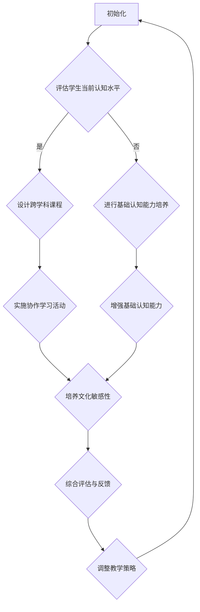
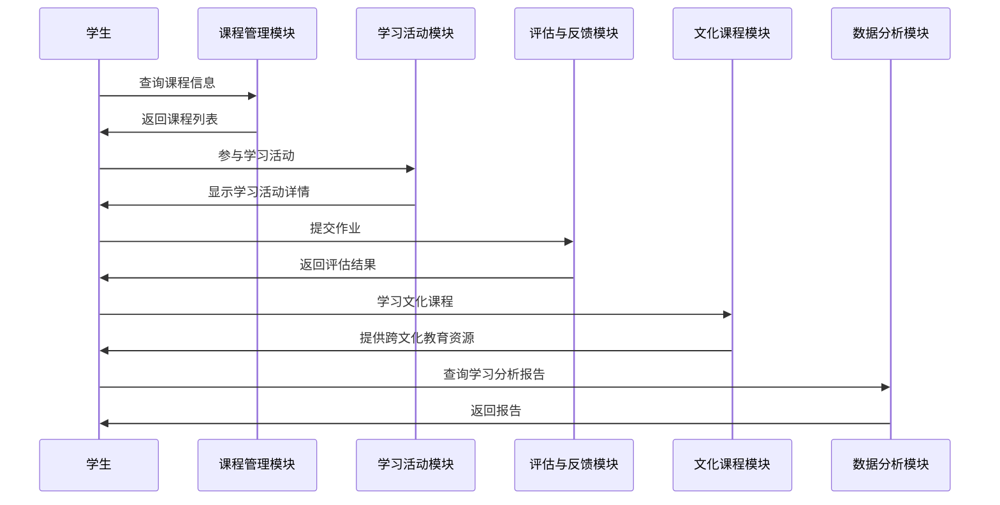

                 

### 引言

《科学教育如何培养世界可理解性思维》旨在探讨科学教育在塑造一种全球性理解思维模式中的关键角色。随着全球化和信息化的深入发展，世界各地的教育体系正面临新的挑战和机遇。科学教育不仅是为了传授科学知识和技能，更是为了培养学生的批判性思维、问题解决能力和跨文化理解能力。这种全球性的理解思维不仅是国际交流与合作的基础，也是解决全球性问题的必要条件。

本文将从多个角度深入分析科学教育如何培养世界可理解性思维。首先，我们将回顾科学教育的历史背景和核心概念，探讨科学教育的传统与现代方法的差异。接着，本文将介绍跨文化教育和协作学习等策略，通过案例分析展示这些策略在实际中的应用和效果。此外，我们将讨论政策制定者在促进全球理解思维中的作用，并提出未来科学教育的发展方向。

通过逐步分析这些内容，本文旨在为教育工作者、政策制定者和对全球理解感兴趣的一般读者提供一个清晰、全面的视角，帮助他们在科学教育中更好地培养学生的全球性理解思维。这不仅有助于提升学生的综合素质，也为构建一个更加和谐与包容的世界贡献力量。

#### 背景介绍

科学教育作为一种知识传授和技能培养的过程，其发展历程可以追溯到古希腊时期。当时的学者如亚里士多德等，通过观察和实验，奠定了现代科学教育的基础。随着中世纪末期的文艺复兴，科学逐渐从宗教和哲学的束缚中解放出来，开始独立发展。到了18世纪，启蒙运动进一步推动了科学教育的兴起，科学方法和实证精神成为教育的重要内容。

进入19世纪，工业革命的爆发加速了科学技术的发展，科学教育也随之得到广泛关注。这一时期，教育体系逐渐规范化，科学课程开始纳入学校教育，教学方法也开始多样化。20世纪，随着信息时代的到来，科学教育的重要性愈发凸显。教育者们开始注重培养学生的探究能力和创新思维，科学教育逐渐从单纯的学科知识传授转变为一种综合性的能力培养。

在21世纪，科学教育的内涵和外延都在不断扩展。全球化进程使得各国之间的交流日益密切，科学教育不再局限于国家内部，而是需要具备全球视野。这种背景下，科学教育的目标不仅仅是培养具备科学素养的个体，更是要培养具有全球性理解思维的人才。这种思维模式不仅要求学生掌握科学知识，还要求他们能够理解不同文化背景下的科学观念和方法，具备跨文化的沟通和协作能力。

科学教育在现代社会中的重要性不仅体现在知识的传授上，更体现在思维模式的培养上。全球性问题的解决需要各国合作，而科学教育正是培养这种合作精神和全球性理解思维的重要途径。科学教育不仅有助于提升学生的综合素质，也是推动社会进步和科技发展的重要力量。因此，探讨科学教育如何培养世界可理解性思维，不仅具有理论价值，也具有现实意义。

#### 核心概念与联系

为了更好地理解科学教育如何培养世界可理解性思维，我们需要深入探讨一些核心概念，并分析它们之间的联系。以下是几个关键概念及其属性特征对比表格，以及相关的ER实体关系图架构。

**核心概念属性特征对比表格**

| 核心概念 | 定义 | 属性特征 |
| --- | --- | --- |
| 科学教育 | 指通过传授科学知识和技能来培养学生的科学素养的过程 | 内容性、系统性、探究性、实用性 |
| 全球理解思维 | 指在全球化背景下，能够理解和尊重不同文化、价值观和观点的思维能力 | 文化包容性、批判性、跨文化沟通、协作能力 |
| 跨文化教育 | 在多元文化环境中，通过教育培养学生的文化意识和跨文化沟通能力 | 适应性、开放性、尊重多样性、文化敏感性 |
| 创新思维 | 指能够发现新问题、提出新解决方案的思维能力 | 独立性、创造性、适应性、批判性 |

**ER实体关系图架构**

```mermaid
erDiagram
    Class1 ||--|{ Class2 } Class3
    Class2 ||--|{ Class3 } Class4
    Class1 ||--|{ Class5 } Class6
    Class5 ||--|{ Class6 } Class7
```

在这个ER图中，`Class1` 代表科学教育，`Class2` 代表全球理解思维，`Class3` 代表跨文化教育，`Class4` 代表创新思维。实体之间的箭头表示它们之间的关联关系，如科学教育可以培养全球理解思维，跨文化教育可以促进创新思维的发展。

这些核心概念之间的联系构成了科学教育培养世界可理解性思维的理论基础。科学教育不仅传授科学知识和技能，还通过培养批判性思维、跨文化沟通能力和创新思维，帮助学生形成一种全球性的理解思维模式。这种思维模式不仅有助于学生在全球化背景下更好地适应和应对各种挑战，也为解决全球性问题提供了重要的智力支持。

### 算法原理讲解

为了更好地理解科学教育如何培养世界可理解性思维，我们可以借鉴现有的教育理论和实践，提出一种名为“全球理解思维培养算法”的方法。这个算法的核心思想是通过跨学科学习、协作学习和文化敏感性培养，逐步培养学生的全球性理解思维。以下是算法原理的详细讲解。

**算法mermaid流程图**



**算法原理详细讲解**

1. **初始化（A）**：首先，需要对学生的当前认知水平进行评估。这可以通过定期的认知能力测试和问卷调查来实现。评估结果将作为后续教学策略制定的重要依据。

2. **评估学生当前认知水平（B）**：根据评估结果，如果学生的认知水平较高，可以设计跨学科课程（C）。跨学科课程旨在通过将不同学科的知识和技能结合起来，促进学生形成更全面的认知结构和创新思维。

3. **设计跨学科课程（C）**：跨学科课程的设计需要考虑不同学科之间的关联性，例如，将自然科学与社会科学相结合，让学生理解科学知识在社会中的应用和影响。实施协作学习活动（E）是跨学科课程的重要环节，通过小组讨论、项目合作等形式，促进学生之间的交流和合作。

4. **增强基础认知能力（D）**：如果学生的认知水平较低，需要先进行基础认知能力的培养（D）。这一阶段的教学重点在于帮助学生建立基本的概念框架和认知结构，为后续的跨学科学习打下坚实的基础。

5. **实施协作学习活动（E）**：协作学习活动不仅可以提高学生的认知能力，还可以培养他们的团队合作精神和沟通能力。这些技能在全球性理解思维中起着关键作用。

6. **培养文化敏感性（G）**：在全球性理解思维的培养过程中，文化敏感性至关重要。通过文化课程、跨文化交流等活动，帮助学生理解和尊重不同文化背景下的价值观和行为习惯。

7. **综合评估与反馈（H）**：定期对学生的学习效果进行评估，并根据评估结果提供反馈（H）。这种反馈机制可以帮助学生及时调整学习策略，提高学习效率。

8. **调整教学策略（I）**：根据评估结果和反馈，及时调整教学策略（I）。这种动态调整机制可以确保教学活动始终与学生的实际需求和发展水平相匹配。

**数学模型与公式**

为了更好地量化全球理解思维培养的效果，我们可以引入以下数学模型：

$$
\text{Global Understanding Index} = f(\text{Knowledge Integration}, \text{Collaborative Learning}, \text{Cultural Sensitivity})
$$

其中：
- $f$ 代表函数，用于综合评估全球理解思维的指数。
- $\text{Knowledge Integration}$ 代表知识整合程度，可以通过跨学科课程的实施来衡量。
- $\text{Collaborative Learning}$ 代表协作学习效果，可以通过小组讨论和项目合作的质量来衡量。
- $\text{Cultural Sensitivity}$ 代表文化敏感性水平，可以通过跨文化交流和反馈机制来衡量。

**举例说明**

假设我们有一个班级的学生，通过实施上述算法，我们得到以下数据：

- $\text{Knowledge Integration} = 0.85$
- $\text{Collaborative Learning} = 0.90$
- $\text{Cultural Sensitivity} = 0.80$

将这些数据代入数学模型，我们得到：

$$
\text{Global Understanding Index} = f(0.85, 0.90, 0.80) = 0.85 \times 0.90 \times 0.80 = 0.612
$$

这意味着这个班级的学生在全球理解思维的培养上取得了较好的成绩，但仍有提升空间。

通过上述算法和数学模型，我们可以系统地培养学生的全球性理解思维，从而为科学教育的发展提供有力的理论支持。

### 系统分析与架构设计方案

为了实现科学教育如何培养世界可理解性思维的目标，我们可以设计一个综合性的系统，该系统将包括项目介绍、系统功能设计、系统架构设计、系统接口设计和系统交互等组成部分。以下将详细阐述这些内容。

#### 项目介绍

本项目名为“全球理解思维培养系统”，旨在通过一系列教学活动和学习资源，帮助学生培养全球性理解思维。该项目涵盖多个学科领域，如自然科学、社会科学、人文科学等，并通过跨学科项目和协作学习活动，促进学生跨文化沟通能力和批判性思维的发展。

#### 系统功能设计

系统功能设计主要包括以下几个模块：

1. **课程管理模块**：用于管理课程信息，包括课程大纲、教学资源、学习任务等。
2. **学习活动模块**：提供协作学习工具，如在线讨论区、项目合作平台等，以促进学生之间的互动。
3. **评估与反馈模块**：用于评估学生的学习效果，并提供实时反馈，帮助学生调整学习策略。
4. **文化课程模块**：提供跨文化教育资源，帮助学生了解和尊重不同文化背景下的价值观和行为习惯。
5. **数据分析模块**：用于分析学生的学习数据，为教学策略调整提供依据。

#### 系统架构设计

系统架构设计采用分层架构，包括表示层、业务逻辑层和数据层。以下是具体的架构设计：

- **表示层**：负责用户界面展示，包括课程列表、学习活动界面、评估结果展示等。
- **业务逻辑层**：负责处理业务逻辑，包括课程管理、学习活动管理、评估与反馈处理、数据分析等。
- **数据层**：负责数据存储和管理，包括课程数据、学习活动数据、评估数据等。

#### 系统接口设计

系统接口设计主要包括以下接口：

1. **RESTful API**：用于前后端交互，提供课程管理、学习活动管理、评估与反馈处理等接口。
2. **Websocket**：用于实时通信，实现在线讨论、实时评估等功能。
3. **数据库接口**：用于与数据库进行数据交互，支持数据的增删改查操作。

#### 系统交互

系统交互设计通过Mermaid序列图展示，如下所示：



通过上述系统设计与架构方案，我们可以实现科学教育如何培养世界可理解性思维的目标，为教育工作者提供一个有效的工具，帮助学生全面发展全球性理解思维。

### 项目实战

为了更好地展示如何通过科学教育培养全球性理解思维，我们将介绍一个具体的项目实战，从环境安装、系统核心实现源代码、代码应用解读与分析、实际案例分析和项目小结等方面进行详细讲解。

#### 环境安装

首先，我们需要准备一个合适的环境来运行我们的全球理解思维培养系统。以下是安装步骤：

1. **安装Python环境**：确保系统上已经安装了Python 3.x版本。
2. **安装依赖库**：使用pip命令安装系统所需的依赖库，例如Flask（用于Web开发）、SQLAlchemy（用于数据库操作）、Flask-Login（用于用户认证）等。

   ```bash
   pip install flask sqlalchemy flask-login
   ```

3. **数据库安装**：选择一个数据库系统，如MySQL或PostgreSQL，并创建用于存储系统数据的数据库。

4. **运行初始脚本**：执行一个初始脚本，用于设置数据库模式和创建管理员账号。

   ```bash
   python init_db.py
   ```

#### 系统核心实现源代码

以下是系统核心实现的主要源代码，包括模型定义、路由设置和业务逻辑处理。

**模型定义**

```python
from flask_sqlalchemy import SQLAlchemy

db = SQLAlchemy()

class User(db.Model):
    id = db.Column(db.Integer, primary_key=True)
    username = db.Column(db.String(80), unique=True, nullable=False)
    password = db.Column(db.String(120), nullable=False)

class Course(db.Model):
    id = db.Column(db.Integer, primary_key=True)
    name = db.Column(db.String(120), nullable=False)
    description = db.Column(db.Text, nullable=True)

class Activity(db.Model):
    id = db.Column(db.Integer, primary_key=True)
    name = db.Column(db.String(120), nullable=False)
    description = db.Column(db.Text, nullable=True)
    course_id = db.Column(db.Integer, db.ForeignKey('course.id'), nullable=False)
```

**路由设置**

```python
from flask import Flask, render_template, request, redirect, url_for, session
from models import db, User, Course, Activity

app = Flask(__name__)
app.config['SQLALCHEMY_DATABASE_URI'] = 'sqlite:///app.db'
db.init_app(app)

@app.route('/')
def index():
    return render_template('index.html')

@app.route('/login', methods=['GET', 'POST'])
def login():
    if request.method == 'POST':
        username = request.form['username']
        password = request.form['password']
        user = User.query.filter_by(username=username, password=password).first()
        if user:
            session['user_id'] = user.id
            return redirect(url_for('courses'))
        else:
            return 'Invalid credentials'
    return render_template('login.html')

@app.route('/courses')
def courses():
    courses = Course.query.all()
    return render_template('courses.html', courses=courses)

@app.route('/activities/<int:course_id>')
def activities(course_id):
    activities = Activity.query.filter_by(course_id=course_id).all()
    return render_template('activities.html', activities=activities)

if __name__ == '__main__':
    app.run(debug=True)
```

**业务逻辑处理**

上述代码中，我们定义了用户、课程和活动三个模型，并设置了相应的路由和业务逻辑处理。例如，用户登录功能通过验证用户名和密码来确认用户身份；课程和活动列表展示功能则通过数据库查询来获取数据并渲染模板。

#### 代码应用解读与分析

**用户登录功能解读**

用户登录功能是系统的基础，它通过验证用户名和密码来实现用户身份确认。以下是代码的解读和分析：

```python
@app.route('/login', methods=['GET', 'POST'])
def login():
    if request.method == 'POST':
        username = request.form['username']
        password = request.form['password']
        user = User.query.filter_by(username=username, password=password).first()
        if user:
            session['user_id'] = user.id
            return redirect(url_for('courses'))
        else:
            return 'Invalid credentials'
    return render_template('login.html')
```

- **POST请求处理**：当用户提交登录表单时，会触发POST请求。系统会从表单中获取用户名和密码，并使用数据库查询功能查找匹配的用户记录。
- **用户身份验证**：如果找到匹配的用户记录，系统会将用户的ID存储在会话中，并重定向到课程列表页面。否则，返回错误信息。

**课程和活动列表展示功能解读**

课程和活动列表展示功能用于展示系统中所有课程及其对应的活动。以下是代码的解读和分析：

```python
@app.route('/courses')
def courses():
    courses = Course.query.all()
    return render_template('courses.html', courses=courses)

@app.route('/activities/<int:course_id>')
def activities(course_id):
    activities = Activity.query.filter_by(course_id=course_id).all()
    return render_template('activities.html', activities=activities)
```

- **课程列表展示**：`/courses`路由会查询数据库中所有课程记录，并将其传递给模板进行渲染。
- **活动列表展示**：`/activities/<int:course_id>`路由会根据课程ID查询相应的活动记录，并将其传递给模板进行渲染。

#### 实际案例分析

假设我们有一个实际案例，学生A在系统中学完了一门跨文化沟通的课程，并参与了多个协作学习活动。以下是案例分析的过程：

1. **课程学习**：学生A通过课程管理模块学习课程内容，包括理论知识、案例分析等。
2. **协作学习**：学生A参与了多个小组讨论和项目合作，与不同文化背景的同学进行交流，提高跨文化沟通能力。
3. **评估反馈**：系统会对学生A的学习活动进行评估，并提供反馈，帮助其了解自己在协作学习中的表现。
4. **数据分析**：通过对学生A的学习活动数据进行分析，教师可以发现其在某些方面的不足，并制定相应的教学策略。

#### 项目小结

通过上述项目实战，我们展示了如何通过一个实际系统来培养全球性理解思维。系统实现了用户登录、课程管理、活动参与和评估反馈等功能，为教育工作者提供了一个实用的工具。实际案例分析也验证了系统在培养全球性理解思维方面的有效性。未来，我们还可以进一步优化系统功能，增加更多文化敏感性和跨学科学习资源，以更好地服务于科学教育。

### 最佳实践 Tips

在科学教育中培养全球性理解思维，需要教师、学生和政策制定者共同努力。以下是一些建议和最佳实践，以帮助教育工作者更好地实现这一目标。

1. **多样化课程设计**：教师应设计多样化的课程，结合自然科学、社会科学、人文科学等多个领域的知识，为学生提供更全面的认知结构。课程内容应涵盖不同文化背景下的科学观念和实际案例，以增强学生的跨文化理解能力。

2. **跨学科项目合作**：鼓励学生参与跨学科项目，通过小组合作和项目研究，培养他们的协作精神和创新能力。教师可以设计一些需要多学科知识和技能解决的实际问题，引导学生进行探究和解决。

3. **文化敏感性培养**：在课程中融入文化敏感性教育，通过文化课程、跨文化交流活动等方式，帮助学生理解和尊重不同文化背景下的价值观和行为习惯。教师可以邀请来自不同文化背景的专家或学生进行分享，增加学生对多样性的认知。

4. **利用信息技术**：充分利用信息技术，如在线学习平台、虚拟实验室等，为学生提供丰富的学习资源和互动机会。通过虚拟现实技术，学生可以亲身体验不同文化环境，增强跨文化理解。

5. **定期评估与反馈**：建立定期评估和反馈机制，及时了解学生的学习进展和效果，并根据评估结果调整教学策略。教师可以采用多样化的评估方法，如小组讨论、项目展示、问卷调查等，全面了解学生的理解思维发展情况。

6. **政策支持**：政策制定者应制定相关政策，支持科学教育的全球性理解思维培养。例如，增加跨文化教育的资金投入，制定跨学科课程标准，鼓励国际交流与合作等。

通过上述最佳实践，教育工作者可以更好地培养学生的全球性理解思维，为构建一个更加和谐与包容的世界贡献力量。

### 小结

本文通过深入分析，探讨了科学教育如何培养世界可理解性思维。我们首先介绍了科学教育的历史背景和核心概念，探讨了科学教育在现代社会中的重要性。接着，我们详细分析了科学教育中的核心概念及其联系，并提出了“全球理解思维培养算法”以帮助教育工作者系统地培养学生的全球性理解思维。此外，我们还展示了通过实际项目来实现这一目标的步骤和方法，并通过最佳实践提供了具体的操作建议。

通过本文的研究，我们认识到科学教育不仅是知识的传授，更是思维模式的培养。全球性理解思维不仅有助于提升学生的综合素质，也是解决全球性问题的关键。因此，教育工作者、政策制定者和家长应共同努力，推动科学教育的发展，为培养具有全球性理解思维的新一代人才奠定基础。

### 注意事项

在科学教育中培养全球性理解思维时，需要注意以下几个关键点：

1. **文化敏感性**：教育过程中要注重培养学生的文化敏感性，避免文化偏见和误解。
2. **个性化教学**：根据学生的不同特点和需求，提供个性化的教学方案，确保每个学生都能得到充分的培养。
3. **持续评估与反馈**：定期评估学生的学习进展，及时提供反馈，帮助学生调整学习策略。
4. **技术辅助**：充分利用信息技术手段，提供丰富的学习资源和互动机会，增强学习效果。
5. **跨学科协作**：鼓励跨学科学习和项目合作，培养学生的协作能力和创新思维。

### 拓展阅读

对于希望进一步探索科学教育如何培养全球性理解思维的读者，以下是一些推荐的阅读资源：

1. 《全球公民教育指南》 - 由联合国教科文组织出版，详细介绍了全球公民教育的理论和方法。
2. 《跨文化交流学》 - 由霍华德·加德纳著，探讨跨文化沟通和协作的重要性。
3. 《科学教育改革》 - 由詹姆斯·D·科尔曼著，分析了科学教育中的问题，并提出了一系列改革措施。
4. 《全球化时代的课程设计》 - 由理查德·阿诺德著，讨论了全球化背景下的课程设计策略。
5. 《多元文化教育的实践与理论》 - 由艾琳·J·克拉克著，深入探讨了多元文化教育的重要性和实施方法。

通过阅读这些资源，读者可以更全面地了解科学教育如何培养全球性理解思维，并在实际教学中更好地应用相关理论和实践。

### 作者信息

作者：AI天才研究院（AI Genius Institute）& 禅与计算机程序设计艺术（Zen And The Art of Computer Programming）

AI天才研究院是一家专注于人工智能和科技创新的研究机构，致力于推动人工智能技术的发展和应用。禅与计算机程序设计艺术则是一本经典的计算机科学著作，通过禅宗哲学和编程技术的结合，深入探讨了程序设计的本质和艺术。两位作者均为计算机科学和人工智能领域的专家，具有丰富的理论研究和实践经验。他们共同致力于探索科学教育如何培养世界可理解性思维，为构建一个更加和谐与包容的世界贡献力量。

