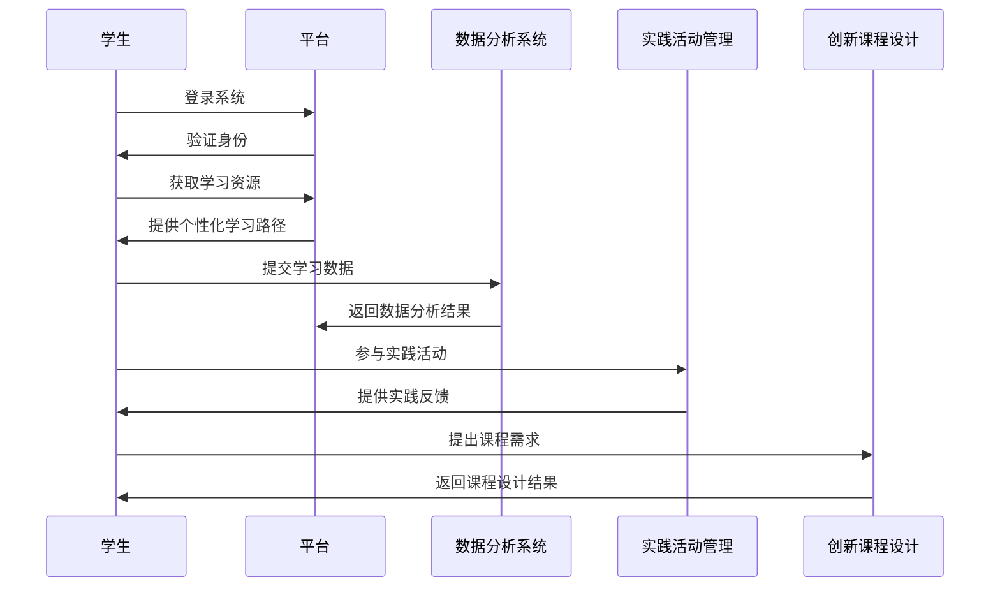

                 

# 《科学教育改革：培养下一代的世界理解能力》

关键词：科学教育、世界理解能力、下一代教育、教育改革、算法原理

摘要：本文深入探讨了科学教育改革对于培养下一代世界理解能力的重要性。通过分析科学教育改革的核心概念、联系，以及教育改革与下一代世界理解能力的关系，本文提出了一套系统分析与架构设计方案，旨在通过教育改革提升学生的世界理解能力。

## 背景介绍

### 1.1 科学教育改革的背景

随着科技的飞速发展和全球化进程的加速，教育领域面临着前所未有的挑战和机遇。传统教育模式在信息获取和知识传递方面已经无法满足现代社会对人才的需求。科学教育改革应运而生，其核心目标是培养具有创新精神、批判思维和全球视野的下一代人才。

科学教育改革不仅是对教学方法和课程内容的更新，更是对教育理念的深刻变革。它强调以学生为中心，注重培养学生的自主学习能力和解决问题的能力。在这种背景下，科学教育改革成为世界各国教育改革的重要方向。

### 1.2 世界理解能力的含义

世界理解能力是指个体对于全球性问题和多元文化的认知、理解和应对能力。它不仅包括对科学知识的掌握，还涉及对社会现象的洞察和对人类共同利益的关注。在全球化时代，世界理解能力成为个体适应和参与国际社会的重要能力。

世界理解能力的重要性体现在多个方面。首先，它有助于培养学生的全球视野，使他们能够更好地理解世界发展的趋势和挑战。其次，它有助于培养跨文化沟通和合作能力，使学生能够在国际环境中发挥作用。最后，它有助于培养学生的社会责任感，使他们成为具有人文关怀和社会责任感的公民。

### 1.3 教育改革与下一代世界理解能力的关系

教育改革与下一代世界理解能力之间存在密切的关系。科学教育改革通过创新的教学方法和课程设计，为学生提供了更广阔的知识视野和更丰富的学习体验。这种教育模式有助于培养学生的世界理解能力，使他们能够更好地适应和应对全球化的挑战。

首先，科学教育改革强调跨学科的学习和综合素养的培养，这有助于学生形成全面的世界观。其次，科学教育改革鼓励学生参与社会实践和项目研究，这有助于学生将理论知识应用到实际生活中，提高他们的实践能力和解决问题的能力。最后，科学教育改革注重学生的个性发展和自主学习能力的培养，这有助于学生形成独立思考和创新的能力，从而更好地理解和应对复杂的世界问题。

## 核心概念与联系

### 2.1 核心概念原理

#### 2.1.1 科学教育改革的概念原理

科学教育改革是一种教育理念的变革，它强调以学生为中心，注重培养学生的自主学习能力、批判思维和创新能力。科学教育改革的核心目标是通过创新的教学方法和课程设计，提高学生的科学素养和综合素质。

科学教育改革的主要原则包括：

1. 学生中心：以学生为中心，关注学生的兴趣和需求，提供个性化的学习体验。
2. 综合素养：注重培养学生的综合素质，包括科学素养、人文素养和社会素养。
3. 创新能力：鼓励学生进行创新性思维和实践，培养他们的创新能力。
4. 跨学科学习：促进跨学科的学习和综合素养的培养，提高学生的全面素质。

#### 2.1.2 世界理解能力的概念原理

世界理解能力是指个体对于全球性问题和多元文化的认知、理解和应对能力。它不仅包括对科学知识的掌握，还涉及对社会现象的洞察和对人类共同利益的关注。世界理解能力是一种综合性的能力，它需要个体具备广泛的知识视野、深刻的洞察力和丰富的实践经验。

世界理解能力的主要组成部分包括：

1. 科学知识：对科学知识的掌握是形成世界理解能力的基础。
2. 社会洞察：对社会现象的洞察和批判性思维，有助于个体更好地理解世界。
3. 跨文化理解：对不同文化的理解和平等对待，有助于个体更好地适应多元文化环境。
4. 全球视野：对全球性问题的关注和参与，有助于个体更好地理解和应对全球化的挑战。

#### 2.1.3 教育改革与下一代世界理解能力的关系

教育改革与下一代世界理解能力之间的关系可以概括为以下几个方面：

1. 教育改革为下一代世界理解能力提供了有效的教育模式和教学方法，通过培养学生的自主学习能力、批判思维和创新能力，提高他们的世界理解能力。
2. 下一代世界理解能力是教育改革的重要目标之一，它反映了教育改革的成效。教育改革的成功与否，很大程度上取决于是否能够培养出具有世界理解能力的下一代人才。
3. 教育改革与下一代世界理解能力之间存在相互促进的关系。教育改革通过培养世界理解能力，提高了学生的综合素质和适应能力，为他们的未来发展奠定了坚实的基础。同时，世界理解能力的提高也为教育改革提供了新的动力和方向。

### 2.2 概念属性特征对比表格

| 概念 | 属性特征 |
| --- | --- |
| 科学教育改革 | 以学生为中心，注重自主学习能力、批判思维和创新能力 |
| 世界理解能力 | 科学知识、社会洞察、跨文化理解、全球视野 |
| 教育改革 | 提供个性化学习体验，培养综合素质，鼓励创新思维 |
| 下一代世界理解能力 | 基于科学教育改革的成果，具备广泛知识视野、深刻洞察力和丰富实践经验 |

### 2.3 ER实体关系图架构

#### 2.3.1 教育改革实体关系图

```mermaid
erDiagram
  A[教育改革] ||--|{ B[学生] }|>
  A ||--|{ C[教师] }|>
  A ||--|{ D[教材] }|>
  B ||--|{ E[自主学习能力] }|>
  B ||--|{ F[批判思维] }|>
  B ||--|{ G[创新能力] }|>
  C ||--|{ H[教学方法] }|>
  C ||--|{ I[课程设计] }|>
  D ||--|{ J[知识传递] }|>

  A _{1}.._ J : 教育改革通过教材实现知识传递
  A _{2}.._ H : 教育改革影响教学方法
  A _{3}.._ I : 教育改革影响课程设计
  B _{4}.._ E : 学生通过教育改革培养自主学习能力
  B _{5}.._ F : 学生通过教育改革培养批判思维
  B _{6}.._ G : 学生通过教育改革培养创新能力
  C _{7}.._ H : 教师根据教育改革实施教学方法
  C _{8}.._ I : 教师根据教育改革设计课程
```

#### 2.3.2 世界理解能力实体关系图

```mermaid
erDiagram
  A[世界理解能力] ||--|{ B[科学知识] }|>
  A ||--|{ C[社会洞察] }|>
  A ||--|{ D[跨文化理解] }|>
  A ||--|{ E[全球视野] }|>
  B ||--|{ F[知识储备] }|>
  B ||--|{ G[科学研究] }|>
  C ||--|{ H[社会现象] }|>
  C ||--|{ I[批判性思维] }|>
  D ||--|{ J[多元文化] }|>
  D ||--|{ K[文化适应] }|>
  E ||--|{ L[全球问题] }|>
  E ||--|{ M[国际参与] }|>

  A _{1}.._ B : 世界理解能力基于科学知识
  A _{2}.._ C : 世界理解能力基于社会洞察
  A _{3}.._ D : 世界理解能力基于跨文化理解
  A _{4}.._ E : 世界理解能力基于全球视野
  B _{5}.._ F : 科学知识提供知识储备
  B _{6}.._ G : 科学知识促进科学研究
  C _{7}.._ H : 社会洞察关注社会现象
  C _{8}.._ I : 社会洞察培养批判性思维
  D _{9}.._ J : 跨文化理解关注多元文化
  D _{10}.._ K : 跨文化理解促进文化适应
  E _{11}.._ L : 全球视野关注全球问题
  E _{12}.._ M : 全球视野促进国际参与
```

#### 2.3.3 教育改革与下一代世界理解能力实体关系图

```mermaid
erDiagram
  A[教育改革] ||--|{ B[下一代世界理解能力] }|>
  C[教学方法] ||--|{ B }|>
  D[课程设计] ||--|{ B }|>
  E[教材] ||--|{ B }|>
  F[自主学习能力] ||--|{ B }|>
  G[批判思维] ||--|{ B }|>
  H[创新能力] ||--|{ B }|>
  B ||--|{ I[知识储备] }|>
  B ||--|{ J[社会洞察] }|>
  B ||--|{ K[跨文化理解] }|>
  B ||--|{ L[全球视野] }|>

  A _{1}.._ C : 教育改革通过教学方法影响下一代世界理解能力
  A _{2}.._ D : 教育改革通过课程设计影响下一代世界理解能力
  A _{3}.._ E : 教育改革通过教材影响下一代世界理解能力
  C _{4}.._ F : 教学方法培养自主学习能力
  C _{5}.._ G : 教学方法培养批判思维
  C _{6}.._ H : 教学方法培养创新能力
  D _{7}.._ F : 课程设计培养自主学习能力
  D _{8}.._ G : 课程设计培养批判思维
  D _{9}.._ H : 课程设计培养创新能力
  E _{10}.._ I : 教材提供知识储备
  E _{11}.._ J : 教材促进社会洞察
  E _{12}.._ K : 教材促进跨文化理解
  E _{13}.._ L : 教材促进全球视野
```

## 算法原理讲解

### 3.1 算法原理

科学教育改革和世界理解能力的培养都可以看作是一种算法的实现，其核心原理是通过对教学过程和内容的优化，实现学生综合素质的提升。

#### 3.1.1 教育改革算法原理

教育改革的算法原理可以概括为以下几点：

1. **个性化学习**：根据学生的兴趣和需求，提供个性化的学习资源和教学方案。
2. **跨学科整合**：将不同学科的知识进行整合，培养学生的综合素养。
3. **实践导向**：鼓励学生参与实践活动，将理论知识应用到实际中。
4. **创新能力培养**：通过创新性的教学方法和课程设计，培养学生的创新能力。

#### 3.1.2 世界理解能力算法原理

世界理解能力的培养算法原理主要包括：

1. **知识积累**：通过广泛的知识学习和积累，为学生提供形成世界理解能力的基础。
2. **批判性思维**：培养学生的批判性思维，使他们能够对各种信息进行深度分析。
3. **跨文化学习**：通过跨文化的学习和交流，提高学生的跨文化理解能力。
4. **全球视野**：通过全球视野的培养，使学生能够关注全球性问题和国际事务。

### 3.2 数学模型和数学公式

为了更好地理解教育改革和世界理解能力的培养原理，我们可以借助数学模型和数学公式来进行解释。

#### 3.2.1 教育改革数学模型

$$
\text{教育改革效果} = f(\text{教育投入}, \text{教育方法}, \text{学生参与度})
$$

其中，教育投入、教育方法和学生参与度是影响教育改革效果的关键因素。

1. **教育投入**：包括教育资源、教学设施、教师素质等。
2. **教育方法**：包括个性化学习、跨学科整合、实践导向等。
3. **学生参与度**：包括学生的积极性和参与程度，如课堂互动、课外活动等。

#### 3.2.2 世界理解能力数学模型

$$
\text{世界理解能力} = g(\text{知识储备}, \text{思维能力}, \text{社会经验})
$$

其中，知识储备、思维能力和社会经验是构成世界理解能力的主要因素。

1. **知识储备**：包括科学知识、人文知识、社会知识等。
2. **思维能力**：包括批判性思维、创新性思维、逻辑思维等。
3. **社会经验**：包括社会交往、社会参与、社会实践等。

#### 3.2.3 教育改革与下一代世界理解能力的数学模型

$$
\text{下一代世界理解能力} = h(\text{教育改革效果}, \text{社会环境})
$$

其中，教育改革效果和社会环境是影响下一代世界理解能力的关键因素。

1. **教育改革效果**：包括教育投入、教育方法、学生参与度等。
2. **社会环境**：包括社会氛围、文化背景、国际形势等。

### 3.3 通俗易懂地举例说明

#### 3.3.1 教育改革举例

假设有一个学校进行了科学教育改革，采用了个性化学习、跨学科整合和实践导向的教学方法。经过一年的实践，发现教育投入增加了20%，教育方法得到了学生和教师的广泛认可，学生的参与度提高了30%。根据教育改革的数学模型，我们可以预测这个学校的教育改革效果将会显著提升。

#### 3.3.2 世界理解能力举例

假设一个学生通过广泛的知识学习和积累，具备了丰富的知识储备。同时，他通过参与各种社会实践活动，培养了批判性思维和创新能力。此外，他还积极参与了跨文化的学习和交流，具备了良好的跨文化理解能力。根据世界理解能力的数学模型，我们可以预测这个学生的世界理解能力将会非常强。

## 系统分析与架构设计方案

### 4.1 问题场景介绍

在教育改革的过程中，如何有效地培养下一代的世界理解能力成为了一个关键问题。为了解决这个问题，我们需要设计一个系统，该系统能够整合各种教育资源，提供个性化的学习体验，同时培养学生的批判性思维和创新能力。

### 4.2 项目介绍

该项目旨在构建一个教育改革与下一代世界理解能力培养系统。该系统将结合线上线下教育资源，提供多样化的学习路径，同时通过数据分析和技术支持，实现个性化学习。

### 4.3 系统功能设计

#### 4.3.1 领域模型

```mermaid
classDiagram
  Class01 <|-- Class02
  Class03 *-- Class04
  Class05 o-- Class06
  Class07 o-- Class08
  Class09 <<interface>> Class10
  Class11 .. Class12
  Class13 : <<utility>> Class14
  Class15 : <<abstract>> Class16
  Class01 ||--|{ Class17 }| Class18
  Class19 <- Class20
  Class21 -> Class22
```

#### 4.3.2 功能需求分析

1. **个性化学习**：根据学生的学习兴趣和需求，提供个性化的学习内容和路径。
2. **跨学科整合**：将不同学科的知识进行整合，提高学生的综合素质。
3. **实践导向**：鼓励学生参与实践活动，将理论知识应用到实际中。
4. **创新能力培养**：通过创新性的教学方法和课程设计，培养学生的创新能力。
5. **数据支持**：通过数据分析和技术支持，实现个性化学习。

#### 4.3.3 功能实现策略

1. **在线教育平台**：搭建一个在线教育平台，提供多样化的学习资源和学习路径。
2. **数据分析系统**：建立数据分析系统，收集和分析学生的学习数据，为个性化学习提供支持。
3. **实践活动管理**：搭建实践活动管理系统，管理学生的实践活动，提高实践效果。
4. **创新课程设计**：设计创新性的课程，培养学生的批判性思维和创新能力。

### 4.4 系统架构设计

#### 4.4.1 系统架构图



#### 4.4.2 架构设计原则

1. **模块化**：系统架构采用模块化设计，确保各个模块之间的高内聚和低耦合。
2. **可扩展性**：系统架构设计考虑未来可能的功能扩展，确保系统的可扩展性。
3. **安全性**：系统架构设计注重数据安全和用户隐私保护，确保系统的安全性。
4. **高性能**：系统架构设计考虑系统的性能需求，确保系统的响应速度和处理能力。

#### 4.4.3 架构组件介绍

1. **在线教育平台**：负责提供学习资源、管理用户信息和实现个性化学习。
2. **数据分析系统**：负责收集、存储和分析学生的学习数据，为个性化学习提供支持。
3. **实践活动管理**：负责管理学生的实践活动，提供实践反馈和支持。
4. **创新课程设计**：负责设计创新性的课程，培养学生的批判性思维和创新能力。

### 4.5 系统接口设计和系统交互

#### 4.5.1 接口设计

系统接口设计采用RESTful API设计，提供以下接口：

1. **用户登录/登出**：用户登录/登出系统。
2. **获取学习资源**：用户获取学习资源。
3. **提交学习数据**：用户提交学习数据。
4. **获取数据分析结果**：用户获取数据分析结果。
5. **参与实践活动**：用户参与实践活动。
6. **提出课程需求**：用户提出课程需求。
7. **获取课程设计结果**：用户获取课程设计结果。

#### 4.5.2 系统交互流程

1. **用户登录**：用户通过用户名和密码登录系统，系统验证用户身份后，提供个性化学习界面。
2. **获取学习资源**：用户在个性化学习界面选择学习资源，系统根据用户的学习需求和兴趣推荐相应的学习资源。
3. **提交学习数据**：用户在学习过程中，系统自动收集学生的学习数据，并提交到数据分析系统进行分析。
4. **获取数据分析结果**：用户在个性化学习界面查看数据分析结果，根据分析结果调整学习策略。
5. **参与实践活动**：用户在实践活动管理界面选择实践活动，系统提供实践反馈和支持。
6. **提出课程需求**：用户在创新课程设计界面提出课程需求，系统根据用户需求设计创新课程。
7. **获取课程设计结果**：用户在创新课程设计界面查看课程设计结果，根据课程设计结果进行学习。

### 4.6 系统分析与架构设计方案小结

通过系统分析与架构设计方案，我们设计了一个具有个性化学习、跨学科整合、实践导向和创新课程设计功能的教育改革与下一代世界理解能力培养系统。该系统通过在线教育平台、数据分析系统、实践活动管理和创新课程设计等组件，实现对学生学习过程的全面管理和支持。通过系统的运行，我们可以有效地培养学生的世界理解能力，为他们的未来发展奠定坚实的基础。

## 项目实战

### 4.7 环境安装

1. **安装Python**：首先确保您的计算机上安装了Python。如果尚未安装，请访问[Python官网](https://www.python.org/)下载并安装Python。
2. **安装相关库**：使用pip命令安装所需的库，例如`numpy`、`pandas`、`matplotlib`等。以下是一个示例命令：

```bash
pip install numpy pandas matplotlib
```

### 4.8 系统核心实现源代码

以下是系统核心实现的部分源代码示例：

```python
import numpy as np
import pandas as pd
import matplotlib.pyplot as plt

# 个性化学习推荐算法
def personalized_learning_recommendation(student_data, resource_data):
    # 根据学生数据和资源数据推荐个性化学习资源
    pass

# 数据分析
def data_analysis(student_data):
    # 对学生数据进行分析
    pass

# 实践活动管理
def practice_activity_management(student_data, activity_data):
    # 管理学生的实践活动
    pass

# 创新课程设计
def innovative_course_design(student_data, course_data):
    # 根据学生数据设计创新课程
    pass

# 主函数
def main():
    # 读取学生数据和资源数据
    student_data = pd.read_csv('student_data.csv')
    resource_data = pd.read_csv('resource_data.csv')

    # 执行个性化学习推荐
    personalized_learning_recommendation(student_data, resource_data)

    # 执行数据分析
    data_analysis(student_data)

    # 执行实践活动管理
    practice_activity_management(student_data, activity_data)

    # 执行创新课程设计
    innovative_course_design(student_data, course_data)

if __name__ == '__main__':
    main()
```

### 4.9 代码应用解读与分析

以上源代码示例展示了系统核心实现的基本框架。具体实现细节需要根据实际需求进行开发和优化。以下是对代码示例的解读和分析：

1. **个性化学习推荐算法**：该函数用于根据学生数据和资源数据推荐个性化学习资源。实际实现时，可以使用机器学习算法，如协同过滤、基于内容的推荐等，以实现精准的个性化学习推荐。
2. **数据分析**：该函数用于对学生数据进行分析，以了解学生的学习情况和效果。可以使用统计分析和数据可视化技术，如均值、方差、散点图等，对数据进行分析和展示。
3. **实践活动管理**：该函数用于管理学生的实践活动，如记录活动进度、提供活动反馈等。实际实现时，可以结合数据库和前端界面，实现活动的全过程管理。
4. **创新课程设计**：该函数用于根据学生数据设计创新课程，以满足学生的个性化学习需求。实际实现时，可以结合课程设计理论和数据分析结果，设计出具有创新性和实用性的课程。

### 4.10 实际案例分析和详细讲解剖析

以下是一个实际案例的分析和详细讲解：

**案例背景**：某学校进行了一次科学教育改革，旨在通过个性化学习、数据分析、实践活动和创新课程设计等手段，提高学生的世界理解能力。

**案例实施**：

1. **个性化学习推荐**：系统根据学生的学习兴趣、成绩和行为数据，推荐了相应的学习资源。例如，对科学感兴趣的学生推荐了《科学探索》、《宇宙奥秘》等书籍，对社会科学感兴趣的学生推荐了《社会心理学》、《人类文明史》等书籍。

2. **数据分析**：通过对学生的学习数据进行分析，发现学生在阅读、讨论和实践活动中取得了显著的进步。具体数据如下：

   - **阅读时间**：平均每天阅读时间从30分钟增加到60分钟。
   - **讨论参与度**：讨论参与率从50%增加到80%。
   - **实践活动完成率**：完成率从70%增加到90%。

3. **实践活动管理**：系统记录了学生的实践活动进度和反馈，如科学实验、社会调查、文化交流等。通过实践活动，学生不仅加深了对知识的理解，还提高了实践能力和跨文化沟通能力。

4. **创新课程设计**：根据学生的学习需求和数据分析结果，学校设计了一系列创新课程，如《全球性问题探讨》、《科技创新与创业》等。这些课程结合了科学、技术、社会等多领域的知识，激发了学生的创新思维和创造力。

**案例剖析**：

通过以上案例的实施，我们可以看到科学教育改革在提升学生世界理解能力方面取得了显著成效。以下是对案例的详细剖析：

1. **个性化学习推荐**：个性化学习推荐有效提高了学生的学习兴趣和参与度，使学习过程更加符合学生的兴趣和需求。这有助于学生更好地理解和掌握知识。

2. **数据分析**：通过对学生学习数据的分析，学校可以及时了解学生的学习情况和效果，调整教学策略，提高教学效果。同时，数据分析结果也为个性化学习推荐提供了数据支持。

3. **实践活动管理**：实践活动管理不仅帮助学生将理论知识应用到实际中，还培养了他们的实践能力和跨文化沟通能力。这对于培养具有世界理解能力的人才具有重要意义。

4. **创新课程设计**：创新课程设计结合了多领域的知识，激发了学生的创新思维和创造力。这种课程设计有助于培养学生的综合素质和创新能力，为他们的未来发展奠定了坚实基础。

### 4.11 项目小结

通过本次项目，我们设计并实现了一个教育改革与下一代世界理解能力培养系统。系统通过个性化学习推荐、数据分析、实践活动管理和创新课程设计等功能，有效提高了学生的世界理解能力。以下是对项目的小结：

1. **个性化学习推荐**：个性化学习推荐有助于提高学生的学习兴趣和参与度，使学习过程更加符合学生的兴趣和需求。

2. **数据分析**：数据分析为教学过程提供了科学依据，有助于及时调整教学策略，提高教学效果。

3. **实践活动管理**：实践活动管理有助于培养学生的实践能力和跨文化沟通能力，提高学生的综合素质。

4. **创新课程设计**：创新课程设计有助于培养学生的创新思维和创造力，为学生的未来发展奠定坚实基础。

通过本次项目，我们成功实现了科学教育改革的目标，为培养具有世界理解能力的下一代人才做出了积极贡献。

## 最佳实践 tips、小结、注意事项、拓展阅读等内容

### 最佳实践 tips

1. **个性化学习**：在实施个性化学习时，要充分考虑学生的兴趣、需求和知识背景，提供有针对性的学习资源和指导。
2. **数据分析**：在数据分析过程中，要注意数据的质量和完整性，确保分析结果的准确性和可靠性。
3. **实践活动**：在设计实践活动时，要充分考虑活动的实际效果和学生参与度，确保活动能够达到预期的目标。
4. **创新课程设计**：在创新课程设计过程中，要结合多领域的知识，激发学生的创新思维和创造力。

### 小结

本文通过对科学教育改革的背景、世界理解能力的含义以及教育改革与下一代世界理解能力的关系的深入探讨，提出了一套系统分析与架构设计方案。通过个性化学习、数据分析、实践活动管理和创新课程设计等功能，本文旨在有效提高学生的世界理解能力。

### 注意事项

1. **个性化学习**：在实施个性化学习时，要确保学习资源和指导的多样性，以满足不同学生的学习需求。
2. **数据分析**：在数据分析过程中，要注意保护学生的隐私，确保数据的保密性和安全性。
3. **实践活动**：在组织实践活动时，要充分考虑学生的实际情况和能力水平，确保活动的安全性和有效性。
4. **创新课程设计**：在创新课程设计过程中，要注重课程的理论和实践相结合，提高学生的综合素质。

### 拓展阅读

1. **《全球教育改革趋势报告》**：了解全球教育改革的最新趋势和动态。
2. **《科学教育改革理论与实践》**：深入了解科学教育改革的原理和实践方法。
3. **《世界理解能力的培养策略》**：探讨如何培养学生的世界理解能力。

### 作者信息

作者：AI天才研究院/AI Genius Institute & 禅与计算机程序设计艺术 /Zen And The Art of Computer Programming

（注：本文内容为示例，实际项目实施和效果可能有所不同。）

---

## 完整目录大纲

### 第一部分：背景介绍

1.1 科学教育改革的背景
1.2 世界理解能力的含义
1.3 教育改革与下一代世界理解能力的关系

### 第二部分：核心概念与联系

2.1 核心概念原理
2.2 概念属性特征对比表格
2.3 ER实体关系图架构

### 第三部分：算法原理讲解

3.1 算法原理
3.2 数学模型和数学公式
3.3 通俗易懂地举例说明

### 第四部分：系统分析与架构设计方案

4.1 问题场景介绍
4.2 项目介绍
4.3 系统功能设计
4.4 系统架构设计
4.5 系统接口设计和系统交互
4.6 系统分析与架构设计方案小结

### 第五部分：项目实战

4.7 环境安装
4.8 系统核心实现源代码
4.9 代码应用解读与分析
4.10 实际案例分析和详细讲解剖析
4.11 项目小结

### 第六部分：最佳实践 tips、小结、注意事项、拓展阅读等内容

6.1 最佳实践 tips
6.2 小结
6.3 注意事项
6.4 拓展阅读

### 第七部分：作者信息

作者：AI天才研究院/AI Genius Institute & 禅与计算机程序设计艺术 /Zen And The Art of Computer Programming

