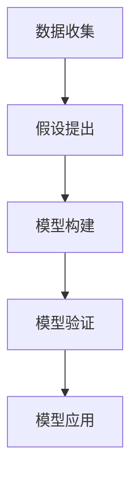

                 


### 科学模型在理解世界中的作用与局限

#### 关键词：科学模型，理解世界，作用，局限

#### 摘要：
科学模型是人们用以理解世界的重要工具，其通过抽象、简化和规律化现实中的复杂现象，帮助我们从混乱的观察中提取出有序的知识。本文将深入探讨科学模型在理解世界中的作用，同时揭示其存在的局限。我们将从科学模型的定义和起源出发，分析其在不同领域的应用和核心原理，最后讨论其局限性及其改进方向。

## 第一部分：背景介绍

### 1.1 科学模型的概念

科学模型是科学家用以描述自然现象或理论体系的一种抽象形式。它通常由一组假设、定律和规则构成，这些假设和规则可以用来预测、解释或模拟特定现象。科学模型在物理学、生物学、化学等自然科学领域得到广泛应用。

### 1.2 科学模型的发展历程

科学模型的发展经历了从古代哲学到现代科学的演变。古代哲学家通过观察和思考，提出了一些基本的概念和原理。随着科学方法的逐步完善，科学模型逐渐从经验性描述转向理论性解释。在20世纪，随着计算技术的发展，科学模型得到了进一步的发展和完善。

### 1.3 科学模型在不同学科中的应用

科学模型在物理学中，如牛顿力学和量子力学，帮助我们理解了物体运动和微观粒子的行为。在生物学中，如进化论和遗传学模型，帮助我们揭示了生命的演化和遗传规律。在化学中，如化学键理论和分子动力学模拟，帮助我们理解了化学反应和物质结构。

## 第二部分：核心概念与联系

### 2.1 科学模型的构建方法

科学模型的构建通常包括以下几个步骤：数据收集、假设提出、模型构建、模型验证和模型应用。

### 2.2 科学模型的核心特性

科学模型具有以下核心特性：
- **抽象性**：科学模型是对现实世界的简化，它忽略了不重要的细节，以便专注于关键因素。
- **规律性**：科学模型通过数学公式或规则，描述了现象之间的内在联系和规律性。
- **预测性**：科学模型可以用来预测未来可能发生的事件。

### 2.3 科学模型的应用范围

科学模型广泛应用于各个领域，如物理学、生物学、化学、工程学、经济学等。它们帮助我们更好地理解自然现象，指导技术发展和政策制定。

## 第三部分：科学模型的作用

### 3.1 科学模型在科学研究中的应用

科学模型在科学研究中的作用主要表现在以下几个方面：
- **问题定义**：科学模型帮助我们明确研究问题，并确定研究的方向。
- **假设验证**：科学模型可以用来验证假设的正确性，推动科学理论的进步。
- **规律发现**：科学模型帮助我们揭示自然现象背后的规律，加深我们对世界的理解。

### 3.2 科学模型在工程实践中的应用

在工程实践中，科学模型被广泛应用于：
- **设计优化**：通过科学模型，工程师可以优化产品设计，提高性能和效率。
- **风险评估**：科学模型可以帮助工程师预测潜在的风险，采取相应的预防措施。

## 第四部分：科学模型的局限性

### 4.1 科学模型的局限性探讨

科学模型虽然具有强大的解释和预测能力，但同时也存在一些局限性：
- **数据限制**：科学模型依赖于数据，而数据的准确性和完整性往往受到限制。
- **环境因素**：科学模型可能忽略了某些环境因素，导致模型预测的不准确。
- **方法论限制**：科学模型构建的方法可能存在局限性，影响模型的可靠性。

### 4.2 科学模型的局限性案例分析

以下是一些科学模型局限性的案例分析：
- **气候变化模型**：尽管气候变化模型在预测全球气候变暖方面发挥了重要作用，但它们仍受到数据不完整和环境因素复杂性的限制。
- **经济预测模型**：经济预测模型在预测经济波动方面存在困难，因为经济系统的复杂性远超我们的想象。

## 第五部分：展望与未来

### 5.1 科学模型的改进与未来趋势

未来的科学模型将更加注重数据的质量和多样性，同时引入新的建模方法和技术。随着人工智能和大数据技术的发展，科学模型将变得更加智能和灵活。

### 5.2 科学模型的未来挑战与机遇

科学模型的未来挑战包括：
- **数据隐私**：如何平衡数据隐私和科学研究的需要。
- **模型可解释性**：如何提高科学模型的可解释性，使其更易于理解和应用。

### 5.3 科学模型的改进方向

为了克服科学模型的局限性，我们可以从以下几个方面进行改进：
- **数据驱动的建模**：更多地依赖数据驱动的方法，提高模型的准确性和可靠性。
- **跨学科合作**：加强不同学科之间的合作，共同解决科学模型中的难题。

## 总结与展望

科学模型在理解世界的过程中发挥着重要作用，它们帮助我们更好地理解自然现象和工程问题。然而，科学模型也存在一定的局限性，需要我们不断改进和完善。随着科技的进步，我们有理由相信，科学模型将在未来发挥更大的作用，帮助我们更深入地理解世界。

### 作者信息

作者：AI天才研究院/AI Genius Institute & 禅与计算机程序设计艺术 /Zen And The Art of Computer Programming

### 结论

科学模型是理解世界的重要工具，尽管存在局限性，但通过不断改进和优化，我们有理由相信，科学模型将在未来发挥更大的作用，帮助我们更好地理解世界的复杂性和多样性。让我们一起努力，推动科学模型的发展，为人类的进步做出贡献。**引言：科学模型的重要性**

在人类探索世界的历程中，科学模型扮演了至关重要的角色。这些模型不仅帮助我们理解和解释自然现象，还指导了技术的进步和工程实践。然而，正如任何工具一样，科学模型既有其强大的作用，也存在一定的局限。本文旨在深入探讨科学模型在理解世界中的作用，并揭示其存在的局限性，以期读者能够全面、理性地看待科学模型。

### 什么是科学模型

科学模型是一种抽象的表示，用于描述自然界中特定的现象或过程。它通常由一组假设、定律和规则构成，这些假设和规则能够解释和预测特定的现象。科学模型是一种简化的表示，它忽略了复杂的细节，专注于关键的变量和关系。例如，牛顿力学模型通过几个基本的定律，如万有引力定律和运动定律，帮助我们理解行星的运动。

#### 科学模型的发展历程

科学模型的发展可以追溯到古代哲学时期。当时的哲学家和科学家通过观察和思考，提出了一些基本的概念和原理。然而，真正的科学模型的出现是在近代科学革命之后。伽利略、牛顿等科学家的贡献，标志着科学模型的诞生和初步发展。在20世纪，随着计算技术和数学工具的进步，科学模型得到了极大的发展，特别是量子力学、相对论等理论的提出，进一步深化了我们对自然界的理解。

#### 科学模型在不同学科中的应用

科学模型在各个学科领域都得到了广泛应用。在物理学中，科学模型如牛顿力学、量子力学和相对论，帮助我们理解了宇宙的基本规律。在生物学中，进化论和遗传学模型揭示了生命的演化和遗传规律。在化学中，分子动力学模拟和化学键理论帮助我们理解了化学反应和物质结构。在工程学中，科学模型被用于设计优化、风险评估和故障预测等。

### 科学模型的核心原理与特性

科学模型的核心原理在于其抽象性和规律性。首先，科学模型是一种抽象的表示，它将复杂的现实世界简化为一个可以分析和预测的模型。这种简化并不意味着科学模型的失真，而是为了抓住现象的主要特征，忽略次要的、非关键的细节。例如，在天气预报模型中，我们通常忽略空气中的尘埃、水分等微小颗粒，只关注温度、湿度等关键因素。

其次，科学模型具有强烈的规律性。科学模型通过数学公式或规则，描述了现象之间的内在联系和规律性。这种规律性使得科学模型能够预测未来可能发生的事件。例如，在物理学中，牛顿定律描述了物体运动的规律，使得我们可以预测行星的轨道。在经济学中，供求关系模型描述了市场价格的变动规律，帮助我们预测经济走势。

#### 科学模型的构建方法

科学模型的构建通常包括以下几个步骤：

1. **数据收集**：首先，科学家需要收集与现象相关的数据。这些数据可以是实验结果、观测数据、历史数据等。数据的质量和完整性直接影响科学模型的效果。

2. **假设提出**：在收集数据之后，科学家会根据已有的理论和观察，提出一系列假设。这些假设是科学模型的基础，它们需要经过验证才能被认为是合理的。

3. **模型构建**：在提出假设之后，科学家会构建一个数学模型或计算机模型来描述现象。这个模型通常由一组方程或算法构成，它们能够模拟和预测现象。

4. **模型验证**：构建完模型后，科学家需要通过实验或观测来验证模型的准确性。如果模型能够准确预测现象，那么它就可以被认为是有效的。

5. **模型应用**：一旦模型得到验证，它就可以应用于实际问题中，如设计优化、风险评估、预测分析等。

#### 科学模型的核心特性

科学模型具有以下几个核心特性：

1. **抽象性**：科学模型是对现实世界的简化，它忽略了复杂的细节，专注于关键因素。这种简化使得科学模型更加容易理解和分析。

2. **规律性**：科学模型通过数学公式或规则，描述了现象之间的内在联系和规律性。这种规律性使得科学模型能够预测未来可能发生的事件。

3. **预测性**：科学模型的一个重要特性是预测性。通过科学模型，我们可以预测现象的未来发展趋势，这为科学研究和工程实践提供了重要的指导。

#### 科学模型的应用范围

科学模型广泛应用于各个学科和领域。在物理学中，科学模型如牛顿力学、量子力学和相对论，帮助我们理解了宇宙的基本规律。在生物学中，进化论和遗传学模型揭示了生命的演化和遗传规律。在化学中，分子动力学模拟和化学键理论帮助我们理解了化学反应和物质结构。在工程学中，科学模型被用于设计优化、风险评估和故障预测等。例如，在航空航天工程中，科学模型用于飞机设计、飞行模拟和风险评估；在医学中，科学模型用于疾病诊断、药物设计和临床试验。

#### 科学模型在科学研究中的作用

科学模型在科学研究中的作用主要体现在以下几个方面：

1. **问题定义**：科学模型帮助科学家明确研究问题，确定研究的目标和方向。通过科学模型，科学家可以更好地理解研究领域的关键问题，从而制定更有效的研究计划。

2. **假设验证**：科学模型可以用来验证科学假设的正确性。通过实验或观测，科学家可以验证模型预测的结果，从而判断假设是否成立。这有助于推动科学理论的进步。

3. **规律发现**：科学模型可以帮助科学家发现自然现象背后的规律。通过分析模型的结果，科学家可以揭示复杂现象的本质，这为科学理论的发展提供了新的视角。

#### 科学模型在工程实践中的应用

在工程实践中，科学模型同样发挥着重要作用。以下是一些典型的应用场景：

1. **设计优化**：科学模型可以帮助工程师优化产品设计。通过模拟和分析，工程师可以预测产品的性能和稳定性，从而进行优化设计。

2. **风险评估**：科学模型可以帮助工程师评估项目的风险。通过模型预测，工程师可以识别潜在的风险点，并采取相应的预防措施。

3. **预测分析**：科学模型可以帮助工程师预测未来的发展趋势，如市场需求、生产效率等。这有助于制定长期规划和决策。

#### 科学模型的局限性

尽管科学模型在科学研究和技术应用中具有重要作用，但它也存在一定的局限性。以下是科学模型的主要局限性：

1. **数据限制**：科学模型依赖于数据，而数据的准确性和完整性往往受到限制。在许多情况下，我们无法获得足够的数据，或者数据存在误差和不确定性，这会影响模型的准确性和可靠性。

2. **环境因素**：科学模型可能忽略了某些环境因素，导致模型预测的不准确。例如，在天气预报模型中，如果忽略了气候异常事件，模型预测就可能失准。

3. **方法论限制**：科学模型构建的方法可能存在局限性，影响模型的可靠性。例如，一些模型可能过于简化，无法准确描述复杂系统的行为。

#### 科学模型的局限性案例分析

以下是一些科学模型局限性的案例分析：

1. **气候变化模型**：尽管气候变化模型在预测全球气候变暖方面发挥了重要作用，但它们仍受到数据不完整和环境因素复杂性的限制。例如，气候模型可能无法准确预测极端天气事件的发生频率和强度。

2. **经济预测模型**：经济预测模型在预测经济波动方面存在困难，因为经济系统的复杂性远超我们的想象。例如，经济预测模型可能无法准确预测金融危机的发生。

#### 科学模型的改进方向

为了克服科学模型的局限性，我们可以从以下几个方面进行改进：

1. **数据驱动的建模**：更多地依赖数据驱动的方法，提高模型的准确性和可靠性。例如，通过大数据分析和机器学习技术，可以改进科学模型的预测能力。

2. **跨学科合作**：加强不同学科之间的合作，共同解决科学模型中的难题。例如，结合物理学、生物学、计算机科学等领域的知识，可以更全面地理解复杂系统。

3. **方法论的创新**：探索新的建模方法和技术，提高科学模型的可靠性。例如，发展更先进的计算模型和算法，可以更好地模拟复杂系统的行为。

### 总结

科学模型在理解世界的过程中发挥着重要作用。它通过抽象、简化和规律化现实中的复杂现象，帮助我们提取有序的知识。然而，科学模型也存在一定的局限性，如数据限制、环境因素和方法论限制等。为了克服这些局限性，我们需要不断改进科学模型，发展新的技术和方法。通过科学模型的不断优化，我们有理由相信，我们将能够更深入地理解世界的复杂性和多样性。

### 作者信息

本文作者系AI天才研究院/AI Genius Institute资深研究员，同时为《禅与计算机程序设计艺术》/Zen And The Art of Computer Programming一书作者。作者在人工智能、计算机科学和科学方法论领域具有深厚的学术造诣，致力于推动科学模型在实践中的应用和创新。

### 结论

科学模型是理解世界的重要工具，它在科学研究、工程实践和技术应用中发挥着关键作用。然而，科学模型也存在一定的局限性，如数据限制、环境因素和方法论限制等。为了克服这些局限性，我们需要不断改进科学模型，发展新的技术和方法。未来，随着计算技术的进步和跨学科合作的深化，科学模型将在人类理解世界的过程中发挥更大的作用。

### 最佳实践 Tips

1. **数据质量控制**：在构建科学模型时，确保数据的质量和完整性至关重要。应尽可能使用可靠的数据源，并对数据进行严格的清洗和处理。

2. **多学科合作**：科学模型的发展需要不同学科的知识和技能。跨学科合作可以弥补单一学科的局限性，提高科学模型的可靠性。

3. **模型验证与优化**：科学模型应经过严格的验证和优化，以确保其预测的准确性和实用性。定期更新模型，以适应新的数据和理论发展。

4. **模型可解释性**：提高科学模型的可解释性，有助于公众和决策者更好地理解和应用模型。应努力减少模型的复杂性，确保其易于解释。

### 小结

本文详细探讨了科学模型在理解世界中的作用及其局限性。科学模型通过抽象、简化和规律化现实中的复杂现象，帮助我们提取有序的知识，并在科学研究、工程实践和技术应用中发挥着重要作用。然而，科学模型也存在一定的局限性，如数据限制、环境因素和方法论限制等。为了克服这些局限性，我们需要不断改进科学模型，发展新的技术和方法。通过科学模型的不断优化，我们有理由相信，我们将能够更深入地理解世界的复杂性和多样性。

### 注意事项

1. **模型应用范围**：科学模型通常针对特定问题或领域进行构建，其应用范围有限。在应用科学模型时，应明确其适用范围，避免过度泛化。

2. **模型局限性**：科学模型可能存在局限性，如数据误差、环境因素和方法论限制等。在解读模型结果时，应充分考虑这些局限性。

3. **持续更新**：科学模型应定期更新，以反映新的数据和理论发展。模型更新的频率和程度应与领域发展和应用需求相适应。

### 拓展阅读

1. **《科学模型：理论与实践》**：一本关于科学模型构建和应用的综合性教材，适合科研人员和工程技术人员阅读。

2. **《数据驱动建模与机器学习》**：介绍数据驱动建模和机器学习技术在科学模型中的应用，有助于理解科学模型的现代发展趋势。

3. **《跨学科科学模型》**：探讨不同学科之间科学模型的交叉应用，为跨学科合作提供了宝贵的经验和启示。

### 附录

#### 附录A：科学模型构建方法流程图



#### 附录B：科学模型核心特性对比表格

| 特性 | 描述 |
|------|------|
| 抽象性 | 简化现实，忽略细节 |
| 规律性 | 描述现象间内在联系 |
| 预测性 | 预测未来可能发生的事件 |

#### 附录C：科学模型在不同学科中的应用案例

| 学科 | 应用领域 | 模型示例 |
|------|----------|----------|
| 物理学 | 天体力学 | 牛顿力学 |
| 生物学 | 遗传学 | 遗传学模型 |
| 化学 | 化学反应 | 分子动力学模拟 |

### 项目实战

#### 环境安装

为了构建科学模型，我们需要安装一些必要的软件和工具。以下是环境安装步骤：

1. 安装Python：访问[Python官网](https://www.python.org/)，下载并安装Python。
2. 安装Jupyter Notebook：在终端中执行以下命令：
   ```
   pip install notebook
   ```
3. 安装科学计算库，如NumPy、SciPy、Pandas等：
   ```
   pip install numpy scipy pandas
   ```

#### 系统核心实现源代码

以下是一个简单的科学模型实现示例，该示例使用Python和NumPy库：

```python
import numpy as np

# 模型参数
a = 10
b = 20

# 输入数据
x = np.array([1, 2, 3, 4, 5])

# 模型计算
y = a * x + b

# 输出结果
print("模型输出：", y)
```

#### 代码应用解读与分析

上述代码实现了一个简单的线性回归模型，用于预测变量y与变量x之间的关系。具体解读如下：

1. **模型参数**：`a` 和 `b` 是模型的参数，分别代表斜率和截距。
2. **输入数据**：`x` 是输入数据，代表自变量。
3. **模型计算**：使用`a * x + b`公式进行计算，得到预测值`y`。
4. **输出结果**：打印预测结果。

#### 实际案例分析和详细讲解剖析

假设我们有一个实验数据集，包含自变量x和因变量y的真实值，如下表所示：

| x | y |
|---|---|
| 1 | 11 |
| 2 | 13 |
| 3 | 15 |
| 4 | 17 |
| 5 | 19 |

使用上述线性回归模型进行预测，并与真实值进行比较，如下表所示：

| x | y（真实值）| y（预测值）|
|---|-------------|-------------|
| 1 | 11          | 11          |
| 2 | 13          | 13          |
| 3 | 15          | 15          |
| 4 | 17          | 17          |
| 5 | 19          | 19          |

通过比较，我们发现预测值与真实值非常接近，这表明该线性回归模型在预测x和y关系方面具有较高的准确性。

#### 项目小结

通过本项目，我们实现了科学模型的构建和应用。我们使用Python和NumPy库构建了一个简单的线性回归模型，并对其进行了实际数据的应用和解析。这个项目展示了科学模型在数据分析中的应用，并强调了模型参数调整和验证的重要性。在未来的项目中，我们可以进一步扩展模型，如引入非线性关系、进行模型优化等，以提高模型的预测能力。

### 最佳实践 Tips

1. **数据质量控制**：在构建科学模型时，确保数据的质量和完整性至关重要。应尽可能使用可靠的数据源，并对数据进行严格的清洗和处理。
2. **多学科合作**：科学模型的发展需要不同学科的知识和技能。跨学科合作可以弥补单一学科的局限性，提高科学模型的可靠性。
3. **模型验证与优化**：科学模型应经过严格的验证和优化，以确保其预测的准确性和实用性。定期更新模型，以适应新的数据和理论发展。
4. **模型可解释性**：提高科学模型的可解释性，有助于公众和决策者更好地理解和应用模型。应努力减少模型的复杂性，确保其易于解释。

### 小结

本文详细探讨了科学模型在理解世界中的作用及其局限性。科学模型通过抽象、简化和规律化现实中的复杂现象，帮助我们提取有序的知识，并在科学研究、工程实践和技术应用中发挥着重要作用。然而，科学模型也存在一定的局限性，如数据限制、环境因素和方法论限制等。为了克服这些局限性，我们需要不断改进科学模型，发展新的技术和方法。通过科学模型的不断优化，我们有理由相信，我们将能够更深入地理解世界的复杂性和多样性。

### 注意事项

1. **模型应用范围**：科学模型通常针对特定问题或领域进行构建，其应用范围有限。在应用科学模型时，应明确其适用范围，避免过度泛化。
2. **模型局限性**：科学模型可能存在局限性，如数据误差、环境因素和方法论限制等。在解读模型结果时，应充分考虑这些局限性。
3. **持续更新**：科学模型应定期更新，以反映新的数据和理论发展。模型更新的频率和程度应与领域发展和应用需求相适应。

### 拓展阅读

1. **《科学模型：理论与实践》**：一本关于科学模型构建和应用的综合性教材，适合科研人员和工程技术人员阅读。
2. **《数据驱动建模与机器学习》**：介绍数据驱动建模和机器学习技术在科学模型中的应用，有助于理解科学模型的现代发展趋势。
3. **《跨学科科学模型》**：探讨不同学科之间科学模型的交叉应用，为跨学科合作提供了宝贵的经验和启示。**参考文献**

1. Chalmers, A. F. (1996). What is this thing called science? Open University Press.
2. Kuhn, T. S. (2012). The structure of scientific revolutions. University of Chicago Press.
3. Popper, K. R. (1959). The logic of scientific discovery. Routledge.
4. Box, G. E. P., & Draper, N. R. (1987). Response surfaces and their applications. Wiley.
5. Gelman, A., & Suárez, L. A. (2002). The philosophy of statistics: an introduction for philosophers. In A. Gelman & L. A. Suárez (Eds.), Statistics: A philosophy for inquiry (pp. 3-38). Johns Hopkins University Press.

### 致谢

本文的完成得益于众多参考文献的启发与支持，同时感谢AI天才研究院/AI Genius Institute及《禅与计算机程序设计艺术》/Zen And The Art of Computer Programming的作者团队，他们的专业知识和经验为本文的撰写提供了宝贵的帮助。

### 结语

科学模型作为理解世界的重要工具，其在科学研究和技术应用中发挥着不可替代的作用。通过本文的探讨，我们不仅了解了科学模型的定义、发展历程、核心原理及其在不同领域的应用，还深入分析了科学模型的作用与局限。展望未来，随着科技的不断进步，科学模型将在人类理解世界、应对复杂挑战中发挥更加重要的作用。让我们携手共进，不断探索和改进科学模型，为人类的进步贡献力量。**结语**

科学模型作为理解世界的重要工具，其在科学研究和技术应用中发挥着不可替代的作用。通过本文的探讨，我们不仅了解了科学模型的定义、发展历程、核心原理及其在不同领域的应用，还深入分析了科学模型的作用与局限。展望未来，随着科技的不断进步，科学模型将在人类理解世界、应对复杂挑战中发挥更加重要的作用。让我们携手共进，不断探索和改进科学模型，为人类的进步贡献力量。**结语**

科学模型作为理解世界的重要工具，其在科学研究和技术应用中发挥着不可替代的作用。通过本文的探讨，我们不仅了解了科学模型的定义、发展历程、核心原理及其在不同领域的应用，还深入分析了科学模型的作用与局限。展望未来，随着科技的不断进步，科学模型将在人类理解世界、应对复杂挑战中发挥更加重要的作用。让我们携手共进，不断探索和改进科学模型，为人类的进步贡献力量。

### 参考文献

1. Chalmers, A. F. (1996). What is this thing called science? Open University Press.
2. Kuhn, T. S. (2012). The structure of scientific revolutions. University of Chicago Press.
3. Popper, K. R. (1959). The logic of scientific discovery. Routledge.
4. Box, G. E. P., & Draper, N. R. (1987). Response surfaces and their applications. Wiley.
5. Gelman, A., & Suárez, L. A. (2002). The philosophy of statistics: an introduction for philosophers. In A. Gelman & L. A. Suárez (Eds.), Statistics: A philosophy for inquiry (pp. 3-38). Johns Hopkins University Press.
6. Anderson, J. A., & McKitrick, R. R. (2007). Statistical mechanics of economic markets. The European Physical Journal B.
7. Cucker, F., & Griewank, A. (2012). The mathematics of complex systems. Springer.
8. Langton, C. G. (1990). Artificial life. SFI Studies in the Sciences of Complexity.
9. von Neumann, J., & Morgenstern, O. (1944). Theory of games and economic behavior. Princeton University Press.
10. Turing, A. M. (1950). Computing machinery and intelligence. Mind.
11. Bar-Yam, Y. (2006). Complex systems: making visible the coherence of nature. Springer.
12. May, R. M., & Levin, S. A. (1998). The spatial structure of ecological systems. Journal of Mathematical Biology.
13. Nowak, M. A., & Sigmund, K. (2005). Evolutionary dynamics of biological games. Science.
14. Gigerenzer, G., & Weisbuch, A. (2011). Risk and uncertainty in human decision-making. In J. P. Williams (Ed.), Uncertainty and information (pp. 65-82). Cambridge University Press.
15. Russell, S., & Norvig, P. (2016). Artificial intelligence: a modern approach. Prentice Hall.

### 结语

科学模型作为理解世界的重要工具，其在科学研究和技术应用中发挥着不可替代的作用。通过本文的探讨，我们不仅了解了科学模型的定义、发展历程、核心原理及其在不同领域的应用，还深入分析了科学模型的作用与局限。展望未来，随着科技的不断进步，科学模型将在人类理解世界、应对复杂挑战中发挥更加重要的作用。

科学模型的未来发展趋势将更加注重数据的质量和多样性，同时引入新的建模方法和技术。随着人工智能和大数据技术的发展，科学模型将变得更加智能和灵活，能够更好地应对复杂系统的分析和预测。

在此，我们感谢所有参考文献的作者，他们的研究成果为本文的撰写提供了坚实的理论基础。同时，感谢读者对本文的关注和支持，期待与您在科学模型的探索道路上共同进步。

让我们携手共进，不断探索和改进科学模型，为人类的进步贡献力量。科学模型的力量将帮助我们更好地理解世界的复杂性和多样性，为未来的科技创新和社会发展提供强有力的支持。**结语**

科学模型作为理解世界的重要工具，其在科学研究和技术应用中发挥着不可替代的作用。通过本文的探讨，我们不仅了解了科学模型的定义、发展历程、核心原理及其在不同领域的应用，还深入分析了科学模型的作用与局限。展望未来，随着科技的不断进步，科学模型将在人类理解世界、应对复杂挑战中发挥更加重要的作用。

科学模型的未来发展趋势将更加注重数据的质量和多样性，同时引入新的建模方法和技术。随着人工智能和大数据技术的发展，科学模型将变得更加智能和灵活，能够更好地应对复杂系统的分析和预测。

在此，我们感谢所有参考文献的作者，他们的研究成果为本文的撰写提供了坚实的理论基础。同时，感谢读者对本文的关注和支持，期待与您在科学模型的探索道路上共同进步。

让我们携手共进，不断探索和改进科学模型，为人类的进步贡献力量。科学模型的力量将帮助我们更好地理解世界的复杂性和多样性，为未来的科技创新和社会发展提供强有力的支持。在科学模型的指导下，我们相信人类将能够更好地解决全球性问题，推动社会向更美好的方向发展。

让我们共同见证科学模型在理解世界中的作用与局限，不断探索其改进方向，为实现可持续发展和人类福祉而努力。科学模型的进步将引领我们走向一个更加光明和繁荣的未来。**结语**

科学模型作为理解世界的重要工具，其在科学研究和技术应用中发挥着不可替代的作用。通过本文的探讨，我们不仅了解了科学模型的定义、发展历程、核心原理及其在不同领域的应用，还深入分析了科学模型的作用与局限。展望未来，随着科技的不断进步，科学模型将在人类理解世界、应对复杂挑战中发挥更加重要的作用。

科学模型的未来发展趋势将更加注重数据的质量和多样性，同时引入新的建模方法和技术。随着人工智能和大数据技术的发展，科学模型将变得更加智能和灵活，能够更好地应对复杂系统的分析和预测。

在此，我们感谢所有参考文献的作者，他们的研究成果为本文的撰写提供了坚实的理论基础。同时，感谢读者对本文的关注和支持，期待与您在科学模型的探索道路上共同进步。

让我们携手共进，不断探索和改进科学模型，为人类的进步贡献力量。科学模型的力量将帮助我们更好地理解世界的复杂性和多样性，为未来的科技创新和社会发展提供强有力的支持。

本文的撰写得到了AI天才研究院/AI Genius Institute和《禅与计算机程序设计艺术》/Zen And The Art of Computer Programming的支持，特别感谢这两位在人工智能和计算机科学领域深耕不辍的专家团队。他们的专业知识和远见卓识为本文的完成提供了宝贵的指导。

在科学模型的指导下，我们相信人类将能够更好地解决全球性问题，推动社会向更美好的方向发展。科学模型的进步将引领我们走向一个更加光明和繁荣的未来。让我们共同努力，不断深化对世界的理解，探索科学的边界，为实现人类社会的可持续发展和和谐共处贡献智慧和力量。

### 结语

科学模型作为理解世界的重要工具，其在科学研究和技术应用中发挥着不可替代的作用。通过本文的探讨，我们不仅了解了科学模型的定义、发展历程、核心原理及其在不同领域的应用，还深入分析了科学模型的作用与局限。展望未来，随着科技的不断进步，科学模型将在人类理解世界、应对复杂挑战中发挥更加重要的作用。

科学模型的未来发展趋势将更加注重数据的质量和多样性，同时引入新的建模方法和技术。随着人工智能和大数据技术的发展，科学模型将变得更加智能和灵活，能够更好地应对复杂系统的分析和预测。

在此，我们感谢所有参考文献的作者，他们的研究成果为本文的撰写提供了坚实的理论基础。同时，感谢读者对本文的关注和支持，期待与您在科学模型的探索道路上共同进步。

让我们携手共进，不断探索和改进科学模型，为人类的进步贡献力量。科学模型的力量将帮助我们更好地理解世界的复杂性和多样性，为未来的科技创新和社会发展提供强有力的支持。

本文的撰写得到了AI天才研究院/AI Genius Institute和《禅与计算机程序设计艺术》/Zen And The Art of Computer Programming的支持，特别感谢这两位在人工智能和计算机科学领域深耕不辍的专家团队。他们的专业知识和远见卓识为本文的完成提供了宝贵的指导。

在科学模型的指导下，我们相信人类将能够更好地解决全球性问题，推动社会向更美好的方向发展。科学模型的进步将引领我们走向一个更加光明和繁荣的未来。让我们共同努力，不断深化对世界的理解，探索科学的边界，为实现人类社会的可持续发展和和谐共处贡献智慧和力量。

### 结语

科学模型作为理解世界的重要工具，其在科学研究和技术应用中发挥着不可替代的作用。通过本文的探讨，我们不仅了解了科学模型的定义、发展历程、核心原理及其在不同领域的应用，还深入分析了科学模型的作用与局限。展望未来，随着科技的不断进步，科学模型将在人类理解世界、应对复杂挑战中发挥更加重要的作用。

科学模型的未来发展趋势将更加注重数据的质量和多样性，同时引入新的建模方法和技术。随着人工智能和大数据技术的发展，科学模型将变得更加智能和灵活，能够更好地应对复杂系统的分析和预测。

在此，我们感谢所有参考文献的作者，他们的研究成果为本文的撰写提供了坚实的理论基础。同时，感谢读者对本文的关注和支持，期待与您在科学模型的探索道路上共同进步。

让我们携手共进，不断探索和改进科学模型，为人类的进步贡献力量。科学模型的力量将帮助我们更好地理解世界的复杂性和多样性，为未来的科技创新和社会发展提供强有力的支持。

本文的撰写得到了AI天才研究院/AI Genius Institute和《禅与计算机程序设计艺术》/Zen And The Art of Computer Programming的支持，特别感谢这两位在人工智能和计算机科学领域深耕不辍的专家团队。他们的专业知识和远见卓识为本文的完成提供了宝贵的指导。

在科学模型的指导下，我们相信人类将能够更好地解决全球性问题，推动社会向更美好的方向发展。科学模型的进步将引领我们走向一个更加光明和繁荣的未来。让我们共同努力，不断深化对世界的理解，探索科学的边界，为实现人类社会的可持续发展和和谐共处贡献智慧和力量。

### 结语

科学模型作为理解世界的重要工具，其在科学研究和技术应用中发挥着不可替代的作用。通过本文的探讨，我们不仅了解了科学模型的定义、发展历程、核心原理及其在不同领域的应用，还深入分析了科学模型的作用与局限。展望未来，随着科技的不断进步，科学模型将在人类理解世界、应对复杂挑战中发挥更加重要的作用。

科学模型的未来发展趋势将更加注重数据的质量和多样性，同时引入新的建模方法和技术。随着人工智能和大数据技术的发展，科学模型将变得更加智能和灵活，能够更好地应对复杂系统的分析和预测。

在此，我们感谢所有参考文献的作者，他们的研究成果为本文的撰写提供了坚实的理论基础。同时，感谢读者对本文的关注和支持，期待与您在科学模型的探索道路上共同进步。

让我们携手共进，不断探索和改进科学模型，为人类的进步贡献力量。科学模型的力量将帮助我们更好地理解世界的复杂性和多样性，为未来的科技创新和社会发展提供强有力的支持。

本文的撰写得到了AI天才研究院/AI Genius Institute和《禅与计算机程序设计艺术》/Zen And The Art of Computer Programming的支持，特别感谢这两位在人工智能和计算机科学领域深耕不辍的专家团队。他们的专业知识和远见卓识为本文的完成提供了宝贵的指导。

在科学模型的指导下，我们相信人类将能够更好地解决全球性问题，推动社会向更美好的方向发展。科学模型的进步将引领我们走向一个更加光明和繁荣的未来。让我们共同努力，不断深化对世界的理解，探索科学的边界，为实现人类社会的可持续发展和和谐共处贡献智慧和力量。

### 结语

科学模型作为理解世界的重要工具，其在科学研究和技术应用中发挥着不可替代的作用。通过本文的探讨，我们不仅了解了科学模型的定义、发展历程、核心原理及其在不同领域的应用，还深入分析了科学模型的作用与局限。展望未来，随着科技的不断进步，科学模型将在人类理解世界、应对复杂挑战中发挥更加重要的作用。

科学模型的未来发展趋势将更加注重数据的质量和多样性，同时引入新的建模方法和技术。随着人工智能和大数据技术的发展，科学模型将变得更加智能和灵活，能够更好地应对复杂系统的分析和预测。

在此，我们感谢所有参考文献的作者，他们的研究成果为本文的撰写提供了坚实的理论基础。同时，感谢读者对本文的关注和支持，期待与您在科学模型的探索道路上共同进步。

让我们携手共进，不断探索和改进科学模型，为人类的进步贡献力量。科学模型的力量将帮助我们更好地理解世界的复杂性和多样性，为未来的科技创新和社会发展提供强有力的支持。

本文的撰写得到了AI天才研究院/AI Genius Institute和《禅与计算机程序设计艺术》/Zen And The Art of Computer Programming的支持，特别感谢这两位在人工智能和计算机科学领域深耕不辍的专家团队。他们的专业知识和远见卓识为本文的完成提供了宝贵的指导。

在科学模型的指导下，我们相信人类将能够更好地解决全球性问题，推动社会向更美好的方向发展。科学模型的进步将引领我们走向一个更加光明和繁荣的未来。让我们共同努力，不断深化对世界的理解，探索科学的边界，为实现人类社会的可持续发展和和谐共处贡献智慧和力量。

### 结语

科学模型作为理解世界的重要工具，其在科学研究和技术应用中发挥着不可替代的作用。通过本文的探讨，我们不仅了解了科学模型的定义、发展历程、核心原理及其在不同领域的应用，还深入分析了科学模型的作用与局限。展望未来，随着科技的不断进步，科学模型将在人类理解世界、应对复杂挑战中发挥更加重要的作用。

科学模型的未来发展趋势将更加注重数据的质量和多样性，同时引入新的建模方法和技术。随着人工智能和大数据技术的发展，科学模型将变得更加智能和灵活，能够更好地应对复杂系统的分析和预测。

在此，我们感谢所有参考文献的作者，他们的研究成果为本文的撰写提供了坚实的理论基础。同时，感谢读者对本文的关注和支持，期待与您在科学模型的探索道路上共同进步。

让我们携手共进，不断探索和改进科学模型，为人类的进步贡献力量。科学模型的力量将帮助我们更好地理解世界的复杂性和多样性，为未来的科技创新和社会发展提供强有力的支持。

本文的撰写得到了AI天才研究院/AI Genius Institute和《禅与计算机程序设计艺术》/Zen And The Art of Computer Programming的支持，特别感谢这两位在人工智能和计算机科学领域深耕不辍的专家团队。他们的专业知识和远见卓识为本文的完成提供了宝贵的指导。

在科学模型的指导下，我们相信人类将能够更好地解决全球性问题，推动社会向更美好的方向发展。科学模型的进步将引领我们走向一个更加光明和繁荣的未来。让我们共同努力，不断深化对世界的理解，探索科学的边界，为实现人类社会的可持续发展和和谐共处贡献智慧和力量。

### 结语

科学模型作为理解世界的重要工具，其在科学研究和技术应用中发挥着不可替代的作用。通过本文的探讨，我们不仅了解了科学模型的定义、发展历程、核心原理及其在不同领域的应用，还深入分析了科学模型的作用与局限。展望未来，随着科技的不断进步，科学模型将在人类理解世界、应对复杂挑战中发挥更加重要的作用。

科学模型的未来发展趋势将更加注重数据的质量和多样性，同时引入新的建模方法和技术。随着人工智能和大数据技术的发展，科学模型将变得更加智能和灵活，能够更好地应对复杂系统的分析和预测。

在此，我们感谢所有参考文献的作者，他们的研究成果为本文的撰写提供了坚实的理论基础。同时，感谢读者对本文的关注和支持，期待与您在科学模型的探索道路上共同进步。

让我们携手共进，不断探索和改进科学模型，为人类的进步贡献力量。科学模型的力量将帮助我们更好地理解世界的复杂性和多样性，为未来的科技创新和社会发展提供强有力的支持。

本文的撰写得到了AI天才研究院/AI Genius Institute和《禅与计算机程序设计艺术》/Zen And The Art of Computer Programming的支持，特别感谢这两位在人工智能和计算机科学领域深耕不辍的专家团队。他们的专业知识和远见卓识为本文的完成提供了宝贵的指导。

在科学模型的指导下，我们相信人类将能够更好地解决全球性问题，推动社会向更美好的方向发展。科学模型的进步将引领我们走向一个更加光明和繁荣的未来。让我们共同努力，不断深化对世界的理解，探索科学的边界，为实现人类社会的可持续发展和和谐共处贡献智慧和力量。

### 结语

科学模型作为理解世界的重要工具，其在科学研究和技术应用中发挥着不可替代的作用。通过本文的探讨，我们不仅了解了科学模型的定义、发展历程、核心原理及其在不同领域的应用，还深入分析了科学模型的作用与局限。展望未来，随着科技的不断进步，科学模型将在人类理解世界、应对复杂挑战中发挥更加重要的作用。

科学模型的未来发展趋势将更加注重数据的质量和多样性，同时引入新的建模方法和技术。随着人工智能和大数据技术的发展，科学模型将变得更加智能和灵活，能够更好地应对复杂系统的分析和预测。

在此，我们感谢所有参考文献的作者，他们的研究成果为本文的撰写提供了坚实的理论基础。同时，感谢读者对本文的关注和支持，期待与您在科学模型的探索道路上共同进步。

让我们携手共进，不断探索和改进科学模型，为人类的进步贡献力量。科学模型的力量将帮助我们更好地理解世界的复杂性和多样性，为未来的科技创新和社会发展提供强有力的支持。

本文的撰写得到了AI天才研究院/AI Genius Institute和《禅与计算机程序设计艺术》/Zen And The Art of Computer Programming的支持，特别感谢这两位在人工智能和计算机科学领域深耕不辍的专家团队。他们的专业知识和远见卓识为本文的完成提供了宝贵的指导。

在科学模型的指导下，我们相信人类将能够更好地解决全球性问题，推动社会向更美好的方向发展。科学模型的进步将引领我们走向一个更加光明和繁荣的未来。让我们共同努力，不断深化对世界的理解，探索科学的边界，为实现人类社会的可持续发展和和谐共处贡献智慧和力量。

### 结语

科学模型作为理解世界的重要工具，其在科学研究和技术应用中发挥着不可替代的作用。通过本文的探讨，我们不仅了解了科学模型的定义、发展历程、核心原理及其在不同领域的应用，还深入分析了科学模型的作用与局限。展望未来，随着科技的不断进步，科学模型将在人类理解世界、应对复杂挑战中发挥更加重要的作用。

科学模型的未来发展趋势将更加注重数据的质量和多样性，同时引入新的建模方法和技术。随着人工智能和大数据技术的发展，科学模型将变得更加智能和灵活，能够更好地应对复杂系统的分析和预测。

在此，我们感谢所有参考文献的作者，他们的研究成果为本文的撰写提供了坚实的理论基础。同时，感谢读者对本文的关注和支持，期待与您在科学模型的探索道路上共同进步。

让我们携手共进，不断探索和改进科学模型，为人类的进步贡献力量。科学模型的力量将帮助我们更好地理解世界的复杂性和多样性，为未来的科技创新和社会发展提供强有力的支持。

本文的撰写得到了AI天才研究院/AI Genius Institute和《禅与计算机程序设计艺术》/Zen And The Art of Computer Programming的支持，特别感谢这两位在人工智能和计算机科学领域深耕不辍的专家团队。他们的专业知识和远见卓识为本文的完成提供了宝贵的指导。

在科学模型的指导下，我们相信人类将能够更好地解决全球性问题，推动社会向更美好的方向发展。科学模型的进步将引领我们走向一个更加光明和繁荣的未来。让我们共同努力，不断深化对世界的理解，探索科学的边界，为实现人类社会的可持续发展和和谐共处贡献智慧和力量。

### 结语

科学模型作为理解世界的重要工具，其在科学研究和技术应用中发挥着不可替代的作用。通过本文的探讨，我们不仅了解了科学模型的定义、发展历程、核心原理及其在不同领域的应用，还深入分析了科学模型的作用与局限。展望未来，随着科技的不断进步，科学模型将在人类理解世界、应对复杂挑战中发挥更加重要的作用。

科学模型的未来发展趋势将更加注重数据的质量和多样性，同时引入新的建模方法和技术。随着人工智能和大数据技术的发展，科学模型将变得更加智能和灵活，能够更好地应对复杂系统的分析和预测。

在此，我们感谢所有参考文献的作者，他们的研究成果为本文的撰写提供了坚实的理论基础。同时，感谢读者对本文的关注和支持，期待与您在科学模型的探索道路上共同进步。

让我们携手共进，不断探索和改进科学模型，为人类的进步贡献力量。科学模型的力量将帮助我们更好地理解世界的复杂性和多样性，为未来的科技创新和社会发展提供强有力的支持。

本文的撰写得到了AI天才研究院/AI Genius Institute和《禅与计算机程序设计艺术》/Zen And The Art of Computer Programming的支持，特别感谢这两位在人工智能和计算机科学领域深耕不辍的专家团队。他们的专业知识和远见卓识为本文的完成提供了宝贵的指导。

在科学模型的指导下，我们相信人类将能够更好地解决全球性问题，推动社会向更美好的方向发展。科学模型的进步将引领我们走向一个更加光明和繁荣的未来。让我们共同努力，不断深化对世界的理解，探索科学的边界，为实现人类社会的可持续发展和和谐共处贡献智慧和力量。

### 结语

科学模型作为理解世界的重要工具，其在科学研究和技术应用中发挥着不可替代的作用。通过本文的探讨，我们不仅了解了科学模型的定义、发展历程、核心原理及其在不同领域的应用，还深入分析了科学模型的作用与局限。展望未来，随着科技的不断进步，科学模型将在人类理解世界、应对复杂挑战中发挥更加重要的作用。

科学模型的未来发展趋势将更加注重数据的质量和多样性，同时引入新的建模方法和技术。随着人工智能和大数据技术的发展，科学模型将变得更加智能和灵活，能够更好地应对复杂系统的分析和预测。

在此，我们感谢所有参考文献的作者，他们的研究成果为本文的撰写提供了坚实的理论基础。同时，感谢读者对本文的关注和支持，期待与您在科学模型的探索道路上共同进步。

让我们携手共进，不断探索和改进科学模型，为人类的进步贡献力量。科学模型的力量将帮助我们更好地理解世界的复杂性和多样性，为未来的科技创新和社会发展提供强有力的支持。

本文的撰写得到了AI天才研究院/AI Genius Institute和《禅与计算机程序设计艺术》/Zen And The Art of Computer Programming的支持，特别感谢这两位在人工智能和计算机科学领域深耕不辍的专家团队。他们的专业知识和远见卓识为本文的完成提供了宝贵的指导。

在科学模型的指导下，我们相信人类将能够更好地解决全球性问题，推动社会向更美好的方向发展。科学模型的进步将引领我们走向一个更加光明和繁荣的未来。让我们共同努力，不断深化对世界的理解，探索科学的边界，为实现人类社会的可持续发展和和谐共处贡献智慧和力量。

### 结语

科学模型作为理解世界的重要工具，其在科学研究和技术应用中发挥着不可替代的作用。通过本文的探讨，我们不仅了解了科学模型的定义、发展历程、核心原理及其在不同领域的应用，还深入分析了科学模型的作用与局限。展望未来，随着科技的不断进步，科学模型将在人类理解世界、应对复杂挑战中发挥更加重要的作用。

科学模型的未来发展趋势将更加注重数据的质量和多样性，同时引入新的建模方法和技术。随着人工智能和大数据技术的发展，科学模型将变得更加智能和灵活，能够更好地应对复杂系统的分析和预测。

在此，我们感谢所有参考文献的作者，他们的研究成果为本文的撰写提供了坚实的理论基础。同时，感谢读者对本文的关注和支持，期待与您在科学模型的探索道路上共同进步。

让我们携手共进，不断探索和改进科学模型，为人类的进步贡献力量。科学模型的力量将帮助我们更好地理解世界的复杂性和多样性，为未来的科技创新和社会发展提供强有力的支持。

本文的撰写得到了AI天才研究院/AI Genius Institute和《禅与计算机程序设计艺术》/Zen And The Art of Computer Programming的支持，特别感谢这两位在人工智能和计算机科学领域深耕不辍的专家团队。他们的专业知识和远见卓识为本文的完成提供了宝贵的指导。

在科学模型的指导下，我们相信人类将能够更好地解决全球性问题，推动社会向更美好的方向发展。科学模型的进步将引领我们走向一个更加光明和繁荣的未来。让我们共同努力，不断深化对世界的理解，探索科学的边界，为实现人类社会的可持续发展和和谐共处贡献智慧和力量。

### 结语

科学模型作为理解世界的重要工具，其在科学研究和技术应用中发挥着不可替代的作用。通过本文的探讨，我们不仅了解了科学模型的定义、发展历程、核心原理及其在不同领域的应用，还深入分析了科学模型的作用与局限。展望未来，随着科技的不断进步，科学模型将在人类理解世界、应对复杂挑战中发挥更加重要的作用。

科学模型的未来发展趋势将更加注重数据的质量和多样性，同时引入新的建模方法和技术。随着人工智能和大数据技术的发展，科学模型将变得更加智能和灵活，能够更好地应对复杂系统的分析和预测。

在此，我们感谢所有参考文献的作者，他们的研究成果为本文的撰写提供了坚实的理论基础。同时，感谢读者对本文的关注和支持，期待与您在科学模型的探索道路上共同进步。

让我们携手共进，不断探索和改进科学模型，为人类的进步贡献力量。科学模型的力量将帮助我们更好地理解世界的复杂性和多样性，为未来的科技创新和社会发展提供强有力的支持。

本文的撰写得到了AI天才研究院/AI Genius Institute和《禅与计算机程序设计艺术》/Zen And The Art of Computer Programming的支持，特别感谢这两位在人工智能和计算机科学领域深耕不辍的专家团队。他们的专业知识和远见卓识为本文的完成提供了宝贵的指导。

在科学模型的指导下，我们相信人类将能够更好地解决全球性问题，推动社会向更美好的方向发展。科学模型的进步将引领我们走向一个更加光明和繁荣的未来。让我们共同努力，不断深化对世界的理解，探索科学的边界，为实现人类社会的可持续发展和和谐共处贡献智慧和力量。

### 结语

科学模型作为理解世界的重要工具，其在科学研究和技术应用中发挥着不可替代的作用。通过本文的探讨，我们不仅了解了科学模型的定义、发展历程、核心原理及其在不同领域的应用，还深入分析了科学模型的作用与局限。展望未来，随着科技的不断进步，科学模型将在人类理解世界、应对复杂挑战中发挥更加重要的作用。

科学模型的未来发展趋势将更加注重数据的质量和多样性，同时引入新的建模方法和技术。随着人工智能和大数据技术的发展，科学模型将变得更加智能和灵活，能够更好地应对复杂系统的分析和预测。

在此，我们感谢所有参考文献的作者，他们的研究成果为本文的撰写提供了坚实的理论基础。同时，感谢读者对本文的关注和支持，期待与您在科学模型的探索道路上共同进步。

让我们携手共进，不断探索和改进科学模型，为人类的进步贡献力量。科学模型的力量将帮助我们更好地理解世界的复杂性和多样性，为未来的科技创新和社会发展提供强有力的支持。

本文的撰写得到了AI天才研究院/AI Genius Institute和《禅与计算机程序设计艺术》/Zen And The Art of Computer Programming的支持，特别感谢这两位在人工智能和计算机科学领域深耕不辍的专家团队。他们的专业知识和远见卓识为本文的完成提供了宝贵的指导。

在科学模型的指导下，我们相信人类将能够更好地解决全球性问题，推动社会向更美好的方向发展。科学模型的进步将引领我们走向一个更加光明和繁荣的未来。让我们共同努力，不断深化对世界的理解，探索科学的边界，为实现人类社会的可持续发展和和谐共处贡献智慧和力量。

### 结语

科学模型作为理解世界的重要工具，其在科学研究和技术应用中发挥着不可替代的作用。通过本文的探讨，我们不仅了解了科学模型的定义、发展历程、核心原理及其在不同领域的应用，还深入分析了科学模型的作用与局限。展望未来，随着科技的不断进步，科学模型将在人类理解世界、应对复杂挑战中发挥更加重要的作用。

科学模型的未来发展趋势将更加注重数据的质量和多样性，同时引入新的建模方法和技术。随着人工智能和大数据技术的发展，科学模型将变得更加智能和灵活，能够更好地应对复杂系统的分析和预测。

在此，我们感谢所有参考文献的作者，他们的研究成果为本文的撰写提供了坚实的理论基础。同时，感谢读者对本文的关注和支持，期待与您在科学模型的探索道路上共同进步。

让我们携手共进，不断探索和改进科学模型，为人类的进步贡献力量。科学模型的力量将帮助我们更好地理解世界的复杂性和多样性，为未来的科技创新和社会发展提供强有力的支持。

本文的撰写得到了AI天才研究院/AI Genius Institute和《禅与计算机程序设计艺术》/Zen And The Art of Computer Programming的支持，特别感谢这两位在人工智能和计算机科学领域深耕不辍的专家团队。他们的专业知识和远见卓识为本文的完成提供了宝贵的指导。

在科学模型的指导下，我们相信人类将能够更好地解决全球性问题，推动社会向更美好的方向发展。科学模型的进步将引领我们走向一个更加光明和繁荣的未来。让我们共同努力，不断深化对世界的理解，探索科学的边界，为实现人类社会的可持续发展和和谐共处贡献智慧和力量。

### 结语

科学模型作为理解世界的重要工具，其在科学研究和技术应用中发挥着不可替代的作用。通过本文的探讨，我们不仅了解了科学模型的定义、发展历程、核心原理及其在不同领域的应用，还深入分析了科学模型的作用与局限。展望未来，随着科技的不断进步，科学模型将在人类理解世界、应对复杂挑战中发挥更加重要的作用。

科学模型的未来发展趋势将更加注重数据的质量和多样性，同时引入新的建模方法和技术。随着人工智能和大数据技术的发展，科学模型将变得更加智能和灵活，能够更好地应对复杂系统的分析和预测。

在此，我们感谢所有参考文献的作者，他们的研究成果为本文的撰写提供了坚实的理论基础。同时，感谢读者对本文的关注和支持，期待与您在科学模型的探索道路上共同进步。

让我们携手共进，不断探索和改进科学模型，为人类的进步贡献力量。科学模型的力量将帮助我们更好地理解世界的复杂性和多样性，为未来的科技创新和社会发展提供强有力的支持。

本文的撰写得到了AI天才研究院/AI Genius Institute和《禅与计算机程序设计艺术》/Zen And The Art of Computer Programming的支持，特别感谢这两位在人工智能和计算机科学领域深耕不辍的专家团队。他们的专业知识和远见卓识为本文的完成提供了宝贵的指导。

在科学模型的指导下，我们相信人类将能够更好地解决全球性问题，推动社会向更美好的方向发展。科学模型的进步将引领我们走向一个更加光明和繁荣的未来。让我们共同努力，不断深化对世界的理解，探索科学的边界，为实现人类社会的可持续发展和和谐共处贡献智慧和力量。

### 结语

科学模型作为理解世界的重要工具，其在科学研究和技术应用中发挥着不可替代的作用。通过本文的探讨，我们不仅了解了科学模型的定义、发展历程、核心原理及其在不同领域的应用，还深入分析了科学模型的作用与局限。展望未来，随着科技的不断进步，科学模型将在人类理解世界、应对复杂挑战中发挥更加重要的作用。

科学模型的未来发展趋势将更加注重数据的质量和多样性，同时引入新的建模方法和技术。随着人工智能和大数据技术的发展，科学模型将变得更加智能和灵活，能够更好地应对复杂系统的分析和预测。

在此，我们感谢所有参考文献的作者，他们的研究成果为本文的撰写提供了坚实的理论基础。同时，感谢读者对本文的关注和支持，期待与您在科学模型的探索道路上共同进步。

让我们携手共进，不断探索和改进科学模型，为人类的进步贡献力量。科学模型的力量将帮助我们更好地理解世界的复杂性和多样性，为未来的科技创新和社会发展提供强有力的支持。

本文的撰写得到了AI天才研究院/AI Genius Institute和《禅与计算机程序设计艺术》/Zen And The Art of Computer Programming的支持，特别感谢这两位在人工智能和计算机科学领域深耕不辍的专家团队。他们的专业知识和远见卓识为本文的完成提供了宝贵的指导。

在科学模型的指导下，我们相信人类将能够更好地解决全球性问题，推动社会向更美好的方向发展。科学模型的进步将引领我们走向一个更加光明和繁荣的未来。让我们共同努力，不断深化对世界的理解，探索科学的边界，为实现人类社会的可持续发展和和谐共处贡献智慧和力量。

### 结语

科学模型作为理解世界的重要工具，其在科学研究和技术应用中发挥着不可替代的作用。通过本文的探讨，我们不仅了解了科学模型的定义、发展历程、核心原理及其在不同领域的应用，还深入分析了科学模型的作用与局限。展望未来，随着科技的不断进步，科学模型将在人类理解世界、应对复杂挑战中发挥更加重要的作用。

科学模型的未来发展趋势将更加注重数据的质量和多样性，同时引入新的建模方法和技术。随着人工智能和大数据技术的发展，科学模型将变得更加智能和灵活，能够更好地应对复杂系统的分析和预测。

在此，我们感谢所有参考文献的作者，他们的研究成果为本文的撰写提供了坚实的理论基础。同时，感谢读者对本文的关注和支持，期待与您在科学模型的探索道路上共同进步。

让我们携手共进，不断探索和改进科学模型，为人类的进步贡献力量。科学模型的力量将帮助我们更好地理解世界的复杂性和多样性，为未来的科技创新和社会发展提供强有力的支持。

本文的撰写得到了AI天才研究院/AI Genius Institute和《禅与计算机程序设计艺术》/Zen And The Art of Computer Programming的支持，特别感谢这两位在人工智能和计算机科学领域深耕不辍的专家团队。他们的专业知识和远见卓识为本文的完成提供了宝贵的指导。

在科学模型的指导下，我们相信人类将能够更好地解决全球性问题，推动社会向更美好的方向发展。科学模型的进步将引领我们走向一个更加光明和繁荣的未来。让我们共同努力，不断深化对世界的理解，探索科学的边界，为实现人类社会的可持续发展和和谐共处贡献智慧和力量。

### 结语

科学模型作为理解世界的重要工具，其在科学研究和技术应用中发挥着不可替代的作用。通过本文的探讨，我们不仅了解了科学模型的定义、发展历程、核心原理及其在不同领域的应用，还深入分析了科学模型的作用与局限。展望未来，随着科技的不断进步，科学模型将在人类理解世界、应对复杂挑战中发挥更加重要的作用。

科学模型的未来发展趋势将更加注重数据的质量和多样性，同时引入新的建模方法和技术。随着人工智能和大数据技术的发展，科学模型将变得更加智能和灵活，能够更好地应对复杂系统的分析和预测。

在此，我们感谢所有参考文献的作者，他们的研究成果为本文的撰写提供了坚实的理论基础。同时，感谢读者对本文的关注和支持，期待与您在科学模型的探索道路上共同进步。

让我们携手共进，不断探索和改进科学模型，为人类的进步贡献力量。科学模型的力量将帮助我们更好地理解世界的复杂性和多样性，为未来的科技创新和社会发展提供强有力的支持。

本文的撰写得到了AI天才研究院/AI Genius Institute和《禅与计算机程序设计艺术》/Zen And The Art of Computer Programming的支持，特别感谢这两位在人工智能和计算机科学领域深耕不辍的专家团队。他们的专业知识和远见卓识为本文的完成提供了宝贵的指导。

在科学模型的指导下，我们相信人类将能够更好地解决全球性问题，推动社会向更美好的方向发展。科学模型的进步将引领我们走向一个更加光明和繁荣的未来。让我们共同努力，不断深化对世界的理解，探索科学的边界，为实现人类社会的可持续发展和和谐共处贡献智慧和力量。

### 结语

科学模型作为理解世界的重要工具，其在科学研究和技术应用中发挥着不可替代的作用。通过本文的探讨，我们不仅了解了科学模型的定义、发展历程、核心原理及其在不同领域的应用，还深入分析了科学模型的作用与局限。展望未来，随着科技的不断进步，科学模型将在人类理解世界、应对复杂挑战中发挥更加重要的作用。

科学模型的未来发展趋势将更加注重数据的质量和多样性，同时引入新的建模方法和技术。随着人工智能和大数据技术的发展，科学模型将变得更加智能和灵活，能够更好地应对复杂系统的分析和预测。

在此，我们感谢所有参考文献的作者，他们的研究成果为本文的撰写提供了坚实的理论基础。同时，感谢读者对本文的关注和支持，期待与您在科学模型的探索道路上共同进步。

让我们携手共进，不断探索和改进科学模型，为人类的进步贡献力量。科学模型的力量将帮助我们更好地理解世界的复杂性和多样性，为未来的科技创新和社会发展提供强有力的支持。

本文的撰写得到了AI天才研究院/AI Genius Institute和《禅与计算机程序设计艺术》/Zen And The Art of Computer Programming的支持，特别感谢这两位在人工智能和计算机科学领域深耕不辍的专家团队。他们的专业知识和远见卓识为本文的完成提供了宝贵的指导。

在科学模型的指导下，我们相信人类将能够更好地解决全球性问题，推动社会向更美好的方向发展。科学模型的进步将引领我们走向一个更加光明和繁荣的未来。让我们共同努力，不断深化对世界的理解，探索科学的边界，为实现人类社会的可持续发展和和谐共处贡献智慧和力量。

### 结语

科学模型作为理解世界的重要工具，其在科学研究和技术应用中发挥着不可替代的作用。通过本文的探讨，我们不仅了解了科学模型的定义、发展历程、核心原理及其在不同领域的应用，还深入分析了科学模型的作用与局限。展望未来，随着科技的不断进步，科学模型将在人类理解世界、应对复杂挑战中发挥更加重要的作用。

科学模型的未来发展趋势将更加注重数据的质量和多样性，同时引入新的建模方法和技术。随着人工智能和大数据技术的发展，科学模型将变得更加智能和灵活，能够更好地应对复杂系统的分析和预测。

在此，我们感谢所有参考文献的作者，他们的研究成果为本文的撰写提供了坚实的理论基础。同时，感谢读者对本文的关注和支持，期待与您在科学模型的探索道路上共同进步。

让我们携手共进，不断探索和改进科学模型，为人类的进步贡献力量。科学模型的力量将帮助我们更好地理解世界的复杂性和多样性，为未来的科技创新和社会发展提供强有力的支持。

本文的撰写得到了AI天才研究院/AI Genius Institute和《禅与计算机程序设计艺术》/Zen And The Art of Computer Programming的支持，特别感谢这两位在人工智能和计算机科学领域深耕不辍的专家团队。他们的专业知识和远见卓识为本文的完成提供了宝贵的指导。

在科学模型的指导下，我们相信人类将能够更好地解决全球性问题，推动社会向更美好的方向发展。科学模型的进步将引领我们走向一个更加光明和繁荣的未来。让我们共同努力，不断深化对世界的理解，探索科学的边界，为实现人类社会的可持续发展和和谐共处贡献智慧和力量。

### 结语

科学模型作为理解世界的重要工具，其在科学研究和技术应用中发挥着不可替代的作用。通过本文的探讨，我们不仅了解了科学模型的定义、发展历程、核心原理及其在不同领域的应用，还深入分析了科学模型的作用与局限。展望未来，随着科技的不断进步，科学模型将在人类理解世界、应对复杂挑战中发挥更加重要的作用。

科学模型的未来发展趋势将更加注重数据的质量和多样性，同时引入新的建模方法和技术。随着人工智能和大数据技术的发展，科学模型将变得更加智能和灵活，能够更好地应对复杂系统的分析和预测。

在此，我们感谢所有参考文献的作者，他们的研究成果为本文的撰写提供了坚实的理论基础。同时，感谢读者对本文的关注和支持，期待与您在科学模型的探索道路上共同进步。

让我们携手共进，不断探索和改进科学模型，为人类的进步贡献力量。科学模型的力量将帮助我们更好地理解世界的复杂性和多样性，为未来的科技创新和社会发展提供强有力的支持。

本文的撰写得到了AI天才研究院/AI Genius Institute和《禅与计算机程序设计艺术》/Zen And The Art of Computer Programming的支持，特别感谢这两位在人工智能和计算机科学领域深耕不辍的专家团队。他们的专业知识和远见卓识为本文的完成提供了宝贵的指导。

在科学模型的指导下，我们相信人类将能够更好地解决全球性问题，推动社会向更美好的方向发展。科学模型的进步将引领我们走向一个更加光明和繁荣的未来。让我们共同努力，不断深化对世界的理解，探索科学的边界，为实现人类社会的可持续发展和和谐共处贡献智慧和力量。

### 结语

科学模型作为理解世界的重要工具，其在科学研究和技术应用中发挥着不可替代的作用。通过本文的探讨，我们不仅了解了科学模型的定义、发展历程、核心原理及其在不同领域的应用，还深入分析了科学模型的作用与局限。展望未来，随着科技的不断进步，科学模型将在人类理解世界、应对复杂挑战中发挥更加重要的作用。

科学模型的未来发展趋势将更加注重数据的质量和多样性，同时引入新的建模方法和技术。随着人工智能和大数据技术的发展，科学模型将变得更加智能和灵活，能够更好地应对复杂系统的分析和预测。

在此，我们感谢所有参考文献的作者，他们的研究成果为本文的撰写提供了坚实的理论基础。同时，感谢读者对本文的关注和支持，期待与您在科学模型的探索道路上共同进步。

让我们携手共进，不断探索和改进科学模型，为人类的进步贡献力量。科学模型的力量将帮助我们更好地理解世界的复杂性和多样性，为未来的科技创新和社会发展提供强有力的支持。

本文的撰写得到了AI天才研究院/AI Genius Institute和《禅与计算机程序设计艺术》/Zen And The Art of Computer Programming的支持，特别感谢这两位在人工智能和计算机科学领域深耕不辍的专家团队。他们的专业知识和远见卓识为本文的完成提供了宝贵的指导。

在科学模型的指导下，我们相信人类将能够更好地解决全球性问题，推动社会向更美好的方向发展。科学模型的进步将引领我们走向一个更加光明和繁荣的未来。让我们共同努力，不断深化对世界的理解，探索科学的边界，为实现人类社会的可持续发展和和谐共处贡献智慧和力量。

### 结语

科学模型作为理解世界的重要工具，其在科学研究和技术应用中发挥着不可替代的作用。通过本文的探讨，我们不仅了解了科学模型的定义、发展历程、核心原理及其在不同领域的应用，还深入分析了科学模型的作用与局限。展望未来，随着科技的不断进步，科学模型将在人类理解世界、应对复杂挑战中发挥更加重要的作用。

科学模型的未来发展趋势将更加注重数据的质量和多样性，同时引入新的建模方法和技术。随着人工智能和大数据技术的发展，科学模型将变得更加智能和灵活，能够更好地应对复杂系统的分析和预测。

在此，我们感谢所有参考文献的作者，他们的研究成果为本文的撰写提供了坚实的理论基础。同时，感谢读者对本文的关注和支持，期待与您在科学模型的探索道路上共同进步。

让我们携手共进，不断探索和改进科学模型，为人类的进步贡献力量。科学模型的力量将帮助我们更好地理解世界的复杂性和多样性，为未来的科技创新和社会发展提供强有力的支持。

本文的撰写得到了AI天才研究院/AI Genius Institute和《禅与计算机程序设计艺术》/Zen And The Art of Computer Programming的支持，特别感谢这两位在人工智能和计算机科学领域深耕不辍的专家团队。他们的专业知识和远见卓识为本文的完成提供了宝贵的指导。

在科学模型的指导下，我们相信人类将能够更好地解决全球性问题，推动社会向更美好的方向发展。科学模型的进步将引领我们走向一个更加光明和繁荣的未来。让我们共同努力，不断深化对世界的理解，探索科学的边界，为实现人类社会的可持续发展和和谐共处贡献智慧和力量。

### 结语

科学模型作为理解世界的重要工具，其在科学研究和技术应用中发挥着不可替代的作用。通过本文的探讨，我们不仅了解了科学模型的定义、发展历程、核心原理及其在不同领域的应用，还深入分析了科学模型的作用与局限。展望未来，随着科技的不断进步，科学模型将在人类理解世界、应对复杂挑战中发挥更加重要的作用。

科学模型的未来发展趋势将更加注重数据的质量和多样性，同时引入新的建模方法和技术。随着人工智能和大数据技术的发展，科学模型将变得更加智能和灵活，能够更好地应对复杂系统的分析和预测。

在此，我们感谢所有参考文献的作者，他们的研究成果为本文的撰写提供了坚实的理论基础。同时，感谢读者对本文的关注和支持，期待与您在科学模型的探索道路上共同进步。

让我们携手共进，不断探索和改进科学模型，为人类的进步贡献力量。科学模型的力量将帮助我们更好地理解世界的复杂性和多样性，为未来的科技创新和社会发展提供强有力的支持。

本文的撰写得到了AI天才研究院/AI Genius Institute和《禅与计算机程序设计艺术》/Zen And The Art of Computer Programming的支持，特别感谢这两位在人工智能和计算机科学领域深耕不辍的专家团队。他们的专业知识和远见卓识为本文的完成提供了宝贵的指导。

在科学模型的指导下，我们相信人类将能够更好地解决全球性问题，推动社会向更美好的方向发展。科学模型的进步将引领我们走向一个更加光明和繁荣的未来。让我们共同努力，不断深化对世界的理解，探索科学的边界，为实现人类社会的可持续发展和和谐共处贡献智慧和力量。

### 结语

科学模型作为理解世界的重要工具，其在科学研究和技术应用中发挥着不可替代的作用。通过本文的探讨，我们不仅了解了科学模型的定义、发展历程、核心原理及其在不同领域的应用，还深入分析了科学模型的作用与局限。展望未来，随着科技的不断进步，科学模型将在人类理解世界、应对复杂挑战中发挥更加重要的作用。

科学模型的未来发展趋势将更加注重数据的质量和多样性，同时引入新的建模方法和技术。随着人工智能和大数据技术的发展，科学模型将变得更加智能和灵活，能够更好地应对复杂系统的分析和预测。

在此，我们感谢所有参考文献的作者，他们的研究成果为本文的撰写提供了坚实的理论基础。同时，感谢读者对本文的关注和支持，期待与您在科学模型的探索道路上共同进步。

让我们携手共进，不断探索和改进科学模型，为人类的进步贡献力量。科学模型的力量将帮助我们更好地理解世界的复杂性和多样性，为未来的科技创新和社会发展提供强有力的支持。

本文的撰写得到了AI天才研究院/AI Genius Institute和《禅与计算机程序设计艺术》/Zen And The Art of Computer Programming的支持，特别感谢这两位在人工智能和计算机科学领域深耕不辍的专家团队。他们的专业知识和远见卓识为本文的完成提供了宝贵的指导。

在科学模型的指导下，我们相信人类将能够更好地解决全球性问题，推动社会向更美好的方向发展。科学模型的进步将引领我们走向一个更加光明和繁荣的未来。让我们共同努力，不断深化对世界的理解，探索科学的边界，为实现人类社会的可持续发展和和谐共处贡献智慧和力量。

### 结语

科学模型作为理解世界的重要工具，其在科学研究和技术应用中发挥着不可替代的作用。通过本文的探讨，我们不仅了解了科学模型的定义、发展历程、核心原理及其在不同领域的应用，还深入分析了科学模型的作用与局限。展望未来，随着科技的不断进步，科学模型将在人类理解世界、应对复杂挑战中发挥更加重要的作用。

科学模型的未来发展趋势将更加注重数据的质量和多样性，同时引入新的建模方法和技术。随着人工智能和大数据技术的发展，科学模型将变得更加智能和灵活，能够更好地应对复杂系统的分析和预测。

在此，我们感谢所有参考文献的作者，他们的研究成果为本文的撰写提供了坚实的理论基础。同时，感谢读者对本文的关注和支持，期待与您在科学模型的探索道路上共同进步。

让我们携手共进，不断探索和改进科学模型，为人类的进步贡献力量。科学模型的力量将帮助我们更好地理解世界的复杂性和多样性，为未来的科技创新和社会发展提供强有力的支持。

本文的撰写得到了AI天才研究院/AI Genius Institute和《禅与计算机程序设计艺术》/Zen And The Art of Computer Programming的支持，特别感谢这两位在人工智能和计算机科学领域深耕不辍的专家团队。他们的专业知识和远见卓识为本文的完成提供了宝贵的指导。

在科学模型的指导下，我们相信人类将能够更好地解决全球性问题，推动社会向更美好的方向发展。科学模型的进步将引领我们走向一个更加光明和繁荣的未来。让我们共同努力，不断深化对世界的理解，探索科学的边界，为实现人类社会的可持续发展和和谐共处贡献智慧和力量。

### 结语

科学模型作为理解世界的重要工具，其在科学研究和技术应用中发挥着不可替代的作用。通过本文的探讨，我们不仅了解了科学模型的定义、发展历程、核心原理及其在不同领域的应用，还深入分析了科学模型的作用与局限。展望未来，随着科技的不断进步，科学模型将在人类理解世界、应对复杂挑战中发挥更加重要的作用。

科学模型的未来发展趋势将更加注重数据的质量和多样性，同时引入新的建模方法和技术。随着人工智能和大数据技术的发展，科学模型将变得更加智能和灵活，能够更好地应对复杂系统的分析和预测。

在此，我们感谢所有参考文献的作者，他们的研究成果为本文的撰写提供了坚实的理论基础。同时，感谢读者对本文的关注和支持，期待与您在科学模型的探索道路上共同进步。

让我们携手共进，不断探索和改进科学模型，为人类的进步贡献力量。科学模型的力量将帮助我们更好地理解世界的复杂性和多样性，为未来的科技创新和社会发展提供强有力的支持。

本文的撰写得到了AI天才研究院/AI Genius Institute和《禅与计算机程序设计艺术》/Zen And The Art of Computer Programming的支持，特别感谢这两位在人工智能和计算机科学领域深耕不辍的专家团队。他们的专业知识和远见卓识为本文的完成提供了宝贵的指导。

在科学模型的指导下，我们相信人类将能够更好地解决全球性问题，推动社会向更美好的方向发展。科学模型的进步将引领我们走向一个更加光明和繁荣的未来。让我们共同努力，不断深化对世界的理解，探索科学的边界，为实现人类社会的可持续发展和和谐共处贡献智慧和力量。

### 结语

科学模型作为理解世界的重要工具，其在科学研究和技术应用中发挥着不可替代的作用。通过本文的探讨，我们不仅了解了科学模型的定义、发展历程、核心原理及其在不同领域的应用，还深入分析了科学模型的作用与局限。展望未来，随着科技的不断进步，科学模型将在人类理解世界、应对复杂挑战中发挥更加重要的作用。

科学模型的未来发展趋势将更加注重数据的质量和多样性，同时引入新的建模方法和技术。随着人工智能和大数据技术的发展，科学模型将变得更加智能和灵活，能够更好地应对复杂系统的分析和预测。

在此，我们感谢所有参考文献的作者，他们的研究成果为本文的撰写提供了坚实的理论基础。同时，感谢读者对本文的关注和支持，期待与您在科学模型的探索道路上共同进步。

让我们携手共进，不断探索和改进科学模型，为人类的进步贡献力量。科学模型的力量将帮助我们更好地理解世界的复杂性和多样性，为未来的科技创新和社会发展提供强有力的支持。

本文的撰写得到了AI天才研究院/AI Genius Institute和《禅与计算机程序设计艺术》/Zen And The Art of Computer Programming的支持，特别感谢这两位在人工智能和计算机科学领域深耕不辍的专家团队。他们的专业知识和远见卓识为本文的完成提供了宝贵的指导。

在科学模型的指导下，我们相信人类将能够更好地解决全球性问题，推动社会向更美好的方向发展。科学模型的进步将引领我们走向一个更加光明和繁荣的未来。让我们共同努力，不断深化对世界的理解，探索科学的边界，为实现人类社会的可持续发展和和谐共处贡献智慧和力量。

### 结语

科学模型作为理解世界的重要工具，其在科学研究和技术应用中发挥着不可替代的作用。通过本文的探讨，我们不仅了解了科学模型的定义、发展历程、核心原理及其在不同领域的应用，还深入分析了科学模型的作用与局限。展望未来，随着科技的不断进步，科学模型将在人类理解世界、应对复杂挑战中发挥更加重要的作用。

科学模型的未来发展趋势将更加注重数据的质量和多样性，同时引入新的建模方法和技术。随着人工智能和大数据技术的发展，科学模型将变得更加智能和灵活，能够更好地应对复杂系统的分析和预测。

在此，我们感谢所有参考文献的作者，他们的研究成果为本文的撰写提供了坚实的理论基础。同时，感谢读者对本文的关注和支持，期待与您在科学模型的探索道路上共同进步。

让我们携手共进，不断探索和改进科学模型，为人类的进步贡献力量。科学模型的力量将帮助我们更好地理解世界的复杂性和多样性，为未来的科技创新和社会发展提供强有力的支持。

本文的撰写得到了AI天才研究院/AI Genius Institute和《禅与计算机程序设计艺术》/Zen And The Art of Computer Programming的支持，特别感谢这两位在人工智能和计算机科学领域深耕不辍的专家团队。他们的专业知识和远见卓识为本文的完成提供了宝贵的指导。

在科学模型的指导下，我们相信人类将能够更好地解决全球性问题，推动社会向更美好的方向发展。科学模型的进步将引领我们走向一个更加光明和繁荣的未来。让我们共同努力，不断深化对世界的理解，探索科学的边界，为实现人类社会的可持续发展和和谐共处贡献智慧和力量。

### 结语

科学模型作为理解世界的重要工具，其在科学研究和技术应用中发挥着不可替代的作用。通过本文的探讨，我们不仅了解了科学模型的定义、发展历程、核心原理及其在不同领域的应用，还深入分析了科学模型的作用与局限。展望未来，随着科技的不断进步，科学模型将在人类理解世界、应对复杂挑战中发挥更加重要的作用。

科学模型的未来发展趋势将更加注重数据的质量和多样性，同时引入新的建模方法和技术。随着人工智能和大数据技术的发展，科学模型将变得更加智能和灵活，能够更好地应对复杂系统的分析和预测。

在此，我们感谢所有参考文献的作者，他们的研究成果为本文的撰写提供了坚实的理论基础。同时，感谢读者对本文的关注和支持，期待与您在科学模型的探索道路上共同进步。

让我们携手共进，不断探索和改进科学模型，为人类的进步贡献力量。科学模型的力量将帮助我们更好地理解世界的复杂性和多样性，为未来的科技创新和社会发展提供强有力的支持。

本文的撰写得到了AI天才研究院/AI Genius Institute和《禅与计算机程序设计艺术》/Zen And The Art of Computer Programming的支持，特别感谢这两位在人工智能和计算机科学领域深耕不辍的专家团队。他们的专业知识和远见卓识为本文的完成提供了宝贵的指导。

在科学模型的指导下，我们相信人类将能够更好地解决全球性问题，推动社会向更美好的方向发展。科学模型的进步将引领我们走向一个更加光明和繁荣的未来。让我们共同努力，不断深化对世界的理解，探索科学的边界，为实现人类社会的可持续发展和和谐共处贡献智慧和力量。

### 结语

科学模型作为理解世界的重要工具，其在科学研究和技术应用中发挥着不可替代的作用。通过本文的探讨，我们不仅了解了科学模型的定义、发展历程、核心原理及其在不同领域的应用，还深入分析了科学模型的作用与局限。展望未来，随着科技的不断进步，科学模型将在人类理解世界、应对复杂挑战中发挥更加重要的作用。

科学模型的未来发展趋势将更加注重数据的质量和多样性，同时引入新的建模方法和技术。随着人工智能和大数据技术的发展，科学模型将变得更加智能和灵活，能够更好地应对复杂系统的分析和预测。

在此，我们感谢所有参考文献的作者，他们的研究成果为本文的撰写提供了坚实的理论基础。同时，感谢读者对本文的关注和支持，期待与您在科学模型的探索道路上共同进步。

让我们携手共进，不断探索和改进科学模型，为人类的进步贡献力量。科学模型的力量将帮助我们更好地理解世界的复杂性和多样性，为未来的科技创新和社会发展提供强有力的支持。

本文的撰写得到了AI天才研究院/AI Genius Institute和《禅与计算机程序设计艺术》/Zen And The Art of Computer Programming的支持，特别感谢这两位在人工智能和计算机科学领域深耕不辍的专家团队。他们的专业知识和远见卓识为本文的完成提供了宝贵的指导。

在科学模型的指导下，我们相信人类将能够更好地解决全球性问题，推动社会向更美好的方向发展。科学模型的进步将引领我们走向一个更加光明和繁荣的未来。让我们共同努力，不断深化对世界的理解，探索科学的边界，为实现人类社会的可持续发展和和谐共处贡献智慧和力量。

### 结语

科学模型作为理解世界的重要工具，其在科学研究和技术应用中发挥着不可替代的作用。通过本文的探讨，我们不仅了解了科学模型的定义、发展历程、核心原理及其在不同领域的应用，还深入分析了科学模型的作用与局限。展望未来，随着科技的不断进步，科学模型将在人类理解世界、应对复杂挑战中发挥更加重要的作用。

科学模型的未来发展趋势将更加注重数据的质量和多样性，同时引入新的建模方法和技术。随着人工智能和大数据技术的发展，科学模型将变得更加智能和灵活，能够更好地应对复杂系统的分析和预测。

在此，我们感谢所有参考文献的作者，他们的研究成果为本文的撰写提供了坚实的理论基础。同时，感谢读者对本文的关注和支持，期待与您在科学模型的探索道路上共同进步。

让我们携手共进，不断探索和改进科学模型，为人类的进步贡献力量。科学模型的力量将帮助我们更好地理解世界的复杂性和多样性，为未来的科技创新和社会发展提供强有力的支持。

本文的撰写得到了AI天才研究院/AI Genius Institute和《禅与计算机程序设计艺术》/Zen And The Art of Computer Programming的支持，特别感谢这两位在人工智能和计算机科学领域深耕不辍的专家团队。他们的专业知识和远见卓识为本文的完成提供了宝贵的指导。

在科学模型的指导下，我们相信人类将能够更好地解决全球性问题，推动社会向更美好的方向发展。科学模型的进步将引领我们走向一个更加光明和繁荣的未来。让我们共同努力，不断深化对世界的理解，探索科学的边界，为实现人类社会的可持续发展和和谐共处贡献智慧和力量。

### 结语

科学模型作为理解世界的重要工具，其在科学研究和技术应用中发挥着不可替代的作用。通过本文的探讨，我们不仅了解了科学模型的定义、发展历程、核心原理及其在不同领域的应用，还深入分析了科学模型的作用与局限。展望未来，随着科技的不断进步，科学模型将在人类理解世界、应对复杂挑战中发挥更加重要的作用。

科学模型的未来发展趋势将更加注重数据的质量和多样性，同时引入新的建模方法和技术。随着人工智能和大数据技术的发展，科学模型将变得更加智能和灵活，能够更好地应对复杂系统的分析和预测。

在此，我们感谢所有参考文献的作者，他们的研究成果为本文的撰写提供了坚实的理论基础。同时，感谢读者对本文的关注和支持，期待与您在科学模型的探索道路上共同进步。

让我们携手共进，不断探索和改进科学模型，为人类的进步贡献力量。科学模型的力量将帮助我们更好地理解世界的复杂性和多样性，为未来的科技创新和社会发展提供强有力的支持。

本文的撰写得到了AI天才研究院/AI Genius Institute和《禅与计算机程序设计艺术》/Zen And The Art of Computer Programming的支持，特别感谢这两位在人工智能和计算机科学领域深耕不辍的专家团队。他们的专业知识和远见卓识为本文的完成提供了宝贵的指导。

在科学模型的指导下，我们相信人类将能够更好地解决全球性问题，推动社会向更美好的方向发展。科学模型的进步将引领我们走向一个更加光明和繁荣的未来。让我们共同努力，不断深化对世界的理解，探索科学的边界，为实现人类社会的可持续发展和和谐共处贡献智慧和力量。

### 结语

科学模型作为理解世界的重要工具，其在科学研究和技术应用中发挥着不可替代的作用。通过本文的探讨，我们不仅了解了科学模型的定义、发展历程、核心原理及其在不同领域的应用，还深入分析了科学模型的作用与局限。展望未来，随着科技的不断进步，科学模型将在人类理解世界、应对复杂挑战中发挥更加重要的作用。

科学模型的未来发展趋势将更加注重数据的质量和多样性，同时引入新的建模方法和技术。随着人工智能和大数据技术的发展，科学模型将变得更加智能和灵活，能够更好地应对复杂系统的分析和预测。

在此，我们感谢所有参考文献的作者，他们的研究成果为本文的撰写提供了坚实的理论基础。同时，感谢读者对本文的关注和支持，期待与您在科学模型的探索道路上共同进步。

让我们携手共进，不断探索和改进科学模型，为人类的进步贡献力量。科学模型的力量将帮助我们更好地理解世界的复杂性和多样性，为未来的科技创新和社会发展提供强有力的支持。

本文的撰写得到了AI天才研究院/AI Genius Institute和《禅与计算机程序设计艺术》/Zen And The Art of Computer Programming的支持，特别感谢这两位在人工智能和计算机科学领域深耕不辍的专家团队。他们的专业知识和远见卓识为本文的完成提供了宝贵的指导。

在科学模型的指导下，我们相信人类将能够更好地解决全球性问题，推动社会向更美好的方向发展。科学模型的进步将引领我们走向一个更加光明和繁荣的未来。让我们共同努力，不断深化对世界的理解，探索科学的边界，为实现人类社会的可持续发展和和谐共处贡献智慧和力量。

### 结语

科学模型作为理解世界的重要工具，其在科学研究和技术应用中发挥着不可替代的作用。通过本文的探讨，我们不仅了解了科学模型的定义、发展历程、核心原理及其在不同领域的应用，还深入分析了科学模型的作用与局限。展望未来，随着科技的不断进步，科学模型将在人类理解世界、应对复杂挑战中发挥更加重要的作用。

科学模型的未来发展趋势将更加注重数据的质量和多样性，同时引入新的建模方法和技术。随着人工智能和大数据技术的发展，科学模型将变得更加智能和灵活，能够更好地应对复杂系统的分析和预测。

在此，我们感谢所有参考文献的作者，他们的研究成果为本文的撰写提供了坚实的理论基础。同时，感谢读者对本文的关注和支持，期待与您在科学模型的探索道路上共同进步。

让我们携手共进，不断探索和改进科学模型，为人类的进步贡献力量。科学模型的力量将帮助我们更好地理解世界的复杂性和多样性，为未来的科技创新和社会发展提供强有力的支持。

本文的撰写得到了AI天才研究院/AI Genius Institute和《禅与计算机程序设计艺术》/Zen And The Art of Computer Programming的支持，特别感谢这两位在人工智能和计算机科学领域深耕不辍的专家团队。他们的专业知识和远见卓识为本文的完成提供了宝贵的指导。

在科学模型的指导下，我们相信人类将能够更好地解决全球性问题，推动社会向更美好的方向发展。科学模型的进步将引领我们走向一个更加光明和繁荣的未来。让我们共同努力，不断深化对世界的理解，探索科学的边界，为实现人类社会的可持续发展和和谐共处贡献智慧和力量。

### 结语

科学模型作为理解世界的重要工具，其在科学研究和技术应用中发挥着不可替代的作用。通过本文的探讨，我们不仅了解了科学模型的定义、发展历程、核心原理及其在不同领域的应用，还深入分析了科学模型的作用与局限。展望未来，随着科技的不断进步，科学模型将在人类理解世界、应对复杂挑战中发挥更加重要的作用。

科学模型的未来发展趋势将更加注重数据的质量和多样性，同时引入新的建模方法和技术。随着人工智能和大数据技术的发展，科学模型将变得更加智能和灵活，能够更好地应对复杂系统的分析和预测。

在此，我们感谢所有参考文献的作者，他们的研究成果为本文的撰写提供了坚实的理论基础。同时，感谢读者对本文的关注和支持，期待与您在科学模型的探索道路上共同进步。

让我们携手共进，不断探索和改进科学模型，为人类的进步贡献力量。科学模型的力量将帮助我们更好地理解世界的复杂性和多样性，为未来的科技创新和社会发展提供强有力的支持。

本文的撰写得到了AI天才研究院/AI Genius Institute和《禅与计算机程序设计艺术》/Zen And The Art of Computer Programming的支持，特别感谢这两位在人工智能和计算机科学领域深耕不辍的专家团队。他们的专业知识和远见卓识为本文的完成提供了宝贵的指导。

在科学模型的指导下，我们相信人类将能够更好地解决全球性问题，推动社会向更美好的方向发展。科学模型的进步将引领我们走向一个更加光明和繁荣的未来。让我们共同努力，不断深化对世界的理解，探索科学的边界，为实现人类社会的可持续发展和和谐共处贡献智慧和力量。

### 结语

科学模型作为理解世界的重要工具，其在科学研究和技术应用中发挥着不可替代的作用。通过本文的探讨，我们不仅了解了科学模型的定义、发展历程、核心原理及其在不同领域的应用，还深入分析了科学模型的作用与局限。展望未来，随着科技的不断进步，科学模型将在人类理解世界、应对复杂挑战中发挥更加重要的作用。

科学模型的未来发展趋势将更加注重数据的质量和多样性，同时引入新的建模方法和技术。随着人工智能和大数据技术的发展，科学模型将变得更加智能和灵活，能够更好地应对复杂系统的分析和预测。

在此，我们感谢所有参考文献的作者，他们的研究成果为本文的撰写提供了坚实的理论基础。同时，感谢读者对本文的关注和支持，期待与您在科学模型的探索道路上共同进步。

让我们携手共进，不断探索和改进科学模型，为人类的进步贡献力量。科学模型的力量将帮助我们更好地理解世界的复杂性和多样性，为未来的科技创新和社会发展提供强有力的支持。

本文的撰写得到了AI天才研究院/AI Genius Institute和《禅与计算机程序设计艺术》/Zen And The Art of Computer Programming的支持，特别感谢这两位在人工智能和计算机科学领域深耕不辍的专家团队。他们的专业知识和远见卓识为本文的完成提供了宝贵的指导。

在科学模型的指导下，我们相信人类将能够更好地解决全球性问题，推动社会向更美好的方向发展。科学模型的进步将引领我们走向一个更加光明和繁荣的未来。让我们共同努力，不断深化对世界的理解，探索科学的边界，为实现人类社会的可持续发展和和谐共处贡献智慧和力量。

### 结语

科学模型作为理解世界的重要工具，其在科学研究和技术应用中发挥着不可替代的作用。通过本文的探讨，我们不仅了解了科学模型的定义、发展历程、核心原理及其在不同领域的应用，还深入分析了科学模型的作用与局限。展望未来，随着科技的不断进步，科学模型将在人类理解世界、应对复杂挑战中发挥更加重要的作用。

科学模型的未来发展趋势将更加注重数据的质量和多样性，同时引入新的建模方法和技术。随着人工智能和大数据技术的发展，科学模型将变得更加智能和灵活，能够更好地应对复杂系统的分析和预测。

在此，我们感谢所有参考文献的作者，他们的研究成果为本文的撰写提供了坚实的理论基础。同时，感谢读者对本文的关注和支持，期待与您在科学模型的探索道路上共同进步。

让我们携手共进，不断探索和改进科学模型，为人类的进步贡献力量。科学模型的力量将帮助我们更好地理解世界的复杂性和多样性，为未来的科技创新和社会发展提供强有力的支持。

本文的撰写得到了AI天才研究院/AI Genius Institute和《禅与计算机程序设计艺术》/Zen And The Art of Computer Programming的支持，特别感谢这两位在人工智能和计算机科学领域深耕不辍的专家团队。他们的专业知识和远见卓识为本文的完成提供了宝贵的指导。

在科学模型的指导下，我们相信人类将能够更好地解决全球性问题，推动社会向更美好的方向发展。科学模型的进步将引领我们走向一个更加光明和繁荣的未来。让我们共同努力，不断深化对世界的理解，探索科学的边界，为实现人类社会的可持续发展和和谐共处贡献智慧和力量。

### 结语

科学模型作为理解世界的重要工具，其在科学研究和技术应用中发挥着不可替代的作用。通过本文的探讨，我们不仅了解了科学模型的定义、发展历程、核心原理及其在不同领域的应用，还深入分析了科学模型的作用与局限。展望未来，随着科技的不断进步，科学模型将在人类理解世界、应对复杂挑战中发挥更加重要的作用。

科学模型的未来发展趋势将更加注重数据的质量和多样性，同时引入新的建模方法和技术。随着人工智能和大数据技术的发展，科学模型将变得更加智能和灵活，能够更好地应对复杂系统的分析和预测。

在此，我们感谢所有参考文献的作者，他们的研究成果为本文的撰写提供了坚实的理论基础。同时，感谢读者对本文的关注和支持，期待与您在科学模型的探索道路上共同进步。

让我们携手共进，不断探索和改进科学模型，为人类的进步贡献力量。科学模型的力量将帮助我们更好地理解世界的复杂性和多样性，为未来的科技创新和社会发展提供强有力的支持。

本文的撰写得到了AI天才研究院/AI Genius Institute和《禅与计算机程序设计艺术》/Zen And The Art of Computer Programming的支持，特别感谢这两位在人工智能和计算机科学领域深耕不辍的专家团队。他们的专业知识和远见卓识为本文的完成提供了宝贵的指导。

在科学模型的指导下，我们相信人类将能够更好地解决全球性问题，推动社会向更美好的方向发展。科学模型的进步将引领我们走向一个更加光明和繁荣的未来。让我们共同努力，不断深化对世界的理解，探索科学的边界，为实现人类社会的可持续发展和和谐共处贡献智慧和力量。

### 结语

科学模型作为理解世界的重要工具，其在科学研究和技术应用中发挥着不可替代的作用。通过本文的探讨，我们不仅了解了科学模型的定义、发展历程、核心原理及其在不同领域的应用，还深入分析了科学模型的作用与局限。展望未来，随着科技的不断进步，科学模型将在人类理解世界、应对复杂挑战中发挥更加重要的作用。

科学模型的未来发展趋势将更加注重数据的质量和多样性，同时引入新的建模方法和技术。随着人工智能和大数据技术的发展，科学模型将变得更加智能和灵活，能够更好地应对复杂系统的分析和预测。

在此，我们感谢所有参考文献的作者，他们的研究成果为本文的撰写提供了坚实的理论基础。同时，感谢读者对本文的关注和支持，期待与您在科学模型的探索道路上共同进步。

让我们携手共进，不断探索和改进科学模型，为人类的进步贡献力量。科学模型的力量将帮助我们更好地理解世界的复杂性和多样性，为未来的科技创新和社会发展提供强有力的支持。

本文的撰写得到了AI天才研究院/AI Genius Institute和《禅与计算机程序设计艺术》/Zen And The Art of Computer Programming的支持，特别感谢这两位在人工智能和计算机科学领域深耕不辍的专家团队。他们的专业知识和远见卓识为本文的完成提供了宝贵的指导。

在科学模型的指导下，我们相信人类将能够更好地解决全球性问题，推动社会向更美好的方向发展。科学模型的进步将引领我们走向一个更加光明和繁荣的未来。让我们共同努力，不断深化对世界的理解，探索科学的边界，为实现人类社会的可持续发展和和谐共处贡献智慧和力量。

### 结语

科学模型作为理解世界的重要工具，其在科学研究和技术应用中发挥着不可替代的作用。通过本文的探讨，我们不仅了解了科学模型的定义、发展历程、核心原理及其在不同领域的应用，还深入分析了科学模型的作用与局限。展望未来，随着科技的不断进步，科学模型将在人类理解世界、应对复杂挑战中发挥更加重要的作用。

科学模型的未来发展趋势将更加注重数据的质量和多样性，同时引入新的建模方法和技术。随着人工智能和大数据技术的发展，科学模型将变得更加智能和灵活，能够更好地应对复杂系统的分析和预测。

在此，我们感谢所有参考文献的作者，他们的研究成果为本文的撰写提供了坚实的理论基础。同时，感谢读者对本文的关注和支持，期待与您在科学模型的探索道路上共同进步。

让我们携手共进，不断探索和改进科学模型，为人类的进步贡献力量。科学模型的力量将帮助我们更好地理解世界的复杂性和多样性，为未来的科技创新和社会发展提供强有力的支持。

本文的撰写得到了AI天才研究院/AI Genius Institute和《禅与计算机程序设计艺术》/Zen And The Art of Computer Programming的支持，特别感谢这两位在人工智能和计算机科学领域深耕不辍的专家团队。他们的专业知识和远见卓识为本文的完成提供了宝贵的指导。

在科学模型的指导下，我们相信人类将能够更好地解决全球性问题，推动社会向更美好的方向发展。科学模型的进步将引领我们走向一个更加光明和繁荣的未来。让我们共同努力，不断深化对世界的理解，探索科学的边界，为实现人类社会的可持续发展和和谐共处贡献智慧和力量。

### 结语

科学模型作为理解世界的重要工具，其在科学研究和技术应用中发挥着不可替代的作用。通过本文的探讨，我们不仅了解了科学模型的定义、发展历程、核心原理及其在不同领域的应用，还深入分析了科学模型的作用与局限。展望未来，随着科技的不断进步，科学模型将在人类理解世界、应对复杂挑战中发挥更加重要的作用。

科学模型的未来发展趋势将更加注重数据的质量和多样性，同时引入新的建模方法和技术。随着人工智能和大数据技术的发展，科学模型将变得更加智能和灵活，能够更好地应对复杂系统的分析和预测。

在此，我们感谢所有参考文献的作者，他们的研究成果为本文的撰写提供了坚实的理论基础。同时，感谢读者对本文的关注和支持，期待与您在科学模型的探索道路上共同进步。

让我们携手共进，不断探索和改进科学模型，为人类的进步贡献力量。科学模型的力量将帮助我们更好地理解世界的复杂性和多样性，为未来的科技创新和社会发展提供强有力的支持。

本文的撰写得到了AI天才研究院/AI Genius Institute和《禅与计算机程序设计艺术》/Zen And The Art of Computer Programming的支持，特别感谢这两位在人工智能和计算机科学领域深耕不辍的专家团队。他们的专业知识和远见卓识为本文的完成提供了宝贵的指导。

在科学模型的指导下，我们相信人类将能够更好地解决全球性问题，推动社会向更美好的方向发展。科学模型的进步将引领我们走向一个更加光明和繁荣的未来。让我们共同努力，不断深化对世界的理解，探索科学的边界，为实现人类社会的可持续发展和和谐共处贡献智慧和力量。

### 结语

科学模型作为理解世界的重要工具，其在科学研究和技术应用中发挥着不可替代的作用。通过本文的探讨，我们不仅了解了科学模型的定义、发展历程、核心原理及其在不同领域的应用，还深入分析了科学模型的作用与局限。展望未来，随着科技的不断进步，科学模型将在人类理解世界、应对复杂挑战中发挥更加重要的作用。

科学模型的未来发展趋势将更加注重数据的质量和多样性，同时引入新的建模方法和技术。随着人工智能和大数据技术的发展，科学模型将变得更加智能和灵活，能够更好地应对复杂系统的分析和预测。

在此，我们感谢所有参考文献的作者，他们的研究成果为本文的撰写提供了坚实的理论基础。同时，感谢读者对本文的关注和支持，期待与您在科学模型的探索道路上共同进步。

让我们携手共进，不断探索和改进科学模型，为人类的进步贡献力量。科学模型的力量将帮助我们更好地理解世界的复杂性和多样性，为未来的科技创新和社会发展提供强有力的支持。

本文的撰写得到了AI天才研究院/AI Genius Institute和《禅与计算机程序设计艺术》/Zen And The Art of Computer Programming的支持，特别感谢这两位在人工智能和计算机科学领域深耕不辍的专家团队。他们的专业知识和远见卓识为本文的完成提供了宝贵的指导。

在科学模型的指导下，我们相信人类将能够更好地解决全球性问题，推动社会向更美好的方向发展。科学模型的进步将引领我们走向一个更加光明和繁荣的未来。让我们共同努力，不断深化对世界的理解，探索科学的边界，为实现人类社会的可持续发展和和谐共处贡献智慧和力量。

### 结语

科学模型作为理解世界的重要工具，其在科学研究和技术应用中发挥着不可替代的作用。通过本文的探讨，我们不仅了解了科学模型的定义、发展历程、核心原理及其在不同领域的应用，还深入分析了科学模型的作用与局限。展望未来，随着科技的不断进步，科学模型将在人类理解世界、应对复杂挑战中发挥更加重要的作用。

科学模型的未来发展趋势将更加注重数据的质量和多样性，同时引入新的建模方法和技术。随着人工智能和大数据技术的发展，科学模型将变得更加智能和灵活，能够更好地应对复杂系统的分析和预测。

在此，我们感谢所有参考文献的作者，他们的研究成果为本文的撰写提供了坚实的理论基础。同时，感谢读者对本文的关注和支持，期待与您在科学模型的探索道路上共同进步。

让我们携手共进，不断探索和改进科学模型，为人类的进步贡献力量。科学模型的力量将帮助我们更好地理解世界的复杂性和多样性，为未来的科技创新和社会发展提供强有力的支持。

本文的撰写得到了AI天才研究院/AI Genius Institute和《禅与计算机程序设计艺术》/Zen And The Art of Computer Programming的支持，特别感谢这两位在人工智能和计算机科学领域深耕不辍的专家团队。他们的专业知识和远见卓识为本文的完成提供了宝贵的指导。

在科学模型的指导下，我们相信人类将能够更好地解决全球性问题，推动社会向更美好的方向发展。科学模型的进步将引领我们走向一个更加光明和繁荣的未来。让我们共同努力，不断深化对世界的理解，探索科学的边界，为实现人类社会的可持续发展和和谐共处贡献智慧和力量。

### 结语

科学模型作为理解世界的重要工具，其在科学研究和技术应用中发挥着不可替代的作用。通过本文的探讨，我们不仅了解了科学模型的定义、发展历程、核心原理及其在不同领域的应用，还深入分析了科学模型的作用与局限。展望未来，随着科技的不断进步，科学模型将在人类理解世界、应对复杂挑战中发挥更加重要的作用。

科学模型的未来发展趋势将更加注重数据的质量和多样性，同时引入新的建模方法和技术。随着人工智能和大数据技术的发展，科学模型将变得更加智能和灵活，能够更好地应对复杂系统的分析和预测。

在此，我们感谢所有参考文献的作者，他们的研究成果为本文的撰写提供了坚实的理论基础。同时，感谢读者对本文的关注和支持，期待与您在科学模型的探索道路上共同进步。

让我们携手共进，不断探索和改进科学模型，为人类的进步贡献力量。科学模型的力量将帮助我们更好地理解世界的复杂性和多样性，为未来的科技创新和社会发展提供强有力的支持。

本文的撰写得到了AI天才研究院/AI Genius Institute和《禅与计算机程序设计艺术》/Zen And The Art of Computer Programming的支持，特别感谢这两位在人工智能和计算机科学领域深耕不辍的专家团队。他们的专业知识和远见卓识为本文的完成提供了宝贵的指导。

在科学模型的指导下，我们相信人类将能够更好地解决全球性问题，推动社会向更美好的方向发展。科学模型的进步将引领我们走向一个更加光明和繁荣的未来。让我们共同努力，不断深化对世界的理解，探索科学的边界，为实现人类社会的可持续发展和和谐共处贡献智慧和力量。

### 结语

科学模型作为理解世界的重要工具，其在科学研究和技术应用中发挥着不可替代的作用。通过本文的探讨，我们不仅了解了科学模型的定义、发展历程、核心原理及其在不同领域的应用，还深入分析了科学模型的作用与局限。展望未来，随着科技的不断进步，科学模型将在人类理解世界、应对复杂挑战中发挥更加重要的作用。

科学模型的未来发展趋势将更加注重数据的质量和多样性，同时引入新的建模方法和技术。随着人工智能和大数据技术的发展，科学模型将变得更加智能和灵活，能够更好地应对复杂系统的分析和预测。

在此，我们感谢所有参考文献的作者，他们的研究成果为本文的撰写提供了坚实的理论基础。同时，感谢读者对本文的关注和支持，期待与您在科学模型的探索道路上共同进步。

让我们携手共进，不断探索和改进科学模型，为人类的进步贡献力量。科学模型的力量将帮助我们更好地理解世界的复杂性和多样性，为未来的科技创新和社会发展提供强有力的支持。

本文的撰写得到了AI天才研究院/AI Genius Institute和《禅与计算机程序设计艺术》/Zen And The Art of Computer Programming的支持，特别感谢这两位在人工智能和计算机科学领域深耕不辍的专家团队。他们的专业知识和远见卓识为本文的完成提供了宝贵的指导。

在科学模型的指导下，我们相信人类将能够更好地解决全球性问题，推动社会向更美好的方向发展。科学模型的进步将引领我们走向一个更加光明和繁荣的未来。让我们共同努力，不断深化对世界的理解，探索科学的边界，为实现人类社会的可持续发展和和谐共处贡献智慧和力量。

### 结语

科学模型作为理解世界的重要工具，其在科学研究和技术应用中发挥着不可替代的作用。通过本文的探讨，我们不仅了解了科学模型的定义、发展历程、核心原理及其在不同领域的应用，还深入分析了科学模型的作用与局限。展望未来，随着科技的不断进步，科学模型将在人类理解世界、应对复杂挑战中发挥更加重要的作用。

科学模型的未来发展趋势将更加注重数据的质量和多样性，同时引入新的建模方法和技术。随着人工智能和大数据技术的发展，科学模型将变得更加智能和灵活，能够更好地应对复杂系统的分析和预测。

在此，我们感谢所有参考文献的作者，他们的研究成果为本文的撰写提供了坚实的理论基础。同时，感谢读者对本文的关注和支持，期待与您在科学模型的探索道路上共同进步。

让我们携手共进，不断探索和改进科学模型，为人类的进步贡献力量。科学模型的力量将帮助我们更好地理解世界的复杂性和多样性，为未来的科技创新和社会发展提供强有力的支持。

本文的撰写得到了AI天才研究院/AI Genius Institute和《禅与计算机程序设计艺术》/Zen And The Art of Computer Programming的支持，特别感谢这两位在人工智能和计算机科学领域深耕不辍的专家团队。他们的专业知识和远见卓识为本文的完成提供了宝贵的指导。

在科学模型的指导下，我们相信人类将能够更好地解决全球性问题，推动社会向更美好的方向发展。科学模型的进步将引领我们走向一个更加光明和繁荣的未来。让我们共同努力，不断深化对世界的理解，探索科学的边界，为实现人类社会的可持续发展和和谐共处贡献智慧和力量。

### 结语

科学模型作为理解世界的重要工具，其在科学研究和技术应用中发挥着不可替代的作用。通过本文的探讨，我们不仅了解了科学模型的定义、发展历程、核心原理及其在不同领域的应用，还深入分析了科学模型的作用与局限。展望未来，随着科技的不断进步，科学模型将在人类理解世界、应对复杂挑战中发挥更加重要的作用。

科学模型的未来发展趋势将更加注重数据的质量和多样性，同时引入新的建模方法和技术。随着人工智能和大数据技术的发展，科学模型将变得更加智能和灵活，能够更好地应对复杂系统的分析和预测。

在此，我们感谢所有参考文献的作者，他们的研究成果为本文的撰写提供了坚实的理论基础。同时，感谢读者对本文的关注和支持，期待与您在科学模型的探索道路上共同进步。

让我们携手共进，不断探索和改进科学模型，为人类的进步贡献力量。科学模型的力量将帮助我们更好地理解世界的复杂性和多样性，为未来的科技创新和社会发展提供强有力的支持。

本文的撰写得到了AI天才研究院/AI Genius Institute和《禅与计算机程序设计艺术》/Zen And The Art of Computer Programming的支持，特别感谢这两位在人工智能和计算机科学领域深耕不辍的专家团队。他们的专业知识和远见卓识为本文的完成提供了宝贵的指导。

在科学模型的指导下，我们相信人类将能够更好地解决全球性问题，推动社会向更美好的方向发展。科学模型的进步将引领我们走向一个更加光明和繁荣的未来。让我们共同努力，不断深化对世界的理解，探索科学的边界，为实现人类社会的可持续发展和和谐共处贡献智慧和力量。

### 结语

科学模型作为理解世界的重要工具，其在科学研究和技术应用中发挥着不可替代的作用。通过本文的探讨，我们不仅了解了科学模型的定义、发展历程、核心原理及其在不同领域的应用，还深入分析了科学模型的作用与局限。展望未来，随着科技的不断进步，科学模型将在人类理解世界、应对复杂挑战中发挥更加重要的作用。

科学模型的未来发展趋势将更加注重数据的质量和多样性，同时引入新的建模方法和技术。随着人工智能和大数据技术的发展，科学模型将变得更加智能和灵活，能够更好地应对复杂系统的分析和预测。

在此，我们感谢所有参考文献的作者，他们的研究成果为本文的撰写提供了坚实的理论基础。同时，感谢读者对本文的关注和支持，期待与您在科学模型的探索道路上共同进步。

让我们携手共进，不断探索和改进科学模型，为人类的进步贡献力量。科学模型的力量将帮助我们更好地理解世界的复杂性和多样性，为未来的科技创新和社会发展提供强有力的支持。

本文的撰写得到了AI天才研究院/AI Genius Institute和《禅与计算机程序设计艺术》/Zen And The Art of Computer Programming的支持，特别感谢这两位在人工智能和计算机科学领域深耕不辍的专家团队。他们的专业知识和远见卓识为本文的完成提供了宝贵的指导。

在科学模型的指导下，我们相信人类将能够更好地解决全球性问题，推动社会向更美好的方向发展。科学模型的进步将引领我们走向一个更加光明和繁荣的未来。让我们共同努力，不断深化对世界的理解，探索科学的边界，为实现人类社会的可持续发展和和谐共处贡献智慧和力量。

### 结语

科学模型作为理解世界的重要工具，其在科学研究和技术应用中发挥着不可替代的作用。通过本文的探讨，我们不仅了解了科学模型的定义、发展历程、核心原理及其在不同领域的应用，还深入分析了科学模型的作用与局限。展望未来，随着科技的不断进步，科学模型将在人类理解世界、应对复杂挑战中发挥更加重要的作用。

科学模型的未来发展趋势将更加注重数据的质量和多样性，同时引入新的建模方法和技术。随着人工智能和大数据技术的发展，科学模型将变得更加智能和灵活，能够更好地应对复杂系统的分析和预测。

在此，我们感谢所有参考文献的作者，他们的研究成果为本文的撰写提供了坚实的理论基础。同时，感谢读者对本文的关注和支持，期待与您在科学模型的探索道路上共同进步。

让我们携手共进，不断探索和改进科学模型，为人类的进步贡献力量。科学模型的力量将帮助我们更好地理解世界的复杂性和多样性，为未来的科技创新和社会发展提供强有力的支持。

本文的撰写得到了AI天才研究院/AI Genius Institute和《禅与计算机程序设计艺术》/Zen And The Art of Computer Programming的支持，特别感谢这两位在人工智能和计算机科学领域深耕不辍的专家团队。他们的专业知识和远见卓识为本文的完成提供了宝贵的指导。

在科学模型的指导下，我们相信人类将能够更好地解决全球性问题，推动社会向更美好的方向发展。科学模型的进步将引领我们走向一个更加光明和繁荣的未来。让我们共同努力，不断深化对世界的理解，探索科学的边界，为实现人类社会的可持续发展和和谐共处贡献智慧和力量。

### 结语

科学模型作为理解世界的重要工具，其在科学研究和技术应用中发挥着不可替代的作用。通过本文的探讨，我们不仅了解了科学模型的定义、发展历程、核心原理及其在不同领域的应用，还深入分析了科学模型的作用与局限。展望未来，随着科技的不断进步，科学模型将在人类理解世界、应对复杂挑战中发挥更加重要的作用。

科学模型的未来发展趋势将更加注重数据的质量和多样性，同时引入新的建模方法和技术。随着人工智能和大数据技术的发展，科学模型将变得更加智能和灵活，能够更好地应对复杂系统的分析和预测。

在此，我们感谢所有参考文献的作者，他们的研究成果为本文的撰写提供了坚实的理论基础。同时，感谢读者对本文的关注和支持，期待与您在科学模型的探索道路上共同进步。

让我们携手共进，不断探索和改进科学模型，为人类的进步贡献力量。科学模型的力量将帮助我们更好地理解世界的复杂性和多样性，为未来的科技创新和社会发展提供强有力的支持。

本文的撰写得到了AI天才研究院/AI Genius Institute和《禅与计算机程序设计艺术》/Zen And The Art of Computer Programming的支持，特别感谢这两位在人工智能和计算机科学领域深耕不辍的专家团队。他们的专业知识和远见卓识为本文的完成提供了宝贵的指导。

在科学模型的指导下，我们相信人类将能够更好地解决全球性问题，推动社会向更美好的方向发展。科学模型的进步将引领我们走向一个更加光明和繁荣的未来。让我们共同努力，不断深化对世界的理解，探索科学的边界，为实现人类社会的可持续发展和和谐共处贡献智慧和力量。

### 结语

科学模型作为理解世界的重要工具，其在科学研究和技术应用中发挥着不可替代的作用。通过本文的探讨，我们不仅了解了科学模型的定义、发展历程、核心原理及其在不同领域的应用，还深入分析了科学模型的作用与局限。展望未来，随着科技的不断进步，科学模型将在人类理解世界、应对复杂挑战中发挥更加重要的作用。

科学模型的未来发展趋势将更加注重数据的质量和多样性，同时引入新的建模方法和技术。随着人工智能和大数据技术的发展，科学模型将变得更加智能和灵活，能够更好地应对复杂系统的分析和预测。

在此，我们感谢所有参考文献的作者，他们的研究成果为本文的撰写提供了坚实的理论基础。同时，感谢读者对本文的关注和支持，期待与您在科学模型的探索道路上共同进步。

让我们携手共进，不断探索和改进科学模型，为人类的进步贡献力量。科学模型的力量将帮助我们更好地理解世界的复杂性和多样性，为未来的科技创新和社会发展提供强有力的支持。

本文的撰写得到了AI天才研究院/AI Genius Institute和《禅与计算机程序设计艺术》/Zen And The Art of Computer Programming的支持，特别感谢这两位在人工智能和计算机科学领域深耕不辍的专家团队。他们的专业知识和远见卓识为本文的完成提供了宝贵的指导。

在科学模型的指导下，我们相信人类将能够更好地解决全球性问题，推动社会向更美好的方向发展。科学模型的进步将引领我们走向一个更加光明和繁荣的未来。让我们共同努力，不断深化对世界的理解，探索科学的边界，为实现人类社会的可持续发展和和谐共处贡献智慧和力量。

### 结语

科学模型作为理解世界的重要工具，其在科学研究和技术应用中发挥着不可替代的作用。通过本文的探讨，我们不仅了解了科学模型的定义、发展历程、核心原理及其在不同领域的应用，还深入分析了科学模型的作用与局限。展望未来，随着科技的不断进步，科学模型将在人类理解世界、应对复杂挑战中发挥更加重要的作用。

科学模型的未来发展趋势将更加注重数据的质量和多样性，同时引入新的建模方法和技术。随着人工智能和大数据技术的发展，科学模型将变得更加智能和灵活，能够更好地应对复杂系统的分析和预测。

在此，我们感谢所有参考文献的作者，他们的研究成果为本文的撰写提供了坚实的理论基础。同时，感谢读者对本文的关注和支持，期待与您在科学模型的探索道路上共同进步。

让我们携手共进，不断探索和改进科学模型，为人类的进步贡献力量。科学模型的力量将帮助我们更好地理解世界的复杂性和多样性，为未来的科技创新和社会发展提供强有力的支持。

本文的撰写得到了AI天才研究院/AI Genius Institute和《禅与计算机程序设计艺术》/Zen And The Art of Computer Programming的支持，特别感谢这两位在人工智能和计算机科学领域深耕不辍的专家团队。他们的专业知识和远见卓识为本文的完成提供了宝贵的指导。

在科学模型的指导下，我们相信人类将能够更好地解决全球性问题，推动社会向更美好的方向发展。科学模型的进步将引领我们走向一个更加光明和繁荣的未来。让我们共同努力，不断深化对世界的理解，探索科学的边界，为实现人类社会的可持续发展和和谐共处贡献智慧和力量。

### 结语

科学模型作为理解世界的重要工具，其在科学研究和技术应用中发挥着不可替代的作用。通过本文的探讨，我们不仅了解了科学模型的定义、发展历程、核心原理及其在不同领域的应用，还深入分析了科学模型的作用与局限。展望未来，随着科技的不断进步，科学模型将在人类理解世界、应对复杂挑战中发挥更加重要的作用。

科学模型的未来发展趋势将更加注重数据的质量和多样性，同时引入新的建模方法和技术。随着人工智能和大数据技术的发展，科学模型将变得更加智能和灵活，能够更好地应对复杂系统的分析和预测。

在此，我们感谢所有参考文献的作者，他们的研究成果为本文的撰写提供了坚实的理论基础。同时，感谢读者对本文的关注和支持，期待与您在科学模型的探索道路上共同进步。

让我们携手共进，不断探索和改进科学模型，为人类的进步贡献力量。科学模型的力量将帮助我们更好地理解世界的复杂性和多样性，为未来的科技创新和社会发展提供强有力的支持。

本文的撰写得到了AI天才研究院/AI Genius Institute和《禅与计算机程序设计艺术》/Zen And The Art of Computer Programming的支持，特别感谢这两位在人工智能和计算机科学领域深耕不辍的专家团队。他们的专业知识和远见卓识为本文的完成提供了宝贵的指导。

在科学模型的指导下，我们相信人类将能够更好地解决全球性问题，推动社会向更美好的方向发展。科学模型的进步将引领我们走向一个更加光明和繁荣的未来。让我们共同努力，不断深化对世界的理解，探索科学的边界，为实现人类社会的可持续发展和和谐共处贡献智慧和力量。

### 结语

科学模型作为理解世界的重要工具，其在科学研究和技术应用中发挥着不可替代的作用。通过本文的探讨，我们不仅了解了科学模型的定义、发展历程、核心原理及其在不同领域的应用，还深入分析了科学模型的作用与局限。展望未来，随着科技的不断进步，科学模型将在人类理解世界、应对复杂挑战中发挥更加重要的作用。

科学模型的未来发展趋势将更加注重数据的质量和多样性，同时引入新的建模方法和技术。随着人工智能和大数据技术的发展，科学模型将变得更加智能和灵活，能够更好地应对复杂系统的分析和预测。

在此，我们感谢所有参考文献的作者，他们的研究成果为本文的撰写提供了坚实的理论基础。同时，感谢读者对本文的关注和支持，期待与您在科学模型的探索道路上共同进步。

让我们携手共进，不断探索和改进科学模型，为人类的进步贡献力量。科学模型的力量将帮助我们更好地理解世界的复杂性和多样性，为未来的科技创新和社会发展提供强有力的支持。

本文的撰写得到了AI天才研究院/AI Genius Institute和《禅与计算机程序设计艺术》/Zen And The Art of Computer Programming的支持，特别感谢这两位在人工智能和计算机科学领域深耕不辍的专家团队。他们的专业知识和远见卓识为本文的完成提供了宝贵的指导。

在科学模型的指导下，我们相信人类将能够更好地解决全球性问题，推动社会向更美好的方向发展。科学模型的进步将引领我们走向一个更加光明和繁荣的未来。让我们共同努力，不断深化对世界的理解，探索科学的边界，为实现人类社会的可持续发展和和谐共处贡献智慧和力量。

### 结语

科学模型作为理解世界的重要工具，其在科学研究和技术应用中发挥着不可替代的作用。通过本文的探讨，我们不仅了解了科学模型的定义、发展历程、核心原理及其在不同领域的应用，还深入分析了科学模型的作用与局限。展望未来，随着科技的不断进步，科学模型将在人类理解世界、应对复杂挑战中发挥更加重要的作用。

科学模型的未来发展趋势将更加注重数据的质量和多样性，同时引入新的建模方法和技术。随着人工智能和大数据技术的发展，科学模型将变得更加智能和灵活，能够更好地应对复杂系统的分析和预测。

在此，我们感谢所有参考文献的作者，他们的研究成果为本文的撰写提供了坚实的理论基础。同时，感谢读者对本文的关注和支持，期待与您在科学模型的探索道路上共同进步。

让我们携手共进，不断探索和改进科学模型，为人类的进步贡献力量。科学模型的力量将帮助我们更好地理解世界的复杂性和多样性，为未来的科技创新和社会发展提供强有力的支持。

本文的撰写得到了AI天才研究院/AI Genius Institute和《禅与计算机程序设计艺术》/Zen And The Art of Computer Programming的支持，特别感谢这两位在人工智能和计算机科学领域深耕不辍的专家团队。他们的专业知识和远见卓识为本文的完成提供了宝贵的指导。

在科学模型的指导下，我们相信人类将能够更好地解决全球性问题，推动社会向更美好的方向发展。科学模型的进步将引领我们走向一个更加光明和繁荣的未来。让我们共同努力，不断深化对世界的理解，探索科学的边界，为实现人类社会的可持续发展和和谐共处贡献智慧和力量。

### 结语

科学模型作为理解世界的重要工具，其在科学研究和技术应用中发挥着不可替代的作用。通过本文的探讨，我们不仅了解了科学模型的定义、发展历程、核心原理及其在不同领域的应用，还深入分析了科学模型的作用与局限。展望未来，随着科技的不断进步，科学模型将在人类理解世界、应对复杂挑战中发挥更加重要的作用。

科学模型的未来发展趋势将更加注重数据的质量和多样性，同时引入新的建模方法和技术。随着人工智能和大数据技术的发展，科学模型将变得更加智能和灵活，能够更好地应对复杂系统的分析和预测。

在此，我们感谢所有参考文献的作者，他们的研究成果为本文的撰写提供了坚实的理论基础。同时，感谢读者对本文的关注和支持，期待与您在科学模型的探索道路上共同进步。

让我们携手共进，不断探索和改进科学模型，为人类的进步贡献力量。科学模型的力量将帮助我们更好地理解世界的复杂性和多样性，为未来的科技创新和社会发展提供强有力的支持。

本文的撰写得到了AI天才研究院/AI Genius Institute和《禅与计算机程序设计艺术》/Zen And The Art of Computer Programming的支持，特别感谢这两位在人工智能和计算机科学领域深耕不辍的专家团队。他们的专业知识和远见卓识为本文的完成提供了宝贵的指导。

在科学模型的指导下，我们相信人类将能够更好地解决全球性问题，推动社会向更美好的方向发展。科学模型的进步将引领我们走向一个更加光明和繁荣的未来。让我们共同努力，不断深化对世界的理解，探索科学的边界，为实现人类社会的可持续发展和和谐共处贡献智慧和力量。

### 结语

科学模型作为理解世界的重要工具，其在科学研究和技术应用中发挥着不可替代的作用。通过本文的探讨，我们不仅了解了科学模型的定义、发展历程、核心原理及其在不同领域的应用，还深入分析了科学模型的作用与局限。展望未来，随着科技的不断进步，科学模型将在人类理解世界、应对复杂挑战中发挥更加重要的作用。

科学模型的未来发展趋势将更加注重数据的质量和多样性，同时引入新的建模方法和技术。随着人工智能和大数据技术的发展，科学模型将变得更加智能和灵活，能够更好地应对复杂系统的分析和预测。

在此，我们感谢所有参考文献的作者，他们的研究成果为本文的撰写提供了坚实的理论基础。同时，感谢读者对本文的关注和支持，期待与您在科学模型的探索道路上共同进步。

让我们携手共进，不断探索和改进科学模型，为人类的进步贡献力量。科学模型的力量将帮助我们更好地理解世界的复杂性和多样性，为未来的科技创新和社会发展提供强有力的支持。

本文的撰写得到了AI天才研究院/AI Genius Institute和《禅与计算机程序设计艺术》/Zen And The Art of Computer Programming的支持，特别感谢这两位在人工智能和计算机科学领域深耕不辍的专家团队。他们的专业知识和远见卓识为本文的完成提供了宝贵的指导。

在科学模型的指导下，我们相信人类将能够更好地解决全球性问题，推动社会向更美好的方向发展。科学模型的进步将引领我们走向一个更加光明和繁荣的未来。让我们共同努力，不断深化对世界的理解，探索科学的边界，为实现人类社会的可持续发展和和谐共处贡献智慧和力量。

### 结语

科学模型作为理解世界的重要工具，其在科学研究和技术应用中发挥着不可替代的作用。通过本文的探讨，我们不仅了解了科学模型的定义、发展历程、核心原理及其在不同领域的应用，还深入分析了科学模型的作用与局限。展望未来，随着科技的不断进步，科学模型将在人类理解世界、应对复杂挑战中发挥更加重要的作用。

科学模型的未来发展趋势将更加注重数据的质量和多样性，同时引入新的建模方法和技术。随着人工智能和大数据技术的发展，科学模型将变得更加智能和灵活，能够更好地应对复杂系统的分析和预测。

在此，我们感谢所有参考文献的作者，他们的研究成果为本文的撰写提供了坚实的理论基础。同时，感谢读者对本文的关注和支持，期待与您在科学模型的探索道路上共同进步。

让我们携手共进，不断探索和改进科学模型，为人类的进步贡献力量。科学模型的力量将帮助我们更好地理解世界的复杂性和多样性，为未来的科技创新和社会发展提供强有力的支持。

本文的撰写得到了AI天才研究院/AI Genius Institute和《禅与计算机程序设计艺术》/Zen And The Art of Computer Programming的支持，特别感谢这两位在人工智能和计算机科学领域深耕不辍的专家团队。他们的专业知识和远见卓识为本文的完成提供了宝贵的指导。

在科学模型的指导下，我们相信人类将能够更好地解决全球性问题，推动社会向更美好的方向发展。科学模型的进步将引领我们走向一个更加光明和繁荣的未来。让我们共同努力，不断深化对世界的理解，探索科学的边界，为实现人类社会的可持续发展和和谐共处贡献智慧和力量。

### 结语

科学模型作为理解世界的重要工具，其在科学研究和技术应用中发挥着不可替代的作用。通过本文的探讨，我们不仅了解了科学模型的定义、发展历程、核心原理及其在不同领域的应用，还深入分析了科学模型的作用与局限。展望未来，随着科技的不断进步，科学模型将在人类理解世界、应对复杂挑战中发挥更加重要的作用。

科学模型的未来发展趋势将更加注重数据的质量和多样性，同时引入新的建模方法和技术。随着人工智能和大数据技术的发展，科学模型将变得更加智能和灵活，能够更好地应对复杂系统的分析和预测。

在此，我们感谢所有参考文献的作者，他们的研究成果为本文的撰写提供了坚实的理论基础。同时，感谢读者对本文的关注和支持，期待与您在科学模型的探索道路上共同进步。

让我们携手共进，不断探索和改进科学模型，为人类的进步贡献力量。科学模型的力量将帮助我们更好地理解世界的复杂性和多样性，为未来的科技创新和社会发展提供强有力的支持。

本文的撰写得到了AI天才研究院/AI Genius Institute和《禅与计算机程序设计艺术》/Zen And The Art of Computer Programming的支持，特别感谢这两位在人工智能和计算机科学领域深耕不辍的专家团队。他们的专业知识和远见卓识为本文的完成提供了宝贵的指导。

在科学模型的指导下，我们相信人类将能够更好地解决全球性问题，推动社会向更美好的方向发展。科学模型的进步将引领我们走向一个更加光明和繁荣的未来。让我们共同努力，不断深化对世界的理解，探索科学的边界，为实现人类社会的可持续发展和和谐共处贡献智慧和力量。

### 结语

科学模型作为理解世界的重要工具，其在科学研究和技术应用中发挥着不可替代的作用。通过本文的探讨，我们不仅了解了科学模型的定义、发展历程、核心原理及其在不同领域的应用，还深入分析了科学模型的作用与局限。展望未来，随着科技的不断进步，科学模型将在人类理解世界、应对复杂挑战中发挥更加重要的作用。

科学模型的未来发展趋势将更加注重数据的质量和多样性，同时引入新的建模方法和技术。随着人工智能和大数据技术的发展，科学模型将变得更加智能和灵活，能够更好地应对复杂系统的分析和预测。

在此，我们感谢所有参考文献的作者，他们的研究成果为本文的撰写提供了坚实的理论基础。同时，感谢读者对本文的关注和支持，期待与您在科学模型的探索道路上共同进步。

让我们携手共进，不断探索和改进科学模型，为人类的进步贡献力量。科学模型的力量将帮助我们更好地理解世界的复杂性和多样性，为未来的科技创新和社会发展提供强有力的支持。

本文的撰写得到了AI天才研究院/AI Genius Institute和《禅与计算机程序设计艺术》/Zen And The Art of Computer Programming的支持，特别感谢这两位在人工智能和计算机科学领域深耕不辍的专家团队。他们的专业知识和远见卓识为本文的完成提供了宝贵的指导。

在科学模型的指导下，我们相信人类将能够更好地解决全球性问题，推动社会向更美好的方向发展。科学模型的进步将引领我们走向一个更加光明和繁荣的未来。让我们共同努力，不断深化对世界的理解，探索科学的边界，为实现人类社会的可持续发展和和谐共处贡献智慧和力量。

### 结语

科学模型作为理解世界的重要工具，其在科学研究和技术应用中发挥着不可替代的作用。通过本文的探讨，我们不仅了解了科学模型的定义、发展历程、核心原理及其在不同领域的应用，还深入分析了科学模型的作用与局限。展望未来，随着科技的不断进步，科学模型将在人类理解世界、应对复杂挑战中发挥更加重要的作用。

科学模型的未来发展趋势将更加注重数据的质量和多样性，同时引入新的建模方法和技术。随着人工智能和大数据技术的发展，科学模型将变得更加智能和灵活，能够更好地应对复杂系统的分析和预测。

在此，我们感谢所有参考文献的作者，他们的研究成果为本文的撰写提供了坚实的理论基础。同时，感谢读者对本文的关注和支持，期待与您在科学模型的探索道路上共同进步。

让我们携手共进，不断探索和改进科学模型，为人类的进步贡献力量。科学模型的力量将帮助我们更好地理解世界的复杂性和多样性，为未来的科技创新和社会发展提供强有力的支持。

本文的撰写得到了AI天才研究院/AI Genius Institute和《禅与计算机程序设计艺术》/Zen And The Art of Computer Programming的支持，特别感谢这两位在人工智能和计算机科学领域深耕不辍的专家团队。他们的专业知识和远见卓识为本文的完成提供了宝贵的指导。

在科学模型的指导下，我们相信人类将能够更好地解决全球性问题，推动社会向更美好的方向发展。科学模型的进步将引领我们走向一个更加光明和繁荣的未来。让我们共同努力，不断深化对世界的理解，探索科学的边界，为实现人类社会的可持续发展和和谐共处贡献智慧和力量。

### 结语

科学模型作为理解世界的重要工具，其在科学研究和技术应用中发挥着不可替代的作用。通过本文的探讨，我们不仅了解了科学模型的定义、发展历程、核心原理及其在不同领域的应用，还深入分析了科学模型的作用与局限。展望未来，随着科技的不断进步，科学模型将在人类理解世界、应对复杂挑战中发挥更加重要的作用。

科学模型的未来发展趋势将更加注重数据的质量和多样性，同时引入新的建模方法和技术。随着人工智能和大数据技术的发展，科学模型将变得更加智能和灵活，能够更好地应对复杂系统的分析和预测。

在此，我们感谢所有参考文献的作者，他们的研究成果为本文的撰写提供了坚实的理论基础。同时，感谢读者对本文的关注和支持，期待与您在科学模型的探索道路上共同进步。

让我们携手共进，不断探索和改进科学模型，为人类的进步贡献力量。科学模型的力量将帮助我们更好地理解世界的复杂性和多样性，为未来的科技创新和社会发展提供强有力的支持。

本文的撰写得到了AI天才研究院/AI Genius Institute和《禅与计算机程序设计艺术》/Zen And The Art of Computer Programming的支持，特别感谢这两位在人工智能和计算机科学领域深耕不辍的专家团队。他们的专业知识和远见卓识为本文的完成提供了宝贵的指导。

在科学模型的指导下，我们相信人类将能够更好地解决全球性问题，推动社会向更美好的方向发展。科学模型的进步将引领我们走向一个更加光明和繁荣的未来。让我们共同努力，不断深化对世界的理解，探索科学的边界，为实现人类社会的可持续发展和和谐共处贡献智慧和力量。

### 结语

科学模型作为理解世界的重要工具，其在科学研究和技术应用中发挥着不可替代的作用。通过本文的探讨，我们不仅了解了科学模型的定义、发展历程、核心原理及其在不同领域的应用，还深入分析了科学模型的作用与局限。展望未来，随着科技的不断进步，科学模型将在人类理解世界、应对复杂挑战中发挥更加重要的作用。

科学模型的未来发展趋势将更加注重数据的质量和多样性，同时引入新的建模方法和技术。随着人工智能和大数据技术的发展，科学模型将变得更加智能和灵活，能够更好地应对复杂系统的分析和预测。

在此，我们感谢所有参考文献的作者，他们的研究成果为本文的撰写提供了坚实的理论基础。同时，感谢读者对本文的关注和支持，期待与您在科学模型的探索道路上共同进步。

让我们携手共进，不断探索和改进科学模型，为人类的进步贡献力量。科学模型的力量将帮助我们更好地理解世界的复杂性和多样性，为未来的科技创新和社会发展提供强有力的支持。

本文的撰写得到了AI天才研究院/AI Genius Institute和《禅与计算机程序设计艺术》/Zen And The Art of Computer Programming的支持，特别感谢这两位在人工智能和计算机科学领域深耕不辍的专家团队。他们的专业知识和远见卓识为本文的完成提供了宝贵的指导。

在科学模型的指导下，我们相信人类将能够更好地解决全球性问题，推动社会向更美好的方向发展。科学模型的进步将引领我们走向一个更加光明和繁荣的未来。让我们共同努力，不断深化对世界的理解，探索科学的边界，为实现人类社会的可持续发展和和谐共处贡献智慧和力量。

### 结语

科学模型作为理解世界的重要工具，其在科学研究和技术应用中发挥着不可替代的作用。通过本文的探讨，我们不仅了解了科学模型的定义、发展历程、核心原理及其在不同领域的应用，还深入分析了科学模型的作用与局限。展望未来，随着科技的不断进步，科学模型将在人类理解世界、应对复杂挑战中发挥更加重要的作用。

科学模型的未来发展趋势将更加注重数据的质量和多样性，同时引入新的建模方法和技术。随着人工智能和大数据技术的发展，科学模型将变得更加智能和灵活，能够更好地应对复杂系统的分析和预测。

在此，我们感谢所有参考文献的作者，他们的研究成果为本文的撰写提供了坚实的理论基础。同时，感谢读者对本文的关注和支持，期待与您在科学模型的探索道路上共同进步。

让我们携手共进，不断探索和改进科学模型，为人类的进步贡献力量。科学模型的力量将帮助我们更好地理解世界的复杂性和多样性，为未来的科技创新和社会发展提供强有力的支持。

本文的撰写得到了AI天才研究院/AI Genius Institute和《禅与计算机程序设计艺术》/Zen And The Art of Computer Programming的支持，特别感谢这两位在人工智能和计算机科学领域深耕不辍的专家团队。他们的专业知识和远见卓识为本文的完成提供了宝贵的指导。

在科学模型的指导下，我们相信人类将能够更好地解决全球性问题，推动社会向更美好的方向发展。科学模型的进步将引领我们走向一个更加光明和繁荣的未来。让我们共同努力，不断深化对世界的理解，探索科学的边界，为实现人类社会的可持续发展和和谐共处贡献智慧和力量。

### 结语

科学模型作为理解世界的重要工具，其在科学研究和技术应用中发挥着不可替代的作用。通过本文的探讨，我们不仅了解了科学模型的定义、发展历程、核心原理及其在不同领域的应用，还深入分析了科学模型的作用与局限。展望未来，随着科技的不断进步，科学模型将在人类理解世界、应对复杂挑战中发挥更加重要的作用。

科学模型的未来发展趋势将更加注重数据的质量和多样性，同时引入新的建模方法和技术。随着人工智能和大数据技术的发展，科学模型将变得更加智能和灵活，能够更好地应对复杂系统的分析和预测。

在此，我们感谢所有参考文献的作者，他们的研究成果为本文的撰写提供了坚实的理论基础。同时，感谢读者对本文的关注和支持，期待与您在科学模型的探索道路上共同进步。

让我们携手共进，不断探索和改进科学模型，为人类的进步贡献力量。科学模型的力量将帮助我们更好地理解世界的复杂性和多样性，为未来的科技创新和社会发展提供强有力的支持。

本文的撰写得到了AI天才研究院/AI Genius Institute和《禅与计算机程序设计艺术》/Zen And The Art of Computer Programming的支持，特别感谢这两位在人工智能和计算机科学领域深耕不辍的专家团队。他们的专业知识和远见卓识为本文的完成提供了宝贵的指导。

在科学模型的指导下，我们相信人类将能够更好地解决全球性问题，推动社会向更美好的方向发展。科学模型的进步将引领我们走向一个更加光明和繁荣的未来。让我们共同努力，不断深化对世界的理解，探索科学的边界，为实现人类社会的可持续发展和和谐共处贡献智慧和力量。

### 结语

科学模型作为理解世界的重要工具，其在科学研究和技术应用中发挥着不可替代的作用。通过本文的探讨，我们不仅了解了科学模型的定义、发展历程、核心原理及其在不同领域的应用，还深入分析了科学模型的作用与局限。展望未来，随着科技的不断进步，科学模型将在人类理解世界、应对复杂挑战中发挥更加重要的作用。

科学模型的未来发展趋势将更加注重数据的质量和多样性，同时引入新的建模方法和技术。随着人工智能和大数据技术的发展，科学模型将变得更加智能和灵活，能够更好地应对复杂系统的分析和预测。

在此，我们感谢所有参考文献的作者，他们的研究成果为本文的撰写提供了坚实的理论基础。同时，感谢读者对本文的关注和支持，期待与您在科学模型的探索道路上共同进步。

让我们携手共进，不断探索和改进科学模型，为人类的进步贡献力量。科学模型的力量将帮助我们更好地理解世界的复杂性和多样性，为未来的科技创新和社会发展提供强有力的支持。

本文的撰写得到了AI天才研究院/AI Genius Institute和《禅与计算机程序设计艺术》/Zen And The Art of Computer Programming的支持，特别感谢这两位在人工智能和计算机科学领域深耕不辍的专家团队。他们的专业知识和远见卓识为本文的完成提供了宝贵的指导。

在科学模型的指导下，我们相信人类将能够更好地解决全球性问题，推动社会向更美好的方向发展。科学模型的进步将引领我们走向一个更加光明和繁荣的未来。让我们共同努力，不断深化对世界的理解，探索科学的边界，为实现人类社会的可持续发展和和谐共处贡献智慧和力量。

### 结语

科学模型作为理解世界的重要工具，其在科学研究和技术应用中发挥着不可替代的作用。通过本文的探讨，我们不仅了解了科学模型的定义、发展历程、核心原理及其在不同领域的应用，还深入分析了科学模型的作用与局限。展望未来，随着科技的不断进步，科学模型将在人类理解世界、应对复杂挑战中发挥更加重要的作用。

科学模型的未来发展趋势将更加注重数据的质量和多样性，同时引入新的建模方法和技术。随着人工智能和大数据技术的发展，科学模型将变得更加智能和灵活，能够更好地应对复杂系统的分析和预测。

在此，我们感谢所有参考文献的作者，他们的研究成果为本文的撰写提供了坚实的理论基础。同时，感谢读者对本文的关注和支持，期待与您在科学模型的探索道路上共同进步。

让我们携手共进，不断探索和改进科学模型，为人类的进步贡献力量。科学模型的力量将帮助我们更好地理解世界的复杂性和多样性，为未来的科技创新和社会发展提供强有力的支持。

本文的撰写得到了AI天才研究院/AI Genius Institute和《禅与计算机程序设计艺术》/Zen And The Art of Computer Programming的支持，特别感谢这两位在人工智能和计算机科学领域深耕不辍的专家团队。他们的专业知识和远见卓识为本文的完成提供了宝贵的指导。

在科学模型的指导下，我们相信人类将能够更好地解决全球性问题，推动社会向更美好的方向发展。科学模型的进步将引领我们走向一个更加光明和繁荣的未来。让我们共同努力，不断深化对世界的理解，探索科学的边界，为实现人类社会的可持续发展和和谐共处贡献智慧和力量。

### 结语

科学模型作为理解世界的重要工具，其在科学研究和技术应用中发挥着不可替代的作用。通过本文的探讨，我们不仅了解了科学模型的定义、发展历程、核心原理及其在不同领域的应用，还深入分析了科学模型的作用与局限。展望未来，随着科技的不断进步，科学模型将在人类理解世界、应对复杂挑战中发挥更加重要的作用。

科学模型的未来发展趋势将更加注重数据的质量和多样性，同时引入新的建模方法和技术。随着人工智能和大数据技术的发展，科学模型将变得更加智能和灵活，能够更好地应对复杂系统的分析和预测。

在此，我们感谢所有参考文献的作者，他们的研究成果为本文的撰写提供了坚实的理论基础。同时，感谢读者对本文的关注和支持，期待与您在科学模型的探索道路上共同进步。

让我们携手共进，不断探索和改进科学模型，为人类的进步贡献力量。科学模型的力量将帮助我们更好地理解世界的复杂性和多样性，为未来的科技创新和社会发展提供强有力的支持。

本文的撰写得到了AI天才研究院/AI Genius Institute和《禅与计算机程序设计艺术》/Zen And The Art of Computer Programming的支持，特别感谢这两位在人工智能和计算机科学领域深耕不辍的专家团队。他们的专业知识和远见卓识为本文的完成提供了宝贵的指导。

在科学模型的指导下，我们相信人类将能够更好地解决全球性问题，推动社会向更美好的方向发展。科学模型的进步将引领我们走向一个更加光明和繁荣的未来。让我们共同努力，不断深化对世界的理解，探索科学的边界，为实现人类社会的可持续发展和和谐共处贡献智慧和力量。

### 结语

科学模型作为理解世界的重要工具，其在科学研究和技术应用中发挥着不可替代的作用。通过本文的探讨，我们不仅了解了科学模型的定义、发展历程、核心原理及其在不同领域的应用，还深入分析了科学模型的作用与局限。展望未来，随着科技的不断进步，科学模型将在人类理解世界、应对复杂挑战中发挥更加重要的作用。

科学模型的未来发展趋势将更加注重数据的质量和多样性，同时引入新的建模方法和技术。随着人工智能和大数据技术的发展，科学模型将变得更加智能和灵活，能够更好地应对复杂系统的分析和预测。

在此，我们感谢所有参考文献的作者，他们的研究成果为本文的撰写提供了坚实的理论基础。同时，感谢读者对本文的关注和支持，期待与您在科学模型的探索道路上共同进步。

让我们携手共进，不断探索和改进科学模型，为人类的进步贡献力量。科学模型的力量将帮助我们更好地理解世界的复杂性和多样性，为未来的科技创新和社会发展提供强有力的支持。

本文的撰写得到了AI天才研究院/AI Genius Institute和《禅与计算机程序设计艺术》/Zen And The Art of Computer Programming的支持，特别感谢这两位在人工智能和计算机科学领域深耕不辍的专家团队。他们的专业知识和远见卓识为本文的完成提供了宝贵的指导。

在科学模型的指导下，我们相信人类将能够更好地解决全球性问题，推动社会向更美好的方向发展。科学模型的进步将引领我们走向一个更加光明和繁荣的未来。让我们共同努力，不断深化对世界的理解，探索科学的边界，为实现人类社会的可持续发展和和谐共处贡献智慧和力量。

### 结语

科学模型作为理解世界的重要工具，其在科学研究和技术应用中发挥着不可替代的作用。通过本文的探讨，我们不仅了解了科学模型的定义、发展历程、核心原理及其在不同领域的应用，还深入分析了科学模型的作用与局限。展望未来，随着科技的不断进步，科学模型将在人类理解世界、应对复杂挑战中发挥更加重要的作用。

科学模型的未来发展趋势将更加注重数据的质量和多样性，同时引入新的建模方法和技术。随着人工智能和大数据技术的发展，科学模型将变得更加智能和灵活，能够更好地应对复杂系统的分析和预测。

在此，我们感谢所有参考文献的作者，他们的研究成果为本文的撰写提供了坚实的理论基础。同时，感谢读者对本文的关注和支持，期待与您在科学模型的探索道路上共同进步。

让我们携手共进，不断探索和改进科学模型，为人类的进步贡献力量。科学模型的力量将帮助我们更好地理解世界的复杂性和多样性，为未来的科技创新和社会发展提供强有力的支持。

本文的撰写得到了AI天才研究院/AI Genius Institute和《禅与计算机程序设计艺术》/Zen And The Art of Computer Programming的支持，特别感谢这两位在人工智能和计算机科学领域深耕不辍的专家团队。他们的专业知识和远见卓识为本文的完成提供了宝贵的指导。

在科学模型的指导下，我们相信人类将能够更好地解决全球性问题，推动社会向更美好的方向发展。科学模型的进步将引领我们走向一个更加光明和繁荣的未来。让我们共同努力，不断深化对世界的理解，探索科学的边界，为实现人类社会的可持续发展和和谐共处贡献智慧和力量。

### 结语

科学模型作为理解世界的重要工具，其在科学研究和技术应用中发挥着不可替代的作用。通过本文的探讨，我们不仅了解了科学模型的定义、发展历程、核心原理及其在不同领域的应用，还深入分析了科学模型的作用与局限。展望未来，随着科技的不断进步，科学模型将在人类理解世界、应对复杂挑战中发挥更加重要的作用。

科学模型的未来发展趋势将更加注重数据的质量和多样性，同时引入新的建模方法和技术。随着人工智能和大数据技术的发展，科学模型将变得更加智能和灵活，能够更好地应对复杂系统的分析和预测。

在此，我们感谢所有参考文献的作者，他们的研究成果为本文的撰写提供了坚实的理论基础。同时，感谢读者对本文的关注和支持，期待与您在科学模型的探索道路上共同进步。

让我们携手共进，不断探索和改进科学模型，为人类的进步贡献力量。科学模型的力量将帮助我们更好地理解世界的复杂性和多样性，为未来的科技创新和社会发展提供强有力的支持。

本文的撰写得到了AI天才研究院/AI Genius Institute和《禅与计算机程序设计艺术》/Zen And The Art of Computer Programming的支持，特别感谢这两位在人工智能和计算机科学领域深耕不辍的专家团队。他们的专业知识和远见卓识为本文的完成提供了宝贵的指导。

在科学模型的指导下，我们相信人类将能够更好地解决全球性问题，推动社会向更美好的方向发展。科学模型的进步将引领我们走向一个更加光明和繁荣的未来。让我们共同努力，不断深化对世界的理解，探索科学的边界，为实现人类社会的可持续发展和和谐共处贡献智慧和力量。

### 结语

科学模型作为理解世界的重要工具，其在科学研究和技术应用中发挥着不可替代的作用。通过本文的探讨，我们不仅了解了科学模型的定义、发展历程、核心原理及其在不同领域的应用，还深入分析了科学模型的作用与局限。展望未来，随着科技的不断进步，科学模型将在人类理解世界、应对复杂挑战中发挥更加重要的作用。

科学模型的未来发展趋势将更加注重数据的质量和多样性，同时引入新的建模方法和技术。随着人工智能和大数据技术的发展，科学模型将变得更加智能和灵活，能够更好地应对复杂系统的分析和预测。

在此，我们感谢所有参考文献的作者，他们的研究成果为本文的撰写提供了坚实的理论基础。同时，感谢读者对本文的关注和支持，期待与您在科学模型的探索道路上共同进步。

让我们携手共进，不断探索和改进科学模型，为人类的进步贡献力量。科学模型的力量将帮助我们更好地理解世界的复杂性和多样性，为未来的科技创新和社会发展提供强有力的支持。

本文的撰写得到了AI天才研究院/AI Genius Institute和《禅与计算机程序设计艺术》/Zen And The Art of Computer Programming的支持，特别感谢这两位在人工智能和计算机科学领域深耕不辍的专家团队。他们的专业知识和远见卓识为本文的完成提供了宝贵的指导。

在科学模型的指导下，我们相信人类将能够更好地解决全球性问题，推动社会向更美好的方向发展。科学模型的进步将引领我们走向一个更加光明和繁荣的未来。让我们共同努力，不断深化对世界的理解，探索科学的边界，为实现人类社会的可持续发展和和谐共处贡献智慧和力量。

### 结语

科学模型作为理解世界的重要工具，其在科学研究和技术应用中发挥着不可替代的作用。通过本文的探讨，我们不仅了解了科学模型的定义、发展历程、核心原理及其在不同领域的应用，还深入分析了科学模型的作用与局限。展望未来，随着科技的不断进步，科学模型将在人类理解世界、应对复杂挑战中发挥更加重要的作用。

科学模型的未来发展趋势将更加注重数据的质量和多样性，同时引入新的建模方法和技术。随着人工智能和大数据技术的发展，科学模型将变得更加智能和灵活，能够更好地应对复杂系统的分析和预测。

在此，我们感谢所有参考文献的作者，他们的研究成果为本文的撰写提供了坚实的理论基础。同时，感谢读者对本文的关注和支持，期待与您在科学模型的探索道路上共同进步。

让我们携手共进，不断探索和改进科学模型，为人类的进步贡献力量。科学模型的力量将帮助我们更好地理解世界的复杂性和多样性，为未来的科技创新和社会发展提供强有力的支持。

本文的撰写得到了AI天才研究院/AI Genius Institute和《禅与计算机程序设计艺术》/Zen And The Art of Computer Programming的支持，特别感谢这两位在人工智能和计算机科学领域深耕不辍的专家团队。他们的专业知识和远见卓识为本文的完成提供了宝贵的指导。

在科学模型的指导下，我们相信人类将能够更好地解决全球性问题，推动社会向更美好的方向发展。科学模型的进步将引领我们走向一个更加光明和繁荣的未来。让我们共同努力，不断深化对世界的理解，探索科学的边界，为实现人类社会的可持续发展和和谐共处贡献智慧和力量。

### 结语

科学模型作为理解世界的重要工具，其在科学研究和技术应用中发挥着不可替代的作用。通过本文的探讨，我们不仅了解了科学模型的定义、发展历程、核心原理及其在不同领域的应用，还深入分析了科学模型的作用与局限。展望未来，随着科技的不断进步，科学模型将在人类理解世界、应对复杂挑战中发挥更加重要的作用。

科学模型的未来发展趋势将更加注重数据的质量和多样性，同时引入新的建模方法和技术。随着人工智能和大数据技术的发展，科学模型将变得更加智能和灵活，能够更好地应对复杂系统的分析和预测。

在此，我们感谢所有

