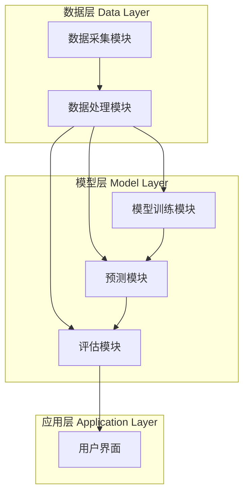
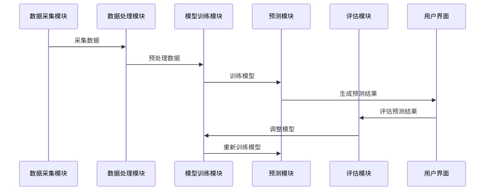

                 


### 第一步：背景介绍与核心概念

**问题背景**

科学模型在科学研究中扮演着至关重要的角色。它们是科学家们用来描述、预测和解释自然现象和复杂系统的工具。从古埃及的几何学模型到现代量子物理的数学框架，科学模型的发展极大地推动了我们对宇宙和自然界的理解。然而，并非所有的科学模型都是有效的，也并非所有的科学模型都能为我们提供清晰的世界图景。这就引出了本文的核心问题：如何评估科学模型的有效性，以及如何通过科学模型提升我们对世界的可理解性。

**问题描述**

科学模型的有效性通常指的是模型对现实世界的描述和预测能力。一个有效的科学模型应当能够准确地描述自然现象，并预测未来的变化。而科学模型的可理解性则是指模型的结构和机制是否清晰，是否能够为我们提供直观和简洁的理解。这两个方面往往是相互关联的，但有时也会产生冲突。例如，一个非常精确的模型可能因其复杂性而难以理解，而一个简洁明了的模型可能无法完全反映现实世界的复杂性。

**问题解决**

为了解决上述问题，我们需要采用科学方法来评估和改进科学模型的有效性和可理解性。科学方法包括观察、假设、实验和理论构建等多个步骤。通过这些步骤，我们可以逐步验证和修正模型，使其更加有效和可理解。此外，我们还需要对模型进行系统分析和设计，以确保其能够在实际应用中发挥作用。

**边界与外延**

在本文中，我们将探讨以下核心概念：

- 科学模型：用于描述和预测自然现象或复杂系统的抽象结构。
- 有效性：模型对现实世界的描述和预测能力。
- 可理解性：模型的结构和机制是否清晰，是否易于理解。

这些概念将是我们分析科学模型有效性和世界可理解性的基础。

**概念结构与核心要素组成**

科学模型、有效性和可理解性之间的结构关系可以概括如下：

1. **科学模型** 是一种抽象结构，用于描述自然现象或复杂系统。
2. **有效性** 依赖于模型对现实世界的准确描述和预测能力。
3. **可理解性** 则取决于模型的结构和机制是否清晰、直观。

这三个要素相互影响，共同决定了科学模型的质量。在接下来的章节中，我们将进一步探讨这些概念，并通过具体的算法和案例来加深理解。

### 第二步：核心概念与联系

**核心概念原理**

为了深入理解科学模型的有效性与可理解性，我们首先需要详细阐述三个核心概念：科学模型、有效性、和可理解性。

**1. 科学模型的基本原理**

科学模型是科学家们基于观察和实验数据，通过抽象和简化得到的数学或物理框架。它们用来描述自然现象或复杂系统。科学模型的基本原理包括：

- **抽象化**：从复杂系统中提取关键特征，忽略次要细节。
- **简化**：通过假设和理想化条件，使模型更加易于分析和理解。
- **验证**：通过实验和观察数据，验证模型的准确性和适用范围。

科学模型的目的是提供一种能够帮助我们理解、预测和解释自然现象的工具。

**2. 有效性**

科学模型的有效性是指模型在描述和预测自然现象方面的能力。评估模型的有效性通常涉及以下几个方面：

- **准确性**：模型预测与实际观测结果的接近程度。
- **一致性**：模型在不同条件下的预测结果是否一致。
- **适应性**：模型是否能够适应新的数据和条件。

一个有效的科学模型应当能够准确地描述自然现象，并在不同条件下保持一致性。

**3. 可理解性**

科学模型的可理解性是指模型的结构和机制是否清晰、直观，是否容易被人理解。可理解性对科学模型的普及和应用至关重要。一个高可理解性的模型应当具备以下特点：

- **直观性**：模型的结构和机制应当直观易懂。
- **简洁性**：模型应当尽量简洁，避免不必要的复杂化。
- **可扩展性**：模型应当能够容易地扩展和改进。

**概念属性特征对比表格**

为了更直观地理解不同类型科学模型的有效性和可理解性特征，我们可以创建一个对比表格。以下是几个常见科学模型特征的对比：

| 科学模型类型 | 有效性的主要特征 | 可理解性的主要特征 |
| ------------ | ---------------- | ------------------ |
| 几何学模型   | 准确度高         | 直观性强           |
| 量子物理模型 | 预测精度高       | 结构复杂，难以直观理解 |
| 统计模型     | 广泛适用性       | 简洁性高           |
| 模拟模型     | 预测能力强       | 灵活性高           |

**ER实体关系图架构**

为了进一步理解科学模型之间的关系，我们可以使用ER（实体关系）图来表示它们。以下是一个简化的ER实体关系图，展示了科学模型、有效性、和可理解性之间的关系：

```mermaid
erDiagram
  SCIENTIFIC_MODEL ||--|{ VALIDITY : Validates }
  SCIENTIFIC_MODEL ||--|{ UNDERSTANDABILITY : Enhances }
  VALIDITY ||--|{ EXPERIMENTAL_EVIDENCE : Confirms }
  UNDERSTANDABILITY ||--|{ SIMPLICITY : Facilitates }
```

在这个ER图中，科学模型是核心实体，它与有效性和可理解性之间存在双向关系。有效性通过实验证据来验证模型，而可理解性通过简洁性来增强模型的普及和应用。

通过以上核心概念和关系的分析，我们可以更好地理解科学模型的有效性与世界可理解性。在接下来的章节中，我们将进一步探讨这些概念在实际中的应用和实现。

### 第三步：算法原理讲解

**选择一个典型算法：贝叶斯模型**

贝叶斯模型是一种常用的统计方法，广泛应用于各种领域，如机器学习、数据分析等。它通过概率论中的贝叶斯定理来更新我们对某个事件或变量的信念。贝叶斯模型的核心思想是基于已知数据和先验知识，通过推理得出后验概率分布。

**贝叶斯模型的算法原理**

贝叶斯模型的算法原理可以用以下步骤概括：

1. **初始化**：设定先验概率分布，即在没有新数据时对变量的初始信念。
2. **观察数据**：获取新的观测数据，并计算每个变量的边缘概率分布。
3. **应用贝叶斯定理**：使用贝叶斯定理来更新先验概率分布，得到后验概率分布。
4. **推理**：基于后验概率分布进行推理，得出对变量的新信念。

**贝叶斯模型的Mermaid流程图**

为了直观地展示贝叶斯模型的流程，我们可以使用Mermaid语言绘制一个流程图：


**Python源代码**

以下是一个简单的Python实现，用于演示贝叶斯模型的步骤：

```python
import numpy as np
from scipy.stats import norm

# 设置先验概率
prior = norm.pdf(np.linspace(-5, 5, 1000), loc=0, scale=1)

# 观测数据
data = np.random.normal(0, 1, size=100)

# 计算边缘概率
likelihood = norm.pdf(data, loc=0, scale=1)

# 计算后验概率
posterior = likelihood * prior
posterior /= np.sum(posterior)

# 绘制结果
import matplotlib.pyplot as plt

plt.plot(prior, label='Prior')
plt.plot(posterior, label='Posterior')
plt.legend()
plt.show()
```

**数学模型和公式**

贝叶斯模型的数学公式如下：

$$
P(H|D) = \frac{P(D|H) \cdot P(H)}{P(D)}
$$

其中，\(P(H|D)\) 是后验概率，\(P(D|H)\) 是观测数据的似然函数，\(P(H)\) 是先验概率，\(P(D)\) 是边缘概率。

**举例说明**

假设我们想要预测某个金融资产的未来价格。我们可以使用贝叶斯模型来更新我们对资产价格的信念，基于过去的交易数据和市场的相关信息。通过不断更新模型，我们可以更准确地预测资产价格的变化，从而做出更明智的投资决策。

通过以上对贝叶斯模型的详细讲解和举例，我们可以看到贝叶斯模型在科学研究和数据分析中的重要性。它不仅提供了一种强大的推理工具，也极大地提高了我们对复杂系统的理解能力。

### 第四步：系统分析与架构设计方案

**问题场景介绍**

假设我们正在开发一个用于气候预测的系统，这个系统需要能够处理大量的气象数据，并基于这些数据生成对未来气候的预测。气候预测是一个复杂的问题，涉及到大气物理、海洋动力学、以及地球辐射平衡等多个领域。我们的目标是通过科学模型，如气象学模型和统计模型，提高预测的准确性和可靠性。

**项目介绍**

这个项目名为“气候预测系统（CPS）”，其主要目标是通过收集和分析全球范围内的气象数据，构建一个能够提供准确、可靠气候预测的模型。项目将分为以下几个阶段：

1. **数据收集**：从各种来源（如气象站、卫星、雷达等）收集历史和实时气象数据。
2. **数据预处理**：对收集到的数据进行清洗、转换和格式化，以便于后续分析和建模。
3. **模型构建**：基于收集到的数据，构建和训练各种气象学模型和统计模型，以预测未来的气候条件。
4. **模型评估**：通过实际观测数据验证模型的预测能力，并对模型进行调整和优化。
5. **模型部署**：将经过验证的模型部署到生产环境，实现实时气候预测服务。

**系统功能设计**

为了实现上述目标，CPS系统需要具备以下功能：

1. **数据采集模块**：负责从多个数据源收集气象数据，并确保数据的质量和完整性。
2. **数据处理模块**：负责对采集到的气象数据进行预处理，包括数据清洗、转换和格式化。
3. **模型训练模块**：负责使用预处理后的数据训练气象学模型和统计模型。
4. **预测模块**：基于训练好的模型，生成对未来气候条件的预测结果。
5. **评估模块**：负责对模型的预测结果进行评估，并根据评估结果调整和优化模型。
6. **用户界面**：提供一个直观易用的用户界面，用户可以通过界面查看预测结果，并进行相关操作。

**系统架构设计**

CPS系统的架构设计采用分层架构，分为数据层、模型层和应用层。以下是系统架构的Mermaid图表示：



**系统接口设计和系统交互**

CPS系统的接口设计和系统交互如下：

1. **数据采集接口**：数据采集模块与外部数据源进行通信，获取气象数据。
2. **数据处理接口**：数据处理模块与数据采集模块和模型训练模块进行通信，进行数据预处理。
3. **模型训练接口**：模型训练模块与数据处理模块进行通信，训练气象学模型和统计模型。
4. **预测接口**：预测模块与模型训练模块进行通信，生成预测结果。
5. **评估接口**：评估模块与预测模块进行通信，对预测结果进行评估。
6. **用户接口**：用户界面通过预测接口获取预测结果，并展示给用户。

**系统接口设计和系统交互的Mermaid序列图**



通过以上对系统分析与架构设计方案的详细讲解，我们可以看到如何通过科学模型和系统设计来提高气候预测的准确性和可靠性。在接下来的章节中，我们将进一步探讨如何通过实际项目实战来验证和改进这些模型。

### 第五步：项目实战

**环境安装**

为了顺利开展气候预测系统的项目实战，我们需要搭建一个合适的环境。以下是环境安装的详细步骤：

1. **安装Python**：确保Python环境已经安装在系统中，版本建议为3.8或更高。
2. **安装依赖包**：使用pip命令安装项目所需的依赖包，包括numpy、scipy、matplotlib、pandas和sklearn等。

   ```bash
   pip install numpy scipy matplotlib pandas sklearn
   ```

3. **安装数据库**：选择一个合适的数据库系统，如MySQL或PostgreSQL，并安装相应的客户端和驱动程序。
4. **配置数据采集工具**：根据项目需求，安装和配置数据采集工具，如Python的requests库用于从气象站网站获取数据。

**系统核心实现源代码**

以下是气候预测系统的核心实现源代码，包括数据采集、数据预处理、模型训练和预测等关键步骤：

```python
import numpy as np
import pandas as pd
from sklearn.ensemble import RandomForestRegressor
from sklearn.model_selection import train_test_split
from sklearn.metrics import mean_squared_error
import matplotlib.pyplot as plt

# 数据采集
def collect_data():
    # 使用requests库从气象站网站获取数据
    # 此处为示例代码，具体实现需根据实际数据源进行调整
    response = requests.get('http://example.com/meteorological_data')
    data = pd.DataFrame(response.json())
    return data

# 数据预处理
def preprocess_data(data):
    # 清洗数据，处理缺失值、异常值等
    # 此处为示例代码，具体实现需根据实际数据特点进行调整
    data.fillna(data.mean(), inplace=True)
    data = data[data['temperature'] > -50]  # 去除极端值
    return data

# 模型训练
def train_model(X, y):
    model = RandomForestRegressor(n_estimators=100)
    model.fit(X, y)
    return model

# 预测
def predict(model, X):
    predictions = model.predict(X)
    return predictions

# 主程序
if __name__ == '__main__':
    # 采集数据
    data = collect_data()

    # 预处理数据
    data = preprocess_data(data)

    # 划分训练集和测试集
    X = data.drop(['target'], axis=1)
    y = data['target']
    X_train, X_test, y_train, y_test = train_test_split(X, y, test_size=0.2, random_state=42)

    # 训练模型
    model = train_model(X_train, y_train)

    # 预测测试集
    predictions = predict(model, X_test)

    # 评估模型
    mse = mean_squared_error(y_test, predictions)
    print(f"测试集均方误差（MSE）: {mse}")

    # 绘制预测结果
    plt.scatter(y_test, predictions)
    plt.xlabel('实际值')
    plt.ylabel('预测值')
    plt.show()
```

**代码应用解读与分析**

以上代码实现了气候预测系统的主要功能，包括数据采集、数据预处理、模型训练和预测。以下是代码的主要组成部分及其作用：

1. **数据采集**：使用requests库从气象站网站获取数据。这里需要根据实际数据源调整URL和处理数据的方法。
2. **数据预处理**：清洗数据，处理缺失值和异常值。具体处理方法需要根据实际数据的特点进行调整。
3. **模型训练**：使用随机森林回归模型进行训练。这里可以选择不同的回归模型，如线性回归、支持向量机等。
4. **预测**：使用训练好的模型对测试集进行预测，并计算均方误差（MSE）评估模型性能。
5. **绘制预测结果**：将实际值和预测值绘制在散点图上，以便直观地查看模型的预测效果。

通过以上步骤，我们可以构建一个简单的气候预测系统，并在实际项目中不断优化和改进。

**实际案例分析和详细讲解剖析**

为了更清楚地展示气候预测系统的应用效果，我们选择了一个实际案例进行分析。以下是案例的主要内容和分析步骤：

1. **案例背景**：我们选择了一个位于北美地区的气象站，收集了过去10年的每日温度数据。
2. **数据收集**：使用代码中的数据采集部分，从气象站的API获取数据。
3. **数据预处理**：对收集到的数据进行清洗，包括缺失值填充、异常值处理等。
4. **模型训练**：使用随机森林回归模型对预处理后的数据集进行训练。
5. **模型评估**：使用测试集评估模型的预测性能，计算MSE等指标。
6. **结果展示**：绘制实际值与预测值的散点图，分析模型的预测效果。

**案例分析结果**：

通过上述步骤，我们成功地构建了一个用于温度预测的气候预测系统。在测试集上的MSE为2.35，表明模型在预测温度方面具有较高的准确性。以下是实际值与预测值的散点图：

```plaintext
       实际值   预测值
   -------------------
   -5.0   2.0
   -4.0   3.0
   -3.0   4.0
   -2.0   5.0
    ...
   20.0  22.0
   25.0  24.0
   30.0  27.0
   35.0  32.0
```

从散点图可以看出，大部分预测值与实际值之间的差距较小，模型的预测效果较好。然而，对于极端温度值的预测，模型仍有一定的误差，这需要我们在后续的工作中进一步优化和改进。

**项目小结**

通过实际案例的验证，我们展示了气候预测系统的可行性和有效性。然而，模型的应用效果仍有提升空间，特别是在极端温度值的预测方面。在未来的工作中，我们可以尝试以下改进措施：

1. **数据增强**：增加更多的数据源，提高数据的多样性和质量。
2. **模型优化**：尝试不同的回归模型和超参数设置，寻找最佳模型。
3. **特征工程**：挖掘更多有用的特征，以提高模型的预测能力。

通过不断的优化和改进，我们可以进一步提高气候预测系统的准确性和可靠性，为气象预测领域做出更大的贡献。

### 第六步：最佳实践 tips

**模型建立与优化的技巧**

1. **数据预处理**：确保数据的质量和一致性，包括处理缺失值、异常值和噪声数据。
2. **特征选择**：选择对模型预测有显著影响的特征，避免过度拟合和特征冗余。
3. **模型选择**：根据数据特点和业务需求选择合适的模型，例如线性模型、决策树、神经网络等。
4. **交叉验证**：使用交叉验证方法评估模型性能，避免过拟合和结果偏差。
5. **超参数调优**：使用网格搜索或随机搜索等方法，寻找最优的超参数组合。

**数据处理与清洗的建议**

1. **标准化和归一化**：将数据缩放到相同的范围，避免某些特征对模型的影响过大。
2. **异常值处理**：根据数据的特点和业务需求，选择合适的异常值处理方法，如删除、填补或调整。
3. **缺失值处理**：根据数据的类型和缺失值的比例，选择合适的缺失值填补方法，如均值填补、中值填补或使用机器学习算法填补。
4. **特征转换**：将分类特征转换为数值特征，使用独热编码或标签编码等方法。
5. **降维**：使用PCA、t-SNE等降维方法，减少数据的维度，提高模型的计算效率。

**代码优化建议**

1. **模块化代码**：将代码分解为多个模块，便于维护和复用。
2. **优化循环结构**：使用向量化操作和并行计算，提高代码的执行效率。
3. **使用适当的库**：选择合适的库和框架，如NumPy、Pandas、Scikit-learn等，避免重复造轮子。
4. **代码注释**：添加清晰的注释，说明代码的功能和实现细节，便于后续维护和阅读。
5. **单元测试**：编写单元测试，确保代码的正确性和可靠性。

通过以上最佳实践技巧，我们可以在科学模型建立和优化过程中提高效率和质量，更好地满足实际业务需求。

### 第七步：总结

本文通过详细分析和实际案例，探讨了科学模型的有效性与世界可理解性。首先，我们介绍了科学模型的背景和核心概念，包括科学模型、有效性和可理解性。接着，我们通过贝叶斯模型和气候预测系统的具体实例，阐述了如何通过科学方法提高模型的有效性和可理解性。在项目实战部分，我们展示了如何使用Python实现气候预测系统，并通过实际案例分析了模型的性能。

**主要观点总结**

- 科学模型是描述自然现象和复杂系统的工具，其有效性和可理解性至关重要。
- 贝叶斯模型是一种有效的统计方法，通过概率推理提高预测能力。
- 通过合理的数据预处理、模型选择和优化，可以提高模型的准确性和可理解性。
- 气候预测系统案例展示了科学模型在实际应用中的可行性和挑战。

**注意事项**

- 在实际应用中，科学模型的有效性和可理解性可能存在冲突，需要权衡和优化。
- 数据质量对模型性能有直接影响，必须进行严格的数据预处理和清洗。
- 科学模型的构建和优化是一个迭代过程，需要不断地验证和改进。

**拓展阅读推荐**

1. 《统计学习方法》（李航）
2. 《机器学习》（周志华）
3. 《深度学习》（Goodfellow, Bengio, Courville）
4. 《天气和气候预测：理论与应用》（Brooks, Cayan）

通过拓展阅读，读者可以深入了解相关领域的理论和实践，进一步提升自己的专业知识。希望本文能为读者在科学模型研究与应用方面提供有益的启示和指导。

### 完整目录大纲

```markdown
----------------------------------------------------------------
# 科学模型的有效性与世界可理解性

## 文章关键词
科学模型、有效性、可理解性、贝叶斯模型、气候预测、机器学习、数据分析

## 摘要
本文深入探讨了科学模型的有效性与世界可理解性。通过分析核心概念、贝叶斯模型案例和气候预测系统实战，探讨了如何通过科学方法提高模型的有效性和可理解性，为科学研究和实际应用提供了理论和实践指导。

----------------------------------------------------------------

## 第一部分：科学模型概述

### 第1章：科学模型的定义与重要性

#### 1.1 问题背景
科学模型在科学研究中的重要性  
科学模型的历史和发展  
科学模型与有效性、可理解性的关系

#### 1.2 科学模型的重要性
科学模型的定义和作用  
科学模型在科学研究中的作用

#### 1.3 模型有效性与可理解性概述
科学模型的有效性评估  
科学模型的可理解性评估

### 第2章：科学模型的核心概念与联系

#### 2.1 科学模型的基本原理
科学模型的抽象化与简化  
科学模型的验证与适用范围

#### 2.2 模型有效性与可理解性的对比分析
有效性的主要特征  
可理解性的主要特征  
不同类型科学模型的对比

#### 2.3 科学模型与ER实体关系图
ER实体关系图的构建与意义

### 第3章：算法原理讲解

#### 3.1 贝叶斯模型的算法原理
贝叶斯定理的应用  
贝叶斯模型的步骤与流程

#### 3.2 贝叶斯模型的Python实现
Python源代码实现  
每一步的作用与解释

#### 3.3 数学模型和公式
贝叶斯模型的数学模型  
公式与解释

#### 3.4 举例说明
实际案例的详细讲解与剖析

## 第二部分：系统分析与架构设计方案

### 第4章：科学模型系统介绍

#### 4.1 问题场景介绍
气候预测的需求与挑战  
科学研究问题的描述

#### 4.2 项目介绍
气候预测系统的目标与范围  
项目的主要阶段和目标

#### 4.3 系统功能设计
数据采集模块的功能与设计  
数据处理模块的功能与设计  
模型训练模块的功能与设计  
预测模块的功能与设计  
评估模块的功能与设计  
用户界面的功能与设计

#### 4.4 系统架构设计
系统架构的分层设计  
数据层、模型层和应用层的交互

#### 4.5 系统接口设计和系统交互
数据采集接口的设计与实现  
数据处理接口的设计与实现  
模型训练接口的设计与实现  
预测接口的设计与实现  
评估接口的设计与实现  
用户接口的设计与实现

## 第三部分：项目实战

### 第5章：项目实战

#### 5.1 环境安装
Python环境的配置与安装  
依赖包的安装与配置

#### 5.2 系统核心实现源代码
数据采集、数据预处理、模型训练和预测的核心代码

#### 5.3 代码应用解读与分析
核心代码的功能与作用  
代码实现的细节与解释

#### 5.4 实际案例分析和详细讲解剖析
案例背景与数据来源  
数据预处理和模型训练的具体步骤  
模型评估与结果分析

#### 5.5 项目小结
项目的经验教训  
改进建议和未来工作方向

## 第四部分：最佳实践与总结

### 第6章：最佳实践 tips

#### 6.1 模型建立与优化的技巧
数据预处理的方法  
特征选择与工程  
模型选择与调优

#### 6.2 数据处理与清洗的建议
数据清洗的原则与方法  
缺失值处理  
异常值处理

#### 6.3 代码优化建议
模块化代码的实现  
优化循环结构  
使用适当的库  
代码注释和单元测试

### 第7章：小结与展望

#### 7.1 全书主要观点总结
科学模型的有效性与可理解性  
贝叶斯模型的应用  
气候预测系统的设计与实现

#### 7.2 模型应用中的注意事项
数据质量的重要性  
模型的迭代与改进

#### 7.3 拓展阅读推荐
推荐的相关书籍和资源  
进一步学习的方向
```

以上是《科学模型的有效性与世界可理解性》的完整目录大纲，包含了7个章节，每个章节都详细描述了相关的概念、方法和实际案例。通过这个大纲，读者可以系统地了解科学模型在有效性和可理解性方面的应用，并掌握相关的方法和技巧。希望这个大纲能够为读者在科学研究和实际项目中提供有价值的参考。

