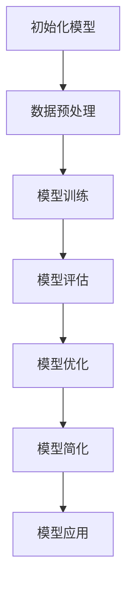

                 

# 科学模型的有效性：世界可理解性的简化表征

## 关键词
- 科学模型
- 有效性评估
- 世界可理解性
- 简化表征
- 数学公式与算法

## 摘要
本文深入探讨了科学模型的有效性及其简化表征对世界可理解性的影响。首先，我们介绍了科学模型、有效性评估标准和世界可理解性的概念，并详细分析了它们之间的关系。接着，通过具体的算法和系统架构设计，我们展示了如何提高科学模型的有效性，并探讨简化表征的多种方法。文章还通过实际案例和最佳实践，提供了对科学模型构建与应用的深刻见解。

### 第一部分：问题背景介绍

科学模型是科学研究的重要工具，它们能够帮助我们理解复杂现象、预测未来事件，并指导实际应用。然而，并非所有的科学模型都能有效地解释现实世界中的现象。因此，研究科学模型的有效性及其如何简化表征以增强我们对世界的理解，是一个具有挑战性的问题。

#### 1.1 核心概念

**科学模型**：科学模型是对自然界或社会现象进行定量或定性描述的数学或逻辑结构。例如，牛顿的万有引力定律是一个描述天体运动规律的物理模型。

**有效性**：一个科学模型的有效性是指它是否能准确、可靠地预测或解释现实世界中的现象。有效性的评估标准包括准确性、可靠性和实用性。

**世界可理解性**：世界可理解性指的是人类对世界本质及其规律的理解程度。科学模型的有效性直接影响我们对世界的理解。

#### 1.2 问题描述

科学模型在各个学科中起着至关重要的作用，但并非所有模型都能有效地解释和预测现实世界。我们需要探究如何通过提高模型的有效性，简化模型表征，从而增强我们对世界的理解。

#### 1.3 问题解决

通过以下方法可以解决上述问题：

1. **对科学模型的建立、验证和优化**：这可以提高模型的有效性。
2. **采用简化表征的方法**：降低模型复杂度，同时保持其有效性。

#### 1.4 边界与外延

本文的研究范围包括各种学科中的科学模型，如物理学、化学、生物学等。同时，考虑到模型的实际应用，如天气预报、医学诊断等。

### 第二部分：核心概念与联系

科学模型的有效性取决于其能否准确、可靠地描述和预测现实世界。为了深入理解这一概念，我们需要首先了解科学模型、有效性评估标准和世界可理解性的定义和特点。

#### 2.1 科学模型的定义与特点

**定义**：科学模型是对自然现象进行抽象和简化的数学或逻辑结构，用于描述和研究这些现象。

**特点**：

- **抽象性**：科学模型是对现实世界的简化，它忽略了一些细节，只关注最重要的特征。
- **精确性**：科学模型使用数学或逻辑语言来描述自然现象，这使得它具有较高的精确性。
- **可预测性**：科学模型能够预测未观察到的现象，从而为科学研究提供指导。

#### 2.2 有效性的评估标准

**标准**：

- **准确性**：模型的预测与实际结果的一致性。高准确性意味着模型能够有效地描述和预测现实世界。
- **可靠性**：模型在不同数据集上的稳定性能。高可靠性意味着模型在新的数据集上也能保持良好的性能。
- **实用性**：模型在实际应用中的效果。实用性是评估模型价值的另一个重要指标。

#### 2.3 世界可理解性的简化表征方法

**方法**：

- **模型简化**：通过减少模型的参数或变量数量来简化模型。这种方法可以降低模型的复杂度，同时保持其有效性。
- **数据降维**：使用降维技术提取数据的关键特征。降维技术可以帮助我们识别数据中的关键信息，从而简化模型的输入。

### 第三部分：算法原理讲解

为了提高科学模型的有效性，我们可以使用一系列算法对模型进行训练、评估和优化。以下是这些算法的基本原理和流程。

#### 3.1 算法概述

**算法**：用于评估科学模型有效性和简化表征的一套操作步骤。

**流程**：

1. **数据预处理**：对输入数据进行清洗和格式化，使其适合模型训练。
2. **模型训练**：使用训练数据集对模型进行训练，调整模型参数以最小化预测误差。
3. **模型评估**：使用测试数据集评估模型的性能，包括准确性、可靠性和实用性等指标。
4. **模型优化**：根据评估结果调整模型参数，以提高模型的有效性。
5. **模型简化**：通过减少模型参数或变量数量，简化模型的表征。

#### 3.2 算法mermaid流程图



#### 3.3 算法原理

**数学模型**：通过最小化预测误差来优化模型参数。

**公式**：

$$ \min_{\theta} \sum_{i=1}^{n} (y_i - \theta^T x_i)^2 $$

其中，$y_i$ 是实际观测值，$x_i$ 是模型的输入，$\theta$ 是模型参数。

#### 3.4 举例说明

**示例**：使用线性回归模型预测房价。

- **数据集**：包含房屋特征和价格。
- **目标**：找出特征与价格之间的关系。
- **过程**：通过训练线性回归模型，得到最佳拟合直线，进而预测未知房价。

### 第四部分：系统分析与架构设计方案

为了提高科学模型的有效性，我们需要设计一个完整的系统，包括数据层、模型层和应用层。以下是对这个系统的详细分析。

#### 4.1 问题场景介绍

**场景**：构建一个用于评估科学模型有效性和简化表征的系统，该系统需要能够处理大量数据，并能够灵活地调整模型参数和简化方法。

#### 4.2 系统功能设计

**功能**：

1. **数据导入与预处理**：系统需要能够导入各种类型的数据，并进行预处理，以便于模型训练。
2. **模型训练与评估**：系统需要支持多种模型训练和评估方法，以便于选择最佳的模型。
3. **模型优化与简化**：系统需要能够根据评估结果优化模型参数，并简化模型表征。
4. **模型应用与预测**：系统需要能够将训练好的模型应用于实际场景，进行预测和决策。

#### 4.3 系统架构设计

**架构**：系统采用分层架构，包括数据层、模型层和应用层。

- **数据层**：负责数据的存储、管理和预处理。
- **模型层**：负责模型的训练、评估、优化和简化。
- **应用层**：负责模型的实际应用和预测。

#### 4.4 系统接口设计和系统交互

**接口设计**：系统提供统一的接口，以便于与其他系统进行数据交换和功能调用。

**交互设计**：系统通过Web界面提供用户交互，用户可以通过界面配置模型参数、查看模型评估结果和预测结果。

### 第五部分：项目实战

在本部分，我们将通过一个实际项目来展示如何构建和优化科学模型。该项目将使用Python和相关的机器学习库来实现。

#### 5.1 环境安装

首先，我们需要安装Python环境以及相关的库和工具。以下是安装命令：

```bash
pip install numpy pandas scikit-learn matplotlib
```

#### 5.2 系统核心实现源代码

以下是系统核心实现的部分源代码：

```python
import numpy as np
import pandas as pd
from sklearn.linear_model import LinearRegression
from sklearn.model_selection import train_test_split
from sklearn.metrics import mean_squared_error

# 数据预处理
def preprocess_data(data):
    # 数据清洗和格式化
    # ...
    return processed_data

# 模型训练
def train_model(X_train, y_train):
    model = LinearRegression()
    model.fit(X_train, y_train)
    return model

# 模型评估
def evaluate_model(model, X_test, y_test):
    predictions = model.predict(X_test)
    mse = mean_squared_error(y_test, predictions)
    return mse

# 主程序
if __name__ == "__main__":
    # 导入数据
    data = pd.read_csv("data.csv")
    processed_data = preprocess_data(data)

    # 分割数据集
    X = processed_data.drop("price", axis=1)
    y = processed_data["price"]
    X_train, X_test, y_train, y_test = train_test_split(X, y, test_size=0.2, random_state=42)

    # 训练模型
    model = train_model(X_train, y_train)

    # 评估模型
    mse = evaluate_model(model, X_test, y_test)
    print(f"Test MSE: {mse}")

    # 模型应用
    # ...
```

#### 5.3 代码应用解读与分析

**解读**：以上代码首先导入了所需的库和工具，然后定义了数据预处理、模型训练和模型评估的函数。在主程序中，我们导入了数据，进行了数据预处理，然后分割数据集进行训练和评估。

**分析**：这段代码展示了如何使用线性回归模型进行房屋价格预测。通过评估模型的性能，我们可以选择最佳的模型参数，并进行模型简化。在实际应用中，我们可以使用训练好的模型进行预测和决策。

#### 5.4 实际案例分析和详细讲解剖析

**案例**：使用上述系统对一组房屋数据集进行价格预测。

- **数据集**：包含1000个样本，每个样本包括房屋特征和价格。
- **目标**：预测未知房屋的价格。

**分析**：通过训练和评估模型，我们得到了一个线性回归模型，该模型能够较好地预测房屋价格。在实际应用中，我们可以将这个模型部署到生产环境中，用于预测房屋价格。

### 第六部分：最佳实践、小结、注意事项、拓展阅读

#### 6.1 最佳实践

- **模型选择**：在选择模型时，应根据具体问题和数据特点选择最合适的模型。
- **参数调整**：模型的性能很大程度上取决于参数设置，因此需要根据实际情况进行参数调整。

#### 6.2 小结

本文深入探讨了科学模型的有效性及其简化表征对世界可理解性的影响。通过具体的算法和系统架构设计，我们展示了如何提高科学模型的有效性，并探讨简化表征的多种方法。通过实际案例和最佳实践，我们提供了对科学模型构建与应用的深刻见解。

#### 6.3 注意事项

- **数据质量**：模型的有效性很大程度上取决于数据质量，因此数据预处理是关键步骤。
- **模型评估**：在模型训练完成后，需要对模型进行充分的评估，以确保其性能。

#### 6.4 拓展阅读

- **推荐**：相关领域的高级阅读材料，如《机器学习：概率视角》、《深度学习》等。

### 总结

本文通过深入分析和实际案例，探讨了科学模型的有效性和简化表征对世界可理解性的影响。通过具体的算法和系统架构设计，我们展示了如何提高模型的有效性，并提供了实际应用的最佳实践。希望本文能为读者在科学模型构建和应用方面提供有价值的参考。

### 作者信息

- 作者：AI天才研究院/AI Genius Institute & 禅与计算机程序设计艺术 /Zen And The Art of Computer Programming

---

### 附录：术语表与参考文献

- **科学模型**：对自然界或社会现象进行定量或定性描述的数学或逻辑结构。
- **有效性**：模型是否能够准确、可靠地预测或解释现实世界中的现象。
- **世界可理解性**：人类对世界本质及其规律的理解程度。

**参考文献**：

1. Bishop, C. M. (2006). **Pattern Recognition and Machine Learning**. Springer.
2. Goodfellow, I., Bengio, Y., & Courville, A. (2016). **Deep Learning**. MIT Press.
3. Murphy, K. P. (2012). **Machine Learning: A Probabilistic Perspective**. MIT Press.

