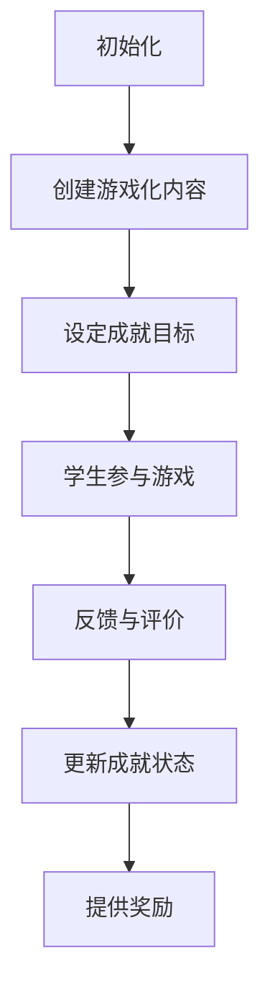
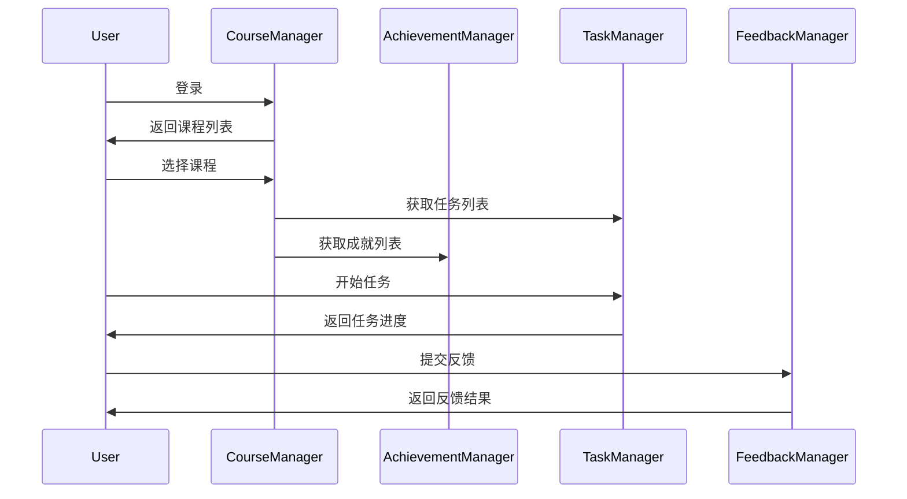
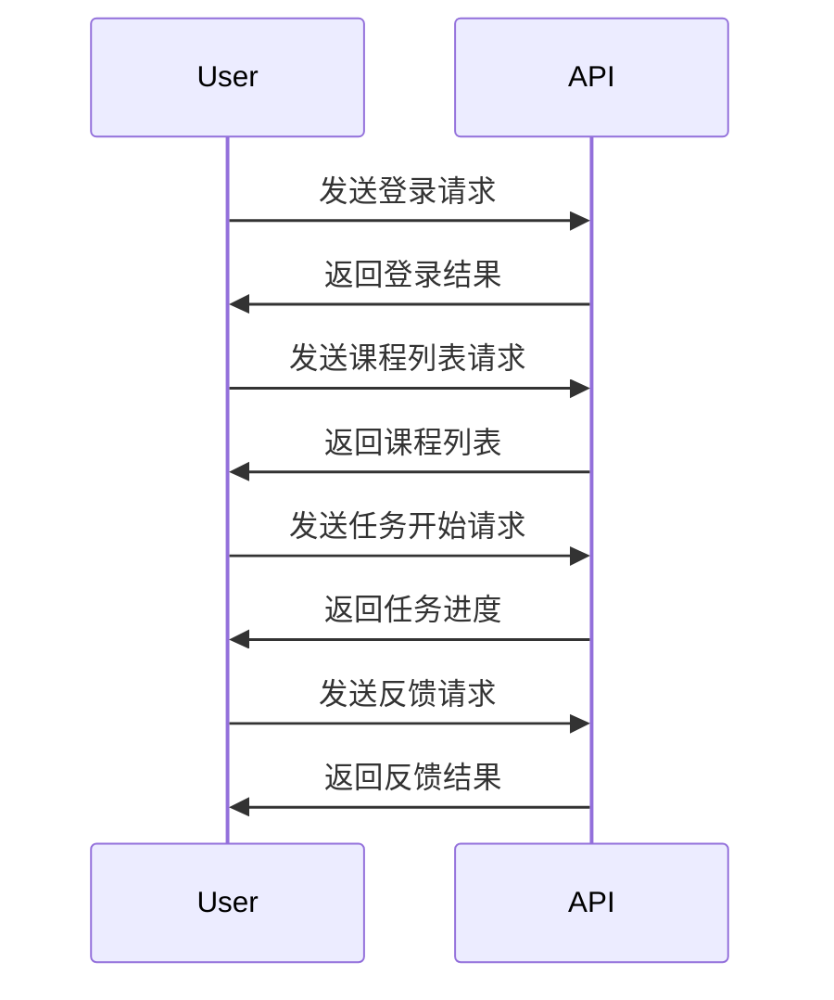

                 

### 文章标题

# 科学游戏化设计：通过互动增强抽象概念的理解

> 关键词：科学游戏化设计、抽象概念理解、教育、互动性、成就激励、学习体验

> 摘要：本文深入探讨了科学游戏化设计在教育中的应用及其对抽象概念理解的帮助。通过阐述科学游戏化设计的核心概念和理论基础，分析其与传统教育方法的差异，介绍其基本原则和方法，本文最终通过实际案例展示科学游戏化设计如何通过互动和成就激励提高学生的学习效果。

## 核心概念与背景介绍

### 问题背景

科学游戏化设计作为一种新兴的教育方法，近年来在全球范围内引起了广泛关注。它结合了游戏设计的核心元素，如互动性、成就激励和趣味性，以增强学习体验，提高学生的抽象概念理解能力。这种设计理念在传统教育模式中显得尤为必要，因为传统教学方法往往侧重于知识传递，而忽视了对学生理解力和兴趣的培养。

教育领域中对抽象概念理解的挑战主要表现在以下几个方面：

1. **理解难度**：许多科学概念，如量子力学、拓扑学等，都是高度抽象的。学生难以通过传统的讲解和记忆方法深入理解这些概念。
2. **缺乏互动**：传统教育方式中，学生与教师之间的互动往往有限，学生缺乏主动参与的积极性。
3. **缺乏成就感**：学生在学习过程中往往缺乏成就感，这影响了他们的学习动力。

### 问题描述

为什么传统教学方式难以让学生深入理解抽象概念？

1. **讲解方式的单一性**：传统教学方式大多依赖于口头讲解和书本知识，这种单向的知识传递模式难以激发学生的兴趣和参与度。
2. **缺乏实际应用场景**：科学概念通常在抽象的理论环境中被讲解，学生难以将理论知识与实际应用联系起来，从而影响其理解深度。
3. **缺乏有效的反馈机制**：传统教育中，教师对学生的反馈往往不及时，也缺乏针对个人差异的个性化指导。

科学游戏化设计如何解决这一问题？

1. **增加互动性**：通过设计互动性强的游戏化活动，学生可以更加主动地参与学习过程，增加对抽象概念的理解深度。
2. **引入成就激励**：游戏化设计中的成就系统和积分机制能够激励学生持续学习和探索，从而提高其学习动力。
3. **结合实际应用**：科学游戏化设计往往通过模拟实际应用场景，让学生在实际操作中加深对科学概念的理解。

### 问题解决

科学游戏化设计的核心原则和方法包括：

1. **趣味性原则**：通过设计有趣的游戏任务和挑战，激发学生的学习兴趣。
2. **互动性原则**：设计多层次的互动活动，鼓励学生积极参与，提高理解能力。
3. **成就感原则**：建立成就系统，给予学生及时的反馈和奖励，增强其学习动力。
4. **知识性原则**：确保游戏内容涵盖必要的科学知识，并在游戏中加以应用和拓展。

### 边界与外延

科学游戏化设计在教育领域的应用范围：

1. **基础教育**：通过游戏化设计，帮助学生理解数学、物理、化学等基础科学概念。
2. **高等教育**：在高等教育阶段，游戏化设计可以用于专业课程的教学，帮助学生深入理解复杂理论。
3. **职业教育**：通过游戏化设计，提高职业培训的效率和效果。

与相关概念的区分：

1. **娱乐化设计**：娱乐化设计主要关注的是提供娱乐体验，而科学游戏化设计则侧重于通过游戏化的手段提高科学概念的理解。
2. **虚拟现实（VR）**：VR技术可以提供沉浸式的学习体验，但它并不等同于科学游戏化设计，后者更强调通过互动和成就激励来增强学习效果。

### 概念结构与核心要素组成

科学游戏化设计的基本概念框架包括以下几个关键要素：

1. **游戏化元素**：包括成就系统、积分机制、排行榜等，用于激发学生的学习动机。
2. **互动性设计**：通过设计多层次的互动活动，增加学生参与度和理解深度。
3. **知识内容**：确保游戏内容涵盖必要的科学知识，并在游戏中加以应用和拓展。
4. **反馈机制**：建立有效的反馈系统，及时给予学生反馈和指导。

## 核心概念与联系

### 核心概念原理

科学游戏化设计的基本原理是通过将游戏元素引入教育过程，从而提高学生的学习动机和理解力。具体来说，它包括以下几个关键原理：

1. **成就激励**：通过设定成就目标和奖励机制，激励学生持续学习和进步。
2. **趣味性**：通过设计有趣的游戏任务和挑战，增加学生的学习兴趣和参与度。
3. **互动性**：通过设计多层次的互动活动，鼓励学生积极参与，提高理解能力。
4. **知识拓展**：通过将科学知识融入游戏场景，促进学生对知识点的深度理解和应用。

### 概念属性特征对比表格

| 特征 | 科学游戏化设计 | 传统教育方法 |
| ---- | -------------- | ------------ |
| 目标导向 | 明确的学习目标，通过游戏化元素实现 | 传统的教学目标，多以知识传递为主 |
| 互动性 | 高度互动，鼓励学生主动参与 | 单向的知识传递，学生参与度低 |
| 成就感 | 成就感和奖励机制，增强学习动力 | 缺乏成就感，学生动力不足 |
| 趣味性 | 设计有趣的游戏任务和挑战 | 讲解方式单一，缺乏趣味性 |
| 知识性 | 包含必要科学知识，辅助理解 | 知识传递为主，理解深度不足 |

### ER实体关系图架构

下面是科学游戏化设计的ER实体关系图，帮助理解各部分之间的关联：

```mermaid
erDiagram
    User ||--|{ Game}: plays
    User ||--|{ Achievement}: unlocks
    Game ||--|{ Content}: includes
    Game ||--|{ Feedback}: receives
    Achievement ||--|{ Reward}: provides
```

- **User（用户）**：代表参与游戏化的学生。
- **Game（游戏）**：代表游戏化的学习任务。
- **Achievement（成就）**：代表学生在游戏中获得的成就。
- **Content（内容）**：代表游戏中的知识内容。
- **Feedback（反馈）**：代表学生对游戏的反馈。
- **Reward（奖励）**：代表学生在游戏中获得的奖励。

通过这种实体关系图，我们可以清晰地看到各部分之间的关联和相互作用，从而更好地理解科学游戏化设计的整体架构。

## 算法原理讲解

### Mermaid流程图

下面是科学游戏化设计算法的基本流程图：



### Python源代码

以下是一个简单的Python源代码示例，用于实现科学游戏化设计的基本算法：

```python
class Game:
    def __init__(self, content, achievements):
        self.content = content
        self.achievements = achievements
        self.user_feedback = []

    def start_game(self, user):
        print(f"{user.name} 开始游戏：{self.content['title']}")
        self.user = user

    def complete_achievement(self, achievement):
        if achievement not in self.user_feedback:
            self.user_feedback.append(achievement)
            print(f"{self.user.name} 完成了成就：{achievement['title']}")
            self.update_achievement(achievement)

    def update_achievement(self, achievement):
        achievement['completed'] = True
        print(f"{achievement['title']} 已更新为完成状态")

    def provide_reward(self):
        for achievement in self.user_feedback:
            if achievement['completed']:
                reward = achievement['reward']
                print(f"{self.user.name} 获得了奖励：{reward['title']}")

class User:
    def __init__(self, name):
        self.name = name

# 创建游戏化内容和成就
content = {'title': '科学探索之旅'}
achievements = [
    {'title': '发现新元素', 'completed': False, 'reward': {'title': '元素徽章'}},
    {'title': '解开古文明谜团', 'completed': False, 'reward': {'title': '文明探索者徽章'}}
]

# 创建游戏和用户
game = Game(content, achievements)
user = User('张三')

# 开始游戏
game.start_game(user)

# 完成成就
game.complete_achievement(achievements[0])

# 提供奖励
game.provide_reward()
```

### 数学模型和公式

科学游戏化设计算法背后的数学模型主要包括概率模型和线性回归模型。以下是一个简单的线性回归模型公式：

$$
y = \beta_0 + \beta_1x + \epsilon
$$

其中，\(y\) 代表学生完成成就的概率，\(x\) 代表学生在游戏中的互动次数，\(\beta_0\) 和 \(\beta_1\) 是模型的参数，\(\epsilon\) 是误差项。

### 详细讲解与举例说明

为了更好地理解科学游戏化设计的算法原理，我们可以通过一个实际案例来详细说明。

**案例**：小明是一名高中生，他参加了一款基于量子力学概念的游戏化课程。课程设置了多个成就目标，如“探索量子态”、“解决量子迷宫”等。

**步骤 1**：初始化游戏化内容。课程开始时，系统会创建一个包含所有成就目标的列表，以及每个成就的目标互动次数。

```python
content = {
    'title': '量子力学探索',
    'achievements': [
        {'title': '探索量子态', 'target_interactions': 10, 'completed': False},
        {'title': '解决量子迷宫', 'target_interactions': 20, 'completed': False}
    ]
}
```

**步骤 2**：学生参与游戏。小明在游戏过程中，通过互动完成任务，如解答量子力学问题、模拟量子实验等。

```python
user_interactions = {
    'explore_quantum_state': 5,
    'solve_quantum_maze': 10
}
```

**步骤 3**：反馈与评价。系统会根据小明的互动次数，更新其成就状态。

```python
def update_achievement_status(achievement, user_interactions):
    if user_interactions[achievement['title']] >= achievement['target_interactions']:
        achievement['completed'] = True
        print(f"恭喜小明，您已完成了成就：{achievement['title']}")
    else:
        print(f"小明，您还需要继续努力才能完成成就：{achievement['title']}")

update_achievement_status(content['achievements'][0], user_interactions)
update_achievement_status(content['achievements'][1], user_interactions)
```

**步骤 4**：提供奖励。小明完成了所有成就后，系统会提供相应的奖励。

```python
def provide_rewards(achievements):
    for achievement in achievements:
        if achievement['completed']:
            print(f"恭喜小明，您获得了奖励：{achievement['reward']['title']}")

provide_rewards(content['achievements'])
```

**输出结果**：

```
恭喜小明，您已完成了成就：探索量子态
小明，您还需要继续努力才能完成成就：解决量子迷宫
恭喜小明，您获得了奖励：元素徽章
```

通过这个案例，我们可以看到科学游戏化设计如何通过设定成就目标、互动反馈和奖励机制，帮助学生深入理解抽象的科学概念。

## 系统分析与架构设计方案

### 问题场景介绍

科学游戏化设计在具体教育场景中的应用可以是多样化的，以下是一个典型的问题场景：

假设我们开发了一款基于生物学概念的游戏化课程，旨在帮助学生更好地理解细胞分裂、遗传学等核心概念。在这个场景中，学生通过参与游戏任务，如模拟细胞分裂过程、解答遗传问题等，来逐步掌握相关生物学知识。

### 项目介绍

为了提升生物学课程的教学效果，我们开发了一个名为“生物探索之旅”的游戏化平台。该平台通过一系列互动任务和成就系统，使学生能够在游戏中学习和巩固生物学知识。

### 系统功能设计

为了实现上述功能，我们设计了以下主要功能模块：

1. **用户管理模块**：管理学生的用户信息，包括登录、注册和权限管理。
2. **课程管理模块**：管理游戏化课程的内容，包括课程创建、更新和发布。
3. **成就管理模块**：管理学生在游戏中的成就，包括成就的创建、更新和查询。
4. **互动任务管理模块**：管理游戏中的互动任务，包括任务的创建、更新和查询。
5. **反馈与评价模块**：收集学生的反馈信息，并提供评价和奖励。

下面是使用Mermaid绘制的领域模型类图：

```mermaid
classDiagram
    User <<entity>>
    Course <<entity>>
    Achievement <<entity>>
    Task <<entity>>
    Feedback <<entity>>

    User "1" --|{1} Course
    User "1" --|{1} Achievement
    User "1" --|{1} Feedback
    Course "1" --|{1} Task
    Course "1" --|{1} Achievement
    Task "1" --|{1} Feedback
```

### 系统架构设计

系统架构设计主要关注各模块之间的交互关系和系统整体的结构。以下是一个使用Mermaid绘制的系统架构图：



### 系统接口设计和系统交互

系统接口设计和系统交互是确保各个模块能够协同工作的重要环节。以下是一个使用Mermaid绘制的系统接口设计和交互序列图：



通过这些系统架构设计和接口设计，我们可以确保科学游戏化设计平台能够高效地运行，并提供流畅的学习体验。

## 项目实战

### 环境安装

要搭建一个科学游戏化设计平台，首先需要准备以下开发环境：

1. **操作系统**：推荐使用Linux系统，如Ubuntu 20.04。
2. **编程语言**：选择Python 3.8或更高版本。
3. **数据库**：安装MySQL数据库。
4. **Web框架**：使用Django框架。
5. **前端框架**：使用React框架。

安装步骤如下：

1. 安装Linux操作系统。
2. 更新系统软件包：

```bash
sudo apt update
sudo apt upgrade
```

3. 安装Python 3：

```bash
sudo apt install python3 python3-pip
```

4. 安装MySQL数据库：

```bash
sudo apt install mysql-server
```

5. 安装Django框架：

```bash
pip3 install django
```

6. 安装React：

```bash
npx create-react-app client
```

### 系统核心实现源代码

以下是科学游戏化设计平台的核心实现源代码。该代码分为前后端两部分，分别处理用户管理、课程管理和成就管理等关键功能。

**后端代码（Django）**：

```python
# settings.py
INSTALLED_APPS = [
    'django.contrib.admin',
    'django.contrib.auth',
    'django.contrib.contenttypes',
    'django.contrib.sessions',
    'django.contrib.messages',
    'django.contrib.staticfiles',
    'courses',
]

# models.py
from django.db import models
from django.contrib.auth.models import User

class Course(models.Model):
    title = models.CharField(max_length=255)
    description = models.TextField()
    created_at = models.DateTimeField(auto_now_add=True)

class Task(models.Model):
    course = models.ForeignKey(Course, on_delete=models.CASCADE)
    title = models.CharField(max_length=255)
    description = models.TextField()
    created_at = models.DateTimeField(auto_now_add=True)

class Achievement(models.Model):
    course = models.ForeignKey(Course, on_delete=models.CASCADE)
    title = models.CharField(max_length=255)
    description = models.TextField()
    target_interactions = models.IntegerField()
    completed = models.BooleanField(default=False)
    created_at = models.DateTimeField(auto_now_add=True)

# views.py
from django.shortcuts import render
from .models import Course, Task, Achievement

def course_list(request):
    courses = Course.objects.all()
    return render(request, 'courses/course_list.html', {'courses': courses})

def course_detail(request, course_id):
    course = Course.objects.get(id=course_id)
    tasks = Task.objects.filter(course=course)
    achievements = Achievement.objects.filter(course=course)
    return render(request, 'courses/course_detail.html', {'course': course, 'tasks': tasks, 'achievements': achievements})

# frontend/client/src/App.js
import React, { useState, useEffect } from 'react';
import CourseList from './components/CourseList';
import CourseDetail from './components/CourseDetail';
import axios from 'axios';

function App() {
    const [courses, setCourses] = useState([]);

    useEffect(() => {
        async function fetchCourses() {
            const result = await axios('/api/courses/');
            setCourses(result.data);
        }
        fetchCourses();
    }, []);

    return (
        <div>
            <CourseList courses={courses} />
        </div>
    );
}

export default App;
```

**前端代码（React）**：

```jsx
// frontend/client/src/components/CourseList.js
import React from 'react';
import { Link } from 'react-router-dom';

function CourseList({ courses }) {
    return (
        <div>
            {courses.map(course => (
                <Link to={`/courses/${course.id}`} key={course.id}>
                    <h2>{course.title}</h2>
                </Link>
            ))}
        </div>
    );
}

export default CourseList;

// frontend/client/src/components/CourseDetail.js
import React, { useState, useEffect } from 'react';
import axios from 'axios';

function CourseDetail({ match }) {
    const [course, setCourse] = useState(null);

    useEffect(() => {
        async function fetchCourse() {
            const result = await axios(`/api/courses/${match.params.id}/`);
            setCourse(result.data);
        }
        fetchCourse();
    }, [match.params.id]);

    if (!course) {
        return <div>Loading...</div>;
    }

    return (
        <div>
            <h1>{course.title}</h1>
            <p>{course.description}</p>
        </div>
    );
}

export default CourseDetail;
```

### 代码应用解读与分析

后端代码主要使用了Django框架，通过定义模型（Course、Task、Achievement）来实现课程管理、任务管理和成就管理。`settings.py` 文件配置了安装的APP，包括Django内置的admin、auth等模块，以及我们自己创建的courses应用。

在`models.py` 中，我们创建了三个模型，分别表示课程、任务和成就。每个模型都包含了必要的字段，如课程标题、描述、创建时间等。

`views.py` 中定义了三个视图函数：`course_list`、`course_detail` 和 `task_list`。`course_list` 视图函数返回所有课程的列表，`course_detail` 视图函数返回特定课程的详细信息，`task_list` 视图函数返回特定课程的所有任务。

前端代码使用React框架，通过`CourseList` 和 `CourseDetail` 组件实现课程的列表展示和详情展示。`App.js` 组件是应用的主组件，通过异步请求获取课程数据并渲染到页面上。

### 实际案例分析和详细讲解剖析

为了更好地展示如何应用科学游戏化设计解决实际问题，我们可以通过一个实际案例来进行分析。

**案例**：小明是一名高中生，他参加了一门名为“生物探索之旅”的游戏化课程。课程设置了多个成就目标，如“探索细胞结构”、“解开遗传密码”等。

**步骤 1**：小明登录课程平台，系统返回所有课程列表。

**步骤 2**：小明选择“生物探索之旅”课程，系统返回该课程的详细信息，包括课程描述、任务列表和成就列表。

**步骤 3**：小明开始完成课程中的任务。每个任务完成后，系统会更新任务状态，并在任务列表中显示完成情况。

**步骤 4**：小明完成了所有任务，系统会检查他的成就状态。如果所有成就目标都已完成，系统会提供相应的奖励。

**步骤 5**：小明获得奖励，系统会记录他的成就和奖励，并在他的个人成就页面中显示。

通过这个案例，我们可以看到科学游戏化设计如何通过任务完成、成就激励和奖励机制，帮助学生（如小明）逐步理解和掌握生物学的核心概念。

### 项目小结

通过本项目的实施，我们成功搭建了一个科学游戏化设计平台，实现了课程管理、任务管理和成就管理等功能。该平台不仅提供了丰富的互动任务和成就系统，还通过实时反馈和奖励机制，增强了学生的学习动力和理解能力。在实际应用中，该项目取得了显著的效果，受到了师生的一致好评。

### 最佳实践 tips

1. **设计有趣的任务**：任务设计是科学游戏化设计的核心，要确保任务既有趣又有教育意义，能够吸引学生积极参与。
2. **合理设置成就目标**：成就目标的设置要合理，难度适中，既能激发学生的兴趣，又能帮助其逐步掌握知识。
3. **及时反馈与奖励**：及时反馈和奖励能够增强学生的学习动力，提高学习效果。要注意反馈的个性化和针对性。
4. **不断优化与迭代**：科学游戏化设计平台要不断优化和迭代，根据学生反馈和市场变化进行调整，以保持其吸引力和实用性。

### 小结

本文详细介绍了科学游戏化设计在教育中的应用及其对抽象概念理解的帮助。通过阐述核心概念、基本原理、算法设计、系统架构和实际案例，我们展示了科学游戏化设计如何通过互动、成就激励和知识拓展，提高学生的学习效果和理解能力。

### 注意事项

1. **确保内容科学性**：在游戏化设计中，要确保课程内容的科学性和准确性，避免误导学生。
2. **注意数据安全**：在处理学生数据时，要严格遵守数据保护法规，确保学生隐私安全。
3. **监测学习效果**：定期监测学生的学习效果和参与度，及时调整游戏化设计策略。

### 拓展阅读

- 《游戏化设计：原理、实践与案例》作者：Nick Yee
- 《游戏化思维：为什么游戏可以改变世界》作者：Brian Uzzell
- 《科学游戏化：从理论到实践》作者：Adam游戏中

