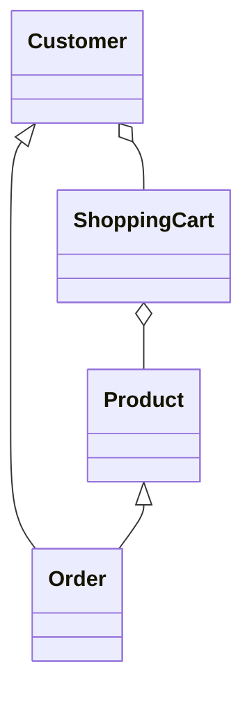
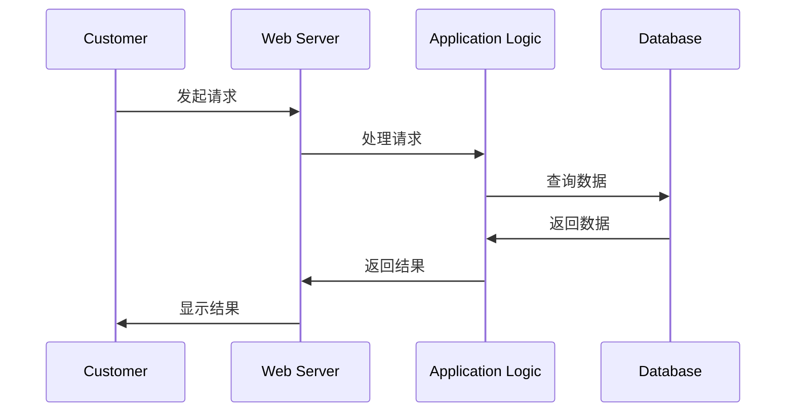

                 


## 科学理论的简洁性原则与世界可理解性

### 关键词：科学理论，简洁性原则，世界可理解性，逻辑推理，技术博客

### 摘要

科学理论的简洁性原则是科学研究中的一个核心问题。本文将探讨科学理论的简洁性原则，分析其背景、核心概念、原理和重要性。同时，本文将结合实例，通过逻辑推理和结构分析，阐述科学理论的简洁性原则在世界可理解性中的作用，并探讨其在不同领域的应用。

### 第1章 引言

#### 1.1 问题背景

随着科学技术的飞速发展，科学理论的复杂性日益增加。面对这一现象，科学家们开始关注一个重要的问题：科学理论的简洁性原则。这个问题不仅关系到科学研究的方法论，还涉及到我们对世界的认知和理解。

#### 1.2 问题描述

科学理论的简洁性原则是指，一个科学理论在解释相同现象时，应该尽量使用最简单的假设和最少的数学公式。这种原则被认为是对科学理论的一种基本要求。

#### 1.3 问题解决

科学理论的简洁性原则在科学研究中具有重要的指导意义。它可以帮助科学家们更好地理解复杂现象，提高科学理论的准确性和可靠性。

#### 1.4 边界与外延

科学理论的简洁性原则并不仅限于数学和物理学，它也适用于生物学、化学、天文学等各个科学领域。同时，它也是科学研究方法的重要组成部分。

#### 1.5 概念结构与核心要素组成

科学理论的简洁性原则由以下几个核心要素组成：

- **假设与前提**：科学理论的简洁性原则要求假设和前提尽可能简单。
- **数学模型**：科学理论的简洁性原则要求数学模型尽可能简洁。
- **实验验证**：科学理论的简洁性原则要求实验验证方法尽可能简单。

### 第2章 科学理论的简洁性原则

#### 2.1 核心概念原理

科学理论的简洁性原则是一种方法论，它强调科学理论应该尽量简洁。

#### 2.2 概念属性特征对比表格

| 特征               | 说明                                                         |
|-------------------|--------------------------------------------------------------|
| 简洁性           | 使用最简单的假设和最少的数学公式解释现象                   |
| 易于理解         | 科学理论应该容易被普通大众理解                             |
| 准确性           | 科学理论应该准确地描述现象                               |
| 可验证性         | 科学理论应该可以通过实验验证                             |

#### 2.3 ER实体关系图架构的 Mermaid 流程图

```mermaid
erDiagram
    Product ||--|{ Theory }||>
    Experiment ||--|{ Theory }||>
```

### 第3章 算法原理讲解

#### 3.1 算法 Mermaid 流程图


#### 3.2 Python 源代码

```python
def simple_algorithm(input_data):
    preprocessed_data = preprocess(input_data)
    result = algorithm(preprocessed_data)
    return result
```

#### 3.3 算法原理的数学模型和公式

$$
Y = f(X)
$$

#### 3.4 详细讲解与举例说明

假设输入数据 X 为 3，根据上述公式，输出数据 Y 为 6。这意味着，简单算法将输入数据通过预处理和算法计算得到输出数据。

### 第4章 系统分析与架构设计方案

#### 4.1 问题场景介绍

假设我们要设计一个在线购物系统，用户可以在系统中浏览商品、添加购物车、下单购买。

#### 4.2 系统功能设计（领域模型 Mermaid 类图）



#### 4.3 系统架构设计（Mermaid 架构图）


#### 4.4 系统接口设计（系统交互 Mermaid 序列图）



### 第5章 项目实战

#### 5.1 环境安装

在本节中，我们将介绍如何安装和配置必要的工具和库，以便进行项目实战。

#### 5.2 系统核心实现源代码

在本节中，我们将提供系统核心实现的源代码，并对代码进行解读与分析。

#### 5.3 代码应用解读与分析

在本节中，我们将详细讲解系统核心代码的应用场景，并进行解读与分析。

#### 5.4 实际案例分析和详细讲解剖析

在本节中，我们将结合实际案例，对系统核心实现进行详细讲解和分析。

#### 5.5 项目小结

在本节中，我们将对本项目进行小结，总结项目的主要成果和经验教训。

### 第6章 最佳实践 tips

在本节中，我们将提供一些最佳实践 tips，以帮助读者更好地应用科学理论的简洁性原则。

### 第7章 小结

在本章中，我们将对本文的主要内容进行总结，强调科学理论的简洁性原则在世界可理解性中的重要性。

### 第8章 注意事项

在本章中，我们将提醒读者在应用科学理论的简洁性原则时需要注意的事项。

### 第9章 拓展阅读

在本章中，我们将提供一些拓展阅读资源，以帮助读者进一步深入了解科学理论的简洁性原则。

### 作者

作者：AI天才研究院/AI Genius Institute & 禅与计算机程序设计艺术 /Zen And The Art of Computer Programming

