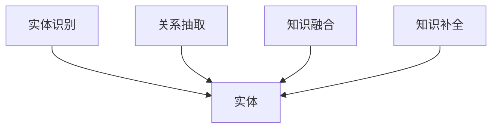
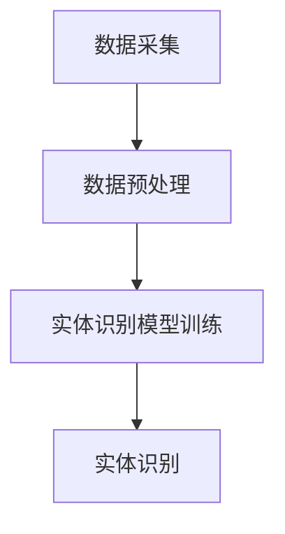
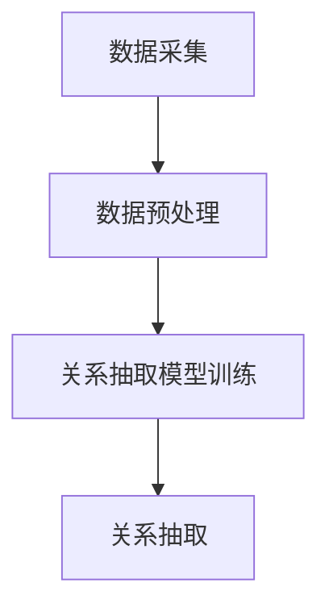

                 


# 科学知识图谱的构建：可视化展现知识间的复杂关联

> 关键词：科学知识图谱、实体识别、关系抽取、知识融合、可视化

> 摘要：本文旨在探讨科学知识图谱的构建过程，包括实体识别、关系抽取和知识融合等技术。通过可视化手段展现知识间的复杂关联，为读者提供深入理解和应用科学知识图谱的方法。

### 引言

科学知识图谱是近年来大数据和人工智能领域的重要研究方向。它通过结构化方式组织大量知识，展现实体及其相互关系，为知识发现、智能推荐、自然语言处理等应用提供支持。本文将详细探讨科学知识图谱的构建过程，包括核心概念、构建方法、关键技术以及实际应用，旨在帮助读者深入理解科学知识图谱的构建原理和实际应用。

### 1. 科学知识图谱的背景

#### 1.1 科学知识图谱的定义与重要性

科学知识图谱是一种语义网络，它将各种知识实体（如人、地点、组织、概念等）及其关系（如属于、参与、关联等）以图的形式进行组织。科学知识图谱的重要性在于：

1. **知识组织**：将分散的知识以结构化方式进行组织，便于查找和利用。
2. **知识关联**：通过实体及其关系的可视化，展现知识间的复杂关联。
3. **知识推理**：基于实体和关系，进行知识推理，发现新的关联和规律。

#### 1.2 科学知识图谱的发展历程

科学知识图谱的发展可以追溯到20世纪80年代的语义网和本体论。随着互联网和大数据技术的发展，科学知识图谱逐渐成为研究热点。主要发展历程如下：

1. **语义网和本体论**：1998年，Tim Berners-Lee提出语义网概念，试图通过语义标记使数据具有机器可读性。
2. **链接数据**：2007年，Tim Berners-Lee提出链接数据运动，鼓励将数据以语义标记的方式进行组织。
3. **知识图谱**：近年来，随着人工智能和大数据技术的发展，知识图谱逐渐成为科学知识组织的重要工具。

### 2. 核心概念与联系

#### 2.1 实体识别与关系抽取

实体识别是指从非结构化文本中识别出具体的知识实体。关系抽取则是识别实体间的关系。

1. **实体识别**：
   - **问题背景**：非结构化文本中包含大量知识实体，如人名、地名、组织名等。
   - **问题描述**：如何从文本中准确识别出这些实体？
   - **问题解决**：采用命名实体识别（NER）技术，通过规则、机器学习、深度学习等方法实现实体识别。

2. **关系抽取**：
   - **问题背景**：实体识别后，需要了解实体间的相互关系。
   - **问题描述**：如何从文本中识别出实体间的关系？
   - **问题解决**：采用依存句法分析、实体对匹配、图神经网络等方法实现关系抽取。

#### 2.2 知识融合与补全

知识融合是指将来自不同来源的知识进行整合，形成统一的视图。知识补全则是在现有知识基础上，通过推理和预测，补充缺失的知识。

1. **知识融合**：
   - **问题背景**：不同来源的知识可能存在冲突和冗余。
   - **问题描述**：如何将不同来源的知识进行整合？
   - **问题解决**：采用数据对齐、实体匹配、知识融合算法实现知识融合。

2. **知识补全**：
   - **问题背景**：实际应用中，可能存在部分知识的缺失。
   - **问题描述**：如何补充缺失的知识？
   - **问题解决**：采用推理算法、预测模型、图神经网络等技术实现知识补全。

#### 2.3 Mermaid实体关系图架构图

以下是一个简单的Mermaid实体关系图，用于展示实体识别、关系抽取和知识融合的概念架构：



### 3. 知识图谱构建方法

#### 3.1 数据采集与预处理

数据采集与预处理是知识图谱构建的第一步。主要工作包括：

1. **数据采集**：从互联网、数据库、文献等渠道收集原始数据。
2. **数据预处理**：清洗、去重、标准化等操作，提高数据质量。

#### 3.2 实体识别算法

实体识别算法是知识图谱构建的核心技术之一。主要方法包括：

1. **规则方法**：基于预定义的规则进行实体识别。
2. **机器学习方法**：使用监督学习、无监督学习等方法训练模型进行实体识别。
3. **深度学习方法**：使用深度神经网络，如CNN、RNN、BERT等进行实体识别。

#### 3.3 关系抽取算法

关系抽取算法也是知识图谱构建的关键技术之一。主要方法包括：

1. **规则方法**：基于预定义的规则进行关系抽取。
2. **机器学习方法**：使用监督学习、无监督学习等方法训练模型进行关系抽取。
3. **深度学习方法**：使用深度神经网络，如CNN、RNN、BERT等进行关系抽取。

#### 3.4 知识融合与补全算法

知识融合与补全算法是知识图谱构建的重要环节。主要方法包括：

1. **知识融合算法**：如数据对齐、实体匹配、知识融合网络等。
2. **知识补全算法**：如推理算法、预测模型、图神经网络等。

### 4. Mermaid流程图与Python代码讲解

#### 4.1 实体识别算法

以下是一个简单的Mermaid流程图，展示实体识别的流程：



以下是Python代码示例，用于实现基于BERT的实体识别：

```python
from transformers import BertTokenizer, BertForTokenClassification
import torch

# 加载预训练的BERT模型和分词器
tokenizer = BertTokenizer.from_pretrained('bert-base-chinese')
model = BertForTokenClassification.from_pretrained('bert-base-chinese')

# 输入文本
text = '北京是中国的首都。'

# 分词并添加特殊 tokens
input_ids = tokenizer.encode(text, add_special_tokens=True)

# 预测
with torch.no_grad():
    logits = model(input_ids)[0]

# 解码为实体标签
labels = logits.argmax(-1)
tokens = tokenizer.decode(input_ids)
entities = []

for label, token in zip(labels, tokens):
    if label != 0:
        entities.append((token, label))

print(entities)
```

#### 4.2 关系抽取算法

以下是一个简单的Mermaid流程图，展示关系抽取的流程：



以下是Python代码示例，用于实现基于BiLSTM-CRF的关系抽取：

```python
import torch
from torch import nn
import torch.optim as optim
from torchtext.data import Field, TabularDataset, BucketIterator
from torchtext.vocab import Vocab

# 定义数据预处理
TEXT = Field(tokenize=lambda x: x.split(), lower=True)
LABEL = Field(tokenize=lambda x: x.split(), lower=True)

# 读取数据
train_data = TabularDataset(
    path='train_data.csv',
    format='csv',
    fields=[('text', TEXT), ('label', LABEL)]
)

# 划分数据集
train_iter, val_iter = BucketIterator.splits(
    (train_data, val_data),
    batch_size=32,
    device=device
)

# 定义模型
class BiLSTM_CRF(nn.Module):
    def __init__(self, vocab_size, embedding_dim, hidden_dim):
        super(BiLSTM_CRF, self).__init__()
        self.embedding = nn.Embedding(vocab_size, embedding_dim)
        self.lstm = nn.LSTM(embedding_dim, hidden_dim, batch_first=True)
        self.hidden_dim = hidden_dim
        self.hidden2tag = nn.Linear(hidden_dim, vocab_size)
        self.crf = nnCRF(vocab_size)

    def forward(self, x, mask=None):
        embed = self.embedding(x)
        out, (hidden, cell) = self.lstm(embed, mask=mask)
        out = out[-1]
        tag = self.hidden2tag(out)
        loss = -self.crf(tag, target, mask)
        return loss

# 训练模型
model = BiLSTM_CRF(len(TEXT.vocab), 100, 256)
optimizer = optim.Adam(model.parameters(), lr=0.001)
criterion = nn.CrossEntropyLoss()

for epoch in range(num_epochs):
    for batch in train_iter:
        optimizer.zero_grad()
        loss = model(batch.text, mask=batch.text.ne(1))
        loss.backward()
        optimizer.step()
        if batch.text.ne(1).sum().item() == 0:
            print(f"Epoch: {epoch}, Loss: {loss.item()}")
```

### 5. 知识图谱构建算法原理详解

#### 5.1 数学模型与公式

知识图谱构建的算法原理主要包括实体识别、关系抽取和知识融合三个方面。以下分别介绍这些算法的数学模型与公式。

##### 5.1.1 实体识别

实体识别的常用算法有基于规则的算法和基于机器学习的算法。以下是基于机器学习算法的数学模型：

- **卷积神经网络（CNN）**：

  $$ f(x) = \text{ReLU}\left(\sum_{k=1}^{K} w_{k} \times \text{ReLU}(\sigma(x \times k \times \text{filter}))\right) $$

  其中，$x$为输入特征向量，$w_{k}$为卷积核，$\text{filter}$为卷积核参数，$\sigma$为激活函数。

- **循环神经网络（RNN）**：

  $$ h_{t} = \text{ReLU}\left(\text{sigmoid}\left(\text{dot}(h_{t-1}, W_{h}) + \text{dot}(x_{t}, W_{x}) + b\right)\right) $$

  其中，$h_{t}$为当前隐藏层状态，$h_{t-1}$为上一隐藏层状态，$W_{h}$和$W_{x}$为权重矩阵，$b$为偏置。

##### 5.1.2 关系抽取

关系抽取的常用算法有基于规则的方法和基于深度学习的方法。以下是基于深度学习算法的数学模型：

- **双向长短期记忆网络（BiLSTM）**：

  $$ h_{t} = \text{ReLU}\left(\text{sigmoid}\left(\text{dot}(h_{t-1}, W_{h}) + \text{dot}(x_{t}, W_{x}) + b\right)\right) $$

  其中，$h_{t}$为当前隐藏层状态，$h_{t-1}$为上一隐藏层状态，$W_{h}$和$W_{x}$为权重矩阵，$b$为偏置。

- **条件随机场（CRF）**：

  $$ P(y|x) = \frac{1}{Z} \exp\left(\sum_{i=1}^{n} \log P(y_{i}|x, y_{1:i-1})\right) $$

  其中，$y$为输出标签序列，$x$为输入特征序列，$Z$为归一化常数。

##### 5.1.3 知识融合

知识融合的常用算法有基于规则的方法和基于深度学习的方法。以下是基于深度学习算法的数学模型：

- **图神经网络（GNN）**：

  $$ h_{v}^{(l+1)} = \sigma\left(\sum_{u \in \mathcal{N}(v)} w_{uv} h_{u}^{(l)} + b_{v}\right) $$

  其中，$h_{v}^{(l+1)}$为节点$v$在$l+1$层的特征表示，$\mathcal{N}(v)$为节点$v$的邻居节点集合，$w_{uv}$为边权重，$b_{v}$为节点$v$的偏置。

- **注意力机制**：

  $$ a_{v} = \text{softmax}\left(\text{tan

