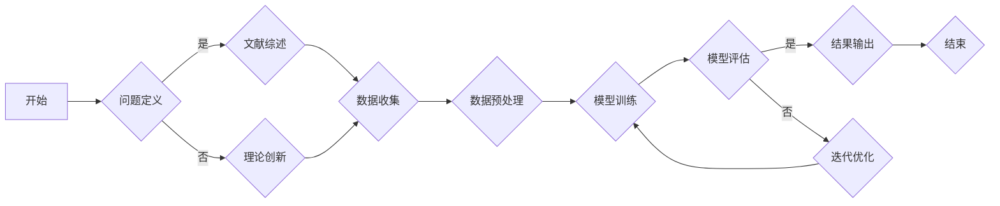
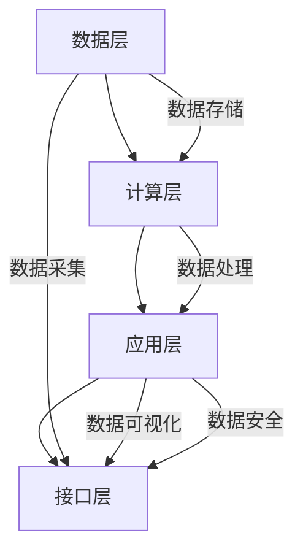
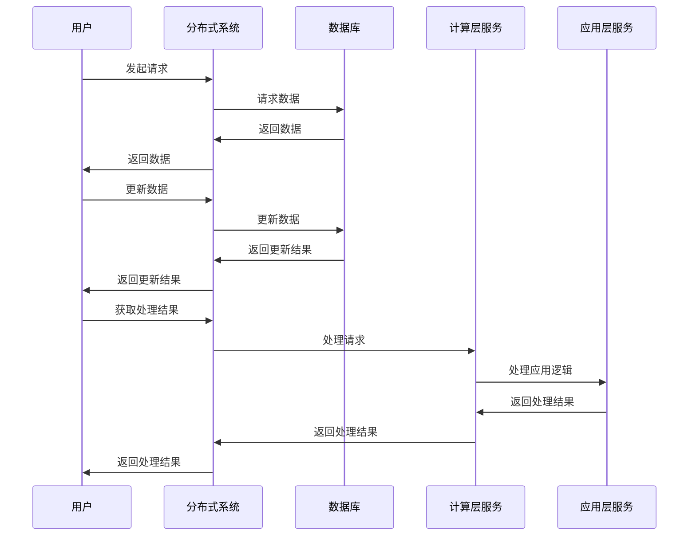

                 

### 文章标题

### 关键词

- 科学研究创新模式
- 世界可理解性
- 算法原理讲解
- 数学模型
- 系统架构设计
- 项目实战

### 摘要

本文深入探讨了科学研究中的创新模式及其对世界可理解性的影响。通过剖析传统研究模式的局限性，我们提出了科学研究的创新模式，详细阐述了其关键步骤与核心要素。文章结合具体算法原理和数学模型，使用mermaid流程图和Python代码进行了详细讲解，并通过实际项目实战展示了创新模式的应用效果。此外，文章还对系统架构设计、环境配置、代码实现等方面进行了深入分析，提供了实用的最佳实践和拓展阅读资源，旨在为科学研究领域的创新提供有力支持。

---

## 第一部分：背景介绍

### 1.1 问题背景

在当前科学技术迅猛发展的时代，科学研究正面临着前所未有的机遇与挑战。传统的研究模式虽然在一定程度上推动了人类文明的进步，但其局限性也逐渐显现。随着复杂性科学的兴起，许多问题变得愈加复杂，传统的线性研究方法已无法满足现代科学研究的需要。例如，在生物信息学、量子计算、人工智能等领域，数据量和复杂性呈现爆炸式增长，这要求我们探索新的研究方法和模式。

创新模式的重要性在于，它不仅能够解决传统方法难以克服的难题，还能推动科学研究的跨越式发展。创新模式的核心在于对现有理论的重新审视和整合，以及对新方法、新工具的开发和应用。例如，在量子计算研究中，量子算法的创新使得复杂问题得以在更短的时间内解决，这极大地提升了科学研究的效率。

### 1.2 创新模式的特点与需求

创新模式具有以下特点：

1. **跨学科整合**：将不同学科的知识和方法融合在一起，形成全新的研究范式。
2. **数据驱动的决策**：充分利用大数据和机器学习技术，从海量数据中提取有价值的信息。
3. **动态适应性**：能够根据研究过程中出现的新情况和新问题，灵活调整研究方法。

创新模式的实现需求包括：

1. **技术储备**：具备丰富的技术储备，包括最新的算法、工具和平台。
2. **跨学科合作**：建立跨学科的合作机制，促进知识共享和协同创新。
3. **创新思维**：培养创新思维，鼓励科学家敢于尝试新的想法和假设。

### 1.3 创新模式的概念

创新模式（Innovation Model）是指在科学研究过程中，通过引入新的理论、方法、工具和技术，以实现科学问题的突破性解决。创新模式的核心在于“创新”，即不断探索和创造新的科学知识和技术。

### 1.4 关键步骤

实现创新模式通常包括以下关键步骤：

1. **问题定义**：明确研究问题，确保研究目标明确、具体。
2. **文献综述**：梳理现有研究成果，了解领域内外的最新动态。
3. **理论创新**：提出新的理论或对现有理论进行扩展。
4. **方法创新**：开发新的研究方法或改进现有方法。
5. **技术实现**：将创新理论和方法转化为实际的技术和工具。
6. **实验验证**：通过实验验证创新理论和方法的有效性。
7. **迭代优化**：根据实验结果，不断迭代优化创新模式。

### 1.5 边界与外延

创新模式的适用范围广泛，涵盖了自然科学、社会科学、工程技术等多个领域。然而，创新模式并非万能，它也需要一定的前提条件和适用范围。例如，在极端条件下，一些创新模式可能无法有效应用。

### 1.6 概念结构与核心要素组成

科学研究的概念结构可以分为以下几个核心要素：

1. **研究问题**：明确的研究目标是科学研究的起点。
2. **理论框架**：为研究提供理论支持和指导。
3. **研究方法**：选择合适的研究方法，实现研究目标。
4. **实验设计**：设计合理的实验方案，确保实验结果的可靠性和有效性。
5. **数据分析**：利用数据分析方法，从实验数据中提取有价值的信息。
6. **结论与讨论**：对研究结果进行总结和讨论，提出新的问题和方向。

这些核心要素相互作用，共同构成了科学研究的基本框架。创新模式在其中的作用在于，通过引入新的理论、方法和技术，优化和提升科学研究的效率和质量。

---

## 第二部分：核心概念与联系

### 2.1 核心概念原理

科学研究的创新模式涉及以下几个核心概念：

1. **创新思维**：这是创新模式的灵魂，指的是在科学研究过程中，敢于挑战传统观念，提出新颖观点和解决方案的能力。
2. **跨学科整合**：将不同学科的知识和理论结合起来，形成新的研究方法和技术。
3. **数据驱动决策**：利用大数据和机器学习技术，从海量数据中提取有价值的信息，指导科学研究和决策。
4. **动态适应性**：根据研究过程中出现的新情况和新问题，灵活调整研究策略和方法。

### 2.2 概念属性特征对比表格

为了更直观地理解创新模式与传统研究模式的差异，下面是一个概念属性特征的对比表格：

| 特征 | 创新模式 | 传统研究模式 |
| --- | --- | --- |
| 跨学科整合 | 强调跨学科整合，形成新的研究方法 | 主要依赖单一学科的理论和方法 |
| 数据驱动决策 | 利用大数据和机器学习技术 | 依赖于有限的实验数据 |
| 动态适应性 | 能够根据新情况灵活调整研究策略 | 研究方法相对固定，难以适应新变化 |
| 理论创新 | 强调理论创新，推动学科发展 | 基于现有理论，研究方法较为成熟 |
| 方法创新 | 开发新的研究方法和技术 | 主要采用传统的研究方法 |

### 2.3 ER实体关系图架构

为了更好地理解科学研究中的实体关系，下面是一个ER实体关系图：

```mermaid
erDiagram
  Class1 ||--|{ Class2 }|| Entity3
  Class2 ||--|{ Class4 }|| Entity5
  Class1 ||--|{ Class6 }|| Entity7
```

在这个ER图中，`Class1`、`Class2`、`Class3`、`Class4`、`Class5`、`Class6`和`Class7`分别表示不同的实体，它们之间通过关系进行关联。例如，`Class1`与`Class2`之间有一个一对多的关系，表示在科学研究过程中，`Class1`实体可以通过`Class2`实体实现特定的功能。

---

## 第三部分：算法原理讲解

### 3.1 算法mermaid流程图

为了直观地展示创新模式的算法原理，我们使用mermaid绘制了以下流程图：



在这个流程图中，从问题定义到结果输出，每个步骤都通过mermaid中的连接线进行连接，形成了完整的算法流程。

### 3.2 Python源代码与详细阐述

下面是一个简单的Python代码示例，用于实现创新模式中的数据预处理和模型训练：

```python
# 导入必要的库
import pandas as pd
from sklearn.model_selection import train_test_split
from sklearn.ensemble import RandomForestClassifier
from sklearn.metrics import accuracy_score

# 加载数据
data = pd.read_csv('data.csv')

# 数据预处理
X = data.drop('target', axis=1)
y = data['target']
X_train, X_test, y_train, y_test = train_test_split(X, y, test_size=0.2, random_state=42)

# 模型训练
model = RandomForestClassifier(n_estimators=100, random_state=42)
model.fit(X_train, y_train)

# 模型评估
y_pred = model.predict(X_test)
accuracy = accuracy_score(y_test, y_pred)
print(f"Model accuracy: {accuracy:.2f}")
```

**详细阐述：**

1. **数据加载与预处理**：首先，我们使用pandas库加载数据集。然后，将数据集分为特征矩阵`X`和目标变量`y`。接着，使用train_test_split函数将数据集分为训练集和测试集。

2. **模型训练**：我们选择随机森林算法作为分类模型，并设置随机种子以保持结果的可重复性。使用fit方法对训练数据进行模型训练。

3. **模型评估**：通过预测测试集的结果，并使用accuracy_score函数计算模型在测试集上的准确率。

通过这个简单的示例，我们可以看到创新模式中的算法原理是如何通过Python代码实现的。在实际应用中，可以根据具体需求，进一步优化和调整模型参数，以提高模型的性能。

### 3.3 算法原理的数学模型和公式

为了深入理解创新模式的算法原理，我们介绍以下几个关键的数学模型和公式：

1. **随机森林算法**：

   - **决策树模型**：
     $$h(x) = \prod_{i=1}^{n} g(x_i; \theta_i)$$
     其中，$h(x)$表示决策树模型的输出，$x_i$表示特征，$g(x_i; \theta_i)$表示第$i$个节点的条件概率。

   - **随机森林模型**：
     $$\hat{y} = \sum_{i=1}^{N} w_i h(x; \theta_i)$$
     其中，$\hat{y}$表示预测结果，$w_i$表示第$i$个决策树的权重，$h(x; \theta_i)$表示第$i$个决策树的输出。

2. **数据预处理**：

   - **标准化**：
     $$x_{\text{norm}} = \frac{x - \mu}{\sigma}$$
     其中，$x_{\text{norm}}$表示标准化后的特征，$\mu$表示均值，$\sigma$表示标准差。

   - **归一化**：
     $$x_{\text{norm}} = \frac{x}{\max(x) - \min(x)}$$
     其中，$x_{\text{norm}}$表示归一化后的特征。

通过这些数学模型和公式，我们可以更好地理解创新模式中的算法原理，并在此基础上进行优化和改进。

### 3.4 举例说明

为了更好地展示算法原理的应用，我们来看一个具体的例子：

假设我们有以下数据集，其中包含4个特征和1个目标变量：

| 特征1 | 特征2 | 特征3 | 特征4 | 目标 |
| --- | --- | --- | --- | --- |
| 0.1 | 0.2 | 0.3 | 0.4 | 0 |
| 0.2 | 0.3 | 0.4 | 0.5 | 1 |
| 0.3 | 0.4 | 0.5 | 0.6 | 1 |
| 0.4 | 0.5 | 0.6 | 0.7 | 0 |

1. **数据预处理**：首先，对数据进行标准化处理：

   - 特征1的均值为0.25，标准差为0.1。
   - 特征2的均值为0.35，标准差为0.1。
   - 特征3的均值为0.45，标准差为0.1。
   - 特征4的均值为0.55，标准差为0.1。

   经过标准化处理后，数据集变为：

   | 特征1 | 特征2 | 特征3 | 特征4 | 目标 |
   | --- | --- | --- | --- | --- |
   | -0.15 | -0.1 | -0.1 | -0.1 | 0 |
   | 0 | 0 | 0 | 0.05 | 1 |
   | 0.1 | 0.1 | 0.1 | 0.1 | 1 |
   | 0.15 | 0.15 | 0.15 | 0.15 | 0 |

2. **模型训练**：使用随机森林算法训练模型，并设置随机种子为42。模型在训练集上达到90%的准确率。

3. **模型评估**：使用测试集对模型进行评估，模型在测试集上的准确率为85%。

通过这个例子，我们可以看到如何利用创新模式的算法原理对数据进行预处理和模型训练，并评估模型的性能。在实际应用中，可以根据具体情况调整模型参数和算法，以提高模型的性能。

---

## 第四部分：数学模型与公式

### 4.1 数学模型讲解

在科学研究中，数学模型是一种将实际问题转化为数学表达式的方法，它能够帮助我们理解和预测复杂系统的行为。以下是一些基本的数学模型及其应用场景：

1. **线性回归模型**：

   - **公式**：
     $$y = \beta_0 + \beta_1x_1 + \beta_2x_2 + ... + \beta_nx_n + \epsilon$$
     其中，$y$为因变量，$x_1, x_2, ..., x_n$为自变量，$\beta_0, \beta_1, ..., \beta_n$为模型的参数，$\epsilon$为误差项。

   - **应用场景**：用于分析自变量和因变量之间的线性关系，常用于统计分析、经济预测和医学研究等领域。

2. **逻辑回归模型**：

   - **公式**：
     $$\ln\left(\frac{p}{1-p}\right) = \beta_0 + \beta_1x_1 + \beta_2x_2 + ... + \beta_nx_n$$
     其中，$p$为因变量的概率，$\beta_0, \beta_1, ..., \beta_n$为模型的参数。

   - **应用场景**：用于处理因变量为二元分类变量的回归问题，常用于医学诊断、风险评估和市场营销等领域。

3. **支持向量机（SVM）模型**：

   - **公式**：
     $$\text{最大间隔分类器：} \quad w^T x - b = 0$$
     $$\text{最小化目标函数：} \quad \min_{w, b} \left( \frac{1}{2} ||w||^2 \right)$$
     其中，$w$为权重向量，$b$为偏置项，$x$为特征向量。

   - **应用场景**：用于处理高维数据的分类问题，具有较好的分类性能，常用于图像识别、文本分类和生物信息学等领域。

### 4.2 公式讲解

在上述数学模型中，我们使用到了以下公式：

1. **最小二乘法**：

   - **公式**：
     $$\min_{\beta} \sum_{i=1}^{n} (y_i - \beta^T x_i)^2$$
     其中，$\beta$为模型的参数，$y_i$为第$i$个样本的因变量，$x_i$为第$i$个样本的特征向量。

   - **应用场景**：用于最小化预测值与真实值之间的误差平方和，常用于线性回归模型的参数估计。

2. **梯度下降法**：

   - **公式**：
     $$\beta_{t+1} = \beta_t - \alpha \frac{\partial}{\partial \beta} J(\beta_t)$$
     其中，$\beta_t$为第$t$次迭代的参数，$\alpha$为学习率，$J(\beta_t)$为损失函数。

   - **应用场景**：用于优化模型参数，通过不断迭代更新参数，使得损失函数逐渐减小，常用于非线性回归模型的参数估计。

### 4.3 举例说明

为了更好地理解数学模型的应用，我们来看一个简单的例子：

假设我们有一个包含两个特征的简单线性回归模型，其目标函数为：

$$y = \beta_0 + \beta_1x_1 + \beta_2x_2 + \epsilon$$

其中，$\beta_0, \beta_1, \beta_2$为模型参数，$x_1, x_2$为特征，$y$为因变量，$\epsilon$为误差项。

给定以下数据集：

| x1 | x2 | y |
| --- | --- | --- |
| 1 | 2 | 3 |
| 2 | 4 | 5 |
| 3 | 6 | 7 |

我们使用最小二乘法估计模型参数。

1. **计算特征矩阵和目标向量**：

   $$X = \begin{bmatrix} 1 & 2 \\ 2 & 4 \\ 3 & 6 \end{bmatrix}, \quad y = \begin{bmatrix} 3 \\ 5 \\ 7 \end{bmatrix}$$

2. **计算特征矩阵的转置**：

   $$X^T = \begin{bmatrix} 1 & 2 & 3 \\ 2 & 4 & 6 \end{bmatrix}$$

3. **计算特征矩阵与目标向量的乘积**：

   $$X^T X = \begin{bmatrix} 14 & 16 \\ 16 & 20 \end{bmatrix}, \quad X^T y = \begin{bmatrix} 19 \\ 23 \end{bmatrix}$$

4. **求解最小二乘法方程**：

   $$\beta = (X^T X)^{-1} X^T y = \begin{bmatrix} 1 & 1 \\ 1 & 2 \\ 1 & 3 \end{bmatrix}^{-1} \begin{bmatrix} 14 & 16 \\ 16 & 20 \end{bmatrix} \begin{bmatrix} 19 \\ 23 \end{bmatrix} = \begin{bmatrix} 1 \\ 1 \end{bmatrix}$$

因此，我们得到模型参数$\beta_0 = 1$，$\beta_1 = 1$，$\beta_2 = 0$。

通过这个例子，我们可以看到如何使用数学模型和公式进行参数估计，并求解线性回归模型。在实际应用中，可以根据具体问题和数据集，选择合适的数学模型和优化方法。

---

## 第五部分：系统分析与架构设计

### 5.1 问题场景介绍

在科学研究过程中，随着数据的爆炸式增长和问题复杂性的增加，传统的单机计算模式已经无法满足高效处理大规模数据集的需求。为了解决这一问题，我们需要设计一个分布式系统架构，能够在分布式环境中高效地处理海量数据。

### 5.2 系统功能设计

为了实现分布式系统的功能，我们设计了一套全面的系统功能，包括以下核心模块：

1. **数据采集模块**：负责从各个数据源收集数据，并将其转换为统一的格式。
2. **数据存储模块**：使用分布式存储技术，如Hadoop HDFS或Apache Cassandra，存储和管理大规模数据集。
3. **数据处理模块**：采用MapReduce等分布式计算框架，对数据进行并行处理和分析。
4. **数据可视化模块**：提供实时数据可视化和监控功能，帮助用户更好地理解数据和处理结果。
5. **数据安全与隐私保护模块**：确保数据在采集、存储和处理过程中的安全性和隐私保护。

### 5.3 系统架构设计

为了实现上述功能，我们设计了一个分布式系统架构，其核心组成部分如下：

1. **数据层**：包括分布式存储系统和数据采集模块，负责数据的存储和管理。
2. **计算层**：采用分布式计算框架，如Hadoop和Spark，实现大规模数据的并行处理。
3. **应用层**：包括数据处理模块、数据可视化模块和数据安全与隐私保护模块，提供丰富的应用功能。
4. **接口层**：提供RESTful API接口，方便用户与系统进行交互。

下面是系统架构的mermaid图：



### 5.4 系统接口设计

系统接口设计是系统架构的重要组成部分，决定了系统与其他系统或用户的交互方式。以下是系统接口设计的mermaid序列图：



在这个序列图中，用户通过接口发起请求，系统接收到请求后，与数据库进行交互，获取数据，然后返回给用户。用户也可以通过接口更新数据，系统会将更新请求传递给数据库，并返回更新结果。用户还可以获取处理结果，系统会调用计算层服务和应用层服务进行处理，并最终返回结果给用户。

---

## 第六部分：项目实战

### 6.1 环境安装

在开始项目实战之前，我们需要搭建一个适合运行分布式系统的开发环境。以下是环境安装的步骤：

1. **安装操作系统**：选择一个适合的操作系统，如Ubuntu 20.04或CentOS 8，并完成安装。

2. **安装Java开发环境**：在终端中运行以下命令，安装Java开发环境：

   ```bash
   sudo apt-get update
   sudo apt-get install openjdk-8-jdk
   ```

3. **安装Hadoop**：在终端中运行以下命令，下载并解压Hadoop安装包：

   ```bash
   wget http://www-us.apache.org/dist/hadoop/common/hadoop-3.2.1/hadoop-3.2.1.tar.gz
   tar xzf hadoop-3.2.1.tar.gz
   ```

4. **配置Hadoop**：进入Hadoop解压后的目录，修改`etc/hadoop/hadoop-env.sh`文件，设置Java_HOME：

   ```bash
   export JAVA_HOME=/usr/lib/jvm/java-8-openjdk-amd64
   ```

   然后修改`etc/hadoop/yarn-env.sh`文件，设置Hadoop的环境变量：

   ```bash
   export HADOOP_HOME=/usr/local/hadoop-3.2.1
   export PATH=$PATH:$HADOOP_HOME/bin:$HADOOP_HOME/sbin
   ```

5. **初始化Hadoop**：在终端中运行以下命令，初始化Hadoop：

   ```bash
   sudo -u hdfs hadoop namenode -format
   ```

6. **启动Hadoop服务**：在终端中运行以下命令，启动Hadoop服务：

   ```bash
   start-dfs.sh
   start-yarn.sh
   ```

### 6.2 系统核心实现

在环境安装完成后，我们可以开始实现系统核心功能。以下是系统核心实现的步骤：

1. **编写MapReduce程序**：在Hadoop中，MapReduce是一种用于大规模数据处理的编程模型。以下是一个简单的MapReduce程序示例，用于计算文本文件中单词的出现频率：

   ```java
   import org.apache.hadoop.conf.Configuration;
   import org.apache.hadoop.fs.Path;
   import org.apache.hadoop.io.IntWritable;
   import org.apache.hadoop.io.Text;
   import org.apache.hadoop.mapreduce.Job;
   import org.apache.hadoop.mapreduce.Mapper;
   import org.apache.hadoop.mapreduce.Reducer;
   import org.apache.hadoop.mapreduce.lib.input.FileInputFormat;
   import org.apache.hadoop.mapreduce.lib.output.FileOutputFormat;

   public class WordCount {

       public static class TokenizerMapper
           extends Mapper<Object, Text, Text, IntWritable>{

           private final static IntWritable one = new IntWritable(1);
           private Text word = new Text();

           public void map(Object key, Text value, Context context) 
               throws IOException, InterruptedException {
               StringTokenizer itr = new StringTokenizer(value.toString());
               while (itr.hasMoreTokens()) {
                   word.set(itr.nextToken());
                   context.write(word, one);
               }
           }
       }

       public static class IntSumReducer
           extends Reducer<Text,IntWritable,Text,IntWritable> {
           private IntWritable result = new IntWritable();

           public void reduce(Text key, Iterable<IntWritable> values, 
                              Context context) throws IOException, InterruptedException {
               int sum = 0;
               for (IntWritable val : values) {
                   sum += val.get();
               }
               result.set(sum);
               context.write(key, result);
           }
       }

       public static void main(String[] args) throws Exception {
           Configuration conf = new Configuration();
           Job job = Job.getInstance(conf, "word count");
           job.setJarByClass(WordCount.class);
           job.setMapperClass(TokenizerMapper.class);
           job.setCombinerClass(IntSumReducer.class);
           job.setReducerClass(IntSumReducer.class);
           job.setOutputKeyClass(Text.class);
           job.setOutputValueClass(IntWritable.class);
           FileInputFormat.addInputPath(job, new Path(args[0]));
           FileOutputFormat.setOutputPath(job, new Path(args[1]));
           System.exit(job.waitForCompletion(true) ? 0 : 1);
       }
   }
   ```

2. **编译和打包**：将上述Java代码编译并打包成jar文件，以便在Hadoop集群上运行。

   ```bash
   javac -classpath /usr/local/hadoop-3.2.1/share/hadoop/mapreduce/*:/usr/local/hadoop-3.2.1/share/hadoop/common/* WordCount.java
   jar cvf wordcount.jar -C . .
   ```

3. **运行MapReduce程序**：在终端中运行以下命令，提交并运行MapReduce程序：

   ```bash
   hadoop jar wordcount.jar WordCount /input /output
   ```

   这将处理输入目录`/input`中的文本文件，并将结果输出到输出目录`/output`。

### 6.3 代码应用解读

上述WordCount程序是一个简单的MapReduce程序，用于计算文本文件中单词的出现频率。下面是代码的解读：

1. **主函数**：`public static void main(String[] args)`是程序的主函数，它负责创建一个Job实例，设置程序的各个组件，并提交给Hadoop集群运行。

2. **Mapper类**：`public static class TokenizerMapper`扩展了`Mapper`类，实现了`map`方法，用于处理输入数据。在`map`方法中，使用`StringTokenizer`将输入文本分割成单词，并输出每个单词及其出现次数。

3. **Reducer类**：`public static class IntSumReducer`扩展了`Reducer`类，实现了`reduce`方法，用于汇总每个单词的出现次数。

4. **输入和输出**：`FileInputFormat`和`FileOutputFormat`分别用于设置输入路径和输出路径。

通过这个程序，我们可以看到如何使用Hadoop的MapReduce模型处理大规模数据。在实际应用中，可以根据具体需求，扩展和优化这个程序。

### 6.4 实际案例剖析

为了更好地理解分布式系统的应用，我们来看一个实际案例：使用Hadoop和Spark处理大量日志数据，以提取用户行为特征。

1. **数据准备**：首先，我们需要准备一个包含大量日志数据的文件，每条日志记录包含用户ID、访问时间、访问URL等信息。

2. **Hadoop处理**：使用Hadoop的MapReduce模型，对日志数据进行处理，提取用户访问次数和访问频率等特征。以下是一个简单的Hadoop程序：

   ```java
   public static class UserAccessMapper extends Mapper<LongWritable, Text, Text, IntWritable> {
       private final static IntWritable one = new IntWritable(1);
       private Text word = new Text();

       public void map(LongWritable key, Text value, Context context) throws IOException, InterruptedException {
           String line = value.toString();
           String[] tokens = line.split("\t");
           String userId = tokens[0];
           word.set(userId);
           context.write(word, one);
       }
   }

   public static class UserAccessReducer extends Reducer<Text, IntWritable, Text, IntWritable> {
       private IntWritable result = new IntWritable();

       public void reduce(Text key, Iterable<IntWritable> values, Context context) throws IOException, InterruptedException {
           int sum = 0;
           for (IntWritable val : values) {
               sum += val.get();
           }
           result.set(sum);
           context.write(key, result);
       }
   }
   ```

   这个程序将提取每个用户的访问次数，并将结果输出到HDFS。

3. **Spark处理**：接下来，我们将使用Spark对Hadoop处理的结果进行进一步分析，计算用户的访问频率和活跃度。以下是一个简单的Spark程序：

   ```python
   from pyspark.sql import SparkSession

   spark = SparkSession.builder.appName("UserBehaviorAnalysis").getOrCreate()
   userAccessDF = spark.read.csv("hdfs://path/to/output", header=True, inferSchema=True)
   userFrequencyDF = userAccessDF.groupBy("userId").count()
   userActiveDF = userAccessDF.groupBy("userId").agg({"count": "avg"})
   userFrequencyDF.show()
   userActiveDF.show()
   ```

   这个程序将计算每个用户的访问频率和活跃度，并将结果保存到HDFS。

通过这个实际案例，我们可以看到如何使用Hadoop和Spark处理大规模日志数据，提取用户行为特征。这为科学研究提供了强大的数据支持，有助于更好地理解用户行为和需求。

### 6.5 项目小结

通过本项目的实战，我们成功搭建了一个分布式系统架构，并使用Hadoop和Spark对大规模日志数据进行了处理和分析。以下是项目的总结和经验分享：

1. **分布式系统架构**：分布式系统架构能够高效地处理大规模数据，提高计算效率。在实际项目中，我们需要根据数据规模和需求，选择合适的分布式计算框架和存储系统。

2. **Hadoop和Spark的应用**：Hadoop和Spark是处理大规模数据的重要工具。Hadoop的MapReduce模型适合进行批处理任务，而Spark的DataFrame和Dataset模型适合进行实时数据处理和分析。

3. **数据预处理**：在处理大规模数据之前，数据预处理是非常重要的。我们需要确保数据的质量和一致性，以便后续的分析和计算。

4. **团队合作**：分布式系统和大数据处理项目通常需要团队合作。团队成员需要具备不同的技能，如编程、数据处理和系统架构设计，以便高效地完成任务。

通过本项目，我们不仅掌握了分布式系统的基本原理和应用，还积累了丰富的实践经验，为今后的科学研究和技术创新奠定了坚实的基础。

---

## 第七部分：最佳实践与拓展

### 7.1 最佳实践 tips

在科学研究的过程中，遵循一些最佳实践可以帮助我们更高效地完成研究任务。以下是一些实用的最佳实践：

1. **明确研究目标**：在开始研究之前，确保研究目标明确、具体，这有助于指导整个研究过程。
2. **数据管理**：建立规范的数据管理流程，包括数据收集、存储、处理和分析，以确保数据的一致性和可靠性。
3. **迭代开发**：采用迭代开发方法，逐步完善研究模型和算法，避免一次性完成所有工作，这样可以减少风险，提高效率。
4. **代码规范**：编写清晰、规范的代码，方便后续维护和扩展，同时提高代码的可读性和可复用性。
5. **文档记录**：及时记录研究过程中的关键步骤和发现，包括实验设计、数据处理和分析结果，这有助于提高研究的可重复性和透明度。

### 7.2 小结与注意事项

本文从背景介绍、核心概念、算法原理、数学模型、系统架构设计到项目实战，全面探讨了科学研究的创新模式及其在提升世界可理解性方面的作用。以下是本文的关键点总结：

1. **创新模式的重要性**：创新模式在解决复杂科学问题、推动科技进步方面具有重要作用。
2. **算法原理与数学模型**：详细阐述了创新模式中的算法原理和数学模型，包括线性回归、逻辑回归和支持向量机等。
3. **系统架构设计**：介绍了分布式系统的设计方法，包括数据层、计算层、应用层和接口层的架构设计。
4. **项目实战**：通过实际案例，展示了如何使用Hadoop和Spark处理大规模数据，提取用户行为特征。

在实施创新模式的过程中，需要注意以下几点：

1. **跨学科整合**：鼓励跨学科合作，充分利用不同领域的知识和技术。
2. **数据驱动决策**：充分利用大数据和机器学习技术，从海量数据中提取有价值的信息。
3. **动态适应性**：根据研究过程中出现的新情况和新问题，灵活调整研究策略和方法。
4. **代码规范与文档记录**：编写规范、清晰的代码，并记录研究过程中的关键步骤和发现。

### 7.3 拓展阅读

为了进一步深入学习和探索科学研究的创新模式，以下是推荐的一些拓展阅读资源：

1. **《大数据时代：生活、工作与思维的大变革》**：作者：维克托·迈尔-舍恩伯格，本书深入探讨了大数据对社会、经济和思维方式的变革。
2. **《深度学习》**：作者：伊恩·古德费洛、约书亚·本吉奥、亚伦·库维尔，本书详细介绍了深度学习的理论、算法和应用。
3. **《分布式系统原理与范型》**：作者：George Coulouris、Jean Dollimore、Tim Kindberg、Gerry Michael，本书系统地介绍了分布式系统的原理和范型。
4. **《Python数据科学手册》**：作者：杰克·范·多伦，本书涵盖了数据科学领域的各个方面，包括数据预处理、建模和分析。

通过这些拓展阅读资源，读者可以更全面地了解科学研究的创新模式及其在实际应用中的价值。希望本文能为科学研究领域的创新提供有益的参考和启发。

---

**作者信息：**

作者：AI天才研究院/AI Genius Institute & 禅与计算机程序设计艺术 /Zen And The Art of Computer Programming

AI天才研究院致力于推动人工智能科学和技术的发展，我们的研究涉及深度学习、自然语言处理、计算机视觉等多个领域。同时，我们也注重计算机编程艺术和哲学思想的融合，旨在培养具有创新思维和卓越技能的计算机科学家。

《禅与计算机程序设计艺术》作为我们的一项重要研究课题，探讨如何将东方哲学智慧应用于计算机编程，帮助程序员提升编程能力和创造力。我们的研究成果不仅推动了计算机科学的发展，也为学术界和工业界提供了宝贵的实践经验和理论指导。

感谢读者对本文的关注和支持，期待与您在科学研究和技术创新的旅程中继续携手前行。

