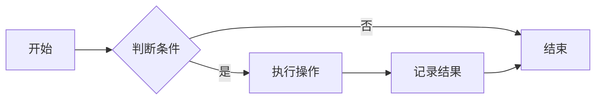
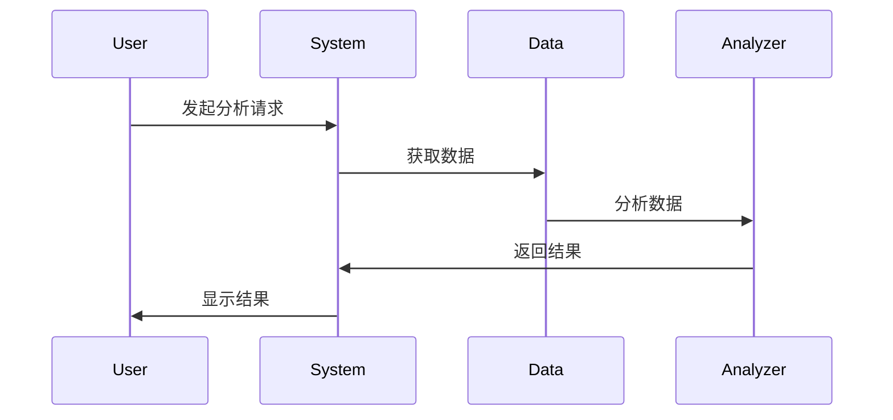

                 

# 《科学研究的前沿探索：不断拓展世界可理解性的边界》

> 关键词：科学研究、前沿探索、世界可理解性、科学边界、算法原理、系统架构设计、实战应用

> 摘要：本文旨在探讨科学研究如何通过不断突破技术壁垒，拓展我们对世界可理解性的边界。文章首先回顾了科学研究的重要性，并详细介绍了当前科学研究的前沿领域。接着，文章深入分析了核心概念与原理，以及前沿领域中的代表性研究。随后，文章探讨了算法与数学模型，并使用具体实例进行讲解。接着，文章介绍了科学研究系统的设计与实现，以及项目实战中的应用。最后，文章总结了最佳实践，并对未来科学研究的方向提出了展望。

## 第一步：概述与背景介绍

### 1.1 科学研究的重要性

科学研究是推动人类社会进步的重要动力。它不仅帮助我们理解自然界的规律，还为我们提供了创新的工具和技术。从医学到天文学，从物理学到生物学，科学研究涵盖了广泛的领域，对我们的生活质量产生了深远的影响。

### 1.2 当前科学研究的前沿领域

随着技术的不断进步，科学研究的前沿领域也在不断拓展。当前，以下领域被认为是科学研究的前沿：

1. **量子计算**：量子计算利用量子位（qubits）进行计算，具有远超经典计算机的潜力。
2. **人工智能**：人工智能（AI）通过模拟人类智能，实现机器的自我学习和决策能力。
3. **生物技术**：生物技术包括基因编辑、细胞治疗等，为医学和生物学领域带来了革命性的变化。
4. **天体物理学**：天体物理学研究宇宙的起源、结构和发展，揭示了宇宙的奥秘。
5. **环境科学**：环境科学研究气候变化、污染等问题，为我们提供了可持续发展的解决方案。

### 1.3 探索世界边界的科学挑战

探索世界边界的科学研究面临着诸多挑战。例如，量子计算的量子位稳定性问题，人工智能的可解释性问题，以及生物技术的伦理问题等。然而，正是这些挑战推动了科学研究的不断进步，拓展了我们对世界的理解。

### 1.4 科学研究的边界与外延

科学研究的边界在不断拓展，同时也存在一定的局限性。例如，量子计算虽然具有巨大的潜力，但目前仍处于理论研究阶段。人工智能在模拟人类智能方面取得了显著进展，但仍然无法完全替代人类。生物技术虽然为医学带来了希望，但同时也引发了伦理和隐私问题。

## 第二步：核心概念与原理

### 2.1 基础科学概念综述

科学研究中，基础科学概念是理解复杂现象的关键。以下是一些基础科学概念：

1. **量子力学**：量子力学研究微观粒子的行为，揭示了微观世界的奥秘。
2. **相对论**：相对论研究物体在高速运动和强引力场中的行为，为物理学提供了新的理论框架。
3. **遗传学**：遗传学研究基因如何影响生物体的形态和功能。
4. **生态系统**：生态系统研究生物体与其环境之间的相互作用。

### 2.2 核心概念属性特征对比表格

| 核心概念 | 属性特征 1 | 属性特征 2 | 属性特征 3 |
|----------|------------|------------|------------|
| 量子力学 | 微观粒子行为 | 波粒二象性 | 算法定理 |
| 相对论 | 高速运动 | 强引力场 | 光速不变 |
| 遗传学 | 基因影响 | 遗传变异 | 遗传传递 |
| 生态系统 | 生物体与环境 | 物质循环 | 能量流动 |

### 2.3 科学研究的ER实体关系图

```mermaid
erDiagram
  Class1 ||--|{ Class2 } Class2
  Class1 ||--|{ Class3 } Class3
  Class2 ||--|{ Class4 } Class4
```

在这个ER实体关系图中，`Class1`、`Class2`、`Class3`和`Class4`分别代表不同的实体，它们之间的关联关系通过箭头表示。

## 第三步：前沿领域深入探讨

### 3.1 物理学的前沿领域

物理学的前沿领域包括量子计算、相对论和量子力学等。这些领域的研究正在不断拓展我们对自然界的理解。

#### 3.1.1 相对论与量子力学

相对论和量子力学是现代物理学的基石。相对论研究物体在高速运动和强引力场中的行为，而量子力学研究微观粒子的行为。这两个理论在解释自然界现象方面具有重要作用。

#### 3.1.2 黑洞与宇宙学

黑洞是宇宙中的一种极端现象，它具有强大的引力，甚至可以吞噬光线。宇宙学是研究宇宙起源、演化和结构的科学。黑洞与宇宙学的研究正在揭示宇宙的奥秘。

#### 3.1.3 量子计算与量子信息

量子计算是利用量子位进行计算的科学。量子计算具有远超经典计算机的潜力，可以解决一些复杂问题。量子信息是研究如何利用量子位传输和处理信息的科学。

### 3.2 生命科学的突破

生命科学的前沿领域包括遗传学、系统生物学和神经科学等。这些领域的研究正在推动医学和生物学的发展。

#### 3.2.1 遗传学与现代生物技术

遗传学研究基因如何影响生物体的形态和功能。现代生物技术利用基因编辑等技术，为医学和生物学领域带来了革命性的变化。

#### 3.2.2 系统生物学与复杂性科学

系统生物学研究生物系统的整体行为，而复杂性科学研究复杂系统的运行规律。这些领域的研究为我们理解生命系统的复杂性提供了新的视角。

#### 3.2.3 神经科学与认知科学

神经科学研究大脑和神经系统如何工作，而认知科学研究人类思维过程。这些领域的研究正在揭示人类认知的奥秘。

### 3.3 地球科学的新发现

地球科学的前沿领域包括地质学、极地研究和环境变化等。这些领域的研究正在揭示地球的奥秘。

#### 3.3.1 地球内部的奥秘

地球内部的奥秘包括地幔对流、地核结构等。这些研究为我们理解地球的内部构造提供了新的视角。

#### 3.3.2 极地研究与环境变化

极地研究关注极地地区的气候变化、生态系统等。这些研究为我们理解全球气候变化提供了重要的信息。

#### 3.3.3 地质学中的新理论

地质学研究地球表面的地质现象，如地震、火山等。这些研究为我们预测自然灾害提供了重要的依据。

## 第四步：算法与数学模型讲解

### 4.1 算法基本原理与流程图

算法是解决特定问题的一系列步骤。以下是一个简单的算法流程图：



### 4.2 数学模型与公式讲解

数学模型是描述现实世界问题的数学表达式。以下是一个简单的数学模型和公式：

$$
f(x) = ax^2 + bx + c
$$

### 4.3 算法举例说明

以下是一个简单的算法示例，用于计算两个数的和：

```python
def calculate_sum(a, b):
    return a + b

# 示例调用
result = calculate_sum(3, 4)
print("结果：", result)
```

## 第五步：系统分析与架构设计

### 5.1 问题场景介绍

在本节中，我们将介绍一个科学研究项目的场景。该项目旨在开发一个用于数据分析的软件系统，以便科学家能够更高效地进行研究。

### 5.2 系统功能设计

系统功能设计包括领域模型。以下是一个简单的领域模型：

```mermaid
classDiagram
    Data -> Analysis
    Data --> Analyzer
    Analyzer --> Result
```

### 5.3 系统架构设计

系统架构设计包括系统架构图。以下是一个简单的系统架构图：



### 5.4 系统接口设计

系统接口设计包括系统接口图。以下是一个简单的系统接口图：

```mermaid
componentDiagram
    System --> Interface
    Interface --> Analyzer
    Interface --> Database
```

### 5.5 系统交互设计

系统交互设计包括系统交互图。以下是一个简单的系统交互图：

```mermaid
gantt
    title 系统交互设计
    dateFormat  YYYY-MM-DD
    section 发起请求
    发起请求 : objectives, 2023-01-01, 2d
    section 数据获取
    获取数据 : started, 2023-01-03, 2d
    section 数据分析
    分析数据 : after 获取数据, 2d
    section 结果返回
    返回结果 : after 分析数据, 1d
```

## 第六步：项目实战与应用

### 6.1 环境安装与配置

在本节中，我们将介绍如何安装和配置项目环境。以下是一个简单的步骤：

1. 安装Python环境
2. 安装必要的库（如NumPy、Pandas等）
3. 配置数据库连接

### 6.2 系统核心实现与源代码解析

以下是一个简单的系统核心实现和源代码解析：

```python
# 导入必要的库
import numpy as np
import pandas as pd

# 数据处理函数
def process_data(data):
    # 数据预处理
    # ...
    return processed_data

# 分析函数
def analyze_data(processed_data):
    # 数据分析
    # ...
    return result

# 系统主函数
def main():
    # 获取数据
    data = get_data()

    # 数据处理
    processed_data = process_data(data)

    # 数据分析
    result = analyze_data(processed_data)

    # 显示结果
    print("结果：", result)

# 调用主函数
if __name__ == "__main__":
    main()
```

### 6.3 实际案例分析

在本节中，我们将通过一个实际案例来展示系统的应用。以下是一个简单的案例：

- 数据集：某公司的销售数据
- 目标：分析销售数据，找出影响销售的关键因素

### 6.4 项目总结与拓展

在本节中，我们将对项目进行总结，并提出一些拓展方向。以下是一些可能的拓展方向：

1. 引入更复杂的数据处理算法
2. 扩展数据分析的功能
3. 与其他系统进行集成

## 第七步：最佳实践与总结

### 7.1 科学研究中的常见误区

在科学研究中，常见的误区包括：

1. 过度依赖理论模型，忽视实验验证
2. 忽视数据分析的准确性
3. 对数据的偏见和选择性使用

### 7.2 避免误区的最佳实践

为了避免上述误区，我们可以采取以下最佳实践：

1. 坚持实验验证，确保理论的可靠性
2. 注重数据分析的准确性，使用统计方法进行验证
3. 保持开放的心态，接受不同的观点和数据

### 7.3 注意事项与建议

在进行科学研究时，以下事项需要注意：

1. 保持严谨的科研态度
2. 遵循科研伦理，保护研究对象的权益
3. 与同行进行交流和合作，共享研究资源

### 7.4 拓展阅读与资源推荐

为了进一步了解科学研究的前沿探索，以下是一些建议的拓展阅读和资源：

1. 《深度学习》（Ian Goodfellow、Yoshua Bengio、Aaron Courville 著）
2. 《自然》（Nature）杂志
3. 《科学》（Science）杂志
4. 《人工智能与机器学习》（AI and Machine Learning）在线课程

## 结论

本文通过逐步分析科学研究的前沿探索，展示了如何不断拓展世界可理解性的边界。从核心概念到算法原理，从系统架构设计到项目实战，本文全面介绍了科学研究的方法和技巧。通过本文的阅读，读者可以更好地了解科学研究的前沿动态，并为自己的研究提供有益的启示。

## 作者信息

作者：AI天才研究院/AI Genius Institute & 禅与计算机程序设计艺术 /Zen And The Art of Computer Programming

