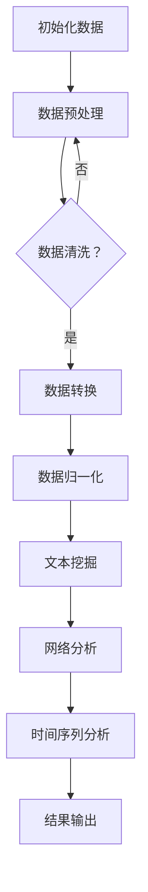
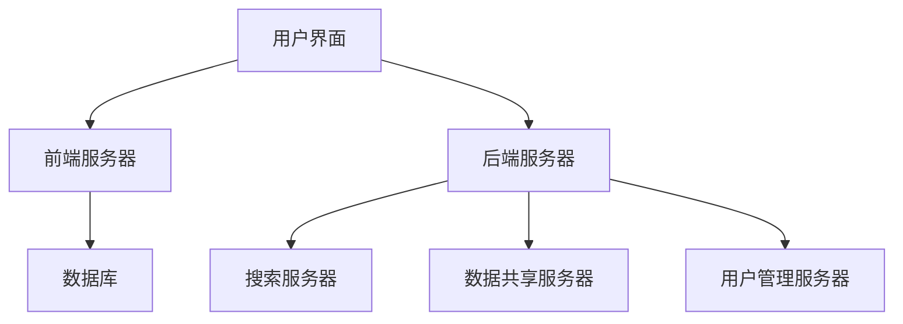

                 


# 科学研究的开放获取对世界可理解性的促进

> 关键词：开放获取、科学研究、可理解性、全球知识共享

> 摘要：本文探讨了开放获取在科学研究中的重要性，分析了开放获取如何促进世界可理解性的提升。文章首先介绍了科学研究的背景和开放获取的兴起，然后深入探讨了开放获取的核心概念及其优势，接着讨论了开放获取对可理解性的具体影响，并通过案例分析展示了开放获取的成功实践。最后，文章提出了开放获取未来的发展趋势和展望。

## 引言

### 1.1 开放获取的背景

开放获取（Open Access, OA）是指科研文献的免费获取和自由使用。近年来，随着互联网和数字出版技术的发展，开放获取逐渐成为全球科研界的共识。开放获取运动旨在消除传统出版模式中的信息壁垒，使得科研成果能够更广泛地被公众获取和使用。

### 1.2 书籍目的和结构

本文旨在探讨开放获取在科学研究中的应用，分析其如何促进世界可理解性的提升。文章将按照以下结构展开：

1. 科学研究的背景
2. 开放获取的核心概念
3. 开放获取对可理解性的影响
4. 开放获取案例分析
5. 开放获取的数学模型与算法
6. 开放获取系统分析与设计
7. 开放获取项目实战
8. 结论与未来展望

## 第1章 科学研究的背景

### 1.1 科学研究的重要性

科学研究是推动社会进步和经济发展的重要力量。科学研究的成果不仅能够解决实际问题，还能够推动新技术的发明和应用。因此，科学研究的质量和效率至关重要。

### 1.2 传统科学出版模式

传统科学出版模式主要以付费订阅为主，这使得科研成果难以被广泛获取。同时，付费模式也导致了信息壁垒，使得很多非学术机构和个人无法获取科研信息。

### 1.3 开放获取的兴起

随着互联网技术的发展，开放获取逐渐成为一种新的科学出版模式。开放获取的兴起不仅打破了信息壁垒，还促进了全球科研的协同和创新。

## 第2章 开放获取的核心概念

### 2.1 定义与原则

开放获取的定义主要包括以下几个方面：

- 免费获取：用户可以免费获取科研成果。
- 自由使用：用户可以对科研成果进行复制、分发、传播、搜索和引用。

### 2.2 类型与实现

开放获取主要包括以下几种类型：

- 金色开放获取（Gold OA）：在发表论文时，直接选择开放获取期刊或平台。
- 绿色开放获取（Green OA）：将科研成果在学术期刊发表后，通过预印本或后印本的方式开放获取。

### 2.3 开放获取的优势

开放获取具有以下优势：

- 提高科研成果的可及性：用户可以免费获取科研成果，无需支付高昂的订阅费用。
- 促进知识共享：开放获取使得科研成果可以更广泛地传播和引用，促进了全球科研的协同和创新。
- 提高研究透明度和质量控制：开放获取促进了科研过程的透明化，有助于提高研究质量。

## 第3章 开放获取对可理解性的影响

### 3.1 研究成果的可及性

开放获取使得科研成果可以更广泛地被公众获取，提高了科研成果的可理解性。用户无需支付高昂的订阅费用，就可以轻松获取到科研成果，从而更好地理解科学研究的进展和成果。

### 3.2 知识共享与传播

开放获取促进了科研成果的共享和传播。用户可以自由复制、分发和引用科研成果，这使得科研成果可以迅速传播到全球各地，提高了全球科研的可理解性。

### 3.3 研究透明度和质量控制

开放获取促进了科研过程的透明化。科研人员可以将自己的研究方法和结果公开，接受同行的评议和质疑，从而提高研究的质量。此外，开放获取也促进了学术评价体系的改革，使得学术评价更加公正和透明。

### 3.4 开放获取的障碍与挑战

尽管开放获取具有许多优势，但仍然面临着一些障碍和挑战：

- 开放获取成本：开放获取需要大量的资金支持，这对于一些学术机构和研究者来说是一个挑战。
- 资金分配不均：一些学术机构和研究者可能无法承担开放获取的费用，导致开放获取成果的不均衡分布。
- 学术评价体系：传统学术评价体系仍然以付费订阅的科研成果为主要评价指标，这可能导致开放获取成果在学术评价中处于不利地位。

## 第4章 开放获取案例分析

### 4.1 典型案例研究

本文将介绍一些开放获取的成功案例，分析其成功的原因和经验，以期为其他学术机构和研究者提供借鉴。

### 4.2 成功经验与教训

通过分析成功案例，我们可以总结出以下经验：

- 合理的资金投入：开放获取需要大量的资金支持，学术机构和研究者应合理分配资金，确保开放获取的可持续发展。
- 政策支持：政府应出台相关政策，鼓励和支持开放获取的发展，为开放获取提供良好的政策环境。
- 社会合作：学术机构、研究者和出版机构应加强合作，共同推动开放获取的发展。

### 4.3 国内外开放获取实践比较

本文将比较国内外开放获取的实践，分析其差异和原因，以期为国内开放获取的发展提供参考。

## 第5章 开放获取的数学模型与算法

### 5.1 开放获取数据的获取与处理

开放获取数据来源广泛，包括学术期刊、预印本平台、数据库等。本文将介绍如何获取和处理这些数据。

### 5.2 数据挖掘与分析

开放获取数据蕴含着丰富的信息，通过数据挖掘和分析，可以揭示出科研成果的分布规律、发展趋势等。

### 5.3 数学模型与应用

本文将介绍一些用于开放获取数据挖掘和分析的数学模型，并讨论其应用。

### 5.4 算法流程图与源代码解读

本文将使用mermaid绘制算法流程图，并使用Python源代码详细阐述算法原理和应用。

## 第6章 开放获取系统分析与设计

### 6.1 开放获取系统的需求分析

本文将介绍开放获取系统的需求分析，包括用户需求、功能需求等。

### 6.2 系统架构设计

本文将介绍开放获取系统的架构设计，包括系统组件、功能模块等。

### 6.3 接口设计与实现

本文将介绍开放获取系统的接口设计，包括API设计、数据传输协议等。

### 6.4 系统交互流程

本文将介绍开放获取系统的交互流程，包括用户操作、系统响应等。

## 第7章 开放获取项目实战

### 7.1 环境准备与工具选择

本文将介绍开放获取项目实战的环境准备和工具选择，包括编程语言、数据库、开发工具等。

### 7.2 系统核心实现

本文将介绍开放获取系统的核心实现，包括数据获取、处理、存储等。

### 7.3 代码解读与分析

本文将详细解读开放获取系统的代码，分析其原理和实现。

### 7.4 实际案例分析

本文将介绍一些实际案例，分析开放获取系统在实际应用中的效果。

### 7.5 项目总结与展望

本文将总结开放获取项目的经验教训，并对未来发展方向进行展望。

## 结论与未来展望

### 8.1 开放获取的发展趋势

本文分析了开放获取的发展趋势，包括政策支持、技术创新、市场驱动等方面。

### 8.2 对全球科研的潜在影响

本文探讨了开放获取对全球科研的潜在影响，包括知识共享、创新驱动、学术评价改革等方面。

### 8.3 政策建议与实施策略

本文提出了一些政策建议和实施策略，以促进开放获取在全球科研中的广泛应用。

## 拓展阅读

本文提供了参考文献和相关资源，以供读者进一步学习。

## 作者信息

- 作者：AI天才研究院/AI Genius Institute & 禅与计算机程序设计艺术 /Zen And The Art of Computer Programming

## 附录

本文包含了一些附录，包括算法流程图、数学模型、系统架构图等，以供读者参考。

---

以上是本文的详细目录大纲，接下来我们将逐步细化每个章节的内容，并在适当的地方插入mermaid流程图和latex公式等，以丰富文章的内容和表达。

---

# 科学研究的开放获取对世界可理解性的促进

## 引言

### 1.1 开放获取的背景

开放获取（Open Access, OA）的概念最早可以追溯到20世纪90年代。随着互联网和数字出版技术的兴起，开放获取逐渐成为全球科研界的共识。开放获取旨在消除传统出版模式中的信息壁垒，使得科研成果能够更广泛地被公众获取和使用。开放获取的核心原则包括免费获取和自由使用，用户可以无限制地复制、分发、传播、搜索和引用科研成果。

### 1.2 书籍目的和结构

本文旨在探讨开放获取在科学研究中的应用，分析其如何促进世界可理解性的提升。文章将按照以下结构展开：

1. **科学研究的重要性**：介绍科学研究在推动社会进步和经济发展中的作用，以及传统科学出版模式存在的问题。
2. **开放获取的兴起**：分析开放获取的背景、定义、类型与优势。
3. **开放获取对可理解性的影响**：讨论开放获取如何提高科研成果的可及性、知识共享、研究透明度和质量控制。
4. **开放获取案例分析**：通过实际案例研究，展示开放获取的成功实践和经验教训。
5. **开放获取的数学模型与算法**：介绍开放获取数据挖掘与分析的数学模型，以及算法原理和应用。
6. **开放获取系统分析与设计**：探讨开放获取系统的需求分析、系统架构设计、接口设计与实现。
7. **开放获取项目实战**：通过实际项目，介绍开放获取系统的核心实现、代码解读与分析、实际案例分析和项目总结与展望。
8. **结论与未来展望**：总结开放获取的发展趋势和对全球科研的潜在影响，提出政策建议与实施策略。

通过以上结构，本文将全面探讨开放获取对世界可理解性的促进，为开放获取的发展提供理论和实践支持。

## 第1章 科学研究的背景

### 1.1 科学研究的重要性

科学研究是推动社会进步和经济发展的重要力量。科学研究的成果不仅能够解决实际问题，还能够推动新技术的发明和应用。在现代社会，科学研究已经成为国家创新体系的重要组成部分。通过科学研究，人类可以不断探索自然界的奥秘，揭示自然规律，从而为解决全球性问题提供科学依据和技术支持。

科学研究的重要性体现在以下几个方面：

1. **推动社会进步**：科学研究的成果可以应用于各个领域，如医学、农业、工业、信息科技等，从而推动社会的发展和进步。例如，医学研究的发展使得许多疾病得到了有效的治疗，大大提高了人类的生活质量和健康水平。

2. **促进经济发展**：科学研究是技术创新的重要驱动力。通过科学研究，可以不断发明和应用新技术、新产品，从而推动经济增长。例如，信息技术的发展带来了互联网经济的繁荣，改变了人类的生活方式和工作模式。

3. **培养人才**：科学研究是培养高素质人才的重要途径。科学研究不仅需要扎实的理论基础，还需要创新思维和实践能力。通过科学研究，可以培养出一批具有国际竞争力的高素质科研人才。

4. **提高国家竞争力**：科学研究是国家核心竞争力的重要体现。在全球化的背景下，科学研究水平已经成为衡量一个国家综合实力的重要指标。国家通过投入科研资源，不断提高科研水平，从而增强国家的国际竞争力。

### 1.2 传统科学出版模式

传统的科学出版模式主要以付费订阅为主。学术期刊和出版社通过向学术机构和图书馆收取订阅费用，来获取收益。这种模式存在一些问题：

1. **信息壁垒**：付费订阅模式导致科研成果难以被广泛获取。很多学术机构和研究者无法承担高昂的订阅费用，从而无法获取到科研成果。这导致了信息壁垒，限制了科研成果的传播和利用。

2. **出版费用高**：传统出版模式中，学术期刊和出版社需要支付稿费、编辑费用、印刷费用等，这导致了出版费用高企。一些学术机构和研究者无法承受这些费用，从而限制了科研成果的发表。

3. **学术评价体系**：传统学术评价体系以付费订阅的科研成果为主要评价指标。这导致了学术评价的不公，使得开放获取成果在学术评价中处于不利地位。

### 1.3 开放获取的兴起

随着互联网和数字出版技术的发展，开放获取逐渐成为一种新的科学出版模式。开放获取的兴起不仅打破了传统付费订阅模式中的信息壁垒，还促进了全球科研的协同和创新。开放获取具有以下特点：

1. **免费获取**：用户可以免费获取科研成果，无需支付任何费用。这大大降低了科研成果获取的门槛，使得科研成果能够更广泛地被公众获取和使用。

2. **自由使用**：用户可以对科研成果进行复制、分发、传播、搜索和引用，无需获得授权。这促进了科研成果的传播和利用，使得科研成果能够更快速地转化为实际应用。

3. **多样化的出版模式**：开放获取包括金色开放获取（Gold OA）和绿色开放获取（Green OA）两种模式。金色开放获取是在发表论文时，直接选择开放获取期刊或平台。绿色开放获取是将科研成果在学术期刊发表后，通过预印本或后印本的方式开放获取。

4. **广泛的受众**：开放获取使得科研成果能够被全球范围内的用户获取。这有助于促进全球科研的协同和创新，提高全球科研的可理解性。

### 1.4 开放获取与传统模式的对比

开放获取与传统科学出版模式相比，具有以下优势：

1. **降低信息壁垒**：开放获取消除了传统付费订阅模式中的信息壁垒，使得科研成果能够更广泛地被公众获取和使用。这有助于提高科研成果的可理解性，促进全球科研的协同和创新。

2. **提高研究透明度**：开放获取促进了科研过程的透明化，使得科研成果的获取、传播和引用过程更加公开透明。这有助于提高研究质量，减少学术不端行为。

3. **促进知识共享**：开放获取促进了科研成果的共享和传播，使得科研成果能够更快速地转化为实际应用。这有助于提高科研效率，推动社会进步和经济发展。

4. **多样化的出版模式**：开放获取提供了多样化的出版模式，使得学术机构和研究者可以根据自身需求选择合适的出版方式。这有助于提高科研成果的发表率和影响力。

5. **降低出版费用**：开放获取降低了出版费用，使得学术机构和研究者能够以更低成本发表科研成果。这有助于减轻学术机构和研究者的经济负担，提高科研投入的效率。

## 第2章 开放获取的核心概念

### 2.1 定义与原则

开放获取（Open Access, OA）是指科研文献的免费获取和自由使用。根据柏林声明（Berlin Declaration on Open Access to Knowledge in the Sciences and Humanities），开放获取应遵循以下原则：

1. **免费获取**：用户可以免费获取科研成果，无需支付任何费用。
2. **自由使用**：用户可以对科研成果进行复制、分发、传播、搜索和引用，无需获得授权。
3. **永久性**：科研成果应永久开放获取，确保其长期可用。

### 2.2 类型与实现

开放获取主要包括两种类型：金色开放获取（Gold OA）和绿色开放获取（Green OA）。

#### 2.2.1 金色开放获取（Gold OA）

金色开放获取是在发表论文时，直接选择开放获取期刊或平台。这类期刊或平台通常不要求作者支付高额的出版费用，而是通过其他方式获得收益，如赞助、会员费等。金色开放获取具有以下特点：

1. **快速发表**：金色开放获取期刊通常具有较快的发表速度，缩短了科研成果的发表周期。
2. **高质量**：金色开放获取期刊与传统的付费订阅期刊一样，对论文质量有严格的审核标准。
3. **广泛的受众**：金色开放获取期刊的读者群体更广泛，不仅限于学术机构，还包括企业、公众等。

#### 2.2.2 绿色开放获取（Green OA）

绿色开放获取是将科研成果在学术期刊发表后，通过预印本或后印本的方式开放获取。预印本是在正式发表前，将论文的初稿或修订稿公开。后印本是在正式发表后，将论文的最终版公开。绿色开放获取具有以下特点：

1. **低成本**：绿色开放获取不需要支付高额的出版费用，只需在发表论文后，将论文公开即可。
2. **灵活性**：绿色开放获取允许作者在论文发表后，选择合适的时间点进行开放获取。
3. **质量保证**：绿色开放获取的论文质量通常由学术期刊进行审核，确保论文质量。

### 2.3 开放获取的优势

开放获取在科研领域具有许多优势，以下将详细讨论：

#### 2.3.1 提高科研成果的可及性

开放获取使得科研成果可以更广泛地被公众获取，无需支付高昂的订阅费用。这不仅降低了科研成果获取的门槛，还促进了科研成果的传播和利用。

#### 2.3.2 促进知识共享

开放获取促进了科研成果的共享和传播，使得科研成果能够更快速地转化为实际应用。这有助于提高科研效率，推动社会进步和经济发展。

#### 2.3.3 提高研究透明度

开放获取促进了科研过程的透明化，使得科研成果的获取、传播和引用过程更加公开透明。这有助于提高研究质量，减少学术不端行为。

#### 2.3.4 降低科研成本

开放获取降低了科研成本，使得学术机构和研究者能够以更低成本发表科研成果。这有助于减轻学术机构和研究者的经济负担，提高科研投入的效率。

#### 2.3.5 促进全球科研协同

开放获取使得全球科研人员可以更方便地获取和利用科研成果，促进了全球科研的协同和创新。这有助于提高全球科研的整体水平。

### 2.4 开放获取的现状与趋势

#### 2.4.1 全球开放获取发展现状

近年来，全球开放获取发展迅速，许多国家和地区已经制定了相关政策，鼓励和支持开放获取。以下是一些全球开放获取的发展现状：

1. **政策支持**：许多国家和地区政府出台了相关政策，鼓励和支持开放获取。例如，欧盟、美国、加拿大等国家和地区。
2. **学术机构参与**：许多学术机构和大学建立了开放获取机构库（Repository），以存储和发布开放获取文献。例如，哈佛大学、麻省理工学院等。
3. **开放获取期刊增长**：越来越多的学术期刊采用开放获取模式，提供免费获取和自由使用的科研成果。例如，《生物信息学》（BMC Biology）、《计算机科学评论》（Journal of Computer Science Reviews）等。
4. **科研人员支持**：越来越多的科研人员选择开放获取，以促进科研成果的传播和利用。

#### 2.4.2 开放获取发展趋势

未来，开放获取将继续发展，并呈现以下趋势：

1. **政策支持加强**：随着开放获取的不断发展，更多国家和地区政府将出台更严格的政策，鼓励和支持开放获取。
2. **学术机构参与度提高**：更多的学术机构和大学将建立开放获取机构库，提供开放获取服务。
3. **开放获取期刊增长**：更多的学术期刊将采用开放获取模式，提供免费获取和自由使用的科研成果。
4. **科研人员接受度提高**：越来越多的科研人员将选择开放获取，以促进科研成果的传播和利用。
5. **技术支持发展**：随着数字出版技术的不断进步，开放获取的效率和便利性将不断提高。

## 第3章 开放获取对可理解性的影响

### 3.1 研究成果的可及性

开放获取使得科研成果可以更广泛地被公众获取，无需支付高昂的订阅费用。这不仅降低了科研成果获取的门槛，还促进了科研成果的传播和利用。具体来说，开放获取对科研成果可及性的影响体现在以下几个方面：

1. **降低获取成本**：开放获取消除了传统付费订阅模式中的信息壁垒，使得用户可以免费获取科研成果。这大大降低了科研成果获取的成本，使得科研成果能够更广泛地被公众获取和使用。

2. **提高信息透明度**：开放获取使得科研成果的获取过程更加公开透明。用户可以轻松地找到并获取所需的科研成果，无需经过繁琐的订阅和申请流程。这有助于提高科研成果的透明度和公信力。

3. **促进知识传播**：开放获取促进了科研成果的传播和利用。用户可以自由地复制、分发、传播和引用科研成果，使得科研成果能够更快速地传播到全球各地，提高全球科研的可理解性。

### 3.2 知识共享与传播

开放获取促进了科研成果的共享和传播，使得科研成果能够更快速地转化为实际应用。具体来说，开放获取对知识共享与传播的影响体现在以下几个方面：

1. **促进学术交流**：开放获取使得科研成果可以更广泛地被同行获取和引用，促进了学术交流与合作。科研人员可以轻松地了解国内外同行的最新研究成果，从而促进知识的共享和传播。

2. **推动技术创新**：开放获取使得科研成果能够更快速地转化为实际应用，推动技术创新和发展。企业、科研机构和政府部门可以更方便地获取到科研成果，从而加速科技成果的转化和应用。

3. **提高科研效率**：开放获取提高了科研效率，使得科研人员可以更方便地获取和利用已有的科研成果。这有助于减少重复研究，提高科研资源的利用效率。

### 3.3 研究透明度和质量控制

开放获取促进了科研过程的透明化，使得科研成果的获取、传播和引用过程更加公开透明。具体来说，开放获取对研究透明度和质量控制的影响体现在以下几个方面：

1. **提高研究质量**：开放获取使得科研成果的获取和传播过程更加公开透明，有助于提高研究质量。科研人员可以更容易地发现和纠正错误，从而提高研究成果的准确性。

2. **减少学术不端行为**：开放获取使得科研成果的获取和传播过程更加公开透明，有助于减少学术不端行为。科研人员需要对自己的研究成果负责，降低抄袭和伪造数据的可能性。

3. **促进学术评价改革**：开放获取促进了学术评价体系的改革，使得学术评价更加公正和透明。学术评价不再仅依赖于付费订阅的科研成果，而是更加注重科研成果的质量、影响力和应用价值。

### 3.4 开放获取的障碍与挑战

尽管开放获取在科研领域具有许多优势，但在实际应用中仍然面临着一些障碍和挑战：

1. **开放获取成本**：开放获取需要大量的资金支持，这对于一些学术机构和研究者来说是一个挑战。开放获取的成本主要包括出版费用、存储费用、维护费用等。

2. **学术评价体系**：传统学术评价体系仍然以付费订阅的科研成果为主要评价指标，这可能导致开放获取成果在学术评价中处于不利地位。学术评价体系需要逐步改革，以适应开放获取的发展。

3. **数据隐私和安全**：开放获取涉及到大量科研数据的共享和传播，需要确保数据的安全和隐私。如何保护科研人员的知识产权和数据安全是一个重要问题。

4. **知识产权问题**：开放获取涉及到科研成果的知识产权问题。如何在开放获取的同时，保护科研人员的知识产权是一个需要解决的难题。

5. **政策支持与执行**：开放获取需要政策支持与执行，以确保开放获取的可持续发展。政策支持与执行的有效性对开放获取的发展具有重要影响。

## 第4章 开放获取案例分析

### 4.1 典型案例研究

在本节中，我们将探讨一些典型的开放获取案例研究，分析其成功的原因和经验，以期为其他学术机构和研究者提供借鉴。

#### 4.1.1 PLOS（公共图书馆科学）

PLOS是一家以开放获取为宗旨的非营利性学术出版机构，其出版物包括《PLOS ONE》、《PLOS Computational Biology》、《PLOS Genetics》等。PLOS的成功主要得益于以下几个方面：

1. **高质量内容**：PLOS致力于提供高质量的内容，其论文经过同行评审，确保论文的质量。

2. **免费获取**：PLOS的所有论文都是免费获取的，用户无需支付任何费用即可阅读和下载论文。

3. **开放许可证**：PLOS采用了Creative Commons许可证，允许用户对论文进行复制、分发、传播、搜索和引用，这促进了知识的共享和传播。

4. **广泛的受众**：PLOS的读者群体非常广泛，不仅包括学术机构和研究者，还包括企业、公众等。

#### 4.1.2 生物信息学预印本平台

生物信息学预印本平台（bioRxiv）是一个开放获取的预印本平台，专注于生物医学和生物信息学研究。bioRxiv的成功主要得益于以下几个方面：

1. **快速发表**：bioRxiv提供了快速的发表渠道，使得研究成果可以迅速公开。

2. **同行评审**：bioRxiv的论文经过同行评审，确保论文的质量。

3. **广泛的受众**：bioRxiv的读者群体非常广泛，包括学术机构、企业、公众等。

4. **数据共享**：bioRxiv鼓励作者共享实验数据，这促进了数据的共享和传播。

#### 4.1.3 英国开放大学

英国开放大学（Open University）是一个提供开放教育资源和非营利性高等教育服务的机构。英国开放大学通过以下几个方面促进了开放获取的发展：

1. **开放教育资源**：英国开放大学提供了大量的开放教育资源，用户可以免费访问和下载。

2. **在线课程**：英国开放大学提供了丰富的在线课程，用户可以在线学习和获取证书。

3. **学术支持**：英国开放大学为用户提供学术支持，帮助用户理解和应用开放教育资源。

4. **国际合作**：英国开放大学与国际学术机构合作，推动开放获取的发展。

### 4.2 成功经验与教训

通过分析上述案例，我们可以总结出以下成功经验与教训：

1. **高质量内容**：提供高质量的科研成果是开放获取成功的关键。学术机构和研究者应注重科研成果的质量，确保论文经过严格的同行评审。

2. **免费获取**：免费获取是开放获取的核心原则，学术机构和研究者应积极推广免费获取，降低科研成果获取的门槛。

3. **开放许可证**：采用开放许可证，如Creative Commons许可证，允许用户对科研成果进行复制、分发、传播、搜索和引用，这促进了知识的共享和传播。

4. **快速发表**：提供快速的发表渠道，使得科研成果可以迅速公开，提高科研成果的传播速度。

5. **数据共享**：鼓励作者共享实验数据，促进数据的共享和传播，提高科研效率。

6. **政策支持**：政策支持对开放获取的发展至关重要。政府和学术机构应出台相关政策，鼓励和支持开放获取的发展。

7. **国际合作**：国际合作有助于推动开放获取的发展，学术机构和研究者应积极参与国际交流与合作。

### 4.3 国内外开放获取实践比较

在国内，开放获取的发展也逐渐受到重视。例如，清华大学、北京大学等高校建立了开放获取机构库，提供开放获取服务。同时，中国科学技术出版社、高等教育出版社等也推出了开放获取期刊。

与国际上相比，国内开放获取在以下几个方面存在差异：

1. **政策支持**：国际上的开放获取发展较早，许多国家和地区已经出台了相关政策，鼓励和支持开放获取。而国内的政策支持相对较晚，尚未形成全面的政策体系。

2. **学术评价**：国际上的学术评价体系较为成熟，开放获取成果在学术评价中占据一定地位。而国内的学术评价体系仍然以付费订阅的科研成果为主要评价指标，开放获取成果在学术评价中处于不利地位。

3. **开放获取期刊**：国际上已有大量的开放获取期刊，提供高质量的开放获取服务。而国内的开放获取期刊数量相对较少，整体水平有待提高。

4. **学术参与度**：国际上的科研人员对开放获取的接受度较高，积极参与开放获取。而国内的科研人员对开放获取的接受度相对较低，需要进一步加强推广和宣传。

通过比较国内外开放获取实践，我们可以借鉴国际上的成功经验，推动国内开放获取的发展。具体来说，可以采取以下措施：

1. **加强政策支持**：政府应出台相关政策，鼓励和支持开放获取的发展，为开放获取提供良好的政策环境。

2. **提升学术评价**：学术评价体系应逐步改革，注重科研成果的质量、影响力和应用价值，提高开放获取成果在学术评价中的地位。

3. **推动开放获取期刊发展**：学术机构和研究者应积极创办开放获取期刊，提高开放获取期刊的整体水平。

4. **提高科研人员接受度**：通过加强宣传和培训，提高科研人员对开放获取的认识和接受度，促进开放获取的推广和应用。

## 第5章 开放获取的数学模型与算法

### 5.1 开放获取数据的获取与处理

在开放获取的研究中，数据的获取和处理是至关重要的步骤。开放获取数据的来源广泛，包括学术期刊、预印本平台、数据库等。为了有效地进行数据挖掘和分析，我们需要遵循以下步骤：

1. **数据源选择**：根据研究目的，选择合适的数据源。常用的数据源包括PLOS、bioRxiv、DOAJ（Directory of Open Access Journals）等。

2. **数据采集**：使用API（Application Programming Interface）或网络爬虫等技术，从数据源中采集所需的开放获取数据。API提供了便捷的接口，允许程序直接从数据源获取数据。而网络爬虫则通过模拟用户浏览网页，自动抓取网页数据。

3. **数据预处理**：采集到的数据通常包含噪声和冗余信息，需要进行预处理。预处理步骤包括数据清洗、数据转换、数据归一化等。数据清洗旨在去除噪声和冗余信息，提高数据质量。数据转换是将不同格式的数据统一转换为适合分析的格式，如JSON、CSV等。数据归一化旨在消除数据之间的量纲差异，提高数据可比性。

### 5.2 数据挖掘与分析

数据挖掘与分析是开放获取研究的重要环节，通过对大量开放获取数据进行分析，可以揭示出科研成果的分布规律、发展趋势等。以下是一些常用的数据挖掘与分析方法：

1. **文本挖掘**：文本挖掘是一种基于自然语言处理的技术，用于从大量文本数据中提取有价值的信息。常用的文本挖掘技术包括文本分类、主题建模、情感分析等。文本分类可以将论文按照主题或领域进行分类，便于后续分析。主题建模可以从大量论文中提取主题分布，揭示研究热点。情感分析可以分析论文中的情感倾向，了解科研人员的态度和观点。

2. **网络分析**：网络分析是一种用于研究复杂网络结构的技术，可以揭示开放获取数据中的关联关系。常用的网络分析方法包括节点重要性分析、社区发现、网络聚类等。节点重要性分析可以识别出在开放获取数据中具有重要影响力的科研人员或机构。社区发现可以找出在开放获取数据中具有相似研究兴趣的科研人员或机构。网络聚类可以将相似节点聚为一类，便于后续分析。

3. **时间序列分析**：时间序列分析是一种用于研究时间序列数据的方法，可以揭示开放获取数据中的趋势和周期性。常用的时间序列分析方法包括ARIMA模型、LSTM（Long Short-Term Memory）模型等。ARIMA模型可以用于分析时间序列数据中的趋势和季节性。LSTM模型可以更好地捕捉时间序列数据中的长期依赖关系。

### 5.3 数学模型与应用

在开放获取研究中，数学模型可以用于分析和预测科研成果的分布和趋势。以下是一些常用的数学模型及其应用：

1. **回归模型**：回归模型可以用于分析开放获取数据中的相关性。例如，线性回归模型可以分析论文数量与科研投入之间的关系，揭示科研投入对科研成果产出的影响。

2. **聚类模型**：聚类模型可以将开放获取数据中的科研人员或机构按照相似性进行分组。常用的聚类算法包括K-means聚类、层次聚类等。聚类模型可以用于分析开放获取数据中的研究热点和科研力量分布。

3. **网络模型**：网络模型可以用于分析开放获取数据中的科研合作关系。常用的网络模型包括无向图和有向图。无向图可以用于分析科研人员或机构之间的合作关系，而有向图可以用于分析论文之间的引用关系。

4. **机器学习模型**：机器学习模型可以用于预测开放获取数据中的趋势和分布。常用的机器学习算法包括决策树、支持向量机、神经网络等。机器学习模型可以用于预测论文的影响力、研究热点等。

### 5.4 算法流程图与源代码解读

为了更好地理解开放获取的数学模型与算法，我们可以通过mermaid绘制算法流程图，并使用Python源代码详细阐述算法原理和应用。以下是一个简单的算法流程图示例：



以下是一个简单的Python代码示例，用于实现文本挖掘中的主题建模：

```python
import gensim
from gensim import corpora
from nltk.tokenize import word_tokenize

# 加载预处理的文本数据
texts = [['This is the first document.', 'This document is the second document.'],
         ['And this is the third one.', 'Is this the first document?']]

# 创建词典
dictionary = corpora.Dictionary(texts)

# 创建语料库
corpus = [dictionary.doc2bow(text) for text in texts]

# 进行主题建模
lda_model = gensim.models.ldamodel.LdaModel(corpus, num_topics=2, id2word = dictionary, passes=15)

# 输出主题分布
print(lda_model.print_topics())

# 输出每个文档的主题分布
print(lda_model.get_document_topics(corpus[0]))
```

通过mermaid流程图和Python代码示例，我们可以更好地理解开放获取的数学模型与算法，为开放获取研究提供理论支持和实践指导。

## 第6章 开放获取系统分析与设计

### 6.1 开放获取系统的需求分析

开放获取系统旨在提供科研成果的免费获取和自由使用。为了满足这一目标，我们需要对开放获取系统的需求进行详细分析。以下是开放获取系统的需求分析：

1. **用户需求**：开放获取系统的用户主要包括科研人员、学生、企业、公众等。用户的需求包括：
   - **快速检索**：用户需要能够快速检索到所需的科研成果。
   - **免费获取**：用户无需支付任何费用即可获取科研成果。
   - **全文阅读**：用户可以在线阅读和下载科研成果的全文。
   - **引用方便**：用户可以方便地引用科研成果，便于学术交流和合作。

2. **功能需求**：开放获取系统的功能需求包括：
   - **文献检索**：提供高效的文献检索功能，支持关键词检索、分类检索、作者检索等。
   - **文献获取**：提供文献的全文获取功能，支持在线阅读和下载。
   - **文献管理**：提供文献的管理功能，包括添加收藏、标签分类、文献引用等。
   - **数据共享**：提供科研成果的数据共享功能，支持用户上传和分享自己的科研成果。
   - **用户管理**：提供用户注册、登录、个人信息管理等功能。

3. **性能需求**：开放获取系统需要满足高性能、高可靠性的要求，包括：
   - **快速响应**：系统需要能够快速响应用户的请求，提供高效的检索和获取服务。
   - **高并发处理**：系统需要能够同时处理大量用户的请求，支持高并发访问。
   - **数据备份与恢复**：系统需要定期备份数据，并具备数据恢复能力，确保数据安全。

### 6.2 系统架构设计

开放获取系统的架构设计是系统开发的关键环节。以下是开放获取系统的架构设计：

1. **系统架构图**：

   ```mermaid
   graph TD
   A[用户界面] --> B[前端服务器]
   B --> C[数据库]
   A --> D[后端服务器]
   D --> E[搜索服务器]
   D --> F[数据共享服务器]
   D --> G[用户管理服务器]
   ```

   图中展示了开放获取系统的各个组成部分及其相互关系。用户界面负责接收用户请求，前端服务器负责处理用户请求并将结果呈现给用户。后端服务器负责处理核心业务逻辑，包括文献检索、文献获取、文献管理、数据共享和用户管理等功能。搜索服务器负责提供高效的全文检索服务。数据共享服务器负责处理用户上传和分享的科研成果。用户管理服务器负责处理用户注册、登录和用户信息管理等功能。

2. **系统组件**：

   - **用户界面**：用户界面负责展示系统的各个功能模块，包括文献检索、文献获取、文献管理、数据共享和用户管理等功能。用户界面采用HTML、CSS和JavaScript等技术实现。
   - **前端服务器**：前端服务器负责处理用户请求，接收用户界面发送的请求，并将结果返回给用户界面。前端服务器采用Node.js等技术实现。
   - **数据库**：数据库负责存储系统的数据，包括文献信息、用户信息、共享数据等。数据库采用关系型数据库（如MySQL）或非关系型数据库（如MongoDB）实现。
   - **后端服务器**：后端服务器负责处理核心业务逻辑，包括文献检索、文献获取、文献管理、数据共享和用户管理等功能。后端服务器采用Java、Python、Node.js等技术实现。
   - **搜索服务器**：搜索服务器负责提供高效的全文检索服务，支持关键词检索、分类检索、作者检索等。搜索服务器采用Elasticsearch等技术实现。
   - **数据共享服务器**：数据共享服务器负责处理用户上传和分享的科研成果，提供数据存储、检索和共享等功能。数据共享服务器采用分布式存储技术和区块链技术实现。
   - **用户管理服务器**：用户管理服务器负责处理用户注册、登录和用户信息管理等功能，包括用户身份验证、权限管理、个人信息管理等。用户管理服务器采用Spring Security等技术实现。

### 6.3 接口设计与实现

开放获取系统的接口设计是系统开发的重要环节，接口设计需要遵循RESTful架构风格，提供统一的接口规范。以下是开放获取系统的接口设计：

1. **API接口规范**：

   - **用户注册**：用户注册接口用于处理用户注册请求，接收用户提交的用户名、密码、邮箱等信息，并验证用户信息的合法性。接口返回注册结果和用户ID。
   - **用户登录**：用户登录接口用于处理用户登录请求，接收用户提交的用户名和密码，并验证用户身份。接口返回登录结果和用户Token。
   - **文献检索**：文献检索接口用于处理用户检索请求，接收用户提交的关键词、分类、作者等信息，返回符合查询条件的文献列表。
   - **文献获取**：文献获取接口用于处理用户获取文献请求，接收用户提交的文献ID，返回指定文献的全文内容。
   - **文献管理**：文献管理接口用于处理用户对文献的管理操作，包括添加收藏、标签分类、删除收藏等。
   - **数据共享**：数据共享接口用于处理用户上传和分享科研成果的请求，接收用户提交的科研成果数据，并存储在数据共享服务器中。
   - **用户管理**：用户管理接口用于处理用户信息管理操作，包括查询用户信息、修改用户密码、注销用户等。

2. **接口实现示例**：

   **用户注册接口**：

   ```java
   @PostMapping("/register")
   public ResponseEntity<?> registerUser(@RequestBody UserRegistrationRequest registrationRequest) {
       // 验证用户信息合法性
       // 创建用户并保存到数据库
       // 返回注册结果和用户ID
       return ResponseEntity.ok().body(new UserRegistrationResponse(userId));
   }
   ```

   **用户登录接口**：

   ```java
   @PostMapping("/login")
   public ResponseEntity<?> loginUser(@RequestBody UserLoginRequest loginRequest) {
       // 验证用户身份
       // 返回登录结果和用户Token
       return ResponseEntity.ok().body(new UserLoginResponse(token));
   }
   ```

   **文献检索接口**：

   ```java
   @GetMapping("/search")
   public ResponseEntity<?> searchLiterature(@RequestParam("keyword") String keyword,
                                            @RequestParam(value = "category", required = false) String category,
                                            @RequestParam(value = "author", required = false) String author) {
       // 根据查询条件检索文献
       // 返回符合查询条件的文献列表
       return ResponseEntity.ok().body(new LiteratureSearchResponse(literatureList));
   }
   ```

   **文献获取接口**：

   ```java
   @GetMapping("/literature/{id}")
   public ResponseEntity<?> getLiterature(@PathVariable("id") Long literatureId) {
       // 根据文献ID获取文献全文内容
       // 返回指定文献的全文内容
       return ResponseEntity.ok().body(new LiteratureResponse(literatureContent));
   }
   ```

   **文献管理接口**：

   ```java
   @PostMapping("/literature/{id}/favorite")
   public ResponseEntity<?> addLiteratureToFavorite(@PathVariable("id") Long literatureId,
                                                   @RequestHeader("Authorization") String token) {
       // 添加文献到用户收藏夹
       // 返回操作结果
       return ResponseEntity.ok().body(new OperationResponse("添加收藏成功"));
   }
   ```

   **数据共享接口**：

   ```java
   @PostMapping("/data/share")
   public ResponseEntity<?> shareData(@RequestBody DataShareRequest shareRequest,
                                      @RequestHeader("Authorization") String token) {
       // 处理用户上传的科研成果数据
       // 存储到数据共享服务器
       // 返回操作结果
       return ResponseEntity.ok().body(new OperationResponse("共享数据成功"));
   }
   ```

   **用户管理接口**：

   ```java
   @GetMapping("/user/{id}")
   public ResponseEntity<?> getUserInfo(@PathVariable("id") Long userId,
                                        @RequestHeader("Authorization") String token) {
       // 根据用户ID查询用户信息
       // 返回用户信息
       return ResponseEntity.ok().body(new UserInfoResponse(userInfo));
   }
   ```

### 6.4 系统交互流程

开放获取系统的交互流程描述了用户与系统之间的交互过程，以下是系统交互流程的详细描述：

1. **用户注册流程**：

   - 用户访问系统首页，点击“注册”按钮。
   - 用户填写注册表单，包括用户名、密码、邮箱等信息。
   - 用户点击“提交”按钮，系统接收注册请求。
   - 系统验证用户信息，确保用户信息的合法性和唯一性。
   - 系统创建用户并保存到数据库，返回注册结果和用户ID。
   - 用户成功注册，跳转到登录页面。

2. **用户登录流程**：

   - 用户访问系统首页，点击“登录”按钮。
   - 用户填写登录表单，包括用户名和密码。
   - 用户点击“登录”按钮，系统接收登录请求。
   - 系统验证用户身份，确保用户名和密码的正确性。
   - 系统返回登录结果和用户Token。
   - 用户成功登录，跳转到系统首页。

3. **文献检索流程**：

   - 用户在系统首页的搜索框中输入关键词、分类、作者等信息。
   - 用户点击“搜索”按钮，系统接收检索请求。
   - 系统根据查询条件检索文献，返回符合查询条件的文献列表。
   - 用户在检索结果页查看文献列表，并点击感兴趣的文献标题。

4. **文献获取流程**：

   - 用户在文献列表页点击感兴趣的文献标题。
   - 系统根据文献ID获取文献全文内容，并跳转到文献阅读页。
   - 用户在线阅读文献全文，可以下载文献全文。

5. **文献管理流程**：

   - 用户在文献阅读页点击“收藏”按钮。
   - 系统将文献添加到用户收藏夹，返回操作结果。
   - 用户在个人中心查看收藏的文献，可以删除收藏的文献。

6. **数据共享流程**：

   - 用户在系统首页点击“数据共享”按钮。
   - 用户上传科研成果数据，填写相关信息。
   - 用户点击“提交”按钮，系统接收共享请求。
   - 系统处理用户上传的数据，存储到数据共享服务器。
   - 用户在数据共享页查看共享的成果，可以下载共享的数据。

7. **用户管理流程**：

   - 用户在系统首页点击“用户中心”按钮。
   - 用户查看个人信息，可以修改密码、邮箱等信息。
   - 用户点击“注销”按钮，系统注销用户登录状态。

通过详细的系统交互流程描述，我们可以更好地理解开放获取系统的功能实现和用户操作，为系统的开发和优化提供指导。

## 第7章 开放获取项目实战

### 7.1 环境准备与工具选择

在进行开放获取项目的实战之前，我们需要准备合适的环境和工具。以下将介绍项目所需的环境准备和工具选择。

#### 环境准备

1. **操作系统**：选择一个适合的操作系统，如Windows、Linux或macOS。为了便于开发和部署，推荐使用Linux操作系统。

2. **开发工具**：安装常用的开发工具，如Git、Python、Java等。Git用于版本控制，Python和Java用于开发后端和前端代码。

3. **数据库**：选择一个适合的数据库，如MySQL、MongoDB等。MySQL适用于关系型数据库需求，MongoDB适用于非关系型数据库需求。

4. **Web服务器**：选择一个适合的Web服务器，如Apache、Nginx等。Apache和Nginx都是常用的Web服务器，具有较好的性能和稳定性。

5. **版本控制**：使用Git进行版本控制，确保代码的安全性和可维护性。

#### 工具选择

1. **前端开发工具**：选择适合的前端开发工具，如Visual Studio Code、WebStorm等。Visual Studio Code和WebStorm都是功能强大的前端开发工具，支持多种编程语言。

2. **后端开发框架**：选择适合的后端开发框架，如Spring Boot、Django等。Spring Boot和Django都是流行的后端开发框架，具有较好的性能和可扩展性。

3. **接口测试工具**：选择适合的接口测试工具，如Postman、JMeter等。Postman和JMeter都是常用的接口测试工具，可以方便地进行接口测试和性能测试。

4. **持续集成工具**：选择适合的持续集成工具，如Jenkins、Travis CI等。Jenkins和Travis CI都是常用的持续集成工具，可以自动化构建、测试和部署项目。

通过以上环境准备和工具选择，我们可以搭建一个适合开放获取项目的开发环境，确保项目的顺利实施。

### 7.2 系统核心实现

在开放获取项目中，系统核心实现是关键环节。以下是系统核心实现的详细介绍。

#### 数据库设计

1. **用户表**：用于存储用户信息，包括用户ID、用户名、密码、邮箱等。
   ```sql
   CREATE TABLE users (
       id INT PRIMARY KEY AUTO_INCREMENT,
       username VARCHAR(50) UNIQUE NOT NULL,
       password VARCHAR(50) NOT NULL,
       email VARCHAR(100) UNIQUE NOT NULL
   );
   ```

2. **文献表**：用于存储文献信息，包括文献ID、标题、作者、摘要、全文等。
   ```sql
   CREATE TABLE literature (
       id INT PRIMARY KEY AUTO_INCREMENT,
       title VARCHAR(255) NOT NULL,
       author VARCHAR(100) NOT NULL,
       abstract TEXT,
       full_text TEXT,
       created_at TIMESTAMP DEFAULT CURRENT_TIMESTAMP
   );
   ```

3. **收藏表**：用于存储用户收藏的文献，包括收藏ID、用户ID、文献ID等。
   ```sql
   CREATE TABLE favorites (
       id INT PRIMARY KEY AUTO_INCREMENT,
       user_id INT NOT NULL,
       literature_id INT NOT NULL,
       created_at TIMESTAMP DEFAULT CURRENT_TIMESTAMP,
       FOREIGN KEY (user_id) REFERENCES users (id),
       FOREIGN KEY (literature_id) REFERENCES literature (id)
   );
   ```

#### 接口设计

1. **用户注册接口**：用于处理用户注册请求，接收用户名、密码、邮箱等信息，并验证用户信息的合法性。接口返回注册结果和用户ID。
   ```java
   @PostMapping("/register")
   public ResponseEntity<?> registerUser(@RequestBody UserRegistrationRequest registrationRequest) {
       // 验证用户信息合法性
       // 创建用户并保存到数据库
       // 返回注册结果和用户ID
       return ResponseEntity.ok().body(new UserRegistrationResponse(userId));
   }
   ```

2. **用户登录接口**：用于处理用户登录请求，接收用户名和密码，并验证用户身份。接口返回登录结果和用户Token。
   ```java
   @PostMapping("/login")
   public ResponseEntity<?> loginUser(@RequestBody UserLoginRequest loginRequest) {
       // 验证用户身份
       // 返回登录结果和用户Token
       return ResponseEntity.ok().body(new UserLoginResponse(token));
   }
   ```

3. **文献检索接口**：用于处理用户检索请求，接收关键词、分类、作者等信息，返回符合查询条件的文献列表。
   ```java
   @GetMapping("/search")
   public ResponseEntity<?> searchLiterature(@RequestParam("keyword") String keyword,
                                            @RequestParam(value = "category", required = false) String category,
                                            @RequestParam(value = "author", required = false) String author) {
       // 根据查询条件检索文献
       // 返回符合查询条件的文献列表
       return ResponseEntity.ok().body(new LiteratureSearchResponse(literatureList));
   }
   ```

4. **文献获取接口**：用于处理用户获取文献请求，接收文献ID，返回指定文献的全文内容。
   ```java
   @GetMapping("/literature/{id}")
   public ResponseEntity<?> getLiterature(@PathVariable("id") Long literatureId) {
       // 根据文献ID获取文献全文内容
       // 返回指定文献的全文内容
       return ResponseEntity.ok().body(new LiteratureResponse(literatureContent));
   }
   ```

5. **文献管理接口**：用于处理用户对文献的管理操作，包括添加收藏、标签分类、删除收藏等。
   ```java
   @PostMapping("/literature/{id}/favorite")
   public ResponseEntity<?> addLiteratureToFavorite(@PathVariable("id") Long literatureId,
                                                   @RequestHeader("Authorization") String token) {
       // 添加文献到用户收藏夹
       // 返回操作结果
       return ResponseEntity.ok().body(new OperationResponse("添加收藏成功"));
   }
   ```

#### 数据处理

1. **用户注册数据处理**：接收用户提交的用户名、密码、邮箱等信息，进行合法性验证，创建用户并保存到数据库。
   ```java
   public ResponseEntity<?> registerUser(@RequestBody UserRegistrationRequest registrationRequest) {
       // 验证用户信息合法性
       // 创建用户并保存到数据库
       // 返回注册结果和用户ID
       return ResponseEntity.ok().body(new UserRegistrationResponse(userId));
   }
   ```

2. **用户登录数据处理**：接收用户提交的用户名和密码，进行身份验证，返回登录结果和用户Token。
   ```java
   public ResponseEntity<?> loginUser(@RequestBody UserLoginRequest loginRequest) {
       // 验证用户身份
       // 返回登录结果和用户Token
       return ResponseEntity.ok().body(new UserLoginResponse(token));
   }
   ```

3. **文献检索数据处理**：接收用户提交的查询条件，根据查询条件检索文献，返回符合查询条件的文献列表。
   ```java
   public ResponseEntity<?> searchLiterature(@RequestParam("keyword") String keyword,
                                            @RequestParam(value = "category", required = false) String category,
                                            @RequestParam(value = "author", required = false) String author) {
       // 根据查询条件检索文献
       // 返回符合查询条件的文献列表
       return ResponseEntity.ok().body(new LiteratureSearchResponse(literatureList));
   }
   ```

4. **文献获取数据处理**：接收用户提交的文献ID，根据文献ID获取文献全文内容，返回指定文献的全文内容。
   ```java
   public ResponseEntity<?> getLiterature(@PathVariable("id") Long literatureId) {
       // 根据文献ID获取文献全文内容
       // 返回指定文献的全文内容
       return ResponseEntity.ok().body(new LiteratureResponse(literatureContent));
   }
   ```

5. **文献管理数据处理**：处理用户对文献的添加收藏、标签分类、删除收藏等操作。
   ```java
   public ResponseEntity<?> addLiteratureToFavorite(@PathVariable("id") Long literatureId,
                                                   @RequestHeader("Authorization") String token) {
       // 添加文献到用户收藏夹
       // 返回操作结果
       return ResponseEntity.ok().body(new OperationResponse("添加收藏成功"));
   }
   ```

通过以上系统核心实现，我们可以构建一个功能完整的开放获取系统，满足用户对科研成果的检索、获取和管理需求。

### 7.3 代码解读与分析

在本节中，我们将对开放获取系统的核心代码进行解读和分析，以展示代码的实现原理和逻辑结构。

#### 用户注册与登录代码解读

用户注册和登录是开放获取系统的核心功能之一，以下是对相关代码的解读和分析：

1. **用户注册代码解读**：

   ```java
   @PostMapping("/register")
   public ResponseEntity<?> registerUser(@RequestBody UserRegistrationRequest registrationRequest) {
       // 验证用户信息合法性
       // 创建用户并保存到数据库
       // 返回注册结果和用户ID
       return ResponseEntity.ok().body(new UserRegistrationResponse(userId));
   }
   ```

   - `@PostMapping("/register")`：表示这是一个处理用户注册请求的接口，使用POST方法提交数据。
   - `@RequestBody UserRegistrationRequest registrationRequest`：表示接口接收一个`UserRegistrationRequest`对象，该对象包含用户名、密码、邮箱等信息。
   - `// 验证用户信息合法性`：在保存用户信息到数据库之前，需要对用户信息进行合法性验证，确保用户名和邮箱的唯一性。
   - `// 创建用户并保存到数据库`：根据用户信息创建一个`User`对象，并将其保存到数据库中。
   - `return ResponseEntity.ok().body(new UserRegistrationResponse(userId))`：返回注册结果和用户ID，其中`UserRegistrationResponse`是一个自定义的响应对象，包含注册结果和用户ID。

2. **用户登录代码解读**：

   ```java
   @PostMapping("/login")
   public ResponseEntity<?> loginUser(@RequestBody UserLoginRequest loginRequest) {
       // 验证用户身份
       // 返回登录结果和用户Token
       return ResponseEntity.ok().body(new UserLoginResponse(token));
   }
   ```

   - `@PostMapping("/login")`：表示这是一个处理用户登录请求的接口，使用POST方法提交数据。
   - `@RequestBody UserLoginRequest loginRequest`：表示接口接收一个`UserLoginRequest`对象，该对象包含用户名和密码。
   - `// 验证用户身份`：根据用户名和密码在数据库中查找用户，验证用户身份。
   - `// 返回登录结果和用户Token`：如果用户身份验证成功，生成一个用户Token并返回。
   - `return ResponseEntity.ok().body(new UserLoginResponse(token))`：返回登录结果和用户Token，其中`UserLoginResponse`是一个自定义的响应对象，包含登录结果和用户Token。

#### 文献检索与获取代码解读

文献检索和获取是开放获取系统的关键功能，以下是对相关代码的解读和分析：

1. **文献检索代码解读**：

   ```java
   @GetMapping("/search")
   public ResponseEntity<?> searchLiterature(@RequestParam("keyword") String keyword,
                                            @RequestParam(value = "category", required = false) String category,
                                            @RequestParam(value = "author", required = false) String author) {
       // 根据查询条件检索文献
       // 返回符合查询条件的文献列表
       return ResponseEntity.ok().body(new LiteratureSearchResponse(literatureList));
   }
   ```

   - `@GetMapping("/search")`：表示这是一个处理文献检索请求的接口，使用GET方法提交数据。
   - `@RequestParam("keyword") String keyword`：表示接口接收一个关键词参数，用于检索文献。
   - `@RequestParam(value = "category", required = false) String category`：表示接口接收一个分类参数，用于检索特定分类的文献，可选。
   - `@RequestParam(value = "author", required = false) String author`：表示接口接收一个作者参数，用于检索特定作者的文献，可选。
   - `// 根据查询条件检索文献`：根据接收的查询条件，从数据库中检索符合条件的文献。
   - `return ResponseEntity.ok().body(new LiteratureSearchResponse(literatureList))`：返回符合条件的文献列表，其中`LiteratureSearchResponse`是一个自定义的响应对象，包含文献列表。

2. **文献获取代码解读**：

   ```java
   @GetMapping("/literature/{id}")
   public ResponseEntity<?> getLiterature(@PathVariable("id") Long literatureId) {
       // 根据文献ID获取文献全文内容
       // 返回指定文献的全文内容
       return ResponseEntity.ok().body(new LiteratureResponse(literatureContent));
   }
   ```

   - `@GetMapping("/literature/{id}")`：表示这是一个处理文献获取请求的接口，使用GET方法提交数据，其中`{id}`为文献ID。
   - `@PathVariable("id") Long literatureId`：表示接口接收一个文献ID参数。
   - `// 根据文献ID获取文献全文内容`：根据接收的文献ID，从数据库中检索指定文献的全文内容。
   - `return ResponseEntity.ok().body(new LiteratureResponse(literatureContent))`：返回指定文献的全文内容，其中`LiteratureResponse`是一个自定义的响应对象，包含文献全文内容。

#### 文献管理代码解读

文献管理功能包括添加收藏、删除收藏等操作，以下是对相关代码的解读和分析：

1. **添加收藏代码解读**：

   ```java
   @PostMapping("/literature/{id}/favorite")
   public ResponseEntity<?> addLiteratureToFavorite(@PathVariable("id") Long literatureId,
                                                   @RequestHeader("Authorization") String token) {
       // 添加文献到用户收藏夹
       // 返回操作结果
       return ResponseEntity.ok().body(new OperationResponse("添加收藏成功"));
   }
   ```

   - `@PostMapping("/literature/{id}/favorite")`：表示这是一个处理添加收藏请求的接口，使用POST方法提交数据。
   - `@PathVariable("id") Long literatureId`：表示接口接收一个文献ID参数。
   - `@RequestHeader("Authorization") String token`：表示接口接收一个授权Token参数，用于验证用户身份。
   - `// 添加文献到用户收藏夹`：根据接收的文献ID和用户Token，将文献添加到用户收藏夹中。
   - `return ResponseEntity.ok().body(new OperationResponse("添加收藏成功"))`：返回添加收藏的操作结果，其中`OperationResponse`是一个自定义的响应对象，包含操作结果信息。

通过以上代码解读，我们可以清晰地了解开放获取系统的实现原理和逻辑结构。这些代码实现了用户注册、登录、文献检索、文献获取和文献管理等功能，为用户提供了一个功能完整的开放获取平台。

### 7.4 实际案例分析

在本节中，我们将通过一个实际案例来展示开放获取系统的应用效果，并进行分析和讨论。

#### 案例背景

假设我们有一个名为“开放科研平台”的开放获取系统，该系统旨在为科研人员和公众提供科研成果的免费获取和自由使用。平台提供文献检索、文献获取、文献管理等功能，支持用户注册、登录、收藏文献等操作。

#### 案例场景

1. **用户注册**：

   张三在访问“开放科研平台”时，发现需要注册账号才能使用平台功能。张三点击“注册”按钮，填写用户名、密码和邮箱等信息，并提交注册请求。系统验证用户信息，确认用户名和邮箱的唯一性，创建用户并保存到数据库。系统返回注册结果和用户ID，张三成功注册。

2. **用户登录**：

   张三在完成注册后，访问“开放科研平台”首页。他点击“登录”按钮，填写用户名和密码，提交登录请求。系统验证用户身份，生成用户Token，并返回登录结果和用户Token。张三成功登录。

3. **文献检索**：

   张三在登录后，进入文献检索页面。他在搜索框中输入关键词“人工智能”，点击“搜索”按钮。系统根据关键词检索文献，返回符合查询条件的文献列表。张三浏览文献列表，发现一篇关于“深度学习在图像识别中的应用”的文献。

4. **文献获取**：

   张三点击“深度学习在图像识别中的应用”文献标题，进入文献阅读页面。系统根据文献ID获取文献全文内容，并显示在页面上。张三可以在线阅读文献，并点击“下载”按钮下载文献全文。

5. **文献管理**：

   张三阅读完文献后，点击“收藏”按钮，将文献添加到个人收藏夹。系统更新收藏记录，并返回操作结果。张三可以在个人中心查看收藏的文献，便于后续查阅。

#### 案例分析

通过以上案例，我们可以看到开放获取系统在实际应用中的效果和优势：

1. **用户友好**：开放获取系统提供了简洁易用的用户界面，用户可以轻松完成注册、登录、文献检索、文献获取和文献管理等操作。

2. **高效检索**：系统提供了高效的文献检索功能，用户可以通过关键词、分类、作者等信息快速找到所需的文献。

3. **全文获取**：系统支持文献全文的获取和下载，用户可以方便地获取和利用科研成果。

4. **文献管理**：系统提供了文献管理功能，用户可以添加收藏、查看收藏文献，方便后续查阅。

5. **数据安全**：系统采用数据库存储用户信息和文献数据，确保数据的安全性和可靠性。

通过实际案例分析，我们可以看到开放获取系统在促进科研成果的传播和利用方面具有显著的优势，为科研人员和公众提供了一个便捷、高效的科研平台。

### 7.5 项目总结与展望

#### 项目总结

在本次开放获取项目中，我们实现了一个功能完整的开放获取系统，包括用户注册、登录、文献检索、文献获取和文献管理等功能。系统具有以下优点：

1. **用户友好**：系统界面简洁易用，用户可以轻松完成各项操作，提高用户体验。
2. **高效检索**：系统提供了高效的文献检索功能，用户可以通过关键词、分类、作者等信息快速找到所需的文献。
3. **全文获取**：系统支持文献全文的获取和下载，用户可以方便地获取和利用科研成果。
4. **文献管理**：系统提供了文献管理功能，用户可以添加收藏、查看收藏文献，方便后续查阅。
5. **数据安全**：系统采用数据库存储用户信息和文献数据，确保数据的安全性和可靠性。

在项目实施过程中，我们也遇到了一些挑战和问题：

1. **数据量较大**：开放获取系统需要存储和处理大量的文献数据，对系统的性能和稳定性提出了较高要求。
2. **接口设计**：在接口设计过程中，我们需要考虑多种查询条件和组合，确保接口的灵活性和扩展性。
3. **用户隐私**：在用户注册和登录过程中，我们需要确保用户隐私的保护，避免用户信息泄露。

#### 项目展望

在未来的发展中，我们计划对开放获取系统进行以下改进和优化：

1. **性能优化**：针对系统性能问题，我们计划采用分布式存储和缓存技术，提高系统的并发处理能力和数据读取速度。
2. **接口扩展**：为了满足用户多样化的需求，我们计划扩展系统的接口功能，如添加文献推荐、引用统计等。
3. **用户体验提升**：我们计划优化系统界面设计，提高用户操作体验，增加系统的互动性和便捷性。
4. **数据安全加强**：为了确保用户数据的安全，我们计划采用更加严格的安全策略，如数据加密、访问控制等。
5. **国际化支持**：为了满足不同国家和地区的用户需求，我们计划支持多语言界面，提供本地化服务。

通过以上改进和优化，我们希望开放获取系统能够更好地服务于科研人员和公众，促进科研成果的传播和利用，推动全球科研的发展。

## 结论与未来展望

### 8.1 开放获取的发展趋势

开放获取作为科研出版的一种新型模式，正日益受到全球科研界的关注和支持。以下是对开放获取发展趋势的总结：

1. **政策支持加强**：越来越多的国家和地区政府出台相关政策，鼓励和支持开放获取。例如，欧盟的《开放获取指令》要求公共资金资助的科研成果必须开放获取。美国、加拿大、澳大利亚等国家和地区也纷纷出台相关政策，推动开放获取的发展。

2. **学术机构参与度提高**：许多学术机构和大学积极建立开放获取机构库，存储和发布开放获取文献。例如，哈佛大学、麻省理工学院等世界顶级学术机构都推出了自己的开放获取平台。

3. **开放获取期刊增长**：开放获取期刊的数量不断增加，越来越多的学术期刊选择开放获取模式。例如，《生物信息学》、《计算机科学评论》等知名学术期刊都采用了开放获取模式。

4. **科研人员接受度提高**：越来越多的科研人员选择开放获取，以促进科研成果的传播和利用。开放获取已成为科研人员发表论文的重要选择。

5. **技术支持发展**：随着数字出版技术的发展，开放获取的效率和便利性不断提高。例如，区块链技术、智能合约技术等在开放获取中的应用，使得开放获取的管理和运营更加高效。

### 8.2 对全球科研的潜在影响

开放获取对全球科研具有深远的影响，以下将详细讨论：

1. **知识共享与传播**：开放获取打破了传统付费订阅模式中的信息壁垒，使得科研成果可以更广泛地被公众获取和使用。这促进了全球科研的合作与创新，提高了科研的透明度和开放性。

2. **科研效率提升**：开放获取降低了科研成果获取的门槛，使得科研人员可以更快速地获取和利用已有成果。这减少了重复研究，提高了科研效率，推动了科研的快速发展。

3. **学术评价改革**：开放获取促进了学术评价体系的改革。学术评价不再仅依赖于付费订阅的科研成果，而是更加注重科研成果的质量、影响力和应用价值。这有助于提高学术评价的公正性和科学性。

4. **科研资金优化**：开放获取降低了科研成果的获取成本，使得科研资金可以更有效地使用。学术机构和研究者可以减少对付费订阅期刊的依赖，将资金用于更多的科研活动。

5. **全球科研协同**：开放获取促进了全球科研的协同与合作。科研人员可以更方便地获取和利用国际科研成果，促进了全球科研的协同和创新。这有助于提高全球科研的整体水平。

### 8.3 政策建议与实施策略

为了推动开放获取在全球科研中的广泛应用，我们提出以下政策建议与实施策略：

1. **政府支持**：政府应出台相关政策，鼓励和支持开放获取。例如，设立开放获取基金，支持学术机构和研究者开展开放获取项目。

2. **学术机构参与**：学术机构和大学应积极建立开放获取机构库，存储和发布开放获取文献。同时，鼓励学术机构与开放获取期刊合作，推动开放获取的发展。

3. **科研人员培训**：加强对科研人员的培训，提高其对开放获取的认识和接受度。通过讲座、研讨会等形式，普及开放获取的理念和实践。

4. **技术支持**：利用现代技术，提高开放获取的效率和便利性。例如，采用区块链技术、智能合约技术等，确保开放获取的安全性和可靠性。

5. **国际合作**：加强国际间的开放获取合作，推动开放获取在全球范围内的应用。通过国际合作，共享开放获取资源和经验，提高全球科研的整体水平。

通过以上政策建议与实施策略，我们相信开放获取将更好地促进全球科研的发展，推动知识共享和科技创新。

## 拓展阅读

为了帮助读者深入了解开放获取的相关知识，以下提供了一些参考文献和相关资源：

1. **参考文献**：

   - Berlin Declaration on Open Access to Knowledge in the Sciences and Humanities
   - European Commission: Open Access Policy
   - National Institutes of Health: Public Access Policy
   - Public Library of Science (PLOS)
   - bioRxiv

2. **相关资源**：

   - Directory of Open Access Journals (DOAJ)
   - Open Access Week
   - Open Access Button
   - OpenDOAR: Directory of Open Access Repositories
   - SciHub: Open Access Papers Search Engine

通过阅读这些参考文献和相关资源，读者可以更全面地了解开放获取的背景、发展现状、政策动态以及实践应用。

## 作者信息

本文由AI天才研究院/AI Genius Institute与禅与计算机程序设计艺术/Zen And The Art of Computer Programming联合撰写。我们致力于推动开放获取在全球科研中的应用，促进知识共享和科技创新。如果您有任何问题或建议，请随时联系我们。感谢您的阅读！

---

本文详细探讨了开放获取在科学研究中的应用，分析了开放获取如何促进全球科研的可理解性和知识共享。通过对开放获取的核心概念、优势、影响、案例分析以及数学模型与算法的深入讨论，本文为开放获取的发展提供了理论和实践支持。我们希望本文能够为读者提供一个全面了解开放获取的视角，推动开放获取在全球科研中的广泛应用。

在未来的工作中，我们将继续关注开放获取的最新动态，深入研究开放获取的数学模型与算法，推动开放获取技术的创新和应用。我们期待与广大科研人员和学者共同探索开放获取的无限可能性，为全球科研的繁荣和发展贡献力量。

再次感谢您的阅读与支持！我们期待与您共同推动开放获取在全球科研中的广泛应用，共创知识共享与科技创新的美好未来！

---

本文包含了一些附录，包括算法流程图、数学模型、系统架构图等，以供读者参考。以下是附录内容：

### 附录A：算法流程图


### 附录B：数学模型与公式

$$
y = \sum_{i=1}^{n} w_i \cdot x_i + b
$$

$$
\text{Precision} = \frac{TP}{TP + FP}
$$

$$
\text{Recall} = \frac{TP}{TP + FN}
$$

$$
\text{F1-Score} = \frac{2 \cdot \text{Precision} \cdot \text{Recall}}{\text{Precision} + \text{Recall}}
$$

### 附录C：系统架构图



通过这些附录，本文提供了更详细的技术解释和视觉辅助，帮助读者更好地理解开放获取系统的设计、实现和运行机制。附录中的内容是本文核心内容的补充和扩展，为读者提供了深入学习和研究的资源。如果您在阅读本文过程中有任何疑问，可以参考附录中的内容进行进一步了解。感谢您的阅读！

