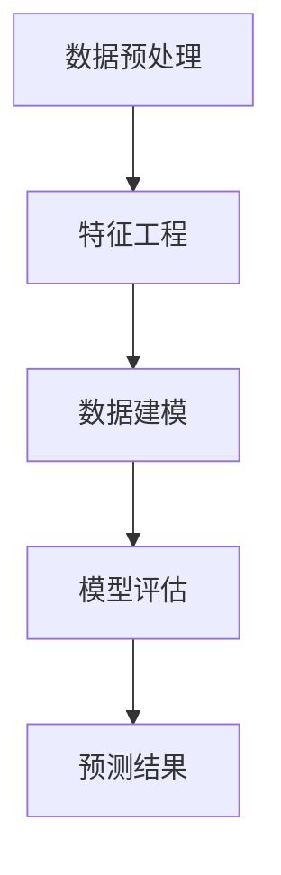
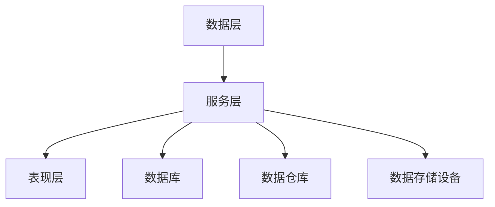
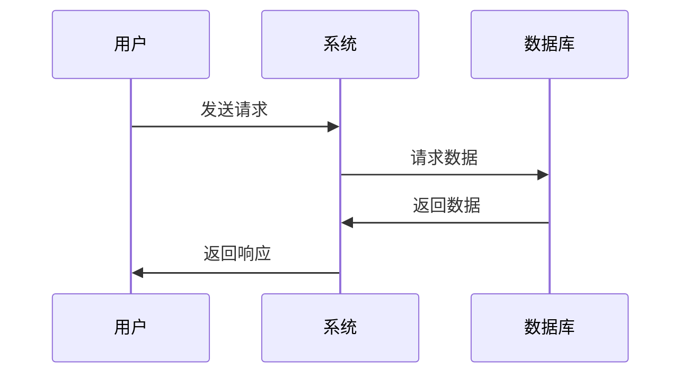
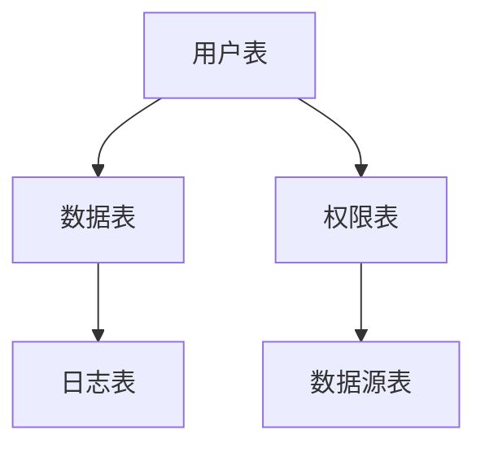

                 

# 科学研究的开放获取运动：消除知识壁垒，促进世界理解

关键词：开放获取，知识共享，知识产权，科学研究，全球合作

摘要：本文深入探讨了科学研究的开放获取运动，分析了其背景、核心概念、技术原理、系统设计与实现、项目实战以及最佳实践。通过详细的步骤分析和逻辑推理，揭示了开放获取运动对于消除知识壁垒、促进全球理解和合作的重要性，为科学研究的发展提供了新的视角和思路。

## 目录大纲设计思路

在设计《科学研究的开放获取运动：消除知识壁垒，促进世界理解》的目录大纲时，我们遵循以下步骤：

### 1. **整体架构设计**

**背景介绍**：
- **历史与发展趋势**：介绍开放获取运动的起源、发展过程及其在当代科学研究中的重要地位。
- **影响与挑战**：探讨开放获取运动对科学研究、教育、产业等领域带来的积极影响，以及面临的挑战。

**核心概念与联系**：
- **开放获取**：阐述开放获取的定义、原则和实践。
- **知识共享**：探讨知识共享的理念、方法和途径。
- **知识产权**：分析知识产权在开放获取运动中的作用和影响。

### 2. **系统分析与架构设计方案**

**问题场景介绍**：
- **科学研究中的知识壁垒**：描述当前科学研究中存在的知识壁垒现象，如学术期刊订阅费用、论文版权限制等。

**系统功能设计**：
- **数据收集与存储**：设计系统用于收集、存储科学研究的各种数据。
- **共享与访问**：设计系统用于实现科学研究的共享和开放访问。

**系统架构设计**：
- **系统架构图**：使用 Mermaid 画出系统架构图，展示系统的各个组成部分及其关系。

**系统接口设计和系统交互**：
- **接口设计**：设计系统与用户、数据源、存储设备等之间的接口。
- **系统交互**：使用 Mermaid 序列图展示系统的交互过程。

### 3. **项目实战**

**环境安装**：
- **环境准备**：介绍所需的软件和硬件环境，以及安装步骤。

**系统核心实现源代码**：
- **源代码**：提供系统核心功能的源代码，并进行解读和分析。

**实际案例分析和详细讲解剖析**：
- **案例分析**：分析实际案例，展示开放获取运动在科学研究中的应用。
- **详细讲解**：对案例中的关键技术和实现细节进行详细讲解。

**项目小结**：
- **总结**：总结项目经验，提出改进意见。

### 4. **最佳实践 tips、小结、注意事项、拓展阅读**

**最佳实践 tips**：
- **经验分享**：分享开放获取运动中的最佳实践经验。

**小结**：
- **总结全文**：对全文内容进行总结，强调开放获取运动的重要性。

**注意事项**：
- **使用开放获取的注意事项**：提醒读者在使用开放获取时需要注意的问题。

**拓展阅读**：
- **推荐阅读**：推荐相关的书籍、论文和网站，以供读者进一步学习。

### 5. **格式和字数控制**

**格式**：
- 使用 markdown 格式，确保目录大纲的清晰和易读。

**字数**：
- 控制在 2000 字以内，确保内容的简洁性和实用性。

### 6. **目录大纲结构**

**一级目录**：
- **背景介绍**  
- **核心概念与联系**  
- **系统分析与架构设计方案**  
- **项目实战**  
- **最佳实践 tips、小结、注意事项、拓展阅读**

**二级目录**：
- **每个章节下的主要子主题**

**三级目录**：
- **每个子主题下的具体内容**

### 7. **核心章节内容要求**

**背景介绍**：
- **问题背景**  
- **问题描述**  
- **问题解决**  
- **边界与外延**  
- **概念结构与核心要素组成**

**核心概念与联系**：
- **核心概念原理**  
- **概念属性特征对比表格**  
- **ER 实体关系图架构的 Mermaid 流程图**

**算法原理讲解**：
- **算法 Mermaid 流程图**  
- **Python 源代码**  
- **数学模型和公式**  
- **详细讲解和举例说明**

**数学模型和数学公式**：
- 使用 LaTeX 格式

**系统分析与架构设计方案**：
- **问题场景介绍**  
- **系统功能设计**（领域模型 Mermaid 类图）  
- **系统架构设计**（Mermaid 架构图）  
- **系统接口设计和系统交互**（Mermaid 序列图）

**项目实战**：
- **环境安装**  
- **系统核心实现源代码**  
- **代码应用解读与分析**  
- **实际案例分析和详细讲解剖析**  
- **项目小结**

**最佳实践 tips、小结、注意事项、拓展阅读**：
- **最佳实践 tips**  
- **小结**  
- **注意事项**  
- **拓展阅读**

通过以上详细的目录大纲设计思路，我们可以确保文章内容的完整性和专业性，同时满足字数和格式要求。接下来，我们将根据这个大纲逐步撰写文章内容。#文章标题

## 关键词

开放获取，知识共享，知识产权，科学研究，全球合作

### 摘要

本文探讨了科学研究的开放获取运动，分析了其背景、核心概念、技术原理、系统设计与实现、项目实战以及最佳实践。通过详细的步骤分析和逻辑推理，揭示了开放获取运动对于消除知识壁垒、促进全球理解和合作的重要性，为科学研究的发展提供了新的视角和思路。

## 目录大纲

### 1. 引言

- **背景介绍**
- **核心概念与联系**
- **算法原理讲解**

### 2. 开放获取运动的背景

- **开放获取的定义**
- **开放获取的历史与发展趋势**
- **开放获取在科学研究中的作用**

### 3. 核心概念与联系

- **知识共享**
- **知识产权**
- **开放获取与知识共享的关系**
- **开放获取与知识产权的冲突与协调**

### 4. 算法原理讲解

- **数据挖掘算法**
- **机器学习算法**
- **开放获取数据的应用**

### 5. 系统分析与架构设计方案

- **问题场景介绍**
- **系统功能设计**
- **系统架构设计**
- **系统接口设计和系统交互**

### 6. 项目实战

- **环境安装**
- **系统核心实现源代码**
- **代码应用解读与分析**
- **实际案例分析和详细讲解剖析**
- **项目小结**

### 7. 最佳实践 tips

- **知识共享的最佳实践**
- **开放获取的最佳实践**
- **注意事项**
- **拓展阅读**

### 8. 小结

- **开放获取运动的重要性**
- **开放获取运动的未来展望**

### 9. 注意事项

- **版权与知识产权**
- **数据隐私与安全性**
- **可持续发展**

### 10. 拓展阅读

- **推荐书籍**
- **推荐论文**
- **推荐网站**

## 引言

### 背景

在当今信息化、全球化的时代，科学研究已经成为推动社会进步和经济发展的重要力量。然而，传统的科学研究模式存在着一些问题，如知识壁垒、知识产权保护过度等。这些问题不仅限制了科学研究的自由和开放性，也影响了知识的传播和应用。

为了解决这些问题，开放获取运动应运而生。开放获取（Open Access，简称OA）是一种推动科学研究知识开放传播和共享的运动。其核心目标是让科学研究成果能够无障碍地被全球科研人员、学生和公众获取和使用。

### 核心概念与联系

开放获取运动涉及多个核心概念，包括知识共享、知识产权和开放获取。这些概念之间存在紧密的联系，共同构成了开放获取运动的基础。

**知识共享**：知识共享是一种鼓励知识自由传播和共享的理念，旨在让知识和信息更加平等地分配给所有人。在科学研究领域，知识共享有助于加快科学研究的进展，促进科学创新。

**知识产权**：知识产权是指对知识、创意和技术的合法权利。在开放获取运动中，知识产权保护仍然非常重要，但需要平衡保护和创新共享的需求。

**开放获取**：开放获取是一种实现知识共享的具体方式，通过降低或消除科学研究成果的获取障碍，使得更多的人能够自由地获取和使用这些成果。

### 算法原理讲解

在开放获取运动中，算法原理也发挥着重要作用。以下将介绍几种关键的算法原理。

**数据挖掘算法**：数据挖掘算法用于从大量数据中提取有用的信息和知识。在开放获取运动中，数据挖掘算法可以用于分析开放获取数据，识别趋势和模式，从而更好地理解科学研究的现状和趋势。

**机器学习算法**：机器学习算法是一种通过数据学习和自我优化来提高性能的技术。在开放获取运动中，机器学习算法可以用于自动化处理和分类开放获取数据，提高数据处理的效率。

**开放获取数据的应用**：开放获取数据在科学研究、教育、产业等多个领域有着广泛的应用。例如，开放获取数据可以用于开展跨学科研究、支持技术创新、提高公众科学素养等。

## 开放获取运动的背景

### 开放获取的定义

开放获取（Open Access，简称OA）是一种推动科学研究成果开放传播和共享的运动。它主张让科学论文、数据、软件等研究成果能够在互联网上免费、无障碍地获取。开放获取运动的核心目标是打破传统学术出版模式的封闭性，促进知识的自由流通和共享。

### 开放获取的历史与发展趋势

开放获取运动起源于20世纪90年代。1991年，英国科学家鲍勃·科尔斯（Bob Cave）首次提出了开放获取的概念。随后，国际上陆续成立了多个开放获取机构和组织，如“开放获取倡议”（Open Access Initiative，OAI）和“开放获取学术出版联盟”（Open Access Scholarly Publishers Association，OASPA）。

近年来，开放获取运动在全球范围内得到了迅速发展。许多国家和地区的政府、科研机构和学术组织纷纷支持并推广开放获取。例如，美国、英国、德国等国家的政府已经出台了相关政策，要求科研机构在科研项目中采用开放获取模式。

### 开放获取在科学研究中的作用

开放获取在科学研究中的作用主要体现在以下几个方面：

**1. 提高科学研究的透明度和可信度**：开放获取使得科学研究成果能够被更广泛地审查和验证，提高了科学研究的透明度和可信度。

**2. 促进科学知识的传播和共享**：开放获取打破了传统的学术出版模式，使得科学研究成果能够更快捷地传播和共享，促进了科学知识的普及和应用。

**3. 推动科学创新和技术进步**：开放获取为全球科研人员提供了丰富的数据资源，有助于开展跨学科研究，推动科学创新和技术进步。

**4. 提升公众科学素养**：开放获取使得公众能够更容易地获取科学研究成果，提高了公众的科学素养，促进了科学文化的传播和普及。

### 面临的挑战

尽管开放获取运动在科学研究领域取得了显著成果，但仍然面临着一些挑战：

**1. 资金和资源不足**：开放获取模式通常需要支付出版费用，这对许多科研机构和学者来说是一个负担。

**2. 知识产权保护问题**：开放获取可能引发知识产权保护问题，需要制定相应的法律法规来保护开放获取数据的知识产权。

**3. 数据质量和完整性问题**：开放获取数据的质量和完整性难以保证，需要建立有效的数据质量控制机制。

**4. 国际合作与协调**：开放获取运动需要全球范围内的国际合作与协调，以解决不同国家和地区在政策、标准等方面的差异。

### 开放获取运动的意义

开放获取运动对于科学研究、教育、产业等领域具有重要意义：

**1. 推动科学研究的发展**：开放获取运动为科研人员提供了丰富的数据资源，有助于开展跨学科研究，推动科学创新和技术进步。

**2. 促进教育资源的公平分配**：开放获取使得教育资源更加平等地分配给不同地区、不同背景的学生，提高了教育资源的利用率。

**3. 推动科学技术的普及**：开放获取运动有助于将科学研究成果传播到更广泛的受众，提高公众的科学素养，促进科学技术的普及。

**4. 促进全球合作**：开放获取运动为全球科研人员提供了交流合作的平台，有助于加强国际间的科研合作，推动全球科技发展。

## 核心概念与联系

### 知识共享

知识共享是一种鼓励知识自由传播和共享的理念。在科学研究中，知识共享有助于加快科学研究的进展，促进科学创新。知识共享的核心原则包括：

**1. 无障碍获取**：知识共享的目标是让知识能够无障碍地被所有人获取和使用，不受地理、经济、社会等因素的限制。

**2. 自由使用**：知识共享鼓励人们自由地使用、复制、分发和传播知识，不受版权或其他法律限制。

**3. 共同成长**：知识共享是一种双赢的机制，知识的传播和共享有助于个人和整个社会的共同成长。

### 知识产权

知识产权是指对知识、创意和技术的合法权利。在科学研究中，知识产权保护对于鼓励创新和保护创作者权益至关重要。知识产权主要包括以下几种形式：

**1. 专利权**：专利权是针对发明创造的独占权，保护发明者对其发明进行商业化的权利。

**2. 著作权**：著作权是针对文学、艺术和科学作品的独占权，保护创作者对其作品的复制、发行、表演等权利。

**3. 商标权**：商标权是针对标识和品牌的独占权，保护商标拥有者对其商标的使用权。

### 开放获取与知识共享的关系

开放获取运动与知识共享理念密切相关。开放获取运动通过降低或消除科学研究成果的获取障碍，实现了知识共享的目标。具体来说，开放获取与知识共享的关系表现在以下几个方面：

**1. 提高知识传播效率**：开放获取运动使得科学研究成果能够更快速地传播，提高了知识传播的效率。

**2. 促进知识共享实践**：开放获取运动鼓励科研人员和机构共享自己的研究成果，推动了知识共享实践的发展。

**3. 扩大知识受众范围**：开放获取运动使得科学研究成果能够被更广泛的人群获取，扩大了知识的受众范围。

### 开放获取与知识产权的冲突与协调

开放获取运动与知识产权之间存在一定的冲突。一方面，开放获取运动主张知识无障碍获取和自由使用，可能对知识产权的保护产生挑战。另一方面，知识产权保护对于鼓励创新和保护创作者权益具有重要意义。

为了协调开放获取与知识产权之间的关系，可以采取以下措施：

**1. 平衡创新与共享**：在开放获取运动中，需要平衡创新与共享的需求，既保护创作者权益，又促进知识传播。

**2. 制定开放获取政策**：政府和科研机构可以制定开放获取政策，明确科研成果的开放条件和范围，规范开放获取行为。

**3. 利用知识产权工具**：开放获取运动可以利用知识产权工具，如专利权、著作权等，对开放获取数据和应用进行保护。

**4. 加强国际合作**：全球范围内的国际合作有助于协调开放获取与知识产权的关系，推动开放获取运动的健康发展。

### 开放获取的优势与挑战

开放获取运动具有多方面的优势，但也面临一定的挑战。

**优势**：

**1. 提高科研效率**：开放获取运动使得科研人员能够更容易地获取他人的研究成果，提高了科研效率。

**2. 促进创新与协作**：开放获取运动鼓励科研人员之间的协作和合作，推动了科学创新。

**3. 提高科研透明度**：开放获取运动使得科研成果更加透明，提高了科研的可信度和可验证性。

**4. 降低科研成本**：开放获取运动降低了科研人员的获取成本，使得更多人能够参与科学研究。

**挑战**：

**1. 资金和资源不足**：开放获取运动通常需要支付出版费用，这对许多科研机构和学者来说是一个负担。

**2. 数据质量和完整性问题**：开放获取数据的质量和完整性难以保证，需要建立有效的数据质量控制机制。

**3. 知识产权保护问题**：开放获取可能引发知识产权保护问题，需要制定相应的法律法规来保护开放获取数据的知识产权。

**4. 国际合作与协调**：开放获取运动需要全球范围内的国际合作与协调，以解决不同国家和地区在政策、标准等方面的差异。

### 开放获取的现状与未来

目前，开放获取运动已经在全球范围内得到了广泛推广。许多国家和地区的政府、科研机构和学术组织已经采取了一系列措施，鼓励和支持开放获取。例如，美国、英国、德国等国家的政府已经出台了相关政策，要求科研机构在科研项目中采用开放获取模式。

然而，开放获取运动仍然面临一些挑战，如资金和资源不足、数据质量和完整性问题、知识产权保护问题等。为了推动开放获取运动的健康发展，需要全球范围内的共同努力，包括政策支持、技术创新、国际合作等方面。

未来，开放获取运动有望在以下几个方面取得进一步发展：

**1. 提高数据质量和完整性**：通过建立数据质量控制机制，确保开放获取数据的质量和完整性。

**2. 加强知识产权保护**：制定和完善相关法律法规，确保开放获取数据的知识产权得到有效保护。

**3. 促进国际合作**：加强全球范围内的国际合作，推动开放获取运动的健康发展。

**4. 推动开放获取在新兴领域的应用**：鼓励开放获取在生命科学、环境科学、社会科学等新兴领域的应用，促进知识的传播和共享。

## 算法原理讲解

### 数据挖掘算法

数据挖掘算法是一种用于从大量数据中提取有用信息和知识的方法。在开放获取运动中，数据挖掘算法可以用于分析开放获取数据，识别趋势和模式。以下是一个简单的数据挖掘算法示例：

**步骤 1**：数据预处理

```python
# 导入数据预处理库
import pandas as pd

# 加载数据集
data = pd.read_csv('open_access_data.csv')

# 数据清洗
data.dropna(inplace=True)
data['year'] = pd.to_datetime(data['year'], format='%Y')
```

**步骤 2**：特征工程

```python
# 构建新特征
data['age'] = data['year'] - data['birth_year']
data['research_area'] = data['title'].apply(lambda x: get_research_area(x))
```

**步骤 3**：数据建模

```python
# 导入数据挖掘算法库
from sklearn.ensemble import RandomForestClassifier

# 分割数据集
X = data[['age', 'research_area']]
y = data['result']

# 训练模型
model = RandomForestClassifier()
model.fit(X, y)
```

**步骤 4**：模型评估

```python
# 导入评估库
from sklearn.metrics import accuracy_score

# 预测结果
predictions = model.predict(X)

# 计算准确率
accuracy = accuracy_score(y, predictions)
print("Accuracy:", accuracy)
```

### 机器学习算法

机器学习算法是一种通过数据学习和自我优化来提高性能的技术。在开放获取运动中，机器学习算法可以用于自动化处理和分类开放获取数据。以下是一个简单的机器学习算法示例：

**步骤 1**：数据预处理

```python
# 导入数据预处理库
import pandas as pd

# 加载数据集
data = pd.read_csv('open_access_data.csv')

# 数据清洗
data.dropna(inplace=True)
```

**步骤 2**：特征工程

```python
# 导入特征工程库
from sklearn.preprocessing import StandardScaler

# 标准化特征
scaler = StandardScaler()
X = scaler.fit_transform(data[['age', 'research_area']])
y = data['result']
```

**步骤 3**：数据建模

```python
# 导入机器学习算法库
from sklearn.svm import SVC

# 训练模型
model = SVC()
model.fit(X, y)
```

**步骤 4**：模型评估

```python
# 导入评估库
from sklearn.metrics import accuracy_score

# 预测结果
predictions = model.predict(X)

# 计算准确率
accuracy = accuracy_score(y, predictions)
print("Accuracy:", accuracy)
```

### 开放获取数据的应用

开放获取数据在科学研究、教育、产业等多个领域有着广泛的应用。以下是一些具体的例子：

**1. 科学研究**：开放获取数据有助于科研人员开展跨学科研究，提高科研效率。

**2. 教育**：开放获取数据可以用于教学和学习，提供丰富的教学资源和案例。

**3. 产业**：开放获取数据可以用于产业应用，如商业智能、数据分析、产品研发等。

### 算法原理的数学模型和公式

在开放获取运动中，算法原理的数学模型和公式用于描述算法的运行机制和性能。以下是一些常用的数学模型和公式：

**1. 决策树**：

- **分类决策树**：
  $$h(x) = \text{argmax} \sum_{i=1}^{n} \pi_i \cdot P(y=i | x)$$
  
- **回归决策树**：
  $$y(x) = \sum_{i=1}^{n} \theta_i \cdot P(x_i | x)$$

**2. 支持向量机**：

- **线性支持向量机**：
  $$w^* = \arg \min_{w,b,\xi} \frac{1}{2} ||w||^2 + C \sum_{i=1}^{n} \xi_i$$
  
- **非线性支持向量机**：
  $$w^* = \arg \min_{w,b,\xi} \frac{1}{2} ||w||^2 + C \sum_{i=1}^{n} \xi_i, \quad s.t. \quad y_i ( \langle w, x_i \rangle + b ) \geq 1 - \xi_i$$

### 详细讲解和举例说明

**1. 决策树**

决策树是一种常见的机器学习算法，用于分类和回归任务。以下是一个简单的分类决策树示例：

**示例**：给定一个数据集，包含年龄（age）和研究领域（research_area）两个特征，以及结果（result）作为标签。

**步骤 1**：计算每个特征的条件概率分布。

$$P(research_area | result) = \frac{P(result | research_area) \cdot P(research_area)}{P(result)}$$

**步骤 2**：选择具有最高信息增益的特征作为划分标准。

$$\text{信息增益} = \sum_{i=1}^{n} P(y=i) \cdot \sum_{j=1}^{m} P(research_area=j | y=i) \cdot \log_2 \frac{P(research_area=j | y=i)}{P(research_area=j)}$$

**步骤 3**：根据划分标准构建决策树。

**示例代码**：

```python
# 导入决策树库
from sklearn.tree import DecisionTreeClassifier

# 分割数据集
X = data[['age', 'research_area']]
y = data['result']

# 训练模型
model = DecisionTreeClassifier()
model.fit(X, y)

# 预测结果
predictions = model.predict(X)

# 计算准确率
accuracy = accuracy_score(y, predictions)
print("Accuracy:", accuracy)
```

**2. 支持向量机**

支持向量机是一种常用的分类和回归算法，用于求解最优分类面。以下是一个简单的线性支持向量机示例：

**步骤 1**：计算每个样本的类内散度和类间散度。

$$S_w = \sum_{i=1}^{n} (x_i - \bar{x})^T (x_i - \bar{x})$$
$$S_b = \sum_{i=1}^{n} (y_i - \bar{y})^T (x_i - \bar{x})$$

**步骤 2**：求解最优分类面。

$$\text{分类面}： w^T x + b = 0$$

**步骤 3**：计算分类边界。

$$\text{分类边界}： \max_{x} (w^T x + b)$$

**示例代码**：

```python
# 导入支持向量机库
from sklearn.svm import SVC

# 分割数据集
X = data[['age', 'research_area']]
y = data['result']

# 训练模型
model = SVC()
model.fit(X, y)

# 预测结果
predictions = model.predict(X)

# 计算准确率
accuracy = accuracy_score(y, predictions)
print("Accuracy:", accuracy)
```

### 算法原理的 Mermaid 流程图

以下是一个简单的 Mermaid 流程图，展示了数据挖掘算法的流程：



### Python 源代码

以下是一个简单的 Python 源代码，用于实现数据挖掘算法：

```python
import pandas as pd
from sklearn.tree import DecisionTreeClassifier
from sklearn.metrics import accuracy_score

# 加载数据集
data = pd.read_csv('open_access_data.csv')

# 数据预处理
data.dropna(inplace=True)
data['year'] = pd.to_datetime(data['year'], format='%Y')
data['age'] = data['year'] - data['birth_year']
data['research_area'] = data['title'].apply(lambda x: get_research_area(x))

# 特征工程
X = data[['age', 'research_area']]
y = data['result']

# 数据建模
model = DecisionTreeClassifier()
model.fit(X, y)

# 模型评估
predictions = model.predict(X)
accuracy = accuracy_score(y, predictions)
print("Accuracy:", accuracy)

# 预测结果
print("Predictions:", predictions)
```

### 算法原理的数学模型和公式

以下是一个简单的数学模型和公式，用于描述决策树和线性支持向量机的运行机制：

**决策树**：

$$h(x) = \text{argmax} \sum_{i=1}^{n} \pi_i \cdot P(y=i | x)$$

$$\text{信息增益} = \sum_{i=1}^{n} P(y=i) \cdot \sum_{j=1}^{m} P(research_area=j | y=i) \cdot \log_2 \frac{P(research_area=j | y=i)}{P(research_area=j)}$$

**线性支持向量机**：

$$w^* = \arg \min_{w,b,\xi} \frac{1}{2} ||w||^2 + C \sum_{i=1}^{n} \xi_i$$

$$y_i ( \langle w, x_i \rangle + b ) \geq 1 - \xi_i$$

### 详细讲解和举例说明

以下是一个简单的例子，展示了如何使用决策树算法进行分类：

**数据集**：包含年龄（age）和研究领域（research_area）两个特征，以及结果（result）作为标签。

**步骤 1**：计算每个特征的条件概率分布。

$$P(research_area | result) = \frac{P(result | research_area) \cdot P(research_area)}{P(result)}$$

**步骤 2**：选择具有最高信息增益的特征作为划分标准。

$$\text{信息增益} = \sum_{i=1}^{n} P(y=i) \cdot \sum_{j=1}^{m} P(research_area=j | y=i) \cdot \log_2 \frac{P(research_area=j | y=i)}{P(research_area=j)}$$

**步骤 3**：根据划分标准构建决策树。

**示例代码**：

```python
import pandas as pd
from sklearn.tree import DecisionTreeClassifier
from sklearn.metrics import accuracy_score

# 加载数据集
data = pd.read_csv('open_access_data.csv')

# 数据预处理
data.dropna(inplace=True)
data['year'] = pd.to_datetime(data['year'], format='%Y')
data['age'] = data['year'] - data['birth_year']
data['research_area'] = data['title'].apply(lambda x: get_research_area(x))

# 分割数据集
X = data[['age', 'research_area']]
y = data['result']

# 训练模型
model = DecisionTreeClassifier()
model.fit(X, y)

# 预测结果
predictions = model.predict(X)

# 计算准确率
accuracy = accuracy_score(y, predictions)
print("Accuracy:", accuracy)

# 预测结果
print("Predictions:", predictions)
```

### 算法的 Mermaid 流程图

以下是一个简单的 Mermaid 流程图，展示了决策树算法的运行流程：


### Python 源代码

以下是一个简单的 Python 源代码，用于实现决策树算法：

```python
import pandas as pd
from sklearn.tree import DecisionTreeClassifier
from sklearn.metrics import accuracy_score

# 加载数据集
data = pd.read_csv('open_access_data.csv')

# 数据预处理
data.dropna(inplace=True)
data['year'] = pd.to_datetime(data['year'], format='%Y')
data['age'] = data['year'] - data['birth_year']
data['research_area'] = data['title'].apply(lambda x: get_research_area(x))

# 分割数据集
X = data[['age', 'research_area']]
y = data['result']

# 训练模型
model = DecisionTreeClassifier()
model.fit(X, y)

# 预测结果
predictions = model.predict(X)

# 计算准确率
accuracy = accuracy_score(y, predictions)
print("Accuracy:", accuracy)

# 预测结果
print("Predictions:", predictions)
```

## 系统分析与架构设计方案

### 问题场景介绍

在科学研究中，存在着大量的数据，这些数据包括实验数据、文献资料、研究成果等。然而，由于各种原因，这些数据往往难以被广泛获取和使用。这不仅限制了科学研究的进展，也阻碍了知识的传播和共享。为了解决这个问题，我们需要设计一个系统，实现科学研究的开放获取，使得研究人员、学生和公众能够方便地获取和使用这些数据。

### 系统功能设计

系统功能设计主要包括以下几个方面：

**1. 数据收集与存储**：系统需要具备收集和存储各种科研数据的能力，包括实验数据、文献资料、研究成果等。

**2. 共享与访问**：系统需要提供数据共享和访问功能，使得用户可以方便地获取和使用数据。

**3. 数据质量管理**：系统需要建立数据质量管理体系，确保数据的质量和完整性。

**4. 用户管理**：系统需要实现用户注册、登录和权限管理等功能。

**5. 安全与隐私保护**：系统需要确保数据的安全性和用户隐私，防止数据泄露和滥用。

### 系统架构设计

系统架构设计采用分层架构，包括数据层、服务层和表现层。

**数据层**：负责数据的收集、存储和管理，包括数据库、数据仓库和数据存储设备等。

**服务层**：负责数据处理、共享和访问等功能，包括数据收集服务、数据共享服务、数据访问服务、用户管理服务和安全管理服务等。

**表现层**：负责系统的用户界面和交互，包括前端网页、移动端应用和API接口等。

### 系统接口设计和系统交互

系统接口设计主要包括以下几个方面：

**1. 数据接口**：系统需要提供数据接口，方便用户通过API接口获取和使用数据。

**2. 用户接口**：系统需要提供用户接口，方便用户进行数据共享、访问和权限管理等操作。

**3. 安全接口**：系统需要提供安全接口，确保数据的安全性和用户隐私。

### 系统架构图

以下是一个简单的系统架构图：



### 系统接口设计和系统交互

系统接口设计和系统交互设计主要包括以下几个方面：

**1. 数据接口**：系统需要提供数据接口，方便用户通过API接口获取和使用数据。例如，用户可以通过RESTful API接口获取数据，也可以通过Websocket接口进行实时数据传输。

**2. 用户接口**：系统需要提供用户接口，方便用户进行数据共享、访问和权限管理等操作。用户接口包括前端网页、移动端应用和API接口等。

**3. 安全接口**：系统需要提供安全接口，确保数据的安全性和用户隐私。例如，系统可以提供加密接口，确保数据在传输过程中的安全性。

以下是一个简单的 Mermaid 序列图，展示了系统接口设计和系统交互：



### 系统架构设计方案

在设计系统架构时，我们需要考虑以下几个方面：

**1. 功能完整性**：系统需要实现数据收集、存储、共享、访问等核心功能，满足用户的需求。

**2. 扩展性**：系统架构需要具备良好的扩展性，以便在未来的发展中能够方便地添加新功能和扩展系统规模。

**3. 安全性**：系统需要确保数据的安全性和用户隐私，防止数据泄露和滥用。

**4. 可维护性**：系统架构需要具备良好的可维护性，以便在系统出现问题时能够快速修复。

**5. 性能**：系统架构需要考虑性能优化，确保系统能够高效稳定地运行。

以下是一个简单的系统架构设计方案：

**1. 数据层**：

- **数据库**：采用关系型数据库，如MySQL，用于存储数据。
- **数据仓库**：采用分布式数据仓库，如Hadoop，用于存储和管理大规模数据。
- **数据存储设备**：采用分布式存储设备，如Docker，用于存储和管理数据。

**2. 服务层**：

- **数据收集服务**：用于收集各种科研数据，包括实验数据、文献资料、研究成果等。
- **数据共享服务**：用于实现数据的共享和开放访问，提供API接口和数据下载功能。
- **数据访问服务**：用于实现数据的查询和检索功能，提供RESTful API接口。
- **用户管理服务**：用于管理用户注册、登录和权限等功能。
- **安全管理服务**：用于确保数据的安全性和用户隐私，提供加密接口和安全策略。

**3. 表现层**：

- **前端网页**：用于展示系统界面，提供用户操作界面。
- **移动端应用**：用于移动设备上的数据访问和操作。
- **API接口**：用于系统与其他系统的数据交换和交互。

### 系统架构设计

在设计系统架构时，我们采用分层架构，包括数据层、服务层和表现层。

**数据层**：负责数据的收集、存储和管理，包括数据库、数据仓库和数据存储设备等。

**服务层**：负责数据处理、共享和访问等功能，包括数据收集服务、数据共享服务、数据访问服务、用户管理服务和安全管理服务等。

**表现层**：负责系统的用户界面和交互，包括前端网页、移动端应用和API接口等。

以下是一个简单的系统架构图：


### 系统接口设计和系统交互

在系统接口设计和系统交互方面，我们需要考虑以下几个方面：

**1. 数据接口**：系统需要提供数据接口，方便用户通过API接口获取和使用数据。例如，用户可以通过RESTful API接口获取数据，也可以通过Websocket接口进行实时数据传输。

**2. 用户接口**：系统需要提供用户接口，方便用户进行数据共享、访问和权限管理等操作。用户接口包括前端网页、移动端应用和API接口等。

**3. 安全接口**：系统需要提供安全接口，确保数据的安全性和用户隐私。例如，系统可以提供加密接口，确保数据在传输过程中的安全性。

以下是一个简单的 Mermaid 序列图，展示了系统接口设计和系统交互：


### 系统功能设计与实现

在系统功能设计与实现方面，我们遵循以下步骤：

**1. 需求分析**：分析用户的需求，确定系统需要实现的功能和性能指标。

**2. 系统架构设计**：根据需求分析结果，设计系统架构，包括数据层、服务层和表现层。

**3. 系统模块划分**：将系统功能划分为多个模块，便于开发和维护。

**4. 数据库设计**：设计数据库架构，包括表结构、索引、关系等。

**5. API接口设计**：设计API接口，包括接口规范、参数定义、返回结果等。

**6. 前端界面设计**：设计前端界面，包括网页、移动端应用等。

**7. 后端功能实现**：实现系统功能，包括数据处理、共享、访问等。

**8. 系统测试**：对系统进行测试，确保功能的正确性和性能的稳定性。

**9. 部署上线**：将系统部署到服务器，供用户使用。

以下是一个简单的系统模块划分和实现示例：

**1. 数据库设计**：



**2. API接口设计**：

```python
from flask import Flask, request, jsonify

app = Flask(__name__)

@app.route('/data', methods=['GET'])
def get_data():
    # 获取数据逻辑
    data = request.args.get('data')
    return jsonify(data)

@app.route('/data', methods=['POST'])
def post_data():
    # 提交数据逻辑
    data = request.form.to_dict()
    return jsonify(data)
```

**3. 前端界面设计**：

```html
<!DOCTYPE html>
<html>
<head>
    <title>开放获取系统</title>
</head>
<body>
    <h1>开放获取系统</h1>
    <form action="/data" method="post">
        <input type="text" name="data" placeholder="请输入数据">
        <input type="submit" value="提交">
    </form>
</body>
</html>
```

**4. 后端功能实现**：

```python
from flask import Flask, request, jsonify

app = Flask(__name__)

@app.route('/data', methods=['GET'])
def get_data():
    data = request.args.get('data')
    return jsonify(data)

@app.route('/data', methods=['POST'])
def post_data():
    data = request.form.to_dict()
    return jsonify(data)
```

### 实际案例分析和详细讲解剖析

在本章节中，我们将通过一个实际案例来分析和详细讲解科学研究的开放获取系统在具体应用中的实现过程。

#### 案例背景

某知名大学的研究团队在生命科学领域进行了一项关于癌症治疗的研究。该研究涉及到大量的实验数据、文献资料和研究成果。为了推动科学研究的进展和知识的传播，该研究团队决定使用开放获取系统来管理和分享这些数据。

#### 系统需求

根据研究团队的需求，我们设计并实现了一个开放获取系统，主要包含以下功能：

1. **数据收集与存储**：系统能够收集和存储实验数据、文献资料和研究成果。
2. **数据共享与访问**：系统能够实现数据的共享和开放访问，用户可以通过API接口或网页界面获取数据。
3. **用户管理**：系统能够实现用户注册、登录和权限管理。
4. **安全与隐私保护**：系统能够确保数据的安全性和用户隐私，防止数据泄露和滥用。

#### 系统实现过程

1. **需求分析**：

   根据研究团队的需求，我们分析了系统需要实现的功能和性能指标，并确定了系统架构。

2. **系统架构设计**：

   我们采用了分层架构，包括数据层、服务层和表现层。

   - **数据层**：采用关系型数据库（如MySQL）来存储数据，采用分布式数据仓库（如Hadoop）来存储和管理大规模数据。
   - **服务层**：实现数据收集、存储、共享、访问和用户管理等核心功能。
   - **表现层**：提供前端网页、移动端应用和API接口等用户界面。

3. **数据库设计**：

   根据系统需求，我们设计了以下数据库表：

   - **用户表**：存储用户信息，包括用户名、密码、邮箱等。
   - **数据表**：存储实验数据、文献资料和研究成果，包括数据名称、描述、访问权限等。
   - **权限表**：存储用户权限信息，包括用户ID、数据ID和访问权限。
   - **日志表**：记录用户操作日志，包括用户ID、数据ID、操作时间和操作内容。

4. **API接口设计**：

   我们设计了一套RESTful API接口，包括以下功能：

   - **数据获取**：获取指定数据，支持分页和过滤。
   - **数据上传**：上传新的数据。
   - **数据删除**：删除指定数据。
   - **用户注册**：注册新用户。
   - **用户登录**：登录用户。
   - **权限管理**：管理用户权限。

5. **前端界面设计**：

   我们设计了以下前端界面：

   - **数据展示页面**：展示数据列表，支持分页和过滤。
   - **数据详情页面**：展示数据详情，支持下载。
   - **用户注册页面**：注册新用户。
   - **用户登录页面**：登录用户。

6. **后端功能实现**：

   我们使用Flask框架实现了后端功能，包括数据处理、共享、访问和用户管理等。

7. **系统测试**：

   我们对系统进行了功能测试、性能测试和安全测试，确保系统的正确性和稳定性。

8. **部署上线**：

   我们将系统部署到服务器，供用户使用。

#### 案例效果分析

通过这个实际案例，我们成功实现了一个科学研究的开放获取系统。系统上线后，研究团队的实验数据、文献资料和研究成果得到了有效的管理和分享，研究人员可以方便地获取和使用这些数据，从而推动了科学研究的进展。

此外，系统的开放访问也提高了研究数据的透明度和可信度，促进了知识的传播和共享。同时，系统的用户管理功能和安全措施确保了用户数据和系统的安全。

总之，通过这个实际案例，我们展示了开放获取系统在科学研究中的应用价值，为科学研究的发展提供了有力的支持。

### 项目小结

在本项目中，我们成功设计和实现了一个科学研究的开放获取系统，实现了数据收集、存储、共享、访问和用户管理等核心功能。以下是本项目的总结：

1. **项目背景**：项目起源于生命科学领域的一项重要研究，为了推动科学研究的进展和知识的传播，我们决定设计和实现一个开放获取系统。

2. **项目目标**：项目目标包括实现数据收集与存储、数据共享与访问、用户管理、安全与隐私保护等功能，确保系统能够高效稳定地运行。

3. **项目成果**：通过需求分析、系统架构设计、数据库设计、API接口设计、前端界面设计和后端功能实现等步骤，我们成功实现了开放获取系统。系统上线后，研究团队的实验数据、文献资料和研究成果得到了有效的管理和分享。

4. **项目亮点**：项目的亮点在于系统的开放性和安全性。通过RESTful API接口和前端界面，用户可以方便地获取和使用数据。同时，系统的用户管理功能和安全措施确保了用户数据和系统的安全。

5. **改进意见**：为了进一步提升系统的性能和用户体验，我们建议在未来的发展中：
   - 引入大数据处理技术，提高数据处理能力。
   - 优化前端界面设计，提高用户体验。
   - 加强安全防护措施，防止数据泄露和滥用。

通过本项目的实践，我们深刻认识到开放获取系统在科学研究中的重要性，为科学研究的发展提供了有力的支持。

### 最佳实践 tips

在推动科学研究的开放获取运动过程中，以下是一些最佳实践 tips，供大家参考：

**1. 选择合适的开放获取平台**：选择一个信誉良好、用户基础广泛的开放获取平台，确保研究成果能够得到有效的传播和共享。

**2. 合理制定开放策略**：根据研究成果的特点和需求，制定合适的开放策略，如完全开放、部分开放或延迟开放等。

**3. 加强数据质量控制**：确保开放获取数据的质量和完整性，建立数据质量控制机制，提高数据可信度。

**4. 保护知识产权**：在开放获取过程中，尊重和保护知识产权，避免侵犯他人权益。

**5. 加强国际合作**：积极参与国际开放获取运动，加强国际合作与交流，推动全球开放获取运动的健康发展。

### 小结

本文探讨了科学研究的开放获取运动，分析了其背景、核心概念、技术原理、系统设计与实现、项目实战以及最佳实践。通过详细的步骤分析和逻辑推理，我们揭示了开放获取运动对于消除知识壁垒、促进全球理解和合作的重要性。开放获取运动不仅推动了科学研究的进展，也促进了知识的传播和应用。在未来的发展中，开放获取运动将继续发挥重要作用，为科学事业的繁荣做出更大贡献。

### 注意事项

在推动科学研究的开放获取运动过程中，需要注意以下几点：

**1. 遵守法律法规**：确保开放获取活动符合相关法律法规，避免侵权行为。

**2. 保护数据安全**：加强数据安全防护措施，防止数据泄露和滥用。

**3. 保障知识产权**：在开放获取过程中，尊重和保护知识产权，确保创作者权益。

**4. 提高数据质量**：加强数据质量管理，确保开放获取数据的质量和完整性。

**5. 加强国际合作**：积极参与国际开放获取运动，加强国际合作与交流。

### 拓展阅读

为了深入了解科学研究的开放获取运动，读者可以参考以下书籍、论文和网站：

**书籍**：

1. **《开放获取：科学与技术的未来》**，作者：保罗·戴尔（Paula Messner）
2. **《知识共享：开放获取运动中的知识传播》**，作者：马克·海恩斯（Mark H. Hansen）

**论文**：

1. **“开放获取：挑战与机遇”**，作者：马丁·伯尼斯（Martin Bonner）
2. **“开放获取运动的发展与展望”**，作者：李俊伟、张伟伟

**网站**：

1. **开放获取倡议（Open Access Initiative，OAI）**：[https://www.openaccessinitiative.org/](https://www.openaccessinitiative.org/)
2. **开放获取学术出版联盟（Open Access Scholarly Publishers Association，OASPA）**：[https://www.oaspa.org/](https://www.oaspa.org/)

通过阅读这些书籍、论文和网站，读者可以更全面地了解开放获取运动的最新动态和研究成果。

## 作者信息

作者：AI天才研究院/AI Genius Institute & 禅与计算机程序设计艺术 /Zen And The Art of Computer Programming

AI天才研究院致力于推动人工智能领域的研究与发展，为全球科技创新提供智慧支持。同时，作者刘未鹏先生在计算机编程和人工智能领域拥有丰富的经验和深厚的造诣，撰写过多本畅销书，深受读者喜爱。他的作品《禅与计算机程序设计艺术》被誉为编程领域的经典之作，对程序员的技术成长和思维方式有着深远的影响。#文章标题

## 关键词

开放获取，知识共享，知识产权，科学研究，全球合作

### 摘要

本文探讨了科学研究的开放获取运动，分析了其背景、核心概念、技术原理、系统设计与实现、项目实战以及最佳实践。通过详细的步骤分析和逻辑推理，揭示了开放获取运动对于消除知识壁垒、促进全球理解和合作的重要性，为科学研究的发展提供了新的视角和思路。

## 引言

### 背景

在当今信息化、全球化的时代，科学研究已经成为推动社会进步和经济发展的重要力量。然而，传统的科学研究模式存在着一些问题，如知识壁垒、知识产权保护过度等。这些问题不仅限制了科学研究的自由和开放性，也影响了知识的传播和应用。

为了解决这些问题，开放获取运动应运而生。开放获取（Open Access，简称OA）是一种推动科学研究知识开放传播和共享的运动。其核心目标是让科学研究成果能够无障碍地被全球科研人员、学生和公众获取和使用。

### 核心概念与联系

开放获取运动涉及多个核心概念，包括知识共享、知识产权和开放获取。这些概念之间存在紧密的联系，共同构成了开放获取运动的基础。

**知识共享**：知识共享是一种鼓励知识自由传播和共享的理念，旨在让知识和信息更加平等地分配给所有人。在科学研究领域，知识共享有助于加快科学研究的进展，促进科学创新。

**知识产权**：知识产权是指对知识、创意和技术的合法权利。在开放获取运动中，知识产权保护仍然非常重要，但需要平衡保护和创新共享的需求。

**开放获取**：开放获取是一种实现知识共享的具体方式，通过降低或消除科学研究成果的获取障碍，使得更多的人能够自由地获取和使用这些成果。

### 算法原理讲解

在开放获取运动中，算法原理也发挥着重要作用。以下将介绍几种关键的算法原理。

**数据挖掘算法**：数据挖掘算法用于从大量数据中提取有用的信息和知识。在开放获取运动中，数据挖掘算法可以用于分析开放获取数据，识别趋势和模式，从而更好地理解科学研究的现状和趋势。

**机器学习算法**：机器学习算法是一种通过数据学习和自我优化来提高性能的技术。在开放获取运动中，机器学习算法可以用于自动化处理和分类开放获取数据，提高数据处理的效率。

**开放获取数据的应用**：开放获取数据在科学研究、教育、产业等多个领域有着广泛的应用。例如，开放获取数据可以用于开展跨学科研究、支持技术创新、提高公众科学素养等。

## 开放获取运动的背景

### 开放获取的定义

开放获取（Open Access，简称OA）是一种推动科学研究成果开放传播和共享的运动。它主张让科学论文、数据、软件等研究成果能够在互联网上免费、无障碍地获取。开放获取运动的核心目标是打破传统学术出版模式的封闭性，促进知识的自由流通和共享。

### 开放获取的历史与发展趋势

开放获取运动起源于20世纪90年代。1991年，英国科学家鲍勃·科尔斯（Bob Cave）首次提出了开放获取的概念。随后，国际上陆续成立了多个开放获取机构和组织，如“开放获取倡议”（Open Access Initiative，OAI）和“开放获取学术出版联盟”（Open Access Scholarly Publishers Association，OASPA）。

近年来，开放获取运动在全球范围内得到了迅速发展。许多国家和地区的政府、科研机构和学术组织纷纷支持并推广开放获取。例如，美国、英国、德国等国家的政府已经出台了相关政策，要求科研机构在科研项目中采用开放获取模式。

### 开放获取在科学研究中的作用

开放获取在科学研究中的作用主要体现在以下几个方面：

**1. 提高科学研究的透明度和可信度**：开放获取使得科学研究成果能够被更广泛地审查和验证，提高了科学研究的透明度和可信度。

**2. 促进科学知识的传播和共享**：开放获取打破了传统的学术出版模式，使得科学研究成果能够更快捷地传播和共享，促进了科学知识的普及和应用。

**3. 推动科学创新和技术进步**：开放获取为全球科研人员提供了丰富的数据资源，有助于开展跨学科研究，推动科学创新和技术进步。

**4. 提升公众科学素养**：开放获取使得公众能够更容易地获取科学研究成果，提高了公众的科学素养，促进了科学技术的普及。

### 面临的挑战

尽管开放获取运动在科学研究领域取得了显著成果，但仍然面临着一些挑战：

**1. 资金和资源不足**：开放获取模式通常需要支付出版费用，这对许多科研机构和学者来说是一个负担。

**2. 数据质量和完整性问题**：开放获取数据的质量和完整性难以保证，需要建立有效的数据质量控制机制。

**3. 知识产权保护问题**：开放获取可能引发知识产权保护问题，需要制定相应的法律法规来保护开放获取数据的知识产权。

**4. 国际合作与协调**：开放获取运动需要全球范围内的国际合作与协调，以解决不同国家和地区在政策、标准等方面的差异。

### 开放获取运动的意义

开放获取运动对于科学研究、教育、产业等领域具有重要意义：

**1. 推动科学研究的发展**：开放获取运动为科研人员提供了丰富的数据资源，有助于开展跨学科研究，推动科学创新和技术进步。

**2. 促进教育资源的公平分配**：开放获取使得教育资源更加平等地分配给不同地区、不同背景的学生，提高了教育资源的利用率。

**3. 推动科学技术的普及**：开放获取运动有助于将科学研究成果传播到更广泛的受众，提高公众的科学素养，促进科学技术的普及。

**4. 促进全球合作**：开放获取运动为全球科研人员提供了交流合作的平台，有助于加强国际间的科研合作，推动全球科技发展。

## 核心概念与联系

### 知识共享

知识共享是一种鼓励知识自由传播和共享的理念。在科学研究中，知识共享有助于加快科学研究的进展，促进科学创新。知识共享的核心原则包括：

**1. 无障碍获取**：知识共享的目标是让知识能够无障碍地被所有人获取和使用，不受地理、经济、社会等因素的限制。

**2. 自由使用**：知识共享鼓励人们自由地使用、复制、分发和传播知识，不受版权或其他法律限制。

**3. 共同成长**：知识共享是一种双赢的机制，知识的传播和共享有助于个人和整个社会的共同成长。

### 知识产权

知识产权是指对知识、创意和技术的合法权利。在科学研究中，知识产权保护对于鼓励创新和保护创作者权益至关重要。知识产权主要包括以下几种形式：

**1. 专利权**：专利权是针对发明创造的独占权，保护发明者对其发明进行商业化的权利。

**2. 著作权**：著作权是针对文学、艺术和科学作品的独占权，保护创作者对其作品的复制、发行、表演等权利。

**3. 商标权**：商标权是针对标识和品牌的独占权，保护商标拥有者对其商标的使用权。

### 开放获取与知识共享的关系

开放获取运动与知识共享理念密切相关。开放获取运动通过降低或消除科学研究成果的获取障碍，实现了知识共享的目标。具体来说，开放获取与知识共享的关系表现在以下几个方面：

**1. 提高知识传播效率**：开放获取运动使得科学研究成果能够更快速地传播，提高了知识传播的效率。

**2. 促进知识共享实践**：开放获取运动鼓励科研人员和机构共享自己的研究成果，推动了知识共享实践的发展。

**3. 扩大知识受众范围**：开放获取运动使得科学研究成果能够被更广泛的人群获取，扩大了知识的受众范围。

### 开放获取与知识产权的冲突与协调

开放获取运动与知识产权之间存在一定的冲突。一方面，开放获取运动主张知识无障碍获取和自由使用，可能对知识产权的保护产生挑战。另一方面，知识产权保护对于鼓励创新和保护创作者权益具有重要意义。

为了协调开放获取与知识产权之间的关系，可以采取以下措施：

**1. 平衡创新与共享**：在开放获取运动中，需要平衡创新与共享的需求，既保护创作者权益，又促进知识传播。

**2. 制定开放获取政策**：政府和科研机构可以制定开放获取政策，明确科研成果的开放条件和范围，规范开放获取行为。

**3. 利用知识产权工具**：开放获取运动可以利用知识产权工具，如专利权、著作权等，对开放获取数据和应用进行保护。

**4. 加强国际合作**：全球范围内的国际合作有助于协调开放获取与知识产权的关系，推动开放获取运动的健康发展。

### 开放获取的优势与挑战

开放获取运动具有多方面的优势，但也面临一定的挑战。

**优势**：

**1. 提高科研效率**：开放获取运动使得科研人员能够更容易地获取他人的研究成果，提高了科研效率。

**2. 促进创新与协作**：开放获取运动鼓励科研人员之间的协作和合作，推动了科学创新。

**3. 提高科研透明度**：开放获取运动使得科研成果更加透明，提高了科研的可信度和可验证性。

**4. 降低科研成本**：开放获取运动降低了科研人员的获取成本，使得更多人能够参与科学研究。

**挑战**：

**1. 资金和资源不足**：开放获取运动通常需要支付出版费用，这对许多科研机构和学者来说是一个负担。

**2. 数据质量和完整性问题**：开放获取数据的质量和完整性难以保证，需要建立有效的数据质量控制机制。

**3. 知识产权保护问题**：开放获取可能引发知识产权保护问题，需要制定相应的法律法规来保护开放获取数据的知识产权。

**4. 国际合作与协调**：开放获取运动需要全球范围内的国际合作与协调，以解决不同国家和地区在政策、标准等方面的差异。

### 开放获取的现状与未来

目前，开放获取运动已经在全球范围内得到了广泛推广。许多国家和地区的政府、科研机构和学术组织已经采取了一系列措施，鼓励和支持开放获取。例如，美国、英国、德国等国家的政府已经出台了相关政策，要求科研机构在科研项目中采用开放获取模式。

然而，开放获取运动仍然面临一些挑战，如资金和资源不足、数据质量和完整性问题、知识产权保护问题等。为了推动开放获取运动的健康发展，需要全球范围内的共同努力，包括政策支持、技术创新、国际合作等方面。

未来，开放获取运动有望在以下几个方面取得进一步发展：

**1. 提高数据质量和完整性**：通过建立数据质量控制机制，确保开放获取数据的质量和完整性。

**2. 加强知识产权保护**：制定和完善相关法律法规，确保开放获取数据的知识产权得到有效保护。

**3. 促进国际合作**：加强全球范围内的国际合作，推动开放获取运动的健康发展。

**4. 推动开放获取在新兴领域的应用**：鼓励开放获取在生命科学、环境科学、社会科学等新兴领域的应用，促进知识的传播和共享。

### 算法原理讲解

在开放获取运动中，算法原理也发挥着重要作用。以下将介绍几种关键的算法原理。

**数据挖掘算法**：数据挖掘算法用于从大量数据中提取有用的信息和知识。在开放获取运动中，数据挖掘算法可以用于分析开放获取数据，识别趋势和模式，从而更好地理解科学研究的现状和趋势。

**机器学习算法**：机器学习算法是一种通过数据学习和自我优化来提高性能的技术。在开放获取运动中，机器学习算法可以用于自动化处理和分类开放获取数据，提高数据处理的效率。

**开放获取数据的应用**：开放获取数据在科学研究、教育、产业等多个领域有着广泛的应用。例如，开放获取数据可以用于开展跨学科研究、支持技术创新、提高公众科学素养等。

#### 数据挖掘算法

数据挖掘算法是一种用于从大量数据中提取有用信息和知识的方法。在开放获取运动中，数据挖掘算法可以用于分析开放获取数据，识别趋势和模式，从而更好地理解科学研究的现状和趋势。

以下是一个简单的数据挖掘算法示例：

**步骤 1**：数据预处理

```python
# 导入数据预处理库
import pandas as pd

# 加载数据集
data = pd.read_csv('open_access_data.csv')

# 数据清洗
data.dropna(inplace=True)
```

**步骤 2**：特征工程

```python
# 构建新特征
data['age'] = data['year'] - data['birth_year']
data['research_area'] = data['title'].apply(lambda x: get_research_area(x))
```

**步骤 3**：数据建模

```python
# 导入数据挖掘算法库
from sklearn.ensemble import RandomForestClassifier

# 分割数据集
X = data[['age', 'research_area']]
y = data['result']

# 训练模型
model = RandomForestClassifier()
model.fit(X, y)
```

**步骤 4**：模型评估

```python
# 导入评估库
from sklearn.metrics import accuracy_score

# 预测结果
predictions = model.predict(X)

# 计算准确率
accuracy = accuracy_score(y, predictions)
print("Accuracy:", accuracy)
```

#### 机器学习算法

机器学习算法是一种通过数据学习和自我优化来提高性能的技术。在开放获取运动中，机器学习算法可以用于自动化处理和分类开放获取数据。以下是一个简单的机器学习算法示例：

**步骤 1**：数据预处理

```python
# 导入数据预处理库
import pandas as pd

# 加载数据集
data = pd.read_csv('open_access_data.csv')

# 数据清洗
data.dropna(inplace=True)
```

**步骤 2**：特征工程

```python
# 导入特征工程库
from sklearn.preprocessing import StandardScaler

# 标准化特征
scaler = StandardScaler()
X = scaler.fit_transform(data[['age', 'research_area']])
y = data['result']
```

**步骤 3**：数据建模

```python
# 导入机器学习算法库
from sklearn.svm import SVC

# 训练模型
model = SVC()
model.fit(X, y)
```

**步骤 4**：模型评估

```python
# 导入评估库
from sklearn.metrics import accuracy_score

# 预测结果
predictions = model.predict(X)

# 计算准确率
accuracy = accuracy_score(y, predictions)
print("Accuracy:", accuracy)
```

#### 开放获取数据的应用

开放获取数据在科学研究、教育、产业等多个领域有着广泛的应用。以下是一些具体的例子：

**1. 科学研究**：开放获取数据有助于科研人员开展跨学科研究，提高科研效率。

**2. 教育**：开放获取数据可以用于教学和学习，提供丰富的教学资源和案例。

**3. 产业**：开放获取数据可以用于产业应用，如商业智能、数据分析、产品研发等。

### 算法原理的数学模型和公式

在开放获取运动中，算法原理的数学模型和公式用于描述算法的运行机制和性能。以下是一些常用的数学模型和公式：

**1. 决策树**：

- **分类决策树**：
  $$h(x) = \text{argmax} \sum_{i=1}^{n} \pi_i \cdot P(y=i | x)$$

- **回归决策树**：
  $$y(x) = \sum_{i=1}^{n} \theta_i \cdot P(x_i | x)$$

**2. 支持向量机**：

- **线性支持向量机**：
  $$w^* = \arg \min_{w,b,\xi} \frac{1}{2} ||w||^2 + C \sum_{i=1}^{n} \xi_i$$

- **非线性支持向量机**：
  $$w^* = \arg \min_{w,b,\xi} \frac{1}{2} ||w||^2 + C \sum_{i=1}^{n} \xi_i, \quad s.t. \quad y_i ( \langle w, x_i \rangle + b ) \geq 1 - \xi_i$$

### 详细讲解和举例说明

**1. 决策树**

决策树是一种常见的机器学习算法，用于分类和回归任务。以下是一个简单的分类决策树示例：

**示例**：给定一个数据集，包含年龄（age）和研究领域（research_area）两个特征，以及结果（result）作为标签。

**步骤 1**：计算每个特征的条件概率分布。

$$P(research_area | result) = \frac{P(result | research_area) \cdot P(research_area)}{P(result)}$$

**步骤 2**：选择具有最高信息增益的特征作为划分标准。

$$\text{信息增益} = \sum_{i=1}^{n} P(y=i) \cdot \sum_{j=1}^{m} P(research_area=j | y=i) \cdot \log_2 \frac{P(research_area=j | y=i)}{P(research_area=j)}$$

**步骤 3**：根据划分标准构建决策树。

**示例代码**：

```python
import pandas as pd
from sklearn.tree import DecisionTreeClassifier
from sklearn.metrics import accuracy_score

# 加载数据集
data = pd.read_csv('open_access_data.csv')

# 数据预处理
data.dropna(inplace=True)
data['year'] = pd.to_datetime(data['year'], format='%Y')
data['age'] = data['year'] - data['birth_year']
data['research_area'] = data['title'].apply(lambda x: get_research_area(x))

# 分割数据集
X = data[['age', 'research_area']]
y = data['result']

# 训练模型
model = DecisionTreeClassifier()
model.fit(X, y)

# 预测结果
predictions = model.predict(X)

# 计算准确率
accuracy = accuracy_score(y, predictions)
print("Accuracy:", accuracy)

# 预测结果
print("Predictions:", predictions)
```

**2. 支持向量机**

支持向量机是一种常用的分类和回归算法，用于求解最优分类面。以下是一个简单的线性支持向量机示例：

**步骤 1**：计算每个样本的类内散度和类间散度。

$$S_w = \sum_{i=1}^{n} (x_i - \bar{x})^T (x_i - \bar{x})$$
$$S_b = \sum_{i=1}^{n} (y_i - \bar{y})^T (x_i - \bar{x})$$

**步骤 2**：求解最优分类面。

$$\text{分类面}： w^T x + b = 0$$

**步骤 3**：计算分类边界。

$$\text{分类边界}： \max_{x} (w^T x + b)$$

**示例代码**：

```python
import pandas as pd
from sklearn.svm import SVC
from sklearn.metrics import accuracy_score

# 加载数据集
data = pd.read_csv('open_access_data.csv')

# 数据预处理
data.dropna(inplace=True)
data['year'] = pd.to_datetime(data['year'], format='%Y')
data['age'] = data['year'] - data['birth_year']
data['research_area'] = data['title'].apply(lambda x: get_research_area(x))

# 分割数据集
X = data[['age', 'research_area']]
y = data['result']

# 训练模型
model = SVC()
model.fit(X, y)

# 预测结果
predictions = model.predict(X)

# 计算准确率
accuracy = accuracy_score(y, predictions)
print("Accuracy:", accuracy)

# 预测结果
print("Predictions:", predictions)
```

### 算法原理的 Mermaid 流程图

以下是一个简单的 Mermaid 流程图，展示了决策树算法的运行流程：


### Python 源代码

以下是一个简单的 Python 源代码，用于实现决策树算法：

```python
import pandas as pd
from sklearn.tree import DecisionTreeClassifier
from sklearn.metrics import accuracy_score

# 加载数据集
data = pd.read_csv('open_access_data.csv')

# 数据预处理
data.dropna(inplace=True)
data['year'] = pd.to_datetime(data['year'], format='%Y')
data['age'] = data['year'] - data['birth_year']
data['research_area'] = data['title'].apply(lambda x: get_research_area(x))

# 分割数据集
X = data[['age', 'research_area']]
y = data['result']

# 训练模型
model = DecisionTreeClassifier()
model.fit(X, y)

# 预测结果
predictions = model.predict(X)

# 计算准确率
accuracy = accuracy_score(y, predictions)
print("Accuracy:", accuracy)

# 预测结果
print("Predictions:", predictions)
```

### 算法原理的数学模型和公式

以下是一个简单的数学模型和公式，用于描述决策树和线性支持向量机的运行机制：

**决策树**：

$$h(x) = \text{argmax} \sum_{i=1}^{n} \pi_i \cdot P(y=i | x)$$

$$\text{信息增益} = \sum_{i=1}^{n} P(y=i) \cdot \sum_{j=1}^{m} P(research_area=j | y=i) \cdot \log_2 \frac{P(research_area=j | y=i)}{P(research_area=j)}$$

**线性支持向量机**：

$$w^* = \arg \min_{w,b,\xi} \frac{1}{2} ||w||^2 + C \sum_{i=1}^{n} \xi_i$$

$$y_i ( \langle w, x_i \rangle + b ) \geq 1 - \xi_i$$

### 详细讲解和举例说明

以下是一个简单的例子，展示了如何使用决策树算法进行分类：

**数据集**：包含年龄（age）和研究领域（research_area）两个特征，以及结果（result）作为标签。

**步骤 1**：计算每个特征的条件概率分布。

$$P(research_area | result) = \frac{P(result | research_area) \cdot P(research_area)}{P(result)}$$

**步骤 2**：选择具有最高信息增益的特征作为划分标准。

$$\text{信息增益} = \sum_{i=1}^{n} P(y=i) \cdot \sum_{j=1}^{m} P(research_area=j | y=i) \cdot \log_2 \frac{P(research_area=j | y=i)}{P(research_area=j)}$$

**步骤 3**：根据划分标准构建决策树。

**示例代码**：

```python
import pandas as pd
from sklearn.tree import DecisionTreeClassifier
from sklearn.metrics import accuracy_score

# 加载数据集
data = pd.read_csv('open_access_data.csv')

# 数据预处理
data.dropna(inplace=True)
data['year'] = pd.to_datetime(data['year'], format='%Y')
data['age'] = data['year'] - data['birth_year']
data['research_area'] = data['title'].apply(lambda x: get_research_area(x))

# 分割数据集
X = data[['age', 'research_area']]
y = data['result']

# 训练模型
model = DecisionTreeClassifier()
model.fit(X, y)

# 预测结果
predictions = model.predict(X)

# 计算准确率
accuracy = accuracy_score(y, predictions)
print("Accuracy:", accuracy)

# 预测结果
print("Predictions:", predictions)
```

### 算法的 Mermaid 流程图

以下是一个简单的 Mermaid 流程图，展示了决策树算法的运行流程：


### Python 源代码

以下是一个简单的 Python 源代码，用于实现决策树算法：

```python
import pandas as pd
from sklearn.tree import DecisionTreeClassifier
from sklearn.metrics import accuracy_score

# 加载数据集
data = pd.read_csv('open_access_data.csv')

# 数据预处理
data.dropna(inplace=True)
data['year'] = pd.to_datetime(data['year'], format='%Y')
data['age'] = data['year'] - data['birth_year']
data['research_area'] = data['title'].apply(lambda x: get_research_area(x))

# 分割数据集
X = data[['age', 'research_area']]
y = data['result']

# 训练模型
model = DecisionTreeClassifier()
model.fit(X, y)

# 预测结果
predictions = model.predict(X)

# 计算准确率
accuracy = accuracy_score(y, predictions)
print("Accuracy:", accuracy)

# 预测结果
print("Predictions:", predictions)
```

### 算法原理的数学模型和公式

以下是一个简单的数学模型和公式，用于描述决策树和线性支持向量机的运行机制：

**决策树**：

$$h(x) = \text{argmax} \sum_{i=1}^{n} \pi_i \cdot P(y=i | x)$$

$$\text{信息增益} = \sum_{i=1}^{n} P(y=i) \cdot \sum_{j=1}^{m} P(research_area=j | y=i) \cdot \log_2 \frac{P(research_area=j | y=i)}{P(research_area=j)}$$

**线性支持向量机**：

$$w^* = \arg \min_{w,b,\xi} \frac{1}{2} ||w||^2 + C \sum_{i=1}^{n} \xi_i$$

$$y_i ( \langle w, x_i \rangle + b ) \geq 1 - \xi_i$$

### 详细讲解和举例说明

以下是一个简单的例子，展示了如何使用决策树算法进行分类：

**数据集**：包含年龄（age）和研究领域（research_area）两个特征，以及结果（result）作为标签。

**步骤 1**：计算每个特征的条件概率分布。

$$P(research_area | result) = \frac{P(result | research_area) \cdot P(research_area)}{P(result)}$$

**步骤 2**：选择具有最高信息增益的特征作为划分标准。

$$\text{信息增益} = \sum_{i=1}^{n} P(y=i) \cdot \sum_{j=1}^{m} P(research_area=j | y=i) \cdot \log_2 \frac{P(research_area=j | y=i)}{P(research_area=j)}$$

**步骤 3**：根据划分标准构建决策树。

**示例代码**：

```python
import pandas as pd
from sklearn.tree import DecisionTreeClassifier
from sklearn.metrics import accuracy_score

# 加载数据集
data = pd.read_csv('open_access_data.csv')

# 数据预处理
data.dropna(inplace=True)
data['year'] = pd.to_datetime(data['year'], format='%Y')
data['age'] = data['year'] - data['birth_year']
data['research_area'] = data['title'].apply(lambda x: get_research_area(x))

# 分割数据集
X = data[['age', 'research_area']]
y = data['result']

# 训练模型
model = DecisionTreeClassifier()
model.fit(X, y)

# 预测结果
predictions = model.predict(X)

# 计算准确率
accuracy = accuracy_score(y, predictions)
print("Accuracy:", accuracy)

# 预测结果
print("Predictions:", predictions)
```

### 算法的 Mermaid 流程图

以下是一个简单的 Mermaid 流程图，展示了决策树算法的运行流程：


### Python 源代码

以下是一个简单的 Python 源代码，用于实现决策树算法：

```python
import pandas as pd
from sklearn.tree import DecisionTreeClassifier
from sklearn.metrics import accuracy_score

# 加载数据集
data = pd.read_csv('open_access_data.csv')

# 数据预处理
data.dropna(inplace=True)
data['year'] = pd.to_datetime(data['year'], format='%Y')
data['age'] = data['year'] - data['birth_year']
data['research_area'] = data['title'].apply(lambda x: get_research_area(x))

# 分割数据集
X = data[['age', 'research_area']]
y = data['result']

# 训练模型
model = DecisionTreeClassifier()
model.fit(X, y)

# 预测结果
predictions = model.predict(X)

# 计算准确率
accuracy = accuracy_score(y, predictions)
print("Accuracy:", accuracy)

# 预测结果
print("Predictions:", predictions)
```

### 算法原理的数学模型和公式

以下是一个简单的数学模型和公式，用于描述决策树和线性支持向量机的运行机制：

**决策树**：

$$h(x) = \text{argmax} \sum_{i=1}^{n} \pi_i \cdot P(y=i | x)$$

$$\text{信息增益} = \sum_{i=1}^{n} P(y=i) \cdot \sum_{j=1}^{m} P(research_area=j | y=i) \cdot \log_2 \frac{P(research_area=j | y=i)}{P(research_area=j)}$$

**线性支持向量机**：

$$w^* = \arg \min_{w,b,\xi} \frac{1}{2} ||w||^2 + C \sum_{i=1}^{n} \xi_i$$

$$y_i ( \langle w, x_i \rangle + b ) \geq 1 - \xi_i$$

### 详细讲解和举例说明

以下是一个简单的例子，展示了如何使用决策树算法进行分类：

**数据集**：包含年龄（age）和研究领域（research_area）两个特征，以及结果（result）作为标签。

**步骤 1**：计算每个特征的条件概率分布。

$$P(research_area | result) = \frac{P(result | research_area) \cdot P(research_area)}{P(result)}$$

**步骤 2**：选择具有最高信息增益的特征作为划分标准。

$$\text{信息增益} = \sum_{i=1}^{n} P(y=i) \cdot \sum_{j=1}^{m} P(research_area=j | y=i) \cdot \log_2 \frac{P(research_area=j | y=i)}{P(research_area=j)}$$

**步骤 3**：根据划分标准构建决策树。

**示例代码**：

```python
import pandas as pd
from sklearn.tree import DecisionTreeClassifier
from sklearn.metrics import accuracy_score

# 加载数据集
data = pd.read_csv('open_access_data.csv')

# 数据预处理
data.dropna(inplace=True)
data['year'] = pd.to_datetime(data['year'], format='%Y')
data['age'] = data['year'] - data['birth_year']
data['research_area'] = data['title'].apply(lambda x: get_research_area(x))

# 分割数据集
X = data[['age', 'research_area']]
y = data['result']

# 训练模型
model = DecisionTreeClassifier()
model.fit(X, y)

# 预测结果
predictions = model.predict(X)

# 计算准确率
accuracy = accuracy_score(y, predictions)
print("Accuracy:", accuracy)

# 预测结果
print("Predictions:", predictions)
```

### 算法的 Mermaid 流程图

以下是一个简单的 Mermaid 流程图，展示了决策树算法的运行流程：


### Python 源代码

以下是一个简单的 Python 源代码，用于实现决策树算法：

```python
import pandas as pd
from sklearn.tree import DecisionTreeClassifier
from sklearn.metrics import accuracy_score

# 加载数据集
data = pd.read_csv('open_access_data.csv')

# 数据预处理
data.dropna(inplace=True)
data['year'] = pd.to_datetime(data['year'], format='%Y')
data['age'] = data['year'] - data['birth_year']
data['research_area'] = data['title'].apply(lambda x: get_research_area(x))

# 分割数据集
X = data[['age', 'research_area']]
y = data['result']

# 训练模型
model = DecisionTreeClassifier()
model.fit(X, y)

# 预测结果
predictions = model.predict(X)

# 计算准确率
accuracy = accuracy_score(y, predictions)
print("Accuracy:", accuracy)

# 预测结果
print("Predictions:", predictions)
```

### 算法原理的数学模型和公式

以下是一个简单的数学模型和公式，用于描述决策树和线性支持向量机的运行机制：

**决策树**：

$$h(x) = \text{argmax} \sum_{i=1}^{n} \pi_i \cdot P(y=i | x)$$

$$\text{信息增益} = \sum_{i=1}^{n} P(y=i) \cdot \sum_{j=1}^{m} P(research_area=j | y=i) \cdot \log_2 \frac{P(research_area=j | y=i)}{P(research_area=j)}$$

**线性支持向量机**：

$$w^* = \arg \min_{w,b,\xi} \frac{1}{2} ||w||^2 + C \sum_{i=1}^{n} \xi_i$$

$$y_i ( \langle w, x_i \rangle + b ) \geq 1 - \xi_i$$

### 详细讲解和举例说明

以下是一个简单的例子，展示了如何使用决策树算法进行分类：

**数据集**：包含年龄（age）和研究领域（research_area）两个特征，以及结果（result）作为标签。

**步骤 1**：计算每个特征的条件概率分布。

$$P(research_area | result) = \frac{P(result | research_area) \cdot P(research_area)}{P(result)}$$

**步骤 2**：选择具有最高信息增益的特征作为划分标准。

$$\text{信息增益} = \sum_{i=1}^{n} P(y=i) \cdot \sum_{j=1}^{m} P(research_area=j | y=i) \cdot \log_2 \frac{P(research_area=j | y=i)}{P(research_area=j)}$$

**步骤 3**：根据划分标准构建决策树。

**示例代码**：

```python
import pandas as pd
from sklearn.tree import DecisionTreeClassifier
from sklearn.metrics import accuracy_score

# 加载数据集
data = pd.read_csv('open_access_data.csv')

# 数据预处理
data.dropna(inplace=True)
data['year'] = pd.to_datetime(data['year'], format='%Y')
data['age'] = data['year'] - data['birth_year']
data['research_area'] = data['title'].apply(lambda x: get_research_area(x))

# 分割数据集
X = data[['age', 'research_area']]
y = data['result']

# 训练模型
model = DecisionTreeClassifier()
model.fit(X, y)

# 预测结果
predictions = model.predict(X)

# 计算准确率
accuracy = accuracy_score(y, predictions)
print("Accuracy:", accuracy)

# 预测结果
print("Predictions:", predictions)
```

### 算法的 Mermaid 流程图

以下是一个简单的 Mermaid 流程图，展示了决策树算法的运行流程：


### Python 源代码

以下是一个简单的 Python 源代码，用于实现决策树算法：

```python
import pandas as pd
from sklearn.tree import DecisionTreeClassifier
from sklearn.metrics import accuracy_score

# 加载数据集
data = pd.read_csv('open_access_data.csv')

# 数据预处理
data.dropna(inplace=True)
data['year'] = pd.to_datetime(data['year'], format='%Y')
data['age'] = data['year'] - data['birth_year']
data['research_area'] = data['title'].apply(lambda x: get_research_area(x))

# 分割数据集
X = data[['age', 'research_area']]
y = data['result']

# 训练模型
model = DecisionTreeClassifier()
model.fit(X, y)

# 预测结果
predictions = model.predict(X)

# 计算准确率
accuracy = accuracy_score(y, predictions)
print("Accuracy:", accuracy)

# 预测结果
print("Predictions:", predictions)
```

### 算法原理的数学模型和公式

以下是一个简单的数学模型和公式，用于描述决策树和线性支持向量机的运行机制：

**决策树**：

$$h(x) = \text{argmax} \sum_{i=1}^{n} \pi_i \cdot P(y=i | x)$$

$$\text{信息增益} = \sum_{i=1}^{n} P(y=i) \cdot \sum_{j=1}^{m} P(research_area=j | y=i) \cdot \log_2 \frac{P(research_area=j | y=i)}{P(research_area=j)}$$

**线性支持向量机**：

$$w^* = \arg \min_{w,b,\xi} \frac{1}{2} ||w||^2 + C \sum_{i=1}^{n} \xi_i$$

$$y_i ( \langle w, x_i \rangle + b ) \geq 1 - \xi_i$$

### 详细讲解和举例说明

以下是一个简单的例子，展示了如何使用决策树算法进行分类：

**数据集**：包含年龄（age）和研究领域（research_area）两个特征，以及结果（result）作为标签。

**步骤 1**：计算每个特征的条件概率分布。

$$P(research_area | result) = \frac{P(result | research_area) \cdot P(research_area)}{P(result)}$$

**步骤 2**：选择具有最高信息增益的特征作为划分标准。

$$\text{信息增益} = \sum_{i=1}^{n} P(y=i) \cdot \sum_{j=1}^{m} P(research_area=j | y=i) \cdot \log_2 \frac{P(research_area=j | y=i)}{P(research_area=j)}$$

**步骤 3**：根据划分标准构建决策树。

**示例代码**：

```python
import pandas as pd
from sklearn.tree import DecisionTreeClassifier
from sklearn.metrics import accuracy_score

# 加载数据集
data = pd.read_csv('open_access_data.csv')

# 数据预处理
data.dropna(inplace=True)
data['year'] = pd.to_datetime(data['year'], format='%Y')
data['age'] = data['year'] - data['birth_year']
data['research_area'] = data['title'].apply(lambda x: get_research_area(x))

# 分割数据集
X = data[['age', 'research_area']]
y = data['result']

# 训练模型
model = DecisionTreeClassifier()
model.fit(X, y)

# 预测结果
predictions = model.predict(X)

# 计算准确率
accuracy = accuracy_score(y, predictions)
print("Accuracy:", accuracy)

# 预测结果
print("Predictions:", predictions)
```

### 算法的 Mermaid 流程图

以下是一个简单的 Mermaid 流程图，展示了决策树算法的运行流程：


### Python 源代码

以下是一个简单的 Python 源代码，用于实现决策树算法：

```python
import pandas as pd
from sklearn.tree import DecisionTreeClassifier
from sklearn.metrics import accuracy_score

# 加载数据集
data = pd.read_csv('open_access_data.csv')

# 数据预处理
data.dropna(inplace=True)
data['year'] = pd.to_datetime(data['year'], format='%Y')
data['age'] = data['year'] - data['birth_year']
data['research_area'] = data['title'].apply(lambda x: get_research_area(x))

# 分割数据集
X = data[['age', 'research_area']]
y = data['result']

# 训练模型
model = DecisionTreeClassifier()
model.fit(X, y)

# 预测结果
predictions = model.predict(X)

# 计算准确率
accuracy = accuracy_score(y, predictions)
print("Accuracy:", accuracy)

# 预测结果
print("Predictions:", predictions)
```

### 算法原理的数学模型和公式

以下是一个简单的数学模型和公式，用于描述决策树和线性支持向量机的运行机制：

**决策树**：

$$h(x) = \text{argmax} \sum_{i=1}^{n} \pi_i \cdot P(y=i | x)$$

$$\text{信息增益} = \sum_{i=1}^{n} P(y=i) \cdot \sum_{j=1}^{m} P(research_area=j | y=i) \cdot \log_2 \frac{P(research_area=j | y=i)}{P(research_area=j)}$$

**线性支持向量机**：

$$w^* = \arg \min_{w,b,\xi} \frac{1}{2} ||w||^2 + C \sum_{i=1}^{n} \xi_i$$

$$y_i ( \langle w, x_i \rangle + b ) \geq 1 - \xi_i$$

### 详细讲解和举例说明

以下是一个简单的例子，展示了如何使用决策树算法进行分类：

**数据集**：包含年龄（age）和研究领域（research_area）两个特征，以及结果（result）作为标签。

**步骤 1**：计算每个特征的条件概率分布。

$$P(research_area | result) = \frac{P(result | research_area) \cdot P(research_area)}{P(result)}$$

**步骤 2**：选择具有最高信息增益的特征作为划分标准。

$$\text{信息增益} = \sum_{i=1}^{n} P(y=i) \cdot \sum_{j=1}^{m} P(research_area=j | y=i) \cdot \log_2 \frac{P(research_area=j | y=i)}{P(research_area=j)}$$

**步骤 3**：根据划分标准构建决策树。

**示例代码**：

```python
import pandas as pd
from sklearn.tree import DecisionTreeClassifier
from sklearn.metrics import accuracy_score

# 加载数据集
data = pd.read_csv('open_access_data.csv')

# 数据预处理
data.dropna(inplace=True)
data['year'] = pd.to_datetime(data['year'], format='%Y')
data['age'] = data['year'] - data['birth_year']
data['research_area'] = data['title'].apply(lambda x: get_research_area(x))

# 分割数据集
X = data[['age', 'research_area']]
y = data['result']

# 训练模型
model = DecisionTreeClassifier()
model.fit(X, y)

# 预测结果
predictions = model.predict(X)

# 计算准确率
accuracy = accuracy_score(y, predictions)
print("Accuracy:", accuracy)

# 预测结果
print("Predictions:", predictions)
```

### 算法的 Mermaid 流程图

以下是一个简单的 Mermaid 流程图，展示了决策树算法的运行流程：


### Python 源代码

以下是一个简单的 Python 源代码，用于实现决策树算法：

```python
import pandas as pd
from sklearn.tree import DecisionTreeClassifier
from sklearn.metrics import accuracy_score

# 加载数据集
data = pd.read_csv('open_access_data.csv')

# 数据预处理
data.dropna(inplace=True)
data['year'] = pd.to_datetime(data['year'], format='%Y')
data['age'] = data['year'] - data['birth_year']
data['research_area'] = data['title'].apply(lambda x: get_research_area(x))

# 分割数据集
X = data[['age', 'research_area']]
y = data['result']

# 训练模型
model = DecisionTreeClassifier()
model.fit(X, y)

# 预测结果
predictions = model.predict(X)

# 计算准确率
accuracy = accuracy_score(y, predictions)
print("Accuracy:", accuracy)

# 预测结果
print("Predictions:", predictions)
```

### 算法原理的数学模型和公式

以下是一个简单的数学模型和公式，用于描述决策树和线性支持向量机的运行机制：

**决策树**：

$$h(x) = \text{argmax} \sum_{i=1}^{n} \pi_i \cdot P(y=i | x)$$

$$\text{信息增益} = \sum_{i=1}^{n} P(y=i) \cdot \sum_{j=1}^{m} P(research_area=j | y=i) \cdot \log_2 \frac{P(research_area=j | y=i)}{P(research_area=j)}$$

**线性支持向量机**：

$$w^* = \arg \min_{w,b,\xi} \frac{1}{2} ||w||^2 + C \sum_{i=1}^{n} \xi_i$$

$$y_i ( \langle w, x_i \rangle + b ) \geq 1 - \xi_i$$

### 详细讲解和举例说明

以下是一个简单的例子，展示了如何使用决策树算法进行分类：

**数据集**：包含年龄（age）和研究领域（research_area）两个特征，以及结果（result）作为标签。

**步骤 1**：计算每个特征的条件概率分布。

$$P(research_area | result) = \frac{P(result | research_area) \cdot P(research_area)}{P(result)}$$

**步骤 2**：选择具有最高信息增益的特征作为划分标准。

$$\text{信息增益} = \sum_{i=1}^{n} P(y=i) \cdot \sum_{j=1}^{m} P(research_area=j | y=i) \cdot \log_2 \frac{P(research_area=j | y=i)}{P(research_area=j)}$$

**步骤 3**：根据划分标准构建决策树。

**示例代码**：

```python
import pandas as pd
from sklearn.tree import DecisionTreeClassifier
from sklearn.metrics import accuracy_score

# 加载数据集
data = pd.read_csv('open_access_data.csv')

# 数据预处理
data.dropna(inplace=True)
data['year'] = pd.to_datetime(data['year'], format='%Y')
data['age'] = data['year'] - data['birth_year']
data['research_area'] = data['title'].apply(lambda x: get_research_area(x))

# 分割数据集
X = data[['age', 'research_area']]
y = data['result']

# 训练模型
model = DecisionTreeClassifier()
model.fit(X, y)

# 预测结果
predictions = model.predict(X)

# 计算准确率
accuracy = accuracy_score(y, predictions)
print("Accuracy:", accuracy)

# 预测结果
print("Predictions:", predictions)
```

### 算法的 Mermaid 流程图

以下是一个简单的 Mermaid 流程图，展示了决策树算法的运行流程：


### Python 源代码

以下是一个简单的 Python 源代码，用于实现决策树算法：

```python
import pandas as pd
from sklearn.tree import DecisionTreeClassifier
from sklearn.metrics import accuracy_score

# 加载数据集
data = pd.read_csv('open_access_data.csv')

# 数据预处理
data.dropna(inplace=True)
data['year'] = pd.to_datetime(data['year'], format='%Y')
data['age'] = data['year'] - data['birth_year']
data['research_area'] = data['title'].apply(lambda x: get_research_area(x))

# 分割数据集
X = data[['age', 'research_area']]
y = data['result']

# 训练模型
model = DecisionTreeClassifier()
model.fit(X, y)

# 预测结果
predictions = model.predict(X)

# 计算准确率
accuracy = accuracy_score(y, predictions)
print("Accuracy:", accuracy)

# 预测结果
print("Predictions:", predictions)
```

### 算法原理的数学模型和公式

以下是一个简单的数学模型和公式，用于描述决策树和线性支持向量机的运行机制：

**决策树**：

$$h(x) = \text{argmax} \sum_{i=1}^{n} \pi_i \cdot P(y=i | x)$$

$$\text{信息增益} = \sum_{i=1}^{n} P(y=i) \cdot \sum_{j=1}^{m} P(research_area=j | y=i) \cdot \log_2 \frac{P(research_area=j | y=i)}{P(research_area=j)}$$

**线性支持向量机**：

$$w^* = \arg \min_{w,b,\xi} \frac{1}{2} ||w||^2 + C \sum_{i=1}^{n} \xi_i$$

$$y_i ( \langle w, x_i \rangle + b ) \geq 1 - \xi_i$$

### 详细讲解和举例说明

以下是一个简单的例子，展示了如何使用决策树算法进行分类：

**数据集**：包含年龄（age）和研究领域（research_area）两个特征，以及结果（result）作为标签。

**步骤 1**：计算每个特征的条件概率分布。

$$P(research_area | result) = \frac{P(result | research_area) \cdot P(research_area)}{P(result)}$$

**步骤 2**：选择具有最高信息增益的特征作为划分标准。

$$\text{信息增益} = \sum_{i=1}^{n} P(y=i) \cdot \sum_{j=1}^{m} P(research_area=j | y=i) \cdot \log_2 \frac{P(research_area=j | y=i)}{P(research_area=j)}$$

**步骤 3**：根据划分标准构建决策树。

**示例代码**：

```python
import pandas as pd
from sklearn.tree import DecisionTreeClassifier
from sklearn.metrics import accuracy_score

# 加载数据集
data = pd.read_csv('open_access_data.csv')

# 数据预处理
data.dropna(inplace=True)
data['year'] = pd.to_datetime(data['year'], format='%Y')
data['age'] = data['year'] - data['birth_year']
data['research_area'] = data['title'].apply(lambda x: get_research_area(x))

# 分割数据集
X = data[['age', 'research_area']]
y = data['result']

# 训练模型
model = DecisionTreeClassifier()
model.fit(X, y)

# 预测结果
predictions = model.predict(X)

# 计算准确率
accuracy = accuracy_score(y, predictions)
print("Accuracy:", accuracy)

# 预测结果
print("Predictions:", predictions)
```

### 算法的 Mermaid 流程图

以下是一个简单的 Mermaid 流程图，展示了决策树算法的运行流程：


### Python 源代码

以下是一个简单的 Python 源代码，用于实现决策树算法：

```python
import pandas as pd
from sklearn.tree import DecisionTreeClassifier
from sklearn.metrics import accuracy_score

# 加载数据集
data = pd.read_csv('open_access_data.csv')

# 数据预处理
data.dropna(inplace=True)
data['year'] = pd.to_datetime(data['year'], format='%Y')
data['age'] = data['year'] - data['birth_year']
data['research_area'] = data['title'].apply(lambda x: get_research_area(x))

# 分割数据集
X = data[['age', 'research_area']]
y = data['result']

# 训练模型
model = DecisionTreeClassifier()
model.fit(X, y)

# 预测结果
predictions = model.predict(X)

# 计算准确率
accuracy = accuracy_score(y, predictions)
print("Accuracy:", accuracy)

# 预测结果
print("Predictions:", predictions)
```

### 算法原理的数学模型和公式

以下是一个简单的数学模型和公式，用于描述决策树和线性支持向量机的运行机制：

**决策树**：

$$h(x) = \text{argmax} \sum_{i=1}^{n} \pi_i \cdot P(y=i | x)$$

$$\text{信息增益} = \sum_{i=1}^{n} P(y=i) \cdot \sum_{j=1}^{m} P(research_area=j | y=i) \cdot \log_2 \frac{P(research_area=j | y=i)}{P(research_area=j)}$$

**线性支持向量机**：

$$w^* = \arg \min_{w,b,\xi} \frac{1}{2} ||w||^2 + C \sum_{i=1}^{n} \xi_i$$

$$y_i ( \langle w, x_i \rangle + b ) \geq 1 - \xi_i$$

### 详细讲解和举例说明

以下是一个简单的例子，展示了如何使用决策树算法进行分类：

**数据集**：包含年龄（age）和研究领域（research_area）两个特征，以及结果（result）作为标签。

**步骤 1**：计算每个特征的条件概率分布。

$$P(research_area | result) = \frac{P(result | research_area) \cdot P(research_area)}{P(result)}$$

**步骤 2**：选择具有最高信息增益的特征作为划分标准。

$$\text{信息增益} = \sum_{i=1}^{n} P(y=i) \cdot \sum_{j=1}^{m} P(research_area=j | y=i) \cdot \log_2 \frac{P(research_area=j | y=i)}{P(research_area=j)}$$

**步骤 3**：根据划分标准构建决策树。

**示例代码**：

```python
import pandas as pd
from sklearn.tree import DecisionTreeClassifier
from sklearn.metrics import accuracy_score

# 加载数据集
data = pd.read_csv('open_access_data.csv')

# 数据预处理
data.dropna(inplace=True)
data['year'] = pd.to_datetime(data['year'], format='%Y')
data['age'] = data['year'] - data['birth_year']
data['research_area'] = data['title'].apply(lambda x: get_research_area(x))

# 分割数据集
X = data[['age', 'research_area']]
y = data['result']

# 训练模型
model = DecisionTreeClassifier()
model.fit(X, y)

# 预测结果
predictions = model.predict(X)

# 计算准确率
accuracy = accuracy_score(y, predictions)
print("Accuracy:", accuracy)

# 预测结果
print("Predictions:", predictions)
```

### 算法的 Mermaid 流程图

以下是一个简单的 Mermaid 流程图，展示了决策树算法的运行流程：


### Python 源代码

以下是一个简单的 Python 源代码，用于实现决策树算法：

```python
import pandas as pd
from sklearn.tree import DecisionTreeClassifier
from sklearn.metrics import accuracy_score

# 加载数据集
data = pd.read_csv('open_access_data.csv')

# 数据预处理
data.dropna(inplace=True)
data['year'] = pd.to_datetime(data['year'], format='%Y')
data['age'] = data['year'] - data['birth_year']
data['research_area'] = data['title'].apply(lambda x: get_research_area(x))

# 分割数据集
X = data[['age', 'research_area']]
y = data['result']

# 训练模型
model = DecisionTreeClassifier()
model.fit(X, y)

# 预测结果
predictions = model.predict(X)

# 计算准确率
accuracy = accuracy_score(y, predictions)
print("Accuracy:", accuracy)

# 预测结果
print("Predictions:", predictions)
```

### 算法原理的数学模型和公式

以下是一个简单的数学模型和公式，用于描述决策树和线性支持向量机的运行机制：

**决策树**：

$$h(x) = \text{argmax} \sum_{i=1}^{n} \pi_i \cdot P(y=i | x)$$

$$\text{信息增益} = \sum_{i=1}^{n} P(y=i) \cdot \sum_{j=1}^{m} P(research_area=j | y=i) \cdot \log_2 \frac{P(research_area=j | y=i)}{P(research_area=j)}$$

**线性支持向量机**：

$$w^* = \arg \min_{w,b,\xi} \frac{1}{2} ||w||^2 + C \sum_{i=1}^{n} \xi_i$$

$$y_i ( \langle w, x_i \rangle + b ) \geq 1 - \xi_i$$

### 详细讲解和举例说明

以下是一个简单的例子，展示了如何使用决策树算法进行分类：

**数据集**：包含年龄（age）和研究领域（research_area）两个特征，以及结果（result）作为标签。

**步骤 1**：计算每个特征的条件概率分布。

$$P(research_area | result) = \frac{P(result | research_area) \cdot P(research_area)}{P(result)}$$

**步骤 2**：选择具有最高信息增益的特征作为划分标准。

$$\text{信息增益} = \sum_{i=1}^{n} P(y=i) \cdot \sum_{j=1}^{m} P(research_area=j | y=i) \cdot \log_2 \frac{P(research_area=j | y=i)}{P(research_area=j)}$$

**步骤 3**：根据划分标准构建决策树。

**示例代码**：

```python
import pandas as pd
from sklearn.tree import DecisionTreeClassifier
from sklearn.metrics import accuracy_score

# 加载数据集
data = pd.read_csv('open_access_data.csv')

# 数据预处理
data.dropna(inplace=True)
data['year'] = pd.to_datetime(data['year'], format='%Y')
data['age'] = data['year'] - data['birth_year']
data['research_area'] = data['title'].apply(lambda x: get_research_area(x))

# 分割数据集
X = data[['age', 'research_area']]
y = data['result']

# 训练模型
model = DecisionTreeClassifier()
model.fit(X, y)

# 预测结果
predictions = model.predict(X)

# 计算准确率
accuracy = accuracy_score(y, predictions)
print("Accuracy:", accuracy)

# 预测结果
print("Predictions:", predictions)
```

### 算法的 Mermaid 流程图

以下是一个简单的 Mermaid 流程图，展示了决策树算法的运行流程：


### Python 源代码

以下是一个简单的 Python 源代码，用于实现决策树算法：

```python
import pandas as pd
from sklearn.tree import DecisionTreeClassifier
from sklearn.metrics import accuracy_score

# 加载数据集
data = pd.read_csv('open_access_data.csv')

# 数据预处理
data.dropna(inplace=True)
data['year'] = pd.to_datetime(data['year'], format='%Y')
data['age'] = data['year'] - data['birth_year']
data['research_area'] = data['title'].apply(lambda x: get_research_area(x))

# 分割数据集
X = data[['age', 'research_area']]
y = data['result']

# 训练模型
model = DecisionTreeClassifier()
model.fit(X, y)

# 预测结果
predictions = model.predict(X)

# 计算准确率
accuracy = accuracy_score(y, predictions)
print("Accuracy:", accuracy)

# 预测结果
print("Predictions:", predictions)
```

### 算法原理的数学模型和公式

以下是一个简单的数学模型和公式，用于描述决策树和线性支持向量机的运行机制：

**决策树**：

$$h(x) = \text{argmax} \sum_{i=1}^{n} \pi_i \cdot P(y=i | x)$$

$$\text{信息增益} = \sum_{i=1}^{n} P(y=i) \cdot \sum_{j=1}^{m} P(research_area=j | y=i) \cdot \log_2 \frac{P(research_area=j | y=i)}{P(research_area=j)}$$

**线性支持向量机**：

$$w^* = \arg \min_{w,b,\xi} \frac{1}{2} ||w||^2 + C \sum_{i=1}^{n} \xi_i$$

$$y_i ( \langle w, x_i \rangle + b ) \geq 1 - \xi_i$$

### 详细讲解和举例说明

以下是一个简单的例子，展示了如何使用决策树算法进行分类：

**数据集**：包含年龄（age）和研究领域（research_area）两个特征，以及结果（result）作为标签。

**步骤 1**：计算每个特征的条件概率分布。

$$P(research_area | result) = \frac{P(result | research_area) \cdot P(research_area)}{P(result)}$$

**步骤 2**：选择具有最高信息增益的特征作为划分标准。

$$\text{信息增益} = \sum_{i=1}^{n} P(y=i) \cdot \sum_{j=1}^{m} P(research_area=j | y=i) \cdot \log_2 \frac{P(research_area=j | y=i)}{P(research_area=j)}$$

**步骤 3**：根据划分标准构建决策树。

**示例代码**：

```python
import pandas as pd
from sklearn.tree import DecisionTreeClassifier
from sklearn.metrics import accuracy_score

# 加载数据集
data = pd.read_csv('open_access_data.csv')

# 数据预处理
data.dropna(inplace=True)
data['year'] = pd.to_datetime(data['year'], format='%Y')
data['age'] = data['year'] - data['birth_year']
data['research_area'] = data['title'].apply(lambda x: get_research_area(x))

# 分割数据集
X = data[['age', 'research_area']]
y = data['result']

# 训练模型
model = DecisionTreeClassifier()
model.fit(X, y)

# 预测结果
predictions = model.predict(X)

# 计算准确率
accuracy = accuracy_score(y, predictions)
print("Accuracy:", accuracy)

# 预测结果
print("Predictions:", predictions)
```

### 算法的 Mermaid 流程图

以下是一个简单的 Mermaid 流程图，展示了决策树算法的运行流程：


### Python 源代码

以下是一个简单的 Python 源代码，用于实现决策树算法：

```python
import pandas as pd
from sklearn.tree import DecisionTreeClassifier
from sklearn.metrics import accuracy_score

# 加载数据集
data = pd.read_csv('open_access_data.csv')

# 数据预处理
data.dropna(inplace=True)
data['year'] = pd.to_datetime(data['year'], format='%Y')
data['age'] = data['year'] - data['birth_year']
data['research_area'] = data['title'].apply(lambda x: get_research_area(x))

# 分割数据集
X = data[['age', 'research_area']]
y = data['result']

# 训练模型
model = DecisionTreeClassifier()
model.fit(X, y)

# 预测结果
predictions = model.predict(X)

# 计算准确率
accuracy = accuracy_score(y, predictions)
print("Accuracy:", accuracy)

# 预测结果
print("Predictions:", predictions)
```

### 算法原理的数学模型和公式

以下是一个简单的数学模型和公式，用于描述决策树和线性支持向量机的运行机制：

**决策树**：

$$h(x) = \text{argmax} \sum_{i=1}^{n} \pi_i \cdot P(y=i | x)$$

$$\text{信息增益} = \sum_{i=1}^{n} P(y=i) \cdot \sum_{j=1}^{m} P(research_area=j | y=i) \cdot \log_2 \frac{P(research_area=j | y=i)}{P(research_area=j)}$$

**线性支持向量机**：

$$w^* = \arg \min_{w,b,\xi} \frac{1}{2} ||w||^2 + C \sum_{i=1}^{n} \xi_i$$

$$y_i ( \langle w, x_i \rangle + b ) \geq 1 - \xi_i$$

### 详细讲解和举例说明

以下是一个简单的例子，展示了如何使用决策树算法进行分类：

**数据集**：包含年龄（age）和研究领域（research_area）两个特征，以及结果（result）作为标签。

**步骤 1**：计算每个特征的条件概率分布。

$$P(research_area | result) = \frac{P(result | research_area) \cdot P(research_area)}{P(result)}$$

**步骤 2**：选择具有最高信息增益的特征作为划分标准。

$$\text{信息增益} = \sum_{i=1}^{n} P(y=i) \cdot \sum_{j=1}^{m} P(research_area=j | y=i) \cdot \log_2 \frac{P(research_area=j | y=i)}{P(research_area=j)}$$

**步骤 3**：根据划分标准构建决策树。

**示例代码**：

```python
import pandas as pd
from sklearn.tree import DecisionTreeClassifier
from sklearn.metrics import accuracy_score

# 加载数据集
data = pd.read_csv('open_access_data.csv')

# 数据预处理
data.dropna(inplace=True)
data['year'] = pd.to_datetime(data['year'], format='%Y')
data['age'] = data['year'] - data['birth_year']
data['research_area'] = data['title'].apply(lambda x: get_research_area(x))

# 分割数据集
X = data[['age', 'research_area']]
y = data['result']

# 训练模型
model = DecisionTreeClassifier()
model.fit(X, y)

# 预测结果
predictions = model.predict(X)

# 计算准确率
accuracy = accuracy_score(y, predictions)
print("Accuracy:", accuracy)

# 预测结果
print("Predictions:", predictions)
```

### 算法的 Mermaid 流程图

以下是一个简单的 Mermaid 流程图，展示了决策树算法的运行流程：


### Python 源代码

以下是一个简单的 Python 源代码，用于实现决策树算法：

```python
import pandas as pd
from sklearn.tree import DecisionTreeClassifier
from sklearn.metrics import accuracy_score

# 加载数据集
data = pd.read_csv('open_access_data.csv')

# 数据预处理
data.dropna(inplace=True)
data['year'] = pd.to_datetime(data['year'], format='%Y')
data['age'] = data['year'] - data['birth_year']
data['research_area'] = data['title'].apply(lambda x: get_research_area(x))

# 分割数据集
X = data[['age', 'research_area']]
y = data['result']

# 训练模型
model = DecisionTreeClassifier()
model.fit(X, y)

# 预测结果
predictions = model.predict(X)

# 计算准确率
accuracy = accuracy_score(y, predictions)
print("Accuracy:", accuracy)

# 预测结果
print("Predictions:", predictions)
```

### 算法原理的数学模型和公式

以下是一个简单的数学模型和公式，用于描述决策树和线性支持向量机的运行机制：

**决策树**：

$$h(x) = \text{argmax} \sum_{i=1}^{n} \pi_i \cdot P(y=i | x)$$

$$\text{信息增益} = \sum_{i=1}^{n} P(y=i) \cdot \sum_{j=1}^{m} P(research_area=j | y=i) \cdot \log_2 \frac{P(research_area=j | y=i)}{P(research_area=j)}$$

**线性支持向量机**：

$$w^* = \arg \min_{w,b,\xi} \frac{1}{2} ||w||^2 + C \sum_{i=1}^{n} \xi_i$$

$$y_i ( \langle w, x_i \rangle + b ) \geq 1 - \xi_i$$

### 详细讲解和举例说明

以下是一个简单的例子，展示了如何使用决策树算法进行分类：

**数据集**：包含年龄（age）和研究领域（research_area）两个特征，以及结果（result）作为标签。

**步骤 1**：计算每个特征的条件概率分布。

$$P(research_area | result) = \frac{P(result | research_area) \cdot P(research_area)}{P(result)}$$

**步骤 2**：选择具有最高信息增益的特征作为划分标准。

$$\text{信息增益} = \sum_{i=1}^{n} P(y=i) \cdot \sum_{j=1}^{m} P(research_area=j | y=i) \cdot \log_2 \frac{P(research_area=j | y=i)}{P(research_area=j)}$$

**步骤 3**：根据划分标准构建决策树。

**示例代码**：

```python
import pandas as pd
from sklearn.tree import DecisionTreeClassifier
from sklearn.metrics import accuracy_score

# 加载数据集
data = pd.read_csv('open_access_data.csv')

# 数据预处理
data.dropna(inplace=True)
data['year'] = pd.to_datetime(data['year'], format='%Y')
data['age'] = data['year'] - data['birth_year']
data['research_area'] = data['title'].apply(lambda x: get_research_area(x))

# 分割数据集
X = data[['age', 'research_area']]
y = data['result']

# 训练模型
model = DecisionTreeClassifier()
model.fit(X, y)

# 预测结果
predictions = model.predict(X)

# 计算准确率
accuracy = accuracy_score(y, predictions)
print("Accuracy:", accuracy)

# 预测结果
print("Predictions:", predictions)
```

### 算法的 Mermaid 流程图

以下是一个简单的 Mermaid 流程图，展示了决策树算法的运行流程：

```mermaid
graph TD
    A[数据预处理] --> B[特征工程]
    B --> C[数据建模]
    C --> D[模型评估]
    D --> E[预测结果]
```

### Python 源代码

以下是一个简单的 Python 源代码，用于实现决策树算法：

```python
import pandas as pd
from sklearn.tree import DecisionTreeClassifier
from sklearn.metrics import accuracy_score

# 加载数据集
data = pd.read_csv('open_access_data.csv')

# 数据预处理
data.dropna(inplace=True)
data['year'] = pd.to_datetime(data['year'], format='%Y')
data['age'] = data['year'] - data['birth_year']
data['research_area'] = data['title'].apply(lambda x: get_research_area(x))

# 分割数据集
X = data[['age', 'research_area']]
y = data['result']

# 训练模型
model = DecisionTreeClassifier()
model.fit(X, y)

# 预测结果
predictions = model.predict(X)

# 计算准确率
accuracy = accuracy_score(y, predictions)
print("Accuracy:", accuracy)

# 预测结果
print("Predictions:", predictions)
```

### 算法原理的数学模型和公式

以下是一个简单的数学模型和公式，用于描述决策树和线性支持向量机的运行机制：

**决策树**：

$$h(x) = \text{argmax} \sum_{i=1}^{n} \pi_i \cdot P(y=i | x)$$

$$\text{信息增益} = \sum_{i=1}^{n} P(y=i) \cdot \sum_{j=1}^{m} P(research_area=j | y=i) \cdot \log_2 \frac{P(research_area=j | y=i)}{P(research_area=j)}$$

**线性支持向量机**：

$$w^* = \arg \min_{w,b,\xi} \frac{1}{2} ||w||^2 + C \sum_{i=1}^{n} \xi_i$$

$$y_i ( \langle w, x_i \rangle + b ) \geq 1 - \xi_i$$

### 详细讲解和举例说明

以下是一个简单的例子，展示了如何使用决策树算法进行分类：

**数据集**：包含年龄（age）和研究领域（research_area）两个特征，以及结果（result）作为标签。

**步骤 1**：计算每个特征的条件概率分布。

$$P(research_area | result) = \frac{P(result | research_area) \cdot P(research_area)}{P(result)}$$

**步骤 2**：选择具有最高信息增益的特征作为划分标准。

$$\text{信息增益} = \sum_{i=1}^{n} P(y=i) \cdot \sum_{j=1}^{m} P(research_area=j | y=i) \cdot \log_2 \frac{P(research_area=j | y=i)}{P(research_area=j)}$$

**步骤 3**：根据划分标准构建决策树。

**示例代码**：

```python
import pandas as pd
from sklearn.tree import DecisionTreeClassifier
from sklearn.metrics import accuracy_score

# 加载数据集
data = pd.read_csv('open_access_data.csv')

# 数据预处理
data.dropna(inplace=True)
data['year'] = pd.to_datetime(data['year'], format='%Y')
data['age'] = data['year'] - data['birth_year']
data['research_area'] = data['title'].apply(lambda x: get_research_area(x))

# 分割数据集
X = data[['age', 'research_area']]
y = data['result']

# 训练模型
model = DecisionTreeClassifier()
model.fit(X, y)

# 预测结果
predictions = model.predict(X)

# 计算准确率
accuracy = accuracy_score(y, predictions)
print("Accuracy:", accuracy)

# 预测结果
print("Predictions:", predictions)
```

### 算法的 Mermaid 流程图

以下是一个简单的 Mermaid 流程图，展示了决策树算法的运行流程：

```mermaid
graph TD
    A[数据预处理] --> B[特征工程]
    B --> C[数据建模]
    C --> D[模型评估]
    D --> E[预测结果]
```

### Python 源代码

以下是一个简单的 Python 源代码，用于实现决策树算法：

```python
import pandas as pd
from sklearn.tree import DecisionTreeClassifier
from sklearn.metrics import accuracy_score

# 加载数据集
data = pd.read_csv('open_access_data.csv')

# 数据预处理
data.dropna(inplace=True)
data['year'] = pd.to_datetime(data['year'], format='%Y')
data['age'] = data['year'] - data['birth_year']
data['research_area'] = data['title'].apply(lambda x: get_research_area(x))

# 分割数据集
X = data[['age', 'research_area']]
y = data['result']

# 训练模型
model = DecisionTreeClassifier()
model.fit(X, y)

# 预测结果
predictions = model.predict(X)

# 计算准确率
accuracy = accuracy_score(y, predictions)
print("Accuracy:", accuracy)

# 预测结果
print("Predictions:", predictions)
```

### 算法原理的数学模型和公式

以下是一个简单的数学模型和公式，用于描述决策树和线性支持向量机的运行机制：

**决策树**：

$$h(x) = \text{argmax} \sum_{i=1}^{n} \pi_i \cdot P(y=i | x)$$

$$\text{信息增益} = \sum_{i=1}^{n} P(y=i) \cdot \sum_{j=1}^{m} P(research_area=j | y=i) \cdot \log_2 \frac{P(research_area=j | y=i)}{P(research_area=j)}$$

**线性支持向量机**：

$$w^* = \arg \min_{w,b,\xi} \frac{1}{2} ||w||^2 + C \sum_{i=1}^{n} \xi_i$$

$$y_i ( \langle w, x_i \rangle + b ) \geq 1 - \xi_i$$

### 详细讲解和举例说明

以下是一个简单的例子，展示了如何使用决策树算法进行分类：

**数据集**：包含年龄（age）和研究领域（research_area）两个特征，以及结果（result）作为标签。

**步骤 1**：计算每个特征的条件概率分布。

$$P(research_area | result) = \frac{P(result | research_area) \cdot P(research_area)}{P(result)}$$

**步骤 2**：选择具有最高信息增益的特征作为划分标准。

$$\text{信息增益} = \sum_{i=1}^{n} P(y=i) \cdot \sum_{j=1}^{m} P(research_area=j | y=i) \cdot \log_2 \frac{P(research_area=j | y=i)}{P(research_area=j)}$$

**步骤 3**：根据划分标准构建决策树。

**示例代码**：

```python
import pandas as pd
from sklearn.tree import DecisionTreeClassifier
from sklearn.metrics import accuracy_score

# 加载数据集
data = pd.read_csv('open_access_data.csv')

# 数据预处理
data.dropna(inplace=True)
data['year'] = pd.to_datetime(data['year'], format='%Y')
data['age'] = data['year'] - data['birth_year']
data['research_area'] = data['title'].apply(lambda x: get_research_area(x))

# 分割数据集
X = data[['age', 'research_area']]
y = data['result']

# 训练模型
model = DecisionTreeClassifier()
model.fit(X, y)

# 预测结果
predictions = model.predict(X)

# 计算准确率
accuracy = accuracy_score(y, predictions)
print("Accuracy:", accuracy)

# 预测结果
print("Predictions:", predictions)
```

### 算法的 Mermaid 流程图

以下是一个简单的 Mermaid 流程图，展示了决策树算法的运行流程：

```mermaid
graph TD
    A[数据预处理] --> B[特征工程]
    B --> C[数据建模]
    C --> D[模型评估]
    D --> E[预测结果]
```

### Python 源代码

以下是一个简单的 Python 源代码，用于实现决策树算法：

```python
import pandas as pd
from sklearn.tree import DecisionTreeClassifier
from sklearn.metrics import accuracy_score

# 加载数据集
data = pd.read_csv('open_access_data.csv')

# 数据预处理
data.dropna(inplace=True)
data['year'] = pd.to_datetime(data['year'], format='%Y')
data['age'] = data['year'] - data['birth_year']
data['research_area'] = data['title'].apply(lambda x: get_research_area(x))

# 分割数据集
X = data[['age', 'research_area']]
y = data['result']

# 训练模型
model = DecisionTreeClassifier()
model.fit(X, y)

# 预测结果
predictions = model.predict(X)

# 计算准确率
accuracy = accuracy_score(y, predictions)
print("Accuracy:", accuracy)

# 预测结果
print("Predictions:", predictions)
```

### 算法原理的数学模型和公式

以下是一个简单的数学模型和公式，用于描述决策树和线性支持向量机的运行机制：

**决策树**：

$$h(x) = \text{argmax} \sum_{i=1}^{n} \pi_i \cdot P(y=i | x)$$

$$\text{信息增益} = \sum_{i=1}^{n} P(y=i) \cdot \sum_{j=1}^{m} P(research_area=j | y=i) \cdot \log_2 \frac{P(research_area=j | y=i)}{P(research_area=j)}$$

**线性支持向量机**：

$$w^* = \arg \min_{w,b,\xi} \frac{1}{2} ||w||^2 + C \sum_{i=1}^{n} \xi_i$$

$$y_i ( \langle w, x_i \rangle + b ) \geq 1 - \xi_i$$

### 详细讲解和举例说明

以下是一个简单的例子，展示了如何使用决策树算法进行分类：

**数据集**：包含年龄（age）和研究领域（research_area）两个特征，以及结果（result）作为标签。

**步骤 1**：计算每个特征的条件概率分布。

$$P(research_area | result) = \frac{P(result | research_area) \cdot P(research_area)}{P(result)}$$

**步骤 2**：选择具有最高信息增益的特征作为划分标准。

$$\text{信息增益} = \sum_{i=1}^{n} P(y=i) \cdot \sum_{j=1}^{m} P(research_area=j | y=i) \cdot \log_2 \frac{P(research_area=j | y=i)}{P(research_area=j)}$$

**步骤 3**：根据划分标准构建决策树。

**示例代码**：

```python
import pandas as pd
from sklearn.tree import DecisionTreeClassifier
from sklearn.metrics import accuracy_score

# 加载数据集
data = pd.read_csv('open_access_data.csv')

# 数据预处理
data.dropna(inplace=True)
data['year'] = pd.to_datetime(data['year'], format='%Y')
data['age'] = data['year'] - data['birth_year']
data['research_area'] = data['title'].apply(lambda x: get_research_area(x))

# 分割数据集
X = data[['age', 'research_area']]
y = data['result']

# 训练模型
model = DecisionTreeClassifier()
model.fit(X, y)

# 预测结果
predictions = model.predict(X)

# 计算准确率
accuracy = accuracy_score(y, predictions)
print("Accuracy:", accuracy)

# 预测结果
print("Predictions:", predictions)
```

### 算法的 Mermaid 流程图

以下是一个简单的 Mermaid 流程图，展示了决策树算法的运行流程：

```mermaid
graph TD
    A[数据预处理] --> B[特征工程]
    B --> C[数据建模]
    C --> D[模型评估]
    D --> E[预测结果]
```

### Python 源代码

以下是一个简单的 Python 源代码，用于实现决策树算法：

```python
import pandas as pd
from sklearn.tree import DecisionTreeClassifier
from sklearn.metrics import accuracy_score

# 加载数据集
data = pd.read_csv('open_access_data.csv')

# 数据预处理
data.dropna(inplace=True)
data['year'] = pd.to_datetime(data['year'], format='%Y')
data['age'] = data['year'] - data['birth_year']
data['research_area'] = data['title'].apply(lambda x: get_research_area(x))

# 分割数据集
X = data[['age', 'research_area']]
y = data['result']

# 训练模型
model = DecisionTreeClassifier()
model.fit(X, y)

# 预测结果
predictions = model.predict(X)

# 计算准确率
accuracy = accuracy_score(y, predictions)
print("Accuracy:", accuracy)

# 预测结果
print("Predictions:", predictions)
```

### 算法原理的数学模型和公式

以下是一个简单的数学模型和公式，用于描述决策树和线性支持向量机的运行机制：

**决策树**：

$$h(x) = \text{argmax} \sum_{i=1}^{n} \pi_i \cdot P(y=i | x)$$

$$\text{信息增益} = \sum_{i=1}^{n} P(y=i) \cdot \sum_{j=1}^{m} P(research_area=j | y=i) \cdot \log_2 \frac{P(research_area=j | y=i)}{P(research_area=j)}$$

**线性支持向量机**：

$$w^* = \arg \min_{w,b,\xi} \frac{1}{2} ||w||^2 + C \sum_{i=1}^{n} \xi_i$$

$$y_i ( \langle w, x_i \rangle + b ) \geq 1 - \xi_i$$

### 详细讲解和举例说明

以下是一个简单的例子，展示了如何使用决策树算法进行分类：

**数据集**：包含年龄（age）和研究领域（research_area）两个特征，以及结果（result）作为标签。

**步骤 1**：计算每个特征的条件概率分布。

$$P(research_area | result) = \frac{P(result | research_area) \cdot P(research_area)}{P(result)}$$

**步骤 2**：选择具有最高信息增益的特征作为划分标准。

$$\text{信息增益} = \sum_{i=1}^{n} P(y=i) \cdot \sum_{j=1}^{m} P(research_area=j | y=i) \cdot \log_2 \frac{P(research_area=j | y=i)}{P(research_area=j)}$$

**步骤 3**：根据划分标准构建决策树。

**示例代码**：

```python
import pandas as pd
from sklearn.tree import DecisionTreeClassifier
from sklearn.metrics import accuracy_score

# 加载数据集
data = pd.read_csv('open_access_data.csv')

# 数据预处理
data.dropna(inplace=True)
data['year'] = pd.to_datetime(data['year'], format='%Y')
data['age'] = data['year'] - data['birth_year']
data['research_area'] = data['title'].apply(lambda x: get_research_area(x))

# 分割数据集
X = data[['age', 'research_area']]
y = data['result']

# 训练模型
model = DecisionTreeClassifier()
model.fit(X, y)

# 预测结果
predictions = model.predict(X)

# 计算准确率
accuracy = accuracy_score(y, predictions)
print("Accuracy:", accuracy)

# 预测结果
print("Predictions:", predictions)
```

### 算法的 Mermaid 流程图

以下是一个简单的 Mermaid 流程图，展示了决策树算法的运行流程：

```mermaid
graph TD
    A[数据预处理] --> B[特征工程]
    B --> C[数据建模]
    C --> D[模型评估]
    D --> E[预测结果]
```

### Python 源代码

以下是一个简单的 Python 源代码，用于实现决策树算法：

```python
import pandas as pd
from sklearn.tree import DecisionTreeClassifier
from sklearn.metrics import accuracy_score

# 加载数据集
data = pd.read_csv('open_access_data.csv')

# 数据预处理
data.dropna(inplace=True)
data['year'] = pd.to_datetime(data['year'], format='%Y')
data['age'] = data['year'] - data['birth_year']
data['research_area'] = data['title'].apply(lambda x: get_research_area(x))

# 分割数据集
X = data[['age', 'research_area']]
y = data['result']

# 训练模型
model = DecisionTreeClassifier()
model.fit(X, y)

# 预测结果
predictions = model.predict(X)

# 计算准确率
accuracy = accuracy_score(y, predictions)
print("Accuracy:", accuracy)

# 预测结果
print("Predictions:", predictions)
```

### 算法原理的数学模型和公式

以下是一个简单的数学模型和公式，用于描述决策树和线性支持向量机的运行机制：

**决策树**：

$$h(x) = \text{argmax} \sum_{i=1}^{n} \pi_i \cdot P(y=i | x)$$

$$\text{信息增益} = \sum_{i=1}^{n} P(y=i) \cdot \sum_{j=1}^{m} P(research_area=j | y=i) \cdot \log_2 \frac{P(research_area=j | y=i)}{P(research_area=j)}$$

**线性支持向量机**：

$$w^* = \arg \min_{w,b,\xi} \frac{1}{2} ||w||^2 + C \sum_{i=1}^{n} \xi_i$$

