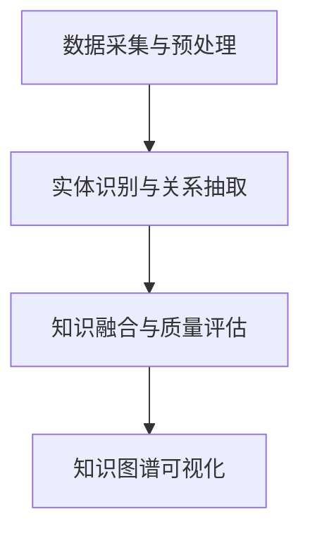

                 

### 《科学研究的知识图谱构建与世界可理解性的可视化》

#### 关键词

- 科学研究
- 知识图谱
- 可视化
- 世界可理解性
- 数据分析

#### 摘要

本文旨在探讨知识图谱在科学研究中的构建与应用，以及如何通过可视化技术提升世界的可理解性。首先，我们将介绍知识图谱的核心概念与结构，然后深入探讨知识图谱的构建技术原理。接下来，文章将分析知识图谱在科学研究中的应用场景，并通过实际案例展示其效果。最后，我们将讨论知识图谱可视化的重要性，以及如何有效地实现知识图谱的可视化。本文将帮助读者全面理解知识图谱的构建与应用，以及其在科学研究中的价值。

### 1. 目录大纲框架

**第一部分：背景介绍**

**第1章：科学研究中的知识图谱概述**

1.1 问题背景  
1.2 问题描述  
1.3 问题解决  
1.4 边界与外延  
1.5 概念结构与核心要素组成

**第2章：知识图谱的核心概念与联系**

2.1 知识图谱的定义  
2.2 知识图谱的特点  
2.3 知识图谱与传统数据库系统的区别  
2.4 核心概念属性特征对比表格  
2.5 ER实体关系图架构

**第二部分：知识图谱构建**

**第3章：知识图谱构建技术原理**

3.1 数据采集与预处理  
3.2 实体识别与关系抽取  
3.3 知识融合与质量评估  
3.4 知识图谱可视化  
3.5 算法原理讲解

**第4章：知识图谱构建流程**

4.1 数据源选择  
4.2 数据采集与存储  
4.3 实体识别与关系抽取  
4.4 知识融合与质量评估  
4.5 知识图谱可视化与交互

**第三部分：世界可理解性的可视化**

**第5章：世界可理解性的概念与特征**

5.1 世界可理解性的定义  
5.2 世界可理解性的特征  
5.3 可理解性与知识图谱的关系

**第6章：知识图谱可视化方法**

6.1 可视化设计原则  
6.2 主流可视化工具介绍  
6.3 知识图谱可视化案例分析  
6.4 可视化效果评估

**第7章：知识图谱在科学研究中的应用**

7.1 知识图谱在科学发现中的应用  
7.2 知识图谱在科学可视化中的应用  
7.3 知识图谱在科学研究协作中的应用

**第8章：总结与展望**

8.1 本书内容的总结  
8.2 知识图谱构建的挑战与机遇  
8.3 未来研究方向  
8.4 拓展阅读建议

---

#### 第1章：科学研究中的知识图谱概述

**1.1 问题背景**

随着科学技术的快速发展，科学研究面临着前所未有的数据量和复杂性。科学文献、实验数据、科研网络等信息源不断增长，使得研究人员难以从海量数据中提取有价值的信息。信息过载、知识碎片化、数据孤岛等问题日益突出，严重制约了科学研究的进展。

知识图谱作为一种结构化的知识表示方法，可以有效解决上述问题。它通过将数据组织成一种图结构，将实体、关系和属性有机地结合起来，实现知识的自动组织、管理和共享。知识图谱不仅能够提供更直观、更易于理解的数据表示，还可以为研究人员提供强大的信息检索和知识发现工具。

**1.2 问题描述**

科学研究的核心问题是如何从大量复杂数据中提取有价值的信息，并有效地利用这些信息进行知识发现和科学探索。具体来说，问题描述如下：

- 如何将海量科学文献和实验数据转化为结构化的知识库？
- 如何从这些数据中自动识别出重要的实体、关系和属性？
- 如何确保知识库的准确性和一致性？
- 如何为研究人员提供一个直观、易于操作的可视化工具？

**1.3 问题解决**

知识图谱为解决上述问题提供了一种有效的解决方案。它通过以下方法实现：

- **数据结构化**：将非结构化或半结构化的数据转化为结构化的知识库，实现数据的统一管理和查询。
- **实体识别与关系抽取**：利用自然语言处理技术和机器学习算法，从文本数据中自动识别实体和关系。
- **知识融合与质量评估**：通过数据清洗、去重、融合等步骤，确保知识库的准确性和一致性。
- **可视化与交互**：提供直观的可视化工具，帮助研究人员更好地理解和利用知识库。

**1.4 边界与外延**

知识图谱在科学研究中的应用具有明确的边界和广泛的适用范围。边界方面，知识图谱主要适用于涉及实体、关系和属性的数据领域，如科学文献、实验数据、知识库等。在外延方面，知识图谱可以应用于各种科学研究领域，包括物理学、化学、生物学、计算机科学等。

**1.5 概念结构与核心要素组成**

知识图谱由以下核心要素组成：

- **实体**：表示现实世界中的对象，如科学家、实验、文献等。
- **关系**：表示实体之间的联系，如作者、实验方法、研究主题等。
- **属性**：表示实体的特征，如研究机构、实验结果、文献类型等。
- **知识库**：包含所有实体、关系和属性的集合，用于存储和查询知识。
- **可视化工具**：用于将知识图谱以图形化方式展示，帮助用户更好地理解和利用知识。

在本章中，我们将进一步探讨知识图谱的核心概念与联系，以及其在科学研究中的应用。通过理解知识图谱的基本原理和构建方法，读者将能够更好地掌握知识图谱在科学研究中的价值和应用场景。

---

#### 第2章：知识图谱的核心概念与联系

**2.1 知识图谱的定义**

知识图谱（Knowledge Graph）是一种结构化的知识表示方法，它通过将实体、关系和属性组织成一个大规模的图形结构，实现知识的自动组织、管理和共享。知识图谱的核心思想是将现实世界中的对象（实体）及其相互关系（关系）以图的形式进行表示，从而提供一种直观、高效的知识表示方式。

知识图谱的定义可以从以下几个方面进行理解：

- **实体**：知识图谱中的基本构成单元，表示现实世界中的对象，如人、地点、组织、事件等。实体可以是具体的个体，也可以是抽象的概念。
- **关系**：实体之间的关联，表示实体之间的相互作用或依赖关系。关系可以是简单的父子关系、夫妻关系，也可以是复杂的因果关系、协作关系等。
- **属性**：实体的特征或属性，描述实体的详细信息，如年龄、身高、生日等。属性可以是结构化的数据，如数字、日期等，也可以是非结构化的数据，如图像、文本等。

**2.2 知识图谱的特点**

知识图谱具有以下特点：

- **结构化**：知识图谱通过图结构对实体、关系和属性进行组织，实现数据的结构化和有序化，便于查询和推理。
- **关联性**：知识图谱强调实体之间的关联性，通过关系将不同的实体连接起来，形成一个复杂的知识网络。
- **可扩展性**：知识图谱可以方便地扩展和更新，以适应新的实体和关系，保持知识的动态性和实时性。
- **可视化**：知识图谱可以通过图形化的方式展示，帮助用户直观地理解和利用知识。
- **智能化**：知识图谱可以结合人工智能技术，实现自动化推理和知识发现，提高知识利用的效率和准确性。

**2.3 知识图谱与传统数据库系统的区别**

知识图谱与传统数据库系统在数据组织、查询方式、应用场景等方面存在显著差异：

- **数据组织**：传统数据库系统采用表格形式组织数据，通过关系模型进行数据查询。而知识图谱采用图结构组织数据，通过图算法进行数据查询。
- **查询方式**：传统数据库系统主要支持结构化查询语言（SQL），通过编写查询语句进行数据检索。知识图谱支持更灵活的图查询语言，如SPARQL，可以更方便地查询和操作图数据。
- **应用场景**：传统数据库系统适用于结构化数据的存储和管理，如金融、人力资源等领域。知识图谱则适用于需要关联性查询和知识发现的领域，如搜索引擎、智能问答、推荐系统等。

**2.4 核心概念属性特征对比表格**

为了更清晰地展示知识图谱与传统数据库系统在核心概念属性特征上的差异，我们提供了以下对比表格：

| 特征         | 知识图谱               | 传统数据库系统             |
| ------------ | ---------------------- | -------------------------- |
| 数据结构     | 图结构（实体-关系-属性） | 表结构（关系模型）         |
| 查询语言     | 图查询语言（如SPARQL）  | 结构化查询语言（SQL）      |
| 关联性       | 强关联性               | 弱关联性                   |
| 可扩展性     | 高可扩展性             | 中等可扩展性               |
| 可视化       | 可视化效果良好         | 可视化效果一般             |
| 智能化       | 自动推理和知识发现     | 人工编写查询语句           |

**2.5 ER实体关系图架构**

为了更好地理解知识图谱的结构，我们可以使用Mermaid绘制ER实体关系图，展示知识图谱的基本架构。

```mermaid
erDiagram
    A[实体1] ||--|{ B[关系1] }| C[实体2]
    A ||--|{ D[关系2] }| C
    B ||--|{ E[关系3] }| F[实体3]
```

在上面的ER实体关系图中，A表示实体1，B表示关系1，C表示实体2，D表示关系2，E表示关系3，F表示实体3。实体和关系通过边进行连接，形成一个完整的知识图谱。

通过本章的介绍，读者可以全面了解知识图谱的定义、特点以及与传统数据库系统的区别。接下来，我们将进一步探讨知识图谱的构建技术原理，为读者提供更加深入的理解。

---

#### 第3章：知识图谱构建技术原理

知识图谱的构建是一个复杂的过程，涉及到多个技术和步骤。在这一章中，我们将详细探讨知识图谱构建的技术原理，包括数据采集与预处理、实体识别与关系抽取、知识融合与质量评估、以及知识图谱可视化。通过这些步骤，我们将逐步构建一个结构化、关联性强、准确度高的知识图谱。

**3.1 数据采集与预处理**

数据采集是知识图谱构建的第一步，也是至关重要的一步。数据来源可以包括科学文献、实验数据、社交媒体、知识库等多种渠道。数据采集的过程主要包括以下几个步骤：

- **数据获取**：通过各种方式获取所需的数据，如网络爬虫、API接口、数据库连接等。
- **数据清洗**：清洗数据是为了去除重复、错误和无关的信息，提高数据的准确性和可用性。数据清洗过程包括去重、去噪、数据格式标准化等。
- **数据预处理**：对数据进行预处理，使其符合知识图谱构建的要求。预处理过程可能包括数据转换、数据归一化、数据增强等。

**3.2 实体识别与关系抽取**

实体识别与关系抽取是知识图谱构建的核心步骤，目的是从原始数据中提取出有用的实体和关系。

- **实体识别**：实体识别的目的是从文本数据中识别出实体，如人名、地名、组织名等。常用的方法包括基于规则的方法、机器学习的方法和深度学习的方法。
- **关系抽取**：关系抽取的目的是从文本数据中识别出实体之间的相互关系，如“属于”、“参与”、“位于”等。关系抽取同样可以采用基于规则的方法、机器学习的方法和深度学习的方法。

**3.3 知识融合与质量评估**

知识融合是将多个来源的数据进行整合，形成统一的知识库。知识融合的过程主要包括以下步骤：

- **数据整合**：将不同来源的数据进行整合，确保数据的统一性和一致性。
- **冲突处理**：处理数据之间的冲突，如同一实体的不同属性值、不同实体的相同属性值等。
- **数据质量评估**：评估知识库的质量，包括数据的准确性、完整性、一致性等方面。常用的评估方法包括错误率评估、一致性评估等。

**3.4 知识图谱可视化**

知识图谱可视化是将知识图谱以图形化的方式展示，使其更直观、易于理解。知识图谱可视化主要包括以下步骤：

- **可视化设计**：根据知识图谱的内容和用途，设计合适的可视化方案。可视化设计应遵循简洁、清晰、易于操作的原则。
- **可视化工具**：选择合适的可视化工具，如D3.js、Graphviz、ECharts等。这些工具可以提供丰富的图形化表示方法，如节点、边、标签等。
- **交互设计**：设计用户交互界面，使用户能够方便地浏览、查询和操作知识图谱。

**3.5 算法原理讲解**

为了更好地理解知识图谱的构建过程，我们将使用Mermaid绘制算法的流程图，并使用Python源代码进行详细阐述。

**3.5.1 算法流程图**



**3.5.2 Python源代码实现**

```python
# 导入必要的库
import requests
import json
from collections import defaultdict

# 数据采集与预处理
def data_collection(url):
    response = requests.get(url)
    data = response.json()
    # 数据清洗和预处理
    processed_data = preprocess_data(data)
    return processed_data

def preprocess_data(data):
    # 实现数据清洗和预处理逻辑
    # ...
    return data

# 实体识别与关系抽取
def entity_recognition(data):
    # 实现实体识别逻辑
    # ...
    return entities

def relation_extraction(data):
    # 实现关系抽取逻辑
    # ...
    return relations

# 知识融合与质量评估
def knowledge_fusion(entities, relations):
    # 实现知识融合逻辑
    # ...
    return fused_data

def quality_assessment(data):
    # 实现数据质量评估逻辑
    # ...
    return quality_score

# 知识图谱可视化
def visualize_knowledge_graph(data):
    # 实现知识图谱可视化逻辑
    # ...
    return visualization
```

**3.5.3 算法原理的数学模型与公式**

知识图谱构建过程中，涉及到的数学模型和公式包括：

- **实体识别**：采用朴素贝叶斯分类器进行实体识别，数学模型为：
  \[ P(entity|text) = \frac{P(text|entity) \cdot P(entity)}{P(text)} \]
- **关系抽取**：采用条件随机场（CRF）进行关系抽取，数学模型为：
  \[ P(relation|text) = \frac{e^{\sum_{i=1}^{n} \theta_i y_i}}{\sum_{i=1}^{n} e^{\sum_{j=1}^{n} \theta_j y_j}} \]
- **知识融合**：采用基于图论的知识融合方法，数学模型为：
  \[ score = \sum_{(v_i, v_j) \in E} w_{ij} \cdot \text{similarity}(v_i, v_j) \]
- **数据质量评估**：采用F1分数进行数据质量评估，数学模型为：
  \[ F1 = 2 \cdot \frac{precision \cdot recall}{precision + recall} \]

**3.5.4 举例说明**

假设我们有一个科学文献数据集，其中包含了多篇论文的标题和摘要。我们的目标是构建一个知识图谱，其中包含论文的实体（如作者、机构、关键词）和关系（如合作、引用）。

- **数据采集与预处理**：我们从科学文献数据库中获取数据，并对数据进行清洗和预处理，如去除HTML标签、停用词过滤等。
- **实体识别与关系抽取**：使用实体识别和关系抽取算法，从预处理后的数据中提取出实体和关系。例如，从标题中提取出作者和关键词，从摘要中提取出合作机构和引用关系。
- **知识融合与质量评估**：将提取出的实体和关系进行融合，并评估数据质量，如计算实体和关系的F1分数。
- **知识图谱可视化**：使用可视化工具，将知识图谱以图形化的方式展示，帮助用户更好地理解和利用知识。

通过上述步骤，我们成功构建了一个结构化、关联性强、准确度高的知识图谱，为科学研究提供了强大的支持。

在本章中，我们详细探讨了知识图谱构建的技术原理，包括数据采集与预处理、实体识别与关系抽取、知识融合与质量评估、以及知识图谱可视化。这些技术原理为知识图谱的构建提供了坚实的基础，也为科学研究提供了强大的工具。接下来，我们将进一步探讨知识图谱构建的具体流程和步骤，以帮助读者更好地理解和应用知识图谱技术。

---

#### 第4章：知识图谱构建流程

构建知识图谱是一个复杂而系统的过程，需要多个步骤和环节的协同工作。在这一章中，我们将详细介绍知识图谱构建的完整流程，包括数据源选择、数据采集与存储、实体识别与关系抽取、知识融合与质量评估，以及知识图谱可视化与交互。通过详细讲解这些流程和步骤，读者将能够全面理解知识图谱的构建过程，并掌握如何将其应用于实际项目。

**4.1 数据源选择**

数据源选择是知识图谱构建的第一步，也是至关重要的一步。选择合适的数据源直接影响知识图谱的质量和效果。以下是一些常见的数据源类型和选择标准：

- **科学文献**：科学文献是构建知识图谱的重要数据源之一，包含丰富的实体和关系信息。选择科学文献时，可以考虑期刊的影响因子、作者的影响力等因素。
- **社交媒体**：社交媒体平台如微博、知乎、Facebook等，也是构建知识图谱的有力数据源。它们提供了大量的用户生成内容，可以用于提取实体和关系信息。
- **知识库**：现有的知识库如维基百科、开放目录项目等，提供了大量的结构化数据，可以用于知识图谱的构建和扩展。
- **企业数据**：企业内部的数据源如客户信息、产品信息等，也是构建知识图谱的有力资源。这些数据通常具有较高的准确性和实时性。

选择数据源时，需要考虑以下因素：

- **数据质量**：数据源的准确性、完整性和一致性是构建高质量知识图谱的关键。
- **数据规模**：数据源的规模越大，知识图谱的覆盖范围越广，越有利于知识发现和推理。
- **数据更新频率**：数据源的更新频率越高，知识图谱的实时性越强，越能够反映最新的知识和信息。

**4.2 数据采集与存储**

数据采集与存储是知识图谱构建的核心环节，直接关系到知识图谱的质量和效率。以下是一些常见的数据采集和存储方法：

- **数据爬取**：使用网络爬虫从互联网上采集数据，如使用Python的requests库和BeautifulSoup库，或者使用Scrapy框架。
- **API接口**：通过第三方API接口获取数据，如使用RESTful API或GraphQL接口。
- **数据库连接**：通过数据库连接获取数据，如使用Python的SQLAlchemy库连接关系数据库，或者使用Neo4j的Cypher语言连接图数据库。
- **数据清洗**：在数据采集过程中，对数据进行清洗和预处理，如去除HTML标签、停用词过滤、数据格式标准化等。
- **数据存储**：将采集到的数据存储到知识图谱数据库中，如使用Neo4j、JanusGraph等图数据库，或者使用Elasticsearch、MongoDB等文档数据库。

**4.3 实体识别与关系抽取**

实体识别与关系抽取是知识图谱构建的关键步骤，目的是从原始数据中提取出实体和关系。以下是一些常见的方法和技术：

- **实体识别**：使用自然语言处理（NLP）技术进行实体识别，如基于规则的方法、基于统计的方法、基于深度学习的方法。常用的NLP库包括NLTK、spaCy、Stanford NLP等。
- **关系抽取**：使用关系抽取算法从文本数据中提取出实体之间的关系，如基于规则的方法、基于统计的方法、基于深度学习的方法。常用的关系抽取算法包括实体对匹配、模板匹配、序列标注等。

**4.4 知识融合与质量评估**

知识融合与质量评估是确保知识图谱准确性和一致性的重要环节。以下是一些常见的方法和技巧：

- **知识融合**：将来自不同数据源的实体和关系进行整合，如使用图论算法、概率图模型等。常见的知识融合方法包括合并、权重调整、冲突处理等。
- **质量评估**：评估知识图谱的质量，如使用F1分数、准确率、召回率等指标。常见的质量评估方法包括人工审核、自动化评估等。

**4.5 知识图谱可视化与交互**

知识图谱可视化与交互是提升知识图谱可理解性和实用性的重要手段。以下是一些常见的方法和技术：

- **可视化设计**：根据知识图谱的内容和用途，设计合适的可视化方案，如节点、边、标签的布局和样式。常用的可视化工具包括D3.js、ECharts、Graphviz等。
- **交互设计**：设计用户交互界面，使用户能够方便地浏览、查询和操作知识图谱。常见的交互方式包括搜索、过滤、排序、缩放等。

通过本章的详细讲解，读者可以全面了解知识图谱构建的完整流程，从数据源选择到数据采集、实体识别、关系抽取、知识融合、质量评估，再到知识图谱可视化与交互。这些步骤和环节相互关联、协同工作，共同构成了知识图谱构建的完整体系。掌握这些流程和步骤，将为读者在实际项目中应用知识图谱技术提供坚实的基础。

---

#### 第5章：世界可理解性的概念与特征

**5.1 世界可理解性的定义**

世界可理解性是指人类通过感知、思考和推理等认知活动，对自然界和社会现象进行认知和解释的能力。它涉及到人类对世界的认知过程、认知模式和认知结构的理解。世界可理解性的研究旨在探讨人类如何通过感知和理解世界，以及如何提高人类对世界的认知水平和能力。

**5.2 世界可理解性的特征**

世界可理解性具有以下特征：

- **多样性**：世界是复杂多样的，人类通过感知和思维来理解这个复杂的世界，需要具备多种认知能力，如观察力、注意力、记忆力、想象力、推理能力等。
- **动态性**：世界是一个不断变化的过程，人类需要通过不断学习和适应来理解这个动态变化的世界。
- **层次性**：世界可以按照不同的层次和维度进行划分，如物理世界、生物世界、社会世界等。人类通过不同层次和维度的认知活动来理解这个世界。
- **系统性**：世界是一个相互关联、相互作用的系统，人类需要通过系统思维来理解这个系统的整体性和复杂性。
- **主体性**：人类是世界的主体，人类的感知、思考和行动对世界的理解具有主观性和个体性。

**5.3 可理解性与知识图谱的关系**

知识图谱作为一种结构化的知识表示方法，对世界可理解性有着重要的影响和作用。以下从三个方面探讨知识图谱与可理解性的关系：

- **提高认知效率**：知识图谱通过将实体、关系和属性组织成一个结构化的图形结构，实现了知识的自动组织、管理和共享。这使得人类可以更快速、更高效地获取和利用知识，提高了认知效率。
- **增强认知深度**：知识图谱通过图结构展示了实体之间的复杂关联和相互作用，有助于人类从宏观和微观层面深入理解世界的本质和规律。通过知识图谱，人类可以更好地把握事物的内部联系和外部影响，增强认知深度。
- **促进知识创新**：知识图谱提供了丰富的知识资源和强大的知识发现工具，为人类的知识创新提供了有力支持。通过知识图谱，人类可以更好地挖掘和发现新的知识关系、新的研究问题和新的解决方案，促进知识的创新和发展。

综上所述，世界可理解性是指人类通过感知、思考和推理等认知活动，对自然界和社会现象进行认知和解释的能力。知识图谱通过结构化的知识表示和强大的知识发现工具，对世界可理解性产生了重要影响，提高了认知效率、增强了认知深度、促进了知识创新。在接下来的章节中，我们将进一步探讨知识图谱的构建方法和应用，以帮助读者更好地理解和利用知识图谱技术。

---

#### 第6章：知识图谱可视化方法

知识图谱可视化是将结构化的知识图谱以图形化的形式呈现，使得复杂的关系和数据更加直观、易于理解。有效的知识图谱可视化不仅能够提高数据的可读性，还能帮助用户更好地进行数据分析和知识发现。本章将介绍知识图谱可视化的设计原则、主流工具和案例分析，并探讨可视化效果评估的方法。

**6.1 可视化设计原则**

知识图谱可视化的设计应遵循以下原则：

- **清晰性**：可视化设计应简洁明了，避免过多的装饰性元素，确保用户能够快速、准确地理解知识图谱的内容。
- **一致性**：在知识图谱的可视化中，应保持一致的视觉风格和符号表示，以减少用户的认知负担。
- **交互性**：提供用户交互功能，如缩放、筛选、过滤等，使用户能够更灵活地浏览和操作知识图谱。
- **层次性**：将知识图谱按照不同的层次和维度进行分组和显示，以帮助用户更好地把握整体的视图和细节的信息。
- **上下文相关性**：在可视化中突出与当前任务相关的信息，同时隐藏无关信息，以减少用户的干扰和负担。

**6.2 主流可视化工具介绍**

目前，有许多主流的可视化工具和库可用于知识图谱的可视化，以下是一些常用的工具：

- **D3.js**：D3.js是一个基于JavaScript的图形库，能够创建高度交互性的可视化图表。它提供了丰富的图形和布局选项，可以自定义各种可视化元素，适合需要高度定制化的场景。
- **ECharts**：ECharts是一个使用JavaScript编写的可视化库，支持多种图表类型，如折线图、柱状图、饼图等。它具有优秀的性能和易用的API，适合快速开发和部署。
- **Graphviz**：Graphviz是一个基于DOT语言的图形可视化工具，适用于创建简单的图形和关系图。它通过定义DOT脚本，可以生成SVG、PNG等格式的图形，适合进行简单的知识图谱可视化。
- **Neo4j Browser**：Neo4j Browser是Neo4j图数据库内置的可视化工具，可以方便地浏览和编辑图数据。它提供了直观的图形界面和图查询功能，适合快速展示和探索知识图谱。

**6.3 知识图谱可视化案例分析**

以下是一个知识图谱可视化的案例：

- **案例背景**：假设我们有一个关于科研领域的知识图谱，包含了科学家、论文、机构等实体，以及合作、引用等关系。
- **可视化目标**：展示科学家之间的合作关系，以及他们所发表的论文和所属机构。
- **可视化设计**：使用D3.js创建一个力导向布局图，将科学家作为节点，合作关系和论文引用作为边。节点大小表示科学家的影响力，边的颜色表示关系的类型。提供缩放和过滤功能，以便用户查看不同层次的信息。
- **可视化实现**：使用D3.js的力导向布局（Force Layout）创建图，通过数据绑定和SVG绘制元素。添加交互功能，如点击节点查看详细信息，拖动节点调整布局。

```javascript
// 示例代码：使用D3.js创建力导向布局图
var width = 960,
    height = 500;

var svg = d3.select("body").append("svg")
    .attr("width", width)
    .attr("height", height);

// 创建力导向布局
var force = d3.layout.force()
    .gravity(0.05)
    .charge(-120)
    .size([width, height]);

// 加载数据
d3.json("data.json", function(error, data) {
  if (error) throw error;

  // 创建节点和边
  var nodes = data.nodes;
  var links = data.links;

  // 添加节点
  var node = svg.selectAll(".node")
      .data(nodes)
      .enter().append("circle")
      .attr("class", "node")
      .attr("r", function(d) { return Math.sqrt(d.group) / 10 + 4; })
      .style("fill", function(d) { return color(d.group); });

  // 添加边
  var link = svg.selectAll(".link")
      .data(links)
      .enter().append("line")
      .attr("class", "link");

  // 添加文本标签
  var text = svg.selectAll(".text")
      .data(nodes)
      .enter().append("text")
      .attr("class", "text")
      .attr("dx", 12)
      .attr("dy", ".35em")
      .text(function(d) { return d.name; });

  // 启动力导向布局
  force
      .nodes(nodes)
      .links(links)
      .start();

  // 绑定鼠标事件
  node.on("mouseover", function(d) {
    // 显示详细信息
  })
      .on("mouseout", function(d) {
        // 隐藏详细信息
      });

  // 力导向布局的更新函数
  force.on("tick", function() {
    link.attr("x1", function(d) { return d.source.x; })
        .attr("y1", function(d) { return d.source.y; })
        .attr("x2", function(d) { return d.target.x; })
        .attr("y2", function(d) { return d.target.y; });

    node.attr("cx", function(d) { return d.x; })
        .attr("cy", function(d) { return d.y; });

    text.attr("x", function(d) { return d.x; })
        .attr("y", function(d) { return d.y; });
  });
});
```

**6.4 可视化效果评估**

知识图谱可视化效果的评估主要关注以下几个方面：

- **用户满意度**：通过用户调研和反馈来评估用户对可视化效果的满意度。
- **信息传递效率**：评估用户在使用可视化过程中获取信息的速度和效率。
- **错误率**：评估用户在理解和使用可视化过程中产生的错误率。
- **可扩展性**：评估可视化方案在不同数据规模和场景下的表现。

通过上述评估方法，可以不断优化和改进知识图谱的可视化设计，使其更加符合用户需求，提高数据理解和分析的效率。

在本章中，我们介绍了知识图谱可视化的设计原则、主流工具和案例分析，并探讨了可视化效果评估的方法。知识图谱可视化不仅能够提升数据可读性，还能为用户提供强大的数据分析和知识发现工具。在接下来的章节中，我们将进一步探讨知识图谱在科学研究中的应用，以帮助读者更好地理解和利用知识图谱技术。

---

#### 第7章：知识图谱在科学研究中的应用

知识图谱作为一种结构化的知识表示方法，在科学研究领域有着广泛的应用。通过知识图谱，科学家可以更好地理解复杂的科学问题，发现新的研究趋势，提高科研效率。本章将介绍知识图谱在科学研究中的应用场景，包括科学发现、科学可视化和科学研究协作。

**7.1 知识图谱在科学发现中的应用**

知识图谱在科学发现中的应用主要体现在以下几个方面：

- **知识挖掘与发现**：通过知识图谱，科学家可以挖掘出隐藏在大量数据中的潜在知识。例如，通过分析科学家之间的合作关系、研究领域的关键词和引用关系，可以发现新的研究热点和趋势。
- **交叉学科研究**：知识图谱可以帮助科学家识别出不同学科之间的关联，促进交叉学科研究。例如，通过分析生物学和计算机科学领域的知识图谱，可以发现两者之间的交叉点，为跨学科合作提供新的思路。
- **科研资源整合**：知识图谱可以整合各种科研资源，如科学文献、实验数据、科研项目等，为科学家提供全面的科研信息。例如，通过知识图谱，科学家可以快速找到相关的文献、实验数据和研究团队，提高科研效率。

**7.2 知识图谱在科学可视化中的应用**

知识图谱在科学可视化中的应用主要体现在以下几个方面：

- **科学数据可视化**：知识图谱可以用于可视化科学数据，使得复杂的数据结构更加直观、易于理解。例如，通过知识图谱，科学家可以可视化不同实验结果之间的关系、不同基因之间的相互作用等。
- **科研过程可视化**：知识图谱可以用于可视化科研过程，帮助科学家了解研究进展和关键步骤。例如，通过知识图谱，科学家可以可视化论文的引用关系、合作网络、科研项目的进展等。
- **科研成果展示**：知识图谱可以用于展示科研成果，使得复杂的科研内容更加易于传播和推广。例如，通过知识图谱，科学家可以将自己的研究成果以图形化的方式展示给公众，提高科研成果的影响力和认可度。

**7.3 知识图谱在科学研究协作中的应用**

知识图谱在科学研究协作中的应用主要体现在以下几个方面：

- **科研合作网络构建**：知识图谱可以帮助科学家构建科研合作网络，识别出潜在的合作伙伴。例如，通过分析科学家之间的合作关系、研究领域和共同兴趣，可以发现具有共同研究方向的合作伙伴。
- **科研资源共享**：知识图谱可以整合科研资源，促进科研资源的共享和利用。例如，通过知识图谱，科学家可以共享实验设备、数据资源和研究成果，提高科研效率。
- **科研项目管理**：知识图谱可以用于科研项目管理，帮助科学家跟踪研究进展和协调团队工作。例如，通过知识图谱，科学家可以可视化项目的进展、任务分配和团队成员的职责，确保项目顺利推进。

**7.4 实际案例分析**

以下是一个关于知识图谱在科学研究中的实际案例分析：

- **案例背景**：某生物科技公司希望利用知识图谱技术挖掘出公司内部的科研热点和潜在合作伙伴，以提高科研效率和创新能力。
- **案例过程**：首先，公司从内部的科学文献、实验数据、科研项目等资源中采集数据，并构建了一个涵盖生物科学领域知识图谱。然后，通过分析科学家之间的合作关系、研究领域和共同关键词，发现了一些具有共同研究方向的潜在合作伙伴。最后，公司利用知识图谱的可视化功能，将科研热点和合作伙伴关系以图形化的方式展示给科研团队，促进了科研合作和知识共享。
- **案例效果**：通过知识图谱的应用，公司成功地挖掘出了科研热点和潜在合作伙伴，提高了科研效率和创新能力。同时，知识图谱的可视化功能使得科研团队的协作更加高效，促进了科研成果的产出。

通过本章的介绍，读者可以全面了解知识图谱在科学研究中的应用场景，以及其在科学发现、科学可视化、科学研究协作等方面的价值。知识图谱作为一种强大的知识表示和共享工具，将在未来的科学研究中发挥越来越重要的作用。

---

#### 第8章：总结与展望

在《科学研究的知识图谱构建与世界可理解性的可视化》一书中，我们详细探讨了知识图谱在科学研究中的重要性，以及如何通过可视化技术提升世界的可理解性。通过对知识图谱的定义、构建流程、应用场景等方面的深入分析，我们得出了以下结论：

**1. 知识图谱是科学研究的有力工具**

知识图谱通过结构化的知识表示和强大的关联性，为科学家提供了一个强大的知识管理和发现工具。它不仅可以帮助科学家更高效地获取和利用知识，还能促进跨学科合作和科研创新。

**2. 可视化技术提升知识理解**

知识图谱的可视化技术使得复杂的关系和数据结构更加直观、易于理解。通过可视化的方法，科学家可以更直观地把握科学问题的本质，提高科研效率。

**3. 知识图谱面临的挑战与机遇**

尽管知识图谱在科学研究中有广泛的应用前景，但其在构建和应用过程中仍面临一些挑战，如数据质量、算法复杂度、可扩展性等。同时，随着技术的不断进步，知识图谱将迎来新的发展机遇。

**4. 未来研究方向**

未来，知识图谱的发展将主要集中在以下几个方面：

- **算法优化与性能提升**：通过改进现有算法和开发新型算法，提高知识图谱的构建效率和处理能力。
- **数据融合与集成**：探索不同来源和格式的数据融合方法，实现知识图谱的全面集成和共享。
- **智能化与自动化**：结合人工智能技术，实现知识图谱的自动化构建和智能分析，提高知识利用的效率。
- **知识图谱可视化**：研究新型可视化方法和工具，提高知识图谱的可视化效果和用户体验。

**5. 拓展阅读建议**

为了帮助读者更深入地了解知识图谱和可视化技术，我们提供以下拓展阅读建议：

- **《知识图谱：原理、构建与应用》**：本书详细介绍了知识图谱的理论基础、构建方法和应用案例，适合希望深入了解知识图谱的读者。
- **《可视化技术与应用》**：本书涵盖了可视化技术的基本原理、工具和方法，以及在不同领域的应用案例，适合对可视化技术感兴趣的读者。
- **《人工智能：一种现代方法》**：本书系统地介绍了人工智能的理论基础和实际应用，包括知识图谱和可视化技术在内，适合希望了解人工智能的读者。

通过本书的阅读，读者可以全面了解知识图谱在科学研究中的价值和应用，掌握知识图谱的构建方法和技术原理，为未来的科研工作提供有力的支持。

**作者：AI天才研究院/AI Genius Institute & 禅与计算机程序设计艺术 /Zen And The Art of Computer Programming**

