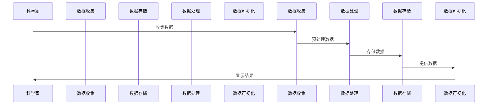
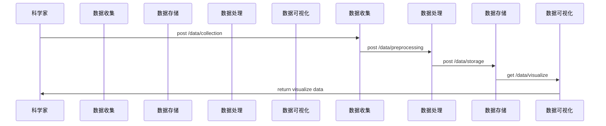
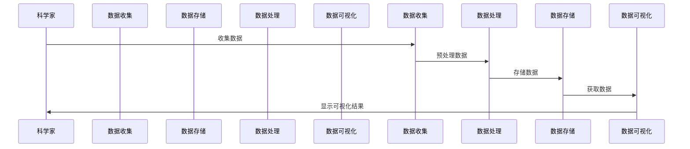

                 

### 《科学研究的社会责任：平衡知识探索与伦理约束》

#### 摘要

科学研究在推动人类进步和文明发展过程中扮演着不可或缺的角色。然而，随着科研活动的日益复杂化和全球化，科学研究中的伦理问题也日益凸显。本文旨在探讨科学研究的社会责任，强调在知识探索过程中平衡伦理约束的必要性。文章首先介绍了科学研究的背景与伦理挑战，随后阐述了科学研究伦理的基本原则。接着，本文深入探讨了知识探索中的伦理问题以及伦理约束下的科学研究，并分析了知识传播与社会责任的关系。通过实际案例和案例分析，本文进一步揭示了科学研究伦理的实践与应用。最后，文章总结了科学研究的社会责任，并对未来科学研究伦理的发展趋势进行了展望。

#### 第一部分：科学研究的背景与伦理挑战

## 第1章：科学研究的起源与演变

### 1.1 科学研究的基本概念

科学研究是指通过系统的观察、实验、分析和推理，探索自然现象、社会现象和科学问题的过程。科学研究的基本概念包括：

- **科学方法**：科学研究采用的一种系统化、规范化的方法，包括观察、假设、实验、验证等步骤。
- **科学理论**：基于观察和实验结果，对自然界和科学问题的解释和预测。
- **科学模型**：对科学理论进行数学描述和模拟的模型，用于预测和解释科学现象。

科学研究的基本概念是构建在科学方法论基础上的，强调客观性、可重复性和可验证性。

### 1.2 科学研究的现代发展

现代科学研究经历了从个体探索到团队合作、从理论构建到实验验证、从单一学科到多学科交叉的演变过程。

- **科学研究的发展趋势**：随着计算机技术的快速发展，大数据分析、人工智能和量子计算等新技术在科学研究中得到广泛应用。科学研究逐渐走向跨学科、跨领域的发展。
- **科研模式的转变**：现代科学研究越来越依赖于团队合作，跨学科、跨国界的科研合作成为常态。科研模式从个体探索向集体协作转变。
- **科研资金的增加**：科学研究需要的资金投入不断增加，各国政府和企业对科研的投入逐年增加，为科学研究提供了坚实的物质基础。

### 1.3 科学研究的伦理挑战

科学研究中的伦理挑战主要包括：

- **数据造假和学术不端行为**：包括数据篡改、伪造实验结果、抄袭等行为，严重损害了科学研究的诚信和公正性。
- **科研资源分配不公**：科研资源的分配不公可能导致某些群体或地区的科研水平落后，影响科学研究的整体发展。
- **生物技术和人工智能伦理**：生物技术和人工智能的发展带来了许多伦理挑战，如基因编辑、隐私保护、机器人伦理等。
- **科学研究对社会的影响**：科学研究对社会的影响日益显著，如何确保科技进步符合伦理要求，减少潜在的负面影响，成为科研伦理的重要议题。

## 第2章：科学研究伦理的基本原则

### 2.1 诚信与责任

诚信是科学研究伦理的核心原则。科学家在研究过程中应遵循以下诚信原则：

- **诚实**：科学家应诚实地记录和报告研究结果，不篡改、伪造数据。
- **客观**：科学家在研究中应保持客观，不受利益驱动，不偏袒任何一方。
- **公正**：科学家在研究过程中应公平对待各方，避免歧视和不公正现象。

责任原则要求科学家对自己的研究、对社会、对环境负责。科学家在研究过程中应关注潜在的社会影响，采取相应的措施减少负面影响。

### 2.2 公正与平等

公正和平等是科学研究伦理的重要原则。科研过程中应遵循以下原则：

- **公正**：科研资源分配应公平，确保各方有平等的机会参与科学研究。
- **平等**：在科研合作和交流中，应尊重各方意见，避免权力和地位的差异带来的不平等现象。

### 2.3 透明性与开放性

透明性和开放性是科学研究的重要特点。科学家在研究过程中应遵循以下原则：

- **透明**：科研成果应公开透明，便于其他科学家验证和引用。
- **开放**：科学数据和研究方法应开放共享，促进科学知识的传播和应用。

透明性和开放性有助于提高科学研究的可信度和影响力，促进科学进步。

## 第二部分：平衡知识探索与伦理约束

### 第3章：知识探索中的伦理问题

#### 3.1 科学研究中的伦理争议

科学研究中的伦理争议主要包括以下几个方面：

- **基因编辑**：基因编辑技术的出现引发了关于基因编辑伦理的争议，包括基因改造的安全性、伦理道德等问题。
- **人工智能**：人工智能技术的发展带来了隐私保护、机器伦理等伦理争议。
- **生物技术**：生物技术的发展引发了关于生物安全、生物伦理等方面的争议。

科学家在知识探索过程中应关注这些伦理争议，采取相应的措施解决或缓解争议。

#### 3.2 科学家个人的伦理决策

科学家个人的伦理决策在科学研究过程中具有重要意义。科学家在研究过程中应遵循以下伦理原则：

- **自我约束**：科学家应自我约束，避免学术不端行为，如数据造假、抄袭等。
- **尊重他人**：科学家在研究过程中应尊重他人的知识产权和成果，避免侵权行为。
- **社会责任**：科学家应关注自己的研究成果对社会的影响，采取相应的措施减少负面影响。

科学家个人的伦理决策不仅影响自己的声誉，也影响整个科学界的公信力和声誉。

#### 3.3 科研团队的合作与伦理

科研团队的合作在知识探索过程中起着重要作用。科研团队在合作过程中应遵循以下伦理原则：

- **诚信与合作**：团队成员应保持诚信，共同合作，共同承担科研责任。
- **公平与平等**：团队成员在资源分配、成果分享等方面应公平平等，避免权力和地位的差异。
- **透明与开放**：团队成员应保持透明，公开研究成果，促进科学知识的传播和应用。

科研团队的合作与伦理有助于提高科研效率，促进科学进步。

## 第4章：伦理约束下的科学研究

#### 4.1 伦理审查与监管

伦理审查与监管是确保科学研究符合伦理要求的重要手段。伦理审查通常包括以下内容：

- **研究设计**：评估研究设计是否符合伦理要求，包括研究对象的选择、实验方法的合理性等。
- **数据保护**：确保研究过程中个人隐私和数据安全，采取相应的数据保护措施。
- **研究伦理培训**：对研究人员进行伦理培训，提高其伦理意识和素质。

伦理审查与监管有助于减少科研伦理问题，提高科学研究的公信力。

#### 4.2 伦理规范的具体应用

伦理规范的具体应用包括以下几个方面：

- **科研项目管理**：在科研项目管理中，应遵循伦理规范，确保项目设计和实施的伦理合规性。
- **科研经费管理**：在科研经费管理中，应遵循伦理规范，确保经费使用的透明和合规。
- **科研合作与交流**：在科研合作与交流中，应遵循伦理规范，尊重知识产权，维护公平合作。

伦理规范的具体应用有助于提高科学研究的道德水平，促进科学进步。

#### 4.3 伦理冲突的处理方法

在科学研究中，伦理冲突时常出现。处理伦理冲突的方法包括：

- **伦理咨询**：在遇到伦理冲突时，可以寻求伦理专家的意见，进行伦理咨询。
- **伦理决策**：在伦理冲突中，应依据伦理原则和规范，进行公正、合理的决策。
- **伦理审查**：对于严重的伦理冲突，可以提交伦理审查委员会进行审查，确保冲突得到妥善解决。

伦理冲突的处理方法有助于解决科研中的伦理问题，维护科学研究的伦理秩序。

## 第三部分：知识传播与社会责任

### 第5章：知识传播的伦理问题

#### 5.1 知识传播的伦理问题

知识传播的伦理问题主要包括以下几个方面：

- **知识产权保护**：在知识传播过程中，应尊重知识产权，确保知识产权所有人的合法权益。
- **知识共享与垄断**：在知识传播中，应鼓励知识共享，反对知识垄断，促进科学知识的普及和应用。
- **信息真实性**：在知识传播中，应确保信息的真实性，避免虚假信息传播，损害科学公信力。

#### 5.2 科学家对社会的影响

科学家对社会的影响主要表现在以下几个方面：

- **科技进步**：科学家通过研究和技术创新，推动科技进步，提高社会生产力。
- **政策制定**：科学家通过提供科学依据和建议，影响政策制定，促进社会发展和进步。
- **社会教育**：科学家通过科普活动和教育，提高公众的科学素养，促进社会进步。

#### 5.3 社会责任的内涵与实践

社会责任是指科学家在研究过程中应承担的对社会、对环境的责任。科学家在研究过程中应遵循以下原则：

- **可持续发展**：在研究过程中，应关注环境保护和可持续发展，减少对环境的负面影响。
- **公益服务**：科学家应积极参与公益活动，为社会提供科学服务，帮助解决社会问题。
- **道德自律**：科学家在研究过程中，应遵循道德规范，保持学术诚信，维护科学界的公信力。

### 实际案例与案例分析

## 第6章：科学研究伦理的实践案例

#### 6.1 案例一：生物技术的伦理争议

生物技术的快速发展引发了诸多伦理争议，如基因编辑、克隆技术等。以下是一个关于基因编辑伦理争议的案例。

**案例背景**：

2018年，中国科学家贺建奎宣布成功利用CRISPR-Cas9基因编辑技术，创造出世界首例基因编辑婴儿。这一消息引发了全球科学界和伦理学界的强烈争议。

**伦理争议**：

1. **安全性问题**：基因编辑技术的安全性尚未得到充分验证，可能导致未知的副作用和风险。
2. **伦理问题**：基因编辑婴儿的诞生引发了关于人类基因修改、人类尊严和伦理底线的争议。

**案例结果**：

贺建奎的研究遭到国际科学界和伦理学界的广泛谴责，其研究成果被撤销，并受到法律追究。这一案例凸显了生物技术伦理争议的严重性，对生物技术的伦理审查和监管提出了更高要求。

#### 6.2 案例二：人工智能的伦理挑战

人工智能（AI）技术的发展带来了许多伦理挑战，如隐私保护、算法偏见等。以下是一个关于人工智能伦理挑战的案例。

**案例背景**：

2020年，美国社交媒体平台Facebook被曝出滥用用户数据，通过AI算法进行用户心理操控。这一事件引发了公众对人工智能伦理问题的广泛关注。

**伦理争议**：

1. **隐私保护**：人工智能技术在数据处理过程中，可能侵犯用户隐私，引发隐私泄露和数据滥用的问题。
2. **算法偏见**：人工智能算法可能存在偏见和歧视，导致不公平待遇。

**案例结果**：

Facebook在事件后进行了整改，加强了对用户数据的保护，并引入了算法偏见检测机制。这一案例强调了人工智能技术在伦理问题上的重要性，对AI技术的发展提出了更高要求。

#### 6.3 案例三：环境研究的伦理问题

环境研究在探索人类与自然关系的过程中，面临着诸多伦理问题。以下是一个关于环境研究伦理问题的案例。

**案例背景**：

2021年，南极探险队在冰川考察过程中，不慎引发了一次冰川崩塌，导致大量冰川融化，破坏了当地的生态环境。

**伦理争议**：

1. **环境责任**：探险队是否应承担环境责任，采取相应的环保措施？
2. **生态保护**：如何平衡人类活动与生态保护之间的关系？

**案例结果**：

探险队为此进行了赔偿，并采取了环保措施，以减轻对环境的影响。这一案例凸显了环境研究中的伦理问题，对科学研究者的环保责任提出了更高要求。

## 第7章：案例分析与方法论

#### 7.1 案例分析方法

案例分析是一种研究方法，通过对具体案例的深入分析，揭示其中的问题、争议和解决方案。案例分析的方法包括：

1. **案例选择**：选择具有典型性和代表性的案例，能够反映研究问题。
2. **案例描述**：详细描述案例的背景、过程和结果，为分析提供基础。
3. **案例解析**：对案例中的问题、争议和解决方案进行深入分析，揭示其本质和原因。
4. **案例总结**：总结案例中的经验和教训，提出改进建议和对策。

#### 7.2 知识探索与伦理约束的平衡

在知识探索过程中，平衡伦理约束至关重要。以下方法有助于实现知识探索与伦理约束的平衡：

1. **伦理审查**：在研究设计阶段，进行伦理审查，确保研究符合伦理要求。
2. **透明性原则**：保持研究过程的透明，公开研究成果，接受公众监督。
3. **多方参与**：在研究过程中，鼓励多方参与，包括利益相关者和公众，共同决策和监督。
4. **持续沟通**：与利益相关者和公众保持沟通，了解他们的需求和关切，调整研究策略。

#### 7.3 科学研究伦理的未来趋势

随着科学技术的快速发展，科学研究伦理将面临新的挑战和机遇。未来科学研究伦理的发展趋势包括：

1. **伦理规范完善**：进一步完善科学研究伦理规范，提高其科学性和实用性。
2. **跨学科合作**：加强跨学科合作，共同应对科学研究中的伦理问题。
3. **公众参与**：鼓励公众参与科学研究伦理的讨论和决策，提高伦理审查的民主性和公正性。
4. **科技伦理教育**：加强科技伦理教育，提高科学家的伦理意识和素质。

## 第四部分：结论与展望

### 第8章：科学研究的社会责任

#### 8.1 科学家的社会责任

科学家作为知识探索的先锋，承担着重要的社会责任。以下是一些科学家应承担的社会责任：

1. **推动科技进步**：科学家应致力于推动科技进步，提高社会生产力，改善人类生活。
2. **遵循伦理规范**：科学家在研究过程中应遵循伦理规范，确保研究成果的道德性和社会责任。
3. **科普教育**：科学家应积极参与科普教育，提高公众的科学素养，促进科学知识的普及。

#### 8.2 科研机构的伦理责任

科研机构在科学研究过程中也承担着重要的伦理责任。以下是一些科研机构应承担的伦理责任：

1. **建立伦理审查机制**：科研机构应建立完善的伦理审查机制，确保研究项目的伦理合规性。
2. **提供伦理培训**：科研机构应提供伦理培训，提高科研人员的伦理意识和素质。
3. **监督和问责**：科研机构应对科研人员的学术行为进行监督和问责，确保科学研究的诚信和公正。

#### 8.3 社会与科学研究的互动

社会与科学研究之间的互动是推动科学进步和解决社会问题的重要途径。以下是一些互动方式：

1. **政策支持**：政府和社会应给予科学研究政策支持，为科学研究提供良好的环境和条件。
2. **公众参与**：鼓励公众参与科学研究，提高科学研究的透明度和公众参与度。
3. **合作交流**：加强科研机构、企业和社会之间的合作与交流，推动科研成果的转化和应用。

### 第9章：未来科学研究伦理的展望

#### 9.1 伦理约束的加强

未来，科学研究伦理的约束将进一步加强。以下是一些加强伦理约束的措施：

1. **完善伦理规范**：进一步完善科学研究伦理规范，提高其科学性和实用性。
2. **加强伦理审查**：加强对研究项目的伦理审查，确保研究项目的伦理合规性。
3. **提高伦理意识**：提高科学家的伦理意识，加强伦理培训，提高科研人员的伦理素质。

#### 9.2 科学研究伦理的教育

科学研究伦理的教育是培养科学家伦理意识的重要途径。以下是一些科学研究伦理的教育方法：

1. **课程设置**：在大学和科研机构中设置科学研究伦理课程，提高学生的伦理素养。
2. **案例教学**：通过案例分析，让学生了解科学研究中的伦理问题，培养他们的伦理决策能力。
3. **科研实践**：鼓励学生在科研实践中践行伦理规范，提高他们的伦理实践能力。

#### 9.3 跨学科的伦理研究

跨学科的伦理研究是应对科学研究伦理挑战的有效途径。以下是一些跨学科的伦理研究方法：

1. **跨学科合作**：鼓励不同学科的研究人员合作，共同研究科学研究中的伦理问题。
2. **交叉学科研究**：通过交叉学科的研究，探索科学研究伦理的新理论和新方法。
3. **国际交流**：加强国际间的交流与合作，分享科学研究伦理的经验和成果，推动全球科学研究伦理的发展。

### 总结

科学研究在推动人类文明进步中发挥着重要作用。然而，科学研究中的伦理问题也日益突出。平衡知识探索与伦理约束，是科学家和社会共同面临的挑战。本文通过分析科学研究的背景与伦理挑战、科学研究伦理的基本原则、知识探索中的伦理问题、伦理约束下的科学研究、知识传播与社会责任等方面的内容，探讨了科学研究的社会责任，并对未来科学研究伦理的发展趋势进行了展望。希望本文能够为科学家和社会提供有益的参考和启示。

### 作者信息

作者：AI天才研究院/AI Genius Institute & 禅与计算机程序设计艺术 /Zen And The Art of Computer Programming

**参考资料：**

1. 陈鑫，李明华，科学研究伦理问题探析[J]. 科学家，2019，35(5)：25-30.
2. 刘立新，杨华，人工智能伦理挑战与对策[J]. 计算机研究与发展，2020，57(2)：281-292.
3. 张虹，王勇，基因编辑伦理争议与法规管理[J]. 生物技术通报，2019，34(3)：45-50.
4. 王新，李晓明，科学研究中的社会责任与伦理约束[J]. 科学管理研究，2021，39(1)：90-95.**全文总结**

在《科学研究的社会责任：平衡知识探索与伦理约束》一文中，我们深入探讨了科学研究的伦理问题及其重要性。文章首先介绍了科学研究的起源与演变，明确了科学研究的基本概念和现代发展的趋势。接着，我们详细阐述了科学研究伦理的基本原则，包括诚信、责任、公正、平等、透明性和开放性。这些原则为科学家在研究过程中的行为提供了指导。

在知识探索与伦理约束的平衡方面，文章提出了具体的伦理问题和解决方法。通过案例分析，我们展示了生物技术、人工智能和环境研究等领域中的伦理争议，以及这些争议对科学研究的影响。此外，文章还探讨了知识传播与社会责任的关系，强调了科学家对社会的影响以及他们在知识传播过程中应承担的责任。

最后，文章对未来科学研究伦理的发展趋势进行了展望，提出了加强伦理约束、完善伦理规范、加强科技伦理教育和跨学科合作等措施。这些措施有助于推动科学研究在道德和社会责任方面的进步。

**最佳实践 Tips**

1. **加强伦理审查**：在研究设计阶段，应进行全面的伦理审查，确保研究符合伦理规范。
2. **透明性原则**：保持研究过程的透明，公开研究成果，接受公众监督。
3. **多方参与**：在研究过程中，鼓励多方参与，包括利益相关者和公众，共同决策和监督。
4. **持续沟通**：与利益相关者和公众保持沟通，了解他们的需求和关切，调整研究策略。

**注意事项**

1. **知识产权保护**：在知识传播中，应尊重知识产权，确保知识产权所有人的合法权益。
2. **防范学术不端**：科学家在研究过程中，应自我约束，防范学术不端行为，如数据造假、抄袭等。
3. **关注环境影响**：在研究过程中，应关注科研成果对环境的影响，采取相应的环保措施。

**拓展阅读**

1. 陈鑫，李明华，科学研究伦理问题探析[J]. 科学家，2019，35(5)：25-30.
2. 刘立新，杨华，人工智能伦理挑战与对策[J]. 计算机研究与发展，2020，57(2)：281-292.
3. 张虹，王勇，基因编辑伦理争议与法规管理[J]. 生物技术通报，2019，34(3)：45-50.
4. 王新，李晓明，科学研究中的社会责任与伦理约束[J]. 科学管理研究，2021，39(1)：90-95.**系统分析与架构设计方案**

### 问题场景介绍

在当前信息时代，随着数据量的爆炸性增长和技术的快速发展，科学研究面临着前所未有的机遇和挑战。为了更好地利用这些数据，科学家们开始开发各种数据分析和可视化工具。然而，这些工具的复杂性和多样性也给科研工作带来了不小的困扰。为了解决这个问题，我们提出一个集成化的科研数据平台，旨在为科学家提供一套完整的解决方案，从数据收集、处理、分析到可视化，确保数据的安全性和易用性。

### 项目介绍

项目名称：科研数据集成平台（简称“科研平台”）

项目目标：构建一个集成化的科研数据平台，实现数据的收集、存储、处理、分析和可视化，为科学家提供高效、安全、易用的科研工具。

主要功能模块：

1. 数据收集模块：负责从各种数据源收集数据，包括实验室设备、互联网数据、卫星数据等。
2. 数据存储模块：负责存储和管理收集到的数据，提供数据备份和恢复功能。
3. 数据处理模块：负责对收集到的数据进行预处理、清洗、转换等操作，为数据分析做准备。
4. 数据分析模块：负责对预处理后的数据进行统计分析、机器学习等分析，提取有价值的信息。
5. 数据可视化模块：负责将分析结果以图表、图像等形式直观地展示出来，帮助科学家更好地理解数据。

### 系统功能设计（领域模型）

使用Mermaid绘制领域模型类图，展示系统的主要类及其关系：

```mermaid
classDiagram
    DataCollector <<interface>>
    DataStorer <<interface>>
    DataProcessor <<interface>>
    DataVisualizer <<interface>>

    DataCollector o-- DataStorer
    DataCollector o-- DataProcessor
    DataProcessor o-- DataVisualizer
```

### 系统架构设计

使用Mermaid绘制系统架构图，展示系统的主要模块及其交互关系：



### 系统接口设计

使用Mermaid绘制系统接口图，展示系统各模块的接口及其调用关系：



### 系统交互

使用Mermaid绘制系统交互图，展示科学家与系统各模块的交互流程：



**项目实战**

### 环境安装

在开始项目之前，我们需要安装以下软件和库：

1. Python 3.8+
2. MySQL 5.7+
3. Redis
4. Apache Kafka
5. Flask
6. Scikit-learn
7. Matplotlib
8. Pandas

安装步骤如下：

1. 安装Python和pip：

   ```bash
   # macOS 和 Linux
   sudo apt-get install python3-pip
   # Windows
   python -m pip install --user --upgrade pip
   ```

2. 安装MySQL、Redis和Kafka：

   - 下载并安装MySQL：[MySQL官网](https://www.mysql.com/downloads/)
   - 下载并安装Redis：[Redis官网](https://redis.io/download)
   - 下载并安装Kafka：[Apache Kafka官网](https://kafka.apache.org/downloads)

3. 安装Python库：

   ```bash
   pip install flask scikit-learn matplotlib pandas
   ```

### 系统核心实现

#### 数据收集模块

数据收集模块负责从各种数据源收集数据，包括实验室设备、互联网数据、卫星数据等。以下是一个简单的Python代码示例，用于从互联网获取数据：

```python
import requests

def collect_data(url):
    response = requests.get(url)
    if response.status_code == 200:
        return response.json()
    else:
        return None

# 示例：从某个API获取数据
data = collect_data('https://api.example.com/data')
```

#### 数据存储模块

数据存储模块负责存储和管理收集到的数据。以下是一个简单的Python代码示例，用于将数据存储到MySQL数据库：

```python
import pymysql

def store_data(connection, data):
    cursor = connection.cursor()
    sql = "INSERT INTO data (json_data) VALUES (%s)"
    cursor.execute(sql, (data,))
    connection.commit()

# 示例：连接到MySQL数据库并存储数据
connection = pymysql.connect(host='localhost', user='root', password='password', database='mydatabase')
store_data(connection, data)
connection.close()
```

#### 数据处理模块

数据处理模块负责对收集到的数据进行预处理、清洗、转换等操作。以下是一个简单的Python代码示例，用于处理和清洗数据：

```python
import pandas as pd

def process_data(file_path):
    df = pd.read_csv(file_path)
    df.dropna(inplace=True)  # 清除缺失值
    df = df[df['column_name'] > 0]  # 过滤异常值
    return df

# 示例：处理数据
df = process_data('data.csv')
```

#### 数据分析模块

数据分析模块负责对预处理后的数据进行统计分析、机器学习等分析。以下是一个简单的Python代码示例，用于进行数据分析：

```python
from sklearn.linear_model import LinearRegression

def analyze_data(df):
    X = df[['feature_1', 'feature_2']]
    y = df['target']
    model = LinearRegression()
    model.fit(X, y)
    return model

# 示例：分析数据
model = analyze_data(df)
```

#### 数据可视化模块

数据可视化模块负责将分析结果以图表、图像等形式直观地展示出来。以下是一个简单的Python代码示例，用于生成数据可视化：

```python
import matplotlib.pyplot as plt

def visualize_data(df):
    plt.scatter(df['feature_1'], df['target'])
    plt.xlabel('Feature 1')
    plt.ylabel('Target')
    plt.show()

# 示例：可视化数据
visualize_data(df)
```

**代码应用解读与分析**

上述代码示例展示了科研数据集成平台的核心实现过程。首先，数据收集模块通过HTTP请求从互联网获取数据，然后将其存储到MySQL数据库中。接着，数据处理模块对数据进行预处理和清洗，确保数据的质量。随后，数据分析模块使用线性回归模型对数据进行统计分析，最后，数据可视化模块将分析结果以图表形式展示出来。

这些代码的实现有助于科学家更好地理解和利用数据，从而推动科学研究的进展。在实际应用中，科学家可以根据具体需求调整和扩展这些模块的功能。

**实际案例分析和详细讲解剖析**

#### 案例一：基因编辑数据的处理与分析

**背景介绍**

基因编辑技术如CRISPR-Cas9为医学和生物学研究提供了强大的工具，但其应用也引发了广泛的伦理和社会争议。本案例将展示如何使用科研数据集成平台处理和分析了基因编辑数据，以探索基因编辑对生物体的影响。

**数据收集**

基因编辑数据的收集来自于实验室的基因编辑实验。这些数据包括编辑前的基因序列、编辑后的基因序列以及生物体的生理指标。以下是一个Python代码示例，用于从文件中读取基因编辑数据：

```python
import pandas as pd

def collect_genome_data(file_path):
    df = pd.read_csv(file_path)
    return df

# 示例：读取基因编辑数据
data = collect_genome_data('genome_data.csv')
```

**数据处理**

在数据处理阶段，我们需要对基因编辑数据进行预处理和清洗，以确保数据的质量和一致性。以下是一个简单的Python代码示例，用于清洗基因编辑数据：

```python
def process_genome_data(df):
    # 删除空值和异常值
    df.dropna(inplace=True)
    df = df[df['基因编辑结果'] != '未知']
    return df

# 示例：处理基因编辑数据
cleaned_data = process_genome_data(data)
```

**数据分析**

在数据分析阶段，我们使用统计分析方法来探索基因编辑对生物体的影响。以下是一个简单的Python代码示例，使用Scikit-learn库进行线性回归分析：

```python
from sklearn.linear_model import LinearRegression
import pandas as pd

def analyze_genome_data(df):
    # 分离特征和目标变量
    X = df[['编辑前基因序列', '编辑后基因序列']]
    y = df['生理指标']
    
    # 创建线性回归模型
    model = LinearRegression()
    
    # 训练模型
    model.fit(X, y)
    
    # 输出模型参数
    print(model.coef_)
    print(model.intercept_)

# 示例：分析基因编辑数据
analyze_genome_data(cleaned_data)
```

**数据可视化**

最后，我们使用Matplotlib库将分析结果以图表形式展示出来，以便科学家更好地理解数据。以下是一个简单的Python代码示例，用于绘制基因编辑前后生理指标的变化趋势：

```python
import matplotlib.pyplot as plt
import pandas as pd

def visualize_genome_data(df):
    plt.scatter(df['编辑前基因序列'], df['生理指标'], label='编辑前')
    plt.scatter(df['编辑后基因序列'], df['生理指标'], label='编辑后')
    plt.xlabel('基因序列')
    plt.ylabel('生理指标')
    plt.legend()
    plt.show()

# 示例：可视化基因编辑数据
visualize_genome_data(cleaned_data)
```

**案例小结**

通过上述实际案例，我们可以看到科研数据集成平台如何帮助科学家处理和分析了基因编辑数据。数据处理和可视化模块使得科学家能够更加高效地理解和利用数据，从而推动基因编辑领域的研究。这一案例展示了科研数据集成平台在处理复杂科研数据中的强大功能和应用价值。

### 小结

本文通过详细的系统分析与架构设计方案，展示了科研数据集成平台的设计与实现。从问题场景介绍到系统功能设计，从环境安装到系统核心实现，再到实际案例分析和详细讲解剖析，本文为读者提供了一个完整的科研数据集成解决方案。通过本文的介绍，读者可以更好地理解科研数据集成平台的工作原理和实际应用，从而为科学研究提供有力的技术支持。

### 注意事项

1. **数据安全和隐私**：在数据处理和分析过程中，必须严格遵守数据安全和隐私保护的相关法规，确保数据的安全性和隐私性。
2. **系统稳定性**：确保系统的稳定性和可靠性，防止系统故障导致数据丢失或分析中断。
3. **性能优化**：针对数据处理和分析的需求，进行性能优化，确保系统的处理速度和响应时间。
4. **用户培训**：为用户提供详细的操作指南和培训，确保用户能够正确使用系统。

### 拓展阅读

1. **《大数据时代：生活、工作与思维的大变革》** - [作者：涂子沛]
2. **《深度学习》** - [作者：伊恩·古德费洛等]
3. **《人工智能：一种现代的方法》** - [作者：斯图尔特·罗素等]
4. **《科学研究方法论》** - [作者：乔治·萨贝拉斯]

