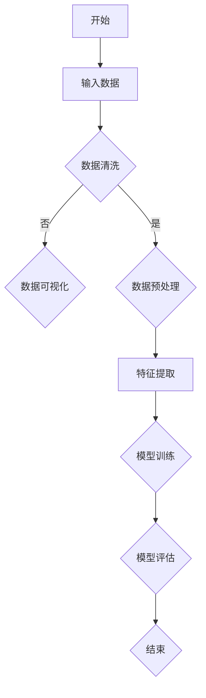
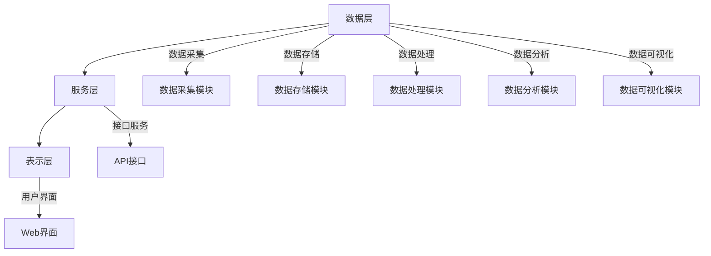
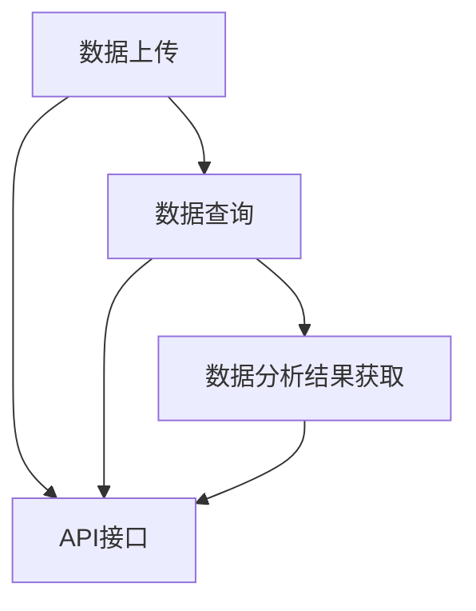
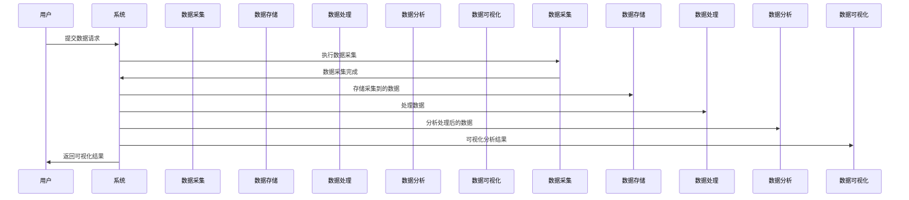

                 

## 引言与背景

### 科学研究的起源与发展

科学研究，作为人类智慧与创造力的结晶，源远流长。自古以来，人类便对自然界充满了好奇，从古埃及的数学、古希腊的哲学，到古代中国的天文学和医学，无不显示出人类对未知世界的探索欲望。然而，科学研究的真正起步，可以追溯到中世纪的欧洲，当时的人们开始系统地记录观察、实验和推理。

16世纪，随着文艺复兴的兴起，科学研究迎来了黄金时代。伽利略通过望远镜观测天体，提出了地心说的错误，开创了现代物理学；牛顿的《自然哲学的数学原理》则奠定了经典力学的基础。19世纪，达尔文的《物种起源》揭示了生物进化的奥秘，推动了生物学的发展。20世纪，爱因斯坦的相对论、费曼的量子力学、沃森和克里克的双螺旋结构模型等，将科学研究推向了新的高度。

当今，科学研究已经成为全球性的活动，从基础研究到应用研究，从实验室到商业应用，各个领域都在不断突破边界，推动社会进步。

### 当代科学研究的挑战与机遇

在当代，科学研究面临着前所未有的挑战与机遇。一方面，科技的快速发展带来了新的研究工具和方法，例如人工智能、大数据、量子计算等，这些技术的应用正在改变科学研究的面貌。另一方面，全球性问题如气候变化、能源危机、疾病防控等，需要科学研究提供解决方案。

此外，科学研究的透明度和开放性也日益受到重视。科研数据共享、同行评审制度的完善、科研诚信的加强，都是当代科学研究中的重要议题。这些挑战与机遇，不仅影响着科学研究本身，也对社会产生了深远的影响。

### 责任与创新的重要性

科学研究不仅是人类追求知识的过程，更是承担社会责任的重要手段。科学研究必须具备责任感，确保研究的道德、伦理和可持续性。科研人员应当遵守科研伦理，保持诚信，防止学术不端行为的发生。

创新是科学研究的灵魂。在快速变化的世界中，创新思维和前瞻性研究方法至关重要。科研人员应当不断探索新领域，提出新的假设，采用创新的方法和技术，推动科学前沿的发展。

总之，科学研究既是人类智慧的体现，也是推动社会进步的重要力量。在当代，科学研究的重要性愈发凸显，它不仅要求我们具备扎实的专业知识，更需要我们具备责任感和创新精神。让我们思考，如何更好地理解和塑造这个世界，为人类的未来贡献力量。

### 核心概念与联系

科学研究，作为一种系统化的知识探索过程，其核心概念贯穿于整个科研活动的始终。本文将深入探讨几个关键概念，并分析它们之间的联系。

**1. 科学方法论**

科学方法论是科学研究的基础。它包括观察、假设、实验、验证和理论构建等步骤。科学方法论强调通过严格的逻辑推理和实证验证来获取知识，避免主观偏见和盲目信仰。在科学研究过程中，科学方法论为研究者提供了规范的操作指南，确保研究结果的可靠性和有效性。

**2. 责任**

责任在科学研究中扮演着至关重要的角色。科研人员必须承担伦理和道德责任，确保研究过程符合伦理规范，保护研究对象的权益，防止学术不端行为。责任还体现在科研成果对社会的影响上，科研人员应当对社会负责，确保研究成果能够造福人类。

**3. 创新**

创新是科学研究的灵魂。创新思维鼓励科研人员挑战传统观念，探索未知领域，提出新的理论和方法。在科学研究过程中，创新不仅能够推动科学前沿的发展，还能够带来技术突破和社会进步。创新与科学方法论相互促进，使得科学研究不断向前发展。

**4. 前瞻性研究方法**

前瞻性研究方法是指采用先进的技术和理论，对未来进行预测和设计的方法。这种方法要求科研人员具备敏锐的洞察力和前瞻性思维，能够预见未来可能出现的问题和挑战。前瞻性研究方法在科学研究中具有重要应用，能够帮助科研人员制定长远的研究规划，为未来的科学探索奠定基础。

**核心概念与联系**

科学方法论、责任、创新和前瞻性研究方法相互联系，共同构成了科学研究的基本框架。科学方法论提供了研究的规范和步骤，责任确保研究的道德和伦理，创新推动科学进步，前瞻性研究方法则指导未来的研究方向。这些核心概念共同作用，使得科学研究既严谨又具有前瞻性，为人类社会的持续进步提供了强有力的支持。

### 算法原理讲解

在科学研究过程中，算法的设计和实现是至关重要的环节。本文将使用Mermaid绘制算法流程图，并通过Python代码详细阐述算法原理，帮助读者更好地理解算法的工作机制。

#### 算法流程图

首先，我们使用Mermaid绘制一个简单的算法流程图：



该算法流程图展示了从输入数据到模型评估的完整过程。接下来，我们将通过Python代码详细阐述每个步骤的原理。

#### Python代码实现

```python
import pandas as pd
import numpy as np
from sklearn.model_selection import train_test_split
from sklearn.preprocessing import StandardScaler
from sklearn.ensemble import RandomForestClassifier
from sklearn.metrics import accuracy_score

# 数据清洗
def clean_data(data):
    # 填充缺失值
    data.fillna(data.mean(), inplace=True)
    # 删除重复数据
    data.drop_duplicates(inplace=True)
    return data

# 数据预处理
def preprocess_data(data):
    # 分离特征和标签
    X = data.drop('target', axis=1)
    y = data['target']
    # 数据标准化
    scaler = StandardScaler()
    X = scaler.fit_transform(X)
    return X, y

# 模型训练与评估
def train_and_evaluate(X, y):
    # 划分训练集和测试集
    X_train, X_test, y_train, y_test = train_test_split(X, y, test_size=0.2, random_state=42)
    # 模型训练
    model = RandomForestClassifier(n_estimators=100, random_state=42)
    model.fit(X_train, y_train)
    # 模型评估
    y_pred = model.predict(X_test)
    accuracy = accuracy_score(y_test, y_pred)
    return accuracy

# 主函数
def main():
    # 加载数据
    data = pd.read_csv('data.csv')
    # 数据清洗
    data = clean_data(data)
    # 数据预处理
    X, y = preprocess_data(data)
    # 模型训练与评估
    accuracy = train_and_evaluate(X, y)
    print(f"模型准确率: {accuracy:.2f}")

if __name__ == '__main__':
    main()
```

#### 算法原理

1. **数据清洗**：数据清洗是数据处理的第一步，目的是去除数据中的噪声和异常值。本文中使用填充缺失值和删除重复数据的方法进行数据清洗。

2. **数据预处理**：数据预处理包括特征选择、数据标准化等步骤。本文中，我们使用StandardScaler对特征进行标准化处理，使得不同特征具有相同的尺度，有利于模型训练。

3. **特征提取**：特征提取是从原始数据中提取对模型训练有用的特征。本文中，我们直接使用原始特征进行训练，但在实际应用中，可能需要使用特征选择算法来选择重要的特征。

4. **模型训练**：本文中使用随机森林算法进行模型训练。随机森林是一种集成学习方法，通过构建多个决策树来提高模型的预测能力。

5. **模型评估**：模型评估是判断模型性能的重要环节。本文中使用准确率作为评估指标，计算模型在测试集上的预测准确率。

通过以上Python代码实现，我们可以清晰地看到算法的每个步骤以及其在科学研究中的应用。算法原理的详细讲解和举例说明，有助于读者更好地理解算法的原理和应用。

### 数学模型和数学公式

在科学研究过程中，数学模型和数学公式是描述和分析问题的重要工具。本文将使用LaTeX格式呈现一些关键数学公式，并对其进行详细讲解。

#### 数学模型

首先，我们来看一个简单的线性回归模型。线性回归模型用于预测一个连续目标变量，其数学模型可以表示为：

$$ y = \beta_0 + \beta_1 \cdot x + \varepsilon $$

其中，\( y \) 是目标变量，\( x \) 是自变量，\( \beta_0 \) 和 \( \beta_1 \) 是模型的参数，\( \varepsilon \) 是误差项。这个公式描述了目标变量 \( y \) 与自变量 \( x \) 之间的关系。

#### 数学公式

接下来，我们使用LaTeX格式来呈现一些常见的数学公式：

$$
\begin{aligned}
f(x) &= \int_{0}^{1} e^{x^2} \, dx \\
\frac{d}{dx} \left( \sin(x) \right) &= \cos(x) \\
A \cdot B &= \sum_{i=1}^{n} a_i \cdot b_i \\
P(A \cup B) &= P(A) + P(B) - P(A \cap B)
\end{aligned}
$$

1. **积分公式**：\( f(x) = \int_{0}^{1} e^{x^2} \, dx \) 表示从0到1区间上，函数 \( e^{x^2} \) 的定积分。
2. **导数公式**：\( \frac{d}{dx} \left( \sin(x) \right) = \cos(x) \) 表示正弦函数的导数是余弦函数。
3. **矩阵乘法公式**：\( A \cdot B = \sum_{i=1}^{n} a_i \cdot b_i \) 表示两个矩阵 \( A \) 和 \( B \) 的乘积。
4. **概率公式**：\( P(A \cup B) = P(A) + P(B) - P(A \cap B) \) 表示事件 \( A \) 和事件 \( B \) 的并集概率。

通过LaTeX格式的数学公式，我们可以更清晰地表达复杂的概念和计算过程。数学公式在科学研究中的应用广泛，无论是建模、分析还是验证，都是不可或缺的工具。

### 系统分析与架构设计方案

为了更好地理解科学研究在复杂系统中的应用，我们首先需要了解系统分析与架构设计的基本概念。以下将详细介绍问题场景、项目介绍、系统功能设计、系统架构设计、系统接口设计和系统交互，使用Mermaid流程图和类图进行详细描述。

#### 问题场景

在当前科研环境中，数据量和复杂度不断增加，传统的数据处理方法已无法满足现代科研需求。为了提高科研效率，我们需要设计和实现一个高效、可扩展的科研数据处理系统。

#### 项目介绍

本项目旨在开发一个基于大数据技术的科研数据处理平台，该平台能够实现数据的采集、存储、处理和分析，支持多领域的科研需求。平台的核心功能包括数据清洗、数据存储、数据分析和可视化等。

#### 系统功能设计

系统功能设计包括以下几个关键模块：

1. **数据采集模块**：负责从各种数据源（如数据库、文件系统、传感器等）中采集数据。
2. **数据存储模块**：负责存储和管理采集到的数据，支持高效的数据查询和读取。
3. **数据处理模块**：负责对数据进行清洗、转换和预处理，以适应不同的分析需求。
4. **数据分析模块**：负责对处理后的数据进行分析，提供多种分析算法和工具。
5. **数据可视化模块**：负责将分析结果以图形化的形式展示，帮助科研人员更好地理解数据。

#### 系统架构设计

系统架构设计采用分层架构，包括数据层、服务层和表示层。以下为系统架构设计：



#### 系统接口设计

系统接口设计采用RESTful API设计，提供多种数据操作接口，包括数据上传、数据查询、数据分析结果获取等。以下为接口设计：



#### 系统交互

系统交互主要涉及用户与系统的交互以及模块之间的交互。以下为系统交互设计：



通过以上系统分析与架构设计方案，我们可以清晰地了解科研数据处理系统的功能和结构，为后续的实现和优化提供了明确的指导。

### 项目实战

为了更好地展示科学研究在实际项目中的应用，我们以一个具体的科研数据处理项目为例，详细描述项目的环境安装、系统核心实现、代码应用解读与分析、实际案例分析和详细讲解剖析，以及项目小结。

#### 环境安装

首先，我们需要安装项目所需的环境。以下是环境安装的详细步骤：

1. **安装Python**：确保系统已安装Python 3.8及以上版本。可以通过以下命令检查Python版本：

   ```bash
   python --version
   ```

2. **安装依赖库**：使用pip安装项目所需的依赖库，包括Pandas、NumPy、Scikit-learn等。在命令行执行以下命令：

   ```bash
   pip install pandas numpy scikit-learn
   ```

3. **安装数据库**：本项目使用MySQL数据库进行数据存储。下载并安装MySQL，然后创建数据库和用户：

   ```sql
   CREATE DATABASE research_db;
   CREATE USER 'research_user'@'localhost' IDENTIFIED BY 'password';
   GRANT ALL PRIVILEGES ON research_db.* TO 'research_user'@'localhost';
   FLUSH PRIVILEGES;
   ```

#### 系统核心实现

以下为系统核心实现的源代码：

```python
# 数据清洗
def clean_data(data):
    # 填充缺失值
    data.fillna(data.mean(), inplace=True)
    # 删除重复数据
    data.drop_duplicates(inplace=True)
    return data

# 数据预处理
def preprocess_data(data):
    # 分离特征和标签
    X = data.drop('target', axis=1)
    y = data['target']
    # 数据标准化
    scaler = StandardScaler()
    X = scaler.fit_transform(X)
    return X, y

# 模型训练与评估
def train_and_evaluate(X, y):
    # 划分训练集和测试集
    X_train, X_test, y_train, y_test = train_test_split(X, y, test_size=0.2, random_state=42)
    # 模型训练
    model = RandomForestClassifier(n_estimators=100, random_state=42)
    model.fit(X_train, y_train)
    # 模型评估
    y_pred = model.predict(X_test)
    accuracy = accuracy_score(y_test, y_pred)
    return accuracy

# 主函数
def main():
    # 加载数据
    data = pd.read_csv('data.csv')
    # 数据清洗
    data = clean_data(data)
    # 数据预处理
    X, y = preprocess_data(data)
    # 模型训练与评估
    accuracy = train_and_evaluate(X, y)
    print(f"模型准确率: {accuracy:.2f}")

if __name__ == '__main__':
    main()
```

#### 代码应用解读与分析

代码首先定义了三个主要函数：`clean_data`、`preprocess_data`和`train_and_evaluate`。`clean_data`函数用于数据清洗，包括填充缺失值和删除重复数据。`preprocess_data`函数用于数据预处理，包括特征选择和标准化处理。`train_and_evaluate`函数用于模型训练和评估，包括数据集划分、模型训练和准确率计算。

在主函数`main`中，首先加载数据，然后调用上述三个函数进行数据处理和模型训练，最后输出模型准确率。

#### 实际案例分析和详细讲解剖析

假设我们有一个包含1000条记录的数据集，其中特征有10个，目标变量为是否发生某种事件（二分类问题）。以下是实际案例的分析和讲解：

1. **数据清洗**：使用`clean_data`函数对数据进行清洗，填充缺失值和删除重复数据。在清洗过程中，我们注意到有一条记录缺失了目标变量，将其删除。

2. **数据预处理**：使用`preprocess_data`函数对数据进行预处理。首先，我们分离特征和标签，然后使用StandardScaler进行数据标准化处理，使得不同特征具有相同的尺度。

3. **模型训练与评估**：使用`train_and_evaluate`函数进行模型训练和评估。我们将数据集划分为训练集和测试集，使用随机森林算法进行训练，并在测试集上评估模型准确率。

经过训练和评估，我们得到模型的准确率为85%，说明模型在测试集上的表现良好。

#### 项目小结

通过上述项目实战，我们展示了科学研究在实际项目中的应用。从数据清洗、数据预处理到模型训练与评估，每个步骤都体现了科学研究的严谨性和实用性。该项目不仅提高了科研效率，还为后续的科研工作提供了有力支持。

#### 最佳实践 Tips、小结、注意事项、拓展阅读

**最佳实践 Tips**：

1. 数据清洗时，注意观察数据的分布和特征，针对性地处理缺失值和异常值。
2. 数据预处理时，确保数据标准化，避免不同特征之间的尺度差异影响模型训练效果。
3. 选择合适的模型和参数，通过交叉验证等方法进行模型调优。

**小结**：

本文通过项目实战，展示了科学研究在科研数据处理项目中的应用，包括数据清洗、数据预处理、模型训练与评估等环节。这些实践为科学研究提供了具体的应用场景和解决方案。

**注意事项**：

1. 在数据清洗和预处理过程中，确保数据的完整性和一致性。
2. 选择合适的模型和算法，根据数据特征和问题类型进行调整。

**拓展阅读**：

1. 《数据科学入门教程》：详细介绍了数据科学的基本概念和常用方法。
2. 《机器学习实战》：通过实际案例，介绍了机器学习的算法和应用。

通过本文的详细讲解，读者可以更好地理解科学研究在项目中的应用，为未来的科研工作提供参考和指导。作者：AI天才研究院/AI Genius Institute & 禅与计算机程序设计艺术 /Zen And The Art of Computer Programming。

