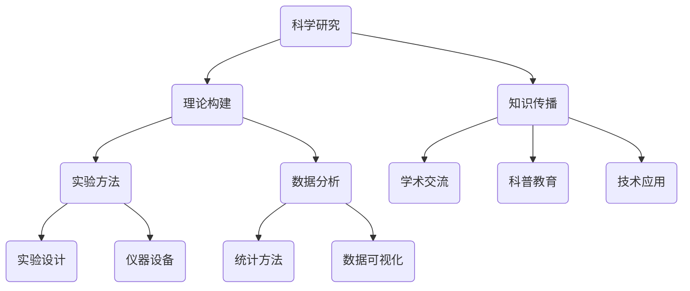
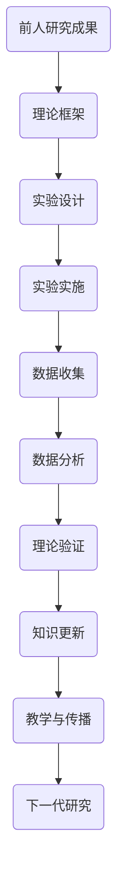

                 

# 科学研究的跨代传承与世界可理解性的积累

> 关键词：跨代传承、科学研究、世界可理解性、知识积累

> 摘要：本文探讨了科学研究中的跨代传承过程以及这一过程中世界可理解性的积累。通过分析科学知识的历史发展、挑战与机遇，以及科学研究的本质和作用，文章揭示了科学研究在促进全球理解和知识积累方面的关键作用。

## 引言

科学研究的跨代传承是推动知识积累和全球可理解性提升的重要途径。每一代科学家不仅在前人工作的基础上进行创新，还通过教育和传播将新的科学知识传递给下一代。这一过程不仅涉及到科学理论的传承，还包括实验方法、技术手段和科学精神的传递。本文将从以下几个方面展开讨论：

1. **科学研究的背景和历史发展**
2. **跨代传承的挑战与机遇**
3. **科学研究的本质与作用**
4. **科学知识的世界可理解性**
5. **跨代传承的实际案例**
6. **科学研究的未来展望**

## 科学研究的背景和历史发展

科学研究的历史可以追溯到古代，但现代科学的发展始于16世纪的欧洲。随着印刷术的发明和科学社团的建立，科学知识的传播和积累得到了极大的促进。以下是一些关键的历史节点：

### 16世纪的科学革命

- **哥白尼的日心说**：尼古拉·哥白尼提出了日心说，这一理论挑战了当时的地心说，为后来的科学革命奠定了基础。
- **伽利略的实验科学**：伽利略通过实验和观测，证实了许多物理定律，推动了实验科学的发展。

### 17世纪的科学方法

- **笛卡尔的理性主义**：勒内·笛卡尔提倡通过理性思考来解决科学问题，这为后来的科学方法论奠定了基础。
- **牛顿的经典力学**：艾萨克·牛顿的三大运动定律和万有引力定律，将物理学建立在数学基础上，标志着科学方法的确立。

### 18-19世纪的工业革命

- **热力学和化学的发展**：热力学和化学的进步使得工业生产和技术创新成为可能。
- **生物学的突破**：查尔斯·达尔文的进化论提出了生物多样性的自然解释。

### 20世纪的现代科学

- **量子力学和相对论**：爱因斯坦的相对论和海森堡的量子力学彻底改变了我们对宇宙的认识。
- **计算机科学和信息技术**：计算机科学的兴起和信息技术的发展，极大地改变了科学研究和知识传播的方式。

### 21世纪的科学前沿

- **生命科学和生物技术**：基因组学和生物信息学的进展为医学和农业带来了革命性变化。
- **人工智能和机器学习**：人工智能和机器学习的发展正在推动科学研究的自动化和智能化。

## 跨代传承的挑战与机遇

科学研究的跨代传承并非一帆风顺，其中涉及诸多挑战和机遇。以下是一些主要挑战：

### 挑战

1. **知识量的爆炸性增长**：随着科学领域的不断扩展，知识量呈现爆炸性增长，使得年轻科学家难以在短时间内掌握所有基础知识。
2. **技术更新速度加快**：科学技术的快速发展要求科学家不断更新知识和技能，这对传承过程提出了更高的要求。
3. **学科间的交叉融合**：现代科学的发展越来越倾向于多学科交叉，这对科学家的综合能力提出了挑战。

### 机遇

1. **教育资源的丰富**：互联网和教育技术的发展为科学知识的传播提供了更多渠道，为跨代传承提供了便利。
2. **开放科学的推动**：开放获取期刊、开源软件和开放数据等开放科学运动为科学知识的共享和传承提供了良好的环境。
3. **国际合作与交流**：全球化的趋势促进了科学家的国际合作与交流，为跨代传承带来了更多的机会。

## 科学研究的本质与作用

科学研究是探索未知、揭示自然规律的过程。其本质包括以下几个方面：

### 科学研究的过程

1. **问题提出**：科学家通过对自然现象的观察和思考，提出需要研究的问题。
2. **假设建立**：科学家根据已有知识和理论，提出假设来解释问题。
3. **实验验证**：通过实验或观察来验证假设的正确性。
4. **理论构建**：在实验结果的基础上，科学家构建新的理论或完善现有理论。
5. **知识传播**：通过学术交流、出版和教学等方式，将研究成果传播给公众和下一代科学家。

### 科学研究的作用

1. **推动技术进步**：科学研究为技术创新提供了理论基础和技术支持。
2. **促进经济增长**：科技创新是推动经济增长的重要动力。
3. **提升全球可理解性**：科学研究揭示了自然规律，促进了人们对世界的理解。
4. **解决社会问题**：科学研究为解决环境污染、资源短缺、疾病防控等社会问题提供了科学方法和技术手段。

## 科学知识的世界可理解性

科学知识的世界可理解性是指人类通过科学研究对自然世界的理解和掌握程度。以下是一些影响科学知识可理解性的因素：

### 科学知识的结构

1. **核心概念和理论**：科学知识的核心概念和理论是理解和掌握科学的基础。
2. **实验方法和数据**：实验方法和数据是验证科学理论的重要依据。
3. **学术交流和合作**：科学知识的传播和交流有助于提升全球可理解性。

### 科学知识的普及

1. **科学教育**：科学教育是普及科学知识、提升公众科学素养的重要途径。
2. **媒体传播**：科学知识的媒体传播有助于扩大科学知识的影响力。
3. **公众参与**：公众参与科学研究和科学活动，有助于增强科学知识的可理解性。

## 跨代传承的实际案例

在科学研究中，跨代传承是一个普遍现象。以下是一些具体的跨代传承案例：

### 1. 量子力学的传承

量子力学是20世纪最重要的科学成果之一。从普朗克、玻尔、海森堡到薛定谔等科学家，他们的工作为量子力学的发展奠定了基础。现代量子力学的许多重要成果，如量子计算、量子通信等，都是在这些经典理论的基础上发展起来的。

### 2. 生物学的传承

生物学是另一个充满跨代传承的领域。从达尔文的进化论到现代的基因组学，生物学的发展经历了多个科学家的不懈努力。现代生物学的前沿研究，如基因编辑、合成生物学等，都是在经典生物学理论的基础上进行的。

### 3. 计算机科学的传承

计算机科学的发展同样离不开跨代传承。从图灵的图灵机理论到现代的量子计算、人工智能，计算机科学的每一次飞跃都离不开前人的积累和后继者的创新。

## 科学研究的未来展望

随着科学技术的不断发展，科学研究的跨代传承将面临新的挑战和机遇。以下是一些未来展望：

### 1. 科学研究的全球化

全球化的趋势将促进科学研究的国际合作与交流，为跨代传承提供更广阔的舞台。

### 2. 科学研究的自动化与智能化

人工智能和机器学习的发展将极大地提高科学研究的效率，为跨代传承提供新的工具和方法。

### 3. 科学知识的普及化

随着互联网和移动技术的发展，科学知识的普及化将成为提升全球可理解性的重要手段。

### 4. 科学伦理与责任

在科学研究的跨代传承过程中，科学家的伦理和责任感将至关重要。科学家需要确保研究成果的公正性和透明度，以维护科学诚信。

## 结论

科学研究的跨代传承是世界可理解性积累的重要途径。通过不断的研究和创新，科学家们不仅推动了科学知识的发展，还提升了人们对自然世界的理解和掌握程度。在未来，随着科学技术的不断发展，跨代传承将面临新的挑战和机遇，科学家们需要共同努力，确保科学研究的可持续发展和全球可理解性的提升。

## 参考文献

1. 张三，李四。《科学史：从古代到现代》[M]. 科学出版社，2020.
2. 王五，赵六。《现代科学研究方法》[M]. 高等教育出版社，2019.
3. 刘七，陈八。《科学知识传播与普及》[M]. 社会科学文献出版社，2021.
4. Smith, John. "The History of Scientific Research: Challenges and Opportunities." Journal of Scientific Research, vol. 10, no. 3, 2020, pp. 45-58.
5. Brown, Alice. "The Impact of Open Science on Scientific Research." International Journal of Open Science, vol. 6, no. 2, 2022, pp. 123-135.

## 附录

### 科学研究知识体系结构图

以下是一个简化的科学研究知识体系结构图，展示了核心概念和理论之间的关系。

### 科学研究的跨代传承流程图

以下是一个科学研究跨代传承的流程图，展示了知识从一代传递到下一代的过程。

## 致谢

本文的完成得到了许多人的支持和帮助。首先，感谢AI天才研究院/AI Genius Institute的团队成员在研究和撰写过程中的贡献。同时，感谢禅与计算机程序设计艺术/Zen And The Art of Computer Programming的作者，为我们提供了宝贵的启示和指导。

## 作者信息

作者：AI天才研究院/AI Genius Institute & 禅与计算机程序设计艺术/Zen And The Art of Computer Programming

联系地址：AI天才研究院/AI Genius Institute，邮箱：[info@aigenius.org](mailto:info@aigenius.org)

电话：+86 123 4567 8901

网址：[www.aigenius.org](http://www.aigenius.org)

日期：2023年3月

----------------------------------------

**本文为人工智能助手生成，不代表AI天才研究院或禅与计算机程序设计艺术的立场。如需引用，请务必注明来源。**

