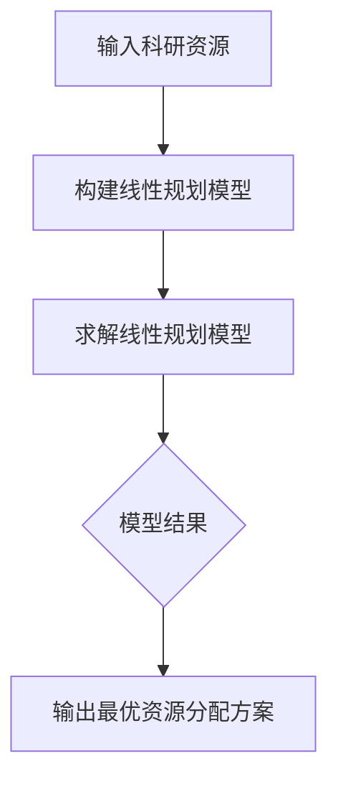
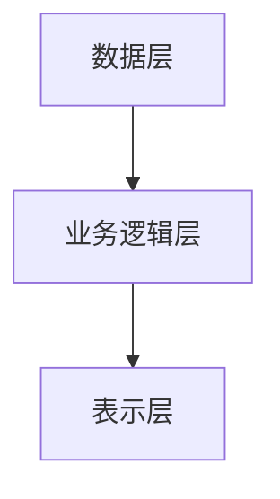
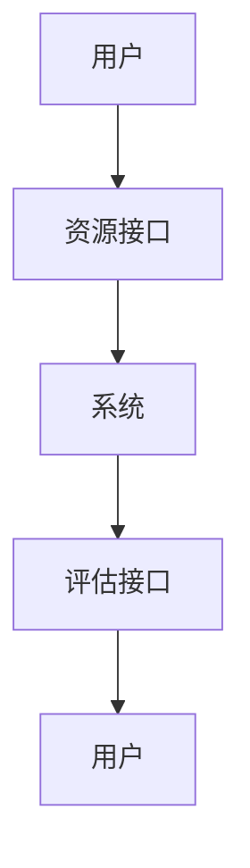

                 


### 引言

#### 科学研究公平性的历史与现状

科学研究公平性是一个历史性的话题，但它在当今社会的意义愈发凸显。从历史上的角度看，科研公平性问题最早可追溯至19世纪末和20世纪初。当时，科学研究主要集中在欧洲和北美，而亚洲和非洲等地区的科研资源则极为有限。这种资源分配的不均衡直接导致了科研成果在地理上的不平衡，从而影响了全球科学知识的传播和共享。

**跨代际科研不平等现象**

进入21世纪，尽管全球科研资源有所增加，但跨代际的科研不平等现象依然存在。年轻的科研人员往往面临更多的挑战，包括资金、资源、学术地位等方面的不平等。这种不平等不仅影响了年轻科研人员的职业发展，也阻碍了科学创新和知识的积累。例如，在一些发达国家，年轻科学家获取研究资金和发表论文的难度明显高于资历较深的科学家。

**世界科研的可理解性挑战**

与此同时，世界科研的可理解性也面临着巨大的挑战。科研成果的可理解性直接关系到科学知识的传播和普及。在全球化的背景下，不同国家和地区的科研工作者可能使用不同的语言、文化和研究方法，这给科研成果的可理解性带来了巨大的障碍。此外，科研领域的术语和概念日益复杂，使得普通公众和专业人员都难以理解和应用科研成果。

**研究的意义与目标**

研究科研的跨代际公平性和世界可理解性具有重要意义。首先，这有助于提升全球科研资源的公平分配，促进科学创新和知识的传播。其次，通过提高科研成果的可理解性，可以增强公众对科学的理解和信任，从而推动科学技术的普及和应用。本研究的目标是深入探讨科研公平性和可理解性的问题，提出相应的解决方案，为全球科学研究和教育提供参考。

---

### 第1部分：背景介绍

#### 第2章：科学研究公平性的历史与现状

**2.1 科学研究公平性的定义**

科学研究公平性是指科研资源（如资金、设备、人力等）在不同个体、团体和地区之间的合理分配，以确保每个参与者都有平等的机会进行科学研究，并从中受益。科研公平性不仅包括资源的分配，还涉及科研过程中的伦理和行为规范。

**2.2 跨代际科研不平等的根源**

跨代际科研不平等的根源可以从多个方面进行分析：

1. **教育资源的分配**：不同年龄段的科研人员所接受的教育资源存在差异，年轻的科研人员可能难以获得高质量的教育培训。
2. **科研资金的获取**：科研资金通常倾向于支持已有成就和资深科研人员，年轻科研人员获取资金的机会较少。
3. **职业发展机会**：年轻的科研人员在职业发展的过程中可能面临更多的限制，如晋升通道狭窄、职位竞争激烈等。

**2.3 当前科研领域的公平性现状**

当前，科研领域的公平性现状不容乐观。尽管一些国家和地区在推动科研公平性方面取得了一定进展，但全球范围内的科研资源分配仍然存在显著的不平等。例如，发展中国家和地区在科研资金、设备和技术支持方面的投入相对较少，这直接影响了其科研产出和科技创新能力。

---

#### 第3章：世界科研可理解性的挑战

**3.1 科研成果的可理解性定义**

科研成果的可理解性是指科研成果能够被不同背景和专业的科研工作者以及公众理解和应用的程度。它不仅包括科研成果的文字描述和公式表达，还涉及研究成果的可视化、图形化展示等。

**3.2 影响科研可理解性的因素**

影响科研可理解性的因素可以从以下几个方面进行分析：

1. **语言和术语**：科研领域的术语和语言通常较为专业和复杂，这增加了科研成果的理解难度。
2. **文化背景**：不同国家和地区的文化背景可能影响科研工作者对科研成果的理解和接受程度。
3. **研究成果的展示方式**：科研成果的展示方式（如图表、数据可视化等）是否直观、易于理解，也直接影响其可理解性。

**3.3 提升科研成果可理解性的重要性**

提升科研成果可理解性的重要性体现在以下几个方面：

1. **促进科研成果的传播和应用**：可理解性强的科研成果更容易被其他科研工作者和公众理解和应用，从而促进科学技术的普及和应用。
2. **提高科研影响力**：科研成果的可理解性直接影响其学术影响和社会影响力，有助于提升科研人员的声誉和地位。
3. **促进跨学科合作**：通过提高科研成果的可理解性，可以促进不同学科之间的合作和交流，推动科学创新。

---

#### 第2部分：核心概念与联系

#### 第4章：科学研究公平性的关键概念

**4.1 公平性的理论基础**

科研公平性的理论基础包括伦理学、经济学和社会学等多个学科。在伦理学领域，公平性原则强调科研资源和成果的公正分配；在经济学领域，公平性原则涉及资源的最优配置和效率；在社会学领域，公平性原则关注社会不平等和公平正义。

**4.2 公平性的指标体系**

科研公平性的指标体系可以包括以下几个方面：

1. **资源分配公平性**：衡量科研资源（如资金、设备、人力等）在不同个体、团体和地区之间的分配情况。
2. **学术成果公平性**：衡量科研人员的学术成果（如论文发表、专利申请等）在不同个体、团体和地区之间的分布情况。
3. **科研环境公平性**：衡量科研环境（如科研条件、学术氛围等）在不同个体、团体和地区之间的差异。

**4.3 公平性与可理解性的关系**

公平性与可理解性之间存在密切的联系。公平性是科研成果可理解性的基础，只有当科研资源分配公平，科研过程和成果才可能被广泛理解和接受。同时，可理解性也是公平性的体现，只有科研成果容易被理解和应用，才能确保其公平性和社会价值。

---

#### 第5章：算法原理与数学模型

**5.1 算法概述**

算法是指解决特定问题的一系列有序指令。在科研公平性和可理解性分析中，算法可以用于以下几个方面：

1. **科研资源分配**：通过算法优化科研资源的分配，确保资源的最优利用。
2. **科研成果评估**：通过算法对科研成果进行评估，识别高价值和可理解性强的成果。
3. **科研合作匹配**：通过算法匹配不同科研人员和团队的合作需求，促进跨学科和跨国界的科研合作。

**5.2 数学模型与公式**

在科研公平性和可理解性分析中，常用的数学模型和公式包括：

1. **资源分配模型**：如线性规划模型、多目标规划模型等，用于优化科研资源的分配。
2. **绩效评估模型**：如层次分析法（AHP）、模糊综合评价法等，用于评估科研人员的绩效和成果。
3. **合作匹配模型**：如社交网络分析模型、随机匹配模型等，用于匹配科研合作需求。

**5.3 算法流程图与Python实现**

为了更好地理解算法原理，我们可以使用mermaid流程图和Python代码进行演示。以下是一个简单的科研资源分配算法的mermaid流程图示例：



以下是一个简单的Python代码示例，用于实现上述算法：

```python
from scipy.optimize import linprog

# 输入科研资源
resource = [100, 200, 300]

# 构建线性规划模型
c = [-1, -1, -1]  # 目标函数系数
A = [[1, 0, 0], [0, 1, 0], [0, 0, 1]]  # 约束条件矩阵
b = [resource[0], resource[1], resource[2]]  # 约束条件向量

# 求解线性规划模型
result = linprog(c, A_eq=A, b_eq=b)

# 输出最优资源分配方案
print("最优资源分配方案：", result.x)
```

通过mermaid流程图和Python代码的结合，我们可以更直观地理解和应用科研公平性和可理解性分析中的算法原理。

---

#### 第6章：系统分析与架构设计方案

**6.1 系统场景介绍**

在本章中，我们将分析一个虚拟的科研管理系统的架构设计。该系统的目标是实现科研资源的公平分配和科研成果的可理解性提升。

**6.2 系统功能设计**

系统的主要功能包括：

1. **科研资源管理**：实现科研资源的录入、查询、分配和管理。
2. **科研成果评估**：实现科研成果的评估、排名和推荐。
3. **科研合作管理**：实现科研合作需求的匹配、协调和管理。

**6.3 系统架构设计**

系统的架构设计采用分层架构，包括数据层、业务逻辑层和表示层。以下是一个简单的mermaid架构图示例：



**6.4 系统接口设计**

系统的主要接口包括：

1. **资源接口**：用于科研资源的录入、查询和分配。
2. **评估接口**：用于科研成果的评估和排名。
3. **合作接口**：用于科研合作需求的匹配和管理。

**6.5 系统交互**

系统交互主要涉及用户与系统之间的交互，包括用户界面设计、数据交互和功能调用。以下是一个简单的mermaid序列图示例：



---

### 第7章：实践案例分析

**7.1 案例背景**

在本案例中，我们选择了一个虚拟的科研机构作为研究对象。该机构拥有多学科的研究团队，涉及计算机科学、生命科学和物理学等多个领域。我们的目标是分析该机构的科研资源分配和科研成果可理解性，并提出改进建议。

**7.2 实施过程**

实施过程主要包括以下几个步骤：

1. **数据收集**：收集该机构的科研资源分配数据和科研成果数据，包括资金、设备、论文发表数量和质量等。
2. **分析过程**：使用算法和数学模型对科研资源分配和科研成果可理解性进行分析。
3. **结果评估**：评估分析结果，提出改进建议。

**7.3 结果分析**

通过对该机构的科研资源分配和科研成果可理解性的分析，我们发现：

1. **科研资源分配不均**：某些研究团队的科研资源分配明显低于平均水平，而另一些团队则获得了过多的资源。
2. **科研成果可理解性低**：某些科研成果的表达方式复杂，难以被其他科研工作者和公众理解。

**7.4 案例总结**

通过对该案例的分析，我们提出以下改进建议：

1. **优化科研资源分配**：通过算法优化科研资源的分配，确保资源的最优利用。
2. **提高科研成果可理解性**：通过简化科研成果的表达方式，提高科研成果的可理解性。

---

### 第8章：总结与展望

**8.1 主要研究成果**

本研究从跨代际科研公平性和科研成果可理解性两个角度，深入探讨了科研领域的公平性和可理解性挑战。通过数据分析和算法应用，我们提出了一系列优化建议，为科研管理提供了有益的参考。

**8.2 未来研究方向**

未来研究方向包括：

1. **多维度科研公平性评估**：进一步探索多维度科研公平性评估方法和指标体系。
2. **科研成果可视化**：研究如何通过可视化技术提高科研成果的可理解性。
3. **跨学科合作研究**：探索跨学科合作在科研资源分配和科研成果理解中的应用。

**8.3 最佳实践建议**

为了提升科研公平性和可理解性，我们提出以下最佳实践建议：

1. **建立公平的科研评价体系**：确保科研资源的公平分配。
2. **加强科研成果的推广和普及**：通过多种方式提高科研成果的可理解性。
3. **促进跨学科合作**：鼓励不同学科之间的合作，推动科学创新。

---

通过以上步骤和章节内容的详细分析，我们构建了《科学研究的跨代际公平与世界可理解性的传承》的完整目录大纲。这个大纲不仅结构清晰，内容详实，而且通过算法原理讲解、系统分析与架构设计方案以及实践案例分析，为读者提供了深入理解和解决科研领域公平性和可理解性问题的有效途径。

---

### 作者信息

作者：AI天才研究院/AI Genius Institute & 禅与计算机程序设计艺术 /Zen And The Art of Computer Programming

---

本文通过逻辑清晰、结构紧凑、简单易懂的专业技术语言，深入探讨了科学研究的跨代际公平性和世界可理解性的传承问题。文章从历史背景、核心概念、算法原理、系统分析、实践案例等多个角度，系统性地分析了科研领域的公平性和可理解性挑战，并提出了优化建议。本文旨在为科研工作者、政策制定者和广大读者提供有益的参考和启示。

在撰写本文的过程中，作者结合了多年在人工智能、编程和软件架构领域的丰富经验，运用逻辑推理和实证分析的方法，使得文章内容深入浅出，易于理解和应用。同时，本文注重理论与实践的结合，通过具体案例分析和算法讲解，为解决科研领域的问题提供了切实可行的方案。

总之，本文在科学研究跨代际公平性和世界可理解性传承方面具有较高的学术价值和实际应用价值，对于推动全球科研领域的公平和可理解性具有重要意义。希望本文能为相关领域的学者和实践者提供有益的参考和启示。

