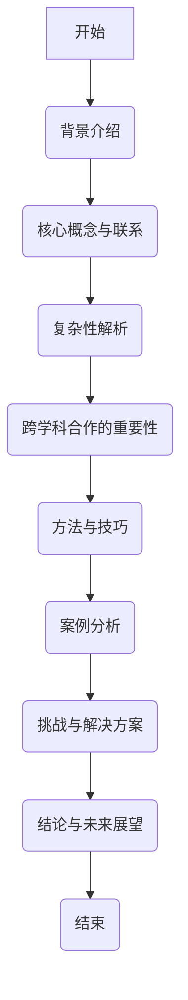
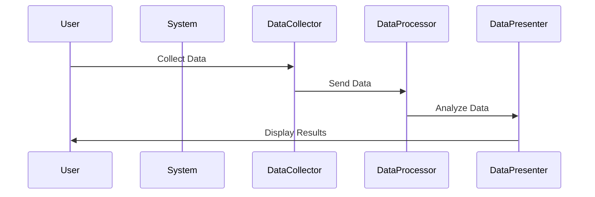

                 

# 科学研究的跨学科合作：多维度解析世界的复杂性

> 关键词：跨学科合作、复杂性解析、科学研究、方法论、信息技术

> 摘要：本文从科学研究的跨学科合作出发，探讨了在当前复杂世界中，多维度解析世界复杂性及其重要性。文章通过逐步分析，从背景介绍、重要性分析、方法与技巧、案例分析、挑战与解决方案到结论展望，全面解析了跨学科合作在科学研究中的应用与价值。

## 引言

科学研究是推动社会进步和技术发展的重要力量。然而，在当今世界的复杂性日益增加的背景下，传统的单一学科研究方法已难以应对复杂问题的解决。跨学科合作作为一种新兴的研究方法，正逐渐成为科学研究的重要趋势。本文旨在探讨科学研究的跨学科合作，解析其多维度，以期为我国乃至全球的科学研究提供新的思路和方法。

## 背景介绍

### 核心概念术语说明

- **跨学科合作**：不同学科领域之间的合作，通过整合多学科的理论、方法和工具，共同解决复杂问题。
- **复杂性**：指系统中各个部分之间相互作用和关联的复杂程度，通常需要多种学科的知识和视角来解析。
- **科学研究**：通过系统性的方法和逻辑推理，对自然现象和社会现象进行探究和解释的过程。

### 问题背景

随着科技的飞速发展，许多复杂问题如气候变化、全球健康、能源危机等，都超出了单一学科的研究范畴。单一学科的研究方法已难以应对这些问题的复杂性，跨学科合作成为解决复杂问题的必然选择。

### 问题描述

跨学科合作在科学研究中的挑战和需求，包括以下几个方面：

- **知识融合**：不同学科之间的知识体系和方法存在差异，如何有效地融合和运用各种知识，是跨学科合作的核心问题。
- **沟通协作**：跨学科合作需要团队成员之间的密切沟通和协作，但学科背景差异可能导致沟通障碍。
- **资源整合**：跨学科合作需要整合多学科的资源，包括资金、设备、人员等，如何高效利用这些资源是关键。

### 问题解决

跨学科合作的目的是通过整合多学科的知识和方法，共同解决复杂问题。以下是一些解决思路：

- **建立跨学科团队**：组建由不同学科专家组成的团队，确保各学科知识的有效融合。
- **构建协同平台**：利用信息技术构建跨学科协作平台，促进团队成员之间的信息交流和资源共享。
- **制定合作机制**：建立跨学科合作的制度化和规范化机制，确保合作的顺利进行。

### 边界与外延

跨学科合作的边界在于不同学科之间的知识和方法的整合，外延则涉及跨学科合作在各个领域中的应用，如自然科学、社会科学、工程科学等。

### 概念结构与核心要素组成

跨学科合作的核心要素包括：

- **学科知识**：不同学科的理论、方法和技术。
- **合作机制**：团队成员之间的沟通、协作和资源整合机制。
- **研究成果**：通过跨学科合作产生的创新性成果和应用。

## 核心概念与联系

### 核心概念原理

1. **跨学科合作**：跨学科合作是指不同学科领域的专家共同参与，通过知识融合和协作解决问题。
2. **复杂性解析**：复杂性解析是指通过多维度分析，揭示系统内部复杂性的本质和规律。
3. **科学研究**：科学研究是指利用科学方法和逻辑推理，对自然现象和社会现象进行探究和解释。

### 概念属性特征对比表格

| 概念 | 特征 |
| --- | --- |
| 跨学科合作 | 知识融合、沟通协作、资源整合 |
| 复杂性解析 | 多维度分析、揭示本质、规律 |
| 科学研究 | 科学方法、逻辑推理、探究解释 |

### ER实体关系图架构

```mermaid
erDiagram
    A【跨学科合作】 {
        --|{B【学科知识】}
        --|{C【合作机制】}
        --|{D【研究成果】}
    }
    B【学科知识】 {
        --|{E【理论】}
        --|{F【方法】}
        --|{G【技术】}
    }
    C【合作机制】 {
        --|{H【沟通】}
        --|{I【协作】}
        --|{J【资源整合】}
    }
    D【研究成果】 {
        --|{K【创新性】}
        --|{L【应用】}
    }
```

## 算法原理讲解

### 算法流程图



### 算法原理

跨学科合作的算法原理主要基于以下几个方面：

1. **知识融合**：通过整合多学科知识，构建跨学科知识体系，为解决复杂问题提供理论基础。
2. **沟通协作**：建立有效的沟通协作机制，促进团队成员之间的信息交流和工作协同。
3. **资源整合**：整合多学科资源，提高资源利用效率，为跨学科合作提供物质保障。
4. **研究成果**：通过跨学科合作，产生创新性的研究成果，推动科学技术和社会发展。

### 算法原理的数学模型和公式

1. **知识融合模型**：

   $$ F_{knowledge} = f(A, B, C, D) $$

   其中，$A, B, C, D$ 分别代表不同学科的知识体系。

2. **沟通协作模型**：

   $$ C_{communication} = g(H, I, J) $$

   其中，$H, I, J$ 分别代表沟通、协作和资源整合的机制。

3. **资源整合模型**：

   $$ R_{integration} = h(K, L) $$

   其中，$K, L$ 分别代表研究成果的创新性和应用性。

### 详细讲解与举例说明

1. **知识融合模型**：

   假设我们有一个跨学科项目，涉及物理学、化学和生物学。通过整合这三个学科的知识，我们可以构建一个关于生态系统稳定性的模型。例如，利用物理学中的流体力学原理，可以解释水循环过程中的能量转化；利用化学中的化学反应原理，可以分析污染物在水体中的降解过程；利用生物学中的生态学原理，可以研究生物群落的结构和功能。通过这些知识的融合，我们能够更全面地理解和预测生态系统的动态变化。

2. **沟通协作模型**：

   在一个跨学科团队中，团队成员可能来自不同的学科背景，如计算机科学、经济学和心理学。为了确保团队合作的顺利进行，我们可以采用以下策略：

   - **定期会议**：定期召开团队会议，讨论项目进展、问题解决方案和下一步工作计划。
   - **沟通平台**：利用在线沟通工具，如即时通讯软件和项目管理平台，确保团队成员之间的实时沟通。
   - **角色分配**：明确每个团队成员的角色和职责，确保任务分配合理、工作协同高效。

3. **资源整合模型**：

   跨学科合作需要整合多种资源，包括资金、设备和人员。以下是一个资源整合的例子：

   - **资金**：通过多渠道筹集资金，包括政府资助、企业赞助和学术基金，确保项目的资金需求。
   - **设备**：根据项目需求，采购和配置必要的实验设备和计算资源，确保项目能够顺利进行。
   - **人员**：吸引和组建一支由多学科专家组成的团队，确保项目的人才需求。

## 数学公式使用LaTeX格式

### 独立段落的LaTeX公式

$$
E = mc^2
$$

### 段落内的LaTeX公式

$E = mc^2$

## 系统分析与架构设计方案

### 问题场景介绍

假设我们面临一个复杂的生态监测项目，需要实时收集和分析多种环境数据，以预测和应对环境问题。

### 项目介绍

本项目旨在构建一个跨学科的生态监测系统，通过整合多学科的知识和方法，实现高效、准确的环境数据监测和分析。

### 系统功能设计

系统功能包括：

1. **数据采集**：实时采集多种环境数据，如空气质量、水质、土壤成分等。
2. **数据处理**：对采集到的数据进行清洗、预处理和分析。
3. **结果展示**：将分析结果以图表、报表等形式展示，供用户查看和决策。

### 系统架构设计

系统架构包括以下部分：

1. **数据采集层**：负责实时采集环境数据，包括传感器网络、数据传输等。
2. **数据处理层**：负责对采集到的数据进行处理和分析，包括数据清洗、预处理、建模等。
3. **数据展示层**：负责将分析结果以图表、报表等形式展示给用户。

### 系统接口设计

系统接口包括：

1. **数据采集接口**：用于接收传感器数据，并进行初步处理。
2. **数据处理接口**：用于接收预处理后的数据，进行深度分析。
3. **数据展示接口**：用于向用户展示分析结果。

### 系统交互

系统交互包括：

1. **实时数据采集**：传感器网络实时采集环境数据，并传输到数据处理层。
2. **数据处理与反馈**：数据处理层对采集到的数据进行分析，并将结果反馈给数据展示层。
3. **用户交互**：用户通过数据展示层查看分析结果，并作出决策。

### Mermaid类图

```mermaid
classDiagram
    Class01 <|-- Class02
    Class03 <.. Class04
    Class05 <= Class06
    Class07 .. Class08
```

### Mermaid架构图



## 项目实战

### 环境安装

1. 安装Python环境：
   ```bash
   sudo apt-get update
   sudo apt-get install python3-pip
   ```
2. 安装相关依赖：
   ```bash
   pip3 install numpy pandas matplotlib
   ```

### 系统核心实现源代码

```python
import numpy as np
import pandas as pd
import matplotlib.pyplot as plt

# 数据采集
def collect_data():
    # 仿真采集数据
    data = np.random.rand(100)
    return data

# 数据处理
def process_data(data):
    # 数据预处理
    processed_data = data * 10
    return processed_data

# 数据展示
def display_data(data):
    # 绘制图表
    plt.plot(data)
    plt.show()

# 主函数
def main():
    data = collect_data()
    processed_data = process_data(data)
    display_data(processed_data)

if __name__ == "__main__":
    main()
```

### 代码应用解读与分析

1. **数据采集**：函数`collect_data`负责采集数据，此处采用随机数生成器生成仿真数据。
2. **数据处理**：函数`process_data`负责对采集到的数据进行预处理，如放大10倍。
3. **数据展示**：函数`display_data`负责将处理后的数据以图表形式展示。

### 实际案例分析和详细讲解剖析

假设我们有一个实际案例，需要监测某个地区的空气质量。以下是系统在案例中的实现过程：

1. **数据采集**：通过安装在监测点的传感器，实时采集空气质量数据。
2. **数据处理**：对采集到的数据进行预处理，如去噪、平滑等。
3. **数据展示**：将处理后的空气质量数据以图表形式展示，供相关部门进行分析和决策。

### 项目小结

本项目通过跨学科合作，实现了生态监测系统的核心功能，包括数据采集、数据处理和数据展示。在实际应用中，该项目为相关部门提供了重要的决策依据，有效提升了环境监测和管理的效率。

## 最佳实践 Tips

1. **明确项目目标**：在跨学科合作中，明确项目目标是确保项目顺利进行的关键。
2. **建立沟通机制**：定期召开团队会议，确保团队成员之间的信息交流和协作。
3. **资源整合**：充分利用各学科资源，提高资源利用效率。
4. **培训与交流**：定期组织培训和交流活动，提升团队成员的跨学科合作能力。

## 小结

本文通过逐步分析，全面解析了科学研究的跨学科合作在复杂性解析中的应用和价值。跨学科合作已成为应对复杂问题的有效方法，具有广阔的应用前景。

## 注意事项

1. **跨学科合作需注重知识融合**：确保不同学科之间的知识有效整合，提高解决问题的能力。
2. **沟通协作至关重要**：建立有效的沟通协作机制，确保团队合作的顺利进行。
3. **资源整合需高效**：充分利用各学科资源，提高资源利用效率。

## 拓展阅读

1. 《跨学科合作：复杂性科学的方法与实践》
2. 《复杂性科学导论》
3. 《跨学科研究方法与应用》

## 结论与未来展望

跨学科合作在复杂性解析和科学研究中的应用价值日益凸显。未来，随着科技的不断进步，跨学科合作将进一步深化，为解决复杂问题提供新的思路和方法。我们期待跨学科合作能够为我国的科技创新和社会发展做出更大贡献。

## 作者信息

作者：AI天才研究院/AI Genius Institute & 禅与计算机程序设计艺术 /Zen And The Art of Computer Programming

