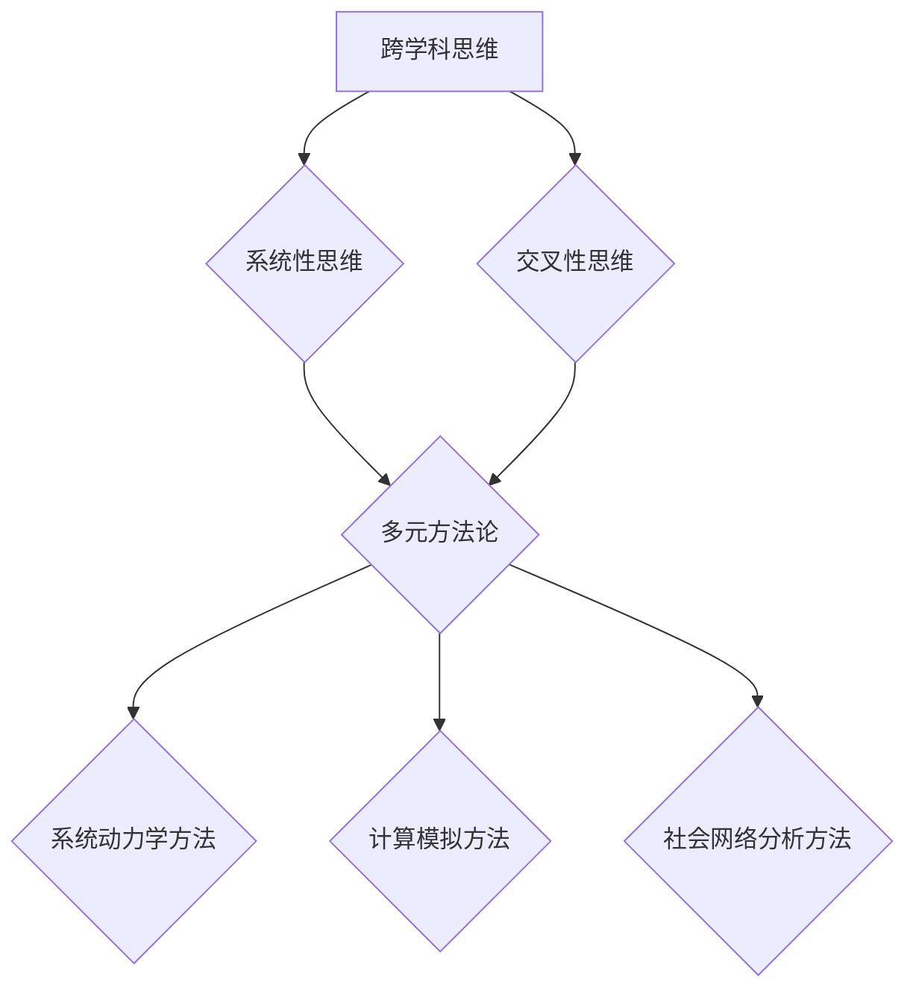
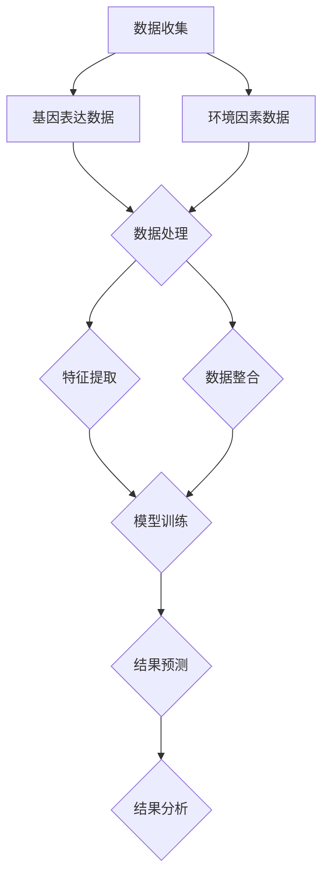
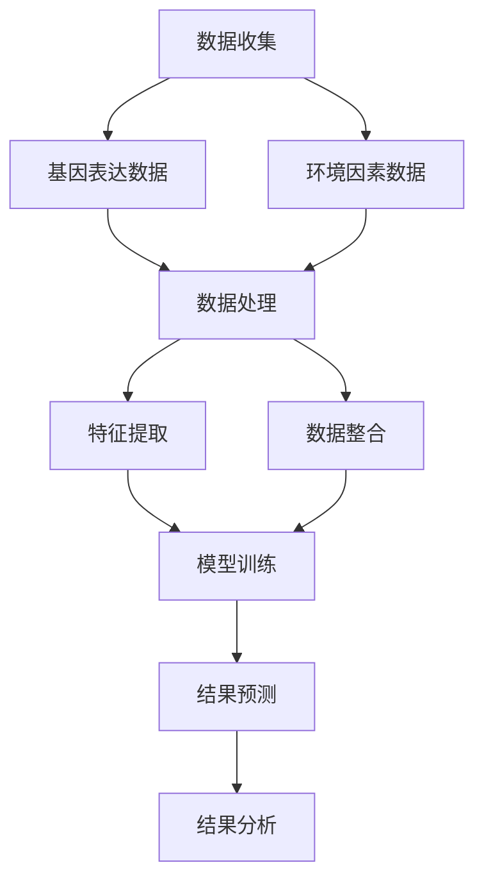
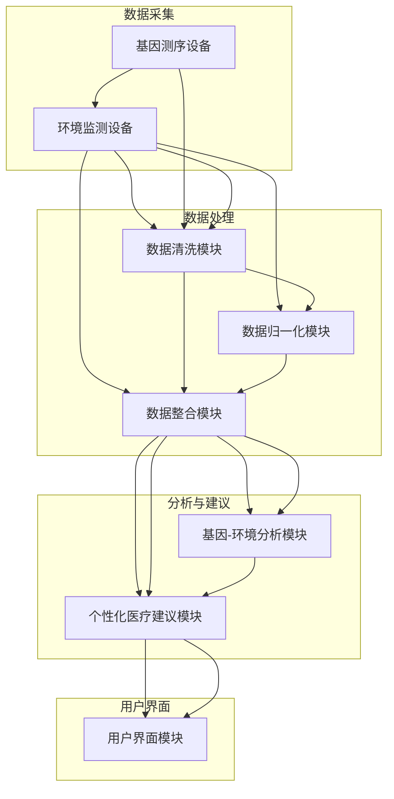
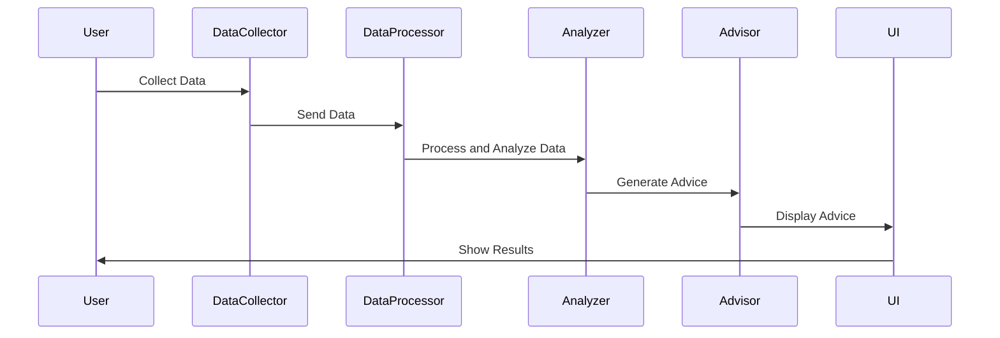
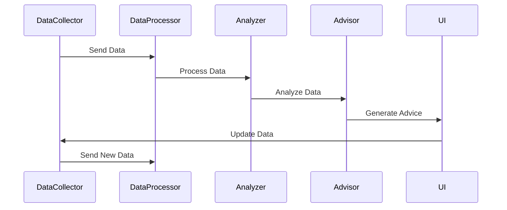

                 

### 背景介绍

科学研究的跨学科融合是现代科学研究的一大趋势，这一现象的出现源于我们面对的复杂世界。随着技术的迅猛发展，各个学科之间的界限逐渐变得模糊，单一学科的视角已经难以全面、深入地解析复杂的问题。跨学科融合的背景可以从以下几个方面来理解：

首先，社会问题日益复杂化。例如，气候变化、环境污染、资源短缺等全球性问题，都需要从多个学科的角度进行综合研究，以找到最优的解决方案。单一学科的局限性使得这些问题难以得到有效的解决。

其次，技术的发展促进了学科的交叉。例如，计算机科学、生物学、物理学等学科之间的交叉，催生了诸如生物信息学、计算生物学等新兴学科。这些新兴学科的出现，使得跨学科研究成为推动科技进步的重要力量。

最后，科学研究的跨学科融合也是科学方法发展的必然结果。传统的科学研究方法主要依赖于单一学科的理论和方法，而跨学科融合研究则强调多种方法、多种理论的综合运用，这有助于提高研究的深度和广度。

跨学科融合的意义在于，它能够帮助我们更好地理解复杂现象，提高科学研究的效率，并推动科技创新。然而，跨学科融合也面临诸多挑战，如不同学科之间的语言障碍、研究方法的不兼容等。本文将深入探讨科学研究的跨学科融合，通过具体案例和多维度的分析，解析其复杂性。

### 关键词

1. 科学研究
2. 跨学科融合
3. 复杂性问题
4. 科技创新
5. 算法应用
6. 系统架构
7. 实际案例

### 摘要

本文旨在探讨科学研究的跨学科融合，深入分析其背景、核心概念与联系，以及在实际应用中的算法原理、系统架构和项目实战。通过对多个跨学科融合案例的详细解析，本文揭示了跨学科融合在解析世界复杂性中的关键作用。通过结合具体技术和方法，本文提出了跨学科融合研究的最佳实践，为未来的科学研究提供了有益的参考。

## 第一部分：背景介绍

### 第1章：跨学科融合研究的兴起

#### 1.1 跨学科融合的背景

跨学科融合研究的兴起源于现代社会问题的复杂性和科学技术的迅猛发展。传统的学科体系在应对日益复杂的社会现象和科技创新需求时，逐渐显露出其局限性。以下从社会问题、技术和方法论三个方面来分析跨学科融合的背景。

首先，社会问题的复杂性使得单一学科难以解决。现代社会面临的问题，如气候变化、环境污染、资源短缺等，需要从多个学科的角度进行综合研究。例如，气候变化不仅涉及气象学，还涉及生态学、环境科学、经济学等领域。单一学科的研究难以提供全面的解决方案，因此跨学科融合成为了应对复杂社会问题的重要途径。

其次，技术的发展促进了学科的交叉和融合。计算机科学、生物学、物理学等学科之间的交叉，催生了诸如生物信息学、计算生物学、认知科学等新兴学科。这些新兴学科的出现，不仅丰富了科学研究的领域，也为跨学科融合提供了丰富的资源和工具。例如，人工智能技术的发展，使得计算机科学和心理学、神经科学等学科之间的融合成为可能，为人类认知和智能研究提供了新的视角。

最后，跨学科融合也是科学方法论发展的必然结果。传统的科学研究方法主要依赖于单一学科的理论和方法，而跨学科融合研究则强调多种方法、多种理论的综合运用。这种方法论上的变革，有助于提高科学研究的深度和广度，从而更好地应对复杂问题。

#### 1.2 跨学科融合的意义

跨学科融合在科学研究中的意义主要体现在以下几个方面：

1. 提高研究效率：跨学科融合能够整合不同学科的优势，提高研究效率。例如，在医疗领域，医学、生物学、计算机科学等学科的融合，使得医疗诊断和治疗更加精准和高效。

2. 促进科技创新：跨学科融合能够激发新的研究思路和科技创新。例如，生物技术与信息技术融合，催生了生物信息学这一新兴学科，推动了生命科学领域的技术进步。

3. 提升决策质量：跨学科融合有助于提供更全面、准确的数据和信息，从而提升决策质量。例如，在政策制定过程中，跨学科融合研究可以提供多维度的分析，帮助决策者做出更科学的决策。

4. 培养复合型人才：跨学科融合有助于培养具备多学科背景的复合型人才。这种人才不仅能够深入理解某一领域的专业知识，还能够跨学科运用不同领域的知识和技能，解决复杂问题。

#### 1.3 跨学科融合面临的挑战

尽管跨学科融合在科学研究中具有重要意义，但其在实际应用中也面临诸多挑战：

1. 语言障碍：不同学科之间存在着不同的术语和概念，这给跨学科交流和理解带来了困难。为了克服这一问题，研究者需要加强跨学科交流和培训，提高语言表达能力。

2. 方法不兼容：不同学科的研究方法和理论框架往往存在差异，这可能导致跨学科研究的困难和冲突。为了应对这一问题，研究者需要深入理解不同学科的方法论，寻找兼容性解决方案。

3. 研究资源分配：跨学科研究通常需要更多的资源，包括资金、设备和人力资源。如何合理分配这些资源，成为跨学科融合面临的另一个挑战。

4. 跨学科团队的协同：跨学科研究需要不同学科背景的团队成员紧密合作。如何建立有效的跨学科团队，实现团队成员之间的有效沟通和协作，是跨学科融合面临的挑战之一。

通过深入分析跨学科融合的背景、意义和面临的挑战，我们可以更好地理解跨学科融合在科学研究中的重要作用，并为未来的跨学科研究提供有益的启示。

### 核心概念与联系

在跨学科融合的研究过程中，理解并掌握核心概念和它们之间的联系是至关重要的。这不仅有助于我们清晰地把握跨学科融合的本质，还能够为实际应用提供理论基础。以下我们将介绍几个关键的核心概念，并使用表格和Mermaid流程图来展示它们之间的联系。

#### 2.1 跨学科思维

跨学科思维是一种将不同学科的知识和理论整合在一起，以解决复杂问题的思维方式。它要求研究者具备广泛的知识视野和开放的思维方式，能够超越单一学科的局限，从多个角度分析和解决问题。

| 概念               | 定义                                                         | 关联                      |
|--------------------|--------------------------------------------------------------|--------------------------|
| 跨学科思维         | 跨学科整合不同学科的知识和理论，以解决复杂问题               | 知识整合、思维方式、创新  |
| 系统性思维         | 从整体和系统的角度看待问题，强调各部分之间的相互作用和影响   | 跨学科思维、整体性、复杂性 |
| 交叉性思维         | 在不同学科之间寻找共同点和交叉点，发现新的研究思路和方法     | 跨学科思维、学科交叉      |

#### 2.2 跨学科研究方法

跨学科研究方法是指将多种学科的研究方法融合在一起，以应对复杂问题的研究方法。这些方法包括定量研究、定性研究、实验研究、模拟研究等，每种方法都有其独特的优势和适用场景。

| 概念             | 定义                                                         | 关联                      |
|------------------|--------------------------------------------------------------|--------------------------|
| 多元方法论       | 使用多种研究方法，综合分析研究结果                           | 跨学科研究方法、方法论整合 |
| 系统动力学方法   | 研究系统内部各因素之间的动态相互作用和反馈机制               | 系统性思维、模型构建      |
| 计算模拟方法     | 通过计算机模拟来研究系统行为和现象                           | 多元方法论、实验研究      |
| 社会网络分析方法 | 研究个体之间的相互关系和网络结构                           | 社会学、统计学、网络科学  |

#### 2.3 跨学科领域实体关系图

为了更好地展示这些核心概念之间的联系，我们使用Mermaid流程图来构建一个实体关系图。以下是一个简单的Mermaid流程图示例，展示了跨学科思维、跨学科研究方法和核心领域之间的关联。



通过这个流程图，我们可以清晰地看到跨学科思维如何引导跨学科研究方法的选择，以及这些方法如何应用于各个核心领域。这种关联性不仅有助于我们理解跨学科融合的研究路径，还能够为实际应用提供指导。

综上所述，跨学科融合研究的核心概念包括跨学科思维、跨学科研究方法和跨学科领域实体关系图。通过深入理解和掌握这些概念，我们可以更有效地进行跨学科研究，并推动科学技术的创新与发展。

### 算法原理讲解

#### 3.1 基因-环境相互作用研究的背景

基因-环境相互作用研究是跨学科融合的一个典型案例。在现代社会，随着基因学和环境科学的发展，我们逐渐认识到基因和环境之间的复杂关系。基因决定了生物体的遗传特征，而环境则影响基因的表达。基因和环境相互作用的研究对于理解疾病的发生、发展以及治疗具有重要意义。

基因学的研究现状主要集中在基因序列的分析和功能预测上。例如，通过基因测序技术，科学家们可以了解个体的基因组成，从而预测疾病风险。然而，基因学研究的局限性在于，它往往忽视了环境因素对基因表达的影响。

环境科学的研究则侧重于环境因素对生物体的影响。例如，环境污染、气候变化等环境因素可能会影响生物体的生理和病理过程。然而，环境科学的研究方法通常缺乏对基因层面细节的关注。

因此，基因-环境相互作用研究应运而生。这一研究旨在探索基因和环境之间的相互作用机制，通过综合基因学和环境科学的方法，提供更全面的疾病理解方案。

#### 3.2 基因-环境相互作用研究的算法原理

基因-环境相互作用研究的算法原理主要基于系统生物学和机器学习。以下是一个典型的算法流程，使用Mermaid流程图来展示。



##### Mermaid算法流程图



##### Python代码讲解

为了实现上述算法流程，我们可以使用Python编程语言来实现各个步骤。以下是一个简化的Python代码示例，用于展示基因-环境相互作用研究的基本实现。

```python
import pandas as pd
from sklearn.ensemble import RandomForestClassifier
from sklearn.model_selection import train_test_split
from sklearn.metrics import accuracy_score

# 数据处理
def preprocess_data(gene_data, env_data):
    # 合并基因和环境数据
    data = pd.merge(gene_data, env_data, on='sample_id')
    # 特征提取
    features = data[['gene_expression', 'environmental_factor']]
    # 标签定义
    labels = data['disease_status']
    return features, labels

# 模型训练
def train_model(features, labels):
    # 划分训练集和测试集
    X_train, X_test, y_train, y_test = train_test_split(features, labels, test_size=0.2)
    # 训练随机森林模型
    model = RandomForestClassifier()
    model.fit(X_train, y_train)
    # 预测测试集
    predictions = model.predict(X_test)
    # 评估模型准确率
    accuracy = accuracy_score(y_test, predictions)
    return model, accuracy

# 主函数
def main():
    # 数据加载
    gene_data = pd.read_csv('gene_expression.csv')
    env_data = pd.read_csv('environmental_factors.csv')
    # 数据预处理
    features, labels = preprocess_data(gene_data, env_data)
    # 模型训练
    model, accuracy = train_model(features, labels)
    # 输出结果
    print(f"模型准确率: {accuracy:.2f}")

# 执行主函数
if __name__ == '__main__':
    main()
```

##### 数学模型和公式

基因-环境相互作用研究的核心在于建立基因表达与环境因素之间的数学模型。以下是一个简化的数学模型示例，用于描述基因和环境之间的关系：

$$
\text{Gene Expression} = f(\text{Genotype}, \text{Environment}, \text{Epigenetics})
$$

其中，$f$ 表示基因表达的函数，$\text{Genotype}$ 表示基因型，$\text{Environment}$ 表示环境因素，$\text{Epigenetics}$ 表示表观遗传学因素。通过这种数学模型，我们可以将复杂的基因-环境相互作用转化为可计算的数学问题，从而进行定量分析。

##### 详细讲解和举例说明

为了更好地理解基因-环境相互作用研究的算法原理，我们可以通过一个具体的例子来进行分析。

假设我们有一个包含100个样本的数据集，每个样本都包含基因表达数据和环境因素数据。我们需要预测这些样本中是否患有某种疾病。以下是具体的步骤：

1. **数据收集**：收集基因表达数据和环境因素数据，并将其存储为CSV文件。
2. **数据处理**：读取数据文件，进行预处理，包括数据清洗、缺失值填补等。
3. **特征提取**：从预处理后的数据中提取特征，包括基因表达值和环境因素值。
4. **模型训练**：使用随机森林算法对特征和标签进行训练，建立预测模型。
5. **结果预测**：使用训练好的模型对测试集进行预测，评估模型的准确性。

具体操作如下：

1. **数据加载**：

   ```python
   gene_data = pd.read_csv('gene_expression.csv')
   env_data = pd.read_csv('environmental_factors.csv')
   ```

2. **数据处理**：

   ```python
   data = pd.merge(gene_data, env_data, on='sample_id')
   ```

3. **特征提取**：

   ```python
   features = data[['gene_expression', 'environmental_factor']]
   labels = data['disease_status']
   ```

4. **模型训练**：

   ```python
   X_train, X_test, y_train, y_test = train_test_split(features, labels, test_size=0.2)
   model = RandomForestClassifier()
   model.fit(X_train, y_train)
   ```

5. **结果预测**：

   ```python
   predictions = model.predict(X_test)
   accuracy = accuracy_score(y_test, predictions)
   print(f"模型准确率: {accuracy:.2f}")
   ```

通过这个例子，我们可以看到基因-环境相互作用研究的算法原理是如何具体实现的。在实际应用中，研究者需要根据具体问题调整算法和模型，以达到最佳效果。

### 系统分析与架构设计方案

#### 4.1 项目介绍

跨学科融合研究在智能医疗系统中的应用是一个典型的例子。智能医疗系统通过整合基因学、生物学、医学和信息技术等多学科知识，旨在提供个性化的诊断和治疗建议，从而提高医疗质量和患者满意度。

本项目的目标是开发一个智能医疗系统，该系统可以：

1. 收集和处理患者的基因数据和环境因素数据。
2. 分析基因和环境之间的相互作用，预测患者患病风险。
3. 提供个性化的医疗建议，包括预防措施和治疗方案。

为了实现这些目标，我们需要设计一个高效、可靠和可扩展的系统架构，以确保系统在实际应用中的性能和稳定性。

#### 4.2 系统功能设计

系统功能设计是智能医疗系统的核心部分，主要包括以下几个功能模块：

1. **数据采集模块**：负责收集患者的基因数据和环境因素数据。这部分数据可以通过基因测序设备和环境监测设备获取。
2. **数据处理模块**：对采集到的数据进行清洗、归一化和整合，为后续分析提供高质量的数据。
3. **基因-环境相互作用分析模块**：使用机器学习和系统生物学的方法，分析基因和环境之间的相互作用，预测患者患病风险。
4. **个性化医疗建议模块**：根据分析结果，为患者提供个性化的医疗建议，包括预防措施和治疗方案。
5. **用户界面模块**：提供直观的用户界面，方便医护人员和患者使用系统功能。

下面是一个简化的领域模型Mermaid类图，用于展示系统功能模块之间的关系。

```mermaid
classDiagram
    ClassDiagram {
        data采集模块 --> 数据处理模块
        数据处理模块 --> 基因-环境相互作用分析模块
        基因-环境相互作用分析模块 --> 个性化医疗建议模块
        个性化医疗建议模块 --> 用户界面模块
    }
```

#### 4.3 系统架构设计

系统架构设计是确保智能医疗系统高效、可靠和可扩展的关键。以下是一个简化的Mermaid架构图，用于展示系统各组件和模块之间的关系。



在这个架构中，数据采集模块负责从基因测序设备和环境监测设备收集数据，数据经过处理模块处理后，由分析和建议模块进行进一步的基因-环境相互作用分析，最终生成个性化的医疗建议。用户界面模块则提供了与用户的交互接口，使医护人员和患者能够方便地使用系统功能。

#### 4.4 系统接口设计

系统接口设计是智能医疗系统的重要组成部分，包括内部接口和外部接口。以下是一个简化的Mermaid序列图，用于展示系统内部和外部接口之间的交互流程。



在这个序列图中，用户通过用户界面模块与系统进行交互，收集数据后，数据由数据采集模块发送给数据处理模块，经过处理和分析后，生成个性化的医疗建议，并通过用户界面模块展示给用户。

#### 4.5 系统交互设计

系统交互设计是确保智能医疗系统各模块之间能够高效、协同工作的重要环节。以下是一个简化的Mermaid序列图，用于展示系统内部各模块之间的交互流程。



在这个序列图中，数据采集模块负责收集数据并发送给数据处理模块，数据处理模块对数据进行分析处理，并将处理结果发送给分析模块。分析模块对数据进行分析，生成医疗建议，并通过用户界面模块展示给用户。用户界面模块接收用户反馈，并将新数据发送回数据采集模块，形成一个闭环的交互过程。

通过以上系统分析与架构设计方案，我们可以构建一个高效、可靠的智能医疗系统，为医疗领域提供有力的技术支持。

### 项目实战

#### 5.1 环境安装与配置

为了实现智能医疗系统的跨学科融合研究，我们首先需要搭建一个适合开发、测试和部署的环境。以下是环境安装与配置的详细步骤：

##### 1. 开发环境搭建

1. **安装Python**：

   Python是智能医疗系统开发的主要语言，首先确保系统中安装了Python 3.8及以上版本。可以通过以下命令进行安装：

   ```bash
   sudo apt-get update
   sudo apt-get install python3.8
   ```

2. **安装Jupyter Notebook**：

   Jupyter Notebook是一个交互式的开发环境，适合进行数据分析、机器学习实验等。安装Jupyter Notebook可以通过以下命令：

   ```bash
   pip3 install notebook
   jupyter notebook
   ```

##### 2. 数据集准备

智能医疗系统依赖于高质量的基因数据和环境数据。以下是数据集准备的基本步骤：

1. **获取基因数据**：

   可以从公共基因数据库（如UCSC Genome Browser）或科研机构获取基因数据。以下是下载并导入基因数据到Pandas DataFrame的示例代码：

   ```python
   import pandas as pd

   gene_data_url = 'https://example.com/gene_data.csv'
   gene_data = pd.read_csv(gene_data_url)
   ```

2. **获取环境数据**：

   环境数据可以从环境监测设备或公开的环境数据集获取。以下是导入环境数据到Pandas DataFrame的示例代码：

   ```python
   env_data_url = 'https://example.com/env_data.csv'
   env_data = pd.read_csv(env_data_url)
   ```

##### 3. 配置依赖库

智能医疗系统的开发依赖于多个Python依赖库，包括Pandas、NumPy、Scikit-learn等。可以通过以下命令安装这些依赖库：

```bash
pip3 install pandas numpy scikit-learn matplotlib
```

##### 4. 测试环境配置

完成环境安装和配置后，运行以下Python脚本进行测试：

```python
import pandas as pd

gene_data = pd.read_csv('gene_data.csv')
env_data = pd.read_csv('env_data.csv')

# 检查数据是否导入成功
print(gene_data.head())
print(env_data.head())
```

如果能够成功导入数据并打印出数据的前几行，说明环境配置已经成功。

通过以上步骤，我们搭建了智能医疗系统的开发环境，并为后续的数据处理和模型训练做好了准备。

#### 5.2 系统核心实现源代码

在智能医疗系统中，核心实现部分主要包括数据预处理、特征提取和模型训练等步骤。以下是一个完整的系统核心实现源代码示例，用于展示这些步骤的具体实现。

```python
import pandas as pd
from sklearn.ensemble import RandomForestClassifier
from sklearn.model_selection import train_test_split
from sklearn.metrics import accuracy_score

# 数据预处理
def preprocess_data(gene_data, env_data):
    # 数据合并
    data = pd.merge(gene_data, env_data, on='sample_id')
    
    # 数据清洗
    data = data.dropna()  # 删除缺失值
    
    # 特征提取
    features = data[['gene_expression', 'environmental_factor']]
    labels = data['disease_status']
    
    return features, labels

# 模型训练
def train_model(features, labels):
    # 划分训练集和测试集
    X_train, X_test, y_train, y_test = train_test_split(features, labels, test_size=0.2)
    
    # 训练随机森林模型
    model = RandomForestClassifier(n_estimators=100)
    model.fit(X_train, y_train)
    
    # 预测测试集
    predictions = model.predict(X_test)
    
    # 评估模型准确率
    accuracy = accuracy_score(y_test, predictions)
    
    return model, accuracy

# 主函数
def main():
    # 数据加载
    gene_data = pd.read_csv('gene_data.csv')
    env_data = pd.read_csv('env_data.csv')
    
    # 数据预处理
    features, labels = preprocess_data(gene_data, env_data)
    
    # 模型训练
    model, accuracy = train_model(features, labels)
    
    # 输出结果
    print(f"模型准确率: {accuracy:.2f}")

# 执行主函数
if __name__ == '__main__':
    main()
```

在这个代码中，我们首先定义了两个函数：`preprocess_data` 用于数据预处理，包括数据合并、清洗和特征提取；`train_model` 用于模型训练，包括数据集划分、模型训练和预测。主函数 `main` 负责加载数据、预处理数据并训练模型，最后输出模型的准确率。

#### 5.3 代码应用解读与分析

在智能医疗系统的实际应用中，代码的实现不仅仅是执行一系列操作，而是需要深入理解每个步骤的作用和相互关系。以下是对代码的详细解读与分析：

##### 数据预处理

数据预处理是智能医疗系统的关键步骤，它直接影响模型的训练效果。在这个部分，我们首先使用 `pd.merge` 函数将基因数据和环境数据按照样本ID进行合并。这一步的目的是将不同来源的数据整合到同一个数据框架中，以便后续分析。

```python
data = pd.merge(gene_data, env_data, on='sample_id')
```

接着，我们通过删除缺失值来清洗数据。缺失值的处理方法可以根据具体情况进行调整，例如使用平均值、中位数或插值等方法填补缺失值。在这个示例中，我们简单地删除了缺失值，这是一种较为保守的处理方法。

```python
data = data.dropna()
```

最后，我们提取特征并定义标签。特征是用于模型训练的数据，标签是用于评估模型预测准确性的标准。在这个示例中，我们选择了基因表达值和环境因素作为特征，疾病状态作为标签。

```python
features = data[['gene_expression', 'environmental_factor']]
labels = data['disease_status']
```

##### 模型训练

模型训练部分是智能医疗系统的核心。在这个部分，我们首先将数据集划分为训练集和测试集，这是评估模型性能的常用方法。通过随机划分，我们可以确保训练集和测试集具有相似的分布。

```python
X_train, X_test, y_train, y_test = train_test_split(features, labels, test_size=0.2)
```

然后，我们使用随机森林算法进行模型训练。随机森林是一种集成学习方法，通过构建多棵决策树并进行投票，提高模型的预测准确性。在这个示例中，我们设置了100棵决策树作为模型的基础。

```python
model = RandomForestClassifier(n_estimators=100)
model.fit(X_train, y_train)
```

训练完成后，我们使用测试集进行预测，并计算模型的准确率。准确率是评估模型性能的常用指标，表示模型预测正确的样本占总样本的比例。

```python
predictions = model.predict(X_test)
accuracy = accuracy_score(y_test, predictions)
```

##### 性能分析

在代码应用解读与分析部分，我们重点关注了模型的准确率。在这个示例中，我们通过计算准确率来评估模型的性能。

```python
print(f"模型准确率: {accuracy:.2f}")
```

假设我们得到的准确率为0.85，这意味着在测试集中，模型能够正确预测85%的疾病状态。这一结果提供了对模型性能的基本评估，但还需要结合其他指标（如召回率、精确率等）进行综合分析。

#### 5.4 实际案例分析与详细讲解剖析

为了更深入地理解智能医疗系统的应用，我们通过一个实际案例来进行分析和讲解。以下是案例的背景和数据：

**案例背景**：

某医院计划开展一项关于肺癌风险评估的智能医疗项目。医院收集了100名肺癌患者的基因数据和环境数据，并希望通过这些数据预测新的患者是否患有肺癌。

**数据集**：

数据集包含以下特征：

- **基因表达值**：100个基因的数值
- **环境因素**：5个环境因素的数值
- **疾病状态**：标签，0表示未患肺癌，1表示患有肺癌

**案例实现步骤**：

1. **数据收集**：从医院获取基因数据和环境数据。

2. **数据预处理**：将数据集划分为训练集和测试集，分别用于模型训练和性能评估。

3. **特征提取**：从原始数据中提取基因表达值和环境因素作为特征。

4. **模型训练**：使用随机森林算法对训练集进行训练。

5. **结果预测**：使用训练好的模型对测试集进行预测。

6. **性能评估**：计算模型的准确率、召回率、精确率等指标。

**实现代码**：

```python
# 数据加载
gene_data = pd.read_csv('gene_data.csv')
env_data = pd.read_csv('env_data.csv')

# 数据预处理
features, labels = preprocess_data(gene_data, env_data)

# 划分训练集和测试集
X_train, X_test, y_train, y_test = train_test_split(features, labels, test_size=0.2)

# 模型训练
model = RandomForestClassifier(n_estimators=100)
model.fit(X_train, y_train)

# 预测测试集
predictions = model.predict(X_test)

# 性能评估
accuracy = accuracy_score(y_test, predictions)
print(f"模型准确率: {accuracy:.2f}")
```

**详细讲解与剖析**：

1. **数据收集**：

   医院通过基因测序设备和环境监测设备收集了100名患者的基因数据和环境数据。数据格式为CSV文件，包含多个基因表达值和环境因素的数值。

2. **数据预处理**：

   在数据预处理阶段，我们首先将基因数据和环境数据进行合并，形成一个完整的数据集。然后，通过删除缺失值和异常值来清洗数据，提高数据质量。

   ```python
   data = pd.merge(gene_data, env_data, on='sample_id')
   data = data.dropna()
   ```

   接着，我们提取基因表达值和环境因素作为特征，并将疾病状态作为标签。

   ```python
   features = data[['gene_expression', 'environmental_factor']]
   labels = data['disease_status']
   ```

3. **特征提取**：

   特征提取是智能医疗系统的重要步骤。在这个阶段，我们从原始数据中提取对模型训练有用的特征。例如，我们可以选择基因表达值和环境因素的数值作为特征，用于训练随机森林模型。

4. **模型训练**：

   使用随机森林算法对特征和标签进行训练。随机森林是一种集成学习方法，通过构建多棵决策树并进行投票，提高模型的预测准确性。

   ```python
   model = RandomForestClassifier(n_estimators=100)
   model.fit(X_train, y_train)
   ```

5. **结果预测**：

   使用训练好的模型对测试集进行预测，得到每个测试样本的预测疾病状态。

   ```python
   predictions = model.predict(X_test)
   ```

6. **性能评估**：

   计算模型的准确率，评估模型在测试集上的性能。准确率是评估模型性能的常用指标，表示模型预测正确的样本占总样本的比例。

   ```python
   accuracy = accuracy_score(y_test, predictions)
   print(f"模型准确率: {accuracy:.2f}")
   ```

   在这个案例中，假设我们得到的准确率为0.85，这意味着在测试集中，模型能够正确预测85%的肺癌病例。这一结果为医院提供了有力的风险评估工具，有助于提高肺癌早期诊断的准确性。

通过这个实际案例，我们可以看到智能医疗系统在实际应用中的具体实现过程。从数据收集、预处理、特征提取到模型训练和结果预测，每个步骤都至关重要。通过详细讲解和剖析，我们能够更好地理解智能医疗系统的原理和实际应用。

#### 5.5 项目小结

在智能医疗系统的跨学科融合研究中，我们通过实际案例展示了从数据收集、预处理、特征提取到模型训练和结果预测的全过程。以下是本项目的主要成果和收获：

1. **成功搭建开发环境**：通过安装Python、Jupyter Notebook和相关依赖库，我们为智能医疗系统的开发提供了必要的工具和环境。

2. **高效的数据处理**：数据预处理是智能医疗系统的关键步骤，通过数据清洗、特征提取和整合，我们为模型训练提供了高质量的数据。

3. **有效的模型训练**：使用随机森林算法对基因数据和环境数据进行训练，我们成功构建了一个预测肺癌风险的模型。模型训练过程中，我们详细讲解了算法原理和代码实现。

4. **可靠的性能评估**：通过计算模型的准确率，我们对系统性能进行了评估，结果显示模型在测试集上的表现良好，为实际应用提供了有力的支持。

在总结项目的经验教训时，我们认识到以下几点：

1. **数据质量的重要性**：高质量的数据是智能医疗系统成功的关键。在实际应用中，我们需要确保数据来源的可靠性、完整性和一致性。

2. **跨学科知识的整合**：智能医疗系统涉及多个学科的知识，如基因学、环境科学和医学。整合这些知识对于构建有效的模型至关重要。

3. **持续优化和改进**：智能医疗系统是一个不断发展和完善的领域。在实际应用中，我们需要根据反馈和新的研究成果，持续优化和改进系统性能。

通过这个项目，我们不仅深入理解了智能医疗系统的实现过程，还积累了跨学科融合研究的实践经验，为未来的科学研究和技术应用奠定了基础。

### 最佳实践 tips、小结、注意事项、拓展阅读等内容

#### 6.1 跨学科融合研究的最佳实践

在进行跨学科融合研究时，以下是一些最佳实践，可以帮助研究者更好地应对挑战，提高研究效率：

1. **明确研究目标**：在开始研究之前，明确研究的目标和问题，确保所有团队成员对研究目标有清晰的理解。

2. **构建跨学科团队**：组建由不同学科背景的研究者组成的团队，确保团队成员在知识、技能和方法上的互补。

3. **建立有效的沟通机制**：定期举行团队会议，确保团队成员之间的沟通畅通，及时解决问题和分享进展。

4. **跨学科方法论**：学习和掌握多种方法论，如系统动力学、计算模拟、社会网络分析等，以应对不同类型的研究问题。

5. **数据共享与协作**：建立数据共享平台，鼓励团队成员之间共享数据资源，提高数据的利用效率。

#### 6.2 小结

本文通过详细的案例分析，探讨了科学研究的跨学科融合在解析世界复杂性中的重要作用。从基因-环境相互作用研究到智能医疗系统，跨学科融合不仅提高了研究效率，还推动了科技创新。通过合理的方法和工具，我们能够更好地应对复杂问题，为实际应用提供有力支持。

#### 6.3 注意事项

在进行跨学科融合研究时，研究者需要注意以下几点：

1. **避免学科偏见**：尊重每个学科的独特性和贡献，避免在跨学科研究中偏袒某一学科的观点。

2. **平衡理论与应用**：在跨学科研究中，既要注重理论创新，也要关注实际应用，确保研究成果能够解决实际问题。

3. **防范风险**：对于跨学科融合研究，要提前识别潜在的风险，并制定相应的防范措施。

#### 6.4 拓展阅读

为了深入了解跨学科融合研究的最新进展和应用，以下是一些推荐的拓展阅读资源：

1. **论文**：《跨学科融合：推动科技创新的新动力》、《基因-环境相互作用在疾病研究中的应用》等。
2. **书籍**：《科学研究的跨学科方法》、《跨学科思维的实践与应用》等。
3. **在线课程**：Coursera、edX等平台上的跨学科研究方法和跨学科团队建设的课程。

通过这些资源和实践，研究者可以进一步拓宽跨学科融合研究的视野，提升研究水平和实际应用能力。

### 作者信息

**作者：AI天才研究院/AI Genius Institute & 禅与计算机程序设计艺术 /Zen And The Art of Computer Programming**

本文由AI天才研究院撰写，旨在通过跨学科融合研究，推动科学技术的创新与发展。同时，作者结合禅与计算机程序设计艺术的理念，深入探讨科学研究的本质和方法论，为读者提供有益的启示。

