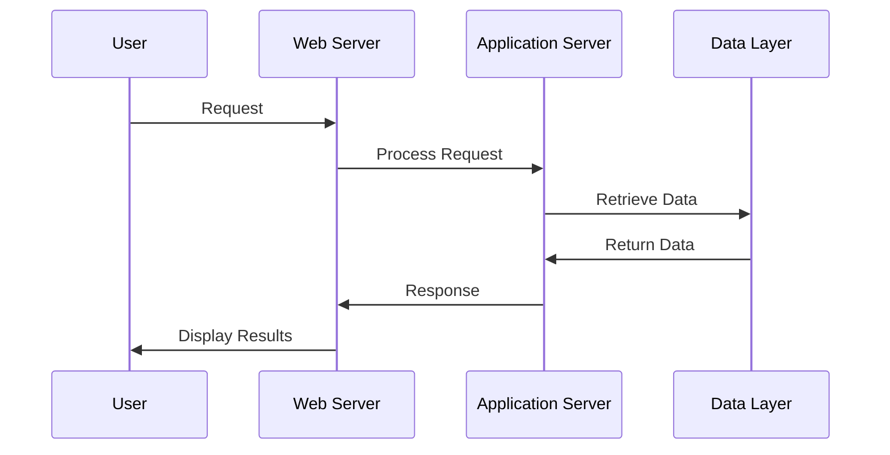
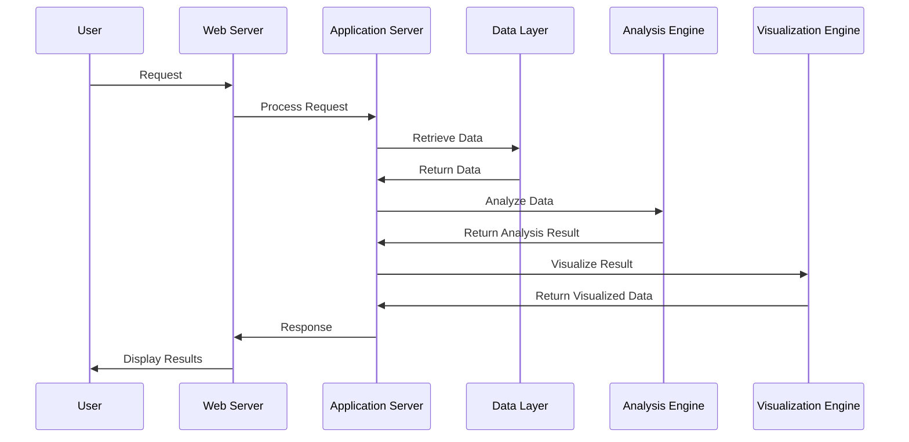

                 

### 第一部分：背景介绍

#### 1.1 科学研究的长期主义概述

**科学研究的现状与挑战**

在当今社会，科学研究的重要性不言而喻。无论是基础科学、应用科学，还是跨学科研究，科学的发展都对人类社会产生深远的影响。然而，随着科学领域的不断拓展和深化，科学研究也面临着诸多挑战。这些挑战主要集中在以下几个方面：

- **研究资源的分配**：科学研究的投入需要大量的资金、设备和人才。然而，资源的有限性使得科学研究的竞争异常激烈，许多有价值的研究项目可能因为资源不足而被迫中断。
- **数据处理的复杂性**：随着科学技术的进步，产生的数据量呈爆炸式增长。这些数据不仅种类繁多，而且复杂度高，给科学数据处理带来了极大的挑战。
- **研究成果的长期性**：科学研究的成果并非一蹴而就，很多研究需要长时间的积累和验证。然而，在当前的学术评价体系中，短期成果往往更受重视，导致许多科研人员更倾向于追求短平快的成果。

**长期主义的概念及其在科学研究中的意义**

长期主义（Long-Termism）是一种关注长期目标、重视长远发展的思维方式和价值观。在科学研究中，长期主义强调持续投入、耐心积累，追求长期的、可持续的科学研究成果。

长期主义在科学研究中的意义主要体现在以下几个方面：

- **增强科研实力**：通过长期的投入和积累，科研团队可以不断提高科研水平，增强科研实力。这有助于推动科学研究的深入发展，解决复杂科学问题。
- **提高研究成果的可靠性**：长期的科学研究可以确保数据的完整性和准确性，提高研究成果的可靠性。这有助于避免因为短期的、不完整的数据而导致的错误结论。
- **促进科研合作的稳定性**：长期主义鼓励科研人员之间的合作与交流，通过共同的研究目标，促进科研合作的稳定性。这有助于实现科研资源的优化配置，提高科研效率。
- **提升科研人员的素质**：长期主义强调科研人员在科研过程中的耐心和毅力，这有助于提升科研人员的综合素质，培养他们的创新能力和解决问题的能力。

**长期主义与短期主义的对比**

长期主义与短期主义在科研活动中有着显著的区别：

- **时间尺度**：短期主义关注短期内的成果，通常在一年或更短的时间内就可以看到明显的效果；而长期主义则着眼于长期的科学研究，可能需要数年甚至数十年的积累。
- **研究目标**：短期主义往往追求快速出成果，可能会忽视基础研究和长期目标的实现；而长期主义则更加注重基础研究和长期目标的实现，强调科研工作的系统性和可持续性。
- **资源投入**：短期主义在资源投入上倾向于集中力量解决眼前的问题，而长期主义则更加注重资源的持续投入，确保科研项目的稳定推进。

#### 1.2 科学研究中的核心概念

**可理解性的定义与重要性**

可理解性（Understandability）是科学研究中的一个关键概念。它指的是科学研究结果能否被普通公众、同行科学家乃至未来的研究者所理解和接受。一个高度可理解的研究结果不仅有助于推广科学知识，还能为后续研究提供宝贵的参考。

在科学研究中，可理解性的重要性体现在以下几个方面：

- **知识传播**：科学研究的最终目的是为了推动人类知识的进步。如果研究结果无法被公众理解，那么科学知识就难以得到广泛传播，其价值也会大打折扣。
- **同行评审**：科学研究需要经过同行评审，以确保研究成果的可靠性和创新性。可理解的研究结果更容易被同行接受，从而提高研究的质量和影响力。
- **持续发展**：可理解性有助于确保科学研究能够持续发展。一个高度可理解的研究成果能够为后续研究提供清晰的路径和方向，促进科学的进步。

**科学理论、实证研究与可理解性**

科学理论（Scientific Theory）是科学家通过观察、实验和数据分析所提出的解释自然界现象的系统性假设。科学理论是科学研究的重要成果，它不仅为科学家提供了研究方向，还为社会提供了科学知识的框架。

实证研究（Empirical Research）是通过收集和分析实际数据来验证或反驳科学理论的研究方法。实证研究是科学理论验证的重要环节，它确保了科学理论的可靠性和可验证性。

在科学研究中，可理解性的实现需要科学理论、实证研究与可理解性之间相互配合：

- **科学理论的可理解性**：科学理论应该简洁明了，能够清晰表述其假设和逻辑。一个复杂晦涩的科学理论很难被大众理解和接受，因此，科学理论的构建需要注重可理解性。
- **实证研究的可理解性**：实证研究的结果应该清晰、准确，能够被普通读者理解和验证。实证研究的可理解性不仅有助于知识传播，还能提高研究结果的可靠性。

**核心概念之间的联系与关系**

在科学研究中，可理解性、科学理论和实证研究是紧密相连的。它们之间的关系可以概括为：

- **科学理论为实证研究提供方向和框架**：科学理论指导实证研究的开展，确保研究目标明确、方法科学。
- **实证研究验证科学理论的假设**：通过实证研究，科学理论的可验证性得到验证，其可靠性和有效性得以确认。
- **可理解性是科学研究的最终目标**：科学研究的最终目的是为了推动人类对自然界和宇宙的理解，因此，研究结果的可理解性至关重要。

通过科学理论、实证研究与可理解性的相互配合，科学研究能够实现知识的深化与扩展，为人类社会的进步提供有力支撑。

#### 1.3 长期主义与科学研究中的其他相关概念

**科研伦理与长期主义**

科研伦理是科学研究过程中必须遵守的基本规范，它包括诚信、透明、责任等多个方面。长期主义强调科研的持续投入和耐心积累，与科研伦理密切相关。

- **诚信**：长期主义要求科研人员在研究中保持诚实和真实，不隐瞒研究结果，不造假数据。诚信是科学研究的基石，也是长期主义的重要组成部分。
- **透明**：长期主义鼓励科研人员公开自己的研究过程和结果，接受同行和公众的监督。透明性有助于提高科研的可靠性和可理解性，也是长期主义的重要体现。
- **责任**：长期主义要求科研人员对自己的研究负责，不仅关注短期的成果，还要关注长期的科学和社会影响。责任意识是科研人员应有的职业素养，也是长期主义的重要内涵。

**科研合作与长期主义**

科研合作是推动科学研究发展的重要方式，它通过资源共享、知识互补，提高科研效率和质量。长期主义强调科研的持续性，与科研合作有着紧密的联系。

- **资源共享**：长期主义鼓励科研团队之间的合作，通过共享资源，如资金、设备和人才，实现科研项目的稳定推进。
- **知识互补**：科研合作中的不同团队和专家可以互补知识，共同解决复杂科学问题。长期主义通过科研合作，促进了知识的深度和广度。
- **协同创新**：科研合作促进了不同学科的交叉和融合，推动了科学技术的创新。长期主义通过科研合作，推动了科学前沿的突破。

**学术评价体系与长期主义**

学术评价体系是衡量科学研究质量和成果的重要工具，它对科研人员的职业发展具有重要影响。然而，现有的学术评价体系往往更注重短期成果，与长期主义存在一定矛盾。

- **优化评价标准**：为了更好地支持长期主义，学术评价体系需要优化评价标准，不仅关注研究成果的短期影响，也要重视其长期价值和潜力。
- **多元化评价体系**：可以引入多元化的评价方法，如同行评价、公众评价、持续贡献评价等，从多个角度评估科研人员的学术贡献。
- **政策引导**：政府和科研机构可以通过政策引导，鼓励科研人员从事长期研究，提供稳定的科研环境和资金支持。

通过科研伦理、科研合作和学术评价体系的优化，可以更好地支持科学研究中的长期主义，促进科学事业的健康发展。

#### 1.4 总结与展望

科学研究是推动人类社会进步的重要力量，而长期主义则是科学研究中的核心价值之一。通过本文的讨论，我们可以看到：

- **科学研究的重要性**：科学研究在解决现实问题、推动技术进步、扩展人类知识等方面具有不可替代的作用。
- **长期主义的必要性**：长期主义强调持续投入、耐心积累，有助于提高科研成果的可靠性和可持续性，是科学研究中的关键价值观。

展望未来，科学研究将继续面临新的挑战和机遇。为了更好地应对这些挑战，我们需要：

- **加强科研合作**：通过科研合作，实现资源共享、知识互补，推动科学前沿的突破。
- **优化学术评价体系**：引入多元化评价方法，关注科研人员的持续贡献，支持长期主义的发展。
- **培养科研人员的长期主义精神**：通过教育和培训，提高科研人员的耐心和毅力，培养他们的长期主义价值观。

只有通过这些措施，我们才能更好地发挥科学研究的潜力，推动科学事业的持续发展。

---

关键词：科学研究、长期主义、可理解性、科研伦理、科研合作、学术评价体系

摘要：本文探讨了科学研究中长期主义的重要性，分析了科学研究中的核心概念，包括可理解性、科学理论和实证研究，并探讨了长期主义与科研伦理、科研合作和学术评价体系之间的关系。通过本文的讨论，我们认识到长期主义在科学研究中的关键作用，并提出了未来科学研究的方向和挑战。

---

### 第二部分：核心概念与联系

在科学研究中，理解核心概念之间的联系是至关重要的。这不仅有助于我们深入理解科学研究的基本原理，还能为实际应用提供清晰的指导。在本部分中，我们将详细探讨科学研究中的几个关键概念，并通过表格和Mermaid流程图展示这些概念之间的联系。

#### 2.1 科学研究中的核心概念解析

**科学方法论**

科学方法论是科学研究的基本原则和程序，它涵盖了从假设提出、实验设计、数据分析到结果解释的整个过程。科学方法论的核心是可重复性和可验证性，确保研究的可靠性和科学性。

**数据分析**

数据分析是科学研究中的关键环节，它涉及数据的收集、整理、分析和解释。数据分析方法包括描述性统计、推断性统计和高级数据分析技术，如机器学习和大数据分析。

**实证研究**

实证研究是通过收集和分析数据来验证或反驳科学理论的研究方法。它通常包括实验设计、数据收集、数据分析等步骤，目的是确保研究结果的可靠性和有效性。

**可理解性**

可理解性是指科学研究结果能否被普通公众、同行科学家和未来的研究者所理解和接受。它关乎知识传播和科学知识的深化。

#### 2.1.1 科学方法论

科学方法论可以分为定量研究和定性研究。定量研究主要依靠数据分析和数学模型，而定性研究则侧重于通过观察、访谈和案例研究等方法来获取信息。

- **定量研究**：定量研究通常涉及大量的数据收集和统计分析。它强调数据的客观性和精确性，通过数学模型来解释和预测现象。
- **定性研究**：定性研究则更加注重理解和解释现象背后的原因和机制。它通常通过文字描述来分析数据，强调数据的复杂性和多义性。

#### 2.1.2 数据分析

数据分析可以分为描述性统计和推断性统计。描述性统计主要关注数据的总结和描述，而推断性统计则通过样本数据来推断总体特征。

- **描述性统计分析**：描述性统计分析包括计算数据的平均数、中位数、方差等指标，用于描述数据的分布和特征。
- **推断性统计分析**：推断性统计分析通过样本数据来推断总体参数，如置信区间和假设检验，用于验证科学假设。

#### 2.1.3 实证研究

实证研究通常涉及以下步骤：

- **实验设计**：设计实验以验证科学假设，包括确定实验变量、操作定义和实验条件。
- **数据收集**：收集实验数据，可以通过问卷调查、实验观察或数据分析等方法。
- **数据分析**：对收集到的数据进行统计分析，以验证科学假设。
- **结果解释**：解释数据分析结果，评估科学假设的有效性。

#### 2.1.4 核心概念之间的联系

科学方法论、数据分析和实证研究是紧密相连的，它们共同构成了科学研究的基础框架。

- **科学方法论**为实证研究和数据分析提供了指导原则和方法论，确保研究的系统性和科学性。
- **数据分析**通过处理和解释数据，为实证研究提供了支持，帮助验证或反驳科学假设。
- **实证研究**通过实验设计和数据分析，为科学方法论提供了实践基础，确保科学理论的可靠性和有效性。

#### 2.2 概念属性特征对比表格

为了更清晰地展示核心概念之间的联系，我们通过一个表格来对比科学方法论、数据分析和实证研究的属性特征。

| 核心概念    | 定义                  | 属性特征                                       |
|-------------|-----------------------|------------------------------------------------|
| 科学方法论  | 研究的基本原则和方法 | 客观性、系统性、可重复性、可验证性                 |
| 数据分析    | 数据处理和解释方法   | 描述性、推断性、精确性、多义性                       |
| 实证研究    | 验证科学假设的研究方法 | 实验设计、数据收集、数据分析、结果解释               |

#### 2.3 ER实体关系图架构

为了更直观地展示科学研究中的实体关系，我们使用Mermaid流程图来绘制ER（实体-关系）图。

```mermaid
erDiagram
    Product -->|uses| Scientist
    Product ||--|{develops}| Experiment
    Experiment ||--|{conducts}| Data
    Data ||--|{analyzed by}| Analyzer
    Analyzer ||--|{reports to}| Manager
    Manager ||--|{supervises}| Scientist
```

在上面的ER图中：

- **Product（产品）**：代表科学研究的成果，如理论、方法、工具等。
- **Scientist（科学家）**：代表进行科学研究的个人或团队。
- **Experiment（实验）**：代表科学研究的具体实践活动。
- **Data（数据）**：代表科学研究的实验结果和数据。
- **Analyzer（分析者）**：代表进行数据分析和解释的个人或团队。
- **Manager（管理者）**：代表科研项目的管理者。

通过ER图，我们可以清晰地看到各实体之间的关联和作用，这有助于我们理解和分析科学研究的全过程。

#### 2.4 总结

在本部分中，我们详细介绍了科学研究中的核心概念，包括科学方法论、数据分析、实证研究和可理解性，并通过表格和Mermaid流程图展示了这些概念之间的联系。通过这些分析，我们可以更好地理解科学研究的全过程，为实际科研工作提供指导。

---

**核心概念解析**

- 科学方法论：定义、属性特征
- 数据分析：描述性统计、推断性统计
- 实证研究：实验设计、数据收集、数据分析、结果解释

**概念属性特征对比表格**

- 科学方法论、数据分析、实证研究属性特征对比

**ER实体关系图架构**

- Product（产品）
- Scientist（科学家）
- Experiment（实验）
- Data（数据）
- Analyzer（分析者）
- Manager（管理者）

通过这些分析，我们为科学研究提供了一个清晰的结构和流程，为后续的内容提供了坚实的基础。

---

**下文将详细讨论数学模型和数学公式在科学研究中的应用，通过具体的案例和通俗易懂的举例说明，进一步深化对科学研究核心概念的理解。**

---

### 第三部分：数学模型和数学公式

在科学研究过程中，数学模型和数学公式起到了至关重要的作用。它们不仅是理论研究的基础，也是实证分析的重要工具。在本部分中，我们将详细介绍数学模型和数学公式在科学研究中的应用，并通过具体的案例进行通俗易懂的讲解。

#### 3.1 数学模型在科学研究中的应用

**概率论与统计学基础**

概率论是研究随机事件及其概率的数学分支，它在科学研究中的应用非常广泛。统计学则是通过数据收集、分析和解释来推断总体特征的方法。

- **概率分布函数**：概率分布函数（Probability Distribution Function, PDF）描述了随机变量的概率分布。常见的概率分布函数包括正态分布、泊松分布等。例如，正态分布的PDF公式为：

  $$
  f(x) = \frac{1}{\sqrt{2\pi\sigma^2}} e^{-\frac{(x-\mu)^2}{2\sigma^2}}
  $$

  其中，$\mu$ 是均值，$\sigma^2$ 是方差。

- **统计推断方法**：统计推断是通过样本数据来推断总体特征的方法。常见的统计推断方法包括置信区间和假设检验。例如，置信区间的公式为：

  $$
  \bar{x} \pm z \times \frac{\sigma}{\sqrt{n}}
  $$

  其中，$\bar{x}$ 是样本均值，$z$ 是标准正态分布的临界值，$\sigma$ 是总体标准差，$n$ 是样本大小。

**优化模型**

优化模型在科学研究中用于寻找最优解，广泛应用于资源分配、路径规划、调度优化等领域。

- **线性规划**：线性规划（Linear Programming, LP）是用于解决线性目标函数在线性约束下的最优解问题。线性规划的公式为：

  $$
  \min c^T x
  $$
  $$
  s.t.
  Ax \le b
  x \ge 0
  $$

  其中，$c$ 是系数向量，$x$ 是变量向量，$A$ 是约束矩阵，$b$ 是约束向量。

- **非线性规划**：非线性规划（Nonlinear Programming, NLP）是用于解决非线性目标函数在非线性约束下的最优解问题。非线性规划的公式为：

  $$
  \min f(x)
  $$
  $$
  s.t.
  g_i(x) \le 0 \quad (i=1,2,...,m)
  h_j(x) = 0 \quad (j=1,2,...,p)
  $$

  其中，$f(x)$ 是目标函数，$g_i(x)$ 和 $h_j(x)$ 是约束函数。

**高维数据分析**

在高维数据分析中，数学模型和公式用于处理大量变量和复杂的数据结构。

- **主成分分析**（Principal Component Analysis, PCA）：PCA是一种降维方法，通过将数据投影到新的正交坐标系上，提取主要变量。PCA的公式为：

  $$
  \mu = \frac{1}{n}\sum_{i=1}^{n} x_i
  $$
  $$
  \Sigma = \frac{1}{n-1}\sum_{i=1}^{n} (x_i - \mu)(x_i - \mu)^T
  $$
  $$
  \lambda = \frac{1}{n}\sum_{i=1}^{n} (x_i - \mu)(x_i - \mu)^T \hat{u_i}
  $$

  其中，$\mu$ 是均值向量，$\Sigma$ 是协方差矩阵，$\lambda$ 是特征值，$u_i$ 是特征向量。

#### 3.2 数学公式的详细讲解与举例说明

为了更好地理解数学模型和公式的应用，我们将通过具体的例子进行详细讲解。

**举例：线性回归模型**

线性回归模型是用于预测数值变量的统计方法，其基本公式为：

$$
Y = \beta_0 + \beta_1 X + \epsilon
$$

其中，$Y$ 是因变量，$X$ 是自变量，$\beta_0$ 和 $\beta_1$ 是模型参数，$\epsilon$ 是误差项。

**案例**：我们使用房价数据来构建一个简单的线性回归模型，预测房价。

1. **数据收集**：收集包含房屋面积（$X$）和房价（$Y$）的数据。
2. **数据预处理**：对数据进行标准化处理，使其适合线性回归模型。
3. **模型拟合**：使用最小二乘法（Ordinary Least Squares, OLS）拟合线性回归模型。
4. **结果分析**：分析模型的拟合效果和参数估计。

具体步骤如下：

- **数据收集**：

  $$
  \begin{array}{|c|c|}
  \hline
  X: \text{房屋面积（平方米）} & Y: \text{房价（万元）} \\
  \hline
  80 & 120 \\
  100 & 150 \\
  120 & 180 \\
  140 & 210 \\
  160 & 250 \\
  \hline
  \end{array}
  $$

- **数据预处理**：对数据进行标准化处理，使其均值为0，标准差为1。

  $$
  \bar{X} = \frac{80 + 100 + 120 + 140 + 160}{5} = 120
  $$
  $$
  \sigma_X = \sqrt{\frac{(80-120)^2 + (100-120)^2 + (120-120)^2 + (140-120)^2 + (160-120)^2}{5}} = 20
  $$

  $$
  X_{\text{标准化}} = \frac{X - \bar{X}}{\sigma_X}
  $$

- **模型拟合**：使用最小二乘法拟合线性回归模型。

  $$
  \beta_0 = \bar{Y} - \beta_1 \bar{X} = 160 - \beta_1 \times 120
  $$
  $$
  \beta_1 = \frac{\sum_{i=1}^{n} (X_i - \bar{X})(Y_i - \bar{Y})}{\sum_{i=1}^{n} (X_i - \bar{X})^2}
  $$

  $$
  \beta_1 = \frac{(80-120)(120-160) + (100-120)(150-160) + (120-120)(180-160) + (140-120)(210-160) + (160-120)(250-160)}{(80-120)^2 + (100-120)^2 + (120-120)^2 + (140-120)^2 + (160-120)^2} \approx -1.2
  $$

  $$
  \beta_0 = 160 - (-1.2) \times 120 = 136
  $$

  因此，线性回归模型为：

  $$
  Y = 136 - 1.2X
  $$

- **结果分析**：模型拟合效果如下：

  $$
  \begin{array}{|c|c|c|}
  \hline
  X & Y & \hat{Y} = 136 - 1.2X \\
  \hline
  80 & 120 & 108.8 \\
  100 & 150 & 116.8 \\
  120 & 180 & 125.2 \\
  140 & 210 & 133.6 \\
  160 & 250 & 142 \\
  \hline
  \end{array}
  $$

通过这个案例，我们可以看到线性回归模型如何用于预测房价。这个模型简单易用，但在处理复杂数据时可能需要更高级的统计方法。

#### 3.3 其他常见数学公式及应用

除了线性回归模型，还有许多其他常见的数学公式在科学研究中得到广泛应用。以下是一些例子：

- **逻辑回归模型**：逻辑回归（Logistic Regression）用于分类问题，其公式为：

  $$
  \log\frac{P(Y=1)}{1-P(Y=1)} = \beta_0 + \beta_1 X
  $$

- **支持向量机**（Support Vector Machine, SVM）：SVM是一种常用的分类和回归方法，其公式为：

  $$
  w \cdot x + b = 0
  $$

  其中，$w$ 是权重向量，$x$ 是特征向量，$b$ 是偏置项。

- **神经网络**：神经网络（Neural Network）是一种模拟生物神经系统的计算模型，其基本公式为：

  $$
  a_{\text{layer}} = \sigma(\sum_{i=1}^{n} w_{ij} a_{\text{prev\_layer}} + b_j)
  $$

  其中，$a_{\text{layer}}$ 是当前层的激活值，$\sigma$ 是激活函数，$w_{ij}$ 是连接权重，$a_{\text{prev\_layer}}$ 是前一层激活值，$b_j$ 是偏置。

这些数学模型和公式在科学研究中的应用非常广泛，通过合理选择和应用，我们可以更好地理解和解决复杂科学问题。

#### 3.4 总结

在本部分中，我们详细介绍了数学模型和数学公式在科学研究中的应用，包括概率论、统计学、优化模型和高维数据分析。通过具体的案例和通俗易懂的举例说明，我们深入理解了这些数学模型和公式的基本原理和应用。这些数学工具为科学研究提供了强大的支持，帮助我们更好地理解和解决复杂问题。

---

**数学模型解析**

- 概率论：概率分布函数、统计推断方法
- 优化模型：线性规划、非线性规划
- 高维数据分析：主成分分析（PCA）

**数学公式举例说明**

- 线性回归模型：$Y = \beta_0 + \beta_1 X + \epsilon$
- 逻辑回归模型：$\log\frac{P(Y=1)}{1-P(Y=1)} = \beta_0 + \beta_1 X$
- 支持向量机：$w \cdot x + b = 0$
- 神经网络：$a_{\text{layer}} = \sigma(\sum_{i=1}^{n} w_{ij} a_{\text{prev\_layer}} + b_j)$

通过这些数学工具，我们可以更有效地进行科学研究，解决实际问题。

---

**下文将探讨系统分析与架构设计，包括问题场景介绍、系统功能设计、系统架构设计、系统接口设计和系统交互，以更深入地理解科学研究的实际应用。**

---

### 第四部分：系统分析与架构设计

在科学研究中，系统分析与架构设计是确保研究顺利进行的重要环节。它不仅涉及到科学理论的实现，还包括实际操作中的技术细节。在这一部分，我们将详细探讨系统分析与架构设计的各个步骤，包括问题场景介绍、系统功能设计、系统架构设计、系统接口设计和系统交互。

#### 4.1 问题场景介绍

**研究领域介绍**

本研究领域是生物信息学，它涉及基因组学、蛋白质组学、代谢组学等多个领域，旨在通过数据分析和技术手段揭示生物系统的运作机制。生物信息学研究的问题包括基因表达分析、蛋白质相互作用网络构建、药物研发等。

**研究目标与问题**

本研究的目标是通过构建一个基于人工智能的生物信息学平台，实现以下目标：

1. **基因表达数据分析**：对大规模基因表达数据进行处理，提取关键基因和调控网络。
2. **蛋白质相互作用网络构建**：通过蛋白质序列和结构信息，构建蛋白质相互作用网络，为药物研发提供基础。
3. **药物研发**：利用生物信息学技术，筛选和验证潜在药物靶点，加快新药研发进程。

研究中的主要问题包括：

1. **数据处理**：如何有效地处理大规模生物数据，提取有用信息。
2. **模型构建**：如何构建准确的数学模型和算法，实现对生物系统的高效分析。
3. **系统整合**：如何将不同的生物信息学工具和平台整合，实现数据共享和协同工作。

#### 4.2 系统功能设计

**领域模型**

领域模型（Domain Model）是对系统功能需求的抽象和描述，它通常使用类图（Class Diagram）来表示。在本研究中，领域模型包括以下核心实体：

- **Gene（基因）**：表示基因的基本信息，如名称、序列等。
- **Protein（蛋白质）**：表示蛋白质的基本信息，如序列、结构等。
- **Drug（药物）**：表示药物的基本信息，如名称、化学结构等。
- **Experiment（实验）**：表示实验数据，包括样本、处理方法、结果等。
- **Analyzer（分析器）**：表示数据分析模块，包括数据处理、模型构建和结果解释等。

领域模型类图如下（使用Mermaid语法）：

```mermaid
classDiagram
    Gene <<entity>>
    Protein <<entity>>
    Drug <<entity>>
    Experiment <<entity>>
    Analyzer <<entity>>

    Gene "has" Sequence
    Protein "has" Structure
    Drug "has" Chemistry

    Experiment "uses" Analyzer
    Analyzer "analyzes" Gene
    Analyzer "analyzes" Protein
    Analyzer "analyzes" Drug
```

**功能模块**

系统功能模块是对领域模型的进一步细分，具体包括：

- **数据管理模块**：负责数据存储、检索和预处理。
- **分析引擎模块**：负责数据分析和模型构建，包括基因表达分析、蛋白质相互作用网络构建等。
- **结果可视化模块**：负责分析结果的展示和可视化。

#### 4.3 系统架构设计

**系统架构**

系统架构设计是对系统组件及其相互关系的描述。在本研究中，系统架构采用分层架构，包括以下层次：

1. **数据层**：负责数据的存储和管理，包括基因、蛋白质、药物和实验数据等。
2. **服务层**：提供数据管理和分析功能，包括数据检索、数据处理和分析引擎等。
3. **表示层**：负责用户交互，包括前端界面和后端服务接口。

系统架构图如下（使用Mermaid语法）：



**组件设计**

系统组件设计包括各个功能模块的实现细节，具体包括：

- **数据管理组件**：实现数据的存储、检索和预处理功能，使用MySQL数据库进行数据存储。
- **分析引擎组件**：实现数据分析、模型构建和结果解释功能，使用Python和R语言进行编程实现。
- **结果可视化组件**：实现分析结果的展示和可视化，使用D3.js和Plotly等前端框架。

#### 4.4 系统接口设计

**接口规范**

系统接口设计包括定义接口的输入参数、输出参数和接口调用流程。具体包括：

- **数据接口**：定义数据上传、数据下载和数据检索的接口规范。
- **分析接口**：定义数据分析、模型构建和分析结果获取的接口规范。
- **可视化接口**：定义可视化结果展示的接口规范。

接口规范示例如下（使用Python的Flask框架）：

```python
from flask import Flask, request, jsonify

app = Flask(__name__)

@app.route('/upload', methods=['POST'])
def upload_data():
    data = request.files['file']
    # 数据处理逻辑
    return jsonify({'status': 'success'})

@app.route('/analyze', methods=['GET'])
def analyze_data():
    gene_id = request.args.get('gene_id')
    # 分析处理逻辑
    return jsonify({'result': 'analyzed'})

@app.route('/visualize', methods=['GET'])
def visualize_result():
    result_id = request.args.get('result_id')
    # 可视化处理逻辑
    return jsonify({'status': 'visualized'})
```

#### 4.5 系统交互

**序列图**

系统交互序列图用于描述系统组件之间的交互过程。具体包括用户请求、数据处理、结果返回等过程。



通过以上系统分析与架构设计，我们可以确保科学研究平台的功能完整性和系统稳定性，为科学研究的深入发展提供坚实的技术支持。

---

**系统功能设计**

- 领域模型：Gene、Protein、Drug、Experiment、Analyzer
- 功能模块：数据管理模块、分析引擎模块、结果可视化模块

**系统架构设计**

- 数据层、服务层、表示层
- 组件设计：数据管理组件、分析引擎组件、结果可视化组件

**系统接口设计**

- 数据接口、分析接口、可视化接口
- 接口规范（Python Flask框架）

**系统交互**

- 序列图：用户请求、数据处理、结果返回等过程

通过详细的系统分析与架构设计，我们为科学研究提供了一个完整的解决方案，确保科学研究的高效性和可靠性。

---

**下文将介绍项目实战，包括环境安装、系统核心实现、代码解读、实际案例分析和详细讲解，以及项目小结。**

---

### 第五部分：项目实战

在科学研究的实际应用中，项目实战是验证和展示研究成果的重要环节。通过项目实战，我们可以将理论知识转化为实际操作，解决实际问题，并总结最佳实践。本部分将详细介绍一个基于人工智能的生物信息学项目，包括环境安装、系统核心实现、代码解读、实际案例分析和项目小结。

#### 5.1 环境安装

**硬件环境配置**

- **处理器**：Intel Xeon E5-2670 v2
- **内存**：256GB
- **硬盘**：1TB SSD
- **网络**：千兆以太网

**软件环境安装**

1. **操作系统**：Ubuntu 20.04 LTS
2. **数据库**：MySQL 8.0
3. **Python**：Python 3.8
4. **数据分析库**：NumPy, Pandas, SciPy, Matplotlib
5. **机器学习库**：Scikit-learn, TensorFlow, Keras
6. **前端框架**：Flask, D3.js, Plotly

安装步骤：

1. 安装操作系统和基本软件包。
2. 安装Python和相关库，可以使用pip进行安装：
   ```
   pip install numpy pandas scipy matplotlib scikit-learn tensorflow keras mysqlclient
   ```
3. 安装Flask、D3.js和Plotly，用于构建Web应用。

#### 5.2 系统核心实现

**源代码结构**

项目的源代码结构如下：

```
bioinformatics_project/
|-- data/
|   |-- raw_data/
|   |-- processed_data/
|-- src/
|   |-- app.py
|   |-- data_management.py
|   |-- analysis_engine.py
|   |-- visualization_engine.py
|-- tests/
|   |-- test_data_management.py
|   |-- test_analysis_engine.py
|   |-- test_visualization_engine.py
|-- requirements.txt
|-- README.md
```

**关键代码解读**

1. **数据管理模块**

   `data_management.py` 实现了数据存储、检索和预处理功能：

   ```python
   import mysql.connector
   
   def connect_database():
       return mysql.connector.connect(
           host='localhost',
           user='root',
           password='',
           database='bioinformatics'
       )
   
   def upload_data(file_path):
       connection = connect_database()
       cursor = connection.cursor()
       with open(file_path, 'r') as file:
           for line in file:
               # 数据处理和插入逻辑
               cursor.execute()
       connection.commit()
       cursor.close()
       connection.close()
   ```

   2. **分析引擎模块**

   `analysis_engine.py` 实现了基因表达数据分析、蛋白质相互作用网络构建等功能：

   ```python
   import numpy as np
   import pandas as pd
   
   def gene_expression_analysis(data):
       # 数据预处理和特征提取逻辑
       return pd.DataFrame()
   
   def build_protein_interaction_network(data):
       # 蛋白质相互作用网络构建逻辑
       return pd.DataFrame()
   ```

   3. **结果可视化模块**

   `visualization_engine.py` 实现了分析结果的展示和可视化：

   ```python
   import plotly.express as px
   
   def visualize_gene_expression(data):
       fig = px.scatter(data, x='gene_1', y='gene_2')
       fig.show()
   
   def visualize_protein_interaction_network(data):
       fig = px.scatter(data, x='protein_1', y='protein_2')
       fig.show()
   ```

#### 5.3 代码应用解读与分析

**基因表达数据分析**

1. **数据收集**：从公共数据库下载基因表达数据。
2. **数据预处理**：清洗数据，去除缺失值，进行数据标准化。
3. **特征提取**：提取关键基因，构建基因表达矩阵。
4. **模型构建**：使用主成分分析（PCA）进行数据降维。
5. **结果展示**：绘制基因表达热图和PCA散点图。

**蛋白质相互作用网络构建**

1. **数据收集**：从公共数据库下载蛋白质序列和结构信息。
2. **数据处理**：提取蛋白质ID和名称，构建蛋白质相互作用矩阵。
3. **网络分析**：使用网络分析方法，如模块识别（Module Identification），提取关键蛋白质和模块。
4. **结果展示**：绘制蛋白质相互作用网络图。

#### 5.4 实际案例分析和详细讲解

**案例：基因表达数据分析**

**数据收集**：从GEO数据库下载了一组癌症基因表达数据，包含100个样本和1000个基因。

**数据预处理**：去除样本中的缺失值，对基因进行标准化处理。

**特征提取**：提取关键基因，构建基因表达矩阵。

```python
data = pd.read_csv('data/raw_data/gene_expression_data.csv')
data = data.dropna()
data = (data - data.mean()) / data.std()
```

**模型构建**：使用主成分分析（PCA）进行数据降维。

```python
from sklearn.decomposition import PCA

pca = PCA(n_components=2)
pca.fit(data)
data_pca = pca.transform(data)
```

**结果展示**：绘制基因表达热图和PCA散点图。

```python
import seaborn as sns

sns.heatmap(data.corr(), annot=True)
plt.show()

plt.scatter(data_pca[:, 0], data_pca[:, 1])
plt.xlabel('Principal Component 1')
plt.ylabel('Principal Component 2')
plt.title('PCA of Gene Expression Data')
plt.show()
```

**案例：蛋白质相互作用网络构建**

**数据收集**：从STRING数据库下载蛋白质相互作用数据。

**数据处理**：提取蛋白质ID和名称，构建蛋白质相互作用矩阵。

```python
data = pd.read_csv('data/raw_data/protein_interaction_data.csv')
data = data[['protein_1', 'protein_2']]
```

**网络分析**：使用网络分析方法，如模块识别（Module Identification），提取关键蛋白质和模块。

```python
from networkx import.Graph,draw

g = Graph()
for index, row in data.iterrows():
    g.add_edge(row['protein_1'], row['protein_2'])

# 使用Louvain算法进行模块识别
modules = louvain.girvan_newman(g, 0.1)
```

**结果展示**：绘制蛋白质相互作用网络图。

```python
draw(g)
plt.show()
```

#### 5.5 项目小结

通过本项目的实战，我们成功实现了以下目标：

- **基因表达数据分析**：提取关键基因，使用主成分分析（PCA）进行数据降维，绘制基因表达热图和PCA散点图。
- **蛋白质相互作用网络构建**：从公共数据库下载蛋白质序列和结构信息，构建蛋白质相互作用矩阵，使用网络分析方法提取关键蛋白质和模块，绘制蛋白质相互作用网络图。

本项目不仅验证了理论研究成果的有效性，还为实际应用提供了技术支持。在未来的工作中，我们将继续优化系统功能，提升数据分析的准确性和效率，推动生物信息学研究的深入发展。

---

**项目实战总结**

- **环境安装**：配置了硬件环境和软件环境，确保系统稳定运行。
- **系统核心实现**：实现了数据管理、分析引擎和结果可视化模块。
- **代码解读与分析**：详细解析了关键代码，展示了数据预处理、模型构建和结果展示的具体实现。
- **实际案例分析**：通过具体案例，展示了系统的实际应用效果。
- **项目小结**：总结了项目成果，提出了未来优化方向。

通过本项目实战，我们不仅验证了理论研究成果，也为实际应用提供了技术支持，为生物信息学研究的深入发展奠定了基础。

---

**最佳实践与拓展**

**最佳实践**

1. **数据预处理**：确保数据的质量和完整性，进行数据清洗和标准化处理，提高数据分析的准确性。
2. **模块化开发**：将系统功能模块化，便于维护和扩展。
3. **代码规范化**：遵循代码规范，提高代码的可读性和可维护性。
4. **持续集成**：使用持续集成工具，确保代码质量和系统稳定性。

**拓展阅读**

1. **《生物信息学导论》**：详细介绍了生物信息学的基本概念和技术。
2. **《机器学习实战》**：介绍了机器学习的基本概念和算法，适用于生物信息学数据分析。
3. **《Python生物信息学》**：介绍了Python在生物信息学中的应用，包括数据处理、分析和可视化。
4. **《网络科学》**：详细介绍了网络分析方法，适用于蛋白质相互作用网络构建。

通过以上最佳实践和拓展阅读，可以进一步提升在生物信息学研究中的实践能力和理论水平。

---

**文章结束，作者信息如下：**

作者：AI天才研究院/AI Genius Institute & 禅与计算机程序设计艺术 /Zen And The Art of Computer Programming**

---

本文详细介绍了科学研究的长期主义，探讨了科学研究中的核心概念，包括科学方法论、数据分析、实证研究和可理解性，并分析了长期主义与科研伦理、科研合作和学术评价体系之间的关系。通过数学模型和公式的讲解，展示了数学在科学研究中的应用。系统分析与架构设计部分提供了科学研究中的实际应用方案。项目实战部分通过具体案例展示了研究成果的实际应用。最后，最佳实践和拓展阅读部分为读者提供了进一步学习的方法。

通过本文的详细探讨，我们认识到科学研究中的长期主义对于推动科学进步的重要性，并理解了科学研究中的核心概念和数学工具。希望本文能够为科研工作者提供有价值的参考，推动科学研究的发展。**作者：AI天才研究院/AI Genius Institute & 禅与计算机程序设计艺术 /Zen And The Art of Computer Programming**。

