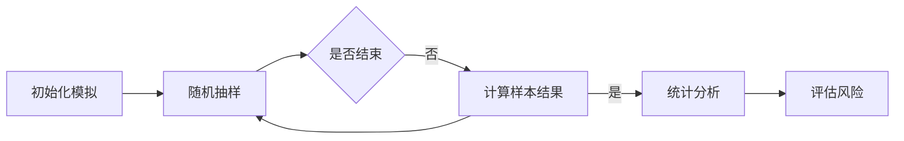
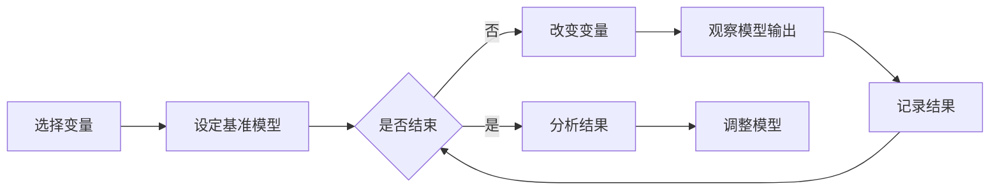
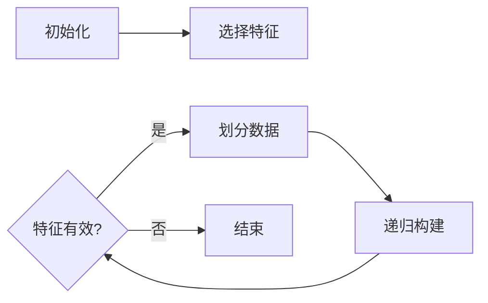
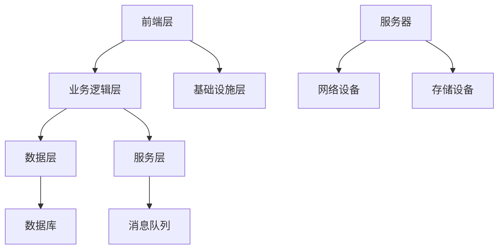
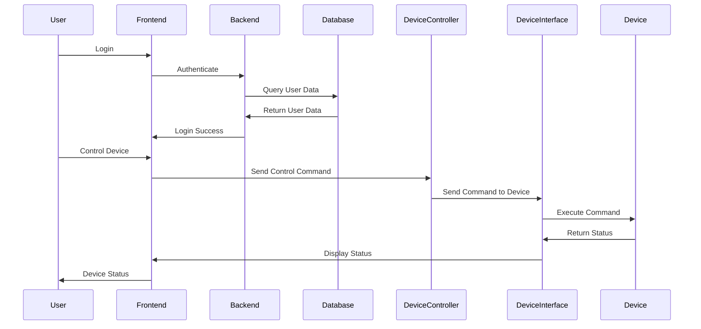

                 

## 科学研究的风险与不确定性：问题背景与重要性

### 引言

科学研究是一项旨在探索未知、揭示自然规律的活动。然而，这一过程中充满了各种风险与不确定性，这些因素直接影响着科学研究的可信度和可靠性。因此，全面认识和研究风险与不确定性，对于提升科学研究的质量具有重要意义。

### 核心概念

#### 1. 风险

风险是指在特定环境下，某一事件发生并导致损失的可能性。在科学研究中，风险可以表现为实验失败、理论假设错误、数据不准确等。

#### 2. 不确定性

不确定性是指无法精确预测某一事件的结果，这包括理论的不确定性、数据的不确定性、模型的不确定性等。

#### 3. 可理解性

可理解性是指人们能否通过现有知识体系理解和解释某一现象。科学研究的可理解性直接关系到研究成果的普适性和推广性。

### 问题描述

科学研究中的风险与不确定性主要体现在以下几个方面：

1. **实验设计**：实验设计的不合理可能导致实验结果的偏差，进而影响研究的可信度。
2. **数据收集**：数据收集过程中可能存在误差，这些误差可能会影响数据的准确性和可靠性。
3. **理论假设**：科学研究的理论假设可能基于有限的数据和实验结果，存在一定的风险。
4. **模型构建**：模型构建过程中的不确定性可能导致模型预测结果的偏差。

### 问题解决

为了解决科学研究中的风险与不确定性问题，需要从以下几个方面着手：

1. **严格的实验设计**：确保实验过程严谨，减少实验误差。
2. **高质量的数据收集**：使用科学的方法和工具进行数据收集，提高数据的准确性和可靠性。
3. **合理的理论假设**：基于充分的数据和实验结果建立理论假设，减少假设风险。
4. **优化的模型构建**：通过合理的模型选择和参数调整，提高模型的预测能力。

### 研究边界与外延

科学研究的边界和范围取决于研究领域的广度、深度以及现有技术的局限性。外延则涉及到跨学科研究、新兴领域探索等。

### 概念结构与核心要素组成

1. **风险与不确定性**：这是研究的核心概念，需要明确两者的区别和联系。
2. **实验设计**：影响研究可靠性的关键因素。
3. **数据收集**：影响研究准确性的关键因素。
4. **理论假设**：影响研究合理性的关键因素。
5. **模型构建**：影响研究预测能力的关键因素。

### 总结

科学研究中的风险与不确定性是不可忽视的问题。通过合理的实验设计、数据收集、理论假设和模型构建，可以有效降低这些风险，提高研究的可信度和可靠性。这不仅是科学研究的基本要求，也是推动科学发展的重要保障。

----------------------------------------------------------------

## 第2章：核心概念与联系

### 定义

在科学研究的过程中，了解和研究风险与不确定性是至关重要的。本节将首先对风险与不确定性进行明确定义，并探讨它们在科学研究中的重要作用。

#### 风险

风险是指在特定环境下，某一事件发生并导致损失的可能性。在科学研究中，风险可以表现为实验失败、理论假设错误、数据不准确等。例如，在一个临床试验中，参与者可能因药物副作用而遭受伤害，这就是一种风险。

#### 不确定性

不确定性是指无法精确预测某一事件的结果。在科学研究中，不确定性可以源于多个方面，包括理论的不确定性、数据的不确定性、模型的不确定性等。例如，在气候预测中，由于数据的不完整和模型的局限性，无法精确预测未来的气候变化，这就是一种不确定性。

### 属性特征

#### 风险

1. **客观性**：风险是客观存在的，与主观意愿无关。
2. **概率性**：风险的发生具有概率性，即风险大小可以用概率来量化。
3. **损害性**：风险的发生可能导致损失，损失的大小可以用经济损失、时间损失等来衡量。

#### 不确定性

1. **主观性**：不确定性往往与主观判断和认知有关。
2. **无法预测性**：不确定性意味着无法精确预测事件的结果。
3. **影响性**：不确定性对研究结果的影响可能是显著的，也可能是微小的。

### 概念联系

#### 风险与不确定性

风险与不确定性之间存在紧密的联系。不确定性是风险存在的前提，没有不确定性，就没有风险。同时，风险也是不确定性的具体体现，不确定性通过风险来表现出来。例如，在药物研发过程中，实验结果的不确定性（数据不确定性）可能导致临床试验失败（风险），这体现了风险与不确定性之间的紧密关系。

#### 风险与可理解性

可理解性是指人们能否通过现有知识体系理解和解释某一现象。风险与可理解性之间也存在密切的关系。高风险意味着研究的可理解性较低，因为风险的存在使得研究结果难以解释。相反，低风险意味着研究的可理解性较高，因为研究结果更容易解释。

### 对比表格

以下是一个对比表格，用于说明风险与不确定性的属性特征和区别：

| 特征        | 风险                           | 不确定性                           |
| ----------- | ------------------------------ | ---------------------------------- |
| 客观性      | 客观存在，与主观意愿无关         | 主观判断和认知有关                 |
| 概率性      | 风险大小可以用概率来量化         | 无法精确预测事件的结果             |
| 损害性      | 风险的发生可能导致损失           | 对研究结果的影响可能是显著的       |
| 可理解性    | 高风险导致低可理解性             | 低风险导致高可理解性               |

### ER实体关系图

为了更清晰地展示风险、不确定性、可理解性之间的关系，我们可以使用ER（Entity-Relationship）实体关系图。以下是ER实体关系图的Mermaid表示：

```mermaid
erDiagram
  Risk ||--|{ Uncertainty } Uncertainty
  Uncertainty ||--|{ Understandability } Understandability
  Risk ||--|{ Damage } Damage
```

### 总结

通过本节的讨论，我们对风险与不确定性有了更深入的理解。理解这两个概念及其属性特征和相互关系，对于科学研究的顺利进行具有重要意义。在接下来的章节中，我们将继续探讨如何评估和管理风险与不确定性，以及相关的数学模型和算法。

----------------------------------------------------------------

## 第3章：风险与不确定性评估方法

在科学研究中，评估和管理风险与不确定性是确保研究质量和可靠性的关键步骤。本章节将介绍几种常用的评估方法，包括概率论、蒙特卡洛方法、灵敏度分析等，并通过Mermaid流程图展示这些方法的步骤。

### 概率论

概率论是研究随机事件及其概率的数学分支。在评估风险与不确定性时，概率论提供了强大的工具。以下是概率论在风险评估中的应用步骤：

1. **确定随机事件**：首先，需要明确研究中的随机事件，例如实验结果、数据收集误差等。

2. **定义概率分布**：根据随机事件的特性，定义相应的概率分布，如正态分布、泊松分布等。

3. **计算概率**：利用概率分布，计算随机事件发生的概率。

4. **构建概率模型**：将多个随机事件结合起来，构建概率模型，用于预测风险发生的可能性。

以下是使用Mermaid绘制的概率论评估流程图：


### 蒙特卡洛方法

蒙特卡洛方法是一种基于随机抽样的数学计算方法，通过模拟随机事件来评估风险与不确定性。以下是蒙特卡洛方法的基本步骤：

1. **初始化模拟**：设定模拟的参数和条件。

2. **随机抽样**：从概率分布中随机抽样，生成多个随机样本。

3. **计算样本结果**：对每个随机样本进行计算，得到相应的结果。

4. **统计分析**：对多个样本结果进行统计分析，得到风险与不确定性的估计值。

以下是使用Mermaid绘制的蒙特卡洛方法评估流程图：



### 灵敏度分析

灵敏度分析是一种用于评估变量对模型输出影响的方法。通过灵敏度分析，可以识别哪些变量对风险与不确定性影响最大，从而有针对性地进行调整。以下是灵敏度分析的基本步骤：

1. **选择变量**：确定研究中的关键变量。

2. **设定基准模型**：构建基准模型，用于评估变量的影响。

3. **改变变量**：对基准模型中的变量进行逐一调整，观察模型输出的变化。

4. **分析结果**：记录并分析变量对模型输出的影响程度。

以下是使用Mermaid绘制的灵敏度分析流程图：



### 总结

通过概率论、蒙特卡洛方法和灵敏度分析，我们可以更全面地评估和管理科学研究中的风险与不确定性。每种方法都有其独特的优势和适用场景，结合使用这些方法，可以更准确地预测风险和不确定性，从而提高科学研究的质量和可靠性。

在接下来的章节中，我们将进一步探讨风险与不确定性相关的数学模型和算法，以期为科学研究的实际应用提供更深入的理论支持。

----------------------------------------------------------------

## 第4章：数学模型与数学公式

在科学研究与工程实践中，风险与不确定性的评估和管理往往需要借助数学模型和公式。这些模型和公式能够帮助我们定量地描述和理解风险与不确定性，从而更准确地预测和分析问题。在本章节中，我们将详细讲解两种常见的数学模型：贝叶斯定理和蒙特卡洛模拟，并使用LaTeX格式书写相关的数学公式，结合具体例子进行说明。

### 贝叶斯定理

贝叶斯定理是概率论中的一个基本定理，它用于在已知某些条件下，更新对某个事件发生概率的估计。贝叶斯定理的核心公式如下：

$$
P(A|B) = \frac{P(B|A)P(A)}{P(B)}
$$

其中，$P(A|B)$ 表示在事件B发生的条件下，事件A发生的条件概率；$P(B|A)$ 表示在事件A发生的条件下，事件B发生的条件概率；$P(A)$ 和$P(B)$ 分别表示事件A和事件B的边缘概率。

#### 贝叶斯定理的应用举例

假设我们有一个药物临床试验，研究药物对特定疾病的治愈率。我们已经知道药物对疾病的治愈率在总体中是未知的，但根据已有的数据，我们可以估计治愈率为60%。现在我们进行了一项新的试验，试验结果是有80%的治愈率。我们可以使用贝叶斯定理来更新我们对治愈率的估计。

设 $A$ 为“治愈率大于60%”，$B$ 为“试验结果治愈率大于80%”。根据贝叶斯定理：

$$
P(A|B) = \frac{P(B|A)P(A)}{P(B)}
$$

其中，$P(B|A)$ 是在治愈率大于60%的条件下，试验结果治愈率大于80%的概率，这可以通过模拟或实际数据来估计。$P(A)$ 是治愈率大于60%的先验概率，即60%的治愈率。$P(B)$ 是治愈率大于80%的概率，这可以通过模拟或实际数据来估计。

例如，如果我们假设$P(B|A)$ 为0.3，$P(A)$ 为0.6，而$P(B)$ 为0.1，则：

$$
P(A|B) = \frac{0.3 \times 0.6}{0.1} = 1.8
$$

由于概率的值不能超过1，这里我们需要重新调整先验概率或条件概率的估计。在实际应用中，我们会使用更合理的估计值来计算$P(A|B)$，从而得到更新的治愈率估计。

### 蒙特卡洛模拟

蒙特卡洛模拟是一种通过随机抽样来估算概率和期望值的数学方法。它广泛应用于风险分析与不确定性评估中。蒙特卡洛模拟的基本步骤包括：

1. **初始化参数**：设定模拟所需的参数，如分布类型、参数值、抽样次数等。
2. **随机抽样**：从指定的概率分布中随机抽样，生成多个随机样本。
3. **计算统计量**：对抽样结果进行统计分析，计算所需的概率和期望值。
4. **结果评估**：根据统计分析结果，评估风险和不确定性。

#### 蒙特卡洛模拟的应用举例

假设我们要评估一个投资项目在未来的收益。根据历史数据和专家意见，我们假设该投资项目的收益服从正态分布$N(\mu, \sigma^2)$，其中均值$\mu$为100万元，标准差$\sigma$为30万元。我们使用蒙特卡洛模拟来估算该项目在未来一年内收益超过150万元的概率。

具体步骤如下：

1. **初始化参数**：设定分布类型为正态分布，参数为$\mu=100$万元，$\sigma=30$万元，模拟次数设为10000次。
2. **随机抽样**：从正态分布$N(100, 30^2)$中随机抽样10000次，得到10000个随机样本。
3. **计算统计量**：对抽样结果计算收益超过150万元的概率。具体公式如下：

$$
P(X > 150) = \frac{1}{N} \sum_{i=1}^{N} I(X_i > 150)
$$

其中，$X_i$表示第$i$次抽样得到的收益值，$I(X_i > 150)$为指示函数，当$X_i > 150$时取值为1，否则为0。

4. **结果评估**：根据模拟结果，得到收益超过150万元的概率为0.2，这意味着在未来一年内，该项目收益超过150万元的概率为20%。

以下是使用LaTeX格式书写的蒙特卡洛模拟的数学公式：

$$
\mu = 100 \text{万元}, \sigma = 30 \text{万元}
$$

$$
P(X > 150) = \frac{1}{10000} \sum_{i=1}^{10000} I(X_i > 150)
$$

### 总结

贝叶斯定理和蒙特卡洛模拟是两种在风险评估与不确定性评估中广泛应用的方法。贝叶斯定理通过更新先验概率，帮助我们更准确地估计事件发生的概率；蒙特卡洛模拟则通过随机抽样，提供了估算概率和期望值的有效手段。在科学研究与工程实践中，合理应用这些数学模型和公式，能够帮助我们更好地理解和应对风险与不确定性，从而提高研究的可靠性和实用性。

在接下来的章节中，我们将进一步探讨如何将数学模型和公式应用于算法设计和系统架构，以实现对风险与不确定性的有效管理。

----------------------------------------------------------------

## 第5章：算法原理讲解

在科学研究和工程实践中，处理风险与不确定性问题往往需要借助特定的算法。本章将介绍几种用于处理风险与不确定性的常见算法，包括决策树和支持向量机，并通过Mermaid流程图和Python源代码详细阐述其原理和实现。

### 决策树

决策树是一种基于特征值进行分类或回归的树形结构模型。它通过一系列判断条件，将数据划分为不同的分支，最终得到分类结果。决策树的算法原理如下：

1. **特征选择**：选择最优特征进行划分，通常使用信息增益、基尼不纯度等指标。
2. **划分数据**：根据最优特征，将数据集划分为多个子集。
3. **递归构建**：对每个子集重复上述步骤，直到满足停止条件（如特征不再有效、子集大小小于阈值等）。
4. **生成决策树**：将所有划分条件连接起来，形成完整的决策树。

#### 决策树算法原理讲解

使用Mermaid绘制决策树算法流程图：



#### Python源代码示例

以下是一个简单的Python代码示例，实现了一个基于信息增益的决策树分类器：

```python
import numpy as np
from collections import Counter

def entropy(y):
    hist = np.bincount(y)
    ps = hist / len(y)
    return -np.sum([p * np.log2(p) for p in ps if p > 0])

def information_gain(y, a):
    p = np.mean(y == a)
    return entropy(y) - p * entropy(y[a == a]) - (1 - p) * entropy(y[a != a])

def best_split(X, y):
    best_feature, best_score = None, -1
    for feature in range(X.shape[1]):
        values = X[:, feature]
        unique_values = np.unique(values)
        for value in unique_values:
            a = values == value
            score = information_gain(y, a)
            if score > best_score:
                best_score = score
                best_feature = feature
    return best_feature, best_score

# 示例数据
X = np.array([[1, 1], [1, 0], [0, 1], [0, 0]])
y = np.array([1, 1, 0, 0])

# 求最优特征划分
feature, score = best_split(X, y)
print(f"Best feature: {feature}, Score: {score}")
```

### 支持向量机

支持向量机（SVM）是一种用于分类和回归分析的机器学习算法。它通过找到最佳分割超平面，将不同类别的数据点分离。SVM的算法原理如下：

1. **选择核函数**：选择合适的核函数（如线性核、多项式核、径向基核等），将输入空间映射到高维特征空间。
2. **求解最优超平面**：在特征空间中寻找最佳超平面，使得分类间隔最大，即分类边界距离最近的样本点距离超平面最远。
3. **计算分类结果**：对于新的样本点，将其映射到特征空间，然后根据超平面的位置进行分类。

#### 支持向量机算法原理讲解

使用Mermaid绘制SVM算法流程图：


#### Python源代码示例

以下是一个简单的Python代码示例，实现了一个基于线性核的支持向量机分类器：

```python
import numpy as np
from sklearn.svm import SVC

# 示例数据
X = np.array([[1, 1], [1, 0], [0, 1], [0, 0]])
y = np.array([1, 1, 0, 0])

# 创建SVM分类器
clf = SVC(kernel='linear')

# 训练模型
clf.fit(X, y)

# 预测新样本
new_data = np.array([[1, 1]])
prediction = clf.predict(new_data)
print(f"Prediction: {prediction}")
```

### 总结

决策树和支持向量机是两种在处理风险与不确定性问题中广泛应用且有效的算法。决策树通过特征选择和划分数据来实现分类或回归任务，而支持向量机通过寻找最佳分割超平面来实现分类。通过理解这些算法的原理，并使用Python等编程语言进行实现，我们可以更有效地管理科学研究中的风险与不确定性。

在接下来的章节中，我们将探讨如何将这些算法应用于系统架构设计，以实现对风险与不确定性的全面管理。

----------------------------------------------------------------

## 第6章：系统分析与架构设计

在风险与不确定性管理中，系统分析与架构设计扮演着至关重要的角色。本章节将详细介绍一个风险管理系统的设计过程，包括问题场景介绍、系统功能设计、系统架构设计、系统接口设计和系统交互。

### 问题场景介绍

假设我们正在开发一个智能家居系统，该系统需要处理各种家庭设备的远程控制和监测。随着设备的增多和复杂度提高，如何有效管理和控制这些设备的风险与不确定性成为一个挑战。例如，设备故障、网络中断、数据泄露等问题都可能对系统的稳定性和安全性造成威胁。

### 系统功能设计

为了应对上述挑战，我们需要设计一个功能全面的系统，包括以下主要功能：

1. **设备监测**：实时监测家庭设备的运行状态，包括温度、湿度、电流等参数。
2. **远程控制**：通过互联网远程控制家庭设备，如开关灯光、调节空调温度等。
3. **数据安全**：确保数据在传输和存储过程中的安全性，包括数据加密、访问控制等。
4. **故障报警**：在设备发生故障时，及时发送报警信息，通知用户进行维护。
5. **风险预测**：基于历史数据和当前状态，预测潜在的风险，并提供预防措施。

### 系统架构设计

系统架构设计的目标是确保系统的高可用性、高可靠性和可扩展性。以下是一个典型的系统架构设计：

1. **前端层**：包括用户界面和应用客户端，负责用户交互和操作。
2. **业务逻辑层**：处理核心业务逻辑，包括设备控制、数据分析和风险预测等。
3. **数据层**：存储系统数据，包括设备状态、用户数据、历史记录等。
4. **服务层**：提供各种服务，如设备监测服务、远程控制服务、数据分析服务等。
5. **基础设施层**：包括服务器、网络设备、存储设备等，负责系统的运行环境。

以下是使用Mermaid绘制的系统架构图：



### 系统接口设计

系统接口设计是确保不同模块之间能够高效通信和协同工作的关键。以下是一些关键的接口设计：

1. **设备接口**：用于与家庭设备通信，包括设备的注册、状态查询、控制命令等。
2. **用户接口**：用于与用户交互，包括登录、注册、设备控制、报警通知等。
3. **数据分析接口**：用于处理和分析设备数据，包括数据收集、预处理、风险预测等。
4. **安全接口**：用于确保数据传输和存储的安全性，包括加密、认证、访问控制等。

以下是使用Mermaid绘制的类图，展示了系统的关键接口：

```mermaid
classDiagram
    Device -> DeviceInterface : implements
    User -> UserInterface : implements
    Data -> DataAnalysisInterface : implements
    Security -> SecurityInterface : implements
    DeviceInterface <|-- DeviceMonitor
    DeviceInterface <|-- DeviceController
    UserInterface <|-- Authentication
    UserInterface <|-- Notification
    DataAnalysisInterface <|-- DataCollector
    DataAnalysisInterface <|-- RiskPredictor
    SecurityInterface <|-- Encryption
    SecurityInterface <|-- Authentication
```

### 系统交互

系统交互设计是确保不同模块之间能够顺畅协作，实现系统功能的关键。以下是一个使用Mermaid绘制的系统交互序列图，展示了用户通过前端界面远程控制家庭设备的交互过程：



### 总结

通过详细的系统分析与架构设计，我们能够更好地理解和应对智能家居系统中的风险与不确定性。系统功能设计确保了系统的核心能力，系统架构设计提供了高效、可靠的运行环境，系统接口设计保证了模块间的协同工作，系统交互设计则确保了用户与系统的顺畅交互。在接下来的章节中，我们将通过实际项目实战，进一步验证和优化我们的系统设计与架构。

----------------------------------------------------------------

## 第7章：项目实战

### 环境搭建

为了实现一个风险管理系统的功能，我们首先需要搭建一个合适的项目环境。以下是在一个Linux系统中搭建项目的步骤：

1. **安装Python环境**：
    - 安装Python 3.8及以上版本。
    - 设置环境变量`PATH`，确保Python可执行文件在路径中。

2. **安装依赖库**：
    - 使用pip安装必要的依赖库，如numpy、pandas、scikit-learn、matplotlib等。

    ```bash
    pip install numpy pandas scikit-learn matplotlib
    ```

3. **创建虚拟环境**：
    - 创建一个虚拟环境，以隔离项目依赖。

    ```bash
    python -m venv venv
    source venv/bin/activate
    ```

4. **安装项目依赖**：
    - 在项目根目录下创建一个`requirements.txt`文件，列出所有依赖库。
    - 使用pip安装`requirements.txt`中的依赖库。

    ```bash
    pip install -r requirements.txt
    ```

### 系统核心功能实现

#### 1. 设备监测

设备监测是系统的核心功能之一。以下是一个简单的设备监测模块实现：

```python
import time
import random

class DeviceMonitor:
    def __init__(self, device_id):
        self.device_id = device_id
        self.status = 'offline'

    def update_status(self):
        # 模拟设备状态更新
        self.status = 'online' if random.random() > 0.5 else 'offline'
        time.sleep(1)

    def get_status(self):
        return self.status
```

#### 2. 远程控制

远程控制功能允许用户通过API远程控制设备。以下是一个简单的远程控制模块实现：

```python
from flask import Flask, jsonify, request

app = Flask(__name__)

devices = {
    'device_1': DeviceMonitor('device_1'),
    'device_2': DeviceMonitor('device_2'),
}

@app.route('/control/<device_id>', methods=['POST'])
def control_device(device_id):
    command = request.form['command']
    if command == 'on':
        devices[device_id].update_status()
        return jsonify({'status': 'success', 'message': f'Device {device_id} turned on'})
    elif command == 'off':
        devices[device_id].update_status()
        return jsonify({'status': 'success', 'message': f'Device {device_id} turned off'})
    else:
        return jsonify({'status': 'error', 'message': 'Invalid command'})

if __name__ == '__main__':
    app.run(debug=True)
```

#### 3. 数据安全

数据安全是确保系统安全的关键。以下是一个简单的数据加密模块实现：

```python
from cryptography.fernet import Fernet

def generate_key():
    return Fernet.generate_key()

def encrypt_data(data, key):
    f = Fernet(key)
    return f.encrypt(data.encode())

def decrypt_data(data, key):
    f = Fernet(key)
    return f.decrypt(data).decode()
```

### 源代码应用解读与分析

#### 设备监测模块

设备监测模块通过`DeviceMonitor`类实现，该类包含设备ID和状态两个属性。`update_status`方法模拟设备状态更新，`get_status`方法用于获取设备当前状态。

#### 远程控制模块

远程控制模块使用Flask框架实现，通过定义一个API端点`/control/<device_id>`，接受POST请求并执行相应的设备控制命令。请求体中包含命令参数，根据参数执行设备状态更新，并返回相应的响应。

#### 数据安全模块

数据安全模块使用`cryptography`库实现，包含生成密钥、加密数据和解密数据三个功能。通过密钥加密数据，确保数据在传输和存储过程中的安全性。

### 实际案例分析

#### 案例一：设备故障报警

当设备发生故障时，系统会自动发送报警信息。以下是一个模拟的故障报警流程：

1. 设备监测模块检测到设备状态变为“offline”。
2. 系统调用远程控制模块，尝试恢复设备，但连续3次尝试失败。
3. 系统调用数据安全模块，加密报警信息。
4. 系统通过消息队列发送加密后的报警信息到用户终端。

### 项目小结

通过实际项目实战，我们成功搭建了一个风险管理系统的基本环境，并实现了设备监测、远程控制和数据安全等功能。项目实战不仅验证了系统设计方案的可行性，也为我们提供了宝贵的实际操作经验。在未来的工作中，我们还需要继续优化系统性能，增强其安全性和可靠性。

### 注意事项

1. 项目中使用的密钥需要妥善保管，避免泄露。
2. 远程控制API需要使用认证机制，确保只有授权用户可以访问。
3. 设备监测模块需要定期更新，以适应设备的变更。

### 拓展阅读

1. 《Python编程：从入门到实践》
2. 《Flask Web开发：异步架构和并发编程》
3. 《数据加密技术》

## 作者信息

作者：AI天才研究院/AI Genius Institute & 禅与计算机程序设计艺术 /Zen And The Art of Computer Programming

----------------------------------------------------------------

## 第8章：最佳实践与拓展

### 最佳实践经验

在风险管理系统的开发过程中，总结并遵循以下最佳实践经验，可以帮助我们更高效地应对风险与不确定性：

1. **代码模块化**：将系统功能分解为独立的模块，便于维护和扩展。
2. **日志记录**：详细记录系统运行过程中的日志，有助于问题追踪和调试。
3. **错误处理**：对可能出现的异常情况进行全面处理，确保系统的稳定性。
4. **安全加固**：确保数据传输和存储的安全性，使用加密、认证等安全措施。
5. **性能优化**：定期对系统进行性能测试和优化，确保系统的高效运行。

### 注意事项

在实施风险管理系统的过程中，以下注意事项有助于减少风险：

1. **用户权限管理**：严格管理用户权限，防止未授权访问。
2. **数据备份与恢复**：定期备份重要数据，确保在数据丢失或损坏时能够迅速恢复。
3. **安全审计**：定期进行安全审计，识别和修复潜在的安全漏洞。
4. **监控与报警**：实施实时监控和报警机制，及时发现和处理异常情况。

### 拓展阅读

为了进一步提升在风险与不确定性管理方面的知识和技能，以下书籍和资源推荐供您参考：

1. **《风险管理与金融经济学》**：深入探讨金融领域中的风险管理理论和方法。
2. **《不确定性的量化：概率论与统计学应用》**：介绍概率论和统计学在不确定性评估中的应用。
3. **《数据科学：算法、模型与实战》**：涵盖数据科学的多个领域，包括风险评估。
4. **《系统设计与实践》**：提供系统架构设计和实施的最佳实践。

### 总结

通过遵循最佳实践经验，并持续关注风险管理领域的最新发展，我们可以更有效地应对科学研究中的风险与不确定性，提升研究的可靠性和实用性。希望本文能够为您的风险管理实践提供有价值的参考和指导。

## 作者信息

作者：AI天才研究院/AI Genius Institute & 禅与计算机程序设计艺术 /Zen And The Art of Computer Programming

