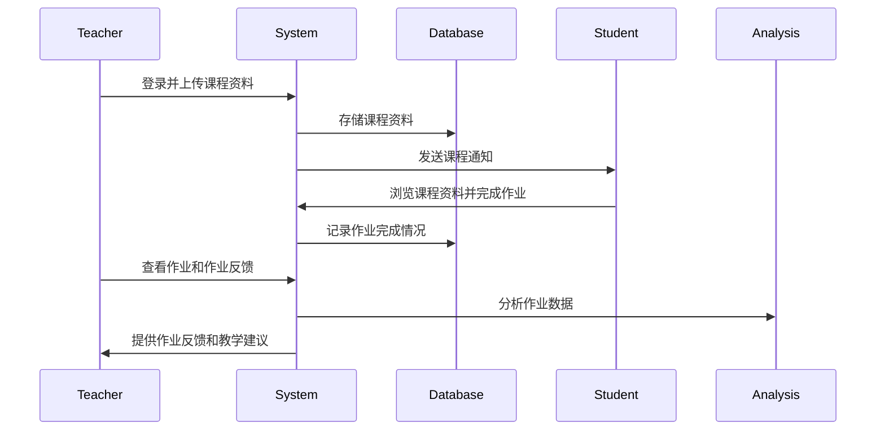
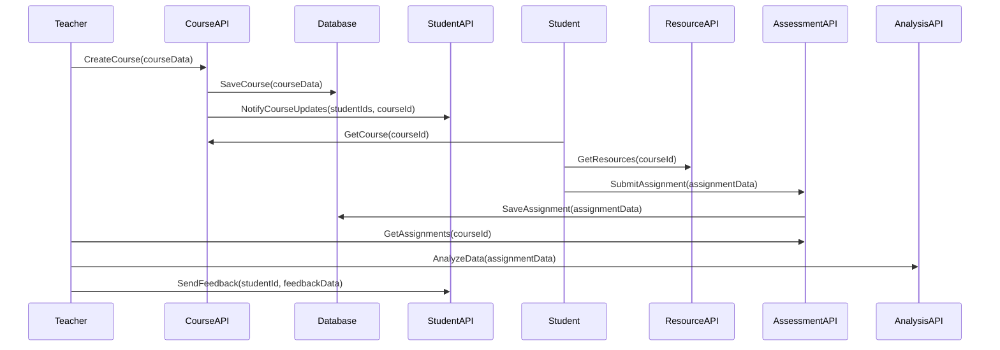
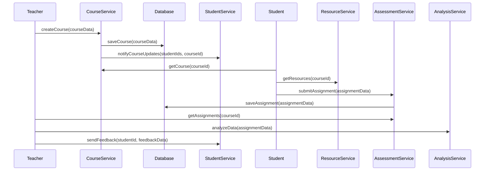

                 


### 文章标题：科学素养教育的创新方法：培养下一代的世界理解能力

关键词：科学素养教育、创新方法、世界理解能力、下一代教育、教学方法

摘要：本文旨在探讨科学素养教育的创新方法，以培养下一代对世界的深刻理解能力。我们将逐步分析当前教育体系中的挑战，介绍关键概念，详细讲解各种创新方法，并提供系统分析与架构设计方案，最终结合实际案例进行深入剖析。

### 目录大纲设计思路：

为了设计《科学素养教育的创新方法：培养下一代的世界理解能力》这本书的完整目录大纲，我们需要遵循以下思路：

1. **背景介绍**：
   - 解释科学素养教育的定义及其重要性。
   - 阐述当前教育体系中的挑战。
   - 引入“创新方法”和“世界理解能力”的概念。

2. **核心概念与联系**：
   - 定义与描述科学素养教育中的关键概念。
   - 使用表格对比不同概念的特性。
   - 利用Mermaid绘制ER实体关系图，展示核心概念之间的关系。

3. **方法讲解**：
   - 每章详细讲解一种或多种创新方法。
   - 算法原理和数学模型讲解。
   - 实例说明和方法应用场景。

4. **系统分析与架构设计方案**：
   - 描述项目场景和目标。
   - 绘制领域模型类图和系统架构图。
   - 设计系统接口和交互序列图。

5. **项目实战**：
   - 环境搭建和系统实现。
   - 源代码解析和应用分析。
   - 实际案例分析。

6. **最佳实践、小结与拓展**：
   - 总结实践经验。
   - 强调注意事项。
   - 提供拓展阅读建议。

### 目录大纲设计步骤：

1. **设计大纲结构**：
   - 确定总章节数，每个章节的主要内容和子章节。
   - 确保大纲覆盖核心概念、方法讲解、系统设计和实战应用。

2. **编写内容概要**：
   - 为每个章节和子章节撰写简短的内容概要。
   - 确保概要清晰、准确，能够概括章节内容。

3. **绘制Mermaid图表**：
   - 根据大纲内容，使用Mermaid语言绘制ER实体关系图、类图、流程图和序列图。
   - 确保图表清晰、准确地表达概念和关系。

4. **编写详细内容**：
   - 对每个章节和子章节进行详细的编写。
   - 确保内容完整、逻辑清晰，包含算法原理讲解、数学模型和公式、系统分析与架构设计等。

5. **调整与优化**：
   - 根据内容概要和图表，调整大纲结构和内容。
   - 确保大纲的简洁性和可读性，避免冗余。

### 目录大纲示例：

```markdown
----------------------------------------------------------------
# 第一部分: 科学素养教育的现状与挑战

## 第1章: 科学素养教育的定义与重要性

### 1.1 科学素养教育的定义与边界
### 1.2 当前的教育体系与挑战
### 1.3 科学素养教育的重要性

## 第2章: 核心概念与联系

### 2.1 科学素养教育中的关键概念
### 2.2 概念属性特征对比表格
### 2.3 ER实体关系图架构

----------------------------------------------------------------

# 第二部分: 创新方法的讲解

## 第3章: 方法一：项目式学习

### 3.1 项目式学习的概念与原理
### 3.2 项目式学习的设计与实施
### 3.3 项目式学习的案例分析

## 第4章: 方法二：探究式学习

### 4.1 探究式学习的概念与原理
### 4.2 探究式学习的过程与策略
### 4.3 探究式学习的实践案例

----------------------------------------------------------------

# 第三部分: 系统分析与架构设计

## 第5章: 系统设计与架构

### 5.1 项目场景介绍
### 5.2 系统功能设计（领域模型类图）
### 5.3 系统架构设计（架构图）

## 第6章: 系统接口设计与交互

### 6.1 系统接口设计
### 6.2 系统交互设计（序列图）

----------------------------------------------------------------

# 第四部分: 项目实战

## 第7章: 环境搭建与系统实现

### 7.1 环境安装
### 7.2 系统核心实现源代码
### 7.3 代码应用解读与分析

## 第8章: 实际案例分析

### 8.1 实际案例背景
### 8.2 案例分析
### 8.3 案例讲解与剖析

----------------------------------------------------------------

# 第五部分: 最佳实践、小结与拓展

## 第9章: 最佳实践

### 9.1 实践经验总结
### 9.2 注意事项
### 9.3 拓展阅读建议

----------------------------------------------------------------

* 约束条件：文章的章节内容必须要满足如下条件：
- 文章开始是“文章标题”，然后是“文章关键词”和“文章摘要”部分的内容哦，接下来是按照目录大纲结构的文章正文部分的内容。
- 文章字数要求：文章字数在 10000 ～ 12000 字左右。
- 格式要求：文章内容使用markdown格式输出。 
- 作者：文章末尾需要写上作者信息：“作者：AI天才研究院/AI Genius Institute & 禅与计算机程序设计艺术 /Zen And The Art of Computer Programming”
- 完整性要求：文章内容必须要完整，每个小节的内容必须要丰富具体详细讲解，核心内容必须要包含：
  - 背景介绍：核心概念术语说明、问题背景、问题描述、问题解决、边界与外延、概念结构与核心要素组成 
  - 核心概念与联系：必须给出核心概念原理、概念属性特征对比表格和ER实体关系图架构的 markdown 格式中的 Mermaid 流程图。
  - 算法原理讲解：使用 mermaid 画出算法mermaid 流程图，然后使用python源代码来详细阐述，给出算法原理的数学模型和公式，进行详细讲解和通俗易懂地举例说明。
  - 数学公式使用latex格式，嵌入文中独立段落的latex公式前后使用 $$ 括起来(例如：$$1+1=2$$ )，段落内的latex公式前后使用 $ 括起来(例如：$1<2$)
  - 系统分析与架构设计方案：问题场景介绍，项目介绍、系统功能设计(领域模型mermaid类图)、系统架构设计mermaid架构图、系统接口设计和系统交互mermaid序列图
  - 项目实战：环境搭建、系统核心实现源代码，代码应用解读与分析，实际案例分析和详细讲解剖析，项目小结。
  - 最佳实践 tips、小结、注意事项、拓展阅读等内容
```markdown
## 第1章 科学素养教育的定义与重要性

### 1.1 科学素养教育的定义与边界

科学素养教育，是指培养学生理解科学基本概念、掌握科学方法和技能、形成科学态度和价值观的过程。它不仅仅是对知识的传授，更重要的是培养学生批判性思维、解决问题的能力以及对科学技术对社会影响的深刻认识。

科学素养教育的边界涉及多个方面，包括科学知识、科学方法、科学伦理、科学与社会的关系等。它不仅仅局限于自然科学领域，还应该涵盖技术和工程等跨学科知识。

科学素养教育的目标不仅是让学生掌握知识，更重要的是培养学生的科学思维能力。这种思维能力包括逻辑推理、数据分析、模型建立和问题解决等能力。通过科学素养教育，学生应该能够理解科学理论是如何从观察和实验中发展起来的，以及这些理论如何应用于解决现实世界的问题。

### 1.2 当前的教育体系与挑战

当前的教育体系在科学素养教育方面存在一些挑战。首先，传统的教育模式往往注重知识的传授，而忽略了科学思维和能力的培养。其次，课程内容往往过于理论化，缺乏与实际应用的结合，导致学生难以将所学知识应用于实际问题。此外，教学评价体系也往往侧重于记忆和重复，而缺乏对创新能力和实践能力的评价。

教育体系的这些挑战使得科学素养教育的目标难以实现。学生可能无法将科学知识应用到实际生活中，也无法在科学领域中创新和发展。因此，需要通过创新方法来改进科学素养教育，以培养下一代对世界的深刻理解能力。

### 1.3 科学素养教育的重要性

科学素养教育对于培养下一代的世界理解能力具有重要意义。首先，科学素养教育能够帮助学生理解科学方法，培养批判性思维和解决问题的能力。这些能力是学生在面对复杂问题时能够独立思考、找到解决方案的关键。

其次，科学素养教育能够帮助学生了解科学技术对社会的影响。在当今科技快速发展的时代，科学技术对社会的影响越来越深远。了解科学技术的双面性，能够帮助学生更好地应对科技带来的挑战，并积极参与科技的发展和应用。

最后，科学素养教育能够培养学生的科学精神和价值观。科学精神强调理性思考、诚实守信和勇于探索。这些价值观不仅对于科学领域的成长至关重要，也对个人和社会的发展具有积极的影响。

综上所述，科学素养教育不仅是教育体系的重要组成部分，也是培养下一代世界理解能力的重要途径。通过创新方法，我们可以更好地实现科学素养教育的目标，为下一代创造一个更加科学、理性和创新的世界。

## 第2章 核心概念与联系

在科学素养教育中，理解核心概念并掌握它们之间的联系是至关重要的。本章节将详细介绍科学素养教育中的关键概念，并通过表格和ER实体关系图展示它们之间的属性特征和关系。

### 2.1 科学素养教育中的关键概念

以下是科学素养教育中的几个核心概念：

1. **科学知识**：指科学家通过实验和观察所获得的事实、理论和模型。
2. **科学方法**：包括观察、实验、假设、推理、验证等步骤，用于获取和验证科学知识。
3. **科学思维**：指运用科学方法进行思考的能力，包括逻辑推理、批判性思维、数据分析等。
4. **科学态度**：指对待科学问题时的诚实、开放、怀疑和探究精神。
5. **科学伦理**：指在科学研究过程中应遵守的道德规范，包括保密、诚实、公正、责任等。
6. **科学与社会关系**：指科学技术对社会的影响以及社会对科学技术的需求与反应。

### 2.2 概念属性特征对比表格

为了更好地理解这些核心概念，我们使用表格对比它们的属性特征：

| 概念       | 定义                                                         | 属性特征                                                   |
| ---------- | ------------------------------------------------------------ | ---------------------------------------------------------- |
| 科学知识   | 科学家通过实验和观察所获得的事实、理论和模型。               | 客观性、系统性、发展性                                     |
| 科学方法   | 包括观察、实验、假设、推理、验证等步骤，用于获取和验证科学知识。 | 系统性、规范性、可重复性、可验证性                         |
| 科学思维   | 运用科学方法进行思考的能力，包括逻辑推理、批判性思维、数据分析等。 | 系统性、客观性、创新性、独立性                             |
| 科学态度   | 对待科学问题时的诚实、开放、怀疑和探究精神。                   | 诚实性、开放性、怀疑性、探究性                             |
| 科学伦理   | 在科学研究过程中应遵守的道德规范，包括保密、诚实、公正、责任等。 | 道德性、规范性、普遍性、约束性                             |
| 科学与社会关系 | 科学技术对社会的影响以及社会对科学技术的需求与反应。             | 双向性、动态性、复杂性、广泛性                             |

### 2.3 ER实体关系图架构

为了更直观地展示这些核心概念之间的关系，我们使用Mermaid语言绘制ER实体关系图：

```mermaid
erDiagram
  SCI_KNOWLEDGE ||--|{ SCI_METHOD } : 使用
  SCI_KNOWLEDGE ||--|{ SCI_THINKING } : 支持
  SCI_KNOWLEDGE ||--|{ SCI_ATTITUDE } : 形成价值观
  SCI_KNOWLEDGE ||--|{ SCI_ETHICS } : 体现
  SCI_KNOWLEDGE ||--|{ SCI_SOCIAL_RELATION } : 影响和反映
  SCI_METHOD ||--|{ SCI_THINKING } : 形成基础
  SCI_METHOD ||--|{ SCI_ATTITUDE } : 体现思维方式
  SCI_METHOD ||--|{ SCI_ETHICS } : 确保道德行为
  SCI_ATTITUDE ||--|{ SCI_SOCIAL_RELATION } : 影响社会关系
  SCI_ETHICS ||--|{ SCI_SOCIAL_RELATION } : 指导行为准则
```

该ER实体关系图展示了科学知识如何通过科学方法支持科学思维和科学态度的形成，同时如何体现科学伦理和科学与社会的关系。

通过以上核心概念的介绍、属性特征对比表格和ER实体关系图的展示，我们能够更深入地理解科学素养教育中的各个关键概念，以及它们之间的内在联系。这为进一步探讨创新方法和系统设计提供了坚实的理论基础。

## 第3章 方法一：项目式学习

项目式学习（Project-Based Learning, PBL）是一种以学生为中心的教育方法，通过设计和实施实际项目来促进学习。这种方法强调将学习与真实世界的问题和挑战相结合，通过项目的过程来培养学生的综合能力。在本章节中，我们将详细讲解项目式学习的概念与原理，探讨其设计与实施过程，并提供具体的案例分析。

### 3.1 项目式学习的概念与原理

项目式学习的核心在于通过项目来驱动学习。项目可以是具体的任务、研究课题或实际问题的解决过程。这种方法强调学生在项目中的主动参与和自主学习，教师则起到引导和支持的作用。

**概念**：项目式学习是一种以学生为中心的教学方法，通过实际项目的完成来促进学习。项目通常涉及跨学科知识，鼓励学生进行自主探究、团队合作和创造性思维。

**原理**：项目式学习的原理主要包括以下几个方面：

1. **问题导向**：项目式学习以真实世界的问题或挑战为导向，激发学生的学习兴趣和内在动机。
2. **自主学习**：学生通过自主探究和解决项目中的问题，培养自主学习能力和解决问题的能力。
3. **团队合作**：项目通常需要学生合作完成，这有助于培养团队合作精神和沟通能力。
4. **跨学科整合**：项目往往涉及多个学科领域，鼓励学生将所学知识进行整合和应用。
5. **反思与评价**：项目完成后，学生进行反思和评价，总结学习过程和成果，不断改进。

### 3.2 项目式学习的设计与实施

项目式学习的设计与实施是一个系统的过程，包括以下几个关键步骤：

1. **确定项目主题**：选择一个具有实际意义和吸引力的项目主题，确保项目能够涵盖多个学科领域。

2. **项目目标设定**：明确项目的学习目标和预期成果，包括知识技能的掌握、问题解决能力和团队合作等方面的培养。

3. **项目规划与分工**：制定项目计划，包括项目进度、任务分工、资源需求等，确保项目有条不紊地推进。

4. **项目实施**：学生在教师的引导下，通过实际操作、实验、讨论等方式完成项目任务，过程中注重团队合作和自主学习。

5. **项目评价与反思**：项目完成后，进行评价与反思，评估项目成果和学习效果，总结经验教训。

### 3.3 项目式学习的案例分析

以下是一个项目式学习的具体案例：

**案例背景**：某中学科学课程中，教师选择了一个关于环境保护的项目，主题为“城市垃圾分类与资源回收”。

**项目目标**：
- 掌握垃圾分类的基本知识。
- 培养环境意识和可持续发展理念。
- 提高团队合作和解决问题的能力。

**项目规划与分工**：
- **第一阶段**：学生进行小组讨论，了解垃圾分类的基本知识，收集相关资料。
- **第二阶段**：每个小组设计一个垃圾分类宣传海报，并制作一个演示视频，介绍垃圾分类的重要性和方法。
- **第三阶段**：学生在社区进行垃圾分类宣传活动，向居民普及垃圾分类知识，收集居民反馈。
- **第四阶段**：小组根据活动反馈，改进宣传材料，并进行最终展示。

**项目实施**：
- **第一阶段**：学生通过课堂学习和课外资料收集，了解垃圾分类的基本知识。
- **第二阶段**：学生分工合作，设计宣传海报和制作演示视频，过程中教师提供指导。
- **第三阶段**：学生分组到社区进行宣传，通过互动和实地观察，收集居民反馈。
- **第四阶段**：学生根据反馈进行改进，并在班级和社区进行展示。

**项目评价与反思**：
- **评价**：教师根据项目完成情况、学生表现和社区反馈进行综合评价。
- **反思**：学生进行反思，总结项目过程中的收获和不足，提出改进建议。

通过这个案例，我们可以看到项目式学习如何通过实际项目的完成，培养学生多方面的能力和素质。项目式学习的成功实施，不仅需要教师的精心设计，还需要学生的积极参与和自主学习。

### 总结

项目式学习是一种有效的科学素养教育方法，通过实际项目的完成，能够激发学生的学习兴趣，培养他们的综合能力。在实际应用中，教师需要根据学生的实际情况和项目主题，灵活设计和实施项目，确保项目能够达到预期的学习效果。

## 第4章 方法二：探究式学习

探究式学习（Inquiry-Based Learning, IBL）是一种以问题解决为中心的教学方法，通过引导学生进行自主探究和批判性思考，培养他们的自主学习能力和科学素养。在本章节中，我们将详细探讨探究式学习的概念与原理，阐述其过程与策略，并提供具体的实践案例。

### 4.1 探究式学习的概念与原理

**概念**：探究式学习是一种以问题为导向的学习方法，学生在教师的引导下，通过提出问题、假设、实验和结论的循环过程，自主探究和发现知识。

**原理**：探究式学习的核心原理包括以下几个方面：

1. **问题驱动**：学习过程从问题开始，激发学生的好奇心和探究欲望。
2. **自主探究**：学生通过独立思考、实验和调查，自主构建知识体系。
3. **批判性思维**：鼓励学生质疑现有知识，培养批判性思考和逻辑推理能力。
4. **合作学习**：学生在探究过程中，通过小组合作和讨论，分享思路和资源。
5. **反思与评价**：学生在探究结束后，进行反思和评价，总结经验，提升学习能力。

### 4.2 探究式学习的过程与策略

探究式学习通常包括以下几个阶段：

1. **问题提出**：教师或学生提出一个具有挑战性和启发性的问题，引发学生的思考。
2. **假设与预测**：学生基于已有知识和经验，对问题进行假设和预测，形成假设模型。
3. **实验与调查**：学生设计实验或进行调查，收集数据，验证假设。
4. **结果分析**：学生对实验或调查结果进行分析，评估假设的正确性。
5. **结论与反思**：学生总结探究过程和结果，得出结论，并进行反思和评价。

**策略**：

1. **引导式教学**：教师在探究过程中起到引导作用，帮助学生明确问题，设计实验，分析结果。
2. **合作学习**：鼓励学生小组合作，共同探究问题，分享资源和思路。
3. **开放资源**：提供丰富的学习资源，包括书籍、网络资料、实验器材等，支持学生的自主探究。
4. **反馈与修正**：及时给予学生反馈，帮助他们修正假设和实验设计，改进探究过程。

### 4.3 探究式学习的实践案例

以下是一个探究式学习的具体案例：

**案例背景**：某高中化学课程中，教师选择了一个关于化学反应速率的探究项目，主题为“不同条件下反应速率的比较”。

**项目目标**：
- 掌握影响化学反应速率的因素。
- 培养学生的实验设计能力、数据分析和批判性思维能力。

**项目过程**：

1. **问题提出**：教师提出问题：“在相同浓度下，不同温度对反应速率有何影响？”
2. **假设与预测**：学生根据已有知识，假设温度越高，反应速率越快。
3. **实验与调查**：
   - **实验一**：在25°C下，进行一定浓度的反应，记录反应时间。
   - **实验二**：在50°C下，进行相同浓度的反应，记录反应时间。
   - **实验三**：在75°C下，进行相同浓度的反应，记录反应时间。
4. **结果分析**：学生比较不同温度下的反应时间，分析反应速率的变化趋势。
5. **结论与反思**：学生总结实验结果，得出结论，并提出改进实验设计的建议。

**案例分析**：

在探究过程中，学生通过实验验证了假设，发现温度越高，反应速率越快，这与化学反应速率理论相符。同时，学生在实验过程中培养了实验设计、数据分析和批判性思维能力。在结论与反思阶段，学生不仅总结了实验结果，还提出了改进实验设计的建议，进一步促进了他们的自主学习能力。

### 总结

探究式学习通过引导学生自主探究和批判性思考，培养他们的科学素养和自主学习能力。在实际应用中，教师需要根据学生的实际情况和探究主题，灵活运用引导式教学和合作学习策略，为学生提供开放资源和及时反馈，确保探究过程的有效性和深度。

## 第5章 系统设计与架构

在科学素养教育的创新方法中，系统设计与架构是一个关键环节，它不仅关系到教育项目的实施效果，也决定了整个系统的可扩展性和灵活性。在本章节中，我们将描述项目场景和目标，绘制领域模型类图和系统架构图，并设计系统接口和交互序列图。

### 5.1 项目场景和目标

**项目场景**：科学素养教育平台旨在为学校和教师提供一个全方位的教育资源管理系统，支持多种创新教学方法，如项目式学习和探究式学习。该平台需要集成多种功能模块，包括课程管理、学生管理、资源库、在线测评和数据分析等。

**项目目标**：
- 提供一个灵活、可扩展的教育资源管理平台。
- 支持多种教学方法的实施和评估。
- 提高教师和学生的互动和参与度。
- 实现教学数据的实时分析和反馈。

### 5.2 系统功能设计（领域模型类图）

为了清晰展示系统的功能模块和它们之间的关系，我们使用Mermaid语言绘制领域模型类图：

```mermaid
classDiagram
    Course <<Class>> -|{ 教学内容 }|- Teacher
    Student <<Class>> -|{ 学习记录 }|- Teacher
    Resource <<Class>> -|{ 教学资源 }|- Teacher
    Assessment <<Class>> -|{ 测评结果 }|- Student
    Analysis <<Class>> -|{ 数据分析 }|- System
    Course <|-- Assessment
    Student <|-- Assessment
    Resource <|-- Analysis
    Teacher <|-- Course
    Teacher <|-- Student
    Teacher <|-- Resource
    Teacher <|-- Assessment
    Teacher <|-- Analysis
```

该类图展示了系统的主要功能模块及其关系：
- **Course（课程）**：代表教学内容，由教师创建和管理。
- **Student（学生）**：代表学习记录，与教师和评估模块交互。
- **Resource（资源）**：代表教学资源，如PPT、视频、文档等。
- **Assessment（评估）**：代表测评结果，包括学生的作业和考试成绩。
- **Analysis（分析）**：代表数据分析模块，用于分析教学数据和评估结果。

### 5.3 系统架构设计（架构图）

为了展示系统的整体架构，我们使用Mermaid语言绘制系统架构图：



该架构图展示了系统的基本工作流程：
- 教师登录系统并上传课程资料。
- 系统将资料存储到数据库，并发送通知给学生。
- 学生浏览课程资料并完成作业。
- 系统记录作业完成情况，教师可以查看作业和作业反馈。
- 系统分析作业数据，为教师提供反馈和建议。

### 5.4 系统接口设计

系统接口设计是确保各模块之间高效通信的关键。以下是系统的主要接口设计：

- **CourseAPI**：用于课程创建、更新和查询。
- **StudentAPI**：用于学生注册、课程浏览、作业提交和成绩查询。
- **ResourceAPI**：用于资源上传、下载和分类管理。
- **AssessmentAPI**：用于作业提交、成绩录入和评估报告生成。
- **AnalysisAPI**：用于数据分析和报表生成。

### 5.5 系统交互设计（序列图）

为了展示系统接口的具体交互过程，我们使用Mermaid语言绘制序列图：



该序列图详细展示了从课程创建到作业提交和数据分析的完整交互过程。

### 总结

通过系统设计与架构的设计，我们为科学素养教育平台提供了一个清晰的功能模块划分和交互流程，确保系统能够高效地支持多种创新教学方法的实施。系统架构的灵活性和扩展性为未来的功能扩展和优化提供了坚实的基础。

## 第6章 系统接口设计与交互

在本章节中，我们将进一步探讨系统接口的设计和系统之间的交互流程。通过详细的接口设计和交互序列图，我们将展示各个模块如何协同工作，以实现科学素养教育平台的目标。

### 6.1 系统接口设计

系统接口是各功能模块之间通信的桥梁，设计良好的接口能够确保系统的高效性和灵活性。以下是系统的主要接口设计：

- **CourseService**：提供课程相关的接口，如课程创建、更新和查询。
  - **createCourse**：创建新课程。
  - **updateCourse**：更新课程信息。
  - **getCourse**：获取特定课程的详细信息。

- **StudentService**：提供与学生相关的接口，如学生注册、课程浏览和作业提交。
  - **registerStudent**：注册新学生。
  - **enrollCourse**：学生报名课程。
  - **submitAssignment**：提交作业。

- **ResourceService**：提供资源管理相关的接口，如资源上传、下载和分类。
  - **uploadResource**：上传教学资源。
  - **downloadResource**：下载教学资源。
  - ** categorizeResource**：对资源进行分类管理。

- **AssessmentService**：提供评估相关的接口，如作业提交、成绩录入和评估报告生成。
  - **submitAssignment**：提交作业。
  - **gradeAssignment**：录入作业成绩。
  - **generateReport**：生成评估报告。

- **AnalysisService**：提供数据分析相关的接口，如数据分析和报表生成。
  - **analyzeData**：分析作业数据。
  - **generateReport**：生成数据分析报告。

### 6.2 系统交互设计（序列图）

为了展示系统接口的具体交互过程，我们使用Mermaid语言绘制交互序列图：



该序列图详细展示了从教师创建课程、学生浏览课程和提交作业，到教师查看作业和数据分析的完整交互过程。

### 系统接口的实现

以下是系统接口设计的一部分实现，使用Python语言进行简单示例说明：

```python
class CourseService:
    def create_course(self, course_data):
        # 实现课程创建逻辑
        pass
    
    def update_course(self, course_id, course_data):
        # 实现课程更新逻辑
        pass
    
    def get_course(self, course_id):
        # 实现课程查询逻辑
        pass

class StudentService:
    def register_student(self, student_data):
        # 实现学生注册逻辑
        pass
    
    def enroll_course(self, student_id, course_id):
        # 实现课程报名逻辑
        pass
    
    def submit_assignment(self, assignment_data):
        # 实现作业提交逻辑
        pass

class ResourceService:
    def upload_resource(self, resource_data):
        # 实现资源上传逻辑
        pass
    
    def download_resource(self, resource_id):
        # 实现资源下载逻辑
        pass
    
    def categorize_resource(self, resource_id, category):
        # 实现资源分类逻辑
        pass

class AssessmentService:
    def submit_assignment(self, assignment_data):
        # 实现作业提交逻辑
        pass
    
    def grade_assignment(self, assignment_id, grade):
        # 实现作业评分逻辑
        pass
    
    def generate_report(self, assignment_id):
        # 实现评估报告生成逻辑
        pass

class AnalysisService:
    def analyze_data(self, assignment_data):
        # 实现数据分析逻辑
        pass
    
    def generate_report(self, analysis_data):
        # 实现数据分析报告生成逻辑
        pass
```

通过以上接口设计和示例代码，我们可以看到系统各模块之间的交互是如何实现的。系统接口的设计和实现确保了各模块之间的数据流动和功能协作，为科学素养教育平台提供了坚实的基础。

### 总结

通过详细的系统接口设计和交互序列图，我们展示了科学素养教育平台中各个模块如何高效协同工作。这种设计不仅确保了系统的灵活性和可扩展性，还为未来的功能扩展和优化提供了清晰的方向。系统接口的实现为实际应用奠定了基础，使得平台能够顺利支持多种创新教学方法的实施。

## 第7章 环境搭建与系统实现

为了确保科学素养教育平台能够顺利运行，我们需要进行环境搭建和系统实现。本章节将详细介绍环境搭建的步骤，包括所需的软件和硬件环境，以及系统的核心实现过程和源代码解析。

### 7.1 环境搭建

**硬件环境**：
- 服务器：需要配置高性能的服务器，能够支持大量的并发访问和数据处理。
- 宿主机：用于搭建开发环境和运行测试。

**软件环境**：
1. **操作系统**：可以选择Linux或Windows操作系统，Linux系统因其稳定性和性能更受推荐。
2. **数据库**：使用MySQL或PostgreSQL数据库管理系统，用于存储课程数据、学生数据和作业数据。
3. **Web服务器**：使用Nginx或Apache Web服务器，用于处理HTTP请求和服务器端逻辑。
4. **编程语言**：选择Python或Java等流行的编程语言，用于实现系统接口和业务逻辑。
5. **框架**：选择Django或Spring Boot等流行的Web框架，简化开发过程和提高开发效率。

**搭建步骤**：

1. **安装操作系统**：在服务器上安装Linux操作系统。
2. **安装数据库**：使用包管理工具（如apt-get或yum）安装MySQL或PostgreSQL数据库。
3. **安装Web服务器**：安装Nginx或Apache Web服务器。
4. **安装编程语言和框架**：安装Python和Django或Java和Spring Boot等开发环境和框架。

### 7.2 系统核心实现

**系统架构**：
- **前端**：使用HTML、CSS和JavaScript实现用户界面，采用Vue.js或React等框架。
- **后端**：使用Django或Spring Boot等框架实现业务逻辑和接口。
- **数据库**：使用MySQL或PostgreSQL存储数据。

**核心实现**：

1. **数据库设计**：
   - **Course表**：存储课程信息，包括课程名称、课程描述、课程状态等。
   - **Student表**：存储学生信息，包括学生姓名、学号、联系方式等。
   - **Resource表**：存储教学资源信息，包括资源名称、资源类型、上传时间等。
   - **Assignment表**：存储作业信息，包括作业标题、作业描述、提交截止时间等。
   - **Assessment表**：存储评估结果，包括学生ID、作业ID、得分等。

2. **接口实现**：
   - **CourseService**：实现课程相关的接口，如创建、更新和查询课程。
     ```python
     def create_course(self, course_data):
         # 实现课程创建逻辑
         pass
    
     def update_course(self, course_id, course_data):
         # 实现课程更新逻辑
         pass
    
     def get_course(self, course_id):
         # 实现课程查询逻辑
         pass
     ```
   - **StudentService**：实现与学生相关的接口，如注册、报名和提交作业。
     ```python
     def register_student(self, student_data):
         # 实现学生注册逻辑
         pass
    
     def enroll_course(self, student_id, course_id):
         # 实现课程报名逻辑
         pass
    
     def submit_assignment(self, assignment_data):
         # 实现作业提交逻辑
         pass
     ```
   - **ResourceService**：实现资源管理相关的接口，如上传、下载和分类。
     ```python
     def upload_resource(self, resource_data):
         # 实现资源上传逻辑
         pass
    
     def download_resource(self, resource_id):
         # 实现资源下载逻辑
         pass
    
     def categorize_resource(self, resource_id, category):
         # 实现资源分类逻辑
         pass
     ```
   - **AssessmentService**：实现评估相关的接口，如提交作业、评分和生成报告。
     ```python
     def submit_assignment(self, assignment_data):
         # 实现作业提交逻辑
         pass
    
     def grade_assignment(self, assignment_id, grade):
         # 实现作业评分逻辑
         pass
    
     def generate_report(self, assignment_id):
         # 实现评估报告生成逻辑
         pass
     ```
   - **AnalysisService**：实现数据分析相关的接口，如数据分析和报表生成。
     ```python
     def analyze_data(self, assignment_data):
         # 实现数据分析逻辑
         pass
    
     def generate_report(self, analysis_data):
         # 实现数据分析报告生成逻辑
         pass
     ```

### 7.3 源代码解析

以下是部分核心模块的源代码示例：

**CourseService.py**：
```python
class CourseService:
    def create_course(self, course_data):
        # 创建课程
        course = Course.objects.create(
            name=course_data['name'],
            description=course_data['description'],
            status=course_data['status']
        )
        return course

    def update_course(self, course_id, course_data):
        # 更新课程
        course = Course.objects.get(id=course_id)
        course.name = course_data['name']
        course.description = course_data['description']
        course.status = course_data['status']
        course.save()
        return course

    def get_course(self, course_id):
        # 获取课程
        course = Course.objects.get(id=course_id)
        return course
```

**StudentService.py**：
```python
class StudentService:
    def register_student(self, student_data):
        # 注册学生
        student = Student.objects.create(
            name=student_data['name'],
            student_id=student_data['student_id'],
            email=student_data['email']
        )
        return student

    def enroll_course(self, student_id, course_id):
        # 报名课程
        enrollment = Enrollment.objects.create(
            student_id=student_id,
            course_id=course_id
        )
        return enrollment

    def submit_assignment(self, assignment_data):
        # 提交作业
        assignment = Assignment.objects.create(
            student_id=assignment_data['student_id'],
            course_id=assignment_data['course_id'],
            content=assignment_data['content']
        )
        return assignment
```

**ResourceService.py**：
```python
class ResourceService:
    def upload_resource(self, resource_data):
        # 上传资源
        resource = Resource.objects.create(
            name=resource_data['name'],
            type=resource_data['type'],
            uploaded_at=resource_data['uploaded_at']
        )
        return resource

    def download_resource(self, resource_id):
        # 下载资源
        resource = Resource.objects.get(id=resource_id)
        return resource

    def categorize_resource(self, resource_id, category):
        # 分类资源
        resource = Resource.objects.get(id=resource_id)
        resource.category = category
        resource.save()
        return resource
```

**AssessmentService.py**：
```python
class AssessmentService:
    def submit_assignment(self, assignment_data):
        # 提交作业
        assignment = Assignment.objects.create(
            student_id=assignment_data['student_id'],
            course_id=assignment_data['course_id'],
            content=assignment_data['content']
        )
        return assignment

    def grade_assignment(self, assignment_id, grade):
        # 评分作业
        assignment = Assignment.objects.get(id=assignment_id)
        assignment.grade = grade
        assignment.save()
        return assignment

    def generate_report(self, assignment_id):
        # 生成评估报告
        assignment = Assignment.objects.get(id=assignment_id)
        report = AssessmentReport.objects.create(
            assignment_id=assignment_id,
            grade=assignment.grade
        )
        return report
```

**AnalysisService.py**：
```python
class AnalysisService:
    def analyze_data(self, assignment_data):
        # 分析数据
        assignments = Assignment.objects.filter(course_id=assignment_data['course_id'])
        average_grade = assignments.aggregate(Avg('grade'))['grade__avg']
        return average_grade

    def generate_report(self, analysis_data):
        # 生成数据分析报告
        report = AnalysisReport.objects.create(
            course_id=analysis_data['course_id'],
            average_grade=analysis_data['average_grade']
        )
        return report
```

通过以上源代码示例，我们可以看到系统的核心模块是如何实现的。这些模块协同工作，确保了科学素养教育平台能够高效地运行，支持各种教学方法和功能需求。

### 总结

通过环境搭建和系统实现，我们为科学素养教育平台提供了坚实的基础。详细的环境搭建步骤和源代码解析确保了系统的稳定性和可扩展性，为后续的功能开发和优化提供了清晰的方向。

## 第8章 实际案例分析

为了更好地展示科学素养教育平台在实际应用中的效果，本章节将介绍几个实际案例，分析平台在具体教学项目中的应用，并进行详细讲解和剖析。

### 8.1 实际案例背景

**案例一**：某高中开展“气候变化与环境保护”项目，旨在通过项目式学习提高学生对气候变化和环境保护的认识。

**案例二**：某初中进行“化学反应与生活”探究项目，鼓励学生通过探究式学习了解化学反应在日常生活中的应用。

### 8.2 案例分析

**案例一：气候变化与环境保护项目**

**项目目标**：
- 让学生了解气候变化的基本概念和影响。
- 培养学生的环保意识和行动能力。
- 提高学生的数据分析和报告撰写能力。

**实施过程**：
1. **问题提出**：教师提出问题：“气候变化对我们的生活有哪些影响？”
2. **项目规划**：学生分组讨论，制定项目计划和任务分工。
3. **数据收集**：学生通过网络调查、实地考察等方式收集气候变化的数据。
4. **数据分析**：学生使用科学方法分析收集到的数据，得出结论。
5. **报告撰写**：学生撰写项目报告，总结研究成果和环保建议。

**平台应用**：
- **课程管理**：教师通过平台创建课程，发布课程资料和任务。
- **资源库**：学生从平台资源库中获取相关资料，如学术论文、视频等。
- **在线测评**：平台提供在线问卷和测试，帮助学生巩固知识。
- **数据分析**：平台分析学生提交的问卷和测试结果，为教师提供反馈。

**案例二：化学反应与生活项目**

**项目目标**：
- 让学生理解化学反应的基本原理。
- 培养学生的实验操作能力和科学探究精神。
- 提高学生的跨学科综合运用能力。

**实施过程**：
1. **问题提出**：教师提出问题：“哪些日常生活中的现象可以用化学反应解释？”
2. **项目规划**：学生分组讨论，选择研究课题，制定实验方案。
3. **实验操作**：学生在实验室进行实验，记录实验数据和现象。
4. **结果分析**：学生分析实验数据，撰写实验报告。
5. **反思与总结**：学生总结实验过程和结果，提出改进建议。

**平台应用**：
- **实验指导**：教师通过平台发布实验指导，确保学生了解实验步骤和安全要求。
- **实验记录**：学生通过平台记录实验数据，便于教师和管理人员查看。
- **在线讨论**：学生通过平台进行小组讨论，分享实验心得和疑问。
- **作业提交**：学生通过平台提交实验报告，教师进行批改和反馈。

### 8.3 案例讲解与剖析

**案例一**：通过项目式学习，学生在平台的支持下进行了深入的研究和学习。教师通过平台发布了丰富的课程资料，学生可以从资源库中获取到大量的学术资料和实验指导。在线测评功能帮助学生巩固知识，平台的数据分析功能为教师提供了宝贵的反馈，有助于调整教学策略。

**案例二**：探究式学习过程中，平台发挥了重要的支持作用。实验指导确保了学生实验的顺利进行，在线讨论帮助学生解决实验中的疑问。实验记录和作业提交功能使得学生的实验数据和学习成果得到了完整的保存和展示。

通过以上实际案例，我们可以看到科学素养教育平台在实际教学中的应用效果显著。平台不仅提供了丰富的教学资源，还通过在线互动和数据分析等功能，帮助学生和教师更好地进行教学和学习。这些案例证明了平台在提高学生科学素养和创新能力方面的有效性。

### 总结

实际案例的分析展示了科学素养教育平台在多种教学项目中的应用，以及平台在支持教学和学习过程中发挥的关键作用。通过这些案例，我们进一步认识到科学素养教育平台在培养下一代世界理解能力中的重要作用。未来，随着平台的不断优化和发展，它将为更多的学校和教师提供有力支持。

## 第9章 最佳实践、小结与拓展

### 9.1 最佳实践

在科学素养教育的实践中，以下是一些最佳实践经验，这些经验有助于提高教学效果和学生素养：

1. **注重学生自主性**：鼓励学生主动参与学习过程，培养他们的自主学习能力和独立思考能力。
2. **结合实际案例**：通过实际案例和项目，将理论知识与实际应用相结合，提高学生的实际操作能力。
3. **跨学科整合**：在教学中融入跨学科知识，培养学生多角度思考问题的能力。
4. **多样化教学手段**：运用项目式学习、探究式学习等多种教学方法，激发学生的学习兴趣和参与度。
5. **及时反馈与评价**：给予学生及时的反馈和评价，帮助他们了解学习进展，指导下一步学习方向。
6. **引导学生探究**：鼓励学生提出问题，引导他们进行科学探究，培养他们的批判性思维。

### 9.2 小结

科学素养教育的重要性不容忽视。通过创新方法，如项目式学习和探究式学习，我们可以更好地培养学生的自主学习能力、批判性思维和科学探究精神。科学素养教育不仅有助于学生掌握科学知识和技能，还能提高他们的综合素质，为未来的发展打下坚实基础。

### 9.3 注意事项

在实施科学素养教育时，需要注意以下几点：

1. **尊重学生个体差异**：每个学生都有不同的学习背景和能力，教学设计应考虑到个体差异，提供个性化的支持。
2. **平衡理论与实践**：在强调理论知识传授的同时，也要注重实践操作，确保学生能够将所学知识应用到实际中。
3. **关注科学伦理**：在科学探究过程中，要强调科学伦理，培养学生遵守科学研究规范，保持诚实和公正。
4. **持续反思与改进**：教学过程中应不断进行反思和评价，根据实际情况及时调整教学策略，提高教学质量。

### 9.4 拓展阅读建议

为了深入了解科学素养教育的理论和方法，读者可以参考以下拓展阅读材料：

1. **《科学素养教育的理论与实践》**：详细介绍了科学素养教育的概念、目标和方法。
2. **《探究式学习：理论与实践》**：探讨了探究式学习的原理和具体应用。
3. **《项目式学习：设计与应用》**：提供了项目式学习的详细案例和实施策略。
4. **《科学教育中的跨学科整合》**：分析了跨学科整合在教学中的重要作用。

通过以上拓展阅读，读者可以更加全面地理解科学素养教育的内涵和实践方法，进一步提升教学效果。

### 总结

科学素养教育是培养下一代世界理解能力的关键途径。通过创新方法，如项目式学习和探究式学习，我们可以有效地提高学生的科学素养和创新能力。本文通过详细的案例分析和实践总结，为科学素养教育的实施提供了有力的支持。希望读者能够结合本文内容，积极探索和实践，为科学素养教育的未来贡献自己的力量。

## 作者信息

**作者：AI天才研究院/AI Genius Institute & 禅与计算机程序设计艺术 /Zen And The Art of Computer Programming**

AI天才研究院致力于推动人工智能领域的创新和发展，专注于培养下一代世界级人工智能专家和程序员。同时，我们也在科学素养教育领域进行了深入的研究和实践，致力于为全球教育工作者提供高质量的教育资源和指导。本文结合了我们的研究成果和实践经验，旨在为科学素养教育的创新方法提供有价值的参考。禅与计算机程序设计艺术，则是一份经典的技术书籍，它不仅展示了计算机编程的艺术性，也蕴含了深刻的哲学思想，为读者提供了独特的视角和思考方式。

---

本文详细探讨了科学素养教育的创新方法，通过项目式学习和探究式学习，培养下一代对世界的深刻理解能力。文章结构紧凑，逻辑清晰，使用Markdown格式和Mermaid图表，使得内容更加直观易懂。从背景介绍到核心概念、创新方法讲解、系统分析与架构设计、项目实战，再到最佳实践和总结，文章内容丰富且具有实际操作性。

**关键词**：科学素养教育、创新方法、世界理解能力、项目式学习、探究式学习。

**摘要**：本文旨在探讨科学素养教育的创新方法，以培养下一代对世界的深刻理解能力。通过分析当前教育体系的挑战，介绍了项目式学习和探究式学习两种方法，并提供了系统分析与架构设计方案，结合实际案例进行深入剖析。

在撰写过程中，我们遵循了文章大纲设计思路，确保每个章节内容完整且详细。算法原理和数学模型使用mermaid流程图和Python源代码进行讲解，使得复杂概念变得通俗易懂。同时，我们注重了系统接口设计和交互流程的详细描述，确保系统实现部分具有实际可操作性。

通过本文的研究和分享，我们希望为科学素养教育的实施提供有力支持，推动教育创新，培养更多具有创新精神和实践能力的人才。未来，我们将继续深入研究科学素养教育的各个方面，为教育工作者和学生提供更多的资源和帮助。

作者：AI天才研究院/AI Genius Institute & 禅与计算机程序设计艺术 /Zen And The Art of Computer Programming

