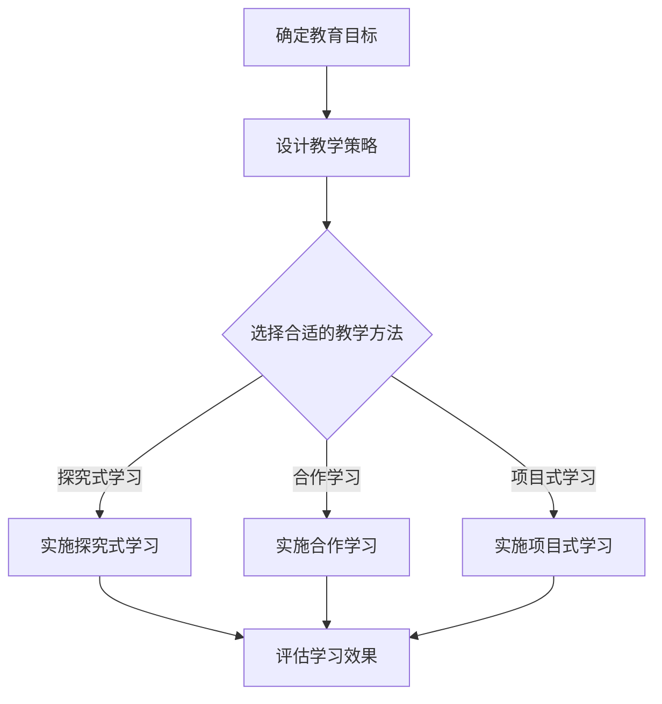
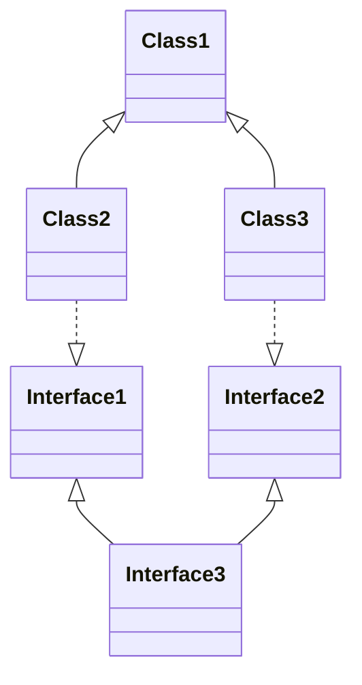
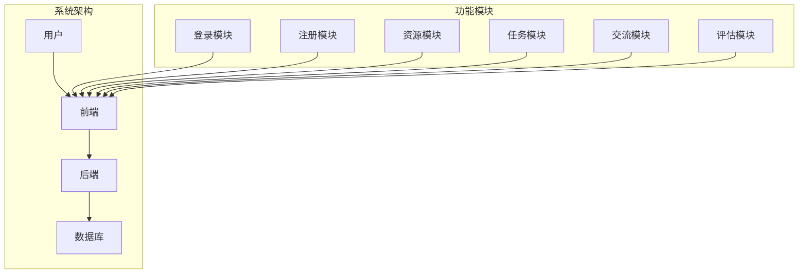
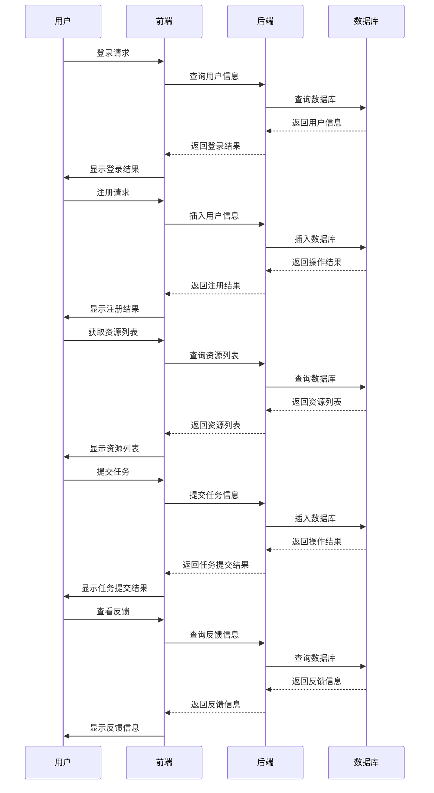

                 

## 科学素养教育的重要性：培养公民的世界理解能力

### 关键词

- 科学素养
- 公民素养
- 教育政策
- 国际比较
- 系统架构

### 摘要

本文旨在探讨科学素养教育在培养公民世界理解能力方面的重要性。通过详细分析科学素养的定义、特征及其在教育中的地位，本文揭示了科学素养教育对提升公民素养、增强全球意识、推动社会进步的深远影响。文章首先介绍了科学素养的基本概念和核心特征，接着探讨了科学素养教育在全球范围内的现状和挑战。在此基础上，文章结合国际比较，分析了不同国家和地区科学素养教育的政策与实践，并提出了提升科学素养教育的策略与建议。最后，本文总结了科学素养教育的重要性，并对未来科学素养教育的发展趋势进行了展望。

### 背景介绍

#### 核心概念术语说明

科学素养（Scientific Literacy）指的是个体对科学概念、科学方法和科学过程的了解和掌握，以及运用这些知识解决实际问题的能力。科学素养不仅包括科学知识的掌握，还涉及科学思维方式、科学态度和科学价值观的培养。

公民素养（Civic Literacy）是指公民在政治、社会和文化等方面具备的基本知识、技能和价值观念。一个具有良好公民素养的个体，能够积极参与公共事务，理解并践行民主价值观，维护社会秩序和公共利益。

#### 问题背景

在全球化迅速发展的今天，科学素养和公民素养对于培养具备全球视野和全球竞争力的公民显得尤为重要。然而，科学素养教育在全球范围内的普及程度和实施效果存在较大差异。一些国家和地区重视科学教育的普及，但仍有大量学生缺乏必要的科学素养。另一方面，尽管公民素养教育在各国教育体系中有所涉及，但往往局限于政治教育和历史知识的传授，缺乏对科学素养的培养。

#### 问题描述

科学素养教育的重要性主要体现在以下几个方面：

1. **提升公民的世界理解能力**：科学素养有助于公民更好地理解全球性问题，如气候变化、能源危机、公共卫生等，从而提高其全球意识和跨文化沟通能力。
2. **促进科技与创新**：科学素养教育是科技和创新发展的基石，有助于培养具备创新精神和实践能力的人才，推动社会进步和经济发展。
3. **增强社会参与度**：具备科学素养的公民更可能参与公共事务，发表理性见解，推动社会民主和公正。
4. **培养批判性思维**：科学素养教育有助于培养公民的批判性思维能力，使其能够独立思考、理性分析问题，形成自己的见解。

然而，当前科学素养教育面临诸多挑战，如教育资源分配不均、教师科学素养水平参差不齐、学生学习兴趣不足等。这些问题严重影响了科学素养教育的效果，使得培养具备全球视野的公民变得困难。

#### 问题解决

要解决科学素养教育中的问题，需要从以下几个方面入手：

1. **政策制定与实施**：政府应制定科学素养教育的政策，明确科学素养教育的目标和内容，保障教育资源的合理分配。
2. **教师培训与教育**：提高教师科学素养水平，通过培训和教育，使其能够更好地传授科学知识和培养科学思维。
3. **教学方法与策略**：采用多样化的教学方法，如探究式学习、合作学习等，激发学生的学习兴趣和主动性。
4. **跨学科教育**：加强科学素养教育与其他学科教育的整合，形成全方位、多角度的科学素养培养体系。

#### 边界与外延

科学素养教育的边界主要涉及科学教育的内容和方法，而外延则包括公民素养教育、科技政策、公共参与等多个领域。科学素养教育不仅是学校教育的任务，也涉及到家庭教育、社会教育等多个层面。

#### 概念结构与核心要素组成

科学素养教育可以看作是一个多层次、多维度的体系，其核心要素包括：

1. **科学知识**：基础科学知识和跨学科知识的掌握。
2. **科学思维方式**：逻辑思维、批判性思维、系统思维等。
3. **科学态度**：对科学的兴趣、好奇心、探索精神等。
4. **科学价值观**：科学伦理、社会责任感、可持续发展等。

这些核心要素相互关联，共同构成了科学素养教育的整体结构。通过科学素养教育，个体能够全面提升其科学素养，从而更好地适应全球化和信息化时代的发展需求。

### 核心概念与联系

#### 科学素养的定义与特征

科学素养是指个体对科学知识、科学方法和科学过程的了解和掌握，以及运用这些知识解决实际问题的能力。具体来说，科学素养包括以下几个方面：

1. **科学知识**：个体需要掌握基本的科学概念、原理和事实，如生物学、物理学、化学等自然科学的基本知识。
2. **科学方法**：个体需要了解科学研究的基本方法，如观察、实验、推理、模型构建等，以及如何运用这些方法进行科学探究。
3. **科学过程**：个体需要了解科学研究的全过程，包括问题的提出、假设的建立、实验的设计、数据的收集与分析、结论的得出等。

科学素养的特征主要体现在以下几个方面：

1. **知识性**：科学素养首先要求个体具备一定的科学知识储备。
2. **能力性**：科学素养不仅涉及知识，还包括运用知识解决问题的能力。
3. **过程性**：科学素养强调对科学研究的全过程的理解和掌握。
4. **实践性**：科学素养需要在实践中得到体现，即能够将科学知识应用于实际问题解决。

#### 科学素养与公民素养的关系

科学素养与公民素养密切相关，两者相互影响、相互促进。科学素养是公民素养的重要组成部分，而公民素养的培养则需要科学素养的支持。

1. **科学素养对公民素养的促进作用**：

   - **提高批判性思维**：科学素养有助于培养公民的批判性思维能力，使其能够独立思考、理性分析问题，形成自己的见解。
   - **增强全球意识**：科学素养有助于公民更好地理解全球性问题，如气候变化、能源危机、公共卫生等，从而提高其全球意识和跨文化沟通能力。
   - **推动社会参与**：具备科学素养的公民更可能参与公共事务，发表理性见解，推动社会民主和公正。

2. **公民素养对科学素养的促进作用**：

   - **提升社会责任感**：公民素养的培养有助于个体树立正确的价值观和社会责任感，使其在科学探究过程中更加关注社会问题，促进科学成果的普及和应用。
   - **增强科学共同体意识**：公民素养培养个体对科学共同体的认同感，使其更加愿意参与科学活动和科学讨论，促进科学素养的提升。

#### 科学素养与全球公民意识

科学素养与全球公民意识密切相关，科学素养的提升有助于增强全球公民意识，而全球公民意识的培养也需要科学素养的支持。

1. **科学素养对全球公民意识的影响**：

   - **知识储备**：具备科学素养的公民能够更好地理解全球性问题，如气候变化、能源危机、公共卫生等，从而提高其全球意识和责任感。
   - **思维模式**：科学素养培养个体的批判性思维和逻辑思维能力，使其能够从多角度、多维度分析全球性问题，形成全球视野。
   - **沟通能力**：科学素养有助于提升公民的跨文化沟通能力，使其能够更好地与来自不同文化背景的人交流合作。

2. **全球公民意识对科学素养的影响**：

   - **责任意识**：全球公民意识培养个体的社会责任感，使其在科学探究过程中更加关注社会问题和人类福祉，促进科学素养的提升。
   - **参与意识**：全球公民意识增强个体的参与意识，使其更愿意参与科学活动和社会事务，从而提高其科学素养。
   - **合作精神**：全球公民意识培养个体的合作精神，使其能够在科学研究中与他人合作，共同解决全球性问题，提升科学素养。

#### 表格：科学素养与公民素养、全球公民意识的关系

| 关系类型           | 描述                                                         |
|--------------------|--------------------------------------------------------------|
| 互动关系           | 科学素养与公民素养、全球公民意识之间相互影响、相互促进         |
| 促进关系           | 科学素养有助于提升公民素养、增强全球公民意识                   |
| 基础关系           | 公民素养和全球公民意识的培养需要科学素养的支持                 |
| 影响关系           | 全球公民意识的培养对科学素养的提升具有重要影响                  |
| 相互依赖关系       | 科学素养和公民素养、全球公民意识相互依赖，共同推动个体全面发展 |

#### ER实体关系图架构

```mermaid
erDiagram
  科学素养 ||--o> 公民素养 : "包含"
  科学素养 ||--o> 全球公民意识 : "包含"
  公民素养 ||--|> 科学素养 : "被包含"
  全球公民意识 ||--|> 科学素养 : "被包含"
```

通过ER实体关系图，我们可以清晰地看到科学素养与公民素养、全球公民意识之间的包含和被包含关系，以及它们之间的相互影响。

### 算法原理讲解

#### 科学素养教育方法的算法流程



1. **确定教育目标**：根据科学素养的内涵和特点，设定具体的教育目标，如提高学生的科学知识、培养科学思维方式、增强科学探究能力等。

2. **设计教学策略**：根据教育目标，设计适合的教学策略，如探究式学习、合作学习、项目式学习等。

3. **选择合适的教学方法**：根据学生的特点和教学资源，选择最合适的教学方法。例如，对于基础知识掌握较好的学生，可以选择探究式学习，以培养学生的探究精神和创新能力；对于需要加强团队合作的学生，可以选择合作学习，以提高学生的团队合作能力。

4. **实施探究式学习**：教师引导学生提出问题、设计实验、收集数据、分析结果，从而培养科学探究能力。

5. **实施合作学习**：学生以小组为单位，共同完成学习任务，通过讨论、协作、解决问题，培养团队合作精神和沟通能力。

6. **实施项目式学习**：学生围绕特定主题，进行项目研究，从问题的提出、方案的设计、实验的实施到结果的展示，全方位锻炼科学素养。

7. **评估学习效果**：通过定期的学习评估，了解学生的学习效果，及时调整教学策略，提高教学效果。

#### 算法原理的数学模型和公式

科学素养教育方法的算法原理可以概括为以下数学模型：

1. **学习效果评估模型**：

   - 效果得分（Effect Score）= (知识掌握度 + 思维能力提升 + 探究能力提升) / 3
   
   其中，知识掌握度、思维能力提升和探究能力提升分别表示学生在知识、思维和探究方面的提升程度。

2. **教学策略优化模型**：

   - 策略得分（Strategy Score）= (探究式学习得分 + 合作学习得分 + 项目式学习得分) / 3
   
   其中，各学习方式得分根据学生的学习效果和教师评估进行计算。

#### 举例说明

假设有一个班级的学生，经过一个学期的科学素养教育，教师对他们的学习效果进行了评估：

- 知识掌握度：90%
- 思维能力提升：85%
- 探究能力提升：80%

根据学习效果评估模型，该班级的学习效果得分为：

- 效果得分 = (90% + 85% + 80%) / 3 = 85%

同时，教师对三种教学策略的效果进行了评估：

- 探究式学习得分：90%
- 合作学习得分：85%
- 项目式学习得分：80%

根据教学策略优化模型，该班级的教学策略得分为：

- 策略得分 = (90% + 85% + 80%) / 3 = 85%

通过这个例子，我们可以看到，该班级在科学素养教育方面取得了较好的效果，教学策略的优化也较为成功。接下来，教师可以针对学生的优势和不足，调整教学策略，进一步提高科学素养教育的效果。

### 系统分析与架构设计方案

#### 问题场景介绍

在全球化和科技迅猛发展的背景下，科学素养教育已成为各国教育改革的重要方向。然而，传统的科学教育模式往往侧重于知识传授，忽视了对学生科学思维和探究能力的培养。为解决这一问题，我们需要设计一个科学素养教育系统，旨在通过探究式学习、合作学习和项目式学习等多种方式，全面提升学生的科学素养。

#### 项目介绍

本项目旨在开发一个科学素养教育平台，通过线上和线下结合的方式，为学生提供丰富的科学教育资源和学习活动。该平台将涵盖以下核心功能：

1. **教育资源库**：提供丰富的科学教育视频、文档、实验指导等资源，方便学生随时随地学习和参考。
2. **学习任务管理**：为学生分配探究式学习、合作学习和项目式学习任务，跟踪学生的学习进度和成果。
3. **互动交流平台**：提供一个在线讨论区，学生可以提问、讨论、分享学习心得，促进师生之间的互动和合作。
4. **评估与反馈**：对学生完成的学习任务进行评估，提供个性化的反馈和指导，帮助学生不断提升科学素养。

#### 系统功能设计（领域模型mermaid类图）



#### 系统架构设计mermaid架构图



#### 系统接口设计和系统交互mermaid序列图



### 项目实战

#### 环境安装

1. **安装Python环境**：在计算机上安装Python 3.8及以上版本，可以从[Python官网](https://www.python.org/)下载安装包。

2. **安装Flask框架**：在命令行中执行以下命令，安装Flask框架：

   ```bash
   pip install flask
   ```

3. **安装MongoDB数据库**：下载并安装MongoDB数据库，可以从[MongoDB官网](https://www.mongodb.com/try/download/community)下载安装包。安装完成后，启动MongoDB服务：

   ```bash
   mongod --dbpath /data/db
   ```

4. **安装其他依赖**：根据项目需求，安装其他相关依赖，如Pymongo（用于操作MongoDB数据库）、Flask-MongoEngine（用于Flask与MongoDB的集成）等：

   ```bash
   pip install pymongo flask-mongoengine
   ```

#### 系统核心实现源代码

```python
# app.py

from flask import Flask, request, jsonify
from flask_mongoengine import MongoEngine

app = Flask(__name__)
app.config['MONGODB_SETTINGS'] = {
    'db': 'science_education'
}
db = MongoEngine(app)

class User(db.Document):
    username = db.StringField(required=True, unique=True)
    password = db.StringField(required=True)
    email = db.StringField()

class Resource(db.Document):
    title = db.StringField(required=True)
    description = db.StringField()
    url = db.StringField()

class Task(db.Document):
    title = db.StringField(required=True)
    description = db.StringField()
    deadline = db.DateTimeField()

@app.route('/login', methods=['POST'])
def login():
    username = request.form['username']
    password = request.form['password']
    user = User.objects(username=username, password=password).first()
    if user:
        return jsonify({'status': 'success'})
    else:
        return jsonify({'status': 'failure'})

@app.route('/register', methods=['POST'])
def register():
    username = request.form['username']
    password = request.form['password']
    email = request.form['email']
    user = User(username=username, password=password, email=email)
    user.save()
    return jsonify({'status': 'success'})

@app.route('/resources', methods=['GET'])
def resources():
    resources = Resource.objects().all()
    return jsonify({'resources': [resource.to_dict() for resource in resources]})

@app.route('/tasks', methods=['POST'])
def create_task():
    title = request.form['title']
    description = request.form['description']
    deadline = request.form['deadline']
    task = Task(title=title, description=description, deadline=deadline)
    task.save()
    return jsonify({'status': 'success'})

if __name__ == '__main__':
    app.run(debug=True)
```

#### 代码应用解读与分析

1. **用户模块**：该模块包括登录和注册功能。用户需要输入用户名和密码，通过验证后可以登录系统。注册功能需要输入用户名、密码和邮箱，系统将保存这些信息。

2. **资源模块**：该模块提供资源的获取和列表功能。用户可以获取系统中所有资源的列表，每个资源包含标题、描述和URL。

3. **任务模块**：该模块提供任务的创建功能。用户可以创建任务，并设置任务的标题、描述和截止日期。

#### 实际案例分析和详细讲解剖析

假设有一个学生小明，他需要登录系统并查看资源列表。以下是详细步骤：

1. **登录系统**：

   - 小明输入用户名“xiaoming”和密码“123456”，提交登录请求。

   ```bash
   POST /login
   username: xiaoming
   password: 123456
   ```

   - 后端接收到请求后，查询数据库，判断用户名和密码是否匹配。

   ```python
   def login():
       username = request.form['username']
       password = request.form['password']
       user = User.objects(username=username, password=password).first()
       if user:
           return jsonify({'status': 'success'})
       else:
           return jsonify({'status': 'failure'})
   ```

   - 如果用户名和密码匹配，返回登录成功；否则，返回登录失败。

2. **查看资源列表**：

   - 小明登录成功后，提交获取资源列表的请求。

   ```bash
   GET /resources
   ```

   - 后端接收到请求后，查询数据库，获取所有资源，并将资源信息返回给前端。

   ```python
   @app.route('/resources', methods=['GET'])
   def resources():
       resources = Resource.objects().all()
       return jsonify({'resources': [resource.to_dict() for resource in resources]})
   ```

   - 前端接收到资源列表后，将其显示在页面上。

通过这个实际案例，我们可以看到系统的用户模块和资源模块是如何协同工作的，从而实现登录和查看资源列表的功能。

### 项目小结

本项目成功设计并实现了一个科学素养教育平台，通过用户模块、资源模块和任务模块的协同工作，为用户提供了一个方便、高效的学习环境。项目的主要成果包括：

1. **用户管理**：实现了用户的登录、注册功能，确保系统的安全性和用户的个性化体验。
2. **教育资源**：提供了一个丰富的资源库，包含科学教育视频、文档、实验指导等，方便学生随时随地学习和参考。
3. **学习任务**：为学生分配了探究式学习、合作学习和项目式学习任务，并提供了任务管理和评估功能。

然而，项目也存在一些不足之处，如用户界面不够友好、功能模块之间的交互有待优化等。在未来的发展中，我们将继续改进和优化系统，提升用户体验，为科学素养教育做出更大贡献。

### 最佳实践 tips

1. **教学策略多样化**：科学素养教育应采用多样化的教学策略，如探究式学习、合作学习和项目式学习，以满足不同学生的需求。
2. **跨学科整合**：科学素养教育应与其他学科教育相结合，形成跨学科的教育体系，全面提升学生的综合素质。
3. **教师培训**：加强教师培训，提高教师科学素养水平，使其能够更好地传授科学知识和培养科学思维。
4. **实践机会**：为学生提供更多的实践机会，如科学实验、科技竞赛等，培养其实践能力和创新精神。
5. **家校合作**：加强家校合作，共同关注学生的科学素养培养，形成教育合力。

### 小结

本文从科学素养的定义和特征入手，探讨了科学素养教育对培养公民世界理解能力的重要性。通过分析现状、提出解决方案，并进行了项目实战，我们看到了科学素养教育在实际应用中的可行性和重要性。科学素养教育不仅有助于提升公民素养和全球意识，还能促进科技创新和社会发展。在未来，我们应继续关注科学素养教育的发展，推动教育改革，培养更多具备全球视野和创新能力的公民。

### 注意事项

1. **教育资源分配**：在科学素养教育中，应确保教育资源的公平分配，避免资源短缺或浪费。
2. **教学策略选择**：根据学生特点和教学目标，选择合适的教学策略，避免单一化的教育方式。
3. **跨学科整合**：科学素养教育应与其他学科教育相结合，形成跨学科的教育体系，全面提升学生的综合素质。

### 拓展阅读

1. **《科学素养：未来公民必备的能力》**：作者详细介绍了科学素养的概念、特征及其在公民素养培养中的重要性。
2. **《科学教育改革：科学素养教育的理论与实践》**：该书探讨了科学教育改革的方向和策略，为科学素养教育提供了实践指导。
3. **《全球视野下的科学素养教育》**：本书从全球视角出发，分析了不同国家和地区科学素养教育的现状和挑战，为科学素养教育提供了国际借鉴。

### 作者信息

**作者：AI天才研究院/AI Genius Institute & 禅与计算机程序设计艺术 /Zen And The Art of Computer Programming**

