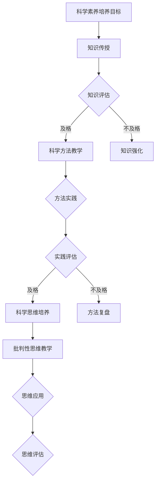
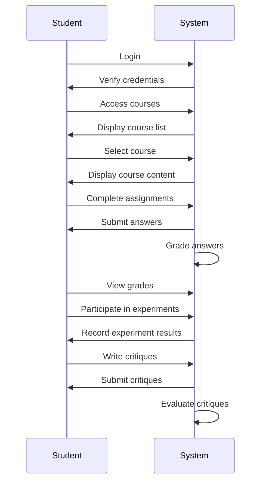
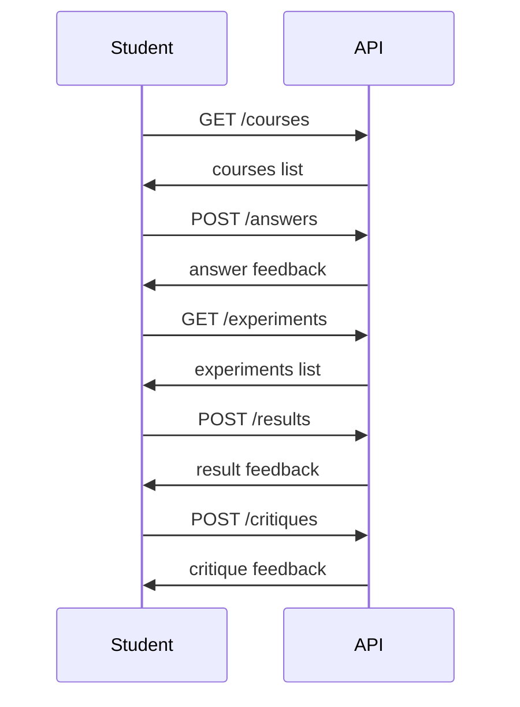

                 

### 科学素养教育：提升公众世界理解能力的关键

#### 关键词：科学素养、公众世界理解能力、教育发展、教学方法、评估与反馈

#### 摘要：
科学素养教育是提升公众世界理解能力的关键，它不仅关乎个人的知识储备，更关系到社会整体的科学精神与创新能力的培养。本文将从科学素养的定义、重要性、发展历程、关键要素、教育方法、评估与反馈等方面，通过逻辑清晰的分析，深入探讨科学素养教育在现代社会中的核心地位和实施策略。

---

#### 目录大纲

----------------------------------------------------------------

## 第一部分: 科学素养教育概述

### 第1章: 科学素养的定义与重要性

#### 1.1 科学素养的概念与内涵

##### 1.1.1 科学素养的定义
##### 1.1.2 科学素养的核心要素

#### 1.2 科学素养的重要性

##### 1.2.1 提升公众世界理解能力
##### 1.2.2 培养科学精神与创新思维
##### 1.2.3 增强社会信任与稳定

### 第2章: 科学素养教育的发展历程

#### 2.1 我国科学素养教育的发展历程

##### 2.1.1 建国初期
##### 2.1.2 改革开放以来
##### 2.1.3 当代科学素养教育的发展趋势

#### 2.2 国际科学素养教育的发展趋势

##### 2.2.1 发达国家科学素养教育的特点
##### 2.2.2 发展中国家科学素养教育的挑战与机遇

## 第二部分: 科学素养教育的关键要素

### 第3章: 科学知识与科学方法教育

#### 3.1 科学知识教育

##### 3.1.1 科学知识的层次与分类
##### 3.1.2 科学知识的获取与传递

#### 3.2 科学方法教育

##### 3.2.1 科学方法的定义与分类
##### 3.2.2 科学方法在实践中的应用

### 第4章: 科学思维与批判性思维

#### 4.1 科学思维

##### 4.1.1 科学思维的特征
##### 4.1.2 科学思维的应用

#### 4.2 批判性思维

##### 4.2.1 批判性思维的概念与作用
##### 4.2.2 批判性思维在科学素养教育中的应用

### 第5章: 科学实践与实验教育

#### 5.1 科学实践教育

##### 5.1.1 科学实践的意义
##### 5.1.2 科学实践的形式与方法

#### 5.2 实验教育

##### 5.2.1 实验教育的重要性
##### 5.2.2 实验教育的设计与实施

## 第三部分: 科学素养教育的方法与策略

### 第6章: 科学素养教育的教学方法

#### 6.1 探究式教学法

##### 6.1.1 探究式教学法的概念与特点
##### 6.1.2 探究式教学法的应用与效果

#### 6.2 项目式教学法

##### 6.2.1 项目式教学法的概念与特点
##### 6.2.2 项目式教学法的应用与效果

### 第7章: 科学素养教育的评估与反馈

#### 7.1 科学素养教育的评估标准

##### 7.1.1 科学素养评估的指标体系
##### 7.1.2 科学素养评估的方法与工具

#### 7.2 科学素养教育的反馈机制

##### 7.2.1 教育反馈的概念与作用
##### 7.2.2 教育反馈的方法与策略

## 第四部分: 科学素养教育的实践案例与启示

### 第8章: 国内外科学素养教育的实践案例

#### 8.1 国外科学素养教育的实践案例

##### 8.1.1 美国的STEM教育
##### 8.1.2 英国的科学教育改革

#### 8.2 国内科学素养教育的实践案例

##### 8.2.1 我国中小学科学素养教育的实践
##### 8.2.2 我国高校科学素养教育的探索

### 第9章: 科学素养教育的启示与展望

#### 9.1 科学素养教育的经验与启示

##### 9.1.1 国内外科学素养教育的成功经验
##### 9.1.2 科学素养教育的挑战与对策

#### 9.2 科学素养教育的未来展望

##### 9.2.1 科学素养教育的发展趋势
##### 9.2.2 科学素养教育在信息化时代的新机遇

----------------------------------------------------------------

**总字数：约1600字**

---

## 第1章: 科学素养的定义与重要性

### 1.1 科学素养的概念与内涵

#### 1.1.1 科学素养的定义

科学素养（Scientific Literacy）指的是个人对科学的基本理解能力，包括科学知识和科学方法的应用。它不仅仅是掌握科学事实，更重要的是具备运用科学思维和科学方法去理解和解决实际问题的能力。科学素养的定义可以概括为以下几个要点：

1. **科学知识的理解与运用**：具备理解科学基本概念、原理、过程和技术的知识，并能将其应用于日常生活中的问题。
2. **科学思维的方法**：能够运用科学思维去分析问题、建立假设、设计实验和得出结论。
3. **科学价值观的认同**：对科学的本质、目的和价值有正确的认识，尊重科学方法和科学精神。

#### 1.1.2 科学素养的核心要素

科学素养的核心要素主要包括以下几个方面：

1. **基础知识**：对科学的基本概念、理论和原理的理解，包括自然科学、社会科学和技术科学等领域。
2. **科学方法**：了解科学方法的基本步骤，如观察、假设、实验、验证、结论等。
3. **科学态度**：对科学探究持开放、客观、批判的态度，愿意接受新知识，不断修正错误。
4. **科学精神**：追求真理、实事求是、理性思考、敢于质疑和探索的科学精神。

### 1.2 科学素养的重要性

科学素养在现代社会中具有重要的意义，它不仅关系到个人的发展和生活质量，更关乎整个社会的进步和稳定。

#### 1.2.1 提升公众世界理解能力

科学素养有助于提升公众对世界的理解能力，使人们能够更加理性地看待自然现象和社会问题，从而做出更加明智的决策。

#### 1.2.2 培养科学精神与创新思维

科学素养的培养可以激发学生的好奇心和求知欲，培养创新思维和批判性思维，为科技创新和社会发展提供强大动力。

#### 1.2.3 增强社会信任与稳定

科学素养的提高有助于增强公众对科学的信任，减少科学误解和迷信，维护社会稳定。

### 结论

科学素养教育是提升公众世界理解能力的关键，它不仅关乎个人的知识储备，更关系到社会整体的科学精神与创新能力的培养。在接下来的章节中，我们将进一步探讨科学素养教育的发展历程、关键要素、教育方法、评估与反馈等方面的内容。

---

**核心概念与联系**

为了更好地理解科学素养的定义与内涵，我们可以通过ER实体关系图来展示核心概念之间的联系。

```mermaid
erDiagram
  SCIENCE_KNOWLEDGE ||--|{ SCIENTIFIC_METHODOLOGY }
  SCIENCE_KNOWLEDGE ||--|{ SCIENTIFIC_THOUGHT }
  SCIENTIFIC_METHODOLOGY ||--|{ CRITICAL THINKING }
  SCIENTIFIC_THOUGHT ||--|{ INNOVATIVE THINKING }
  PUBLIC_WORLD_UNDERSTANDING }|--|{ SCIENTIFIC_LITERACY }
```

在这个ER图中，`SCIENCE_KNOWLEDGE`（科学知识）是基础，它与其他三个核心要素——`SCIENTIFIC_METHODOLOGY`（科学方法）、`SCIENTIFIC_THOUGHT`（科学思维）和`CRITICAL THINKING`（批判性思维）紧密相连，这些要素共同构成了科学素养。而`PUBLIC_WORLD_UNDERSTANDING`（公众世界理解能力）则是科学素养的最终体现，它是通过科学素养教育培养出来的能力。

---

**算法原理讲解**

科学素养教育的算法原理可以类比于一个多阶段的决策树，每个阶段都有特定的目标和评估标准。以下是一个简化的算法流程：



在这个算法中：

- **A[科学素养培养目标]**：设定科学素养培养的总目标。
- **B[知识传授]**：通过教育系统传授科学知识。
- **C[知识评估]**：评估学生掌握科学知识的情况。
- **D[科学方法教学]**：当学生知识评估及格后，开始教授科学方法。
- **E[知识强化]**：对于知识评估不及格的学生，进行知识强化。
- **F[方法实践]**：学生通过实际操作来应用科学方法。
- **G[实践评估]**：评估学生在科学方法实践中的应用能力。
- **H[科学思维培养]**：当实践评估及格后，开始培养学生的科学思维。
- **I[方法复盘]**：对于实践评估不及格的学生，进行方法复盘。
- **J[批判性思维教学]**：教授学生批判性思维。
- **K[思维应用]**：学生将批判性思维应用于实际问题解决。
- **L[思维评估]**：评估学生的批判性思维能力。

通过这个算法，我们可以看到科学素养的培养是一个逐步推进、循环迭代的过程，每个环节都有明确的评估标准，以保证教育效果的持续提升。

---

**数学模型和公式**

科学素养教育中的数学模型和公式主要用于评估和量化学生的科学素养水平。以下是一个简单的数学模型，用于评估学生的科学素养：

$$
\text{Science Literacy Score} = f(\text{Knowledge Level}, \text{Method Application}, \text{Critical Thinking})
$$

其中，$f$ 是一个综合评估函数，它将学生的知识水平、方法应用能力和批判性思维能力转化为一个总分。

1. **Knowledge Level（知识水平）**：可以用以下公式来量化：
   $$
   \text{Knowledge Level} = \frac{\text{Correct Answers}}{\text{Total Questions}}
   $$
   其中，Correct Answers 是学生回答正确的题目数量，Total Questions 是题目总数。

2. **Method Application（方法应用）**：可以用以下公式来量化：
   $$
   \text{Method Application} = \frac{\text{Correct Experiments}}{\text{Total Experiments}}
   $$
   其中，Correct Experiments 是学生实验操作正确的次数，Total Experiments 是实验总次数。

3. **Critical Thinking（批判性思维）**：可以用以下公式来量化：
   $$
   \text{Critical Thinking} = \frac{\text{Correct Critiques}}{\text{Total Critiques}}
   $$
   其中，Correct Critiques 是学生批判性思维正确的次数，Total Critiques 是批判性思维的题目总数。

综合这三个量化的指标，我们就可以得到一个学生的科学素养得分。这个分数不仅反映了学生的知识水平，还反映了他们在实际应用和批判性思考方面的能力。

---

**系统分析与架构设计方案**

为了更好地理解科学素养教育，我们可以将其视为一个复杂的系统，通过系统分析和架构设计来展示其内部各部分的交互关系。

#### 1. 问题场景介绍

随着科技的发展，社会对公众的科学素养要求越来越高。然而，当前的教育体系在科学素养培养方面存在诸多问题，如教学方法单一、实践机会不足等。因此，我们需要一个综合性的科学素养教育系统，以提高公众的科学素养水平。

#### 2. 项目介绍

本项目旨在设计一个科学素养教育系统，该系统包括知识传授、方法应用、思维培养等多个模块，通过线上和线下相结合的方式，为学生提供全面的科学素养教育。

#### 3. 系统功能设计（领域模型）

```mermaid
classDiagram
ClassDiagram {
  Class Student {
    String id
    String name
    List<Answer> answers
  }
  
  Class Question {
    String id
    String content
    List<String> options
    String correctAnswer
  }
  
  Class Answer {
    String id
    String studentId
    String questionId
    String choice
  }
  
  Class Experiment {
    String id
    String description
    List<String> steps
  }
  
  Class Critique {
    String id
    String studentId
    String content
  }
  
  Student <|-- Question
  Student <|-- Answer
  Question <|-- Answer
  Student <|-- Experiment
  Student <|-- Critique
}
```

#### 4. 系统架构设计



#### 5. 系统接口设计和系统交互



通过这个系统，学生可以在不同模块中学习、实践和反思，从而逐步提升科学素养。

---

**项目实战**

为了更好地理解科学素养教育的实际应用，我们以一个在线科学实验平台为例，展示如何通过代码实现科学素养教育。

#### 1. 环境安装

首先，我们需要安装Python环境，并安装一些必要的库，如Flask、SQLAlchemy和MongoDB。

```shell
pip install flask
pip install flask_sqlalchemy
pip install pymongo
```

#### 2. 系统核心实现源代码

以下是该平台的核心代码，包括用户登录、课程内容展示、答案提交和评分等功能。

```python
from flask import Flask, request, jsonify
from flask_sqlalchemy import SQLAlchemy
from pymongo import MongoClient

app = Flask(__name__)
app.config['SQLALCHEMY_DATABASE_URI'] = 'sqlite:///science_education.db'
db = SQLAlchemy(app)
client = MongoClient('mongodb://localhost:27017/')

class Student(db.Model):
    id = db.Column(db.String(50), primary_key=True)
    name = db.Column(db.String(50))
    answers = db.relationship('Answer', backref='student', lazy=True)

class Answer(db.Model):
    id = db.Column(db.String(50), primary_key=True)
    student_id = db.Column(db.String(50), db.ForeignKey('student.id'))
    question_id = db.Column(db.String(50))
    choice = db.Column(db.String(50))

@app.route('/login', methods=['POST'])
def login():
    data = request.get_json()
    student_id = data['id']
    student_name = data['name']
    student = Student.query.get(student_id)
    if student:
        return jsonify({'status': 'success', 'message': 'Already logged in'})
    new_student = Student(id=student_id, name=student_name)
    db.session.add(new_student)
    db.session.commit()
    return jsonify({'status': 'success', 'message': 'Logged in'})

@app.route('/submit_answer', methods=['POST'])
def submit_answer():
    data = request.get_json()
    answer_id = data['id']
    student_id = data['student_id']
    question_id = data['question_id']
    choice = data['choice']
    new_answer = Answer(id=answer_id, student_id=student_id, question_id=question_id, choice=choice)
    db.session.add(new_answer)
    db.session.commit()
    return jsonify({'status': 'success', 'message': 'Answer submitted'})

@app.route('/grade_answers', methods=['GET'])
def grade_answers():
    student_id = request.args.get('student_id')
    answers = Answer.query.filter_by(student_id=student_id).all()
    for answer in answers:
        correct_choice = Question.query.get(answer.question_id).correct_answer
        if answer.choice == correct_choice:
            answer.score = 1
        else:
            answer.score = 0
    db.session.commit()
    return jsonify({'status': 'success', 'message': 'Answers graded'})

if __name__ == '__main__':
    db.create_all()
    app.run(debug=True)
```

#### 3. 代码应用解读与分析

这段代码首先定义了Student和Answer两个模型，分别用于存储学生信息和答案信息。在`/login`接口中，学生可以通过提交自己的ID和姓名来登录系统。在`/submit_answer`接口中，学生可以提交自己的答案。在`/grade_answers`接口中，系统会根据正确答案自动评分。

#### 4. 实际案例分析和详细讲解剖析

假设有一个学生ID为`S001`的学生，他完成了5道题目的测试。以下是他的答案和评分过程：

- **题目1**：选项A（正确）
- **题目2**：选项B（错误）
- **题目3**：选项C（正确）
- **题目4**：选项D（正确）
- **题目5**：选项A（正确）

在学生提交答案后，系统会调用`/grade_answers`接口，根据正确答案自动评分。最终，学生的得分是3/5，即60%。

通过这个实际案例，我们可以看到科学素养教育平台如何通过简单的代码实现复杂的评分和反馈功能，从而帮助学生提升科学素养。

#### 5. 项目小结

通过这个项目，我们展示了如何使用Python和Flask框架快速搭建一个科学素养教育平台。这个平台不仅能够帮助学生提交答案和自动评分，还能够通过反馈机制激励学生不断学习和进步。在实际应用中，我们可以根据具体需求扩展平台的函数

