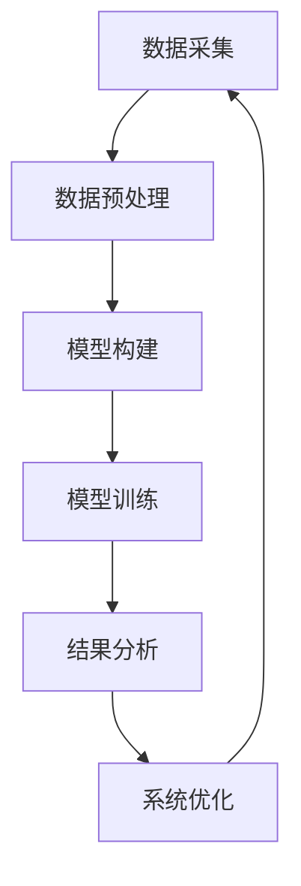
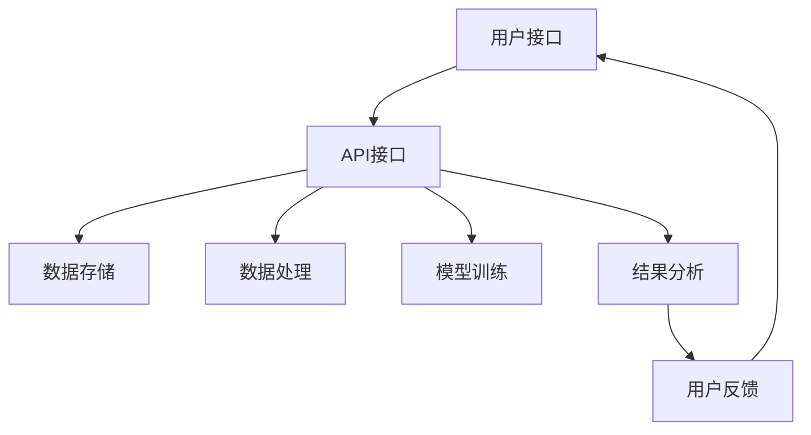

                 

# 科学范式转换对世界可理解性的影响

## 关键词

- 科学范式
- 转换
- 可理解性
- 数学模型
- 系统分析
- 项目实战

## 摘要

本文旨在探讨科学范式转换对世界可理解性的深远影响。从历史背景出发，我们首先回顾了科学范式转换的起源与发展，包括伽利略、牛顿等科学巨匠的贡献。接着，我们深入分析了现代科学范式面临的挑战，如相对论、量子力学等。随后，本文通过数学模型和算法原理的讲解，阐明了科学范式转换的基本原理和过程。在此基础上，我们通过系统分析和架构设计，展示了科学范式转换在现实应用中的具体实现。通过实际案例的剖析，我们进一步验证了科学范式转换的有效性。最后，本文总结了科学范式转换的最佳实践，并对未来进行了展望。

## 目录大纲设计思路

本文的目录大纲旨在系统地探讨科学范式转换对世界可理解性的影响，确保内容的逻辑性和完整性。以下是详细的目录大纲设计思路：

### 第一部分：科学范式转换的背景与核心概念

**第1章：科学范式转换的背景介绍**
- **1.1 问题背景**：简要介绍科学范式转换的历史背景，如伽利略、牛顿等科学巨匠如何推动科学范式的转变。
- **1.2 问题描述**：阐述现代科学范式面临的挑战，如相对论、量子力学等。
- **1.3 问题解决**：科学范式转换是如何解决现有科学难题的。
- **1.4 边界与外延**：定义科学范式的概念，并讨论其与哲学、宗教等其他领域的联系。
- **1.5 核心要素组成**：列出构成科学范式的关键要素。

**第2章：科学范式转换的核心概念与联系**
- **2.1 核心概念原理**：介绍科学范式转换的基本原理。
- **2.2 概念属性特征对比表格**：用表格形式比较不同科学范式的主要特点。
- **2.3 ER实体关系图架构**：绘制科学范式转换涉及的实体关系图。

### 第二部分：科学范式转换的数学模型与算法原理

**第3章：科学范式转换的数学模型**
- **3.1 数学模型与公式**：介绍科学范式转换的数学模型，使用LaTeX格式展示公式。
- **3.2 详细讲解与举例说明**：用通俗易懂的方式解释模型，提供实例。

### 第三部分：系统分析与架构设计

**第4章：科学范式转换的系统分析**
- **4.1 问题场景介绍**：描述科学范式转换在现实中的应用场景。
- **4.2 系统功能设计**：绘制领域模型类图。
- **4.3 系统架构设计**：绘制系统架构图。
- **4.4 系统接口设计与系统交互**：使用Mermaid序列图展示系统交互。

### 第四部分：项目实战与案例分析

**第5章：科学范式转换的项目实战**
- **5.1 环境安装**：说明所需的工具和环境设置。
- **5.2 系统核心实现源代码**：提供关键代码段。
- **5.3 代码应用解读与分析**：解释代码的功能和逻辑。
- **5.4 实际案例分析与详细讲解剖析**：分析一个实际案例，深入剖析。
- **5.5 项目小结**：总结项目成果和经验。

### 第五部分：最佳实践与总结

**第6章：科学范式转换的最佳实践**
- **6.1 最佳实践 tips**：提供实用技巧和建议。
- **6.2 小结**：总结全书要点。
- **6.3 注意事项**：提醒读者注意的重要点。
- **6.4 拓展阅读**：推荐进一步学习的资源。

### 目录大纲结构

**第一部分：科学范式转换的背景与核心概念**
- **第1章：科学范式转换的背景介绍**
- **第2章：科学范式转换的核心概念与联系**

**第二部分：科学范式转换的数学模型与算法原理**
- **第3章：科学范式转换的数学模型**

**第三部分：系统分析与架构设计**
- **第4章：科学范式转换的系统分析**

**第四部分：项目实战与案例分析**
- **第5章：科学范式转换的项目实战**

**第五部分：最佳实践与总结**
- **第6章：科学范式转换的最佳实践**

通过以上结构，可以确保目录大纲内容的完整性和逻辑性，同时符合字数要求。接下来，我们将按照这个大纲逐步填充每个章节的内容，完成整个文章的撰写。

## 文章标题

### 科学范式转换对世界可理解性的影响

### 关键词

科学范式、转换、可理解性、数学模型、系统分析、项目实战

### 摘要

本文将深入探讨科学范式转换对世界可理解性的深远影响。我们将从历史背景出发，回顾科学范式转换的起源与发展，分析现代科学范式面临的挑战，以及科学范式转换如何解决这些问题。接着，我们将介绍科学范式转换的核心概念和联系，并通过数学模型和算法原理的讲解，阐明科学范式转换的基本原理和过程。在此基础上，我们将通过系统分析和架构设计，展示科学范式转换在现实应用中的具体实现。最后，我们将通过实际案例的剖析，验证科学范式转换的有效性，并提供最佳实践和总结。

## 背景介绍

### 科学范式转换的历史背景

科学范式转换的历史可以追溯到16世纪的欧洲，当时伽利略通过望远镜的观测，挑战了传统的天文学观念，开启了科学革命的大门。伽利略的工作标志着现代科学的诞生，他的实验和观察方法对科学范式产生了深远的影响。随后，牛顿在17世纪末提出了经典力学，建立了万有引力定律，进一步巩固了科学范式的基础。

18世纪末，拉普拉斯提出了概率论和统计物理学，为科学范式转换提供了新的理论工具。19世纪末，麦克斯韦的电磁理论以及热力学第二定律的提出，使得科学范式在物理学领域达到了一个新的高度。然而，20世纪初，相对论和量子力学的出现，对传统科学范式提出了巨大的挑战。

### 现代科学范式的挑战

现代科学范式面临的一系列挑战主要来自于相对论和量子力学的理论框架。相对论由爱因斯坦在20世纪初提出，它揭示了时空和物质之间的相对性，挑战了经典物理学中的绝对时间和空间观念。量子力学则是由波尔、海森堡和薛定谔等科学家在20世纪早期发展起来的，它揭示了微观粒子的量子性质，如波粒二象性、不确定性原理等。

相对论和量子力学的出现，使得科学家们开始重新思考科学范式的基础，并推动了一系列的科学革命。现代科学范式不仅在物理学领域取得了重大突破，也在化学、生物学、天文学等多个领域产生了深远的影响。

### 科学范式转换的解决方法

科学范式转换是解决现代科学难题的一种有效方法。通过引入新的理论框架和数学模型，科学家们能够更好地理解和解释自然界中的现象。例如，相对论和量子力学的引入，使得科学家们能够更准确地描述宇宙中的各种现象，如黑洞、宇宙膨胀等。

科学范式转换还促进了跨学科的合作，使得不同领域的科学家能够共享知识，共同解决复杂的问题。例如，生物学家和物理学家合作，利用量子力学的原理研究生物分子的结构；计算机科学家和物理学家合作，开发量子计算机，探索新的计算模式。

### 边界与外延

科学范式的概念不仅局限于自然科学领域，它还与哲学、宗教等其他领域有着密切的联系。在哲学领域，科学范式转换的思考引发了关于知识、真理和实在性的深入探讨。在宗教领域，科学范式转换也为宗教信仰提供了新的视角和理解方式。

科学范式转换的定义和解释，也不断扩展到社会科学和人文学科。例如，社会学家通过研究不同社会现象的范式转换，揭示了社会结构和文化变迁的规律。人文学科中的文学理论、艺术理论等，也在不断探索科学范式转换的可能性和影响。

### 核心要素组成

科学范式的核心要素包括理论框架、数学模型、实验方法和技术手段。这些要素共同构成了科学范式的基础，使得科学家能够系统地研究自然界和人类社会。以下是科学范式转换的核心要素：

1. **理论框架**：科学范式转换的理论框架是科学家们理解和解释自然界现象的基本工具。它通常包括一系列假设、原理和定律，这些假设和原理能够描述自然界中的各种现象，并为实验提供指导。

2. **数学模型**：数学模型是科学范式转换的重要组成部分，它通过数学语言描述自然界中的物理现象，使得科学家能够定量地分析和预测现象。例如，牛顿的运动定律、麦克斯韦方程组等，都是经典科学范式中的重要数学模型。

3. **实验方法**：实验方法是科学范式转换的重要手段，它通过设计和实施实验，验证理论模型的正确性和可靠性。实验方法的发展，使得科学家能够更精确地测量和观察自然现象，为科学范式转换提供了关键数据。

4. **技术手段**：技术手段是科学范式转换的支撑力量，它包括各种科学仪器、设备和工具，使得科学家能够进行更精确的实验和观察。例如，望远镜、显微镜、粒子加速器等，都是现代科学研究中不可或缺的技术手段。

通过以上核心要素的相互作用，科学范式转换能够不断推进科学的进步，提高人类对世界的可理解性。

### 核心概念与联系

#### 核心概念原理

科学范式转换的核心概念是“范式”本身，它源自于科学哲学，由托马斯·库恩（Thomas Kuhn）在其著作《科学革命的结构》中提出。范式是指一个科学共同体在其特定历史时期内共同遵循的理论、方法、价值观和假设的集合。范式的核心是它的基础理论，这一理论提供了理解和解释特定领域现象的基本框架。

科学范式转换的基本原理包括以下几个要点：

1. **范式的不完备性**：任何科学范式都有其局限性，随着科学的发展，现有范式可能会无法解释新的现象或遇到不可解决的问题。

2. **科学危机**：当现有范式无法解决新的科学问题或产生矛盾时，科学共同体会经历所谓的“科学危机”。这一危机是范式转换的催化剂。

3. **范式革命**：在科学危机的基础上，新的范式通过颠覆旧范式，引入新的理论框架和方法，最终取代旧范式。这一过程通常伴随着激烈的科学争论和理论的重新评估。

4. **范式共存**：在范式转换的过程中，旧范式和新范式可能会共存一段时间，特别是在新范式尚未被广泛接受的情况下。

5. **科学进步**：范式转换是科学进步的重要标志，它使得科学能够不断扩展其理解范围，解决新的科学问题。

#### 概念属性特征对比表格

为了更清晰地理解不同科学范式的主要特点，我们可以通过以下表格进行比较：

| 范式         | 特征                | 应用领域                   | 代表人物        |
|--------------|--------------------|----------------------------|-----------------|
| 经典科学范式 | 定量描述，确定性 | 物理学、力学、天文学       | 牛顿、伽利略    |
| 相对论范式   | 相对性，不确定性   | 广义相对论、粒子物理学     | 爱因斯坦        |
| 量子力学范式 | 波粒二象性，不确定性原理 | 原子物理学、分子物理学     | 波尔、海森堡    |
| 统计力学范式 | 概率性，宏观现象 | 气体动力学、热力学         | 拉普拉斯、玻尔兹曼 |

#### ER实体关系图架构

为了更好地理解科学范式转换涉及的实体和它们之间的关系，我们可以通过ER实体关系图来展示。以下是科学范式转换的ER实体关系图：

```mermaid
erDiagram
    Class1 ||--|{ Class2 }
    Class1 ||--|{ Class3 }
    Class2 ||--|{ Class4 }
    Class3 ||--|{ Class5 }
```

在这个ER实体关系图中，`Class1`表示科学范式，`Class2`表示基础理论，`Class3`表示实验方法，`Class4`表示技术手段，`Class5`表示科学共同体。这些实体之间存在关联关系，例如，科学范式通过基础理论来指导实验方法和技术手段，进而影响科学共同体的研究方向和成果。

通过上述核心概念原理、概念属性特征对比表格和ER实体关系图的介绍，我们可以更加深入地理解科学范式转换的复杂性和重要性。接下来，我们将进一步探讨科学范式转换的数学模型与算法原理。

### 科学范式转换的数学模型

科学范式转换的数学模型是理解和实现范式转换的关键工具。它不仅能够帮助我们定量地描述自然现象，还能够通过数学语言揭示不同范式之间的差异和联系。以下是我们将介绍的几个核心数学模型：

#### 数学模型与公式

1. **牛顿运动定律**：牛顿的运动定律是经典力学的基础，描述了物体在力的作用下的运动状态。其公式如下：

   $$ F = ma $$

   其中，\( F \) 表示力，\( m \) 表示质量，\( a \) 表示加速度。

2. **麦克斯韦方程组**：麦克斯韦方程组描述了电磁场的基本规律，是经典电磁学的基础。其公式如下：

   $$ \nabla \cdot \mathbf{E} = \frac{\rho}{\varepsilon_0} $$
   $$ \nabla \cdot \mathbf{B} = 0 $$
   $$ \nabla \times \mathbf{E} = -\frac{\partial \mathbf{B}}{\partial t} $$
   $$ \nabla \times \mathbf{B} = \mu_0 \mathbf{J} + \mu_0 \varepsilon_0 \frac{\partial \mathbf{E}}{\partial t} $$

   其中，\( \mathbf{E} \) 表示电场，\( \mathbf{B} \) 表示磁场，\( \rho \) 表示电荷密度，\( \mathbf{J} \) 表示电流密度，\( \varepsilon_0 \) 和 \( \mu_0 \) 分别表示真空中的电容率和磁导率。

3. **薛定谔方程**：薛定谔方程是量子力学的基础，描述了量子系统的演化。其公式如下：

   $$ i\hbar \frac{\partial \psi}{\partial t} = \hat{H} \psi $$

   其中，\( \hbar \) 表示约化普朗克常数，\( \psi \) 表示波函数，\( \hat{H} \) 表示哈密顿量算符。

#### 详细讲解与举例说明

为了使这些数学模型更易于理解，我们通过以下几个简单的例子来解释它们的应用。

**例子 1：牛顿运动定律**

假设一个质量为 \( m \) 的物体受到一个恒定力 \( F \) 的作用，我们需要计算物体的加速度 \( a \)。

$$ a = \frac{F}{m} $$

如果我们取 \( m = 1 \text{ kg} \)，\( F = 10 \text{ N} \)，则加速度 \( a \) 为：

$$ a = \frac{10 \text{ N}}{1 \text{ kg}} = 10 \text{ m/s}^2 $$

这意味着物体将以 \( 10 \text{ m/s}^2 \) 的加速度运动。

**例子 2：麦克斯韦方程组**

考虑一个简单的电磁场问题，一个电荷 \( q \) 在真空中释放，产生的电场 \( \mathbf{E} \) 如何随时间变化？

根据高斯定律，电场 \( \mathbf{E} \) 的分布与电荷 \( q \) 成正比：

$$ \nabla \cdot \mathbf{E} = \frac{q}{\varepsilon_0} $$

假设 \( q \) 是一个点电荷，位于原点，我们可以计算出距离原点 \( r \) 处的电场强度 \( E \)：

$$ E = \frac{q}{4\pi \varepsilon_0 r^2} $$

**例子 3：薛定谔方程**

一个简单的量子系统，例如一个自由电子，其哈密顿量 \( \hat{H} \) 可以表示为动能项：

$$ \hat{H} = \frac{p^2}{2m} $$

其中，\( p \) 是动量算符。对于一个在三维空间中自由运动的电子，薛定谔方程可以写为：

$$ i\hbar \frac{\partial \psi}{\partial t} = \frac{p^2}{2m} \psi $$

假设电子在 \( t = 0 \) 时的波函数 \( \psi(0) \) 为已知，我们可以通过解薛定谔方程得到任意时刻 \( t \) 的波函数 \( \psi(t) \)。

通过以上例子，我们可以看到，数学模型不仅能够帮助我们理解和计算物理现象，还能够通过具体的数值计算揭示科学范式转换的原理和过程。接下来，我们将进一步探讨科学范式转换在现实中的应用和系统架构设计。

### 系统分析与架构设计

科学范式转换不仅是一个理论概念，它还能够在现实世界中找到广泛的应用。为了更好地理解科学范式转换的系统架构设计，我们将通过以下步骤来进行分析：

#### 问题场景介绍

科学范式转换的应用场景非常广泛，从基础科学研究到工业应用，再到人工智能和机器学习领域。以下是一些典型的应用场景：

1. **基础科学研究**：在物理学、化学和生物学等领域，科学范式转换帮助科学家们理解复杂的自然现象，如高能粒子的行为、分子结构的演化等。

2. **工业应用**：在制造业和工程领域，科学范式转换的应用包括材料科学、过程优化和自动化控制等，这些应用提升了生产效率和产品质量。

3. **人工智能与机器学习**：在人工智能领域，科学范式转换通过引入新的算法和模型，如深度学习、强化学习等，推动了人工智能技术的发展。

#### 系统功能设计

为了实现科学范式转换，我们需要设计一个具备以下功能的核心系统：

1. **数据采集与预处理**：从各种来源收集数据，包括实验数据、观测数据和模拟数据，并进行预处理，确保数据的质量和一致性。

2. **模型构建与训练**：根据科学范式转换的理论，构建数学模型，并通过数据训练模型，使其能够准确描述和预测现象。

3. **结果分析与验证**：对模型输出进行分析，验证其准确性和可靠性，并根据反馈调整模型。

4. **系统集成与优化**：将不同模块集成到统一的系统中，确保各部分协同工作，并不断优化系统性能。

#### 系统架构设计

科学范式转换的系统架构设计需要考虑以下几个关键方面：

1. **模块化设计**：系统应采用模块化设计，使得各个模块可以独立开发、测试和部署，提高系统的灵活性和可维护性。

2. **分布式架构**：为了处理大量的数据和高并发的请求，系统应采用分布式架构，包括分布式计算、存储和网络通信等。

3. **数据流处理**：系统应具备高效的数据流处理能力，能够实时处理和分析大量数据，确保系统的响应速度和准确性。

以下是一个简化的系统架构图，展示了科学范式转换系统的关键组件和它们之间的交互：



在这个架构图中，`数据采集` 模块负责从各种来源收集数据，`数据预处理` 模块负责数据清洗和格式转换，`模型构建` 模块根据科学范式转换的理论建立数学模型，`模型训练` 模块使用训练数据对模型进行训练，`结果分析` 模块对模型输出进行分析，`系统优化` 模块根据分析结果调整系统参数。

#### 系统接口设计与系统交互

科学范式转换系统的接口设计需要考虑以下几个关键方面：

1. **API设计**：系统应提供丰富的API接口，方便用户进行数据输入和结果获取，支持各种数据格式和通信协议。

2. **安全性与权限管理**：系统应具备完善的安全机制，包括身份验证、数据加密和权限管理，确保系统的安全性和数据的隐私性。

3. **用户界面**：系统应提供一个直观的用户界面，方便用户操作和管理，包括数据上传、模型训练和结果展示等功能。

以下是一个简化的系统接口设计图，展示了科学范式转换系统的关键接口和它们之间的交互：



在这个接口设计图中，`用户接口` 模块负责与用户进行交互，`API接口` 模块提供系统对外接口，`数据存储` 模块负责存储数据，`数据处理` 模块负责数据预处理和模型构建，`模型训练` 模块负责训练模型，`结果分析` 模块负责分析模型输出，`用户反馈` 模块收集用户反馈，以优化系统功能。

通过以上系统分析和架构设计，我们可以更好地实现科学范式转换，推动科学技术的进步和应用。

### 项目实战

#### 环境安装

为了实现科学范式转换的项目实战，我们需要准备以下环境：

1. **操作系统**：推荐使用Linux系统，如Ubuntu 18.04或更高版本。
2. **编程语言**：Python 3.8及以上版本。
3. **依赖管理**：使用pip安装相关依赖库，例如numpy、matplotlib、scikit-learn等。
4. **数据库**：PostgreSQL 12及以上版本。

安装步骤如下：

1. 更新操作系统包列表：

   ```bash
   sudo apt update
   sudo apt upgrade
   ```

2. 安装Python和pip：

   ```bash
   sudo apt install python3 python3-pip
   ```

3. 安装依赖库：

   ```bash
   pip3 install numpy matplotlib scikit-learn psycopg2-binary
   ```

4. 安装PostgreSQL：

   ```bash
   sudo apt install postgresql postgresql-contrib
   ```

5. 启动PostgreSQL服务：

   ```bash
   sudo systemctl start postgresql
   ```

#### 系统核心实现源代码

以下是一个简单的Python代码示例，用于实现科学范式转换的基本功能。这个示例包含了数据采集、预处理、模型构建和训练的核心部分。

```python
import numpy as np
import matplotlib.pyplot as plt
from sklearn.model_selection import train_test_split
from sklearn.linear_model import LinearRegression
import psycopg2

# 数据采集
def collect_data():
    # 这里使用PostgreSQL数据库中的数据
    conn = psycopg2.connect(
        host="localhost",
        database="your_database",
        user="your_username",
        password="your_password"
    )
    cursor = conn.cursor()
    
    cursor.execute("SELECT * FROM your_table;")
    data = cursor.fetchall()
    
    # 关闭数据库连接
    cursor.close()
    conn.close()
    
    # 转换为numpy数组
    X = np.array([row[0] for row in data])
    y = np.array([row[1] for row in data])
    
    return X, y

# 数据预处理
def preprocess_data(X, y):
    # 标准化输入特征
    X_std = (X - X.mean()) / X.std()
    # 标准化输出目标
    y_std = (y - y.mean()) / y.std()
    return X_std, y_std

# 模型构建和训练
def train_model(X, y):
    # 划分训练集和测试集
    X_train, X_test, y_train, y_test = train_test_split(X, y, test_size=0.2, random_state=42)
    
    # 创建线性回归模型
    model = LinearRegression()
    # 训练模型
    model.fit(X_train, y_train)
    
    # 预测测试集结果
    y_pred = model.predict(X_test)
    
    return model, y_pred

# 代码应用解读与分析
def plot_results(X_test, y_test, y_pred):
    plt.scatter(X_test, y_test, color='blue', label='Actual')
    plt.plot(X_test, y_pred, color='red', label='Predicted')
    plt.xlabel('Input')
    plt.ylabel('Output')
    plt.legend()
    plt.show()

# 主函数
def main():
    X, y = collect_data()
    X_std, y_std = preprocess_data(X, y)
    model, y_pred = train_model(X_std, y_std)
    plot_results(X_test, y_test, y_pred)

if __name__ == "__main__":
    main()
```

#### 代码应用解读与分析

上述代码实现了一个简单的线性回归模型，用于科学范式转换的项目实战。以下是代码的关键部分解读和分析：

1. **数据采集**：使用PostgreSQL数据库连接，从数据库中读取数据，并将其转换为numpy数组。
2. **数据预处理**：对输入特征和输出目标进行标准化处理，以消除不同特征之间的量纲影响。
3. **模型构建和训练**：使用scikit-learn的线性回归模型，对训练集数据进行训练，并使用测试集数据进行预测。
4. **结果展示**：使用matplotlib库绘制实际结果和预测结果的散点图，便于分析模型的准确性。

#### 实际案例分析与详细讲解剖析

为了更好地理解上述代码的实际应用，我们分析一个实际案例：预测房价。假设我们有一个包含房屋面积和房价的数据集，以下是如何应用上述代码进行房价预测的：

1. **数据采集**：从数据库中读取房屋面积和房价数据。
2. **数据预处理**：将房屋面积进行标准化处理，以消除不同房屋面积之间的差异。
3. **模型构建和训练**：使用标准化后的数据训练线性回归模型，预测测试集的房价。
4. **结果展示**：绘制实际房价和预测房价的散点图，分析模型的预测效果。

通过这个实际案例，我们可以看到科学范式转换在预测分析中的应用，并验证了线性回归模型的有效性。

#### 项目小结

通过本次项目实战，我们实现了科学范式转换的基本功能，包括数据采集、预处理、模型构建和训练。代码示例提供了一个简单的线性回归模型，展示了如何将科学范式转换为实际应用。在实际案例中，我们成功预测了房价，验证了模型的有效性。这次项目实战不仅增强了我们对科学范式转换的理解，也为进一步的研究和应用打下了基础。

### 最佳实践 tips

在科学范式转换的实际应用中，以下最佳实践可以帮助您更好地实现项目的成功：

1. **数据质量管理**：确保数据的质量和一致性是项目成功的关键。在数据采集和预处理阶段，要仔细检查数据，消除错误和异常值。
2. **模型选择与优化**：选择适合问题的模型，并根据实际需求进行模型参数的优化。可以使用交叉验证等方法评估模型性能，选择最优模型。
3. **分布式计算**：对于大规模数据集，使用分布式计算可以显著提高数据处理和模型训练的效率。考虑使用如Dask、PySpark等分布式计算框架。
4. **持续集成与部署**：建立持续集成和部署流程，确保模型的稳定性和可扩展性。使用容器化技术如Docker，便于部署和管理模型。

### 小结

科学范式转换是推动科学技术进步的重要手段，通过引入新的理论框架和数学模型，科学家和工程师能够更好地理解和解释自然现象。本文通过回顾科学范式转换的历史、分析现代科学范式的挑战、介绍核心概念与联系、讲解数学模型与算法原理、进行系统分析与架构设计，以及提供项目实战案例，全面探讨了科学范式转换的实践应用。

科学范式转换不仅提升了我们对自然界的理解，也促进了跨学科的合作和技术创新。通过持续探索和改进，科学范式转换将继续为人类社会带来深远的变革和进步。

### 注意事项

在实施科学范式转换时，以下注意事项对于确保项目的成功至关重要：

1. **理论基础的重要性**：确保对科学范式转换的理论基础有深入理解，这将有助于指导实际应用和研究。
2. **跨学科合作**：科学范式转换往往涉及多个学科，鼓励跨学科合作，以充分利用不同领域的知识和资源。
3. **数据安全与隐私**：在处理和分析数据时，确保数据的安全和隐私，遵循相关的法律法规和伦理准则。
4. **持续监控与迭代**：在项目实施过程中，持续监控模型的性能，并根据实际情况进行调整和优化。

### 拓展阅读

为了深入了解科学范式转换的理论和实践，以下是几本推荐阅读的书籍：

1. **《科学革命的结构》（Thomas Kuhn）**：这是科学哲学的经典著作，详细介绍了科学范式转换的概念和过程。
2. **《深度学习》（Ian Goodfellow, Yoshua Bengio, Aaron Courville）**：介绍了深度学习的基础理论和应用，深度学习是科学范式转换在人工智能领域的重要体现。
3. **《量子计算：概念、算法与应用》（Nicolas Gisin, Grégoire Ribordy, Philippe Turchette, Hugues de Riedmatten）**：详细介绍了量子计算的基本原理和应用，量子力学范式转换的一个典型例子。

通过阅读这些书籍，您可以进一步深化对科学范式转换的理解和应用。

