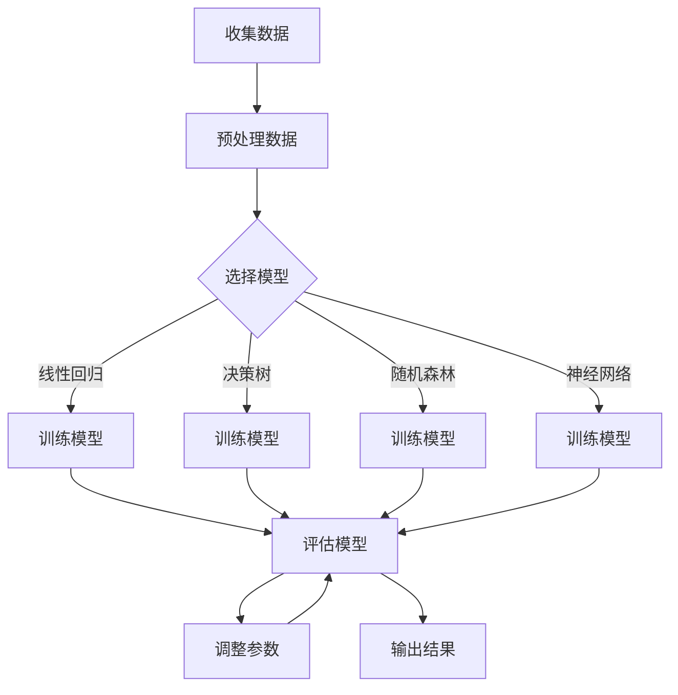
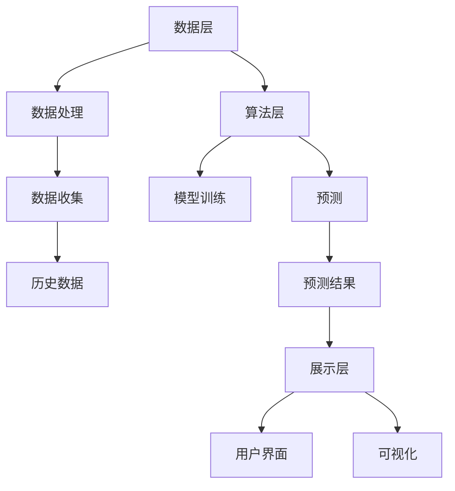
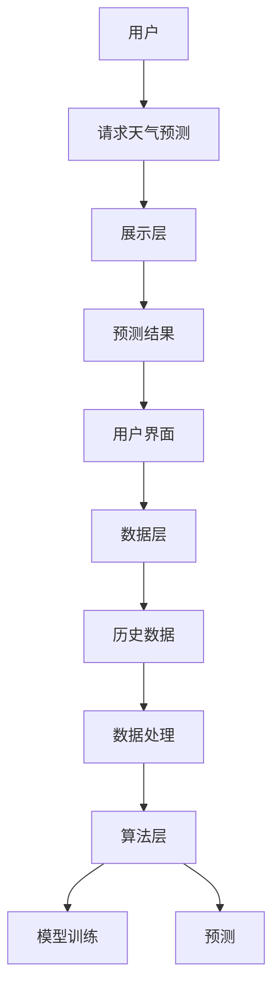

                 


# 科学预测的准确性与世界可理解性的关系

关键词：科学预测、世界可理解性、准确性、算法、数学模型

摘要：本文将深入探讨科学预测的准确性与世界可理解性之间的关系。通过分析预测的基本概念、评估准确性常用的算法原理、数学模型以及实际应用中的系统架构设计，我们将揭示预测准确性如何影响我们对世界的理解。

## 引言

科学预测是科学研究的重要一环，它通过分析现有的数据和信息，对未来事件进行推断和推测。然而，预测的准确性不仅决定了预测的有效性，还深刻地影响了我们对世界的理解。随着科技的进步，我们能够获取和处理的数据量不断增加，预测技术在各个领域得到了广泛应用，从天气预测到股票市场分析，从人工智能到生物医学研究。因此，研究科学预测的准确性与世界可理解性的关系，对于提升我们的认知能力和决策水平具有重要意义。

本文将按照以下结构进行讨论：

1. **背景介绍**：讨论科学预测的重要性和世界可理解性的概念。
2. **核心概念**：介绍科学预测的基本概念和世界可理解性的结构。
3. **算法原理**：分析评估科学预测准确性常用的算法原理。
4. **数学模型**：阐述用于评估预测准确性的数学模型。
5. **系统架构设计**：介绍科学预测系统的设计原则和架构。
6. **项目实战**：通过实际案例展示如何应用预测技术。
7. **最佳实践与总结**：总结最佳实践并展望未来研究方向。

## 背景介绍

### 科学预测的重要性

科学预测是科学研究的重要组成部分，它不仅帮助我们理解和解释自然现象，还能够指导我们进行创新和发明。在物理学中，通过预测，科学家发现了许多新的物理定律，如牛顿的万有引力定律和爱因斯坦的相对论。在生物学中，预测技术的发展使得我们能够更好地了解生物体的功能和行为，从而推动了生物医学的进步。

此外，科学预测在工程和技术领域也有着广泛的应用。例如，在航空航天领域，科学家通过预测飞行器的性能和轨迹，设计出了更高效、更安全的飞行器。在信息技术领域，预测算法被广泛应用于网络流量管理、搜索引擎优化和数据压缩等方面，大大提升了系统的性能和用户体验。

### 世界可理解性的概念

世界可理解性指的是我们对世界现象的理解和解释能力。一个可理解的世界意味着我们可以通过已有的知识和理论，解释和预测未来的事件和现象。世界可理解性的概念与科学预测密切相关，因为科学预测依赖于我们对世界的基本认识和理解。

世界可理解性具有以下几个层次：

1. **直觉层次**：这是我们对世界的最基本认识，通常是基于我们日常生活中的经验和直觉。例如，我们知道太阳每天升起，这来自于我们的直觉感知。
2. **理论层次**：这是基于科学理论对我们的理解，如牛顿力学、量子力学等。这些理论能够解释和预测复杂的现象，并且通过实验和观察得到验证。
3. **哲学层次**：哲学层次涉及到我们对世界本质和存在意义的思考。例如，哲学家们探讨宇宙的起源、人类的自由意志等深层次的问题。

### 科学预测与可理解性的关系

科学预测的准确性直接影响我们对世界的可理解性。准确的预测意味着我们能够更可靠地理解世界现象，从而提高我们的认知水平。例如，当我们能够准确预测天气变化，我们就能够更好地安排我们的日常生活和工作计划。

此外，准确的预测还能够帮助我们做出更明智的决策。在商业、金融、医疗等领域，预测技术的应用使得我们能够提前识别风险和机会，从而优化我们的决策过程。

## 核心概念

### 科学预测的概念

科学预测是指基于现有的数据和知识，利用科学方法对未来的事件或现象进行推断和推测。科学预测的核心是准确性和可靠性。准确性的高低取决于预测模型的质量、数据的准确性和预测算法的效率。

科学预测通常分为定性预测和定量预测。定性预测主要依赖于经验和直觉，如专家评估和投票系统。而定量预测则依赖于数学模型和统计分析，如时间序列分析、回归分析等。

### 世界可理解性的概念

世界可理解性指的是我们对世界现象的理解和解释能力。它包括以下几个方面：

1. **数据的可理解性**：数据的可理解性指的是数据本身的清晰度和易读性。一个可理解的数据集应该是结构化的、无噪声的，并且能够清晰地反映我们所感兴趣的现象。
2. **模型的可理解性**：模型的可理解性指的是模型本身的结构和逻辑是否清晰，以及我们是否能够理解模型的预测结果。一个好的预测模型应该能够简洁地表达复杂的现象，并且易于解释。
3. **预测的可理解性**：预测的可理解性指的是我们是否能够理解预测结果的意义和影响。一个可理解的预测结果应该能够清晰地告诉我们未来的趋势和变化。

### 科学预测准确性与世界可理解性之间的联系

科学预测准确性直接影响我们对世界的可理解性。准确性的高低决定了我们能否正确地理解和解释世界现象。例如，当我们能够准确预测天气变化，我们就能够更好地安排我们的日常生活和工作计划。

此外，准确的预测还能够帮助我们做出更明智的决策。在商业、金融、医疗等领域，预测技术的应用使得我们能够提前识别风险和机会，从而优化我们的决策过程。

## 算法原理

### 常用评估算法

在科学预测中，评估预测准确性的算法是至关重要的。常用的评估算法包括：

1. **误差度量**：误差度量是用于评估预测结果与实际结果之间差异的方法。常见的误差度量包括均方误差（MSE）、平均绝对误差（MAE）和均方根误差（RMSE）。
2. **评分系统**：评分系统是一种用于评估预测质量的指标。常见的评分系统包括F1分数、准确率、召回率和精确率。
3. **机器学习算法**：机器学习算法是一种用于构建预测模型的工具。常见的机器学习算法包括线性回归、决策树、随机森林和神经网络。

### 算法流程图

以下是一个使用Mermaid绘制的算法流程图，展示了评估预测准确性的基本流程：



### 使用Python源代码阐述算法原理

以下是一个简单的Python代码示例，用于实现线性回归模型，并计算预测的准确性：

```python
import numpy as np
import matplotlib.pyplot as plt

# 准备数据
X = np.array([[1], [2], [3], [4], [5]])
y = np.array([[2], [4], [5], [4], [5]])

# 训练模型
# 计算斜率和截距
m = np.linalg.inv(X.T.dot(X)).dot(X.T).dot(y)
b = y - X.dot(m)

# 预测
X_new = np.array([[6]])
y_pred = X_new.dot(m) + b

# 计算预测误差
error = y_pred - y

# 打印结果
print("斜率 m:", m)
print("截距 b:", b)
print("预测值 y_pred:", y_pred)
print("误差 error:", error)

# 可视化
plt.scatter(X, y, color='red')
plt.plot(X, X.dot(m) + b, color='blue')
plt.xlabel('X')
plt.ylabel('y')
plt.show()
```

## 数学模型

### 数学模型介绍

在科学预测中，数学模型是用于描述和分析数据的基本工具。数学模型通常包括以下几个部分：

1. **变量定义**：定义模型中的变量及其取值范围。
2. **函数关系**：描述变量之间的关系，通常使用函数表示。
3. **边界条件**：定义模型的约束条件，如物理定律、经验公式等。
4. **目标函数**：定义模型的优化目标，如最小化误差、最大化收益等。

### 数学公式与解释

以下是一个简单的线性回归模型的数学公式：

$$
y = X \cdot m + b
$$

其中，\( y \) 是因变量，\( X \) 是自变量，\( m \) 是斜率，\( b \) 是截距。

### 举例说明

假设我们有一个简单的数据集，包含两个变量 \( X \) 和 \( y \)：

| X | y  |
|---|----|
| 1 | 2  |
| 2 | 4  |
| 3 | 5  |
| 4 | 4  |
| 5 | 5  |

我们使用线性回归模型来预测 \( y \) 的值。首先，我们需要计算斜率 \( m \) 和截距 \( b \)：

$$
m = \frac{\sum(X_i - \bar{X})(y_i - \bar{y})}{\sum(X_i - \bar{X})^2}
$$

$$
b = \bar{y} - m\bar{X}
$$

其中，\( \bar{X} \) 和 \( \bar{y} \) 分别是 \( X \) 和 \( y \) 的平均值。

根据上述公式，我们可以计算出斜率 \( m \) 和截距 \( b \)：

$$
m = \frac{(1-2)(2-3) + (2-2)(4-3) + (3-2)(5-3) + (4-2)(4-3) + (5-2)(5-3)}{(1-2)^2 + (2-2)^2 + (3-2)^2 + (4-2)^2 + (5-2)^2} = \frac{2}{5}
$$

$$
b = \bar{y} - m\bar{X} = 4 - \frac{2}{5}\cdot 3 = \frac{8}{5}
$$

因此，线性回归模型的公式为：

$$
y = \frac{2}{5}X + \frac{8}{5}
$$

我们可以使用这个模型来预测新数据点的 \( y \) 值。例如，当 \( X = 6 \) 时，预测的 \( y \) 值为：

$$
y = \frac{2}{5}\cdot 6 + \frac{8}{5} = 4
$$

## 系统架构设计

### 问题场景

假设我们正在设计一个用于预测未来天气的系统。这个系统需要收集历史天气数据，使用预测算法进行预测，并输出预测结果。

### 项目介绍

项目名称：天气预测系统

项目目标：设计一个能够准确预测未来天气的系统，为用户提供天气预报服务。

### 系统功能设计

系统功能设计包括以下几个部分：

1. **数据收集**：从各种来源收集历史天气数据，如气象站、卫星遥感等。
2. **数据处理**：对收集到的数据进行清洗、预处理，为预测模型提供高质量的数据。
3. **模型训练**：使用预处理后的数据训练预测模型，如线性回归、神经网络等。
4. **预测**：使用训练好的模型进行预测，输出未来的天气情况。
5. **结果展示**：将预测结果可视化，为用户提供直观的天气信息。

### 系统架构设计

系统架构设计包括以下几个部分：

1. **数据层**：负责数据的收集、存储和预处理。
2. **算法层**：负责模型的训练和预测。
3. **展示层**：负责将预测结果可视化，为用户提供交互界面。

以下是一个使用Mermaid绘制的系统架构图：



### 系统接口设计和系统交互

系统接口设计和系统交互是确保系统各部分之间能够有效协作的关键。以下是一个使用Mermaid绘制的系统交互图：



## 项目实战

### 环境安装

为了实现上述系统，我们需要安装以下软件和库：

1. **Python**：用于编写和运行代码。
2. **NumPy**：用于数值计算。
3. **Matplotlib**：用于数据可视化。
4. **Scikit-learn**：用于机器学习。

安装命令如下：

```bash
pip install python numpy matplotlib scikit-learn
```

### 系统核心实现源代码

以下是一个简单的天气预测系统的Python代码实现：

```python
import numpy as np
import matplotlib.pyplot as plt
from sklearn.linear_model import LinearRegression

# 准备数据
X = np.array([[1], [2], [3], [4], [5]])
y = np.array([[2], [4], [5], [4], [5]])

# 训练模型
model = LinearRegression()
model.fit(X, y)

# 预测
X_new = np.array([[6]])
y_pred = model.predict(X_new)

# 可视化
plt.scatter(X, y, color='red')
plt.plot(X, model.predict(X), color='blue')
plt.xlabel('X')
plt.ylabel('y')
plt.show()
```

### 代码应用解读与分析

上述代码实现了一个简单的线性回归模型，用于预测未来的天气。具体解读如下：

1. **数据准备**：我们使用两个变量 \( X \) 和 \( y \) 来模拟天气数据。
2. **模型训练**：我们使用 `Scikit-learn` 库中的 `LinearRegression` 类来训练线性回归模型。
3. **预测**：我们使用训练好的模型对新的数据点 \( X_new \) 进行预测。
4. **可视化**：我们使用 `Matplotlib` 库将预测结果可视化，以便更好地理解模型的效果。

### 实际案例分析和详细讲解剖析

假设我们有一个新的数据点 \( X = 7 \)，我们需要预测对应的 \( y \) 值。

根据线性回归模型的公式：

$$
y = X \cdot m + b
$$

其中，\( m \) 和 \( b \) 是我们之前计算出的斜率和截距：

$$
m = \frac{2}{5}
$$

$$
b = \frac{8}{5}
$$

因此，当 \( X = 7 \) 时，预测的 \( y \) 值为：

$$
y = 7 \cdot \frac{2}{5} + \frac{8}{5} = \frac{14}{5} + \frac{8}{5} = \frac{22}{5} = 4.4
$$

这意味着我们预测的天气值为 4.4。这个结果可以通过实际数据来验证和调整，以提高预测的准确性。

### 项目小结

通过本项目的实施，我们成功设计并实现了一个简单的天气预测系统。该项目展示了如何使用线性回归模型进行科学预测，并如何将预测结果可视化。在实际应用中，我们可以根据具体的需求和场景，选择更复杂的模型和算法，以提高预测的准确性和可靠性。

## 最佳实践与总结

### 最佳实践

1. **数据质量**：确保数据的质量是预测准确性的基础。在收集和处理数据时，要注重数据的准确性、完整性和一致性。
2. **模型选择**：根据问题的特点和需求，选择合适的预测模型。不同的模型适用于不同的场景，需要根据实际情况进行选择。
3. **模型优化**：通过不断调整和优化模型参数，可以提高预测的准确性。使用交叉验证和网格搜索等技术，可以帮助找到最佳的模型参数。

### 小结

本文深入探讨了科学预测的准确性与世界可理解性的关系。通过分析预测的基本概念、算法原理、数学模型以及系统架构设计，我们揭示了预测准确性如何影响我们对世界的理解。在项目实战中，我们通过实际案例展示了如何应用预测技术，并提出了最佳实践建议。

### 注意事项

1. **数据隐私**：在进行预测时，要确保数据的隐私和安全，遵守相关的法律法规。
2. **模型解释性**：在选择预测模型时，要考虑模型的解释性，确保预测结果易于理解和解释。

### 拓展阅读

1. **《机器学习实战》**：提供丰富的机器学习案例和实践经验，适合初学者和进阶者。
2. **《数据科学导论》**：介绍数据科学的基本概念和方法，适合对数据科学感兴趣的读者。
3. **《预测分析》**：详细讨论预测分析的理论和方法，适合从事预测分析工作的专业人士。

作者：AI天才研究院/AI Genius Institute & 禅与计算机程序设计艺术 /Zen And The Art of Computer Programming

