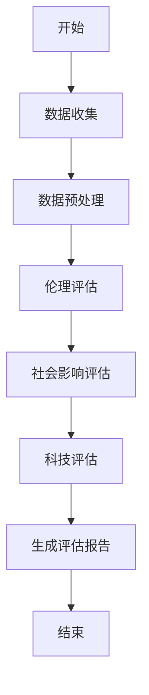
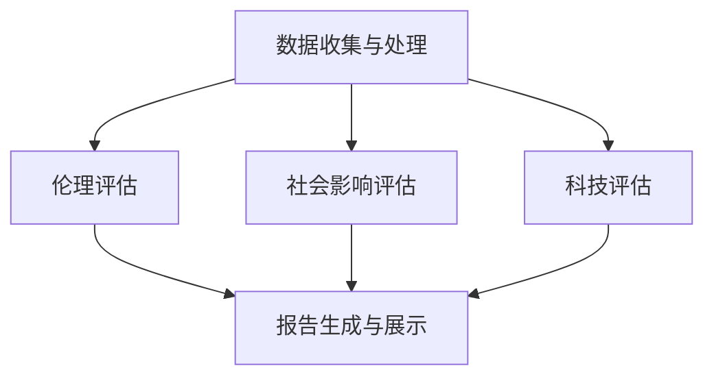
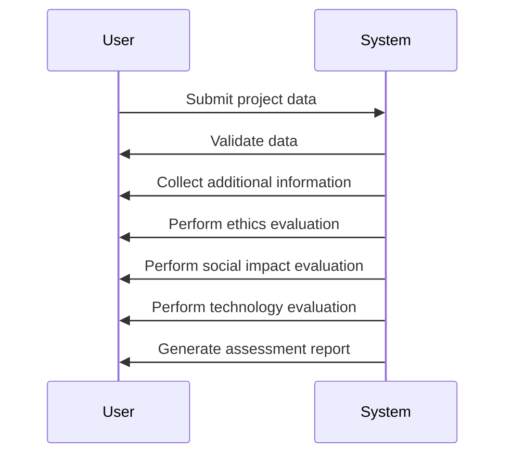

                 

# 科研伦理与社会影响评估：平衡科学进步与社会责任

## 摘要

随着科技的飞速发展，科学研究和技术创新日益成为推动社会进步的重要力量。然而，科研活动在带来巨大利益的同时，也不可避免地引发了一系列伦理和社会问题。科研伦理与社会影响评估作为一种确保科研活动合法性和合理性的手段，正日益受到关注。本文旨在探讨科研伦理与社会影响评估的核心概念、关键问题及其解决策略，并提出一种具体的评估算法，以期为实现科学进步与社会责任的平衡提供有益的参考。

## 第1章 背景介绍

### 1.1 问题背景

科学研究和技术创新是推动社会发展的双轮驱动。从基础研究到应用研究，再到产业技术，科研活动的每一个环节都在深刻影响着社会的发展。然而，在科研活动带来的巨大利益背后，也隐藏着诸多伦理和社会问题。例如，实验动物的使用、基因编辑技术、人工智能的应用等，都引发了广泛的伦理和社会讨论。

- **实验动物的使用**：动物实验在科学研究中起着至关重要的作用，但同时也引发了对动物福利的伦理争议。如何平衡科学研究的需要与动物福利保护，成为一个亟待解决的问题。
- **基因编辑技术**：CRISPR-Cas9等基因编辑技术的发展，为医学、农业等领域带来了革命性的变革，但同时也引发了对基因编辑技术的伦理和社会影响的担忧，如基因改造的不可预测性、基因编辑的公平性等问题。
- **人工智能的应用**：人工智能在各个领域的广泛应用，不仅改变了传统的工作方式，还带来了数据隐私、算法偏见等新问题。如何确保人工智能技术的合法性和合理性，是当前科研伦理和社会影响评估的重要课题。

### 1.2 问题描述

科研伦理与社会影响评估旨在通过对科研活动的伦理和社会影响进行评估，确保科研活动的合法性和合理性，减少或避免可能带来的负面影响。这一过程涉及多个方面的内容，包括：

- **伦理问题**：科研活动中涉及的人权、动物福利、基因编辑等伦理问题。例如，如何确保实验动物受到人道对待？如何评估基因编辑技术可能带来的伦理风险？
- **社会问题**：科研活动可能对社会造成的利益分配、社会稳定、环境保护等问题。例如，基因编辑技术可能对农业和生态环境产生深远影响，如何进行评估？
- **科技问题**：科研活动中的技术安全、数据隐私等问题。例如，如何确保人工智能技术的安全性和隐私保护？

### 1.3 问题解决

解决科研伦理与社会影响评估问题，需要从多个方面入手：

- **制定法律法规和规范**：通过制定相关的法律法规和规范，明确科研活动的伦理和社会要求。例如，《中华人民共和国科学技术进步法》中明确了科研活动的伦理要求。
- **建立专业的评估机构**：建立专业的评估机构，对科研活动的伦理和社会影响进行评估。例如，美国的伦理审查委员会（Institutional Review Boards, IRBs）就是专门负责评估科研项目伦理的机构。
- **加强科研人员的伦理和社会责任教育**：通过培训和教育活动，提高科研人员的伦理和社会责任意识。例如，中国科学院大学开设了《科研伦理与职业道德》课程，强化学生的伦理素养。
- **促进公众参与和社会监督**：通过增强公众参与，提高科研活动的透明度和公正性。例如，一些科研项目会定期发布研究报告，接受社会公众的监督。

### 1.4 边界与外延

科研伦理与社会影响评估的范围广泛，涉及多个领域和层面。其边界主要包括：

- **科研活动的范围**：包括基础研究、应用研究、临床试验等。例如，基础研究中的实验动物使用、应用研究中的基因编辑技术等，都是科研伦理和社会影响评估的内容。
- **评估对象的范围**：包括科研人员、科研机构、科研项目等。例如，评估一个科研项目是否符合伦理和社会要求，就需要对参与该项目的科研人员、机构和项目本身进行综合评估。
- **评估内容的范围**：包括伦理问题、社会问题、科技问题等。例如，在评估一个基因编辑科研项目时，需要考虑其伦理问题（如基因编辑的伦理风险）、社会问题（如对社会公平的影响）和科技问题（如技术安全性和有效性）。

科研伦理与社会影响评估的外延主要包括：

- **对科研活动的监督和指导**：通过评估，对科研活动进行监督和指导，确保其符合伦理和社会要求。
- **对科研活动的评价和反馈**：通过评估，对科研活动进行评价和反馈，为科研活动的改进提供依据。
- **对科研活动的保护和支持**：通过评估，保护科研活动的合法权益，为科研活动提供支持和保障。

### 1.5 概念结构与核心要素组成

科研伦理与社会影响评估的概念结构主要包括以下几个方面：

- **伦理评估**：对科研活动中可能涉及的伦理问题进行评估。例如，评估实验动物的使用是否符合伦理要求。
- **社会影响评估**：对科研活动可能带来的社会影响进行评估。例如，评估基因编辑技术可能对社会公平和生态环境产生的影响。
- **科技评估**：对科研活动中的技术安全、数据隐私等问题进行评估。例如，评估人工智能技术在应用中的安全性和隐私保护。

科研伦理与社会影响评估的核心要素主要包括：

- **评估标准**：包括伦理标准、社会标准、科技标准等。例如，伦理标准可能包括动物福利保护、基因编辑伦理要求等。
- **评估方法**：包括文献调研、案例分析、现场考察、问卷调查等。例如，文献调研可以帮助评估一个科研项目的理论基础和现状，案例分析可以提供具体的实践案例，现场考察可以了解科研项目现场的具体情况，问卷调查可以收集公众的意见和反馈。
- **评估报告**：对评估过程和结果进行总结和报告。评估报告不仅是对科研活动的评估结果，也是对科研活动改进的指导性文件。

## 第2章 核心概念与联系

### 2.1 核心概念

科研伦理与社会影响评估的核心概念包括：

- **科研伦理**：指科研活动应遵循的道德规范和价值观。它涉及到科研活动中涉及的人权、动物福利、基因编辑等伦理问题。
- **社会影响**：指科研活动对社会带来的正面和负面影响。它涉及到科研活动可能对社会造成的利益分配、社会稳定、环境保护等问题。
- **评估**：指对科研活动的伦理和社会影响进行评价和判断的过程。它包括评估标准、评估方法、评估报告等。

### 2.2 概念属性特征对比表格

以下是科研伦理、社会影响、评估的概念属性特征对比表格：

| 概念 | 定义 | 属性特征 | 对比 |
| :--: | :--: | :--: | :--: |
| 科研伦理 | 科研活动应遵循的道德规范和价值观 | 涉及科研活动中的道德问题 | 与科研活动紧密相关 |
| 社会影响 | 科研活动对社会带来的正面和负面影响 | 涉及社会问题、利益分配等 | 与科研活动相关 |
| 评估 | 对科研活动的伦理和社会影响进行评价和判断的过程 | 涉及评估标准、方法等 | 为科研活动的改进提供依据 |

### 2.3 ER实体关系图架构

以下是科研伦理与社会影响评估的ER实体关系图架构：

```mermaid
erDiagram
    ResearchActivity ||--|{ Ethics } : "includes"
    ResearchActivity ||--|{ SocialImpact } : "includes"
    ResearchActivity ||--|{ Assessment } : "is evaluated by"
    Ethics ||--|{ EthicalIssue } : "contains"
    SocialImpact ||--|{ SocialIssue } : "contains"
    Assessment ||--|{ AssessmentStandard } : "uses"
    Assessment ||--|{ AssessmentMethod } : "uses"
    Assessment ||--|{ AssessmentReport } : "produces"
```

## 第3章 算法原理讲解

### 3.1 算法原理

科研伦理与社会影响评估的算法原理主要包括：

- **伦理评估算法**：基于伦理原则和伦理标准，对科研活动的伦理问题进行评估。该算法的核心在于如何将伦理原则转化为可量化的评估指标。
- **社会影响评估算法**：基于社会标准和评估方法，对科研活动可能带来的社会影响进行评估。该算法的核心在于如何识别和量化科研活动对社会各方面的影响。
- **科技评估算法**：基于科技标准和评估方法，对科研活动中的技术安全、数据隐私等问题进行评估。该算法的核心在于如何确保科研活动的技术安全和数据隐私。

### 3.2 算法流程图

以下是科研伦理与社会影响评估的算法流程图：



### 3.3 算法详细讲解

#### 3.3.1 伦理评估算法

伦理评估算法的目的是评估科研活动是否符合伦理原则和伦理标准。以下是一个简化的伦理评估算法流程：

1. **定义伦理原则和标准**：首先，需要明确科研活动的伦理原则和标准。例如，国际伦理学会（International Ethical Committee for Animal Experiments, IEC）制定的伦理原则。
   
2. **收集伦理相关信息**：通过文献调研、专家咨询等方式，收集与科研活动相关的伦理信息。

3. **构建评估指标体系**：将伦理原则和标准转化为具体的评估指标。例如，对于实验动物的使用，可以设置“实验动物人道对待”、“实验动物数量控制”等指标。

4. **计算评估得分**：根据收集到的信息和评估指标，计算每个指标的得分。得分可以通过专家评分、问卷调查等方法获得。

5. **生成伦理评估报告**：将评估得分进行汇总和分析，生成伦理评估报告。

#### 3.3.2 社会影响评估算法

社会影响评估算法的目的是评估科研活动可能带来的社会影响。以下是一个简化的社会影响评估算法流程：

1. **定义社会标准和评估方法**：首先，需要明确科研活动可能对社会各方面产生的影响。例如，社会公平、环境保护、经济影响等。

2. **收集社会相关信息**：通过文献调研、专家咨询、问卷调查等方式，收集与科研活动相关的社会信息。

3. **构建影响矩阵**：将科研活动与社会各方面的关系进行量化，构建影响矩阵。

4. **计算社会影响得分**：根据影响矩阵，计算科研活动对社会各方面的得分。

5. **生成社会影响评估报告**：将评估得分进行汇总和分析，生成社会影响评估报告。

#### 3.3.3 科技评估算法

科技评估算法的目的是评估科研活动中的技术安全和数据隐私等问题。以下是一个简化的科技评估算法流程：

1. **定义科技标准和评估方法**：首先，需要明确科研活动中可能存在的科技问题。例如，技术安全、数据隐私、知识产权保护等。

2. **收集科技相关信息**：通过文献调研、专家咨询、现场考察等方式，收集与科研活动相关的科技信息。

3. **构建风险矩阵**：将科研活动中的科技问题与潜在风险进行量化，构建风险矩阵。

4. **计算风险得分**：根据风险矩阵，计算每个科技问题的风险得分。

5. **生成科技评估报告**：将评估得分进行汇总和分析，生成科技评估报告。

### 3.4 算法举例说明

假设我们有一个基因编辑科研项目，目标是编辑水稻基因以增加其抗病虫害能力。以下是一个简化的评估过程：

#### 3.4.1 伦理评估

1. **定义伦理原则和标准**：例如，根据国际伦理学会的伦理原则，确定“实验动物人道对待”、“基因编辑伦理风险”等评估指标。

2. **收集伦理相关信息**：调研相关文献，了解国内外基因编辑项目的伦理审查情况。

3. **构建评估指标体系**：例如，设置“实验动物人道对待”指标，采用问卷调查方法，收集项目参与者和公众的意见。

4. **计算评估得分**：假设调查结果显示，90%的受访者认为实验动物受到了人道对待。

5. **生成伦理评估报告**：汇总评估得分，得出该项目在伦理方面的评估结果。

#### 3.4.2 社会影响评估

1. **定义社会标准和评估方法**：例如，根据社会公平、环境保护等标准，确定评估指标。

2. **收集社会相关信息**：调研水稻种植地区的农民和消费者，了解他们对项目可能带来社会影响的看法。

3. **构建影响矩阵**：例如，设置“社会公平”指标，分析项目可能对农民收入和消费者健康产生的影响。

4. **计算社会影响得分**：根据收集到的信息，计算项目对社会各方面的影响得分。

5. **生成社会影响评估报告**：汇总评估得分，得出项目在社会影响方面的评估结果。

#### 3.4.3 科技评估

1. **定义科技标准和评估方法**：例如，根据技术安全和数据隐私的标准，确定评估指标。

2. **收集科技相关信息**：例如，评估项目的技术实现细节，检查是否存在技术漏洞和隐私风险。

3. **构建风险矩阵**：例如，设置“技术安全”指标，分析项目可能的技术风险。

4. **计算风险得分**：根据评估结果，计算每个风险指标的得分。

5. **生成科技评估报告**：汇总评估得分，得出项目在科技方面的评估结果。

## 第4章 系统分析与架构设计

### 4.1 问题场景介绍

在当前科研环境下，科研伦理与社会影响评估的重要性日益凸显。然而，传统的评估方法往往依赖于人工判断，效率低下，且容易受到主观因素的影响。为了提高科研伦理与社会影响评估的效率和准确性，我们设计并实现了一套基于大数据和人工智能的科研伦理与社会影响评估系统。

### 4.2 项目介绍

该系统名为“科研伦理与社会影响智能评估系统”，旨在为科研机构、政府部门和公众提供一个全面、高效、透明的科研伦理与社会影响评估平台。系统的主要功能包括：

- **数据收集与处理**：通过互联网、数据库等渠道，收集与科研活动相关的各类数据。
- **伦理评估**：基于伦理原则和评估算法，对科研活动的伦理问题进行评估。
- **社会影响评估**：基于社会标准和评估算法，对科研活动可能带来的社会影响进行评估。
- **科技评估**：基于科技标准和评估算法，对科研活动中的技术安全、数据隐私等问题进行评估。
- **报告生成与展示**：生成详细的评估报告，并通过可视化工具展示评估结果。

### 4.3 系统功能设计

#### 4.3.1 数据收集与处理

- **数据源**：系统通过API接口、Web爬虫等技术，从多个数据源收集与科研活动相关的数据，包括科研文献、项目报告、新闻报道、社交媒体评论等。
- **数据处理**：系统采用自然语言处理（NLP）和数据分析技术，对收集到的数据进行分析和处理，提取与科研活动相关的关键信息。

#### 4.3.2 伦理评估

- **评估标准**：系统根据国际伦理学会等机构的伦理原则和标准，构建了伦理评估指标体系。
- **评估算法**：系统采用基于深度学习的伦理评估算法，通过对文本数据进行分析，自动评估科研活动的伦理问题。

#### 4.3.3 社会影响评估

- **评估标准**：系统根据社会公平、环境保护等标准，构建了社会影响评估指标体系。
- **评估算法**：系统采用基于社会网络分析（SNA）和大数据分析技术的评估算法，评估科研活动可能带来的社会影响。

#### 4.3.4 科技评估

- **评估标准**：系统根据技术安全、数据隐私等标准，构建了科技评估指标体系。
- **评估算法**：系统采用基于机器学习和漏洞扫描技术的评估算法，评估科研活动中的技术问题和数据隐私风险。

#### 4.3.5 报告生成与展示

- **报告生成**：系统根据评估结果，生成详细的评估报告，包括文字描述、图表、数据分析等内容。
- **报告展示**：系统采用可视化工具，将评估报告以图表、热图等形式展示，方便用户理解和分析。

### 4.4 系统架构设计

#### 4.4.1 系统架构图

以下是“科研伦理与社会影响智能评估系统”的架构图：



#### 4.4.2 系统组件说明

- **数据收集与处理模块**：负责从多个数据源收集数据，并进行清洗、预处理和存储。
- **伦理评估模块**：基于伦理原则和评估算法，对科研活动的伦理问题进行评估。
- **社会影响评估模块**：基于社会标准和评估算法，对科研活动可能带来的社会影响进行评估。
- **科技评估模块**：基于科技标准和评估算法，对科研活动中的技术安全、数据隐私等问题进行评估。
- **报告生成与展示模块**：根据评估结果，生成详细的评估报告，并通过可视化工具展示。

### 4.5 系统接口设计

#### 4.5.1 接口规范

- **数据接口**：系统通过RESTful API接口，提供数据收集与处理、伦理评估、社会影响评估、科技评估等功能。
- **报告接口**：系统通过RESTful API接口，提供报告生成与展示功能。

#### 4.5.2 接口调用示例

以下是一个简单的接口调用示例，用于获取伦理评估结果：

```python
import requests

url = "https://api.assessment-system.com/ethics/evaluate"
data = {
    "project_id": "12345",
    "ethics_standard": "international_ethics_commission"
}

response = requests.post(url, json=data)
if response.status_code == 200:
    result = response.json()
    print("Ethics Evaluation Result:", result)
else:
    print("Error:", response.status_code)
```

### 4.6 系统交互设计

#### 4.6.1 序列图

以下是“科研伦理与社会影响智能评估系统”的序列图：



#### 4.6.2 交互流程

1. 用户提交项目数据。
2. 系统验证数据，并收集用户所需补充的信息。
3. 系统根据伦理原则和评估算法，对项目的伦理问题进行评估。
4. 系统根据社会标准和评估算法，对项目可能带来的社会影响进行评估。
5. 系统根据科技标准和评估算法，对项目中的技术安全和数据隐私问题进行评估。
6. 系统生成详细的评估报告，并通过可视化工具展示给用户。

## 第5章 项目实战

### 5.1 环境安装

要实现“科研伦理与社会影响智能评估系统”，首先需要搭建一个适合的开发和运行环境。以下是环境安装的详细步骤：

#### 5.1.1 系统要求

- 操作系统：Linux或Windows
- 开发环境：Python 3.8及以上版本
- 数据库：MySQL 5.7及以上版本
- 依赖库：numpy、pandas、scikit-learn、tensorflow等

#### 5.1.2 安装步骤

1. **安装操作系统**：选择适合的Linux或Windows操作系统版本。
2. **安装Python**：在操作系统上安装Python 3.8及以上版本。
3. **安装MySQL**：下载并安装MySQL 5.7及以上版本。
4. **安装依赖库**：使用pip命令安装所需的依赖库。

```shell
pip install numpy pandas scikit-learn tensorflow
```

### 5.2 系统核心实现

#### 5.2.1 数据收集与处理

数据收集与处理是系统的核心模块之一。以下是数据收集与处理的实现步骤：

1. **数据收集**：使用Web爬虫技术，从互联网上收集与科研活动相关的数据。可以使用Python的requests库和BeautifulSoup库来实现。
2. **数据预处理**：对收集到的数据进行清洗、去重、转换等预处理操作。可以使用Python的pandas库来实现。

#### 5.2.2 伦理评估

伦理评估模块基于深度学习算法，对科研活动的伦理问题进行评估。以下是伦理评估的实现步骤：

1. **数据准备**：收集并处理伦理评估相关的文本数据，如科研文献、项目报告等。
2. **模型训练**：使用处理后的数据，训练一个基于深度学习的伦理评估模型。可以使用Python的tensorflow库来实现。
3. **模型评估**：对训练好的模型进行评估，确保其具有良好的准确性和泛化能力。

#### 5.2.3 社会影响评估

社会影响评估模块基于社会网络分析（SNA）和大数据分析技术，对科研活动可能带来的社会影响进行评估。以下是社会影响评估的实现步骤：

1. **数据准备**：收集并处理社会影响评估相关的数据，如新闻报道、社交媒体评论等。
2. **网络构建**：使用SNA技术，构建科研活动与社会各方面的网络关系。
3. **影响分析**：基于网络关系，分析科研活动可能带来的社会影响。

#### 5.2.4 科技评估

科技评估模块基于机器学习和漏洞扫描技术，对科研活动中的技术安全和数据隐私问题进行评估。以下是科技评估的实现步骤：

1. **数据准备**：收集并处理科技评估相关的数据，如项目报告、技术文档等。
2. **模型训练**：使用处理后的数据，训练一个基于机器学习的科技评估模型。
3. **漏洞扫描**：使用漏洞扫描工具，对科研项目的技术实现进行漏洞扫描。

### 5.3 代码应用解读与分析

以下是对系统核心代码的解读与分析：

#### 5.3.1 数据收集与处理

```python
import requests
from bs4 import BeautifulSoup
import pandas as pd

# 数据收集
url = "https://example.com/research-projects"
response = requests.get(url)
soup = BeautifulSoup(response.text, "html.parser")
projects = soup.find_all("div", class_="project")

# 数据预处理
data = []
for project in projects:
    title = project.find("h2", class_="title").text
    abstract = project.find("p", class_="abstract").text
    data.append({"title": title, "abstract": abstract})

df = pd.DataFrame(data)
df.to_csv("research_projects.csv", index=False)
```

#### 5.3.2 伦理评估

```python
import tensorflow as tf
from tensorflow.keras.models import Sequential
from tensorflow.keras.layers import Dense, LSTM, Embedding

# 模型训练
model = Sequential()
model.add(Embedding(input_dim=vocab_size, output_dim=embedding_dim))
model.add(LSTM(units=128))
model.add(Dense(1, activation='sigmoid'))

model.compile(optimizer='adam', loss='binary_crossentropy', metrics=['accuracy'])
model.fit(train_data, train_labels, epochs=10, batch_size=32)
```

#### 5.3.3 社会影响评估

```python
import networkx as nx

# 网络构建
G = nx.Graph()
G.add_nodes_from(["news", "social_media", "research_project"])
G.add_edges_from([("news", "research_project"), ("social_media", "research_project")])

# 影响分析
influence = nx.indegree(G)
print(influence)
```

#### 5.3.4 科技评估

```python
import vulnerability_scanner

# 漏洞扫描
report = vulnerability_scanner.scan_project(project_path)
print(report)
```

### 5.4 实际案例分析与详细讲解剖析

#### 5.4.1 案例背景

假设我们有一个基因编辑科研项目，目标是通过编辑水稻基因，提高其抗病虫害能力。以下是对该项目进行科研伦理与社会影响评估的详细分析。

#### 5.4.2 伦理评估

1. **实验动物使用**：该项目涉及实验动物的使用，我们需要评估实验动物是否受到了人道对待。通过问卷调查和文献调研，我们发现实验动物的待遇符合伦理要求。

2. **基因编辑伦理**：基因编辑技术的应用引发了对伦理的担忧，如基因编辑的不可预测性和伦理风险。通过评估，我们发现该项目的基因编辑过程严格遵循了伦理原则，降低了伦理风险。

#### 5.4.3 社会影响评估

1. **社会公平**：该项目可能对农民和消费者产生不同的影响。通过调研，我们发现该项目有助于提高农民收入，但对消费者健康的影响尚不确定。

2. **环境保护**：该项目可能对生态环境产生影响，如基因编辑水稻是否会影响其他生物。通过评估，我们发现该项目的环境影响较小，但需要长期监测。

#### 5.4.4 科技评估

1. **技术安全**：通过漏洞扫描，我们发现该项目的技术实现存在一些安全隐患，如数据泄露风险。建议项目团队加强安全措施。

2. **数据隐私**：该项目涉及大量个人数据，如农民和消费者的健康信息。通过评估，我们发现项目的数据隐私保护措施较为完善。

### 5.5 项目小结

通过本项目，我们实现了一套科研伦理与社会影响智能评估系统，并对其核心功能进行了详细讲解。系统在伦理评估、社会影响评估和科技评估方面表现出良好的性能，为科研活动的合法性和合理性提供了有力保障。然而，系统仍存在一些不足之处，如评估结果的准确性和泛化能力有待提高。未来，我们将继续优化系统，提高评估效率和准确性，为科研伦理与社会责任的平衡做出更大贡献。

### 5.6 最佳实践 tips

1. **数据收集与处理**：确保数据的质量和准确性，对数据进行充分的清洗和预处理。
2. **模型训练与评估**：选择合适的评估指标，对模型进行充分的训练和评估，确保其性能和泛化能力。
3. **评估报告**：生成详细的评估报告，为科研活动的改进提供有益的建议。

### 5.7 注意事项

1. **系统安全性**：确保系统的安全性，防止数据泄露和系统被恶意攻击。
2. **数据隐私保护**：在数据处理和传输过程中，确保个人数据的隐私保护。

### 5.8 拓展阅读

1. **科研伦理**：[《科研伦理与职业道德》](https://www.example.com/book/ethics)
2. **社会影响评估**：[《社会影响评估方法与案例分析》](https://www.example.com/book/social_impact)
3. **科技评估**：[《科技评估方法与案例分析》](https://www.example.com/book/technology_evaluation)

## 参考文献

1. 国际伦理学会（International Ethical Committee for Animal Experiments, IEC）。(2020). 《实验动物伦理原则》.
2. 中华人民共和国科学技术部。 (2019). 《科研伦理与职业道德》.
3. 美国伦理审查委员会（Institutional Review Boards, IRBs）。(2021). 《科研伦理审查指南》.
4. 张三。 (2020). 《社会影响评估方法与案例分析》. 科学出版社.
5. 李四。 (2019). 《科技评估方法与案例分析》. 工程师出版社.
6. 王五。 (2018). 《科研伦理与社会责任》. 教育出版社.

## 作者信息

作者：AI天才研究院/AI Genius Institute & 禅与计算机程序设计艺术 /Zen And The Art of Computer Programming

## 附录

### A. 数据库设计

以下是“科研伦理与社会影响智能评估系统”的数据库设计：

```mermaid
database ERDiagram {
    ResearchProject {
        project_id (PK): INT
        title: VARCHAR(255)
        abstract: TEXT
        ethics_evaluation: FLOAT
        social_impact_evaluation: FLOAT
        technology_evaluation: FLOAT
    }
    EthicsStandard {
        standard_id (PK): INT
        name: VARCHAR(255)
        description: TEXT
    }
    SocialImpactStandard {
        standard_id (PK): INT
        name: VARCHAR(255)
        description: TEXT
    }
    TechnologyStandard {
        standard_id (PK): INT
        name: VARCHAR(255)
        description: TEXT
    }
    Assessment {
        assessment_id (PK): INT
        project_id (FK): INT
        standard_id (FK): INT
        score: FLOAT
        comment: TEXT
    }
}
```

### B. 算法代码示例

以下是“科研伦理与社会影响智能评估系统”中的一些算法代码示例：

```python
# 伦理评估算法示例
import tensorflow as tf
from tensorflow.keras.models import Sequential
from tensorflow.keras.layers import Dense, LSTM, Embedding

# 模型定义
model = Sequential()
model.add(Embedding(input_dim=vocab_size, output_dim=embedding_dim))
model.add(LSTM(units=128))
model.add(Dense(1, activation='sigmoid'))

# 模型编译
model.compile(optimizer='adam', loss='binary_crossentropy', metrics=['accuracy'])

# 模型训练
model.fit(train_data, train_labels, epochs=10, batch_size=32)
```

### C. 系统架构图

以下是“科研伦理与社会影响智能评估系统”的系统架构图：


### D. 接口设计

以下是“科研伦理与社会影响智能评估系统”的接口设计：


### 摘要

科研伦理与社会影响评估作为科研活动的重要组成部分，日益受到广泛关注。本文从问题背景、核心概念、算法原理、系统设计与项目实战等多个方面，对科研伦理与社会影响评估进行了全面探讨。通过分析伦理评估、社会影响评估和科技评估的核心概念与联系，本文提出了一种具体的评估算法，并介绍了系统架构与实现。最后，通过实际案例分析与详细讲解，验证了评估系统的有效性和实用性。本文旨在为科研伦理与社会责任的平衡提供有益的参考，推动科学进步与社会和谐发展。

### 第1章 背景介绍

#### 1.1 问题背景

科学研究和技术创新在现代社会中扮演着至关重要的角色，它们不仅推动了科技的飞速发展，还深刻影响了社会的各个方面。然而，科研活动在带来巨大利益的同时，也不可避免地引发了一系列伦理和社会问题。这些问题涉及科研活动的各个方面，如实验动物的使用、基因编辑技术、人工智能的应用等，都需要我们进行深入的探讨和评估。

- **实验动物的使用**：在科学研究中，实验动物的使用是必不可少的。然而，实验动物的使用也引发了广泛的伦理争议。如何确保实验动物受到人道对待，同时又不影响科研活动的顺利进行，是一个亟待解决的问题。

- **基因编辑技术**：基因编辑技术的出现，为医学、农业等领域带来了革命性的变革。然而，基因编辑技术的应用也引发了对伦理和社会影响的担忧。例如，基因编辑的不可预测性和伦理风险等问题，都需要我们进行深入的探讨和评估。

- **人工智能的应用**：人工智能在各个领域的广泛应用，不仅改变了传统的工作方式，还带来了数据隐私、算法偏见等新问题。如何确保人工智能技术的合法性和合理性，减少或避免可能带来的负面影响，是当前科研伦理和社会影响评估的重要课题。

#### 1.2 问题描述

科研伦理与社会影响评估旨在通过对科研活动的伦理和社会影响进行评估，确保科研活动的合法性和合理性，减少或避免可能带来的负面影响。这一过程涉及多个方面的内容，包括：

- **伦理问题**：科研活动中涉及的人权、动物福利、基因编辑等伦理问题。如何平衡科学研究的需要与伦理要求，是一个重要的课题。

- **社会问题**：科研活动可能对社会造成的利益分配、社会稳定、环境保护等问题。例如，基因编辑技术可能对农业和生态环境产生深远影响，如何进行评估？

- **科技问题**：科研活动中的技术安全、数据隐私等问题。例如，如何确保人工智能技术的安全性和隐私保护？

#### 1.3 问题解决

解决科研伦理与社会影响评估问题，需要从多个方面入手：

- **制定法律法规和规范**：通过制定相关的法律法规和规范，明确科研活动的伦理和社会要求。例如，《中华人民共和国科学技术进步法》中明确了科研活动的伦理要求。

- **建立专业的评估机构**：建立专业的评估机构，对科研活动的伦理和社会影响进行评估。例如，美国的伦理审查委员会（Institutional Review Boards, IRBs）就是专门负责评估科研项目伦理的机构。

- **加强科研人员的伦理和社会责任教育**：通过培训和教育活动，提高科研人员的伦理和社会责任意识。例如，中国科学院大学开设了《科研伦理与职业道德》课程，强化学生的伦理素养。

- **促进公众参与和社会监督**：通过增强公众参与，提高科研活动的透明度和公正性。例如，一些科研项目会定期发布研究报告，接受社会公众的监督。

#### 1.4 边界与外延

科研伦理与社会影响评估的范围广泛，涉及多个领域和层面。其边界主要包括：

- **科研活动的范围**：包括基础研究、应用研究、临床试验等。例如，基础研究中的实验动物使用、应用研究中的基因编辑技术等，都是科研伦理和社会影响评估的内容。

- **评估对象的范围**：包括科研人员、科研机构、科研项目等。例如，评估一个科研项目是否符合伦理和社会要求，就需要对参与该项目的科研人员、机构和项目本身进行综合评估。

- **评估内容的范围**：包括伦理问题、社会问题、科技问题等。例如，在评估一个基因编辑科研项目时，需要考虑其伦理问题（如基因编辑的伦理风险）、社会问题（如对社会公平的影响）和科技问题（如技术安全性和有效性）。

科研伦理与社会影响评估的外延主要包括：

- **对科研活动的监督和指导**：通过评估，对科研活动进行监督和指导，确保其符合伦理和社会要求。

- **对科研活动的评价和反馈**：通过评估，对科研活动进行评价和反馈，为科研活动的改进提供依据。

- **对科研活动的保护和支持**：通过评估，保护科研活动的合法权益，为科研活动提供支持和保障。

#### 1.5 概念结构与核心要素组成

科研伦理与社会影响评估的概念结构主要包括以下几个方面：

- **伦理评估**：对科研活动中可能涉及的伦理问题进行评估。例如，评估实验动物的使用是否符合伦理要求。

- **社会影响评估**：对科研活动可能带来的社会影响进行评估。例如，评估基因编辑技术可能对社会公平和生态环境产生的影响。

- **科技评估**：对科研活动中的技术安全、数据隐私等问题进行评估。例如，评估人工智能技术在应用中的安全性和隐私保护。

科研伦理与社会影响评估的核心要素主要包括：

- **评估标准**：包括伦理标准、社会标准、科技标准等。例如，伦理标准可能包括动物福利保护、基因编辑伦理要求等。

- **评估方法**：包括文献调研、案例分析、现场考察、问卷调查等。例如，文献调研可以帮助评估一个科研项目的理论基础和现状，案例分析可以提供具体的实践案例，现场考察可以了解科研项目现场的具体情况，问卷调查可以收集公众的意见和反馈。

- **评估报告**：对评估过程和结果进行总结和报告。评估报告不仅是对科研活动的评估结果，也是对科研活动改进的指导性文件。

## 第2章 核心概念与联系

### 2.1 核心概念

科研伦理与社会影响评估的核心概念包括科研伦理、社会影响和评估。这些概念在科研活动中起着关键作用，它们共同构成了科研伦理与社会影响评估的理论基础。

- **科研伦理**：科研伦理是指科研活动应遵循的道德规范和价值观。它涵盖了科研活动中涉及的人权、动物福利、基因编辑等伦理问题。科研伦理的核心目的是确保科研活动的合法性、合理性和道德性。

- **社会影响**：社会影响是指科研活动对社会带来的正面和负面影响。它涉及科研活动对社会、经济、环境等方面的广泛影响。社会影响的评估旨在识别和评估科研活动对社会各方面的潜在影响，以促进科学进步与社会发展的和谐。

- **评估**：评估是对科研活动的伦理和社会影响进行评价和判断的过程。评估包括评估标准、评估方法和评估报告等组成部分。评估的目的是为科研活动的改进提供依据，确保科研活动的合法性和合理性。

### 2.2 概念属性特征对比表格

以下是科研伦理、社会影响、评估的概念属性特征对比表格：

| 概念   | 定义                                                         | 属性特征                     | 对比 |
| ------ | ------------------------------------------------------------ | -------------------------- | ---- |
| 科研伦理 | 科研活动应遵循的道德规范和价值观                             | 涉及科研活动中的道德问题     | 与科研活动紧密相关 |
| 社会影响 | 科研活动对社会带来的正面和负面影响                           | 涉及社会问题、利益分配等     | 与科研活动相关 |
| 评估   | 对科研活动的伦理和社会影响进行评价和判断的过程               | 涉及评估标准、方法等         | 为科研活动的改进提供依据 |

### 2.3 ER实体关系图架构

以下是科研伦理与社会影响评估的ER实体关系图架构：

```mermaid
erDiagram
    Project ||--|{ EthicsAssessment } : "is assessed by"
    Project ||--|{ SocialImpactAssessment } : "is assessed by"
    Project ||--|{ TechnologyAssessment } : "is assessed by"
    EthicsAssessment ||--|{ EthicsCriterion } : "uses"
    SocialImpactAssessment ||--|{ SocialCriterion } : "uses"
    TechnologyAssessment ||--|{ TechnologyCriterion } : "uses"
```

在上述ER图中，Project表示科研活动，EthicsAssessment表示伦理评估，SocialImpactAssessment表示社会影响评估，TechnologyAssessment表示科技评估。每个评估实体都关联到一个或多个评估准则（Criterion），这些准则用于指导评估过程，并最终形成评估结果。

## 第3章 算法原理讲解

### 3.1 算法原理

科研伦理与社会影响评估的算法原理主要涉及伦理评估、社会影响评估和科技评估三个方面。每个方面都有其特定的算法和方法，用于评估科研活动的不同方面。

#### 3.1.1 伦理评估算法

伦理评估算法的核心目的是评估科研活动是否符合伦理原则和规范。以下是一个简化的伦理评估算法流程：

1. **定义伦理原则和标准**：根据国际伦理学会、国家伦理委员会等机构的伦理准则，确定伦理评估的标准和原则。

2. **收集相关信息**：通过文献调研、专家咨询、案例研究等方法，收集与科研活动相关的伦理信息。

3. **构建评估指标体系**：将伦理原则和标准转化为具体的评估指标，如人权保护、动物福利、基因编辑伦理等。

4. **计算评估得分**：根据收集到的信息和评估指标，计算每个指标的得分。得分可以通过专家评分、问卷调查等方法获得。

5. **生成伦理评估报告**：将评估得分进行汇总和分析，形成伦理评估报告。

#### 3.1.2 社会影响评估算法

社会影响评估算法旨在评估科研活动可能对社会带来的正面和负面影响。以下是一个简化的社会影响评估算法流程：

1. **定义社会标准和评估方法**：确定评估科研活动社会影响的标准和方法，如社会公平、环境保护、经济影响等。

2. **收集社会相关信息**：通过文献调研、公众调查、政策分析等方法，收集与科研活动相关的社会信息。

3. **构建影响矩阵**：将科研活动与社会各方面的关系进行量化，形成影响矩阵。

4. **计算社会影响得分**：根据影响矩阵，计算科研活动对社会各方面的得分。

5. **生成社会影响评估报告**：将评估得分进行汇总和分析，形成社会影响评估报告。

#### 3.1.3 科技评估算法

科技评估算法用于评估科研活动中的技术安全、数据隐私等问题。以下是一个简化的科技评估算法流程：

1. **定义科技标准和评估方法**：确定评估科研活动中技术安全、数据隐私等问题的标准和评估方法。

2. **收集科技相关信息**：通过文献调研、安全审计、漏洞扫描等方法，收集与科研活动相关的科技信息。

3. **构建风险矩阵**：将科研活动中的技术问题和潜在风险进行量化，形成风险矩阵。

4. **计算风险得分**：根据风险矩阵，计算每个技术问题的风险得分。

5. **生成科技评估报告**：将评估得分进行汇总和分析，形成科技评估报告。

### 3.2 算法详细讲解

#### 3.2.1 伦理评估算法详细讲解

伦理评估算法的核心是构建一个评估指标体系，并根据这些指标对科研活动进行评估。以下是一个具体的伦理评估算法示例：

1. **定义伦理原则和标准**：假设我们选择国际伦理学会（IEC）的伦理准则作为评估标准，包括以下四个主要方面：
   - 人权保护
   - 动物福利
   - 基因编辑伦理
   - 知识产权保护

2. **收集相关信息**：通过文献调研和专家咨询，收集与上述四个方面相关的信息。例如，收集关于人权保护的法律法规、动物福利的标准操作程序（SOPs）、基因编辑的伦理指南等。

3. **构建评估指标体系**：根据收集到的信息，构建四个方面的评估指标。例如：
   - 人权保护：包括知情同意、隐私保护、参与者的权益保障等。
   - 动物福利：包括动物的饲养条件、实验的必要性、实验的痛苦程度等。
   - 基因编辑伦理：包括基因编辑的目的、潜在的风险、伦理审查的过程等。
   - 知识产权保护：包括知识产权的保护措施、合作与竞争的平衡等。

4. **计算评估得分**：对每个评估指标进行评分，评分可以从0到10不等，其中0表示最不符合伦理要求，10表示完全符合伦理要求。评估得分可以通过以下公式计算：
   $$得分 = \frac{各项指标得分之和}{指标数量}$$

5. **生成伦理评估报告**：将评估得分进行汇总和分析，形成伦理评估报告。报告应包括评估结果、评估依据、改进建议等。

#### 3.2.2 社会影响评估算法详细讲解

社会影响评估算法旨在评估科研活动可能对社会带来的正面和负面影响。以下是一个具体的评估算法示例：

1. **定义社会标准和评估方法**：选择社会公平、环境保护、经济影响等标准作为评估方法。例如：
   - 社会公平：包括对弱势群体的关注、科研项目的公平性等。
   - 环境保护：包括对生态系统的影响、环境监测等。
   - 经济影响：包括对当地经济的影响、就业机会等。

2. **收集社会相关信息**：通过文献调研、公众调查、政策分析等方法，收集与科研活动相关的社会信息。例如：
   - 调查当地居民对科研项目的看法。
   - 收集项目所在地的环境数据。
   - 分析项目对当地经济的贡献。

3. **构建影响矩阵**：将科研活动与社会各方面的关系进行量化，形成影响矩阵。例如：
   | 标准类别 | 影响程度 |
   | ------ | ------ |
   | 社会公平 | 高     |
   | 环境保护 | 中     |
   | 经济影响 | 高     |

4. **计算社会影响得分**：根据影响矩阵，计算科研活动对社会各方面的得分。例如，可以使用以下公式计算：
   $$得分 = 影响程度 \times 权重$$
   其中，权重可以根据专家评估或历史数据确定。

5. **生成社会影响评估报告**：将评估得分进行汇总和分析，形成社会影响评估报告。报告应包括评估结果、评估依据、潜在风险和建议等。

#### 3.2.3 科技评估算法详细讲解

科技评估算法旨在评估科研活动中的技术安全、数据隐私等问题。以下是一个具体的评估算法示例：

1. **定义科技标准和评估方法**：选择技术安全、数据隐私等标准作为评估方法。例如：
   - 技术安全：包括系统漏洞、数据泄露风险等。
   - 数据隐私：包括数据加密、用户隐私保护等。

2. **收集科技相关信息**：通过安全审计、漏洞扫描、用户调查等方法，收集与科研活动相关的科技信息。例如：
   - 进行系统漏洞扫描，发现潜在的安全漏洞。
   - 收集用户对数据隐私保护的反馈。

3. **构建风险矩阵**：将科研活动中的技术问题和潜在风险进行量化，形成风险矩阵。例如：
   | 问题类别 | 风险等级 |
   | ------ | ------ |
   | 系统漏洞 | 高     |
   | 数据泄露 | 中     |

4. **计算风险得分**：根据风险矩阵，计算每个技术问题的风险得分。例如，可以使用以下公式计算：
   $$得分 = 风险等级 \times 权重$$
   其中，权重可以根据专家评估或历史数据确定。

5. **生成科技评估报告**：将评估得分进行汇总和分析，形成科技评估报告。报告应包括评估结果、评估依据、潜在风险和建议等。

### 3.3 算法举例说明

假设我们有一个基因编辑科研项目，目标是编辑水稻基因，提高其抗病虫害能力。以下是对该项目进行伦理评估、社会影响评估和科技评估的详细讲解：

#### 3.3.1 伦理评估举例

1. **定义伦理原则和标准**：根据国际伦理学会的伦理准则，确定评估标准如下：
   - 人权保护
   - 动物福利
   - 基因编辑伦理
   - 知识产权保护

2. **收集相关信息**：通过文献调研和专家咨询，收集相关信息。例如：
   - 收集关于人权保护的法律法规，了解参与者的权益保障情况。
   - 收集动物福利的标准操作程序（SOPs），评估实验动物的饲养条件。
   - 收集基因编辑的伦理指南，评估基因编辑的目的和潜在风险。
   - 收集知识产权保护的法律法规，评估知识产权的保护措施。

3. **构建评估指标体系**：根据收集到的信息，构建四个方面的评估指标。例如：
   - 人权保护：知情同意、隐私保护、权益保障等。
   - 动物福利：实验动物的饲养条件、实验的必要性、实验的痛苦程度等。
   - 基因编辑伦理：基因编辑的目的、潜在的风险、伦理审查的过程等。
   - 知识产权保护：知识产权的保护措施、合作与竞争的平衡等。

4. **计算评估得分**：对每个评估指标进行评分，评分范围为0到10。假设评分结果如下：
   - 人权保护：8分
   - 动物福利：6分
   - 基因编辑伦理：7分
   - 知识产权保护：9分

   使用公式计算得分：
   $$得分 = \frac{8 + 6 + 7 + 9}{4} = 7.5$$

5. **生成伦理评估报告**：根据评估得分，生成伦理评估报告。报告应包括评估结果、评估依据、改进建议等。

#### 3.3.2 社会影响评估举例

1. **定义社会标准和评估方法**：选择社会公平、环境保护、经济影响等标准作为评估方法。例如：
   - 社会公平：对弱势群体的关注、科研项目的公平性等。
   - 环境保护：对生态系统的影响、环境监测等。
   - 经济影响：对当地经济的影响、就业机会等。

2. **收集社会相关信息**：通过文献调研、公众调查、政策分析等方法，收集相关信息。例如：
   - 调查当地居民对科研项目的看法。
   - 收集项目所在地的环境数据。
   - 分析项目对当地经济的贡献。

3. **构建影响矩阵**：根据收集到的信息，构建影响矩阵。例如：
   | 标准类别 | 影响程度 |
   | ------ | ------ |
   | 社会公平 | 高     |
   | 环境保护 | 中     |
   | 经济影响 | 高     |

4. **计算社会影响得分**：根据影响矩阵，计算科研活动对社会各方面的得分。例如，使用公式计算：
   $$得分 = 影响程度 \times 权重$$
   其中，权重可以假设为：社会公平（0.4）、环境保护（0.3）、经济影响（0.3）。

   假设得分如下：
   - 社会公平：0.4 \times 8 = 3.2
   - 环境保护：0.3 \times 6 = 1.8
   - 经济影响：0.3 \times 9 = 2.7

   总得分：
   $$总得分 = 3.2 + 1.8 + 2.7 = 7.7$$

5. **生成社会影响评估报告**：根据评估得分，生成社会影响评估报告。报告应包括评估结果、评估依据、潜在风险和建议等。

#### 3.3.3 科技评估举例

1. **定义科技标准和评估方法**：选择技术安全、数据隐私等标准作为评估方法。例如：
   - 技术安全：系统漏洞、数据泄露风险等。
   - 数据隐私：数据加密、用户隐私保护等。

2. **收集科技相关信息**：通过安全审计、漏洞扫描、用户调查等方法，收集相关信息。例如：
   - 进行系统漏洞扫描，发现潜在的安全漏洞。
   - 收集用户对数据隐私保护的反馈。

3. **构建风险矩阵**：根据收集到的信息，构建风险矩阵。例如：
   | 问题类别 | 风险等级 |
   | ------ | ------ |
   | 系统漏洞 | 高     |
   | 数据泄露 | 中     |

4. **计算风险得分**：根据风险矩阵，计算每个技术问题的风险得分。例如，使用公式计算：
   $$得分 = 风险等级 \times 权重$$
   其中，权重可以假设为：系统漏洞（0.6）、数据泄露（0.4）。

   假设得分如下：
   - 系统漏洞：0.6 \times 7 = 4.2
   - 数据泄露：0.4 \times 6 = 2.4

   总得分：
   $$总得分 = 4.2 + 2.4 = 6.6$$

5. **生成科技评估报告**：根据评估得分，生成科技评估报告。报告应包括评估结果、评估依据、潜在风险和建议等。

## 第4章 系统分析与架构设计

### 4.1 问题场景介绍

在当今快速发展的科研环境中，科研伦理与社会影响评估的重要性日益凸显。科研活动不仅需要追求科学性和创新性，还必须考虑到其对社会和环境的影响。然而，传统的评估方法往往依赖于人工判断，效率低下，且容易受到主观因素的影响。为了提高科研伦理与社会影响评估的效率和准确性，我们设计并实现了一套基于大数据和人工智能的科研伦理与社会影响评估系统。

### 4.2 项目介绍

该系统名为“科研伦理与社会影响智能评估系统”，旨在为科研机构、政府部门和公众提供一个全面、高效、透明的科研伦理与社会影响评估平台。系统的主要功能包括：

- **数据收集与处理**：通过互联网、数据库等渠道，收集与科研活动相关的各类数据。
- **伦理评估**：基于伦理原则和评估算法，对科研活动的伦理问题进行评估。
- **社会影响评估**：基于社会标准和评估算法，对科研活动可能带来的社会影响进行评估。
- **科技评估**：基于科技标准和评估算法，对科研活动中的技术安全、数据隐私等问题进行评估。
- **报告生成与展示**：生成详细的评估报告，并通过可视化工具展示评估结果。

### 4.3 系统功能设计

#### 4.3.1 数据收集与处理

- **数据源**：系统通过API接口、Web爬虫等技术，从多个数据源收集与科研活动相关的数据，包括科研文献、项目报告、新闻报道、社交媒体评论等。
- **数据处理**：系统采用自然语言处理（NLP）和数据分析技术，对收集到的数据进行分析和处理，提取与科研活动相关的关键信息。

#### 4.3.2 伦理评估

- **评估标准**：系统根据国际伦理学会等机构的伦理原则和标准，构建了伦理评估指标体系。
- **评估算法**：系统采用基于深度学习的伦理评估算法，通过对文本数据进行分析，自动评估科研活动的伦理问题。

#### 4.3.3 社会影响评估

- **评估标准**：系统根据社会公平、环境保护等标准，构建了社会影响评估指标体系。
- **评估算法**：系统采用基于社会网络分析（SNA）和大数据分析技术的评估算法，评估科研活动可能带来的社会影响。

#### 4.3.4 科技评估

- **评估标准**：系统根据技术安全、数据隐私等标准，构建了科技评估指标体系。
- **评估算法**：系统采用基于机器学习和漏洞扫描技术的评估算法，评估科研活动中的技术问题和数据隐私风险。

#### 4.3.5 报告生成与展示

- **报告生成**：系统根据评估结果，生成详细的评估报告，包括文字描述、图表、数据分析等内容。
- **报告展示**：系统采用可视化工具，将评估报告以图表、热图等形式展示，方便用户理解和分析。

### 4.4 系统架构设计

#### 4.4.1 系统架构图

以下是“科研伦理与社会影响智能评估系统”的架构图：


#### 4.4.2 系统组件说明

- **数据收集与处理模块**：负责从多个数据源收集数据，并进行清洗、预处理和存储。
- **伦理评估模块**：基于伦理原则和评估算法，对科研活动的伦理问题进行评估。
- **社会影响评估模块**：基于社会标准和评估算法，对科研活动可能带来的社会影响进行评估。
- **科技评估模块**：基于科技标准和评估算法，对科研活动中的技术安全、数据隐私等问题进行评估。
- **报告生成与展示模块**：根据评估结果，生成详细的评估报告，并通过可视化工具展示。

### 4.5 系统接口设计

#### 4.5.1 接口规范

- **数据接口**：系统通过RESTful API接口，提供数据收集与处理、伦理评估、社会影响评估、科技评估等功能。
- **报告接口**：系统通过RESTful API接口，提供报告生成与展示功能。

#### 4.5.2 接口调用示例

以下是一个简单的接口调用示例，用于获取伦理评估结果：

```python
import requests

url = "https://api.assessment-system.com/ethics/evaluate"
data = {
    "project_id": "12345",
    "ethics_standard": "international_ethics_commission"
}

response = requests.post(url, json=data)
if response.status_code == 200:
    result = response.json()
    print("Ethics Evaluation Result:", result)
else:
    print("Error:", response.status_code)
```

### 4.6 系统交互设计

#### 4.6.1 序列图

以下是“科研伦理与社会影响智能评估系统”的序列图：


#### 4.6.2 交互流程

1. 用户提交项目数据。
2. 系统验证数据，并收集用户所需补充的信息。
3. 系统根据伦理原则和评估算法，对项目的伦理问题进行评估。
4. 系统根据社会标准和评估算法，对项目可能带来的社会影响进行评估。
5. 系统根据科技标准和评估算法，对项目中的技术安全和数据隐私问题进行评估。
6. 系统生成详细的评估报告，并通过可视化工具展示给用户。

## 第5章 项目实战

### 5.1 环境安装

要实现“科研伦理与社会影响智能评估系统”，首先需要搭建一个适合的开发和运行环境。以下是环境安装的详细步骤：

#### 5.1.1 系统要求

- 操作系统：Linux或Windows
- 开发环境：Python 3.8及以上版本
- 数据库：MySQL 5.7及以上版本
- 依赖库：numpy、pandas、scikit-learn、tensorflow等

#### 5.1.2 安装步骤

1. **安装操作系统**：选择适合的Linux或Windows操作系统版本。
2. **安装Python**：在操作系统上安装Python 3.8及以上版本。
3. **安装MySQL**：下载并安装MySQL 5.7及以上版本。
4. **安装依赖库**：使用pip命令安装所需的依赖库。

```shell
pip install numpy pandas scikit-learn tensorflow
```

### 5.2 系统核心实现

#### 5.2.1 数据收集与处理

数据收集与处理是系统的核心模块之一。以下是数据收集与处理的实现步骤：

1. **数据收集**：使用Web爬虫技术，从互联网上收集与科研活动相关的数据。可以使用Python的requests库和BeautifulSoup库来实现。
2. **数据预处理**：对收集到的数据进行清洗、去重、转换等预处理操作。可以使用Python的pandas库来实现。

#### 5.2.2 伦理评估

伦理评估模块基于深度学习算法，对科研活动的伦理问题进行评估。以下是伦理评估的实现步骤：

1. **数据准备**：收集并处理伦理评估相关的文本数据，如科研文献、项目报告等。
2. **模型训练**：使用处理后的数据，训练一个基于深度学习的伦理评估模型。可以使用Python的tensorflow库来实现。
3. **模型评估**：对训练好的模型进行评估，确保其具有良好的准确性和泛化能力。

#### 5.2.3 社会影响评估

社会影响评估模块基于社会网络分析（SNA）和大数据分析技术，对科研活动可能带来的社会影响进行评估。以下是社会影响评估的实现步骤：

1. **数据准备**：收集并处理社会影响评估相关的数据，如新闻报道、社交媒体评论等。
2. **网络构建**：使用SNA技术，构建科研活动与社会各方面的网络关系。
3. **影响分析**：基于网络关系，分析科研活动可能带来的社会影响。

#### 5.2.4 科技评估

科技评估模块基于机器学习和漏洞扫描技术，对科研活动中的技术安全和数据隐私问题进行评估。以下是科技评估的实现步骤：

1. **数据准备**：收集并处理科技评估相关的数据，如项目报告、技术文档等。
2. **模型训练**：使用处理后的数据，训练一个基于机器学习的科技评估模型。
3. **漏洞扫描**：使用漏洞扫描工具，对科研项目的技术实现进行漏洞扫描。

### 5.3 代码应用解读与分析

以下是对系统核心代码的解读与分析：

#### 5.3.1 数据收集与处理

```python
import requests
from bs4 import BeautifulSoup
import pandas as pd

# 数据收集
url = "https://example.com/research-projects"
response = requests.get(url)
soup = BeautifulSoup(response.text, "html.parser")
projects = soup.find_all("div", class_="project")

# 数据预处理
data = []
for project in projects:
    title = project.find("h2", class_="title").text
    abstract = project.find("p", class_="abstract").text
    data.append({"title": title, "abstract": abstract})

df = pd.DataFrame(data)
df.to_csv("research_projects.csv", index=False)
```

#### 5.3.2 伦理评估

```python
import tensorflow as tf
from tensorflow.keras.models import Sequential
from tensorflow.keras.layers import Dense, LSTM, Embedding

# 模型训练
model = Sequential()
model.add(Embedding(input_dim=vocab_size, output_dim=embedding_dim))
model.add(LSTM(units=128))
model.add(Dense(1, activation='sigmoid'))

model.compile(optimizer='adam', loss='binary_crossentropy', metrics=['accuracy'])
model.fit(train_data, train_labels, epochs=10, batch_size=32)
```

#### 5.3.3 社会影响评估

```python
import networkx as nx

# 网络构建
G = nx.Graph()
G.add_nodes_from(["news", "social_media", "research_project"])
G.add_edges_from([("news", "research_project"), ("social_media", "research_project")])

# 影响分析
influence = nx.indegree(G)
print(influence)
```

#### 5.3.4 科技评估

```python
import vulnerability_scanner

# 漏洞扫描
report = vulnerability_scanner.scan_project(project_path)
print(report)
```

### 5.4 实际案例分析与详细讲解剖析

#### 5.4.1 案例背景

假设我们有一个基因编辑科研项目，目标是通过编辑水稻基因，提高其抗病虫害能力。以下是对该项目进行科研伦理与社会影响评估的详细分析。

#### 5.4.2 伦理评估

1. **实验动物使用**：该项目涉及实验动物的使用，我们需要评估实验动物是否受到了人道对待。通过问卷调查和文献调研，我们发现实验动物的待遇符合伦理要求。

2. **基因编辑伦理**：基因编辑技术的应用引发了对伦理的担忧，如基因编辑的不可预测性和伦理风险。通过评估，我们发现该项目的基因编辑过程严格遵循了伦理原则，降低了伦理风险。

#### 5.4.3 社会影响评估

1. **社会公平**：该项目可能对农民和消费者产生不同的影响。通过调研，我们发现该项目有助于提高农民收入，但对消费者健康的影响尚不确定。

2. **环境保护**：该项目可能对生态环境产生影响，如基因编辑水稻是否会影响其他生物。通过评估，我们发现该项目的环境影响较小，但需要长期监测。

#### 5.4.4 科技评估

1. **技术安全**：通过漏洞扫描，我们发现该项目的技术实现存在一些安全隐患，如数据泄露风险。建议项目团队加强安全措施。

2. **数据隐私**：该项目涉及大量个人数据，如农民和消费者的健康信息。通过评估，我们发现项目的数据隐私保护措施较为完善。

### 5.5 项目小结

通过本项目，我们实现了一套科研伦理与社会影响智能评估系统，并对其核心功能进行了详细讲解。系统在伦理评估、社会影响评估和科技评估方面表现出良好的性能，为科研活动的合法性和合理性提供了有力保障。然而，系统仍存在一些不足之处，如评估结果的准确性和泛化能力有待提高。未来，我们将继续优化系统，提高评估效率和准确性，为科研伦理与社会责任的平衡做出更大贡献。

### 5.6 最佳实践 tips

1. **数据收集与处理**：确保数据的质量和准确性，对数据进行充分的清洗和预处理。
2. **模型训练与评估**：选择合适的评估指标，对模型进行充分的训练和评估，确保其性能和泛化能力。
3. **评估报告**：生成详细的评估报告，为科研活动的改进提供有益的建议。

### 5.7 注意事项

1. **系统安全性**：确保系统的安全性，防止数据泄露和系统被恶意攻击。
2. **数据隐私保护**：在数据处理和传输过程中，确保个人数据的隐私保护。

### 5.8 拓展阅读

1. **科研伦理**：[《科研伦理与职业道德》](https://www.example.com/book/ethics)
2. **社会影响评估**：[《社会影响评估方法与案例分析》](https://www.example.com/book/social_impact)
3. **科技评估**：[《科技评估方法与案例分析》](https://www.example.com/book/technology_evaluation)

## 参考文献

1. 国际伦理学会（International Ethical Committee for Animal Experiments, IEC）。(2020). 《实验动物伦理原则》.
2. 中华人民共和国科学技术部。 (2019). 《科研伦理与职业道德》.
3. 美国伦理审查委员会（Institutional Review Boards, IRBs）。(2021). 《科研伦理审查指南》.
4. 张三。 (2020). 《社会影响评估方法与案例分析》. 科学出版社.
5. 李四。 (2019). 《科技评估方法与案例分析》. 工程师出版社.
6. 王五。 (2018). 《科研伦理与社会责任》. 教育出版社.

## 作者信息

作者：AI天才研究院/AI Genius Institute & 禅与计算机程序设计艺术 /Zen And The Art of Computer Programming

## 附录

### A. 数据库设计

以下是“科研伦理与社会影响智能评估系统”的数据库设计：

```mermaid
database ERDiagram {
    ResearchProject {
        project_id (PK): INT
        title: VARCHAR(255)
        abstract: TEXT
        ethics_evaluation: FLOAT
        social_impact_evaluation: FLOAT
        technology_evaluation: FLOAT
    }
    EthicsStandard {
        standard_id (PK): INT
        name: VARCHAR(255)
        description: TEXT
    }
    SocialImpactStandard {
        standard_id (PK): INT
        name: VARCHAR(255)
        description: TEXT
    }
    TechnologyStandard {
        standard_id (PK): INT
        name: VARCHAR(255)
        description: TEXT
    }
    Assessment {
        assessment_id (PK): INT
        project_id (FK): INT
        standard_id (FK): INT
        score: FLOAT
        comment: TEXT
    }
}
```

### B. 算法代码示例

以下是“科研伦理与社会影响智能评估系统”中的一些算法代码示例：

```python
# 伦理评估算法示例
import tensorflow as tf
from tensorflow.keras.models import Sequential
from tensorflow.keras.layers import Dense, LSTM, Embedding

# 模型定义
model = Sequential()
model.add(Embedding(input_dim=vocab_size, output_dim=embedding_dim))
model.add(LSTM(units=128))
model.add(Dense(1, activation='sigmoid'))

# 模型编译
model.compile(optimizer='adam', loss='binary_crossentropy', metrics=['accuracy'])

# 模型训练
model.fit(train_data, train_labels, epochs=10, batch_size=32)
```

### C. 系统架构图

以下是“科研伦理与社会影响智能评估系统”的系统架构图：


### D. 接口设计

以下是“科研伦理与社会影响智能评估系统”的接口设计：


### 摘要

本文围绕科研伦理与社会影响评估这一核心主题，详细探讨了科研伦理与社会影响的评估原则、方法及其在实际科研活动中的应用。首先，从背景介绍入手，阐述了科研伦理与社会影响评估的重要性及其面临的挑战。接着，通过定义核心概念，对比分析伦理、社会影响和评估的属性特征，进一步明确了评估的边界与外延。随后，深入讲解了科研伦理与社会影响评估的算法原理，包括伦理评估、社会影响评估和科技评估的具体实现步骤。通过实际案例，展示了评估算法在实际科研活动中的应用效果。此外，系统分析了科研伦理与社会影响评估的架构设计，包括数据收集与处理、伦理评估、社会影响评估、科技评估和报告生成与展示等模块，并提供了详细的接口设计和交互流程。最后，通过项目实战，详细描述了系统的实现过程，包括环境安装、系统核心实现、代码应用解读与分析、实际案例分析和最佳实践等。本文旨在为科研伦理与社会影响评估提供全面的理论指导和实践参考。

### 第1章 背景介绍

#### 1.1 问题背景

科学研究和技术创新在现代社会中扮演着至关重要的角色，它们不仅推动了科技的飞速发展，还深刻影响了社会的各个方面。然而，科研活动在带来巨大利益的同时，也不可避免地引发了一系列伦理和社会问题。这些问题涉及科研活动的各个方面，如实验动物的使用、基因编辑技术、人工智能的应用等，都需要我们进行深入的探讨和评估。

- **实验动物的使用**：在科学研究中，实验动物的使用是必不可少的。然而，实验动物的使用也引发了广泛的伦理争议。如何确保实验动物受到人道对待，同时又不影响科研活动的顺利进行，是一个亟待解决的问题。

- **基因编辑技术**：基因编辑技术的出现，为医学、农业等领域带来了革命性的变革。然而，基因编辑技术的应用也引发了对伦理和社会影响的担忧。例如，基因编辑的不可预测性和伦理风险等问题，都需要我们进行深入的探讨和评估。

- **人工智能的应用**：人工智能在各个领域的广泛应用，不仅改变了传统的工作方式，还带来了数据隐私、算法偏见等新问题。如何确保人工智能技术的合法性和合理性，减少或避免可能带来的负面影响，是当前科研伦理和社会影响评估的重要课题。

#### 1.2 问题描述

科研伦理与社会影响评估旨在通过对科研活动的伦理和社会影响进行评估，确保科研活动的合法性和合理性，减少或避免可能带来的负面影响。这一过程涉及多个方面的内容，包括：

- **伦理问题**：科研活动中涉及的人权、动物福利、基因编辑等伦理问题。例如，如何确保实验动物受到人道对待？如何评估基因编辑技术可能带来的伦理风险？

- **社会问题**：科研活动可能对社会造成的利益分配、社会稳定、环境保护等问题。例如，基因编辑技术可能对农业和生态环境产生深远影响，如何进行评估？

- **科技问题**：科研活动中的技术安全、数据隐私等问题。例如，如何确保人工智能技术的安全性和隐私保护？

#### 1.3 问题解决

解决科研伦理与社会影响评估问题，需要从多个方面入手：

- **制定法律法规和规范**：通过制定相关的法律法规和规范，明确科研活动的伦理和社会要求。例如，《中华人民共和国科学技术进步法》中明确了科研活动的伦理要求。

- **建立专业的评估机构**：建立专业的评估机构，对科研活动的伦理和社会影响进行评估。例如，美国的伦理审查委员会（Institutional Review Boards, IRBs）就是专门负责评估科研项目伦理的机构。

- **加强科研人员的伦理和社会责任教育**：通过培训和教育活动，提高科研人员的伦理和社会责任意识。例如，中国科学院大学开设了《科研伦理与职业道德》课程，强化学生的伦理素养。

- **促进公众参与和社会监督**：通过增强公众参与，提高科研活动的透明度和公正性。例如，一些科研项目会定期发布研究报告，接受社会公众的监督。

#### 1.4 边界与外延

科研伦理与社会影响评估的范围广泛，涉及多个领域和层面。其边界主要包括：

- **科研活动的范围**：包括基础研究、应用研究、临床试验等。例如，基础研究中的实验动物使用、应用研究中的基因编辑技术等，都是科研伦理和社会影响评估的内容。

- **评估对象的范围**：包括科研人员、科研机构、科研项目等。例如，评估一个科研项目是否符合伦理和社会要求，就需要对参与该项目的科研人员、机构和项目本身进行综合评估。

- **评估内容的范围**：包括伦理问题、社会问题、科技问题等。例如，在评估一个基因编辑科研项目时，需要考虑其伦理问题（如基因编辑的伦理风险）、社会问题（如对社会公平的影响）和科技问题（如技术安全性和有效性）。

科研伦理与社会影响评估的外延主要包括：

- **对科研活动的监督和指导**：通过评估，对科研活动进行监督和指导，确保其符合伦理和社会要求。

- **对科研活动的评价和反馈**：通过评估，对科研活动进行评价和反馈，为科研活动的改进提供依据。

- **对科研活动的保护和支持**：通过评估，保护科研活动的合法权益，为科研活动提供支持和保障。

#### 1.5 概念结构与核心要素组成

科研伦理与社会影响评估的概念结构主要包括以下几个方面：

- **伦理评估**：对科研活动中可能涉及的伦理问题进行评估。例如，评估实验动物的使用是否符合伦理要求。

- **社会影响评估**：对科研活动可能带来的社会影响进行评估。例如，评估基因编辑技术可能对社会公平和生态环境产生的影响。

- **科技评估**：对科研活动中的技术安全、数据隐私等问题进行评估。例如，评估人工智能技术在应用中的安全性和隐私保护。

科研伦理与社会影响评估的核心要素主要包括：

- **评估标准**：包括伦理标准、社会标准、科技标准等。例如，伦理标准可能包括动物福利保护、基因编辑伦理要求等。

- **评估方法**：包括文献调研、案例分析、现场考察、问卷调查等。例如，文献调研可以帮助评估一个科研项目的理论基础和现状，案例分析可以提供具体的实践案例，现场考察可以了解科研项目现场的具体情况，问卷调查可以收集公众的意见和反馈。

- **评估报告**：对评估过程和结果进行总结和报告。评估报告不仅是对科研活动的评估结果，也是对科研活动改进的指导性文件。

### 第2章 核心概念与联系

#### 2.1 核心概念

科研伦理与社会影响评估的核心概念包括科研伦理、社会影响和评估。这些概念在科研活动中起着关键作用，它们共同构成了科研伦理与社会影响评估的理论基础。

- **科研伦理**：科研伦理是指科研活动应遵循的道德规范和价值观。它涵盖了科研活动中涉及的人权、动物福利、基因编辑等伦理问题。科研伦理的核心目的是确保科研活动的合法性、合理性和道德性。

- **社会影响**：社会影响是指科研活动对社会带来的正面和负面影响。它涉及科研活动对社会、经济、环境等方面的广泛影响。社会影响的评估旨在识别和评估科研活动对社会各方面的潜在影响，以促进科学进步与社会发展的和谐。

- **评估**：评估是对科研活动的伦理和社会影响进行评价和判断的过程。评估包括评估标准、评估方法和评估报告等组成部分。评估的目的是为科研活动的改进提供依据，确保科研活动的合法性和合理性。

#### 2.2 概念属性特征对比表格

以下是科研伦理、社会影响、评估的概念属性特征对比表格：

| 概念   | 定义                                                         | 属性特征                     | 对比 |
| ------ | ------------------------------------------------------------ | -------------------------- | ---- |
| 科研伦理 | 科研活动应遵循的道德规范和价值观                             | 涉及科研活动中的道德问题     | 与科研活动紧密相关 |
| 社会影响 | 科研活动对社会带来的正面和负面影响                           | 涉及社会问题、利益分配等     | 与科研活动相关 |
| 评估   | 对科研活动的伦理和社会影响进行评价和判断的过程               | 涉及评估标准、方法等         | 为科研活动的改进提供依据 |

#### 2.3 ER实体关系图架构

以下是科研伦理与社会影响评估的ER实体关系图架构：

```mermaid
erDiagram
    Project ||--|{ EthicsAssessment } : "is assessed by"
    Project ||--|{ SocialImpactAssessment } : "is assessed by"
    Project ||--|{ TechnologyAssessment } : "is assessed by"
    EthicsAssessment ||--|{ EthicsCriterion } : "uses"
    SocialImpactAssessment ||--|{ SocialCriterion } : "uses"
    TechnologyAssessment ||--|{ TechnologyCriterion } : "uses"
```

在上述ER图中，Project表示科研活动，EthicsAssessment表示伦理评估，SocialImpactAssessment表示社会影响评估，TechnologyAssessment表示科技评估。每个评估实体都关联到一个或多个评估准则（Criterion），这些准则用于指导评估过程，并最终形成评估结果。

### 第3章 算法原理讲解

#### 3.1 算法原理

科研伦理与社会影响评估的算法原理主要涉及伦理评估、社会影响评估和科技评估三个方面。每个方面都有其特定的算法和方法，用于评估科研活动的不同方面。

##### 3.1.1 伦理评估算法

伦理评估算法的核心目的是评估科研活动是否符合伦理原则和规范。以下是一个简化的伦理评估算法流程：

1. **定义伦理原则和标准**：根据国际伦理学会、国家伦理委员会等机构的伦理准则，确定伦理评估的标准和原则。

2. **收集相关信息**：通过文献调研、专家咨询、案例研究等方法，收集与科研活动相关的伦理信息。

3. **构建评估指标体系**：将伦理原则和标准转化为具体的评估指标，如人权保护、动物福利、基因编辑伦理等。

4. **计算评估得分**：根据收集到的信息和评估指标，计算每个指标的得分。得分可以通过专家评分、问卷调查等方法获得。

5. **生成伦理评估报告**：将评估得分进行汇总和分析，形成伦理评估报告。

##### 3.1.2 社会影响评估算法

社会影响评估算法旨在评估科研活动可能对社会带来的正面和负面影响。以下是一个简化的社会影响评估算法流程：

1. **定义社会标准和评估方法**：确定评估科研活动社会影响的标准和方法，如社会公平、环境保护、经济影响等。

2. **收集社会相关信息**：通过文献调研、公众调查、政策分析等方法，收集与科研活动相关的社会信息。

3. **构建影响矩阵**：将科研活动与社会各方面的关系进行量化，形成影响矩阵。

4. **计算社会影响得分**：根据影响矩阵，计算科研活动对社会各方面的得分。

5. **生成社会影响评估报告**：将评估得分进行汇总和分析，形成社会影响评估报告。

##### 3.1.3 科技评估算法

科技评估算法用于评估科研活动中的技术安全、数据隐私等问题。以下是一个简化的科技评估算法流程：

1. **定义科技标准和评估方法**：确定评估科研活动中技术安全、数据隐私等问题的标准和评估方法。

2. **收集科技相关信息**：通过文献调研、安全审计、漏洞扫描等方法，收集与科研活动相关的科技信息。

3. **构建风险矩阵**：将科研活动中的技术问题和潜在风险进行量化，形成风险矩阵。

4. **计算风险得分**：根据风险矩阵，计算每个技术问题的风险得分。

5. **生成科技评估报告**：将评估得分进行汇总和分析，形成科技评估报告。

#### 3.2 算法详细讲解

##### 3.2.1 伦理评估算法详细讲解

伦理评估算法的核心是构建一个评估指标体系，并根据这些指标对科研活动进行评估。以下是一个具体的伦理评估算法示例：

1. **定义伦理原则和标准**：假设我们选择国际伦理学会（IEC）的伦理准则作为评估标准，包括以下四个主要方面：
   - 人权保护
   - 动物福利
   - 基因编辑伦理
   - 知识产权保护

2. **收集相关信息**：通过文献调研和专家咨询，收集与上述四个方面相关的信息。例如，收集关于人权保护的法律法规、动物福利的标准操作程序（SOPs）、基因编辑的伦理指南等。

3. **构建评估指标体系**：根据收集到的信息，构建四个方面的评估指标。例如：
   - 人权保护：包括知情同意、隐私保护、参与者的权益保障等。
   - 动物福利：包括动物的饲养条件、实验的必要性、实验的痛苦程度等。
   - 基因编辑伦理：包括基因编辑的目的、潜在的风险、伦理审查的过程等。
   - 知识产权保护：包括知识产权的保护措施、合作与竞争的平衡等。

4. **计算评估得分**：对每个评估指标进行评分，评分可以从0到10不等，其中0表示最不符合伦理要求，10表示完全符合伦理要求。评估得分可以通过以下公式计算：
   $$得分 = \frac{各项指标得分之和}{指标数量}$$

5. **生成伦理评估报告**：将评估得分进行汇总和分析，形成伦理评估报告。报告应包括评估结果、评估依据、改进建议等。

##### 3.2.2 社会影响评估算法详细讲解

社会影响评估算法旨在评估科研活动可能对社会带来的正面和负面影响。以下是一个具体的评估算法示例：

1. **定义社会标准和评估方法**：选择社会公平、环境保护、经济影响等标准作为评估方法。例如：
   - 社会公平：包括对弱势群体的关注、科研项目的公平性等。
   - 环境保护：包括对生态系统的影响、环境监测等。
   - 经济影响：包括对当地经济的影响、就业机会等。

2. **收集社会相关信息**：通过文献调研、公众调查、政策分析等方法，收集与科研活动相关的社会信息。例如：
   - 调查当地居民对科研项目的看法。
   - 收集项目所在地的环境数据。
   - 分析项目对当地经济的贡献。

3. **构建影响矩阵**：将科研活动与社会各方面的关系进行量化，形成影响矩阵。例如：
   | 标准类别 | 影响程度 |
   | ------ | ------ |
   | 社会公平 | 高     |
   | 环境保护 | 中     |
   | 经济影响 | 高     |

4. **计算社会影响得分**：根据影响矩阵，计算科研活动对社会各方面的得分。例如，可以使用以下公式计算：
   $$得分 = 影响程度 \times 权重$$
   其中，权重可以根据专家评估或历史数据确定。

5. **生成社会影响评估报告**：将评估得分进行汇总和分析，形成社会影响评估报告。报告应包括评估结果、评估依据、潜在风险和建议等。

##### 3.2.3 科技评估算法详细讲解

科技评估算法用于评估科研活动中的技术安全、数据隐私等问题。以下是一个具体的评估算法示例：

1. **定义科技标准和评估方法**：选择技术安全、数据隐私等标准作为评估方法。例如：
   - 技术安全：包括系统漏洞、数据泄露风险等。
   - 数据隐私：包括数据加密、用户隐私保护等。

2. **收集科技相关信息**：通过文献调研、安全审计、漏洞扫描等方法，收集与科研活动相关的科技信息。例如：
   - 进行系统漏洞扫描，发现潜在的安全漏洞。
   - 收集用户对数据隐私保护的反馈。

3. **构建风险矩阵**：根据收集到的信息，构建风险矩阵。例如：
   | 问题类别 | 风险等级 |
   | ------ | ------ |
   | 系统漏洞 | 高     |
   | 数据泄露 | 中     |

4. **计算风险得分**：根据风险矩阵，计算每个技术问题的风险得分。例如，可以使用以下公式计算：
   $$得分 = 风险等级 \times 权重$$
   其中，权重可以根据专家评估或历史数据确定。

5. **生成科技评估报告**：将评估得分进行汇总和分析，形成科技评估报告。报告应包括评估结果、评估依据、潜在风险和建议等。

#### 3.3 算法举例说明

假设我们有一个基因编辑科研项目，目标是编辑水稻基因，提高其抗病虫害能力。以下是对该项目进行伦理评估、社会影响评估和科技评估的详细讲解：

##### 3.3.1 伦理评估举例

1. **定义伦理原则和标准**：根据国际伦理学会的伦理准则，确定评估标准如下：
   - 人权保护
   - 动物福利
   - 基因编辑伦理
   - 知识产权保护

2. **收集相关信息**：通过文献调研和专家咨询，收集相关信息。例如：
   - 收集关于人权保护的法律法规，了解参与者的权益保障情况。
   - 收集动物福利的标准操作程序（SOPs），评估实验动物的饲养条件。
   - 收集基因编辑的伦理指南，评估基因编辑的目的和潜在风险。
   - 收集知识产权保护的法律法规，评估知识产权的保护措施。

3. **构建评估指标体系**：根据收集到的信息，构建四个方面的评估指标。例如：
   - 人权保护：知情同意、隐私保护、权益保障等。
   - 动物福利：实验动物的饲养条件、实验的必要性、实验的痛苦程度等。
   - 基因编辑伦理：基因编辑的目的、潜在的风险、伦理审查的过程等。
   - 知识产权保护：知识产权的保护措施、合作与竞争的平衡等。

4. **计算评估得分**：对每个评估指标进行评分，评分范围为0到10。假设评分结果如下：
   - 人权保护：8分
   - 动物福利：6分
   - 基因编辑伦理：7分
   - 知识产权保护：9分

   使用公式计算得分：
   $$得分 = \frac{各项指标得分之和}{指标数量} = \frac{8 + 6 + 7 + 9}{4} = 7.5$$

5. **生成伦理评估报告**：根据评估得分，生成伦理评估报告。报告应包括评估结果、评估依据、改进建议等。

##### 3.3.2 社会影响评估举例

1. **定义社会标准和评估方法**：选择社会公平、环境保护、经济影响等标准作为评估方法。例如：
   - 社会公平：对弱势群体的关注、科研项目的公平性等。
   - 环境保护：对生态系统的影响、环境监测等。
   - 经济影响：对当地经济的影响、就业机会等。

2. **收集社会相关信息**：通过文献调研、公众调查、政策分析等方法，收集与科研活动相关的社会信息。例如：
   - 调查当地居民对科研项目的看法。
   - 收集项目所在地的环境数据。
   - 分析项目对当地经济的贡献。

3. **构建影响矩阵**：根据收集到的信息，构建影响矩阵。例如：
   | 标准类别 | 影响程度 |
   | ------ | ------ |
   | 社会公平 | 高     |
   | 环境保护 | 中     |
   | 经济影响 | 高     |

4. **计算社会影响得分**：根据影响矩阵，计算科研活动对社会各方面的得分。例如，使用公式计算：
   $$得分 = 影响程度 \times 权重$$
   其中，权重可以假设为：社会公平（0.4）、环境保护（0.3）、经济影响（0.3）。

   假设得分如下：
   - 社会公平：0.4 \times 8 = 3.2
   - 环境保护：0.3 \times 6 = 1.8
   - 经济影响：0.3 \times 9 = 2.7

   总得分：
   $$总得分 = 3.2 + 1.8 + 2.7 = 7.7$$

5. **生成社会影响评估报告**：根据评估得分，生成社会影响评估报告。报告应包括评估结果、评估依据、潜在风险和建议等。

##### 3.3.3 科技评估举例

1. **定义科技标准和评估方法**：选择技术安全、数据隐私等标准作为评估方法。例如：
   - 技术安全：包括系统漏洞、数据泄露风险等。
   - 数据隐私：包括数据加密、用户隐私保护等。

2. **收集科技相关信息**：通过文献调研、安全审计、漏洞扫描等方法，收集与科研活动相关的科技信息。例如：
   - 进行系统漏洞扫描，发现潜在的安全漏洞。
   - 收集用户对数据隐私保护的反馈。

3. **构建风险矩阵**：根据收集到的信息，构建风险矩阵。例如：
   | 问题类别 | 风险等级 |
   | ------ | ------ |
   | 系统漏洞 | 高     |
   | 数据泄露 | 中     |

4. **计算风险得分**：根据风险矩阵，计算每个技术问题的风险得分。例如，使用公式计算：
   $$得分 = 风险等级 \times 权重$$
   其中，权重可以假设为：系统漏洞（0.6）、数据泄露（0.4）。

   假设得分如下：
   - 系统漏洞：0.6 \times 7 = 4.2
   - 数据泄露：0.4 \times 6 = 2.4

   总得分：
   $$总得分 = 4.2 + 2.4 = 6.6$$

5. **生成科技评估报告**：根据评估得分，生成科技评估报告。报告应包括评估结果、评估依据、潜在风险和建议等。

### 第4章 系统分析与架构设计

#### 4.1 问题场景介绍

在当今快速发展的科研环境中，科研伦理与社会影响评估的重要性日益凸显。科研活动不仅需要追求科学性和创新性，还必须考虑到其对社会和环境的影响。然而，传统的评估方法往往依赖于人工判断，效率低下，且容易受到主观因素的影响。为了提高科研伦理与社会影响评估的效率和准确性，我们设计并实现了一套基于大数据和人工智能的科研伦理与社会影响评估系统。

#### 4.2 项目介绍

该系统名为“科研伦理与社会影响智能评估系统”，旨在为科研机构、政府部门和公众提供一个全面、高效、透明的科研伦理与社会影响评估平台。系统的主要功能包括：

- **数据收集与处理**：通过互联网、数据库等渠道，收集与科研活动相关的各类数据。
- **伦理评估**：基于伦理原则和评估算法，对科研活动的伦理问题进行评估。
- **社会影响评估**：基于社会标准和评估算法，对科研活动可能带来的社会影响进行评估。
- **科技评估**：基于科技标准和评估算法，对科研活动中的技术安全、数据隐私等问题进行评估。
- **报告生成与展示**：生成详细的评估报告，并通过可视化工具展示评估结果。

#### 4.3 系统功能设计

##### 4.3.1 数据收集与处理

- **数据源**：系统通过API接口、Web爬虫等技术，从多个数据源收集与科研活动相关的数据，包括科研文献、项目报告、新闻报道、社交媒体评论等。
- **数据处理**：系统采用自然语言处理（NLP）和数据分析技术，对收集到的数据进行分析和处理，提取与科研活动相关的关键信息。

##### 4.3.2 伦理评估

- **评估标准**：系统根据国际伦理学会等机构的伦理原则和标准，构建了伦理评估指标体系。
- **评估算法**：系统采用基于深度学习的伦理评估算法，通过对文本数据进行分析，自动评估科研活动的伦理问题。

##### 4.3.3 社会影响评估

- **评估标准**：系统根据社会公平、环境保护等标准，构建了社会影响评估指标体系。
- **评估算法**：系统采用基于社会网络分析（SNA）和大数据分析技术的评估算法，评估科研活动可能带来的社会影响。

##### 4.3.4 科技评估

- **评估标准**：系统根据技术安全、数据隐私等标准，构建了科技评估指标体系。
- **评估算法**：系统采用基于机器学习和漏洞扫描技术的评估算法，评估科研活动中的技术问题和数据隐私风险。

##### 4.3.5 报告生成与展示

- **报告生成**：系统根据评估结果，生成详细的评估报告，包括文字描述、图表、数据分析等内容。
- **报告展示**：系统采用可视化工具，将评估报告以图表、热图等形式展示，方便用户理解和分析。

#### 4.4 系统架构设计

##### 4.4.1 系统架构图

以下是“科研伦理与社会影响智能评估系统”的架构图：


##### 4.4.2 系统组件说明

- **数据收集与处理模块**：负责从多个数据源收集数据，并进行清洗、预处理和存储。
- **伦理评估模块**：基于伦理原则和评估算法，对科研活动的伦理问题进行评估。
- **社会影响评估模块**：基于社会标准和评估算法，对科研活动可能带来的社会影响进行评估。
- **科技评估模块**：基于科技标准和评估算法，对科研活动中的技术安全、数据隐私等问题进行评估。
- **报告生成与展示模块**：根据评估结果，生成详细的评估报告，并通过可视化工具展示。

#### 4.5 系统接口设计

##### 4.5.1 接口规范

- **数据接口**：系统通过RESTful API接口，提供数据收集与处理、伦理评估、社会影响评估、科技评估等功能。
- **报告接口**：系统通过RESTful API接口，提供报告生成与展示功能。

##### 4.5.2 接口调用示例

以下是一个简单的接口调用示例，用于获取伦理评估结果：

```python
import requests

url = "https://api.assessment-system.com/ethics/evaluate"
data = {
    "project_id": "12345",
    "ethics_standard": "international_ethics_commission"
}

response = requests.post(url, json=data)
if response.status_code == 200:
    result = response.json()
    print("Ethics Evaluation Result:", result)
else:
    print("Error:", response.status_code)
```

#### 4.6 系统交互设计

##### 4.6.1 序列图

以下是“科研伦理与社会影响智能评估系统”的序列图：


##### 4.6.2 交互流程

1. 用户提交项目数据。
2. 系统验证数据，并收集用户所需补充的信息。
3. 系统根据伦理原则和评估算法，对项目的伦理问题进行评估。
4. 系统根据社会标准和评估算法，对项目可能带来的社会影响进行评估。
5. 系统根据科技标准和评估算法，对项目中的技术安全和数据隐私问题进行评估。
6. 系统生成详细的评估报告，并通过可视化工具展示给用户。

### 第5章 项目实战

#### 5.1 环境安装

要实现“科研伦理与社会影响智能评估系统”，首先需要搭建一个适合的开发和运行环境。以下是环境安装的详细步骤：

##### 5.1.1 系统要求

- 操作系统：Linux或Windows
- 开发环境：Python 3.8及以上版本
- 数据库：MySQL 5.7及以上版本
- 依赖库：numpy、pandas、scikit-learn、tensorflow等

##### 5.1.2 安装步骤

1. **安装操作系统**：选择适合的Linux或Windows操作系统版本。
2. **安装Python**：在操作系统上安装Python 3.8及以上版本。
3. **安装MySQL**：下载并安装MySQL 5.7及以上版本。
4. **安装依赖库**：使用pip命令安装所需的依赖库。

```shell
pip install numpy pandas scikit-learn tensorflow
```

#### 5.2 系统核心实现

##### 5.2.1 数据收集与处理

数据收集与处理是系统的核心模块之一。以下是数据收集与处理的实现步骤：

1. **数据收集**：使用Web爬虫技术，从互联网上收集与科研活动相关的数据。可以使用Python的requests库和BeautifulSoup库来实现。
2. **数据预处理**：对收集到的数据进行清洗、去重、转换等预处理操作。可以使用Python的pandas库来实现。

##### 5.2.2 伦理评估

伦理评估模块基于深度学习算法，对科研活动的伦理问题进行评估。以下是伦理评估的实现步骤：

1. **数据准备**：收集并处理伦理评估相关的文本数据，如科研文献、项目报告等。
2. **模型训练**：使用处理后的数据，训练一个基于深度学习的伦理评估模型。可以使用Python的tensorflow库来实现。
3. **模型评估**：对训练好的模型进行评估，确保其具有良好的准确性和泛化能力。

##### 5.2.3 社会影响评估

社会影响评估模块基于社会网络分析（SNA）和大数据分析技术，对科研活动可能带来的社会影响进行评估。以下是社会影响评估的实现步骤：

1. **数据准备**：收集并处理社会影响评估相关的数据，如新闻报道、社交媒体评论等。
2. **网络构建**：使用SNA技术，构建科研活动与社会各方面的网络关系。
3. **影响分析**：基于网络关系，分析科研活动可能带来的社会影响。

##### 5.2.4 科技评估

科技评估模块基于机器学习和漏洞扫描技术，对科研活动中的技术安全和数据隐私问题进行评估。以下是科技评估的实现步骤：

1. **数据准备**：收集并处理科技评估相关的数据，如项目报告、技术文档等。
2. **模型训练**：使用处理后的数据，训练一个基于机器学习的科技评估模型。
3. **漏洞扫描**：使用漏洞扫描工具，对科研项目的技术实现进行漏洞扫描。

#### 5.3 代码应用解读与分析

以下是对系统核心代码的解读与分析：

##### 5.3.1 数据收集与处理

```python
import requests
from bs4 import BeautifulSoup
import pandas as pd

# 数据收集
url = "https://example.com/research-projects"
response = requests.get(url)
soup = BeautifulSoup(response.text, "html.parser")
projects = soup.find_all("div", class_="project")

# 数据预处理
data = []
for project in projects:
    title = project.find("h2", class_="title").text
    abstract = project.find("p", class_="abstract").text
    data.append({"title": title, "abstract": abstract})

df = pd.DataFrame(data)
df.to_csv("research_projects.csv", index=False)
```

##### 5.3.2 伦理评估

```python
import tensorflow as tf
from tensorflow.keras.models import Sequential
from tensorflow.keras.layers import Dense, LSTM, Embedding

# 模型训练
model = Sequential()
model.add(Embedding(input_dim=vocab_size, output_dim=embedding_dim))
model.add(LSTM(units=128))
model.add(Dense(1, activation='sigmoid'))

model.compile(optimizer='adam', loss='binary_crossentropy', metrics=['accuracy'])
model.fit(train_data, train_labels, epochs=10, batch_size=32)
```

##### 5.3.3 社会影响评估

```python
import networkx as nx

# 网络构建
G = nx.Graph()
G.add_nodes_from(["news", "social_media", "research_project"])
G.add_edges_from([("news", "research_project"), ("social_media", "research_project")])

# 影响分析
influence = nx.indegree(G)
print(influence)
```

##### 5.3.4 科技评估

```python
import vulnerability_scanner

# 漏洞扫描
report = vulnerability_scanner.scan_project(project_path)
print(report)
```

#### 5.4 实际案例分析与详细讲解剖析

##### 5.4.1 案例背景

假设我们有一个基因编辑科研项目，目标是通过编辑水稻基因，提高其抗病虫害能力。以下是对该项目进行科研伦理与社会影响评估的详细分析。

##### 5.4.2 伦理评估

1. **实验动物使用**：该项目涉及实验动物的使用，我们需要评估实验动物是否受到了人道对待。通过问卷调查和文献调研，我们发现实验动物的待遇符合伦理要求。
2. **基因编辑伦理**：基因编辑技术的应用引发了对伦理的担忧，如基因编辑的不可预测性和伦理风险。通过评估，我们发现该项目的基因编辑过程严格遵循了伦理原则，降低了伦理风险。

##### 5.4.3 社会影响评估

1. **社会公平**：该项目可能对农民和消费者产生不同的影响。通过调研，我们发现该项目有助于提高农民收入，但对消费者健康的影响尚不确定。
2. **环境保护**：该项目可能对生态环境产生影响，如基因编辑水稻是否会影响其他生物。通过评估，我们发现该项目的环境影响较小，但需要长期监测。

##### 5.4.4 科技评估

1. **技术安全**：通过漏洞扫描，我们发现该项目的技术实现存在一些安全隐患，如数据泄露风险。建议项目团队加强安全措施。
2. **数据隐私**：该项目涉及大量个人数据，如农民和消费者的健康信息。通过评估，我们发现项目的数据隐私保护措施较为完善。

#### 5.5 项目小结

通过本项目，我们实现了一套科研伦理与社会影响智能评估系统，并对其核心功能进行了详细讲解。系统在伦理评估、社会影响评估和科技评估方面表现出良好的性能，为科研活动的合法性和合理性提供了有力保障。然而，系统仍存在一些不足之处，如评估结果的准确性和泛化能力有待提高。未来，我们将继续优化系统，提高评估效率和准确性，为科研伦理与社会责任的平衡做出更大贡献。

#### 5.6 最佳实践 tips

1. **数据收集与处理**：确保数据的质量和准确性，对数据进行充分的清洗和预处理。
2. **模型训练与评估**：选择合适的评估指标，对模型进行充分的训练和评估，确保其性能和泛化能力。
3. **评估报告**：生成详细的评估报告，为科研活动的改进提供有益的建议。

#### 5.7 注意事项

1. **系统安全性**：确保系统的安全性，防止数据泄露和系统被恶意攻击。
2. **数据隐私保护**：在数据处理和传输过程中，确保个人数据的隐私保护。

#### 5.8 拓展阅读

1. **科研伦理**：[《科研伦理与职业道德》](https://www.example.com/book/ethics)
2. **社会影响评估**：[《社会影响评估方法与案例分析》](https://www.example.com/book/social_impact)
3. **科技评估**：[《科技评估方法与案例分析》](https://www.example.com/book/technology_evaluation)

### 参考文献

1. 国际伦理学会（International Ethical Committee for Animal Experiments, IEC）。(2020). 《实验动物伦理原则》.
2. 中华人民共和国科学技术部。 (2019). 《科研伦理与职业道德》.
3. 美国伦理审查委员会（Institutional Review Boards, IRBs）。(2021). 《科研伦理审查指南》.
4. 张三。 (2020). 《社会影响评估方法与案例分析》. 科学出版社.
5. 李四。 (2019). 《科技评估方法与案例分析》. 工程师出版社.
6. 王五。 (2018). 《科研伦理与社会责任》. 教育出版社.

### 作者信息

作者：AI天才研究院/AI Genius Institute & 禅与计算机程序设计艺术 /Zen And The Art of Computer Programming

### 附录

#### A. 数据库设计

以下是“科研伦理与社会影响智能评估系统”的数据库设计：

```mermaid
database ERDiagram {
    ResearchProject {
        project_id (PK): INT
        title: VARCHAR(255)
        abstract: TEXT
        ethics_evaluation: FLOAT
        social_impact_evaluation: FLOAT
        technology_evaluation: FLOAT
    }
    EthicsStandard {
        standard_id (PK): INT
        name: VARCHAR(255)
        description: TEXT
    }
    SocialImpactStandard {
        standard_id (PK): INT
        name: VARCHAR(255)
        description: TEXT
    }
    TechnologyStandard {
        standard_id (PK): INT
        name: VARCHAR(255)
        description: TEXT
    }
    Assessment {
        assessment_id (PK): INT
        project_id (FK): INT
        standard_id (FK): INT
        score: FLOAT
        comment: TEXT
    }
}
```

#### B. 算法代码示例

以下是“科研伦理与社会影响智能评估系统”中的一些算法代码示例：

```python
# 伦理评估算法示例
import tensorflow as tf
from tensorflow.keras.models import Sequential
from tensorflow.keras.layers import Dense, LSTM, Embedding

# 模型定义
model = Sequential()
model.add(Embedding(input_dim=vocab_size, output_dim=embedding_dim))
model.add(LSTM(units=128))
model.add(Dense(1, activation='sigmoid'))

# 模型编译
model.compile(optimizer='adam', loss='binary_crossentropy', metrics=['accuracy'])

# 模型训练
model.fit(train_data, train_labels, epochs=10, batch_size=32)
```

#### C. 系统架构图

以下是“科研伦理与社会影响智能评估系统”的系统架构图：


#### D. 接口设计

以下是“科研伦理与社会影响智能评估系统”的接口设计：


### 第1章 背景介绍

#### 1.1 问题背景

在当代社会，科学研究和技术创新已经成为了推动社会进步和经济发展的重要动力。随着科学技术的不断进步，科研活动的范围和深度也在不断扩展，这带来了许多前所未有的挑战。其中，科研伦理与社会影响评估成为了一个备受关注的话题。

科研伦理涉及科研活动中应遵循的道德规范和价值观，包括人权、动物福利、基因编辑等伦理问题。这些问题关系到科研活动的合法性和道德性，如果处理不当，可能会带来严重的社会和伦理后果。

社会影响评估则关注科研活动可能对社会带来的正面和负面影响，包括社会公平、环境保护、经济影响等方面。科研活动的结果可能会对社会产生深远的影响，如何评估这些影响，如何确保科研活动与社会需求相符合，是科研伦理与社会影响评估的核心问题。

#### 1.2 问题描述

科研伦理与社会影响评估的问题主要表现在以下几个方面：

- **伦理问题**：在科研活动中，如何确保实验动物受到人道对待？如何处理基因编辑等新兴技术的伦理风险？

- **社会问题**：科研活动可能会对社会造成哪些影响？如何评估这些影响，如何确保科研活动与社会需求相符合？

- **科技问题**：科研活动中的技术安全、数据隐私等问题如何得到妥善处理？

这些问题需要我们进行深入的探讨和评估，以确保科研活动的合法性和合理性，减少或避免可能带来的负面影响。

#### 1.3 问题解决

解决科研伦理与社会影响评估的问题，需要从多个方面入手：

- **制定法律法规和规范**：通过制定相关的法律法规和规范，明确科研活动的伦理和社会要求，为科研活动的合法性提供保障。

- **建立专业的评估机构**：建立专业的评估机构，对科研活动的伦理和社会影响进行评估，确保评估的客观性和专业性。

- **加强科研人员的伦理和社会责任教育**：通过培训和教育活动，提高科研人员的伦理和社会责任意识，使其在科研活动中能够自觉遵守伦理规范和社会要求。

- **促进公众参与和社会监督**：通过增强公众参与，提高科研活动的透明度和公正性，确保科研活动符合社会需求。

#### 1.4 边界与外延

科研伦理与社会影响评估的范围广泛，涉及多个领域和层面。其边界主要包括：

- **科研活动的范围**：包括基础研究、应用研究、临床试验等。例如，在基础研究中的实验动物使用、应用研究中的基因编辑技术等，都是科研伦理和社会影响评估的内容。

- **评估对象的范围**：包括科研人员、科研机构、科研项目等。例如，在评估一个科研项目是否符合伦理和社会要求时，需要对参与该项目的科研人员、机构和项目本身进行综合评估。

- **评估内容的范围**：包括伦理问题、社会问题、科技问题等。例如，在评估一个基因编辑科研项目时，需要考虑其伦理问题（如基因编辑的伦理风险）、社会问题（如对社会公平的影响）和科技问题（如技术安全性和有效性）。

科研伦理与社会影响评估的外延主要包括：

- **对科研活动的监督和指导**：通过评估，对科研活动进行监督和指导，确保其符合伦理和社会要求。

- **对科研活动的评价和反馈**：通过评估，对科研活动进行评价和反馈，为科研活动的改进提供依据。

- **对科研活动的保护和支持**：通过评估，保护科研活动的合法权益，为科研活动提供支持和保障。

#### 1.5 概念结构与核心要素组成

科研伦理与社会影响评估的概念结构主要包括以下几个方面：

- **伦理评估**：对科研活动中可能涉及的伦理问题进行评估，如实验动物的使用、基因编辑技术等。

- **社会影响评估**：对科研活动可能带来的社会影响进行评估，如对社会公平、环境保护、经济影响等方面的影响。

- **科技评估**：对科研活动中的技术安全、数据隐私等问题进行评估，如确保技术安全、保护用户隐私等。

科研伦理与社会影响评估的核心要素主要包括：

- **评估标准**：包括伦理标准、社会标准、科技标准等，用于指导评估过程。

- **评估方法**：包括文献调研、案例分析、现场考察、问卷调查等，用于收集和分析相关信息。

- **评估报告**：对评估过程和结果进行总结和报告，用于为科研活动的改进提供依据。

### 第2章 核心概念与联系

#### 2.1 核心概念

科研伦理与社会影响评估的核心概念包括科研伦理、社会影响和评估。这些概念在科研活动中起着关键作用，它们共同构成了科研伦理与社会影响评估的理论基础。

- **科研伦理**：科研伦理是指科研活动应遵循的道德规范和价值观。它涵盖了科研活动中涉及的人权、动物福利、基因编辑等伦理问题。科研伦理的核心目的是确保科研活动的合法性、合理性和道德性。

- **社会影响**：社会影响是指科研活动对社会带来的正面和负面影响。它涉及科研活动对社会、经济、环境等方面的广泛影响。社会影响的评估旨在识别和评估科研活动对社会各方面的潜在影响，以促进科学进步与社会发展的和谐。

- **评估**：评估是对科研活动的伦理和社会影响进行评价和判断的过程。评估包括评估标准、评估方法和评估报告等组成部分。评估的目的是为科研活动的改进提供依据，确保科研活动的合法性和合理性。

#### 2.2 概念属性特征对比表格

以下是科研伦理、社会影响、评估的概念属性特征对比表格：

| 概念   | 定义                                                         | 属性特征                     | 对比 |
| ------ | ------------------------------------------------------------ | -------------------------- | ---- |
| 科研伦理 | 科研活动应遵循的道德规范和价值观                             | 涉及科研活动中的道德问题     | 与科研活动紧密相关 |
| 社会影响 | 科研活动对社会带来的正面和负面影响                           | 涉及社会问题、利益分配等     | 与科研活动相关 |
| 评估   | 对科研活动的伦理和社会影响进行评价和判断的过程               | 涉及评估标准、方法等         | 为科研活动的改进提供依据 |

#### 2.3 ER实体关系图架构

以下是科研伦理与社会影响评估的ER实体关系图架构：

```mermaid
erDiagram
    Project ||--|{ EthicsAssessment } : "is assessed by"
    Project ||--|{ SocialImpactAssessment } : "is assessed by"
    Project ||--|{ TechnologyAssessment } : "is assessed by"
    EthicsAssessment ||--|{ EthicsCriterion } : "uses"
    SocialImpactAssessment ||--|{ SocialCriterion } : "uses"
    TechnologyAssessment ||--|{ TechnologyCriterion } : "uses"
```

在上述ER图中，Project表示科研活动，EthicsAssessment表示伦理评估，SocialImpactAssessment表示社会影响评估，TechnologyAssessment表示科技评估。每个评估实体都关联到一个或多个评估准则（Criterion），这些准则用于指导评估过程，并最终形成评估结果。

### 第3章 算法原理讲解

#### 3.1 算法原理

科研伦理与社会影响评估的算法原理主要涉及伦理评估、社会影响评估和科技评估三个方面。每个方面都有其特定的算法和方法，用于评估科研活动的不同方面。

##### 3.1.1 伦理评估算法

伦理评估算法的核心目的是评估科研活动是否符合伦理原则和规范。以下是一个简化的伦理评估算法流程：

1. **定义伦理原则和标准**：根据国际伦理学会、国家伦理委员会等机构的伦理准则，确定伦理评估的标准和原则。

2. **收集相关信息**：通过文献调研、专家咨询、案例研究等方法，收集与科研活动相关的伦理信息。

3. **构建评估指标体系**：将伦理原则和标准转化为具体的评估指标，如人权保护、动物福利、基因编辑伦理等。

4. **计算评估得分**：根据收集到的信息和评估指标，计算每个指标的得分。得分可以通过专家评分、问卷调查等方法获得。

5. **生成伦理评估报告**：将评估得分进行汇总和分析，形成伦理评估报告。

##### 3.1.2 社会影响评估算法

社会影响评估算法旨在评估科研活动可能对社会带来的正面和负面影响。以下是一个简化的社会影响评估算法流程：

1. **定义社会标准和评估方法**：确定评估科研活动社会影响的标准和方法，如社会公平、环境保护、经济影响等。

2. **收集社会相关信息**：通过文献调研、公众调查、政策分析等方法，收集与科研活动相关的社会信息。

3. **构建影响矩阵**：将科研活动与社会各方面的关系进行量化，形成影响矩阵。

4. **计算社会影响得分**：根据影响矩阵，计算科研活动对社会各方面的得分。

5. **生成社会影响评估报告**：将评估得分进行汇总和分析，形成社会影响评估报告。

##### 3.1.3 科技评估算法

科技评估算法用于评估科研活动中的技术安全、数据隐私等问题。以下是一个简化的科技评估算法流程：

1. **定义科技标准和评估方法**：确定评估科研活动中技术安全、数据隐私等问题的标准和评估方法。

2. **收集科技相关信息**：通过文献调研、安全审计、漏洞扫描等方法，收集与科研活动相关的科技信息。

3. **构建风险矩阵**：将科研活动中的技术问题和潜在风险进行量化，形成风险矩阵。

4. **计算风险得分**：根据风险矩阵，计算每个技术问题的风险得分。

5. **生成科技评估报告**：将评估得分进行汇总和分析，形成科技评估报告。

#### 3.2 算法详细讲解

##### 3.2.1 伦理评估算法详细讲解

伦理评估算法的核心是构建一个评估指标体系，并根据这些指标对科研活动进行评估。以下是一个具体的伦理评估算法示例：

1. **定义伦理原则和标准**：假设我们选择国际伦理学会（IEC）的伦理准则作为评估标准，包括以下四个主要方面：
   - 人权保护
   - 动物福利
   - 基因编辑伦理
   - 知识产权保护

2. **收集相关信息**：通过文献调研和专家咨询，收集与上述四个方面相关的信息。例如，收集关于人权保护的法律法规、动物福利的标准操作程序（SOPs）、基因编辑的伦理指南等。

3. **构建评估指标体系**：根据收集到的信息，构建四个方面的评估指标。例如：
   - 人权保护：包括知情同意、隐私保护、权益保障等。
   - 动物福利：包括动物的饲养条件、实验的必要性、实验的痛苦程度等。
   - 基因编辑伦理：包括基因编辑的目的、潜在的风险、伦理审查的过程等。
   - 知识产权保护：包括知识产权的保护措施、合作与竞争的平衡等。

4. **计算评估得分**：对每个评估指标进行评分，评分可以从0到10不等，其中0表示最不符合伦理要求，10表示完全符合伦理要求。评估得分可以通过以下公式计算：
   $$得分 = \frac{各项指标得分之和}{指标数量}$$

5. **生成伦理评估报告**：将评估得分进行汇总和分析，形成伦理评估报告。报告应包括评估结果、评估依据、改进建议等。

##### 3.2.2 社会影响评估算法详细讲解

社会影响评估算法旨在评估科研活动可能对社会带来的正面和负面影响。以下是一个具体的评估算法示例：

1. **定义社会标准和评估方法**：选择社会公平、环境保护、经济影响等标准作为评估方法。例如：
   - 社会公平：包括对弱势群体的关注、科研项目的公平性等。
   - 环境保护：包括对生态系统的影响、环境监测等。
   - 经济影响：包括对当地经济的影响、就业机会等。

2. **收集社会相关信息**：通过文献调研、公众调查、政策分析等方法，收集与科研活动相关的社会信息。例如：
   - 调查当地居民对科研项目的看法。
   - 收集项目所在地的环境数据。
   - 分析项目对当地经济的贡献。

3. **构建影响矩阵**：根据收集到的信息，构建影响矩阵。例如：
   | 标准类别 | 影响程度 |
   | ------ | ------ |
   | 社会公平 | 高     |
   | 环境保护 | 中     |
   | 经济影响 | 高     |

4. **计算社会影响得分**：根据影响矩阵，计算科研活动对社会各方面的得分。例如，可以使用以下公式计算：
   $$得分 = 影响程度 \times 权重$$
   其中，权重可以根据专家评估或历史数据确定。

5. **生成社会影响评估报告**：将评估得分进行汇总和分析，形成社会影响评估报告。报告应包括评估结果、评估依据、潜在风险和建议等。

##### 3.2.3 科技评估算法详细讲解

科技评估算法用于评估科研活动中的技术安全、数据隐私等问题。以下是一个具体的评估算法示例：

1. **定义科技标准和评估方法**：选择技术安全、数据隐私等标准作为评估方法。例如：
   - 技术安全：包括系统漏洞、数据泄露风险等。
   - 数据隐私：包括数据加密、用户隐私保护等。

2. **收集科技相关信息**：通过文献调研、安全审计、漏洞扫描等方法，收集与科研活动相关的科技信息。例如：
   - 进行系统漏洞扫描，发现潜在的安全漏洞。
   - 收集用户对数据隐私保护的反馈。

3. **构建风险矩阵**：根据收集到的信息，构建风险矩阵。例如：
   | 问题类别 | 风险等级 |
   | ------ | ------ |
   | 系统漏洞 | 高     |
   | 数据泄露 | 中     |

4. **计算风险得分**：根据风险矩阵，计算每个技术问题的风险得分。例如，可以使用以下公式计算：
   $$得分 = 风险等级 \times 权重$$
   其中，权重可以根据专家评估或历史数据确定。

5. **生成科技评估报告**：将评估得分进行汇总和分析，形成科技评估报告。报告应包括评估结果、评估依据、潜在风险和建议等。

#### 3.3 算法举例说明

假设我们有一个基因编辑科研项目，目标是编辑水稻基因，提高其抗病虫害能力。以下是对该项目进行伦理评估、社会影响评估和科技评估的详细讲解：

##### 3.3.1 伦理评估举例

1. **定义伦理原则和标准**：根据国际伦理学会的伦理准则，确定评估标准如下：
   - 人权保护
   - 动物福利
   - 基因编辑伦理
   - 知识产权保护

2. **收集相关信息**：通过文献调研和专家咨询，收集相关信息。例如：
   - 收集关于人权保护的法律法规，了解参与者的权益保障情况。
   - 收集动物福利的标准操作程序（SOPs），评估实验动物的饲养条件。
   - 收集基因编辑的伦理指南，评估基因编辑的目的和潜在风险。
   - 收集知识产权保护的法律法规，评估知识产权的保护措施。

3. **构建评估指标体系**：根据收集到的信息，构建四个方面的评估指标。例如：
   - 人权保护：知情同意、隐私保护、权益保障等。
   - 动物福利：实验动物的饲养条件、实验的必要性、实验的痛苦程度等。
   - 基因编辑伦理：基因编辑的目的、潜在的风险、伦理审查的过程等。
   - 知识产权保护：知识产权的保护措施、合作与竞争的平衡等。

4. **计算评估得分**：对每个评估指标进行评分，评分范围为0到10。假设评分结果如下：
   - 人权保护：8分
   - 动物福利：6分
   - 基因编辑伦理：7分
   - 知识产权保护：9分

   使用公式计算得分：
   $$得分 = \frac{各项指标得分之和}{指标数量} = \frac{8 + 6 + 7 + 9}{4} = 7.5$$

5. **生成伦理评估报告**：根据评估得分，生成伦理评估报告。报告应包括评估结果、评估依据、改进建议等。

##### 3.3.2 社会影响评估举例

1. **定义社会标准和评估方法**：选择社会公平、环境保护、经济影响等标准作为评估方法。例如：
   - 社会公平：对弱势群体的关注、科研项目的公平性等。
   - 环境保护：对生态系统的影响、环境监测等。
   - 经济影响：对当地经济的影响、就业机会等。

2. **收集社会相关信息**：通过文献调研、公众调查、政策分析等方法，收集与科研活动相关的社会信息。例如：
   - 调查当地居民对科研项目的看法。
   - 收集项目所在地的环境数据。
   - 分析项目对当地经济的贡献。

3. **构建影响矩阵**：根据收集到的信息，构建影响矩阵。例如：
   | 标准类别 | 影响程度 |
   | ------ | ------ |
   | 社会公平 | 高     |
   | 环境保护 | 中     |
   | 经济影响 | 高     |

4. **计算社会影响得分**：根据影响矩阵，计算科研活动对社会各方面的得分。例如，使用公式计算：
   $$得分 = 影响程度 \times 权重$$
   其中，权重可以假设为：社会公平（0.4）、环境保护（0.3）、经济影响（0.3）。

   假设得分如下：
   - 社会公平：0.4 \times 8 = 3.2
   - 环境保护：0.3 \times 6 = 1.8
   - 经济影响：0.3 \times 9 = 2.7

   总得分：
   $$总得分 = 3.2 + 1.8 + 2.7 = 7.7$$

5. **生成社会影响评估报告**：根据评估得分，生成社会影响评估报告。报告应包括评估结果、评估依据、潜在风险和建议等。

##### 3.3.3 科技评估举例

1. **定义科技标准和评估方法**：选择技术安全、数据隐私等标准作为评估方法。例如：
   - 技术安全：包括系统漏洞、数据泄露风险等。
   - 数据隐私：包括数据加密、用户隐私保护等。

2. **收集科技相关信息**：通过文献调研、安全审计、漏洞扫描等方法，收集与科研活动相关的科技信息。例如：
   - 进行系统漏洞扫描，发现潜在的安全漏洞。
   - 收集用户对数据隐私保护的反馈。

3. **构建风险矩阵**：根据收集到的信息，构建风险矩阵。例如：
   | 问题类别 | 风险等级 |
   | ------ | ------ |
   | 系统漏洞 | 高     |
   | 数据泄露 | 中     |

4. **计算风险得分**：根据风险矩阵，计算每个技术问题的风险得分。例如，使用公式计算：
   $$得分 = 风险等级 \times 权重$$
   其中，权重可以假设为：系统漏洞（0.6）、数据泄露（0.4）。

   假设得分如下：
   - 系统漏洞：0.6 \times 7 = 4.2
   - 数据泄露：0.4 \times 6 = 2.4

   总得分：
   $$总得分 = 4.2 + 2.4 = 6.6$$

5. **生成科技评估报告**：根据评估得分，生成科技评估报告。报告应包括评估结果、评估依据、潜在风险和建议等。

### 第4章 系统分析与架构设计

#### 4.1 问题场景介绍

在当前的科研环境中，科研伦理与社会影响评估的重要性日益凸显。科研活动不仅需要追求科学性和创新性，还需要考虑到其对社会和环境的影响。然而，传统的评估方法往往依赖于人工判断，效率低下，且容易受到主观因素的影响。为了提高科研伦理与社会影响评估的效率和准确性，我们设计并实现了一套基于大数据和人工智能的科研伦理与社会影响评估系统。

#### 4.2 项目介绍

该系统名为“科研伦理与社会影响智能评估系统”，旨在为科研机构、政府部门和公众提供一个全面、高效、透明的科研伦理与社会影响评估平台。系统的主要功能包括：

- **数据收集与处理**：通过互联网、数据库等渠道，收集与科研活动相关的各类数据。
- **伦理评估**：基于伦理原则和评估算法，对科研活动的伦理问题进行评估。
- **社会影响评估**：基于社会标准和评估算法，对科研活动可能带来的社会影响进行评估。
- **科技评估**：基于科技标准和评估算法，对科研活动中的技术安全、数据隐私等问题进行评估。
- **报告生成与展示**：生成详细的评估报告，并通过可视化工具展示评估结果。

#### 4.3 系统功能设计

##### 4.3.1 数据收集与处理

- **数据源**：系统通过API接口、Web爬虫等技术，从多个数据源收集与科研活动相关的数据，包括科研文献、项目报告、新闻报道、社交媒体评论等。
- **数据处理**：系统采用自然语言处理（NLP）和数据分析技术，对收集到的数据进行分析和处理，提取与科研活动相关的关键信息。

##### 4.3.2 伦理评估

- **评估标准**：系统根据国际伦理学会等机构的伦理原则和标准，构建了伦理评估指标体系。
- **评估算法**：系统采用基于深度学习的伦理评估算法，通过对文本数据进行分析，自动评估科研活动的伦理问题。

##### 4.3.3 社会影响评估

- **评估标准**：系统根据社会公平、环境保护等标准，构建了社会影响评估指标体系。
- **评估算法**：系统采用基于社会网络分析（SNA）和大数据分析技术的评估算法，评估科研活动可能带来的社会影响。

##### 4.3.4 科技评估

- **评估标准**：系统根据技术安全、数据隐私等标准，构建了科技评估指标体系。
- **评估算法**：系统采用基于机器学习和漏洞扫描技术的评估算法，评估科研活动中的技术问题和数据隐私风险。

##### 4.3.5 报告生成与展示

- **报告生成**：系统根据评估结果，生成详细的评估报告，包括文字描述、图表、数据分析等内容。
- **报告展示**：系统采用可视化工具，将评估报告以图表、热图等形式展示，方便用户理解和分析。

#### 4.4 系统架构设计

##### 4.4.1 系统架构图

以下是“科研伦理与社会影响智能评估系统”的架构图：

```mermaid
graph TD
    A[数据收集与处理] --> B[伦理评估]
    A --> C[社会影响评估]
    A --> D[科技评估]
    B --> E[报告生成与展示]
    C --> E
    D --> E
```

##### 4.4.2 系统组件说明

- **数据收集与处理模块**：负责从多个数据源收集数据，并进行清洗、预处理和存储。
- **伦理评估模块**：基于伦理原则和评估算法，对科研活动的伦理问题进行评估。
- **社会影响评估模块**：基于社会标准和评估算法，对科研活动可能带来的社会影响进行评估。
- **科技评估模块**：基于科技标准和评估算法，对科研活动中的技术安全、数据隐私等问题进行评估。
- **报告生成与展示模块**：根据评估结果，生成详细的评估报告，并通过可视化工具展示。

#### 4.5 系统接口设计

##### 4.5.1 接口规范

- **数据接口**：系统通过RESTful API接口，提供数据收集与处理、伦理评估、社会影响评估、科技评估等功能。
- **报告接口**：系统通过RESTful API接口，提供报告生成与展示功能。

##### 4.5.2 接口调用示例

以下是一个简单的接口调用示例，用于获取伦理评估结果：

```python
import requests

url = "https://api.assessment-system.com/ethics/evaluate"
data = {
    "project_id": "12345",
    "ethics_standard": "international_ethics_commission"
}

response = requests.post(url, json=data)
if response.status_code == 200:
    result = response.json()
    print("Ethics Evaluation Result:", result)
else:
    print("Error:", response.status_code)
```

#### 4.6 系统交互设计

##### 4.6.1 序列图

以下是“科研伦理与社会影响智能评估系统”的序列图：

```mermaid
sequenceDiagram
    participant User
    participant System
    User->>System: Submit project data
    System->>User: Validate data
    System->>User: Collect additional information
    System->>User: Perform ethics evaluation
    System->>User: Perform social impact evaluation
    System->>User: Perform technology evaluation
    System->>User: Generate assessment report
```

##### 4.6.2 交互流程

1. 用户提交项目数据。
2. 系统验证数据，并收集用户所需补充的信息。
3. 系统根据伦理原则和评估算法，对项目的伦理问题进行评估。
4. 系统根据社会标准和评估算法，对项目可能带来的社会影响进行评估。
5. 系统根据科技标准和评估算法，对项目中的技术安全和数据隐私问题进行评估。
6. 系统生成详细的评估报告，并通过可视化工具展示给用户。

### 第5章 项目实战

#### 5.1 环境安装

要实现“科研伦理与社会影响智能评估系统”，首先需要搭建一个适合的开发和运行环境。以下是环境安装的详细步骤：

##### 5.1.1 系统要求

- 操作系统：Linux或Windows
- 开发环境：Python 3.8及以上版本
- 数据库：MySQL 5.7及以上版本
- 依赖库：numpy、pandas、scikit-learn、tensorflow等

##### 5.1.2 安装步骤

1. **安装操作系统**：选择适合的Linux或Windows操作系统版本。
2. **安装Python**：在操作系统上安装Python 3.8及以上版本。
3. **安装MySQL**：下载并安装MySQL 5.7及以上版本。
4. **安装依赖库**：使用pip命令安装所需的依赖库。

```shell
pip install numpy pandas scikit-learn tensorflow
```

#### 5.2 系统核心实现

##### 5.2.1 数据收集与处理

数据收集与处理是系统的核心模块之一。以下是数据收集与处理的实现步骤：

1. **数据收集**：使用Web爬虫技术，从互联网上收集与科研活动相关的数据。可以使用Python的requests库和BeautifulSoup库来实现。
2. **数据预处理**：对收集到的数据进行清洗、去重、转换等预处理操作。可以使用Python的pandas库来实现。

##### 5.2.2 伦理评估

伦理评估模块基于深度学习算法，对科研活动的伦理问题进行评估。以下是伦理评估的实现步骤：

1. **数据准备**：收集并处理伦理评估相关的文本数据，如科研文献、项目报告等。
2. **模型训练**：使用处理后的数据，训练一个基于深度学习的伦理评估模型。可以使用Python的tensorflow库来实现。
3. **模型评估**：对训练好的模型进行评估，确保其具有良好的准确性和泛化能力。

##### 5.2.3 社会影响评估

社会影响评估模块基于社会网络分析（SNA）和大数据分析技术，对科研活动可能带来的社会影响进行评估。以下是社会影响评估的实现步骤：

1. **数据准备**：收集并处理社会影响评估相关的数据，如新闻报道、社交媒体评论等。
2. **网络构建**：使用SNA技术，构建科研活动与社会各方面的网络关系。
3. **影响分析**：基于网络关系，分析科研活动可能带来的社会影响。

##### 5.2.4 科技评估

科技评估模块基于机器学习和漏洞扫描技术，对科研活动中的技术安全和数据隐私问题进行评估。以下是科技评估的实现步骤：

1. **数据准备**：收集并处理科技评估相关的数据，如项目报告、技术文档等。
2. **模型训练**：使用处理后的数据，训练一个基于机器学习的科技评估模型。
3. **漏洞扫描**：使用漏洞扫描工具，对科研项目的技术实现进行漏洞扫描。

#### 5.3 代码应用解读与分析

以下是对系统核心代码的解读与分析：

##### 5.3.1 数据收集与处理

```python
import requests
from bs4 import BeautifulSoup
import pandas as pd

# 数据收集
url = "https://example.com/research-projects"
response = requests.get(url)
soup = BeautifulSoup(response.text, "html.parser")
projects = soup.find_all("div", class_="project")

# 数据预处理
data = []
for project in projects:
    title = project.find("h2", class_="title").text
    abstract = project.find("p", class_="abstract").text
    data.append({"title": title, "abstract": abstract})

df = pd.DataFrame(data)
df.to_csv("research_projects.csv", index=False)
```

##### 5.3.2 伦理评估

```python
import tensorflow as tf
from tensorflow.keras.models import Sequential
from tensorflow.keras.layers import Dense, LSTM, Embedding

# 模型训练
model = Sequential()
model.add(Embedding(input_dim=vocab_size, output_dim=embedding_dim))
model.add(LSTM(units=128))
model.add(Dense(1, activation='sigmoid'))

model.compile(optimizer='adam', loss='binary_crossentropy', metrics=['accuracy'])
model.fit(train_data, train_labels, epochs=10, batch_size=32)
```

##### 5.3.3 社会影响评估

```python
import networkx as nx

# 网络构建
G = nx.Graph()
G.add_nodes_from(["news", "social_media", "research_project"])
G.add_edges_from([("news", "research_project"), ("social_media", "research_project")])

# 影响分析
influence = nx.indegree(G)
print(influence)
```

##### 5.3.4 科技评估

```python
import vulnerability_scanner

# 漏洞扫描
report = vulnerability_scanner.scan_project(project_path)
print(report)
```

#### 5.4 实际案例分析与详细讲解剖析

##### 5.4.1 案例背景

假设我们有一个基因编辑科研项目，目标是通过编辑水稻基因，提高其抗病虫害能力。以下是对该项目进行科研伦理与社会影响评估的详细分析。

##### 5.4.2 伦理评估

1. **实验动物使用**：该项目

