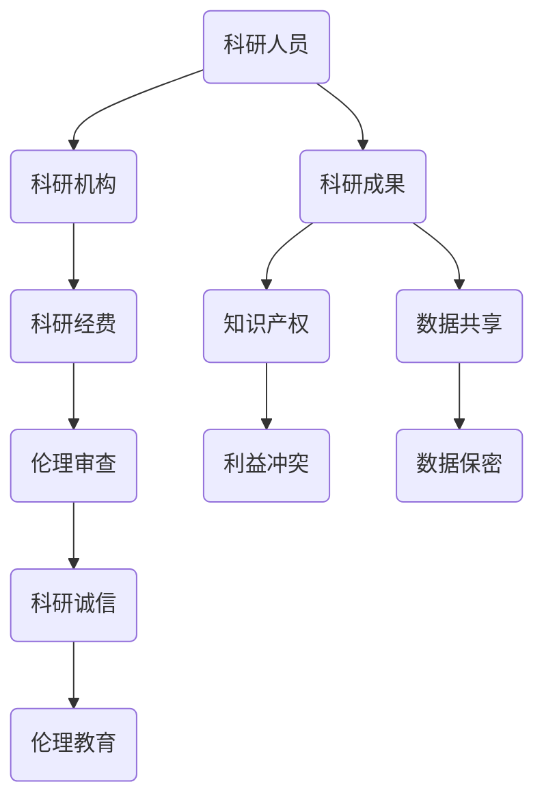

                 

### 科研伦理新框架的构建：在探索世界真理时的道德指引原则

关键词：科研伦理、道德指引、知识共享、数据安全、知识产权

摘要：
在当今时代，科研活动不断深入，科研成果对人类社会的发展产生了深远影响。然而，随之而来的伦理问题也日益凸显，如知识产权争议、研究不端行为和公众信任危机等。为了应对这些挑战，构建一套全面的科研伦理新框架显得尤为必要。本文将深入探讨科研伦理的困境，分析现有框架的不足，提出构建新框架的目标和原则，并通过概念联系和案例分析，为新框架的构建提供理论支持和实践指导。

## 第一部分: 背景介绍与问题分析

### 1.1. 问题背景

#### 1.1.1 科研伦理的困境

科研伦理是指在科研活动中遵循的道德规范，旨在确保科研活动的诚信、公正和透明。然而，随着科研活动的日益复杂化和全球化，科研伦理的困境也随之而来。首先，知识产权争议频发，涉及科研成果的归属权、使用权和收益分配等问题。其次，研究不端行为，如数据造假、抄袭和利益冲突，不仅损害了科研的公正性和可信度，也影响了科研人员的社会形象。最后，公众对科研的信任危机，导致科研成果的社会影响力下降，限制了科研资源的有效利用。

#### 1.1.2 伦理失范现象

伦理失范现象在科研活动中屡见不鲜，其表现形式多样。例如，一些科研人员为了追求学术地位和经济效益，不惜采取数据造假、抄袭他人成果等不正当手段。此外，一些科研项目存在利益冲突，如科研成果的转让或应用过程中，可能涉及到个人或机构的利益，导致科研决策的不公正。这些伦理失范行为不仅损害了科研的诚信，也影响了社会的公平和正义。

#### 1.1.3 伦理指引的必要性

面对科研伦理的困境和伦理失范现象，构建一套全面的科研伦理新框架显得尤为重要。首先，新框架可以为科研人员提供明确的道德指引，帮助他们遵循科研伦理的基本原则，确保科研活动的诚信和公正。其次，新框架可以规范科研行为，预防和打击研究不端行为，维护科研的公正性和可信度。最后，新框架可以增强公众对科研的信任，促进科研成果的社会化应用，推动科技与社会的良性互动。

### 1.2. 问题描述

#### 1.2.1 知识产权争议

知识产权争议是科研伦理问题中的核心之一。在科研过程中，科研成果的归属权和使用权的界定常常引发纠纷。例如，对于一项共同完成的科研成果，如何确定各参与者的贡献和权益分配，成为一个难题。此外，科研成果的转让和商业化过程中，也可能涉及到知识产权的保护和利益分配问题。这些问题不仅影响了科研人员的合法权益，也限制了科研成果的推广应用。

#### 1.2.2 研究不端行为

研究不端行为是指在科研活动中故意或过失地违反科研伦理规范的行为。数据造假、抄袭、利益冲突等都是研究不端行为的典型表现。这些行为不仅损害了科研的诚信和公正，也影响了科研成果的可信度和应用价值。例如，一些科研人员为了追求学术成果的发表和利益回报，不惜采取数据造假或抄袭他人成果的手段，这种行为严重损害了学术界的公正性和可信度。

#### 1.2.3 公众信任危机

公众信任危机是科研伦理问题的另一大挑战。随着科技的发展，科研成果对社会的影响日益深远，但同时也带来了新的伦理问题。例如，一些科研项目的商业化应用可能涉及到公众的隐私和利益，如何确保科研活动的透明性和公正性，成为公众关注的焦点。此外，一些科研不端行为和伦理失范现象的曝光，也严重影响了公众对科研的信任，降低了科研成果的社会影响力。

### 1.3. 问题解决

#### 1.3.1 现有伦理框架的不足

现有的科研伦理框架在一定程度上规范了科研行为，但仍然存在诸多不足。首先，现有框架对知识产权争议的解决缺乏具体操作性，导致纠纷处理难度大。其次，对于研究不端行为的预防和打击力度不足，缺乏有效的监督机制。最后，现有框架对公众信任危机的应对措施不足，缺乏有效的沟通和信任建设机制。

#### 1.3.2 构建新框架的目标

为了解决现有伦理框架的不足，构建一套新的科研伦理框架显得尤为必要。新框架的目标包括：明确科研成果的归属权和使用权，规范研究不端行为的界定和处罚，增强公众对科研的信任，推动科研伦理的规范化和国际化。新框架应具有操作性强、适应性和灵活性，能够应对不同领域和不同国家的科研伦理问题。

### 1.4. 边界与外延

#### 1.4.1 适用范围

新框架适用于各类科研活动和科研机构，包括自然科学、社会科学、医学、工程等领域。同时，新框架也应适用于跨国科研合作和国际科研交流，以促进全球科研伦理的规范化和一致性。

#### 1.4.2 限制条件

新框架在构建和应用过程中，应遵循相关法律法规和国际惯例，尊重各国文化和价值观念。同时，新框架也应考虑科研活动的实际情况，避免过于僵化和教条，以确保其实际操作性和适应性。

### 1.5. 概念结构与核心要素组成

#### 1.5.1 伦理框架的基本概念

新框架应包括以下基本概念：科研伦理、科研诚信、知识产权、数据共享、利益冲突等。这些概念应明确界定，形成统一的标准和规范。

#### 1.5.2 核心要素分析

新框架的核心要素包括：伦理原则、伦理规范、伦理监督和伦理教育。伦理原则是框架的指导思想和基本要求，伦理规范是具体操作规程和行为准则，伦理监督是保障框架实施的有效机制，伦理教育是提高科研人员伦理意识和素养的重要手段。

## 第二部分: 核心概念与联系

### 2.1. 伦理学基础

#### 2.1.1 伦理学的定义

伦理学是研究道德行为的学科，旨在探讨什么是正确的行为，以及如何做出道德决策。伦理学的基本问题是关于道德原则和道德价值的探究，包括道德义务、道德权利、道德责任等。

#### 2.1.2 伦理学的基本原则

伦理学的基本原则包括：公正、尊重、责任、善良和诚实。这些原则为科研伦理提供了理论基础，指导科研人员在实践中遵循道德规范。

#### 2.1.3 伦理学的理论流派

伦理学的理论流派包括：德行伦理学、义务伦理学、结果伦理学、情感伦理学等。这些理论流派从不同角度探讨了道德行为的本质和道德决策的依据。

### 2.2. 科研伦理核心概念

#### 2.2.1 科研诚信

科研诚信是指科研人员在科研活动中遵循诚实、公正、透明和责任的原则，确保科研成果的真实性和可靠性。科研诚信是科研伦理的核心，是保障科研活动质量的基础。

#### 2.2.2 数据共享与保密

数据共享与保密是科研伦理的重要组成部分。数据共享有助于科研成果的推广和应用，提高科研效率；同时，保护数据隐私和保密也是保障科研人员权益和知识产权的重要措施。

#### 2.2.3 知识产权与利益冲突

知识产权与利益冲突是科研伦理的敏感问题。知识产权保护是激励科研创新的重要手段，而利益冲突则可能影响科研决策的公正性。如何平衡知识产权保护和防止利益冲突，是科研伦理研究的重要课题。

### 2.3. 概念属性特征对比

#### 2.3.1 伦理与法律对比

伦理与法律都是规范行为的准则，但二者有所不同。伦理是内在的道德规范，强调道德义务和道德责任；法律是外在的社会规范，强调法定义务和法律责任。在科研伦理中，伦理与法律的协调和统一是保障科研活动合法性和公正性的关键。

#### 2.3.2 科研伦理与其他领域伦理对比

科研伦理与其他领域伦理如医学伦理、商业伦理等有相似之处，但也存在差异。科研伦理更注重科研成果的真实性和可靠性，以及科研活动的公正性和透明性。其他领域伦理则更关注特定领域的道德规范和伦理问题。

### 2.4. ER实体关系图架构

#### 2.4.1 ER图基本概念

ER图（实体-关系图）是数据库设计中常用的概念模型，用于描述实体和实体之间的关系。在科研伦理框架中，ER图可以用来描述科研活动中的各类实体及其关系。

#### 2.4.2 科研伦理实体关系图

以下是一个简化的科研伦理实体关系图，展示了科研活动中的主要实体及其关系：

## 第三部分: 新框架构建方法

### 3.1. 框架构建原则

#### 3.1.1 原则一：保护科研参与者权益

新框架应明确科研参与者的权益，包括科研成果的归属权、使用权和收益分配等。同时，应建立完善的权益保护机制，确保科研参与者的合法权益不受侵害。

#### 3.1.2 原则二：促进知识共享与创新

新框架应鼓励知识共享，推动科研成果的传播和应用。同时，应建立激励机制，鼓励科研人员积极参与创新活动，提高科研效率和质量。

#### 3.1.3 原则三：确保数据安全和隐私保护

新框架应重视数据安全和隐私保护，建立完善的数据管理和安全机制，确保科研数据的安全性和隐私性。同时，应明确数据共享的范围和条件，保护科研参与者的隐私权益。

### 3.2. 框架构建步骤

#### 3.2.1 第一步：确定构建目标

首先，明确新框架的构建目标，包括保护科研参与者权益、促进知识共享与创新、确保数据安全和隐私保护等。同时，应考虑新框架的适用范围和限制条件。

#### 3.2.2 第二步：收集和分析现有资料

收集和分析现有的科研伦理文献、法律法规和规章制度，了解国内外科研伦理的现状和发展趋势。同时，开展调研，了解科研人员的实际需求和意见建议。

#### 3.2.3 第三步：设计框架结构

根据构建目标和分析结果，设计新框架的基本结构和核心内容，包括伦理原则、伦理规范、伦理监督和伦理教育等。同时，应制定具体的操作规程和行为准则。

#### 3.2.4 第四步：框架试行与完善

在新框架设计完成后，应进行试行和评估，收集反馈意见并进行改进。通过反复试

