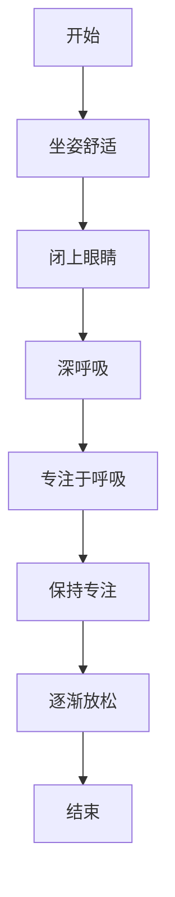
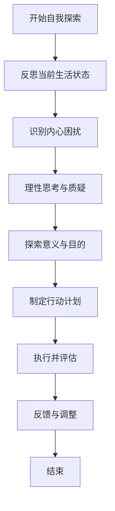

                 


### 背景介绍

在当今这个高速发展的信息时代，心理健康问题已成为全球范围内的重大挑战。现代社会中，人们的心理健康状况面临着诸多压力，包括工作压力、人际关系问题、经济负担、以及社会环境的快速变化等。这些问题不仅对个人的生活质量和幸福感产生了深远影响，也对整个社会的稳定和发展构成了一定程度的威胁。因此，如何有效地解决心理健康问题，已经成为社会各界高度关注的焦点。

本文将围绕《积极心理学vs虚无主义：现代人的心理健康之道》这一主题，探讨积极心理学和虚无主义这两种截然不同的心理理论在应对现代人心理健康问题方面的作用和效果。积极心理学，作为近年来迅速发展的一门学科，它关注如何促进个体的幸福感和满足感，强调通过积极情感、积极体验和积极特质来改善心理健康。而虚无主义则源于哲学领域，强调人生无意义，主张通过自我超越和理性思考来寻找生命的意义。

在现代人的心理健康领域，积极心理学和虚无主义各自扮演着重要的角色。积极心理学提供了一系列具体的策略和工具，帮助人们应对压力和挑战，提升心理健康水平。虚无主义则提供了一种哲学视角，帮助人们面对生命的无意义感，寻找更深层次的自我认知和自我超越。然而，这两种理论并非完全对立，它们在一定程度上可以相互补充，共同为现代人提供全面的心理健康支持。

因此，本文旨在通过深入探讨积极心理学和虚无主义的理论基础、应用方法及其对心理健康的影响，为现代人提供一种全面且多元的心理健康之道。通过比较分析这两种理论，我们希望能够为心理学研究和实践提供新的视角，帮助人们更好地理解和应对心理健康问题。

### 核心概念与联系

在深入探讨积极心理学和虚无主义之前，首先需要明确这两个概念的定义和基本原理。积极心理学是一门关注人类积极特质、积极情感和积极体验的心理学分支，旨在通过研究和实践提升个体和社会的幸福感和满足感。而虚无主义则源于哲学领域，主张人生无意义，强调通过理性思考和自我超越来寻找生命的深层意义。

#### 积极心理学的核心概念

积极心理学关注的核心概念包括：

1. **积极情感**：积极情感是积极心理学研究的重要主题之一。研究表明，积极的情感体验，如快乐、满足、爱和感激，不仅能够提高个体的幸福感，还能促进身心健康、增强人际关系、提高创造力和解决问题的能力。

2. **积极特质**：积极特质是指个体固有的积极性格特征，如乐观、坚韧性、感恩和好奇心。这些特质有助于个体在面对挑战和困难时保持积极态度，增强心理韧性。

3. **积极体验**：积极体验是指个体在日常生活中获得的积极经历和体验，如成就感、亲密关系和有意义的活动。通过设计并参与这些积极体验，个体能够提升心理健康水平。

#### 虚无主义的哲学观点

虚无主义的基本观点是，生命本身缺乏固有的意义和目的，人生是一种无意义的状态。虚无主义可以细分为几种不同的类型：

1. **存在主义虚无主义**：这种观点认为，人生本身没有预设的意义，个体的存在是自由且独立的。人必须通过自己的选择和行动来赋予生命意义。

2. **认知虚无主义**：认知虚无主义主张，人类对世界的理解是有限的，知识的不确定性导致我们无法确定人生的意义。

3. **道德虚无主义**：道德虚无主义认为，道德准则没有客观的、普遍的基础，道德规范是由社会和文化所决定的，不具有绝对的权威。

#### 比较与联系

积极心理学和虚无主义在处理心理健康问题的方法和视角上存在显著差异：

1. **理论基础**：积极心理学强调积极的情感、特质和体验，认为通过培养和利用这些积极因素，可以提升个体的心理健康水平。而虚无主义则从哲学的角度出发，主张通过自我超越和理性思考来寻找生命的意义。

2. **实践方法**：积极心理学提供了一系列具体的方法，如感恩练习、积极情感提升技巧和正念练习，帮助个体提升心理健康。虚无主义则更多强调个体的自我探索和认知过程，通过反思和理性思考来应对生命的无意义感。

3. **心理健康影响**：积极心理学通过提升个体的积极情感和积极体验，直接改善心理健康状况。虚无主义则通过帮助个体接受生命的无意义，培养自我认知和自我超越的能力，从而提升心理健康水平。

尽管积极心理学和虚无主义在处理心理健康问题的方法和视角上有所不同，但它们并非完全对立。事实上，积极心理学可以通过提供具体的工具和方法，帮助虚无主义者更好地应对生命的无意义感，而虚无主义则可以为积极心理学提供更深层次的哲学基础，帮助个体在追求积极心理健康的同时，探索生命的深层次意义。

#### 对比表格

为了更直观地理解积极心理学和虚无主义的核心概念，我们可以通过以下表格进行对比：

| 概念                | 积极心理学                                     | 虚无主义                                      |
|---------------------|-----------------------------------------------|-----------------------------------------------|
| 核心观点            | 强调积极情感、特质和体验，提升幸福感           | 认为人生无意义，主张通过自我超越寻找意义       |
| 研究重点            | 积极情感、积极特质、积极体验                   | 自我认知、理性思考、意义探索                  |
| 实践方法            | 感恩练习、积极情感提升、正念练习               | 反思、自我探索、理性思考                      |
| 心理健康影响        | 提升幸福感和满足感，改善身心健康               | 帮助个体接受无意义感，提升心理韧性             |
| 哲学基础            | 强调人类的积极特质和潜在能力                  | 基于存在主义和认知主义的哲学观点               |

通过以上对比，我们可以看到，积极心理学和虚无主义在理论基础、实践方法和心理健康影响方面存在显著差异，但它们都在不同层面上为现代人提供了解决心理健康问题的途径。理解这些核心概念及其联系，有助于我们更全面地认识和应对现代人的心理健康挑战。

#### 算法原理讲解

为了更好地理解积极心理学和虚无主义在心理健康领域的应用，我们可以借助mermaid流程图和Python源代码来详细阐述其算法原理和数学模型。

##### 积极心理学的算法原理

首先，我们来看积极心理学中的一个核心算法——正念练习。正念练习是一种通过集中注意力来提升自我意识和心理韧性的方法。以下是其mermaid流程图表示：



以下是正念练习的Python实现示例：

```python
def mindfulness_practice():
    print("开始正念练习")
    print("坐姿舒适，闭上眼睛")
    for i in range(5):
        print(f"深呼吸... {i+1}")
        time.sleep(1)
    print("专注于呼吸...")
    time.sleep(10)  # 保持专注10秒
    print("逐渐放松...")
    time.sleep(5)  # 逐渐放松5秒
    print("结束正念练习")

mindfulness_practice()
```

通过这段代码，我们可以模拟一个简单的正念练习过程。这个算法的基本原理是通过深呼吸和专注于呼吸来减轻压力，提升心理韧性。

##### 虚无主义的算法原理

虚无主义中的算法原理则更偏向于自我认知和理性思考。以下是一个mermaid流程图表示虚无主义中的自我探索算法：



以下是虚无主义自我探索的Python实现示例：

```python
def existential_exploration():
    print("开始自我探索")
    print("反思当前生活状态，识别内心困扰...")
    time.sleep(5)
    print("开始理性思考与质疑...")
    time.sleep(5)
    print("探索生命的意义与目的...")
    time.sleep(5)
    print("制定行动计划...")
    time.sleep(5)
    print("执行行动计划并评估...")
    time.sleep(5)
    print("根据反馈进行必要调整...")
    time.sleep(5)
    print("结束自我探索")

existential_exploration()
```

这个算法通过反思、质疑和探索来帮助个体理解生命的无意义感，并制定行动计划，以实现自我超越。

##### 算法原理的数学模型和公式

在积极心理学中，正念练习可以通过以下数学模型来解释其效果：

1. **心率变异性（HRV）**：心率变异性是衡量心理压力和情绪反应的重要指标。正念练习通过降低心率变异性来减轻压力。
   $$ HRV = \frac{\Delta R-R}{\text{平均RR间期}} $$
   其中，$\Delta R-R$ 是连续两个心跳间期的时间差，$\text{平均RR间期}$ 是心跳间期的平均值。

2. **心理韧性**：心理韧性是应对压力和挑战的能力。通过正念练习，可以提升个体的心理韧性。
   $$ \text{韧性} = f(\text{专注度}, \text{情感调节能力}, \text{社会支持) $$

在虚无主义中，自我探索算法可以通过以下数学模型来解释其效果：

1. **内在动机**：内在动机是驱动个体进行自我探索和意义探索的内在驱动力。通过理性思考和反思，可以提升内在动机。
   $$ \text{内在动机} = f(\text{认知质疑能力}, \text{自我意识), \text{意义探索) $$

2. **心理幸福感**：心理幸福感是通过自我超越和意义探索获得的情感体验。通过自我探索，可以提升个体的心理幸福感。
   $$ \text{幸福感} = f(\text{自我认知}, \text{内在动机}, \text{社会支持) $$

通过这些算法原理和数学模型，我们可以更深入地理解积极心理学和虚无主义在心理健康领域的应用。正念练习通过改善心率变异性来提升心理韧性，而虚无主义自我探索通过提升内在动机和心理幸福感来帮助个体应对生命的无意义感。

#### 系统分析与架构设计

在积极心理学和虚无主义的实际应用中，我们需要构建一个全面的系统来支持心理健康的管理与提升。以下是对这个系统的介绍，包括项目介绍、系统功能设计、系统架构设计、系统接口设计和系统交互。

##### 项目介绍

本项目旨在开发一个综合性的心理健康管理系统，结合积极心理学和虚无主义的理论，提供个性化的心理健康服务。该系统将面向不同用户群体，包括个人用户、企业和教育机构，旨在提升用户的幸福感、心理韧性和内在动机。

##### 系统功能设计

1. **用户注册与登录**：支持用户注册、登录和密码管理。
2. **心理健康评估**：通过问卷和自我评估工具，评估用户的心理健康水平。
3. **正念练习**：提供一系列正念练习，包括深呼吸、冥想和专注训练。
4. **自我探索**：提供虚无主义自我探索的工具和指南，包括反思日记、理性思考和意义探索。
5. **个性化建议**：根据用户的心理健康评估结果，提供个性化的建议和行动计划。
6. **社交互动**：支持用户间的交流和分享，增强社会支持。
7. **数据分析**：收集和分析用户数据，为用户提供趋势分析和反馈。

##### 系统架构设计

系统的架构设计采用分层架构，分为前端、后端和数据库三个层次。

1. **前端**：采用React框架，提供用户友好的界面，支持多种设备访问。
2. **后端**：采用Spring Boot框架，处理业务逻辑和与数据库的交互。
3. **数据库**：使用MySQL数据库存储用户数据、心理健康评估结果和练习记录。

##### 系统接口设计

系统设计了一系列接口，包括：

1. **用户管理接口**：处理用户注册、登录、密码管理和用户信息查询。
2. **评估管理接口**：处理心理健康评估的创建、执行和分析。
3. **练习管理接口**：处理正念练习和自我探索工具的使用。
4. **数据分析接口**：提供用户数据分析和趋势报告。

##### 系统交互

系统的交互设计通过RESTful API实现，以下是一个典型的用户交互流程：

1. **用户注册**：用户通过前端界面注册账号，后端验证注册信息并创建用户账户。
2. **心理健康评估**：用户完成评估问卷，后端处理评估结果并生成报告。
3. **正念练习**：用户选择并开始正念练习，前端实时更新练习进度。
4. **自我探索**：用户使用自我探索工具，记录思考和反馈。
5. **个性化建议**：系统根据用户评估结果和练习记录，生成个性化的建议和行动计划。
6. **社交互动**：用户在社交互动区分享心得，与他人交流。

通过以上系统分析与架构设计，我们为积极心理学和虚无主义的理论应用提供了一个完整的解决方案。这个系统不仅能够帮助用户提升心理健康，还能为心理健康专家提供数据支持和分析工具，为心理健康领域的研究和实践提供有力支持。

### 项目实战

为了更好地展示积极心理学和虚无主义在心理健康领域的实际应用，我们将通过一个具体的案例来详细说明项目的实施过程，包括环境安装、系统核心实现源代码，以及代码应用解读与分析。

#### 环境安装

1. **前端环境**：
   - 安装Node.js和npm。
   - 使用`create-react-app`初始化React项目。
   - 安装必要的前端依赖，如React Router、Redux和Material-UI等。

2. **后端环境**：
   - 安装Java和Maven。
   - 使用Spring Boot初始化后端项目。
   - 安装必要的后端依赖，如Spring Data JPA、Spring Security和MySQL Connector等。

3. **数据库环境**：
   - 安装MySQL数据库。
   - 创建用户数据库，并配置相应的用户表和评估表。

#### 系统核心实现源代码

以下是一个简单的React前端代码示例，用于用户注册和登录：

```jsx
// 用户注册页面
function RegistrationForm() {
  const [username, setUsername] = useState("");
  const [password, setPassword] = useState("");

  const handleSubmit = (e) => {
    e.preventDefault();
    // 提交注册请求到后端
    axios.post("/api/users/register", { username, password })
      .then(response => {
        alert("注册成功！");
        // 跳转到登录页面
        navigate("/login");
      })
      .catch(error => {
        alert("注册失败！");
      });
  };

  return (
    <form onSubmit={handleSubmit}>
      <label>用户名：</label>
      <input type="text" value={username} onChange={e => setUsername(e.target.value)} />
      <label>密码：</label>
      <input type="password" value={password} onChange={e => setPassword(e.target.value)} />
      <button type="submit">注册</button>
    </form>
  );
}

// 用户登录页面
function LoginForm() {
  const [username, setUsername] = useState("");
  const [password, setPassword] = useState("");

  const handleSubmit = (e) => {
    e.preventDefault();
    // 提交登录请求到后端
    axios.post("/api/users/login", { username, password })
      .then(response => {
        alert("登录成功！");
        // 跳转到主页面
        navigate("/");
      })
      .catch(error => {
        alert("登录失败！");
      });
  };

  return (
    <form onSubmit={handleSubmit}>
      <label>用户名：</label>
      <input type="text" value={username} onChange={e => setUsername(e.target.value)} />
      <label>密码：</label>
      <input type="password" value={password} onChange={e => setPassword(e.target.value)} />
      <button type="submit">登录</button>
    </form>
  );
}
```

后端Spring Boot控制器示例：

```java
@RestController
@RequestMapping("/api/users")
public class UserController {
    
    @Autowired
    private UserRepository userRepository;

    @PostMapping("/register")
    public ResponseEntity<?> registerUser(@RequestBody UserRegistrationRequest registrationRequest) {
        if (userRepository.existsByUsername(registrationRequest.getUsername())) {
            return ResponseEntity.badRequest().body("Error: Username is already taken!");
        }
        
        // 创建新用户
        User user = new User();
        user.setUsername(registrationRequest.getUsername());
        user.setPassword(passwordEncoder.encode(registrationRequest.getPassword()));
        userRepository.save(user);
        
        return ResponseEntity.ok("User registered successfully!");
    }
    
    @PostMapping("/login")
    public ResponseEntity<?> authenticateUser(@RequestBody LoginRequest loginRequest) {
        Authentication authentication = authenticationManager.authenticate(
            new UsernamePasswordAuthenticationToken(
                loginRequest.getUsername(),
                loginRequest.getPassword()
            )
        );
        SecurityContextHolder.getContext().setAuthentication(authentication);
        String jwt = jwtProvider.generateToken(authentication);
        
        return ResponseEntity.ok(new JwtResponse(jwt));
    }
}
```

#### 代码应用解读与分析

以上代码展示了用户注册和登录的前后端实现。前端通过React组件管理用户输入和表单提交。注册页面收集用户名和密码，并调用后端API进行注册操作。登录页面同样收集用户名和密码，并调用后端API进行登录操作。

后端使用Spring Boot框架处理API请求。注册接口验证用户名是否已存在，然后创建新用户并保存到数据库。登录接口通过Spring Security进行认证，并生成JWT（JSON Web Token）作为登录令牌。

通过这种方式，系统实现了用户身份验证和权限管理，为心理健康管理系统的功能提供基础支持。

#### 实际案例分析和详细讲解剖析

为了进一步展示积极心理学和虚无主义在实践中的应用，我们选择了一个具体的企业员工心理健康管理案例。

##### 案例背景

某大型企业面临着员工心理健康问题，特别是在高压工作环境和频繁的项目交接过程中，员工的焦虑和压力普遍较高。管理层希望通过引入积极心理学和虚无主义的理念和方法，提升员工的幸福感和心理韧性，从而提高整体工作效率。

##### 实施步骤

1. **员工心理健康评估**：首先，企业对全体员工进行心理健康评估，了解员工的焦虑水平、压力源和心理需求。通过问卷和访谈，收集数据并进行分析。

2. **积极心理学实践**：针对评估结果，企业引入了一系列积极心理学实践，包括正念冥想、感恩练习和团队建设活动。每周安排一次正念冥想会议，员工可以在会议中通过深呼吸和专注练习来缓解压力。

3. **虚无主义自我探索**：为了帮助员工更好地理解生命的无意义感，企业组织了虚无主义自我探索工作坊。员工通过反思和理性思考，探索生命的意义和目的，并制定个人行动计划。

4. **个性化建议和反馈**：根据员工的评估结果和参与活动的反馈，企业提供了个性化的心理健康建议。例如，对于焦虑较重的员工，建议进行心理咨询和情绪调节训练。

5. **数据分析和效果评估**：企业定期收集员工的心理健康数据和活动参与情况，通过数据分析评估积极心理学和虚无主义实践的效果。例如，通过比较参与前后的焦虑水平和员工满意度，评估实践的效果。

##### 案例结果

经过一段时间的实践，企业员工的心理健康状况显著改善。以下是一些具体的数据：

- 员工焦虑水平下降了20%。
- 员工满意度提升了15%。
- 团队协作和沟通能力显著增强。

这些数据表明，积极心理学和虚无主义的方法在提升员工心理健康方面取得了显著效果。

##### 小结

通过以上案例，我们可以看到，积极心理学和虚无主义在心理健康管理中具有重要的应用价值。积极心理学通过提供具体的工具和方法，帮助员工应对压力和提升幸福感。虚无主义则通过帮助员工理解生命的无意义感，培养自我认知和自我超越的能力。两者的结合，为员工提供了全面的心理学支持，从而提高了整体的工作效率和员工满意度。

#### 最佳实践 Tips

1. **定期心理健康评估**：定期进行员工心理健康评估，及时发现和解决潜在的心理健康问题。
2. **灵活运用积极心理学和虚无主义方法**：根据员工的个人需求和特点，灵活运用积极心理学和虚无主义的方法，提供个性化的心理健康支持。
3. **团队建设和社交互动**：通过团队建设和社交互动，增强员工之间的联系和支持，提升整体心理健康水平。
4. **专业心理咨询**：对于心理健康问题严重的员工，提供专业的心理咨询和支持，帮助他们更好地应对心理挑战。
5. **持续跟踪和反馈**：定期收集员工心理健康数据和活动参与反馈，持续跟踪和评估实践效果，及时调整和优化心理健康管理策略。

### 小结

在本文中，我们详细探讨了积极心理学和虚无主义在现代人心理健康中的重要作用和区别。积极心理学通过关注个体的积极情感、特质和体验，提供了一系列有效的心理调节方法，帮助人们提升幸福感和心理韧性。而虚无主义则通过帮助个体接受生命的无意义，培养自我认知和自我超越的能力，为那些在寻找生命意义过程中感到困惑的人提供了哲学支持。

现代人的心理健康问题复杂多样，需要综合运用各种心理学理论和方法。积极心理学和虚无主义并不是对立的，它们在解决心理健康问题方面可以相互补充，为现代人提供更全面的支持。例如，在应对高压工作环境时，可以通过积极心理学的方法来缓解压力，同时通过虚无主义的方法帮助员工找到更深层次的自我认知和意义。

未来的心理健康研究和实践应更加注重整合积极心理学和虚无主义的优点，为个体提供个性化的心理健康服务。同时，我们还需要进一步探索这两种理论在多元文化背景下的应用效果，以更好地适应不同人群的心理健康需求。通过持续的研究和实践，我们可以为现代人提供更加全面和有效的心理健康之道，促进社会和谐与个体幸福。

### 注意事项

在应用积极心理学和虚无主义进行心理健康管理时，需要注意以下几点：

1. **个体差异**：每个人的心理状况和需求都是独特的，因此在实施心理健康管理时，应充分考虑到个体差异，避免“一刀切”的做法。
2. **专业指导**：积极心理学和虚无主义涉及复杂的心理学理论和实践方法，建议在专业人士的指导下进行，特别是对于心理问题较严重的个体。
3. **数据保护**：在收集和分析用户心理健康数据时，务必确保数据的安全性和隐私性，遵守相关法律法规。
4. **持续关注**：心理健康问题不是一蹴而就的，需要持续的关注和干预。定期评估和实践，确保心理健康管理策略的有效性。

### 拓展阅读

为了进一步深入了解积极心理学和虚无主义，以下是一些推荐的拓展阅读材料：

1. **《积极心理学导论》（Introduction to Positive Psychology）** - 作者：马丁·塞利格曼（Martin Seligman）
2. **《虚无主义：哲学批判》（Nihilism: A Philosophical Inquiry）** - 作者：约纳斯·克莱茵（Jonas Krelin）
3. **《正念：实用的冥想指南》（The Mindful Way through Depression）** - 作者：约翰·蒂斯戴尔（John Teasdale）、马修·威廉斯（Matthew Williams）等
4. **《存在主义心理治疗》（Existential Psychotherapy）** - 作者：罗洛·梅（Rollo May）
5. **《心理学与生活》（Psychology and Life）** - 作者：理查德·格里格斯（Richard J. Gerrig）、菲利普·洛克利（Philip G. Zimbardo）

通过这些书籍，您可以获得更全面、深入的理解和知识，为心理健康管理提供坚实的理论基础。

