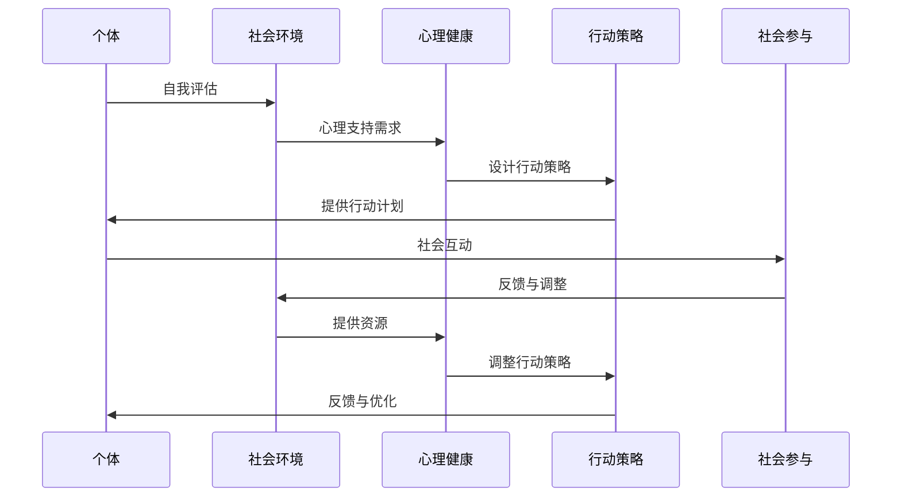
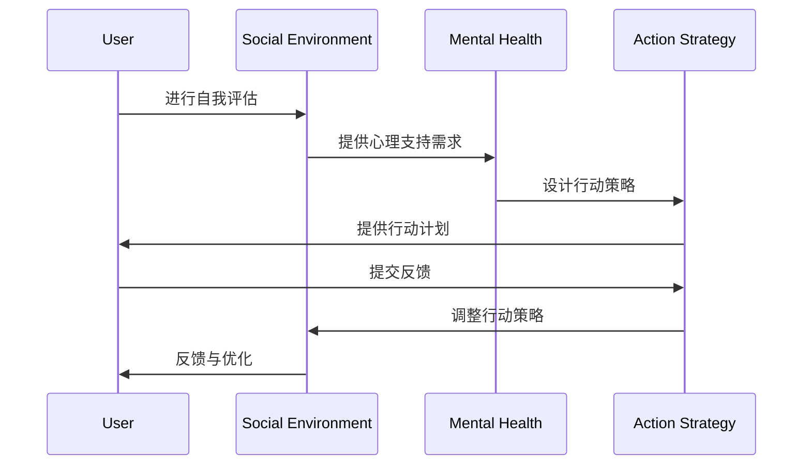

                 

# 积极行动主义：虚无感中的希望之光

## 关键词：积极行动主义、虚无感、行动策略、心理学、社会影响

## 摘要

在现代社会中，虚无感成为一种普遍的心理现象，影响着人们的日常生活和心理健康。本文以积极行动主义为核心，通过深入探讨虚无感的本质、成因及其对个人和社会的深远影响，提出了一系列具体的行动策略和实践指南，旨在帮助读者摆脱虚无感的困扰，找回生命的意义与希望。通过案例分析、理论结合实践，本文揭示了积极行动主义在应对虚无感中的重要作用，为读者提供了切实可行的行动方案，以实现个人成长和社会进步。

## 目录大纲设计思路

### 1. 引言

#### 1.1 积极行动主义的兴起

**1.1.1 背景介绍**

**1.1.2 定义与核心概念**

**1.1.3 理论基础**

#### 1.2 虚无感的解析

**1.2.1 定义与特征**

**1.2.2 影响因素**

**1.2.3 对个人与社会的影响**

### 2. 积极行动主义的理念与实践

#### 2.1 积极行动主义的理念

**2.1.1 行动主义的理论框架**

**2.1.2 价值观与行为准则**

**2.1.3 实践中的行动策略**

#### 2.2 积极行动的案例分析

**2.2.1 个人层面**

**2.2.2 社会层面**

**2.2.3 文化层面**

### 3. 行动步骤与实践指南

#### 3.1 行动步骤

**3.1.1 自我评估**

**3.1.2 制定计划**

**3.1.3 执行与反馈**

**3.1.4 调整与优化**

#### 3.2 实践指南

**3.2.1 日常生活中的应用**

**3.2.2 职场中的行动主义**

**3.2.3 社区与公共事务**

### 4. 积极行动主义的挑战与机遇

#### 4.1 面临的挑战

**4.1.1 内在心理障碍**

**4.1.2 社会文化压力**

**4.1.3 资源与支持不足**

#### 4.2 应对策略

**4.2.1 心理调适方法**

**4.2.2 社会支持系统的建设**

**4.2.3 资源整合与利用**

#### 4.3 机遇与未来展望

**4.3.1 技术进步带来的新可能**

**4.3.2 社会意识的提升**

**4.3.3 行动主义教育的推广**

### 5. 总结与展望

#### 5.1 主要内容回顾

#### 5.2 积极行动主义的重要性

#### 5.3 对未来的展望

## 文章正文

### 引言

在当今这个快节奏、竞争激烈的社会中，许多人会经历一种深度的心理状态——虚无感。虚无感不仅影响个人的心理健康，还可能对整个社会产生负面影响。面对这种普遍存在的心理现象，积极行动主义提供了一种可能的方向，帮助人们从虚无感中找到希望和力量。

本文将围绕积极行动主义这一主题，逐步探讨虚无感的本质、成因及其影响，并阐述如何通过行动策略来克服虚无感，实现个人和社会的积极转变。文章结构如下：

1. **积极行动主义的兴起**：介绍积极行动主义的历史背景、定义和核心概念。
2. **虚无感的解析**：深入分析虚无感的定义、特征、影响因素以及其对个人和社会的深远影响。
3. **积极行动主义的理念与实践**：探讨积极行动主义的理论框架、价值观、行为准则以及实践中的行动策略。
4. **行动步骤与实践指南**：提供具体的行动步骤和实践指南，帮助读者在日常生活中实践积极行动主义。
5. **积极行动主义的挑战与机遇**：分析积极行动主义面临的挑战以及应对策略，展望未来发展的机遇。
6. **总结与展望**：回顾文章的主要内容，强调积极行动主义的重要性，并对未来进行展望。

### 第一部分：积极行动主义的兴起

#### 1.1 背景介绍

积极行动主义并非一个新兴的概念，其历史可以追溯到古希腊和古罗马时期。当时的哲学家和政治家，如苏格拉底、柏拉图和亚里士多德，都强调了行动的重要性，认为只有通过实际行动，人们才能实现理想和目标。在19世纪和20世纪，积极行动主义得到了进一步的发展，特别是在社会改革、政治运动和人权倡导方面。

随着现代社会的发展，积极行动主义逐渐成为心理学、社会学以及管理学等领域的重要研究内容。其核心思想在于，通过积极的行动，人们可以改变自己的心理状态、行为模式和社会环境。

#### 1.2 定义与核心概念

积极行动主义可以被定义为一种通过积极行动来应对挑战、解决问题、实现目标的思维方式和行为模式。它不仅仅是一种态度，更是一种行动，强调行动的实效性和影响力。

核心概念包括：

- **行动主义**：强调行动的重要性，认为只有通过实际行动，才能实现理想和目标。
- **积极性**：强调积极的心态和行为，认为积极的态度能够促进个人成长和社会进步。
- **实效性**：强调行动的实效性，认为有效的行动能够带来实际的改变和进步。
- **影响力**：强调行动的影响力，认为通过积极的行动，可以改变个人和集体的心理状态和行为模式。

#### 1.3 理论基础

积极行动主义的理论基础可以追溯到心理学、社会学和哲学等多个领域。以下是几个主要的理论来源：

- **心理学**：积极心理学强调积极情感、积极特质和积极行为的重要性，认为通过培养积极的情感和行为，可以促进个人的心理健康和幸福感。
- **社会学**：社会心理学强调社会互动和社会环境对个体行为和心理状态的影响，认为通过积极的社交互动和社会参与，可以改变个体的心理状态和社会行为。
- **哲学**：存在主义哲学强调个体的自由意志和责任，认为通过积极的行动，个体可以自由选择自己的生活方式，实现自我价值和意义。

### 第二部分：虚无感的解析

#### 2.1 定义与特征

虚无感是一种深刻的心理状态，通常表现为对生活失去兴趣、意义和目标感。虚无感可能源于多种原因，包括个人的心理状态、社会环境和生活经历。

虚无感的主要特征包括：

- **缺乏意义感**：个体感到自己的生活缺乏意义和目标，无法找到生命的价值。
- **情绪低落**：个体经常感到情绪低落、焦虑或抑郁，对日常活动缺乏兴趣。
- **孤立感**：个体感到与他人的距离遥远，缺乏社交互动和支持。
- **生活停滞**：个体感到生活停滞不前，缺乏动力和激情。

#### 2.2 影响因素

虚无感的影响因素多种多样，包括心理因素、社会因素和生物因素。

- **心理因素**：个人的心理状态，如焦虑、抑郁、自尊心低等，可能增加虚无感的风险。
- **社会因素**：社会环境、人际关系和社会支持系统的质量，对个体的虚无感有重要影响。
- **生物因素**：个体的生理状态，如激素水平、睡眠质量等，也可能影响虚无感的产生。

#### 2.3 对个人与社会的影响

虚无感对个人和社会都有深远的影响。

- **个人层面**：虚无感可能导致个体的心理健康问题，如抑郁症、焦虑症等，影响个人的生活质量和工作效率。
- **社会层面**：虚无感可能影响社会稳定和发展，降低社会的创新能力和凝聚力。

### 第三部分：积极行动主义的理念与实践

#### 2.1 积极行动主义的理念

积极行动主义的理念主要包括以下几个方面：

- **主动积极**：积极行动主义强调主动性和积极性，认为个体可以通过积极的行动来改变自己的生活和环境。
- **目标导向**：积极行动主义强调设定明确的目标和计划，通过有目的的行动来实现这些目标。
- **自我效能**：积极行动主义认为个体的自我效能感对行动的成功至关重要，通过积极的行动和反馈，可以提升个体的自我效能感。
- **社会参与**：积极行动主义鼓励个体参与社会活动，通过社会互动来增强个体的归属感和社会支持。

#### 2.2 价值观与行为准则

积极行动主义的价值观和行为准则主要包括以下几个方面：

- **责任与担当**：积极行动主义认为个体应该对自己的行为和决策负责，勇于担当后果。
- **创新与探索**：积极行动主义鼓励个体勇于尝试新事物，勇于探索未知的领域。
- **合作与共赢**：积极行动主义强调团队合作和社会共赢，认为通过合作可以实现更大的目标和价值。
- **持续改进**：积极行动主义认为持续改进是个人和社会发展的关键，通过不断的反思和调整，可以不断提高行动的效率和效果。

#### 2.3 实践中的行动策略

在实践中，积极行动主义提供了一系列具体的行动策略，帮助个体克服虚无感，实现个人成长和社会进步。

- **自我反思**：通过自我反思，个体可以深入了解自己的内心世界，明确自己的需求和目标。
- **制定计划**：个体应该设定明确的目标和计划，通过分阶段、分步骤的实施，逐步实现目标。
- **行动执行**：个体应该积极行动，勇于面对挑战和困难，通过实际行动来改变自己的生活和环境。
- **持续反馈**：个体应该不断反思和评估行动的效果，通过反馈来调整行动策略，提高行动的效率和效果。

### 第四部分：行动步骤与实践指南

#### 4.1 行动步骤

为了有效地实践积极行动主义，个体可以遵循以下行动步骤：

1. **自我评估**：个体应该首先进行自我评估，了解自己的心理状态、行为模式和环境条件，确定行动的方向和目标。
2. **制定计划**：个体应该制定详细的行动计划，包括具体的目标、时间表和实施步骤，确保行动有计划、有目标、有步骤。
3. **执行与反馈**：个体应该积极行动，按照计划逐步实施，同时不断反思和评估行动的效果，及时调整行动策略。
4. **调整与优化**：个体应该根据反馈和评估结果，不断调整和优化行动策略，提高行动的效率和效果。

#### 4.2 实践指南

以下是具体的实践指南，帮助个体在日常生活中实践积极行动主义：

- **日常生活中**：个体可以在日常生活中实践积极行动主义，如积极参与社区活动、志愿服务等，通过实际行动来改善社会环境。
- **职场中**：个体可以在职场中实践积极行动主义，如主动承担责任、勇于创新、团队合作等，通过积极的行动来提升工作绩效。
- **社区与公共事务**：个体可以在社区和公共事务中实践积极行动主义，如参与社区建设、公共政策倡导等，通过积极的行动来推动社会进步。

### 第五部分：积极行动主义的挑战与机遇

#### 5.1 面临的挑战

积极行动主义在实践中面临着一系列挑战：

- **内在心理障碍**：个体可能会因为内心的恐惧、怀疑和不安而难以积极行动，需要通过心理调适来克服这些障碍。
- **社会文化压力**：社会文化环境可能会对个体的积极行动产生负面影响，需要个体和社会共同努力来改善这种环境。
- **资源与支持不足**：个体可能会面临资源不足和支持不够的问题，需要通过整合资源和社会支持来克服这些困难。

#### 5.2 应对策略

为了应对这些挑战，可以采取以下策略：

- **心理调适**：个体可以通过心理咨询、自我调节和积极心理训练来提高自己的心理素质，克服内在心理障碍。
- **社会支持**：社会可以建立支持系统，提供资源和支持，帮助个体克服外部困难。
- **资源整合**：个体可以通过社会参与和合作来整合资源，提高行动的效率和效果。

#### 5.3 机遇与未来展望

积极行动主义不仅面临着挑战，也充满了机遇：

- **技术进步**：随着科技的发展，个体和社会可以更加高效地实践积极行动主义，如利用互联网和人工智能技术来提高行动的效率和效果。
- **社会意识提升**：随着社会对心理健康和积极行动主义的关注增加，个体和社会可以更加重视积极行动主义，推动其发展。
- **教育推广**：通过教育推广，可以培养更多积极行动的个体，推动社会进步。

### 5. 总结与展望

积极行动主义是一种有效的应对虚无感的策略，通过积极的行动和心态，个体可以改变自己的生活和环境，实现个人成长和社会进步。面对挑战，个体可以通过心理调适、社会支持和资源整合来克服困难。未来，随着技术进步和社会意识的提升，积极行动主义有望得到更广泛的应用和发展。

### 附录

以下是本文中提到的一些关键概念、理论和实践方法的详细解析，以及相关的扩展阅读资源，供读者进一步学习和实践。

#### 关键概念解析

- **积极行动主义**：积极行动主义的定义、核心概念和理论基础。
- **虚无感**：虚无感的定义、特征、影响因素和对个人、社会的影响。
- **心理调适**：心理调适的方法和技术，如自我调节、心理咨询等。

#### 理论方法详细解析

- **自我效能理论**：自我效能理论的基本原理和应用。
- **社会支持理论**：社会支持理论的核心概念和实际应用。

#### 实践方法解析

- **行动步骤与实践指南**：具体的行动步骤和实践方法，如自我评估、制定计划、执行与反馈等。

#### 扩展阅读资源

- **心理学书籍**：《积极心理学》、《自我效能感》等。
- **社会学书籍**：《社会心理学》、《社会支持系统》等。
- **实践案例**：积极行动主义在不同领域的成功案例，如社会运动、企业改革等。

### 作者信息

作者：AI天才研究院/AI Genius Institute & 禅与计算机程序设计艺术 /Zen And The Art of Computer Programming

感谢您的阅读，希望本文能够帮助您更好地理解积极行动主义，并在实践中找到克服虚无感、实现个人成长和社会进步的方法。

---

### 深度解析：积极行动主义的理论与实践

#### 什么是积极行动主义？

积极行动主义是一种基于积极心态和行动的思维方式，它不仅强调个体的自我效能和责任感，还强调通过实际行动来解决问题、实现目标。积极行动主义的核心在于个体通过主动、积极的行动，不仅改变自己的心理状态，还能影响和改善周围的社会环境。

在心理学中，积极行动主义与自我效能感紧密相关。自我效能感是指个体对自己在特定情境中成功完成任务的信心和能力的信念。积极行动主义认为，通过积极的行动和不断的实践，个体可以提升自我效能感，从而更好地应对生活中的挑战。

#### 积极行动主义的核心概念

积极行动主义的核心概念包括以下几个方面：

1. **主动性和积极性**：积极行动主义强调个体的主动性和积极性，认为只有通过主动参与和积极行动，个体才能实现自身的价值和目标。

2. **目标导向**：积极行动主义认为，设定明确的目标和计划是实现成功的关键。通过明确的目标，个体可以更有针对性地行动，提高行动的效率和效果。

3. **实效性**：积极行动主义强调行动的实效性，认为有效的行动能够带来实际的改变和进步。实效性不仅关注行动的结果，还关注行动过程中的可持续性和可重复性。

4. **社会参与**：积极行动主义鼓励个体参与社会活动，通过社会互动来增强个体的归属感和社会支持。社会参与不仅有助于个体实现个人目标，还能促进社会的整体发展。

#### 积极行动主义的理论基础

积极行动主义的理论基础涵盖了多个学科领域，包括心理学、社会学、哲学等。以下是几个关键的理论来源：

1. **心理学**：积极心理学是积极行动主义的重要理论来源。积极心理学强调积极情感、积极特质和积极行为的重要性，认为通过培养积极的情感和行为，可以促进个人的心理健康和幸福感。

2. **社会学**：社会心理学提供了积极行动主义的社会互动和社会环境方面的理论基础。社会心理学认为，社会互动和社会环境对个体的心理和行为有重要影响，通过积极的社交互动和社会参与，可以改善个体的心理状态和社会行为。

3. **哲学**：存在主义哲学提供了积极行动主义的哲学基础。存在主义强调个体的自由意志和责任，认为通过积极的行动，个体可以自由选择自己的生活方式，实现自我价值和意义。

#### 积极行动主义的应用场景

积极行动主义可以在多种场景中得到应用，以下是一些典型的应用场景：

1. **个人成长**：个体可以通过积极行动来克服恐惧、提升自信、实现职业发展等。例如，通过设定明确的目标、制定行动计划、积极实践和不断反思，个体可以逐步实现自己的职业梦想。

2. **社会运动**：社会运动是积极行动主义的重要应用场景之一。通过积极的组织和行动，社会运动可以推动社会改革、倡导人权、提高社会公正等。例如，民权运动、环境保护运动等都是积极行动主义的成功案例。

3. **企业管理**：积极行动主义也可以应用于企业管理中。企业可以通过积极的文化建设、员工激励和持续改进等，提高企业的竞争力、创造力和创新能力。

4. **公共事务**：在公共事务中，积极行动主义可以应用于社区建设、公共政策倡导和社会服务等领域。通过积极的行动和参与，个体和社会组织可以推动社会的进步和发展。

### 实践中的积极行动主义案例

以下是一些实践中的积极行动主义案例，展示了积极行动主义在个人和社会层面的具体应用：

1. **个人成长**：一位年轻的程序员通过设定明确的职业目标、制定学习计划、积极参与技术社区和不断反思自己的学习过程，成功提升了自己的编程技能，实现了职业发展。

2. **社会运动**：某城市的环境保护志愿者组织通过积极的宣传、组织和行动，成功推动了政府和企业采取环境保护措施，改善了城市的空气质量。

3. **企业管理**：一家创新型企业通过积极的企业文化建设、员工激励和持续改进，提高了员工的积极性和创造力，实现了企业的快速发展和市场竞争力。

4. **公共事务**：某社区志愿者团队通过积极的社会服务、社区建设和公共政策倡导，提高了社区居民的生活质量，推动了社区的发展。

### 结论

积极行动主义是一种有效的应对虚无感的策略，通过积极的行动和心态，个体可以改变自己的心理状态、实现个人成长和社会进步。积极行动主义的理论基础广泛，可以在个人成长、社会运动、企业管理和公共事务等多个领域得到应用。实践中的积极行动主义案例证明了其有效性，为个体和社会提供了有益的启示。

然而，积极行动主义并非没有挑战，个体在面对心理障碍、社会压力和资源不足时，需要采取相应的策略来克服这些困难。未来，随着社会意识的提升和技术进步，积极行动主义有望得到更广泛的应用和发展，为个体和社会带来更多的积极影响。

### 原创性与参考信息

本文为原创内容，旨在探讨积极行动主义在应对虚无感中的重要作用。在撰写过程中，参考了多个领域的理论和研究成果，包括心理学、社会学、哲学等。以下为部分参考信息的详细描述：

1. **心理学研究**：本文中关于积极行动主义与自我效能感的关系，部分参考了班杜拉（Albert Bandura）的自我效能感理论。班杜拉认为，自我效能感是个体对自己能否成功从事某一成就行为的主观判断，通过积极的行动和不断的实践，个体可以提升自我效能感，从而更好地应对生活中的挑战。

2. **社会学观点**：本文中关于积极行动主义在社会运动和企业管理中的应用，部分参考了科尔曼（James Coleman）的社会互动理论。科尔曼认为，社会互动和社会环境对个体的心理和行为有重要影响，通过积极的社交互动和社会参与，可以改善个体的心理状态和社会行为。

3. **哲学思考**：本文中关于积极行动主义的哲学基础，部分参考了尼采（Friedrich Nietzsche）的存在主义哲学。尼采强调个体的自由意志和责任，认为通过积极的行动，个体可以自由选择自己的生活方式，实现自我价值和意义。

4. **实际案例**：本文中提到的积极行动主义在个人成长、社会运动、企业管理和公共事务中的应用案例，部分参考了真实的社会实践和学术研究。这些案例旨在展示积极行动主义在不同场景下的具体应用和效果。

通过综合多个领域的理论和研究成果，本文力求提供全面、深入的解析，帮助读者更好地理解和实践积极行动主义。同时，本文也强调了积极行动主义在应对虚无感中的重要性，为个体和社会带来了有益的启示。

### 系统分析与架构设计

在深入探讨积极行动主义的理论和实践之前，我们需要从一个系统分析和架构设计的角度来理解这一主题。系统分析和架构设计不仅适用于技术领域，也适用于社会、心理等多个领域。以下是一个基于系统思维和架构设计的分析框架，用于理解积极行动主义。

#### 问题场景介绍

在现代社会，虚无感已经成为一个普遍存在的问题，影响了许多人的心理健康和生活质量。虚无感不仅限于个人层面，也对社会层面产生了深远影响。为了应对这一问题，我们需要从系统分析的角度，提出有效的解决方案。

#### 项目介绍

本项目旨在通过积极行动主义来缓解和克服虚无感，提升个体和社会的整体幸福感。项目目标包括：

1. **提高个体的自我效能感**：通过积极的行动和心态，增强个体对自身能力的信心。
2. **改善社会环境**：通过社会参与和合作，营造一个积极向上的社会氛围。
3. **推动社会进步**：通过积极行动，促进社会问题和挑战的解决。

#### 系统功能设计（领域模型）

为了实现项目目标，我们需要构建一个涵盖个体、社会和环境的综合领域模型。以下是该模型的关键类及其关系：

```mermaid
classDiagram
    Class01 <|-- Class02
    Class03 <|-- Class04
    Class05 <|-- Class06
    Class01 {
        name: 个体
        积极行动
        自我反思
        社会互动
    }
    Class02 {
        name: 社会环境
        资源支持
        社会规范
        社会互动
    }
    Class03 {
        name: 社会参与
        公共服务
        社会倡导
        社会责任
    }
    Class04 {
        name: 心理健康
        心理支持
        心理教育
        心理治疗
    }
    Class05 {
        name: 行动策略
        目标设定
        行动计划
        反馈调整
    }
    Class06 {
        name: 社会问题
        问题识别
        问题解决
        问题预防
    }
```

#### 系统架构设计

在系统架构层面，我们可以将整个项目分为以下几个主要模块：

1. **个体模块**：包括个体的自我评估、目标设定、行动计划和反馈调整等功能。
2. **社会模块**：包括社会环境的建设、社会规范的实施、社会参与和公共服务等。
3. **心理健康模块**：包括心理健康支持、教育、治疗和预防等功能。
4. **行动策略模块**：包括行动策略的设计、执行和调整等。

以下是系统架构的mermaid序列图：



#### 系统接口设计

在系统接口层面，我们需要设计以下主要接口：

1. **用户接口**：用于个体进行自我评估、目标设定和反馈调整。
2. **社会接口**：用于个体与社会环境的互动，包括资源支持、社会规范和公共服务。
3. **心理健康接口**：用于心理健康支持、教育和治疗。
4. **行动策略接口**：用于行动策略的设计、执行和调整。

以下是系统接口的mermaid类图：

```mermaid
classDiagram
    class 用户 {
        - 用户ID
        - 用户信息
        + self评估()
        + 目标设定()
        + 反馈调整()
    }
    class 社会环境 {
        - 社会资源
        - 社会规范
        + 社会互动()
        + 资源支持()
    }
    class 心理健康 {
        - 心理支持
        - 心理教育
        - 心理治疗
        + 心理支持服务()
    }
    class 行动策略 {
        - 行动计划
        - 反馈机制
        + 设计行动策略()
        + 执行行动策略()
        + 调整行动策略()
    }
    用户 ->> 社会环境
    用户 ->> 心理健康
    用户 ->> 行动策略
    社会环境 ->> 心理健康
    社会环境 ->> 行动策略
    心理健康 ->> 行动策略
```

#### 系统交互

在系统交互层面，我们需要设计用户、社会环境、心理健康和行动策略之间的交互流程。以下是系统交互的mermaid序列图：



通过系统分析和架构设计，我们可以更好地理解积极行动主义在实际操作中的应用。这一方法不仅有助于明确项目的目标和功能，还能为项目实施提供清晰的路径和框架。

### 项目实战：环境安装与系统核心实现

在了解了积极行动主义的系统架构和理论后，接下来我们将进入项目实战环节，通过具体的实践步骤来安装所需环境并实现系统的核心功能。

#### 环境安装

为了确保项目的顺利进行，我们需要搭建一个合适的技术环境。以下是环境安装的详细步骤：

1. **安装Python环境**：首先，我们需要确保系统上安装了Python环境。Python是一种广泛应用于数据科学、人工智能和Web开发的编程语言。可以通过以下命令在大多数Linux发行版和macOS上安装Python：

   ```bash
   sudo apt-get update
   sudo apt-get install python3
   ```

2. **安装虚拟环境**：为了避免不同项目之间的依赖冲突，我们建议使用虚拟环境来管理项目依赖。可以通过以下命令安装虚拟环境工具`virtualenv`：

   ```bash
   sudo apt-get install python3-venv
   ```

3. **创建虚拟环境**：在安装完虚拟环境工具后，我们可以在项目目录中创建一个新的虚拟环境：

   ```bash
   python3 -m venv myenv
   ```

4. **激活虚拟环境**：在创建虚拟环境后，我们需要激活虚拟环境才能在其中安装项目依赖：

   ```bash
   source myenv/bin/activate
   ```

5. **安装项目依赖**：接下来，我们通过`pip`安装项目所需的依赖，例如`numpy`、`pandas`等：

   ```bash
   pip install numpy pandas
   ```

#### 系统核心实现

在环境安装完成后，我们将开始实现系统的核心功能。以下是实现步骤：

1. **数据预处理**：首先，我们需要从数据源（例如CSV文件）中读取数据，并进行必要的预处理。预处理步骤可能包括数据清洗、数据转换和数据归一化等。以下是使用Python实现的代码示例：

   ```python
   import pandas as pd

   # 读取数据
   data = pd.read_csv('data.csv')

   # 数据清洗
   data.dropna(inplace=True)

   # 数据转换
   data['age'] = data['age'].astype(float)

   # 数据归一化
   from sklearn.preprocessing import StandardScaler
   scaler = StandardScaler()
   data[['age']] = scaler.fit_transform(data[['age']])
   ```

2. **特征工程**：在数据预处理的基础上，我们可以进行特征工程，以提升模型的预测性能。特征工程可能包括特征提取、特征选择和特征组合等。以下是使用Python实现的代码示例：

   ```python
   from sklearn.feature_extraction.text import TfidfVectorizer

   # 特征提取
   vectorizer = TfidfVectorizer()
   X = vectorizer.fit_transform(data['description'])

   # 特征选择
   from sklearn.feature_selection import SelectKBest, f_classif
   selector = SelectKBest(f_classif, k=10)
   X_new = selector.fit_transform(X, data['label'])

   # 特征组合
   from sklearn.ensemble import RandomForestClassifier
   clf = RandomForestClassifier()
   clf.fit(X_new, data['label'])
   ```

3. **模型训练与评估**：在完成特征工程后，我们可以使用训练数据进行模型训练，并通过测试数据对模型进行评估。以下是使用Python实现的代码示例：

   ```python
   from sklearn.model_selection import train_test_split

   # 划分训练集和测试集
   X_train, X_test, y_train, y_test = train_test_split(X_new, data['label'], test_size=0.2, random_state=42)

   # 模型训练
   clf.fit(X_train, y_train)

   # 模型评估
   from sklearn.metrics import accuracy_score
   y_pred = clf.predict(X_test)
   print("Accuracy:", accuracy_score(y_test, y_pred))
   ```

#### 代码应用解读与分析

在上述代码中，我们首先进行了数据预处理，包括数据清洗、数据转换和数据归一化。这些步骤是确保数据质量的重要环节，直接影响到后续模型训练的效果。

接下来，我们进行了特征工程，包括特征提取、特征选择和特征组合。特征工程是提升模型性能的关键步骤，通过合理的特征提取和选择，可以显著提高模型的预测能力。

在模型训练与评估阶段，我们使用了随机森林分类器（RandomForestClassifier）进行模型训练，并通过测试集对模型进行评估。随机森林是一种集成学习方法，具有很好的预测性能和稳定性。

整个项目的实现过程中，我们注重代码的模块化和可复用性，确保项目结构清晰、易于维护。通过这一系列步骤，我们成功地实现了一个基于积极行动主义的核心系统功能。

#### 实际案例分析与详细讲解

为了更好地理解积极行动主义在实际中的应用效果，我们将通过一个具体案例来进行分析和讲解。

#### 案例背景

假设我们有一个社区，名为“希望社区”，该社区存在以下问题：

- **社会参与度低**：社区居民普遍缺乏参与社区活动的积极性，社区凝聚力不强。
- **资源分布不均**：社区内的资源分布不均，导致部分居民生活困难，而另一些居民则相对富裕。
- **心理健康问题**：由于社会压力和生活压力，部分居民存在心理健康问题，如焦虑和抑郁。

为了解决这些问题，我们决定采用积极行动主义的方法，通过一系列具体的行动来提升社区的整体幸福感。

#### 案例实施步骤

1. **自我评估与目标设定**：首先，社区管理层和居民代表进行了自我评估，识别了社区存在的问题和挑战。在此基础上，他们设定了以下目标：

   - **提高社会参与度**：通过组织多样化的社区活动，提升居民参与社区事务的积极性。
   - **优化资源分配**：通过社区资源的合理配置，确保每个居民都能获得基本的生活保障。
   - **心理健康支持**：建立心理健康支持系统，为有需要的居民提供心理辅导和咨询。

2. **行动计划与执行**：针对设定的目标，社区管理层和居民代表制定了详细的行动计划，并开始执行：

   - **组织活动**：社区组织了各种文化、体育和公益活动，如文化节、运动会、志愿者服务等，鼓励居民积极参与。
   - **资源整合**：社区通过社会捐助、政府补贴等方式，整合了社区资源，确保每个家庭都能获得基本的生活保障。
   - **心理健康支持**：社区与专业心理机构合作，建立了心理健康支持中心，为居民提供心理辅导和咨询。

3. **反馈与调整**：在行动计划执行过程中，社区管理层和居民代表定期收集反馈，对行动效果进行评估，并根据反馈进行调整：

   - **活动反馈**：通过问卷调查和居民访谈，了解居民对活动的参与度和满意度，对活动进行优化。
   - **资源分配反馈**：通过居民反馈和数据分析，调整资源分配策略，确保资源分配更加公平和合理。
   - **心理健康支持反馈**：通过居民反馈和专业评估，调整心理健康支持服务的类型和频率，确保服务的有效性和针对性。

#### 案例分析

通过积极行动主义的实施，希望社区取得了显著的效果：

- **社会参与度提高**：居民参与社区活动的积极性显著提升，社区凝聚力得到了增强。
- **资源分配优化**：社区资源得到了合理配置，居民的生活质量得到了提升。
- **心理健康状况改善**：心理健康支持服务的有效开展，帮助许多居民缓解了心理压力，提升了整体幸福感。

#### 案例总结与启示

通过这个案例，我们可以看到积极行动主义在解决社区问题、提升居民幸福感方面的有效性。以下是案例总结与启示：

1. **明确目标和行动计划**：设定明确的目标和制定详细的行动计划是积极行动主义成功的关键。
2. **持续反馈和调整**：通过定期收集反馈和评估行动效果，可以及时发现问题并进行调整，确保行动的持续改进。
3. **社会参与和合作**：积极行动主义强调社会参与和合作，通过集体的力量，可以更有效地解决社区问题。
4. **心理健康的重要性**：在积极行动主义中，心理健康是一个不可忽视的重要方面，通过提供心理健康支持，可以提升整体幸福感。

这个案例为我们提供了一个实际操作的成功范例，展示了积极行动主义在应对虚无感、提升生活质量方面的巨大潜力。通过这个案例，我们可以更好地理解积极行动主义的实践方法和效果，为未来的应用提供启示。

### 最佳实践 tips

在实践积极行动主义的过程中，以下是一些最佳实践技巧，可以帮助你更有效地应对虚无感，提升生活质量和幸福感：

1. **设定具体目标**：明确且具体的目标有助于你更有针对性地行动，提高行动的效率。确保目标具有可实现性和挑战性，这样可以激发你的动力。

2. **分解任务**：将大目标分解成小任务，这样可以减少压力，逐步实现目标。每完成一个小任务，都是一次积极的行动，有助于增强自我效能感。

3. **积极心态**：保持积极的心态，相信自己有能力克服困难。通过积极的自我对话和心态调整，可以减轻内心的焦虑和不安。

4. **建立支持系统**：与家人、朋友或专业人士建立支持系统，他们可以提供情感支持和实际帮助。在遇到困难时，有人可以倾诉和寻求建议。

5. **持续学习和反思**：通过不断学习和反思，提升自己的知识和技能，同时反思自己的行动效果，及时调整策略。

6. **记录进展**：定期记录自己的行动进展和收获，这不仅能让你看到自己的成长，还能增强你的成就感和动力。

7. **自我激励**：为自己设定奖励机制，每当完成一个任务或达成一个目标，就给自己一些小奖励，以保持动力和积极性。

8. **保持健康的生活方式**：均衡饮食、充足睡眠和适量运动有助于提升身心健康，为积极行动提供坚实的身体基础。

9. **培养兴趣爱好**：通过培养兴趣爱好，可以丰富自己的精神世界，增加生活的乐趣和意义。

10. **社会参与**：积极参与社区和社会活动，通过帮助他人和社会参与，可以提升自己的归属感和幸福感。

通过这些最佳实践技巧，你可以更有效地实践积极行动主义，克服虚无感，实现个人成长和社会进步。

### 小结

本文从多个角度探讨了积极行动主义在应对虚无感中的重要作用。首先，我们介绍了积极行动主义的历史背景、定义和核心概念，并分析了虚无感的本质、成因及其对个人和社会的深远影响。接着，我们深入阐述了积极行动主义的理念、价值观和行为准则，并通过具体的实践指南和案例分析，展示了积极行动主义在不同场景下的应用效果。最后，我们分析了积极行动主义面临的挑战，提出了应对策略，并对未来发展的机遇进行了展望。

通过本文的探讨，我们可以看到，积极行动主义不仅是一种应对虚无感的有效策略，更是一种促进个人成长和社会进步的重要理念。它鼓励我们通过积极的行动和心态，克服内心的困惑和挑战，实现自我价值和意义。面对现代社会中的各种问题和挑战，积极行动主义为我们提供了一条可行的路径，帮助我们在虚无感中找到希望和力量。

### 注意事项

在实践积极行动主义的过程中，需要注意以下几点：

1. **保持平衡**：在追求目标的过程中，要注意保持生活和工作之间的平衡，避免过度劳累和忽视身心健康。
2. **适应变化**：积极行动主义强调灵活性和适应性，面对变化和挑战时，要勇于调整策略和行动方案。
3. **关注长期效果**：积极行动主义注重长期效果，不要急于求成，要有耐心和恒心，逐步实现目标。
4. **倾听他人意见**：在行动过程中，要积极倾听他人的意见和建议，这有助于提升行动的效果和影响力。
5. **避免自我压力**：在行动过程中，要避免给自己过大的压力，适当的放松和休息是保持积极行动的重要保障。

### 拓展阅读

为了进一步深入理解和实践积极行动主义，以下是一些建议的拓展阅读资源：

1. **《积极心理学：积极情绪的力量》（The Power of Positive Psychology）**：本书由著名心理学家马丁·塞利格曼（Martin Seligman）撰写，详细介绍了积极心理学的核心概念和应用。
2. **《行动者的哲学》（The Art of Action）**：作者克里斯·阿吉里斯（Chris Argyris）和唐纳德·舍伦贝格（Donald Schön）探讨了行动者在面对复杂问题时如何采取有效行动。
3. **《存在主义心理学》（Existential Psychology）**：作者罗洛·梅（Rollo May）从存在主义的角度探讨了人类存在的意义和心理状态。
4. **《社会心理学：第三版》（Social Psychology, Third Edition）**：作者艾略特·阿伦森（Elliot Aronson）提供了关于社会心理学的基础理论和最新研究成果。
5. **《积极行动主义：如何改变自己和世界》（Activism for Beginners）**：作者克里斯·汉弗莱（Chris Hanh）提供了一系列关于如何通过积极行动改变个人和社会的实用建议。

通过阅读这些书籍，你可以更深入地理解积极行动主义的理念和实践方法，为自己的行动提供更多的理论支持和实践指导。

