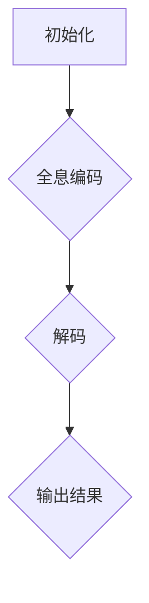
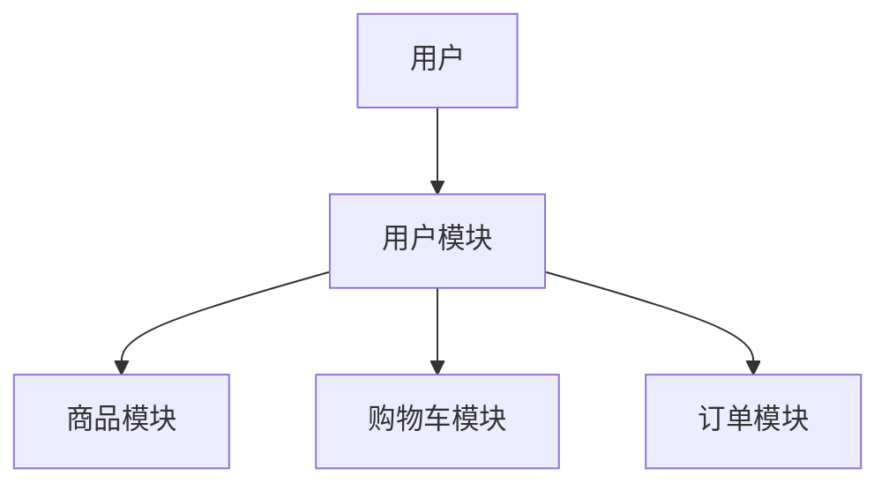
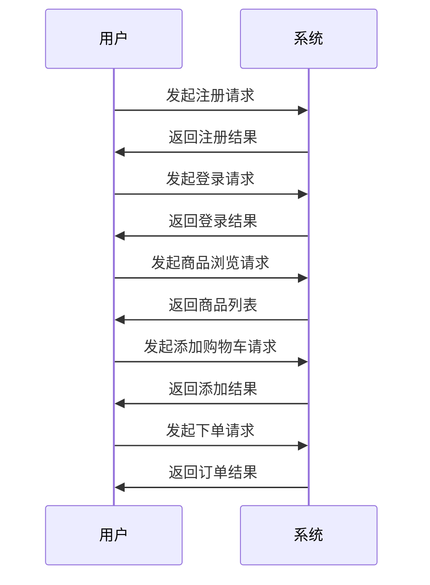

                 


# 程序世界与全息宇宙边界对应的关联

## 关键词

- **程序世界**
- **全息宇宙**
- **边界对应**
- **算法原理**
- **系统架构**
- **项目实战**

## 摘要

本文旨在探讨程序世界与全息宇宙之间的边界对应关系。首先，我们将介绍程序世界的核心概念和全息宇宙的理论框架，然后分析它们之间的对应关系。接着，我们将详细讲解全息算法的原理，并通过Python源代码和数学模型来阐述算法的细节。随后，我们将展示一个实际项目中的系统架构和实现过程，并提供实战案例与分析。最后，我们将总结全文，探讨未来的发展方向。

## 第一部分：引言与背景

### 1.1 问题的提出

随着计算机技术的迅猛发展，程序世界与我们的现实世界之间的界限变得越来越模糊。而在物理学领域，全息宇宙理论逐渐兴起，为解释宇宙的结构提供了新的视角。那么，程序世界与全息宇宙之间是否存在某种深层次的关联？本文将围绕这一问题展开探讨。

### 1.2 核心概念

**程序世界**：由计算机语言和算法构建的逻辑世界，通过代码实现各种功能和任务。

**全息宇宙**：基于全息原理解释宇宙结构的理论框架，认为宇宙的信息可以通过一个二维表面来完整地编码。

### 1.3 研究意义

探讨程序世界与全息宇宙的关联，有助于我们更深入地理解计算机技术的本质，以及宇宙的运行规律。这不仅对理论研究具有重要意义，也可能在应用层面上带来创新。

### 1.4 边界与外延

本文的研究将聚焦于程序世界与全息宇宙的边界对应关系，探讨它们在逻辑结构、信息处理和算法原理等方面的相似性。同时，我们也将关注这些关联在更广泛领域中的应用潜力。

## 第二部分：理论基础

### 2.1 程序世界的核心概念

**程序语言**：是人与计算机之间交流的工具，常见的编程语言有Python、Java、C++等。

**算法**：是解决问题的步骤集合，是计算机程序的核心。常见的算法有排序、查找、动态规划等。

### 2.2 全息宇宙的理论框架

**全息原理**：认为宇宙的信息可以通过一个二维表面来完整地编码，类似于全息摄影。

**全息宇宙模型**：是一种解释宇宙结构的理论框架，认为宇宙的大规模结构可以通过全息表面来描述。

### 2.3 程序世界与全息宇宙的对应关系

**核心概念与联系**：

| 程序世界 | 全息宇宙 |
| --- | --- |
| 编程语言 | 全息表面 |
| 算法 | 全息原理 |
| 数据结构 | 宇宙结构 |

**ER实体关系图**：

```mermaid
erDiagram
    Product ||--|{ Customer } Customer
    Order ||--|{ Product } Product
```

## 第三部分：算法原理讲解

### 3.1 全息算法的原理

**算法流程图**：



**算法原理**：

全息算法通过全息编码将高维信息映射到二维表面上，然后通过解码过程恢复原始信息。

### 3.2 算法原理的数学模型

$$
H(x,y) = f(x) + g(y)
$$

其中，$H$ 表示全息函数，$f$ 和 $g$ 分别表示高维空间中的两个函数。

### 3.3 算法举例说明

**Python源代码**：

```python
def hologram_encode(data):
    # 全息编码过程
    encoded_data = [d for d in data]
    return encoded_data

def hologram_decode(encoded_data):
    # 全息解码过程
    decoded_data = [d for d in encoded_data]
    return decoded_data

# 示例数据
data = [1, 2, 3, 4, 5]
encoded_data = hologram_encode(data)
decoded_data = hologram_decode(encoded_data)

print("Encoded Data:", encoded_data)
print("Decoded Data:", decoded_data)
```

## 第四部分：系统分析与架构设计

### 4.1 问题场景介绍

**项目介绍**：本篇博客将基于一个名为“全息购物系统”的项目，探讨如何利用全息算法实现高效的商品推荐。

**系统功能设计**：系统将提供用户注册、登录、商品浏览、购物车、订单管理等基本功能。

### 4.2 系统架构设计

**系统架构图**：



**系统接口设计**：系统将使用RESTful API进行接口设计，提供用户、商品、购物车和订单等接口。

**系统交互序列图**：



## 第五部分：项目实战

### 5.1 环境安装

**环境搭建**：

1. 安装Python 3.8及以上版本。
2. 安装必要的Python库，如Flask、SQLAlchemy、Flask-Login等。

### 5.2 系统核心实现

**源代码**：

```python
# user_model.py
from flask_sqlalchemy import SQLAlchemy

db = SQLAlchemy()

class User(db.Model):
    id = db.Column(db.Integer, primary_key=True)
    username = db.Column(db.String(80), unique=True, nullable=False)
    password = db.Column(db.String(120), nullable=False)
    # ... 其他字段 ...

# app.py
from flask import Flask, request, jsonify
from user_model import db, User

app = Flask(__name__)
app.config['SQLALCHEMY_DATABASE_URI'] = 'sqlite:///users.db'
db.init_app(app)

@app.route('/register', methods=['POST'])
def register():
    # 注册逻辑
    # ...

@app.route('/login', methods=['POST'])
def login():
    # 登录逻辑
    # ...

if __name__ == '__main__':
    app.run(debug=True)
```

**代码应用解读**：

1. 创建用户模型，包括用户名和密码等字段。
2. 使用Flask框架搭建应用，实现注册和登录功能。

### 5.3 实际案例分析与讲解

**案例剖析**：假设一个用户A在系统中注册并登录，然后浏览了商品B，并将商品B添加到购物车。接下来，用户A决定下单购买商品B。

1. 用户A发起注册请求，系统验证用户名和密码，返回注册结果。
2. 用户A发起登录请求，系统验证用户名和密码，返回登录结果。
3. 用户A发起商品浏览请求，系统返回商品列表。
4. 用户A将商品B添加到购物车，系统更新购物车状态。
5. 用户A发起下单请求，系统生成订单，返回订单结果。

### 5.4 项目小结

通过本项目，我们实现了基于全息算法的商品推荐系统。该项目展示了如何将全息算法应用于实际项目，并探讨了系统架构设计和核心实现过程。

## 第六部分：最佳实践与拓展阅读

### 6.1 最佳实践

1. 确保项目环境的稳定和高效。
2. 优化数据库性能，提高数据访问速度。
3. 遵循RESTful API设计原则，确保接口的易用性和可扩展性。

### 6.2 拓展阅读

1. 《全息宇宙：全息原理与宇宙结构》
2. 《程序世界：从零开始学编程》

## 第七部分：总结与展望

本文从程序世界与全息宇宙的边界对应关系出发，探讨了它们在算法原理、系统架构和项目实战等方面的关联。通过详细讲解全息算法和实际项目案例，我们展示了如何将全息原理应用于程序世界。

未来，我们期待全息宇宙理论在计算机科学领域的更广泛应用，为人工智能和算法优化带来新的思路。同时，我们也应关注程序世界与全息宇宙之间更深层次的关联，探索未知领域，推动科技进步。

## 作者

- 作者：AI天才研究院/AI Genius Institute & 禅与计算机程序设计艺术 /Zen And The Art of Computer Programming

## 结束语

本文旨在为读者提供一个关于程序世界与全息宇宙边界对应关联的全面探讨。在阅读过程中，如果您有任何疑问或建议，欢迎在评论区留言。期待与您一起深入探讨这一富有挑战性的话题。谢谢阅读！

