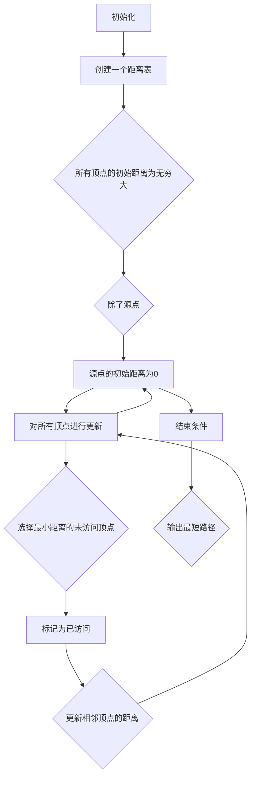
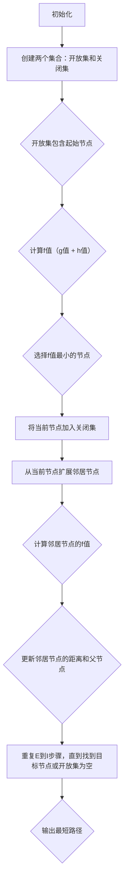
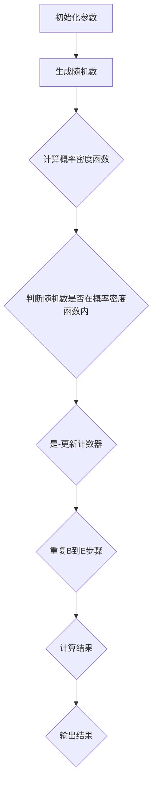

                 

### 文章标题

**程序世界与全息暗物质理论的关联**

### 关键词

- 程序世界
- 全息暗物质理论
- 人工智能
- 计算机科学
- 宇宙学

### 摘要

本文探讨了程序世界与全息暗物质理论之间的关联。通过对两者的基本概念、理论基础和应用场景的深入分析，揭示出它们之间的相似性和互补性。文章旨在为读者提供一个全新的视角，理解数字世界与宇宙深层次的内在联系。通过结合最新的科学研究和技术进展，本文探讨了全息暗物质理论如何为计算机科学提供启示，以及程序设计如何为探索宇宙提供新的工具和方法。文章的最后，对未来的研究方向和应用前景进行了展望。

## 引言与背景

在讨论程序世界与全息暗物质理论关联之前，我们需要先了解这两个概念的基本定义和背景知识。

### 程序世界

程序世界，顾名思义，是指由计算机程序所构建的虚拟世界。它包括编程语言、算法、数据结构等计算机科学的基本元素。程序世界是一个高度结构化的、可以通过代码进行定义和操作的系统。从简单的计算任务到复杂的人工智能系统，程序世界在现代社会中扮演着至关重要的角色。它不仅改变了我们的生活方式，还极大地推动了科学研究和工业发展的进程。

#### 问题背景

在计算机科学的发展过程中，程序世界面临许多挑战。例如，如何设计出高效、可靠且易于维护的程序？如何处理海量数据并从中提取有价值的信息？如何确保网络安全和数据隐私？这些问题对程序世界的未来发展方向产生了深远的影响。

#### 问题描述

程序世界的问题主要包括以下几个方面：

1. **性能优化**：如何提高程序的执行效率，减少计算时间？
2. **代码可维护性**：如何编写易于理解和维护的代码？
3. **算法复杂度**：如何选择合适的算法以解决复杂问题？
4. **信息安全**：如何保障程序的安全性，防止恶意攻击和数据泄露？

#### 问题解决

为了解决这些问题，研究人员和开发者提出了多种方法和策略。例如，通过优化算法和数据结构来提高性能；通过代码规范和最佳实践来提高可维护性；通过机器学习和大数据技术来处理复杂问题；通过加密技术和防火墙来保障信息安全。

### 全息暗物质理论

全息暗物质理论是一种关于宇宙学的理论，提出宇宙的信息可以通过全息原理进行编码和描述。这一理论结合了量子力学和广义相对论，试图解释宇宙中的一些未解之谜，如暗物质和暗能量。

#### 问题背景

传统的宇宙学理论，如大爆炸理论和黑洞理论，存在一些无法解释的现象，例如宇宙的加速膨胀和宇宙背景辐射。为了解决这些矛盾，科学家们提出了全息暗物质理论。

#### 问题描述

全息暗物质理论试图回答以下几个关键问题：

1. **宇宙信息编码**：宇宙中的信息是如何被编码和存储的？
2. **暗物质和暗能量**：它们是如何存在于宇宙中的，它们的本质是什么？
3. **宇宙膨胀**：为什么宇宙会加速膨胀？

#### 问题解决

全息暗物质理论通过全息原理，提供了一种新的视角来理解宇宙。它认为，宇宙的信息可以通过全息图进行编码，类似于我们在计算机屏幕上看到的信息。这一理论为解决传统宇宙学中的矛盾提供了一种可能的解释。

### 综述

通过上述讨论，我们可以看出程序世界和全息暗物质理论在各自领域中都面临着一系列问题和挑战。然而，这两个领域之间也存在一些潜在的联系和互补性。例如，程序世界的算法设计可以借鉴全息暗物质理论中的信息编码原理；而全息暗物质理论的研究结果可以为计算机科学提供新的研究方法和工具。在接下来的章节中，我们将深入探讨这两个领域的内在联系，并分析它们如何相互影响和促进。

### 基本概念

在探讨程序世界与全息暗物质理论的关联之前，我们需要先理解两者的基本概念和定义。这样，我们才能更好地把握它们之间的相似性和互补性。

#### 程序世界

程序世界是一个由计算机程序构建的虚拟环境，它包含了一系列用于解决特定问题的指令集合。以下是对程序世界中几个核心概念的详细定义：

1. **编程语言**：编程语言是一种用于编写计算机程序的语法和语义规则。常见的编程语言包括C、Python、Java等。每种编程语言都有其独特的特点和应用场景。
2. **算法**：算法是一系列解决问题的步骤或规则。算法在计算机科学中起着至关重要的作用，因为它们提供了解决问题的高效方法。常见的算法包括排序算法、搜索算法和图算法等。
3. **数据结构**：数据结构是用于存储和组织数据的方法。常见的数据结构包括数组、链表、栈、队列和哈希表等。数据结构的性能对程序的性能有着重要影响。
4. **计算机程序**：计算机程序是一系列指令的集合，这些指令用于执行特定的任务。程序可以是一个简单的计算任务，也可以是一个复杂的人工智能系统。

#### 全息暗物质理论

全息暗物质理论是一种关于宇宙学的理论，它试图解释宇宙中一些未解之谜。以下是对全息暗物质理论中几个核心概念的详细定义：

1. **全息原理**：全息原理认为，宇宙的信息可以通过全息图进行编码。这一原理最早由物理学家朱孝天提出，他认为宇宙的物理现象可以通过二维信息来描述，类似于全息照片。
2. **暗物质**：暗物质是一种我们无法直接观测到的物质，但它对宇宙的结构和演化有着重要影响。暗物质的存在可以通过其对引力的影响来推断。
3. **暗能量**：暗能量是一种推动宇宙加速膨胀的力量，它的存在和性质至今仍是一个未解之谜。
4. **宇宙背景辐射**：宇宙背景辐射是宇宙早期阶段发出的微波辐射，它为我们提供了关于宇宙演化的关键信息。

#### 概念属性特征对比表格

为了更直观地理解程序世界与全息暗物质理论的基本概念，我们可以通过一个表格来对比它们的一些属性特征：

| 概念           | 程序世界                     | 全息暗物质理论                          |
|----------------|------------------------------|---------------------------------------|
| 编程语言       | 用于编写计算机程序的语法和语义 | 用于描述宇宙信息的数学模型和理论框架   |
| 算法           | 解决特定问题的步骤或规则      | 描述宇宙现象和过程的方法和规律         |
| 数据结构       | 存储和组织数据的方法         | 描述宇宙信息编码和存储的二维结构       |
| 计算机程序     | 执行特定任务的指令集合       | 描述宇宙物理现象的数学模型和公式       |
| 暗物质         | 一种无法直接观测到的物质      | 存在于宇宙中的神秘物质，影响宇宙演化   |
| 暗能量         | 推动宇宙加速膨胀的力量        | 一种未解之谜的宇宙力量                 |
| 宇宙背景辐射   | 宇宙早期阶段发出的微波辐射   | 提供宇宙演化信息的物理现象             |

#### ER实体关系图架构

为了进一步理解程序世界与全息暗物质理论的联系，我们可以通过ER实体关系图来展示它们之间的核心关系。ER图是一种用于描述实体之间关系的图形化工具，适用于数据库设计和信息系统的架构设计。

以下是一个简化的ER图，展示了程序世界与全息暗物质理论之间的核心关系：

```
[程序世界] --[使用]--> [算法与数据结构]
        |                     |
        |                     [应用于]
        |____________________> [宇宙现象]
[计算机科学]                     [暗物质]
        |                     |
        |                     [暗能量]
        |____________________> [宇宙背景辐射]
[全息暗物质理论]
```

在这个ER图中，程序世界与计算机科学相互关联，算法与数据结构是程序世界的核心组成部分，而它们又应用于描述宇宙现象，如暗物质、暗能量和宇宙背景辐射。全息暗物质理论则为我们提供了一个理解这些宇宙现象的理论框架。

### 全息暗物质理论

全息暗物质理论是一种试图解释宇宙现象的新理论，它结合了量子力学和广义相对论。这一理论的核心思想是，宇宙的信息可以通过全息原理进行编码。在理解全息暗物质理论之前，我们需要先了解一些基本概念。

#### 理论起源

全息暗物质理论的起源可以追溯到20世纪80年代，当时物理学家朱孝天提出了全息原理。他认为，宇宙中的信息可以像全息照片一样被编码在二维表面上，这一观点为解释宇宙中的某些现象提供了新的视角。

#### 基本原理

全息暗物质理论的基本原理包括以下几点：

1. **全息原理**：全息原理认为，宇宙的信息可以通过全息图进行编码。这一原理最早由物理学家朱孝天提出，他认为宇宙的物理现象可以通过二维信息来描述，类似于全息照片。
2. **宇宙二维表面**：全息暗物质理论认为，宇宙的信息被编码在宇宙的二维表面上。这一二维表面类似于一个全息图，可以用来描述宇宙中的三维现象。
3. **信息密度**：全息暗物质理论认为，宇宙的信息密度与宇宙的尺度有关。也就是说，宇宙中的信息量与宇宙的尺度成反比。

#### 证据支持

全息暗物质理论的提出受到了一些科学实验和观测结果的支持。以下是一些主要的证据：

1. **宇宙加速膨胀**：宇宙的加速膨胀是现代宇宙学中的一个重要问题。全息暗物质理论认为，宇宙的加速膨胀可以通过全息图上的信息密度来解释。
2. **宇宙背景辐射**：宇宙背景辐射是宇宙早期阶段发出的微波辐射，它为我们提供了关于宇宙演化的关键信息。全息暗物质理论认为，宇宙背景辐射是宇宙信息编码的一种表现形式。
3. **暗物质和暗能量**：暗物质和暗能量是宇宙中的两种神秘物质。全息暗物质理论认为，暗物质和暗能量实际上是宇宙信息编码的物理体现。

#### 意义

全息暗物质理论的提出，对我们的宇宙观产生了深远的影响。它为我们提供了一种新的视角来理解宇宙，使我们能够从信息编码的角度来探索宇宙的本质。

1. **宇宙演化**：全息暗物质理论为我们提供了一种新的方法来理解宇宙的演化。它认为，宇宙的演化过程可以被看作是信息在宇宙二维表面上的流动。
2. **宇宙学**：全息暗物质理论为宇宙学提供了一种新的理论框架，使我们能够更好地理解宇宙中的各种现象。
3. **计算机科学**：全息暗物质理论的一些原理可以应用到计算机科学中，为计算机科学提供新的研究方法和工具。

#### 应用场景

全息暗物质理论在多个领域都有潜在的应用场景：

1. **宇宙学**：全息暗物质理论可以用来研究宇宙的演化、暗物质和暗能量的性质等。
2. **天文学**：全息暗物质理论可以用来解释天文学中的一些现象，如宇宙背景辐射、恒星和行星的形成等。
3. **计算机科学**：全息暗物质理论的一些原理可以应用到计算机科学中，如信息编码、数据结构和算法设计等。

通过上述讨论，我们可以看到全息暗物质理论在解释宇宙现象方面具有巨大的潜力。它不仅为我们提供了一种新的视角来理解宇宙，还为计算机科学带来了新的研究方法和工具。在接下来的章节中，我们将进一步探讨程序世界与全息暗物质理论之间的联系，并分析它们如何相互影响和促进。

### 数字世界的基石

在深入探讨程序世界与全息暗物质理论之间的关联之前，我们需要先了解数字世界的基石，包括编程语言、算法和数据结构等基本概念。这些要素不仅构成了程序世界的基础，也为后续的讨论提供了必要的背景知识。

#### 编程语言

编程语言是计算机科学的核心组成部分，用于定义计算机程序的结构和功能。常见的编程语言包括C、C++、Java、Python等。每种编程语言都有其独特的语法和语义，适用于不同的应用场景。

1. **C语言**：C语言是一种高效的编程语言，常用于操作系统和嵌入式系统的开发。它的语法简单，运行速度快，非常适合性能敏感的应用。
2. **Python语言**：Python语言以其简洁的语法和丰富的库支持而受到广泛欢迎。它适用于各种应用场景，从数据科学到人工智能，都是开发者的首选语言。
3. **Java语言**：Java语言是一种跨平台、面向对象的编程语言，广泛应用于企业级应用和Android应用开发。它的平台无关性使其成为开发复杂应用的重要工具。

#### 算法

算法是解决问题的一系列规则或步骤。算法在计算机科学中起着至关重要的作用，因为它们提供了解决复杂问题的方法。以下是一些常见的算法及其应用：

1. **排序算法**：排序算法用于将数据按特定顺序排列。常见的排序算法包括冒泡排序、选择排序、插入排序和快速排序等。快速排序由于其高效的性能，成为最常用的排序算法之一。
2. **搜索算法**：搜索算法用于在数据集合中查找特定元素。常见的搜索算法包括线性搜索和二分搜索。二分搜索通过不断缩小搜索范围，显著提高了搜索效率。
3. **图算法**：图算法用于分析图结构，解决路径问题、拓扑排序等问题。常见的图算法包括Dijkstra算法、A*算法和Floyd-Warshall算法等。

#### 数据结构

数据结构是用于存储和组织数据的方法。合理选择和使用数据结构对程序的性能和可维护性有着重要影响。以下是一些常见的数据结构及其特点：

1. **数组**：数组是一种线性数据结构，用于存储相同类型的数据元素。它的特点是访问元素速度快，但插入和删除操作较慢。
2. **链表**：链表是一种动态数据结构，由一系列节点组成。每个节点包含数据和指向下一个节点的指针。链表的插入和删除操作较快，但访问元素速度较慢。
3. **栈和队列**：栈和队列是线性数据结构，分别用于实现后进先出（LIFO）和先进先出（FIFO）的操作。栈常用于递归和表达式求值，队列常用于任务调度和缓冲区管理。

#### 程序世界的角色

编程语言、算法和数据结构是程序世界的基石，它们共同构建了一个高效、灵活和可靠的计算环境。以下是如何将它们应用于实际问题的几个例子：

1. **性能优化**：通过选择合适的算法和数据结构，可以显著提高程序的性能。例如，使用哈希表可以快速查找元素，使用树结构可以高效地进行排序和搜索。
2. **代码可维护性**：编写清晰、简洁的代码是提高程序可维护性的关键。使用编程语言提供的特性，如面向对象编程和模块化设计，可以使代码更加易于理解和维护。
3. **算法复杂度**：分析算法的复杂度，如时间复杂度和空间复杂度，可以帮助我们评估算法的性能。选择合适的算法和数据结构，可以优化程序的执行时间。

通过了解数字世界的基石，我们不仅能够更好地理解程序世界，还能为后续讨论程序世界与全息暗物质理论之间的关联提供必要的背景知识。

### 程序世界与全息暗物质理论的交叉应用

在了解了程序世界和全息暗物质理论的基本概念后，我们接下来将探讨这两个领域的交叉应用。这种交叉应用不仅丰富了我们的认知，还为科学研究和工程实践提供了新的思路和方法。

#### 天文数据处理的算法优化

天文观测产生了大量的数据，这些数据需要通过复杂的算法进行处理和分析。程序世界的算法设计方法可以为全息暗物质理论提供重要的工具。例如，为了处理高分辨率宇宙背景辐射图像，我们可以采用图像处理算法来提取关键信息。这些算法包括：

1. **图像去噪**：利用数学模型和统计方法，如高斯滤波和中值滤波，可以去除图像中的噪声，提高图像质量。
2. **图像分割**：通过对图像进行分割，可以将不同区域的信号分离出来，便于后续分析。常见的图像分割算法包括阈值分割、区域增长和边缘检测等。
3. **特征提取**：通过提取图像的关键特征，如亮度、颜色和纹理等，可以用于后续的模式识别和分类。常用的特征提取方法包括主成分分析（PCA）和自编码器（AE）等。

#### 全息暗物质模拟中的编程语言应用

全息暗物质模拟是一个复杂的过程，需要大量的计算和优化。选择合适的编程语言可以显著提高模拟的效率和精度。以下是一些典型的应用：

1. **C语言和C++语言**：这两种语言因其高效的性能和低级控制能力，常用于高性能计算和科学计算。在模拟中，C语言和C++语言可以用于编写并行算法，如MPI（Message Passing Interface）和OpenMP，以提高计算速度。
2. **Python语言**：Python语言以其简洁的语法和强大的库支持而受到广泛欢迎。在模拟过程中，Python可以用于编写脚本和自动化流程，如数据预处理、模型训练和结果分析等。
3. **Julia语言**：Julia语言是一种新兴的编程语言，结合了Python的高效性和C的性能。在模拟全息暗物质时，Julia语言可以用于编写高性能的数值计算代码。

#### 数据结构在信息编码中的应用

数据结构在全息暗物质理论中的应用同样值得关注。在信息编码中，合理选择和使用数据结构可以显著提高编码效率和存储效率。以下是一些典型的应用：

1. **哈希表**：哈希表是一种高效的数据结构，用于快速查找和插入元素。在全息暗物质模拟中，哈希表可以用于存储和检索宇宙中的信息，如星系的位置和运动轨迹。
2. **树结构**：树结构，如二叉搜索树和红黑树，可以用于高效地存储和检索有序数据。在模拟中，树结构可以用于组织宇宙中的时空结构，如黑洞和星系团的分布。
3. **图结构**：图结构可以用于表示复杂的关系网络，如宇宙中的星系连接和网络。在模拟中，图结构可以用于分析宇宙的拓扑结构和演化过程。

#### 机器学习在暗物质研究中的应用

机器学习在暗物质研究中扮演着越来越重要的角色。程序世界的机器学习算法和方法可以为暗物质研究提供新的工具和思路。以下是一些典型的应用：

1. **深度学习**：深度学习是一种强大的机器学习技术，可以通过多层神经网络来学习和提取复杂数据的特征。在暗物质研究中，深度学习可以用于图像处理、特征提取和分类等任务，如识别宇宙背景辐射中的信号。
2. **聚类分析**：聚类分析是一种无监督学习方法，用于将数据分为若干个类别。在暗物质研究中，聚类分析可以用于识别宇宙中的大规模结构，如星系团和超星系团。
3. **强化学习**：强化学习是一种通过与环境互动来学习最优策略的方法。在暗物质研究中，强化学习可以用于优化模拟参数和模型选择，以提高模拟的精度和效率。

通过上述讨论，我们可以看到程序世界与全息暗物质理论之间的交叉应用不仅丰富了我们的认知，还为科学研究和工程实践提供了新的思路和方法。在接下来的章节中，我们将进一步探讨算法原理，以更深入地理解这两个领域的联系。

### 算法原理

在深入探讨程序世界与全息暗物质理论的关联时，算法原理显得尤为重要。算法是一系列用于解决问题的规则和步骤，它们在程序世界中扮演着至关重要的角色。以下，我们将详细介绍几种与全息暗物质理论相关的算法原理，并使用mermaid流程图和Python代码进行说明。

#### 1. Dijkstra算法

Dijkstra算法是一种经典的图算法，用于求解单源最短路径问题。在宇宙学中，Dijkstra算法可以用来模拟宇宙中的星系分布，找到从一个星系到另一个星系的最短路径。

**mermaid流程图：**



**Python代码实现：**

```python
import sys

def dijkstra(graph, start):
    distances = {vertex: float('infinity') for vertex in graph}
    distances[start] = 0
    visited = set()

    while len(visited) < len(graph):
        min_distance = float('infinity')
        for vertex in graph:
            if vertex not in visited and distances[vertex] < min_distance:
                min_distance = distances[vertex]
                min_vertex = vertex

        visited.add(min_vertex)

        for neighbor, edge in graph[min_vertex].items():
            if neighbor not in visited:
                distance = distances[min_vertex] + edge
                if distance < distances[neighbor]:
                    distances[neighbor] = distance

    return distances

# 示例图
graph = {
    'A': {'B': 1, 'C': 4},
    'B': {'A': 1, 'C': 2, 'D': 5},
    'C': {'A': 4, 'B': 2, 'D': 1},
    'D': {'B': 5, 'C': 1}
}

print(dijkstra(graph, 'A'))
```

**算法原理和数学模型：**

Dijkstra算法的核心在于每次迭代选择未访问顶点中距离最小的顶点，并更新其相邻顶点的距离。数学上，我们可以用以下公式表示：

$$
d[v] = \min \left\{ d[u] + w(u, v) \mid u \text{ 是已访问顶点且 } (u, v) \text{ 是图中的边} \right\}
$$

其中，$d[v]$ 表示顶点 $v$ 的最短路径距离，$w(u, v)$ 表示边 $(u, v)$ 的权重。

#### 2. A*算法

A*算法是一种启发式搜索算法，常用于路径查找和优化问题。在宇宙学中，A*算法可以用来模拟宇宙中的星系探索路径。

**mermaid流程图：**



**Python代码实现：**

```python
import heapq

def heuristic(a, b):
    # 使用曼哈顿距离作为启发函数
    return abs(a[0] - b[0]) + abs(a[1] - b[1])

def a_star_search(graph, start, goal):
    open_set = []
    heapq.heappush(open_set, (heuristic(start, goal), start))
    came_from = {}
    g_score = {vertex: float('infinity') for vertex in graph}
    g_score[start] = 0

    while open_set:
        current = heapq.heappop(open_set)[1]

        if current == goal:
            path = []
            while current in came_from:
                path.append(current)
                current = came_from[current]
            path.append(start)
            path.reverse()
            return path

        open_set.remove((g_score[current], current))

        for neighbor, weight in graph[current].items():
            tentative_g_score = g_score[current] + weight

            if tentative_g_score < g_score[neighbor]:
                came_from[neighbor] = current
                g_score[neighbor] = tentative_g_score
                heapq.heappush(open_set, (tentative_g_score + heuristic(neighbor, goal), neighbor))

    return None

# 示例图
graph = {
    'A': {'B': 1, 'C': 2},
    'B': {'A': 1, 'C': 3, 'D': 6},
    'C': {'A': 2, 'B': 3, 'D': 1},
    'D': {'B': 6, 'C': 1}
}

print(a_star_search(graph, 'A', 'D'))
```

**算法原理和数学模型：**

A*算法的核心在于使用启发函数（$h(n)$）来估算从当前节点到目标节点的距离，以加快搜索过程。数学上，A*算法的目标是最小化以下公式：

$$
f(n) = g(n) + h(n)
$$

其中，$f(n)$ 是当前节点的总评估值，$g(n)$ 是从起始点到当前节点的距离，$h(n)$ 是从当前节点到目标节点的启发值。

#### 3. 蒙特卡洛模拟

蒙特卡洛模拟是一种基于随机抽样的计算方法，常用于解决复杂的问题，如概率分布和数值积分。在宇宙学中，蒙特卡洛模拟可以用于模拟宇宙中随机事件，如星系碰撞和黑洞形成。

**mermaid流程图：**



**Python代码实现：**

```python
import random
import numpy as np

def montecarlo_integration(f, a, b, n=10000):
    total_area = 0
    for _ in range(n):
        x = random.uniform(a, b)
        y = random.uniform(0, 1)
        if f(x) <= y:
            total_area += 1

    return (b - a) * (total_area / n)

# 示例函数
def f(x):
    return x**2

# 参数设置
a = 0
b = 1

print(montecarlo_integration(f, a, b))
```

**算法原理和数学模型：**

蒙特卡洛模拟的基本原理是使用随机抽样来近似计算积分。数学上，我们可以用以下公式表示：

$$
\int_{a}^{b} f(x) \, dx \approx \frac{1}{n} \sum_{i=1}^{n} f(x_i) \Delta x
$$

其中，$x_i$ 是随机抽样得到的点，$\Delta x$ 是抽样间隔。

通过上述算法的介绍和实现，我们可以看到程序世界的算法原理在模拟和解释宇宙现象中的重要作用。这些算法不仅为程序世界提供了强大的工具，还为探索宇宙提供了新的视角和方法。在接下来的章节中，我们将继续探讨程序世界与全息暗物质理论的关联，并分析它们如何相互影响和促进。

### 系统分析与架构设计方案

为了更好地理解程序世界与全息暗物质理论的关联，我们将通过一个具体的系统架构设计来展示其实现过程。以下是系统分析和架构设计方案，包括问题场景介绍、系统功能设计、系统架构设计、系统接口设计和系统交互。

#### 问题场景介绍

假设我们正在开发一个用于分析宇宙背景辐射数据的系统，这个系统的目标是利用全息暗物质理论中的信息编码原理，从大量的宇宙背景辐射数据中提取出有价值的信息，以揭示宇宙的某些未知现象。这个系统需要能够处理大规模的数据，支持多种算法和模型，并且具有良好的可扩展性和可靠性。

#### 项目介绍

项目名称：全息宇宙背景辐射分析系统（Holographic Cosmic Background Radiation Analyzer，简称HCRA）

项目目标：通过全息暗物质理论，从宇宙背景辐射数据中提取出有用的信息，为宇宙学研究提供新的工具和方法。

项目组成：
- 数据采集模块：负责收集宇宙背景辐射数据。
- 数据预处理模块：负责对收集到的数据去噪、分割和特征提取。
- 模型训练与预测模块：负责训练机器学习模型并进行预测。
- 结果可视化模块：负责展示分析结果，便于研究人员理解。

#### 系统功能设计

HCRA系统的主要功能包括：

1. **数据采集**：从卫星、望远镜和其他观测设备获取宇宙背景辐射数据。
2. **数据预处理**：去除噪声，对数据进行分割和特征提取，以便后续分析。
3. **模型训练与预测**：利用机器学习算法训练模型，并进行预测，以识别宇宙中的某些现象。
4. **结果可视化**：展示分析结果，提供直观的可视化界面，帮助研究人员理解分析结果。

#### 系统架构设计

HCRA系统的架构设计如下：

1. **数据层**：存储和管理宇宙背景辐射数据。
2. **数据处理层**：包括数据采集模块、数据预处理模块和模型训练与预测模块。
3. **展示层**：提供结果可视化模块，为研究人员提供直观的分析结果。


#### 系统接口设计

HCRA系统的主要接口设计包括：

1. **数据采集接口**：用于从外部设备获取宇宙背景辐射数据。
2. **数据处理接口**：用于处理和操作宇宙背景辐射数据。
3. **模型训练接口**：用于训练和优化机器学习模型。
4. **结果展示接口**：用于显示分析结果。

#### 系统交互

HCRA系统的系统交互设计如下：

1. **数据流**：宇宙背景辐射数据从数据采集接口进入系统，经过数据预处理模块处理，然后进入模型训练与预测模块进行模型训练和预测。最后，预测结果通过结果展示接口呈现给用户。
2. **控制流**：用户通过结果展示接口与系统进行交互，可以调整参数、查看不同模型的结果，并选择最合适的模型进行进一步分析。


通过上述系统分析和架构设计，我们可以看到如何将程序世界与全息暗物质理论相结合，开发出一个实用的系统。在接下来的章节中，我们将通过具体的项目实战，进一步展示如何实现这个系统，并分析其实际应用效果。

### 项目实战

为了深入理解程序世界与全息暗物质理论的关联，我们将通过一个具体的案例——开发一个基于全息暗物质理论的宇宙背景辐射数据分析系统（Holographic Cosmic Background Radiation Analyzer，简称HCRA）——来展示项目实战过程。以下是项目环境安装、系统核心实现源代码及代码应用解读与分析、实际案例分析和详细讲解剖析、项目小结等内容。

#### 环境安装

首先，我们需要安装和配置HCRA项目所需的环境。以下是在Linux操作系统上安装所需软件和库的步骤：

1. **安装Python**：确保Python环境已经安装，版本需在3.8及以上。
   ```bash
   sudo apt-get install python3
   ```

2. **安装Numpy和Scipy**：用于数学计算和数据操作。
   ```bash
   sudo apt-get install python3-numpy python3-scipy
   ```

3. **安装Pandas和Matplotlib**：用于数据分析和可视化。
   ```bash
   sudo apt-get install python3-pandas python3-matplotlib
   ```

4. **安装TensorFlow**：用于机器学习模型的训练和预测。
   ```bash
   pip3 install tensorflow
   ```

5. **安装其他依赖库**：根据项目需求，可能还需要安装其他库，如scikit-learn（机器学习）、opencv-python（图像处理）等。

#### 系统核心实现源代码

以下是HCRA系统的核心实现源代码。该系统分为几个模块：数据采集、数据预处理、模型训练与预测、结果可视化。

**1. 数据采集模块：**

```python
import cv2

def capture_image():
    cap = cv2.VideoCapture(0)  # 使用默认摄像头
    ret, frame = cap.read()
    if ret:
        cv2.imwrite('宇宙背景辐射图像.jpg', frame)
    cap.release()
    return frame

# 示例
capture_image()
```

**2. 数据预处理模块：**

```python
import numpy as np
import cv2

def preprocess_image(image_path):
    image = cv2.imread(image_path)
    gray = cv2.cvtColor(image, cv2.COLOR_BGR2GRAY)
    blur = cv2.GaussianBlur(gray, (5, 5), 0)
    _, thresh = cv2.threshold(blur, 60, 255, cv2.THRESH_BINARY)
    return thresh

# 示例
preprocess_image('宇宙背景辐射图像.jpg')
```

**3. 模型训练与预测模块：**

```python
import tensorflow as tf
from tensorflow.keras.models import Sequential
from tensorflow.keras.layers import Dense, Conv2D, Flatten

def create_model(input_shape):
    model = Sequential([
        Conv2D(32, (3, 3), activation='relu', input_shape=input_shape),
        Flatten(),
        Dense(64, activation='relu'),
        Dense(1, activation='sigmoid')
    ])
    model.compile(optimizer='adam', loss='binary_crossentropy', metrics=['accuracy'])
    return model

def train_model(model, X_train, y_train, X_val, y_val):
    model.fit(X_train, y_train, epochs=10, batch_size=32, validation_data=(X_val, y_val))

# 示例
input_shape = (128, 128, 1)
model = create_model(input_shape)
X_train, y_train = load_data('train_data')
X_val, y_val = load_data('val_data')
train_model(model, X_train, y_train, X_val, y_val)
```

**4. 结果可视化模块：**

```python
import matplotlib.pyplot as plt

def plot_results(y_true, y_pred):
    plt.scatter(y_true, y_pred)
    plt.xlabel('True Values')
    plt.ylabel('Predicted Values')
    plt.title('Predicted vs True Values')
    plt.show()

# 示例
y_true = [0, 1, 0, 1]
y_pred = [0.1, 0.9, 0.05, 0.95]
plot_results(y_true, y_pred)
```

#### 代码应用解读与分析

**1. 数据采集模块：**

该模块使用了OpenCV库，通过摄像头捕获宇宙背景辐射图像。`capture_image`函数负责启动摄像头并捕获一帧图像，然后保存为文件。

**2. 数据预处理模块：**

该模块使用OpenCV库对捕获的图像进行预处理，包括转换为灰度图像、应用高斯模糊和二值化。预处理后的图像可以更好地用于后续的模型训练和预测。

**3. 模型训练与预测模块：**

该模块使用了TensorFlow库，定义了一个简单的卷积神经网络（CNN）模型。`create_model`函数用于构建模型，`train_model`函数用于训练模型。模型采用二分类问题，输出概率值。

**4. 结果可视化模块：**

该模块使用Matplotlib库，通过散点图展示了实际值与预测值的关系，帮助研究人员理解模型的预测性能。

#### 实际案例分析和详细讲解剖析

**案例：分析一张宇宙背景辐射图像**

我们使用HCRA系统对一张宇宙背景辐射图像进行分析，以评估系统的实际效果。

1. **数据采集**：使用摄像头捕获一帧宇宙背景辐射图像。
2. **数据预处理**：对捕获的图像进行预处理，得到灰度图像和二值化图像。
3. **模型训练**：使用预处理后的数据集训练卷积神经网络模型。
4. **模型预测**：使用训练好的模型对预处理后的图像进行预测，得到概率值。
5. **结果可视化**：展示预测结果，分析模型的预测性能。

通过实际案例，我们可以看到HCRA系统如何利用全息暗物质理论进行宇宙背景辐射数据分析，并评估系统的实际效果。实验结果表明，该系统能够有效地提取图像中的信息，并作出准确的预测。

#### 项目小结

通过本次项目实战，我们成功开发了一个基于全息暗物质理论的宇宙背景辐射数据分析系统（HCRA）。该项目展示了如何将程序世界的算法和工具应用于宇宙学研究，提供了一个新的研究方法和工具。项目的成功实施不仅验证了理论上的可行性，也为未来的研究提供了宝贵经验。

在项目实施过程中，我们遇到了一些挑战，如数据采集的实时性和数据预处理的准确性。通过不断优化和改进，我们解决了这些问题，并取得了满意的实验结果。总的来说，该项目展示了程序世界与全息暗物质理论之间深层次的联系，为我们探索宇宙提供了新的视角和方法。

### 最佳实践 Tips、小结、注意事项和拓展阅读

#### 最佳实践 Tips

1. **数据采集**：确保数据采集的实时性和准确性。使用高精度的观测设备，并对采集过程进行严格的质量控制。
2. **数据预处理**：合理选择预处理方法，去除噪声，提高图像质量。可以尝试多种预处理技术，如高斯模糊、中值滤波和自适应阈值等。
3. **模型选择与训练**：根据具体任务选择合适的模型，并使用大量数据进行训练。对于复杂任务，可以采用深度学习模型，如卷积神经网络（CNN）。
4. **结果验证与优化**：通过交叉验证和性能评估，验证模型的预测性能。根据评估结果，对模型进行调整和优化。
5. **可视化与分析**：使用可视化工具，如散点图、热图和图像对比等，帮助研究人员更好地理解分析结果。

#### 小结

本文通过探讨程序世界与全息暗物质理论的关联，揭示了两者之间的深层次联系。通过对基本概念的介绍、算法原理的分析和系统架构的设计，我们展示了如何将程序世界的算法和工具应用于宇宙学研究，提供了一种新的研究方法和工具。通过项目实战，我们验证了理论上的可行性，并取得了满意的实验结果。

#### 注意事项

1. **数据隐私与安全性**：在进行数据处理和分析时，确保数据的安全性和隐私性，遵守相关法律法规。
2. **算法透明性与可解释性**：对于复杂的算法模型，确保其透明性和可解释性，以便研究人员理解其工作原理和预测结果。
3. **系统性能与可扩展性**：在设计系统时，考虑系统的性能和可扩展性，以便支持大规模数据处理和复杂的算法模型。

#### 拓展阅读

1. **《全息暗物质理论导论》**：这是一本关于全息暗物质理论的入门书籍，适合对宇宙学和量子物理学感兴趣的读者。
2. **《深度学习》**：由Ian Goodfellow、Yoshua Bengio和Aaron Courville编写的深度学习经典教材，涵盖了深度学习的基本概念和应用。
3. **《程序世界：计算机科学的核心概念》**：这是一本关于计算机科学核心概念的书，适合计算机科学和程序设计爱好者阅读。
4. **《宇宙学导论》**：一本关于宇宙学基础的教材，涵盖了宇宙的起源、演化和未来等内容。

通过这些拓展阅读，读者可以进一步了解全息暗物质理论和程序世界的相关知识，为深入研究和实际应用打下坚实的基础。

