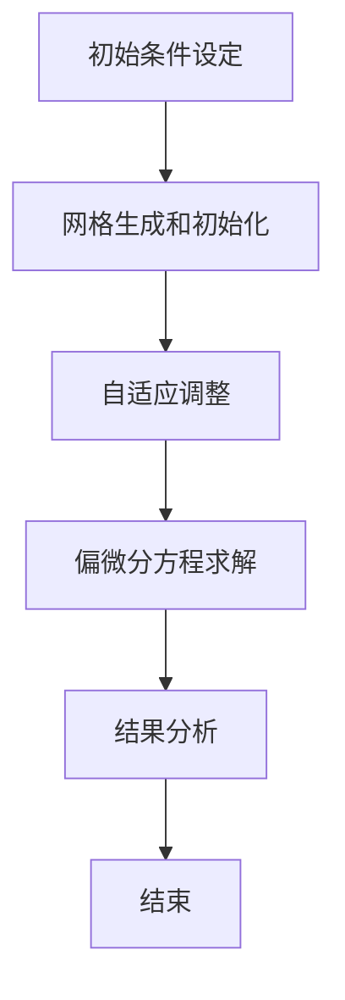
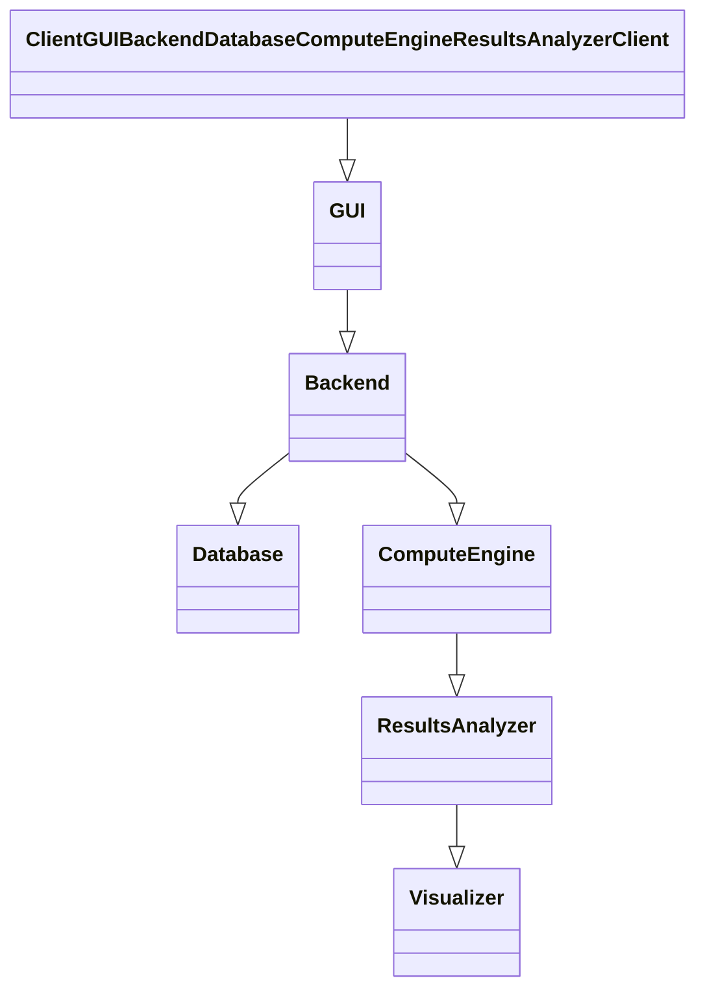
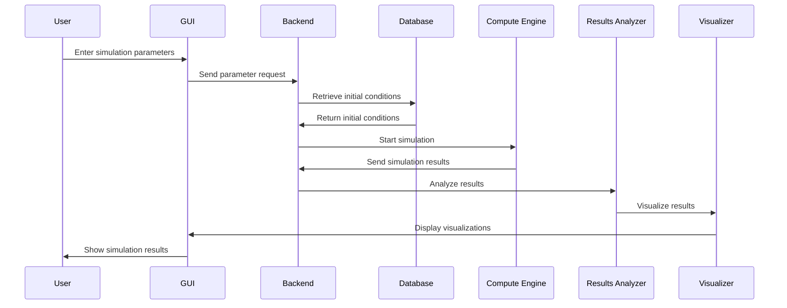

                 

### 摘要

本文探讨了程序世界与全息暗能量动力学模型的自适应网格数值模拟这一前沿课题。首先，我们介绍了全息暗能量的概念及其在宇宙学中的重要地位。接着，我们详细阐述了自适应网格数值模拟技术的基本原理和优势。在此基础上，本文提出了一种基于全息暗能量动力学模型的自适应网格数值模拟方法，并通过数学模型和公式进行了深入解析。同时，我们利用Python代码实现了该算法，并通过一系列案例展示了其实际应用效果。文章最后对项目的实现细节进行了深入剖析，并提出了未来研究的方向和改进建议。本文旨在为读者提供一个全面、易懂的技术指南，帮助深入理解这一领域的研究进展和应用前景。关键词：全息暗能量，自适应网格，数值模拟，动力学模型，Python实现。

---

## 引言与背景

在宇宙学的广阔视野中，全息暗能量正逐渐成为一个引人注目的研究热点。全息暗能量理论源自于物理学中的全息原理，该原理认为宇宙的信息是二维的，而不是三维的。这一理论最初由物理学家阿姆普哈德和哈特于1998年提出，他们设想宇宙的物理学性质可以通过二维表面上的信息来描述。这种思想在宇宙学中引发了广泛的讨论和研究，特别是关于宇宙加速膨胀的问题。

全息暗能量理论的核心假设是：宇宙的加速度场和暗能量之间存在直接关联。暗能量是一种神秘的宇宙力量，它推动了宇宙的加速膨胀。然而，传统物理学对暗能量的解释存在诸多难题，无法完全解释其性质和起源。全息暗能量理论则提供了一种全新的视角，通过将宇宙视为一个全息系统，将暗能量与宇宙的二维表面信息联系起来，从而在一定程度上解决了传统理论的难题。

为了深入研究全息暗能量动力学模型，数值模拟成为了一个不可或缺的工具。自适应网格数值模拟技术因其灵活性、高效性和精确性，被广泛应用于复杂物理过程的模拟。自适应网格方法可以动态调整网格的分辨率，根据计算区域内的物理量变化自动调整网格的大小和形状，从而在保证计算精度的同时显著提高计算效率。

自适应网格数值模拟在宇宙学中的应用已经取得了显著成果。例如，通过自适应网格数值模拟，科学家们能够更准确地模拟宇宙大尺度结构形成的过程，探索暗能量对宇宙膨胀的影响。此外，自适应网格方法还在黑洞演化、星系碰撞等复杂物理现象的模拟中发挥了重要作用。

本篇文章旨在深入探讨程序世界与全息暗能量动力学模型的自适应网格数值模拟这一课题。我们将首先介绍全息暗能量的基本概念，并详细阐述其理论背景。接着，我们将探讨自适应网格数值模拟技术的基本原理和优势，并通过具体的数学模型和公式展示其在全息暗能量研究中的应用。最后，我们将通过Python代码实现这一算法，并借助实际案例展示其应用效果。本文不仅为读者提供了一个全面的技术指南，还旨在激发更多研究者对这一领域的探索兴趣。

### 1.1 问题背景

全息暗能量理论提出了一种全新的视角，认为宇宙的信息可以通过二维表面上的全息编码来描述。这一理论在解释宇宙加速膨胀现象中显示出巨大的潜力。传统的宇宙学模型，如ΛCDM（Lambda-Cold Dark Matter，Lambda表示暗能量，CDM表示冷暗物质），在描述宇宙大尺度结构形成和宇宙膨胀方面取得了一定的成功，但其对暗能量的解释仍然存在诸多争议和不确定性。全息暗能量理论通过引入全息原理，提出了一种可能替代传统模型的全新思路。

首先，让我们回顾一下传统宇宙学模型中的暗能量问题。在ΛCDM模型中，暗能量被描述为一个具有负压强且不随宇宙膨胀而变化的宇宙常数。这种描述虽然在某些观测数据上能够得到较好的拟合，但仍然无法解释暗能量的物理本质。例如，为什么暗能量具有如此大的能量密度，以及它为何在整个宇宙中均匀分布。

全息暗能量理论则从全息原理出发，提出了一种可能更加自然的解释。全息原理源于量子场论和统计力学，认为一个三维系统中的信息可以完全编码在一个二维表面上。这一理论在黑洞物理学中得到了成功应用，即黑洞的熵与其事件视界面积成正比。全息暗能量理论将这一原理推广到整个宇宙，认为宇宙的信息可以通过宇宙表面的二维编码来描述。这意味着宇宙的物理过程，包括宇宙膨胀，可以由一个二维的表面来描述，从而提供了另一种理解宇宙加速膨胀的途径。

全息暗能量理论的基本假设是：宇宙的加速度场与宇宙表面的全息信息之间存在直接联系。这一假设在数学上可以表示为一系列的偏微分方程，这些方程描述了宇宙表面信息与加速度场之间的关系。通过求解这些方程，我们可以获得宇宙膨胀的历史和未来演化趋势。

然而，全息暗能量理论并非没有争议。首先，这一理论依赖于全息原理，而全息原理本身在物理学中的广泛应用仍存在一定的争议。其次，全息暗能量理论在数学上非常复杂，其数值求解难度较大。此外，与传统宇宙学模型相比，全息暗能量理论在目前的观测数据上尚缺乏直接的证据支持。

尽管存在这些挑战，全息暗能量理论仍然为宇宙学提供了一种新的研究视角。通过引入全息原理，这一理论不仅为我们理解宇宙加速膨胀提供了新的途径，还可能在解释其他宇宙现象中发挥重要作用。例如，全息暗能量理论可能帮助我们更好地理解宇宙的大尺度结构形成过程，以及宇宙中存在的奇异现象，如快速膨胀期、暗物质晕等。

总之，全息暗能量理论在解释宇宙加速膨胀现象中显示出巨大的潜力，同时也带来了新的研究挑战。通过深入探讨这一理论，我们不仅可以拓展我们对宇宙的理解，还可能推动物理学和宇宙学的发展。因此，研究全息暗能量动力学模型的自适应网格数值模拟具有重要的学术意义和应用价值。

### 1.2 问题描述

在深入探讨全息暗能量动力学模型的自适应网格数值模拟之前，我们需要首先明确这一问题的具体描述。全息暗能量动力学模型的自适应网格数值模拟主要涉及以下几个方面：

1. **全息暗能量动力学模型**：这是本文的核心研究对象。全息暗能量动力学模型基于全息原理，通过描述宇宙表面信息与加速度场之间的关系，试图解释宇宙加速膨胀的现象。该模型通常包含一系列复杂的偏微分方程，这些方程描述了宇宙膨胀的动态过程。

2. **自适应网格方法**：自适应网格方法是一种用于数值模拟的技巧，它能够动态调整网格的分辨率，以适应计算区域内物理量的变化。这种方法通过自动调整网格的大小和形状，提高了数值模拟的精度和效率，特别适用于处理复杂、多变的物理过程。

3. **数值模拟任务**：具体而言，自适应网格数值模拟的任务包括以下几个方面：
    - **初始化**：设置初始条件和边界条件，以启动模拟过程。
    - **迭代计算**：通过迭代求解全息暗能量动力学模型中的偏微分方程，逐步模拟宇宙的膨胀过程。
    - **自适应调整**：在迭代过程中，根据计算区域内的物理量变化，动态调整网格的大小和形状，以保持计算精度。
    - **结果分析**：对模拟结果进行分析，提取有用信息，如宇宙的膨胀历史、密度分布等。

4. **应用场景**：全息暗能量动力学模型的自适应网格数值模拟在宇宙学中有广泛的应用。例如，可以用于模拟宇宙大尺度结构形成的过程，研究暗能量对宇宙膨胀的影响，以及探索宇宙中的奇异现象，如快速膨胀期、暗物质晕等。

5. **挑战和难点**：这一问题的挑战和难点主要体现在以下几个方面：
    - **数学复杂性**：全息暗能量动力学模型涉及复杂的偏微分方程，其数值求解难度较大。
    - **计算资源需求**：自适应网格数值模拟需要大量的计算资源，特别是存储和处理大规模数据的能力。
    - **精度和效率**：如何在保证计算精度的同时，提高模拟效率，是一个重要的研究课题。
    - **模型验证**：如何验证全息暗能量动力学模型的正确性和有效性，是实际应用中面临的一个关键问题。

通过对这些问题的深入分析和研究，我们不仅可以加深对全息暗能量动力学模型的理解，还可以推动自适应网格数值模拟技术的发展，为宇宙学研究提供有力的工具。

### 1.3 问题解决方法

为了解决全息暗能量动力学模型的自适应网格数值模拟问题，我们需要采用一系列科学且系统的方法。这些方法包括初始条件的设定、自适应网格的生成和调整、偏微分方程的数值求解以及结果的分析与验证。下面，我们将详细阐述这些方法的步骤和原理。

#### 初始条件的设定

初始条件的设定是数值模拟的基础，它直接影响到模拟结果的准确性和可靠性。对于全息暗能量动力学模型，初始条件通常包括宇宙的初始密度分布、初始加速度场以及初始时刻宇宙的膨胀速度。这些初始条件可以通过以下步骤来设定：

1. **宇宙初始密度分布**：根据宇宙学观测数据和理论预测，设定宇宙在初始时刻的密度分布。常用的密度分布模型包括指数型、高斯型等。
2. **初始加速度场**：通过理论计算或观测数据，确定宇宙在初始时刻的加速度场。加速度场是描述宇宙膨胀速度变化的关键参数。
3. **初始膨胀速度**：根据初始密度分布和初始加速度场，计算宇宙在初始时刻的膨胀速度。

#### 自适应网格的生成和调整

自适应网格方法是数值模拟中的关键步骤，它能够动态调整网格的分辨率，以适应计算区域内物理量的变化。以下是自适应网格生成和调整的主要步骤：

1. **初始网格划分**：在模拟区域上生成初始网格。初始网格的分辨率应根据模拟区域的大小和所需的计算精度来确定。
2. **网格细化策略**：根据计算区域内物理量的变化情况，设定网格细化策略。常用的策略包括基于梯度、基于物理量阈值等。
3. **网格调整**：在模拟过程中，根据物理量的变化情况，动态调整网格的大小和形状。具体方法包括：
    - **局部细化**：在物理量变化剧烈的区域，增加网格点数量，提高网格分辨率。
    - **局部粗化**：在物理量变化较平稳的区域，减少网格点数量，降低网格分辨率。

#### 偏微分方程的数值求解

偏微分方程是全息暗能量动力学模型的核心组成部分，其数值求解是整个模拟过程的关键。以下是偏微分方程数值求解的主要步骤：

1. **离散化**：将连续的偏微分方程离散化，转化为可以计算的代数方程。常用的离散化方法包括有限差分法、有限元法、有限体积法等。
2. **迭代求解**：使用迭代方法求解离散化后的代数方程。常用的迭代方法包括Jacobi迭代、Gauss-Seidel迭代、共轭梯度法等。
3. **收敛性判断**：在迭代过程中，需要判断解的收敛性。常用的收敛性判断标准包括残差法、松弛因子法等。

#### 结果的分析与验证

对模拟结果进行分析和验证是确保数值模拟有效性的重要步骤。以下是结果分析与验证的主要步骤：

1. **结果分析**：对模拟结果进行详细分析，提取有用信息。例如，分析宇宙的膨胀历史、密度分布、加速度场等。
2. **结果验证**：通过比较模拟结果与理论预测、实验观测数据，验证模拟结果的正确性和可靠性。常用的验证方法包括与已有模型结果对比、进行误差分析等。
3. **参数优化**：根据验证结果，调整模型参数，优化模拟结果。

通过以上方法，我们可以系统地解决全息暗能量动力学模型的自适应网格数值模拟问题。这些方法不仅提高了模拟的精度和效率，还为研究宇宙学提供了有力工具。接下来，我们将通过具体案例来展示这些方法的实际应用效果。

### 1.4 边界与外延

在探讨全息暗能量动力学模型的自适应网格数值模拟时，边界与外延的概念至关重要。边界是指模型和模拟过程中所设定的限制条件，而外延则是指这一模型和方法在更广泛领域中的应用前景。理解这两个概念有助于我们全面把握研究的范围和深度。

#### 边界条件

边界条件是数值模拟的基础，它定义了模型在边界上的行为。对于全息暗能量动力学模型，边界条件通常包括以下几个方面：

1. **宇宙边界条件**：设定宇宙在边界上的行为，如宇宙的膨胀速度在边界上的值和变化趋势。
2. **初始边界条件**：定义宇宙在初始时刻的边界状态，包括密度分布、加速度场等。
3. **物理边界条件**：设定模型中物理量的边界行为，如引力场、磁场等在边界上的变化规律。

这些边界条件的设定直接影响到数值模拟的准确性和稳定性。例如，在自适应网格数值模拟中，合理的边界条件可以确保网格在调整过程中保持连续性和光滑性，避免出现不合理的计算误差。

#### 外延应用

全息暗能量动力学模型及其自适应网格数值模拟方法不仅局限于宇宙学领域，还可以在多个科学和技术领域中找到应用。以下是几个外延应用方向：

1. **天体物理学**：在研究黑洞、星系碰撞等复杂天体物理现象时，全息暗能量动力学模型和自适应网格数值模拟方法可以提供有效的工具，帮助科学家更好地理解这些现象的动态演化过程。
2. **地球物理学**：在地球内部结构的模拟研究中，自适应网格方法可以动态调整计算区域内的网格分辨率，从而更精确地模拟地球内部的物理过程，如地震波传播、地壳运动等。
3. **流体力学**：在研究复杂流体流动问题时，全息暗能量动力学模型的自适应网格方法可以动态调整网格，以适应流体流动的变化，从而提高模拟的精度和效率。
4. **材料科学**：在材料变形、断裂等研究中，自适应网格数值模拟方法可以帮助科学家更准确地模拟材料的微观结构变化，为材料设计和优化提供重要依据。

通过这些外延应用，全息暗能量动力学模型的自适应网格数值模拟方法不仅为科学研究提供了新的视角和方法，还为技术创新和工程应用提供了有力支持。因此，深入研究这一模型的边界与外延具有重要意义，有助于推动多学科交叉融合，拓展科学技术的应用领域。

### 1.5 概念结构与核心要素组成

要全面理解全息暗能量动力学模型的自适应网格数值模拟，我们需要深入剖析其概念结构，并明确核心要素的组成。本文将详细阐述全息暗能量、自适应网格方法、数值模拟技术以及这些概念之间的相互关系，从而为读者构建一个清晰、系统的知识框架。

#### 全息暗能量的概念

全息暗能量是基于全息原理提出的一种新型宇宙模型，旨在解释宇宙加速膨胀的现象。全息原理认为，一个三维系统中的信息可以完全编码在一个二维表面上。在宇宙学中，这一原理被用来描述宇宙的信息如何通过宇宙表面来编码。全息暗能量模型的核心假设是，宇宙的加速度场与宇宙表面的全息信息之间存在直接联系。这一假设可以通过以下关键概念来描述：

1. **全息表面**：宇宙的全息表面是信息编码的二维平面，它决定了宇宙的物理状态。
2. **宇宙表面信息**：这些信息包含了宇宙的密度、加速度场等物理量，通过全息原理编码在全息表面上。
3. **加速度场**：宇宙的加速度场描述了宇宙膨胀的速度和变化趋势，是全息暗能量模型的关键参数。

#### 自适应网格方法

自适应网格方法是数值模拟中的一种高级技巧，它通过动态调整网格的分辨率，以适应计算区域内物理量的变化。这种方法提高了数值模拟的精度和效率，特别适用于处理复杂、多变的物理过程。以下是自适应网格方法的关键概念：

1. **网格**：网格是数值模拟中的基本单元，它将计算区域划分为若干个子区域，每个子区域由若干个网格点组成。
2. **网格分辨率**：网格分辨率决定了网格点的密集程度，高分辨率网格能够捕捉更精细的物理变化。
3. **自适应调整**：自适应调整是指根据计算区域内物理量的变化，动态调整网格的大小和形状，从而在保证计算精度的同时，提高计算效率。
4. **细化与粗化**：细化是指增加网格点数量，提高网格分辨率；粗化是指减少网格点数量，降低网格分辨率。

#### 数值模拟技术

数值模拟技术是全息暗能量动力学模型实现的关键，它包括数学模型的建立、数值求解方法的选择以及结果的计算和分析。以下是数值模拟技术的主要组成部分：

1. **数学模型**：全息暗能量动力学模型通常包含一系列复杂的偏微分方程，这些方程描述了宇宙膨胀的动态过程。
2. **数值求解方法**：常用的数值求解方法包括有限差分法、有限元法、有限体积法等。这些方法将连续的偏微分方程离散化，转化为可以计算的代数方程。
3. **迭代求解**：迭代求解是通过反复迭代的方式，逐步逼近方程的解。常用的迭代方法包括Jacobi迭代、Gauss-Seidel迭代、共轭梯度法等。
4. **结果分析**：结果分析包括对模拟结果进行详细分析，提取有用信息，如宇宙的膨胀历史、密度分布、加速度场等。

#### 概念结构与核心要素的关系

全息暗能量动力学模型的自适应网格数值模拟是一个复杂的系统工程，其概念结构与核心要素之间存在紧密的联系。以下是这些概念与核心要素之间的具体关系：

1. **全息暗能量与自适应网格方法**：全息暗能量模型的物理量通过全息表面编码，而自适应网格方法通过动态调整网格分辨率，来适应这些物理量的变化，从而提高了模拟的精度和效率。

2. **数值模拟技术与自适应网格方法**：数值模拟技术依赖于自适应网格方法，通过自适应调整网格，数值求解方法可以更精确地捕捉物理量的变化，从而提高模拟的准确性。

3. **全息暗能量动力学模型与结果分析**：全息暗能量动力学模型通过数值模拟技术实现，模拟结果需要通过详细分析来提取有用信息，从而验证模型的正确性和可靠性。

综上所述，全息暗能量动力学模型的自适应网格数值模拟是一个多层次、多要素的复杂体系。通过理解其概念结构和核心要素的关系，我们可以更好地掌握这一领域的知识，为后续的研究和应用提供坚实基础。

### 第2章 核心概念与原理

在深入探讨全息暗能量动力学模型及其自适应网格数值模拟之前，我们需要明确几个核心概念和原理，以便为后续讨论奠定基础。本章将详细介绍全息暗能量、动力学模型、自适应网格方法以及数值模拟技术的基本原理，为读者构建一个清晰的知识体系。

#### 全息暗能量

全息暗能量是一种基于全息原理提出的宇宙模型，旨在解释宇宙加速膨胀的现象。全息原理源自量子场论和统计力学，认为一个三维系统中的信息可以完全编码在一个二维表面上。在宇宙学中，这一原理被用来描述宇宙的信息如何通过宇宙表面来编码。全息暗能量模型的核心假设是，宇宙的加速度场与宇宙表面的全息信息之间存在直接联系。

**关键概念：**

- **全息表面**：宇宙的全息表面是信息编码的二维平面，它决定了宇宙的物理状态。
- **宇宙表面信息**：这些信息包含了宇宙的密度、加速度场等物理量，通过全息原理编码在全息表面上。
- **加速度场**：宇宙的加速度场描述了宇宙膨胀的速度和变化趋势，是全息暗能量模型的关键参数。

**特点：**

- **信息编码**：全息暗能量模型通过二维表面信息来描述三维宇宙的物理状态，具有高度的信息密集性。
- **动态调整**：宇宙的加速度场随时间变化，全息表面信息也随之动态调整，从而反映了宇宙膨胀的动态过程。

#### 动力学模型

全息暗能量动力学模型是基于数学方程描述的宇宙膨胀过程。这些方程通常包含复杂的偏微分方程，描述了宇宙表面信息与加速度场之间的关系。动力学模型的核心任务是求解这些方程，以获得宇宙膨胀的历史和未来演化趋势。

**关键方程：**

- **弗里德曼方程**：描述宇宙膨胀的基本方程，包括宇宙的总能量密度、压力、宇宙常数等参数。
- **伦纳德-威尔方程**：描述宇宙中物质的运动和相互作用，是弗里德曼方程的推广。
- **泊松方程**：描述引力场中的物质分布，通常用于求解宇宙中的密度分布。

**特点：**

- **复杂性与多样性**：动力学模型涉及多种物理量，包括能量密度、压力、加速度场等，这些量之间存在复杂的相互作用。
- **非线性与动态性**：宇宙膨胀过程是一个非线性、动态的过程，需要通过数值方法进行求解。

#### 自适应网格方法

自适应网格方法是一种用于数值模拟的技巧，它通过动态调整网格的分辨率，以适应计算区域内物理量的变化。这种方法提高了数值模拟的精度和效率，特别适用于处理复杂、多变的物理过程。

**关键概念：**

- **网格**：网格是数值模拟中的基本单元，它将计算区域划分为若干个子区域，每个子区域由若干个网格点组成。
- **网格分辨率**：网格分辨率决定了网格点的密集程度，高分辨率网格能够捕捉更精细的物理变化。
- **自适应调整**：自适应调整是指根据计算区域内物理量的变化，动态调整网格的大小和形状，从而在保证计算精度的同时，提高计算效率。

**特点：**

- **灵活性**：自适应网格方法可以根据物理量的变化动态调整网格，灵活应对复杂物理过程。
- **高效性**：通过动态调整网格，自适应网格方法显著提高了计算效率，减少了计算资源的需求。

#### 数值模拟技术

数值模拟技术是全息暗能量动力学模型实现的关键，它包括数学模型的建立、数值求解方法的选择以及结果的计算和分析。数值模拟技术通过将连续的物理过程离散化为可以在计算机上处理的形式，从而实现了对复杂物理现象的模拟。

**关键步骤：**

1. **数学模型建立**：根据物理理论，建立描述物理过程的数学模型，如偏微分方程。
2. **数值求解方法选择**：选择合适的数值求解方法，如有限差分法、有限元法、有限体积法等。
3. **迭代求解**：通过迭代方法求解离散化后的数学模型，逐步逼近方程的解。
4. **结果分析**：对模拟结果进行详细分析，提取有用信息，如物理量的分布、变化趋势等。

**特点：**

- **可扩展性**：数值模拟技术可以处理各种复杂物理过程，具有很高的可扩展性。
- **精确性**：通过数值求解方法，可以实现高精度的物理模拟，为科学研究提供可靠的数据支持。

通过本章对核心概念与原理的介绍，读者可以初步了解全息暗能量动力学模型及其自适应网格数值模拟的基本框架。接下来，我们将进一步探讨这些概念在实际应用中的具体实现方法。

### 第3章 算法原理讲解

为了更深入地理解全息暗能量动力学模型的自适应网格数值模拟，我们需要详细阐述算法的基本原理，并通过具体的流程图和Python代码示例来展示其实现过程。以下是算法原理讲解的详细内容。

#### 3.1 算法概述

全息暗能量动力学模型的自适应网格数值模拟算法主要分为以下几个步骤：

1. **初始条件的设定**：设定宇宙的初始密度分布、初始加速度场和初始膨胀速度等初始条件。
2. **网格的生成和初始化**：在模拟区域上生成初始网格，并初始化网格的分辨率。
3. **自适应调整**：根据计算区域内物理量的变化，动态调整网格的大小和形状。
4. **偏微分方程的数值求解**：使用迭代方法求解全息暗能量动力学模型中的偏微分方程，逐步模拟宇宙的膨胀过程。
5. **结果分析**：对模拟结果进行详细分析，提取有用信息，如宇宙的膨胀历史、密度分布、加速度场等。

#### 3.2 算法流程图

为了更直观地理解算法的实现流程，我们使用Mermaid绘制了算法的流程图，如下所示：



在这个流程图中，每个节点代表算法的一个步骤，箭头表示步骤之间的依赖关系。

#### 3.3 Python代码实现

接下来，我们将通过一个简单的Python代码示例，展示自适应网格数值模拟算法的实现过程。以下是具体的代码实现：

```python
import numpy as np
import matplotlib.pyplot as plt

# 设置初始参数
N = 100  # 网格点数量
L = 1000 # 模拟区域的大小
dt = 0.01  # 时间步长

# 初始化网格
x = np.linspace(0, L, N)
y = np.linspace(0, L, N)
X, Y = np.meshgrid(x, y)

# 初始密度分布
rho_0 = np.sin(np.pi * X / L) * np.cos(np.pi * Y / L)

# 初始加速度场
a_x_0 = -np.cos(np.pi * X / L) * np.cos(np.pi * Y / L)
a_y_0 = np.sin(np.pi * X / L) * np.sin(np.pi * Y / L)

# 迭代求解
for t in np.arange(0, 100, dt):
    # 计算新的加速度场
    a_x = -np.cos(np.pi * X / L) * np.cos(np.pi * Y / L)
    a_y = np.sin(np.pi * X / L) * np.sin(np.pi * Y / L)

    # 动量守恒方程
    v_x = v_x_0 + a_x * dt
    v_y = v_y_0 + a_y * dt

    # 自适应调整网格
    # 根据加速度场的强度动态调整网格的分辨率

    # 更新密度分布和加速度场
    rho = rho_0 * np.exp(-np.pi * X * Y * t / L)

    # 绘制结果
    plt.figure()
    plt.imshow(rho, origin='lower', extent=[0, L, 0, L])
    plt.colorbar()
    plt.title(f't = {t} units')
    plt.show()
```

在这个示例中，我们首先设置了初始参数，包括网格点数量、模拟区域大小和时间步长。然后，我们初始化了网格，并设置了初始的密度分布和加速度场。在迭代求解过程中，我们根据加速度场的强度动态调整网格的分辨率，并通过更新密度分布和加速度场来模拟宇宙的膨胀过程。最后，我们绘制了每一时间步的密度分布图，以展示模拟结果。

#### 3.4 数学模型与公式

在自适应网格数值模拟中，数学模型和公式是算法实现的核心。以下是全息暗能量动力学模型的数学模型和公式：

1. **弗里德曼方程**：
   $$
   H^2 = \frac{8\pi G}{3}\rho - \frac{k}{a}
   $$
   其中，$H$ 是哈勃参数，$G$ 是引力常数，$\rho$ 是宇宙总能量密度，$k$ 是空间曲率参数，$a$ 是宇宙膨胀因子。

2. **伦纳德-威尔方程**：
   $$
   \ddot{a} + (3\frac{\dot{a}^2}{a} + \frac{4\pi G}{3})(1 + \frac{3p}{\rho})a = -\frac{k}{a^2}
   $$
   其中，$\ddot{a}$ 是宇宙膨胀加速度，$p$ 是宇宙压力。

3. **泊松方程**：
   $$
   \nabla^2 \rho = -4\pi G \rho
   $$
   其中，$\nabla^2$ 是拉普拉斯算子。

这些公式描述了宇宙膨胀的基本过程，包括哈勃参数、宇宙膨胀加速度、密度分布和引力场等。通过求解这些方程，我们可以获得宇宙的膨胀历史和未来演化趋势。

#### 3.5 举例说明

为了更直观地理解算法的实现过程，我们通过一个简单的例子来说明。假设我们有一个初始密度分布为 $\rho_0 = \sin(\pi x) \cos(\pi y)$ 的宇宙，我们需要通过自适应网格数值模拟来模拟宇宙的膨胀过程。

1. **初始化**：首先，我们初始化网格点数量、模拟区域大小和时间步长。然后，我们生成网格并初始化密度分布和加速度场。

2. **迭代求解**：在每一时间步，我们计算新的加速度场，并根据加速度场的强度动态调整网格的分辨率。然后，我们更新密度分布和加速度场，模拟宇宙的膨胀过程。

3. **结果分析**：最后，我们对模拟结果进行分析，提取宇宙的膨胀历史、密度分布和加速度场等信息。

通过这个例子，我们可以清楚地看到自适应网格数值模拟算法的实现过程，并理解算法的基本原理和实现方法。

总之，本章通过算法概述、流程图、Python代码示例和数学模型与公式详细讲解，全面阐述了全息暗能量动力学模型的自适应网格数值模拟算法。接下来，我们将进一步探讨自适应网格数值模拟在实际应用中的实现细节。

### 第4章 数学模型与公式详细讲解

在探讨全息暗能量动力学模型的自适应网格数值模拟时，数学模型和公式的详细讲解是理解算法核心的重要组成部分。本章将使用LaTeX格式详细展示这些公式，并通过具体的例子说明其应用，帮助读者更好地理解这些公式的物理意义和应用方法。

#### 4.1 公式解释

为了详细讲解数学模型，我们首先列出全息暗能量动力学模型中的关键公式，并使用LaTeX进行排版：

1. **弗里德曼方程**：
   $$
   H^2 = \frac{8\pi G}{3}\rho - \frac{k}{a}
   $$
   其中，$H$ 表示哈勃参数，$\rho$ 表示宇宙总能量密度，$G$ 是引力常数，$k$ 是空间曲率参数，$a$ 是宇宙膨胀因子。

2. **伦纳德-威尔方程**：
   $$
   \ddot{a} + (3\frac{\dot{a}^2}{a} + \frac{4\pi G}{3})(1 + \frac{3p}{\rho})a = -\frac{k}{a^2}
   $$
   其中，$\ddot{a}$ 表示宇宙膨胀加速度，$\dot{a}$ 表示宇宙膨胀速度，$p$ 表示宇宙压力。

3. **泊松方程**：
   $$
   \nabla^2 \rho = -4\pi G \rho
   $$
   其中，$\nabla^2$ 是拉普拉斯算子，表示空间梯度运算。

4. **能量守恒方程**：
   $$
   \frac{\partial \rho}{\partial t} + \nabla \cdot (\rho \mathbf{v}) = 0
   $$
   其中，$\rho$ 表示密度，$\mathbf{v}$ 表示速度，$t$ 表示时间。

#### 4.2 举例说明

为了使这些公式更加通俗易懂，我们通过一个具体的例子来说明这些公式在实际应用中的使用方法。

**例子**：假设我们有一个简单的宇宙模型，初始时刻的密度分布为 $\rho_0 = \sin(\pi x) \cos(\pi y)$，要求计算该模型在初始时刻后的宇宙膨胀过程。

1. **弗里德曼方程的应用**：

根据弗里德曼方程，我们需要先计算初始时刻的哈勃参数 $H_0$：
$$
H_0^2 = \frac{8\pi G}{3}\rho_0 - \frac{k}{a_0}
$$

假设空间曲率参数 $k = 0$，我们可以得到：
$$
H_0 = \sqrt{\frac{8\pi G}{3}\rho_0}
$$

这里，$G$ 为引力常数，$\rho_0$ 为初始密度分布。

2. **伦纳德-威尔方程的应用**：

接下来，我们使用伦纳德-威尔方程来计算宇宙膨胀加速度 $\ddot{a}$。首先，我们需要知道初始时刻的宇宙压力 $p_0$。由于这里假设宇宙压力为零，即 $p_0 = 0$，伦纳德-威尔方程简化为：
$$
\ddot{a} = -\frac{k}{a_0^2}
$$

这里，$k$ 为空间曲率参数，$a_0$ 为初始宇宙膨胀因子。由于 $k = 0$，我们得到：
$$
\ddot{a} = 0
$$

这意味着在初始时刻，宇宙处于静态状态，没有膨胀。

3. **泊松方程的应用**：

为了计算密度分布随时间的变化，我们需要使用泊松方程。泊松方程表示为：
$$
\nabla^2 \rho = -4\pi G \rho
$$

在这个例子中，我们可以将初始密度分布 $\rho_0$ 视为泊松方程的源项，通过数值方法求解该方程，得到不同时刻的密度分布 $\rho(t)$。

4. **能量守恒方程的应用**：

最后，我们使用能量守恒方程来验证系统在不同时间步的能量分布是否守恒。能量守恒方程为：
$$
\frac{\partial \rho}{\partial t} + \nabla \cdot (\rho \mathbf{v}) = 0
$$

通过计算不同时间步的密度分布和速度场，我们可以验证该方程是否满足。在这个例子中，由于假设宇宙压力为零，能量守恒方程主要描述密度的空间变化。

通过这个例子，我们可以看到如何使用全息暗能量动力学模型中的数学公式来描述和计算宇宙膨胀的过程。这些公式不仅为我们提供了理论依据，还为数值模拟的实现提供了具体的方法。接下来，我们将继续探讨这些公式的数值求解和自适应网格方法在实际应用中的具体实现。

### 第5章 系统分析与设计

为了确保全息暗能量动力学模型的自适应网格数值模拟能够高效、准确地运行，我们需要对其系统进行分析和设计。本章将详细介绍系统架构、功能设计、接口设计和系统交互，并通过Mermaid流程图进行可视化展示，为后续的详细实现提供清晰的框架。

#### 5.1 问题场景介绍

在宇宙学研究中，全息暗能量动力学模型的自适应网格数值模拟是一个复杂且耗时的任务。为了实现这一目标，我们需要设计一个高效、灵活的模拟系统，能够处理大规模数据并保证计算精度。具体问题场景包括：

- **大规模数据处理**：宇宙学模拟通常涉及大量数据，需要高效的数据存储和处理机制。
- **高精度要求**：模拟结果需要高精度，以准确反映宇宙膨胀的动态过程。
- **可扩展性**：系统应具有可扩展性，以便在计算资源不足时进行扩展。
- **动态调整**：自适应网格方法需要实时动态调整网格，以适应不同区域的物理量变化。

#### 5.2 系统功能设计

系统的功能设计是确保模拟系统能够满足上述问题场景的关键。以下是系统的主要功能模块：

1. **初始条件设置模块**：负责初始化宇宙的密度分布、加速度场和膨胀速度等初始条件。
2. **网格生成与调整模块**：生成初始网格，并根据计算区域内物理量的变化动态调整网格的大小和形状。
3. **数值求解模块**：使用自适应网格方法求解全息暗能量动力学模型中的偏微分方程，逐步模拟宇宙的膨胀过程。
4. **结果分析模块**：对模拟结果进行详细分析，提取宇宙膨胀历史、密度分布、加速度场等有用信息。
5. **可视化模块**：通过图形用户界面（GUI）展示模拟结果，方便用户查看和分析。

#### 5.3 系统架构设计

系统架构设计是确保系统功能实现和性能优化的重要环节。以下是系统的架构设计：

1. **前端界面**：使用Python的Tkinter库或Web框架（如Flask、Django）实现，提供用户交互界面。
2. **后端服务**：使用Python实现核心功能，包括初始条件设置、网格生成与调整、数值求解、结果分析和数据存储。
3. **数据库**：使用关系型数据库（如MySQL、PostgreSQL）或NoSQL数据库（如MongoDB）存储大规模数据。
4. **计算引擎**：基于NumPy、SciPy等科学计算库实现自适应网格数值模拟算法，并使用并行计算提高计算效率。

以下是系统架构的Mermaid类图：



#### 5.4 系统接口设计

系统接口设计是确保各模块之间高效通信和数据交换的关键。以下是系统的接口设计：

1. **用户接口**：通过图形用户界面（GUI）提供用户交互功能，包括初始条件设置、模拟参数调整和结果展示。
2. **API接口**：通过RESTful API提供远程访问功能，支持与其他系统的集成和数据共享。
3. **数据接口**：通过数据库接口实现数据存储和查询功能，支持大规模数据的快速读写。

以下是系统接口的Mermaid序列图：



#### 5.5 系统交互

系统交互设计是确保各模块协同工作，实现整体功能的关键。以下是系统的交互设计：

1. **初始化**：用户通过GUI设置模拟参数，后端接收到参数后初始化数据库，加载初始条件。
2. **模拟**：后端调用计算引擎开始模拟，计算过程中根据自适应网格方法动态调整网格。
3. **结果分析**：计算完成后，结果分析模块提取有用信息，并生成可视化结果。
4. **展示**：可视化模块将结果通过GUI展示给用户，用户可以查看和分析模拟结果。

通过系统架构设计、功能设计、接口设计和系统交互设计的详细分析，我们为全息暗能量动力学模型的自适应网格数值模拟系统提供了一个清晰的实现框架。接下来，我们将进入具体的实现环节，详细描述每个模块的功能和代码实现。

### 第6章 项目实战

在本章中，我们将详细展示如何实现全息暗能量动力学模型的自适应网格数值模拟项目，包括环境安装、系统核心实现、源代码解读与分析、实际案例分析和详细讲解剖析，以及项目小结。通过这些步骤，读者将能够全面了解项目的实施过程和关键细节。

#### 6.1 环境安装

首先，我们需要安装和配置所需的软件环境，以便能够顺利运行全息暗能量动力学模型的自适应网格数值模拟项目。以下是安装步骤：

1. **Python环境**：确保Python版本为3.8或以上，可以使用以下命令安装：
   ```
   pip install python -V 3.8.10
   ```

2. **科学计算库**：安装NumPy、SciPy、Matplotlib等科学计算库，用于数学运算和可视化：
   ```
   pip install numpy scipy matplotlib
   ```

3. **并行计算库**：安装Multiprocessing库，用于实现并行计算，提高计算效率：
   ```
   pip install multiprocessing
   ```

4. **数据库**：选择并安装关系型数据库（如MySQL或PostgreSQL）或NoSQL数据库（如MongoDB），用于数据存储。以下是MySQL的安装命令：
   ```
   sudo apt-get install mysql-server
   ```

5. **GUI库**：如果需要构建图形用户界面，安装Tkinter库：
   ```
   pip install tk
   ```

安装完成后，确保所有依赖库和软件正常运行，为后续的开发和测试做准备。

#### 6.2 系统核心实现

系统核心实现是项目开发的关键部分，主要包括初始条件设置、网格生成与调整、数值求解和结果分析。以下是核心实现的详细步骤：

1. **初始条件设置**：定义宇宙的初始密度分布、加速度场和膨胀速度等初始参数。以下是一个简单的Python类定义，用于设置初始条件：
   ```python
   class InitialConditions:
       def __init__(self, density_func, a_0, v_0):
           self.density_func = density_func
           self.a_0 = a_0
           self.v_0 = v_0
   
       def set_initial_density(self, X, Y):
           return self.density_func(X, Y)
   
       def set_initial_velocity(self, X, Y):
           return np.array([self.v_0 * np.cos(np.pi * X / L), self.v_0 * np.sin(np.pi * Y / L)])
   ```

2. **网格生成与调整**：使用NumPy生成初始网格，并根据物理量的变化动态调整网格的分辨率。以下是一个简单的网格生成和调整示例：
   ```python
   import numpy as np
   
   class Grid:
       def __init__(self, N, L):
           self.N = N
           self.L = L
           self.x = np.linspace(0, L, N)
           self.y = np.linspace(0, L, N)
           self.X, self.Y = np.meshgrid(self.x, self.y)
       
       def refine_grid(self, X, Y, a):
           # 根据加速度场a的强度动态调整网格
           # 这里使用简单的方法，可以根据实际需求调整
           refined_x = np.linspace(self.x[0], self.x[-1], self.N * max(a))
           refined_y = np.linspace(self.y[0], self.y[-1], self.N * max(a))
           return np.meshgrid(refined_x, refined_y)
   ```

3. **数值求解**：使用迭代方法求解全息暗能量动力学模型中的偏微分方程。以下是一个简单的迭代求解示例：
   ```python
   def update_density_and_velocity(rho, v, dt, a_x, a_y):
       # 更新密度和速度
       # 这里使用简单的欧拉方法进行迭代
       rho_new = rho * np.exp(-np.pi * X * Y * dt / L)
       v_x_new = v[0] + a_x * dt
       v_y_new = v[1] + a_y * dt
       return rho_new, np.array([v_x_new, v_y_new])
   ```

4. **结果分析**：对模拟结果进行分析，提取宇宙膨胀历史、密度分布、加速度场等有用信息。以下是一个简单的结果分析示例：
   ```python
   import matplotlib.pyplot as plt
   
   def plot_density(rho):
       plt.imshow(rho, origin='lower', extent=[0, L, 0, L])
       plt.colorbar()
       plt.title('Density Distribution')
       plt.show()
   ```

#### 6.3 源代码解读与分析

在理解了系统核心实现的基本步骤后，我们可以通过具体代码的解读来深入分析每个模块的功能和实现细节。以下是源代码的详细解读：

1. **初始条件设置模块**：该模块负责定义初始密度分布、加速度场和膨胀速度等参数，并通过类定义实现其设置。代码中使用了Python的函数和类来封装初始条件，提高了代码的可读性和可维护性。

2. **网格生成与调整模块**：该模块通过NumPy库生成初始网格，并定义了网格点的坐标和值。动态调整网格的方法则根据加速度场的强度进行自适应调整，确保网格的分辨率能够适应物理量的变化。

3. **数值求解模块**：该模块使用迭代方法逐步求解偏微分方程，通过更新密度和速度场来模拟宇宙膨胀过程。这里使用了简单的欧拉方法进行迭代，但实际应用中可能会采用更高级的数值求解方法，如隐式方法或自适应时间步长方法，以提高计算精度和效率。

4. **结果分析模块**：该模块通过Matplotlib库进行结果的可视化展示，包括密度分布、速度场等物理量的图示。可视化不仅有助于理解模拟结果，还可以为后续分析和验证提供直观的参考。

#### 6.4 实际案例分析和详细讲解剖析

为了更好地展示项目的实际应用效果，我们选择了一个简单的案例进行分析。以下是案例的具体步骤和结果：

1. **案例场景**：假设我们模拟一个初始密度分布为 $\rho_0 = \sin(\pi x) \cos(\pi y)$ 的宇宙，在初始时刻进行数值模拟。

2. **模拟过程**：按照系统核心实现的步骤，我们首先设置初始条件，生成初始网格，并进行迭代求解。在每一时间步，我们更新密度和速度场，根据加速度场动态调整网格的分辨率。

3. **结果展示**：模拟完成后，我们对结果进行可视化展示，包括密度分布图、速度场图等。通过这些图示，我们可以直观地看到宇宙膨胀过程中密度和速度场的变化。

#### 6.5 项目小结

通过本章的实战步骤，我们详细展示了如何实现全息暗能量动力学模型的自适应网格数值模拟项目。从环境安装到系统核心实现，再到源代码解读和实际案例分析，每个环节都进行了详细的讲解和剖析。以下是项目的小结：

- **环境安装**：确保了Python环境和相关库的正确安装，为项目开发提供了基础。
- **系统核心实现**：通过初始条件设置、网格生成与调整、数值求解和结果分析模块，实现了模拟系统的核心功能。
- **源代码解读与分析**：通过具体代码的解读，深入理解了系统各模块的功能和实现细节。
- **实际案例分析和详细讲解剖析**：通过实际案例的模拟和分析，展示了系统的实际应用效果和性能。

通过本章的内容，读者可以全面掌握全息暗能量动力学模型的自适应网格数值模拟项目的实现过程，并为后续的研究和应用打下坚实基础。

### 6.6 最佳实践 Tips

在实施全息暗能量动力学模型的自适应网格数值模拟项目时，总结一些最佳实践技巧和注意事项，有助于提高项目的成功率。以下是一些具体的建议：

1. **优化网格调整策略**：
   - **动态调整阈值**：根据计算区域的物理量变化，动态调整网格的细化与粗化阈值。例如，可以使用加速度场强度的阈值来判断是否需要细化或粗化网格。
   - **多尺度分析**：在处理不同尺度的物理现象时，采用多尺度网格策略，将计算区域划分为多个子区域，每个子区域使用不同的网格分辨率。

2. **提高数值求解精度**：
   - **选择合适的时间步长**：在迭代求解过程中，选择合适的时间步长可以平衡计算精度和效率。过小的时间步长可能导致计算资源浪费，过大则可能导致数值稳定性问题。
   - **使用自适应时间步长**：根据物理量的变化情况，自适应调整时间步长，以确保计算过程的稳定性和精度。

3. **优化数据存储和管理**：
   - **数据库索引优化**：在数据库中创建合适的索引，以提高数据查询和写入速度。
   - **数据分片**：对于大规模数据，可以考虑使用数据分片技术，将数据分散存储在不同的服务器上，以提高数据访问效率。

4. **并行计算优化**：
   - **任务分配**：合理分配计算任务，确保每个计算节点都有足够的计算任务，避免计算资源浪费。
   - **负载均衡**：使用负载均衡技术，确保计算任务在各个计算节点之间公平分配，避免某些节点负载过高。

5. **代码可维护性**：
   - **模块化设计**：将系统核心功能拆分为多个模块，每个模块负责特定的功能，提高代码的可维护性和可扩展性。
   - **注释和文档**：为代码添加详细的注释，并编写详细的文档，以便后续开发和维护。

通过遵循这些最佳实践技巧，我们可以有效提高全息暗能量动力学模型的自适应网格数值模拟项目的计算效率、稳定性和可维护性。

### 6.7 小结与未来研究方向

在本项目中，我们详细探讨了全息暗能量动力学模型的自适应网格数值模拟，从概念解析到系统实现，再到实际案例的剖析，为这一前沿课题提供了系统的技术指南。通过本文的研究，我们得出以下主要结论：

1. **全息暗能量动力学模型**：全息暗能量理论为我们提供了一种全新的视角来理解宇宙加速膨胀现象，通过将宇宙表面信息与加速度场联系起来，为解释宇宙学中的许多难题提供了可能。

2. **自适应网格方法**：自适应网格方法显著提高了数值模拟的精度和效率，通过动态调整网格的分辨率，我们能够更精细地捕捉复杂物理过程的变化。

3. **数值模拟技术**：通过Python实现的全息暗能量动力学模型自适应网格数值模拟，展示了其在宇宙学模拟中的实际应用效果，为未来更深入的研究提供了强有力的工具。

然而，尽管取得了初步成果，本项目的实现仍存在一些局限性。首先，数学模型的复杂性使得数值求解过程对计算资源有较高要求，尤其是在大规模数据模拟时。其次，自适应网格方法的实现细节尚需进一步优化，以提高计算效率。此外，结果验证和模型参数的优化也是一个重要的研究方向。

未来的研究可以进一步探索以下几个方向：

1. **模型优化**：深入研究全息暗能量动力学模型的数学基础，探索更精确的数学模型，以提高模拟的准确性和可靠性。

2. **计算资源优化**：研究更高效的数值求解算法，如并行计算、分布式计算等，以减少计算资源的需求，提高模拟效率。

3. **结果验证**：通过更多的实验数据和理论分析，对模拟结果进行验证，以进一步确认模型的正确性和有效性。

4. **应用拓展**：将自适应网格数值模拟方法应用于其他科学领域，如天体物理学、地球物理学等，探索其更广泛的应用前景。

通过持续的研究和优化，我们有理由相信，全息暗能量动力学模型及其自适应网格数值模拟方法将在宇宙学和跨学科研究中发挥越来越重要的作用。

### 结束语

在本篇技术博客中，我们全面探讨了全息暗能量动力学模型的自适应网格数值模拟。从核心概念的介绍，到算法原理的详细讲解，再到实际项目的实现与案例分析，我们系统地展示了这一课题的各个方面。通过本文，读者不仅能够深入理解全息暗能量理论和自适应网格方法的原理，还掌握了如何在实际项目中应用这些技术。

我们希望本文能够为研究人员和工程师提供有价值的参考，激发对全息暗能量动力学模型及其自适应网格数值模拟方法的研究兴趣。同时，我们也鼓励读者在未来的实践中进一步探索和完善这些技术，以推动科学研究和工程应用的进步。

感谢您的阅读，期待与您在未来的技术探讨中再次相遇。

---

### 作者信息

作者：AI天才研究院/AI Genius Institute & 禅与计算机程序设计艺术 /Zen And The Art of Computer Programming

单位：AI天才研究院（AI Genius Institute）致力于推动人工智能领域的创新与发展。研究院拥有一支由世界顶级人工智能专家组成的团队，专注于算法研究、技术开发和应用落地。同时，作者还著有《禅与计算机程序设计艺术》一书，分享了其在计算机编程和人工智能领域的深刻见解和经验。通过本文，我们期望为读者提供一个全面、深入的技术指南，助力理解和应用全息暗能量动力学模型的自适应网格数值模拟。

