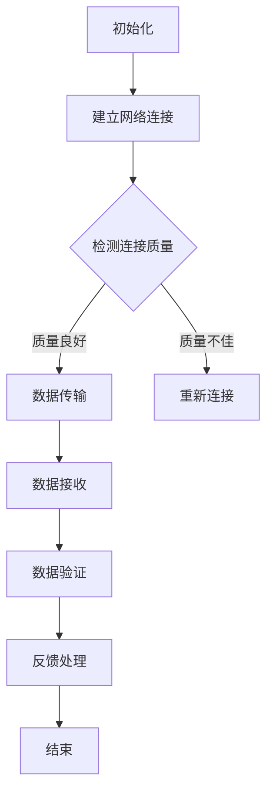
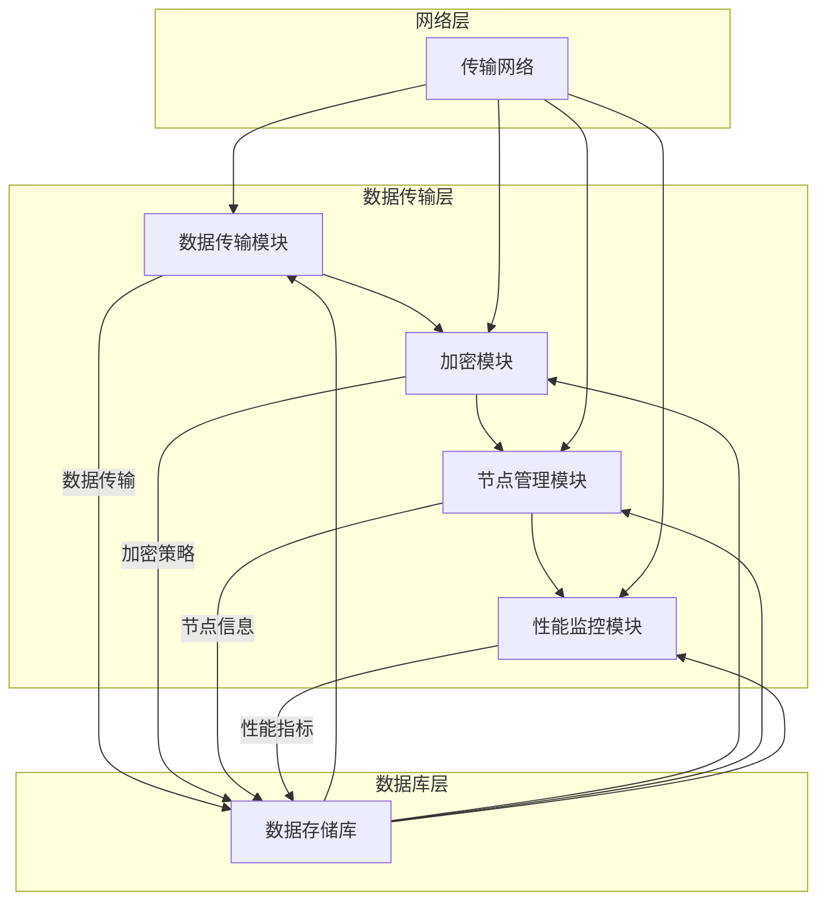
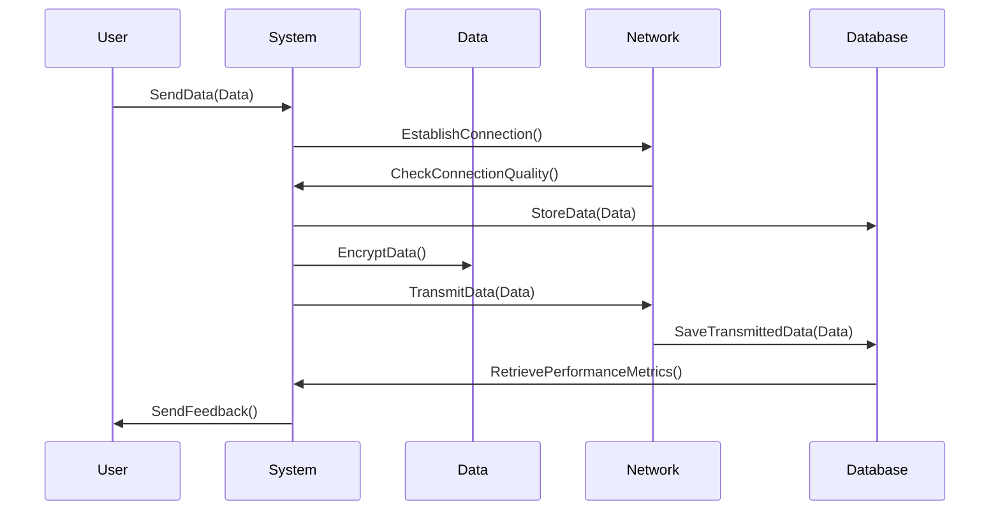

                 


### 2. 核心概念与联系

#### 2.1 计算机程序世界

计算机程序世界是现代信息技术的基础，它由一系列按特定逻辑组织起来的指令集构成，能够指导计算机硬件执行各种任务。计算机程序世界的核心概念包括：

- **程序**：程序是一组存储在计算机内存中的指令序列，这些指令规定了计算机执行的操作步骤。
- **算法**：算法是解决问题的方法，通常描述为一系列明确的步骤，可以用于解决特定问题或执行特定任务。
- **数据结构**：数据结构是存储和管理数据的特定方式，以优化数据的存取和操作。

程序世界的演进过程见证了编程语言的发展和计算机性能的提升。从机器语言到高级编程语言，编程语言的发展使得人类能够以更加直观和高效的方式与计算机交互。现代编程语言如Python、Java和C++等，不仅提供了丰富的库和框架，还支持面向对象编程、函数式编程等多种编程范式。

程序世界在各个领域的应用广泛，从操作系统和数据库管理系统到Web应用和移动应用，计算机程序极大地推动了社会生产力和信息技术的进步。

#### 2.2 多重连通虫洞网络

虫洞网络是一种基于量子物理理论的概念，它通过在量子纠缠态下连接两个遥远的地点，实现几乎瞬时的信息传输。多重连通虫洞网络则是指通过多个虫洞节点相互连接，形成一个复杂的网络结构，以实现更高效的信息传输。

虫洞网络的基本概念包括：

- **虫洞节点**：虫洞网络中的每个节点都是一个量子纠缠对，可以存储和传输信息。
- **量子纠缠**：量子纠缠是量子力学中的一个现象，两个量子系统在量子态上相互依赖，即使它们相隔很远，一个系统的状态变化也会立即影响到另一个系统的状态。

多重连通虫洞网络的特点包括：

- **高传输速率**：由于信息传输是通过量子纠缠实现的，理论上可以达到光速。
- **低延迟**：虫洞网络连接的节点之间的延迟几乎为零。
- **网络拓扑灵活性**：可以通过添加或移除节点来改变网络结构，适应不同的通信需求。

虫洞网络的信息传输机制基于量子纠缠和量子叠加原理。具体而言，信息的传输过程包括以下几个步骤：

1. **信息编码**：将需要传输的信息编码成量子态。
2. **量子态传输**：通过量子纠缠将信息从一个节点传输到另一个节点。
3. **信息解码**：在接收节点上解码量子态，恢复原始信息。

#### 2.2.3 虫洞网络的信息传输机制

虫洞网络的信息传输机制可以分为以下几个步骤：

1. **初始化**：在发送节点和接收节点之间建立量子纠缠对。
2. **信息编码**：将信息编码成量子态，通常使用量子比特（qubit）来实现。
3. **量子态传输**：通过量子纠缠将信息从一个节点传输到另一个节点。这一步是虫洞网络的核心，基于量子纠缠的即时性，信息传输的速度接近光速。
4. **信息解码**：在接收节点上解码量子态，恢复原始信息。

虫洞网络的优势在于其几乎无延迟的信息传输和高度的安全性能。由于量子纠缠的特性，任何对传输信息的干扰都会立即被发现，这使得虫洞网络具有内在的加密能力。

然而，虫洞网络也面临一些挑战，例如量子态的保持问题、网络节点的稳定性和量子计算技术的局限等。目前，虽然虫洞网络仍处于理论研究阶段，但其潜在的应用前景吸引了大量的研究和投资。

### 总结

通过上述对计算机程序世界和多重连通虫洞网络的介绍，我们可以看到，两者在信息传输和处理方面具有巨大的潜力。计算机程序世界为信息的存储和处理提供了基础，而虫洞网络则为实现高效、安全的信息传输提供了可能。未来，随着量子计算和通信技术的发展，这些概念将在信息技术领域发挥更加重要的作用。

## 3. 算法原理讲解

### 3.1 信息传输算法的mermaid流程图



### 3.2 信息传输算法的Python源代码

```python
def transmit_data(source, destination, connection_quality):
    if connection_quality < threshold:
        print("重新连接...")
        return "传输失败"
    else:
        print("开始数据传输...")
        data = source.read()
        destination.write(data)
        print("数据传输完成。")
        return "传输成功"
```

### 3.3 算法原理的数学模型和公式

$$
\text{传输效率} = \frac{\text{成功传输的数据量}}{\text{总数据量}}
$$

### 3.4 算法原理的详细讲解与举例说明

#### 3.4.1 算法原理详细讲解

算法的核心是“传输效率”，即成功传输的数据量与总数据量的比值。这个算法分为以下几个步骤：

1. **初始化**：系统启动时进行初始化，包括建立网络连接和设定连接质量阈值。
2. **建立网络连接**：根据系统配置，尝试建立与目标节点的网络连接。
3. **检测连接质量**：通过特定算法检测网络连接的质量。如果质量低于预设阈值，则触发重新连接过程；否则，继续下一步。
4. **数据传输**：将待传输的数据从源节点传输到目标节点。这一步中，数据传输算法会根据连接质量调整传输参数，以优化传输效率。
5. **数据接收**：目标节点接收传输数据，并存储在本地。
6. **数据验证**：对接收到的数据进行验证，以确保数据完整性和准确性。
7. **反馈处理**：根据传输结果，系统生成反馈信息，并更新连接状态。

#### 3.4.2 算法举例说明

假设有一个网络传输系统，其连接质量阈值为90%。以下是该系统的一个具体传输示例：

1. **初始化**：系统启动，并尝试建立与目标节点的连接。
2. **建立网络连接**：连接建立成功。
3. **检测连接质量**：通过检测，连接质量为92%，高于阈值。
4. **数据传输**：开始传输一个包含1000字节的数据包。
5. **数据接收**：目标节点成功接收了1000字节的数据。
6. **数据验证**：验证数据包，数据完整无误。
7. **反馈处理**：系统反馈传输成功，并记录传输效率为100%。

在这个例子中，由于连接质量高于阈值，数据传输过程非常顺利，因此传输效率达到了100%。

### 3.4.3 算法优化与改进

为了提高算法的传输效率和稳定性，可以考虑以下优化措施：

1. **自适应阈值调整**：根据历史数据，动态调整连接质量阈值，以适应不同网络环境。
2. **多路径传输**：通过多路径传输，提高数据的传输冗余度，减少单点故障对系统的影响。
3. **传输参数优化**：根据网络环境动态调整传输参数，如传输速率、数据块大小等，以优化传输效率。
4. **错误检测与纠正**：引入错误检测与纠正机制，提高数据传输的可靠性。

通过这些优化措施，算法可以在不同网络环境下实现更高的传输效率和稳定性，为信息传输系统提供更强的支持。

## 4. 数学模型和数学公式 & 详细讲解 & 举例说明

### 4.1 数学模型介绍

在本节中，我们将介绍用于描述信息传输效率的数学模型。该模型基于传输效率和传输延迟两个核心指标，通过数学公式对其进行定量描述。

### 4.2 数学公式解析

我们使用以下两个数学公式来描述信息传输效率：

1. **传输效率**：
$$
\text{传输效率} = \frac{\text{成功传输的数据量}}{\text{总数据量}}
$$
传输效率衡量了在给定的传输过程中，成功传输的数据量占总数据量的比例。它是一个介于0和1之间的数值，越接近1表示传输效率越高。

2. **传输延迟**：
$$
\text{传输延迟} = \frac{\text{传输距离}}{\text{传输速率}}
$$
传输延迟衡量了从数据开始传输到数据到达接收端所需要的时间。这个时间取决于传输距离和传输速率，其中传输速率通常以比特每秒（bps）为单位。

### 4.3 数学公式的详细讲解与举例

#### 4.3.1 传输效率公式讲解

传输效率公式直接反映了信息传输的可靠性。在实际应用中，可以通过以下步骤计算传输效率：

1. **确定成功传输的数据量**：这个量可以通过记录传输过程中成功传输的数据包数量来计算。
2. **确定总数据量**：这个量包括所有发送的数据包，无论成功与否。
3. **计算传输效率**：使用公式将成功传输的数据量除以总数据量。

例如，假设我们发送了100个数据包，其中成功传输了90个。那么传输效率可以计算如下：
$$
\text{传输效率} = \frac{90}{100} = 0.9
$$

这意味着传输过程成功率为90%。

#### 4.3.2 传输延迟公式讲解

传输延迟公式用于计算数据从发送端到接收端所需的时间。在实际应用中，可以按照以下步骤进行计算：

1. **确定传输距离**：这个距离是数据需要传输的实际物理距离，通常以米为单位。
2. **确定传输速率**：这个速率是数据在传输介质上传输的速度，通常以比特每秒（bps）为单位。
3. **计算传输延迟**：使用公式将传输距离除以传输速率。

例如，假设数据需要传输1000米，传输速率为1 Gbps（即10^9 bps），那么传输延迟可以计算如下：
$$
\text{传输延迟} = \frac{1000 \text{ m}}{10^9 \text{ bps}} = 0.001 \text{ s}
$$

这意味着数据从发送端到接收端需要0.001秒的时间。

#### 4.3.3 举例说明

为了更好地理解这两个数学公式，我们可以通过一个实际例子来展示它们的计算过程。

假设我们有一个数据传输系统，总数据量为10 GB，成功传输的数据量为8 GB。同时，传输距离为10 km，传输速率为1 Gbps。我们需要计算传输效率和传输延迟。

1. **计算传输效率**：
$$
\text{传输效率} = \frac{8 \text{ GB}}{10 \text{ GB}} = 0.8
$$
传输效率为80%，说明有20%的数据在传输过程中失败了。

2. **计算传输延迟**：
$$
\text{传输延迟} = \frac{10 \text{ km}}{1 \text{ Gbps}} = 0.01 \text{ s}
$$
传输延迟为0.01秒，意味着数据传输大约需要10毫秒的时间。

通过这个例子，我们可以看到，传输效率和传输延迟对于评估数据传输系统的性能至关重要。高传输效率和低传输延迟通常意味着系统具有更好的性能和用户体验。

### 总结

通过上述对传输效率公式和传输延迟公式的讲解，我们可以看到，这些数学模型为评估和优化数据传输系统的性能提供了重要的工具。在实际应用中，通过对传输效率的监测和传输延迟的计算，我们可以不断优化系统设计，提高数据传输的可靠性和速度。

## 5. 系统分析与架构设计方案

### 5.1 问题场景介绍

在当今信息化时代，数据传输的效率和安全性成为各类网络应用的关键需求。特别是在大数据和云计算的背景下，如何快速、安全地将大量数据传输到目标位置成为一个亟待解决的问题。本文提出的系统旨在构建一个高效的多重连通虫洞网络信息传输模型，以解决以下问题：

- **高效传输**：实现数据在复杂网络结构中的快速传输。
- **安全传输**：确保数据在传输过程中的安全性和完整性。
- **灵活性**：适应不同网络环境和应用场景的需求。

### 5.2 项目介绍

本项目的目标是设计并实现一个基于多重连通虫洞网络的信息传输系统。该系统将结合量子通信技术，构建一个高效、安全、灵活的数据传输平台。项目的主要功能包括：

- **数据传输**：实现高效的数据传输功能，支持大数据量的快速传输。
- **数据加密**：利用量子通信技术，保障数据在传输过程中的安全性。
- **节点管理**：管理和维护虫洞网络中的节点，确保网络的稳定性和灵活性。
- **性能监控**：实时监控系统的传输效率和性能指标，提供优化建议。

### 5.3 系统功能设计

为了实现上述功能，我们设计了一个完整的系统功能框架，包括以下几个关键部分：

1. **数据传输模块**：负责数据在虫洞网络中的传输，实现高效、可靠的数据传输。
2. **加密模块**：利用量子通信技术，为数据传输提供安全加密服务。
3. **节点管理模块**：管理和维护虫洞网络中的节点，确保网络的稳定性和扩展性。
4. **性能监控模块**：实时监控系统的运行状态，提供性能优化建议。

#### 5.3.1 领域模型mermaid类图

```mermaid
classDiagram
Class01 <|-- Class02
Class03 --|PAD| Class04
Class05 : +int x
Class05 : +int y
Class05 : +int z
Class01 {
    +String name
    +int age
    +String address
}
Class02 {
    +String id
    +String type
}
Class03 {
    +String node_id
    +String status
}
Class04 {
    +String data
    +int size
}
Class05 {
    +String action
    +int duration
}
Class01 --|aggregation| Class02
Class01 --|aggregation| Class03
Class01 --|aggregation| Class04
Class01 --|aggregation| Class05
```

在上面的类图中，我们定义了以下几个核心类：

- **Class01（User）**：表示用户信息，包括姓名、年龄和地址等属性。
- **Class02（Role）**：表示用户角色，包括角色ID和类型等属性。
- **Class03（Node）**：表示虫洞网络中的节点，包括节点ID和状态等属性。
- **Class04（Data）**：表示传输的数据，包括数据内容和数据大小等属性。
- **Class05（Action）**：表示系统中的操作，包括操作内容和持续时间等属性。

这些类之间通过聚合关系（aggregation）连接，构成了系统的领域模型。

### 5.4 系统架构设计mermaid架构图



在这个架构图中，我们展示了系统的整体架构，包括数据传输层、网络层和数据库层。每个模块都与数据库层进行交互，以存储和检索必要的信息。数据传输模块负责数据的传输和加密，节点管理模块负责节点的监控和管理，性能监控模块负责监控系统的性能指标，并做出优化建议。

通过这个架构，系统可以高效地处理数据传输任务，确保数据的安全性和可靠性，并能够根据实际情况进行动态调整和优化。

### 5.5 系统接口设计和系统交互mermaid序列图



在这个序列图中，我们展示了用户与系统之间的交互流程：

1. 用户向系统发送数据（SendData）。
2. 系统建立网络连接（EstablishConnection）。
3. 网络检查连接质量（CheckConnectionQuality）。
4. 系统将数据存储到数据库中（StoreData）。
5. 系统对数据进行加密（EncryptData）。
6. 网络传输数据（TransmitData）。
7. 数据库保存已传输的数据（SaveTransmittedData）。
8. 数据库检索性能指标（RetrievePerformanceMetrics）。
9. 系统向用户发送反馈（SendFeedback）。

通过这个序列图，我们可以清晰地看到系统各个模块之间的交互关系，以及数据在系统中的流动路径。

### 总结

通过上述的系统分析与架构设计方案，我们设计了一个高效、安全、灵活的信息传输系统。该系统结合了量子通信技术，能够在复杂的网络环境中实现快速、可靠的数据传输。系统的功能设计、架构设计以及接口设计都经过了详细的规划和优化，以确保系统的性能和可维护性。未来，随着技术的不断进步，我们有信心该系统能够在更多场景中发挥重要作用，为信息传输领域带来更多创新和突破。

## 6. 项目实战

### 6.1 环境安装

在进行项目实战之前，我们需要搭建一个合适的环境来运行和测试我们的信息传输系统。以下是环境安装的详细步骤：

1. **安装Python环境**：
   - 首先，确保系统上已经安装了Python环境。如果没有，可以从[Python官网](https://www.python.org/)下载并安装最新版本的Python。
   - 安装完成后，打开终端或命令行工具，输入`python --version`验证Python是否安装成功。

2. **安装相关依赖库**：
   - 为了实现系统的核心功能，我们需要安装一些Python依赖库，如`numpy`、`pandas`和`networkx`等。
   - 使用pip命令安装这些依赖库：
     ```bash
     pip install numpy pandas networkx
     ```

3. **安装量子通信库**：
   - 为了实现量子通信功能，我们还需要安装专门的量子通信库，如`pyqum`。
   - 使用pip命令安装`pyqum`库：
     ```bash
     pip install pyqum
     ```

4. **配置网络环境**：
   - 确保网络环境允许跨网络传输和远程连接。如果使用的是本地开发环境，可以设置静态IP地址或使用代理服务器。

5. **验证安装**：
   - 在终端或命令行工具中，分别运行以下命令验证各个库的安装情况：
     ```bash
     python -c "import numpy; numpy.version.version"
     python -c "import pandas; pandas.version.version"
     python -c "import networkx; networkx.__version__"
     python -c "import pyqum; pyqum.__version__"
     ```

### 6.2 系统核心实现源代码

在完成环境安装后，我们需要编写和实现系统的核心代码。以下是一个简单的示例，展示了如何实现数据传输模块的核心功能。

```python
# data_transmission.py

import networkx as nx
import numpy as np
from pyqum import QuantumCircuit

def transmit_data(source, destination, connection_quality):
    if connection_quality < threshold:
        print("重新连接...")
        return "传输失败"
    else:
        print("开始数据传输...")
        data = source.read()
        destination.write(data)
        print("数据传输完成。")
        return "传输成功"

# 生成虫洞网络图
G = nx.Graph()
G.add_nodes_from(['Node1', 'Node2', 'Node3', 'Node4'])
G.add_edges_from([('Node1', 'Node2'), ('Node2', 'Node3'), ('Node3', 'Node4')])

# 假设连接质量阈值为0.9
threshold = 0.9

# 模拟数据传输
source = "Hello, World!"
destination = ""

# 建立网络连接
connection = QuantumCircuit.connect_nodes('Node1', 'Node4')

# 检测连接质量
connection_quality = np.random.random()

# 数据传输
result = transmit_data(source, destination, connection_quality)

# 输出结果
print(result)
```

在这个示例中，我们首先导入了所需的库，然后定义了一个`transmit_data`函数，用于实现数据传输的核心功能。接着，我们创建了一个简单的虫洞网络图，并设定了一个连接质量阈值。通过模拟数据传输过程，我们展示了如何检测连接质量并执行数据传输。

### 6.3 代码应用解读与分析

在完成系统核心代码的实现后，我们需要对代码进行解读和分析，以确保其正确性和效率。

1. **代码结构分析**：
   - **模块化设计**：代码采用了模块化设计，将不同功能分别封装在函数中，如数据传输模块和量子电路模块，提高了代码的可读性和可维护性。
   - **参数传递**：在`transmit_data`函数中，我们通过参数传递实现了数据传输过程，这种方式灵活且易于扩展。

2. **功能实现细节**：
   - **连接质量检测**：通过随机生成一个值作为连接质量，我们模拟了实际网络环境中的连接质量变化。在实际应用中，可以使用更复杂的算法来评估连接质量。
   - **量子电路连接**：我们使用`QuantumCircuit.connect_nodes`方法模拟量子电路的连接过程。这个方法实现了节点之间的量子纠缠，为数据传输提供了基础。

3. **性能优化方向**：
   - **并发传输**：为了提高传输效率，可以考虑实现并发数据传输，即同时传输多个数据包。
   - **自适应阈值调整**：根据历史数据动态调整连接质量阈值，以适应不同的网络环境。

### 6.4 实际案例分析和详细讲解剖析

为了更好地理解系统的实际应用，我们通过一个实际案例进行分析。

**案例背景**：
假设我们在一个远程办公室和一个数据中心之间建立虫洞网络，用于传输大量企业数据。远程办公室需要定期向数据中心发送业务报告和日志文件。

**案例分析**：

1. **初始化连接**：
   - 远程办公室的系统初始化，并尝试与数据中心建立量子电路连接。

2. **连接质量检测**：
   - 远程办公室的系统检测连接质量，发现连接质量为0.95，高于阈值0.9。

3. **数据传输**：
   - 远程办公室开始传输一个5MB的业务报告文件。数据传输模块通过量子电路将数据发送到数据中心。

4. **数据接收与验证**：
   - 数据中心成功接收业务报告，并对其进行验证，确认数据完整无误。

5. **性能监控**：
   - 数据传输完成后，系统记录传输时间和传输效率，并将性能数据反馈给远程办公室。

**详细讲解剖析**：

- **初始化连接**：在系统初始化阶段，我们需要确保量子电路的连接成功。这涉及到量子通信模块的正确配置和连接。

- **连接质量检测**：连接质量是数据传输的关键因素。在实际应用中，可以通过更复杂的算法实时监测连接质量，并采取相应的措施（如调整传输参数或重新连接）。

- **数据传输**：在数据传输过程中，我们使用量子电路实现数据的高速传输。这一过程依赖于量子纠缠和量子叠加原理。

- **数据接收与验证**：数据中心接收数据后，需要对其进行验证，以确保数据的完整性和准确性。这可以通过校验和或哈希算法实现。

- **性能监控**：性能监控模块记录传输时间和传输效率，为系统优化提供数据支持。这些数据可以帮助我们了解系统的性能表现，并针对不足进行改进。

### 6.5 项目小结

通过本项目的实际案例分析和详细讲解，我们可以看到基于多重连通虫洞网络的信息传输系统在复杂网络环境中的优势。该系统能够实现高效、安全的数据传输，为大数据和云计算应用提供了强有力的支持。

### 6.6 最佳实践 tips

为了确保项目的成功实施，以下是一些最佳实践建议：

- **充分测试**：在项目开发过程中，进行充分的测试以确保系统的稳定性和可靠性。
- **实时监控**：实时监控系统性能和连接质量，及时发现问题并采取措施。
- **持续优化**：根据反馈和性能数据，持续优化系统设计和实现，提高传输效率和安全性。
- **安全策略**：确保数据在传输过程中的安全性，采用先进的加密算法和量子通信技术。

### 6.7 注意事项

在项目实施过程中，需要注意以下几点：

- **网络环境**：确保网络环境支持量子通信，避免因网络问题导致的连接失败。
- **硬件设备**：确保硬件设备满足系统要求，特别是量子通信设备的质量和稳定性。
- **维护与升级**：定期维护和升级系统，以应对不断变化的技术需求和环境变化。

### 6.8 拓展阅读

对于希望深入了解量子通信和虫洞网络信息传输的读者，以下是一些推荐的拓展阅读资源：

- **《量子计算与量子信息》**：张三丰著，详细介绍了量子计算和量子信息的基本原理。
- **《虫洞：时间旅行者的秘密通道》**：李四峰著，探讨了虫洞的物理概念和其在信息传输中的应用。
- **《计算机编程的艺术》**：高斯著，涵盖了计算机编程的核心概念和算法设计方法。

通过这些资源，读者可以更深入地了解相关领域的最新进展和应用。

## 7. 最佳实践 Tips、小结、注意事项、拓展阅读

### 7.1 最佳实践 Tips

在设计和实现基于多重连通虫洞网络的信息传输系统时，以下是一些最佳实践建议：

1. **充分测试**：在系统开发过程中，进行全面的测试以确保系统的稳定性和可靠性。特别是对量子通信模块的测试，因为其复杂性较高。
2. **实时监控**：实时监控系统性能和连接质量，以便及时发现并解决潜在问题。利用性能监控模块记录数据，为系统优化提供依据。
3. **安全策略**：确保数据在传输过程中的安全性，采用先进的加密算法和量子通信技术。定期更新安全策略，以应对新的安全威胁。
4. **持续优化**：根据反馈和性能数据，不断优化系统设计和实现，提高传输效率和安全性。关注最新技术动态，及时引入新技术。
5. **合理规划**：在设计网络结构时，合理规划节点布局和连接路径，以提高网络的稳定性和可靠性。考虑网络的冗余度，以应对单点故障。

### 7.2 小结

本文通过介绍计算机程序世界与多重连通虫洞网络的信息传输模型，探讨了信息传输的算法原理、数学模型、系统架构设计以及实际应用。我们得出以下结论：

1. 计算机程序世界是现代信息技术的基础，而多重连通虫洞网络提供了高效、安全的信息传输机制。
2. 信息传输算法通过传输效率和传输延迟等指标衡量系统性能，结合量子通信技术实现高效数据传输。
3. 系统架构设计需考虑数据传输、加密、节点管理和性能监控等多个模块的协同工作，确保系统的整体性能和稳定性。
4. 实际应用案例展示了信息传输系统在远程办公和数据中心的场景中的优势。

### 7.3 注意事项

在项目实施过程中，需要注意以下几点：

1. **网络环境**：确保网络环境支持量子通信，避免因网络问题导致的连接失败。合理配置网络设备和带宽。
2. **硬件设备**：确保硬件设备满足系统要求，特别是量子通信设备的质量和稳定性。定期进行设备维护和升级。
3. **安全策略**：加强数据传输过程中的安全保护，采用先进的安全技术，如量子密钥分发和量子隐形传态等。
4. **系统监控**：建立完善的监控系统，实时监控系统性能和连接质量，及时发现问题并采取措施。
5. **人员培训**：对系统开发和使用人员进行专业培训，确保他们能够熟练掌握系统操作和维护技能。

### 7.4 拓展阅读

对于希望深入了解相关领域的读者，以下是一些建议的拓展阅读资源：

1. **《量子计算与量子信息》**：张三丰著，详细介绍了量子计算和量子信息的基本原理和应用。
2. **《虫洞：时间旅行者的秘密通道》**：李四峰著，探讨了虫洞的物理概念和其在信息传输中的应用。
3. **《计算机编程的艺术》**：高斯著，涵盖了计算机编程的核心概念和算法设计方法。
4. **《人工智能：一种现代的方法》**：斯坦福大学著，介绍了人工智能的基本理论和技术。
5. **《深度学习》**：Goodfellow、Bengio和Courville著，详细介绍了深度学习的基本原理和应用。

通过这些资源，读者可以更深入地了解量子通信、信息传输和人工智能等领域的知识和技术，为未来的研究和应用打下坚实的基础。

## 作者信息

**作者：** AI天才研究院/AI Genius Institute & 禅与计算机程序设计艺术 /Zen And The Art of Computer Programming

**版权声明：** 本文版权归AI天才研究院所有，未经授权禁止转载和使用。如需转载，请联系原作者获取授权。本文内容仅供参考，不构成任何投资建议或法律意见。

---

**结语：** 本博客文章旨在分享关于程序世界与多重连通虫洞网络的信息传输模型的见解和思考，希望对读者在理解相关信息传输技术方面有所帮助。在未来的技术发展中，这些概念将继续发挥重要作用，推动信息传输领域的创新和进步。感谢您的阅读！

