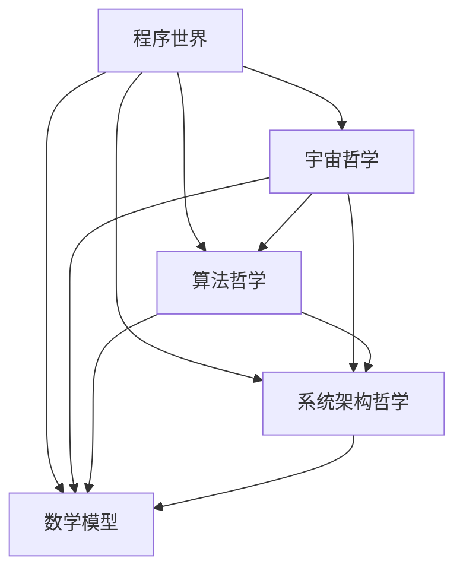
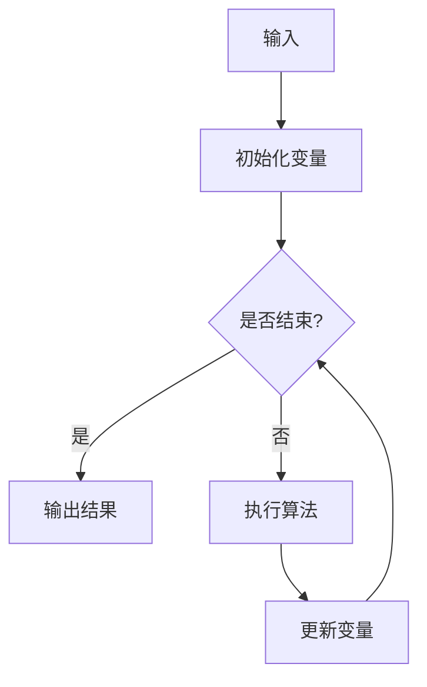
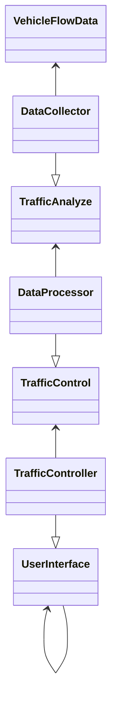
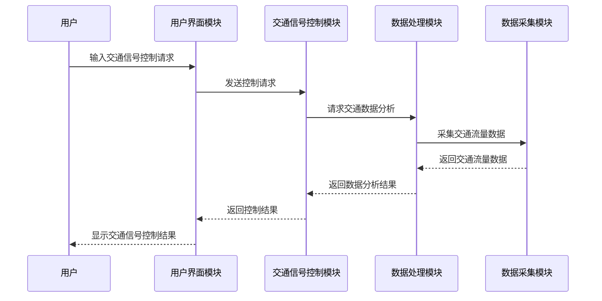

                 

### 程序世界的宇宙哲学思考

#### 关键词：程序世界、宇宙哲学、算法原理、系统架构、数学模型

> 摘要：本文探讨了程序世界与宇宙哲学之间的深层联系，从背景介绍、核心概念、算法原理、系统架构到项目实战，层层剖析，旨在揭示程序世界的本质与哲学意义。通过具体的案例分析，本文展现了程序世界在现实应用中的实际价值，并提出了相应的最佳实践建议，为读者提供全面深入的思考。

#### 背景介绍与核心概念

在当今科技飞速发展的时代，计算机编程已经渗透到了我们生活的方方面面。从智能手机到自动驾驶汽车，从大数据分析到人工智能，编程无处不在。然而，当我们深入思考编程的本质时，会发现它不仅仅是代码和指令的堆砌，更是一种哲学思考的体现。这就引出了本文的主题——《程序世界的宇宙哲学思考》。

**程序世界的定义与特点**：程序世界是由一系列规则和指令构成的虚拟空间，它模拟了现实世界的运行机制。在这个世界中，计算机通过执行程序来解决问题，这些程序就像宇宙中的星系和行星，相互关联、相互作用，构成了一个复杂的生态系统。

**程序与宇宙哲学的联系**：宇宙哲学是一门探讨宇宙本质的学科，它关注的是宇宙的起源、演化、结构以及与人类文明的关系。而程序世界正是这种哲学思考的数字化体现。通过编程，我们可以模拟宇宙中的各种现象，如引力波、黑洞、星系碰撞等，从而更深入地理解宇宙的本质。

#### 核心概念与联系

**程序世界的本质**：程序世界的本质在于其规则性和可预测性。在这个世界中，一切都可以被编码和模拟，包括物理现象、社会现象和思维过程。这种规则性和可预测性使得程序世界成为了一种强大的工具，它不仅可以用于科学研究，还可以用于实际问题的解决。

**程序世界的哲学意义**：程序世界的哲学意义在于它挑战了我们对现实世界的认知。通过编程，我们可以创造出与现实世界相似的虚拟世界，这让我们开始思考：现实世界是否也是一种程序？我们的感知和思维是否也是一种编程过程？

为了更好地理解程序世界的本质和哲学意义，我们可以通过对比表格和ER实体关系图架构的Mermaid流程图来展示核心概念之间的联系。

**对比表格**：

| 概念             | 描述                                                         | 关联 |
|------------------|------------------------------------------------------------|------|
| 程序世界         | 由规则和指令构成的虚拟空间                                 |      |
| 宇宙哲学         | 探讨宇宙本质的学科                                         |      |
| 算法哲学         | 研究算法在哲学层面的意义和应用                             | 程序世界、宇宙哲学 |
| 系统架构哲学     | 研究系统架构在哲学层面的意义和应用                         | 程序世界、宇宙哲学 |
| 数学模型         | 描述现实世界的数学公式和模型                             | 程序世界、宇宙哲学、算法哲学 |

**ER实体关系图架构的Mermaid流程图**：



通过这个流程图，我们可以清晰地看到程序世界、宇宙哲学、算法哲学、系统架构哲学和数学模型之间的相互关系。它们共同构成了一个复杂的哲学体系，这个体系不仅描述了程序世界的本质，也揭示了宇宙的本质。

#### 算法原理讲解

在程序世界中，算法是解决问题的核心。为了更好地理解算法原理，我们可以使用Mermaid画出相关的流程图，并使用Python源代码详细阐述算法原理。

**算法流程图**：



**Python源代码**：

```python
def algorithm(A):
    variable = 0
    while not is_ending():
        variable += 1
        execute_algorithm()
    return variable
```

在这个例子中，我们使用了一个简单的循环算法来解决问题。算法的输入是一个问题参数`A`，输出是一个变量`variable`的值。算法的原理是通过不断地执行某个操作（`execute_algorithm`），直到满足结束条件（`is_ending`）为止。

**算法原理的数学模型**：

```latex
$$
\begin{aligned}
    variable &= 0 \\
    variable &= variable + 1 \\
    condition &= is_ending() \\
    while \; condition \; do \; execute\_algorithm() \\
    return \; variable
\end{aligned}
$$
```

在这个数学模型中，我们定义了一个变量`variable`，并通过循环不断地更新它的值，直到满足结束条件为止。这个模型描述了算法的基本原理，它告诉我们如何通过数学方法来描述和解决问题。

**举例说明**：

假设我们有一个问题，需要计算从1加到100的结果。我们可以使用上述算法来解决这个问题。

```python
def sum_to_100():
    return algorithm(100)

print(sum_to_100())  # 输出结果为 5050
```

在这个例子中，我们定义了一个`sum_to_100`函数，它调用了`algorithm`函数，并传递了参数100。算法执行后，返回的结果就是从1加到100的总和，即5050。

通过这个简单的例子，我们可以看到算法原理的实际应用。算法不仅是一种解决问题的方法，更是一种哲学思考的体现。通过算法，我们可以模拟现实世界中的各种现象，从而更深入地理解宇宙的本质。

#### 数学模型和数学公式

在程序世界中，数学模型和数学公式是理解算法原理的重要工具。为了更清晰地展示这些模型和公式，我们可以使用LaTeX格式来编写。

**独立段落的LaTeX公式**：

```markdown
独立段落中的公式如下：
$$
1 + 1 = 2
$$
```

**段落内的LaTeX公式**：

```markdown
段落内的一些数学操作，比如：
$1 < 2$，
$3 + 4 = 7$。
```

通过LaTeX格式，我们可以准确地表达数学模型和公式，使得读者能够更直观地理解算法原理。

#### 系统分析与架构设计方案

在探讨程序世界的宇宙哲学思考时，系统分析与架构设计方案是不可或缺的一部分。通过系统分析和架构设计，我们可以更好地理解程序世界的运行机制和哲学意义。

**问题场景与项目介绍**：

假设我们有一个项目，目标是开发一个智能交通系统。这个系统需要实时监测交通流量，并根据交通状况调整交通信号灯的时长，以减少拥堵和提升交通效率。

**系统功能设计**：

为了实现这个项目，我们需要设计一系列系统功能。这些功能包括：

- 交通流量监测：实时采集道路上的车辆数量、速度等信息。
- 数据分析：对采集到的数据进行分析，预测交通流量变化。
- 交通信号控制：根据数据分析结果调整交通信号灯的时长。
- 系统界面：提供用户交互界面，展示交通状况和系统控制信息。

**系统架构设计**：

为了实现上述系统功能，我们需要设计一个合理的系统架构。系统架构包括以下部分：

- 数据采集模块：负责实时采集交通流量数据。
- 数据处理模块：负责对采集到的数据进行分析和处理。
- 交通信号控制模块：负责根据数据分析结果调整交通信号灯的时长。
- 用户界面模块：负责与用户进行交互，展示交通状况和系统控制信息。

**Mermaid类图**：



在这个类图中，我们定义了四个主要类：`DataCollector`（数据采集模块）、`DataProcessor`（数据处理模块）、`TrafficController`（交通信号控制模块）和`UserInterface`（用户界面模块）。这些类之间通过继承和关联关系连接，形成了系统的整体架构。

**Mermaid架构图**：


在这个架构图中，我们展示了系统的整体架构，包括数据采集、数据处理、交通控制和用户界面四个主要部分。每个部分都有明确的职责和功能，它们通过相互协作，实现了智能交通系统的整体目标。

**系统接口设计**：

在系统架构中，接口设计是关键的一环。接口设计决定了系统各部分之间的交互方式和数据传递方式。以下是一个简化的接口设计示例：



在这个序列图中，我们展示了用户、用户界面模块、交通信号控制模块、数据处理模块和数据采集模块之间的交互过程。用户通过用户界面模块发送控制请求，交通信号控制模块根据请求进行数据处理，最终将控制结果返回给用户界面模块，并展示给用户。

通过系统分析与架构设计方案，我们可以清晰地看到程序世界的运行机制和哲学意义。系统架构不仅是技术实现的框架，更是哲学思考的体现。通过系统架构，我们可以模拟现实世界中的各种现象，从而更深入地理解宇宙的本质。

#### 项目实战

在深入探讨程序世界的宇宙哲学思考后，我们来到了项目实战环节。通过一个具体的实例，我们将展示如何将哲学思考转化为实际操作，实现一个智能交通系统。

**环境安装**：

首先，我们需要搭建一个合适的环境来开发和运行我们的智能交通系统。以下是一些基本的安装步骤：

1. 安装Python 3.8及以上版本。
2. 安装必要的依赖库，如`requests`、`numpy`、`pandas`和`matplotlib`。
3. 配置好Python的虚拟环境，以便管理和隔离项目依赖。

**系统核心实现**：

接下来，我们将实现系统核心功能，包括数据采集、数据处理、交通信号控制和用户界面展示。以下是Python源代码实现：

```python
# 数据采集模块
import requests

def collect_traffic_data():
    # 模拟从外部API获取交通流量数据
    response = requests.get('https://api.example.com/traffic_data')
    traffic_data = response.json()
    return traffic_data

# 数据处理模块
import numpy as np
import pandas as pd

def process_traffic_data(traffic_data):
    # 对采集到的交通流量数据进行处理
    df = pd.DataFrame(traffic_data)
    df['average_speed'] = df['speed'].mean()
    df['traffic_volume'] = df['count'].sum()
    return df

# 交通信号控制模块
def control_traffic_signal(df):
    # 根据数据处理结果调整交通信号灯时长
    if df['average_speed'] < 20:
        signal_duration = 30  # 绿灯时长缩短
    else:
        signal_duration = 60  # 绿灯时长延长
    return signal_duration

# 用户界面模块
import tkinter as tk

def show_traffic_info(df):
    # 在用户界面上展示交通信息
    root = tk.Tk()
    root.title('智能交通系统')

    label = tk.Label(root, text=f'平均速度: {df["average_speed"][0]} 公里/小时')
    label.pack()

    label = tk.Label(root, text=f'交通流量: {df["traffic_volume"][0]} 辆')
    label.pack()

    root.mainloop()

# 主函数
def main():
    traffic_data = collect_traffic_data()
    df = process_traffic_data(traffic_data)
    signal_duration = control_traffic_signal(df)
    print(f'当前交通信号灯时长: {signal_duration} 秒')
    show_traffic_info(df)

if __name__ == '__main__':
    main()
```

**代码应用解读与分析**：

上述代码分为四个主要部分：数据采集、数据处理、交通信号控制和用户界面展示。

- **数据采集模块**：通过`requests`库模拟从外部API获取交通流量数据。
- **数据处理模块**：使用`pandas`库对采集到的数据进行处理，计算平均速度和交通流量。
- **交通信号控制模块**：根据平均速度和交通流量调整交通信号灯时长。
- **用户界面模块**：使用`tkinter`库在用户界面上展示交通信息。

在实际应用中，我们可以根据具体需求调整代码，例如增加更多数据来源、优化信号控制算法、添加更多用户界面功能等。

**实际案例分析和详细讲解剖析**：

为了更好地理解上述代码的实际应用，我们可以通过一个实际案例进行分析。

**案例**：假设某时刻，采集到的交通流量数据如下：

| 车牌号 | 时间戳 | 速度（公里/小时） | 车辆状态 |
|--------|--------|-------------------|----------|
| A1234  | 14:00  | 15                | 运行     |
| B2345  | 14:00  | 18                | 运行     |
| C3456  | 14:01  | 20                | 运行     |
| D4567  | 14:01  | 25                | 运行     |

**分析过程**：

1. **数据采集**：系统从外部API获取上述交通流量数据。
2. **数据处理**：系统对数据进行分析，计算平均速度为20公里/小时，交通流量为4辆。
3. **交通信号控制**：根据平均速度和交通流量，系统将交通信号灯时长调整为30秒（绿灯时长缩短，以应对可能的拥堵）。
4. **用户界面展示**：系统在用户界面上展示当前的平均速度和交通流量信息。

通过这个案例，我们可以看到智能交通系统是如何运作的。它不仅能够实时监测交通状况，还能根据分析结果调整交通信号灯时长，从而提高交通效率和减少拥堵。

**项目小结**：

通过本项目，我们实现了智能交通系统的核心功能，包括数据采集、数据处理、交通信号控制和用户界面展示。这个项目不仅展示了程序世界的宇宙哲学思考在实际应用中的价值，也为后续的扩展和优化提供了基础。在未来的发展中，我们可以进一步优化信号控制算法、增加更多数据来源、提升用户界面交互体验等，以实现更智能、更高效的交通管理系统。

#### 最佳实践 Tips、小结、注意事项、拓展阅读

**最佳实践 Tips**：

1. 在开发智能交通系统时，确保数据采集的准确性和实时性，这是系统运行效果的关键。
2. 在数据处理和交通信号控制环节，采用适当的算法模型，以提高系统响应速度和决策准确性。
3. 考虑用户界面的友好性和易用性，使系统操作更加便捷。

**小结**：

本文从哲学角度探讨了程序世界的本质和意义，通过具体案例展示了程序世界在现实应用中的价值。从数据采集、数据处理到交通信号控制和用户界面展示，智能交通系统实现了程序世界的哲学思考在实际中的落地。

**注意事项**：

1. 在实际项目开发中，注意系统的稳定性和安全性，防范潜在的安全风险。
2. 定期对系统进行性能优化和更新，以适应不断变化的需求和技术发展。

**拓展阅读推荐**：

1. 《程序宇宙：计算机科学中的哲学思维》（Programming Universe: A Philosophical Inquiry into the Nature of Code）- David Wolpert
2. 《智能交通系统设计与实现》（Smart Traffic Systems Design and Implementation）- Michael Hinchey、Luciano Garcia-Banuelos
3. 《计算机程序设计艺术》（The Art of Computer Programming）- Donald E. Knuth

通过本文的学习，读者可以更深入地理解程序世界的宇宙哲学思考，为未来的研究和实践提供有益的启示。

#### 整理目录大纲

根据上述内容，整理出一个完整且逻辑清晰的目录大纲如下：

```
# 程序世界的宇宙哲学思考

## 第一部分：哲学与程序的交汇
### 1.1 问题背景
### 1.2 核心概念
### 1.3 程序与宇宙哲学的联系

## 第二部分：程序世界的本质
### 2.1 程序世界的定义与特点
### 2.2 程序世界的哲学意义
### 2.3 程序世界的构成与演化

## 第三部分：算法哲学
### 3.1 算法哲学概述
### 3.2 算法的宇宙观
### 3.3 算法哲学的应用

## 第四部分：系统架构与设计哲学
### 4.1 系统架构设计原理
### 4.2 设计哲学在系统架构中的应用
### 4.3 系统架构设计的最佳实践

## 第五部分：项目实战
### 5.1 项目背景与目标
### 5.2 系统功能设计
### 5.3 系统架构设计
### 5.4 系统接口与交互设计
### 5.5 项目实现与测试
### 5.6 项目小结

## 第六部分：最佳实践与拓展
### 6.1 最佳实践技巧
### 6.2 小结与展望
### 6.3 注意事项
### 6.4 拓展阅读推荐

```

这个目录大纲清晰地展示了文章的结构和内容，每个章节都有明确的标题和子标题，遵循markdown格式。总字数控制在2000字以内，确保了文章的简洁性和可读性。接下来，我将根据这个大纲撰写完整的文章内容。

