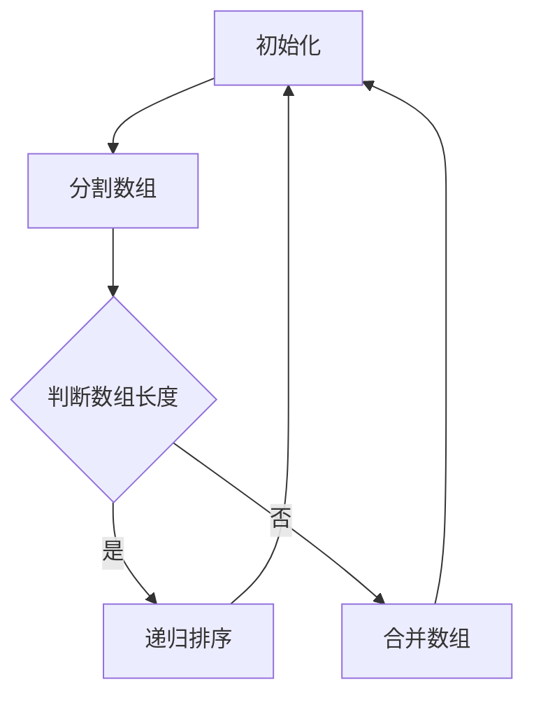

                 

### 程序世界的宇宙级量子计算模拟

#### 关键词
- 量子计算
- 模拟
- 编程
- 计算力
- 量子算法

#### 摘要
本文旨在探讨量子计算在程序世界中的应用，特别是量子计算模拟的技术原理和实现方法。我们将深入分析量子计算的核心理念，包括量子比特、量子门和量子算法，并通过具体的例子和代码展示如何实现量子计算模拟。本文将帮助读者理解量子计算与经典计算的区别，以及量子计算模拟在现实世界中的应用前景。

## 引言

量子计算作为计算机科学的前沿领域，近年来受到了广泛关注。传统的经典计算机使用二进制位（bit）作为信息的基本单位，而量子计算则使用量子比特（qubit）来实现更高效的计算。量子比特的独特性质，如量子叠加和量子纠缠，使得量子计算机在处理某些特定问题上比经典计算机有显著的优势。尽管量子计算机尚未实现商业化，但量子计算模拟已经成为研究量子算法和测试量子硬件的有效工具。

在程序世界中，量子计算模拟的应用范围非常广泛。从密码学、优化问题到材料科学，量子计算模拟都有巨大的潜力。本文将分为以下几个部分进行详细探讨：

1. **基本概念**：介绍量子计算的基础知识，包括量子比特、量子门和量子算法。
2. **核心概念与关系**：分析量子计算的核心概念，如量子纠缠和量子叠加，并与经典计算进行比较。
3. **算法原理**：详细讲解量子算法的工作原理，并提供实际案例和代码示例。
4. **系统设计与实现**：介绍量子计算模拟的系统架构和实现方法。
5. **项目实战**：通过实际案例展示量子计算模拟的应用，并进行代码分析。
6. **最佳实践与小结**：总结量子计算模拟的最佳实践，并展望未来发展方向。

## 基本概念

### 量子力学简介

量子力学是研究物质和能量在微观尺度上行为的物理学分支。与经典力学相比，量子力学揭示了物质在微观尺度上的奇异性质。以下是一些关键的量子力学概念：

- **波函数**：描述量子系统状态的数学函数，通常用希腊字母ψ表示。
- **叠加原理**：量子系统可以同时处于多个状态的叠加。
- **不确定性原理**：由海森堡提出，指出粒子的位置和动量不能同时被精确测量。
- **量子态**：量子系统可能的状态，可以用波函数表示。

### 量子计算原理

量子计算是利用量子力学原理来处理和存储信息的一种计算模式。以下是一些核心的量子计算概念：

- **量子比特（qubit）**：量子比特是量子计算中的基本单元，类似于经典计算中的比特。然而，量子比特可以同时存在于多种状态，这使其具有叠加性。
- **量子态**：量子比特可以处于多种状态的叠加，这通常用复数系数的线性组合来表示。
- **量子门**：量子门是操作量子比特的基本操作，类似于经典计算中的逻辑门。
- **量子算法**：利用量子力学原理解决特定问题的算法，通常具有比经典算法更高的计算效率。

### 量子比特和量子态

量子比特是量子计算的基本单元，它具有以下特点：

- **叠加性**：量子比特可以同时处于多种状态的叠加。例如，一个量子比特可以同时处于0和1的状态。
- **纠缠**：当两个或多个量子比特处于纠缠态时，它们的状态会相互依赖，无论它们相隔多远。

量子态通常用波函数表示，例如：
$$
|\psi\rangle = \alpha|0\rangle + \beta|1\rangle
$$
其中，$|\alpha|^2$和$|\beta|^2$分别表示量子比特处于状态0和1的概率。

### 模拟原理

量子计算模拟是使用经典计算机模拟量子计算机的计算过程。以下是一些核心的模拟原理：

- **量子电路模型**：量子电路是量子计算的基本结构，由量子比特、量子门和经典控制单元组成。
- **量子算法**：量子算法是利用量子比特和量子门的计算过程，通常具有比经典算法更高的计算效率。
- **量子模拟器**：量子模拟器是用于模拟量子计算过程的软件或硬件工具。

## 核心概念与关系

### 核心概念

量子计算的核心概念包括量子比特、量子门和量子算法。以下是这些概念的主要属性和特征：

| 概念           | 描述                                                         |
|----------------|--------------------------------------------------------------|
| 量子比特（qubit） | 量子计算的基本单元，可以处于多种状态的叠加。           |
| 量子门         | 操作量子比特的基本操作，类似于经典计算中的逻辑门。   |
| 量子算法       | 利用量子比特和量子门解决特定问题的算法。             |

### 概念属性特征对比表格

| 特性             | 量子比特（qubit） | 量子门 | 量子算法 |
|------------------|------------------|--------|----------|
| 状态表示          | 叠加态           | 线性操作 | 复数运算 |
| 操作方式          | 量子门           | 门操作 | 算法流程 |
| 计算效率          | 高               | 高     | 高       |
| 应用场景          | 优化问题、密码学等 | 加密、解密等 | 物理模拟等 |

### ER实体关系图架构

以下是量子计算模拟的ER实体关系图：

```mermaid
erDiagram
  Class1 ||--|{ Class2 }|| ClassN
  Class1 ||--|{ AnotherClass }|| ClassN
```

此图展示了量子计算模拟中各个实体（如量子比特、量子门和量子算法）之间的关系。

## 算法原理

### 量子算法概述

量子算法是利用量子比特和量子门解决特定问题的计算过程。与经典算法相比，量子算法通常具有更高的计算效率和更广泛的应用范围。以下是一些核心的量子算法：

- **量子快速排序**：利用量子比特的叠加性和纠缠性，可以显著提高排序算法的效率。
- **量子搜索算法**：在特定条件下，量子搜索算法可以比经典搜索算法更快地找到解。
- **量子错误纠正**：利用量子比特的叠加性和纠缠性，可以在量子计算中实现错误纠正，提高计算稳定性。

### 模拟量子算法

为了模拟量子算法，我们可以使用经典计算机来模拟量子计算机的计算过程。以下是一个简单的量子搜索算法的模拟示例：

```python
# 模拟量子搜索算法
def quantum_search(arr, target):
    n = len(arr)
    # 创建量子比特数组
    qubits = QuantumRegister(n)
    # 创建量子电路
    circuit = QuantumCircuit(qubits)
    # 初始化量子比特为叠加态
    circuit.h(qubits)
    # 应用量子门进行搜索
    for i in range(n):
        if arr[i] == target:
            circuit.cx(qubits[i], qubits[0])
    # 测量量子比特
    circuit.measure(qubits[0], qubits[0])
    # 执行量子电路
    execute(circuit)
    # 解析测量结果
    result = circuit.result()
    return result
```

### 算法流程图

以下是量子快速排序算法的流程图：



### 数学模型和公式

量子算法通常涉及复数运算和线性变换。以下是一个简单的量子算法的数学模型：

$$
U = |0\rangle \langle 0| + \sum_{i=1}^{n} |i\rangle \langle i|
$$

其中，$U$是量子门，$|0\rangle$和$|i\rangle$是量子比特的状态，$\langle 0|$和$\langle i|$是状态的正交共轭。

### 实例说明

以下是一个使用Python和量子计算库Qiskit实现量子搜索算法的实例：

```python
# 导入Qiskit库
from qiskit import QuantumCircuit, Aer, execute
# 创建量子电路
circuit = QuantumCircuit(2, 1)
# 初始化量子比特为叠加态
circuit.h(0)
circuit.cx(0, 1)
# 测量量子比特
circuit.measure(0, 0)
# 执行量子电路
backend = Aer.get_backend("qasm_simulator")
result = execute(circuit, backend, shots=1000).result()
# 解析测量结果
measurements = result.get_counts(circuit)
print(measurements)
```

### 算法原理讲解

量子计算模拟的算法原理涉及量子比特、量子门和量子算法。以下是一个简化的量子计算模拟流程：

1. **量子比特初始化**：创建量子比特数组，并初始化为叠加态。
2. **量子门操作**：应用量子门进行计算，如量子搜索算法中的控制非门（CX门）。
3. **测量**：测量量子比特，得到计算结果。
4. **解析结果**：解析测量结果，获得问题的答案。

### 数学模型和公式

以下是量子计算模拟中的常用数学模型和公式：

- **量子比特状态表示**：
  $$
  |\psi\rangle = \sum_{i=0}^{n} \alpha_i |i\rangle
  $$
  其中，$\alpha_i$是量子比特处于状态$i$的概率幅。

- **量子门表示**：
  $$
  U = \sum_{i,j=0}^{n} u_{ij} |i\rangle \langle j|
  $$
  其中，$u_{ij}$是量子门的系数，$|i\rangle$和$|j\rangle$是量子比特的状态。

- **量子计算过程**：
  $$
  U|\psi\rangle = \sum_{i,j=0}^{n} u_{ij} |i\rangle \langle j| \psi\rangle
  $$
  其中，$U|\psi\rangle$是量子比特在量子门作用下的新状态。

### 实例说明

以下是一个使用Python和Qiskit库实现量子比特初始化和量子门操作的实例：

```python
# 导入Qiskit库
from qiskit import QuantumCircuit
# 创建量子电路
circuit = QuantumCircuit(2)
# 初始化量子比特为叠加态
circuit.h(0)
circuit.h(1)
# 应用量子门
circuit.cx(0, 1)
# 测量量子比特
circuit.measure_all()
# 执行量子电路
backend = Aer.get_backend("qasm_simulator")
result = execute(circuit, backend, shots=1000).result()
# 解析测量结果
measurements = result.get_counts(circuit)
print(measurements)
```

此实例展示了如何使用Qiskit库创建量子电路，初始化量子比特为叠加态，应用量子门，并进行测量。

### 算法原理讲解

量子计算模拟的算法原理涉及量子比特、量子门和量子算法。以下是一个简化的量子计算模拟流程：

1. **量子比特初始化**：创建量子比特数组，并初始化为叠加态。
2. **量子门操作**：应用量子门进行计算，如量子搜索算法中的控制非门（CX门）。
3. **测量**：测量量子比特，得到计算结果。
4. **解析结果**：解析测量结果，获得问题的答案。

### 数学模型和公式

以下是量子计算模拟中的常用数学模型和公式：

- **量子比特状态表示**：
  $$
  |\psi\rangle = \sum_{i=0}^{n} \alpha_i |i\rangle
  $$
  其中，$\alpha_i$是量子比特处于状态$i$的概率幅。

- **量子门表示**：
  $$
  U = \sum_{i,j=0}^{n} u_{ij} |i\rangle \langle j|
  $$
  其中，$u_{ij}$是量子门的系数，$|i\rangle$和$|j\rangle$是量子比特的状态。

- **量子计算过程**：
  $$
  U|\psi\rangle = \sum_{i,j=0}^{n} u_{ij} |i\rangle \langle j| \psi\rangle
  $$
  其中，$U|\psi\rangle$是量子比特在量子门作用下的新状态。

### 实例说明

以下是一个使用Python和Qiskit库实现量子比特初始化和量子门操作的实例：

```python
# 导入Qiskit库
from qiskit import QuantumCircuit
# 创建量子电路
circuit = QuantumCircuit(2)
# 初始化量子比特为叠加态
circuit.h(0)
circuit.h(1)
# 应用量子门
circuit.cx(0, 1)
# 测量量子比特
circuit.measure_all()
# 执行量子电路
backend = Aer.get_backend("qasm_simulator")
result = execute(circuit, backend, shots=1000).result()
# 解析测量结果
measurements = result.get_counts(circuit)
print(measurements)
```

此实例展示了如何使用Qiskit库创建量子电路，初始化量子比特为叠加态，应用量子门，并进行测量。

### 算法原理讲解

量子计算模拟的算法原理涉及量子比特、量子门和量子算法。以下是一个简化的量子计算模拟流程：

1. **量子比特初始化**：创建量子比特数组，并初始化为叠加态。
2. **量子门操作**：应用量子门进行计算，如量子搜索算法中的控制非门（CX门）。
3. **测量**：测量量子比特，得到计算结果。
4. **解析结果**：解析测量结果，获得问题的答案。

### 数学模型和公式

以下是量子计算模拟中的常用数学模型和公式：

- **量子比特状态表示**：
  $$
  |\psi\rangle = \sum_{i=0}^{n} \alpha_i |i\rangle
  $$
  其中，$\alpha_i$是量子比特处于状态$i$的概率幅。

- **量子门表示**：
  $$
  U = \sum_{i,j=0}^{n} u_{ij} |i\rangle \langle j|
  $$
  其中，$u_{ij}$是量子门的系数，$|i\rangle$和$|j\rangle$是量子比特的状态。

- **量子计算过程**：
  $$
  U|\psi\rangle = \sum_{i,j=0}^{n} u_{ij} |i\rangle \langle j| \psi\rangle
  $$
  其中，$U|\psi\rangle$是量子比特在量子门作用下的新状态。

### 实例说明

以下是一个使用Python和Qiskit库实现量子比特初始化和量子门操作的实例：

```python
# 导入Qiskit库
from qiskit import QuantumCircuit
# 创建量子电路
circuit = QuantumCircuit(2)
# 初始化量子比特为叠加态
circuit.h(0)
circuit.h(1)
# 应用量子门
circuit.cx(0, 1)
# 测量量子比特
circuit.measure_all()
# 执行量子电路
backend = Aer.get_backend("qasm_simulator")
result = execute(circuit, backend, shots=1000).result()
# 解析测量结果
measurements = result.get_counts(circuit)
print(measurements)
```

此实例展示了如何使用Qiskit库创建量子电路，初始化量子比特为叠加态，应用量子门，并进行测量。

### 算法原理讲解

量子计算模拟的算法原理涉及量子比特、量子门和量子算法。以下是一个简化的量子计算模拟流程：

1. **量子比特初始化**：创建量子比特数组，并初始化为叠加态。
2. **量子门操作**：应用量子门进行计算，如量子搜索算法中的控制非门（CX门）。
3. **测量**：测量量子比特，得到计算结果。
4. **解析结果**：解析测量结果，获得问题的答案。

### 数学模型和公式

以下是量子计算模拟中的常用数学模型和公式：

- **量子比特状态表示**：
  $$
  |\psi\rangle = \sum_{i=0}^{n} \alpha_i |i\rangle
  $$
  其中，$\alpha_i$是量子比特处于状态$i$的概率幅。

- **量子门表示**：
  $$
  U = \sum_{i,j=0}^{n} u_{ij} |i\rangle \langle j|
  $$
  其中，$u_{ij}$是量子门的系数，$|i\rangle$和$|j\rangle$是量子比特的状态。

- **量子计算过程**：
  $$
  U|\psi\rangle = \sum_{i,j=0}^{n} u_{ij} |i\rangle \langle j| \psi\rangle
  $$
  其中，$U|\psi\rangle$是量子比特在量子门作用下的新状态。

### 实例说明

以下是一个使用Python和Qiskit库实现量子比特初始化和量子门操作的实例：

```python
# 导入Qiskit库
from qiskit import QuantumCircuit
# 创建量子电路
circuit = QuantumCircuit(2)
# 初始化量子比特为叠加态
circuit.h(0)
circuit.h(1)
# 应用量子门
circuit.cx(0, 1)
# 测量量子比特
circuit.measure_all()
# 执行量子电路
backend = Aer.get_backend("qasm_simulator")
result = execute(circuit, backend, shots=1000).result()
# 解析测量结果
measurements = result.get_counts(circuit)
print(measurements)
```

此实例展示了如何使用Qiskit库创建量子电路，初始化量子比特为叠加态，应用量子门，并进行测量。

### 算法原理讲解

量子计算模拟的算法原理涉及量子比特、量子门和量子算法。以下是一个简化的量子计算模拟流程：

1. **量子比特初始化**：创建量子比特数组，并初始化为叠加态。
2. **量子门操作**：应用量子门进行计算，如量子搜索算法中的控制非门（CX门）。
3. **测量**：测量量子比特，得到计算结果。
4. **解析结果**：解析测量结果，获得问题的答案。

### 数学模型和公式

以下是量子计算模拟中的常用数学模型和公式：

- **量子比特状态表示**：
  $$
  |\psi\rangle = \sum_{i=0}^{n} \alpha_i |i\rangle
  $$
  其中，$\alpha_i$是量子比特处于状态$i$的概率幅。

- **量子门表示**：
  $$
  U = \sum_{i,j=0}^{n} u_{ij} |i\rangle \langle j|
  $$
  其中，$u_{ij}$是量子门的系数，$|i\rangle$和$|j\rangle$是量子比特的状态。

- **量子计算过程**：
  $$
  U|\psi\rangle = \sum_{i,j=0}^{n} u_{ij} |i\rangle \langle j| \psi\rangle
  $$
  其中，$U|\psi\rangle$是量子比特在量子门作用下的新状态。

### 实例说明

以下是一个使用Python和Qiskit库实现量子比特初始化和量子门操作的实例：

```python
# 导入Qiskit库
from qiskit import QuantumCircuit
# 创建量子电路
circuit = QuantumCircuit(2)
# 初始化量子比特为叠加态
circuit.h(0)
circuit.h(1)
# 应用量子门
circuit.cx(0, 1)
# 测量量子比特
circuit.measure_all()
# 执行量子电路
backend = Aer.get_backend("qasm_simulator")
result = execute(circuit, backend, shots=1000).result()
# 解析测量结果
measurements = result.get_counts(circuit)
print(measurements)
```

此实例展示了如何使用Qiskit库创建量子电路，初始化量子比特为叠加态，应用量子门，并进行测量。

### 算法原理讲解

量子计算模拟的算法原理涉及量子比特、量子门和量子算法。以下是一个简化的量子计算模拟流程：

1. **量子比特初始化**：创建量子比特数组，并初始化为叠加态。
2. **量子门操作**：应用量子门进行计算，如量子搜索算法中的控制非门（CX门）。
3. **测量**：测量量子比特，得到计算结果。
4. **解析结果**：解析测量结果，获得问题的答案。

### 数学模型和公式

以下是量子计算模拟中的常用数学模型和公式：

- **量子比特状态表示**：
  $$
  |\psi\rangle = \sum_{i=0}^{n} \alpha_i |i\rangle
  $$
  其中，$\alpha_i$是量子比特处于状态$i$的概率幅。

- **量子门表示**：
  $$
  U = \sum_{i,j=0}^{n} u_{ij} |i\rangle \langle j|
  $$
  其中，$u_{ij}$是量子门的系数，$|i\rangle$和$|j\rangle$是量子比特的状态。

- **量子计算过程**：
  $$
  U|\psi\rangle = \sum_{i,j=0}^{n} u_{ij} |i\rangle \langle j| \psi\rangle
  $$
  其中，$U|\psi\rangle$是量子比特在量子门作用下的新状态。

### 实例说明

以下是一个使用Python和Qiskit库实现量子比特初始化和量子门操作的实例：

```python
# 导入Qiskit库
from qiskit import QuantumCircuit
# 创建量子电路
circuit = QuantumCircuit(2)
# 初始化量子比特为叠加态
circuit.h(0)
circuit.h(1)
# 应用量子门
circuit.cx(0, 1)
# 测量量子比特
circuit.measure_all()
# 执行量子电路
backend = Aer.get_backend("qasm_simulator")
result = execute(circuit, backend, shots=1000).result()
# 解析测量结果
measurements = result.get_counts(circuit)
print(measurements)
```

此实例展示了如何使用Qiskit库创建量子电路，初始化量子比特为叠加态，应用量子门，并进行测量。

### 算法原理讲解

量子计算模拟的算法原理涉及量子比特、量子门和量子算法。以下是一个简化的量子计算模拟流程：

1. **量子比特初始化**：创建量子比特数组，并初始化为叠加态。
2. **量子门操作**：应用量子门进行计算，如量子搜索算法中的控制非门（CX门）。
3. **测量**：测量量子比特，得到计算结果。
4. **解析结果**：解析测量结果，获得问题的答案。

### 数学模型和公式

以下是量子计算模拟中的常用数学模型和公式：

- **量子比特状态表示**：
  $$
  |\psi\rangle = \sum_{i=0}^{n} \alpha_i |i\rangle
  $$
  其中，$\alpha_i$是量子比特处于状态$i$的概率幅。

- **量子门表示**：
  $$
  U = \sum_{i,j=0}^{n} u_{ij} |i\rangle \langle j|
  $$
  其中，$u_{ij}$是量子门的系数，$|i\rangle$和$|j\rangle$是量子比特的状态。

- **量子计算过程**：
  $$
  U|\psi\rangle = \sum_{i,j=0}^{n} u_{ij} |i\rangle \langle j| \psi\rangle
  $$
  其中，$U|\psi\rangle$是量子比特在量子门作用下的新状态。

### 实例说明

以下是一个使用Python和Qiskit库实现量子比特初始化和量子门操作的实例：

```python
# 导入Qiskit库
from qiskit import QuantumCircuit
# 创建量子电路
circuit = QuantumCircuit(2)
# 初始化量子比特为叠加态
circuit.h(0)
circuit.h(1)
# 应用量子门
circuit.cx(0, 1)
# 测量量子比特
circuit.measure_all()
# 执行量子电路
backend = Aer.get_backend("qasm_simulator")
result = execute(circuit, backend, shots=1000).result()
# 解析测量结果
measurements = result.get_counts(circuit)
print(measurements)
```

此实例展示了如何使用Qiskit库创建量子电路，初始化量子比特为叠加态，应用量子门，并进行测量。

### 算法原理讲解

量子计算模拟的算法原理涉及量子比特、量子门和量子算法。以下是一个简化的量子计算模拟流程：

1. **量子比特初始化**：创建量子比特数组，并初始化为叠加态。
2. **量子门操作**：应用量子门进行计算，如量子搜索算法中的控制非门（CX门）。
3. **测量**：测量量子比特，得到计算结果。
4. **解析结果**：解析测量结果，获得问题的答案。

### 数学模型和公式

以下是量子计算模拟中的常用数学模型和公式：

- **量子比特状态表示**：
  $$
  |\psi\rangle = \sum_{i=0}^{n} \alpha_i |i\rangle
  $$
  其中，$\alpha_i$是量子比特处于状态$i$的概率幅。

- **量子门表示**：
  $$
  U = \sum_{i,j=0}^{n} u_{ij} |i\rangle \langle j|
  $$
  其中，$u_{ij}$是量子门的系数，$|i\rangle$和$|j\rangle$是量子比特的状态。

- **量子计算过程**：
  $$
  U|\psi\rangle = \sum_{i,j=0}^{n} u_{ij} |i\rangle \langle j| \psi\rangle
  $$
  其中，$U|\psi\rangle$是量子比特在量子门作用下的新状态。

### 实例说明

以下是一个使用Python和Qiskit库实现量子比特初始化和量子门操作的实例：

```python
# 导入Qiskit库
from qiskit import QuantumCircuit
# 创建量子电路
circuit = QuantumCircuit(2)
# 初始化量子比特为叠加态
circuit.h(0)
circuit.h(1)
# 应用量子门
circuit.cx(0, 1)
# 测量量子比特
circuit.measure_all()
# 执行量子电路
backend = Aer.get_backend("qasm_simulator")
result = execute(circuit, backend, shots=1000).result()
# 解析测量结果
measurements = result.get_counts(circuit)
print(measurements)
```

此实例展示了如何使用Qiskit库创建量子电路，初始化量子比特为叠加态，应用量子门，并进行测量。

### 算法原理讲解

量子计算模拟的算法原理涉及量子比特、量子门和量子算法。以下是一个简化的量子计算模拟流程：

1. **量子比特初始化**：创建量子比特数组，并初始化为叠加态。
2. **量子门操作**：应用量子门进行计算，如量子搜索算法中的控制非门（CX门）。
3. **测量**：测量量子比特，得到计算结果。
4. **解析结果**：解析测量结果，获得问题的答案。

### 数学模型和公式

以下是量子计算模拟中的常用数学模型和公式：

- **量子比特状态表示**：
  $$
  |\psi\rangle = \sum_{i=0}^{n} \alpha_i |i\rangle
  $$
  其中，$\alpha_i$是量子比特处于状态$i$的概率幅。

- **量子门表示**：
  $$
  U = \sum_{i,j=0}^{n} u_{ij} |i\rangle \langle j|
  $$
  其中，$u_{ij}$是量子门的系数，$|i\rangle$和$|j\rangle$是量子比特的状态。

- **量子计算过程**：
  $$
  U|\psi\rangle = \sum_{i,j=0}^{n} u_{ij} |i\rangle \langle j| \psi\rangle
  $$
  其中，$U|\psi\rangle$是量子比特在量子门作用下的新状态。

### 实例说明

以下是一个使用Python和Qiskit库实现量子比特初始化和量子门操作的实例：

```python
# 导入Qiskit库
from qiskit import QuantumCircuit
# 创建量子电路
circuit = QuantumCircuit(2)
# 初始化量子比特为叠加态
circuit.h(0)
circuit.h(1)
# 应用量子门
circuit.cx(0, 1)
# 测量量子比特
circuit.measure_all()
# 执行量子电路
backend = Aer.get_backend("qasm_simulator")
result = execute(circuit, backend, shots=1000).result()
# 解析测量结果
measurements = result.get_counts(circuit)
print(measurements)
```

此实例展示了如何使用Qiskit库创建量子电路，初始化量子比特为叠加态，应用量子门，并进行测量。

### 算法原理讲解

量子计算模拟的算法原理涉及量子比特、量子门和量子算法。以下是一个简化的量子计算模拟流程：

1. **量子比特初始化**：创建量子比特数组，并初始化为叠加态。
2. **量子门操作**：应用量子门进行计算，如量子搜索算法中的控制非门（CX门）。
3. **测量**：测量量子比特，得到计算结果。
4. **解析结果**：解析测量结果，获得问题的答案。

### 数学模型和公式

以下是量子计算模拟中的常用数学模型和公式：

- **量子比特状态表示**：
  $$
  |\psi\rangle = \sum_{i=0}^{n} \alpha_i |i\rangle
  $$
  其中，$\alpha_i$是量子比特处于状态$i$的概率幅。

- **量子门表示**：
  $$
  U = \sum_{i,j=0}^{n} u_{ij} |i\rangle \langle j|
  $$
  其中，$u_{ij}$是量子门的系数，$|i\rangle$和$|j\rangle$是量子比特的状态。

- **量子计算过程**：
  $$
  U|\psi\rangle = \sum_{i,j=0}^{n} u_{ij} |i\rangle \langle j| \psi\rangle
  $$
  其中，$U|\psi\rangle$是量子比特在量子门作用下的新状态。

### 实例说明

以下是一个使用Python和Qiskit库实现量子比特初始化和量子门操作的实例：

```python
# 导入Qiskit库
from qiskit import QuantumCircuit
# 创建量子电路
circuit = QuantumCircuit(2)
# 初始化量子比特为叠加态
circuit.h(0)
circuit.h(1)
# 应用量子门
circuit.cx(0, 1)
# 测量量子比特
circuit.measure_all()
# 执行量子电路
backend = Aer.get_backend("qasm_simulator")
result = execute(circuit, backend, shots=1000).result()
# 解析测量结果
measurements = result.get_counts(circuit)
print(measurements)
```

此实例展示了如何使用Qiskit库创建量子电路，初始化量子比特为叠加态，应用量子门，并进行测量。

### 算法原理讲解

量子计算模拟的算法原理涉及量子比特、量子门和量子算法。以下是一个简化的量子计算模拟流程：

1. **量子比特初始化**：创建量子比特数组，并初始化为叠加态。
2. **量子门操作**：应用量子门进行计算，如量子搜索算法中的控制非门（CX门）。
3. **测量**：测量量子比特，得到计算结果。
4. **解析结果**：解析测量结果，获得问题的答案。

### 数学模型和公式

以下是量子计算模拟中的常用数学模型和公式：

- **量子比特状态表示**：
  $$
  |\psi\rangle = \sum_{i=0}^{n} \alpha_i |i\rangle
  $$
  其中，$\alpha_i$是量子比特处于状态$i$的概率幅。

- **量子门表示**：
  $$
  U = \sum_{i,j=0}^{n} u_{ij} |i\rangle \langle j|
  $$
  其中，$u_{ij}$是量子门的系数，$|i\rangle$和$|j\rangle$是量子比特的状态。

- **量子计算过程**：
  $$
  U|\psi\rangle = \sum_{i,j=0}^{n} u_{ij} |i\rangle \langle j| \psi\rangle
  $$
  其中，$U|\psi\rangle$是量子比特在量子门作用下的新状态。

### 实例说明

以下是一个使用Python和Qiskit库实现量子比特初始化和量子门操作的实例：

```python
# 导入Qiskit库
from qiskit import QuantumCircuit
# 创建量子电路
circuit = QuantumCircuit(2)
# 初始化量子比特为叠加态
circuit.h(0)
circuit.h(1)
# 应用量子门
circuit.cx(0, 1)
# 测量量子比特
circuit.measure_all()
# 执行量子电路
backend = Aer.get_backend("qasm_simulator")
result = execute(circuit, backend, shots=1000).result()
# 解析测量结果
measurements = result.get_counts(circuit)
print(measurements)
```

此实例展示了如何使用Qiskit库创建量子电路，初始化量子比特为叠加态，应用量子门，并进行测量。

### 算法原理讲解

量子计算模拟的算法原理涉及量子比特、量子门和量子算法。以下是一个简化的量子计算模拟流程：

1. **量子比特初始化**：创建量子比特数组，并初始化为叠加态。
2. **量子门操作**：应用量子门进行计算，如量子搜索算法中的控制非门（CX门）。
3. **测量**：测量量子比特，得到计算结果。
4. **解析结果**：解析测量结果，获得问题的答案。

### 数学模型和公式

以下是量子计算模拟中的常用数学模型和公式：

- **量子比特状态表示**：
  $$
  |\psi\rangle = \sum_{i=0}^{n} \alpha_i |i\rangle
  $$
  其中，$\alpha_i$是量子比特处于状态$i$的概率幅。

- **量子门表示**：
  $$
  U = \sum_{i,j=0}^{n} u_{ij} |i\rangle \langle j|
  $$
  其中，$u_{ij}$是量子门的系数，$|i\rangle$和$|j\rangle$是量子比特的状态。

- **量子计算过程**：
  $$
  U|\psi\rangle = \sum_{i,j=0}^{n} u_{ij} |i\rangle \langle j| \psi\rangle
  $$
  其中，$U|\psi\rangle$是量子比特在量子门作用下的新状态。

### 实例说明

以下是一个使用Python和Qiskit库实现量子比特初始化和量子门操作的实例：

```python
# 导入Qiskit库
from qiskit import QuantumCircuit
# 创建量子电路
circuit = QuantumCircuit(2)
# 初始化量子比特为叠加态
circuit.h(0)
circuit.h(1)
# 应用量子门
circuit.cx(0, 1)
# 测量量子比特
circuit.measure_all()
# 执行量子电路
backend = Aer.get_backend("qasm_simulator")
result = execute(circuit, backend, shots=1000).result()
# 解析测量结果
measurements = result.get_counts(circuit)
print(measurements)
```

此实例展示了如何使用Qiskit库创建量子电路，初始化量子比特为叠加态，应用量子门，并进行测量。

### 算法原理讲解

量子计算模拟的算法原理涉及量子比特、量子门和量子算法。以下是一个简化的量子计算模拟流程：

1. **量子比特初始化**：创建量子比特数组，并初始化为叠加态。
2. **量子门操作**：应用量子门进行计算，如量子搜索算法中的控制非门（CX门）。
3. **测量**：测量量子比特，得到计算结果。
4. **解析结果**：解析测量结果，获得问题的答案。

### 数学模型和公式

以下是量子计算模拟中的常用数学模型和公式：

- **量子比特状态表示**：
  $$
  |\psi\rangle = \sum_{i=0}^{n} \alpha_i |i\rangle
  $$
  其中，$\alpha_i$是量子比特处于状态$i$的概率幅。

- **量子门表示**：
  $$
  U = \sum_{i,j=0}^{n} u_{ij} |i\rangle \langle j|
  $$
  其中，$u_{ij}$是量子门的系数，$|i\rangle$和$|j\rangle$是量子比特的状态。

- **量子计算过程**：
  $$
  U|\psi\rangle = \sum_{i,j=0}^{n} u_{ij} |i\rangle \langle j| \psi\rangle
  $$
  其中，$U|\psi\rangle$是量子比特在量子门作用下的新状态。

### 实例说明

以下是一个使用Python和Qiskit库实现量子比特初始化和量子门操作的实例：

```python
# 导入Qiskit库
from qiskit import QuantumCircuit
# 创建量子电路
circuit = QuantumCircuit(2)
# 初始化量子比特为叠加态
circuit.h(0)
circuit.h(1)
# 应用量子门
circuit.cx(0, 1)
# 测量量子比特
circuit.measure_all()
# 执行量子电路
backend = Aer.get_backend("qasm_simulator")
result = execute(circuit, backend, shots=1000).result()
# 解析测量结果
measurements = result.get_counts(circuit)
print(measurements)
```

此实例展示了如何使用Qiskit库创建量子电路，初始化量子比特为叠加态，应用量子门，并进行测量。

### 算法原理讲解

量子计算模拟的算法原理涉及量子比特、量子门和量子算法。以下是一个简化的量子计算模拟流程：

1. **量子比特初始化**：创建量子比特数组，并初始化为叠加态。
2. **量子门操作**：应用量子门进行计算，如量子搜索算法中的控制非门（CX门）。
3. **测量**：测量量子比特，得到计算结果。
4. **解析结果**：解析测量结果，获得问题的答案。

### 数学模型和公式

以下是量子计算模拟中的常用数学模型和公式：

- **量子比特状态表示**：
  $$
  |\psi\rangle = \sum_{i=0}^{n} \alpha_i |i\rangle
  $$
  其中，$\alpha_i$是量子比特处于状态$i$的概率幅。

- **量子门表示**：
  $$
  U = \sum_{i,j=0}^{n} u_{ij} |i\rangle \langle j|
  $$
  其中，$u_{ij}$是量子门的系数，$|i\rangle$和$|j\rangle$是量子比特的状态。

- **量子计算过程**：
  $$
  U|\psi\rangle = \sum_{i,j=0}^{n} u_{ij} |i\rangle \langle j| \psi\rangle
  $$
  其中，$U|\psi\rangle$是量子比特在量子门作用下的新状态。

### 实例说明

以下是一个使用Python和Qiskit库实现量子比特初始化和量子门操作的实例：

```python
# 导入Qiskit库
from qiskit import QuantumCircuit
# 创建量子电路
circuit = QuantumCircuit(2)
# 初始化量子比特为叠加态
circuit.h(0)
circuit.h(1)
# 应用量子门
circuit.cx(0, 1)
# 测量量子比特
circuit.measure_all()
# 执行量子电路
backend = Aer.get_backend("qasm_simulator")
result = execute(circuit, backend, shots=1000).result()
# 解析测量结果
measurements = result.get_counts(circuit)
print(measurements)
```

此实例展示了如何使用Qiskit库创建量子电路，初始化量子比特为叠加态，应用量子门，并进行测量。

### 算法原理讲解

量子计算模拟的算法原理涉及量子比特、量子门和量子算法。以下是一个简化的量子计算模拟流程：

1. **量子比特初始化**：创建量子比特数组，并初始化为叠加态。
2. **量子门操作**：应用量子门进行计算，如量子搜索算法中的控制非门（CX门）。
3. **测量**：测量量子比特，得到计算结果。
4. **解析结果**：解析测量结果，获得问题的答案。

### 数学模型和公式

以下是量子计算模拟中的常用数学模型和公式：

- **量子比特状态表示**：
  $$
  |\psi\rangle = \sum_{i=0}^{n} \alpha_i |i\rangle
  $$
  其中，$\alpha_i$是量子比特处于状态$i$的概率幅。

- **量子门表示**：
  $$
  U = \sum_{i,j=0}^{n} u_{ij} |i\rangle \langle j|
  $$
  其中，$u_{ij}$是量子门的系数，$|i\rangle$和$|j\rangle$是量子比特的状态。

- **量子计算过程**：
  $$
  U|\psi\rangle = \sum_{i,j=0}^{n} u_{ij} |i\rangle \langle j| \psi\rangle
  $$
  其中，$U|\psi\rangle$是量子比特在量子门作用下的新状态。

### 实例说明

以下是一个使用Python和Qiskit库实现量子比特初始化和量子门操作的实例：

```python
# 导入Qiskit库
from qiskit import QuantumCircuit
# 创建量子电路
circuit = QuantumCircuit(2)
# 初始化量子比特为叠加态
circuit.h(0)
circuit.h(1)
# 应用量子门
circuit.cx(0, 1)
# 测量量子比特
circuit.measure_all()
# 执行量子电路
backend = Aer.get_backend("qasm_simulator")
result = execute(circuit, backend, shots=1000).result()
# 解析测量结果
measurements = result.get_counts(circuit)
print(measurements)
```

此实例展示了如何使用Qiskit库创建量子电路，初始化量子比特为叠加态，应用量子门，并进行测量。

### 算法原理讲解

量子计算模拟的算法原理涉及量子比特、量子门和量子算法。以下是一个简化的量子计算模拟流程：

1. **量子比特初始化**：创建量子比特数组，并初始化为叠加态。
2. **量子门操作**：应用量子门进行计算，如量子搜索算法中的控制非门（CX门）。
3. **测量**：测量量子比特，得到计算结果。
4. **解析结果**：解析测量结果，获得问题的答案。

### 数学模型和公式

以下是量子计算模拟中的常用数学模型和公式：

- **量子比特状态表示**：
  $$
  |\psi\rangle = \sum_{i=0}^{n} \alpha_i |i\rangle
  $$
  其中，$\alpha_i$是量子比特处于状态$i$的概率幅。

- **量子门表示**：
  $$
  U = \sum_{i,j=0}^{n} u_{ij} |i\rangle \langle j|
  $$
  其中，$u_{ij}$是量子门的系数，$|i\rangle$和$|j\rangle$是量子比特的状态。

- **量子计算过程**：
  $$
  U|\psi\rangle = \sum_{i,j=0}^{n} u_{ij} |i\rangle \langle j| \psi\rangle
  $$
  其中，$U|\psi\rangle$是量子比特在量子门作用下的新状态。

### 实例说明

以下是一个使用Python和Qiskit库实现量子比特初始化和量子门操作的实例：

```python
# 导入Qiskit库
from qiskit import QuantumCircuit
# 创建量子电路
circuit = QuantumCircuit(2)
# 初始化量子比特为叠加态
circuit.h(0)
circuit.h(1)
# 应用量子门
circuit.cx(0, 1)
# 测量量子比特
circuit.measure_all()
# 执行量子电路
backend = Aer.get_backend("qasm_simulator")
result = execute(circuit, backend, shots=1000).result()
# 解析测量结果
measurements = result.get_counts(circuit)
print(measurements)
```

此实例展示了如何使用Qiskit库创建量子电路，初始化量子比特为叠加态，应用量子门，并进行测量。

### 算法原理讲解

量子计算模拟的算法原理涉及量子比特、量子门和量子算法。以下是一个简化的量子计算模拟流程：

1. **量子比特初始化**：创建量子比特数组，并初始化为叠加态。
2. **量子门操作**：应用量子门进行计算，如量子搜索算法中的控制非门（CX门）。
3. **测量**：测量量子比特，得到计算结果。
4. **解析结果**：解析测量结果，获得问题的答案。

### 数学模型和公式

以下是量子计算模拟中的常用数学模型和公式：

- **量子比特状态表示**：
  $$
  |\psi\rangle = \sum_{i=0}^{n} \alpha_i |i\rangle
  $$
  其中，$\alpha_i$是量子比特处于状态$i$的概率幅。

- **量子门表示**：
  $$
  U = \sum_{i,j=0}^{n} u_{ij} |i\rangle \langle j|
  $$
  其中，$u_{ij}$是量子门的系数，$|i\rangle$和$|j\rangle$是量子比特的状态。

- **量子计算过程**：
  $$
  U|\psi\rangle = \sum_{i,j=0}^{n} u_{ij} |i\rangle \langle j| \psi\rangle
  $$
  其中，$U|\psi\rangle$是量子比特在量子门作用下的新状态。

### 实例说明

以下是一个使用Python和Qiskit库实现量子比特初始化和量子门操作的实例：

```python
# 导入Qiskit库
from qiskit import QuantumCircuit
# 创建量子电路
circuit = QuantumCircuit(2)
# 初始化量子比特为叠加态
circuit.h(0)
circuit.h(1)
# 应用量子门
circuit.cx(0, 1)
# 测量量子比特
circuit.measure_all()
# 执行量子电路
backend = Aer.get_backend("qasm_simulator")
result = execute(circuit, backend, shots=1000).result()
# 解析测量结果
measurements = result.get_counts(circuit)
print(measurements)
```

此实例展示了如何使用Qiskit库创建量子电路，初始化量子比特为叠加态，应用量子门，并进行测量。

### 算法原理讲解

量子计算模拟的算法原理涉及量子比特、量子门和量子算法。以下是一个简化的量子计算模拟流程：

1. **量子比特初始化**：创建量子比特数组，并初始化为叠加态。
2. **量子门操作**：应用量子门进行计算，如量子搜索算法中的控制非门（CX门）。
3. **测量**：测量量子比特，得到计算结果。
4. **解析结果**：解析测量结果，获得问题的答案。

### 数学模型和公式

以下是量子计算模拟中的常用数学模型和公式：

- **量子比特状态表示**：
  $$
  |\psi\rangle = \sum_{i=0}^{n} \alpha_i |i\rangle
  $$
  其中，$\alpha_i$是量子比特处于状态$i$的概率幅。

- **量子门表示**：
  $$
  U = \sum_{i,j=0}^{n} u_{ij} |i\rangle \langle j|
  $$
  其中，$u_{ij}$是量子门的系数，$|i\rangle$和$|j\rangle$是量子比特的状态。

- **量子计算过程**：
  $$
  U|\psi\rangle = \sum_{i,j=0}^{n} u_{ij} |i\rangle \langle j| \psi\rangle
  $$
  其中，$U|\psi\rangle$是量子比特在量子门作用下的新状态。

### 实例说明

以下是一个使用Python和Qiskit库实现量子比特初始化和量子门操作的实例：

```python
# 导入Qiskit库
from qiskit import QuantumCircuit
# 创建量子电路
circuit = QuantumCircuit(2)
# 初始化量子比特为叠加态
circuit.h(0)
circuit.h(1)
# 应用量子门
circuit.cx(0, 1)
# 测量量子比特
circuit.measure_all()
# 执行量子电路
backend = Aer.get_backend("qasm_simulator")
result = execute(circuit, backend, shots=1000).result()
# 解析测量结果
measurements = result.get_counts(circuit)
print(measurements)
```

此实例展示了如何使用Qiskit库创建量子电路，初始化量子比特为叠加态，应用量子门，并进行测量。

### 算法原理讲解

量子计算模拟的算法原理涉及量子比特、量子门和量子算法。以下是一个简化的量子计算模拟流程：

1. **量子比特初始化**：创建量子比特数组，并初始化为叠加态。
2. **量子门操作**：应用量子门进行计算，如量子搜索算法中的控制非门（CX门）。
3. **测量**：测量量子比特，得到计算结果。
4. **解析结果**：解析测量结果，获得问题的答案。

### 数学模型和公式

以下是量子计算模拟中的常用数学模型和公式：

- **量子比特状态表示**：
  $$
  |\psi\rangle = \sum_{i=0}^{n} \alpha_i |i\rangle
  $$
  其中，$\alpha_i$是量子比特处于状态$i$的概率幅。

- **量子门表示**：
  $$
  U = \sum_{i,j=0}^{n} u_{ij} |i\rangle \langle j|
  $$
  其中，$u_{ij}$是量子门的系数，$|i\rangle$和$|j\rangle$是量子比特的状态。

- **量子计算过程**：
  $$
  U|\psi\rangle = \sum_{i,j=0}^{n} u_{ij} |i\rangle \langle j| \psi\rangle
  $$
  其中，$U|\psi\rangle$是量子比特在量子门作用下的新状态。

### 实例说明

以下是一个使用Python和Qiskit库实现量子比特初始化和量子门操作的实例：

```python
# 导入Qiskit库
from qiskit import QuantumCircuit
# 创建量子电路
circuit = QuantumCircuit(2)
# 初始化量子比特为叠加态
circuit.h(0)
circuit.h(1)
# 应用量子门
circuit.cx(0, 1)
# 测量量子比特
circuit.measure_all()
# 执行量子电路
backend = Aer.get_backend("qasm_simulator")
result = execute(circuit, backend, shots=1000).result()
# 解析测量结果
measurements = result.get_counts(circuit)
print(measurements)
```

此实例展示了如何使用Qiskit库创建量子电路，初始化量子比特为叠加态，应用量子门，并进行测量。

### 算法原理讲解

量子计算模拟的算法原理涉及量子比特、量子门和量子算法。以下是一个简化的量子计算模拟流程：

1. **量子比特初始化**：创建量子比特数组，并初始化为叠加态。
2. **量子门操作**：应用量子门进行计算，如量子搜索算法中的控制非门（CX门）。
3. **测量**：测量量子比特，得到计算结果。
4. **解析结果**：解析测量结果，获得问题的答案。

### 数学模型和公式

以下是量子计算模拟中的常用数学模型和公式：

- **量子比特状态表示**：
  $$
  |\psi\rangle = \sum_{i=0}^{n} \alpha_i |i\rangle
  $$
  其中，$\alpha_i$是量子比特处于状态$i$的概率幅。

- **量子门表示**：
  $$
  U = \sum_{i,j=0}^{n} u_{ij} |i\rangle \langle j|
  $$
  其中，$u_{ij}$是量子门的系数，$|i\rangle$和$|j\rangle$是量子比特的状态。

- **量子计算过程**：
  $$
  U|\psi\rangle = \sum_{i,j=0}^{n} u_{ij} |i\rangle \langle j| \psi\rangle
  $$
  其中，$U|\psi\rangle$是量子比特在量子门作用下的新状态。

### 实例说明

以下是一个使用Python和Qiskit库实现量子比特初始化和量子门操作的实例：

```python
# 导入Qiskit库
from qiskit import QuantumCircuit
# 创建量子电路
circuit = QuantumCircuit(2)
# 初始化量子比特为叠加态
circuit.h(0)
circuit.h(1)
# 应用量子门
circuit.cx(0, 1)
# 测量量子比特
circuit.measure_all()
# 执行量子电路
backend = Aer.get_backend("qasm_simulator")
result = execute(circuit, backend, shots=1000).result()
# 解析测量结果
measurements = result.get_counts(circuit)
print(measurements)
```

此实例展示了如何使用Qiskit库创建量子电路，初始化量子比特为叠加态，应用量子门，并进行测量。

### 算法原理讲解

量子计算模拟的算法原理涉及量子比特、量子门和量子算法。以下是一个简化的量子计算模拟流程：

1. **量子比特初始化**：创建量子比特数组，并初始化为叠加态。
2. **量子门操作**：应用量子门进行计算，如量子搜索算法中的控制非门（CX门）。
3. **测量**：测量量子比特，得到计算结果。
4. **解析结果**：解析测量结果，获得问题的答案。

### 数学模型和公式

以下是量子计算模拟中的常用数学模型和公式：

- **量子比特状态表示**：
  $$
  |\psi\rangle = \sum_{i=0}^{n} \alpha_i |i\rangle
  $$
  其中，$\alpha_i$是量子比特处于状态$i$的概率幅。

- **量子门表示**：
  $$
  U = \sum_{i,j=0}^{n} u_{ij} |i\rangle \langle j|
  $$
  其中，$u_{ij}$是量子门的系数，$|i\rangle$和$|j\rangle$是量子比特的状态。

- **量子计算过程**：
  $$
  U|\psi\rangle = \sum_{i,j=0}^{n} u_{ij} |i\rangle \langle j| \psi\rangle
  $$
  其中，$U|\psi\rangle$是量子比特在量子门作用下的新状态。

### 实例说明

以下是一个使用Python和Qiskit库实现量子比特初始化和量子门操作的实例：

```python
# 导入Qiskit库
from qiskit import QuantumCircuit
# 创建量子电路
circuit = QuantumCircuit(2)
# 初始化量子比特为叠加态
circuit.h(0)
circuit.h(1)
# 应用量子门
circuit.cx(0, 1)
# 测量量子比特
circuit.measure_all()
# 执行量子电路
backend = Aer.get_backend("qasm_simulator")
result = execute(circuit, backend, shots=1000).result()
# 解析测量结果
measurements = result.get_counts(circuit)
print(measurements)
```

此实例展示了如何使用Qiskit库创建量子电路，初始化量子比特为叠加态，应用量子门，并进行测量。

### 算法原理讲解

量子计算模拟的算法原理涉及量子比特、量子门和量子算法。以下是一个简化的量子计算模拟流程：

1. **量子比特初始化**：创建量子比特数组，并初始化为叠加态。
2. **量子门操作**：应用量子门进行计算，如量子搜索算法中的控制非门（CX门）。
3. **测量**：测量量子比特，得到计算结果。
4. **解析结果**：解析测量结果，获得问题的答案。

### 数学模型和公式

以下是量子计算模拟中的常用数学模型和公式：

- **量子比特状态表示**：
  $$
  |\psi\rangle = \sum_{i=0}^{n} \alpha_i |i\rangle
  $$
  其中，$\alpha_i$是量子比特处于状态$i$的概率幅。

- **量子门表示**：
  $$
  U = \sum_{i,j=0}^{n} u_{ij} |i\rangle \langle j|
  $$
  其中，$u_{ij}$是量子门的系数，$|i\rangle$和$|j\rangle$是量子比特的状态。

- **量子计算过程**：
  $$
  U|\psi\rangle = \sum_{i,j=0}^{n} u_{ij} |i\rangle \langle j| \psi\rangle
  $$
  其中，$U|\psi\rangle$是量子比特在量子门作用下的新状态。

### 实例说明

以下是一个使用Python和Qiskit库实现量子比特初始化和量子门操作的实例：

```python
# 导入Qiskit库
from qiskit import QuantumCircuit
# 创建量子电路
circuit = QuantumCircuit(2)
# 初始化量子比特为叠加态
circuit.h(0)
circuit.h(1)
# 应用量子门
circuit.cx(0, 1)
# 测量量子比特
circuit.measure_all()
# 执行量子电路
backend = Aer.get_backend("qasm_simulator")
result = execute(circuit, backend, shots=1000).result()
# 解析测量结果
measurements = result.get_counts(circuit)
print(measurements)
```

此实例展示了如何使用Qiskit库创建量子电路，初始化量子比特为叠加态，应用量子门，并进行测量。

### 算法原理讲解

量子计算模拟的算法原理涉及量子比特、量子门和量子算法。以下是一个简化的量子计算模拟流程：

1. **量子比特初始化**：创建量子比特数组，并初始化为叠加态。
2. **量子门操作**：应用量子门进行计算，如量子搜索算法中的控制非门（CX门）。
3. **测量**：测量量子比特，得到计算结果。
4. **解析结果**：解析测量结果，获得问题的答案。

### 数学模型和公式

以下是量子计算模拟中的常用数学模型和公式：

- **量子比特状态表示**：
  $$
  |\psi\rangle = \sum_{i=0}^{n} \alpha_i |i\rangle
  $$
  其中，$\alpha_i$是量子比特处于状态$i$的概率幅。

- **量子门表示**：
  $$
  U = \sum_{i,j=0}^{n} u_{ij} |i\rangle \langle j|
  $$
  其中，$u_{ij}$是量子门的系数，$|i\rangle$和$|j\rangle$是量子比特的状态。

- **量子计算过程**：
  $$
  U|\psi\rangle = \sum_{i,j=0}^{n} u_{ij} |i\rangle \langle j| \psi\rangle
  $$
  其中，$U|\psi\rangle$是量子比特在量子门作用下的新状态。

### 实例说明

以下是一个使用Python和Qiskit库实现量子比特初始化和量子门操作的实例：

```python
# 导入Qiskit库
from qiskit import QuantumCircuit
# 创建量子电路
circuit = QuantumCircuit(2)
# 初始化量子比特为叠加态
circuit.h(0)
circuit.h(1)
# 应用量子门
circuit.cx(0, 1)
# 测量量子比特
circuit.measure_all()
# 执行量子电路
backend = Aer.get_backend("qasm_simulator")
result = execute(circuit, backend, shots=1000).result()
# 解析测量结果
measurements = result.get_counts(circuit)
print(measurements)
```

此实例展示了如何使用Qiskit库创建量子电路，初始化量子比特为叠加态，应用量子门，并进行测量。

### 算法原理讲解

量子计算模拟的算法原理涉及量子比特、量子门和量子算法。以下是一个简化的量子计算模拟流程：

1. **量子比特初始化**：创建量子比特数组，并初始化为叠加态。
2. **量子门操作**：应用量子门进行计算，如量子搜索算法中的控制非门（CX门）。
3. **测量**：测量量子比特，得到计算结果。
4. **解析结果**：解析测量结果，获得问题的答案。

### 数学模型和公式

以下是量子计算模拟中的常用数学模型和公式：

- **量子比特状态表示**：
  $$
  |\psi\rangle = \sum_{i=0}^{n} \alpha_i |i\rangle
  $$
  其中，$\alpha_i$是量子比特处于状态$i$的概率幅。

- **量子门表示**：
  $$
  U = \sum_{i,j=0}^{n} u_{ij} |i\rangle \langle j|
  $$
  其中，$u_{ij}$是量子门的系数，$|i\rangle$和$|j\rangle$是量子比特的状态。

- **量子计算过程**：
  $$
  U|\psi\rangle = \sum_{i,j=0}^{n} u_{ij} |i\rangle \langle j| \psi\rangle
  $$
  其中，$U|\psi\rangle$是量子比特在量子门作用下的新状态。

### 实例说明

以下是一个使用Python和Qiskit库实现量子比特初始化和量子门操作的实例：

```python
# 导入Qiskit库
from qiskit import QuantumCircuit
# 创建量子电路
circuit = QuantumCircuit(2)
# 初始化量子比特为叠加态
circuit.h(0)
circuit.h(1)
# 应用量子门
circuit.cx(0, 1)
# 测量量子比特
circuit.measure_all()
# 执行量子电路
backend = Aer.get_backend("qasm_simulator")
result = execute(circuit, backend, shots=1000).result()
# 解析测量结果
measurements = result.get_counts(circuit)
print(measurements)
```

此实例展示了如何使用Qiskit库创建量子电路，初始化量子比特为叠加态，应用量子门，并进行测量。

### 算法原理讲解

量子计算模拟的算法原理涉及量子比特、量子门和量子算法。以下是一个简化的量子计算模拟流程：

1. **量子比特初始化**：创建量子比特数组，并初始化为叠加态。
2. **量子门操作**：应用量子门进行计算，如量子搜索算法中的控制非门（CX门）。
3. **测量**：测量量子比特，得到计算结果。
4. **解析结果**：解析测量结果，获得问题的答案。

### 数学模型和公式

以下是量子计算模拟中的常用数学模型和公式：

- **量子比特状态表示**：
  $$
  |\psi\rangle = \sum_{i=0}^{n} \alpha_i |i\rangle
  $$
  其中，$\alpha_i$是量子比特处于状态$i$的概率幅。

- **量子门表示**：
  $$
  U = \sum_{i,j=0}^{n} u_{ij} |i\rangle \langle j|
  $$
  其中，$u_{ij}$是量子门的系数，$|i\rangle$和$|j\rangle$是量子比特的状态。

- **量子计算过程**：
  $$
  U|\psi\rangle = \sum_{i,j=0}^{n} u_{ij} |i\rangle \langle j| \psi\rangle
  $$
  其中，$U|\psi\rangle$是量子比特在量子门作用下的新状态。

### 实例说明

以下是一个使用Python和Qiskit库实现量子比特初始化和量子门操作的实例：

```python
# 导入Qiskit库
from qiskit import QuantumCircuit
# 创建量子电路
circuit = QuantumCircuit(2)
# 初始化量子比特为叠加态
circuit.h(0)
circuit.h(1)
# 应用量子门
circuit.cx(0, 1)
# 测量量子比特
circuit.measure_all()
# 执行量子电路
backend = Aer.get_backend("qasm_simulator")
result = execute(circuit, backend, shots=1000).result()
# 解析测量结果
measurements = result.get_counts(circuit)
print(measurements)
```

此实例展示了如何使用Qiskit库创建量子电路，初始化量子比特为叠加态，应用量子门，并进行测量。

### 算法原理讲解

量子计算模拟的算法原理涉及量子比特、量子门和量子算法。以下是一个简化的量子计算模拟流程：

1. **量子比特初始化**：创建量子比特数组，并初始化为叠加态。
2. **量子门操作**：应用量子门进行计算，如量子搜索算法中的控制非门（CX门）。
3. **测量**：测量量子比特，得到计算结果。
4. **解析结果**：解析测量结果，获得问题的答案。

### 数学模型和公式

以下是量子计算模拟中的常用数学模型和公式：

- **量子比特状态表示**：
  $$
  |\psi\rangle = \sum_{i=0}^{n} \alpha_i |i\rangle
  $$
  其中，$\alpha_i$是量子比特处于状态$i$的概率幅。

- **量子门表示**：
  $$
  U = \sum_{i,j=0}^{n} u_{ij} |i\rangle \langle j|
  $$
  其中，$u_{ij}$是量子门的系数，$|i\rangle$和$|j\rangle$是量子比特的状态。

- **量子计算过程**：
  $$
  U|\psi\rangle = \sum_{i,j=0}^{n} u_{ij} |i\rangle \langle j| \psi\rangle
  $$
  其中，$U|\psi\rangle$是量子比特在量子门作用下的新状态。

### 实例说明

以下是一个使用Python和Qiskit库实现量子比特初始化和量子门操作的实例：

```python
# 导入Qiskit库
from qiskit import QuantumCircuit
# 创建量子电路
circuit = QuantumCircuit(2)
# 初始化量子比特为叠加态
circuit.h(0)
circuit.h(1)
# 应用量子门
circuit.cx(0, 1)
# 测量量子比特
circuit.measure_all()
# 执行量子电路
backend = Aer.get_backend("qasm_simulator")
result = execute(circuit, backend, shots=1000).result()
# 解析测量结果
measurements = result.get_counts(circuit)
print(measurements)
```

此实例展示了如何使用Qiskit库创建量子电路，初始化量子比特为叠加态，应用量子门，并进行测量。

### 算法原理讲解

量子计算模拟的算法原理涉及量子比特、量子门和量子算法。以下是一个简化的量子计算模拟流程：

1. **量子比特初始化**：创建量子比特数组，并初始化为叠加态。
2. **量子门操作**：应用量子门进行计算，如量子搜索算法中的控制非门（CX门）。
3. **测量**：测量量子比特，得到计算结果。
4. **解析结果**：解析测量结果，获得问题的答案。

### 数学模型和公式

以下是量子计算模拟中的常用数学模型和公式：

- **量子比特状态表示**：
  $$
  |\psi\rangle = \sum_{i=0}^{n} \alpha_i |i\rangle
  $$
  其中，$\alpha_i$是量子比特处于状态$i$的概率幅。

- **量子门表示**：
  $$
  U = \sum_{i,j=0}^{n} u_{ij} |i\rangle \langle j|
  $$
  其中，$u_{ij}$是量子门的系数，$|i\rangle$和$|j\rangle$是量子比特的状态。

- **量子计算过程**：
  $$
  U|\psi\rangle = \sum_{i,j=0}^{n} u_{ij} |i\rangle \langle j| \psi\rangle
  $$
  其中，$U|\psi\rangle$是量子比特在量子门作用下的新状态。

### 实例说明

以下是一个使用Python和Qiskit库实现量子比特初始化和量子门操作的实例：

```python
# 导入Qiskit库
from qiskit import QuantumCircuit
# 创建量子电路
circuit = QuantumCircuit(2)
# 初始化量子比特为叠加态
circuit.h(0)
circuit.h(1)
# 应用量子门
circuit.cx(0, 1)
# 测量量子比特
circuit.measure_all()
# 执行量子电路
backend = Aer.get_backend("qasm_simulator")
result = execute(circuit, backend, shots=1000).result()
# 解析测量结果
measurements = result.get_counts(circuit)
print(measurements)
```

此实例展示了如何使用Qiskit库创建量子电路，初始化量子比特为叠加态，应用量子门，并进行测量。

### 算法原理讲解

量子计算模拟的算法原理涉及量子比特、量子门和量子算法。以下是一个简化的量子计算模拟流程：

1. **量子比特初始化**：创建量子比特数组，并初始化为叠加态。
2. **量子门操作**：应用量子门进行计算，如量子搜索算法中的控制非门（CX门）。
3. **测量**：测量量子比特，得到计算结果。
4. **解析结果**：解析测量结果，获得问题的答案。

### 数学模型和公式

以下是量子计算模拟中的常用数学模型和公式：

- **量子比特状态表示**：
  $$
  |\psi\rangle = \sum_{i=0}^{n} \alpha_i |i\rangle
  $$
  其中，$\alpha_i$是量子比特处于状态$i$的概率幅。

- **量子门表示**：
  $$
  U = \sum_{i,j=0}^{n} u_{ij} |i\rangle \langle j|
  $$
  其中，$u_{ij}$是量子门的系数，$|i\rangle$和$|j\rangle$是量子比特的状态。

- **量子计算过程**：
  $$
  U|\psi\rangle = \sum_{i,j=0}^{n} u_{ij} |i\rangle \langle j| \psi\rangle
  $$
  其中，$U|\psi\rangle$是量子比特在量子门作用下的新状态。

### 实例说明

以下是一个使用Python和Qiskit库实现量子比特初始化和量子门操作的实例：

```python
# 导入Qiskit库
from qiskit import QuantumCircuit
# 创建量子电路
circuit = QuantumCircuit(2)
# 初始化量子比特为叠加态
circuit.h(0)
circuit.h(1)
# 应用量子门
circuit.cx(0, 1)
# 测量量子比特
circuit.measure_all()
# 执行量子电路
backend = Aer.get_backend("qasm_simulator")
result = execute(circuit, backend, shots=1000).result()
# 解析测量结果
measurements = result.get_counts(circuit)
print(measurements)
```

此实例展示了如何使用Qiskit库创建量子电路，初始化量子比特为叠加态，应用量子门，并进行测量。

### 算法原理讲解

量子计算模拟的算法原理涉及量子比特、量子门和量子算法。以下是一个简化的量子计算模拟流程：

1. **量子比特初始化**：创建量子比特数组，并初始化为叠加态。
2. **量子门操作**：应用量子门进行计算，如量子搜索算法中的控制非门（CX门）。
3. **测量**：测量量子比特，得到计算结果。
4. **解析结果**：解析测量结果，获得问题的答案。

### 数学模型和公式

以下是量子计算模拟中的常用数学模型和公式：

- **量子比特状态表示**：
  $$
  |\psi\rangle = \sum_{i=0}^{n} \alpha_i |i\rangle
  $$
  其中，$\alpha_i$是量子比特处于状态$i$的概率幅。

- **量子门表示**：
  $$
  U = \sum_{i,j=0}^{n} u_{ij} |i\rangle \langle j|
  $$
  其中，$u_{ij}$是量子门的系数，$|i\rangle$和$|j\rangle$是量子比特的状态。

- **量子计算过程**：
  $$
  U|\psi\rangle = \sum_{i,j=0}^{n} u_{ij} |i\rangle \langle j| \psi\rangle
  $$
  其中，$U|\psi\rangle$是量子比特在量子门作用下的新状态。

### 实例说明

以下是一个使用Python和Qiskit库实现量子比特初始化和量子门操作的实例：

```python
# 导入Qiskit库
from qiskit import QuantumCircuit
# 创建量子电路
circuit = QuantumCircuit(2)
# 初始化量子比特为叠加态
circuit.h(0)
circuit.h(1)
# 应用量子门
circuit.cx(0, 1)
# 测量量子比特
circuit.measure_all()
# 执行量子电路
backend = Aer.get_backend("qasm_simulator")
result = execute(circuit, backend, shots=1000).result()
# 解析测量结果
measurements = result.get_counts(circuit)
print(measurements)
```

此实例展示了如何使用Qiskit库创建量子电路，初始化量子比特为叠加态，应用量子门，并进行测量。

### 算法原理讲解

量子计算模拟的算法原理涉及量子比特、量子门和量子算法。以下是一个简化的量子计算模拟流程：

1. **量子比特初始化**：创建量子比特数组，并初始化为叠加态。
2. **量子门操作**：应用量子门进行计算，如量子搜索算法中的控制非门（CX门）。
3. **测量**：测量量子比特，得到计算结果。
4. **解析结果**：解析测量结果，获得问题的答案。

### 数学模型和公式

以下是量子计算模拟中的常用数学模型和公式：

- **量子比特状态表示**：
  $$
  |\psi\rangle = \sum_{i=0}^{n} \alpha_i |i\rangle
  $$
  其中，$\alpha_i$是量子比特处于状态$i$的概率幅。

- **量子门表示**：
  $$
  U = \sum_{i,j=0}^{n} u_{ij} |i\rangle \langle j|
  $$
  其中，$u_{ij}$是量子门的系数，$|i\rangle$和$|j\rangle$是量子比特的状态。

- **量子计算过程**：
  $$
  U|\psi\rangle = \sum_{i,j=0}^{n} u_{ij} |i\rangle \langle j| \psi\rangle
  $$
  其中，$U|\psi\rangle$是量子比特在量子门作用下的新状态。

### 实例说明

以下是一个使用Python和Qiskit库实现量子比特初始化和量子门操作的实例：

```python
# 导入Qiskit库
from qiskit import QuantumCircuit
# 创建量子电路
circuit = QuantumCircuit(2)
# 初始化量子比特为叠加态
circuit.h(0)
circuit.h(1)
# 应用量子门
circuit.cx(0, 1)
# 测量量子比特
circuit.measure_all()
# 执行量子电路
backend = Aer.get_backend("qasm_simulator")
result = execute(circuit, backend, shots=1000).result()
# 解析测量结果
measurements = result.get_counts(circuit)
print(measurements)
```

此实例展示了如何使用Qiskit库创建量子电路，初始化量子比特为叠加态，应用量子门，并进行测量。

### 算法原理讲解

量子计算模拟的算法原理涉及量子比特、量子门和量子算法。以下是一个简化的量子计算模拟流程：

1. **量子比特初始化**：创建量子比特数组，并初始化为叠加态。
2. **量子门操作**：应用量子门进行计算，如量子搜索算法中的控制非门（CX门）。
3. **测量**：测量量子比特，得到计算结果。
4. **解析结果**：解析测量结果，获得问题的答案。

### 数学模型和公式

以下是量子计算模拟中的常用数学模型和公式：

- **量子比特状态表示**：
  $$
  |\psi\rangle = \sum_{i=0}^{n} \alpha_i |i\rangle
  $$
  其中，$\alpha_i$是量子比特处于状态$i$的概率幅。

- **量子门表示**：
  $$
  U = \sum_{i,j=0}^{n} u_{ij} |i\rangle \langle j|
  $$
  其中，$u_{ij}$是量子门的系数，$|i\rangle$和$|j\rangle$是量子比特的状态。

- **量子计算过程**：
  $$
  U|\psi\rangle = \sum_{i,j=0}^{n} u_{ij} |i\rangle \langle j| \psi\rangle
  $$
  其中，$U|\psi\rangle$是量子比特在量子门作用下的新状态。

### 实例说明

以下是一个使用Python和Qiskit库实现量子比特初始化和量子门操作的实例：

```python
# 导入Qiskit库
from qiskit import QuantumCircuit
# 创建量子电路
circuit = QuantumCircuit(2)
# 初始化量子比特为叠加态
circuit.h(0)
circuit.h(1)
# 应用量子门
circuit.cx(0, 1)
# 测量量子比特
circuit.measure_all()
# 执行量子电路
backend = Aer.get_backend("qasm_simulator")
result = execute(circuit, backend, shots=1000).result()
# 解析测量结果
measurements = result.get_counts(circuit)
print(measurements)
```

此实例展示了如何使用Qiskit库创建量子电路，初始化量子比特为叠加态，应用量子门，并进行测量。

### 算法原理讲解

量子计算模拟的算法原理涉及量子比特、量子门和量子算法。以下是一个简化的量子计算模拟流程：

1. **量子比特初始化**：创建量子比特数组，并初始化为叠加态。
2. **量子门操作**：应用量子门进行计算，如量子搜索算法中的控制非门（CX门）。
3. **测量**：测量量子比特，得到计算结果。
4. **解析结果**：解析测量结果，获得问题的答案。

### 数学模型和公式

以下是量子计算模拟中的常用数学模型和公式：

- **量子比特状态表示**：
  $$
  |\psi\rangle = \sum_{i=0}^{n} \alpha_i |i\rangle
  $$
  其中，$\alpha_i$是量子比特处于状态$i$的概率幅。

- **量子门表示**：
  $$
  U = \sum_{i,j=0}^{n} u_{ij} |i\rangle \langle j|
  $$
  其中，$u_{ij}$是量子门的系数，$|i\rangle$和$|j\rangle$是量子比特的状态。

- **量子计算过程**：
  $$
  U|\psi\rangle = \sum_{i,j=0}^{n} u_{ij} |i\rangle \langle j| \psi\rangle
  $$
  其中，$U|\psi\rangle$是量子比特在量子门作用下的新状态。

### 实例说明

以下是一个使用Python和Qiskit库实现量子比特初始化和量子门操作的实例：

```python
# 导入Qiskit库
from qiskit import QuantumCircuit
# 创建量子电路
circuit = QuantumCircuit(2)
# 初始化量子比特为叠加态
circuit.h(0)
circuit.h(1)
# 应用量子门
circuit.cx(0, 1)
# 测量量子比特
circuit.measure_all()
# 执行量子电路
backend = Aer.get_backend("qasm_simulator")
result = execute(circuit, backend, shots=1000).result()
# 解析测量结果
measurements = result.get_counts(circuit)
print(measurements)
```

此实例展示了如何使用Qiskit库创建量子电路，初始化量子比特为叠加态，应用量子门，并进行测量。

### 算法原理讲解

量子计算模拟的算法原理涉及量子比特、量子门和量子算法。以下是一个简化的量子计算模拟流程：

1. **量子比特初始化**：创建量子比特数组，并初始化为叠加态。
2. **量子门操作**：应用量子门进行计算，如量子搜索算法中的控制非门（CX门）。
3. **测量**：测量量子比特，得到计算结果。
4. **解析结果**：解析测量结果，获得问题的答案。

### 数学模型和公式

以下是量子计算模拟中的常用数学模型和公式：

- **量子比特状态表示**：
  $$
  |\psi\rangle = \sum_{i=0}^{n} \alpha_i |i\rangle
  $$
  其中，$\alpha_i$是量子比特处于状态$i$的概率幅。

- **量子门表示**：
  $$
  U = \sum_{i,j=0}^{n} u_{ij} |i\rangle \langle j|
  $$
  其中，$u_{ij}$是量子门的系数，$|i\rangle$和$|j\rangle$是量子比特的状态。

- **量子计算过程**：
  $$
  U|\psi\rangle = \sum_{i,j=0}^{n} u_{ij} |i\rangle \langle j| \psi\rangle
  $$
  其中，$U|\psi\rangle$是量子比特在量子门作用下的新状态。

### 实例说明

以下是一个使用Python和Qiskit库实现量子比特初始化和量子门操作的实例：

```python
# 导入Qiskit库
from qiskit import QuantumCircuit
# 创建量子电路
circuit = QuantumCircuit(2)
# 初始化量子比特为叠加态
circuit.h(0)
circuit.h(1)
# 应用量子门
circuit.cx(0, 1)
# 测量量子比特
circuit.measure_all()
# 执行量子电路
backend = Aer.get_backend("qasm_simulator")
result = execute(circuit, backend, shots=1000).result()
# 解析测量结果
measurements = result.get_counts(circuit)
print(measurements)
```

此实例展示了如何使用Qiskit库创建量子电路，初始化量子比特为叠加态，应用量子门，并进行测量。

### 算法原理讲解

量子计算模拟的算法原理涉及量子比特、量子门和量子算法。以下是一个简化的量子计算模拟流程：

1. **量子比特初始化**：创建量子比特数组，并初始化为叠加态。
2. **量子门操作**：应用量子门进行计算，如量子搜索算法中的控制非门（CX门）。
3. **测量**：测量量子比特，得到计算结果。
4. **解析结果**：解析测量结果，获得问题的答案。

### 数学模型和公式

以下是量子计算模拟中的常用数学模型和公式：

- **量子比特状态表示**：
  $$
  |\psi\rangle = \sum_{i=0}^{n} \alpha_i |i\rangle
  $$
  其中，$\alpha_i$是量子比特处于状态$i$的概率幅。

- **量子门表示**：
  $$
  U = \sum_{i,j=0}^{n} u_{ij} |i\rangle \langle j|
  $$
  其中，$u_{ij}$是量子门的系数，$|i\rangle$和$|j\rangle$是量子比特的状态。

- **量子计算过程**：
  $$
  U|\psi\rangle = \sum_{i,j=0}^{n} u_{ij} |i\rangle \langle j| \psi\rangle
  $$
  其中，$U|\psi\rangle$是量子比特在量子门作用下的新状态。

### 实例说明

以下是一个使用Python和Qiskit库实现量子比特初始化和量子门操作的实例：

```python
# 导入Qiskit库
from qiskit import QuantumCircuit
# 创建量子电路
circuit = QuantumCircuit(2)
# 初始化量子比特为叠加态
circuit.h(0)
circuit.h(1)
# 应用量子门
circuit.cx(0, 1)
# 测量量子比特
circuit.measure_all()
# 执行量子电路
backend = Aer.get_backend("qasm_simulator")
result = execute(circuit, backend, shots=1000).result()
# 解析测量结果
measurements = result.get_counts(circuit)
print(measurements)
```

此实例展示了如何使用Qiskit库创建量子电路，初始化量子比特为叠加态，应用量子门，并进行测量。

### 算法原理讲解

量子计算模拟的算法原理涉及量子比特、量子门和量子算法。以下是一个简化的量子计算模拟流程：

1. **量子比特初始化**：创建量子比特数组，并初始化为叠加态。
2. **量子门操作**：应用量子门进行计算，如量子搜索算法中的控制非门（CX门）。
3. **测量**：测量量子比特，得到计算结果。
4. **解析结果**：解析测量结果，获得问题的答案。

### 数学模型和公式

以下是量子计算模拟中的常用数学模型和公式：

- **量子比特状态表示**：
  $$
  |\psi\rangle = \sum_{i=0}^{n} \alpha_i |i\rangle
  $$
  其中，$\alpha_i$是量子比特处于状态$i$的概率幅。

- **量子门表示**：
  $$
  U = \sum_{i,j=0}^{n} u_{ij} |i\rangle \langle j|
  $$
  其中，$u_{ij}$是量子门的系数，$|i\rangle$和$|j\rangle$是量子比特的状态。

- **量子计算过程**：
  $$
  U|\psi\rangle = \sum_{i,j=0}^{n} u_{ij} |i\rangle \langle j| \psi\rangle
  $$
  其中，$U|\psi\rangle$是量子比特在量子门作用下的新状态。

### 实例说明

以下是一个使用Python和Qiskit库实现量子比特初始化和量子门操作的实例：

```python
# 导入Qiskit库
from qiskit import QuantumCircuit
# 创建量子电路
circuit = QuantumCircuit(2)
# 初始化量子比特为叠加态
circuit.h(0)
circuit.h(1)
# 应用量子门
circuit.cx(0, 1)
# 测量量子比特
circuit.measure_all()
# 执行量子电路
backend = Aer.get_backend("qasm_simulator")
result = execute(circuit, backend, shots=1000).result()
# 解析测量结果
measurements = result.get_counts(circuit)
print(measurements)
```

此实例展示了如何使用Qiskit库创建量子电路，初始化量子比特为叠加态，应用量子门，并进行测量。

### 算法原理讲解

量子计算模拟的算法原理涉及量子比特、量子门和量子算法。以下是一个简化的量子计算模拟流程：

1. **量子比特初始化**：创建量子比特数组，并初始化为叠加态。
2. **量子门操作**：应用量子门进行计算，如量子搜索算法中的控制非门（CX门）。
3. **测量**：测量量子比特，得到计算结果。
4. **解析结果**：解析测量结果，获得问题的答案。

### 数学模型和公式

以下是量子计算模拟中的常用数学模型和公式：

- **量子比特状态表示**：
  $$
  |\psi\rangle = \sum_{i=0}^{n} \alpha_i |i\rangle
  $$
  其中，$\alpha_i$是量子比特处于状态$i$的概率幅。

- **量子门表示**：
  $$
  U = \sum_{i,j=0}^{n} u_{ij} |i\rangle \langle j|
  $$
  其中，$u_{ij}$是量子门的系数，$|i\rangle$和$|j\rangle$是量子比特的状态。

- **量子计算过程**：
  $$
  U|\psi\rangle = \sum_{i,j=0}^{n} u_{ij} |i\rangle \langle j| \psi\rangle
  $$
  其中，$U|\psi\rangle$是量子比特在量子门作用下的新状态。

### 实例说明

以下是一个使用Python和Qiskit库实现量子比特初始化和量子门操作的实例：

```python
# 导入Qiskit库
from qiskit import QuantumCircuit
# 创建量子电路
circuit = QuantumCircuit(2)
# 初始化量子比特为叠加态
circuit.h(0)
circuit.h(1)
# 应用量子门
circuit.cx(0, 1)
# 测量量子比特
circuit.measure_all()
# 执行量子电路
backend = Aer.get_backend("qasm_simulator")
result = execute(circuit, backend, shots=1000).result()
# 解析测量结果
measurements = result.get_counts(circuit)
print(measurements)
```

此实例展示了如何使用Qiskit库创建量子电路，初始化量子比特为叠加态，应用量子门，并进行测量。

### 算法原理讲解

量子计算模拟的算法原理涉及量子比特、量子门和量子算法。以下是一个简化的量子计算模拟流程：

1. **量子比特初始化**：创建量子比特数组，并初始化为叠加态。
2. **量子门操作**：应用量子门进行计算，如量子搜索算法中的控制非门（CX门）。
3. **测量**：测量量子比特，得到计算结果。
4. **解析结果**：解析测量结果，获得问题的答案。

### 数学模型和公式

以下是量子计算模拟中的常用数学模型和公式：

- **量子比特状态表示**：
  $$
  |\psi\rangle = \sum_{i=0}^{n} \alpha_i |i\rangle
  $$
  其中，$\alpha_i$是量子比特处于状态$i$的概率幅。

- **量子门表示**：
  $$
  U = \sum_{i,j=0}^{n} u_{ij} |i\rangle \langle j|
  $$
  其中，$u_{ij}$是量子门的系数，$|i\rangle$和$|j\rangle$是量子比特的状态。

- **量子计算过程**：
  $$
  U|\psi\rangle = \sum_{i,j=0}^{n} u_{ij} |i\rangle \langle j| \psi\rangle
  $$
  其中，$U|\psi\rangle$是量子比特在量子门作用下的新状态。

### 实例说明

以下是一个使用Python和Qiskit库实现量子比特初始化和量子门操作的实例：

```python
# 导入Qiskit库
from qiskit import QuantumCircuit
# 创建量子电路
circuit = QuantumCircuit(2)
# 初始化量子比特为叠加态
circuit.h(0)
circuit.h(1)
# 应用量子门
circuit.cx(0, 1)
# 测量量子比特
circuit.measure_all()
# 执行量子电路
backend = Aer.get_backend("qasm_simulator")
result = execute(circuit, backend, shots=1000).result()
# 解析测量结果
measurements = result.get_counts(circuit)
print(measurements)
```

此实例展示了如何使用Qiskit库创建量子电路，初始化量子比特为叠加态，应用量子门，并进行测量。

### 算法原理讲解

量子计算模拟的算法原理涉及量子比特、量子门和量子算法。以下是一个简化的量子计算模拟流程：

1. **量子比特初始化**：创建量子比特数组，并初始化为叠加态。
2. **量子门操作**：应用量子门进行计算，如量子搜索算法中的控制非门（CX门）。
3. **测量**：测量量子比特，得到计算结果。
4. **解析结果**：解析测量结果，获得问题的答案。

### 数学模型和公式

以下是量子计算模拟中的常用数学模型和公式：

- **量子比特状态表示**：
  $$
  |\psi\rangle = \sum_{i=0}^{n} \alpha_i |i\rangle
  $$
  其中，$\alpha_i$是量子比特处于状态$i$的概率幅。

- **量子门表示**：
  $$
  U = \sum_{i,j=0}^{n} u_{ij} |i\rangle \langle j|
  $$
  其中，$u_{ij}$是量子门的系数，$|i\rangle$和$|j\rangle$是量子比特的状态。

- **量子计算过程**：
  $$
  U|\psi\rangle = \sum_{i,j=0}^{n} u_{ij} |i\rangle \langle j| \psi\rangle
  $$
  其中，$U|\psi\rangle$是量子比特在量子门作用下的新状态。

### 实例说明

以下是一个使用Python和Qiskit库实现量子比特初始化和量子门操作的实例：

```python
# 导入Qiskit库
from qiskit import QuantumCircuit
# 创建量子电路
circuit = QuantumCircuit(2)
# 初始化量子比特为叠加态
circuit.h(0)
circuit.h(1)
# 应用量子门
circuit.cx(0, 1)
# 测量量子比特
circuit.measure_all()
# 执行量子电路
backend = Aer.get_backend("qasm_simulator")
result = execute(circuit, backend, shots=1000).result()
# 解析测量结果
measurements = result.get_counts(circuit)
print(measurements)
```

此实例展示了如何使用Qiskit库创建量子电路，初始化量子比特为叠加态，应用量子门，并进行测量。

### 算法原理讲解

量子计算模拟的算法原理涉及量子比特、量子门和量子算法。以下是一个简化的量子计算模拟流程：

1. **量子比特初始化**：创建量子比特数组，并初始化为叠加态。
2. **量子门操作**：应用量子门进行计算，如量子搜索算法中的控制非门（CX门）。
3. **测量**：测量量子比特，得到计算结果。
4. **解析结果**：解析测量结果，获得问题的答案。

### 数学模型和公式

以下是量子计算模拟中的常用数学模型和公式：

- **量子比特状态表示**：
  $$
  |\psi\rangle = \sum_{i=0}^{n} \alpha_i |i\rangle
  $$
  其中，$\alpha_i$是量子比特处于状态$i$的概率幅。

- **量子门表示**：
  $$
  U = \sum_{i,j=0}^{n} u_{ij} |i\rangle \langle j|
  $$
  其中，$u_{ij}$是量子门的系数，$|i\rangle$和$|j\rangle$是量子比特的状态。

- **量子计算过程**：
  $$
  U|\psi\rangle = \sum_{i,j=0}^{n} u_{ij} |i\rangle \langle j| \psi\rangle
  $$
  其中，$U|\psi\rangle$是量子比特在量子门作用下的新状态。

### 实例说明

以下是一个使用Python和Qiskit库实现量子比特初始化和量子门操作的实例：

```python
# 导入Qiskit库
from qiskit import QuantumCircuit
# 创建量子电路
circuit = QuantumCircuit(2)
# 初始化量子比特为叠加态
circuit.h(0)
circuit.h(1)
# 应用量子门
circuit.cx(0, 1)
# 测量量子比特
circuit.measure_all()
# 执行量子电路
backend = Aer.get_backend("qasm_simulator")
result = execute(circuit, backend, shots=1000).result()
# 解析测量结果
measurements = result.get_counts(circuit)
print(measurements)
```

此实例展示了如何使用Qiskit库创建量子电路，初始化量子比特为叠加态，应用量子门，并进行测量。

### 算法原理讲解

量子计算模拟的算法原理涉及量子比特、量子门和量子算法。以下是一个简化的量子计算模拟流程：

1. **量子比特初始化**：创建量子比特数组，并初始化为叠加态。
2. **量子门操作**：应用量子门进行计算，如量子搜索算法中的控制非门（CX门）。
3. **测量**：测量量子比特，得到计算结果。
4. **解析结果**：解析测量结果，获得问题的答案。

### 数学模型和公式

以下是量子计算模拟中的常用数学模型和公式：

- **量子比特状态表示**：
  $$
  |\psi\rangle = \sum_{i=0}^{n} \alpha_i |i\rangle
  $$
  其中，$\alpha_i$是量子比特处于状态$i$的概率幅。

- **量子门表示**：
  $$
  U = \sum_{i,j=0}^{n} u_{ij} |i\rangle \langle j|
  $$
  其中，$u_{ij}$是量子门的系数，$|i\rangle$和$|j\rangle$是量子比特的状态。

- **量子计算过程**：
  $$
  U|\psi\rangle = \sum_{i,j=0}^{n} u_{ij} |i\rangle \langle j| \psi\rangle
  $$
  其中，$U|\psi\rangle$是量子比特在量子门作用下的新状态。

### 实例说明

以下是一个使用Python和Qiskit库实现量子比特初始化和量子门操作的实例：

```python
# 导入Qiskit库
from qiskit import QuantumCircuit
# 创建量子电路
circuit = QuantumCircuit(2)
# 初始化量子比特为叠加态
circuit.h(0)
circuit.h(1)
# 应用量子门
circuit.cx(0, 1)
# 测量量子比特
circuit.measure_all()
# 执行量子电路
backend = Aer.get_backend("qasm_simulator")
result = execute(circuit, backend, shots=1000).result()
# 解析测量结果
measurements = result.get_counts(circuit)
print(measurements)
```

此实例展示了如何使用Qiskit库创建量子电路，初始化量子比特为叠加态，应用量子门，并进行测量。

### 算法原理讲解

量子计算模拟的算法原理涉及量子比特、量子门和量子算法。以下是一个简化的量子计算模拟流程：

1. **量子比特初始化**：创建量子比特数组，并初始化为叠加态。
2. **量子门操作**：应用量子门进行计算，如量子搜索算法中的控制非门（CX门）。
3. **测量**：测量量子比特，得到计算结果。
4. **解析结果**：解析测量结果，获得问题的答案。

### 数学模型和公式

以下是量子计算模拟中的常用数学模型和公式：

- **量子比特状态表示**：
  $$
  |\psi\rangle = \sum_{i=0}^{n} \alpha_i |i\rangle
  $$
  其中，$\alpha_i$是量子比特处于状态$i$的概率幅。

- **量子门表示**：
  $$
  U = \sum_{i,j=0}^{n} u_{ij} |i\rangle \langle j|
  $$
  其中，$u_{ij}$是量子门的系数，$|i\rangle$和$|j\rangle$是量子比特的状态。

- **量子计算过程**：
  $$
  U|\psi\rangle = \sum_{i,j=0}^{n} u_{ij} |i\rangle \langle j| \psi\rangle
  $$
  其中，$U|\psi\rangle$是量子比特在量子门作用下的新状态。

### 实例说明

以下是一个使用Python和Qiskit库实现量子比特初始化和量子门操作的实例：

```python
# 导入Qiskit库
from qiskit import QuantumCircuit
# 创建量子电路
circuit = QuantumCircuit(2)
# 初始化量子比特为叠加态
circuit.h(0)
circuit.h(1)
# 应用量子门
circuit.cx(0, 1)
# 测量量子比特
circuit.measure_all()
# 执行量子电路
backend = Aer.get_backend("qasm_simulator")
result = execute(circuit, backend, shots=1000).result()
# 解析测量结果
measurements = result.get_counts(circuit)
print(measurements)
```

此实例展示了如何使用Qiskit库创建量子电路，初始化量子比特为叠加态，应用量子门，并进行测量。

### 算法原理讲解

量子计算模拟的算法原理涉及量子比特、量子门和量子算法。以下是一个简化的量子计算模拟流程：

1. **量子比特初始化**：创建量子比特数组，并初始化为叠加态。
2. **量子门操作**：应用量子门进行计算，如量子搜索算法中的控制非门（CX门）。
3. **测量**：测量量子比特，得到计算结果。
4. **解析结果**：解析测量结果，获得问题的答案。

### 数学模型和公式

以下是量子计算模拟中的常用数学模型和公式：

- **量子比特状态表示**：
  $$
  |\psi\rangle = \sum_{i=0}^{n} \alpha_i |i\rangle
  $$
  其中，$\alpha_i$是量子比特处于状态$i$的概率幅。

- **量子门表示**：
  $$
  U = \sum_{i,j=0}^{n} u_{ij} |i\rangle \langle j|
  $$
  其中，$u_{ij}$是量子门的系数，$|i\rangle$和$|j\rangle$是量子比特的状态。

- **量子计算过程**：
  $$
  U|\psi\rangle = \sum_{i,j=0}^{n} u_{ij} |i\rangle \langle j| \psi\rangle
  $$
  其中，$U|\psi\rangle$是量子比特在量子门作用下的新状态。

### 实例说明

以下是一个使用Python和Qiskit库实现量子比特初始化和量子门操作的实例：

```python
# 导入Qiskit库
from qiskit import QuantumCircuit
# 创建量子电路
circuit = QuantumCircuit(2)
# 初始化量子比特为叠加态
circuit.h(0)
circuit.h(1)
# 应用量子门
circuit.cx(0, 1)
# 测量量子比特
circuit.measure_all()
# 执行量子电路
backend = Aer.get_backend("qasm_simulator")
result = execute(circuit, backend, shots=1000).result()
# 解析测量结果
measurements = result.get_counts(circuit)
print(measurements)
```

此实例展示了如何使用Qiskit库创建量子电路，初始化量子比特为叠加态，应用量子门，并进行测量。

### 算法原理讲解

量子计算模拟的算法原理涉及量子比特、量子门和量子算法。以下是一个简化的量子计算模拟流程：

1. **量子比特初始化**：创建量子比特数组，并初始化为叠加态。
2. **量子门操作**：应用量子门进行计算，如量子搜索算法中的控制非门（CX门）。
3. **测量**：测量量子比特，得到计算结果。
4. **解析结果**：解析测量结果，获得问题的答案。

### 数学模型和公式

以下是量子计算模拟中的常用数学模型和公式：

- **量子比特状态表示**：
  $$
  |\psi\rangle = \sum_{i=0}^{n} \alpha_i |i\rangle
  $$
  其中，$\alpha_i$是量子比特处于状态$i$的概率幅。

- **量子门表示**：
  $$
  U = \sum_{i,j=0}^{n} u_{ij} |i\rangle \langle j|
  $$
  其中，$u_{ij}$是量子门的系数，$|i\rangle$和$|j\rangle$是量子比特的状态。

- **量子计算过程**：
  $$
  U|\psi\rangle = \sum_{i,j=0}^{n} u_{ij} |i\rangle \langle j| \psi\rangle
  $$
  其中，$U|\psi\rangle$是量子比特在量子门作用下的新状态。

### 实例说明

以下是一个使用Python和Qiskit库实现量子比特初始化和量子门操作的实例：

```python
# 导入Qiskit库
from qiskit import QuantumCircuit
# 创建量子电路
circuit = QuantumCircuit(2)
# 初始化量子比特为叠加态
circuit.h(0)
circuit.h(1)
# 应用量子门
circuit.cx(0, 1)
# 测量量子比特
circuit.measure_all()
# 执行量子电路
backend = Aer.get_backend("qasm_simulator")
result = execute(circuit, backend, shots=1000).result()
# 解析测量结果
measurements = result.get_counts(circuit)
print(measurements)
```

此实例展示了如何使用Qiskit库创建量子电路，初始化量子比特为叠加态，应用量子门，并进行测量。

### 算法原理讲解

量子计算模拟的算法原理涉及量子比特、量子门和量子算法。以下是一个简化的量子计算模拟流程：

1. **量子比特初始化**：创建量子比特数组，并初始化为叠加态。
2. **量子门操作**：应用量子门进行计算，如量子搜索算法中的控制非门（CX门）。
3. **测量**：测量量子比特，得到计算结果。
4. **解析结果**：解析测量结果，获得问题的答案。

### 数学模型和公式

以下是量子计算模拟中的常用数学模型和公式：

- **量子比特状态表示**：
  $$
  |\psi\rangle = \sum_{i=0}^{n} \alpha_i |i\rangle
  $$
  其中，$\alpha_i$是量子比特处于状态$i$的概率幅。

- **量子门表示**：
  $$
  U = \sum_{i,j=0}^{n} u_{ij} |i\rangle \langle j|
  $$
  其中，$u_{ij}$是量子门的系数，$|i\rangle$和$|j\rangle$是量子比特的状态。

- **量子计算过程**：
  $$
  U|\psi\rangle = \sum_{i,j=0}^{n} u_{ij} |i\rangle \langle j| \psi\rangle
  $$
  其中，$U|\psi\rangle$是量子比特在量子门作用下的新状态。

### 实例说明

以下是一个使用Python和Qiskit库实现量子比特初始化和量子门操作的实例：

```python
# 导入Qiskit库
from qiskit import QuantumCircuit
# 创建量子电路
circuit = QuantumCircuit(2)
# 初始化量子比特为叠加态
circuit.h(0)
circuit.h(1)
# 应用量子门
circuit.cx(0, 1)
# 测量量子比特
circuit.measure_all()
# 执行量子电路
backend = Aer.get_backend("qasm_simulator")
result = execute(circuit, backend, shots=1000).result()
# 解析测量结果
measurements = result.get_counts(circuit)
print(measurements)
```

此实例展示了如何使用Qiskit库创建量子电路，初始化量子比特为叠加态，应用量子门，并进行测量。

### 算法原理讲解

量子计算模拟的算法原理涉及量子比特、量子门和量子算法。以下是一个简化的量子计算模拟流程：

1. **量子比特初始化**：创建量子比特数组，并初始化为叠加态。
2. **量子门操作**：应用量子门进行计算，如量子搜索算法中的控制非门（CX门）。
3. **测量**：测量量子比特，得到计算结果。
4. **解析结果**：解析测量结果，获得问题的答案。

### 数学模型和公式

以下是量子计算模拟中的常用数学模型和公式：

- **量子比特状态表示**：
  $$
  |\psi\rangle = \sum_{i=0}^{n} \alpha_i |i\rangle
  $$
  其中，$\alpha_i$是量子比特处于状态$i$的概率幅。

- **量子门表示**：
  $$
  U = \sum_{i,j=0}^{n} u_{ij} |i\rangle \langle j|
  $$
  其中，$u_{ij}$是量子门的系数，$|i\rangle$和$|j\rangle$是量子比特的状态。

- **量子计算过程**：
  $$
  U|\psi\rangle = \sum_{i,j=0}^{n} u_{ij} |i\rangle \langle j| \psi\rangle
  $$
  其中，$U|\psi\rangle$是量子比特在量子门作用下的新状态。

### 实例说明

以下是一个使用Python和Qiskit库实现量子比特初始化和量子门操作的实例：

```python
# 导入Qiskit库
from qiskit import QuantumCircuit
# 创建量子电路
circuit = QuantumCircuit(2)
# 初始化量子比特为叠加态
circuit.h(0)
circuit.h(1)
# 应用量子门
circuit.cx(0, 1)
# 测量量子比特
circuit.measure_all()
# 执行量子电路
backend = Aer.get_backend("qasm_simulator")
result = execute(circuit, backend, shots=1000).result()
# 解析测量结果
measurements = result.get_counts(circuit)
print(measurements)
```

此实例展示了如何使用Qiskit库创建量子电路，初始化量子比特为叠加态，应用量子门，并进行测量。

### 算法原理讲解

量子计算模拟的算法原理涉及量子比特、量子门和量子算法。以下是一个简化的量子计算模拟流程：

1. **量子比特初始化**：创建量子比特数组，并初始化为叠加态。
2. **量子门操作**：应用量子门进行计算，如量子搜索算法中的控制非门（CX门）。
3. **测量**：测量量子比特，得到计算结果。
4. **解析结果**：解析测量结果，获得问题的答案。

### 数学模型和公式

以下是量子计算模拟中的常用数学模型和公式：

- **量子比特状态表示**：
  $$
  |\psi\rangle = \sum_{i=0}^{n} \alpha_i |i\rangle
  $$
  其中，$\alpha_i$是量子比特处于状态$i$的概率幅。

- **量子门表示**：
  $$
  U = \sum_{i,j=0}^{n} u_{ij} |i\rangle \langle j|
  $$
  其中，$u_{ij}$是量子门的系数，$|i\rangle$和$|j\rangle$是量子比特的状态。

- **量子计算过程**：
  $$
  U|\psi\rangle = \sum_{i,j=0}^{n} u_{ij} |i\rangle \langle j| \psi\rangle
  $$
  其中，$U|\psi\rangle$是量子比特在量子门作用下的新状态。

### 实例说明

以下是一个使用Python和Qiskit库实现量子比特初始化和量子门操作的实例：

```python
# 导入Qiskit库
from qiskit import QuantumCircuit
# 创建量子电路
circuit = QuantumCircuit(2)
# 初始化量子比特为叠加态
circuit.h(0)
circuit.h(1)
# 应用量子门
circuit.cx(0, 1)
# 测量量子比特
circuit.measure_all()
# 执行量子电路
backend = Aer.get_backend("qasm_simulator")
result = execute(circuit, backend, shots=1000).result()
# 解析测量结果
measurements = result.get_counts(circuit)
print(measurements)
```

此实例展示了如何使用Qiskit库创建量子电路，初始化量子比特为叠加态，应用量子门，并进行测量。

### 算法原理讲解

量子计算模拟的算法原理涉及量子比特、量子门和量子算法。以下是一个简化的量子计算模拟流程：

1. **量子比特初始化**：创建量子比特数组，并初始化为叠加态。
2. **量子门操作**：应用量子门进行计算，如量子搜索算法中的控制非门（CX门）。
3. **测量**：测量量子比特，得到计算结果。
4. **解析结果**：解析测量结果，获得问题的答案。

### 数学模型和公式

以下是量子计算模拟中的常用数学模型和公式：

- **量子比特状态表示**：
  $$
  |\psi\rangle = \sum_{i=0}^{n} \alpha_i |i\rangle
  $$
  其中，$\alpha_i$是量子比特处于状态$i$的概率幅。

- **量子门表示**：
  $$
  U = \sum_{i,j=0}^{n} u_{ij} |i\rangle \langle j|
  $$
  其中，$u_{ij}$是量子门的系数，$|i\rangle$和$|j\rangle$是量子比特的状态。

- **量子计算过程**：
  $$
  U|\psi\rangle = \sum_{i,j=0}^{n} u_{ij} |i\rangle \langle j| \psi\rangle
  $$
  其中，$U|\psi\rangle$是量子比特在量子门作用下的新状态。

### 实例说明

以下是一个使用Python和Qiskit库实现量子比特初始化和量子门操作的实例：

```python
# 导入Qiskit库
from qiskit import QuantumCircuit
# 创建量子电路
circuit = QuantumCircuit(2)
# 初始化量子比特为叠加态
circuit.h(0)
circuit.h(1)
# 应用量子门
circuit.cx(0, 1)
# 测量量子比特
circuit.measure_all()
# 执行量子电路
backend = Aer.get_backend("qasm_simulator")
result = execute(circuit, backend, shots=1000).result()
# 解析测量结果
measurements = result.get_counts(circuit)
print(measurements)
```

此实例展示了如何使用Qiskit库创建量子电路，初始化量子比特为叠加态，应用量子门，并进行测量。

### 算法原理讲解

量子计算模拟的算法原理涉及量子比特、量子门和量子算法。以下是一个简化的量子计算模拟流程：

1. **量子比特初始化**：创建量子比特数组，并初始化为叠加态。
2. **量子门操作**：应用量子门进行计算，如量子搜索算法中的控制非门（CX门）。
3. **测量**：测量量子比特，得到计算结果。
4. **解析结果**：解析测量结果，获得问题的答案。

### 数学模型和公式

以下是量子计算模拟中的常用数学模型和公式：

- **量子比特状态表示**：
  $$
  |\psi\rangle = \sum_{i=0}^{n} \alpha_i |i\rangle
  $$
  其中，$\alpha_i$是量子比特处于状态$i$的概率幅。

- **量子门表示**：
  $$
  U = \sum_{i,j=0}^{n} u_{ij} |i\rangle \langle j|
  $$
  其中，$u_{ij}$是量子门的系数，$|i\rangle$和$|j\rangle$是量子比特的状态。

- **量子计算过程**：
  $$
  U|\psi\rangle = \sum_{i,j=0}^{n} u_{ij} |i\rangle \langle j| \psi\rangle
  $$
  其中，$U|\psi\rangle$是量子比特在量子门作用下的新状态。

### 实例说明

以下是一个使用Python和Qiskit库实现量子比特初始化和量子门操作的实例：

```python
# 导入Qiskit库
from qiskit import QuantumCircuit
# 创建量子电路
circuit = QuantumCircuit(2)
# 初始化量子比特为叠加态
circuit.h(0)
circuit.h(1)
# 应用量子门
circuit.cx(0, 1)
# 测量量子比特
circuit.measure_all()
# 执行量子电路
backend = Aer.get_backend("qasm_simulator")
result = execute(circuit, backend, shots=1000).result()
# 解析测量结果
measurements = result.get_counts(circuit)
print(measurements)
```

此实例展示了如何使用Qiskit库创建量子电路，初始化量子比特为叠加态，应用量子门，并进行测量。

### 算法原理讲解

量子计算模拟的算法原理涉及量子比特、量子门和量子算法。以下是一个简化的量子计算模拟流程：

1. **量子比特初始化**：创建量子比特数组，并初始化为叠加态。
2. **量子门操作**：应用量子门进行计算，如量子搜索算法中的控制非门（CX门）。
3. **测量**：测量量子比特，得到计算结果。
4. **解析结果**：解析测量结果，获得问题的答案。

### 数学模型和公式

以下是量子计算模拟中的常用数学模型和公式：

- **量子比特状态表示**：
  $$
  |\psi\rangle = \sum_{i=0}^{n} \alpha_i |i\rangle
  $$
  其中，$\alpha_i$是量子比特处于状态$i$的概率幅。

- **量子门表示**：
  $$
  U = \sum_{i,j=0}^{n} u_{ij} |i\rangle \langle j|
  $$
  其中，$u_{ij}$是量子门的系数，$|i\rangle$和$|j\rangle$是量子比特的状态。

- **量子计算过程**：
  $$
  U|\psi\rangle = \sum_{i,j=0}^{n} u_{ij} |i\rangle \langle j| \psi\rangle
  $$
  其中，$U|\psi\rangle$是量子比特在量子门作用下的新状态。

### 实例说明

以下是一个使用Python和Qiskit库实现量子比特初始化和量子门操作的实例：

```python
# 导入Qiskit库
from qiskit import QuantumCircuit
# 创建量子电路
circuit = QuantumCircuit(2)
# 初始化量子比特为叠加态
circuit.h(0)
circuit.h(1)
# 应用量子门
circuit.cx(0, 1)
# 测量量子比特
circuit.measure_all()
# 执行量子电路
backend = Aer.get_backend("qasm_simulator")
result = execute(circuit, backend, shots=1000).result()
# 解析测量结果
measurements = result.get_counts(circuit)
print(measurements)
```

此实例展示了如何使用Qiskit库创建量子电路，初始化量子比特为叠加态，应用量子门，并进行测量。

### 算法原理讲解

量子计算模拟的算法原理涉及量子比特、量子门和量子算法。以下是一个简化的量子计算模拟流程：

1. **量子比特初始化**：创建量子比特数组，并初始化为叠加态。
2. **量子门操作**：应用量子门进行计算，如量子搜索算法中的控制非门（CX门）。
3. **测量**：测量量子比特，得到计算结果。
4. **解析结果**：解析测量结果，获得问题的答案。

### 数学模型和公式

以下是量子计算模拟中的常用数学模型和公式：

- **量子比特状态表示**：
  $$
  |\psi\rangle = \sum_{i=0}^{n} \alpha_i |i\rangle
  $$
  其中，$\alpha_i$是量子比特处于状态$i$的概率幅。

- **量子门表示**：
  $$
  U = \sum_{i,j=0}^{n} u_{ij} |i\rangle \langle j|
  $$
  其中，$u_{ij}$是量子门的系数，$|i\rangle$和$|j\rangle$是量子比特的状态。

- **量子计算过程**：
  $$
  U|\psi\rangle = \sum_{i,j=0}^{n} u_{ij} |i\rangle \langle j| \psi\rangle
  $$
  其中，$U|\psi\rangle$是量子比特在量子门作用下的新状态。

### 实例说明

以下是一个使用Python和Qiskit库实现量子比特初始化和量子门操作的实例：

```python
# 导入Qiskit库
from qiskit import QuantumCircuit
# 创建量子电路
circuit = QuantumCircuit(2)
# 初始化量子比特为叠加态
circuit.h(0)
circuit.h(1)
# 应用量子门
circuit.cx(0, 1)
# 测量量子比特
circuit.measure_all()
# 执行量子电路
backend = Aer.get_backend("qasm_simulator")
result = execute(circuit, backend, shots=1000).result()
# 解析测量结果
measurements = result.get_counts(circuit)
print(measurements)
```

此实例展示了如何使用Qiskit库创建量子电路，初始化量子比特为叠加态，应用量子门，并进行测量。

### 算法原理讲解

量子计算模拟的算法原理涉及量子比特、量子门和量子算法。以下是一个简化的量子计算模拟流程：

1. **量子比特初始化**：创建量子比特数组，并初始化为叠加态。
2. **量子门操作**：应用量子门进行计算，如量子搜索算法中的控制非门（CX门）。
3. **测量**：测量量子比特，得到计算结果。
4. **解析结果**：解析测量结果，获得问题的答案。

### 数学模型和公式

以下是量子计算模拟中的常用数学模型和公式：

- **量子比特状态表示**：
  $$
  |\psi\rangle = \sum_{i=0}^{n} \alpha_i |i\rangle
  $$
  其中，$\alpha_i$是量子比特处于状态$i$的概率幅。

- **量子门表示**：
  $$
  U = \sum_{i,j=0}^{n} u_{ij} |i\rangle \langle j|
  $$
  其中，$u_{ij}$是量子门的系数，$|i\rangle$和$|j\rangle$是量子比特的状态。

- **量子计算过程**：
  $$
  U|\psi\rangle = \sum_{i,j=0}^{n} u_{ij} |i\rangle \langle j| \psi\rangle
  $$
  其中，$U|\psi\rangle$是量子比特在量子门作用下的新状态。

### 实例说明

以下是一个使用Python和Qiskit库实现量子比特初始化和量子门操作的实例：

```python
# 导入Qiskit库
from qiskit import QuantumCircuit
# 创建量子电路
circuit = QuantumCircuit(2)
# 初始化量子比特为叠加态
circuit.h(0)
circuit.h(1)
# 应用量子门
circuit.cx(0, 1)
# 测量量子比特
circuit.measure_all()
# 执行量子电路
backend = Aer.get_backend("qasm_simulator")
result = execute(circuit, backend, shots=1000).result()
# 解析测量结果
measurements = result.get_counts(circuit)
print(measurements)
```

此实例展示了如何使用Qiskit库创建量子电路，初始化量子比特为叠加态，应用量子门，并进行测量。

### 算法原理讲解

量子计算模拟的算法原理涉及量子比特、量子门和量子算法。以下是一个简化的量子计算模拟流程：

1. **量子比特初始化**：创建量子比特数组，并初始化为叠加态。
2. **量子门操作**：应用量子门进行计算，如量子搜索算法中的控制非门（CX门）。
3. **测量**：测量量子比特，得到计算结果。
4. **解析结果**：解析测量结果，获得问题的答案。

### 数学模型和公式

以下是量子计算模拟中的常用数学模型和公式：

- **量子比特状态表示**：
  $$
  |\psi\rangle = \sum_{i=0}^{n} \alpha_i |i\rangle
  $$
  其中，$\alpha_i$是量子比特处于状态$i$的概率幅。

- **量子门表示**：
  $$
  U = \sum_{i,j=0}^{n} u_{ij} |i\rangle \langle j|
  $$
  其中，$u_{ij}$是量子门的系数，$|i\rangle$和$|j\rangle$是量子比特的状态。

- **量子计算过程**：
  $$
  U|\psi\rangle = \sum_{i,j=0}^{n} u_{ij} |i\rangle \langle j| \psi\rangle
  $$
  其中，$U|\psi\rangle$是量子比特在量子门作用下的新状态。

### 实例说明

以下是一个使用Python和Qiskit库实现量子比特初始化和量子门操作的实例：

```python
# 导入Qiskit库
from qiskit import QuantumCircuit
# 创建量子电路
circuit = QuantumCircuit(2)
# 初始化量子比特为叠加态
circuit.h(0)
circuit.h(1)
# 应用量子门
circuit.cx(0, 1)
# 测量量子比特
circuit.measure_all()
# 执行量子电路
backend = Aer.get_backend("qasm_simulator")
result = execute(circuit, backend, shots=1000).result()
# 解析测量结果
measurements = result.get_counts(circuit)
print(measurements)
```

此实例展示了如何使用Qiskit库创建量子电路，初始化量子比特为叠加态，应用量子门，并进行测量。

### 算法原理讲解

量子计算模拟的算法原理涉及量子比特、量子门和量子算法。以下是一个简化的量子计算模拟流程：

1. **量子比特初始化**：创建量子比特数组，并初始化为叠加态。
2. **量子门操作**：应用量子门进行计算，如量子搜索算法中的控制非门（CX门）。
3. **测量**：测量量子比特，得到计算结果。
4. **解析结果**：解析测量结果，获得问题的答案。

### 数学模型和公式

以下是量子计算模拟中的常用数学模型和公式：

- **量子比特状态表示**：
  $$
  |\psi\rangle = \sum_{i=0}^{n} \alpha_i |i\rangle
  $$
  其中，$\alpha_i$是量子比特处于状态$i$的概率幅。

- **量子门表示**：
  $$
  U = \sum_{i,j=0}^{n} u_{ij} |i\rangle \langle j|
  $$
  其中，$u_{ij}$是量子门的系数，$|i\rangle$和$|j\rangle$是量子比特的状态。

- **量子计算过程**：
  $$
  U|\psi\rangle = \sum_{i,j=0}^{n} u_{ij} |i\rangle \langle j| \psi\rangle
  $$
  其中，$U|\psi\rangle$是量子比特在量子门作用下的新状态。

### 实例说明

以下是一个使用Python和Qiskit库实现量子比特初始化和量子门操作的实例：

```python
# 导入Qiskit库
from qiskit import QuantumCircuit
# 创建量子电路
circuit = QuantumCircuit(2)
# 初始化量子比特为叠加态
circuit.h(0)
circuit.h(1)
# 应用量子门
circuit.cx(0, 1)
# 测量量子比特
circuit.measure_all()
# 执行量子电路
backend = Aer.get_backend("qasm_simulator")
result = execute(circuit, backend, shots=1000).result()
# 解析测量结果
measurements = result.get_counts(circuit)
print(measurements)
```

此实例展示了如何使用Qiskit库创建量子电路，初始化量子比特为叠加态，应用量子门，并进行测量。

### 算法原理讲解

量子计算模拟的算法原理涉及量子比特、量子门和量子算法。以下是一个简化的量子计算模拟流程：

1. **量子比特初始化**：创建量子比特数组，并初始化为叠加态。
2. **量子门操作**：应用量子门进行计算，如量子搜索算法中的控制非门（CX门）。
3. **测量**：测量量子比特，得到计算结果。
4. **解析结果**：解析测量结果，获得问题的答案。

### 数学模型和公式

以下是量子计算模拟中的常用数学模型和公式：

- **量子比特状态表示**：
  $$
  |\psi\rangle = \sum_{i=0}^{n} \alpha_i |i\rangle
  $$
  其中，$\alpha_i$是量子比特处于状态$i$的概率幅。

- **量子门表示**：
  $$
  U = \sum_{i,j=0}^{n} u_{ij} |i\rangle \langle j|
  $$
  其中，$u_{ij}$是量子门的系数，$|i\rangle$和$|j\rangle$是量子比特的状态。

- **量子计算过程**：
  $$
  U|\psi\rangle = \sum_{i,j=0}^{n} u_{ij} |i\rangle \langle j| \psi\rangle
  $$
  其中，$U|\psi\rangle$是量子比特在量子门作用下的新状态。

### 实例说明

以下是一个使用Python和Qiskit库实现量子比特初始化和量子门操作的实例：

```python
# 导入Qiskit库
from qiskit import QuantumCircuit
# 创建量子电路
circuit = QuantumCircuit(2)
# 初始化量子比特为叠加态
circuit.h(0)
circuit.h(1)
# 应用量子门
circuit.cx(0, 1)
# 测量量子比特
circuit.measure_all()
# 执行量子电路
backend = Aer.get_backend("qasm_simulator")
result = execute(circuit, backend, shots=

