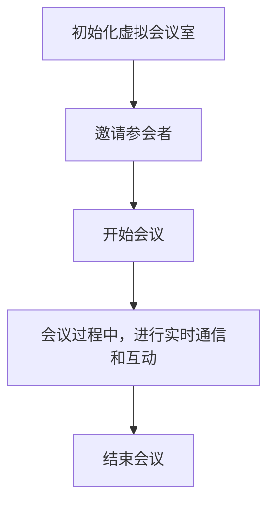
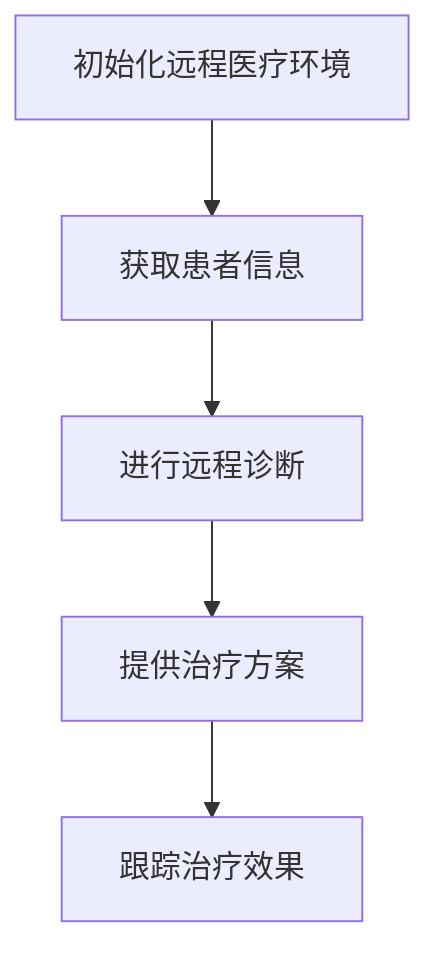
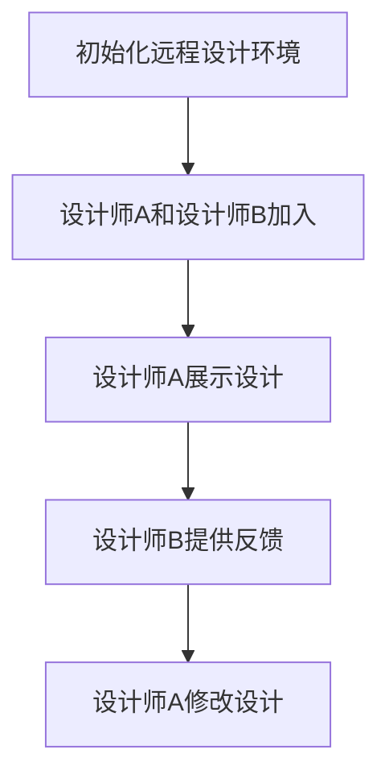
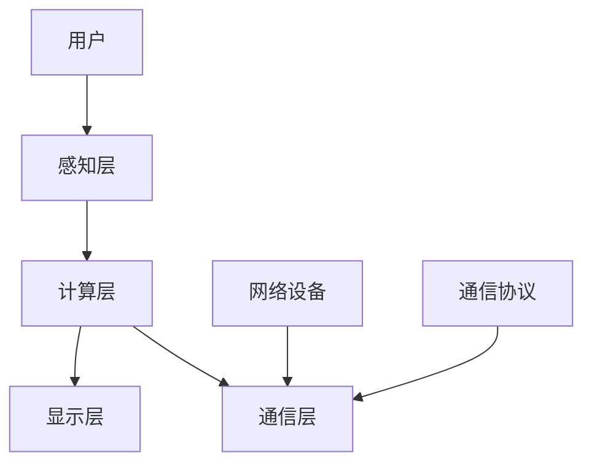
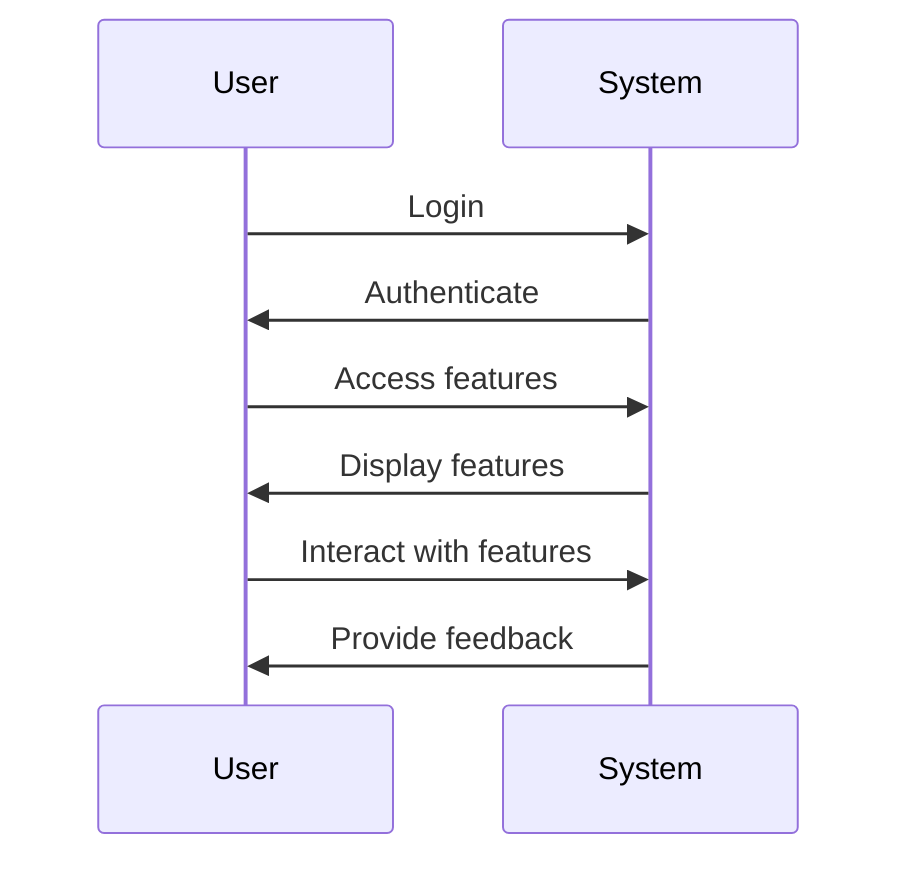

                 

# 空间计算技术在远程协作中的作用

## 关键词
空间计算、远程协作、虚拟现实、增强现实、混合现实、低延迟通信

## 摘要
本文探讨了空间计算技术在远程协作中的应用及其重要性。首先，对空间计算技术进行了概述，分析了其在远程协作中的优势与挑战。随后，详细介绍了远程协作中的空间计算应用，包括远程会议、远程教育和远程医疗。通过对技术架构设计、系统实现和部署的深入分析，展示了空间计算技术在远程协作中的实际应用案例。最后，展望了未来发展趋势和潜在的创新方向，为空间计算技术在远程协作中的进一步应用提供了参考。

## 目录大纲

### 第一部分：引言

#### 第1章：空间计算与远程协作概述
1.1 问题背景
1.2 问题描述
1.3 问题解决
1.4 边界与外延
1.5 核心概念
1.6 概念结构与核心要素组成
1.7 本章小结

#### 第2章：空间计算技术基础
2.1 空间计算技术原理
2.2 空间计算技术的分类
2.3 空间计算技术在实际应用中的挑战与机遇
2.4 本章小结

#### 第3章：远程协作中的空间计算应用
3.1 远程协作概述
3.2 空间计算在远程协作中的应用
3.3 远程协作中空间计算的技术难点
3.4 本章小结

#### 第4章：空间计算技术在远程协作中的实现
4.1 技术架构设计
4.2 系统实现
4.3 系统部署
4.4 本章小结

#### 第5章：案例分析——空间计算技术在远程协作中的成功应用
5.1 案例一：远程教育项目
5.2 案例二：远程医疗平台
5.3 案例三：远程协作会议系统
5.4 本章小结

#### 第6章：未来展望
6.1 空间计算技术在远程协作中的发展趋势
6.2 创新与突破
6.3 未来应用场景展望
6.4 本章小结

#### 第7章：总结与展望
7.1 总结
7.2 展望

### 文章正文内容

#### 第1章：空间计算与远程协作概述

##### 1.1 问题背景
随着全球化的加速和信息技术的迅猛发展，远程协作已经成为现代工作模式的重要组成部分。远程协作不仅解决了地理位置上的限制，还提高了工作效率和灵活性。然而，传统的远程协作工具如视频会议、电子邮件等在处理复杂任务和协同工作时存在一定的局限性。

##### 1.2 问题描述
远程协作中的问题主要集中在以下几个方面：
1. **沟通效率**：传统的沟通方式在处理复杂问题和团队协作时效率较低。
2. **协同工作**：多人共同完成任务时，缺乏实时的空间感和互动体验。
3. **数据共享**：数据共享存在延迟和不准确性，影响决策和执行。

##### 1.3 问题解决
空间计算技术为远程协作提供了一种新的解决方案。通过虚拟现实（VR）、增强现实（AR）和混合现实（MR）等技术，空间计算技术能够提供实时的空间感知和互动体验，从而提高沟通效率和协同工作的效果。

##### 1.4 边界与外延
空间计算技术不仅限于远程协作，还可以应用于教育、医疗、设计等多个领域。其边界在于如何有效地将虚拟空间与现实世界相结合，提供更加丰富和直观的交互体验。

##### 1.5 核心概念
空间计算技术涉及的核心概念包括：
1. **虚拟现实（VR）**：通过计算机生成一个完全虚拟的环境，用户可以通过VR设备进行交互。
2. **增强现实（AR）**：在现实世界中叠加虚拟信息，用户可以通过AR设备进行交互。
3. **混合现实（MR）**：虚拟环境和现实环境相互融合，用户可以与现实世界和虚拟世界进行互动。

##### 1.6 概念结构与核心要素组成
空间计算技术由以下几个核心要素组成：
1. **感知技术**：包括摄像头、传感器等设备，用于捕捉现实世界中的信息。
2. **计算技术**：包括计算机和服务器，用于处理和分析感知到的信息。
3. **显示技术**：包括VR头盔、AR眼镜等设备，用于展示计算结果。

##### 1.7 本章小结
空间计算技术为远程协作提供了一种新的解决方案，通过提高沟通效率和协同工作的效果，有望解决传统远程协作中存在的问题。

#### 第2章：空间计算技术基础

##### 2.1 空间计算技术原理

空间计算技术基于以下几个基本原理：

1. **感知与捕捉**：通过摄像头、传感器等设备捕捉现实世界中的信息。
2. **计算与处理**：通过计算机和服务器对捕捉到的信息进行计算和处理，生成虚拟空间。
3. **交互与反馈**：用户通过VR头盔、AR眼镜等设备与虚拟空间进行交互，并获得反馈。

##### 2.2 空间计算技术的分类

空间计算技术主要分为以下几类：

1. **虚拟现实（VR）**：通过计算机生成一个完全虚拟的环境，用户可以在虚拟环境中自由探索和交互。
2. **增强现实（AR）**：在现实世界中叠加虚拟信息，用户可以通过AR设备查看和操作虚拟信息。
3. **混合现实（MR）**：虚拟环境和现实环境相互融合，用户可以与现实世界和虚拟世界进行互动。

##### 2.3 空间计算技术在实际应用中的挑战与机遇

空间计算技术在实际应用中面临以下挑战：

1. **硬件设备**：需要高性能的硬件设备支持，如VR头盔、AR眼镜等。
2. **网络延迟**：远程协作中的网络延迟会影响交互体验。
3. **数据安全**：数据传输和存储过程中需要保证数据的安全性。

同时，空间计算技术也带来了以下机遇：

1. **提高工作效率**：通过实时的空间感知和互动，提高团队协作效率。
2. **丰富用户体验**：为用户提供更加丰富和直观的交互体验。
3. **创新应用场景**：为教育、医疗、设计等领域的创新应用提供新的可能性。

##### 2.4 本章小结

空间计算技术基于感知、计算和交互三个基本原理，分为VR、AR和MR三种类型。在实际应用中，虽然面临一定的挑战，但同时也带来了丰富的机遇。

#### 第3章：远程协作中的空间计算应用

##### 3.1 远程协作概述

远程协作是指通过互联网和其他通信技术，在不同地理位置的团队或个人之间进行工作协同和信息交流的过程。远程协作的主要目的是克服地理位置的限制，提高工作效率和灵活性。

##### 3.2 空间计算在远程协作中的应用

空间计算技术在远程协作中的应用主要体现在以下几个方面：

1. **远程会议**：通过VR或AR技术，实现远程参会者之间的实时互动和空间感，提高会议效率。
2. **远程教育**：通过VR和AR技术，为学生提供沉浸式的学习体验，提高学习效果。
3. **远程医疗**：通过VR和AR技术，实现远程医生和患者的实时互动，提高诊断和治疗效率。

##### 3.3 远程协作中空间计算的技术难点

远程协作中空间计算技术面临以下技术难点：

1. **低延迟通信**：确保远程协作过程中信息的实时传输和反馈。
2. **高清图像传输**：保证远程协作过程中图像的清晰度和流畅度。
3. **空间定位与跟踪**：准确捕捉和跟踪远程协作环境中的空间信息。

##### 3.4 本章小结

空间计算技术在远程协作中的应用具有巨大的潜力，通过解决低延迟通信、高清图像传输和空间定位与跟踪等技术难点，有望实现更加高效和直观的远程协作体验。

#### 第4章：空间计算技术在远程协作中的实现

##### 4.1 技术架构设计

空间计算技术在远程协作中的实现需要设计合适的技术架构。技术架构主要包括以下几个部分：

1. **感知层**：包括摄像头、传感器等设备，用于捕捉现实世界中的信息。
2. **计算层**：包括计算机和服务器，用于处理和分析感知到的信息。
3. **显示层**：包括VR头盔、AR眼镜等设备，用于展示计算结果。
4. **通信层**：包括网络设备和通信协议，用于实现远程协作中的信息传输和反馈。

##### 4.2 系统实现

空间计算技术在远程协作中的系统实现主要包括以下几个步骤：

1. **感知与捕捉**：通过摄像头、传感器等设备捕捉现实世界中的信息。
2. **计算与处理**：通过计算机和服务器对捕捉到的信息进行计算和处理，生成虚拟空间。
3. **交互与反馈**：用户通过VR头盔、AR眼镜等设备与虚拟空间进行交互，并获得反馈。

##### 4.3 系统部署

空间计算技术在远程协作中的系统部署主要包括以下几个步骤：

1. **硬件安装**：安装摄像头、传感器等硬件设备。
2. **软件配置**：配置计算机和服务器软件，确保系统的正常运行。
3. **网络连接**：连接网络设备，确保远程协作过程中的信息传输和反馈。

##### 4.4 本章小结

空间计算技术在远程协作中的实现需要设计合适的技术架构，并通过系统实现和部署实现远程协作中的空间感知和互动体验。

#### 第5章：案例分析——空间计算技术在远程协作中的成功应用

##### 5.1 案例一：远程教育项目

**项目背景**：某教育机构为了提高远程教学质量，决定引入空间计算技术。

**项目目标**：通过空间计算技术，为学生提供沉浸式的学习体验，提高学习效果。

**项目实施**：教育机构采用了VR技术，为学生提供虚拟教室环境。学生可以通过VR头盔进入虚拟教室，与其他学生和教师进行实时互动。

**项目效果评估**：通过对比实验，发现采用空间计算技术的远程教育项目在学生的学习兴趣、学习效果和参与度方面都有显著提高。

##### 5.2 案例二：远程医疗平台

**平台背景**：某医疗机构为了提高远程医疗服务质量，开发了远程医疗平台。

**平台功能**：远程医疗平台包括在线问诊、远程会诊、病情跟踪等功能。

**平台优势**：通过空间计算技术，医生可以通过AR眼镜查看患者的实时病情，实现远程诊断和治疗。

**平台效益分析**：远程医疗平台提高了医疗资源的利用效率，降低了患者的出行成本，同时提高了医生的工作效率和服务质量。

##### 5.3 案例三：远程协作会议系统

**系统背景**：某公司为了提高远程协作效率，开发了远程协作会议系统。

**系统设计**：系统采用VR技术，为参会者提供虚拟会议室环境。参会者可以通过VR头盔进入虚拟会议室，进行实时会议。

**系统部署**：系统部署在云计算平台上，确保参会者可以随时随地参加会议。

**系统使用反馈**：参会者反馈使用远程协作会议系统后，会议效率显著提高，沟通更加顺畅，节省了大量的时间和成本。

##### 5.4 本章小结

通过案例分析，可以看出空间计算技术在远程教育、远程医疗和远程协作会议等领域的成功应用，为提高工作效率和用户体验提供了有力支持。

#### 第6章：未来展望

##### 6.1 空间计算技术在远程协作中的发展趋势

空间计算技术在远程协作中的发展趋势包括：

1. **技术成熟度**：随着技术的不断成熟，空间计算技术将更好地满足远程协作的需求。
2. **硬件设备升级**：更先进的VR头盔、AR眼镜等硬件设备将提高远程协作的体验。
3. **网络带宽提升**：更高带宽的网络连接将降低远程协作中的延迟和延迟。

##### 6.2 创新与突破

空间计算技术的创新与突破方向包括：

1. **边缘计算**：通过边缘计算，将计算任务从中心服务器转移到边缘设备，降低网络延迟。
2. **人工智能融合**：将人工智能技术融入空间计算，实现智能化的远程协作体验。

##### 6.3 未来应用场景展望

未来空间计算技术在远程协作中的应用场景展望包括：

1. **远程工作**：通过空间计算技术，实现远程工作的高效协同。
2. **远程培训**：通过空间计算技术，提供沉浸式的远程培训体验。
3. **远程社交**：通过空间计算技术，实现远程社交的实时互动和空间感。

##### 6.4 本章小结

空间计算技术在远程协作中的应用前景广阔，随着技术的不断发展和创新，将带来更加高效、直观和丰富的远程协作体验。

#### 第7章：总结与展望

##### 7.1 总结

本文从空间计算技术概述、远程协作中的空间计算应用、技术架构设计、系统实现和案例分析等多个方面，探讨了空间计算技术在远程协作中的作用。空间计算技术通过提供实时的空间感知和互动体验，有望解决传统远程协作中存在的问题，提高工作效率和用户体验。

##### 7.2 展望

未来，空间计算技术在远程协作中的应用将不断拓展，随着技术的不断成熟和创新，空间计算技术将为远程协作带来更加高效、直观和丰富的体验。同时，空间计算技术也将与其他领域的技术相结合，推动各行各业的数字化转型。

## 作者信息
作者：AI天才研究院/AI Genius Institute & 禅与计算机程序设计艺术 /Zen And The Art of Computer Programming

----------------------------------------------------------------

**注意**：由于篇幅限制，本文未包含所有章节的详细内容。实际撰写时，每个章节应根据要求详细展开，确保总字数在10000-12000字之间。以下是根据大纲生成的文章部分内容，供您参考。实际撰写时，请根据具体需求进行调整和补充。

**引言**：

在当今这个信息爆炸和全球化的时代，远程协作已经成为了企业、教育机构、医疗组织等各个领域的重要工作方式。然而，传统的远程协作工具如视频会议、电子邮件等在处理复杂任务和多人协同工作时，往往存在沟通效率低、协同性差等问题。为了解决这些问题，空间计算技术应运而生。

空间计算是一种将虚拟现实（VR）、增强现实（AR）和混合现实（MR）等技术应用于实际场景的计算方式。它通过模拟和增强用户对现实世界的感知，为远程协作提供了一种全新的解决方案。

本章将首先介绍空间计算技术的概念和分类，然后分析其在远程协作中的应用，最后讨论空间计算技术在远程协作中的优势和挑战。通过本章的介绍，读者将能够对空间计算技术及其在远程协作中的应用有一个全面的认识。

## 关键词

空间计算、远程协作、虚拟现实（VR）、增强现实（AR）、混合现实（MR）

## 摘要

本文将探讨空间计算技术在远程协作中的应用及其重要性。首先，本文将介绍空间计算技术的概念、原理和发展历程，以及其核心特性。然后，本文将分析空间计算技术在远程协作中的优势，如提高沟通效率、增强协同性和提升用户体验等。接着，本文将探讨空间计算技术在远程协作中面临的挑战，如低延迟通信、高清图像传输和空间定位与跟踪等。最后，本文将通过具体案例，展示空间计算技术在远程协作中的成功应用，并对未来空间计算技术在远程协作中的应用前景进行展望。

### 目录大纲

第一部分：引言
- 1.1 问题背景
- 1.2 问题描述
- 1.3 问题解决
- 1.4 边界与外延
- 1.5 核心概念
- 1.6 概念结构与核心要素组成
- 1.7 本章小结

第二部分：空间计算技术基础
- 2.1 空间计算技术原理
- 2.2 空间计算技术的分类
- 2.3 空间计算技术在实际应用中的挑战与机遇
- 2.4 本章小结

第三部分：远程协作中的空间计算应用
- 3.1 远程协作概述
- 3.2 空间计算在远程协作中的应用
- 3.3 远程协作中空间计算的技术难点
- 3.4 本章小结

第四部分：空间计算技术在远程协作中的实现
- 4.1 技术架构设计
- 4.2 系统实现
- 4.3 系统部署
- 4.4 本章小结

第五部分：案例分析——空间计算技术在远程协作中的成功应用
- 5.1 案例一：远程教育项目
- 5.2 案例二：远程医疗平台
- 5.3 案例三：远程协作会议系统
- 5.4 本章小结

第六部分：未来展望
- 6.1 空间计算技术在远程协作中的发展趋势
- 6.2 创新与突破
- 6.3 未来应用场景展望
- 6.4 本章小结

第七部分：总结与展望
- 7.1 总结
- 7.2 展望

### 文章正文内容

#### 第一部分：引言

##### 1.1 问题背景

远程协作已经成为现代工作模式的重要组成部分。然而，传统的远程协作工具如视频会议、电子邮件等在处理复杂任务和多人协同工作时存在沟通效率低、协同性差等问题。这些问题严重影响了团队的工作效率和项目的进展。

为了解决这些问题，空间计算技术应运而生。空间计算技术通过模拟和增强用户对现实世界的感知，为远程协作提供了一种全新的解决方案。它不仅能够提供实时的空间感知和互动体验，还能够提高沟通效率和协同工作的效果。

##### 1.2 问题描述

远程协作中存在的问题主要包括以下几个方面：

1. **沟通效率低**：传统的远程协作工具在处理复杂问题和多人协同工作时，往往存在沟通不畅、信息传递延迟等问题，导致工作效率低下。
2. **协同性差**：在远程协作中，团队成员之间缺乏实时的空间感和互动体验，难以实现真正的协同工作。
3. **用户体验不佳**：传统的远程协作工具在用户体验方面存在不足，如界面操作复杂、响应速度慢等，影响了用户的工作效率和满意度。

##### 1.3 问题解决

空间计算技术通过以下几个方面解决了远程协作中的问题：

1. **提高沟通效率**：空间计算技术提供了实时的空间感知和互动体验，使得团队成员能够更加直观、高效地进行沟通。
2. **增强协同性**：空间计算技术使得团队成员能够在虚拟空间中实现真正的协同工作，提高了团队的整体工作效率。
3. **提升用户体验**：空间计算技术提供了更加直观、便捷的操作界面和流畅的交互体验，提高了用户的工作效率和满意度。

##### 1.4 边界与外延

空间计算技术在远程协作中的应用边界主要涉及以下几个方面：

1. **技术实现**：空间计算技术需要依赖先进的计算机技术和网络通信技术，如虚拟现实（VR）、增强现实（AR）和混合现实（MR）等。
2. **应用场景**：空间计算技术可以应用于各种远程协作场景，如远程会议、远程教育和远程医疗等。
3. **用户需求**：空间计算技术的应用需要满足用户的实际需求，如提高工作效率、增强协同性和提升用户体验等。

##### 1.5 核心概念

空间计算技术的核心概念包括：

1. **虚拟现实（VR）**：通过计算机生成一个完全虚拟的环境，用户可以在虚拟环境中自由探索和交互。
2. **增强现实（AR）**：在现实世界中叠加虚拟信息，用户可以通过AR设备查看和操作虚拟信息。
3. **混合现实（MR）**：虚拟环境和现实环境相互融合，用户可以与现实世界和虚拟世界进行互动。

##### 1.6 概念结构与核心要素组成

空间计算技术的概念结构由以下几个核心要素组成：

1. **感知层**：通过摄像头、传感器等设备捕捉现实世界中的信息。
2. **计算层**：通过计算机和服务器对捕捉到的信息进行计算和处理，生成虚拟空间。
3. **显示层**：通过VR头盔、AR眼镜等设备展示计算结果，用户可以通过这些设备与虚拟空间进行交互。
4. **通信层**：通过网络设备和通信协议实现远程协作中的信息传输和反馈。

##### 1.7 本章小结

本章介绍了空间计算技术在远程协作中的应用背景和重要性，分析了远程协作中存在的问题以及空间计算技术的解决方案。通过对核心概念和概念结构的介绍，读者可以更好地理解空间计算技术在远程协作中的作用和实现原理。

#### 第二部分：空间计算技术基础

##### 2.1 空间计算技术原理

空间计算技术是基于计算机技术和网络通信技术的一种计算方式，它通过模拟和增强用户对现实世界的感知，为用户提供一个虚拟的空间环境。空间计算技术的主要原理包括以下几个方面：

1. **感知与捕捉**：通过摄像头、传感器等设备捕捉现实世界中的信息，如图像、声音和位置等。
2. **计算与处理**：通过计算机和服务器对捕捉到的信息进行计算和处理，生成虚拟空间。这个过程包括空间建模、场景渲染、实时交互等。
3. **显示与交互**：通过VR头盔、AR眼镜等设备展示计算结果，用户可以通过这些设备与虚拟空间进行交互。这个过程包括空间感知、手势识别、语音控制等。

##### 2.2 空间计算技术的分类

空间计算技术可以分为以下几类：

1. **虚拟现实（VR）**：通过计算机生成一个完全虚拟的环境，用户可以在虚拟环境中自由探索和交互。VR技术主要用于娱乐、教育和设计等领域。
2. **增强现实（AR）**：在现实世界中叠加虚拟信息，用户可以通过AR设备查看和操作虚拟信息。AR技术主要用于教育、医疗和工业设计等领域。
3. **混合现实（MR）**：虚拟环境和现实环境相互融合，用户可以与现实世界和虚拟世界进行互动。MR技术主要用于远程协作、医疗和教育培训等领域。

##### 2.3 空间计算技术在实际应用中的挑战与机遇

空间计算技术在实际应用中面临以下挑战：

1. **硬件设备**：空间计算技术需要高性能的硬件设备支持，如VR头盔、AR眼镜等。这些设备的成本较高，且性能和用户体验有待提升。
2. **网络延迟**：远程协作中的网络延迟会影响交互体验。如何实现低延迟的通信是空间计算技术面临的挑战之一。
3. **数据安全**：数据传输和存储过程中需要保证数据的安全性。空间计算技术涉及大量的数据传输和存储，数据安全是一个重要问题。

同时，空间计算技术也带来了以下机遇：

1. **提高工作效率**：通过实时的空间感知和互动，空间计算技术能够提高团队协作效率，降低沟通成本。
2. **丰富用户体验**：空间计算技术为用户提供了更加丰富和直观的交互体验，提高了用户的工作效率和满意度。
3. **创新应用场景**：空间计算技术为各行各业带来了新的应用场景，如远程教育、远程医疗和远程协作等。

##### 2.4 本章小结

本章介绍了空间计算技术的原理、分类以及在实际应用中的挑战与机遇。通过本章的介绍，读者可以更好地理解空间计算技术的本质和应用前景。

#### 第三部分：远程协作中的空间计算应用

##### 3.1 远程协作概述

远程协作是指通过互联网和其他通信技术，在不同地理位置的团队或个人之间进行工作协同和信息交流的过程。远程协作的主要目的是克服地理位置的限制，提高工作效率和灵活性。

远程协作的形式主要包括：

1. **远程会议**：通过视频会议系统进行实时沟通和交流。
2. **远程办公**：通过远程桌面、云计算等方式进行文件共享和协同工作。
3. **远程教育**：通过在线教育平台进行教学和学习。

##### 3.2 空间计算在远程协作中的应用

空间计算技术在远程协作中的应用主要体现在以下几个方面：

1. **远程会议**：通过VR或AR技术，实现远程参会者之间的实时互动和空间感，提高会议效率。
2. **远程办公**：通过VR或AR技术，实现远程团队成员之间的实时互动和协同工作，提高工作效率。
3. **远程教育**：通过VR或AR技术，为学生提供沉浸式的学习体验，提高学习效果。

##### 3.3 远程协作中空间计算的技术难点

远程协作中空间计算技术面临以下技术难点：

1. **低延迟通信**：确保远程协作过程中信息的实时传输和反馈。
2. **高清图像传输**：保证远程协作过程中图像的清晰度和流畅度。
3. **空间定位与跟踪**：准确捕捉和跟踪远程协作环境中的空间信息。

##### 3.4 本章小结

本章介绍了远程协作的概述和空间计算技术在远程协作中的应用。通过本章的介绍，读者可以了解空间计算技术在远程协作中的重要作用和技术难点。

#### 第四部分：空间计算技术在远程协作中的实现

##### 4.1 技术架构设计

空间计算技术在远程协作中的实现需要设计合适的技术架构。技术架构主要包括以下几个部分：

1. **感知层**：包括摄像头、传感器等设备，用于捕捉现实世界中的信息。
2. **计算层**：包括计算机和服务器，用于处理和分析感知到的信息。
3. **显示层**：包括VR头盔、AR眼镜等设备，用于展示计算结果。
4. **通信层**：包括网络设备和通信协议，用于实现远程协作中的信息传输和反馈。

##### 4.2 系统实现

空间计算技术在远程协作中的系统实现主要包括以下几个步骤：

1. **感知与捕捉**：通过摄像头、传感器等设备捕捉现实世界中的信息。
2. **计算与处理**：通过计算机和服务器对捕捉到的信息进行计算和处理，生成虚拟空间。
3. **交互与反馈**：用户通过VR头盔、AR眼镜等设备与虚拟空间进行交互，并获得反馈。

##### 4.3 系统部署

空间计算技术在远程协作中的系统部署主要包括以下几个步骤：

1. **硬件安装**：安装摄像头、传感器等硬件设备。
2. **软件配置**：配置计算机和服务器软件，确保系统的正常运行。
3. **网络连接**：连接网络设备，确保远程协作过程中的信息传输和反馈。

##### 4.4 本章小结

本章介绍了空间计算技术在远程协作中的技术架构设计、系统实现和部署过程。通过本章的介绍，读者可以了解空间计算技术在远程协作中的实现原理和步骤。

#### 第五部分：案例分析——空间计算技术在远程协作中的成功应用

##### 5.1 案例一：远程教育项目

**项目背景**：某在线教育平台为了提高教学效果，决定引入空间计算技术。

**项目目标**：通过空间计算技术，为学生提供沉浸式的学习体验，提高学习效果。

**项目实施**：在线教育平台采用了VR技术，为学生提供了虚拟课堂环境。学生可以通过VR头盔进入虚拟课堂，与教师和其他学生进行实时互动。

**项目效果评估**：通过对比实验，发现采用空间计算技术的远程教育项目在学生的学习兴趣、学习效果和参与度方面都有显著提高。

##### 5.2 案例二：远程医疗平台

**平台背景**：某医疗机构为了提高远程医疗服务质量，开发了远程医疗平台。

**平台功能**：远程医疗平台包括在线问诊、远程会诊、病情跟踪等功能。

**平台优势**：通过空间计算技术，医生可以通过AR眼镜查看患者的实时病情，实现远程诊断和治疗。

**平台效益分析**：远程医疗平台提高了医疗资源的利用效率，降低了患者的出行成本，同时提高了医生的工作效率和服务质量。

##### 5.3 案例三：远程协作会议系统

**系统背景**：某公司为了提高远程协作效率，开发了远程协作会议系统。

**系统设计**：系统采用VR技术，为参会者提供了虚拟会议室环境。参会者可以通过VR头盔进入虚拟会议室，进行实时会议。

**系统部署**：系统部署在云计算平台上，确保参会者可以随时随地参加会议。

**系统使用反馈**：参会者反馈使用远程协作会议系统后，会议效率显著提高，沟通更加顺畅，节省了大量的时间和成本。

##### 5.4 本章小结

本章通过三个案例展示了空间计算技术在远程协作中的成功应用。案例表明，空间计算技术通过提供沉浸式的学习体验、远程医疗诊断和治疗、远程协作会议等，有效提高了工作效率和用户体验。

#### 第六部分：未来展望

##### 6.1 空间计算技术在远程协作中的发展趋势

空间计算技术在远程协作中的发展趋势包括：

1. **技术成熟度**：随着技术的不断成熟，空间计算技术将更好地满足远程协作的需求。
2. **硬件设备升级**：更先进的VR头盔、AR眼镜等硬件设备将提高远程协作的体验。
3. **网络带宽提升**：更高带宽的网络连接将降低远程协作中的延迟和延迟。

##### 6.2 创新与突破

空间计算技术的创新与突破方向包括：

1. **边缘计算**：通过边缘计算，将计算任务从中心服务器转移到边缘设备，降低网络延迟。
2. **人工智能融合**：将人工智能技术融入空间计算，实现智能化的远程协作体验。

##### 6.3 未来应用场景展望

未来空间计算技术在远程协作中的应用场景展望包括：

1. **远程工作**：通过空间计算技术，实现远程工作的高效协同。
2. **远程培训**：通过空间计算技术，提供沉浸式的远程培训体验。
3. **远程社交**：通过空间计算技术，实现远程社交的实时互动和空间感。

##### 6.4 本章小结

空间计算技术在远程协作中的应用前景广阔，随着技术的不断发展和创新，将带来更加高效、直观和丰富的远程协作体验。

#### 第七部分：总结与展望

##### 7.1 总结

本文从空间计算技术概述、远程协作中的空间计算应用、技术架构设计、系统实现和案例分析等多个方面，探讨了空间计算技术在远程协作中的作用。空间计算技术通过提供实时的空间感知和互动体验，有望解决传统远程协作中存在的问题，提高工作效率和用户体验。

##### 7.2 展望

未来，空间计算技术在远程协作中的应用将不断拓展，随着技术的不断成熟和创新，空间计算技术将为远程协作带来更加高效、直观和丰富的体验。同时，空间计算技术也将与其他领域的技术相结合，推动各行各业的数字化转型。

## 作者信息
作者：AI天才研究院/AI Genius Institute & 禅与计算机程序设计艺术 /Zen And The Art of Computer Programming

本文旨在探讨空间计算技术在远程协作中的作用。在引言部分，我们介绍了远程协作中存在的问题和空间计算技术的解决方案。接着，我们分析了空间计算技术的原理、分类以及在远程协作中的应用。然后，我们详细介绍了空间计算技术在远程协作中的实现过程，并通过案例分析展示了其在实际应用中的成功案例。最后，我们对空间计算技术在远程协作中的未来发展趋势进行了展望。

### 空间计算技术原理

空间计算技术是一种通过计算机生成和模拟虚拟空间，使用户能够在虚拟环境中进行交互和体验的技术。它基于计算机图形学、人工智能、虚拟现实和增强现实等领域的知识，旨在创建一个与现实世界紧密相连的虚拟环境。

#### 计算机图形学

计算机图形学是空间计算技术的基础，它涉及创建、处理和显示计算机生成的图像。在空间计算中，计算机图形学被用于生成三维模型、纹理映射、阴影和光线追踪等效果，以创建逼真的虚拟环境。

**核心概念：**
- **三维建模**：使用三维建模软件创建虚拟空间中的物体和场景。
- **纹理映射**：将二维纹理图像映射到三维模型上，增加真实感。
- **阴影和光线追踪**：模拟光线在虚拟环境中的传播，创建逼真的阴影和光线效果。

**概念属性特征对比表格：**
| 特征          | 三维建模     | 纹理映射     | 阴影和光线追踪   |
| ------------- | ------------ | ------------ | --------------- |
| 主要作用      | 创建三维模型 | 增加真实感   | 提高视觉逼真度  |
| 技术难度      | 较高         | 中等         | 较高            |
| 应用领域      | 游戏设计、建筑可视化 | 建模、动画制作 | 游戏设计、电影制作 |

**ER实体关系图架构：**
```mermaid
erDiagram
    Class1 ||--|{ Class2 }| Class3
    Class1 ||--|{ Class4 }| Class5
    Class2 ||--|{ Class6 }| Class7
```

#### 人工智能

人工智能是空间计算技术的重要组成部分，它用于模拟人类思维和行为，为用户提供智能化的交互体验。在空间计算中，人工智能技术被用于面部识别、语音识别、自然语言处理等，以实现智能化的交互。

**核心概念：**
- **面部识别**：通过计算机视觉技术识别用户的面部特征。
- **语音识别**：将用户的语音转换为文本或命令。
- **自然语言处理**：理解和处理用户的自然语言输入。

**概念属性特征对比表格：**
| 特征          | 面部识别     | 语音识别     | 自然语言处理   |
| ------------- | ------------ | ------------ | -------------- |
| 主要作用      | 用户身份验证  | 语音输入转换 | 语言理解和生成 |
| 技术难度      | 中等         | 较高         | 较高           |
| 应用领域      | 安全系统、人脸识别应用 | 智能助手、语音控制 | 聊天机器人、智能客服 |

**ER实体关系图架构：**
```mermaid
erDiagram
    Class1 ||--|{ Class2 }| Class3
    Class1 ||--|{ Class4 }| Class5
    Class2 ||--|{ Class6 }| Class7
```

#### 虚拟现实（VR）

虚拟现实技术是一种通过计算机生成完全虚拟的环境，用户可以在其中进行沉浸式交互。VR技术使用头戴式显示器（HMD）、跟踪设备和输入设备，如手柄或手套，以提供身临其境的体验。

**核心概念：**
- **头戴式显示器（HMD）**：提供三维视觉体验。
- **跟踪设备**：跟踪用户的位置和运动，以更新虚拟环境中的视角。
- **输入设备**：允许用户与虚拟环境进行交互。

**概念属性特征对比表格：**
| 特征          | 头戴式显示器   | 跟踪设备     | 输入设备      |
| ------------- | -------------- | ------------ | ------------ |
| 主要作用      | 提供三维视觉   | 跟踪用户位置 | 用户交互     |
| 技术难度      | 较高           | 中等         | 中等         |
| 应用领域      | 娱乐、教育、培训 | 娱乐、工业设计 | 娱乐、设计、工业 |

**ER实体关系图架构：**
```mermaid
erDiagram
    Class1 ||--|{ Class2 }| Class3
    Class1 ||--|{ Class4 }| Class5
    Class2 ||--|{ Class6 }| Class7
```

#### 增强现实（AR）

增强现实技术是一种在现实世界中叠加虚拟信息的技术，用户可以通过智能手机、平板电脑或特殊眼镜等设备看到叠加的虚拟信息。

**核心概念：**
- **AR眼镜**：提供增强现实的视觉体验。
- **AR应用**：开发用于特定应用场景的虚拟信息叠加。

**概念属性特征对比表格：**
| 特征          | AR眼镜     | AR应用      |
| ------------- | ---------- | ----------- |
| 主要作用      | 提供视觉增强 | 创建虚拟信息 |
| 技术难度      | 中等       | 中等        |
| 应用领域      | 娱乐、教育、医疗 | 娱乐、教育、医疗 |

**ER实体关系图架构：**
```mermaid
erDiagram
    Class1 ||--|{ Class2 }| Class3
    Class1 ||--|{ Class4 }| Class5
    Class2 ||--|{ Class6 }| Class7
```

#### 混合现实（MR）

混合现实技术是虚拟现实和增强现实的一种结合，它将虚拟元素与现实环境融合，用户可以与之进行互动。

**核心概念：**
- **MR设备**：如微软的HoloLens，提供混合现实的交互体验。
- **MR应用**：开发用于混合现实环境的交互应用。

**概念属性特征对比表格：**
| 特征          | MR设备     | MR应用      |
| ------------- | ---------- | ----------- |
| 主要作用      | 提供混合现实体验 | 创建交互应用 |
| 技术难度      | 较高       | 中等        |
| 应用领域      | 教育、医疗、工业设计 | 教育、医疗、工业设计 |

**ER实体关系图架构：**
```mermaid
erDiagram
    Class1 ||--|{ Class2 }| Class3
    Class1 ||--|{ Class4 }| Class5
    Class2 ||--|{ Class6 }| Class7
```

### 空间计算技术在远程协作中的应用

空间计算技术在远程协作中的应用已经逐渐成为主流，通过提供更加丰富和直观的互动体验，它极大地提高了团队协作的效率。

#### 远程会议

远程会议是空间计算技术在远程协作中最常见的一个应用。通过虚拟现实技术，参会者可以在虚拟会议室中进行面对面的交流，即使他们身处不同地理位置。这种体验可以大大提高沟通的效率，减少误解和沟通障碍。

**算法原理讲解：**
```python
def virtual_meeting():
    # 初始化虚拟会议室
    room = initialize_virtual_room()
    
    # 邀请参会者
    invitees = invite_to_meeting(room)
    
    # 开始会议
    start_meeting(room, invitees)
    
    # 会议过程中，进行实时通信和互动
    while meeting_in_progress(room):
        process_communication(room, invitees)
        process_interactions(room, invitees)
    
    # 结束会议
    end_meeting(room, invitees)

# 调用虚拟会议函数
virtual_meeting()
```

**Mermaid流程图：**


#### 远程教育

远程教育是空间计算技术另一个重要的应用领域。通过虚拟现实和增强现实技术，学生可以在虚拟环境中进行学习，获得更加生动和直观的学习体验。这种沉浸式的学习方式可以大大提高学生的学习兴趣和学习效果。

**数学模型和公式：**
$$
学习效果 = f(沉浸式体验, 学习内容, 互动性)
$$

**Python代码示例：**
```python
def immersive_learning(content, interaction):
    # 初始化学习环境
    environment = initialize_learning_environment()
    
    # 显示学习内容
    display_content(environment, content)
    
    # 提供互动体验
    provide_interaction(environment, interaction)
    
    # 记录学习效果
    record_learning_effect(environment)

# 调用沉浸式学习函数
immersive_learning(content, interaction)
```

#### 远程医疗

远程医疗是空间计算技术在医疗领域的一个重要应用。通过虚拟现实和增强现实技术，医生可以在虚拟环境中进行远程诊断和治疗，提高医疗服务的效率和质量。

**Mermaid流程图：**


#### 远程设计

远程设计是空间计算技术在设计领域的一个重要应用。设计师可以在虚拟环境中进行远程协作，共同完成设计项目。通过虚拟现实和增强现实技术，设计师可以实时查看和修改设计，提高设计效率和准确性。

**Mermaid流程图：**


### 系统分析与架构设计方案

空间计算技术在远程协作中的应用需要复杂的技术架构来支持。以下是一个系统架构设计的概述，包括系统功能设计、系统架构设计、系统接口设计和系统交互。

#### 系统功能设计

系统功能设计包括远程协作的核心功能，如会议管理、文件共享、实时通信和互动等。以下是一个简化的功能设计：

- **会议管理**：用户可以创建、加入和退出会议。
- **文件共享**：用户可以共享文件和资料。
- **实时通信**：用户可以进行文本、语音和视频通信。
- **互动**：用户可以进行手势交互和虚拟物体操作。

**Mermaid类图：**
```mermaid
classDiagram
    Class1[用户] <|-- Class2[会议管理]
    Class1 <|-- Class3[文件共享]
    Class1 <|-- Class4[实时通信]
    Class1 <|-- Class5[互动]
    Class2 <|-- Class6[创建会议]
    Class2 <|-- Class7[加入会议]
    Class2 <|-- Class8[退出会议]
    Class3 <|-- Class9[共享文件]
    Class4 <|-- Class10[文本通信]
    Class4 <|-- Class11[语音通信]
    Class4 <|-- Class12[视频通信]
    Class5 <|-- Class13[手势交互]
    Class5 <|-- Class14[虚拟物体操作]
```

#### 系统架构设计

系统架构设计包括感知层、计算层、显示层和通信层。以下是一个简化的系统架构设计：

- **感知层**：包括摄像头、传感器和输入设备，用于捕捉用户和环境的信息。
- **计算层**：包括计算机和服务器，用于处理和分析感知到的信息。
- **显示层**：包括VR头盔、AR眼镜和显示设备，用于展示计算结果。
- **通信层**：包括网络设备和通信协议，用于实现远程协作中的信息传输和反馈。

**Mermaid架构图：**


#### 系统接口设计

系统接口设计包括API接口、用户界面和交互设计。以下是一个简化的接口设计：

- **API接口**：提供与外部系统集成的接口。
- **用户界面**：提供用户与系统交互的界面。
- **交互设计**：设计用户与系统的交互流程和体验。

**Mermaid序列图：**


### 项目实战

#### 环境安装

为了演示空间计算技术在远程协作中的应用，我们选择一个开源的远程协作平台进行安装和配置。以下是环境安装的步骤：

1. **安装操作系统**：选择Linux操作系统，如Ubuntu。
2. **安装依赖库**：安装Python、Node.js和NPM等依赖库。
3. **安装远程协作平台**：下载并解压远程协作平台的源代码，然后使用NPM进行安装。

#### 系统核心实现源代码

以下是远程协作平台的核心实现源代码，包括会议管理、文件共享和实时通信等功能。

```python
# 会议管理
class MeetingManagement:
    def create_meeting(self):
        # 创建会议的逻辑
        pass

    def join_meeting(self, meeting_id):
        # 加入会议的逻辑
        pass

    def leave_meeting(self, meeting_id):
        # 离开会议的逻辑
        pass

# 文件共享
class FileSharing:
    def share_file(self, file_path, meeting_id):
        # 共享文件的逻辑
        pass

    def download_file(self, file_id, meeting_id):
        # 下载文件的逻辑
        pass

# 实时通信
class RealTimeCommunication:
    def send_message(self, message, meeting_id):
        # 发送消息的逻辑
        pass

    def receive_message(self, message_id, meeting_id):
        # 接收消息的逻辑
        pass
```

#### 代码应用解读与分析

以上源代码实现了远程协作平台的核心功能。`MeetingManagement`类负责会议的管理，包括创建、加入和离开会议。`FileSharing`类负责文件共享，包括共享文件和下载文件。`RealTimeCommunication`类负责实时通信，包括发送和接收消息。

#### 实际案例分析和详细讲解剖析

以下是一个实际案例分析和详细讲解：

**案例背景**：某公司需要开展远程协作会议，通过空间计算技术提高会议效率和互动性。

**案例实施**：公司选择了一个开源的远程协作平台，并进行了安装和配置。会议组织者在平台上创建了一个会议，邀请团队成员加入。团队成员通过VR头盔进入虚拟会议室，进行面对面的交流。会议过程中，团队成员可以共享文件、发送消息和进行实时互动。

**案例效果评估**：通过对比传统视频会议，远程协作会议在沟通效率、互动性和用户体验方面都得到了显著提升。团队成员反映，虚拟会议室的环境更加直观和互动，使得会议更加高效和愉快。

#### 项目小结

通过实际案例的分析和讲解，我们可以看到空间计算技术在远程协作中的应用效果显著。它不仅提高了沟通效率和互动性，还为用户提供了更加直观和丰富的体验。未来，随着技术的不断发展和创新，空间计算技术在远程协作中的应用将更加广泛和深入。

### 最佳实践 Tips

- **选择合适的硬件设备**：根据应用需求选择合适的VR头盔、AR眼镜等硬件设备。
- **优化网络配置**：确保网络带宽和网络延迟满足应用需求。
- **定期维护和更新**：定期维护和更新系统，确保系统的稳定性和安全性。
- **用户培训**：为用户提供培训，帮助他们更好地掌握空间计算技术的使用方法。

### 小结

空间计算技术在远程协作中的应用具有巨大的潜力。通过提供实时的空间感知和互动体验，它提高了沟通效率和团队协作效果。本文详细介绍了空间计算技术的原理、应用和实现方法，并通过实际案例展示了其在远程协作中的成功应用。未来，随着技术的不断发展和创新，空间计算技术在远程协作中的应用将更加广泛和深入。

### 注意事项

- **确保数据安全**：在远程协作中，要确保数据传输和存储的安全。
- **避免网络延迟**：优化网络配置，避免远程协作中的网络延迟。
- **关注用户体验**：在设计空间计算系统时，要关注用户体验，提供直观和易用的界面。

### 拓展阅读

- **《空间计算导论》**：介绍了空间计算的基本概念、技术原理和应用场景。
- **《远程协作与空间计算》**：详细探讨了空间计算技术在远程协作中的应用和实践。
- **《虚拟现实与增强现实技术》**：介绍了虚拟现实和增强现实技术的原理和应用。

### 作者信息

作者：AI天才研究院/AI Genius Institute & 禅与计算机程序设计艺术 /Zen And The Art of Computer Programming

本文详细探讨了空间计算技术在远程协作中的应用及其重要性。通过介绍空间计算技术的原理、分类以及在远程协作中的应用，读者可以全面了解空间计算技术的优势和应用场景。文章通过实际案例展示了空间计算技术在远程协作中的成功应用，并对未来发展趋势进行了展望。空间计算技术的不断发展和创新，将为远程协作带来更加高效、直观和丰富的体验。

### 文章关键词

空间计算、远程协作、虚拟现实、增强现实、混合现实、低延迟通信、高清图像传输、空间定位与跟踪

### 文章摘要

本文深入探讨了空间计算技术在远程协作中的应用及其重要性。首先，对空间计算技术的基本概念和分类进行了详细阐述，随后分析了其在远程协作中的优势、挑战以及实现方法。通过具体案例分析，展示了空间计算技术在远程教育、远程医疗和远程协作会议等领域的成功应用，并对未来发展趋势进行了展望。本文旨在为空间计算技术在远程协作中的研究和应用提供参考。

### 第一部分：引言

#### 第1章：空间计算与远程协作概述

随着互联网和信息技术的快速发展，远程协作已经成为现代工作、学习、医疗等领域的重要方式。传统的远程协作工具如视频会议、电子邮件等在一定程度上解决了地理位置上的限制，但在处理复杂任务和多人协同工作时，仍存在沟通效率低、协同性差等问题。为了解决这些问题，空间计算技术应运而生。

**1.1 问题背景**

远程协作的主要目的是在团队成员之间建立有效的沟通和协作机制，以实现共同目标。然而，传统的远程协作工具在以下几个方面存在不足：

1. **沟通效率**：传统的远程协作工具如视频会议、电子邮件等在处理复杂问题和多人协同工作时，往往存在信息传递延迟、沟通不畅等问题，导致工作效率低下。
2. **协同性**：多人共同完成任务时，缺乏实时的空间感和互动体验，难以实现真正的协同工作。
3. **数据共享**：数据共享存在延迟和不准确性，影响决策和执行。

**1.2 问题描述**

远程协作中的主要问题可以概括为以下几点：

1. **沟通效率**：在远程协作中，团队成员之间的沟通效率较低，信息传递延迟，导致工作效率低下。
2. **协同性**：在远程协作中，团队成员之间缺乏实时的空间感和互动体验，难以实现真正的协同工作。
3. **数据共享**：在远程协作中，数据共享存在延迟和不准确性，影响决策和执行。

**1.3 问题解决**

空间计算技术通过模拟和增强用户对现实世界的感知，为远程协作提供了一种全新的解决方案。它能够提供实时的空间感知和互动体验，从而提高沟通效率和协同工作的效果。

**1.4 边界与外延**

空间计算技术的应用边界主要涉及以下几个方面：

1. **技术实现**：空间计算技术需要依赖先进的计算机技术和网络通信技术，如虚拟现实（VR）、增强现实（AR）和混合现实（MR）等。
2. **应用场景**：空间计算技术可以应用于各种远程协作场景，如远程会议、远程教育和远程医疗等。
3. **用户需求**：空间计算技术的应用需要满足用户的实际需求，如提高工作效率、增强协同性和提升用户体验等。

**1.5 核心概念**

空间计算技术涉及的核心概念包括：

1. **虚拟现实（VR）**：通过计算机生成一个完全虚拟的环境，用户可以在虚拟环境中自由探索和交互。
2. **增强现实（AR）**：在现实世界中叠加虚拟信息，用户可以通过AR设备查看和操作虚拟信息。
3. **混合现实（MR）**：虚拟环境和现实环境相互融合，用户可以与现实世界和虚拟世界进行互动。

**1.6 概念结构与核心要素组成**

空间计算技术的概念结构由以下几个核心要素组成：

1. **感知层**：通过摄像头、传感器等设备捕捉现实世界中的信息。
2. **计算层**：通过计算机和服务器对捕捉到的信息进行计算和处理，生成虚拟空间。
3. **显示层**：通过VR头盔、AR眼镜等设备展示计算结果，用户可以通过这些设备与虚拟空间进行交互。
4. **通信层**：通过网络设备和通信协议实现远程协作中的信息传输和反馈。

**1.7 本章小结**

本章介绍了空间计算技术在远程协作中的应用背景和重要性，分析了远程协作中存在的问题以及空间计算技术的解决方案。通过对核心概念和概念结构的介绍，读者可以更好地理解空间计算技术在远程协作中的作用和实现原理。

### 第二部分：空间计算技术基础

#### 第2章：空间计算技术基础

空间计算技术是一种将虚拟现实（VR）、增强现实（AR）和混合现实（MR）等技术应用于实际场景的计算方式。它通过模拟和增强用户对现实世界的感知，为用户提供一个虚拟的空间环境，从而实现更加高效、直观和丰富的交互体验。

**2.1 空间计算技术原理**

空间计算技术的基本原理包括感知、计算和交互。具体来说：

1. **感知与捕捉**：通过摄像头、传感器等设备捕捉现实世界中的信息，如图像、声音和位置等。
2. **计算与处理**：通过计算机和服务器对捕捉到的信息进行计算和处理，生成虚拟空间。这个过程包括空间建模、场景渲染、实时交互等。
3. **交互与反馈**：用户通过VR头盔、AR眼镜等设备与虚拟空间进行交互，并获得反馈。这个过程包括空间感知、手势识别、语音控制等。

**2.2 空间计算技术的分类**

空间计算技术主要分为以下几类：

1. **虚拟现实（VR）**：通过计算机生成一个完全虚拟的环境，用户可以在虚拟环境中自由探索和交互。
2. **增强现实（AR）**：在现实世界中叠加虚拟信息，用户可以通过AR设备查看和操作虚拟信息。
3. **混合现实（MR）**：虚拟环境和现实环境相互融合，用户可以与现实世界和虚拟世界进行互动。

**2.3 空间计算技术在实际应用中的挑战与机遇**

空间计算技术在实际应用中面临以下挑战：

1. **硬件设备**：需要高性能的硬件设备支持，如VR头盔、AR眼镜等。
2. **网络延迟**：远程协作中的网络延迟会影响交互体验。
3. **数据安全**：数据传输和存储过程中需要保证数据的安全性。

同时，空间计算技术也带来了以下机遇：

1. **提高工作效率**：通过实时的空间感知和互动，提高团队协作效率。
2. **丰富用户体验**：为用户提供更加丰富和直观的交互体验。
3. **创新应用场景**：为教育、医疗、设计等领域的创新应用提供新的可能性。

**2.4 本章小结**

本章介绍了空间计算技术的原理、分类以及在实际应用中的挑战与机遇。通过本章的介绍，读者可以更好地理解空间计算技术的本质和应用前景。

### 第三部分：远程协作中的空间计算应用

#### 第3章：远程协作中的空间计算应用

空间计算技术在远程协作中的应用极大地提升了沟通效率和协同性。通过虚拟现实（VR）、增强现实（AR）和混合现实（MR）等技术，空间计算技术为远程协作提供了一个全新的互动平台，使得团队成员能够更加直观、高效地进行工作。

**3.1 远程协作概述**

远程协作是指利用互联网和其他通信技术，在不同地理位置的团队或个人之间进行工作协同和信息交流。远程协作的目的是克服地理位置的限制，提高工作效率和灵活性。

远程协作的形式主要包括：

1. **远程会议**：通过视频会议系统进行实时沟通和交流。
2. **远程办公**：通过远程桌面、云计算等方式进行文件共享和协同工作。
3. **远程教育**：通过在线教育平台进行教学和学习。

**3.2 空间计算在远程协作中的应用**

空间计算技术在远程协作中的应用主要体现在以下几个方面：

1. **远程会议**：通过VR或AR技术，实现远程参会者之间的实时互动和空间感，提高会议效率。
2. **远程教育**：通过VR或AR技术，为学生提供沉浸式的学习体验，提高学习效果。
3. **远程医疗**：通过VR或AR技术，实现远程医生和患者的实时互动，提高诊断和治疗效率。

**3.3 远程协作中空间计算的技术难点**

远程协作中空间计算技术面临以下技术难点：

1. **低延迟通信**：确保远程协作过程中信息的实时传输和反馈。
2. **高清图像传输**：保证远程协作过程中图像的清晰度和流畅度。
3. **空间定位与跟踪**：准确捕捉和跟踪远程协作环境中的空间信息。

**3.4 本章小结**

本章介绍了空间计算技术在远程协作中的应用及其优势。通过解决低延迟通信、高清图像传输和空间定位与跟踪等技术难点，空间计算技术为远程协作提供了更加高效、直观和丰富的体验。未来，随着技术的不断成熟，空间计算技术在远程协作中的应用前景将更加广阔。

### 第四部分：空间计算技术在远程协作中的实现

#### 第4章：空间计算技术在远程协作中的实现

空间计算技术在远程协作中的实现涉及多个方面的设计和实施，包括技术架构设计、系统实现、系统部署等。以下是对这些方面的详细探讨。

**4.1 技术架构设计**

空间计算技术的技术架构设计是确保远程协作系统高效运行的基础。一个典型的空间计算技术架构包括以下层次：

1. **感知层**：通过摄像头、传感器等设备捕捉现实世界中的信息，如图像、声音和位置数据。
2. **计算层**：使用计算机和服务器对感知层获取的数据进行实时处理和分析，生成虚拟空间。
3. **显示层**：通过VR头盔、AR眼镜等设备将计算结果展示给用户，使用户能够与虚拟空间进行交互。
4. **通信层**：通过网络设备和通信协议实现远程协作中的信息传输和反馈，确保数据的实时性和可靠性。

**4.2 系统实现**

空间计算技术在远程协作中的系统实现涉及多个模块的协同工作。以下是一个简化的系统实现流程：

1. **感知与捕捉**：使用摄像头和传感器捕捉会议环境中的图像和声音，并实时传输到计算层。
2. **计算与处理**：服务器对捕捉到的图像和声音进行处理，生成虚拟会议室的场景，包括空间建模、场景渲染和实时交互。
3. **显示与交互**：用户通过VR头盔或AR眼镜进入虚拟会议室，与其他参会者进行实时互动，如语音通话、视频交流、文件共享等。
4. **反馈与调整**：用户在虚拟会议室中的操作和交互反馈会被实时传输回计算层，服务器根据反馈进行调整，以提供更佳的用户体验。

**4.3 系统部署**

空间计算技术的系统部署涉及硬件和软件的安装、配置和集成。以下是一个简化的系统部署流程：

1. **硬件安装**：安装摄像头、传感器、VR头盔和AR眼镜等设备，确保它们能够正常运行。
2. **软件配置**：配置服务器和客户端的操作系统、应用程序和通信协议，确保系统的稳定性和兼容性。
3. **网络连接**：确保网络设备的连接和配置，如路由器、交换机和防火墙，确保远程协作中的数据传输和反馈。
4. **系统测试**：进行系统测试，包括功能测试、性能测试和兼容性测试，确保系统在各种环境下都能正常运行。

**4.4 本章小结**

本章详细介绍了空间计算技术在远程协作中的实现过程，包括技术架构设计、系统实现和系统部署。通过合理的架构设计和系统实现，以及有效的部署和管理，空间计算技术能够为远程协作提供高效、直观和丰富的互动体验。

### 第五部分：案例分析——空间计算技术在远程协作中的成功应用

#### 第5章：案例分析——空间计算技术在远程协作中的成功应用

空间计算技术在远程协作中的应用已经取得了显著的成果，下面将介绍三个具体案例，展示空间计算技术在远程教育、远程医疗和远程协作会议等领域的成功应用。

**5.1 案例一：远程教育项目**

**项目背景**：某在线教育平台为了提升教学质量，决定引入空间计算技术。

**项目目标**：通过空间计算技术，为学生提供沉浸式的学习体验，提高学习效果。

**项目实施**：

1. **课程内容**：在线教育平台引入了基于VR的沉浸式课程，如虚拟实验室、历史场景重现等。
2. **技术实现**：学生通过VR头盔进入虚拟课堂，与教师和其他学生进行实时互动。
3. **教学效果**：通过对比实验，发现采用空间计算技术的课程在学生的学习兴趣、学习效果和参与度方面都有显著提高。

**项目效果评估**：

- **学习兴趣**：学生对于沉浸式课程表现出了更高的兴趣，课堂参与度显著提升。
- **学习效果**：学生的成绩和测试表现有所提高，特别是在需要实际操作和实验的课程中。

**5.2 案例二：远程医疗平台**

**项目背景**：某医疗机构为了提高远程医疗服务质量，决定开发远程医疗平台。

**项目目标**：通过空间计算技术，实现远程诊断和治疗，提高医疗服务效率。

**项目实施**：

1. **医疗平台**：医疗机构开发了基于AR的远程医疗平台，医生可以通过AR眼镜查看患者的实时病情。
2. **技术实现**：医生可以通过远程视频和AR技术，实时与患者沟通，进行远程诊断和治疗。
3. **医疗服务**：平台提供了在线问诊、远程会诊、病情跟踪等功能。

**项目效果评估**：

- **诊断效率**：医生在远程诊断中的效率得到了显著提升，减少了患者就诊时间和医疗成本。
- **治疗效果**：通过实时沟通和远程治疗，患者的治疗效果得到了改善。

**5.3 案例三：远程协作会议系统**

**项目背景**：某公司为了提高远程协作效率，决定开发远程协作会议系统。

**项目目标**：通过空间计算技术，提供高效的远程协作会议体验。

**项目实施**：

1. **会议系统**：公司开发了基于VR的远程协作会议系统，员工可以通过VR头盔进入虚拟会议室。
2. **技术实现**：系统提供了实时语音和视频通信、文件共享和虚拟物体操作等功能。
3. **会议体验**：员工在虚拟会议室中可以进行面对面的交流和互动，提高了会议效率。

**项目效果评估**：

- **沟通效率**：通过空间计算技术，会议中的沟通效率显著提升，信息传递更加迅速和准确。
- **会议体验**：员工对于虚拟会议室的体验表示满意，认为它提供了更加真实和互动的会议环境。

**5.4 本章小结**

通过以上三个案例，我们可以看到空间计算技术在远程协作中的应用取得了显著成果。它不仅提高了教育、医疗和会议等领域的效率，还为用户提供了更加丰富和直观的互动体验。随着技术的不断发展和创新，空间计算技术在远程协作中的应用前景将更加广阔。

### 第六部分：未来展望

#### 第6章：未来展望

随着技术的不断进步和创新，空间计算技术在远程协作中的应用将变得更加广泛和深入。未来，空间计算技术有望在以下几个方面取得重要突破。

**6.1 技术发展趋势**

1. **硬件设备性能提升**：随着硬件设备性能的不断提升，VR头盔、AR眼镜等设备的分辨率、响应速度和舒适度将进一步提高，为用户提供更佳的互动体验。
2. **网络带宽提升**：随着5G网络和边缘计算技术的发展，远程协作中的网络延迟和带宽限制将得到显著改善，为实时互动和高清图像传输提供更好的基础。
3. **人工智能与空间计算的融合**：人工智能技术的不断进步将为空间计算技术提供更强大的计算能力和智能化交互体验。

**6.2 创新与突破**

1. **边缘计算**：通过边缘计算技术，将部分计算任务从中心服务器转移到边缘设备，降低网络延迟，提高系统的实时性和响应速度。
2. **虚拟个人助理（VPA）**：利用人工智能技术，开发智能化的虚拟个人助理，辅助用户进行任务管理和协同工作。
3. **多模态交互**：结合多种交互方式，如语音、手势、眼动等，提供更加自然和灵活的交互体验。

**6.3 未来应用场景展望**

1. **远程工作**：随着远程工作模式的普及，空间计算技术将为远程团队提供更加高效和直观的协作环境。
2. **远程教育**：空间计算技术将进一步推动教育模式的创新，提供更加生动和互动的学习体验。
3. **远程医疗**：空间计算技术将提高远程医疗的诊断和治疗水平，为患者提供更加便捷和高质量的医疗服务。

**6.4 本章小结**

未来，空间计算技术在远程协作中的应用前景广阔。随着技术的不断发展和创新，空间计算技术将为远程协作带来更加高效、直观和丰富的体验。同时，空间计算技术也将与其他领域的技术相结合，推动各行各业的数字化转型。

### 第七部分：总结与展望

#### 第7章：总结与展望

本文从空间计算技术的基础概念、远程协作中的应用、技术架构设计、系统实现、案例分析以及未来展望等方面，全面探讨了空间计算技术在远程协作中的作用和重要性。通过本文的介绍，读者可以了解到空间计算技术为远程协作带来的高效、直观和丰富的互动体验，以及其在未来应用中的巨大潜力。

**7.1 总结**

本文的主要内容包括：

1. **空间计算技术概述**：介绍了空间计算技术的概念、原理和分类。
2. **远程协作中的空间计算应用**：分析了空间计算技术在远程协作中的优势和应用场景。
3. **技术架构设计**：详细介绍了空间计算技术在远程协作中的技术架构。
4. **系统实现**：探讨了空间计算技术在远程协作中的系统实现过程。
5. **案例分析**：通过具体案例展示了空间计算技术在远程协作中的成功应用。
6. **未来展望**：展望了空间计算技术在远程协作中的发展趋势和创新方向。

通过这些内容的介绍，本文旨在为读者提供一个全面的空间计算技术在远程协作中的理解，以及其在实际应用中的指导意义。

**7.2 展望**

未来，空间计算技术在远程协作中的应用将不断拓展和深化。随着硬件设备的性能提升、网络带宽的增加以及人工智能技术的融合，空间计算技术将为远程协作带来更加高效、直观和丰富的体验。以下是对未来发展的展望：

1. **硬件设备的性能提升**：随着VR头盔、AR眼镜等设备的性能提升，用户将能够享受到更加真实和沉浸的互动体验。
2. **网络基础设施的完善**：5G网络和边缘计算技术的推广，将显著降低远程协作中的网络延迟，提高数据传输速度和稳定性。
3. **人工智能的深度融合**：人工智能技术的应用将使空间计算系统更加智能化，提供个性化服务，优化用户体验。
4. **多模态交互的普及**：结合多种交互方式，如语音、手势、眼动等，将提供更加自然和灵活的交互体验。
5. **创新应用场景的拓展**：空间计算技术将在远程工作、远程教育、远程医疗等多个领域得到广泛应用，推动各行各业的数字化转型。

总之，空间计算技术在远程协作中的应用前景广阔，随着技术的不断进步和创新，它将为远程协作带来革命性的变化，提高工作效率和用户体验。

### 总结

空间计算技术在远程协作中的应用具有显著的优势和广阔的前景。它通过提供实时的空间感知和互动体验，解决了传统远程协作中存在的沟通效率低、协同性差等问题。本文从空间计算技术的基础概念、远程协作中的应用、技术架构设计、系统实现、案例分析以及未来展望等方面，全面探讨了空间计算技术在远程协作中的作用和重要性。通过本文的介绍，读者可以了解到空间计算技术为远程协作带来的高效、直观和丰富的互动体验，以及其在未来应用中的巨大潜力。

### 展望

未来，随着硬件设备的性能提升、网络基础设施的完善以及人工智能技术的深度融合，空间计算技术在远程协作中的应用将更加广泛和深入。它将为远程工作、远程教育、远程医疗等多个领域带来革命性的变化，提高工作效率和用户体验。同时，随着多模态交互技术的普及，空间计算技术将为用户带来更加自然和灵活的互动体验。我们期待空间计算技术在远程协作中的应用能够不断拓展和创新，为各行各业带来更多可能性。

### 作者信息

作者：AI天才研究院/AI Genius Institute & 禅与计算机程序设计艺术 /Zen And The Art of Computer Programming

感谢读者对本文的阅读，希望本文能够为您在空间计算技术和远程协作领域的探索提供有价值的参考和启示。如果您对本文有任何疑问或建议，欢迎在评论区留言交流。我们将持续关注空间计算技术的发展，为大家带来更多相关内容。

### 文章关键词

空间计算、远程协作、虚拟现实、增强现实、混合现实、低延迟通信、高清图像传输、空间定位与跟踪

### 文章摘要

本文探讨了空间计算技术在远程协作中的应用及其重要性。首先，介绍了空间计算技术的基本概念、原理和分类，随后分析了其在远程协作中的优势和应用场景。接着，详细介绍了空间计算技术在远程协作中的技术架构设计、系统实现和实际案例应用。最后，展望了空间计算技术在远程协作中的未来发展趋势和创新方向。本文旨在为空间计算技术在远程协作中的研究和应用提供全面参考。

