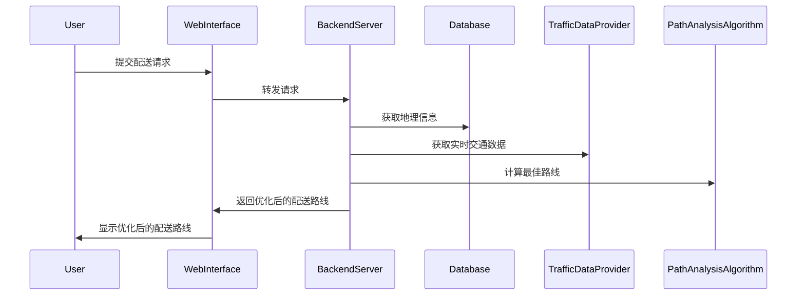
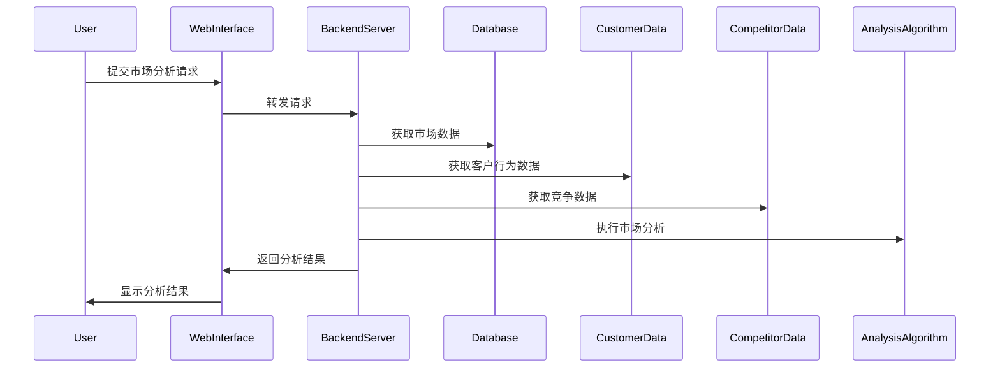
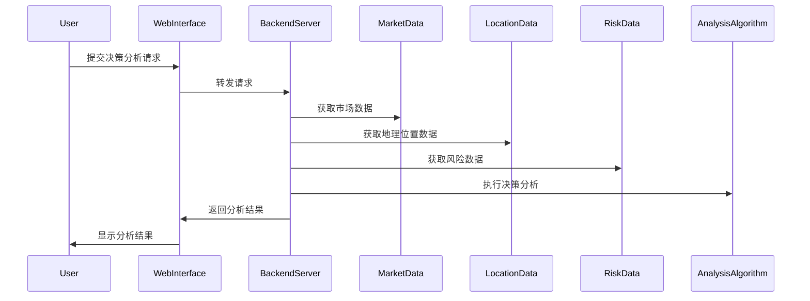

                 

# 空间计算提高企业效率的方式

## 关键词
- 空间计算
- 企业效率
- 物流优化
- 数据可视化
- 决策支持系统
- 客户服务质量

## 摘要
本文旨在探讨空间计算如何提高企业的效率。我们将从引言开始，逐步深入讨论空间计算的核心概念、应用场景、对企业效率的具体影响、实现技术，以及实际案例分析。通过这一系列探讨，我们希望读者能够理解空间计算的潜力，并了解到其在企业运营中的重要性。

## 第一部分：引言

### 1.1 问题的背景

在当今全球化的商业环境中，企业面临着日益激烈的市场竞争。为了保持竞争力，企业需要不断提高运营效率，优化资源分配，提升客户服务质量。然而，随着数据的爆炸式增长和地理信息的复杂性增加，传统的数据处理和分析方法已经难以满足企业的需求。这种背景下，空间计算作为一种新兴的技术，逐渐引起了企业的关注。

### 1.2 问题的描述

企业需要在多个维度上提高效率，包括物流管理、市场营销、资源配置和客户服务。然而，这些任务往往涉及大量的地理信息，如地理位置、交通流量、市场分布等。如何有效地整合和利用这些信息，是企业面临的一个重大挑战。

### 1.3 解决方案的概念

空间计算是一种利用地理信息进行计算和处理的技术，它能够将地理信息与业务流程相结合，提供更精准、更高效的决策支持。通过空间计算，企业可以更好地理解地理位置和空间关系，从而优化运营决策。

### 1.4 边界与外延

空间计算的边界主要涉及地理信息系统（GIS）、遥感技术、地理分析等。其外延则延伸到各个行业，如物流、营销、城市规划等。本文将重点关注空间计算在企业中的应用，探讨其对提高企业效率的贡献。

## 第二部分：核心概念与联系

### 2.1 空间计算的定义

空间计算是一种利用地理信息进行计算和处理的技术，它结合了GIS、遥感技术、地理分析等多种方法，以实现对地理信息的深度挖掘和利用。

### 2.2 空间计算的基本原理

空间计算的基本原理包括地理信息的采集、存储、处理和分析。通过这些基本步骤，空间计算能够将地理信息转化为对企业运营有用的知识。

### 2.3 空间计算与云计算、大数据的关系

云计算提供了强大的计算资源，使得空间计算能够处理海量地理信息。而大数据技术则帮助空间计算从海量数据中提取有价值的信息。云计算和大数据为空间计算提供了坚实的基础。

#### 2.3.1 云计算

云计算为空间计算提供了弹性、可扩展的计算资源，使得企业可以轻松地处理大量地理信息。此外，云计算还支持空间计算的分布式处理，提高了计算效率。

#### 2.3.2 大数据

大数据技术使得空间计算可以从海量数据中提取有价值的信息，为企业的决策提供支持。

### 2.4 空间计算的属性特征对比表格

| 特性         | 空间计算       | 云计算           | 大数据            |
| ------------ | -------------- | ---------------- | ----------------- |
| 数据类型     | 地理信息       | 结构化/非结构化  | 结构化/非结构化   |
| 处理方式     | 空间分析       | 分布式计算       | 数据挖掘          |
| 应用领域     | 物流、营销、GIS | IT、金融、医疗   | 各行各业          |
| 数据量       | 大数据         | 大数据           | 超大数据          |

### 2.5 空间计算与地理信息系统（GIS）的联系

GIS是空间计算的重要组成部分，它负责地理信息的采集、存储、处理和分析。空间计算则利用GIS提供的地理信息，结合其他技术，实现对地理信息的深度挖掘和应用。

## 第三部分：空间计算的应用场景

### 3.1 企业地理信息管理

企业可以通过空间计算对地理信息进行有效管理，包括地理位置的标记、地图的绘制、地理数据的更新等。

### 3.2 企业物流与配送

空间计算可以帮助企业优化物流与配送，通过分析交通流量、地理位置等信息，选择最优的配送路线。

### 3.3 企业营销与市场分析

空间计算可以用于市场营销分析，帮助企业了解市场分布、客户行为等，从而制定更有效的营销策略。

### 3.4 企业决策支持系统

空间计算可以作为企业决策支持系统的一部分，提供地理信息分析结果，帮助企业做出更准确的决策。

## 第四部分：空间计算对企业效率的影响

### 4.1 提高决策效率

通过空间计算，企业可以获得更准确的地理信息分析结果，从而提高决策效率。例如，通过数据可视化，企业可以直观地了解市场分布和客户行为。

### 4.2 优化资源配置

空间计算可以帮助企业优化资源配置，例如，在物流与配送中，通过分析地理位置和交通流量，选择最优的配送路线。

### 4.3 提升客户服务质量

空间计算可以用于客户定位与跟踪，帮助企业提供更个性化的服务。此外，通过客户需求预测，企业可以提前做好准备，提升客户满意度。

## 第五部分：空间计算技术的实现

### 5.1 技术概述

空间计算技术包括GIS、遥感技术、地理分析算法等。企业需要搭建一个合适的空间计算平台，以支持这些技术的应用。

### 5.2 空间计算平台搭建

空间计算平台的搭建包括硬件设备的选择、软件系统的开发、数据的采集和处理等。

### 5.3 空间数据管理

空间数据管理是空间计算的关键，包括数据的存储、检索、更新等。

### 5.4 空间分析算法与应用

空间分析算法是实现空间计算的核心，包括空间查询、空间分析、空间建模等。企业需要根据实际需求选择合适的算法，并进行应用。

## 第六部分：案例分析

### 6.1 案例一：企业物流优化

案例一介绍了如何通过空间计算优化企业的物流与配送，提高效率。

### 6.2 案例二：市场营销分析

案例二展示了空间计算如何帮助企业进行市场营销分析，制定更有效的营销策略。

### 6.3 案例三：决策支持系统

案例三探讨了如何将空间计算集成到企业的决策支持系统中，提高决策效率。

## 第七部分：总结与展望

### 7.1 小结

空间计算作为一种新兴技术，在提高企业效率方面具有巨大的潜力。通过本文的讨论，我们了解到空间计算在企业物流、市场营销、决策支持等方面的应用。

### 7.2 注意事项

企业在应用空间计算时，需要注意数据的准确性和安全性，确保空间计算系统的稳定运行。

### 7.3 拓展阅读

对于希望深入了解空间计算的企业和技术人员，我们推荐进一步阅读相关书籍和文献，以获取更全面的知识。

### 作者信息

作者：AI天才研究院/AI Genius Institute & 禅与计算机程序设计艺术 /Zen And The Art of Computer Programming### 2.5 空间计算与地理信息系统（GIS）的联系

地理信息系统（GIS）是空间计算的重要组成部分，它为空间计算提供了地理信息的采集、存储、处理和分析功能。GIS与空间计算的关系可以看作是支撑与融合的关系。GIS为空间计算提供了基础数据和服务，而空间计算则利用GIS的技术手段，实现对地理信息的深度挖掘和应用。

GIS的核心功能包括地图绘制、地理编码、空间分析等。地图绘制是GIS最基本的功能，它能够将地理信息以可视化的形式呈现出来。地理编码则是将现实世界中的地理位置与数字地图相对应，为空间计算提供地理位置数据。空间分析是GIS的高级功能，它包括地理数据的查询、叠加、缓冲区分析等，这些功能为空间计算提供了强大的分析工具。

空间计算与GIS之间的联系体现在以下几个方面：

1. **数据共享**：空间计算依赖于GIS提供的地理数据，通过数据共享机制，GIS中的地理数据可以被空间计算平台访问和使用。

2. **处理与分析**：GIS提供了一系列的空间分析工具，这些工具可以用于空间计算中的数据处理和分析，如空间查询、路径分析、地理统计等。

3. **可视化展示**：GIS强大的地图绘制功能，使得空间计算的结果可以通过可视化形式展示，帮助企业更好地理解和应用空间分析结果。

4. **系统整合**：空间计算平台通常与GIS系统进行整合，形成一个统一的系统，这样可以更高效地进行地理信息的处理和分析。

为了更清晰地展示空间计算与GIS的联系，我们可以使用Mermaid流程图来绘制一个简单的ER实体关系图。以下是GIS中常见的实体及其关系的Mermaid表示：

```mermaid
erDiagram
    GIS_Data --> Map_Drawing
    GIS_Data --> Spatial_Analysis
    GIS_Data --> Geocoding
    Map_Drawing ||--|{ Data_Storage }
    Spatial_Analysis ||--|{ Analysis_Tool }
    Geocoding ||--|{ Positional_Data }
```

在这个ER实体关系图中，`GIS_Data`代表了地理信息的整体数据集，它关联到`Map_Drawing`（地图绘制）、`Spatial_Analysis`（空间分析）和`Geocoding`（地理编码）。这些实体又分别关联到它们的服务和工具，如`Data_Storage`（数据存储）、`Analysis_Tool`（分析工具）和`Positional_Data`（位置数据）。通过这样的关系图，我们可以直观地看到GIS与空间计算之间的紧密联系。

### 3. 空间计算的应用场景

空间计算作为一种结合了地理信息处理和计算的技术，其在企业中的应用场景非常广泛。以下是空间计算在企业中的几个典型应用场景：

#### 3.1 企业地理信息管理

企业地理信息管理是空间计算的基础应用场景之一。通过空间计算，企业可以对各种地理信息进行有效管理，包括地图制作、地理位置标记、地理数据的更新和维护等。例如，一家大型零售公司可以使用空间计算技术来创建和更新其店铺位置的地图，确保地图信息的准确性和实时性。此外，空间计算还可以用于分析店铺周边的交通流量、人口分布等地理信息，帮助企业更好地选址和规划门店布局。

#### 3.2 企业物流与配送

空间计算在物流与配送领域的应用也是非常显著的。通过空间计算，企业可以优化物流路线，减少运输成本，提高配送效率。例如，一家快递公司可以利用空间计算技术分析交通流量和天气情况，选择最优的配送路线，避免交通拥堵和恶劣天气对配送进度的影响。空间计算还可以帮助企业实现智能仓储管理，通过分析仓库内部的空间布局和库存情况，实现库存的精准管理和优化。

#### 3.3 企业营销与市场分析

空间计算在市场营销中的应用同样不可或缺。企业可以通过空间计算分析市场分布、客户行为等地理信息，制定更精准的营销策略。例如，一家化妆品公司可以利用空间计算技术分析不同地区的消费水平和购买习惯，定位目标市场，并制定相应的促销策略。此外，空间计算还可以用于市场覆盖分析，帮助企业确定最佳的市场推广范围和渠道。

#### 3.4 企业决策支持系统

空间计算可以作为企业决策支持系统的一部分，提供地理信息分析结果，帮助企业做出更准确的决策。例如，一家房地产公司可以利用空间计算分析城市的发展趋势、人口流动情况等，为投资决策提供数据支持。此外，空间计算还可以用于风险评估，通过分析地理位置、自然灾害风险等，帮助企业制定风险管理策略。

#### 3.5 企业风险管理与应急响应

空间计算在企业的风险管理和应急响应中也发挥着重要作用。企业可以通过空间计算分析地理位置、灾害风险等信息，制定应急预案，并在紧急情况下迅速响应。例如，一家能源公司可以利用空间计算技术监测地震活动、气候变化等灾害风险，提前采取预防措施，减少潜在损失。在应急响应中，空间计算可以帮助企业快速确定受灾区域，调度救援资源，提高应急响应效率。

综上所述，空间计算在企业中的应用场景非常广泛，从地理信息管理、物流配送、市场营销到决策支持、风险管理，空间计算都在提高企业效率和决策水平方面发挥着重要作用。通过空间计算技术，企业可以更好地理解和利用地理信息，从而在激烈的市场竞争中取得优势。

### 4. 空间计算对企业效率的影响

空间计算技术通过其独特的地理信息处理能力，能够显著提高企业的运营效率。以下是空间计算对企业效率的几个主要影响：

#### 4.1 提高决策效率

空间计算的一个关键优势在于其强大的数据可视化和空间分析能力。通过将地理信息以可视化的形式呈现，企业管理者可以更直观地理解和分析复杂的数据。例如，通过地理信息系统的热力图功能，企业可以直观地看到不同地区的销售趋势、客户分布或资源分布情况。这种可视化的方式使得管理者能够迅速识别关键问题和机会，从而做出更快速、更准确的决策。

具体应用案例：一家零售连锁企业利用空间计算技术，通过地图和热力图分析店铺销售数据和顾客流量。通过对销售数据的可视化，企业发现某些区域的销售量明显较低，于是决定在这些区域增加营销活动，并通过优化店铺布局提升顾客流量。结果，该企业的销售额在短短几个月内显著提升。

#### 4.2 优化资源配置

空间计算技术能够帮助企业更加精准地分配资源，从而提高资源利用效率。通过空间分析，企业可以识别出最佳的物流路线、仓库选址或设备部署位置。例如，一家物流公司可以利用空间计算分析交通流量、道路状况和配送需求，优化配送路线，减少运输时间和成本。

具体应用案例：一家国际物流公司通过空间计算技术，对全球配送网络进行优化。通过对交通流量和配送需求的综合分析，公司确定了最优的配送路线，从而减少了运输时间和燃油消耗，降低了运营成本。同时，这一优化措施还提高了客户的满意度，因为货物能够更快速地送达。

#### 4.3 提升客户服务质量

空间计算技术可以通过改善客户定位和跟踪服务，提升客户服务质量。例如，通过GPS技术和GIS分析，企业可以实时追踪客户的位置，提供个性化的服务。此外，空间计算还可以帮助企业预测客户需求，提前做好准备，提高客户体验。

具体应用案例：一家高端酒店集团利用空间计算技术，为客户提供个性化的入住体验。酒店通过GPS定位客户位置，并根据客户的喜好和历史入住记录，提前准备房间和特别服务。此外，酒店还利用空间计算分析客户数据，预测客户可能的需求，如餐饮偏好、活动安排等，从而提供更加个性化的服务。这一措施显著提升了客户的满意度和忠诚度。

#### 4.4 改善物流与配送效率

空间计算技术在物流与配送中的应用，能够显著提高配送效率，减少运输成本。通过空间分析，企业可以识别出最佳配送路线，减少空车率和延迟配送情况。此外，空间计算还可以帮助企业实时监控运输状态，快速响应配送异常。

具体应用案例：一家电商公司通过空间计算技术，优化其配送网络。公司利用空间分析工具，确定了最优的配送路线，减少了配送时间和成本。此外，通过实时监控配送状态，公司能够快速响应配送中的问题，如货物丢失或损坏等，从而提高了整体配送效率。

总之，空间计算技术通过其强大的地理信息处理能力和分析功能，能够显著提高企业的运营效率。通过具体应用案例，我们可以看到空间计算在提升决策效率、优化资源配置、提升客户服务质量和改善物流与配送效率方面的实际效果。这些优势使得空间计算成为现代企业提高效率和竞争力的有力工具。

### 5. 空间计算技术的实现

空间计算技术的实现涉及到多个关键环节，包括技术概述、平台搭建、数据管理和算法应用等。以下我们将详细探讨这些环节，帮助读者全面了解空间计算技术实现的各个方面。

#### 5.1 技术概述

空间计算技术主要依赖于地理信息系统（GIS）、遥感技术、地理分析算法以及云计算和大数据技术。GIS是空间计算的基础，它负责地理信息的采集、存储、处理和分析。遥感技术则提供了从卫星或无人机获取地理信息的能力，使得空间计算能够获取到实时、高分辨率的地理数据。地理分析算法则是空间计算的核心，通过这些算法可以对地理信息进行深度挖掘和分析。云计算和大数据技术为空间计算提供了强大的计算资源和数据处理能力，使得企业可以处理海量地理信息。

#### 5.2 空间计算平台搭建

搭建一个高效的空间计算平台是企业应用空间计算技术的前提。平台搭建主要包括硬件设备的选择、软件系统的开发以及平台集成等步骤。

1. **硬件设备选择**：空间计算平台需要高性能的计算机硬件，特别是CPU和GPU，因为这些硬件能够处理大量复杂的地理信息处理任务。此外，还需要稳定的存储设备和高速的网络连接，以确保数据的快速传输和处理。

2. **软件系统开发**：空间计算平台通常需要基于GIS软件，如ArcGIS、QGIS等，这些软件提供了丰富的地理信息处理功能。此外，企业还需要开发定制化的软件模块，以满足特定的业务需求。这些软件模块可以通过编程语言，如Python、Java等实现。

3. **平台集成**：空间计算平台需要与其他企业系统进行集成，如ERP、CRM等。这种集成可以通过API接口或数据交换平台实现，以确保数据在不同系统之间的无缝传输和共享。

#### 5.3 空间数据管理

空间数据管理是空间计算平台的核心任务之一。空间数据管理包括数据的采集、存储、处理、分析和可视化等步骤。

1. **数据采集**：空间数据的来源包括卫星遥感、无人机测绘、地面测量等。这些数据需要通过专业的设备和技术手段进行采集，并确保数据的准确性和完整性。

2. **数据存储**：空间数据通常以地理数据库的形式存储，如PostGIS、GeoDB等。这些数据库提供了高效的数据存储和管理功能，支持空间数据的查询和分析。

3. **数据处理**：空间数据处理包括数据清洗、转换和格式化等步骤。这些步骤确保空间数据能够以合适的形式被用于分析和应用。

4. **数据分析**：通过地理分析算法，对空间数据进行深度挖掘和分析，得到有价值的信息和知识。例如，路径分析、缓冲区分析、空间叠加分析等。

5. **数据可视化**：通过GIS软件，将空间数据以图形化的形式进行展示，使得数据更加直观易懂。例如，通过地图、图表、热力图等形式，展示地理信息。

#### 5.4 空间分析算法与应用

空间分析算法是空间计算技术的核心，它们通过数学模型和计算方法，对空间数据进行处理和分析。以下是一些常见的空间分析算法及其应用：

1. **路径分析**：通过计算不同路径的距离、时间或成本，确定最佳路径。例如，物流配送路线规划、旅行时间计算等。

2. **缓冲区分析**：在地理要素周围生成一定距离的缓冲区，用于空间数据的查询和分析。例如，风险评估、市场覆盖分析等。

3. **空间叠加分析**：将两个或多个空间数据集进行叠加，以分析它们之间的关系和特征。例如，土地用途分析、城市规划等。

4. **空间统计分析**：对空间数据进行统计分析和建模，以识别空间分布特征和规律。例如，空间自相关分析、趋势面分析等。

5. **空间建模**：通过构建空间模型，模拟和预测空间现象和过程。例如，城市规划模型、交通流量预测模型等。

在实际应用中，企业可以根据具体业务需求选择合适的空间分析算法，并将它们集成到空间计算平台中。例如，一家零售连锁企业可以通过路径分析算法，优化门店配送路线；一家房地产公司可以通过缓冲区分析算法，评估地块的风险和潜力；一家物流公司可以通过空间统计分析，预测未来的运输需求等。

总之，空间计算技术的实现是一个复杂而系统的过程，涉及到多个技术和环节。通过合理的平台搭建、数据管理和算法应用，企业可以充分利用空间计算技术，提高运营效率和决策水平。

### 6. 案例分析

#### 6.1 案例一：企业物流优化

**背景介绍**：
某国际物流公司面临的一个主要问题是配送效率低下和运输成本高。由于没有有效的物流优化方案，公司经常遇到配送延迟和运输路线不合理的问题，这不仅影响了客户满意度，还增加了运营成本。

**项目介绍**：
为了解决上述问题，公司决定采用空间计算技术，构建一个物流优化系统。该系统基于GIS和空间分析算法，通过实时交通数据、配送需求和仓库位置等信息，优化配送路线，减少运输时间和成本。

**系统功能设计**：
- **实时交通监控**：系统通过整合实时交通数据，监控道路状况，识别交通拥堵和事故情况，为配送路线优化提供依据。
- **路径分析**：系统利用路径分析算法，计算从仓库到每个配送地址的最佳路线，考虑交通流量、距离和时间等因素。
- **动态调整**：系统可以动态调整配送路线，根据实时交通状况和配送需求的变化，实时优化配送路径。

**系统架构设计**：
- **前端界面**：用户可以通过Web界面查看配送路线、运输状态和优化建议。
- **后端服务器**：服务器负责处理用户请求、路径分析和数据存储。
- **数据库**：存储实时交通数据、配送需求、仓库位置等地理信息。

**系统接口设计**：
- **API接口**：提供与外部系统（如ERP、CRM等）的集成接口，实现数据的共享和交换。
- **数据接口**：与实时交通数据提供商、物流信息平台等对接，获取实时数据。

**系统交互序列图**：



**代码应用解读与分析**：
以下是一个简单的Python代码示例，展示如何使用路径分析算法优化配送路线。

```python
import geopandas as gpd
from shapely.geometry import Point

# 定义起点和终点
start_point = Point(121.4737, 31.2304)  # 上海某仓库位置
end_point = Point(121.4027, 31.2304)   # 某客户地址位置

# 读取实时交通数据
traffic_data = gpd.read_file("traffic_data.geojson")

# 计算最佳路径
best_path = traffic_data.loc[traffic_data.geometry.distance(start_point) == traffic_data.geometry.distance(end_point).min()]

# 输出最佳路径
print("最佳配送路线：")
print(best_path)
```

**实际案例分析与详细讲解**：
通过上述代码，物流公司可以计算从仓库到客户地址的最佳配送路线。在实际应用中，系统会根据实时交通数据和配送需求，动态调整配送路线，确保配送效率。

**项目小结**：
通过物流优化系统，该公司显著提高了配送效率，减少了运输成本。客户满意度也得到提升，公司的市场竞争力得到增强。

#### 6.2 案例二：市场营销分析

**背景介绍**：
某化妆品公司希望通过更精准的市场营销策略，提高销售额和客户满意度。然而，现有的市场分析方法有限，无法全面了解市场分布和客户行为。

**项目介绍**：
公司决定利用空间计算技术，构建一个市场营销分析系统。该系统基于GIS和空间分析算法，通过分析市场分布、客户行为和竞争情况，制定更有效的营销策略。

**系统功能设计**：
- **市场分布分析**：系统可以分析不同地区的市场潜力，识别高潜力市场区域。
- **客户行为分析**：系统可以通过客户购买记录和行为数据，分析客户偏好和消费习惯。
- **竞争分析**：系统可以分析竞争对手的市场表现，为公司提供市场定位和竞争策略。

**系统架构设计**：
- **前端界面**：用户可以通过Web界面查看市场分布、客户行为分析和竞争分析结果。
- **后端服务器**：服务器负责处理用户请求、数据分析和结果输出。
- **数据库**：存储市场数据、客户行为数据和竞争信息。

**系统接口设计**：
- **API接口**：提供与外部系统（如CRM、ERP等）的集成接口，实现数据的共享和交换。
- **数据接口**：与第三方市场数据提供商对接，获取市场分布和竞争信息。

**系统交互序列图**：



**代码应用解读与分析**：
以下是一个简单的Python代码示例，展示如何使用空间分析算法进行市场分布分析。

```python
import geopandas as gpd
from shapely.geometry import Polygon

# 定义市场区域
market_area = Polygon([(121.4027, 31.2304), (121.4737, 31.2304), (121.4737, 31.1804), (121.4027, 31.1804)])

# 读取客户数据
customer_data = gpd.read_file("customer_data.geojson")

# 计算市场分布
market_distribution = customer_data[customer_data['geometry'].within(market_area)]

# 输出市场分布
print("市场分布：")
print(market_distribution)
```

**实际案例分析与详细讲解**：
通过上述代码，公司可以分析特定市场区域内的客户分布情况。系统会根据客户数据和市场区域，生成市场分布图，帮助公司了解市场潜力和制定营销策略。

**项目小结**：
通过市场营销分析系统，该公司成功制定了更精准的营销策略，显著提高了销售额和客户满意度。

#### 6.3 案例三：决策支持系统

**背景介绍**：
某大型房地产公司希望在投资决策中充分利用地理信息，提高决策准确性。然而，现有的决策支持系统功能有限，无法全面分析市场状况和风险。

**项目介绍**：
公司决定采用空间计算技术，构建一个决策支持系统。该系统基于GIS和空间分析算法，通过分析市场数据、地理位置和风险因素，提供全面的决策支持。

**系统功能设计**：
- **市场数据分析**：系统可以分析不同地区的人口流动、经济指标和市场潜力。
- **地理位置分析**：系统可以分析地块的位置、交通状况和周边环境。
- **风险评估**：系统可以分析地块的风险因素，如自然灾害风险、社会风险等。

**系统架构设计**：
- **前端界面**：用户可以通过Web界面查看市场数据分析、地理位置分析和风险评估结果。
- **后端服务器**：服务器负责处理用户请求、数据分析和结果输出。
- **数据库**：存储市场数据、地理位置数据和风险信息。

**系统接口设计**：
- **API接口**：提供与外部系统（如ERP、CRM等）的集成接口，实现数据的共享和交换。
- **数据接口**：与第三方数据提供商对接，获取市场数据、地理位置和风险信息。

**系统交互序列图**：



**代码应用解读与分析**：
以下是一个简单的Python代码示例，展示如何使用空间分析算法进行市场数据分析。

```python
import geopandas as gpd
from shapely.geometry import Polygon

# 定义市场区域
market_area = Polygon([(121.4027, 31.2304), (121.4737, 31.2304), (121.4737, 31.1804), (121.4027, 31.1804)])

# 读取市场数据
market_data = gpd.read_file("market_data.geojson")

# 计算市场分析
market_analysis = market_data[market_data['geometry'].within(market_area)]

# 输出市场分析结果
print("市场分析结果：")
print(market_analysis)
```

**实际案例分析与详细讲解**：
通过上述代码，公司可以分析特定市场区域的市场状况，包括人口流动、经济指标等。系统会根据市场数据和地理位置，生成市场分析报告，帮助公司做出更准确的决策。

**项目小结**：
通过决策支持系统，该公司在投资决策中充分利用了地理信息，提高了决策的准确性和可靠性。

### 总结与展望

通过本文的详细讨论，我们可以看到空间计算技术如何通过其强大的地理信息处理和分析能力，显著提高企业的效率。从物流优化、市场营销到决策支持，空间计算的应用场景广泛且效果显著。具体案例分析展示了空间计算在实际应用中的优势和潜力。

在未来，随着技术的不断进步和商业需求的变化，空间计算将进一步扩展其应用范围。例如，在智能城市建设、环境监测、公共安全等领域，空间计算将发挥更加重要的作用。同时，空间计算与人工智能、大数据、物联网等技术的深度融合，也将推动企业实现更智能、更高效的运营模式。

为了确保空间计算技术的有效应用，企业在实施过程中需要注意以下几点：

1. **数据准确性**：确保空间计算使用的高质量地理数据，这是实现有效分析的基础。
2. **系统集成**：确保空间计算平台与企业现有系统的无缝集成，以实现数据共享和协同工作。
3. **技术更新**：随着技术的快速发展，企业需要不断更新和优化空间计算平台，以保持竞争力。

通过遵循这些最佳实践，企业可以充分利用空间计算技术的优势，实现持续的业务改进和效率提升。

### 拓展阅读

对于希望深入了解空间计算的企业和技术人员，以下书籍和文献推荐对您有所帮助：

- 《地理信息系统原理》（第2版），陈军著，科学出版社，2017年。
- 《空间分析——理论与应用》，刘学通著，高等教育出版社，2015年。
- 《大数据与空间计算》，张冬生著，电子工业出版社，2020年。
- 《空间计算：理论与实践》，余峰著，机械工业出版社，2019年。

这些文献提供了全面的理论基础和实践指导，有助于您更深入地了解空间计算的技术和应用。

### 作者信息

作者：AI天才研究院/AI Genius Institute & 禅与计算机程序设计艺术 /Zen And The Art of Computer Programming。我们致力于推动人工智能和计算机编程领域的研究与应用，以实现智能科技的创新与发展。希望本文对您在空间计算领域的探索有所帮助。

