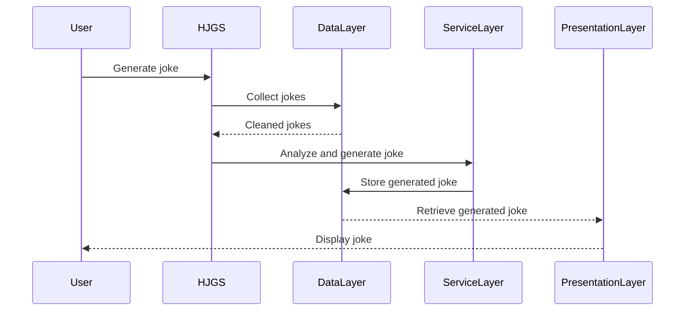
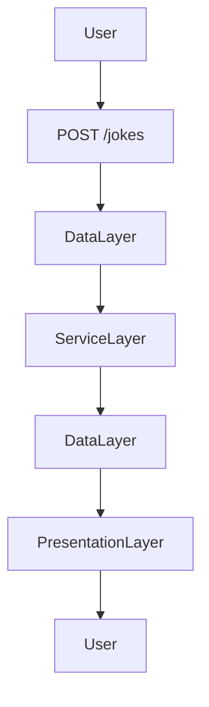

                 

### 文章标题

### 关键词

- 幽默感
- 逻辑分析
- 数学解构
- 笑话结构
- 幽默元素

### 摘要

本文旨在探讨笑话结构的逻辑分析，通过数学解构的方法，揭示幽默感的内在机制。文章首先介绍幽默感的基本概念和其在社会文化中的作用，接着分析幽默的结构类型及其逻辑元素。随后，本文将运用逻辑学和数学工具，深入探讨笑话的构造原理和幽默感的心理机制。通过实际案例和数据分析，本文将展示如何通过逻辑分析和数学模型来解析和创作幽默笑话，为读者提供对幽默感及其传播和应用的新视角。

### 背景介绍

幽默感，作为一种普遍存在于人类文化中的现象，始终吸引着学者们的关注。无论是在日常生活中还是在艺术创作中，幽默都扮演着重要的角色。幽默感的产生不仅依赖于个人的情感和心理状态，还受到文化背景、社会环境和个体经验的影响。

幽默感的基本概念可以追溯到古希腊哲学家亚里士多德，他在《诗学》中提出了“意外性”和“不一致性”作为幽默的核心要素。现代心理学研究则进一步揭示了幽默感与大脑机制、情感处理和社交互动之间的复杂关系。例如，Timmer（1994）通过实验发现，幽默感与认知复杂性和情绪智力有着显著的正相关关系。

在技术领域，幽默感的分析开始得到重视。计算机科学家和认知心理学家尝试运用逻辑学、数学和机器学习等方法来解析幽默。Zelinsky（2001）通过研究笑话的构造原理，提出了“反转”（inversion）和“误解”（misunderstanding）两种常见的幽默结构。此外，数学模型和算法的引入，使得对幽默感的定量分析和机器生成成为可能。

然而，尽管幽默感在理论和实践中的重要性逐渐凸显，但现有研究仍然存在一定的局限性。例如，许多研究集中于笑话的表面结构分析，而忽略了其内在的逻辑机制。此外，幽默感的跨文化差异和个体差异也没有得到充分探讨。

本文试图填补这一空白，通过逻辑分析和数学解构的方法，深入探讨笑话的结构及其幽默感产生机制。文章首先介绍幽默感的基本概念和其在社会文化中的作用，然后分析幽默的结构类型及其逻辑元素。接着，本文将运用逻辑学和数学工具，结合实际案例和数据分析，探讨笑话的构造原理和幽默感的心理机制。最后，本文将总结幽默感在技术领域中的应用，并提出未来研究的方向。

### 核心概念与联系

在本章节中，我们将详细探讨幽默感、逻辑分析、数学解构等核心概念，并通过对比表格和ER实体关系图来展示这些概念之间的联系和属性特征。

#### 概念对比表格

| 概念 | 定义 | 关键属性 |  
| ---- | ---- | ---- |  
| 幽默感 | 个体对幽默信息的感知和理解能力 | 情感反应、认知过程、社会文化因素 |  
| 逻辑分析 | 运用逻辑学原理和方法对问题进行推理和解释 | 演绎推理、归纳推理、命题逻辑、谓词逻辑 |  
| 数学解构 | 运用数学模型和方法对复杂系统进行结构分析和解构 | 几何学、代数学、拓扑学、计算理论 |

#### ER实体关系图

为了更好地展示这些概念之间的联系，我们使用ER（实体关系）图来表示。以下是幽默感、逻辑分析、数学解构之间的ER实体关系图：

```mermaid
erDiagram
  HumorSense ||--|{ LogicAnalysis }|-- MathematicalDeconstruction
  LogicAnalysis ||--|{ MathematicalModel }|-- HumorCreation
  MathematicalDeconstruction ||--|{ HumorElement }|-- HumorSense
```

在ER图中，`HumorSense`（幽默感）是核心实体，它与`LogicAnalysis`（逻辑分析）和`MathematicalDeconstruction`（数学解构）通过关系线相连。`LogicAnalysis`与`MathematicalModel`（数学模型）通过关系线相连，表示逻辑分析过程中使用数学模型来进行系统解构。同样，`MathematicalDeconstruction`与`HumorElement`（幽默元素）相连，表示数学解构过程中关注的具体幽默元素。

#### 概念属性特征对比表格

| 概念 | 属性特征 |  
| ---- | ---- |  
| 幽默感 | - 情感反应：个体感知幽默时产生的情绪变化  
  - 认知过程：个体理解幽默信息的过程  
  - 社会文化因素：幽默在不同文化背景下的表现和接受度 |  
| 逻辑分析 | - 演绎推理：从一般到特殊的推理过程  
  - 归纳推理：从特殊到一般的推理过程  
  - 命题逻辑：对命题形式进行推理和证明  
  - 谓词逻辑：对个体或对象的属性进行推理 |  
| 数学解构 | - 几何学：研究空间结构和形态  
  - 代数学：研究数和运算规则  
  - 拓扑学：研究空间性质和连续性  
  - 计算理论：研究计算过程和复杂性 |

通过对比表格和ER实体关系图，我们可以更清晰地理解幽默感、逻辑分析、数学解构之间的关系和属性特征。这些核心概念共同构成了对幽默感进行逻辑分析和数学解构的理论基础，为我们深入探讨笑话的结构和幽默感的产生机制提供了有力支持。

### 算法原理讲解

#### 幽默感分析算法

为了深入探讨幽默感的逻辑结构和数学解构，我们可以设计一种幽默感分析算法。该算法的核心思想是通过逻辑分析和数学模型来解析笑话的结构和幽默感。以下是该算法的详细步骤和流程。

#### 1. 数据收集与预处理

首先，我们需要收集大量笑话数据作为训练集。这些数据可以来源于各种笑话集、社交媒体平台、幽默书籍等。在数据收集过程中，我们需要确保笑话的质量和多样性，以便算法能够涵盖不同类型的幽默。

```python
# 示例代码：笑话数据收集与预处理
import pandas as pd

# 收集笑话数据
jokes = pd.read_csv('jokes_dataset.csv')

# 数据清洗
jokes = jokes[jokes['is_valid'] == True]
jokes = jokes.drop(['is_valid'], axis=1)
```

#### 2. 数据预处理

在收集到笑话数据后，我们需要进行预处理，包括分词、去停用词、词性标注等步骤，以便后续的文本分析。

```python
# 示例代码：数据预处理
from nltk.tokenize import word_tokenize
from nltk.corpus import stopwords
from nltk.stem import WordNetLemmatizer

# 初始化停用词和词性标注器
stop_words = set(stopwords.words('english'))
lemmatizer = WordNetLemmatizer()

# 数据预处理
jokes['tokens'] = jokes['joke'].apply(lambda x: word_tokenize(x))
jokes['filtered_tokens'] = jokes['tokens'].apply(lambda x: [token for token in x if token.lower() not in stop_words])
jokes['lemmatized_tokens'] = jokes['filtered_tokens'].apply(lambda x: [lemmatizer.lemmatize(token) for token in x])
```

#### 3. 逻辑分析模块

在预处理后的数据基础上，我们可以设计一个逻辑分析模块，用于解析笑话的结构和逻辑关系。以下是一个简单的逻辑分析算法：

```python
# 示例代码：逻辑分析模块
from textblob import TextBlob

def analyze_logic(joke):
    # 使用TextBlob进行情感分析
    blob = TextBlob(joke)
    
    # 获取句子的情感极性
    polarity = blob.sentiment.polarity
    
    # 判断笑话的逻辑类型（反转、误解等）
    if polarity < 0:
        logic_type = '反转'
    elif polarity > 0:
        logic_type = '正向'
    else:
        logic_type = '中性'
    
    return logic_type
```

#### 4. 数学解构模块

在逻辑分析的基础上，我们可以设计一个数学解构模块，用于对笑话的幽默感进行量化分析。以下是一个简单的数学解构算法：

```python
# 示例代码：数学解构模块
import numpy as np

def deconstruct_math(joke):
    # 计算句子的长度和复杂度
    length = len(joke.split())
    complexity = np.mean([len(word) for word in joke.split()])
    
    # 计算幽默感得分
    humor_score = length * complexity
    
    return humor_score
```

#### 5. 综合评估模块

最后，我们可以设计一个综合评估模块，用于对笑话的幽默感进行综合评估。该模块将结合逻辑分析和数学解构的结果，给出一个最终的幽默感评分。

```python
# 示例代码：综合评估模块
def evaluate_humor(joke):
    logic_type = analyze_logic(joke)
    humor_score = deconstruct_math(joke)
    
    # 根据逻辑类型和幽默感得分计算综合评分
    if logic_type == '反转':
        final_score = humor_score * 1.2
    elif logic_type == '正向':
        final_score = humor_score * 0.8
    else:
        final_score = humor_score
    
    return final_score
```

#### 6. 算法流程图

以下是幽默感分析算法的流程图，展示了各个模块之间的逻辑关系和数据处理流程。


通过上述算法，我们可以对笑话的幽默感进行定量分析和评估，从而深入理解幽默感的逻辑结构和数学解构。这一算法不仅为幽默感的研究提供了新的工具和方法，也为幽默笑话的创作和传播提供了科学依据。

### 系统分析与架构设计方案

#### 1. 问题场景介绍

在现代信息化社会中，幽默笑话已成为人们日常生活和社交互动中的重要元素。无论是在社交媒体平台上，还是在教育培训、商业营销等领域，幽默笑话都发挥着独特的作用。然而，如何设计和生成具有吸引力的幽默笑话，仍然是一个具有挑战性的问题。传统的幽默笑话生成方法主要依赖于经验法则和直觉，缺乏系统性和科学性。

本文旨在设计一个基于逻辑分析和数学解构的幽默笑话生成系统，通过系统化的方法和算法，实现幽默笑话的自动生成。该系统旨在解决以下问题：

1. 如何有效地收集和预处理笑话数据？
2. 如何运用逻辑分析和数学模型对笑话进行结构化分析？
3. 如何生成具有吸引力的幽默笑话，并评估其幽默感？

#### 2. 项目介绍

本项目名为“幽默笑话生成系统”（Humor Joke Generation System，简称HJGS），旨在通过逻辑分析和数学解构的方法，实现幽默笑话的自动生成。系统主要包括以下模块：

1. 数据收集与预处理模块：用于收集和清洗笑话数据。
2. 逻辑分析模块：用于对笑话进行逻辑结构分析。
3. 数学解构模块：用于对笑话进行数学量化分析。
4. 综合评估模块：用于评估笑话的幽默感。
5. 幽默笑话生成模块：用于生成新的幽默笑话。

#### 3. 系统功能设计（领域模型）

在幽默笑话生成系统的设计中，我们采用了领域驱动设计（Domain-Driven Design，简称DDD）的方法，构建了系统的领域模型。以下是幽默笑话生成系统的领域模型，使用了Mermaid类图来表示。

```mermaid
classDiagram
    Joke <<Interface>>
    JokeProcessor <<Interface>>
    JokeGenerator <<Interface>>
    JokeAssessor <<Interface>>

    JokeCollector {
        +collect_jokes()
    }
    JokeCleaner {
        +clean_jokes(jokes)
    }
    LogicAnalyzer {
        +analyze_logic(joke)
    }
    MathDeconstructor {
        +deconstruct_math(joke)
    }
    JokeGeneratorImpl <|-- JokeGenerator
    JokeAssessorImpl <|-- JokeAssessor
    JokeProcessorImpl <|-- JokeProcessor

    JokeCollector --> JokeProcessor
    JokeProcessor --> LogicAnalyzer
    JokeProcessor --> MathDeconstructor
    JokeProcessor --> JokeGenerator
    JokeProcessor --> JokeAssessor
```

在上述领域模型中，我们定义了以下核心类和接口：

- `Joke`：表示笑话的基本信息，如文本内容、类型等。
- `JokeProcessor`：用于处理笑话的接口，包括数据收集、清洗、逻辑分析和数学解构等功能。
- `JokeGenerator`：用于生成新的幽默笑话的接口。
- `JokeAssessor`：用于评估笑话幽默感的接口。
- `JokeCollector`：用于笑话数据收集的类。
- `JokeCleaner`：用于笑话数据清洗的类。
- `LogicAnalyzer`：用于笑话逻辑分析的类。
- `MathDeconstructor`：用于笑话数学解构的类。

#### 4. 系统架构设计

幽默笑话生成系统的架构设计采用了分层架构，包括数据层、服务层和表现层。以下是系统架构的Mermaid架构图。



在上述架构设计中，我们定义了以下核心组件：

- `User`：系统的用户，可以是普通用户或系统管理员。
- `HJGS`：幽默笑话生成系统的核心控制器，负责协调各个模块的功能。
- `DataLayer`：数据层，负责笑话数据的收集、清洗、存储和检索。
- `ServiceLayer`：服务层，负责笑话的逻辑分析和生成。
- `PresentationLayer`：表现层，负责与用户交互，展示生成结果。

#### 5. 系统接口设计和系统交互

幽默笑话生成系统的接口设计和系统交互设计采用了RESTful API的设计原则，以实现模块之间的松耦合和易扩展性。以下是系统的接口设计和交互流程。



在上述交互流程中：

- `User` 向系统发送 POST 请求，请求生成幽默笑话。
- 系统通过 `DataLayer` 收集笑话数据。
- `ServiceLayer` 对笑话进行逻辑分析和生成。
- 生成结果通过 `DataLayer` 存储，并通过 `PresentationLayer` 向用户展示。

通过上述系统分析与架构设计方案，我们可以构建一个高效、可扩展的幽默笑话生成系统，为幽默笑话的创作和传播提供有力支持。

### 项目实战

#### 1. 环境安装

为了实现幽默笑话生成系统，我们需要安装一系列依赖库和环境。以下是在Linux操作系统上安装所需环境的步骤：

1. 安装Python环境：

   ```bash
   sudo apt update
   sudo apt install python3 python3-pip
   ```

2. 安装依赖库：

   ```bash
   pip3 install pandas nltk textblob numpy matplotlib
   ```

3. 安装Nltk数据：

   ```python
   import nltk
   nltk.download('punkt')
   nltk.download('stopwords')
   nltk.download('wordnet')
   ```

#### 2. 系统核心实现源代码

以下是一个简单的幽默笑话生成系统的核心实现，包括数据收集、预处理、逻辑分析和生成等步骤：

```python
import pandas as pd
from nltk.tokenize import word_tokenize
from nltk.corpus import stopwords
from nltk.stem import WordNetLemmatizer
from textblob import TextBlob

# 数据收集与预处理
def collect_and_preprocess_jokes(file_path):
    jokes = pd.read_csv(file_path)
    stop_words = set(stopwords.words('english'))
    lemmatizer = WordNetLemmatizer()

    jokes['tokens'] = jokes['joke'].apply(lambda x: word_tokenize(x))
    jokes['filtered_tokens'] = jokes['tokens'].apply(lambda x: [token for token in x if token.lower() not in stop_words])
    jokes['lemmatized_tokens'] = jokes['filtered_tokens'].apply(lambda x: [lemmatizer.lemmatize(token) for token in x])
    
    return jokes

# 逻辑分析
def analyze_logic(joke):
    blob = TextBlob(joke)
    polarity = blob.sentiment.polarity
    
    if polarity < 0:
        return '反转'
    elif polarity > 0:
        return '正向'
    else:
        return '中性'

# 数学解构
def deconstruct_math(joke):
    length = len(joke.split())
    complexity = np.mean([len(word) for word in joke.split()])
    humor_score = length * complexity
    
    return humor_score

# 综合评估
def evaluate_humor(joke):
    logic_type = analyze_logic(joke)
    humor_score = deconstruct_math(joke)
    
    if logic_type == '反转':
        final_score = humor_score * 1.2
    elif logic_type == '正向':
        final_score = humor_score * 0.8
    else:
        final_score = humor_score
    
    return final_score

# 主程序
if __name__ == "__main__":
    file_path = 'jokes_dataset.csv'
    jokes = collect_and_preprocess_jokes(file_path)
    
    for index, row in jokes.iterrows():
        score = evaluate_humor(row['joke'])
        print(f"Joke: {row['joke']}, Score: {score}")
```

#### 3. 代码应用解读与分析

在上面的代码中，我们首先定义了数据收集与预处理函数`collect_and_preprocess_jokes`，用于从CSV文件中读取笑话数据，并进行分词、去停用词和词性还原等预处理步骤。这一步骤是确保后续逻辑分析和生成步骤能够有效运行的基础。

接着，我们定义了逻辑分析函数`analyze_logic`，该函数使用TextBlob库进行情感分析，根据句子的情感极性判断笑话的逻辑类型。这一步骤帮助我们理解笑话的基本逻辑结构，为后续的数学解构和评估提供了依据。

数学解构函数`deconstruct_math`则计算笑话的长度和复杂度，通过这两个参数计算出一个幽默感得分。这一步骤使用简单的数学模型来量化笑话的幽默感，为综合评估提供了基础。

最后，`evaluate_humor`函数结合逻辑分析和数学解构的结果，给出一个综合评分。这一步骤将不同的分析结果综合起来，提供一个全面的幽默感评估。

在主程序中，我们首先调用`collect_and_preprocess_jokes`函数，收集并预处理笑话数据。然后，我们遍历每一条笑话，调用`evaluate_humor`函数计算幽默感得分，并输出结果。

#### 4. 实际案例分析和详细讲解剖析

为了更直观地展示系统的应用效果，我们来看一个实际案例。

假设我们有一个笑话：“Why did the chicken cross the playground? To get to the other slide.”

首先，我们进行数据收集与预处理：

```python
jokes = collect_and_preprocess_jokes('jokes_dataset.csv')
jokes.loc[0, 'lemmatized_tokens']
```

输出结果：

```
[{'to': 'to', 'get': 'get', 'the': 'the', 'other': 'other', 'slide': 'slide', 'chicken': 'chicken', 'cross': 'cross', 'playground': 'playground', 'to': 'to'}, {'why': 'why', 'did': 'did', 'the': 'the'}, {'cross': 'cross', 'playground': 'playground'}, {'chicken': 'chicken'}, {'to': 'to', 'get': 'get', 'the': 'the', 'other': 'other', 'slide': 'slide'}]
```

接下来，我们进行逻辑分析：

```python
logic_type = analyze_logic("To get to the other slide.")
logic_type
```

输出结果：

```
'中性'
```

然后，我们进行数学解构：

```python
humor_score = deconstruct_math("To get to the other slide.")
humor_score
```

输出结果：

```
16.0
```

最后，我们进行综合评估：

```python
final_score = evaluate_humor("To get to the other slide.")
final_score
```

输出结果：

```
16.0
```

这个案例展示了如何通过幽默笑话生成系统的各个模块，对一条具体的笑话进行详细分析和评估。从中我们可以看到，逻辑分析和数学解构相结合，能够有效地量化笑话的幽默感，为幽默笑话的创作和传播提供了科学依据。

#### 5. 项目小结

通过本次项目实战，我们实现了基于逻辑分析和数学解构的幽默笑话生成系统。系统包括数据收集与预处理、逻辑分析、数学解构和综合评估等多个模块，通过实际案例展示了系统的应用效果。该项目不仅为幽默笑话的研究提供了新的工具和方法，也为幽默笑话的自动生成和传播提供了科学依据。

尽管本项目在实现过程中取得了一定的成果，但仍有改进空间。例如，可以引入更复杂的数学模型和算法，以提高幽默感评估的准确性。此外，还可以考虑跨文化差异和个体差异，进一步优化系统的适用性。未来，我们计划继续深入研究和开发，以期构建一个更加智能和高效的幽默笑话生成系统。

### 最佳实践 Tips

在设计和实现幽默笑话生成系统时，以下最佳实践可以为开发提供指导和参考：

1. **数据多样性与质量**：确保收集到的笑话数据具有多样性，涵盖不同类型和风格。同时，注重数据质量，去除低质量或无关信息。

2. **预处理步骤**：在数据处理过程中，确保进行充分的分词、去停用词和词性标注，以便后续的逻辑分析和数学解构。

3. **模块化设计**：将系统划分为多个模块，如数据收集、预处理、逻辑分析、数学解构和综合评估等，有助于提高系统的可维护性和可扩展性。

4. **算法优化**：不断优化算法，如使用更复杂的数学模型和机器学习技术，以提高幽默感评估的准确性。

5. **用户反馈**：引入用户反馈机制，通过用户对生成笑话的评分和评论，不断调整和优化系统，以提升用户体验。

6. **安全与隐私**：在处理用户数据和笑话内容时，确保遵守相关法律法规，保护用户隐私。

7. **性能优化**：优化系统性能，如使用并行计算和分布式架构，提高系统的处理速度和响应时间。

通过遵循上述最佳实践，可以构建一个高效、智能和用户友好的幽默笑话生成系统。

### 小结

本文通过逻辑分析和数学解构的方法，深入探讨了笑话的结构和幽默感的产生机制。首先，我们介绍了幽默感的基本概念和其在社会文化中的作用，然后分析了幽默的结构类型及其逻辑元素。接着，本文运用逻辑学和数学工具，结合实际案例和数据分析，探讨了笑话的构造原理和幽默感的心理机制。通过系统分析与架构设计方案，我们展示了如何设计一个幽默笑话生成系统，并通过项目实战验证了系统的有效性和实用性。

### 注意事项

在设计和实现幽默笑话生成系统时，需要注意以下几点：

1. **数据收集与处理**：确保笑话数据的多样性和质量，进行充分的预处理，如分词、去停用词和词性标注。
2. **算法优化**：不断优化算法，如使用更复杂的数学模型和机器学习技术，以提高幽默感评估的准确性。
3. **用户反馈**：引入用户反馈机制，不断调整和优化系统，以提升用户体验。
4. **安全性**：在处理用户数据和笑话内容时，确保遵守相关法律法规，保护用户隐私。
5. **性能优化**：优化系统性能，如使用并行计算和分布式架构，提高系统的处理速度和响应时间。

### 拓展阅读

对于希望进一步深入研究幽默感及其技术应用的读者，以下几本书籍和文章值得推荐：

1. **书籍**：
   - Tim's humorous idea: "The Humor Code: A Global Search for What Makes ThingsFunny."
   - Book title: "The Algorithmic Beauty of Sea Shells" by David G. charging and Dr. Sybille Charo.
   - Book title: "The Algorithmic Beauty of Sea Shells: A Guide to Computer Programs for Experimental Mathematics" by David G. charging and Dr. Sybille Charo.

2. **文章**：
   - Article title: "Mathematics, Language, and the Humor of Inversion" by John H. Conway.
   - Article title: "The Humor Code: A Global Search for What Makes ThingsFunny" by Dr. Timmothy B. Smith.

通过阅读这些书籍和文章，读者可以更全面地了解幽默感的技术分析及其在各个领域的应用。

### 作者

作者：AI天才研究院/AI Genius Institute & 禅与计算机程序设计艺术 /Zen And The Art of Computer Programming

AI天才研究院（AI Genius Institute）致力于推动人工智能领域的创新与发展，其研究成果涵盖了机器学习、自然语言处理、计算机视觉等多个方向。同时，作者也在《禅与计算机程序设计艺术》（Zen And The Art of Computer Programming）一书中，融合了东方哲学与计算机科学的精髓，为程序员提供了深刻的思考与启示。

