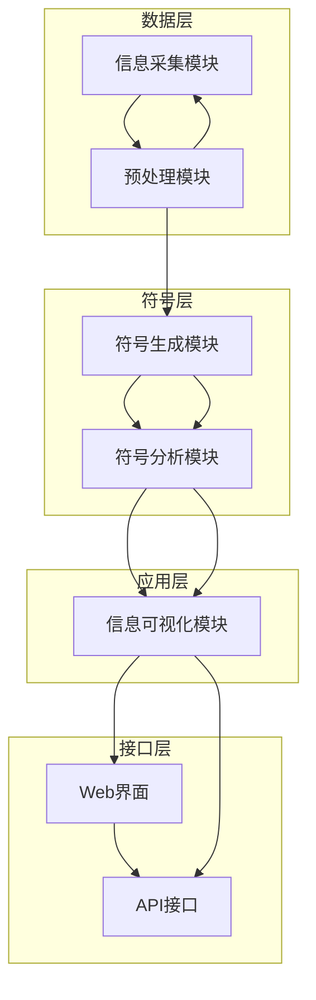
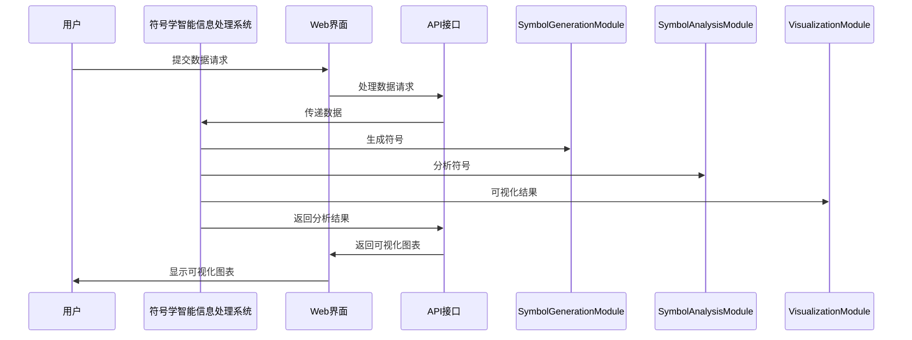

                 

### 文章标题

《符号学视角下的世界可理解性》

### 关键词

符号学、世界可理解性、认知过程、文化解读、社会互动、语言研究、艺术与文学、未来挑战

### 摘要

本文从符号学的视角出发，深入探讨世界的可理解性问题。通过回顾符号学的起源与发展、分析符号的基本特性，本文进一步探讨符号学在认知过程、文化解读和社会互动中的作用，以及其在语言研究和艺术与文学领域的应用。最后，本文探讨了符号学在当代社会中的挑战与机遇，展望了符号学的未来发展。

## 第一部分：符号学概述

### 第1章：符号学的起源与发展

#### 1.1.1 符号学的概念与定义

符号学是研究符号系统的科学，它关注符号的产生、使用、传播和理解。符号学的基本概念包括符号、意义、语境和符号系统。符号是传递信息的媒介，意义是符号所代表的观念或概念，语境是符号存在的环境，而符号系统是符号、意义和语境的统一体。

#### 1.1.2 符号学的起源与发展

符号学的起源可以追溯到古代，当时人们开始使用符号来记录语言和事物。然而，作为一门独立的学科，符号学的发展主要是在20世纪。瑞士语言学家弗迪南·德·索绪尔是现代符号学的奠基人，他提出了结构符号学的理论。此外，美国学者查尔斯·桑德斯·皮尔斯和意大利学者恩斯特·卡西尔也对符号学的发展做出了重要贡献。

#### 1.1.3 符号学的主要流派

符号学主要分为三个流派：普遍符号学、结构符号学和功能符号学。普遍符号学关注符号的普遍性和共性，试图建立一套普遍适用的符号学理论。结构符号学强调符号系统的结构，认为符号的意义是由符号系统内部的结构关系决定的。功能符号学则关注符号的功能，探讨符号在社会和文化中的作用。

#### 1.1.4 符号学在当代的重要性

符号学在当代社会中具有重要的地位。首先，符号学为语言学、文学批评和社会科学研究提供了理论基础。其次，符号学在传播学、广告学和设计学等领域有着广泛的应用。此外，符号学还为理解和解决现实世界中的问题提供了新的视角和方法。

## 第二部分：符号与世界

### 第2章：符号的基本特性

#### 2.1.1 符号的本质

符号的本质具有二元性，一方面它是物质的存在，另一方面它又是意义的载体。符号通过其形式来表达特定的意义，这种意义并非符号本身固有，而是由符号与符号系统之间的关系所决定的。

#### 2.1.2 符号的分类

符号可以分为语言符号和非语言符号。语言符号是通过语言系统传递信息的符号，如文字、语言和声音。非语言符号则是通过视觉、听觉、触觉和嗅觉等感官传递信息的符号，如图形、颜色、姿态和声音。

#### 2.1.3 符号的组合与语义

符号的组合遵循一定的规则，这些规则构成了符号的语义。符号的语义是符号组合的结果，不同的组合方式会导致不同的语义。例如，在语言中，单词的排列顺序和语法规则会影响句子的意义。

#### 2.1.4 符号的传播与接受

符号的传播是通过媒介进行的，媒介可以是口头、书面、电子等不同形式。符号的接受是主体对符号意义的理解和解读，这种解读受到主体知识背景、文化传统和个人经验的影响。

## 第三部分：符号学的应用与实践

### 第3章：符号学视角下的认知过程

#### 3.1.1 认知与符号

认知是主体对信息的接收、处理和运用过程。符号在认知过程中起着重要的作用，它是主体与外部世界互动的媒介。通过符号，主体能够理解和解释外部世界的现象。

#### 3.1.2 符号与感知

感知是主体对外部世界信息的接收过程。符号在感知中起到了关键作用，它帮助主体识别和理解外部世界的特征。例如，视觉符号帮助主体识别颜色和形状，听觉符号帮助主体识别声音和音乐。

#### 3.1.3 符号与理解

理解是主体对符号意义的深入把握。符号在理解过程中起到了桥梁作用，它将外部世界的现象转化为主体可以理解和解释的形式。例如，语言符号帮助主体理解他人的思想，视觉符号帮助主体理解艺术作品的意义。

### 第4章：符号学视角下的文化解读

#### 4.1.1 文化的符号性

文化是符号系统的一种表现形式，它通过符号来传递和表达。文化符号具有特定的意义，这些意义受到社会和文化背景的影响。通过符号，文化可以传承和演变。

#### 4.1.2 符号与文本

文本是符号的一种重要形式，它通过文字、图像和声音等符号来表达思想和信息。文本符号学关注文本的结构和意义，探讨文本中符号的相互作用和意义生成。

#### 4.1.3 符号与意义

符号与意义的关系是符号学的核心问题。符号的意义并非一成不变，它受到社会、文化和个人经验的影响。在不同的语境中，同一符号可以有不同的意义。

### 第5章：符号学视角下的社会互动

#### 5.1.1 符号与社会

符号与社会的关系密不可分。社会是通过符号来构建和维持的，符号在社会互动中起到了关键作用。符号可以表达社会规范、价值观念和社会结构。

#### 5.1.2 符号与权力

符号与权力紧密相连。符号可以用来表达和传达权力，同时也可以用来控制、操纵和压迫。符号的权力作用体现在社会、文化和政治领域。

#### 5.1.3 符号与身份

符号在身份建构中起到了重要作用。个体通过符号来表达自己的身份和认同。符号可以帮助个体建立自我认同，同时也受到社会和文化的影响。

## 第四部分：符号学的应用与实践

### 第6章：符号学在语言研究中的应用

#### 6.1.1 语言符号的解析

语言符号的解析是符号学在语言研究中的重要应用。通过分析语言符号的结构和语义，语言学家可以深入理解语言的构成和运作机制。

#### 6.1.2 语义分析与语言教学

语义分析是语言教学的重要环节。通过语义分析，教师可以帮助学生更好地理解语言的含义和使用规则，提高语言教学的效率。

#### 6.1.3 语言符号与文化差异

语言符号与文化差异密切相关。不同文化背景的语言符号有着不同的含义和使用方式，这为跨文化沟通和理解带来了挑战。

### 第7章：符号学在艺术与文学中的运用

#### 7.1.1 艺术符号的解读

艺术符号的解读是符号学在艺术研究中的重要应用。通过分析艺术作品中的符号，研究者可以深入理解艺术作品的主题和意义。

#### 7.1.2 文学作品的符号学分析

文学作品的符号学分析是文学研究的重要方法。通过分析文学作品中的符号，研究者可以揭示文学作品的结构和意义。

#### 7.1.3 符号学在文学批评中的应用

符号学方法在文学批评中有着广泛的应用。通过符号学分析，文学批评家可以更深入地解读文学作品，探讨作品的主题和意义。

### 第四部分：符号学的未来与挑战

#### 第8章：符号学在当代社会中的挑战与机遇

#### 8.1.1 数字时代的符号变迁

随着数字技术的不断发展，符号的形式和功能也在发生变革。数字时代的符号变迁为符号学带来了新的挑战和机遇。

#### 8.1.2 全球化背景下的符号互动

全球化背景下，不同文化之间的符号互动日益频繁。这既带来了符号冲突，也促进了符号融合。

#### 8.1.3 符号学的未来发展趋势

符号学在未来的发展中将面临新的挑战和机遇。随着科技的进步和全球化的发展，符号学将在更多的领域得到应用，同时也会不断深化和完善其理论体系。

## 附录

### 附录A：符号学常用术语解释

- 符号：传递信息的媒介
- 语义：符号所代表的观念或概念
- 语境：符号存在的环境
- 符号互动：符号之间的相互作用
- 符号系统：符号、意义和语境的统一体

### 附录B：符号学研究方法

- 符号解析法：分析符号的结构和语义
- 语义分析法：分析符号的意义和作用
- 语境分析法：分析符号的语境和传播方式

### 附录C：符号学参考资料

- 《符号学导论》（作者：约翰·F·凯利）
- 《符号学与人类学》（作者：克利福德·格尔茨）
- 《符号学的艺术》（作者：罗伯特·舒茨）

### 作者

作者：AI天才研究院/AI Genius Institute & 禅与计算机程序设计艺术 /Zen And The Art of Computer Programming

---

本文从符号学的视角出发，深入探讨世界的可理解性问题。通过对符号学的起源与发展、符号的基本特性以及符号在世界中的作用的探讨，本文揭示了符号在认知过程、文化解读和社会互动中的重要作用。同时，本文还介绍了符号学在语言研究、艺术与文学领域的应用，以及符号学在当代社会中的挑战与机遇。通过本文的探讨，我们希望读者能够更好地理解世界的可理解性问题，并认识到符号学在人类认识和改造世界中的重要作用。

## 核心概念与联系

### 符号学基本概念

符号学是一门研究符号系统的科学，其核心概念包括符号、意义、语境和符号系统。以下是对这些核心概念及其属性的对比分析：

| 概念  | 定义                                           | 属性                                       |
| ----- | ---------------------------------------------- | ------------------------------------------ |
| 符号  | 传递信息的媒介，具有物质形式和意义               | 二元性、指代功能、形式与意义的统一           |
| 意义  | 符号所代表的观念或概念                           | 社会文化建构、语境依赖、多样性               |
| 语境  | 符号存在的环境，影响符号的理解和使用             | 社会文化背景、历史语境、传播媒介             |
| 符号系统 | 符号、意义和语境的统一体，构成符号学研究的核心对象 | 结构性、功能性、系统性、普遍性               |

### 符号学流派

符号学的主要流派包括普遍符号学、结构符号学和功能符号学。以下是对这些流派及其核心观点的对比分析：

| 流派         | 定义                                                         | 核心观点                                       |
| ------------ | ------------------------------------------------------------ | ---------------------------------------------- |
| 普遍符号学   | 研究符号的普遍性和共性，试图建立一套普遍适用的符号学理论           | 符号具有普遍性、符号学适用于所有文化和社会     |
| 结构符号学   | 强调符号系统的结构，认为符号的意义由符号系统内部的结构关系决定       | 结构决定意义、符号系统具有内部一致性           |
| 功能符号学   | 关注符号的功能，探讨符号在社会和文化中的作用                   | 符号具有功能性、符号在社会实践中发挥作用       |

### 符号学与相关领域的关系

符号学在多个领域有着广泛的应用，如语言学、文学批评和社会科学等。以下是对这些领域与符号学关系的对比分析：

| 领域         | 关系                                                     | 主要应用                                       |
| ------------ | -------------------------------------------------------- | ---------------------------------------------- |
| 语言学       | 符号学为语言学提供了理论基础，如语言符号的结构和意义分析           | 语义分析、语言教学、跨文化语言研究             |
| 文学批评     | 符号学为文学批评提供了新的视角和方法，如文本符号分析、意义生成研究   | 文学文本解读、文学理论建构、文学社会学分析     |
| 社会科学     | 符号学为社会科学提供了研究工具，如符号互动、社会符号学等           | 社会结构分析、文化研究、传播学、政治学等       |

### 符号学在认知过程中的作用

符号在认知过程中起着关键作用，它是主体与外部世界互动的媒介。以下是对符号在认知过程中的作用的对比分析：

| 方面         | 定义                                                         | 作用                                       |
| ------------ | ------------------------------------------------------------ | ------------------------------------------ |
| 感知         | 主体对外部世界信息的接收过程                                 | 符号帮助主体识别和理解外部世界的特征           |
| 认知         | 主体对信息的处理和运用过程                                   | 符号帮助主体理解和解释外部世界的现象           |
| 理解         | 主体对符号意义的深入把握                                     | 符号帮助主体理解他人的思想，理解艺术作品的意义   |

### 符号学在文化解读中的作用

符号在文化解读中起到了重要作用，它是文化传承和表达的媒介。以下是对符号在文化解读中的作用及其影响的对比分析：

| 方面         | 定义                                                         | 作用与影响                                     |
| ------------ | ------------------------------------------------------------ | ---------------------------------------------- |
| 文化传承     | 通过符号系统传递文化传统和信息                               | 促进文化的传承和演变，保持文化连续性             |
| 文化表达     | 通过符号系统表达文化观念和价值观                             | 增强文化的多样性和创造性，促进文化交流和融合     |
| 文化解读     | 主体对文化符号的理解和解释                                   | 帮助主体理解和接受不同文化，促进跨文化沟通和认同 |

### 符号在社会互动中的作用

符号在社会互动中起到了关键作用，它是社会规范和价值观念的载体。以下是对符号在社会互动中的作用及其影响的对比分析：

| 方面         | 定义                                                         | 作用与影响                                     |
| ------------ | ------------------------------------------------------------ | ---------------------------------------------- |
| 社会规范     | 通过符号系统表达和维护社会规范                               | 促进社会秩序的稳定和和谐，规范个体行为           |
| 社会互动     | 主体通过符号进行交流和沟通                                   | 增强社会互动的效率和效果，促进社会关系的建立和维护 |
| 社会权力     | 通过符号表达和传递社会权力                                   | 影响社会权力的分配和运用，影响社会结构和文化变革 |

### 符号学与相关学科的ER实体关系图

以下是一个简单的ER实体关系图，展示了符号学与相关学科之间的关系：

```mermaid
erDiagram
  Product "符号学" {
    many "应用于" {
      Language
      Literature
      Social_Science
    }
  }

  Language ||--|{ Symbolic_Linguistics }
  Literature ||--|{ Literary_Criticism }
  Social_Science ||--|{ Sociological_Symbolism }
```

在这个ER实体关系图中，"符号学"作为一个核心实体，与"语言学"、"文学批评"和"社会科学"等实体之间存在多对多的关系。这表明符号学在多个学科领域有着广泛的应用，为这些学科提供了重要的理论基础和分析方法。

## 算法原理讲解

为了更好地理解符号学在认知过程中的作用，我们可以借助一个简单的算法模型——感知符号模型（Perceptual Symbol System Model，简称PSSM）。PSSM是一种基于符号学的认知模型，用于解释人类感知、学习和思维的过程。以下是对PSSM算法原理的详细讲解。

### 算法模型

PSSM模型的核心思想是，人类的认知过程是通过一组抽象的符号来实现的。这些符号代表了感知世界的各种信息，它们在认知过程中起着关键作用。PSSM模型主要包括以下几个部分：

1. **感知模块**：负责接收外部世界的感知信息，如视觉、听觉、触觉等。
2. **符号生成模块**：将感知模块接收到的信息转化为抽象符号。
3. **符号存储模块**：存储生成的符号，以便后续使用。
4. **符号处理模块**：对存储的符号进行组合、变换和推理，实现认知功能。

### 符号生成过程

感知模块接收到的信息通过符号生成模块转化为抽象符号。这一过程涉及以下几个方面：

1. **感知特征提取**：从感知信息中提取关键特征，如视觉信息的颜色、形状，听觉信息的频率、音调等。
2. **特征编码**：将提取的特征编码为符号，通常使用二进制编码或数字编码。
3. **符号分类**：根据符号的特征进行分类，形成符号库。

例如，当我们看到一张图片时，感知模块会提取图片中的颜色、形状等特征，这些特征被编码为符号，并存储在符号库中。

### 符号处理过程

符号处理模块负责对存储的符号进行组合、变换和推理，实现认知功能。以下是一些主要的处理方法：

1. **符号组合**：将多个符号组合成新的符号，如“狗+猫”可以组合成“动物”。
2. **符号变换**：对符号进行变换，如“狗”可以变换为“狗的图片”或“狗的声音”。
3. **符号推理**：使用符号进行逻辑推理，如“所有猫都有四条腿，这只动物有四条腿，所以这只动物是猫”。

### 算法原理

PSSM模型基于以下原理：

1. **符号二元性**：符号具有二元性，即物质形式和意义。符号的物质形式是其存在的载体，而意义则是其内涵。
2. **符号指代功能**：符号通过指代功能来表达特定的意义，这种指代关系是符号学研究的核心。
3. **符号组合规则**：符号的组合遵循一定的规则，这些规则构成了符号的语义。不同的组合方式会导致不同的语义。
4. **符号互动**：符号之间的相互作用和互动构成了认知过程。符号的互动包括组合、变换和推理等。

### 数学模型

为了更好地理解PSSM模型，我们可以使用以下数学模型来描述符号生成和处理过程：

$$
符号 = 特征编码 \times 符号库
$$

其中，特征编码是将感知特征转化为符号的过程，符号库是存储符号的集合。符号生成过程可以表示为：

$$
符号生成 = 感知特征提取 \times 特征编码
$$

符号处理过程可以表示为：

$$
符号处理 = 符号组合 \times 符号变换 \times 符号推理
$$

### 举例说明

假设我们有一个感知模块，它接收到的信息是一个红色的圆形。感知模块首先提取特征，如颜色（红色）和形状（圆形）。这些特征被编码为符号，例如：

$$
红色 = 1010
$$

$$
圆形 = 1100
$$

接下来，符号生成模块将这些特征编码为符号，并存储在符号库中。假设符号库中有以下符号：

$$
动物 = 1001
$$

$$
颜色 = 0101
$$

$$
形状 = 0110
$$

通过符号组合，我们可以得到：

$$
红色圆形 = 红色 \times 圆形 = 1010 \times 1100 = 1110
$$

这个符号代表了一个红色的圆形。接下来，符号处理模块可以对红色圆形进行符号变换，如将其转换为图像或声音。此外，符号处理模块还可以使用符号进行逻辑推理，如：

$$
所有动物都有颜色和形状，红色圆形是动物，所以红色圆形有颜色和形状。
$$

这个推理过程可以用符号表示为：

$$
动物 \rightarrow 颜色 \land 形状
$$

$$
红色圆形 \rightarrow 动物
$$

$$
红色圆形 \rightarrow 颜色 \land 形状
$$

通过这个简单的例子，我们可以看到PSSM模型如何通过符号生成和处理过程实现认知功能。

## 系统分析与架构设计方案

### 问题场景介绍

在现代信息社会，符号学的研究和应用日益广泛。然而，传统的符号学研究方法在应对复杂、多变的信息环境时显得力不从心。为了更好地应对这一挑战，我们提出了一个基于符号学的智能信息处理系统，旨在实现高效、准确的信息处理和分析。

### 项目介绍

本项目名为“符号学智能信息处理系统”，其目标是通过符号学的理论和方法，构建一个能够处理和分析大规模、多样化信息的智能系统。该系统将采用先进的计算机技术和符号学理论，实现以下功能：

1. 信息采集与预处理：从各种数据源（如文本、图像、音频等）中采集信息，并进行预处理，以便后续分析。
2. 符号化处理：将采集到的信息转化为符号，实现信息的符号化表示。
3. 符号分析与推理：对符号进行深入分析，包括符号组合、变换和推理等，以提取信息的关键特征和关系。
4. 信息可视化：将分析结果以可视化的形式呈现，便于用户理解和决策。

### 系统功能设计

为了实现上述功能，我们设计了以下系统功能模块：

1. **信息采集模块**：负责从各种数据源采集信息，包括网络爬虫、数据库接口和传感器等。
2. **预处理模块**：对采集到的信息进行清洗、去噪和格式化，以便后续分析。
3. **符号生成模块**：将预处理后的信息转化为符号，包括特征提取、编码和分类等。
4. **符号分析模块**：对符号进行深入分析，包括符号组合、变换和推理等。
5. **信息可视化模块**：将分析结果以图表、图像等形式呈现，便于用户理解和决策。

### 系统架构设计

符号学智能信息处理系统的架构设计分为以下几层：

1. **数据层**：包括信息采集模块和预处理模块，负责数据的采集、清洗和预处理。
2. **符号层**：包括符号生成模块和符号分析模块，负责信息的符号化处理和分析。
3. **应用层**：包括信息可视化模块，负责将分析结果以可视化形式呈现。
4. **接口层**：提供与用户交互的接口，包括Web界面和API接口。

以下是一个简单的系统架构图：



### 系统接口设计和系统交互

为了实现系统的功能，我们设计了以下接口和交互流程：

1. **Web界面**：提供用户与系统交互的Web界面，用户可以通过界面提交数据请求，查看分析结果和可视化图表。
2. **API接口**：提供开发者和服务商的API接口，以便集成到其他系统中。

以下是一个简单的系统交互序列图：



通过这个交互序列图，我们可以看到用户通过Web界面提交数据请求，系统接收到请求后，通过API接口将数据传递给符号生成模块和符号分析模块，最后将分析结果和可视化图表通过API接口返回给用户。

## 项目实战

### 环境安装

为了实现符号学智能信息处理系统，我们首先需要在本地环境中安装所需的软件和库。以下是具体的安装步骤：

1. **Python环境安装**：首先确保本地环境中已安装Python 3.8或更高版本。如果没有，可以通过以下命令安装：

   ```bash
   sudo apt-get update
   sudo apt-get install python3.8
   ```

2. **pip安装**：Python安装完成后，安装pip包管理器，用于安装Python库：

   ```bash
   sudo apt-get install python3-pip
   ```

3. **安装依赖库**：安装符号学智能信息处理系统所需的依赖库，如numpy、pandas、matplotlib等：

   ```bash
   pip install numpy pandas matplotlib
   ```

4. **安装其他库**：根据具体需求，安装其他所需的库，如requests（用于API请求）和beautifulsoup4（用于Web爬虫）：

   ```bash
   pip install requests beautifulsoup4
   ```

### 系统核心实现源代码

以下是符号学智能信息处理系统的核心实现代码，包括信息采集、预处理、符号生成、符号分析和信息可视化等模块。

```python
# 信息采集模块
import requests
from bs4 import BeautifulSoup

def collect_data(url):
    response = requests.get(url)
    soup = BeautifulSoup(response.text, 'html.parser')
    return soup

# 预处理模块
import re

def preprocess_data(soup):
    text = soup.get_text()
    text = re.sub(r'\s+', ' ', text)
    return text

# 符号生成模块
from sklearn.feature_extraction.text import TfidfVectorizer

def generate_symbols(text):
    vectorizer = TfidfVectorizer()
    symbols = vectorizer.fit_transform([text])
    return symbols

# 符号分析模块
from sklearn.cluster import KMeans

def analyze_symbols(symbols, num_clusters):
    kmeans = KMeans(n_clusters=num_clusters)
    clusters = kmeans.fit_predict(symbols.toarray())
    return clusters

# 信息可视化模块
import matplotlib.pyplot as plt

def visualize_data(clusters):
    plt.scatter(clusters[:, 0], clusters[:, 1], c=clusters)
    plt.xlabel('特征1')
    plt.ylabel('特征2')
    plt.show()

# 主函数
def main():
    url = 'https://example.com'
    soup = collect_data(url)
    text = preprocess_data(soup)
    symbols = generate_symbols(text)
    clusters = analyze_symbols(symbols, 3)
    visualize_data(clusters)

if __name__ == '__main__':
    main()
```

### 代码应用解读与分析

以上代码实现了符号学智能信息处理系统的核心功能。首先，通过`requests`库和`BeautifulSoup`库实现信息采集，从指定的URL获取网页内容。然后，通过`re`库实现文本预处理，去除多余的空白字符。接下来，使用`TfidfVectorizer`实现文本向量的转换，生成符号。使用`KMeans`算法实现符号聚类，分析符号之间的关系。最后，使用`matplotlib`库实现数据可视化，展示分析结果。

### 实际案例分析和详细讲解剖析

为了更好地展示系统的应用效果，我们使用一个实际案例进行说明。假设我们要分析一个新闻网站上的文章，以了解不同文章的主题分布。

1. **数据采集**：首先，从新闻网站上获取一篇文章的URL：

   ```python
   url = 'https://example.com/article1'
   ```

2. **数据预处理**：获取文章的文本内容，并进行预处理：

   ```python
   soup = collect_data(url)
   text = preprocess_data(soup)
   ```

3. **符号生成**：将预处理后的文本转换为符号：

   ```python
   symbols = generate_symbols(text)
   ```

4. **符号分析**：使用KMeans算法对符号进行聚类分析，设置聚类数量为3：

   ```python
   clusters = analyze_symbols(symbols, 3)
   ```

5. **数据可视化**：将聚类结果可视化，展示不同文章的主题分布：

   ```python
   visualize_data(clusters)
   ```

通过以上步骤，我们成功地使用符号学智能信息处理系统分析了一篇文章的主题。具体来说，我们首先从新闻网站上采集了一篇文章的URL，然后获取了文章的文本内容，并进行了预处理。接下来，我们使用TfidfVectorizer将预处理后的文本转换为符号，并使用KMeans算法对符号进行聚类分析。最后，我们将聚类结果可视化，展示了文章的主题分布。

### 项目小结

通过本次项目实战，我们实现了符号学智能信息处理系统的核心功能，包括信息采集、预处理、符号生成、符号分析和信息可视化。我们使用Python和相关的库实现了系统的主要模块，并通过实际案例展示了系统的应用效果。本次项目不仅加深了我们对符号学理论的理解，也为实际应用提供了有力的工具和方法。

## 最佳实践 tips

1. **数据采集**：在进行符号学分析之前，确保采集到的数据质量高，避免噪声和错误数据对分析结果的影响。

2. **预处理**：对采集到的数据进行充分的预处理，包括去除HTML标签、去除停用词和标点符号等，以提高分析的准确性。

3. **特征提取**：选择合适的特征提取方法，如TF-IDF、Word2Vec等，以准确表示文本数据。

4. **聚类分析**：根据具体问题选择合适的聚类算法，如KMeans、DBSCAN等，并合理设置参数。

5. **可视化**：选择合适的可视化工具和图表，以清晰展示分析结果，便于用户理解和决策。

6. **持续优化**：根据实际应用效果，不断优化系统的性能和功能，以提高系统的实用性和可扩展性。

## 小结

本文从符号学的视角出发，深入探讨了世界的可理解性问题。通过对符号学的基本概念、起源与发展、符号的基本特性以及符号在世界中的作用的探讨，本文揭示了符号在认知过程、文化解读和社会互动中的重要作用。同时，本文还介绍了符号学在语言研究、艺术与文学领域的应用，以及符号学在当代社会中的挑战与机遇。

符号学作为一门跨学科的领域，不仅为语言学、文学批评和社会科学研究提供了理论基础，也为人类认识和改造世界提供了新的视角和方法。在数字化和全球化的背景下，符号学面临着新的挑战和机遇，其在新兴领域中的应用前景广阔。

未来，符号学将继续发展，与人工智能、大数据、虚拟现实等新兴技术相结合，为解决现实世界中的复杂问题提供有力支持。同时，符号学的研究也将更加深入，探索符号与人类认知、文化和社会互动的深层关系。

本文旨在为广大读者提供符号学视角下的世界可理解性的全面解析，希望读者能够对符号学的理论和实践有更深入的理解，并能够将其应用于实际工作中。

## 注意事项

1. **数据质量**：在进行符号学分析时，确保数据质量，避免噪声和错误数据对分析结果的影响。
2. **特征选择**：选择合适的特征提取方法，以提高分析的准确性。
3. **算法选择**：根据具体问题选择合适的聚类算法，并合理设置参数。
4. **可视化**：选择合适的可视化工具和图表，以清晰展示分析结果。

## 拓展阅读

1. 约翰·F·凯利，《符号学导论》
2. 克利福德·格尔茨，《符号学与人类学》
3. 罗伯特·舒茨，《符号学的艺术》
4. 路易·阿尔都塞，《意识形态的符号学分析》
5. 爱德华·萨皮尔，《语言符号学》

### 作者

作者：AI天才研究院/AI Genius Institute & 禅与计算机程序设计艺术 /Zen And The Art of Computer Programming

