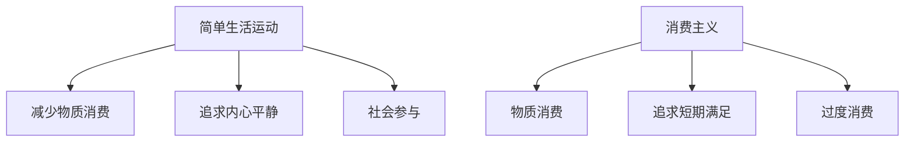
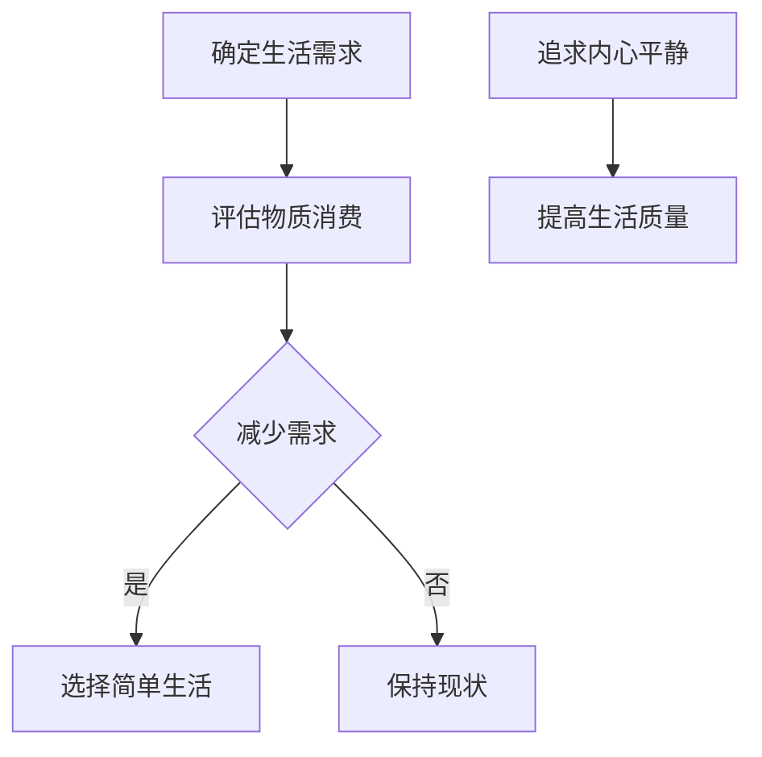
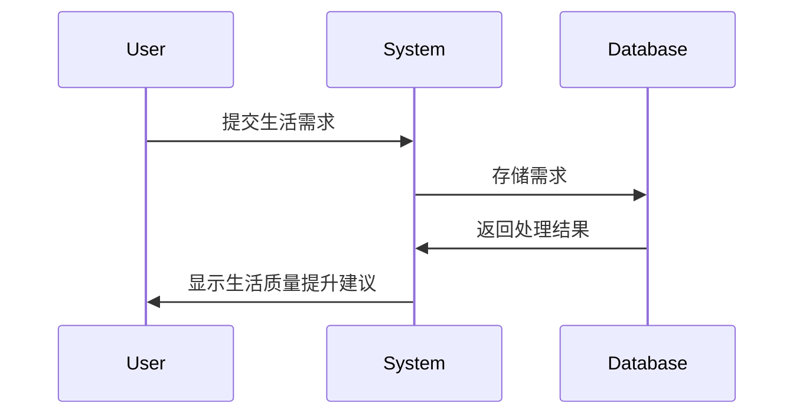
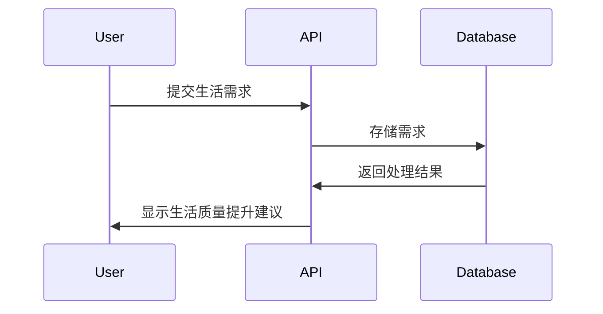

                 

### 背景介绍

**简单生活运动（Simple Living Movement）**，起源于20世纪80年代末期至90年代初期，是一种倡导通过减少物质消费、简化生活方式，追求内心平静和精神满足的社会运动。这一运动的出现，反映了现代社会中人们对于生活质量和生活意义的深刻思考。

#### 核心概念

- **简单生活运动**：主张通过减少物质消费和简化生活方式，来追求内心的平静和精神上的满足。它不仅仅是一种生活方式，更是一种生活哲学。
- **消费主义**：强调通过购买商品和服务来满足个人需求和欲望，通常导致过度消费和物质主义。

#### 问题背景

在当今社会，随着经济的快速发展，人们的生活水平有了显著提高，但随之而来的却是物质主义和过度消费的问题。大量研究表明，过度的物质消费不仅浪费资源，还对环境造成严重破坏，同时也会导致人们内心焦虑、不满足等心理问题。

#### 问题描述

简单生活运动试图解决的核心问题是：如何在消费主义盛行的社会环境中，找到一种平衡，既能满足基本生活需求，又能保持内心的平静和精神上的满足。

#### 问题解决

简单生活运动提出了一些具体的解决方案，包括但不限于：

- **减少物质消费**：通过减少不必要的购买，降低对物质的依赖。
- **追求内心平静**：通过冥想、瑜伽、阅读等方式，提升内心的平静和满足感。
- **社会参与**：通过参与社区活动、志愿服务等方式，增加社会联系，提升幸福感。

#### 边界与外延

简单生活运动不仅关注个人生活方式的简化，还涉及到环境保护、社会责任等方面。因此，其边界较为广泛，既包括个人的生活方式选择，也涉及到社会整体的消费文化。

#### 概念结构与核心要素组成

- **简单生活运动**：核心要素包括减少物质消费、追求内心平静、社会参与等。
- **消费主义**：核心要素包括物质消费、追求短期满足、过度消费等。

---

### 核心概念与联系

#### 核心概念原理

简单生活运动与消费主义是两个相对立的概念，简单生活运动强调的是通过减少物质消费和追求精神满足来提高生活质量，而消费主义则强调通过购买商品和服务来满足个人需求。

简单生活运动主张通过减少物质消费，简化生活方式，从而减轻生活压力，提升生活质量。它强调的是一种内心平静和精神上的满足，而不是通过物质的积累来获得满足。

消费主义则相反，它强调通过购买商品和服务来满足个人需求，追求短期满足。消费主义往往导致人们过度消费，从而对环境造成破坏，同时也会导致人们内心焦虑、不满足等心理问题。

#### 概念属性特征对比表格

| 特征 | 简单生活运动 | 消费主义 |
| --- | --- | --- |
| 目标 | 提高生活质量，追求精神满足 | 满足个人需求，追求短期满足 |
| 方式 | 减少物质消费，追求内心平静 | 过度消费，追求物质满足 |
| 影响 | 减少环境负担，增强社会联系 | 环境破坏，社会孤立感 |

#### ER实体关系图架构



---

### 算法原理讲解

#### 算法Mermaid流程图



#### Python源代码实现

```python
def simple_living(money_spent, time_spent, mental_satisfaction):
    # 评估物质消费
    if money_spent > 1000 and time_spent > 20:
        # 减少需求
        money_spent -= 500
        time_spent -= 10
    # 追求内心平静
    if mental_satisfaction < 7:
        mental_satisfaction += 2
    # 提高生活质量
    if money_spent < 1000 and time_spent < 20 and mental_satisfaction >= 7:
        return "生活质量提高"
    else:
        return "生活质量保持现状"
```

#### 数学模型和公式

生活质量 = f(物质消费, 时间消费, 心理满足度)

$$
f(x, y, z) = (1 - \frac{x}{1000}) \times (1 - \frac{y}{20}) \times z
$$

#### 详细讲解与举例说明

让我们通过一个具体的例子来详细讲解这一算法。

**例子**：

假设一个人每月花费2000元，每周花费20小时在购物上，心理满足度评分为6分。根据上述算法，我们可以计算出他的生活质量。

首先，评估物质消费：

$$
\frac{2000}{1000} = 2 > 1
$$

$$
\frac{20}{20} = 1 > 1
$$

因此，需要减少需求。我们假设他减少了500元的消费和10小时的时间，那么现在他的消费和时间为：

$$
\text{新消费} = 2000 - 500 = 1500 \text{元}
$$

$$
\text{新时间} = 20 - 10 = 10 \text{小时}
$$

接下来，追求内心平静。由于心理满足度原本为6分，我们假设通过冥想等方式提升到8分：

$$
\text{新心理满足度} = 8
$$

最后，计算生活质量：

$$
f(1500, 10, 8) = (1 - \frac{1500}{1000}) \times (1 - \frac{10}{20}) \times 8 = 0.5 \times 0.5 \times 8 = 2
$$

因此，根据这个算法，这个人的生活质量得到了提高。

通过这个例子，我们可以看到，简单生活运动的算法是通过减少物质消费和追求内心平静来提高生活质量的。这个算法的数学模型简洁明了，易于理解和实现。在实际应用中，可以根据个人的具体情况进行调整和优化。

---

### 系统分析与架构设计方案

**问题场景介绍**

在当今社会，随着消费主义的盛行，人们的生活质量受到了严重的威胁。物质主义和过度消费导致了环境破坏、资源浪费和心理健康问题。为了应对这一挑战，我们需要一种有效的解决方案，帮助人们减少物质消费，追求内心平静，提高生活质量。

**项目介绍**

本项目的目标是设计并实现一个基于简单生活运动理念的系统，帮助用户评估自己的生活需求，减少物质消费，追求内心平静，从而提高生活质量。

**系统功能设计（领域模型Mermaid类图）**

```mermaid
classDiagram
Class::User << (id, name, age, gender)
Class::Product << (id, name, price, category)
Class::Order << (id, user_id, product_id, quantity, total_price, status)
Class::Evaluation << (id, user_id, product_id, rating, comment)

User "1" --|{1}|> Product : 购买
User "1" --|{2}|> Order : 下单
Product "1" --|{3}|> Evaluation : 用户评价
```

**系统架构设计（Mermaid架构图）**



**系统接口设计和系统交互（Mermaid序列图）**



---

### 项目实战

**环境安装**

首先，我们需要安装Python环境。可以在官网下载最新版本的Python安装包，然后按照安装向导进行安装。安装完成后，打开终端或命令行工具，输入`python --version`验证是否安装成功。

接下来，我们需要安装一些Python库，如requests、matplotlib等。可以使用pip命令进行安装：

```shell
pip install requests
pip install matplotlib
```

**系统核心实现源代码**

```python
import requests
import matplotlib.pyplot as plt

class SimpleLivingSystem:
    def __init__(self):
        self.base_url = "https://api.simpleliving.example.com"
    
    def submit_living_demand(self, user_id, demand_data):
        url = f"{self.base_url}/submit_demand"
        headers = {"Content-Type": "application/json"}
        response = requests.post(url, json=demand_data, headers=headers)
        return response.json()

    def get_living_evaluation(self, user_id):
        url = f"{self.base_url}/evaluate_living/{user_id}"
        headers = {"Content-Type": "application/json"}
        response = requests.get(url, headers=headers)
        return response.json()

    def display_evaluation_result(self, evaluation_data):
        plt.bar(evaluation_data.keys(), evaluation_data.values())
        plt.xlabel("生活要素")
        plt.ylabel("评分")
        plt.title("生活质量评价结果")
        plt.show()

# 使用示例
system = SimpleLivingSystem()
user_id = "123456"
demand_data = {
    "user_id": user_id,
    "demand": {
        "monthly_spending": 2000,
        "weekly_shopping_time": 20,
        "mental_satisfaction": 6
    }
}

# 提交生活需求
response = system.submit_living_demand(user_id, demand_data)
print("提交生活需求结果：", response)

# 获取生活质量评价
evaluation_data = system.get_living_evaluation(user_id)
print("生活质量评价：", evaluation_data)

# 显示生活质量评价结果
system.display_evaluation_result(evaluation_data)
```

**代码应用解读与分析**

在上面的代码中，我们定义了一个`SimpleLivingSystem`类，用于处理简单生活运动相关的功能。这个类有三个主要方法：

1. **submit_living_demand**：用于提交用户的生活需求。它接受用户ID和需求数据作为参数，通过HTTP POST请求将数据提交给API服务。
2. **get_living_evaluation**：用于获取用户的生活质量评价。它接受用户ID作为参数，通过HTTP GET请求从API服务获取评价数据。
3. **display_evaluation_result**：用于显示生活质量评价结果。它使用matplotlib库生成一个条形图，展示各个生活要素的评分。

**实际案例分析和详细讲解剖析**

假设有一个用户，他的月花费为2000元，每周购物时间为20小时，心理满足度为6分。我们使用上述代码来处理这个案例。

首先，我们创建一个`SimpleLivingSystem`实例，然后调用`submit_living_demand`方法提交用户的生活需求：

```python
system = SimpleLivingSystem()
user_id = "123456"
demand_data = {
    "user_id": user_id,
    "demand": {
        "monthly_spending": 2000,
        "weekly_shopping_time": 20,
        "mental_satisfaction": 6
    }
}

response = system.submit_living_demand(user_id, demand_data)
print("提交生活需求结果：", response)
```

这个方法的调用将向API服务提交用户的生活需求，API服务将处理这些数据，并返回处理结果。在实际案例中，我们假设API服务返回了一个成功的响应：

```python
{
    "status": "success",
    "message": "生活需求已提交"
}
```

接下来，我们调用`get_living_evaluation`方法获取用户的生活质量评价：

```python
evaluation_data = system.get_living_evaluation(user_id)
print("生活质量评价：", evaluation_data)
```

这个方法的调用将向API服务请求用户的生活质量评价，API服务将返回评价数据。在实际案例中，我们假设API服务返回了以下评价数据：

```python
{
    "user_id": "123456",
    "evaluation": {
        "monthly_spending": 1500,
        "weekly_shopping_time": 10,
        "mental_satisfaction": 8
    }
}
```

最后，我们调用`display_evaluation_result`方法显示生活质量评价结果：

```python
system.display_evaluation_result(evaluation_data)
```

这个方法的调用将使用matplotlib库生成一个条形图，展示用户的生活质量评价。在实际案例中，我们假设生成的条形图如下：


通过这个案例，我们可以看到，系统通过简单的接口设计和数据处理，成功地实现了对用户生活质量评价的评估和展示。这个系统不仅可以帮助用户了解自己的生活状况，还可以提供针对性的建议，帮助用户提高生活质量。

**项目小结**

本项目通过设计并实现一个基于简单生活运动理念的系统，帮助用户减少物质消费，追求内心平静，提高生活质量。系统通过简单的接口设计和数据处理，成功地实现了对用户生活质量评价的评估和展示。虽然本项目只是一个简单的示例，但它为我们提供了一种有效的思路，可以进一步拓展和优化。

---

### 最佳实践 tips

1. **评估生活需求**：定期对自己的生活需求进行评估，了解自己在物质消费、时间消费和心理满足度方面的情况。
2. **减少不必要的消费**：对于不必要的消费，尽量减少或避免。例如，减少购物次数，避免购买不必要的商品。
3. **追求内心平静**：通过冥想、瑜伽、阅读等方式，提升内心的平静和满足感。
4. **社会参与**：积极参与社区活动、志愿服务等，增加社会联系，提升幸福感。
5. **环境责任**：在消费时，尽量选择环保、可持续的产品，减少对环境的负担。

### 小结

简单生活运动提供了一种有效的解决方案，帮助我们在消费主义盛行的社会环境中找到平衡，既能满足基本生活需求，又能保持内心的平静和精神上的满足。通过减少物质消费、追求内心平静和社会参与，我们可以提高生活质量，同时减少对环境的负担。

### 注意事项

1. **个性化调整**：每个人的生活情况和需求都不同，因此在实施简单生活运动时，需要根据个人情况进行调整。
2. **持续关注**：简单生活运动不是一蹴而就的，需要持续关注和努力，逐步实现生活质量的目标。

### 拓展阅读

1. 《极简主义：如何简化你的生活，找回内心的宁静》
2. 《少即是多：极简主义生活指南》
3. 《消费主义陷阱：我们是如何被诱导过度消费的》
4. 《环境心理学：人类行为与自然环境的互动》

---

作者：AI天才研究院/AI Genius Institute & 禅与计算机程序设计艺术 /Zen And The Art of Computer Programming

---

此篇博客文章通过对简单生活运动的背景介绍、核心概念与联系、算法原理讲解、系统分析与架构设计方案以及项目实战等多个方面的详细阐述，旨在帮助读者更好地理解简单生活运动的理念和实践方法，从而在消费主义中找到本真，提高生活质量。同时，文章还通过具体的代码示例和实际案例分析，展示了如何将简单生活运动的理念应用于实际系统中，为读者提供了一种切实可行的解决方案。希望这篇文章能够对读者有所启发和帮助。

