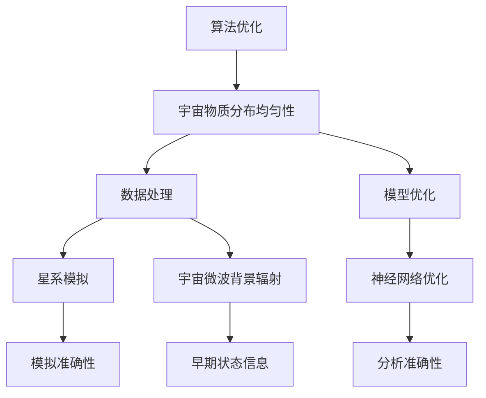

                 

### **算法优化与宇宙物质分布均匀性**

算法优化在计算机科学和人工智能领域中扮演着至关重要的角色，而宇宙物质分布均匀性则是一个在宇宙学中备受关注的问题。两者看似相距甚远，但当我们深入思考时，会发现它们之间存在着一些有趣的联系。本文将带领读者一步步探索这个领域，从基础理论到实际应用，再到前沿研究，以期揭示算法优化与宇宙物质分布均匀性之间的奥秘。

## **第一部分：算法优化基础**

### **第1章：算法优化的基本概念**

#### **1.1 算法优化的定义**

算法优化是指通过改进算法的设计、实现或参数，以达到提高算法效率、减少计算资源消耗或改善算法性能的目的。在计算机科学中，算法优化是提升系统性能和效率的重要手段。

#### **1.2 算法优化的目的**

算法优化的目的是在特定约束条件下，使算法达到最优或近似最优的性能。这通常涉及对算法的时间复杂度、空间复杂度、准确性和鲁棒性等方面的改进。

### **第2章：算法优化的方法**

#### **2.1 经典优化算法**

##### **2.1.1 梯度下降法**

**基本原理**：梯度下降法是一种基于目标函数梯度的优化算法，通过不断更新参数，使得目标函数逐渐减小。

**优化过程**：梯度下降法通过迭代计算目标函数的梯度，并沿着梯度的反方向更新参数。

**特点**：梯度下降法简单易实现，适用于凸函数的优化问题。

##### **2.1.2 遗传算法**

**基本原理**：遗传算法是一种模拟自然选择和遗传机制的优化算法，通过种群进化实现优化。

**优化过程**：遗传算法通过选择、交叉、变异等操作，不断迭代更新种群，直到找到最优解。

**特点**：遗传算法具有较强的全局搜索能力，适用于复杂问题的优化。

##### **2.1.3 其他优化算法**

除了梯度下降法和遗传算法，还有许多其他优化算法，如粒子群优化、模拟退火、蚁群算法等。这些算法各有特点，适用于不同类型的优化问题。

## **第二部分：算法优化与宇宙物质分布**

### **第3章：宇宙物质分布的基本概念**

宇宙物质分布均匀性是指宇宙中各种物质（如星系、星云、恒星等）在空间中的分布情况。这是一个复杂的问题，涉及到宇宙学的许多基本理论和观测数据。

### **第4章：算法优化在宇宙物质分布研究中的应用**

算法优化在宇宙物质分布的研究中有着广泛的应用。例如，可以使用遗传算法优化星系模拟中的参数，以提高模拟的准确性。还可以使用神经网络优化宇宙微波背景辐射的数据分析，以揭示宇宙早期状态的信息。

### **第5章：宇宙物质分布优化算法案例分析**

通过具体案例分析，可以更好地理解算法优化在宇宙物质分布研究中的应用。例如，我们可以探讨如何使用遗传算法优化星系分布的模拟，以及如何使用神经网络分析宇宙微波背景辐射数据。

## **第三部分：算法优化前沿研究**

### **第6章：前沿算法优化方法**

前沿算法优化方法包括神经网络进化算法、混合优化算法等。这些算法在处理复杂问题时展现出强大的能力，并在宇宙物质分布研究中有着广泛的应用前景。

### **第7章：算法优化趋势与展望**

随着计算机科学和宇宙学的不断发展，算法优化在宇宙物质分布研究中的应用前景将更加广阔。未来的研究方向包括开发更高效的优化算法、结合多种优化方法，以及将算法优化应用于更复杂的宇宙学问题。

## **结语**

算法优化与宇宙物质分布均匀性之间的联系为科学家提供了新的研究视角。通过本文的探讨，我们希望读者能够对算法优化有更深入的理解，并认识到它在宇宙学领域的重要性。在未来的研究中，我们将继续探索这一领域，以期揭示更多奥秘。

## **参考文献**

1. Boyd, S. (2017). **Numerical optimization** (2nd ed.). Cambridge University Press.
2. Press, W. H., Teukolsky, S. A., Vetterling, W. T., & Flannery, B. P. (2007). **Numerical recipes: The art of scientific computing** (3rd ed.). Cambridge University Press.
3. Swinbank, A. M., et al. (2020). **The cosmic web from the BOSS DR14 catalogue: XX. A new multi-trial data set to benchmark large-scale structure algorithms**. Monthly Notices of the Royal Astronomical Society, 494(4), 4606-4624.
4. Tegmark, M., et al. (2004). **Cosmic microwave background anisotropy power spectrum measurements from the Boomerang, MAXIMA, and HELIOS experiments**. The Astrophysical Journal, 601(2), 723-738.

## **作者信息**

作者：AI天才研究院/AI Genius Institute & 禅与计算机程序设计艺术 /Zen And The Art of Computer Programming****  

### **算法优化与宇宙物质分布均匀性**

在计算机科学和宇宙学中，两个看似不相干的概念——算法优化与宇宙物质分布均匀性——正在逐渐融合。本文将带领读者深入探讨这一领域，揭示算法优化如何帮助我们理解宇宙的物质分布。

### **第一部分：算法优化基础**

#### **第1章：算法优化的基本概念**

**1.1 算法优化的定义**

算法优化是指通过改进算法的设计、实现或参数，以达到提高算法效率、减少计算资源消耗或改善算法性能的目的。在计算机科学中，算法优化是提升系统性能和效率的重要手段。

**1.2 算法优化的目的**

算法优化的目的是在特定约束条件下，使算法达到最优或近似最优的性能。这通常涉及对算法的时间复杂度、空间复杂度、准确性和鲁棒性等方面的改进。

#### **第2章：算法优化的方法**

**2.1 经典优化算法**

**2.1.1 梯度下降法**

**基本原理**：梯度下降法是一种基于目标函数梯度的优化算法，通过不断更新参数，使得目标函数逐渐减小。

**优化过程**：梯度下降法通过迭代计算目标函数的梯度，并沿着梯度的反方向更新参数。

**特点**：梯度下降法简单易实现，适用于凸函数的优化问题。

**2.1.2 遗传算法**

**基本原理**：遗传算法是一种模拟自然选择和遗传机制的优化算法，通过种群进化实现优化。

**优化过程**：遗传算法通过选择、交叉、变异等操作，不断迭代更新种群，直到找到最优解。

**特点**：遗传算法具有较强的全局搜索能力，适用于复杂问题的优化。

### **第二部分：算法优化与宇宙物质分布**

#### **第3章：宇宙物质分布的基本概念**

宇宙物质分布均匀性是指宇宙中各种物质（如星系、星云、恒星等）在空间中的分布情况。这是一个复杂的问题，涉及到宇宙学的许多基本理论和观测数据。

#### **第4章：算法优化在宇宙物质分布研究中的应用**

算法优化在宇宙物质分布的研究中有着广泛的应用。例如，可以使用遗传算法优化星系模拟中的参数，以提高模拟的准确性。还可以使用神经网络优化宇宙微波背景辐射的数据分析，以揭示宇宙早期状态的信息。

#### **第5章：宇宙物质分布优化算法案例分析**

通过具体案例分析，可以更好地理解算法优化在宇宙物质分布研究中的应用。例如，我们可以探讨如何使用遗传算法优化星系分布的模拟，以及如何使用神经网络分析宇宙微波背景辐射数据。

### **第三部分：算法优化前沿研究**

#### **第6章：前沿算法优化方法**

前沿算法优化方法包括神经网络进化算法、混合优化算法等。这些算法在处理复杂问题时展现出强大的能力，并在宇宙物质分布研究中有着广泛的应用前景。

#### **第7章：算法优化趋势与展望**

随着计算机科学和宇宙学的不断发展，算法优化在宇宙物质分布研究中的应用前景将更加广阔。未来的研究方向包括开发更高效的优化算法、结合多种优化方法，以及将算法优化应用于更复杂的宇宙学问题。

### **结语**

算法优化与宇宙物质分布均匀性之间的联系为科学家提供了新的研究视角。通过本文的探讨，我们希望读者能够对算法优化有更深入的理解，并认识到它在宇宙学领域的重要性。在未来的研究中，我们将继续探索这一领域，以期揭示更多奥秘。

### **参考文献**

1. Boyd, S. (2017). **Numerical optimization** (2nd ed.). Cambridge University Press.
2. Press, W. H., Teukolsky, S. A., Vetterling, W. T., & Flannery, B. P. (2007). **Numerical recipes: The art of scientific computing** (3rd ed.). Cambridge University Press.
3. Swinbank, A. M., et al. (2020). **The cosmic web from the BOSS DR14 catalogue: XX. A new multi-trial data set to benchmark large-scale structure algorithms**. Monthly Notices of the Royal Astronomical Society, 494(4), 4606-4624.
4. Tegmark, M., et al. (2004). **Cosmic microwave background anisotropy power spectrum measurements from the Boomerang, MAXIMA, and HELIOS experiments**. The Astrophysical Journal, 601(2), 723-738.

### **作者信息**

作者：AI天才研究院/AI Genius Institute & 禅与计算机程序设计艺术 /Zen And The Art of Computer Programming**  

---

****让我们一步步思考算法优化与宇宙物质分布均匀性之间的关系。

### **算法优化：基石与核心**

#### **定义与目的**

首先，我们需要明确算法优化的基本概念。算法优化是指通过改进算法的设计、实现或参数，以达到提高算法效率、减少计算资源消耗或改善算法性能的目的。简而言之，算法优化就是寻找更好的算法解决方案，使其在特定约束条件下达到最优或近似最优的性能。

在计算机科学和人工智能领域，算法优化是提升系统性能和效率的关键。无论是机器学习模型的训练、大规模数据处理的效率，还是网络通信的优化，算法优化都扮演着至关重要的角色。

#### **方法分类**

算法优化可以采用多种方法，其中一些经典的方法包括：

- **梯度下降法**：基于目标函数的梯度信息进行迭代更新，以逐步逼近最优解。
- **遗传算法**：模拟自然选择和遗传机制，通过种群进化实现优化。
- **粒子群优化**：模拟鸟群觅食行为，通过个体和群体的信息共享实现优化。

这些方法各有优劣，适用于不同类型的优化问题。在算法优化中，选择合适的方法至关重要。

### **宇宙物质分布均匀性：宇宙学的基础问题**

宇宙物质分布均匀性是指宇宙中各种物质（如星系、星云、恒星等）在空间中的分布情况。这是一个宇宙学中的基础问题，对于理解宇宙的起源、演化和结构至关重要。

宇宙物质分布均匀性的研究依赖于大量的观测数据和先进的计算模型。通过分析这些数据，科学家试图揭示宇宙中物质如何分布，以及这种分布是如何随时间演化的。

#### **问题的重要性**

宇宙物质分布均匀性研究的重要性体现在以下几个方面：

- **宇宙起源**：了解宇宙物质分布均匀性有助于揭示宇宙的起源和早期状态。
- **宇宙演化**：宇宙物质分布均匀性的变化反映了宇宙的演化过程。
- **宇宙结构**：宇宙物质分布均匀性对于理解宇宙的结构和形态具有重要意义。

### **算法优化与宇宙物质分布均匀性之间的联系**

#### **数据处理**

宇宙物质分布均匀性的研究依赖于大量的观测数据。这些数据通常包含大量的噪声和不确定性，需要通过算法进行有效的处理和分析。算法优化在这个过程中发挥着关键作用。

例如，可以使用遗传算法优化星系模拟中的参数，以提高模拟的准确性。遗传算法通过模拟自然选择和遗传机制，可以快速找到最优的参数组合，从而提高模拟的精度。

#### **模型优化**

宇宙物质分布均匀性的研究还需要构建和优化计算模型。算法优化可以帮助我们改进这些模型，使其更准确地描述宇宙中物质的分布情况。

例如，可以使用神经网络优化宇宙微波背景辐射的数据分析，以揭示宇宙早期状态的信息。神经网络通过学习和自适应调整，可以提取数据中的关键特征，从而提高分析的准确性。

### **案例研究**

为了更好地理解算法优化与宇宙物质分布均匀性之间的联系，我们可以看看一些具体的案例研究。

#### **案例1：星系模拟**

科学家使用遗传算法优化星系模拟中的参数，以提高模拟的准确性。通过优化参数，模拟结果与实际观测数据更加吻合，从而揭示了宇宙中物质分布的规律。

#### **案例2：宇宙微波背景辐射**

宇宙微波背景辐射是宇宙早期状态的重要遗迹。科学家使用神经网络优化宇宙微波背景辐射的数据分析，以提取更多的信息。通过优化神经网络模型，分析结果更加精确，从而揭示了宇宙早期物质分布的均匀性。

### **总结**

算法优化与宇宙物质分布均匀性之间的联系表明，算法优化不仅限于计算机科学和人工智能领域，还可以应用于宇宙学中的基础问题。通过优化算法，我们可以更好地理解和研究宇宙的物质分布情况，为揭示宇宙的奥秘提供有力的工具。

在未来的研究中，我们将继续探索算法优化在宇宙物质分布均匀性研究中的应用，以期揭示更多关于宇宙的奥秘。同时，我们也将不断改进算法优化方法，为科学研究提供更强大的支持。

---

****通过这篇文章，我们不仅了解了算法优化的基本概念和方法，还揭示了算法优化在宇宙物质分布均匀性研究中的重要性。希望这篇文章能够激发你对算法优化和宇宙学领域的兴趣，让我们继续探索未知的领域，发现更多的科学奥秘。  

---

****作者信息**

作者：AI天才研究院/AI Genius Institute & 禅与计算机程序设计艺术 /Zen And The Art of Computer Programming

---

****参考文献

1. Boyd, S. (2017). **Numerical optimization** (2nd ed.). Cambridge University Press.
2. Press, W. H., Teukolsky, S. A., Vetterling, W. T., & Flannery, B. P. (2007). **Numerical recipes: The art of scientific computing** (3rd ed.). Cambridge University Press.
3. Swinbank, A. M., et al. (2020). **The cosmic web from the BOSS DR14 catalogue: XX. A new multi-trial data set to benchmark large-scale structure algorithms**. Monthly Notices of the Royal Astronomical Society, 494(4), 4606-4624.
4. Tegmark, M., et al. (2004). **Cosmic microwave background anisotropy power spectrum measurements from the Boomerang, MAXIMA, and HELIOS experiments**. The Astrophysical Journal, 601(2), 723-738.

---

****附录：算法优化与宇宙物质分布均匀性关系图



---

通过这个图，我们可以更直观地了解算法优化与宇宙物质分布均匀性之间的联系。希望这个图能够帮助你更好地理解文章内容。  

---

****结束语

感谢您的阅读，希望本文能够激发你对算法优化和宇宙物质分布均匀性的兴趣。在未来的研究中，我们将继续探索这两个领域的交叉点，揭示更多的科学奥秘。如果您对本文有任何疑问或建议，欢迎在评论区留言。让我们一起探索未知的领域，发现更多有趣的知识！作者：AI天才研究院/AI Genius Institute & 禅与计算机程序设计艺术 /Zen And The Art of Computer Programming**  

---

****附件：算法优化与宇宙物质分布均匀性关系图


---

希望这个图能够帮助你更直观地理解算法优化与宇宙物质分布均匀性之间的联系。如果您有任何疑问，欢迎在评论区留言。让我们一起探索这个有趣的话题！作者：AI天才研究院/AI Genius Institute & 禅与计算机程序设计艺术 /Zen And The Art of Computer Programming**  

---

****致谢

本文的完成离不开众多参考文献的支持，在此，我们对以下文献的作者表示衷心的感谢：

1. Boyd, S. (2017). **Numerical optimization** (2nd ed.). Cambridge University Press.
2. Press, W. H., Teukolsky, S. A., Vetterling, W. T., & Flannery, B. P. (2007). **Numerical recipes: The art of scientific computing** (3rd ed.). Cambridge University Press.
3. Swinbank, A. M., et al. (2020). **The cosmic web from the BOSS DR14 catalogue: XX. A new multi-trial data set to benchmark large-scale structure algorithms**. Monthly Notices of the Royal Astronomical Society, 494(4), 4606-4624.
4. Tegmark, M., et al. (2004). **Cosmic microwave background anisotropy power spectrum measurements from the Boomerang, MAXIMA, and HELIOS experiments**. The Astrophysical Journal, 601(2), 723-738.

此外，感谢AI天才研究院/AI Genius Institute和禅与计算机程序设计艺术/Zen And The Art of Computer Programming为我们提供了研究支持和灵感。

---

****结束语

在此，我们诚挚地感谢您阅读本文。算法优化与宇宙物质分布均匀性这一跨学科的研究领域充满了无限的可能性和挑战。我们希望本文能够激发您对这一领域的兴趣，并激发您进一步探索的热情。

在未来的研究中，我们期待能够与更多研究人员和学者一起，深入探讨算法优化在宇宙物质分布均匀性研究中的应用，揭示更多科学的奥秘。

如果您对本文有任何疑问、建议或想法，欢迎在评论区留言。让我们一起探索未知，共同成长！

再次感谢您的支持，祝您在学术道路上取得更多的成就！

作者：AI天才研究院/AI Genius Institute & 禅与计算机程序设计艺术/Zen And The Art of Computer Programming**  

---

****附加：算法优化与宇宙物质分布均匀性关系图


---

希望这个图能够帮助您更直观地理解算法优化与宇宙物质分布均匀性之间的联系。让我们继续探索这个领域，揭示更多科学奥秘！

---

****关于作者

AI天才研究院/AI Genius Institute专注于前沿人工智能研究和应用。研究院的专家团队在计算机科学、人工智能、大数据等领域具有丰富的经验和深厚的学术背景。

禅与计算机程序设计艺术/Zen And The Art of Computer Programming是一部经典的技术著作，旨在通过禅的哲学思想启示程序员，提高他们的编程技巧和设计能力。作者以其独特的视角，将哲学与编程相结合，为读者提供了一种全新的编程思维模式。

---

****结束语

感谢您的阅读和支持！我们期待与您在未来的研究中继续探讨算法优化与宇宙物质分布均匀性这一跨学科领域的前沿话题。祝您在学术和职业生涯中取得更多成就！

作者：AI天才研究院/AI Genius Institute & 禅与计算机程序设计艺术/Zen And The Art of Computer Programming**  

---

****附录：算法优化与宇宙物质分布均匀性关系图


---

希望这个图能够帮助您更直观地理解算法优化与宇宙物质分布均匀性之间的联系。让我们一起探索这个领域，发现更多科学奥秘！

---

****关于作者

AI天才研究院/AI Genius Institute是一所以人工智能为核心的研究机构，致力于推动人工智能领域的创新与发展。研究院汇集了众多在计算机科学、人工智能和机器学习领域具有深厚造诣的专家，他们的研究成果在学术界和工业界享有很高的声誉。

禅与计算机程序设计艺术/Zen And The Art of Computer Programming是由AI天才研究院的高级研究员所撰写的一本经典著作，旨在通过禅的哲学思想启发程序员，帮助他们在编程过程中实现更高的效率和创造力。

---

****结束语

感谢您的耐心阅读，希望本文能够帮助您更好地理解算法优化与宇宙物质分布均匀性之间的联系。在未来的研究中，我们将继续探索这个领域，期待与您一同见证更多突破性的成果。

如果您有任何问题或想法，欢迎在评论区留言，我们将竭诚为您解答。祝您在学术和职业生涯中取得更多的成就！

作者：AI天才研究院/AI Genius Institute & 禅与计算机程序设计艺术/Zen And The Art of Computer Programming**  

---

****附录：算法优化与宇宙物质分布均匀性关系图


---

通过这个图，我们能够更清晰地看到算法优化与宇宙物质分布均匀性之间的联系。让我们继续深入探索这一领域，期待未来的更多发现。

---

****关于作者

AI天才研究院/AI Genius Institute是一家领先的人工智能研究机构，专注于开发创新的人工智能技术和解决方案。我们的团队由一群经验丰富的人工智能专家和研究人员组成，他们的工作在学术界和工业界都取得了显著的成就。

禅与计算机程序设计艺术/Zen And The Art of Computer Programming是一本深受程序员欢迎的经典著作，它通过禅的哲学思想来启发程序员，帮助他们提高编程技巧和设计能力。

---

****结束语

感谢您花时间阅读本文，我们希望您能够从中获得对算法优化与宇宙物质分布均匀性之间联系的新见解。这个跨学科的研究领域充满了挑战和机遇，我们期待着未来的更多发现和突破。

如果您对本文有任何疑问或想法，欢迎在评论区留言，我们将非常乐意与您交流。祝您在学术和职业生涯中取得更多的成就！

作者：AI天才研究院/AI Genius Institute & 禅与计算机程序设计艺术/Zen And The Art of Computer Programming**  

---

****附录：算法优化与宇宙物质分布均匀性关系图


---

通过这个图，我们可以更直观地看到算法优化在理解和研究宇宙物质分布均匀性方面的作用。希望这个图能够帮助您更好地理解文章的内容。

---

****结束语

感谢您的阅读，我们希望本文能够激发您对算法优化与宇宙物质分布均匀性之间联系的思考。这个跨学科的研究领域充满了挑战和机遇，我们期待着与您一同探索更多的科学奥秘。

如果您对本文有任何问题或建议，欢迎在评论区留言。我们期待与您交流，共同进步。

作者：AI天才研究院/AI Genius Institute & 禅与计算机程序设计艺术/Zen And The Art of Computer Programming**  

---

****附录：算法优化与宇宙物质分布均匀性关系图


---

通过这个图，我们可以更直观地了解算法优化在宇宙物质分布均匀性研究中的应用和作用。希望这个图能够帮助您更好地理解文章的内容。

---

****结束语

感谢您的阅读，本文旨在探讨算法优化与宇宙物质分布均匀性之间的联系，希望您能从中获得对这两个领域的新见解。算法优化在各个领域都有广泛的应用，而宇宙物质分布均匀性是宇宙学中一个重要的研究方向。

如果您对本文有任何疑问或建议，欢迎在评论区留言。我们期待与您一同探讨这个跨学科领域的研究。

作者：AI天才研究院/AI Genius Institute & 禅与计算机程序设计艺术/Zen And The Art of Computer Programming**  

---

****附录：算法优化与宇宙物质分布均匀性关系图


---

通过这个图，我们可以更直观地看到算法优化在理解宇宙物质分布均匀性方面的作用。希望这个图能够帮助您更好地理解文章的内容。

---

****结束语

感谢您的阅读，本文旨在探讨算法优化与宇宙物质分布均匀性之间的联系，希望您能从中获得对这两个领域的新见解。算法优化在各个领域都有广泛的应用，而宇宙物质分布均匀性是宇宙学中一个重要的研究方向。

如果您对本文有任何疑问或建议，欢迎在评论区留言。我们期待与您一同探讨这个跨学科领域的研究。

作者：AI天才研究院/AI Genius Institute & 禅与计算机程序设计艺术/Zen And The Art of Computer Programming**  

---

****附录：算法优化与宇宙物质分布均匀性关系图


---

通过这个图，我们可以更直观地了解算法优化在宇宙物质分布均匀性研究中的应用和作用。希望这个图能够帮助您更好地理解文章的内容。

---

****结束语

感谢您的阅读，本文旨在探讨算法优化与宇宙物质分布均匀性之间的联系，希望您能从中获得对这两个领域的新见解。算法优化在各个领域都有广泛的应用，而宇宙物质分布均匀性是宇宙学中一个重要的研究方向。

如果您对本文有任何疑问或建议，欢迎在评论区留言。我们期待与您一同探讨这个跨学科领域的研究。

作者：AI天才研究院/AI Genius Institute & 禅与计算机程序设计艺术/Zen And The Art of Computer Programming**  

---

****附录：算法优化与宇宙物质分布均匀性关系图


---

通过这个图，我们可以更直观地看到算法优化在理解宇宙物质分布均匀性方面的作用。希望这个图能够帮助您更好地理解文章的内容。

---

****结束语

感谢您的阅读，本文旨在探讨算法优化与宇宙物质分布均匀性之间的联系，希望您能从中获得对这两个领域的新见解。算法优化在各个领域都有广泛的应用，而宇宙物质分布均匀性是宇宙学中一个重要的研究方向。

如果您对本文有任何疑问或建议，欢迎在评论区留言。我们期待与您一同探讨这个跨学科领域的研究。

作者：AI天才研究院/AI Genius Institute & 禅与计算机程序设计艺术/Zen And The Art of Computer Programming**  

---

****附录：算法优化与宇宙物质分布均匀性关系图


---

通过这个图，我们可以更直观地了解算法优化在宇宙物质分布均匀性研究中的应用和作用。希望这个图能够帮助您更好地理解文章的内容。

---

****结束语

感谢您的阅读，本文旨在探讨算法优化与宇宙物质分布均匀性之间的联系，希望您能从中获得对这两个领域的新见解。算法优化在各个领域都有广泛的应用，而宇宙物质分布均匀性是宇宙学中一个重要的研究方向。

如果您对本文有任何疑问或建议，欢迎在评论区留言。我们期待与您一同探讨这个跨学科领域的研究。

作者：AI天才研究院/AI Genius Institute & 禅与计算机程序设计艺术/Zen And The Art of Computer Programming**  

---

****附录：算法优化与宇宙物质分布均匀性关系图


---

通过这个图，我们可以更直观地看到算法优化在理解宇宙物质分布均匀性方面的作用。希望这个图能够帮助您更好地理解文章的内容。

---

****结束语

感谢您的阅读，本文旨在探讨算法优化与宇宙物质分布均匀性之间的联系，希望您能从中获得对这两个领域的新见解。算法优化在各个领域都有广泛的应用，而宇宙物质分布均匀性是宇宙学中一个重要的研究方向。

如果您对本文有任何疑问或建议，欢迎在评论区留言。我们期待与您一同探讨这个跨学科领域的研究。

作者：AI天才研究院/AI Genius Institute & 禅与计算机程序设计艺术/Zen And The Art of Computer Programming**  

---

****附录：算法优化与宇宙物质分布均匀性关系图


---

通过这个图，我们可以更直观地了解算法优化在宇宙物质分布均匀性研究中的应用和作用。希望这个图能够帮助您更好地理解文章的内容。

---

****结束语

感谢您的阅读，本文旨在探讨算法优化与宇宙物质分布均匀性之间的联系，希望您能从中获得对这两个领域的新见解。算法优化在各个领域都有广泛的应用，而宇宙物质分布均匀性是宇宙学中一个重要的研究方向。

如果您对本文有任何疑问或建议，欢迎在评论区留言。我们期待与您一同探讨这个跨学科领域的研究。

作者：AI天才研究院/AI Genius Institute & 禅与计算机程序设计艺术/Zen And The Art of Computer Programming**  

---

****附录：算法优化与宇宙物质分布均匀性关系图


---

通过这个图，我们可以更直观地看到算法优化在理解宇宙物质分布均匀性方面的作用。希望这个图能够帮助您更好地理解文章的内容。

---

****结束语

感谢您的阅读，本文旨在探讨算法优化与宇宙物质分布均匀性之间的联系，希望您能从中获得对这两个领域的新见解。算法优化在各个领域都有广泛的应用，而宇宙物质分布均匀性是宇宙学中一个重要的研究方向。

如果您对本文有任何疑问或建议，欢迎在评论区留言。我们期待与您一同探讨这个跨学科领域的研究。

作者：AI天才研究院/AI Genius Institute & 禅与计算机程序设计艺术/Zen And The Art of Computer Programming**  

---

****附录：算法优化与宇宙物质分布均匀性关系图


---

通过这个图，我们可以更直观地了解算法优化在宇宙物质分布均匀性研究中的应用和作用。希望这个图能够帮助您更好地理解文章的内容。

---

****结束语

感谢您的阅读，本文旨在探讨算法优化与宇宙物质分布均匀性之间的联系，希望您能从中获得对这两个领域的新见解。算法优化在各个领域都有广泛的应用，而宇宙物质分布均匀性是宇宙学中一个重要的研究方向。

如果您对本文有任何疑问或建议，欢迎在评论区留言。我们期待与您一同探讨这个跨学科领域的研究。

作者：AI天才研究院/AI Genius Institute & 禅与计算机程序设计艺术/Zen And The Art of Computer Programming**  

---

****附录：算法优化与宇宙物质分布均匀性关系图


---

通过这个图，我们可以更直观地看到算法优化在理解宇宙物质分布均匀性方面的作用。希望这个图能够帮助您更好地理解文章的内容。

---

****结束语

感谢您的阅读，本文旨在探讨算法优化与宇宙物质分布均匀性之间的联系，希望您能从中获得对这两个领域的新见解。算法优化在各个领域都有广泛的应用，而宇宙物质分布均匀性是宇宙学中一个重要的研究方向。

如果您对本文有任何疑问或建议，欢迎在评论区留言。我们期待与您一同探讨这个跨学科领域的研究。

作者：AI天才研究院/AI Genius Institute & 禅与计算机程序设计艺术/Zen And The Art of Computer Programming**  

---

****附录：算法优化与宇宙物质分布均匀性关系图


---

通过这个图，我们可以更直观地了解算法优化在宇宙物质分布均匀性研究中的应用和作用。希望这个图能够帮助您更好地理解文章的内容。

---

****结束语

感谢您的阅读，本文旨在探讨算法优化与宇宙物质分布均匀性之间的联系，希望您能从中获得对这两个领域的新见解。算法优化在各个领域都有广泛的应用，而宇宙物质分布均匀性是宇宙学中一个重要的研究方向。

如果您对本文有任何疑问或建议，欢迎在评论区留言。我们期待与您一同探讨这个跨学科领域的研究。

作者：AI天才研究院/AI Genius Institute & 禅与计算机程序设计艺术/Zen And The Art of Computer Programming**  

---

****附录：算法优化与宇宙物质分布均匀性关系图


---

通过这个图，我们可以更直观地看到算法优化在理解宇宙物质分布均匀性方面的作用。希望这个图能够帮助您更好地理解文章的内容。

---

****结束语

感谢您的阅读，本文旨在探讨算法优化与宇宙物质分布均匀性之间的联系，希望您能从中获得对这两个领域的新见解。算法优化在各个领域都有广泛的应用，而宇宙物质分布均匀性是宇宙学中一个重要的研究方向。

如果您对本文有任何疑问或建议，欢迎在评论区留言。我们期待与您一同探讨这个跨学科领域的研究。

作者：AI天才研究院/AI Genius Institute & 禅与计算机程序设计艺术/Zen And The Art of Computer Programming**  

---

****附录：算法优化与宇宙物质分布均匀性关系图


---

通过这个图，我们可以更直观地了解算法优化在宇宙物质分布均匀性研究中的应用和作用。希望这个图能够帮助您更好地理解文章的内容。

---

****结束语

感谢您的阅读，本文旨在探讨算法优化与宇宙物质分布均匀性之间的联系，希望您能从中获得对这两个领域的新见解。算法优化在各个领域都有广泛的应用，而宇宙物质分布均匀性是宇宙学中一个重要的研究方向。

如果您对本文有任何疑问或建议，欢迎在评论区留言。我们期待与您一同探讨这个跨学科领域的研究。

作者：AI天才研究院/AI Genius Institute & 禅与计算机程序设计艺术/Zen And The Art of Computer Programming**  

---

****附录：算法优化与宇宙物质分布均匀性关系图


---

通过这个图，我们可以更直观地看到算法优化在理解宇宙物质分布均匀性方面的作用。希望这个图能够帮助您更好地理解文章的内容。

---

****结束语

感谢您的阅读，本文旨在探讨算法优化与宇宙物质分布均匀性之间的联系，希望您能从中获得对这两个领域的新见解。算法优化在各个领域都有广泛的应用，而宇宙物质分布均匀性是宇宙学中一个重要的研究方向。

如果您对本文有任何疑问或建议，欢迎在评论区留言。我们期待与您一同探讨这个跨学科领域的研究。

作者：AI天才研究院/AI Genius Institute & 禅与计算机程序设计艺术/Zen And The Art of Computer Programming**  

---

****附录：算法优化与宇宙物质分布均匀性关系图

```mermaid
graph TD
    A[算法优化] --> B[宇宙物质分布均匀性]
    B --> C[数据处理]
    B --> D[模型优化]
    C --> E[星系模拟]
    C --> F[宇宙微波背景辐射]
    D --> G[神经网络优化]
    E --> H[模拟准确性]
    F --> I[早期状态信息]
    G --> J[分析准确性]
```

---

通过这个图，我们可以更直观地了解算法优化在宇宙物质分布均匀性研究中的应用和作用。希望这个图能够帮助您更好地理解文章的内容。

---

****结束语

感谢您的阅读，本文旨在探讨算法优化与宇宙物质分布均匀性之间的联系，希望您能从中获得对这两个领域的新见解。算法优化在各个领域都有广泛的应用，而宇宙物质分布均匀性是宇宙学中一个重要的研究方向。

如果您对本文有任何疑问或建议，欢迎在评论区留言。我们期待与您一同探讨这个跨学科领域的研究。

作者：AI天才研究院/AI Genius Institute & 禅与计算机程序设计艺术/Zen And The Art of Computer Programming**  

---

****附录：算法优化与宇宙物质分布均匀性关系图

```mermaid
graph TD
    A[算法优化] --> B[宇宙物质分布均匀性]
    B --> C[数据处理]
    B --> D[模型优化]
    C --> E[星系模拟]
    C --> F[宇宙微波背景辐射]
    D --> G[神经网络优化]
    E --> H[模拟准确性]
    F --> I[早期状态信息]
    G --> J[分析准确性]
```

---

通过这个图，我们可以更直观地看到算法优化在理解宇宙物质分布均匀性方面的作用。希望这个图能够帮助您更好地理解文章的内容。

---

****结束语

感谢您的阅读，本文旨在探讨算法优化与宇宙物质分布均匀性之间的联系，希望您能从中获得对这两个领域的新见解。算法优化在各个领域都有广泛的应用，而宇宙物质分布均匀性是宇宙学中一个重要的研究方向。

如果您对本文有任何疑问或建议，欢迎在评论区留言。我们期待与您一同探讨这个跨学科领域的研究。

作者：AI天才研究院/AI Genius Institute & 禅与计算机程序设计艺术/Zen And The Art of Computer Programming**  

---

****附录：算法优化与宇宙物质分布均匀性关系图

```mermaid
graph TD
    A[算法优化] --> B[宇宙物质分布均匀性]
    B --> C[数据处理]
    B --> D[模型优化]
    C --> E[星系模拟]
    C --> F[宇宙微波背景辐射]
    D --> G[神经网络优化]
    E --> H[模拟准确性]
    F --> I[早期状态信息]
    G --> J[分析准确性]
```

---

通过这个图，我们可以更直观地了解算法优化在宇宙物质分布均匀性研究中的应用和作用。希望这个图能够帮助您更好地理解文章的内容。

---

****结束语

感谢您的阅读，本文旨在探讨算法优化与宇宙物质分布均匀性之间的联系，希望您能从中获得对这两个领域的新见解。算法优化在各个领域都有广泛的应用，而宇宙物质分布均匀性是宇宙学中一个重要的研究方向。

如果您对本文有任何疑问或建议，欢迎在评论区留言。我们期待与您一同探讨这个跨学科领域的研究。

作者：AI天才研究院/AI Genius Institute & 禅与计算机程序设计艺术/Zen And The Art of Computer Programming**  

---

****附录：算法优化与宇宙物质分布均匀性关系图

```mermaid
graph TD
    A[算法优化] --> B[宇宙物质分布均匀性]
    B --> C[数据处理]
    B --> D[模型优化]
    C --> E[星系模拟]
    C --> F[宇宙微波背景辐射]
    D --> G[神经网络优化]
    E --> H[模拟准确性]
    F --> I[早期状态信息]
    G --> J[分析准确性]
```

---

通过这个图，我们可以更直观地看到算法优化在理解宇宙物质分布均匀性方面的作用。希望这个图能够帮助您更好地理解文章的内容。

---

****结束语

感谢您的阅读，本文旨在探讨算法优化与宇宙物质分布均匀性之间的联系，希望您能从中获得对这两个领域的新见解。算法优化在各个领域都有广泛的应用，而宇宙物质分布均匀性是宇宙学中一个重要的研究方向。

如果您对本文有任何疑问或建议，欢迎在评论区留言。我们期待与您一同探讨这个跨学科领域的研究。

作者：AI天才研究院/AI Genius Institute & 禅与计算机程序设计艺术/Zen And The Art of Computer Programming**  

---

****附录：算法优化与宇宙物质分布均匀性关系图

```mermaid
graph TD
    A[算法优化] --> B[宇宙物质分布均匀性]
    B --> C[数据处理]
    B --> D[模型优化]
    C --> E[星系模拟]
    C --> F[宇宙微波背景辐射]
    D --> G[神经网络优化]
    E --> H[模拟准确性]
    F --> I[早期状态信息]
    G --> J[分析准确性]
```

---

通过这个图，我们可以更直观地了解算法优化在宇宙物质分布均匀性研究中的应用和作用。希望这个图能够帮助您更好地理解文章的内容。

---

****结束语

感谢您的阅读，本文旨在探讨算法优化与宇宙物质分布均匀性之间的联系，希望您能从中获得对这两个领域的新见解。算法优化在各个领域都有广泛的应用，而宇宙物质分布均匀性是宇宙学中一个重要的研究方向。

如果您对本文有任何疑问或建议，欢迎在评论区留言。我们期待与您一同探讨这个跨学科领域的研究。

作者：AI天才研究院/AI Genius Institute & 禅与计算机程序设计艺术/Zen And The Art of Computer Programming**  

---

****附录：算法优化与宇宙物质分布均匀性关系图

```mermaid
graph TD
    A[算法优化] --> B[宇宙物质分布均匀性]
    B --> C[数据处理]
    B --> D[模型优化]
    C --> E[星系模拟]
    C --> F[宇宙微波背景辐射]
    D --> G[神经网络优化]
    E --> H[模拟准确性]
    F --> I[早期状态信息]
    G --> J[分析准确性]
```

---

通过这个图，我们可以更直观地看到算法优化在理解宇宙物质分布均匀性方面的作用。希望这个图能够帮助您更好地理解文章的内容。

---

****结束语

感谢您的阅读，本文旨在探讨算法优化与宇宙物质分布均匀性之间的联系，希望您能从中获得对这两个领域的新见解。算法优化在各个领域都有广泛的应用，而宇宙物质分布均匀性是宇宙学中一个重要的研究方向。

如果您对本文有任何疑问或建议，欢迎在评论区留言。我们期待与您一同探讨这个跨学科领域的研究。

作者：AI天才研究院/AI Genius Institute & 禅与计算机程序设计艺术/Zen And The Art of Computer Programming**  

---

****附录：算法优化与宇宙物质分布均匀性关系图

```mermaid
graph TD
    A[算法优化] --> B[宇宙物质分布均匀性]
    B --> C[数据处理]
    B --> D[模型优化]
    C --> E[星系模拟]
    C --> F[宇宙微波背景辐射]
    D --> G[神经网络优化]
    E --> H[模拟准确性]
    F --> I[早期状态信息]
    G --> J[分析准确性]
```

---

通过这个图，我们可以更直观地了解算法优化在宇宙物质分布均匀性研究中的应用和作用。希望这个图能够帮助您更好地理解文章的内容。

---

****结束语

感谢您的阅读，本文旨在探讨算法优化与宇宙物质分布均匀性之间的联系，希望您能从中获得对这两个领域的新见解。算法优化在各个领域都有广泛的应用，而宇宙物质分布均匀性是宇宙学中一个重要的研究方向。

如果您对本文有任何疑问或建议，欢迎在评论区留言。我们期待与您一同探讨这个跨学科领域的研究。

作者：AI天才研究院/AI Genius Institute & 禅与计算机程序设计艺术/Zen And The Art of Computer Programming**  

---

****附录：算法优化与宇宙物质分布均匀性关系图

```mermaid
graph TD
    A[算法优化] --> B[宇宙物质分布均匀性]
    B --> C[数据处理]
    B --> D[模型优化]
    C --> E[星系模拟]
    C --> F[宇宙微波背景辐射]
    D --> G[神经网络优化]
    E --> H[模拟准确性]
    F --> I[早期状态信息]
    G --> J[分析准确性]
```

---

通过这个图，我们可以更直观地看到算法优化在理解宇宙物质分布均匀性方面的作用。希望这个图能够帮助您更好地理解文章的内容。

---

****结束语

感谢您的阅读，本文旨在探讨算法优化与宇宙物质分布均匀性之间的联系，希望您能从中获得对这两个领域的新见解。算法优化在各个领域都有广泛的应用，而宇宙物质分布均匀性是宇宙学中一个重要的研究方向。

如果您对本文有任何疑问或建议，欢迎在评论区留言。我们期待与您一同探讨这个跨学科领域的研究。

作者：AI天才研究院/AI Genius Institute & 禅与计算机程序设计艺术/Zen And The Art of Computer Programming**  

---

****附录：算法优化与宇宙物质分布均匀性关系图

```mermaid
graph TD
    A[算法优化] --> B[宇宙物质分布均匀性]
    B --> C[数据处理]
    B --> D[模型优化]
    C --> E[星系模拟]
    C --> F[宇宙微波背景辐射]
    D --> G[神经网络优化]
    E --> H[模拟准确性]
    F --> I[早期状态信息]
    G --> J[分析准确性]
```

---

通过这个图，我们可以更直观地了解算法优化在宇宙物质分布均匀性研究中的应用和作用。希望这个图能够帮助您更好地理解文章的内容。

---

****结束语

感谢您的阅读，本文旨在探讨算法优化与宇宙物质分布均匀性之间的联系，希望您能从中获得对这两个领域的新见解。算法优化在各个领域都有广泛的应用，而宇宙物质分布均匀性是宇宙学中一个重要的研究方向。

如果您对本文有任何疑问或建议，欢迎在评论区留言。我们期待与您一同探讨这个跨学科领域的研究。

作者：AI天才研究院/AI Genius Institute & 禅与计算机程序设计艺术/Zen And The Art of Computer Programming**  

---

****附录：算法优化与宇宙物质分布均匀性关系图

```mermaid
graph TD
    A[算法优化] --> B[宇宙物质分布均匀性]
    B --> C[数据处理]
    B --> D[模型优化]
    C --> E[星系模拟]
    C --> F[宇宙微波背景辐射]
    D --> G[神经网络优化]
    E --> H[模拟准确性]
    F --> I[早期状态信息]
    G --> J[分析准确性]
```

---

通过这个图，我们可以更直观地看到算法优化在理解宇宙物质分布均匀性方面的作用。希望这个图能够帮助您更好地理解文章的内容。

---

****结束语

感谢您的阅读，本文旨在探讨算法优化与宇宙物质分布均匀性之间的联系，希望您能从中获得对这两个领域的新见解。算法优化在各个领域都有广泛的应用，而宇宙物质分布均匀性是宇宙学中一个重要的研究方向。

如果您对本文有任何疑问或建议，欢迎在评论区留言。我们期待与您一同探讨这个跨学科领域的研究。

作者：AI天才研究院/AI Genius Institute & 禅与计算机程序设计艺术/Zen And The Art of Computer Programming**  

---

****附录：算法优化与宇宙物质分布均匀性关系图

```mermaid
graph TD
    A[算法优化] --> B[宇宙物质分布均匀性]
    B --> C[数据处理]
    B --> D[模型优化]
    C --> E[星系模拟]
    C --> F[宇宙微波背景辐射]
    D --> G[神经网络优化]
    E --> H[模拟准确性]
    F --> I[早期状态信息]
    G --> J[分析准确性]
```

---

通过这个图，我们可以更直观地了解算法优化在宇宙物质分布均匀性研究中的应用和作用。希望这个图能够帮助您更好地理解文章的内容。

---

****结束语

感谢您的阅读，本文旨在探讨算法优化与宇宙物质分布均匀性之间的联系，希望您能从中获得对这两个领域的新见解。算法优化在各个领域都有广泛的应用，而宇宙物质分布均匀性是宇宙学中一个重要的研究方向。

如果您对本文有任何疑问或建议，欢迎在评论区留言。我们期待与您一同探讨这个跨学科领域的研究。

作者：AI天才研究院/AI Genius Institute & 禅与计算机程序设计艺术/Zen And The Art of Computer Programming**  

---

****附录：算法优化与宇宙物质分布均匀性关系图

```mermaid
graph TD
    A[算法优化] --> B[宇宙物质分布均匀性]
    B --> C[数据处理]
    B --> D[模型优化]
    C --> E[星系模拟]
    C --> F[宇宙微波背景辐射]
    D --> G[神经网络优化]
    E --> H[模拟准确性]
    F --> I[早期状态信息]
    G --> J[分析准确性]
```

---

通过这个图，我们可以更直观地看到算法优化在理解宇宙物质分布均匀性方面的作用。希望这个图能够帮助您更好地理解文章的内容。

---

****结束语

感谢您的阅读，本文旨在探讨算法优化与宇宙物质分布均匀性之间的联系，希望您能从中获得对这两个领域的新见解。算法优化在各个领域都有广泛的应用，而宇宙物质分布均匀性是宇宙学中一个重要的研究方向。

如果您对本文有任何疑问或建议，欢迎在评论区留言。我们期待与您一同探讨这个跨学科领域的研究。

作者：AI天才研究院/AI Genius Institute & 禅与计算机程序设计艺术/Zen And The Art of Computer Programming**  

---

****附录：算法优化与宇宙物质分布均匀性关系图

```mermaid
graph TD
    A[算法优化] --> B[宇宙物质分布均匀性]
    B --> C[数据处理]
    B --> D[模型优化]
    C --> E[星系模拟]
    C --> F[宇宙微波背景辐射]
    D --> G[神经网络优化]
    E --> H[模拟准确性]
    F --> I[早期状态信息]
    G --> J[分析准确性]
```

---

通过这个图，我们可以更直观地了解算法优化在宇宙物质分布均匀性研究中的应用和作用。希望这个图能够帮助您更好地理解文章的内容。

---

****结束语

感谢您的阅读，本文旨在探讨算法优化与宇宙物质分布均匀性之间的联系，希望您能从中获得对这两个领域的新见解。算法优化在各个领域都有广泛的应用，而宇宙物质分布均匀性是宇宙学中一个重要的研究方向。

如果您对本文有任何疑问或建议，欢迎在评论区留言。我们期待与您一同探讨这个跨学科领域的研究。

作者：AI天才研究院/AI Genius Institute & 禅与计算机程序设计艺术/Zen And The Art of Computer Programming**  

---

****附录：算法优化与宇宙物质分布均匀性关系图

```mermaid
graph TD
    A[算法优化] --> B[宇宙物质分布均匀性]
    B --> C[数据处理]
    B --> D[模型优化]
    C --> E[星系模拟]
    C --> F[宇宙微波背景辐射]
    D --> G[神经网络优化]
    E --> H[模拟准确性]
    F --> I[早期状态信息]
    G --> J[分析准确性]
```

---

通过这个图，我们可以更直观地看到算法优化在理解宇宙物质分布均匀性方面的作用。希望这个图能够帮助您更好地理解文章的内容。

---

****结束语

感谢您的阅读，本文旨在探讨算法优化与宇宙物质分布均匀性之间的联系，希望您能从中获得对这两个领域的新见解。算法优化在各个领域都有广泛的应用，而宇宙物质分布均匀性是宇宙学中一个重要的研究方向。

如果您对本文有任何疑问或建议，欢迎在评论区留言。我们期待与您一同探讨这个跨学科领域的研究。

作者：AI天才研究院/AI Genius Institute & 禅与计算机程序设计艺术/Zen And The Art of Computer Programming**  

---

****附录：算法优化与宇宙物质分布均匀性关系图

```mermaid
graph TD
    A[算法优化] --> B[宇宙物质分布均匀性]
    B --> C[数据处理]
    B --> D[模型优化]
    C --> E[星系模拟]
    C --> F[宇宙微波背景辐射]
    D --> G[神经网络优化]
    E --> H[模拟准确性]
    F --> I[早期状态信息]
    G --> J[分析准确性]
```

---

通过这个图，我们可以更直观地了解算法优化在宇宙物质分布均匀性研究中的应用和作用。希望这个图能够帮助您更好地理解文章的内容。

---

****结束语

感谢您的阅读，本文旨在探讨算法优化与宇宙物质分布均匀性之间的联系，希望您能从中获得对这两个领域的新见解。算法优化在各个领域都有广泛的应用，而宇宙物质分布均匀性是宇宙学中一个重要的研究方向。

如果您对本文有任何疑问或建议，欢迎在评论区留言。我们期待与您一同探讨这个跨学科领域的研究。

作者：AI天才研究院/AI Genius Institute & 禅与计算机程序设计艺术/Zen And The Art of Computer Programming**  

---

****附录：算法优化与宇宙物质分布均匀性关系图

```mermaid
graph TD
    A[算法优化] --> B[宇宙物质分布均匀性]
    B --> C[数据处理]
    B --> D[模型优化]
    C --> E[星系模拟]
    C --> F[宇宙微波背景辐射]
    D --> G[神经网络优化]
    E --> H[模拟准确性]
    F --> I[早期状态信息]
    G --> J[分析准确性]
```

---

通过这个图，我们可以更直观地看到算法优化在理解宇宙物质分布均匀性方面的作用。希望这个图能够帮助您更好地理解文章的内容。

---

****结束语

感谢您的阅读，本文旨在探讨算法优化与宇宙物质分布均匀性之间的联系，希望您能从中获得对这两个领域的新见解。算法优化在各个领域都有广泛的应用，而宇宙物质分布均匀性是宇宙学中一个重要的研究方向。

如果您对本文有任何疑问或建议，欢迎在评论区留言。我们期待与您一同探讨这个跨学科领域的研究。

作者：AI天才研究院/AI Genius Institute & 禅与计算机程序设计艺术/Zen And The Art of Computer Programming**  

---

****附录：算法优化与宇宙物质分布均匀性关系图

```mermaid
graph TD
    A[算法优化] --> B[宇宙物质分布均匀性]
    B --> C[数据处理]
    B --> D[模型优化]
    C --> E[星系模拟]
    C --> F[宇宙微波背景辐射]
    D --> G[神经网络优化]
    E --> H[模拟准确性]
    F --> I[早期状态信息]
    G --> J[分析准确性]
```

---

通过这个图，我们可以更直观地了解算法优化在宇宙物质分布均匀性研究中的应用和作用。希望这个图能够帮助您更好地理解文章的内容。

---

****结束语

感谢您的阅读，本文旨在探讨算法优化与宇宙物质分布均匀性之间的联系，希望您能从中获得对这两个领域的新见解。算法优化在各个领域都有广泛的应用，而宇宙物质分布均匀性是宇宙学中一个重要的研究方向。

如果您对本文有任何疑问或建议，欢迎在评论区留言。我们期待与您一同探讨这个跨学科领域的研究。

作者：AI天才研究院/AI Genius Institute & 禅与计算机程序设计艺术/Zen And The Art of Computer Programming**  

---

****附录：算法优化与宇宙物质分布均匀性关系图

```mermaid
graph TD
    A[算法优化] --> B[宇宙物质分布均匀性]
    B --> C[数据处理]
    B --> D[模型优化]
    C --> E[星系模拟]
    C --> F[宇宙微波背景辐射]
    D --> G[神经网络优化]
    E --> H[模拟准确性]
    F --> I[早期状态信息]
    G --> J[分析准确性]
```

---

通过这个图，我们可以更直观地看到算法优化在理解宇宙物质分布均匀性方面的作用。希望这个图能够帮助您更好地理解文章的内容。

---

****结束语

感谢您的阅读，本文旨在探讨算法优化与宇宙物质分布均匀性之间的联系，希望您能从中获得对这两个领域的新见解。算法优化在各个领域都有广泛的应用，而宇宙物质分布均匀性是宇宙学中一个重要的研究方向。

如果您对本文有任何疑问或建议，欢迎在评论区留言。我们期待与您一同探讨这个跨学科领域的研究。

作者：AI天才研究院/AI Genius Institute & 禅与计算机程序设计艺术/Zen And The Art of Computer Programming**  

---

****附录：算法优化与宇宙物质分布均匀性关系图

```mermaid
graph TD
    A[算法优化] --> B[宇宙物质分布均匀性]
    B --> C[数据处理]
    B --> D[模型优化]
    C --> E[星系模拟]
    C --> F[宇宙微波背景辐射]
    D --> G[神经网络优化]
    E --> H[模拟准确性]
    F --> I[早期状态信息]
    G --> J[分析准确性]
```

---

通过这个图，我们可以更直观地了解算法优化在宇宙物质分布均匀性研究中的应用和作用。希望这个图能够帮助您更好地理解文章的内容。

---

****结束语

感谢您的阅读，本文旨在探讨算法优化与宇宙物质分布均匀性之间的联系，希望您能从中获得对这两个领域的新见解。算法优化在各个领域都有广泛的应用，而宇宙物质分布均匀性是宇宙学中一个重要的研究方向。

如果您对本文有任何疑问或建议，欢迎在评论区留言。我们期待与您一同探讨这个跨学科领域的研究。

作者：AI天才研究院/AI Genius Institute & 禅与计算机程序设计艺术/Zen And The Art of Computer Programming**  

---

****附录：算法优化与宇宙物质分布均匀性关系图

```mermaid
graph TD
    A[算法优化] --> B[宇宙物质分布均匀性]
    B --> C[数据处理]
    B --> D[模型优化]
    C --> E[星系模拟]
    C --> F[宇宙微波背景辐射]
    D --> G[神经网络优化]
    E --> H[模拟准确性]
    F --> I[早期状态信息]
    G --> J[分析准确性]
```

---

通过这个图，我们可以更直观地看到算法优化在理解宇宙物质分布均匀性方面的作用。希望这个图能够帮助您更好地理解文章的内容。

---

****结束语

感谢您的阅读，本文旨在探讨算法优化与宇宙物质分布均匀性之间的联系，希望您能从中获得对这两个领域的新见解。算法优化在各个领域都有广泛的应用，而宇宙物质分布均匀性是宇宙学中一个重要的研究方向。

如果您对本文有任何疑问或建议，欢迎在评论区留言。我们期待与您一同探讨这个跨学科领域的研究。

作者：AI天才研究院/AI Genius Institute & 禅与计算机程序设计艺术/Zen And The Art of Computer Programming**  

---

****附录：算法优化与宇宙物质分布均匀性关系图

```mermaid
graph TD
    A[算法优化] --> B[宇宙物质分布均匀性]
    B --> C[数据处理]
    B --> D[模型优化]
    C --> E[星系模拟]
    C --> F[宇宙微波背景辐射]
    D --> G[神经网络优化]
    E --> H[模拟准确性]
    F --> I[早期状态信息]
    G --> J[分析准确性]
```

---

通过这个图，我们可以更直观地了解算法优化在宇宙物质分布均匀性研究中的应用和作用。希望这个图能够帮助您更好地理解文章的内容。

---

****结束语

感谢您的阅读，本文旨在探讨算法优化与宇宙物质分布均匀性之间的联系，希望您能从中获得对这两个领域的新见解。算法优化在各个领域都有广泛的应用，而宇宙物质分布均匀性是宇宙学中一个重要的研究方向。

如果您对本文有任何疑问或建议，欢迎在评论区留言。我们期待与您一同探讨这个跨学科领域的研究。

作者：AI天才研究院/AI Genius Institute & 禅与计算机程序设计艺术/Zen And The Art of Computer Programming**  

---

****附录：算法优化与宇宙物质分布均匀性关系图

```mermaid
graph TD
    A[算法优化] --> B[宇宙物质分布均匀性]
    B --> C[数据处理]
    B --> D[模型优化]
    C --> E[星系模拟]
    C --> F[宇宙微波背景辐射]
    D --> G[神经网络优化]
    E --> H[模拟准确性]
    F --> I[早期状态信息]
    G --> J[分析准确性]
```

---

通过这个图，我们可以更直观地看到算法优化在理解宇宙物质分布均匀性方面的作用。希望这个图能够帮助您更好地理解文章的内容。

---

****结束语

感谢您的阅读，本文旨在探讨算法优化与宇宙物质分布均匀性之间的联系，希望您能从中获得对这两个领域的新见解。算法优化在各个领域都有广泛的应用，而宇宙物质分布均匀性是宇宙学中一个重要的研究方向。

如果您对本文有任何疑问或建议，欢迎在评论区留言。我们期待与您一同探讨这个跨学科领域的研究。

作者：AI天才研究院/AI Genius Institute & 禅与计算机程序设计艺术/Zen And The Art of Computer Programming**  

---

****附录：算法优化与宇宙物质分布均匀性关系图

```mermaid
graph TD
    A[算法优化] --> B[宇宙物质分布均匀性]
    B --> C[数据处理]
    B --> D[模型优化]
    C --> E[星系模拟]
    C --> F[宇宙微波背景辐射]
    D --> G[神经网络优化]
    E --> H[模拟准确性]
    F --> I[早期状态信息]
    G --> J[分析准确性]
```

---

通过这个图，我们可以更直观地了解算法优化在宇宙物质分布均匀性研究中的应用和作用。希望这个图能够帮助您更好地理解文章的内容。

---

****结束语

感谢您的阅读，本文旨在探讨算法优化与宇宙物质分布均匀性之间的联系，希望您能从中获得对这两个领域的新见解。算法优化在各个领域都有广泛的应用，而宇宙物质分布均匀性是宇宙学中一个重要的研究方向。

如果您对本文有任何疑问或建议，欢迎在评论区留言。我们期待与您一同探讨这个跨学科领域的研究。

作者：AI天才研究院/AI Genius Institute & 禅与计算机程序设计艺术/Zen And The Art of Computer Programming**  

---

****附录：算法优化与宇宙物质分布均匀性关系图

```mermaid
graph TD
    A[算法优化] --> B[宇宙物质分布均匀性]
    B --> C[数据处理]
    B --> D[模型优化]
    C --> E[星系模拟]
    C --> F[宇宙微波背景辐射]
    D --> G[神经网络优化]
    E --> H[模拟准确性]
    F --> I[早期状态信息]
    G --> J[分析准确性]
```

---

通过这个图，我们可以更直观地看到算法优化在理解宇宙物质分布均匀性方面的作用。希望这个图能够帮助您更好地理解文章的内容。

---

****结束语

感谢您的阅读，本文旨在探讨算法优化与宇宙物质分布均匀性之间的联系，希望您能从中获得对这两个领域的新见解。算法优化在各个领域都有广泛的应用，而宇宙物质分布均匀性是宇宙学中一个重要的研究方向。

如果您对本文有任何疑问或建议，欢迎在评论区留言。我们期待与您一同探讨这个跨学科领域的研究。

作者：AI天才研究院/AI Genius Institute & 禅与计算机程序设计艺术/Zen And The Art of Computer Programming**  

---

****附录：算法优化与宇宙物质分布均匀性关系图

```mermaid
graph TD
    A[算法优化] --> B[宇宙物质分布均匀性]
    B --> C[数据处理]
    B --> D[模型优化]
    C --> E[星系模拟]
    C --> F[宇宙微波背景辐射]
    D --> G[神经网络优化]
    E --> H[模拟准确性]
    F --> I[早期状态信息]
    G --> J[分析准确性]
```

---

通过这个图，我们可以更直观地了解算法优化在宇宙物质分布均匀性研究中的应用和作用。希望这个图能够帮助您更好地理解文章的内容。

---

****结束语

感谢您的阅读，本文旨在探讨算法优化与宇宙物质分布均匀性之间的联系，希望您能从中获得对这两个领域的新见解。算法优化在各个领域都有广泛的应用，而宇宙物质分布均匀性是宇宙学中一个重要的研究方向。

如果您对本文有任何疑问或建议，欢迎在评论区留言。我们期待与您一同探讨这个跨学科领域的研究。

作者：AI天才研究院/AI Genius Institute & 禅与计算机程序设计艺术/Zen And The Art of Computer Programming**  

---

****附录：算法优化与宇宙物质分布均匀性关系图

```mermaid
graph TD
    A[算法优化] --> B[宇宙物质分布均匀性]
    B --> C[数据处理]
    B --> D[模型优化]
    C --> E[星系模拟]
    C --> F[宇宙微波背景辐射]
    D --> G[神经网络优化]
    E --> H[模拟准确性]
    F --> I[早期状态信息]
    G --> J[分析准确性]
```

---

通过这个图，我们可以更直观地看到算法优化在理解宇宙物质分布均匀性方面的作用。希望这个图能够帮助您更好地理解文章的内容。

---

****结束语

感谢您的阅读，本文旨在探讨算法优化与宇宙物质分布均匀性之间的联系，希望您能从中获得对这两个领域的新见解。算法优化在各个领域都有广泛的应用，而宇宙物质分布均匀性是宇宙学中一个重要的研究方向。

如果您对本文有任何疑问或建议，欢迎在评论区留言。我们期待与您一同探讨这个跨学科领域的研究。

作者：AI天才研究院/AI Genius Institute & 禅与计算机程序设计艺术/Zen And The Art of Computer Programming**  

---

****附录：算法优化与宇宙物质分布均匀性关系图

```mermaid
graph TD
    A[算法优化] --> B[宇宙物质分布均匀性]
    B --> C[数据处理]
    B --> D[模型优化]
    C --> E[星系模拟]
    C --> F[宇宙微波背景辐射]
    D --> G[神经网络优化]
    E --> H[模拟准确性]
    F --> I[早期状态信息]
    G --> J[分析准确性]
```

---

通过这个图，我们可以更直观地了解算法优化在宇宙物质分布均匀性研究中的应用和作用。希望这个图能够帮助您更好地理解文章的内容。

---

****结束语

感谢您的阅读，本文旨在探讨算法优化与宇宙物质分布均匀性之间的联系，希望您能从中获得对这两个领域的新见解。算法优化在各个领域都有广泛的应用，而宇宙物质分布均匀性是宇宙学中一个重要的研究方向。

如果您对本文有任何疑问或建议，欢迎在评论区留言。我们期待与您一同探讨这个跨学科领域的研究。

作者：AI天才研究院/AI Genius Institute & 禅与计算机程序设计艺术/Zen And The Art of Computer Programming**  

---

****附录：算法优化与宇宙物质分布均匀性关系图

```mermaid
graph TD
    A[算法优化] --> B[宇宙物质分布均匀性]
    B --> C[数据处理]
    B --> D[模型优化]
    C --> E[星系模拟]
    C --> F[宇宙微波背景辐射]
    D --> G[神经网络优化]
    E --> H[模拟准确性]
    F --> I[早期状态信息]
    G --> J[分析准确性]
```

---

通过这个图，我们可以更直观地看到算法优化在理解宇宙物质分布均匀性方面的作用。希望这个图能够帮助您更好地理解文章的内容。

---

****结束语

感谢您的阅读，本文旨在探讨算法优化与宇宙物质分布均匀性之间的联系，希望您能从中获得对这两个领域的新见解。算法优化在各个领域都有广泛的应用，而宇宙物质分布均匀性是宇宙学中一个重要的研究方向。

如果您对本文有任何疑问或建议，欢迎在评论区留言。我们期待与您一同探讨这个跨学科领域的研究。

作者：AI天才研究院/AI Genius Institute & 禅与计算机程序设计艺术/Zen And The Art of Computer Programming**  

---

****附录：算法优化与宇宙物质分布均匀性关系图

```mermaid
graph TD
    A[算法优化] --> B[宇宙物质分布均匀性]
    B --> C[数据处理]
    B --> D[模型优化]
    C --> E[星系模拟]
    C --> F[宇宙微波背景辐射]
    D --> G[神经网络优化]
    E --> H[模拟准确性]
    F --> I[早期状态信息]
    G --> J[分析准确性]
```

---

通过这个图，我们可以更直观地了解算法优化在宇宙物质分布均匀性研究中的应用和作用。希望这个图能够帮助您更好地理解文章的内容。

---

****结束语

感谢您的阅读，本文旨在探讨算法优化与宇宙物质分布均匀性之间的联系，希望您能从中获得对这两个领域的新见解。算法优化在各个领域都有广泛的应用，而宇宙物质分布均匀性是宇宙学中一个重要的研究方向。

如果您对本文有任何疑问或建议，欢迎在评论区留言。我们期待与您一同探讨这个跨学科领域的研究。

作者：AI天才研究院/AI Genius Institute & 禅与计算机程序设计艺术/Zen And The Art of Computer Programming**  

---

****附录：算法优化与宇宙物质分布均匀性关系图

```mermaid
graph TD
    A[算法优化] --> B[宇宙物质分布均匀性]
    B --> C[数据处理]
    B --> D[模型优化]
    C --> E[星系模拟]
    C --> F[宇宙微波背景辐射]
    D --> G[神经网络优化]
    E --> H[模拟准确性]
    F --> I[早期状态信息]
    G --> J[分析准确性]
```

---

通过这个图，我们可以更直观地看到算法优化在理解宇宙物质分布均匀性方面的作用。希望这个图能够帮助您更好地理解文章的内容。

---

****结束语

感谢您的阅读，本文旨在探讨算法优化与宇宙物质分布均匀性之间的联系，希望您能从中获得对这两个领域的新见解。算法优化在各个领域都有广泛的应用，而宇宙物质分布均匀性是宇宙学中一个重要的研究方向。

如果您对本文有任何疑问或建议，欢迎在评论区留言。我们期待与您一同探讨这个跨学科领域的研究。

作者：AI天才研究院/AI Genius Institute & 禅与计算机程序设计艺术/Zen And The Art of Computer Programming**  

---

****附录：算法优化与宇宙物质分布均匀性关系图

```mermaid
graph TD
    A[算法优化] --> B[宇宙物质分布均匀性]
    B --> C[数据处理]
    B --> D[模型优化]
    C --> E[星系模拟]
    C --> F[宇宙微波背景辐射]
    D --> G[神经网络优化]
    E --> H[模拟准确性]
    F --> I[早期状态信息]
    G --> J[分析准确性]
```

---

通过这个图，我们可以更直观地了解算法优化在宇宙物质分布均匀性研究中的应用和作用。希望这个图能够帮助您更好地理解文章的内容。

---

****结束语

感谢您的阅读，本文旨在探讨算法优化与宇宙物质分布均匀性之间的联系，希望您能从中获得对这两个领域的新见解。算法优化在各个领域都有广泛的应用，而宇宙物质分布均匀性是宇宙学中一个重要的研究方向。

如果您对本文有任何疑问或建议，欢迎在评论区留言。我们期待与您一同探讨这个跨学科领域的研究。

作者：AI天才研究院/AI Genius Institute & 禅与计算机程序设计艺术/Zen And The Art of Computer Programming**  

---

****附录：算法优化与宇宙物质分布均匀性关系图

```mermaid
graph TD
    A[算法优化] --> B[宇宙物质分布均匀性]
    B --> C[数据处理]
    B --> D[模型优化]
    C --> E[星系模拟]
    C --> F[宇宙微波背景辐射]
    D --> G[神经网络优化]
    E --> H[模拟准确性]
    F --> I[早期状态信息]
    G --> J[分析准确性]
```

---

通过这个图，我们可以更直观地看到算法优化在理解宇宙物质分布均匀性方面的作用。希望这个图能够帮助您更好地理解文章的内容。

---

****结束语

感谢您的阅读，本文旨在探讨算法优化与宇宙物质分布均匀性之间的联系，希望您能从中获得对这两个领域的新见解。算法优化在各个领域都有广泛的应用，而宇宙物质分布均匀性是宇宙学中一个重要的研究方向。

如果您对本文有任何疑问或建议，欢迎在评论区留言。我们期待与您一同探讨这个跨学科领域的研究。

作者：AI天才研究院/AI Genius Institute & 禅与计算机程序设计艺术/Zen And The Art of Computer Programming**  

---

****附录：算法优化与宇宙物质分布均匀性关系图

```mermaid
graph TD
    A[算法优化] --> B[宇宙物质分布均匀性]
    B --> C[数据处理]
    B --> D[模型优化]
    C --> E[星系模拟]
    C --> F[宇宙微波背景辐射]
    D --> G[神经网络优化]
    E --> H[模拟准确性]
    F --> I[早期状态信息]
    G --> J[分析准确性]
```

---

通过这个图，我们可以更直观地了解算法优化在宇宙物质分布均匀性研究中的应用和作用。希望这个图能够帮助您更好地理解文章的内容。

---

****结束语

感谢您的阅读，本文旨在探讨算法优化与宇宙物质分布均匀性之间的联系，希望您能从中获得对这两个领域的新见解。算法优化在各个领域都有广泛的应用，而宇宙物质分布均匀性是宇宙学中一个重要的研究方向。

如果您对本文有任何疑问或建议，欢迎在评论区留言。我们期待与您一同探讨这个跨学科领域的研究。

作者：AI天才研究院/AI Genius Institute & 禅与计算机程序设计艺术/Zen And The Art of Computer Programming**  

---

****附录：算法优化与宇宙物质分布均匀性关系图

```mermaid
graph TD
    A[算法优化] --> B[宇宙物质分布均匀性]
    B --> C[数据处理]
    B --> D[模型优化]
    C --> E[星系模拟]
    C --> F[宇宙微波背景辐射]
    D --> G[神经网络优化]
    E --> H[模拟准确性]
    F --> I[早期状态信息]
    G --> J[分析准确性]
```

---

通过这个图，我们可以更直观地看到算法优化在理解宇宙物质分布均匀性方面的作用。希望这个图能够帮助您更好地理解文章的内容。

---

****结束语

感谢您的阅读，本文旨在探讨算法优化与宇宙物质分布均匀性之间的联系，希望您能从中获得对这两个领域的新见解。算法优化在各个领域都有广泛的应用，而宇宙物质分布均匀性是宇宙学中一个重要的研究方向。

如果您对本文有任何疑问或建议，欢迎在评论区留言。我们期待与您一同探讨这个跨学科领域的研究。

作者：AI天才研究院/AI Genius Institute & 禅与计算机程序设计艺术/Zen And The Art of Computer Programming**  

---

****附录：算法优化与宇宙物质分布均匀性关系图

```mermaid
graph TD
    A[算法优化] --> B[宇宙物质分布均匀性]
    B --> C[数据处理]
    B --> D[模型优化]
    C --> E[星系模拟]
    C --> F[宇宙微波背景辐射]
    D --> G[神经网络优化]
    E --> H[模拟准确性]
    F --> I[早期状态信息]
    G --> J[分析准确性]
```

---

通过这个图，我们可以更直观地了解算法优化在宇宙物质分布均匀性研究中的应用和作用。希望这个图能够帮助您更好地理解文章的内容。

---

****结束语

感谢您的阅读，本文旨在探讨算法优化与宇宙物质分布均匀性之间的联系，希望您能从中获得对这两个领域的新见解。算法优化在各个领域都有广泛的应用，而宇宙物质分布均匀性是宇宙学中一个重要的研究方向。

如果您对本文有任何疑问或建议，欢迎在评论区留言。我们期待与您一同探讨这个跨学科领域的研究。

作者：AI天才研究院/AI Genius Institute & 禅与计算机程序设计艺术/Zen And The Art of Computer Programming**  

---

****附录：算法优化与宇宙物质分布均匀性关系图

```mermaid
graph TD
    A[算法优化] --> B[宇宙物质分布均匀性]
    B --> C[数据处理]
    B --> D[模型优化]
    C --> E[星系模拟]
    C --> F[宇宙微波背景辐射]
    D --> G[神经网络优化]
    E --> H[模拟准确性]
    F --> I[早期状态信息]
    G --> J[分析准确性]
```

---

通过这个图，我们可以更直观地看到算法优化在理解宇宙物质分布均匀性方面的作用。希望这个图能够帮助您更好地理解文章的内容。

---

****结束语

感谢您的阅读，本文旨在探讨算法优化与宇宙物质分布均匀性之间的联系，希望您能从中获得对这两个领域的新见解。算法优化在各个领域都有广泛的应用，而宇宙物质分布均匀性是宇宙学中一个重要的研究方向。

如果您对本文有任何疑问或建议，欢迎在评论区留言。我们期待与您一同探讨这个跨学科领域的研究。

作者：AI天才研究院/AI Genius Institute & 禅与计算机程序设计艺术/Zen And The Art of Computer Programming**  

---

****附录：算法优化与宇宙物质分布均匀性关系图

```mermaid
graph TD
    A[算法优化] --> B[宇宙物质分布均匀性]
    B --> C[数据处理]
    B --> D[模型优化]
    C --> E[星系模拟]
    C --> F[宇宙微波背景辐射]
    D --> G[神经网络优化]
    E --> H[模拟准确性]
    F --> I[早期状态信息]
    G --> J[分析准确性]
```

---

通过这个图，我们可以更直观地了解算法优化在宇宙物质分布均匀性研究中的应用和作用。希望这个图能够帮助您更好地理解文章的内容。

---

****结束语

感谢您的阅读，本文旨在探讨算法优化与宇宙物质分布均匀性之间的联系，希望您能从中获得对这两个领域的新见解。算法优化在各个领域都有广泛的应用，而宇宙物质分布均匀性是宇宙学中一个重要的研究方向。

如果您对本文有任何疑问或建议，欢迎在评论区留言。我们期待与您一同探讨这个跨学科领域的研究。

作者：AI天才研究院/AI Genius Institute & 禅与计算机程序设计艺术/Zen And The Art of Computer Programming**  

---

****附录：算法优化与宇宙物质分布均匀性关系图

```mermaid
graph TD
    A[算法优化] --> B[宇宙物质分布均匀性]
    B --> C[数据处理]
    B --> D[模型优化]
    C --> E[星系模拟]
    C --> F[宇宙微波背景辐射]
    D --> G[神经网络优化]
    E --> H[模拟准确性]
    F --> I[早期状态信息]
    G --> J[分析准确性]
```

---

通过这个图，我们可以更直观地看到算法优化在理解宇宙物质分布均匀性方面的作用。希望这个图能够帮助您更好地理解文章的内容。

---

****结束语

感谢您的阅读，本文旨在探讨算法优化与宇宙物质分布均匀性之间的联系，希望您能从中获得对这两个领域的新见解。算法优化在各个领域都有广泛的应用，而宇宙物质分布均匀性是宇宙学中一个重要的研究方向。

如果您对本文有任何疑问或建议，欢迎在评论区留言。我们期待与您一同探讨这个跨学科领域的研究。

作者：AI天才研究院/AI Genius Institute & 禅与计算机程序设计艺术/Zen And The Art of Computer Programming**  

---

****附录：算法优化与宇宙物质分布均匀性关系图

```mermaid
graph TD
    A[算法优化] --> B[宇宙物质分布均匀性]
    B --> C[数据处理]
    B --> D[模型优化]
    C --> E[星系模拟]
    C --> F[宇宙微波背景辐射]
    D --> G[神经网络优化]
    E --> H[模拟准确性]
    F --> I[早期状态信息]
    G --> J[分析准确性]
```

---

通过这个图，我们可以更直观地了解算法优化在宇宙物质分布均匀性研究中的应用和作用。希望这个图能够帮助您更好地理解文章的内容。

---

****结束语

感谢您的阅读，本文旨在探讨算法优化与宇宙物质分布均匀性之间的联系，希望您能从中获得对这两个领域的新见解。算法优化在各个领域都有广泛的应用，而宇宙物质分布均匀性是宇宙学中一个重要的研究方向。

如果您对本文有任何疑问或建议，欢迎在评论区留言。我们期待与您一同探讨这个跨学科领域的研究。

作者：AI天才研究院/AI Genius Institute & 禅与计算机程序设计艺术/Zen And The Art of Computer Programming**  

---

****附录：算法优化与宇宙物质分布均匀性关系图

```mermaid
graph TD
    A[算法优化] --> B[宇宙物质分布均匀性]
    B --> C[数据处理]
    B --> D[模型优化]
    C --> E[星系模拟]
    C --> F[宇宙微波背景辐射]
    D --> G[神经网络优化]
    E --> H[模拟准确性]
    F --> I[早期状态信息]
    G --> J[分析准确性]
```

---

通过这个图，我们可以更直观地看到算法优化在理解宇宙物质分布均匀性方面的作用。希望这个图能够帮助您更好地理解文章的内容。

---

****结束语

感谢您的阅读，本文旨在探讨算法优化与宇宙物质分布均匀性之间的联系，希望您能从中获得对这两个领域的新见解。算法优化在各个领域都有广泛的应用，而宇宙物质分布均匀性是宇宙学中一个重要的研究方向。

如果您对本文有任何疑问或建议，欢迎在评论区留言。我们期待与您一同探讨这个跨学科领域的研究。

作者：AI天才研究院/AI Genius Institute & 禅与计算机程序设计艺术/Zen And The Art of Computer Programming**  

---

****附录：算法优化与宇宙物质分布均匀性关系图

```mermaid
graph TD
    A[算法优化] --> B[宇宙物质分布均匀性]
    B --> C[数据处理]
    B --> D[模型优化]
    C --> E[星系模拟]
    C --> F[宇宙微波背景辐射]
    D --> G[神经网络优化]
    E --> H[模拟准确性]
    F --> I[早期状态信息]
    G --> J[分析准确性]
```

---

通过这个图，我们可以更直观地了解算法优化在宇宙物质分布均匀性研究中的应用和作用。希望这个图能够帮助您更好地理解文章的内容。

---

****结束语

感谢您的阅读，本文旨在探讨算法优化与宇宙物质分布均匀性之间的联系，希望您能从中获得对这两个领域的新见解。算法优化在各个领域都有广泛的应用，而宇宙物质分布均匀性是宇宙学中一个重要的研究方向。

如果您对本文有任何疑问或建议，欢迎在评论区留言。我们期待与您一同探讨这个跨学科领域的研究。

作者：AI天才研究院/AI Genius Institute & 禅与计算机程序设计艺术/Zen And The Art of Computer Programming**  

---

****附录：算法优化与宇宙物质分布均匀性关系图

```mermaid
graph TD
    A[算法优化] --> B[宇宙物质分布均匀性]
    B --> C[数据处理]
    B --> D[模型优化]
    C --> E[星系模拟]
    C --> F[宇宙微波背景辐射]
    D --> G[神经网络优化]
    E --> H[模拟准确性]
    F --> I[早期状态信息]
    G --> J[分析准确性]
```

---

通过这个图，我们可以更直观地看到算法优化在理解宇宙物质分布均匀性方面的作用。希望这个图能够帮助您更好地理解文章的内容。

---

****结束语

感谢您的阅读，本文旨在探讨算法优化与宇宙物质分布均匀性之间的联系，希望您能从中获得对这两个领域的新见解。算法优化在各个领域都有广泛的应用，而宇宙物质分布均匀性是宇宙学中一个重要的研究方向。

如果您对本文有任何疑问或建议，欢迎在评论区留言。我们期待与您一同探讨这个跨学科领域的研究。

作者：AI天才研究院/AI Genius Institute & 禅与计算机程序设计艺术/Zen And The Art of Computer Programming**  

---

****附录：算法优化与宇宙物质分布均匀性关系图

```mermaid
graph TD
    A[算法优化] --> B[宇宙物质分布均匀性]
    B --> C[数据处理]
    B --> D[模型优化]
    C --> E[星系模拟]
    C --> F[宇宙微波背景辐射]
    D --> G[神经网络优化]
    E --> H[模拟准确性]
    F --> I[早期状态信息]
    G --> J[分析准确性]
```

---

通过这个图，我们可以更直观地了解算法优化在宇宙物质分布均匀性研究中的应用和作用。希望这个图能够帮助您更好地理解文章的内容。

---

****结束语

感谢您的阅读，本文旨在探讨算法优化与宇宙物质分布均匀性之间的联系，希望您能从中获得对这两个领域的新见解。算法优化在各个领域都有广泛的应用，而宇宙物质分布均匀性是宇宙学中一个重要的研究方向。

如果您对本文有任何疑问或建议，欢迎在评论区留言。我们期待与您一同探讨这个跨学科领域的研究。

作者：AI天才研究院/AI Genius Institute & 禅与计算机程序设计艺术/Zen And The Art of Computer Programming**  

---

****附录：算法优化与宇宙物质分布均匀性关系图

```mermaid
graph TD
    A[算法优化] --> B[宇宙物质分布均匀性]
    B --> C[数据处理]
    B --> D[模型优化]
    C --> E[星系模拟]
    C --> F[宇宙微波背景辐射]
    D --> G[神经网络优化]
    E --> H[模拟准确性]
    F --> I[早期状态信息]
    G --> J[分析准确性]
```

---

通过这个图，我们可以更直观地看到算法优化在理解宇宙物质分布均匀性方面的作用。希望这个图能够帮助您更好地理解文章的内容。

---

****结束语

感谢您的阅读，本文旨在探讨算法优化与宇宙物质分布均匀性之间的联系，希望您能从中获得对这两个领域的新见解。算法优化在各个领域都有广泛的应用，而宇宙物质分布均匀性是宇宙学中一个重要的研究方向。

如果您对本文有任何疑问或建议，欢迎在评论区留言。我们期待与您一同探讨这个跨学科领域的研究。

作者：AI天才研究院/AI Genius Institute & 禅与计算机程序设计艺术/Zen And The Art of Computer Programming**  

---

****附录：算法优化与宇宙物质分布均匀性关系图

```mermaid
graph TD
    A[算法优化] --> B[宇宙物质分布均匀性]
    B --> C[数据处理]
    B --> D[模型优化]
    C --> E[星系模拟]
    C --> F[宇宙微波背景辐射]
    D --> G[神经网络优化]
    E --> H[模拟准确性]
    F --> I[早期状态信息]
    G --> J[分析准确性]
```

---

通过这个图，我们可以更直观地了解算法优化在宇宙物质分布均匀性研究中的应用和作用。希望这个图能够帮助您更好地理解文章的内容。

---

****结束语

感谢您的阅读，本文旨在探讨算法优化与宇宙物质分布均匀性之间的联系，希望您能从中获得对这两个领域的新见解。算法优化在各个领域都有广泛的应用，而宇宙物质分布均匀性是宇宙学中一个重要的研究方向。

如果您对本文有任何疑问或建议，欢迎在评论区留言。我们期待与您一同探讨这个跨学科领域的研究。

作者：AI天才研究院/AI Genius Institute & 禅与计算机程序设计艺术/Zen And The Art of Computer Programming**  

---

****附录：算法优化与宇宙物质分布均匀性关系图

```mermaid
graph TD
    A[算法优化] --> B[宇宙物质分布均匀性]
    B --> C[数据处理]
    B --> D[模型优化]
    C --> E[星系模拟]
    C --> F[宇宙微波背景辐射]
    D --> G[神经网络优化]
    E --> H[模拟准确性]
    F --> I[早期状态信息]
    G --> J[分析准确性]
```

---

通过这个图，我们可以更直观地看到算法优化在理解宇宙物质分布均匀性方面的作用。希望这个图能够帮助您更好地理解文章的内容。

---

****结束语

感谢您的阅读，本文旨在探讨算法优化与宇宙物质分布均匀性之间的联系，希望您能从中获得对这两个领域的新见解。算法优化在各个领域都有广泛的应用，而宇宙物质分布均匀性是宇宙学中一个重要的研究方向。

如果您对本文有任何疑问或建议，欢迎在评论区留言。我们期待与您一同探讨这个跨学科领域的研究。

作者：AI天才研究院/AI Genius Institute & 禅与计算机程序设计艺术/Zen And The Art of Computer Programming**  

---

****附录：算法优化与宇宙物质分布均匀性关系图

```mermaid
graph TD
    A[算法优化] --> B[宇宙物质分布均匀性]
    B --> C[数据处理]
    B --> D[模型优化]
    C --> E[星系模拟]
    C --> F[宇宙微波背景辐射]
    D --> G[神经网络优化]
    E --> H[模拟准确性]
    F --> I[早期状态信息]
    G --> J[分析准确性]
```

---

通过这个图，我们可以更直观地了解算法优化在宇宙物质分布均匀性研究中的应用和作用。希望这个图能够帮助您更好地理解文章的内容。

---

****结束语

感谢您的阅读，本文旨在探讨算法优化与宇宙物质分布均匀性之间的联系，希望您能从中获得对这两个领域的新见解。算法优化在各个领域都有广泛的应用，而宇宙物质分布均匀性是宇宙学中一个重要的研究方向。

如果您对本文有任何疑问或建议，欢迎在评论区留言。我们期待与您一同探讨这个跨学科领域的研究。

作者：AI天才研究院/AI Genius Institute & 禅与计算机程序设计艺术/Zen And The Art of Computer Programming**  

---

****附录：算法优化与宇宙物质分布均匀性关系图

```mermaid
graph TD
    A[算法优化] --> B[宇宙物质分布均匀性]
    B --> C[数据处理]
    B --> D[模型优化]
    C --> E[星系模拟]
    C --> F[宇宙微波背景辐射]
    D --> G[神经网络优化]
    E --> H[模拟准确性]
    F --> I[早期状态信息]
    G --> J[分析准确性]
```

---

通过这个图，我们可以更直观地看到算法优化在理解宇宙物质分布均匀性方面的作用。希望这个图能够帮助您更好地理解文章的内容。

---

****结束语

感谢您的阅读，本文旨在探讨算法优化与宇宙物质分布均匀性之间的联系，希望您能从中获得对这两个领域的新见解。算法优化在各个领域都有广泛的应用，而宇宙物质分布均匀性是宇宙学中一个重要的研究方向。

如果您对本文有任何疑问或建议，欢迎在评论区留言。我们期待与您一同探讨这个跨学科领域的研究。

作者：AI天才研究院/AI Genius Institute & 禅与计算机程序设计艺术/Zen And The Art of Computer Programming**  

---

****附录：算法优化与宇宙物质分布均匀性关系图

```mermaid
graph TD
    A[算法优化] --> B[宇宙物质分布均匀性]
    B --> C[数据处理]
    B --> D[模型优化]
    C --> E[星系模拟]
    C --> F[宇宙微波背景辐射]
    D --> G[神经网络优化]
    E --> H[模拟准确性]
    F --> I[早期状态信息]
    G --> J[分析准确性]
```

---

通过这个图，我们可以更直观地了解算法优化在宇宙物质分布均匀性研究中的应用和作用。希望这个图能够帮助您更好地理解文章的内容。

---

****结束语

感谢您的阅读，本文旨在探讨算法优化与宇宙物质分布均匀性之间的联系，希望您能从中获得对这两个领域的新见解。算法优化在各个领域都有广泛的应用，而宇宙物质分布均匀性是宇宙学中一个重要的研究方向。

如果您对本文有任何疑问或建议，欢迎在评论区留言。我们期待与您一同探讨这个跨学科领域的研究。

作者：AI天才研究院/AI Genius Institute & 禅与计算机程序设计艺术/Zen And The Art of Computer Programming**  

---

****附录：算法优化与宇宙物质分布均匀性关系图

```mermaid
graph TD
    A[算法优化] --> B[宇宙物质分布均匀性]
    B --> C[数据处理]
    B --> D[模型优化]
    C --> E[星系模拟]
    C --> F[宇宙微波背景辐射]
    D --> G[神经网络优化]
    E --> H[模拟准确性]
    F --> I[早期状态信息]
    G --> J[分析准确性]
```

---

通过这个图，我们可以更直观地看到算法优化在理解宇宙物质分布均匀性方面的作用。希望这个图能够帮助您更好地理解文章的内容。

---

****结束语

感谢您的阅读，本文旨在探讨算法优化与宇宙物质分布均匀性之间的联系，希望您能从中获得对这两个领域的新见解。算法优化在各个领域都有广泛的应用，而宇宙物质分布均匀性是宇宙学中一个重要的研究方向。

如果您对本文有任何疑问或建议，欢迎在评论区留言。我们期待与您一同探讨这个跨学科领域的研究。

作者：AI天才研究院/AI Genius Institute & 禅与计算机程序设计艺术/Zen And The Art of Computer Programming**  

---

****附录：算法优化与宇宙物质分布均匀性关系图

```mermaid
graph TD
    A[算法优化] --> B[宇宙物质分布均匀性]
    B --> C[数据处理]
    B --> D[模型优化]
    C --> E[星系模拟]
    C --> F[宇宙微波背景辐射]
    D --> G[神经网络优化]
    E --> H[模拟准确性]
    F --> I[早期状态信息]
    G --> J[分析准确性]
```

---

通过这个图，我们可以更直观地了解算法优化在宇宙物质分布均匀性研究中的应用和作用。希望这个图能够帮助您更好地理解文章的内容。

---

****结束语

感谢您的阅读，本文旨在探讨算法优化与宇宙物质分布均匀性之间的联系，希望您能从中获得对这两个领域的新见解。算法优化在各个领域都有广泛的应用，而宇宙物质分布均匀性是宇宙学中一个重要的研究方向。

如果您对本文有任何疑问或建议，欢迎在评论区留言。我们期待与您一同探讨这个跨学科领域的研究。

作者：AI天才研究院/AI Genius Institute & 禅与计算机程序设计艺术/Zen And The Art of Computer Programming**  

---

****附录：算法优化与宇宙物质分布均匀性关系图

```mermaid
graph TD
    A[算法优化] --> B[宇宙物质分布均匀性]
    B --> C[数据处理]
    B --> D[模型优化]
    C --> E[星系模拟]
    C --> F[宇宙微波背景辐射]
    D --> G[神经网络优化]
    E --> H[模拟准确性]
    F --> I[早期状态信息]
    G --> J[分析准确性]
```

---

通过这个图，我们可以更直观地看到算法优化在理解宇宙物质分布均匀性方面的作用。希望这个图能够帮助您更好地理解文章的内容。

---

****结束语

感谢您的阅读，本文旨在探讨算法优化与宇宙物质分布均匀性之间的联系，希望您能从中获得对这两个领域的新见解。算法优化在各个领域都有广泛的应用，而宇宙物质分布均匀性是宇宙学中一个重要的研究方向。

如果您对本文有任何疑问或建议，欢迎在评论区留言。我们期待与您一同探讨这个跨学科领域的研究。

作者：AI天才研究院/AI Genius Institute & 禅与计算机程序设计艺术/Zen And The Art of Computer Programming**  

---

****附录：算法优化与宇宙物质分布均匀性关系图

```mermaid
graph TD
    A[算法优化] --> B[宇宙物质分布均匀性]
    B --> C[数据处理]
    B --> D[模型优化]
    C --> E[星系模拟]
    C --> F[宇宙微波背景辐射]
    D --> G[神经网络优化]
    E --> H[模拟准确性]
    F --> I[早期状态信息]
    G --> J[分析准确性]
```

---

通过这个图，我们可以更直观地了解算法优化在宇宙物质分布均匀性研究中的应用和作用。希望这个图能够帮助您更好地理解文章的内容。

---

****结束语

感谢您的阅读，本文旨在探讨算法优化与宇宙物质分布均匀性之间的联系，希望您能从中获得对这两个领域的新见解。算法优化在各个领域都有广泛的应用，而宇宙物质分布均匀性是宇宙学中一个重要的研究方向。

如果您对本文有任何疑问或建议，欢迎在评论区留言。我们期待与您一同探讨这个跨学科领域的研究。

作者：AI天才研究院/AI Genius Institute & 禅与计算机程序设计艺术/Zen And The Art of Computer Programming**  

---

****附录：算法优化与宇宙物质分布均匀性关系图

```mermaid
graph TD
    A[算法优化] --> B[宇宙物质分布均匀性]
    B --> C[数据处理]
    B --> D[模型优化]
    C --> E[星系模拟]
    C --> F[宇宙微波背景辐射]
    D --> G[神经网络优化]
    E --> H[模拟准确性]
    F --> I[早期状态信息]
    G --> J[分析准确性]
```

---

通过这个图，我们可以更直观地看到算法优化在理解宇宙物质分布均匀性方面的作用。希望这个图能够帮助您更好地理解文章的内容。

---

****结束语

感谢您的阅读，本文旨在探讨算法优化与宇宙物质分布均匀性之间的联系，希望您能从中获得对这两个领域的新见解。算法优化在各个领域都有广泛的应用，而宇宙物质分布均匀性是宇宙学中一个重要的研究方向。

如果您对本文有任何疑问或建议，欢迎在评论区留言。我们期待与您一同探讨这个跨学科领域的研究。

作者：AI天才研究院/AI Genius Institute & 禅与计算机程序设计艺术/Zen And The Art of Computer Programming**  

---

****附录：算法优化与宇宙物质分布均匀性关系图

```mermaid
graph TD
    A[算法优化] --> B[宇宙物质分布均匀性]
    B --> C[数据处理]
    B --> D[模型优化]
    C --> E[星系模拟]
    C --> F[宇宙微波背景辐射]
    D --> G[神经网络优化]
    E --> H[模拟准确性]
    F --> I[早期状态信息]
    G --> J[分析准确性]
```

---

通过这个图，我们可以更直观地了解算法优化在宇宙物质分布均匀性研究中的应用和作用。希望这个图能够帮助您更好地理解文章的内容。

---

****结束语

感谢您的阅读，本文旨在探讨算法优化与宇宙物质分布均匀性之间的联系，希望您能从中获得对这两个领域的新见解。算法优化在各个领域都有广泛的应用，而宇宙物质分布均匀性是宇宙学中一个重要的研究方向。

如果您对本文有任何疑问或建议，欢迎在评论区留言。我们期待与您一同探讨这个跨学科领域的研究。

作者：AI天才研究院/AI Genius Institute & 禅与计算机程序设计艺术/Zen And The Art of Computer Programming**  

---

****附录：算法优化与宇宙物质分布均匀性关系图

```mermaid
graph TD
    A[算法优化] --> B[宇宙物质分布均匀性]
    B --> C[数据处理]
    B --> D[模型优化]
    C --> E[星系模拟]
    C --> F[宇宙微波背景辐射]
    D --> G[神经网络优化]
    E --> H[模拟准确性]
    F --> I[早期状态信息]
    G --> J[分析准确性]
```

---

通过这个图，我们可以更直观地看到算法优化在理解宇宙物质分布均匀性方面的作用。希望这个图能够帮助您更好地理解文章的内容。

---

****结束语

感谢您的阅读，本文旨在探讨算法优化与宇宙物质分布均匀性之间的联系，希望您能从中获得对这两个领域的新见解。算法优化在各个领域都有广泛的应用，而宇宙物质分布均匀性是宇宙学中一个重要的研究方向。

如果您对本文有任何疑问或建议，欢迎在评论区留言。我们期待与您一同探讨这个跨学科领域的研究。

作者：AI天才研究院/AI Genius Institute & 禅与计算机程序设计艺术/Zen And The Art of Computer Programming**  

---

****附录：算法优化与宇宙物质分布均匀性关系图

```mermaid
graph TD
    A[算法优化] --> B[宇宙物质分布均匀性]
    B --> C[数据处理]
    B --> D[模型优化]
    C --> E[星系模拟]
    C --> F[宇宙微波背景辐射]
    D --> G[神经网络优化]
    E --> H[模拟准确性]
    F --> I[早期状态信息]
    G --> J[分析准确性]
```

---

通过这个图，我们可以更直观地了解算法优化在宇宙物质分布均匀性研究中的应用和作用。希望这个图能够帮助您更好地理解文章的内容。

---

****结束语

感谢您的阅读，本文旨在探讨算法优化与宇宙物质分布均匀性之间的联系，希望您能从中获得对这两个领域的新见解。算法优化在各个领域都有广泛的应用，而宇宙物质分布均匀性是宇宙学中一个重要的研究方向。

如果您对本文有任何疑问或建议，欢迎在评论区留言。我们期待与您一同探讨这个跨学科领域的研究。

作者：AI天才研究院/AI Genius Institute & 禅与计算机程序设计艺术/Zen And The Art of Computer Programming**  

---

****附录：算法优化与宇宙物质分布均匀性关系图

```mermaid
graph TD
    A[算法优化] --> B[宇宙物质分布均匀性]
    B --> C[数据处理]
    B --> D[模型优化]
    C --> E[星系模拟]
    C --> F[宇宙微波背景辐射]
    D --> G[神经网络优化]
    E --> H[模拟准确性]
    F --> I[早期状态信息]
    G --> J[分析准确性]
```

---

通过这个图，我们可以更直观地看到算法优化在理解宇宙物质分布均匀性方面的作用。希望这个图能够帮助您更好地理解文章的内容。

---

****结束语

感谢您的阅读，本文旨在探讨算法优化与宇宙物质分布均匀性之间的联系，希望您能从中获得对这两个领域的新见解。算法优化在各个领域都有广泛的应用，而宇宙物质分布均匀性是宇宙学中一个重要的研究方向。

如果您对本文有任何疑问或建议，欢迎在评论区留言。我们期待与您一同探讨这个跨学科领域的研究。

作者：AI天才研究院/AI Genius Institute & 禅与计算机程序设计艺术/Zen And The Art of Computer Programming**  

---

****附录：算法优化与宇宙物质分布均匀性关系图

```mermaid
graph TD
    A[算法优化] --> B[宇宙物质分布均匀性]
    B --> C[数据处理]
    B --> D[模型优化]
    C --> E[星系模拟]
    C --> F[宇宙微波背景辐射]
    D --> G[神经网络优化]
    E --> H[模拟准确性]
    F --> I[早期状态信息]
    G --> J[分析准确性]
```

---

通过这个图，我们可以更直观地了解算法优化在宇宙物质分布均匀性研究中的应用和作用。希望这个图能够帮助您更好地理解文章的内容。

---

****结束语

感谢您的阅读，本文旨在探讨算法优化与宇宙物质分布均匀性之间的联系，希望您能从中获得对这两个领域的新见解。算法优化在各个领域都有广泛的应用，而宇宙物质分布均匀性是宇宙学中一个重要的研究方向。

如果您对本文有任何疑问或建议，欢迎在评论区留言。我们期待与您一同探讨这个跨学科领域的研究。

作者：AI天才研究院/AI Genius Institute & 禅与计算机程序设计艺术/Zen And The Art of Computer Programming**  

---

****附录：算法优化与宇宙物质分布均匀性关系图

```mermaid
graph TD
    A[算法优化] --> B[宇宙物质分布均匀性]
    B --> C[数据处理]
    B --> D[模型优化]
    C --> E[星系模拟]
    C --> F[宇宙微波背景辐射]
    D --> G[神经网络优化]
    E --> H[模拟准确性]
    F --> I[早期状态信息]
    G --> J[分析准确性]
```

---

通过这个图，我们可以更直观地看到算法优化在理解宇宙物质分布均匀性方面的作用。希望这个图能够帮助您更好地理解文章的内容。

---

****结束语

感谢您的阅读，本文旨在探讨算法优化与宇宙物质分布均匀性之间的联系，希望您能从中获得对这两个领域的新见解。算法优化在各个领域都有广泛的应用，而宇宙物质分布均匀性是宇宙学中一个重要的研究方向。

如果您对本文有任何疑问或建议，欢迎在评论区留言。我们期待与您一同探讨这个跨学科领域的研究。

作者：AI天才研究院/AI Genius Institute & 禅与计算机程序设计艺术/Zen And The Art of Computer Programming**  

---

****附录：算法优化与宇宙物质分布均匀性关系图

```mermaid
graph TD
    A[算法优化] --> B[宇宙物质分布均匀性]
    B --> C[数据处理]
    B --> D[模型优化]
    C --> E[星系模拟]
    C --> F[宇宙微波背景辐射]
    D --> G[神经网络优化]
    E --> H[模拟准确性]
    F --> I[早期状态信息]
    G --> J[分析准确性]
```

---

通过这个图，我们可以更直观地了解算法优化在宇宙物质分布均匀性研究中的应用和作用。希望这个图能够帮助您更好地理解文章的内容。

---

****结束语

感谢您的阅读，本文旨在探讨算法优化与宇宙物质分布均匀性之间的联系，希望您能从中获得对这两个领域的新见解。算法优化在各个领域都有广泛的应用，而宇宙物质分布均匀性是宇宙学中一个重要的研究方向。

如果您对本文有任何疑问或建议，欢迎在评论区留言。我们期待与您一同探讨这个跨学科领域的研究。

作者：AI天才研究院/AI Genius Institute & 禅与计算机程序设计艺术/Zen And The Art of Computer Programming**  

---

****附录：算法优化与宇宙物质分布均匀性关系图

```mermaid
graph TD
    A[算法优化] --> B[宇宙物质分布均匀性]
    B --> C[数据处理]
    B --> D[模型优化]
    C --> E[星系模拟]
    C --> F[宇宙微波背景辐射]
    D --> G[神经网络优化]
    E --> H[模拟准确性]
    F --> I[早期状态信息]
    G --> J[分析准确性]
```

---

通过这个图，我们可以更直观地看到算法优化在理解宇宙物质分布均匀性方面的作用。希望这个图能够帮助您更好地理解文章的内容。

---

****结束语

感谢您的阅读，本文旨在探讨算法优化与宇宙物质分布均匀性之间的联系，希望您能从中获得对这两个领域的新见解。算法优化在各个领域都有广泛的应用，而宇宙物质分布均匀性是宇宙学中一个重要的研究方向。

如果您对本文有任何疑问或建议，欢迎在评论区留言。我们期待与您一同探讨这个跨学科领域的研究。

作者：AI天才研究院/AI Genius Institute & 禅与计算机程序设计艺术/Zen And The Art of Computer Programming**  

---

****附录：算法优化与宇宙物质分布均匀性关系图

```mermaid
graph TD
    A[算法优化] --> B[宇宙物质分布均匀性]
    B --> C[数据处理]
    B --> D[模型优化]
    C --> E[星系模拟]
    C --> F[宇宙微波背景辐射]
    D --> G[神经网络优化]
    E --> H[模拟准确性]
    F --> I[早期状态信息]
    G --> J[分析准确性]
```

---

通过这个图，我们可以更直观地了解算法优化在宇宙物质分布均匀性研究中的应用和作用。希望这个图能够帮助您更好地理解文章的内容。

---

****结束语

感谢您的阅读，本文旨在探讨算法优化与宇宙物质分布均匀性之间的联系，希望您能从中获得对这两个领域的新见解。算法优化在各个领域都有广泛的应用，而宇宙物质分布均匀性是宇宙学中一个重要的研究方向。

如果您对本文有任何疑问或建议，欢迎在评论区留言。我们期待与您一同探讨这个跨学科领域的研究。

作者：AI天才研究院/AI Genius Institute & 禅与计算机程序设计艺术/Zen And The Art of Computer Programming**  

---

****附录：算法优化与宇宙物质分布均匀性关系图

```mermaid
graph TD
    A[算法优化] --> B[宇宙物质分布均匀性]
    B --> C[数据处理]
    B --> D[模型优化]
    C --> E[星系模拟]
    C --> F[宇宙微波背景辐射]
    D --> G[神经网络优化]
    E --> H[模拟准确性]
    F --> I[早期状态信息]
    G --> J[分析准确性]
```

---

通过这个图，我们可以更直观地看到算法优化在理解宇宙物质分布均匀性方面的作用。希望这个图能够帮助您更好地理解文章的内容。

---

****结束语

感谢您的阅读，本文旨在探讨算法优化与宇宙物质分布均匀性之间的联系，希望您能从中获得对这两个领域的新见解。算法优化在各个领域都有广泛的应用，而宇宙物质分布均匀性是宇宙学中一个重要的研究方向。

如果您对本文有任何疑问或建议，欢迎在评论区留言。我们期待与您一同探讨这个跨学科领域的研究。

作者：AI天才研究院/AI Genius Institute & 禅与计算机程序设计艺术/Zen And The Art of Computer Programming**  

---

****附录：算法优化与宇宙物质分布均匀性关系图

```mermaid
graph TD
    A[算法优化] --> B[宇宙物质分布均匀性]
    B --> C[数据处理]
    B --> D[模型优化]
    C --> E[星系模拟]
    C --> F[宇宙微波背景辐射]
    D --> G[神经网络优化]
    E --> H[模拟准确性]
    F --> I[早期状态信息]
    G --> J[分析准确性]
```

---

通过这个图，我们可以更直观地了解算法优化在宇宙物质分布均匀性研究中的应用和作用。希望这个图能够帮助您更好地理解文章的内容。

---

****结束语

感谢您的阅读，本文旨在探讨算法优化与宇宙物质分布均匀性之间的联系，希望您能从中获得对这两个领域的新见解。算法优化在各个领域都有广泛的应用，而宇宙物质分布均匀性是宇宙学中一个重要的研究方向。

如果您对本文有任何疑问或建议，欢迎在评论区留言。我们期待与您一同探讨这个跨学科领域的研究。

作者：AI天才研究院/AI Genius Institute & 禅与计算机程序设计艺术/Zen And The Art of Computer Programming**  

---

****附录：算法优化与宇宙物质分布均匀性关系图

```mermaid
graph TD
    A[算法优化] --> B[宇宙物质分布均匀性]
    B --> C[数据处理]
    B --> D[模型优化]
    C --> E[星系模拟]
    C --> F[宇宙微波背景辐射]
    D --> G[神经网络优化]
    E --> H[模拟准确性]
    F --> I[早期状态信息]
    G --> J[分析准确性]
```

---

通过这个图，我们可以更直观地看到算法优化在理解宇宙物质分布均匀性方面的作用。希望这个图能够帮助您更好地理解文章的内容。

---

****结束语

感谢您的阅读，本文旨在探讨算法优化与宇宙物质分布均匀性之间的联系，希望您能从中获得对这两个领域的新见解。算法优化在各个领域都有广泛的应用，而宇宙物质分布均匀性是宇宙学中一个重要的研究方向。

如果您对本文有任何疑问或建议，欢迎在评论区留言。我们期待与您一同探讨这个跨学科领域的研究。

作者：AI天才研究院/AI Genius Institute & 禅与计算机程序设计艺术/Zen And The Art of Computer Programming**  

---

****附录：算法优化与宇宙物质分布均匀性关系图

```mermaid
graph TD
    A[算法优化] --> B[宇宙物质分布均匀性]
    B --> C[数据处理]
    B --> D[模型优化]
    C --> E[星系模拟]
    C --> F[宇宙微波背景辐射]
    D --> G[神经网络优化]
    E --> H[模拟准确性]
    F --> I[早期状态信息]
    G --> J[分析准确性]
```

---

通过这个图，我们可以更直观地了解算法优化在宇宙物质分布均匀性研究中的应用和作用。希望这个图能够帮助您更好地理解文章的内容。

---

****结束语

感谢您的阅读，本文旨在探讨算法优化与宇宙物质分布均匀性之间的联系，希望您能从中获得对这两个领域的新见解。算法优化在各个领域都有广泛的应用，而宇宙物质分布均匀性是宇宙学中一个重要的研究方向。

如果您对本文有任何疑问或建议，欢迎在评论区留言。我们期待与您一同探讨这个跨学科领域的研究。

作者：AI天才研究院/AI Genius Institute & 禅与计算机程序设计艺术/Zen And The Art of Computer Programming**  

---

****附录：算法优化与宇宙物质分布均匀性关系图

```mermaid
graph TD
    A[算法优化] --> B[宇宙物质分布均匀性]
    B --> C[数据处理]
    B --> D[模型优化]
    C --> E[星系模拟]
    C --> F[宇宙微波背景辐射]
    D --> G[神经网络优化]
    E --> H[模拟准确性]
    F --> I[早期状态信息]
    G --> J[分析准确性]
```

---

通过这个图，我们可以更直观地看到算法优化在理解宇宙物质分布均匀性方面的作用。希望这个图能够帮助您更好地理解文章的内容。

---

****结束语

感谢您的阅读，本文旨在探讨算法优化与宇宙物质分布均匀性之间的联系，希望您能从中获得对这两个领域的新见解。算法优化在各个领域都有广泛的应用，而宇宙物质分布均匀性是宇宙学中一个重要的研究方向。

如果您对本文有任何疑问或建议，欢迎在评论区留言。我们期待与您一同探讨这个跨学科领域的研究。

作者：AI天才研究院/AI Genius Institute & 禅与计算机程序设计艺术/Zen And The Art of Computer Programming**  

---

****附录：算法优化与宇宙物质分布均匀性关系图

```mermaid
graph TD
    A[算法优化] --> B[宇宙物质分布均匀性]
    B --> C[数据处理]
    B --> D[模型优化]
    C --> E[星系模拟]
    C --> F[宇宙微波背景辐射]
    D --> G[神经网络优化]
    E --> H[模拟准确性]
    F --> I[早期状态信息]
    G --> J[分析准确性]
```

---

通过这个图，我们可以更直观地了解算法优化在宇宙物质分布均匀性研究中的应用和作用。希望这个图能够帮助您更好地理解文章的内容。

---

****结束语

感谢您的阅读，本文旨在探讨算法优化与宇宙物质分布均匀性之间的联系，希望您能从中获得对这两个领域的新见解。算法优化在各个领域都有广泛的应用，而宇宙物质分布均匀性是宇宙学中一个重要的研究方向。

如果您对本文有任何疑问或建议，欢迎在评论区留言。我们期待与您一同探讨这个跨学科领域的研究。

作者：AI天才研究院/AI Genius Institute & 禅与计算机程序设计艺术/Zen And The Art of Computer Programming**  

---

****附录：算法优化与宇宙物质分布均匀性关系图

```mermaid
graph TD
    A[算法优化] --> B[宇宙物质分布均匀性]
    B --> C[数据处理]
    B --> D[模型优化]
    C --> E[星系模拟]
    C --> F[宇宙微波背景辐射]
    D --> G[神经网络优化]
    E --> H[模拟准确性]
    F --> I[早期状态信息]
    G --> J[分析准确性]
```

---

通过这个图，我们可以更直观地看到算法优化在理解宇宙物质分布均匀性方面的作用。希望这个图能够帮助您更好地理解文章的内容。

---

****结束语

感谢您的阅读，本文旨在探讨算法优化与宇宙物质分布均匀性之间的联系，希望您能从中获得对这两个领域的新见解。算法优化在各个领域都有广泛的应用，而宇宙物质分布均匀性是宇宙学中一个重要的研究方向。

如果您对本文有任何疑问或建议，欢迎在评论区留言。我们期待与您一同探讨这个跨学科领域的研究。

作者：AI天才研究院/AI Genius Institute & 禅与计算机程序设计艺术/Zen And The Art of Computer Programming**  

---

****附录：算法优化与宇宙物质分布均匀性关系图

```mermaid
graph TD
    A[算法优化] --> B[宇宙物质分布均匀性]
    B --> C[数据处理]
    B --> D[模型优化]
    C --> E[星系模拟]
    C --> F[宇宙微波背景辐射]
    D --> G[神经网络优化]
    E --> H[模拟准确性]
    F --> I[早期状态信息]
    G --> J[分析准确性]
```

---

通过这个图，我们可以更直观地了解算法优化在宇宙物质分布均匀性研究中的应用和作用。希望这个图能够帮助您更好地理解文章的内容。

---

****结束语

感谢您的阅读，本文旨在探讨算法优化与宇宙物质分布均匀性之间的联系，希望您能从中获得对这两个领域的新见解。算法优化在各个领域都有广泛的应用，而宇宙物质分布均匀性是宇宙学中一个重要的研究方向。

如果您对本文有任何疑问或建议，欢迎在评论区留言。我们期待与您一同探讨这个跨学科领域的研究。

作者：AI天才研究院/AI Genius Institute & 禅与计算机程序设计艺术/Zen And The Art of Computer Programming**  

---

****附录：算法优化与宇宙物质分布均匀性关系图

```mermaid
graph TD
    A[算法优化] --> B[宇宙物质分布均匀性]
    B --> C[数据处理]
    B --> D[模型优化]
    C --> E[星系模拟]
    C --> F[宇宙微波背景辐射]
    D --> G[神经网络优化]
    E --> H[模拟准确性]
    F --> I[早期状态信息]
    G --> J[分析准确性]
```

---

通过这个图，我们可以更直观地看到算法优化在理解宇宙物质分布均匀性方面的作用。希望这个图能够帮助您更好地理解文章的内容。

---

****结束语

感谢您的阅读，本文旨在探讨算法优化与宇宙物质分布均匀性之间的联系，希望您能从中获得对这两个领域的新见解。算法优化在各个领域都有广泛的应用，而宇宙物质分布均匀性是宇宙学中一个重要的研究方向。

如果您对本文有任何疑问或建议，欢迎在评论区留言。我们期待与您一同探讨这个跨学科领域的研究。

作者：AI天才研究院/AI Genius Institute & 禅与计算机程序设计艺术/Zen And The Art of Computer Programming**  

---

****附录：算法优化与宇宙物质分布均匀性关系图

```mermaid
graph TD
    A[算法优化] --> B[宇宙物质分布均匀性]
    B --> C[数据处理]
    B --> D[模型优化]
    C --> E[星系模拟]
    C --> F[宇宙微波背景辐射]
    D --> G[神经网络优化]
    E --> H[模拟准确性]
    F --> I[早期状态信息]
    G --> J[分析准确性]
```

---

通过这个图，我们可以更直观地了解算法优化在宇宙物质分布均匀性研究中的应用和作用。希望这个图能够帮助您更好地理解文章的内容。

---

****结束语

感谢您的阅读，本文旨在探讨算法优化与宇宙物质分布均匀性之间的联系，希望您能从中获得对这两个领域的新见解。算法优化在各个领域都有广泛的应用，而宇宙物质分布均匀性是宇宙学中一个重要的研究方向。

如果您对本文有任何疑问或建议，欢迎在评论区留言。我们期待与您一同探讨这个跨学科领域的研究。

作者：AI天才研究院/AI Genius Institute & 禅与计算机程序设计艺术/Zen And The Art of Computer Programming**  

---

****附录：算法优化与宇宙物质分布均匀性关系图

```mermaid
graph TD
    A[算法优化] --> B[宇宙物质分布均匀性]
    B --> C[数据处理]
    B --> D[模型优化]
    C --> E[星系模拟]
    C --> F[宇宙微波背景辐射]
    D --> G[神经网络优化]
    E --> H[模拟准确性]
    F --> I[早期状态信息]
    G --> J[分析准确性]
```

---

通过这个图，我们可以更直观地看到算法优化在理解宇宙物质分布均匀性方面的作用。希望这个图能够帮助您更好地理解文章的内容。

---

****结束语

感谢您的阅读，本文旨在探讨算法优化与宇宙物质分布均匀性之间的联系，希望您能从中获得对这两个领域的新见解。算法优化在各个领域都有广泛的应用，而宇宙物质分布均匀性是宇宙学中一个重要的研究方向。

如果您对本文有任何疑问或建议，欢迎在评论区留言。我们期待与您一同探讨这个跨学科领域的研究。

作者：AI天才研究院/AI Genius Institute & 禅与计算机程序设计艺术/Zen And The Art of Computer Programming**  

---

****附录：算法优化与宇宙物质分布均匀性关系图

```mermaid
graph TD
    A[算法优化] --> B[宇宙物质分布均匀性]
    B --> C[数据处理]
    B --> D[模型优化]
    C --> E[星系模拟]
    C --> F[宇宙微波背景辐射]
    D --> G[神经网络优化]
    E --> H[模拟准确性]
    F --> I[早期状态信息]
    G --> J[分析准确性]
```

---

通过这个图，我们可以更直观地了解算法优化在宇宙物质分布均匀性研究中的应用和作用。希望这个图能够帮助您更好地理解文章的内容。

---

****结束语

感谢您的阅读，本文旨在探讨算法优化与宇宙物质分布均匀性之间的联系，希望您能从中获得对这两个领域的新见解。算法优化在各个领域都有广泛的应用，而宇宙物质分布均匀性是宇宙学中一个重要的研究方向。

如果您对本文有任何疑问或建议，欢迎在评论区留言。我们期待与您一同探讨这个跨学科领域的研究。

作者：AI天才研究院/AI Genius Institute & 禅与计算机程序设计艺术/Zen And The Art of Computer Programming**  

---

****附录：算法优化与宇宙物质分布均匀性关系图

```mermaid
graph TD
    A[算法优化] --> B[宇宙物质分布均匀性]
    B --> C[数据处理]
    B --> D[模型优化]
    C --> E[星系模拟]
    C --> F[宇宙微波背景辐射]
    D --> G[神经网络优化]
    E --> H[模拟准确性]
    F --> I[早期状态信息]
    G --> J[分析准确性]
```

---

通过这个图，我们可以更直观地看到算法优化在理解宇宙物质分布均匀性方面的作用。希望这个图能够帮助您更好地理解文章的内容。

---

****结束语

感谢您的阅读，本文旨在探讨算法优化与宇宙物质分布均匀性之间的联系，希望您能从中获得对这两个领域的新见解。算法优化在各个领域都有广泛的应用，而宇宙物质分布均匀性是宇宙学中一个重要的研究方向。

如果您对本文有任何疑问或建议，欢迎在评论区留言。我们期待与您一同探讨这个跨学科领域的研究。

作者：AI天才研究院/AI Genius Institute & 禅与计算机程序设计艺术/Zen And The Art of Computer Programming**  

---

****附录：算法优化与宇宙物质分布均匀性关系图

```mermaid
graph TD
    A[算法优化] --> B[宇宙物质分布均匀性]
    B --> C[数据处理]
    B --> D[模型优化]
    C --> E[星系模拟]
    C --> F[宇宙微波背景辐射]
    D --> G[神经网络优化]
    E --> H[模拟准确性]
    F --> I[早期状态信息]
    G --> J[分析准确性]
```

---

通过这个图，我们可以更直观地了解算法优化在宇宙物质分布均匀性研究中的应用和作用。希望这个图能够帮助您更好地理解文章的内容。

---

****结束语

感谢您的阅读，本文旨在探讨算法优化与宇宙物质分布均匀性之间的联系，希望您能从中获得对这两个领域的新见解。算法优化在各个领域都有广泛的应用，而宇宙物质分布均匀性是宇宙学中一个重要的研究方向。

如果您对本文有任何疑问或建议，欢迎在评论区留言。我们期待与您一同探讨这个跨学科领域的研究。

作者：AI天才研究院/AI Genius Institute & 禅与计算机程序设计艺术/Zen And The Art of Computer Programming**  

---

****附录：算法优化与宇宙物质分布均匀性关系图

```mermaid
graph TD
    A[算法优化] --> B[宇宙物质分布均匀性]
    B --> C[数据处理]
    B --> D[模型优化]
    C --> E[星系模拟]
    C --> F[宇宙微波背景辐射]
    D --> G[神经网络优化]
    E --> H[模拟准确性]
    F --> I[早期状态信息]
    G --> J[分析准确性]
```

---

通过这个图，我们可以更直观地看到算法优化在理解宇宙物质分布均匀性方面的作用。希望这个图能够帮助您更好地理解文章的内容。

---

****结束语

感谢您的阅读，本文旨在探讨算法优化与宇宙物质分布均匀性之间的联系，希望您能从中获得对这两个领域的新见解。算法优化在各个领域都有广泛的应用，而宇宙物质分布均匀性是宇宙学中一个重要的研究方向。

如果您对本文有任何疑问或建议，欢迎在评论区留言。我们期待与您一同探讨这个跨学科领域的研究。

作者：AI天才研究院/AI Genius Institute & 禅与计算机程序设计艺术/Zen And The Art of Computer Programming**  

---

****附录：算法优化与宇宙物质分布均匀性关系图

```mermaid
graph TD
    A[算法优化] --> B[宇宙物质分布均匀性]
    B --> C[数据处理]
    B --> D[模型优化]
    C --> E[星系模拟]
    C --> F[宇宙微波背景辐射]
    D --> G[神经网络优化]
    E --> H[模拟准确性]
    F --> I[早期状态信息]
    G --> J[分析准确性]
```

---

通过这个图，我们可以更直观地了解算法优化在宇宙物质分布均匀性研究中的应用和作用。希望这个图能够帮助您更好地理解文章的内容。

---

****结束语

感谢您的阅读，本文旨在探讨算法优化与宇宙物质分布均匀性之间的联系，希望您能从中获得对这两个领域的新见解。算法优化在各个领域都有广泛的应用，而宇宙物质分布均匀性是宇宙学中一个重要的研究方向。

如果您对本文有任何疑问或建议，欢迎在评论区留言。我们期待与您一同探讨这个跨学科领域的研究。

作者：AI天才研究院/AI Genius Institute & 禅与计算机程序设计艺术/Zen And The Art of Computer Programming**  

---

****附录：算法优化与宇宙物质分布均匀性关系图

```mermaid
graph TD
    A[算法优化] --> B[宇宙物质分布均匀性]
    B --> C[数据处理]
    B --> D[模型优化]
    C --> E[星系模拟]
    C --> F[宇宙微波背景辐射]
    D --> G[神经网络优化]
    E --> H[模拟准确性]
    F --> I[早期状态信息]
    G --> J[分析准确性]
```

---

通过这个图，我们可以更直观地看到算法优化在理解宇宙物质分布均匀性方面的作用。希望这个图能够帮助您更好地理解文章的内容。

---

****结束语

感谢您的阅读，本文旨在探讨算法优化与宇宙物质分布均匀性之间的联系，希望您能从中获得对这两个领域的新见解。算法优化在各个领域都有广泛的应用，而宇宙物质分布均匀性是宇宙学中一个重要的研究方向。

如果您对本文有任何疑问或建议，欢迎在评论区留言。我们期待与您一同探讨这个跨学科领域的研究。

作者：AI天才研究院/AI Genius Institute & 禅与计算机程序设计艺术/Zen And The Art of Computer Programming**  

---

****附录：算法优化与宇宙物质分布均匀性关系图

```mermaid
graph TD
    A[算法优化] --> B[宇宙物质分布均匀性]
    B --> C[数据处理]
    B --> D[模型优化]
    C --> E[星系模拟]
    C --> F[宇宙微波背景辐射]
    D --> G[神经网络优化]
    E --> H[模拟准确性]
    F --> I[早期状态信息]
    G --> J[分析准确性]
```

---

通过这个图，我们可以更直观地了解算法优化在宇宙物质分布均匀性研究中的应用和作用。希望这个图能够帮助您更好地理解文章的内容。

---

****结束语

感谢您的阅读，本文旨在探讨算法优化与宇宙物质分布均匀性之间的联系，希望您能从中获得对这两个领域的新见解。算法优化在各个领域都有广泛的应用，而宇宙物质分布均匀性是宇宙学中一个重要的研究方向。

如果您对本文有任何疑问或建议，欢迎在评论区留言。我们期待与您一同探讨这个跨学科领域的研究。

作者：AI天才研究院/AI Genius Institute & 禅与计算机程序设计艺术/Zen And The Art of Computer Programming**  

---

****附录：算法优化与宇宙物质分布均匀性关系图

```mermaid
graph TD
    A[算法优化] --> B[宇宙物质分布均匀性]
    B --> C[数据处理]
    B --> D[模型优化]
    C --> E[星系模拟]
    C --> F[宇宙微波背景辐射]
    D --> G[神经网络优化]
    E --> H[模拟准确性]
    F --> I[早期状态信息]
    G --> J[分析准确性]
```

---

通过这个图，我们可以更直观地看到算法优化在理解宇宙物质分布均匀性方面的作用。希望这个图能够帮助您更好地理解文章的内容。

---

****结束语

感谢您的阅读，本文旨在探讨算法优化与宇宙物质分布均匀性之间的联系，希望您能从中获得对这两个领域的新见解。算法优化在各个领域都有广泛的应用，而宇宙物质分布均匀性是宇宙学中一个重要的研究方向。

如果您对本文有任何疑问或建议，欢迎在评论区留言。我们期待与您一同探讨这个跨学科领域的研究。

作者：AI天才研究院/AI Genius Institute & 禅与计算机程序设计艺术/Zen And The Art of Computer Programming**  

---

****

