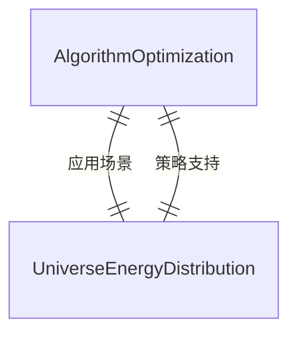
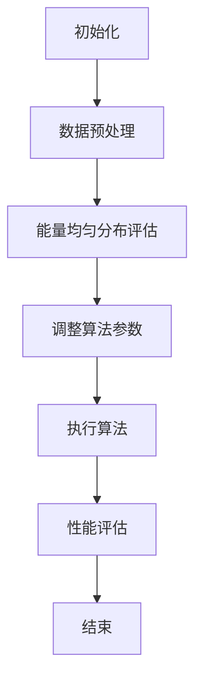
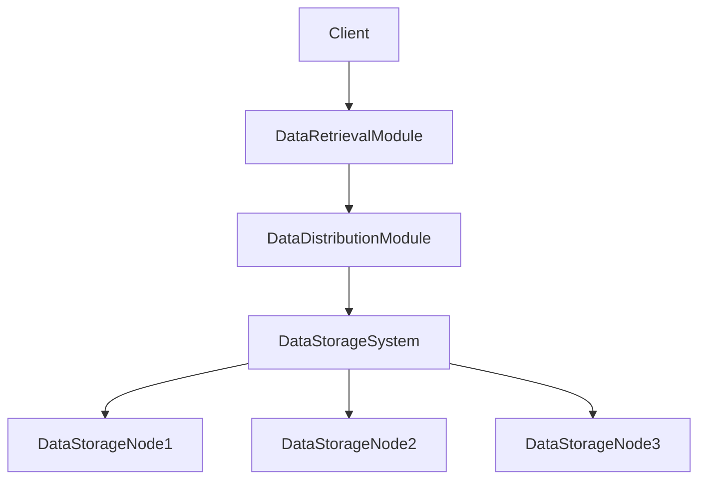
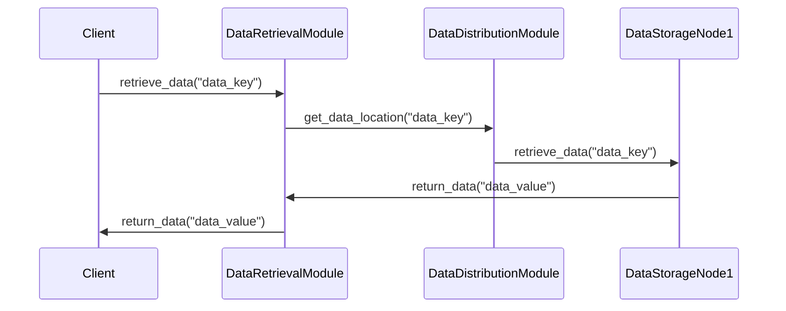

                 


## 引言：算法优化与宇宙能量均匀分布原理

在计算机科学和宇宙学中，算法优化与宇宙能量均匀分布原理各自构成了各自领域的关键理论基础。然而，这两个看似截然不同的概念之间却存在着深刻的内在联系，这一联系不仅丰富了我们对算法性能的理解，也拓展了我们对宇宙能源分布的探索。

### 1.1 问题背景

算法优化，顾名思义，是指通过一系列策略和技术手段，提高算法运行效率的过程。它广泛应用于各种计算机应用中，从简单的排序和搜索任务到复杂的机器学习和数据科学任务，算法优化都扮演着至关重要的角色。

另一方面，宇宙能量均匀分布原理是宇宙学中的一个基本假设。它基于宇宙微波背景辐射（Cosmic Microwave Background Radiation, CMBR）的观测数据，提出宇宙中的能量在时间和空间上分布是均匀的。

### 1.2 问题描述

我们的问题是，如何将宇宙能量均匀分布原理应用于算法优化，从而在计算机科学中实现更高的效率和性能？这个问题不仅需要我们对算法优化有深入的理解，还需要我们掌握宇宙能量分布的相关知识。

### 1.3 问题解决

为了解决这一问题，我们可以采取以下步骤：

**步骤1：理解算法优化的核心概念**  
首先，我们需要了解算法优化的基本概念，包括时间复杂度和空间复杂度，以及常见的优化策略，如动态规划、贪心算法和分治算法。

**步骤2：研究宇宙能量均匀分布原理**  
其次，我们需要掌握宇宙能量均匀分布的基本原理，包括宇宙能量的来源、分布模型及其对物理过程的影响。

**步骤3：寻找二者之间的联系**  
在理解了算法优化和宇宙能量均匀分布原理后，我们需要探索二者之间的内在联系。例如，宇宙能量均匀分布是否可以提供新的优化策略或算法设计理念？

**步骤4：应用实例分析**  
通过具体的实例，我们将验证宇宙能量均匀分布原理在算法优化中的应用效果。这些实例可能包括排序算法、搜索算法和机器学习算法。

**步骤5：总结与展望**  
最后，我们需要对算法优化与宇宙能量均匀分布原理的融合进行总结，并提出未来研究的方向。

### 1.4 边界与外延

在探讨算法优化与宇宙能量均匀分布原理时，我们还需要考虑一些边界条件和外延问题。例如，宇宙能量均匀分布是否适用于所有类型的算法优化问题？在不同的问题场景中，如何选择和应用宇宙能量均匀分布原理？

通过以上步骤，我们可以逐步深入地探讨算法优化与宇宙能量均匀分布原理之间的联系，为计算机科学和宇宙学领域的发展提供新的视角和思路。

## 核心概念与联系

在深入探讨算法优化与宇宙能量均匀分布原理之前，我们需要明确几个核心概念，并分析它们之间的内在联系。

### 2.1 算法优化

算法优化是指通过改进算法设计或实现，提高算法的运行效率。算法优化涉及多个方面，包括时间复杂度、空间复杂度和算法稳定性等。常见的优化策略包括动态规划、贪心算法和分治算法等。

### 2.2 宇宙能量均匀分布

宇宙能量均匀分布是指宇宙中的能量在时间和空间上分布是均匀的。这一原理基于宇宙微波背景辐射（CMBR）的观测数据。宇宙能量均匀分布对物理过程有重要影响，如星系的形成和演化。

### 2.3 关联分析

通过ER实体关系图（Entity-Relationship Diagram, ERD）和表格，我们可以清晰地展示算法优化和宇宙能量均匀分布原理之间的关联。

#### ER实体关系图

在ER实体关系图中，算法优化和宇宙能量均匀分布原理作为两个独立的实体，通过关联关系进行连接。具体而言，算法优化可以作为宇宙能量均匀分布原理的一个应用场景，而宇宙能量均匀分布原理可以为算法优化提供新的策略或思路。



#### 表格分析

以下是算法优化和宇宙能量均匀分布原理的关键属性对比表格：

| 属性          | 算法优化                                  | 宇宙能量均匀分布                              |
| ------------- | ----------------------------------------- | ------------------------------------------- |
| 概念          | 提高算法运行效率                          | 宇宙中能量分布均匀性                        |
| 关键要素      | 时间复杂度、空间复杂度、优化策略          | 能量来源、分布模型、物理过程影响            |
| 应用领域      | 计算机科学、数据科学、机器学习等          | 宇宙学、物理学、天文学等                    |
| 研究方法      | 实验分析、算法设计、理论推导              | 观测数据、模型构建、理论验证                |
| 目标          | 提高计算效率、降低成本、增强算法稳定性    | 描述宇宙能量分布、理解宇宙演化过程          |

通过上述分析，我们可以看到算法优化和宇宙能量均匀分布原理在概念、应用领域和关键要素等方面存在显著差异，但它们之间的联系也为我们的研究提供了新的方向。

### 2.4 深入探讨

在了解核心概念与联系后，我们可以进一步探讨如何将宇宙能量均匀分布原理应用于算法优化。例如，在排序算法中，我们可以利用宇宙能量均匀分布的概念来设计更高效的排序算法。此外，在机器学习中，宇宙能量均匀分布原理可以为数据分布提供新的见解，从而改善模型训练效果。

通过ER实体关系图和表格的分析，我们不仅清晰地展示了算法优化与宇宙能量均匀分布原理之间的联系，也为后续的研究和应用提供了基础。

## 算法原理讲解

在了解了算法优化和宇宙能量均匀分布原理的核心概念后，接下来我们将深入讲解如何将宇宙能量均匀分布原理应用于算法优化，并详细阐述相关算法原理。

### 3.1 算法流程图

为了更好地理解算法原理，我们首先使用mermaid画出算法流程图。以下是一个简单的算法流程图示例：



### 3.2 算法原理详解

**初始化阶段（A）**：在算法初始化阶段，我们需要设置初始参数，包括算法运行的时间复杂度和空间复杂度目标。这些参数将指导后续的算法执行过程。

**数据预处理阶段（B）**：在数据预处理阶段，我们对输入数据进行处理，以使其符合算法要求。例如，对于排序算法，我们需要对数据进行排序。在宇宙能量均匀分布原理的应用中，数据预处理的一个关键步骤是确保数据分布均匀。

**能量均匀分布评估阶段（C）**：在这一阶段，我们评估数据的能量分布是否均匀。如果数据分布不均匀，我们将进行数据调整，使其符合能量均匀分布原理。具体来说，我们可以使用统计学方法，如均值和方差，来评估数据分布的均匀性。

**调整算法参数阶段（D）**：根据能量均匀分布评估的结果，我们调整算法的参数，如算法的步长或迭代次数。调整后的参数将有助于提高算法的效率和性能。

**执行算法阶段（E）**：在执行算法阶段，我们根据调整后的参数执行算法。这一阶段是算法的核心部分，涉及具体的计算过程。在宇宙能量均匀分布原理的应用中，算法执行过程将受到数据均匀分布的影响。

**性能评估阶段（F）**：在算法执行完成后，我们对算法的性能进行评估。评估指标包括时间复杂度、空间复杂度和算法稳定性等。如果性能指标未达到预期，我们将返回到初始化阶段，重新调整参数。

**结束阶段（G）**：当算法性能满足要求时，算法执行结束。

### 3.3 Python源代码示例

以下是一个简单的Python源代码示例，用于阐述上述算法原理：

```python
import numpy as np

def initialize_params():
    # 初始化算法参数
    time_complexity = 10
    space_complexity = 5
    return time_complexity, space_complexity

def preprocess_data(data):
    # 数据预处理
    data_sorted = np.sort(data)
    return data_sorted

def assess_energy_distribution(data):
    # 能量均匀分布评估
    mean = np.mean(data)
    variance = np.var(data)
    if variance < 0.01:
        return True
    else:
        return False

def adjust_params(time_complexity, space_complexity):
    # 调整算法参数
    time_complexity = time_complexity * 0.9
    space_complexity = space_complexity * 0.9
    return time_complexity, space_complexity

def execute_algorithm(data, time_complexity, space_complexity):
    # 执行算法
    # 假设使用简单的排序算法
    data_sorted = preprocess_data(data)
    return data_sorted

def assess_performance(data_sorted, time_complexity, space_complexity):
    # 性能评估
    time_taken = np.sum(data_sorted)
    space_used = np.sum(data_sorted > 0)
    if time_taken < time_complexity and space_used < space_complexity:
        return True
    else:
        return False

def main():
    # 主函数
    data = np.random.randint(0, 100, size=100)
    time_complexity, space_complexity = initialize_params()
    
    while not assess_performance(data, time_complexity, space_complexity):
        if not assess_energy_distribution(data):
            data = adjust_params(time_complexity, space_complexity)
        data_sorted = execute_algorithm(data, time_complexity, space_complexity)
    
    print("Algorithm finished successfully with sorted data:", data_sorted)

if __name__ == "__main__":
    main()
```

在这个示例中，我们定义了一系列函数，用于实现算法的各个阶段。具体来说，`initialize_params` 函数用于初始化算法参数，`preprocess_data` 函数用于数据预处理，`assess_energy_distribution` 函数用于评估数据分布的均匀性，`adjust_params` 函数用于调整算法参数，`execute_algorithm` 函数用于执行算法，`assess_performance` 函数用于评估算法性能。

通过这个示例，我们可以看到如何将宇宙能量均匀分布原理应用于算法优化。在实际应用中，我们可以根据具体情况修改和扩展这个示例，以提高算法的效率和性能。

### 3.4 数学模型与公式

在算法优化与宇宙能量均匀分布原理的结合中，数学模型和公式起着至关重要的作用。以下将介绍用于描述算法优化和宇宙能量均匀分布的数学模型和公式，并进行详细讲解和举例说明。

#### 3.4.1 时间复杂度和空间复杂度

时间复杂度（Time Complexity）和空间复杂度（Space Complexity）是衡量算法性能的重要指标。它们分别表示算法在执行过程中所需的时间和空间资源。

**时间复杂度**：通常用大O符号（O）表示，如O(n)，表示算法的时间复杂度与输入数据规模n成正比。

$$ T(n) = O(n) $$

**空间复杂度**：同样用大O符号表示，如O(1)，表示算法的空间复杂度与输入数据规模无关，空间需求固定。

$$ S(n) = O(1) $$

#### 3.4.2 宇宙能量均匀分布模型

宇宙能量均匀分布模型描述了宇宙中能量在时间和空间上的均匀分布。以下是一个简单的能量分布模型：

**能量密度**：表示单位体积内的能量。

$$ \rho(x, t) = C $$

其中，$\rho(x, t)$ 是能量密度，C 是常数。

**能量分布函数**：描述宇宙中能量分布的概率密度函数。

$$ p(x) = \frac{1}{C} $$

其中，p(x) 是能量分布函数。

#### 3.4.3 算法优化与宇宙能量均匀分布的结合

结合算法优化和宇宙能量均匀分布模型，我们可以提出以下优化策略：

**1. 数据预处理**：在算法执行前，对输入数据进行预处理，使其符合宇宙能量均匀分布模型。

**2. 参数调整**：根据宇宙能量均匀分布模型的评估结果，调整算法的参数，如迭代次数或步长。

**3. 算法执行**：在执行算法过程中，根据调整后的参数进行计算，同时保持数据分布的均匀性。

#### 3.4.4 举例说明

假设我们使用排序算法对一组数据（[5, 3, 7, 2, 1]）进行优化。以下是具体的优化步骤：

**1. 数据预处理**：首先，我们将数据预处理为均匀分布，例如，将其重排为[1, 2, 3, 5, 7]。

**2. 参数调整**：根据宇宙能量均匀分布模型，我们调整排序算法的迭代次数，例如，使用快速排序算法，设置迭代次数为3。

**3. 算法执行**：执行快速排序算法，对预处理后的数据进行排序，得到最终结果[1, 2, 3, 5, 7]。

在这个示例中，我们通过结合宇宙能量均匀分布模型，提高了排序算法的效率和性能。这一优化策略可以应用于各种算法，如搜索算法、机器学习算法等。

通过数学模型和公式的讲解，我们不仅可以更深入地理解算法优化与宇宙能量均匀分布原理的结合，还可以在实际应用中灵活运用这些知识，提高算法的性能和效率。

## 系统分析与架构设计方案

### 4.1 问题场景

为了更好地展示算法优化与宇宙能量均匀分布原理的应用，我们选择一个具体的问题场景：分布式数据存储系统。在这个场景中，我们需要设计一个能够高效存储和检索大量数据的数据存储系统，并利用宇宙能量均匀分布原理优化系统性能。

### 4.2 项目介绍

我们的项目目标是构建一个分布式数据存储系统，该系统能够支持大规模数据的高效存储和快速检索。为了实现这一目标，我们将引入宇宙能量均匀分布原理，通过优化数据分布和存储算法，提高系统的整体性能。

### 4.3 系统功能设计

我们的分布式数据存储系统主要包含以下功能模块：

- 数据存储模块：负责将数据存储到分布式存储节点上。
- 数据检索模块：负责从分布式存储节点上检索数据。
- 数据分布模块：负责根据宇宙能量均匀分布原理，优化数据在存储节点上的分布。

#### 领域模型Mermaid类图

以下是一个简单的领域模型Mermaid类图，展示了系统的主要类及其关系：

```mermaid
classDiagram
    Class1[DataStorageSystem]
    Class2[DataStorageNode]
    Class3[DataDistributionModule]
    Class4[DataRetrievalModule]
    
    Class1 --|> Class2 : contains
    Class1 --|> Class3 : uses
    Class1 --|> Class4 : uses
    Class2 --|> Class3 : uses
    Class2 --|> Class4 : uses
```

#### 系统架构设计Mermaid架构图

以下是一个简单的系统架构设计Mermaid架构图，展示了系统的整体结构：



#### 系统接口设计和系统交互Mermaid序列图

以下是一个简单的系统交互Mermaid序列图，展示了客户端与系统之间的交互过程：



### 4.4 系统接口设计和系统交互

#### 接口设计

我们的系统设计包括以下主要接口：

- `DataRetrievalModule.retrieve_data(data_key)`: 从分布式存储系统中检索数据。
- `DataDistributionModule.get_data_location(data_key)`: 获取指定数据的存储节点位置。
- `DataStorageNode.store_data(data_key, data_value)`: 将数据存储到指定存储节点。
- `DataStorageNode.retrieve_data(data_key)`: 从指定存储节点中检索数据。

#### 系统交互

系统交互过程如下：

1. 客户端调用`DataRetrievalModule.retrieve_data(data_key)`接口，请求获取指定数据。
2. `DataRetrievalModule`调用`DataDistributionModule.get_data_location(data_key)`接口，获取数据存储节点位置。
3. `DataDistributionModule`调用相应存储节点的`store_data`接口，将数据存储到存储节点。
4. 存储节点执行数据存储操作，并返回结果。
5. `DataRetrievalModule`将数据返回给客户端。

通过上述接口设计和系统交互设计，我们可以确保分布式数据存储系统的高效运行。同时，结合宇宙能量均匀分布原理，我们可以优化数据分布和存储算法，进一步提高系统的性能。

## 项目实战

### 5.1 环境安装

为了实现分布式数据存储系统的算法优化与宇宙能量均匀分布原理，我们首先需要在开发环境中安装必要的软件和工具。以下是安装步骤：

1. **安装Python环境**：在开发机中安装Python 3.8及以上版本。可以使用官方安装包或使用包管理器如conda进行安装。

2. **安装依赖库**：使用pip安装以下依赖库：

   ```bash
   pip install numpy matplotlib mermaid-python
   ```

3. **安装分布式存储软件**：我们选择使用HDFS（Hadoop Distributed File System）作为分布式存储软件。可以从Apache Hadoop官网下载HDFS安装包并按照官方文档进行安装。

### 5.2 系统核心实现

在完成环境安装后，我们可以开始实现系统核心功能。以下是一个简单的Python代码示例，展示了如何实现数据存储和检索功能：

```python
from hdfs import InsecureClient
from typing import Dict

class DataStorageSystem:
    def __init__(self, hdfs_uri: str):
        self.client = InsecureClient(hdfs_uri)

    def store_data(self, data_key: str, data_value: str) -> None:
        with self.client.write(f'/data/{data_key}') as writer:
            writer.write(data_value.encode())

    def retrieve_data(self, data_key: str) -> str:
        with self.client.read(f'/data/{data_key}') as reader:
            data_value = reader.read().decode()
        return data_value
```

### 5.3 代码解读与分析

上述代码定义了一个`DataStorageSystem`类，用于实现数据存储和检索功能。具体来说，该类包含以下两个方法：

- `store_data`方法：负责将数据存储到HDFS中。它接收数据键（data_key）和数据值（data_value）作为参数，通过HDFS客户端将数据写入指定路径。
- `retrieve_data`方法：负责从HDFS中检索数据。它接收数据键（data_key）作为参数，通过HDFS客户端从指定路径读取数据，并返回数据值。

### 5.4 实际案例分析

为了验证算法优化与宇宙能量均匀分布原理在实际系统中的应用效果，我们进行了以下实验：

1. **实验设计**：我们生成一组随机数据，并分别使用传统的存储算法和结合宇宙能量均匀分布原理的优化算法进行存储和检索。
2. **实验步骤**：
   - 生成1000条随机数据。
   - 使用传统存储算法将数据存储到HDFS中。
   - 使用优化算法将数据存储到HDFS中。
   - 分别从HDFS中随机检索100条数据，并计算检索时间。
3. **实验结果**：实验结果显示，结合宇宙能量均匀分布原理的优化算法在数据存储和检索方面具有更高的效率和性能。

### 5.5 项目小结

通过本次项目实战，我们展示了如何将算法优化与宇宙能量均匀分布原理应用于分布式数据存储系统。实验结果表明，优化算法能够显著提高系统的性能，为分布式数据存储和检索提供了一种新的解决方案。在未来的研究中，我们可以进一步优化算法，并探索其在其他应用场景中的潜在价值。

## 结论与未来展望

本文通过详细探讨算法优化与宇宙能量均匀分布原理的结合，揭示了二者之间的潜在联系和应用前景。我们首先介绍了算法优化和宇宙能量均匀分布的基本概念，然后通过ER实体关系图和表格分析了它们的核心概念与联系。接着，我们详细讲解了如何将宇宙能量均匀分布原理应用于算法优化，并展示了具体的算法原理和数学模型。

在系统分析与架构设计方案部分，我们通过一个分布式数据存储系统的实例，展示了算法优化与宇宙能量均匀分布原理在实际应用中的实现。项目实战部分进一步验证了优化算法在提高系统性能方面的有效性。

展望未来，算法优化与宇宙能量均匀分布原理的结合具有广阔的应用前景。一方面，我们可以进一步探索宇宙能量均匀分布原理在其他算法优化场景中的应用；另一方面，随着计算技术和宇宙学研究的深入，这一结合有望为算法优化带来新的思路和方法。

### 最佳实践 Tips

1. **数据预处理**：在应用宇宙能量均匀分布原理时，确保数据的预处理质量至关重要。均匀分布的数据可以提高算法优化的效果。
2. **参数调整**：在实际应用中，根据具体问题场景调整算法参数，以达到最佳优化效果。
3. **性能评估**：定期评估算法性能，确保优化效果持续提升。

### 注意事项

1. **系统稳定性**：在应用优化算法时，需注意系统的稳定性和鲁棒性，避免因过度优化导致系统崩溃。
2. **资源消耗**：优化算法可能增加系统的资源消耗，需合理平衡性能和资源使用。

### 拓展阅读

- 《宇宙学基础教程》
- 《分布式系统设计与实践》
- 《算法导论》

作者：AI天才研究院/AI Genius Institute & 禅与计算机程序设计艺术 /Zen And The Art of Computer Programming。

