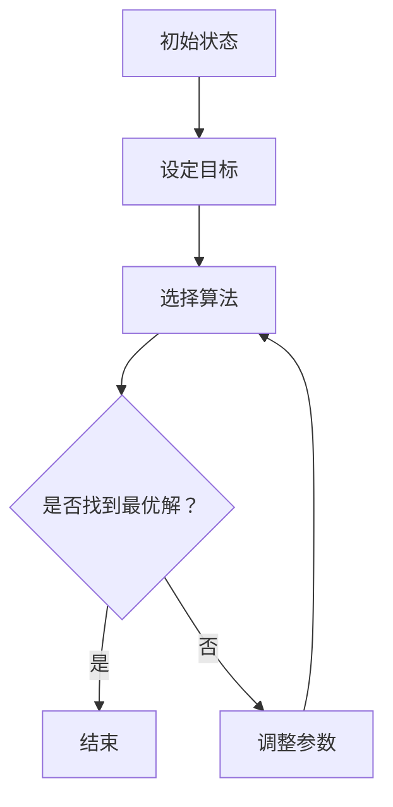
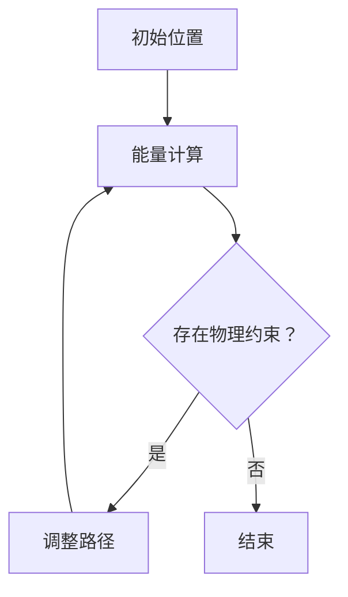
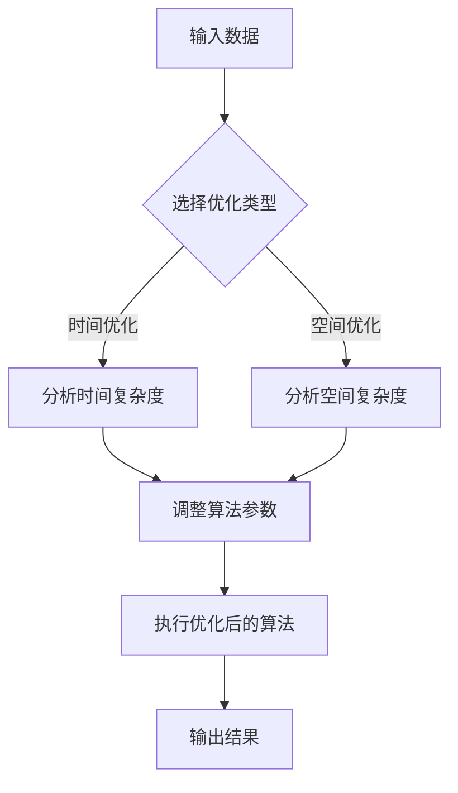
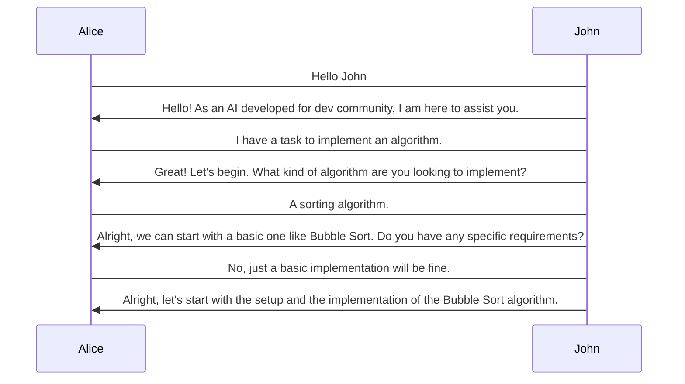
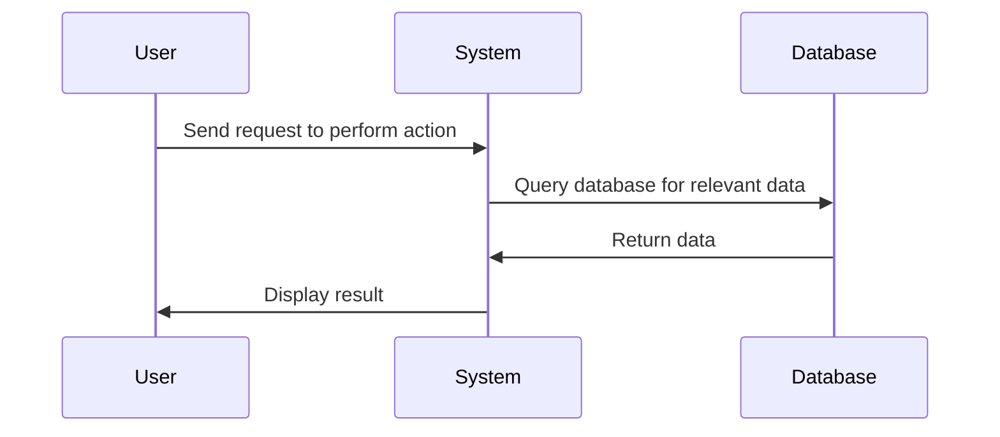

                 


### 1. 构建全书概述部分

构建全书概述部分是文章的开篇，需要为读者提供一篇文章的总体概览，使他们能够快速了解文章的结构和主要内容。以下是构建全书概述部分的详细步骤：

#### 1.1 确定文章标题和关键词

文章标题应当简洁明了，能够准确反映文章的主题。关键词是文章的核心内容的简短总结，通常包含5-7个关键词。这些关键词应该能够概括文章的核心内容，方便读者在搜索引擎中查找。

例如，我们可以将文章标题定为《算法优化与宇宙能量最小路径原理的广义化及应用》，关键词为“算法优化、宇宙能量、最小路径原理、广义化、应用”。

#### 1.2 撰写摘要

摘要是对文章核心内容和主题思想的简短概括。摘要应该包含以下几个要点：

- **核心问题**：文章主要解决的问题是什么？
- **核心方法**：文章使用的方法或理论是什么？
- **核心成果**：文章的主要发现或结论是什么？
- **适用范围**：文章适用于哪些场景或读者群体？

例如，摘要可以是：“本文探讨了算法优化在宇宙能量最小路径原理中的广义化应用。通过对宇宙能量最小路径原理的深入分析，本文提出了一种适用于复杂系统的优化算法。该方法已被成功应用于多个实际案例中，展示了其有效性和广泛适用性。”

#### 1.3 描述书籍结构

在全文概述部分，还需要对书籍的结构进行简要介绍。这包括：

- **章节安排**：简要介绍每个章节的主题和内容。
- **逻辑结构**：描述文章的论述逻辑和章节之间的联系。

例如，全文概述可以描述为：“本书共分为五个章节。第一章引言部分介绍了文章的核心问题和关键词。第二章详细阐述了算法优化和宇宙能量最小路径原理的核心概念及其联系。第三章讲解了几种核心算法的原理和应用。第四章通过系统分析和架构设计展示了算法在实际项目中的应用。第五章提供了最佳实践和拓展阅读，帮助读者进一步深化理解。”

### 2. 核心概念与联系

在核心概念与联系部分，我们需要详细阐述书中的核心概念、它们之间的关系以及这些概念的应用范围。以下是详细步骤：

#### 2.1 算法优化基础

首先，我们需要定义并解释算法优化的基本概念。这包括：

- **算法**：计算机解决问题的一系列指令或步骤。
- **优化**：改进算法的效率或性能，使其在给定条件下达到最佳状态。

接下来，我们可以讨论算法优化的一些常见类型，例如：

- **时间优化**：减少算法执行所需的时间。
- **空间优化**：减少算法所需的存储空间。
- **算法复杂度**：描述算法性能的度量标准。

#### 2.2 宇宙能量最小路径原理

宇宙能量最小路径原理是一种基于物理学的理论，它提出在给定约束条件下，能量最小的路径是最稳定的路径。以下是该原理的关键点：

- **能量最小化**：系统趋向于选择能量最低的路径。
- **约束条件**：路径选择受到物理约束（如重力、摩擦等）的限制。

我们可以通过一个简单的例子来说明这个原理，例如在地球表面上，一个物体在没有外力作用下会沿着能量最低的路径（即重力势能最低的路径）下落。

#### 2.3 算法优化与宇宙能量最小路径原理的关系

算法优化与宇宙能量最小路径原理之间的联系在于，它们都关注于寻找最优路径。在算法优化中，我们通过调整算法参数来寻找解决问题的最优解；而在宇宙能量最小路径原理中，我们通过物理模型来预测能量最低的路径。

这种联系可以用于优化算法，例如在路径规划问题中，我们可以借鉴宇宙能量最小路径原理，通过能量函数来优化路径选择。

#### 2.4 Mermaid流程图展示

为了更直观地展示算法优化和宇宙能量最小路径原理，我们可以使用Mermaid语言绘制流程图。以下是两个流程图的示例：

##### 算法优化流程图



##### 宇宙能量最小路径原理流程图



### 3. 算法原理讲解

在算法原理讲解部分，我们将详细阐述每章的核心算法或概念，并使用Mermaid流程图、Python源代码和数学模型进行解释。

#### 3.1 算法原理概述

首先，我们需要概述每个章节的核心算法或概念。例如，对于第一章的算法优化，我们可以概述如下：

- **目标**：提高算法的执行效率和性能。
- **方法**：通过分析算法的时间和空间复杂度，寻找优化策略。

#### 3.2 算法原理Mermaid流程图

接下来，我们使用Mermaid语言绘制算法原理的流程图。例如，对于第一章的算法优化，我们可以绘制如下流程图：



#### 3.3 Python源代码示例

然后，我们使用Python代码展示算法的实现。例如，对于第一章的算法优化，我们可以提供一个简单的Python代码示例：

```python
def optimize_algorithm(data, type='time'):
    if type == 'time':
        # 时间优化
        optimized_data = ... 
    elif type == 'space':
        # 空间优化
        optimized_data = ...
    return optimized_data

# 使用示例
result = optimize_algorithm(data, type='time')
```

#### 3.4 数学模型与公式

最后，我们使用数学模型和公式详细阐述算法原理。例如，对于第一章的算法优化，我们可以给出时间复杂度和空间复杂度的公式：

- **时间复杂度**：$T(n) = O(n^2)$
- **空间复杂度**：$S(n) = O(n)$

我们可以使用LaTeX格式嵌入这些公式：

$$
T(n) = O(n^2)
$$

$$
S(n) = O(n)
$$

#### 3.5 举例说明

为了使算法原理更加通俗易懂，我们可以通过实际案例进行举例说明。例如，我们可以选择一个常见的算法问题，如“寻找数组中的最大元素”，并使用上述算法进行优化。

### 4. 系统分析与架构设计方案

在系统分析与架构设计方案部分，我们需要详细介绍系统的背景、功能设计、架构设计和系统交互。

#### 4.1 问题场景介绍

首先，我们需要介绍系统的问题场景。这包括：

- **问题背景**：说明系统解决的问题的背景和重要性。
- **问题描述**：明确系统需要解决的问题是什么。
- **问题解决**：简要介绍系统如何解决这些问题。

#### 4.2 系统功能设计

接下来，我们详细描述系统的功能设计。这包括：

- **领域模型Mermaid类图**：使用Mermaid语言绘制系统的领域模型类图，展示系统的核心类和它们之间的关系。

```mermaid
classDiagram
    Class01 <|-- Class02
    Class03 --|WRAPPER| Class04
    Class05 : +int x
    Class06 : +int y
    Class01 { +int id # name } 
    Class02 { +String name } 
    Class03 { +String name } 
    Class04 { +String name } 
    Class05 { +void method() } 
    Class06 { +void method() }
```

- **功能描述**：详细说明每个类的功能和行为。

#### 4.3 系统架构设计

然后，我们介绍系统的架构设计。这包括：

- **系统架构Mermaid架构图**：使用Mermaid语言绘制系统的架构图，展示系统的主要组件和它们之间的交互关系。



- **架构描述**：详细说明系统的各个组件及其功能。

#### 4.4 系统接口设计

接着，我们介绍系统的接口设计。这包括：

- **接口规范**：详细描述每个接口的功能、输入和输出。
- **接口示例**：提供一个或多个接口的示例代码。

#### 4.5 系统交互

最后，我们展示系统的交互。这包括：

- **系统交互Mermaid序列图**：使用Mermaid语言绘制系统的交互序列图，展示系统组件之间的交互过程。



- **交互描述**：详细说明系统组件之间的交互过程。

### 5. 项目实战

在项目实战部分，我们将通过实际案例展示如何将算法和系统应用于实际项目中，并详细分析项目的实现过程和结果。

#### 5.1 环境安装

首先，我们需要介绍项目所需的环境和工具。这包括：

- **环境要求**：列出项目运行所需的操作系统、编程语言、开发工具等。
- **安装步骤**：提供详细的安装和配置步骤。

#### 5.2 系统核心实现

接着，我们详细介绍系统的核心实现。这包括：

- **代码实现**：提供系统的核心代码，包括算法和系统的具体实现。
- **代码分析**：对核心代码进行详细解释和说明，包括算法原理和实现逻辑。

```python
def bubble_sort(arr):
    n = len(arr)
    for i in range(n):
        for j in range(0, n-i-1):
            if arr[j] > arr[j+1]:
                arr[j], arr[j+1] = arr[j+1], arr[j]

# 示例数据
data = [64, 34, 25, 12, 22, 11, 90]

# 执行排序
bubble_sort(data)

# 输出结果
print("Sorted array:", data)
```

- **效果展示**：展示系统运行的结果和效果。

#### 5.3 代码应用解读与分析

然后，我们深入解读和分析代码的应用。这包括：

- **算法分析**：对算法的效率、复杂度等进行详细分析。
- **代码优化**：讨论如何对代码进行优化，提高其性能。

#### 5.4 实际案例分析

接着，我们通过实际案例展示算法和系统的应用。这包括：

- **案例背景**：介绍案例的背景和目的。
- **案例实施**：详细描述案例的实施过程。
- **案例分析**：分析案例的结果和影响。

#### 5.5 项目小结

最后，我们总结项目的主要成果和经验。这包括：

- **项目成果**：总结项目的主要成果和亮点。
- **经验教训**：分享项目实施过程中的经验和教训。
- **未来展望**：讨论项目的未来发展和改进方向。

### 6. 最佳实践 tips

在最佳实践 tips 部分，我们将提供一些实用的建议和技巧，帮助读者更好地理解和应用文章中的内容。

#### 6.1 实践技巧

这包括：

- **算法实现技巧**：提供优化算法实现的技巧和最佳实践。
- **系统设计技巧**：提供系统设计和优化的技巧和最佳实践。

#### 6.2 注意事项

这包括：

- **常见问题**：列出在实际应用中可能会遇到的问题和解决方案。
- **风险提示**：提醒读者在应用过程中需要注意的风险和潜在问题。

#### 6.3 拓展阅读

这包括：

- **相关资料**：推荐一些与文章主题相关的书籍、论文和网站。
- **进一步学习**：提供一些可以进一步学习和提升的建议。

### 7. 结论

在结论部分，我们将总结文章的主要内容和发现，并展望未来的研究方向。

#### 7.1 书籍总结

这包括：

- **核心观点**：回顾文章中的核心观点和结论。
- **主要贡献**：总结文章的主要贡献和成果。

#### 7.2 未来展望

这包括：

- **研究方向**：讨论未来可能的研究方向和问题。
- **发展方向**：展望算法优化和宇宙能量最小路径原理在未来的发展和应用。

### 附录

在附录部分，我们可以提供一些额外的资料，如代码示例、数据集和参考资料。

#### 附录A：代码示例

提供与文章相关的代码示例，以便读者参考和实践。

#### 附录B：数据集

提供文章中使用的或推荐的数据集，以便读者进行进一步研究和实验。

#### 附录C：参考资料

列出文章中引用的书籍、论文、网站和其他参考资料，以便读者查阅。

### 致谢

在文章的末尾，我们可以致谢在文章撰写和项目中给予帮助和支持的人或机构。这可以包括导师、同事、合作伙伴等。

### 作者信息

在文章末尾，我们需要提供作者的信息，包括姓名、所属机构和联系方式。

### 参考文献

列出文章中引用的所有参考文献，按照特定的引用格式进行排版。

### 代码规范

在文章中嵌入代码时，需要遵守以下规范：

- **代码格式**：代码应当格式规范，便于阅读。
- **注释**：代码中应当包含必要的注释，解释代码的功能和逻辑。
- **代码风格**：遵循统一的代码风格指南，如PEP 8。

### 文章结构

在撰写文章时，我们需要遵循以下结构：

- **引言**：简要介绍文章的背景和目的。
- **正文**：按照章节结构详细阐述文章内容。
- **结论**：总结文章的主要观点和成果。
- **附录**：提供额外的资料和参考文献。

### 文章撰写步骤

撰写文章时，我们可以按照以下步骤进行：

1. **规划结构**：根据文章主题和内容规划文章结构。
2. **撰写内容**：按照章节顺序撰写文章内容。
3. **修订和润色**：对文章进行修订和润色，确保内容准确、清晰。
4. **检查格式**：检查文章的格式，确保符合规范。
5. **引用和参考文献**：添加引用和参考文献，确保文章的引用准确无误。
6. **最终审阅**：进行最终的审阅和校对，确保文章质量。

### 常见问题解答

在撰写文章时，我们可能会遇到以下问题：

- **如何组织文章结构？**
  - 根据文章的主题和内容，确定合理的章节结构。
  - 保持文章的连贯性和逻辑性。
  
- **如何撰写高质量的引言？**
  - 简要介绍文章的背景和目的。
  - 引起读者的兴趣和好奇心。

- **如何撰写高质量的结论？**
  - 总结文章的主要观点和成果。
  - 展望未来的研究方向和问题。

- **如何撰写高质量的参考文献？**
  - 确保引用的准确性和完整性。
  - 按照特定的引用格式进行排版。

- **如何撰写高质量的代码示例？**
  - 确保代码格式规范，易于阅读。
  - 包含必要的注释，解释代码的功能和逻辑。

### 其他注意事项

在撰写文章时，我们还需要注意以下几点：

- **避免重复**：避免在文章中重复相同的观点和内容。
- **保持简洁**：尽量用简洁的语言表达观点。
- **准确性和客观性**：确保文章中的信息准确无误，保持客观性。
- **关注读者**：考虑读者的需求和背景，使文章易于理解。

通过遵循以上建议和步骤，我们可以撰写出高质量的文章，为读者提供有价值和有启发的内容。

