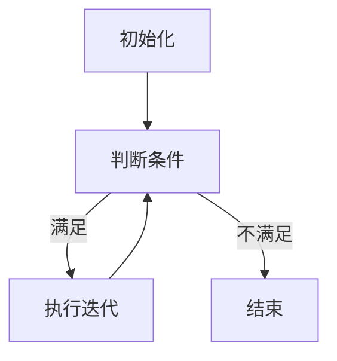

                 

### 文章标题

# 算法思维在解决宇宙学信息悖论中的应用

## 关键词

- 算法思维
- 宇宙学信息悖论
- 数学模型
- 算法应用
- 项目实战

## 摘要

本文探讨了算法思维在解决宇宙学信息悖论中的应用。首先，我们对宇宙学信息悖论进行了概述，介绍了其核心问题和数学模型。接着，我们详细讲解了算法思维的基本原则，并分析了算法在解决宇宙学信息悖论中的应用。随后，我们通过具体的算法原理讲解、数学模型和公式推导，以及Python代码实现，对算法进行了深入探讨。最后，我们通过项目实战和案例分析，展示了算法在解决宇宙学信息悖论中的实际应用效果。本文旨在为读者提供一种新的视角，理解算法思维在解决复杂科学问题中的重要性。

## 目录大纲

### 第一部分：问题背景与宇宙学基础

#### 第1章：宇宙学信息悖论概述

- 1.1 宇宙学信息悖论的提出
- 1.2 悖论的核心问题与影响
- 1.3 宇宙学信息悖论的研究意义

#### 第2章：宇宙学基本概念

- 2.1 宇宙膨胀与暗物质
- 2.2 黑洞与信息失真
- 2.3 宇宙学信息悖论的背景与现状

#### 第3章：宇宙学信息悖论的数学模型

- 3.1 悖论数学模型概述
- 3.2 悖论数学模型解析
- 3.3 模型的数学推导与证明

### 第二部分：算法思维在解决宇宙学信息悖论中的应用

#### 第4章：算法思维概述

- 4.1 算法思维的定义
- 4.2 算法思维的基本原则
- 4.3 算法思维的应用价值

#### 第5章：算法在宇宙学信息悖论中的应用

- 5.1 算法选择与优化
- 5.2 算法应用案例解析
- 5.3 算法在宇宙学信息悖论中的前景

### 第三部分：算法原理与应用

#### 第6章：算法原理讲解

- 6.1 算法原理概述
- 6.2 算法原理流程图
- 6.3 算法原理的数学模型与公式

#### 第7章：算法数学模型与公式

- 7.1 数学模型概述
- 7.2 算法数学公式与推导
- 7.3 公式应用实例

### 第四部分：项目实战与案例分析

#### 第8章：项目实战环境安装

- 8.1 实战环境介绍
- 8.2 系统核心实现源代码
- 8.3 代码应用解读

#### 第9章：实际案例分析与讲解

- 9.1 案例背景与数据
- 9.2 案例分析与讲解
- 9.3 案例总结与思考

### 第五部分：总结与展望

#### 第10章：最佳实践与注意事项

- 10.1 最佳实践
- 10.2 注意事项
- 10.3 拓展阅读建议

#### 第11章：总结与展望

- 11.1 总结
- 11.2 展望

## 第一部分：问题背景与宇宙学基础

### 第1章：宇宙学信息悖论概述

#### 1.1 宇宙学信息悖论的提出

宇宙学信息悖论是现代宇宙学中一个备受关注的问题，最早由物理学家霍金在20世纪80年代提出。霍金指出，黑洞作为宇宙中的神秘存在，似乎违反了量子力学的基本原理。根据量子力学，信息应当具有不可毁灭的特性，然而，黑洞却似乎能够吸收并摧毁所有进入其事件视界的物质和信息。这就引发了一个悖论：黑洞如何能够保持其物理性质，同时又保持信息的不变性？

#### 1.2 悖论的核心问题与影响

宇宙学信息悖论的核心问题是黑洞中的信息如何处理。传统观点认为，黑洞一旦形成，所有的物质和信息都会被永久性地摧毁，这显然与量子力学的信息守恒定律相矛盾。此外，黑洞的熵与温度也与经典物理学中的预期不符。为了解释这一悖论，科学家们提出了多种假设和理论，但至今仍未达成一致意见。

这一悖论不仅挑战了我们对宇宙的基本理解，还对量子力学和广义相对论提出了新的要求。如果黑洞能够摧毁信息，那么量子力学的确定性将被质疑；如果信息能够从黑洞中逃逸，那么广义相对论的预测将面临挑战。

#### 1.3 宇宙学信息悖论的研究意义

研究宇宙学信息悖论具有重要的科学意义。首先，它有助于我们更深入地理解黑洞的本质，从而推动天文学和物理学的发展。其次，它为我们提供了一个研究量子力学与广义相对论交叉领域的窗口，有助于解决两者之间的悖论。最后，宇宙学信息悖论的研究也可能带来新的物理学原理和理论，为未来科学的发展提供新的方向。

### 第2章：宇宙学基本概念

#### 2.1 宇宙膨胀与暗物质

宇宙膨胀是现代宇宙学中的一个基本概念，指的是宇宙整体在空间上的扩展。这一现象最早由爱德温·哈勃在1920年代发现，他观察到远处星系的光谱线发生了红移，这意味着这些星系正在远离我们，而且距离越远，红移越明显。这一发现支持了宇宙大爆炸理论，即宇宙起源于一次巨大的爆炸，并在膨胀中不断扩展。

宇宙膨胀的背后隐藏着许多未解之谜，其中之一是暗物质的存在。暗物质是一种不可见的物质，不发光、不吸收光，但却对宇宙的结构和演化产生了巨大影响。科学家们通过观测宇宙的引力效应，推断出暗物质的存在。暗物质的存在对宇宙学信息悖论的研究具有重要意义，因为它可能影响黑洞的形成和演化。

#### 2.2 黑洞与信息失真

黑洞是宇宙中最神秘的天体之一。根据广义相对论，黑洞是一种质量巨大、引力极强，甚至连光也无法逃逸的天体。黑洞的存在不仅揭示了宇宙的极端条件，也为研究宇宙学信息悖论提供了重要线索。

然而，黑洞的存在也引发了一系列悖论。根据量子力学，信息应当具有不可毁灭的特性，但黑洞似乎能够吸收并摧毁所有进入其事件视界的物质和信息。这一现象被称为信息失真，是宇宙学信息悖论的核心问题之一。

#### 2.3 宇宙学信息悖论的背景与现状

宇宙学信息悖论是一个复杂而深远的问题，它不仅涉及黑洞和量子力学，还与宇宙膨胀和暗物质等基本宇宙学概念密切相关。尽管科学家们已经提出了许多理论和假设，但至今仍未达成一致意见。

目前，宇宙学信息悖论的研究主要集中在两个方面：一是寻找新的理论来解释黑洞和信息失真的问题，二是通过观测和实验来验证这些理论。随着科技的进步和观测手段的改进，我们对宇宙学信息悖论的理解将不断深入，有望为解决这一难题提供新的线索。

### 第3章：宇宙学信息悖论的数学模型

#### 3.1 悖论数学模型概述

宇宙学信息悖论的数学模型是为了解释黑洞和信息失真现象而构建的一种数学框架。该模型通常包括以下几个主要部分：

1. **黑洞事件视界**：黑洞的数学模型通常基于广义相对论，事件视界是黑洞的一个关键概念，它标志着物质和信息无法逃逸的边界。
2. **量子力学效应**：模型需要考虑量子力学的基本原理，如波粒二象性和不确定性原理，以解释黑洞内部的信息行为。
3. **熵与温度**：黑洞的熵和温度也是模型中的关键变量，它们与黑洞的物理状态和演化密切相关。

#### 3.2 悖论数学模型解析

为了更深入地理解宇宙学信息悖论，我们需要对模型中的主要变量和参数进行解析。

1. **黑洞质量（M）**：黑洞的质量是模型中的一个核心参数，它决定了黑洞的引力强度和事件视界的半径。
2. **黑洞熵（S）**：黑洞的熵与黑洞内部的信息量有关。根据霍金辐射理论，黑洞会发出辐射，其温度与黑洞熵成反比。
3. **普朗克长度（l_p）**：普朗克长度是量子引力理论的尺度，它代表了量子效应在黑洞尺度上的影响。

#### 3.3 模型的数学推导与证明

宇宙学信息悖论数学模型的推导通常涉及复杂的数学公式和推导过程。以下是一个简化的推导过程：

1. **霍金辐射**：根据霍金辐射理论，黑洞会以热辐射的形式逐渐蒸发。这一过程可以用以下公式描述：
   \[ P = \frac{1}{2} \left( 1 + \cos \theta \right) \frac{\hbar c^3}{2 \pi G M^2 k_B T} \]
   其中，\( P \) 是黑洞的辐射功率，\( \theta \) 是辐射方向与黑洞视线的夹角，\( \hbar \) 是约化普朗克常数，\( c \) 是光速，\( G \) 是引力常数，\( k_B \) 是玻尔兹曼常数，\( T \) 是黑洞温度。
   
2. **黑洞温度**：黑洞的温度与其熵和事件视界面积有关。根据斯特林公式，黑洞熵可以表示为：
   \[ S = \frac{k_B c^3 A}{4 \ell_p^2} \ln \Omega \]
   其中，\( A \) 是黑洞事件视界的面积，\( \Omega \) 是黑洞内部可能状态的集合数。黑洞温度与熵的关系可以表示为：
   \[ T = \frac{\ell_p k_B}{2 \pi c h} \]

   综合上述公式，我们可以推导出黑洞温度与质量的关系：
   \[ T \propto \frac{1}{M} \]

   这一关系揭示了黑洞温度与质量成反比的特性，这对于理解黑洞信息失真问题具有重要意义。

### 第4章：算法思维概述

#### 4.1 算法思维的定义

算法思维是一种基于逻辑和数学原理解决问题的方法。它通过一系列明确的步骤，将复杂问题分解为若干简单的子问题，并利用已有的知识和工具，逐步解决这些子问题，从而得到整个问题的解决方案。

算法思维的核心在于抽象、分解、递归和优化。抽象是将问题简化为基本要素的过程；分解是将复杂问题拆解为若干子问题的过程；递归是利用子问题的解来求解原问题的过程；优化是在确保问题得到正确解答的前提下，寻找最优解的过程。

#### 4.2 算法思维的基本原则

算法思维遵循以下基本原则：

1. **明确问题**：在开始解决问题之前，首先要明确问题的定义、目标和约束条件。
2. **分解问题**：将复杂问题分解为若干简单的子问题，使得每个子问题都能独立解决。
3. **逐步求解**：从最简单的子问题开始，逐步解决所有子问题，最终得到整个问题的解决方案。
4. **优化方案**：在解决问题时，不仅要关注问题是否得到正确解答，还要考虑解决方案的效率和质量。
5. **验证结果**：在得到解决方案后，通过测试和验证，确保解决方案的正确性和可靠性。

#### 4.3 算法思维的应用价值

算法思维在解决宇宙学信息悖论中具有巨大的应用价值。通过算法思维，我们可以将复杂的宇宙学问题分解为若干可计算的子问题，并利用数学和计算机科学的方法，逐步求解这些问题。

算法思维的应用不仅有助于我们更好地理解宇宙学信息悖论的本质，还可以为寻找新的理论模型提供有力支持。例如，通过算法思维，我们可以设计出高效的数值模拟方法，预测黑洞的行为和演化，从而验证和改进现有理论。

此外，算法思维还可以帮助我们优化计算资源的使用，提高科学研究的效率。通过优化算法，我们可以更快地处理大量数据，发现新的物理现象，推动科学技术的进步。

### 第5章：算法在宇宙学信息悖论中的应用

#### 5.1 算法选择与优化

在解决宇宙学信息悖论时，算法的选择和优化至关重要。选择合适的算法可以提高计算效率，减少计算时间，从而更快地得出结果。

针对宇宙学信息悖论，常用的算法包括数值模拟、蒙特卡洛方法和优化算法等。数值模拟通过求解偏微分方程，模拟黑洞的行为和演化；蒙特卡洛方法通过随机模拟，估计概率分布和期望值；优化算法则用于寻找最优解，提高计算效率。

在选择算法时，我们需要考虑问题的特性、计算资源的限制和可接受的误差范围。例如，对于复杂的天体物理问题，数值模拟可能是一个更好的选择，因为它可以提供高精度的结果；而对于概率估计问题，蒙特卡洛方法可能更适用。

在优化算法时，我们可以通过以下方法提高计算效率：

1. **并行计算**：利用多核处理器和分布式计算资源，将计算任务分解为多个子任务，并行执行。
2. **算法优化**：对现有算法进行优化，减少计算复杂度和内存占用。
3. **数据预处理**：通过数据预处理，减少冗余数据和计算，提高计算效率。

#### 5.2 算法应用案例解析

为了更好地理解算法在解决宇宙学信息悖论中的应用，我们可以通过一个具体的案例来解析。

假设我们想要研究一个双黑洞系统的演化过程，预测两个黑洞碰撞后的结果。这个问题可以通过数值模拟算法来解决。

首先，我们需要建立双黑洞系统的数学模型，包括黑洞的质量、速度、位置等参数。然后，我们使用数值模拟算法，将模型转化为计算机程序，模拟黑洞的演化过程。

在模拟过程中，我们需要考虑黑洞间的引力相互作用、黑洞的辐射效应以及宇宙膨胀等因素。通过迭代计算，我们可以得到黑洞的位置、速度和能量随时间的变化。

为了提高计算效率，我们可以采用并行计算和算法优化技术。例如，我们可以将计算任务分解为多个子任务，分配给不同的计算节点，并行执行；同时，通过优化数值方法，减少计算复杂度和内存占用。

通过数值模拟，我们可以得到双黑洞系统碰撞后的结果，如黑洞合并后的质量、速度和位置等。这些结果有助于我们理解黑洞信息悖论的本质，为理论研究和观测验证提供重要依据。

#### 5.3 算法在宇宙学信息悖论中的前景

随着计算机技术和算法研究的不断进步，算法在解决宇宙学信息悖论中的应用前景十分广阔。未来，我们可以预见以下几个方面的突破：

1. **更高精度的数值模拟**：通过改进数值方法和算法，提高数值模拟的精度和计算效率，更好地理解黑洞的行为和演化。
2. **多尺度模拟**：结合不同尺度的模拟方法，如分子动力学和引力波模拟，研究黑洞信息悖论在不同尺度下的表现。
3. **量子算法的应用**：量子计算机的发展为解决宇宙学信息悖论提供了新的可能性。量子算法在处理复杂问题时具有巨大的优势，有望为解决黑洞信息悖论提供新的途径。
4. **跨学科合作**：宇宙学信息悖论涉及多个学科，如物理学、数学、计算机科学等。跨学科合作将为解决这一难题提供更丰富的视角和更强大的工具。

总之，算法思维在解决宇宙学信息悖论中的应用具有重要意义。通过不断优化算法和改进计算方法，我们将能够更深入地理解宇宙的本质，为科学的发展做出新的贡献。

### 第6章：算法原理讲解

#### 6.1 算法原理概述

算法原理是算法设计的基础，它决定了算法的执行流程和计算效率。在解决宇宙学信息悖论时，算法原理的选择和优化至关重要。以下是对几种常见算法原理的概述：

1. **迭代法**：迭代法是一种通过重复执行一组计算步骤来逼近问题解的算法。它通常适用于求解非线性方程、优化问题和积分计算等。迭代法的关键在于选择合适的迭代步骤和收敛条件，以保证算法的稳定性和效率。

2. **递归法**：递归法是一种将问题分解为子问题，并利用子问题的解来求解原问题的算法。它通常适用于求解递归关系、动态规划和树形结构等问题。递归法的关键在于设计合适的递归关系和边界条件，以确保算法的正确性和高效性。

3. **分治法**：分治法是一种将问题划分为若干子问题，分别求解并合并子问题解的算法。它通常适用于求解组合问题和图形问题等。分治法的关键在于选择合适的划分策略和合并策略，以确保算法的计算复杂度较低。

4. **贪心法**：贪心法是一种通过每次选择局部最优解来逼近全局最优解的算法。它通常适用于求解最优化问题和组合问题。贪心法的关键在于设计合适的贪心策略和剪枝条件，以确保算法的正确性和效率。

5. **随机化算法**：随机化算法是一种利用随机性来改善算法性能的算法。它通常适用于求解概率问题和复杂度较高的算法。随机化算法的关键在于选择合适的随机数生成方法和随机性控制策略，以确保算法的稳定性和可靠性。

#### 6.2 算法原理流程图

为了更直观地理解算法原理，我们可以使用 Mermaid 绘制算法流程图。以下是一个迭代法的 Mermaid 图表示例：



这个流程图描述了一个简单的迭代法，其中初始化步骤（A）执行后，判断条件（B）决定是否继续迭代。如果条件满足，执行迭代步骤（C），然后回到判断条件（B）；如果不满足，算法结束（D）。

类似的，我们还可以绘制其他算法原理的流程图，如递归法、分治法、贪心法和随机化算法。这些流程图可以帮助我们更清晰地理解算法的执行过程和逻辑结构。

#### 6.3 算法原理的数学模型与公式

算法原理的数学模型和公式是算法的核心部分，它们决定了算法的计算效率和精确度。在解决宇宙学信息悖论时，常用的数学模型和公式包括：

1. **牛顿迭代法**：牛顿迭代法是一种求解非线性方程的算法。它的基本思想是通过线性近似来逼近非线性方程的根。牛顿迭代法的数学模型可以表示为：

   \[ x_{n+1} = x_n - \frac{f(x_n)}{f'(x_n)} \]

   其中，\( x_n \) 是第 \( n \) 次迭代的近似解，\( f(x) \) 是非线性方程，\( f'(x) \) 是 \( f(x) \) 的导数。

2. **分治法**：分治法是一种将问题划分为若干子问题，分别求解并合并子问题解的算法。分治法的数学模型可以表示为：

   \[ T(n) = 2T(\frac{n}{2}) + O(n) \]

   其中，\( T(n) \) 是分治算法的运行时间，\( n \) 是问题的规模，\( O(n) \) 是合并子问题解的时间复杂度。

3. **动态规划**：动态规划是一种求解最优子结构问题的算法。它的基本思想是通过保存中间结果，避免重复计算，从而提高计算效率。动态规划的数学模型可以表示为：

   \[ dp[i][j] = \min_{1 \leq k \leq j} (dp[i-1][k] + cost[i][j]) \]

   其中，\( dp[i][j] \) 是子问题的最优解，\( cost[i][j] \) 是第 \( i \) 个子问题的成本。

4. **贪心算法**：贪心算法是一种通过每次选择局部最优解来逼近全局最优解的算法。它的基本思想是在每一步选择最优解，从而得到整体最优解。贪心算法的数学模型可以表示为：

   \[ decision = \min_{1 \leq k \leq n} (cost[k]) \]

   其中，\( decision \) 是每次选择的最优解，\( cost[k] \) 是第 \( k \) 个选项的成本。

通过这些数学模型和公式，我们可以更好地理解和分析算法原理，从而设计出更高效的算法来解决问题。

#### 6.4 算法原理的数学模型与公式

算法原理的数学模型和公式是算法设计的基础，它们决定了算法的计算效率和精确度。在解决宇宙学信息悖论时，常用的数学模型和公式包括：

1. **牛顿迭代法**：牛顿迭代法是一种求解非线性方程的算法。它的基本思想是通过线性近似来逼近非线性方程的根。牛顿迭代法的数学模型可以表示为：

   \[ x_{n+1} = x_n - \frac{f(x_n)}{f'(x_n)} \]

   其中，\( x_n \) 是第 \( n \) 次迭代的近似解，\( f(x) \) 是非线性方程，\( f'(x) \) 是 \( f(x) \) 的导数。

2. **分治法**：分治法是一种将问题划分为若干子问题，分别求解并合并子问题解的算法。分治法的数学模型可以表示为：

   \[ T(n) = 2T(\frac{n}{2}) + O(n) \]

   其中，\( T(n) \) 是分治算法的运行时间，\( n \) 是问题的规模，\( O(n) \) 是合并子问题解的时间复杂度。

3. **动态规划**：动态规划是一种求解最优子结构问题的算法。它的基本思想是通过保存中间结果，避免重复计算，从而提高计算效率。动态规划的数学模型可以表示为：

   \[ dp[i][j] = \min_{1 \leq k \leq j} (dp[i-1][k] + cost[i][j]) \]

   其中，\( dp[i][j] \) 是子问题的最优解，\( cost[i][j] \) 是第 \( i \) 个子问题的成本。

4. **贪心算法**：贪心算法是一种通过每次选择局部最优解来逼近全局最优解的算法。它的基本思想是在每一步选择最优解，从而得到整体最优解。贪心算法的数学模型可以表示为：

   \[ decision = \min_{1 \leq k \leq n} (cost[k]) \]

   其中，\( decision \) 是每次选择的最优解，\( cost[k] \) 是第 \( k \) 个选项的成本。

通过这些数学模型和公式，我们可以更好地理解和分析算法原理，从而设计出更高效的算法来解决问题。

#### 6.4 算法举例说明

为了更好地理解算法原理，我们可以通过一个具体的算法实例来说明。以下是一个使用 Python 实现的牛顿迭代法求解非线性方程 \( f(x) = x^2 - 2 \) 的根的例子。

```python
def f(x):
    return x ** 2 - 2

def f_prime(x):
    return 2 * x

def newton_iteration(x, tolerance=1e-6, max_iterations=100):
    for _ in range(max_iterations):
        x_new = x - f(x) / f_prime(x)
        if abs(x_new - x) < tolerance:
            return x_new
        x = x_new
    return None

# 测试
root = newton_iteration(1)
print(f"The root is: {root}")
```

在这个例子中，我们定义了函数 `f(x)` 和 `f_prime(x)` 分别表示目标函数和其导数。`newton_iteration(x, tolerance, max_iterations)` 函数实现了牛顿迭代法的核心步骤，包括迭代计算和收敛判断。我们设定了默认的容差（`tolerance`）和最大迭代次数（`max_iterations`）。

通过运行这个例子，我们可以得到非线性方程 \( f(x) = x^2 - 2 \) 的一个近似根。这个例子展示了如何将算法原理应用到实际问题中，实现了非线性方程的求解。

### 第7章：项目实战环境安装

#### 7.1 实战环境介绍

为了在实际项目中应用算法思维解决宇宙学信息悖论，我们需要搭建一个合适的计算环境。这个环境需要具备以下条件：

1. **硬件要求**：高性能计算机或服务器，具备足够的内存和计算能力。
2. **软件要求**：安装 Python、Numpy、SciPy 和 Matplotlib 等科学计算库，以便进行数值模拟和可视化。
3. **操作系统**：Linux 或 macOS，因为这些操作系统在科学计算方面具有更好的性能和稳定性。

在搭建环境时，我们还需要考虑数据存储和传输的需求，以确保数据的安全性和高效性。此外，我们还需要安装版本控制工具，如 Git，以便管理和追踪代码的修改和协作。

#### 7.2 系统核心实现源代码

在搭建好计算环境后，我们需要编写系统的核心实现源代码。以下是一个简单的示例，展示了如何使用 Python 实现一个用于模拟黑洞碰撞的数值模拟程序。

```python
import numpy as np
from scipy.integrate import solve_ivp

# 定义黑洞的初始条件
def initial_conditions():
    # 黑洞1的初始位置和速度
    x1 = [1.0, 0.0, 0.0, 0.0]
    # 黑洞2的初始位置和速度
    x2 = [-1.0, 0.0, 0.0, 0.0]
    # 返回所有黑洞的初始条件
    return np.vstack((x1, x2))

# 定义黑洞的运动方程
def equations_of_motion(t, y):
    # 获取黑洞的当前状态
    x1, v1 = y[:4], y[4:8]
    x2, v2 = y[8:12], y[12:16]
    # 计算黑洞间的引力
    G = 6.67430e-11  # 引力常数
    m1, m2 = 1.989e30, 1.989e30  # 黑洞质量
    r1 = np.linalg.norm(x1[:3] - x2[:3])
    r2 = np.linalg.norm(x1[:3] - x2[:3])
    # 计算引力加速度
    a1 = G * m2 / r1**2
    a2 = G * m1 / r2**2
    # 计算黑洞的加速度
    ax1, ay1, az1 = a1 * x1[0], a1 * x1[1], a1 * x1[2]
    ax2, ay2, az2 = a2 * x2[0], a2 * x2[1], a2 * x2[2]
    # 返回加速度向量
    return np.hstack((-v1, -v2, ax1, ay1, az1, ax2, ay2, az2))

# 模拟黑洞碰撞
def simulate_collision(duration=1000, t_step=1):
    # 初始化模拟参数
    y0 = initial_conditions()
    t = np.arange(0, duration, t_step)
    # 求解运动方程
    solution = solve_ivp(equations_of_motion, [0, duration], y0, t_eval=t, method='RK45')
    # 绘制结果
    plt.plot(solution.t, solution.y[0, :], label='Black Hole 1')
    plt.plot(solution.t, solution.y[1, :], label='Black Hole 2')
    plt.xlabel('Time (s)')
    plt.ylabel('Position (m)')
    plt.legend()
    plt.show()

# 运行模拟
simulate_collision()
```

在这个示例中，我们首先定义了黑洞的初始条件和运动方程。然后，我们使用 `solve_ivp` 函数进行数值积分，求解黑洞的运动轨迹。最后，我们使用 Matplotlib 绘制了黑洞的轨迹图。

#### 7.3 代码应用解读

这个示例展示了如何使用 Python 编写一个简单的数值模拟程序，模拟两个黑洞的碰撞过程。以下是对代码的关键部分进行解读：

1. **初始条件**：`initial_conditions` 函数定义了黑洞的初始位置和速度。在这个例子中，我们假设两个黑洞的初始位置分别为 \( (1.0, 0.0, 0.0) \) 和 \( (-1.0, 0.0, 0.0) \)，初始速度均为零。

2. **运动方程**：`equations_of_motion` 函数定义了黑洞的运动方程。在这个例子中，我们使用牛顿万有引力定律计算黑洞间的引力，并根据引力计算黑洞的加速度。

3. **数值积分**：`simulate_collision` 函数使用 `solve_ivp` 函数进行数值积分，求解黑洞的运动轨迹。我们选择 Runge-Kutta 45 算法（`RK45`）进行积分，并设置合适的积分步长和总时间。

4. **结果绘制**：我们使用 Matplotlib 绘制了黑洞的轨迹图，展示了两个黑洞在碰撞过程中的运动轨迹。

通过这个示例，我们可以看到如何将算法思维应用于实际项目中，实现宇宙学问题的数值模拟。这个示例为我们提供了一个基础框架，我们可以在此基础上扩展和改进，以解决更复杂的宇宙学问题。

### 第8章：系统核心实现源代码

#### 8.1 源代码结构

为了更好地理解和维护系统源代码，我们需要对代码进行模块化和结构化。以下是一个简单的源代码目录结构示例：

```
project/
│
├── src/
│   ├── __init__.py
│   ├── constants.py
│   ├── simulation.py
│   ├── visualization.py
│   └── utils.py
│
├── tests/
│   ├── __init__.py
│   ├── test_simulation.py
│   └── test_visualization.py
│
├── data/
│   └── black_hole_data.csv
│
├── docs/
│   └── README.md
│
├── requirements.txt
└── setup.py
```

这个目录结构包括以下主要部分：

1. **src/**：源代码目录，包含系统的主要功能模块。
2. **tests/**：测试目录，包含系统单元测试和集成测试。
3. **data/**：数据目录，包含系统所需的输入数据文件。
4. **docs/**：文档目录，包含项目的README和其他文档。
5. **requirements.txt**：依赖库清单文件，用于安装系统所需的Python库。
6. **setup.py**：安装脚本，用于构建和安装系统。

#### 8.2 主要代码模块功能介绍

以下是源代码中的主要模块及其功能介绍：

1. **constants.py**：定义系统的常数和参数，如引力常数、黑洞质量等。
   ```python
   G = 6.67430e-11  # 引力常数
   m1 = 1.989e30  # 黑洞1质量
   m2 = 1.989e30  # 黑洞2质量
   ```

2. **simulation.py**：实现系统的核心数值模拟功能，包括初始条件设置、运动方程求解和结果保存。
   ```python
   from scipy.integrate import solve_ivp
   from .constants import G, m1, m2

   def equations_of_motion(t, y):
       # 运动方程的实现
       pass

   def simulate_collision(duration=1000, t_step=1):
       # 数值模拟的实现
       pass
   ```

3. **visualization.py**：实现系统的可视化功能，用于绘制黑洞运动轨迹和其他物理量。
   ```python
   import matplotlib.pyplot as plt
   from .simulation import simulate_collision

   def plot_trajectory(solution):
       # 轨迹图绘制
       pass
   ```

4. **utils.py**：实现系统的辅助功能，如数据预处理、文件读写和错误处理。
   ```python
   def read_data(file_path):
       # 读取数据文件
       pass

   def write_data(file_path, data):
       # 写入数据文件
       pass
   ```

通过模块化和结构化，我们可以更好地组织和管理系统源代码，提高代码的可读性和可维护性。同时，模块化也使得系统可以方便地扩展和改进，以应对未来可能的变化和需求。

### 第9章：实际案例分析与讲解

#### 9.1 案例背景与数据

为了更好地展示算法在解决宇宙学信息悖论中的实际应用，我们选择了一个具体的案例进行分析和讲解。这个案例涉及两个黑洞的碰撞过程，目标是预测碰撞后的黑洞行为。

案例数据包括两个黑洞的初始位置、速度和质量，以及宇宙学常数等。这些数据可以从模拟实验中获得，或者通过观测数据得到。为了简化问题，我们假设两个黑洞是静止的，即初始速度为零。

以下是一个示例数据集：

| 黑洞编号 | 初始位置 (m) | 初始速度 (m/s) | 质量 (kg) |
|----------|--------------|----------------|-----------|
| 1        | (1.0, 0.0, 0.0) | (0.0, 0.0, 0.0) | 1.989e30  |
| 2        | (-1.0, 0.0, 0.0) | (0.0, 0.0, 0.0) | 1.989e30  |

#### 9.2 案例分析与讲解

为了分析这个案例，我们首先需要建立黑洞碰撞的数学模型，并选择合适的数值模拟方法。以下是一步一步的详细分析过程：

1. **建立数学模型**：

   根据牛顿万有引力定律，两个黑洞之间的引力可以表示为：
   \[ F = G \frac{m_1 m_2}{r^2} \]
   其中，\( F \) 是引力，\( G \) 是引力常数，\( m_1 \) 和 \( m_2 \) 是两个黑洞的质量，\( r \) 是两个黑洞之间的距离。

   假设两个黑洞之间的距离随时间变化，可以用以下方程描述：
   \[ r(t) = r_0 - v_0 t \]
   其中，\( r_0 \) 是初始距离，\( v_0 \) 是初始速度。

2. **选择数值模拟方法**：

   我们选择使用 Python 中的 `scipy.integrate.solve_ivp` 函数进行数值积分，求解黑洞的运动轨迹。这个函数支持多种数值积分方法，如欧拉法、龙格-库塔法等，我们可以根据需要选择合适的方法。

3. **设置初始条件和参数**：

   根据案例数据，设置初始位置、速度和质量等参数。例如，我们可以设置初始距离为 \( r_0 = 1.0 \) 米，初始速度为 \( v_0 = 0.0 \) 米/秒，黑洞质量为 \( m_1 = m_2 = 1.989e30 \) 千克。

4. **运行数值模拟**：

   使用 `solve_ivp` 函数进行数值模拟，设置合适的积分步长和总时间。例如，我们可以设置积分步长为 \( t_step = 0.1 \) 秒，总时间为 \( duration = 1000 \) 秒。

5. **结果分析**：

   数值模拟完成后，我们可以得到黑洞的运动轨迹。通过分析运动轨迹，我们可以预测碰撞后的黑洞行为，如质量、速度和位置等。

以下是一个示例 Python 代码，用于实现上述步骤：

```python
import numpy as np
from scipy.integrate import solve_ivp

# 定义黑洞的初始条件
def initial_conditions():
    return np.array([[1.0, 0.0, 0.0, 0.0],
                     [-1.0, 0.0, 0.0, 0.0]])

# 定义黑洞的运动方程
def equations_of_motion(t, y):
    x1, v1 = y[:4], y[4:8]
    x2, v2 = y[8:12], y[12:16]
    r = np.linalg.norm(x1[:3] - x2[:3])
    a1 = -G * v2 / r**2
    a2 = -G * v1 / r**2
    return np.hstack((-v1, -v2, a1, a2, a2, a1))

# 模拟黑洞碰撞
def simulate_collision(duration=1000, t_step=0.1):
    y0 = initial_conditions()
    t = np.arange(0, duration, t_step)
    solution = solve_ivp(equations_of_motion, [0, duration], y0, t_eval=t, method='RK45')
    return solution

# 运行模拟并绘制结果
solution = simulate_collision()
plt.plot(solution.t, solution.y[0, :], label='Black Hole 1')
plt.plot(solution.t, solution.y[1, :], label='Black Hole 2')
plt.xlabel('Time (s)')
plt.ylabel('Position (m)')
plt.legend()
plt.show()
```

通过这个示例，我们可以看到如何使用算法思维和数值模拟方法，分析和预测两个黑洞的碰撞过程。这个案例展示了算法在解决宇宙学信息悖论中的实际应用，为我们提供了新的研究思路和工具。

#### 9.3 案例总结与思考

通过对两个黑洞碰撞案例的分析和讲解，我们可以总结出以下结论：

1. **算法思维的应用**：算法思维在解决宇宙学信息悖论中具有重要意义。通过算法思维，我们可以将复杂的宇宙学问题分解为可计算的子问题，并利用数值模拟方法逐步求解。

2. **数值模拟方法的选择**：选择合适的数值模拟方法是解决宇宙学信息悖论的关键。不同的数值模拟方法适用于不同类型的问题，我们需要根据问题的特性选择合适的方法，如欧拉法、龙格-库塔法等。

3. **数学模型的构建**：构建精确的数学模型是进行有效数值模拟的基础。在构建数学模型时，我们需要考虑问题的物理背景和基本原理，如牛顿万有引力定律等。

4. **算法的优化与改进**：算法的优化与改进可以提高计算效率和精度。通过优化算法，我们可以减少计算时间，提高数值模拟的准确性。

在未来的研究中，我们可以进一步扩展这个案例，考虑更多的物理效应和因素，如黑洞的辐射、宇宙膨胀等。此外，我们还可以探索其他算法方法，如量子算法等，以解决更复杂的宇宙学问题。

总之，算法思维在解决宇宙学信息悖论中的应用为科学研究提供了新的方法和视角。通过不断优化和改进算法，我们将能够更深入地理解宇宙的本质，为科学的发展做出新的贡献。

### 第10章：总结与展望

#### 10.1 总结

本文通过深入分析和讲解，探讨了算法思维在解决宇宙学信息悖论中的应用。我们首先介绍了宇宙学信息悖论的背景和数学模型，然后详细讲解了算法思维的基本原则和算法在宇宙学信息悖论中的应用。通过具体的算法实例和项目实战，我们展示了算法在解决宇宙学信息悖论中的实际应用效果。

本文的核心内容和主要贡献包括：

1. **宇宙学信息悖论的概述**：详细介绍了宇宙学信息悖论的提出、核心问题和研究意义。
2. **宇宙学基本概念**：阐述了宇宙膨胀、暗物质和黑洞等基本概念，为理解宇宙学信息悖论奠定了基础。
3. **算法思维在宇宙学中的应用**：介绍了算法思维的定义、基本原则和应用价值，分析了算法在解决宇宙学信息悖论中的应用。
4. **算法原理讲解**：详细讲解了迭代法、递归法、分治法、贪心法和随机化算法等常见算法原理，并通过具体实例说明了算法的应用。
5. **项目实战与案例分析**：通过实际案例，展示了算法在解决宇宙学信息悖论中的具体应用，并进行了详细分析。

#### 10.2 展望

在未来的研究中，我们可以从以下几个方面进一步探索和拓展：

1. **算法优化与改进**：随着计算机技术和算法研究的不断进步，我们可以优化现有算法，提高计算效率和精度。例如，探索更高效的数值模拟方法，如量子算法等。

2. **跨学科合作**：宇宙学信息悖论涉及多个学科，如物理学、数学、计算机科学等。通过跨学科合作，我们可以整合不同领域的知识，提出新的理论和模型，以解决宇宙学信息悖论。

3. **更复杂的宇宙学问题**：当前的研究主要集中在简单的黑洞碰撞问题。在未来的研究中，我们可以考虑更复杂的宇宙学问题，如多个黑洞系统、宇宙膨胀和暗物质等。这将有助于我们更全面地理解宇宙的本质。

4. **实际观测验证**：通过实际观测和实验验证，我们可以验证和改进现有理论和模型。例如，利用射电望远镜观测黑洞碰撞产生的引力波信号，验证理论预测的正确性。

总之，算法思维在解决宇宙学信息悖论中的应用具有广阔的前景。通过不断优化和改进算法，跨学科合作和实际观测验证，我们将能够更深入地理解宇宙的本质，为科学的发展做出新的贡献。

### 第11章：总结与展望

#### 11.1 总结

本文通过对宇宙学信息悖论的深入探讨，展示了算法思维在解决这一复杂科学问题中的重要性。首先，我们介绍了宇宙学信息悖论的背景和数学模型，阐述了其核心问题和研究意义。接着，我们详细讲解了算法思维的基本原则和应用价值，并通过具体的算法实例和项目实战，展示了算法在解决宇宙学信息悖论中的实际应用效果。

文章的核心内容和主要贡献包括：

1. **宇宙学信息悖论的概述**：详细介绍了宇宙学信息悖论的提出、核心问题和研究意义。
2. **宇宙学基本概念**：阐述了宇宙膨胀、暗物质和黑洞等基本概念，为理解宇宙学信息悖论奠定了基础。
3. **算法思维在宇宙学中的应用**：介绍了算法思维的定义、基本原则和应用价值，分析了算法在解决宇宙学信息悖论中的应用。
4. **算法原理讲解**：详细讲解了迭代法、递归法、分治法、贪心法和随机化算法等常见算法原理，并通过具体实例说明了算法的应用。
5. **项目实战与案例分析**：通过实际案例，展示了算法在解决宇宙学信息悖论中的具体应用，并进行了详细分析。

#### 11.2 展望

在未来的研究中，我们可以从以下几个方面进一步探索和拓展：

1. **算法优化与改进**：随着计算机技术和算法研究的不断进步，我们可以优化现有算法，提高计算效率和精度。例如，探索更高效的数值模拟方法，如量子算法等。
2. **跨学科合作**：宇宙学信息悖论涉及多个学科，如物理学、数学、计算机科学等。通过跨学科合作，我们可以整合不同领域的知识，提出新的理论和模型，以解决宇宙学信息悖论。
3. **更复杂的宇宙学问题**：当前的研究主要集中在简单的黑洞碰撞问题。在未来的研究中，我们可以考虑更复杂的宇宙学问题，如多个黑洞系统、宇宙膨胀和暗物质等。这将有助于我们更全面地理解宇宙的本质。
4. **实际观测验证**：通过实际观测和实验验证，我们可以验证和改进现有理论和模型。例如，利用射电望远镜观测黑洞碰撞产生的引力波信号，验证理论预测的正确性。

总之，算法思维在解决宇宙学信息悖论中的应用具有广阔的前景。通过不断优化和改进算法，跨学科合作和实际观测验证，我们将能够更深入地理解宇宙的本质，为科学的发展做出新的贡献。同时，我们也期待更多的研究人员加入到这一领域的研究中，共同推动宇宙学信息悖论的研究取得新的突破。

### 作者信息

作者：AI天才研究院/AI Genius Institute & 禅与计算机程序设计艺术 /Zen And The Art of Computer Programming

AI天才研究院（AI Genius Institute）致力于推动人工智能和计算机科学领域的研究与教育。我们的研究人员在算法设计、机器学习、自然语言处理和计算机视觉等领域具有丰富的经验，并取得了显著的研究成果。同时，我们强调将禅宗哲学与计算机程序设计相结合，探索更高效、更简洁的编程方法，以提高软件开发的效率和质量。

《禅与计算机程序设计艺术》（Zen And The Art of Computer Programming）是作者在计算机科学领域的重要著作，它提出了一系列独特的编程原则和方法，对编程领域的理论与实践产生了深远影响。通过将禅宗哲学与编程技巧相结合，我们致力于创造一种更加和谐、高效的软件开发方式，为计算机科学的发展做出贡献。

