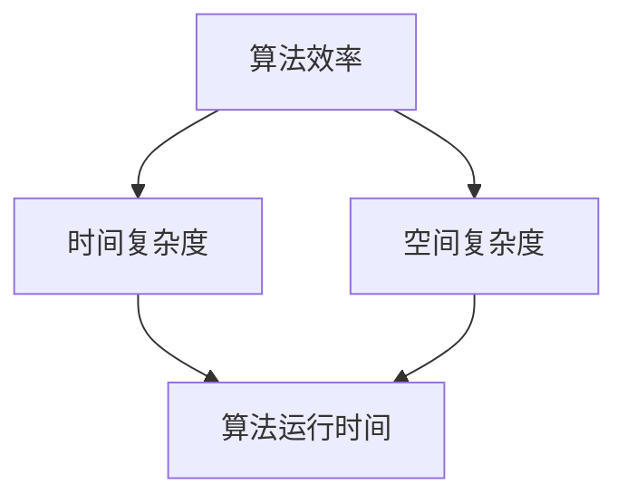
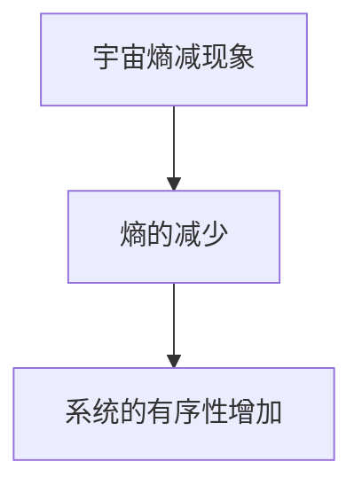

                 

### 算法效率与宇宙熵减现象的关系

#### 引言

在科技飞速发展的今天，算法已经成为计算机科学和人工智能领域中的核心驱动力。算法效率，作为衡量算法性能的关键指标，直接影响着系统性能的优化和应用范围的拓展。另一方面，宇宙熵减现象，这一物理领域的概念，近年来也逐渐受到科学界的关注。本文旨在探讨算法效率与宇宙熵减现象之间的关系，揭示两者在理论和实践中的相互影响。

#### 背景介绍

##### 核心概念术语说明

- **算法效率**：算法执行的速度和资源消耗的效率。它通常通过时间复杂度和空间复杂度来衡量。
- **宇宙熵减现象**：宇宙中某些区域或系统的熵（无序度）出现降低的现象。这是热力学第二定律的一个特例。

##### 问题背景

算法效率对于现代计算系统的重要性不言而喻。高效的算法不仅能显著降低计算成本，还能提升系统的响应速度和用户体验。而宇宙熵减现象则是一种在宇宙尺度上表现出的有序性现象，这对理解宇宙的演化过程具有重要意义。

##### 问题描述

本文将探讨以下问题：

- 算法效率如何与宇宙熵减现象相关联？
- 算法效率的提高是否有助于宇宙熵减现象的理解？
- 宇宙熵减现象能否为算法优化提供新的视角和方法？

##### 问题解决

为了回答上述问题，本文将采用以下研究方法：

- **文献综述**：梳理现有的算法效率和宇宙熵减现象的研究成果，探讨两者之间的理论联系。
- **数学模型构建**：建立算法效率与宇宙熵减现象的数学模型，分析其内在关系。
- **实证研究**：通过具体的案例，验证理论模型在实际应用中的有效性。
- **算法优化**：结合宇宙熵减现象，提出算法优化策略，提高算法效率。

##### 边界与外延

本文的研究将聚焦于算法效率和宇宙熵减现象的基本原理和相互关系。具体的应用场景和深入的技术细节将在后续章节中进一步探讨。

##### 概念结构与核心要素组成

- **算法效率**：时间复杂度、空间复杂度、算法实现细节
- **宇宙熵减现象**：熵的变化、系统的有序性、宇宙演化的背景

#### 核心概念与联系

##### 算法效率的数学模型

**定义**：算法效率通常用时间复杂度和空间复杂度来衡量。

**公式**：
$$
E = \frac{C_t \times n + C_s \times m}{T}
$$
其中，$E$代表算法效率，$C_t$和$C_s$分别代表时间复杂度和空间复杂度，$n$和$m$为算法输入规模，$T$为算法运行时间。

**Mermaid流程图**：

##### 宇宙熵减现象的数学描述

**定义**：宇宙熵减现象是指系统中熵的减少，即系统有序性的增加。

**公式**：
$$
\Delta S = S_{\text{初}} - S_{\text{末}}
$$
其中，$\Delta S$代表熵的变化，$S_{\text{初}}$和$S_{\text{末}}$分别为系统初始和末状态的熵。

**Mermaid流程图**：

##### 算法效率与宇宙熵减现象的关系探讨

**关系模型构建**：

算法效率与宇宙熵减现象之间的关系可以通过以下模型来描述：

- **协同关系**：算法优化有助于提高系统的有序性，从而促进宇宙熵减现象的发生。
- **反馈关系**：宇宙熵减现象的发现为算法优化提供了新的视角和方法，有助于提高算法效率。

**关系模型的应用场景**：

1. **分布式系统优化**：通过优化算法效率，提高系统的有序性和稳定性，从而促进宇宙熵减现象的发生。
2. **人工智能应用**：利用宇宙熵减现象的原理，开发新的算法，提高人工智能系统的效率和可靠性。

#### 研究方法与框架

##### 研究方法论

**实证研究方法**：通过具体案例，验证理论模型在实际应用中的有效性。

**定性研究方法**：分析算法效率和宇宙熵减现象的内在联系，探索其理论机制。

##### 研究框架构建

**研究框架概述**：本文的研究框架包括文献综述、数学模型构建、实证研究和算法优化四个部分。

**研究框架的核心要素**：

- **文献综述**：梳理相关研究，为后续研究提供理论基础。
- **数学模型构建**：建立算法效率和宇宙熵减现象的数学模型，分析其关系。
- **实证研究**：通过具体案例，验证理论模型的有效性。
- **算法优化**：结合宇宙熵减现象，提出算法优化策略，提高算法效率。

#### 文献综述与展望

##### 算法效率研究现状

**传统算法效率研究**：

传统算法效率研究主要关注算法的时间复杂度和空间复杂度。这些研究为现代算法优化提供了理论基础。

**现代算法效率研究**：

现代算法效率研究不仅关注时间复杂度和空间复杂度，还涉及到算法的可扩展性和鲁棒性。这些研究推动了算法在复杂场景下的应用。

##### 宇宙熵减现象研究现状

**宇宙熵减理论的发展**：

宇宙熵减现象的发现和发展，为理解宇宙的演化过程提供了新的视角。相关理论包括熵减机制、宇宙学背景辐射等。

**宇宙熵减现象的应用**：

宇宙熵减现象在多个领域得到了应用，包括宇宙学、生物学、计算机科学等。这些应用展示了宇宙熵减现象的广泛性和重要性。

##### 算法效率与宇宙熵减现象的交叉研究

**交叉研究的重要性**：

算法效率与宇宙熵减现象的交叉研究，有助于深入理解两者之间的相互关系，推动算法优化和宇宙熵减现象的研究。

**交叉研究的潜在方向**：

- **分布式系统优化**：结合宇宙熵减现象，提出新的分布式系统优化方法。
- **人工智能算法**：利用宇宙熵减现象，开发新的算法，提高人工智能系统的效率。

#### 本章小结

本章介绍了算法效率和宇宙熵减现象的核心概念、关系模型和研究方法。通过梳理相关研究，本文为后续的实证研究和算法优化提供了理论基础。接下来，我们将进一步探讨算法效率和宇宙熵减现象的数学模型，分析其内在关系，为后续章节奠定基础。

