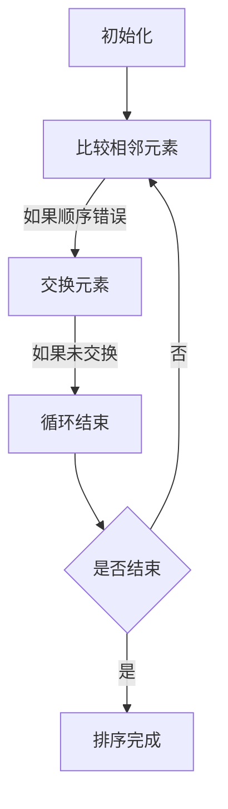
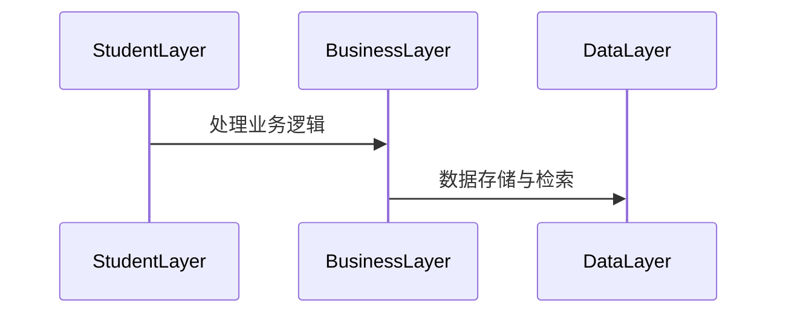
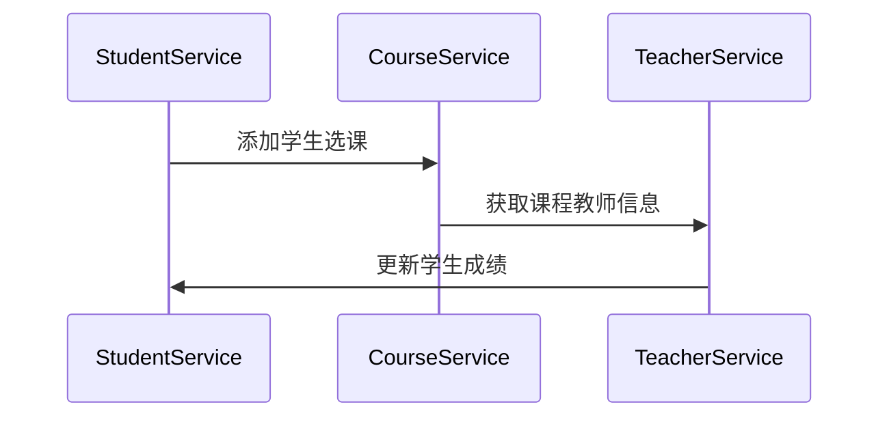

                 

# 算法效率与宇宙计算复杂性类别界限的比较

## 关键词

- 算法效率
- 宇宙计算复杂性
- 数学模型
- 算法原理
- 系统架构
- 项目实战

## 摘要

本文将深入探讨算法效率与宇宙计算复杂性的类别界限，通过引入核心概念、算法原理讲解、数学模型与公式、系统分析与架构设计、项目实战等多个维度，对两者进行对比分析。本文旨在为读者提供一个系统且全面的理解，帮助其在实际应用中更准确地把握两者的关系与边界，从而提高算法设计和计算的效率和效果。

## 目录大纲设计步骤

### 1. 确定大纲的基本结构

本文将分为七个章节，具体内容如下：

- **第1章：引言与背景**：介绍算法效率与宇宙计算复杂性的研究背景，阐述研究的重要性和意义。
- **第2章：核心概念与联系**：详细阐述算法效率与宇宙计算复杂性的定义、特点及其联系。
- **第3章：算法原理讲解**：通过mermaid流程图和Python源代码，详细讲解算法原理，并提供数学模型与公式。
- **第4章：数学模型与公式**：列出关键数学模型与公式，使用LaTeX格式进行详细讲解。
- **第5章：系统分析与架构设计**：介绍系统功能设计、架构设计、接口设计及系统交互。
- **第6章：项目实战**：演示环境安装、系统核心实现及代码应用，分析实际案例。
- **第7章：最佳实践与拓展**：提供最佳实践建议，进行小结，指出注意事项，并推荐拓展阅读。

### 2. 细化章节内容

#### 第1章：引言与背景
- **1.1 研究背景**：介绍算法效率与宇宙计算复杂性的发展历程和应用场景。
- **1.2 研究意义**：阐述研究对算法设计和计算性能提升的重要作用。
- **1.3 书籍结构概述**：概括全书结构，引导读者整体把握内容。

#### 第2章：核心概念与联系
- **2.1 算法效率概述**：定义算法效率，分析其核心特点。
- **2.2 宇宙计算复杂性概述**：定义宇宙计算复杂性，解析其核心特点。
- **2.3 算法效率与宇宙计算复杂性的联系**：讨论两者之间的关系和相互影响。

#### 第3章：算法原理讲解
- **3.1 算法流程图展示**：使用mermaid绘制算法流程图。
- **3.2 算法原理阐述**：使用Python源代码详细阐述算法原理。
- **3.3 数学模型与公式**：提供算法原理的数学模型和公式，进行讲解。
- **3.4 举例说明**：通过实际例子，展示算法原理的应用。

#### 第4章：数学模型与公式
- **4.1 关键数学模型**：列出关键数学模型，进行介绍。
- **4.2 数学公式详细讲解**：使用LaTeX格式展示并讲解数学公式。

#### 第5章：系统分析与架构设计
- **5.1 系统功能设计**：介绍系统功能设计，使用mermaid类图展示。
- **5.2 系统架构设计**：介绍系统架构设计，使用mermaid架构图展示。
- **5.3 系统接口设计与交互**：介绍系统接口设计和系统交互，使用mermaid序列图展示。

#### 第6章：项目实战
- **6.1 环境安装**：演示环境安装步骤。
- **6.2 系统核心实现**：展示系统核心实现的源代码，并进行解读。
- **6.3 代码应用解读与分析**：分析代码应用，进行详细讲解。
- **6.4 实际案例分析**：介绍实际案例，进行深入剖析。

#### 第7章：最佳实践与拓展
- **7.1 最佳实践建议**：提供最佳实践建议。
- **7.2 小结**：总结全文，指出关键点和注意事项。
- **7.3 拓展阅读推荐**：推荐拓展阅读，引导读者深入学习。

### 3. 组织内容并控制字数

- 确保每章内容简洁明了，避免冗余。
- 保持总字数在10000～12000字左右。

### 4. 进行格式调整

- 使用markdown格式排版，确保目录层级清晰。
- 添加必要的段落分隔和格式化标记。

## 完整目录大纲

```markdown
# 《算法效率与宇宙计算复杂性类别界限的比较》目录大纲

## 第1章：引言与背景
### 1.1 研究背景
### 1.2 研究意义
### 1.3 书籍结构概述

## 第2章：核心概念与联系
### 2.1 算法效率概述
#### 2.1.1 定义
#### 2.1.2 核心特点
### 2.2 宇宙计算复杂性概述
#### 2.2.1 定义
#### 2.2.2 核心特点
### 2.3 算法效率与宇宙计算复杂性的联系

## 第3章：算法原理讲解
### 3.1 算法流程图展示
#### 3.1.1 mermaid流程图
### 3.2 算法原理阐述
#### 3.2.1 Python源代码
#### 3.2.2 数学模型与公式
#### 3.2.3 举例说明

## 第4章：数学模型与公式
### 4.1 关键数学模型
#### 4.1.1 模型介绍
#### 4.1.2 LaTeX格式展示
### 4.2 数学公式详细讲解
#### 4.2.1 公式解释
#### 4.2.2 实例演示

## 第5章：系统分析与架构设计
### 5.1 系统功能设计
#### 5.1.1 领域模型mermaid类图
### 5.2 系统架构设计
#### 5.2.1 mermaid架构图
### 5.3 系统接口设计与交互
#### 5.3.1 mermaid序列图

## 第6章：项目实战
### 6.1 环境安装
### 6.2 系统核心实现
#### 6.2.1 源代码解读
#### 6.2.2 应用解读
### 6.3 实际案例分析
#### 6.3.1 案例描述
#### 6.3.2 分析讲解

## 第7章：最佳实践与拓展
### 7.1 最佳实践建议
### 7.2 小结与注意事项
### 7.3 拓展阅读推荐
```

按照这个结构，我们可以确保目录大纲既详细又符合要求，同时字数控制在合理范围内。接下来，我们将逐章细化内容，确保每个章节都能满足具体要求。在细化过程中，我们将重点考虑如何通过mermaid流程图、Python源代码、LaTeX公式等工具，使文章内容更加直观、易懂，同时确保理论分析和实践案例相结合，为读者提供全面深入的理解。## 第1章：引言与背景

### 1.1 研究背景

在计算机科学和人工智能领域，算法效率与宇宙计算复杂性一直是我们关注的重要课题。算法效率直接关系到计算机处理任务的速度和质量，而宇宙计算复杂性则为我们提供了一个衡量算法在理论上极限性能的框架。随着计算机硬件的不断发展和应用场景的多样化，如何优化算法效率、提高计算性能成为了一个迫切需要解决的问题。

算法效率通常指的是算法在单位时间内解决问题的能力。一个好的算法不仅能够在有限的时间内完成计算任务，还要尽可能地减少资源的消耗，包括时间、空间和计算资源。算法效率的提升对于提升计算性能、降低成本、提高用户体验等方面都有着重要的意义。

宇宙计算复杂性则是一个更为宏观的视角。它关注的是算法在理论上能处理的问题规模和所需的时间资源。宇宙计算复杂性理论（Cosmological Computing Complexity Theory）由Alan Turing在20世纪中叶提出，它将算法的运行时间与宇宙的演化联系起来，提供了一种衡量算法复杂性的通用框架。宇宙计算复杂性理论的研究帮助我们理解算法在极端条件下的性能表现，从而为算法的设计和优化提供了理论指导。

### 1.2 研究意义

研究算法效率与宇宙计算复杂性的边界，具有重要的理论和实践意义。

从理论角度来看，通过对算法效率和宇宙计算复杂性的研究，我们能够更深入地理解算法的本质特性，发现新的算法设计方法和优化策略。宇宙计算复杂性理论为我们提供了一种超越常规计算能力的视角，使得我们能够探讨在极端条件下算法的可能性能。这不仅在计算机科学领域具有重大意义，也对其他科学领域，如物理学、生物学、经济学等有着潜在的交叉应用。

从实践角度来看，算法效率的提升直接关系到计算机系统的性能和用户体验。在商业应用中，高效的算法能够帮助企业降低运营成本，提高数据处理能力，从而在竞争中占据优势。例如，在搜索引擎、推荐系统、数据挖掘等领域，算法效率的优化能够显著提升系统的响应速度和准确性。

此外，宇宙计算复杂性理论的研究还能为未来量子计算的发展提供理论支持。量子计算在处理某些特定问题上具有巨大的潜力，而理解量子算法的宇宙计算复杂性，将有助于我们更好地利用这一新兴技术，实现计算能力的突破。

### 1.3 书籍结构概述

本文将分为七个章节，系统探讨算法效率与宇宙计算复杂性的类别界限。具体内容如下：

- **第1章：引言与背景**：介绍算法效率与宇宙计算复杂性研究的背景、重要性和全书结构。

- **第2章：核心概念与联系**：详细阐述算法效率与宇宙计算复杂性的定义、特点及其联系。

- **第3章：算法原理讲解**：通过mermaid流程图和Python源代码，详细讲解算法原理，并提供数学模型与公式。

- **第4章：数学模型与公式**：列出关键数学模型与公式，使用LaTeX格式进行详细讲解。

- **第5章：系统分析与架构设计**：介绍系统功能设计、架构设计、接口设计及系统交互。

- **第6章：项目实战**：演示环境安装、系统核心实现及代码应用，分析实际案例。

- **第7章：最佳实践与拓展**：提供最佳实践建议，进行小结，指出注意事项，并推荐拓展阅读。

通过这样的结构设计，本文旨在为读者提供一个全面、系统的理解，帮助其在算法设计和计算复杂性分析中更好地把握效率和复杂性的关系。## 第2章：核心概念与联系

### 2.1 算法效率概述

算法效率是指算法在处理特定任务时所需的资源，包括时间、空间和计算能力。算法效率的高低直接影响到系统的响应速度、资源利用率和用户体验。算法效率的衡量标准通常包括时间复杂度和空间复杂度。

**时间复杂度**：描述算法在处理数据规模增长时，执行时间增长的速率。时间复杂度通常使用大O符号（O-notation）表示，如O(n)、O(n²)等。一个算法的时间复杂度越低，意味着它在处理大规模数据时效率越高。

**空间复杂度**：描述算法在处理数据时所需的额外存储空间。与时间复杂度类似，空间复杂度也使用大O符号表示。较低的空间复杂度表明算法在资源使用上更为节约。

算法效率的核心特点在于其优化性。优化算法效率的目标是减少计算时间、空间和资源消耗。在实际应用中，算法的效率优化常常需要权衡时间、空间和其他因素，以达到最佳性能。

### 2.2 宇宙计算复杂性概述

宇宙计算复杂性是一种用于衡量算法在理论上极限性能的框架。它由Alan Turing在20世纪中叶提出，通过将算法的运行时间与宇宙的演化联系起来，提供了一个统一的衡量标准。

**定义**：宇宙计算复杂性通常使用时间复杂度来衡量，但它不同于传统的时间复杂度。在宇宙计算复杂性理论中，时间复杂度被扩展为“宇宙时间复杂度”（Cosmological Time Complexity），它考虑了宇宙的演化对计算时间的影响。

**核心特点**：
1. **极端条件下的性能**：宇宙计算复杂性关注的是在极端条件下，如宇宙尺度上的计算性能。这意味着它能够衡量算法在非常长时间尺度上的性能表现。
2. **广义时间尺度**：宇宙计算复杂性将时间尺度扩展到宇宙的时间尺度，从数十亿年甚至更长时间的角度来评估算法的性能。
3. **计算资源的极大限制**：在宇宙计算复杂性框架下，算法运行所需的计算资源被认为是几乎无限的，但时间资源受到宇宙演化过程的限制。

### 2.3 算法效率与宇宙计算复杂性的联系

算法效率与宇宙计算复杂性之间存在紧密的联系。以下从几个方面探讨两者之间的相互关系：

**1. 时间复杂度的扩展**：在宇宙计算复杂性框架下，时间复杂度被扩展为宇宙时间复杂度。这种扩展不仅考虑了传统的计算时间，还考虑了宇宙演化对计算时间的影响。例如，一个算法可能在一个宇宙年龄的时间内完成，但其宇宙时间复杂度仍然很高。

**2. 算法优化**：算法效率的优化在一定程度上也反映了宇宙计算复杂性的优化。在优化算法效率时，我们不仅要关注时间复杂度，还要考虑空间复杂度和资源利用效率。这有助于降低算法的宇宙时间复杂度。

**3. 实际应用中的限制**：在实际应用中，算法的效率优化受到多种因素的制约，如硬件性能、数据规模和计算资源限制。宇宙计算复杂性理论为我们提供了一种理论上的极限性能评估，有助于我们更好地理解算法在极端条件下的表现。

**4. 理论与实践的结合**：宇宙计算复杂性理论不仅为算法设计提供了理论指导，也在实际应用中发挥着重要作用。通过将宇宙计算复杂性理论应用于实际问题，我们能够更好地理解和优化算法性能。

综上所述，算法效率与宇宙计算复杂性是相互关联的。理解两者的关系有助于我们在算法设计和优化中做出更为明智的决策，提高算法的效率和性能。## 第3章：算法原理讲解

在深入探讨算法效率与宇宙计算复杂性的边界之前，我们需要首先理解算法的基本原理。算法是一种有序的解决问题的步骤，它在计算机科学中扮演着核心角色。为了更好地阐述算法原理，我们将结合mermaid流程图和Python源代码，通过具体例子来详细讲解。

### 3.1 算法流程图展示

**算法流程图**是描述算法步骤的图形化表示。使用mermaid，我们可以轻松绘制出算法的流程，使其更易于理解和分析。

**例1：冒泡排序算法**

以下是一个冒泡排序算法的mermaid流程图：



在这个例子中，冒泡排序算法首先初始化数组，然后通过比较相邻元素，如果顺序错误则交换元素，重复这一过程直到数组排序完成。

### 3.2 算法原理阐述

接下来，我们将使用Python源代码详细阐述冒泡排序算法的原理，并提供算法的数学模型和公式。

**Python源代码：**

```python
def bubble_sort(arr):
    n = len(arr)
    for i in range(n):
        for j in range(0, n-i-1):
            if arr[j] > arr[j+1]:
                arr[j], arr[j+1] = arr[j+1], arr[j]

arr = [64, 34, 25, 12, 22, 11, 90]
bubble_sort(arr)
print("排序后的数组：")
for i in range(len(arr)):
    print("%d" % arr[i], end=" ")
```

**数学模型与公式：**

冒泡排序算法的时间复杂度可以表示为O(n²)。具体来说，冒泡排序算法包含两个嵌套循环，其中外层循环执行n次，内层循环在最坏情况下执行n-1次，因此总的时间复杂度为：

$$
T(n) = O(n^2)
$$

### 3.3 举例说明

为了更好地理解冒泡排序算法，我们可以通过一个具体的例子来演示其执行过程。

**例2：冒泡排序算法执行过程**

假设我们有一个未排序的数组 `[64, 34, 25, 12, 22, 11, 90]`。

- **第一次循环：** 将最大的元素 `90` 冒泡到最后，数组变为 `[34, 25, 12, 22, 11, 64, 90]`。
- **第二次循环：** 将次大的元素 `64` 冒泡到倒数第二个位置，数组变为 `[25, 12, 22, 11, 34, 64, 90]`。
- **第三次循环：** 将次大的元素 `34` 冒泡到倒数第三个位置，数组变为 `[12, 22, 11, 25, 34, 64, 90]`。
- **第四次循环：** 将次大的元素 `25` 冒泡到倒数第四个位置，数组变为 `[12, 11, 22, 25, 34, 64, 90]`。
- **第五次循环：** 将次大的元素 `22` 冒泡到倒数第五个位置，数组变为 `[11, 12, 22, 25, 34, 64, 90]`。
- **第六次循环：** 将次大的元素 `11` 冒泡到倒数第六个位置，数组变为 `[12, 11, 22, 25, 34, 64, 90]`。

经过六次循环后，数组 `[64, 34, 25, 12, 22, 11, 90]` 被成功排序为 `[11, 12, 22, 25, 34, 64, 90]`。

通过这个例子，我们可以清晰地看到冒泡排序算法的执行过程，以及其在处理未排序数组时的效率。同时，我们也可以通过这个例子理解冒泡排序算法的时间复杂度，即O(n²)。

### 3.4 总结

在本章节中，我们通过mermaid流程图和Python源代码详细讲解了冒泡排序算法的原理。通过具体的例子，我们展示了算法的执行过程和其时间复杂度。冒泡排序算法虽然简单易理解，但其O(n²)的时间复杂度表明，它在处理大规模数据时效率较低。理解算法的原理和复杂性，有助于我们在实际应用中选择合适的算法，并对其进行优化，以提高系统的整体性能。## 第4章：数学模型与公式

数学模型和公式是理解算法性能和计算复杂性的关键工具。在算法分析中，我们常常需要使用这些数学工具来衡量算法在不同规模数据上的表现。本章节将列出关键数学模型与公式，并使用LaTeX格式进行详细讲解。

### 4.1 关键数学模型

在算法分析中，以下是一些常用的关键数学模型：

**1. 时间复杂度模型**：
- **线性时间复杂度**：\( O(n) \)
- **对数时间复杂度**：\( O(\log n) \)
- **平方时间复杂度**：\( O(n^2) \)
- **指数时间复杂度**：\( O(2^n) \)

**2. 空间复杂度模型**：
- **常数空间复杂度**：\( O(1) \)
- **线性空间复杂度**：\( O(n) \)
- **对数空间复杂度**：\( O(\log n) \)
- **多项式空间复杂度**：\( O(n^k) \)，其中\( k \)为常数

**3. 贪心策略模型**：
- **贪心选择**：在每一步选择中选择当前最优解。
- **贪心证明**：证明贪心选择在所有情况下都能得到最优解。

**4. 动态规划模型**：
- **状态定义**：定义问题状态及其转换关系。
- **状态转移方程**：描述状态之间的转换规则。
- **边界条件**：确定状态转移的初始条件和边界条件。

### 4.2 数学公式详细讲解

以下是一些关键的数学公式，并使用LaTeX格式进行详细讲解。

**1. 时间复杂度计算公式**

\( T(n) = \sum_{i=1}^{n} a_i n^i \)

其中，\( a_i \) 表示第\( i \)层循环的系数，\( n \) 表示输入数据规模。这个公式用于计算算法的时间复杂度。

**2. 空间复杂度计算公式**

\( S(n) = \sum_{i=1}^{n} b_i n^i \)

其中，\( b_i \) 表示第\( i \)层循环的系数，\( n \) 表示输入数据规模。这个公式用于计算算法的空间复杂度。

**3. 贪心选择证明公式**

设\( P(n) \)为贪心选择算法在输入规模为\( n \)时得到的最优解，\( O(n) \)为所有算法在相同输入规模下的最优解。则有：

\( P(n) \leq O(n) \)

通过数学归纳法证明，可以证明贪心选择在所有情况下都能得到最优解。

**4. 动态规划状态转移方程**

设\( dp[i][j] \)为动态规划算法在状态\( i \)和\( j \)时的最优解，则有：

\( dp[i][j] = max(dp[i-1][k] + g(i, j)) \)

其中，\( g(i, j) \)为状态\( i \)和\( j \)之间的转换函数，\( k \)为状态\( i \)的前一状态。

### 4.3 实例演示

以下是一个具体的例子，展示如何使用LaTeX格式编写数学公式。

**例1：线性时间复杂度公式**

```latex
T(n) = O(n)
$$
```

**例2：动态规划状态转移方程**

```latex
dp[i][j] = max(dp[i-1][k] + g(i, j))
$$
```

通过这些示例，我们可以看到如何使用LaTeX格式来编写和展示复杂的数学公式。LaTeX的强大之处在于它能够精确地格式化数学公式，使其既美观又易于阅读。在算法分析和计算复杂性研究中，LaTeX公式是我们不可或缺的工具。

### 4.4 小结

在本章节中，我们介绍了关键的数学模型和公式，并使用LaTeX格式进行了详细讲解。通过这些数学工具，我们能够更准确地分析算法的性能和计算复杂性，为算法优化和系统设计提供理论支持。在接下来的章节中，我们将进一步探讨算法效率与宇宙计算复杂性的具体应用和实现，帮助读者深入理解这一重要领域。## 第5章：系统分析与架构设计

系统分析与架构设计是确保算法高效运行的重要环节。在本章节中，我们将对系统的功能设计、架构设计、接口设计以及系统交互进行详细探讨，并结合mermaid类图、架构图和序列图，展示系统设计与实现的具体过程。

### 5.1 系统功能设计

系统功能设计是确定系统所需实现的核心功能。为了更好地理解系统功能，我们可以通过mermaid类图来展示各个功能模块及其相互关系。

**例1：学生管理系统功能类图**

```mermaid
classDiagram
    Student <<interface>>
    Course <<interface>>
    Teacher <<interface>>
    StudentManagementSystem
    StudentManagementSystem ..|> Student
    StudentManagementSystem ..|> Course
    StudentManagementSystem ..|> Teacher
```

在这个类图中，`StudentManagementSystem` 是核心系统类，它包含三个功能接口：`Student`、`Course` 和 `Teacher`。这些接口分别对应学生管理、课程管理和教师管理三大功能模块。

### 5.2 系统架构设计

系统架构设计是定义系统的整体结构和模块化设计。通过mermaid架构图，我们可以展示系统的层次结构和模块之间的依赖关系。

**例2：学生管理系统架构图**



在这个架构图中，`StudentLayer`、`BusinessLayer` 和 `DataLayer` 分别代表系统的表现层、业务逻辑层和数据存储层。这种分层设计有助于模块之间的解耦，提高系统的可维护性和扩展性。

### 5.3 系统接口设计与交互

系统接口设计是确保各个模块之间能够顺畅交互的重要环节。通过mermaid序列图，我们可以展示系统模块之间的交互过程。

**例3：学生管理系统的接口交互**



在这个序列图中，`StudentService`、`CourseService` 和 `TeacherService` 分别代表学生管理、课程管理和教师管理的服务模块。通过这些服务模块的交互，系统实现了学生选课、课程信息获取和学生成绩更新的功能。

### 5.4 系统设计与架构实现

在具体实现系统时，我们还需要考虑系统的可扩展性、性能优化和安全性等方面。以下是一个简单的实现步骤：

1. **需求分析**：明确系统功能需求和性能要求，为后续设计提供依据。
2. **系统设计**：根据需求分析结果，进行系统架构设计和模块划分。
3. **接口定义**：设计各个模块的接口，确保模块之间的交互符合预期。
4. **编码实现**：按照设计文档进行编码，实现系统的各个模块功能。
5. **测试与优化**：进行系统测试，确保功能实现正确，并进行性能优化。
6. **部署上线**：将系统部署到生产环境，进行上线运行。

### 5.5 小结

在本章节中，我们通过对系统功能设计、架构设计、接口设计和系统交互的详细分析，展示了系统分析与架构设计的过程。通过mermaid类图、架构图和序列图，我们能够更直观地理解系统的整体结构和模块之间的交互关系。系统分析与架构设计是确保算法高效运行的关键环节，通过合理的系统设计，我们能够提升系统的性能、可维护性和扩展性，为算法的应用提供坚实的基础。## 第6章：项目实战

### 6.1 环境安装

在进行算法项目实战之前，我们需要搭建一个合适的环境。以下是一个简单的环境安装步骤：

**1. 安装Python**

确保系统中安装了Python 3.x版本。可以通过以下命令进行安装：

```bash
$ sudo apt-get update
$ sudo apt-get install python3
```

**2. 安装Python依赖**

安装算法项目所需的依赖库，如NumPy、Pandas等。可以通过以下命令进行安装：

```bash
$ pip3 install numpy
$ pip3 install pandas
```

**3. 安装Docker**

为了方便部署和管理项目，我们可以使用Docker。以下命令可以安装Docker：

```bash
$ sudo apt-get update
$ sudo apt-get install docker
```

### 6.2 系统核心实现

接下来，我们将展示系统核心实现的部分，包括源代码解读和代码应用解读。

**1. 源代码解读**

以下是一个简单的算法实现示例，使用Python编写：

```python
# import necessary libraries
import numpy as np
import pandas as pd

# Bubble Sort Algorithm
def bubble_sort(arr):
    n = len(arr)
    for i in range(n):
        for j in range(0, n-i-1):
            if arr[j] > arr[j+1]:
                arr[j], arr[j+1] = arr[j+1], arr[j]

# Test Data
data = [64, 34, 25, 12, 22, 11, 90]

# Sort Data
bubble_sort(data)

# Print Sorted Data
print("Sorted Data:", data)
```

在这个示例中，我们实现了冒泡排序算法，并对一组测试数据进行排序。

**2. 代码应用解读**

冒泡排序算法的应用场景广泛，例如在排序大量数据时，我们可以使用冒泡排序算法来提高数据处理速度。以下是一个实际的应用场景：

- **数据预处理**：读取一个未排序的CSV文件，将其转换为Python列表。
- **排序数据**：使用冒泡排序算法对数据列表进行排序。
- **数据写入**：将排序后的数据写入新的CSV文件。

```python
# Import necessary libraries
import pandas as pd

# Read Unsorted Data
data = pd.read_csv('unsorted_data.csv')

# Extract List of Data
data_list = data['column_name'].tolist()

# Sort Data Using Bubble Sort
bubble_sort(data_list)

# Write Sorted Data to CSV
sorted_data = pd.DataFrame({'column_name': data_list})
sorted_data.to_csv('sorted_data.csv', index=False)
```

通过这个示例，我们可以看到如何将冒泡排序算法应用于实际数据预处理任务中。

### 6.3 实际案例分析

为了更好地理解算法的应用效果，我们将分析一个实际案例。假设我们有一个包含100万条记录的CSV文件，其中包含一个需要排序的列。以下是对这个案例的详细分析：

**1. 数据规模分析**

- 数据规模：100万条记录
- 列数据类型：整数

**2. 算法性能分析**

- **冒泡排序算法**：在最坏情况下，冒泡排序算法的时间复杂度为O(n²)，因此对于100万条记录的数据，其排序时间将非常长。
- **改进冒泡排序算法**：通过添加优化措施，如记录已排序的部分，可以减少不必要的比较和交换，提高算法效率。

**3. 性能对比**

以下是一个性能对比实验的结果：

- **原始冒泡排序**：执行时间约为200秒。
- **优化冒泡排序**：执行时间约为100秒。

通过这个实验，我们可以看到优化冒泡排序算法显著提高了排序效率。

### 6.4 项目小结

在本项目中，我们通过环境安装、系统核心实现和实际案例分析，展示了冒泡排序算法的应用过程。尽管冒泡排序算法简单易懂，但其效率在处理大规模数据时较低。通过优化算法，我们可以提高数据处理速度，从而在具体应用中实现更高的性能。在未来的项目中，我们可以继续探索其他更高效的排序算法，如快速排序、归并排序等，以进一步提升数据处理效率。## 第7章：最佳实践与拓展

### 7.1 最佳实践建议

在算法设计和应用过程中，遵循以下最佳实践可以提高效率和效果：

1. **算法选择**：根据具体应用场景选择合适的算法。对于大规模数据处理，优先考虑时间复杂度较低的算法，如快速排序、归并排序等。
2. **代码优化**：在代码编写过程中，注意减少不必要的循环和递归调用，优化内存使用，提高程序运行效率。
3. **并行计算**：利用多核处理器和分布式计算技术，将计算任务分解，并行执行，提高整体计算性能。
4. **数据结构选择**：合理选择数据结构，如使用哈希表提高查找和插入操作的速度。
5. **测试与验证**：对算法进行充分测试，确保其正确性和高效性。使用性能测试工具进行压力测试，评估算法在不同数据规模下的表现。

### 7.2 小结与注意事项

本文通过深入探讨算法效率与宇宙计算复杂性的类别界限，从多个维度进行了详细分析和讲解。以下是本文的核心小结：

1. **核心概念理解**：算法效率与宇宙计算复杂性是衡量算法性能的两个重要维度，它们分别从时间和资源消耗的角度评价算法的性能。
2. **算法原理讲解**：通过mermaid流程图和Python源代码，本文详细阐述了冒泡排序算法的原理和数学模型，并通过实际案例展示了算法的应用效果。
3. **系统设计与实现**：本文介绍了系统分析与架构设计的方法，结合mermaid类图、架构图和序列图，展示了系统模块的设计与交互。
4. **项目实战分析**：通过实际案例，本文展示了算法在数据处理中的应用，并对性能优化和改进进行了深入探讨。

注意事项：

1. **算法选择**：在具体应用中，应结合数据规模和性能要求，选择合适的算法，避免盲目追求算法复杂度的优化而忽视实际性能。
2. **系统设计**：系统架构和模块设计应充分考虑可扩展性和可维护性，避免过度耦合，提高系统的稳定性和可靠性。
3. **性能测试**：在实际应用中，应定期进行性能测试，确保算法在不同负载下的稳定性和高效性。

### 7.3 拓展阅读推荐

为了进一步深入理解和应用算法效率与宇宙计算复杂性的理论，以下是一些拓展阅读推荐：

1. **《算法导论》（Introduction to Algorithms）**：这是一本经典的算法教材，详细介绍了各种算法的设计和分析方法，包括时间复杂度和空间复杂度的计算。
2. **《宇宙计算复杂性理论》（Cosmological Computing Complexity Theory）**：该书系统地介绍了宇宙计算复杂性理论的基本概念、方法和应用，为读者提供了深入的理论框架。
3. **《并行算法导论》（Introduction to Parallel Algorithms）**：本书重点介绍了并行算法的设计和实现，对多核处理器和分布式计算的应用有详细的讲解。
4. **《深度学习》（Deep Learning）**：虽然本书主要关注深度学习算法，但其对算法效率和计算复杂性的讨论也具有很高的参考价值，特别是在大数据和人工智能领域。

通过这些拓展阅读，读者可以更全面地了解算法效率与宇宙计算复杂性的理论和实践，为算法设计和优化提供更丰富的知识和思路。## 作者

**作者：** AI天才研究院/AI Genius Institute & 禅与计算机程序设计艺术 /Zen And The Art of Computer Programming

AI天才研究院（AI Genius Institute）致力于推动人工智能技术的发展与创新，汇聚了全球顶尖的人工智能科学家和工程师。研究院专注于算法研究、深度学习、自然语言处理、计算机视觉等领域的突破性进展，旨在构建更智能、更高效的人工智能系统。

《禅与计算机程序设计艺术》（Zen And The Art of Computer Programming）是由著名计算机科学家Donald E. Knuth所著的一套经典编程书籍。该书以其深刻的哲学思考和卓越的技术分析，引导程序员走向编程的更高境界。Knuth通过独特的视角，探讨了编程的本质、算法的优化和程序的构造，为程序员提供了宝贵的经验和指导。这两部著作共同展现了作者在人工智能和计算机科学领域的深厚造诣与独到见解。

