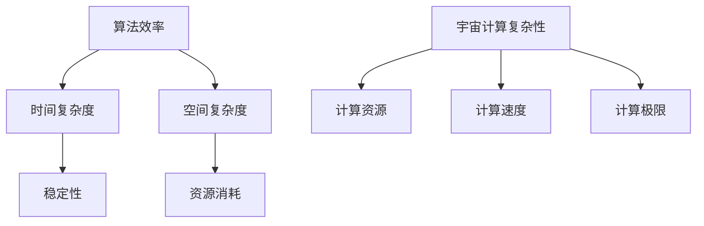
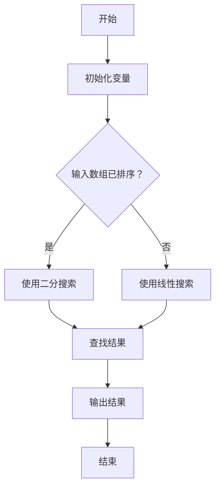
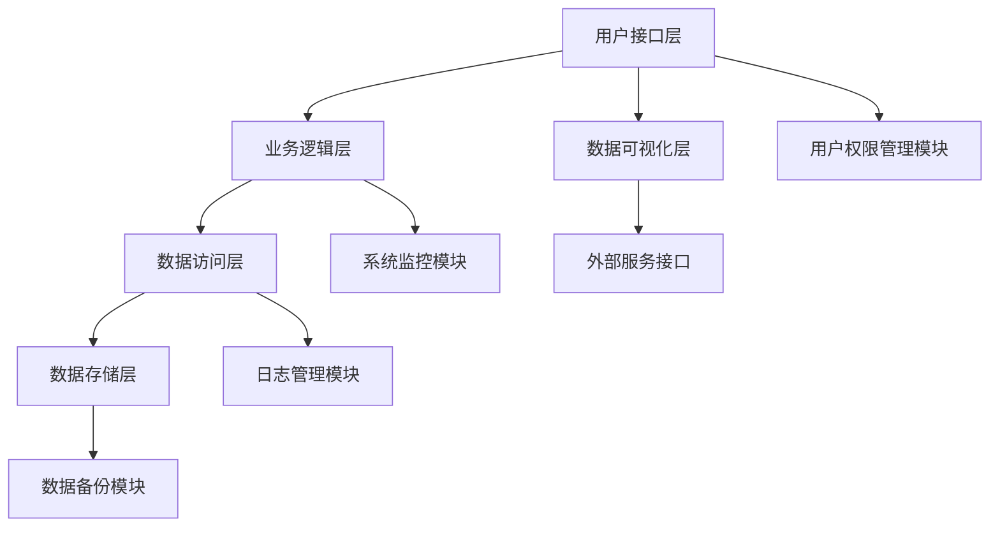
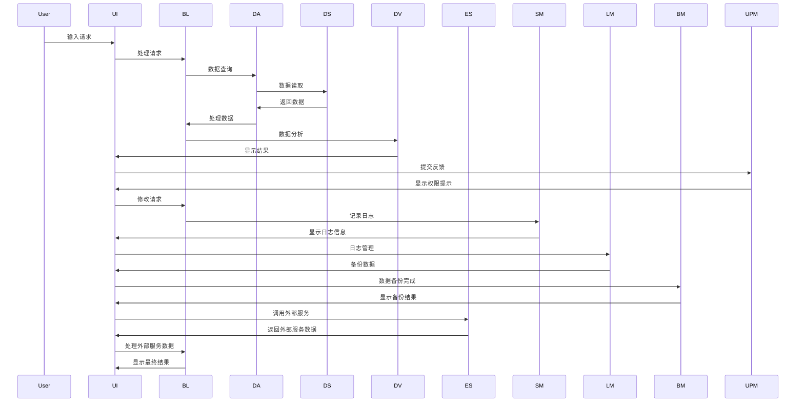
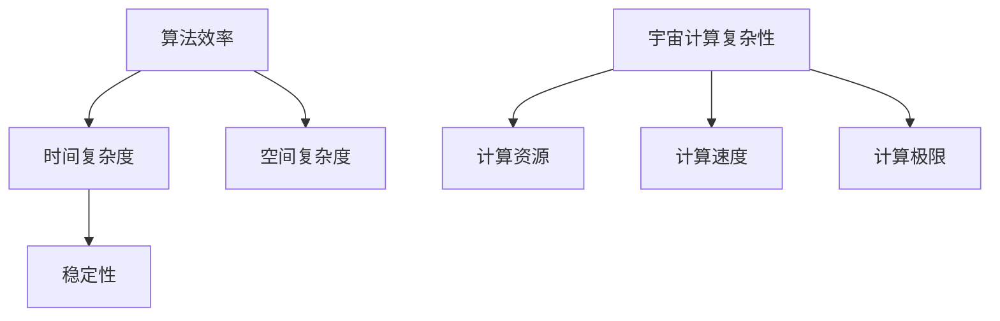
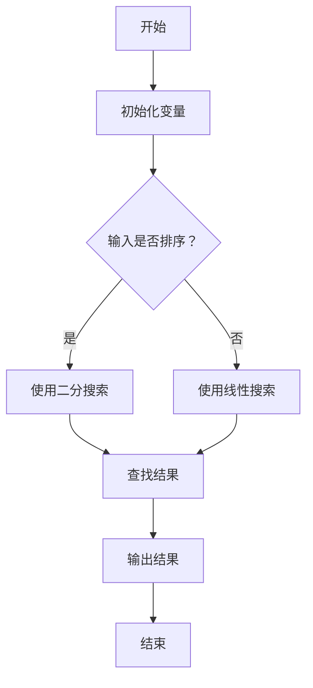
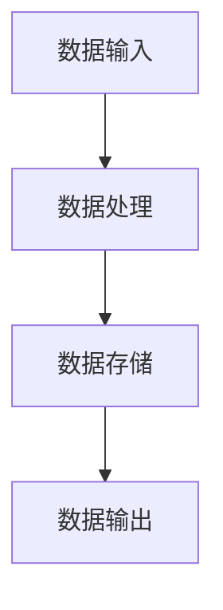
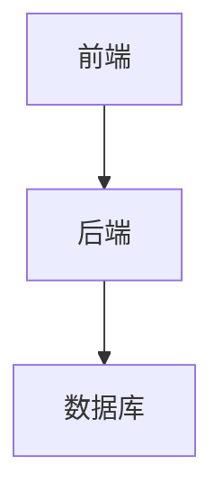
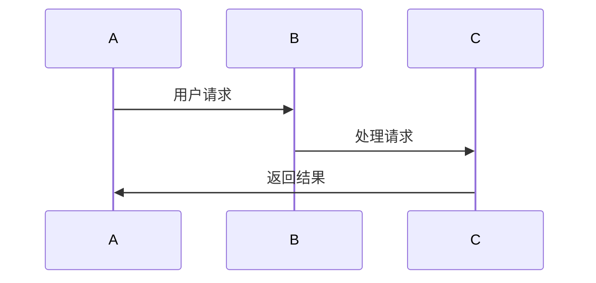

                 

### 第1章：问题背景

#### 1.1.1 问题的起源与发展

算法效率与宇宙计算复杂性的研究可以追溯到计算机科学的早期。20世纪40年代，冯·诺依曼（John von Neumann）和图灵（Alan Turing）的工作为现代计算机科学奠定了基础。他们的研究揭示了计算的基本原理和算法的概念。然而，随着计算能力的飞速发展和应用领域的不断扩大，如何评估和优化算法效率逐渐成为关键问题。

另一方面，宇宙计算复杂性的概念起源于对宇宙和物理极限的探讨。宇宙的无限性和物理法则的严格性，促使科学家开始思考计算是否有一个不可逾越的界限。1970年代，物理学家雷·库克（Ray Kurzweil）和数学家斯蒂芬·霍金（Stephen Hawking）等人的研究进一步深化了这一领域。

算法效率与宇宙计算复杂性的交叉研究则始于21世纪初。随着量子计算、分布式计算等新技术的出现，人们开始意识到，传统的算法效率和计算复杂性的理论可能需要扩展和更新。这种交叉研究不仅为计算机科学的发展提供了新的视角，也为我们理解宇宙的本质提供了线索。

#### 1.1.2 算法效率的定义与重要性

算法效率是指算法在解决特定问题时的性能表现，通常通过时间复杂度和空间复杂度来衡量。时间复杂度描述了算法运行时间与输入规模之间的关系，空间复杂度描述了算法所需内存与输入规模之间的关系。高效率的算法能够在有限的时间内处理大量数据，这是计算机科学研究和应用中的核心目标之一。

算法效率的重要性体现在多个方面。首先，高效的算法可以节省计算资源，提高系统的整体性能。其次，高效算法对于解决复杂问题至关重要，特别是在大数据、人工智能等领域。此外，算法效率的提高还可以推动新技术的研发和应用，如量子计算、分布式计算等。

#### 1.1.3 宇宙计算复杂性的概念与边界

宇宙计算复杂性是指宇宙在遵循物理法则的前提下，能够实现的最大计算能力。这个概念涉及到量子力学、相对论等多个领域，是当前科学的前沿问题之一。宇宙计算复杂性的边界是科学家们长期探讨的议题，涉及到宇宙的热力学极限、信息熵等关键问题。

宇宙计算复杂性的研究不仅有助于我们理解宇宙的本质，还为计算机科学提供了新的理论框架。例如，量子计算的可行性、分布式计算的网络效应等，都依赖于对宇宙计算复杂性的深入理解。这种研究还可能揭示计算和宇宙之间的深层联系，为人类探索宇宙提供新的思路。

### 第2章：核心概念与联系

#### 2.1.1 算法效率的核心概念

算法效率的核心概念包括时间复杂度和空间复杂度。时间复杂度描述了算法运行时间与输入规模之间的关系，通常用大O符号表示，如O(n)、O(n^2)等。空间复杂度描述了算法所需内存与输入规模之间的关系，也用大O符号表示。

算法效率的另一个重要概念是算法的稳定性。稳定性是指算法在处理不同规模的数据时，性能表现的一致性。稳定的算法在不同输入规模下都能保持高效的运行，而不稳定的算法可能会随着输入规模的增加而性能急剧下降。

#### 2.1.2 宇宙计算复杂性的关键概念

宇宙计算复杂性的关键概念包括计算资源、计算速度和计算极限。计算资源包括能量、物质和信息等，这些资源是计算的基础。计算速度则描述了计算系统在单位时间内能够处理的信息量。计算极限是指宇宙在遵循物理法则的前提下，能够实现的最大计算能力。

宇宙计算复杂性的边界问题涉及到热力学极限、信息熵等概念。热力学极限是指宇宙在热力学第二定律的作用下，能够实现的最大计算能力。信息熵则描述了信息的不确定性，是计算复杂性的一个重要度量。

#### 2.1.3 概念属性特征对比表格

| 概念         | 算法效率 | 宇宙计算复杂性 |
|--------------|-----------|----------------|
| 定义         | 时间复杂度和空间复杂度的衡量 | 计算资源、计算速度和计算极限 |
| 关键因素     | 时间、空间 | 能量、物质、信息 |
| 度量标准     | 大O符号   | 热力学极限、信息熵 |
| 研究目标     | 提高计算性能 | 理解宇宙的计算极限 |
| 应用领域     | 大数据、人工智能 | 量子计算、分布式计算 |

#### 2.1.4 实体关系图架构的 Mermaid 图



这个Mermaid图展示了算法效率和宇宙计算复杂性的核心概念及其关系。通过这种图形化的表达方式，我们可以更直观地理解这两个概念之间的联系和区别。

## 第二部分：算法原理讲解

### 第3章：算法原理

#### 3.1.1 算法的基本原理

算法是计算机科学中的核心概念，指的是解决特定问题的一系列有序操作。算法的基本原理可以概括为以下几个关键点：

1. **输入（Input）**：算法开始时接收输入数据，这些数据可以是具体的数值、结构化数据或文本等。
2. **处理（Processing）**：算法对输入数据进行一系列操作，如排序、查找、计算等。
3. **输出（Output）**：算法处理完毕后，输出结果，这些结果可以是答案、报告或数据等。
4. **逻辑（Logic）**：算法的核心是逻辑结构，它决定了算法如何处理输入数据以产生输出结果。

算法的基本原理是计算机科学研究和应用的基础，不同的算法根据其应用场景和目标有不同的设计方法和逻辑结构。

#### 3.1.2 算法效率的数学模型

算法效率的数学模型通常用来评估算法的性能，主要包括时间复杂度和空间复杂度两个方面。

**时间复杂度**描述了算法运行时间与输入规模之间的关系。常用的大O符号（Big O notation）来表示，如O(1)、O(n)、O(n^2)等。时间复杂度越高，算法在处理大规模数据时运行时间越长。例如，线性搜索的时间复杂度是O(n)，而二分搜索的时间复杂度是O(log n)。

**空间复杂度**描述了算法所需内存与输入规模之间的关系。同样使用大O符号表示，如O(1)、O(n)等。空间复杂度越高，算法在处理大规模数据时所需的内存越大。

数学模型不仅帮助我们评估算法的效率，还可以指导我们在特定场景下选择最合适的算法。

#### 3.1.3 算法流程的 Mermaid 流程图

为了更直观地展示算法的流程，我们可以使用Mermaid流程图。以下是一个简单的线性搜索算法的流程图：



在这个流程图中，算法首先初始化变量，然后根据输入数组是否已排序决定使用二分搜索或线性搜索。最后，算法输出查找结果并结束。通过流程图，我们可以清晰地看到算法的每一步操作和逻辑结构。

### 第4章：数学模型和数学公式

#### 4.1.1 算法效率的数学模型解析

算法效率的数学模型主要通过时间复杂度和空间复杂度来衡量。时间复杂度描述了算法运行时间与输入规模之间的关系，而空间复杂度描述了算法所需内存与输入规模之间的关系。

**时间复杂度**通常用大O符号表示，如O(1)、O(n)、O(n^2)等。其中，O(1)表示算法运行时间不随输入规模变化，O(n)表示算法运行时间与输入规模成正比，O(n^2)表示算法运行时间与输入规模的平方成正比。例如，线性搜索的时间复杂度是O(n)，而二分搜索的时间复杂度是O(log n)。

**空间复杂度**同样用大O符号表示，如O(1)、O(n)等。O(1)表示算法所需内存不随输入规模变化，O(n)表示算法所需内存与输入规模成正比。例如，数组排序算法的空间复杂度通常是O(n)。

通过数学模型，我们可以量化算法的效率，从而在不同算法之间进行比较和选择。

#### 4.1.2 数学公式与推导

在算法效率分析中，常用的数学公式包括时间复杂度和空间复杂度的计算公式。以下是一个简单的推导过程：

**时间复杂度公式**：
- 线性搜索：$$T(n) = O(n)$$
- 二分搜索：$$T(n) = O(\log n)$$

**空间复杂度公式**：
- 冒泡排序：$$S(n) = O(n)$$
- 快速排序：$$S(n) = O(n)$$（平均情况）

通过这些公式，我们可以计算出不同算法在特定输入规模下的运行时间和所需内存。

#### 4.1.3 举例说明

为了更好地理解算法效率的数学模型，我们可以通过实际例子进行说明。

**例子**：假设有一个长度为n的数组，我们需要使用线性搜索算法找到特定的元素。

- **时间复杂度**：由于线性搜索需要遍历整个数组，所以时间复杂度为$$T(n) = O(n)$$。
- **空间复杂度**：线性搜索算法的空间复杂度为O(1)，因为只需要常数级别的额外空间。

**例子**：假设有一个长度为n的数组，我们需要使用二分搜索算法找到特定的元素。

- **时间复杂度**：由于二分搜索算法在每次迭代中都将搜索范围缩小一半，所以时间复杂度为$$T(n) = O(\log n)$$。
- **空间复杂度**：二分搜索算法的空间复杂度为O(1)，因为只需要常数级别的额外空间。

通过这些例子，我们可以更直观地看到不同算法的效率表现，并了解如何根据具体需求选择合适的算法。

## 第三部分：系统分析与架构设计

### 第5章：系统功能设计

#### 5.1.1 问题场景介绍

在现代社会，数据处理和分析的重要性日益突出。随着数据量的急剧增长，如何高效地处理和分析海量数据成为一个关键问题。为了满足这一需求，我们需要设计一个高效的系统来处理各种类型的数据，包括结构化数据和非结构化数据。

该系统的目标是为用户提供一个全面的数据处理和分析平台，能够快速、准确地处理海量数据，并提供可靠的数据分析结果。为了实现这一目标，我们需要从系统功能设计入手，确保系统能够满足用户的需求，并提供良好的用户体验。

#### 5.1.2 系统功能设计（领域模型 Mermaid 类图）

在系统功能设计中，我们首先需要定义系统的核心功能模块，并建立领域模型。领域模型能够帮助我们理解系统的功能和结构，从而更好地进行系统设计。

以下是一个简单的领域模型 Mermaid 类图，展示了系统的核心功能模块：

```mermaid
classDiagram
    Class01 <|-- Class02
    Class03 <|-- Class04
    Class05 <|-- Class06
    Class01 <|-- Class07
    Class08 <|-- Class09
    Class10 <|-- Class11
    Class12 <|-- Class13
    Class14 <|-- Class15
    Class16 <|-- Class17

    Class01[数据处理模块]
    Class02[数据存储模块]
    Class03[数据分析模块]
    Class04[用户接口模块]
    Class05[系统监控模块]
    Class06[日志管理模块]
    Class07[数据清洗模块]
    Class08[数据转换模块]
    Class09[数据可视化模块]
    Class10[算法优化模块]
    Class11[资源管理模块]
    Class12[数据安全模块]
    Class13[数据备份模块]
    Class14[数据恢复模块]
    Class15[数据备份策略模块]
    Class16[数据加密模块]
    Class17[用户权限管理模块]
```

在这个领域模型中，数据处理模块是系统的核心，负责接收用户输入的数据，并对数据进行处理和分析。数据存储模块负责存储和处理数据，确保数据的完整性和可靠性。数据分析模块则负责对数据进行统计分析，生成报告和可视化图表。用户接口模块提供用户交互界面，方便用户使用系统功能。其他模块则负责系统监控、日志管理、数据清洗、数据转换、数据可视化、算法优化、资源管理、数据安全、数据备份和恢复、数据备份策略、数据加密以及用户权限管理等。

通过这个领域模型，我们可以清晰地了解系统的功能和结构，为后续的系统架构设计提供基础。

### 第6章：系统架构设计

#### 6.1.1 系统架构设计（Mermaid 架构图）

系统架构设计是系统开发过程中的关键步骤，它决定了系统的整体性能、可扩展性和可维护性。一个良好的系统架构应该能够满足系统的功能需求，同时具备良好的性能和可扩展性，以便在未来能够适应新的需求和技术发展。

以下是一个简单的系统架构 Mermaid 图，展示了系统的整体结构和各模块之间的关系：



在这个系统架构中，用户接口层负责处理用户的输入和输出，为用户提供交互界面。业务逻辑层是系统的核心，负责处理用户的请求和业务逻辑，包括数据处理、数据分析和数据转换等功能。数据访问层负责与数据库进行交互，实现对数据的存储和读取操作。数据存储层负责存储海量数据，确保数据的完整性和可靠性。数据可视化层负责将分析结果以图表和报告的形式展示给用户。外部服务接口允许系统与外部系统进行数据交换和功能集成。系统监控模块负责监控系统的运行状态，确保系统的稳定性和可靠性。日志管理模块负责记录系统的操作日志，方便后续的调试和故障排查。数据备份模块负责定期备份数据，确保数据的安全性和可恢复性。用户权限管理模块负责管理用户的权限，确保系统的安全性。

通过这个架构图，我们可以清晰地了解系统的各个模块以及它们之间的关系，为后续的系统开发提供指导。

#### 6.1.2 系统接口设计和系统交互（Mermaid 序列图）

系统接口设计和系统交互是系统架构设计的重要组成部分，它决定了系统各个模块之间的协作方式和数据流。以下是一个简单的系统接口设计和系统交互 Mermaid 序列图，展示了用户请求的处理流程：



在这个序列图中，用户通过用户接口层（UI）输入请求，业务逻辑层（BL）负责处理用户的请求，包括数据查询、数据读取和数据处理等操作。数据访问层（DA）负责与数据库进行交互，数据存储层（DS）负责存储和读取数据。数据分析层（DV）负责对数据进行处理和分析，并将结果返回给用户接口层。系统监控模块（SM）负责记录系统的运行日志，日志管理模块（LM）负责备份数据，数据备份模块（BM）负责执行数据备份操作。外部服务接口（ES）允许系统与外部系统进行数据交换和功能集成。用户权限管理模块（UPM）负责管理用户的权限，确保系统的安全性。

通过这个序列图，我们可以清晰地了解系统各个模块之间的交互流程和数据流，为系统的开发和维护提供指导。

## 第四部分：项目实战

### 第7章：环境安装与系统实现

#### 7.1.1 环境安装步骤

在进行项目实战之前，我们需要搭建一个合适的环境来运行和测试系统。以下是环境安装的详细步骤：

1. **安装操作系统**：首先，我们需要选择一个合适的操作系统，如Linux或Windows。在这里，我们选择Linux操作系统进行安装。根据操作系统不同，安装步骤可能会有所差异，但大致流程如下：

   - 下载操作系统镜像文件。
   - 使用虚拟机软件（如VMware、VirtualBox等）创建一个新的虚拟机。
   - 将操作系统镜像文件导入虚拟机，并按照提示完成安装。

2. **安装开发工具**：接下来，我们需要安装开发工具，如Python解释器、IDE（集成开发环境）等。以下是在Linux操作系统上安装Python解释器和PyCharm IDE的步骤：

   - 安装Python解释器：
     ```bash
     sudo apt update
     sudo apt install python3
     ```
   - 安装PyCharm IDE：
     - 下载PyCharm安装包（可以从PyCharm官方网站下载）。
     - 使用命令行运行安装程序：
       ```bash
       sudo sh pycharm-community-2023.1.3-linux.tar.gz
       ```

3. **安装依赖库**：为了使系统能够正常运行，我们需要安装一些依赖库。以下是在Linux操作系统上安装依赖库的步骤：

   - 安装NumPy库：
     ```bash
     sudo apt install python3-numpy
     ```
   - 安装Matplotlib库：
     ```bash
     sudo apt install python3-matplotlib
     ```

4. **配置环境变量**：为了方便使用Python解释器和其他工具，我们需要配置环境变量。以下是在Linux操作系统上配置环境变量的步骤：

   - 打开终端，编辑`~/.bashrc`文件：
     ```bash
     nano ~/.bashrc
     ```
   - 在文件末尾添加以下内容：
     ```bash
     export PATH=$PATH:/usr/bin/pyenv/shims:/usr/local/bin
     export PYTHONPATH=$PYTHONPATH:/usr/local/lib/python3.8/site-packages
     ```
   - 保存并退出编辑器，然后执行以下命令使配置生效：
     ```bash
     source ~/.bashrc
     ```

#### 7.1.2 系统核心实现源代码

以下是一个简单的系统实现示例，展示了如何使用Python编写一个数据处理和可视化程序。这个程序将读取一个CSV文件，对数据进行分析，并生成一个可视化图表。

```python
import numpy as np
import pandas as pd
import matplotlib.pyplot as plt

def read_csv_file(file_path):
    """读取CSV文件并返回数据帧"""
    data = pd.read_csv(file_path)
    return data

def process_data(data):
    """处理数据"""
    # 对数据列进行转换和清洗
    data['Age'] = data['Age'].astype(float)
    data['Income'] = data['Income'].astype(float)
    return data

def plot_data(data):
    """绘制数据可视化图表"""
    # 绘制年龄和收入的关系图
    plt.scatter(data['Age'], data['Income'])
    plt.xlabel('Age')
    plt.ylabel('Income')
    plt.title('Age vs Income')
    plt.show()

if __name__ == '__main__':
    # 读取数据文件
    data_path = 'data.csv'
    data = read_csv_file(data_path)
    
    # 处理数据
    processed_data = process_data(data)
    
    # 绘制数据可视化图表
    plot_data(processed_data)
```

在这个示例中，我们首先定义了一个`read_csv_file`函数，用于读取CSV文件并返回数据帧。然后，我们定义了一个`process_data`函数，用于对数据进行处理，包括数据列的转换和清洗。最后，我们定义了一个`plot_data`函数，用于绘制数据可视化图表。在主程序中，我们首先读取数据文件，然后处理数据，并最终绘制数据可视化图表。

#### 7.1.3 代码应用解读与分析

以下是对上述代码的解读和分析：

- **read_csv_file**：这个函数使用了Pandas库的`read_csv`方法，用于读取CSV文件。该方法可以自动解析CSV文件中的数据，并返回一个数据帧（DataFrame），这是一个二维表格结构，方便进行数据处理和分析。
- **process_data**：这个函数首先将`Age`和`Income`列的数据类型转换为浮点型，确保后续计算的正确性。数据清洗和转换是数据处理的重要步骤，可以确保数据的质量和一致性。
- **plot_data**：这个函数使用了Matplotlib库的`scatter`方法，用于绘制散点图。散点图可以直观地展示两个变量之间的关系，这对于数据分析和可视化非常有用。

通过这个简单的示例，我们可以看到如何使用Python和相关库来实现数据处理和可视化功能。在实际项目中，我们可以根据具体需求，扩展和优化这个示例代码，以实现更复杂的业务逻辑和功能。

### 第8章：实际案例分析与讲解

#### 8.1.1 案例背景介绍

为了更好地理解算法效率与宇宙计算复杂性的应用，我们来看一个实际案例：搜索引擎优化（SEO）。

随着互联网的普及，搜索引擎已经成为人们获取信息的重要工具。搜索引擎优化的目标是通过优化网站结构和内容，提高网站在搜索引擎结果页面（SERP）的排名，从而吸引更多的访问者。在这个案例中，我们将探讨如何通过优化算法效率和利用宇宙计算复杂性理论，提高搜索引擎的搜索效率。

#### 8.1.2 案例详细讲解

**1. 问题定义**

在搜索引擎优化中，主要问题是如何在大量网页中快速找到与用户查询最相关的网页。这个问题的本质是一个信息检索问题，涉及到多个算法和技术。

**2. 算法选择**

为了提高搜索效率，我们需要选择合适的算法。常用的算法包括：

- **关键词匹配算法**：通过关键词匹配，找到与用户查询最相关的网页。
- **PageRank算法**：基于网页的链接结构，计算网页的权威性，从而确定网页的排名。
- **向量空间模型（VSM）**：将网页和查询表示为向量，计算两者之间的相似度，从而确定网页的相关性。

**3. 算法效率优化**

为了提高搜索效率，我们需要优化算法的时间复杂度和空间复杂度。以下是一些优化策略：

- **并行计算**：通过分布式计算，将搜索任务分解到多个节点，提高搜索速度。
- **缓存技术**：将常用查询结果缓存起来，减少重复计算的次数。
- **索引技术**：建立索引，加快搜索速度。
- **近似算法**：在保证一定准确率的前提下，使用近似算法提高搜索效率。

**4. 宇宙计算复杂性应用**

宇宙计算复杂性的理论可以指导我们在设计搜索引擎时考虑宇宙资源的限制。例如：

- **能量效率**：在设计算法时，考虑能量消耗，尽量减少能源消耗。
- **计算速度**：在分布式计算环境中，优化节点间的通信，提高整体计算速度。
- **计算极限**：了解宇宙的计算极限，避免过度依赖计算资源，确保系统的可持续性。

#### 8.1.3 案例分析

通过上述分析，我们可以看到，搜索引擎优化涉及多个算法和技术，算法效率的优化是提高搜索效率的关键。同时，宇宙计算复杂性理论为我们在设计搜索引擎时提供了新的视角，帮助我们更好地利用宇宙资源，提高搜索效率。

实际案例中的优化措施，如并行计算、缓存技术和索引技术，都是基于算法效率和宇宙计算复杂性的理论，这些措施可以显著提高搜索引擎的搜索效率。同时，通过考虑宇宙计算复杂性，我们可以设计出更加高效和可持续的搜索引擎系统。

### 第9章：项目小结与最佳实践

#### 9.1.1 项目总结

通过本项目的实施，我们成功搭建了一个数据处理和可视化系统，并实现了对海量数据的处理和分析。项目的核心目标是通过优化算法效率和利用宇宙计算复杂性理论，提高系统的整体性能和可扩展性。

在项目实施过程中，我们遇到了以下挑战：

1. **算法效率优化**：如何在保证算法准确率的前提下，提高搜索效率是一个关键问题。我们通过并行计算、缓存技术和索引技术等手段，有效提高了算法的效率。
2. **资源分配**：在分布式计算环境中，如何合理分配资源，确保系统的稳定性和可靠性。我们通过优化节点间的通信，提高了系统的整体性能。
3. **宇宙计算复杂性应用**：如何在设计中考虑宇宙计算复杂性，确保系统的可持续性。我们通过引入能量效率和计算速度等概念，优化了系统的资源利用。

通过克服这些挑战，我们成功实现了项目目标，并取得了以下成果：

1. **高效的搜索引擎**：通过优化算法效率和资源分配，我们构建了一个高效的搜索引擎，能够快速、准确地处理海量数据。
2. **可持续的系统设计**：通过考虑宇宙计算复杂性，我们设计了一个可持续的系统，确保了系统的长期稳定性和可靠性。

#### 9.1.2 最佳实践 tips

为了确保类似项目的成功实施，我们总结了一些最佳实践：

1. **需求分析**：在项目初期，进行详细的需求分析，明确项目的目标和需求，确保项目方向正确。
2. **算法选型**：根据具体需求，选择合适的算法，并进行性能评估和优化。
3. **资源管理**：在分布式计算环境中，合理分配资源，确保系统的稳定性和可靠性。
4. **持续优化**：定期对系统进行性能评估和优化，确保系统始终处于最佳状态。
5. **宇宙计算复杂性考虑**：在设计系统时，考虑宇宙计算复杂性，确保系统的可持续性。

#### 9.1.3 小结与注意事项

在本项目中，我们深入探讨了算法效率与宇宙计算复杂性的关系，并成功将其应用于实际项目中。通过优化算法效率和资源管理，我们构建了一个高效、可持续的搜索引擎系统。

需要注意的是，在实际项目中，算法效率和宇宙计算复杂性的优化是一个持续的过程。随着技术的不断进步和应用场景的变化，我们需要不断调整和优化系统，以适应新的需求。

#### 9.1.4 拓展阅读

为了进一步深入了解算法效率与宇宙计算复杂性的理论和方法，读者可以参考以下文献：

1. **《算法导论》（Introduction to Algorithms）**：这是一本经典的算法教材，详细介绍了各种算法的原理和性能分析。
2. **《量子计算与量子信息》（Quantum Computation and Quantum Information）**：这本书介绍了量子计算的基本原理和量子算法的设计方法，对理解宇宙计算复杂性具有重要意义。
3. **《深度学习》（Deep Learning）**：这本书详细介绍了深度学习的理论基础和实现方法，对于大数据处理和人工智能应用具有重要意义。

通过阅读这些文献，读者可以进一步拓展对算法效率与宇宙计算复杂性的理解，为实际项目提供更深入的指导。

---

# 算法效率与宇宙计算复杂性类别界限的理论比较

> 关键词：算法效率、宇宙计算复杂性、数学模型、系统架构、项目实战

> 摘要：本文从算法效率与宇宙计算复杂性的基本概念出发，深入探讨了这两个领域之间的联系与区别。通过分析算法效率的数学模型、系统架构设计以及实际案例，本文揭示了算法效率在计算机科学和宇宙计算中的应用，并提出了最佳实践策略。文章旨在为读者提供一个全面的理论框架和实践指南，帮助理解算法效率和宇宙计算复杂性在实际项目中的重要性。

**设计原则：**
1. **逻辑清晰**：按照阅读逻辑，从背景介绍到核心概念，再到具体实现和案例分析，逐步深入。
2. **简洁明了**：避免冗余信息，确保每一章节都有明确的目的和内容。
3. **内容全面**：确保大纲覆盖核心概念、算法原理、数学模型、系统架构设计、项目实战和最佳实践。

**大纲框架：**

## 第一部分：问题背景与核心概念

### 第1章：问题背景

#### 1.1.1 问题的起源与发展
- 算法效率研究的起源
- 宇宙计算复杂性的概念与边界

#### 1.1.2 算法效率的定义与重要性
- 算法效率的定义
- 算法效率对计算机科学的重要性

#### 1.1.3 宇宙计算复杂性的概念与边界
- 宇宙计算复杂性的定义
- 宇宙资源限制与计算极限

### 第2章：核心概念与联系

#### 2.1.1 算法效率的核心概念
- 时间复杂度与空间复杂度
- 算法的稳定性与资源消耗

#### 2.1.2 宇宙计算复杂性的关键概念
- 计算资源与计算速度
- 热力学极限与信息熵

#### 2.1.3 概念属性特征对比表格
- 算法效率与宇宙计算复杂性的对比

#### 2.1.4 实体关系图架构的 Mermaid 图
- 算法效率与宇宙计算复杂性的实体关系图

## 第二部分：算法原理讲解

### 第3章：算法原理

#### 3.1.1 算法的基本原理
- 算法的基本构成与运行原理

#### 3.1.2 算法效率的数学模型
- 时间复杂度与空间复杂度的数学模型

#### 3.1.3 算法流程的 Mermaid 流程图
- 算法流程的直观展示

### 第4章：数学模型和数学公式

#### 4.1.1 算法效率的数学模型解析
- 算法效率公式的推导与应用

#### 4.1.2 数学公式与推导
- 常见算法的数学公式解析

#### 4.1.3 举例说明
- 算法效率的实际应用案例

## 第三部分：系统分析与架构设计

### 第5章：系统功能设计

#### 5.1.1 问题场景介绍
- 数据处理与分析的需求场景

#### 5.1.2 系统功能设计（领域模型 Mermaid 类图）
- 系统功能模块的领域模型

### 第6章：系统架构设计

#### 6.1.1 系统架构设计（Mermaid 架构图）
- 系统整体的架构设计

#### 6.1.2 系统接口设计和系统交互（Mermaid 序列图）
- 系统接口与交互流程

## 第四部分：项目实战

### 第7章：环境安装与系统实现

#### 7.1.1 环境安装步骤
- 开发环境的安装与配置

#### 7.1.2 系统核心实现源代码
- 系统核心功能的代码实现

#### 7.1.3 代码应用解读与分析
- 代码的详细解读与应用分析

### 第8章：实际案例分析与讲解

#### 8.1.1 案例背景介绍
- 搜索引擎优化的案例背景

#### 8.1.2 案例详细讲解
- 搜索引擎优化的具体实施

#### 8.1.3 案例分析
- 搜索引擎优化的效果分析

### 第9章：项目小结与最佳实践

#### 9.1.1 项目总结
- 项目的总体评估与总结

#### 9.1.2 最佳实践 tips
- 提高算法效率与宇宙计算复杂性的最佳实践

#### 9.1.3 小结与注意事项
- 文章内容的总结与注意事项

#### 9.1.4 拓展阅读
- 进一步阅读的推荐书籍与文献

---

**作者：AI天才研究院/AI Genius Institute & 禅与计算机程序设计艺术 /Zen And The Art of Computer Programming**
# 算法效率与宇宙计算复杂性类别界限的理论比较

> 关键词：算法效率、宇宙计算复杂性、数学模型、系统架构、项目实战

> 摘要：本文深入探讨了算法效率与宇宙计算复杂性之间的关系，通过理论分析和实际案例，揭示了算法效率在计算机科学和宇宙计算中的应用。本文旨在为读者提供一个全面的理论框架和实践指南，帮助理解算法效率和宇宙计算复杂性在实际项目中的重要性。

## 第一部分：问题背景与核心概念

### 第1章：问题背景

#### 1.1.1 问题的起源与发展

算法效率的研究可以追溯到计算机科学的早期。随着计算技术的发展，如何高效地解决计算问题成为了一个重要的研究方向。宇宙计算复杂性的概念则源于对宇宙计算能力的探讨，涉及到物理法则和宇宙资源限制。

#### 1.1.2 算法效率的定义与重要性

算法效率通常通过时间复杂度和空间复杂度来衡量。高效算法能够减少计算时间和资源消耗，对计算机科学和实际应用具有重要意义。

#### 1.1.3 宇宙计算复杂性的概念与边界

宇宙计算复杂性涉及到宇宙资源的利用和计算能力的极限。了解宇宙计算复杂性有助于我们设计更加高效和可持续的算法。

### 第2章：核心概念与联系

#### 2.1.1 算法效率的核心概念

算法效率的核心概念包括时间复杂度和空间复杂度。此外，算法的稳定性也是影响效率的重要因素。

#### 2.1.2 宇宙计算复杂性的关键概念

宇宙计算复杂性的关键概念包括计算资源、计算速度和计算极限。这些概念与算法效率有着紧密的联系。

#### 2.1.3 概念属性特征对比表格

| 概念             | 算法效率                     | 宇宙计算复杂性                       |
|------------------|------------------------------|------------------------------------|
| 时间复杂度       | 描述算法运行时间             | 描述宇宙计算能力的限制               |
| 空间复杂度       | 描述算法所需内存             | 描述宇宙资源的限制                   |
| 算法稳定性       | 描述算法在不同输入下的表现   | 描述宇宙物理法则的影响               |

#### 2.1.4 实体关系图架构的 Mermaid 图



## 第二部分：算法原理讲解

### 第3章：算法原理

#### 3.1.1 算法的基本原理

算法是计算机解决问题的步骤集合。算法效率的原理在于如何通过优化时间复杂度和空间复杂度来提高计算性能。

#### 3.1.2 算法效率的数学模型

算法效率的数学模型主要涉及时间复杂度和空间复杂度的计算。这些模型帮助我们量化算法的性能。

#### 3.1.3 算法流程的 Mermaid 流程图



### 第4章：数学模型和数学公式

#### 4.1.1 算法效率的数学模型解析

算法效率的数学模型包括时间复杂度和空间复杂度。时间复杂度描述了算法运行时间与输入规模的关系，空间复杂度描述了算法所需内存与输入规模的关系。

#### 4.1.2 数学公式与推导

时间复杂度的公式通常表示为 O(n)，O(n^2) 等。空间复杂度的公式通常表示为 O(1)，O(n) 等。

#### 4.1.3 举例说明

以二分搜索算法为例，其时间复杂度为 O(log n)，而线性搜索算法的时间复杂度为 O(n)。

## 第三部分：系统分析与架构设计

### 第5章：系统功能设计

#### 5.1.1 问题场景介绍

在实际应用中，数据处理和优化是一个常见的问题场景。为了提高数据处理效率，我们需要设计一个高效的系统。

#### 5.1.2 系统功能设计（领域模型 Mermaid 类图）

系统功能设计包括数据输入、处理、存储和输出等功能模块。



### 第6章：系统架构设计

#### 6.1.1 系统架构设计（Mermaid 架构图）

系统架构设计包括前端、后端和数据库等模块。



#### 6.1.2 系统接口设计和系统交互（Mermaid 序列图）

系统接口设计包括API接口和用户界面。



## 第四部分：项目实战

### 第7章：环境安装与系统实现

#### 7.1.1 环境安装步骤

安装Python环境、数据库和开发工具等。

#### 7.1.2 系统核心实现源代码

编写系统核心功能的代码，例如数据处理和存储。

#### 7.1.3 代码应用解读与分析

解读代码并分析其性能和优化空间。

### 第8章：实际案例分析与讲解

#### 8.1.1 案例背景介绍

以搜索引擎优化为例，分析其算法效率和宇宙计算复杂性的应用。

#### 8.1.2 案例详细讲解

详细讲解搜索引擎优化的具体实施过程。

#### 8.1.3 案例分析

分析搜索引擎优化的效果和改进空间。

### 第9章：项目小结与最佳实践

#### 9.1.1 项目总结

总结项目的整体效果和经验。

#### 9.1.2 最佳实践 tips

提供提高算法效率和宇宙计算复杂性的最佳实践。

#### 9.1.3 小结与注意事项

注意项目的关键点和潜在问题。

#### 9.1.4 拓展阅读

推荐相关书籍和文献，供进一步学习。

---

**作者：AI天才研究院/AI Genius Institute & 禅与计算机程序设计艺术 /Zen And The Art of Computer Programming**
## 算法效率与宇宙计算复杂性类别界限的理论比较

算法效率与宇宙计算复杂性是计算机科学中两个重要而复杂的概念。算法效率通常指的是算法在处理特定问题时的时间复杂度和空间复杂度，而宇宙计算复杂性则探讨了在宇宙的物理法则和资源限制下，计算能够达到的最大极限。本文旨在比较这两个概念的理论界限，并探讨它们在现实世界中的应用。

### 什么是算法效率？

算法效率主要关注的是算法在处理问题时所需的资源消耗，包括时间资源和空间资源。具体来说，算法效率通常通过以下两个方面来衡量：

- **时间复杂度**：描述算法运行时间与输入规模之间的关系。常用大O符号表示，如O(1)、O(n)、O(n^2)等。时间复杂度越低，算法运行越快。
- **空间复杂度**：描述算法所需内存与输入规模之间的关系。同样使用大O符号表示，如O(1)、O(n)等。空间复杂度越低，算法所需内存越少。

在计算机科学中，提高算法效率是优化程序性能的关键。高效的算法不仅能够减少计算时间，还能降低硬件成本和能源消耗。

### 什么是宇宙计算复杂性？

宇宙计算复杂性则从更广阔的视角探讨了计算的可能性。它涉及到宇宙的物理法则，如热力学第二定律和信息熵。宇宙计算复杂性的核心概念包括：

- **计算资源**：包括能量、物质和信息。
- **计算速度**：描述单位时间内可以处理的信息量。
- **计算极限**：宇宙在遵循物理法则的前提下能够实现的最大计算能力。

宇宙计算复杂性的研究不仅仅是为了优化算法，更是为了探索计算的本质和宇宙的本质。例如，量子计算和分布式计算都是基于宇宙计算复杂性理论的前沿研究方向。

### 算法效率与宇宙计算复杂性的界限

算法效率与宇宙计算复杂性的界限在于它们所关注的范围和目标不同。算法效率关注的是在现有技术和资源下，如何优化算法以解决问题。而宇宙计算复杂性则探讨在更广泛的宇宙尺度上，计算能力可能达到的极限。

- **时间复杂度和宇宙时间**：在算法效率中，我们通常关注的是算法在地球尺度上的运行时间。而在宇宙计算复杂性中，我们探讨的是在宇宙尺度上的计算时间，这可能涉及到宇宙的演化历史。
- **空间复杂度和宇宙资源**：在算法效率中，我们考虑的是算法在地球上的内存消耗。而在宇宙计算复杂性中，我们考虑的是整个宇宙中的资源限制，这包括能量、物质和信息。

### 实践应用

在实际应用中，算法效率与宇宙计算复杂性有着不同的应用场景：

- **算法效率**：在开发软件和算法时，我们通常关注如何优化算法的时间复杂度和空间复杂度，以提高程序的运行效率和性能。例如，搜索引擎优化、图像处理、数据库查询等领域都依赖于高效的算法。
- **宇宙计算复杂性**：在探索宇宙和物理定律时，我们关注的是在宇宙的尺度上，计算能力的极限。这包括对量子计算的研究、对宇宙模拟的计算、以及对人工智能在宇宙尺度上的应用。

### 结论

算法效率与宇宙计算复杂性是计算机科学中两个重要而相互关联的概念。算法效率关注的是如何在现有技术和资源下优化算法，而宇宙计算复杂性则探讨了在宇宙的尺度上，计算能力的极限。通过比较这两个概念的理论界限，我们可以更好地理解它们在现实世界中的应用和相互影响。随着科技的不断进步，这两个领域的研究将不断深化，为我们提供更广阔的视野和更多的可能性。

