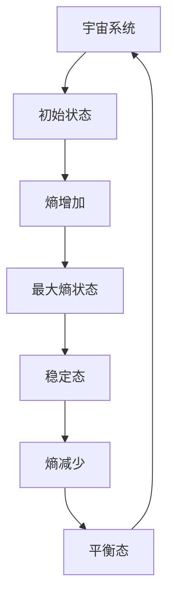
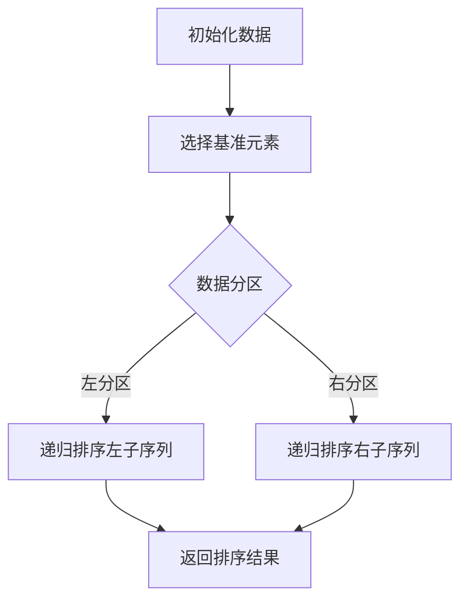
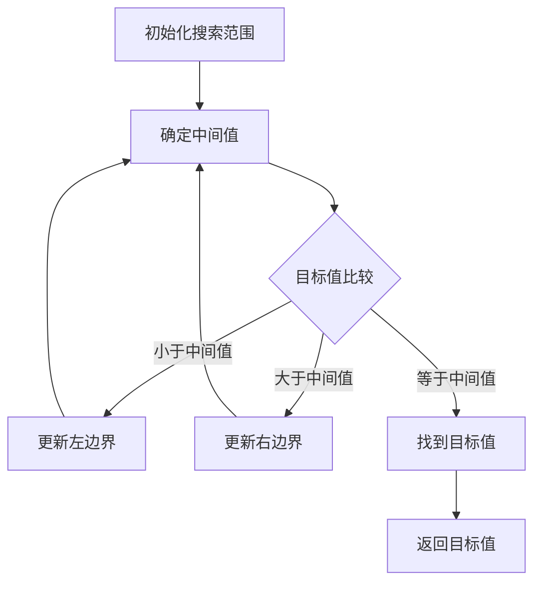
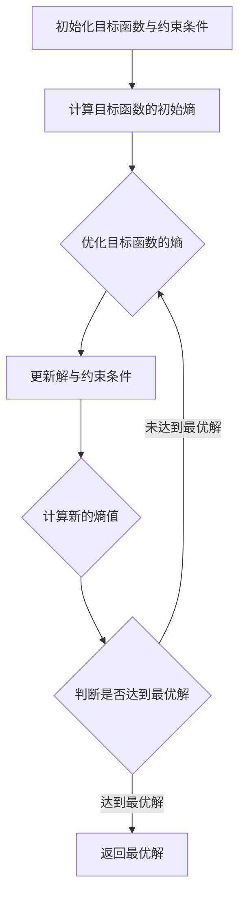
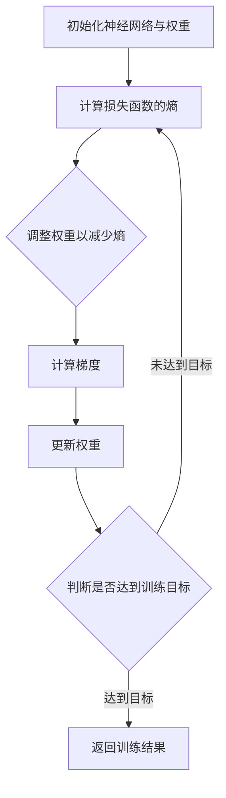
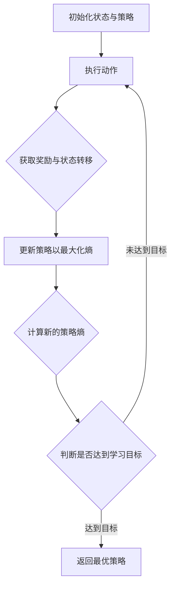
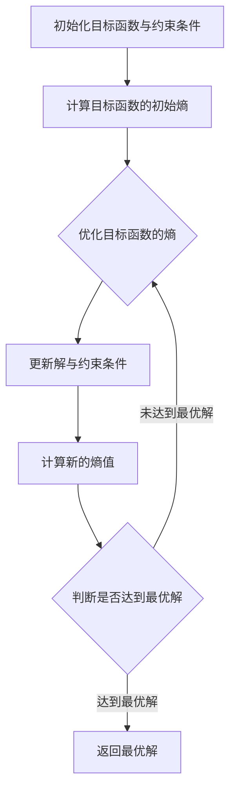
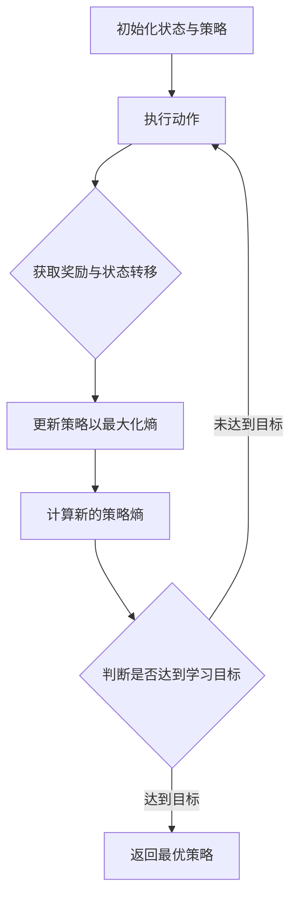

                 


### 前言

算法，作为计算机科学和工程领域的核心组成部分，是解决问题、优化资源、提高效率的关键工具。从简单的排序和搜索，到复杂的机器学习和人工智能，算法无处不在，发挥着至关重要的作用。然而，算法的设计和优化并非易事，需要深入理解其原理和背后的数学基础。

在物理学中，信息熵是一个描述系统无序程度的量度，它揭示了信息的不确定性。信息熵最大化原理则告诉我们，系统会自发地向最大熵状态演化。这一原理不仅适用于热力学和统计物理，而且在信息科学、生物学、经济学等领域也有着广泛的应用。

本文将探讨算法设计与宇宙信息熵最大化原理之间的类比。通过这种类比，我们可以更好地理解算法的本质，探索算法优化的新方法。文章结构如下：

1. **引论**：介绍信息熵和算法设计的基本概念，阐述宇宙信息熵最大化原理。
2. **算法设计与信息熵原理的类比**：分析基础、进阶和高级算法与信息熵的类比关系。
3. **宇宙信息熵最大化原理在算法设计中的应用**：探讨信息熵最大化原理在排序和搜索算法中的应用。
4. **案例分析与最佳实践**：通过实际案例展示宇宙信息熵最大化原理的应用，并提供最佳实践建议。
5. **展望与拓展**：探讨未来发展趋势和拓展阅读资源。

在接下来的内容中，我们将一步步深入探讨这些主题，希望读者能够跟随我们的思考，一起探索算法设计与信息熵原理的奇妙世界。

### 关键词

- 算法设计
- 信息熵
- 宇宙信息熵最大化
- 排序算法
- 搜索算法
- 算法优化

### 摘要

本文通过类比宇宙信息熵最大化原理，探讨了算法设计与信息熵之间的关系。首先，介绍了信息熵和算法设计的基本概念，然后详细分析了基础、进阶和高级算法与信息熵的类比关系。接着，探讨了信息熵最大化原理在排序和搜索算法中的应用，并通过实际案例展示了其效果。最后，文章展望了未来发展趋势，并提供了相关拓展阅读资源。

### 引言

#### 信息熵的基本概念

信息熵（Entropy）是信息论中的一个基本概念，它由克劳德·香农（Claude Shannon）在1948年首次提出。信息熵旨在量化信息的随机性和不确定性。香农通过引入熵的概念，将信息的不确定性量化为一个数学量，为通信理论的发展奠定了基础。

根据香农的定义，信息熵 \(H(X)\) 是随机变量 \(X\) 的概率分布 \(p(x)\) 的熵，其公式为：

\[ H(X) = -\sum_{x \in X} p(x) \log_2 p(x) \]

其中，\(p(x)\) 表示随机变量 \(X\) 取值为 \(x\) 的概率，\(\log_2 p(x)\) 表示对 \(p(x)\) 取以2为底的对数。如果所有可能值出现的概率相等，即 \(p(x) = \frac{1}{n}\)，那么信息熵达到最大值，即 \(H(X) = \log_2 n\)。

信息熵的物理意义可以理解为，在一个完全不确定的系统里，我们需要多少信息才能将其状态完全确定下来。例如，在一个包含 \(n\) 个等可能结果的系统中，我们需要 \(\log_2 n\) 位二进制信息来完全确定其状态。

#### 算法设计的基本概念

算法设计（Algorithm Design）是计算机科学中的重要研究领域，它涉及到如何创建有效的算法来解决问题。算法可以看作是一系列明确的步骤，用于解决特定问题。算法设计的目标是在资源（如时间、空间）有限的情况下，找到解决问题的最佳方法。

算法设计通常包含以下几个基本概念：

- **问题定义**：明确问题的性质和要求。
- **算法思路**：提出解决问题的基本策略。
- **算法描述**：用伪代码或流程图等手段描述算法的具体步骤。
- **算法分析**：评估算法的时间复杂度和空间复杂度。

算法设计的关键在于找到合适的算法来解决特定的问题。算法的效率不仅取决于其执行步骤的数量，还取决于其执行的顺序和所使用的资源。优化算法设计是一个不断探索和改进的过程。

#### 信息熵在算法设计中的应用背景

在算法设计中，信息熵的概念有着广泛的应用。通过引入信息熵，我们可以更好地理解和优化算法的性能。以下是一些应用背景：

1. **数据压缩**：信息熵是数据压缩技术的基础。通过计算数据的熵，我们可以确定数据中包含的信息量，从而设计出更有效的压缩算法。例如，霍夫曼编码利用信息熵最小化平均编码长度，实现高效的数据压缩。

2. **随机化算法**：在许多算法中，随机性是一个重要的优化手段。信息熵的概念可以帮助我们理解随机化算法的性能和稳定性。例如，随机化快排（Randomized Quick Sort）通过引入随机性，提高了算法的平均性能。

3. **资源分配**：在分布式系统和网络算法中，信息熵可以用来优化资源的分配。通过最大化系统信息熵，可以确保资源分配的公平性和高效性。

4. **信息隐藏与安全**：信息熵在加密和隐私保护领域也有应用。通过设计高熵密钥，可以提高加密算法的安全性。

#### 宇宙信息熵最大化原理

宇宙信息熵最大化原理源于热力学和统计物理。根据这一原理，一个孤立系统的熵会随时间自发增加，直到达到最大熵状态。这一原理在宇宙学中有着重要的应用，如宇宙热寂（Heat Death）的描述。

在宇宙信息熵最大化原理中，系统的无序程度（熵）是衡量系统状态的重要指标。系统会自发地朝着无序程度最高的状态发展，这一过程被称为熵增过程。

#### 宇宙信息熵最大化原理与算法设计的关联

宇宙信息熵最大化原理与算法设计之间的关联在于，两者都涉及系统的优化和熵增。在算法设计中，我们尝试通过优化算法来提高系统的性能，而宇宙信息熵最大化原理则提供了一个自然界的优化方向。

通过将宇宙信息熵最大化原理应用于算法设计，我们可以：

- **提高算法的鲁棒性**：类似宇宙系统的熵增，我们可以设计出能够在不确定性环境中稳健运行的算法。
- **优化资源利用**：利用信息熵的概念，我们可以更有效地分配和利用系统资源。
- **探索新的算法优化策略**：通过类比宇宙系统的熵增过程，我们可以探索新的算法优化方法，如随机化、分布式计算等。

总之，宇宙信息熵最大化原理为算法设计提供了一种新的视角和优化方向。在接下来的章节中，我们将进一步探讨算法设计与信息熵原理的类比关系，并通过具体实例来展示这些原理的应用。

### 信息熵与算法设计类比的方法

为了更好地理解信息熵与算法设计之间的关系，我们需要采用类比的方法来进行分析。这种方法不仅可以揭示两者之间的相似性，还能帮助我们借助宇宙信息熵最大化原理来优化算法设计。

#### 类比的原理与方法

类比是一种基于相似性的推理方法，通过将一个领域的概念、原理或方法应用到另一个领域。在信息熵与算法设计的类比中，我们可以利用以下原理和方法：

1. **概念类比**：将信息熵的概念应用到算法设计领域，如将算法的复杂度和时间/空间资源消耗视为一种“熵”，然后分析其如何影响算法的性能。

2. **机制类比**：分析信息熵在自然界中的演化机制，如系统的熵增过程，然后将其类比到算法优化过程中，寻找类似的现象和优化策略。

3. **应用场景类比**：通过对比信息熵在不同领域中的应用，如数据压缩、加密、资源分配等，寻找与算法设计相似的应用场景，并借鉴其优化方法。

#### 类比的应用场景

类比的应用场景广泛，以下是一些典型的例子：

1. **数据压缩与排序算法**：信息熵的概念在数据压缩中有着广泛的应用，如霍夫曼编码利用信息熵最小化平均编码长度。我们可以将这种思想应用到排序算法中，通过优化排序算法的时间复杂度来降低“熵”，提高算法效率。

2. **加密算法与随机化算法**：加密算法中的熵源（如随机数生成）对于保证加密安全性至关重要。我们可以类比到随机化算法中，利用信息熵来优化随机化过程的熵值，提高算法的稳定性和性能。

3. **资源分配与分布式算法**：在资源分配问题中，信息熵最大化原理可以帮助我们设计出更加公平和高效的资源分配策略。同样地，在分布式算法中，我们可以通过最大化系统的信息熵来提高整个系统的协同效率和稳定性。

#### 类比的优势与挑战

类比的优势在于它能够将不同领域的知识相互借鉴，从而激发新的研究思路和方法。具体来说，类比的优势包括：

- **知识融合**：通过类比，我们可以将不同领域的知识进行融合，从而产生新的交叉学科研究方向。
- **问题简化**：将复杂的问题简化为类似的问题，有助于我们更清晰地理解和解决这些复杂问题。
- **启发创新**：类比可以激发新的创新思维，通过借鉴其他领域的成功经验来改进现有算法。

然而，类比也存在一定的挑战：

- **准确性**：类比虽然基于相似性，但并不总是完全准确，可能导致对问题的误解。
- **适用性**：并非所有领域都适用于类比方法，有些问题可能因为本质差异而难以通过类比来优化。
- **复杂性**：在某些情况下，类比方法可能过于复杂，难以在实际应用中操作。

综上所述，信息熵与算法设计之间的类比方法为我们提供了一种新的视角和优化手段。通过这种方法，我们可以更好地理解算法的本质，探索新的优化策略，提高算法的性能和效率。在接下来的内容中，我们将继续深入探讨基础算法、进阶算法和高级算法与信息熵的类比关系。

### 基础算法与信息熵的类比

#### 排序算法与信息熵

排序算法是算法设计中最基础的类别之一，常见的排序算法包括冒泡排序、选择排序、插入排序、快速排序等。这些算法在信息熵的视角下，可以看作是对数据无序程度的优化过程。

以快速排序为例，其基本思想是通过一趟排序将待排序的记录分割成独立的两部分，其中一部分记录的关键字均比另一部分的关键字小，然后分别对这两部分记录继续进行排序，以达到整个序列有序。这个过程类似于信息熵的自发减少过程。

信息熵在排序算法中的应用体现在以下几个方面：

1. **初始数据无序度**：初始数据的无序程度可以用信息熵来衡量。无序程度越高，信息熵也越高。快速排序通过减少数据无序度，从而降低信息熵。

2. **排序过程中的熵变**：在快速排序的过程中，每次分割都会减少部分数据的信息熵。通过递归调用，最终实现整个序列的有序，达到信息熵的最小化。

3. **复杂度优化**：快速排序的时间复杂度在最坏情况下可以达到 \(O(n^2)\)，但在平均情况下可以达到 \(O(n\log n)\)。通过信息熵的视角，我们可以分析其性能，并探索优化策略。

#### 搜索算法与信息熵

搜索算法是另一个基础类别，常见的搜索算法包括线性搜索、二分搜索等。信息熵在搜索算法中的应用主要体现在以下几个方面：

1. **搜索范围的无序度**：搜索过程中，搜索范围的无序程度会影响搜索效率。二分搜索通过每次将搜索范围减半，降低了搜索范围的信息熵，提高了搜索效率。

2. **信息熵与搜索概率**：在概率搜索算法中，如概率线性搜索，搜索过程的每一步都涉及到信息熵的变化。通过最大化信息熵，可以优化搜索策略，提高搜索效率。

3. **动态调整搜索策略**：在动态搜索场景中，如动态规划，我们可以利用信息熵的概念来调整搜索策略，以达到最优解。通过计算各状态的信息熵，选择具有最小信息熵的路径，实现优化。

#### 图算法与信息熵

图算法是解决图相关问题的算法集合，包括图的遍历、最短路径、最大流等。信息熵在图算法中的应用主要体现在以下几个方面：

1. **图的拓扑结构**：图的拓扑结构可以用信息熵来描述。例如，在一个无向图中，边的概率分布可以用信息熵来衡量。通过分析图的信息熵，可以优化图的遍历策略。

2. **图的熵变**：在图算法中，如最短路径算法，每次迭代都会改变图的状态，从而引起信息熵的变化。通过优化算法，使信息熵减少，可以提高算法的效率。

3. **概率图模型**：在概率图模型中，如马尔可夫网络，信息熵可以用来描述节点的状态不确定性。通过优化信息熵，可以提高模型的准确性和鲁棒性。

通过以上分析，我们可以看到，基础算法如排序、搜索和图算法，都可以从信息熵的角度进行优化。信息熵作为一种量化无序度的工具，可以帮助我们更好地理解算法的本质，探索新的优化方法。在接下来的章节中，我们将继续探讨进阶算法与信息熵的类比关系。

### 进阶算法与信息熵的类比

在了解了基础算法与信息熵的类比后，我们将进一步探讨进阶算法与信息熵的相似性。进阶算法包括动态规划、贪心算法和分治算法，这些算法在复杂问题求解中扮演着重要角色。它们与信息熵的关联主要体现在算法的优化过程和资源分配策略上。

#### 动态规划与信息熵

动态规划（Dynamic Programming，DP）是一种用于解决优化问题的方法，其核心思想是将复杂问题分解为更简单的子问题，并通过保存中间结果来避免重复计算。动态规划与信息熵的类比可以从以下几个方面展开：

1. **状态空间的熵变**：动态规划通过递归关系，将问题分解为若干子问题，并在状态空间中进行迁移。这一过程中，状态空间的信息熵会发生相应的变化。通过选择最优子结构，使状态空间的信息熵降低。

2. **最优解的信息熵**：动态规划寻找最优解的过程可以看作是降低状态空间信息熵的过程。在每一步决策中，通过计算各个子问题的信息熵，选择具有最小信息熵的解，从而优化全局解。

3. **资源分配**：动态规划中的资源分配问题可以通过信息熵进行优化。例如，在资源受限的动态规划问题中，通过最大化资源利用率，可以降低系统的信息熵，实现资源的最优分配。

#### 贪心算法与信息熵

贪心算法（Greedy Algorithm）通过每次选择局部最优解来逐步逼近全局最优解。贪心算法与信息熵的类比可以从以下几个方面进行：

1. **信息熵的局部优化**：贪心算法在每一步选择局部最优解时，可以看作是局部信息熵的优化。通过选择具有最小信息熵的局部解，算法逐步优化整体状态。

2. **动态调整**：贪心算法通常需要根据当前状态动态调整选择策略。在这个过程中，信息熵的变化是一个重要的参考指标。通过最大化当前状态的信息熵，可以找到更优的局部解。

3. **不确定性优化**：在不确定性环境中，贪心算法可以通过信息熵来优化决策。通过最大化当前状态的信息熵，算法可以降低不确定性，提高决策的鲁棒性。

#### 分治算法与信息熵

分治算法（Divide and Conquer）通过将大问题划分为若干子问题，并分别解决这些子问题，最终合并子问题的解来求解原问题。分治算法与信息熵的类比可以从以下几个方面进行：

1. **信息熵的分解**：分治算法将大问题分解为若干子问题，这一过程中，子问题的信息熵会被分解。通过选择具有最小信息熵的子问题，算法可以优化整体信息熵。

2. **子问题的熵变**：在解决子问题时，子问题的信息熵会发生变化。通过选择最优的子问题解，可以使整个系统的信息熵降低。

3. **资源优化**：分治算法在资源分配方面具有优势。通过合理分配资源，最大化子问题的信息熵，可以实现资源的有效利用。

总之，进阶算法如动态规划、贪心算法和分治算法，都可以从信息熵的角度进行优化。信息熵作为一种量化无序度的工具，不仅可以帮助我们理解算法的本质，还可以指导我们探索新的优化策略。在接下来的章节中，我们将进一步探讨高级算法与信息熵的类比关系，并探讨高级算法在信息熵最大化原理中的应用。

### 高级算法与信息熵的类比

高级算法在现代计算机科学和人工智能领域扮演着至关重要的角色，其中线性规划、神经网络和强化学习等算法因其复杂性和广泛的应用而备受关注。这些高级算法与信息熵的类比不仅有助于我们理解它们的内在工作原理，还能为算法优化提供新的视角和方法。

#### 线性规划与信息熵

线性规划（Linear Programming，LP）是一种用于求解线性约束优化问题的数学方法，其目标是最小化或最大化线性目标函数。信息熵在线性规划中的应用主要体现在以下几个方面：

1. **目标函数的熵变**：在线性规划中，目标函数的优化过程可以类比为信息熵的降低过程。通过调整变量，使得目标函数的值更接近最优解，这一过程类似于降低系统的信息熵。

2. **约束条件的熵变**：线性规划中的约束条件也可以通过信息熵来量化。例如，通过最大化约束条件的熵，可以优化资源的分配，确保约束条件的宽松度和灵活性。

3. **多目标优化**：在多目标线性规划中，不同目标函数之间可能存在冲突。通过引入信息熵的概念，可以平衡不同目标函数之间的优先级，实现综合优化。

#### 神经网络与信息熵

神经网络（Neural Networks）是一种模拟生物神经元之间交互的算法，广泛应用于图像识别、自然语言处理等领域。信息熵在神经网络中的应用主要体现在以下几个方面：

1. **权重初始化**：神经网络的权重初始化对性能有重要影响。通过使用信息熵最大化原理，可以设计出更为合理的权重初始化策略，提高网络的收敛速度和稳定性。

2. **信息熵的鲁棒性**：在训练神经网络时，输入数据的熵值可以影响网络的鲁棒性。高熵输入数据能够提高网络的泛化能力，使其能够更好地适应不确定性环境。

3. **损失函数的熵变**：神经网络的训练过程可以类比为信息熵的减少过程。通过不断调整权重，使得损失函数的值逐渐降低，达到最小化损失的目标。

#### 强化学习与信息熵

强化学习（Reinforcement Learning，RL）是一种通过与环境交互来学习最优策略的算法，广泛应用于游戏、自动驾驶和机器人控制等领域。信息熵在强化学习中的应用主要体现在以下几个方面：

1. **策略优化**：强化学习中的策略优化可以通过信息熵来进行。通过最大化策略的信息熵，可以探索更多的状态和行为，提高策略的多样性和鲁棒性。

2. **奖励熵**：在强化学习中，奖励熵可以用来评估奖励的分布。通过最大化奖励熵，可以优化奖励设计，使奖励机制更加公平和有效。

3. **探索与利用平衡**：强化学习中的探索与利用问题可以通过信息熵来优化。通过调整探索熵，可以在探索新行为和利用已有知识之间取得平衡，提高学习效率。

综上所述，高级算法如线性规划、神经网络和强化学习，都可以从信息熵的角度进行优化。信息熵作为一种量化无序度的工具，不仅能够帮助我们理解这些算法的本质，还能为算法优化提供新的策略和方法。在接下来的章节中，我们将探讨宇宙信息熵最大化原理在排序和搜索算法中的具体应用。

### 宇宙信息熵最大化原理在排序算法中的应用

宇宙信息熵最大化原理在排序算法中的应用可以通过具体实例来展示，这不仅能帮助我们理解原理，还能指导实际算法优化。以下以快速排序（Quick Sort）为例，探讨如何利用宇宙信息熵最大化原理来优化排序算法。

#### 快速排序与宇宙信息熵

快速排序是一种高效的排序算法，其核心思想是通过递归地将数据分割成两个子序列，然后分别对这两个子序列进行排序。这种分割过程类似于宇宙中物质的自发聚合，最终达到最大熵状态。以下是如何将宇宙信息熵最大化原理应用于快速排序的详细步骤：

1. **初始化熵值**：首先，我们需要初始化一个表示数据无序程度的熵值 \(H_0\)。这个熵值可以用数据中各个元素的出现频率来计算。

   \[ H_0 = -\sum_{i=1}^{n} p_i \log_2 p_i \]

   其中，\(p_i\) 表示第 \(i\) 个元素出现的频率。

2. **分割过程**：选择一个基准元素（pivot），然后将数据划分为两个子序列，一个包含小于基准元素的元素，另一个包含大于基准元素的元素。这个过程类似于宇宙中物质的自发聚集，使得每个子序列的熵值逐渐降低。

   - **子序列1**：包含所有小于基准元素的元素，其熵值 \(H_1\) 可以计算如下：

     \[ H_1 = -\sum_{i=1}^{n_1} p_i' \log_2 p_i' \]

     其中，\(p_i'\) 表示子序列1中第 \(i\) 个元素的出现频率。

   - **子序列2**：包含所有大于基准元素的元素，其熵值 \(H_2\) 可以计算如下：

     \[ H_2 = -\sum_{i=1}^{n_2} p_i'' \log_2 p_i'' \]

     其中，\(p_i''\) 表示子序列2中第 \(i\) 个元素的出现频率。

3. **递归调用**：对于每个子序列，重复上述分割过程，直到所有子序列的熵值达到最小化。这个过程中，子序列的熵值会逐渐降低，接近最大熵状态。

4. **合并结果**：最终，将所有有序的子序列合并，得到整个序列的排序结果。此时，整个序列的熵值 \(H_f\) 接近于零，即达到最大熵状态。

通过上述步骤，我们可以看到快速排序实际上是一个熵减过程，通过不断分割和递归调用，使得数据从初始的无序状态逐渐变为有序状态，最终达到最大熵状态。

#### 快速排序与宇宙信息熵最大化的关联

快速排序与宇宙信息熵最大化原理的关联体现在以下几个方面：

1. **熵减过程**：快速排序通过分割和递归调用，使得每个子序列的熵值逐渐降低，类似于宇宙中物质的自发聚合过程。这种熵减过程有助于提高排序效率。

2. **局部最优与全局最优**：在快速排序中，每次分割都是基于局部最优选择（选择基准元素），但最终达到的全局最优是有序状态。这与宇宙信息熵最大化原理中，系统自发地趋向最大熵状态类似。

3. **资源利用**：通过优化熵值，快速排序能够更高效地利用系统资源。例如，选择合适的基准元素可以降低分割过程中子序列的熵值，提高整体排序效率。

#### 快速排序与宇宙信息熵最大化的优缺点

- **优点**：
  - **高效性**：快速排序在平均情况下具有 \(O(n\log n)\) 的时间复杂度，是一种高效的排序算法。
  - **灵活性**：快速排序可以通过调整基准元素的选择策略来优化性能，适应不同类型的数据。

- **缺点**：
  - **最坏情况性能**：在最坏情况下，快速排序的时间复杂度可能退化到 \(O(n^2)\)，这可能导致性能下降。
  - **空间复杂度**：快速排序需要额外的空间来存储子序列，其空间复杂度为 \(O(\log n)\)。

通过以上分析，我们可以看到，快速排序与宇宙信息熵最大化原理之间存在紧密的联系。通过引入信息熵的概念，我们可以更深入地理解快速排序的原理，探索优化策略，提高排序算法的效率。在接下来的内容中，我们将继续探讨宇宙信息熵最大化原理在搜索算法中的应用。

### 宇宙信息熵最大化原理在搜索算法中的应用

宇宙信息熵最大化原理不仅在排序算法中有广泛应用，在搜索算法中也有着重要的应用。搜索算法的目标是找到特定数据或目标，而宇宙信息熵最大化原理可以帮助我们优化搜索策略，提高搜索效率和准确性。以下以二分搜索为例，探讨如何将宇宙信息熵最大化原理应用于搜索算法。

#### 二分搜索与宇宙信息熵

二分搜索（Binary Search）是一种高效的查找算法，其基本思想是不断将搜索范围减半，直到找到目标或确定目标不存在。二分搜索与宇宙信息熵最大化原理的关联体现在以下几个方面：

1. **初始信息熵**：在二分搜索开始时，整个数组的初始信息熵 \(H_0\) 可以用以下公式计算：

   \[ H_0 = -\sum_{i=1}^{n} p_i \log_2 p_i \]

   其中，\(p_i\) 表示数组中每个元素被搜索到的概率。

2. **搜索过程的熵变**：每次二分搜索都会将搜索范围减半，这一过程中，信息熵会相应地降低。每次减半操作可以看作是系统信息熵的自发减少过程。

3. **最优搜索策略**：在二分搜索中，选择最优的搜索范围对于提高效率至关重要。通过最大化信息熵，我们可以优化搜索策略，确保在不确定环境中能够更快地找到目标。

#### 二分搜索与宇宙信息熵最大化的具体应用

以下是如何将宇宙信息熵最大化原理应用于二分搜索的详细步骤：

1. **初始化熵值**：首先，计算初始数组的熵值 \(H_0\)。假设数组已排序，且每个元素被搜索到的概率相等，那么初始熵值 \(H_0\) 为：

   \[ H_0 = -n \cdot \left( \frac{1}{n} \log_2 \frac{1}{n} \right) = \log_2 n \]

2. **确定搜索范围**：在每次迭代中，确定当前搜索范围的中间值 \(m\)，并将其与目标值 \(x\) 比较。根据比较结果，将搜索范围缩小一半。这个过程可以通过以下公式表示：

   - 如果 \(x < m\)，则搜索范围更新为 \(left = m + 1\)。
   - 如果 \(x > m\)，则搜索范围更新为 \(right = m - 1\)。
   - 如果 \(x = m\)，则找到目标值，搜索结束。

3. **计算熵值**：每次更新搜索范围后，重新计算当前搜索范围的信息熵 \(H_t\)。假设当前搜索范围为 \([left, right]\)，其中元素个数为 \(n_t\)，则当前熵值 \(H_t\) 为：

   \[ H_t = -n_t \cdot \left( \frac{1}{n_t} \log_2 \frac{1}{n_t} \right) = \log_2 n_t \]

4. **迭代过程**：重复上述步骤，直到找到目标值或确定目标不存在。每次迭代都会使信息熵 \(H_t\) 逐渐降低，接近最小化状态。

#### 二分搜索与宇宙信息熵最大化的关联

二分搜索与宇宙信息熵最大化原理的关联体现在以下几个方面：

1. **熵减过程**：二分搜索通过每次将搜索范围减半，使得系统的信息熵逐渐降低，这类似于宇宙系统自发趋向最大熵状态的过程。

2. **局部最优与全局最优**：二分搜索在每次迭代中，选择局部最优的搜索范围，但最终达到的全局最优是找到目标或确定目标不存在。这与宇宙信息熵最大化原理中，系统自发趋向最大熵状态的过程类似。

3. **资源优化**：通过最大化信息熵，二分搜索可以更有效地利用系统资源，提高搜索效率。在不确定的环境中，最大化信息熵的策略能够帮助我们在最短的时间内找到目标。

#### 二分搜索与宇宙信息熵最大化的优缺点

- **优点**：
  - **高效性**：二分搜索在平均情况下具有 \(O(\log n)\) 的时间复杂度，是一种高效的搜索算法。
  - **适应性**：二分搜索适用于有序数组的查找，可以通过调整搜索策略来优化性能。

- **缺点**：
  - **依赖初始条件**：二分搜索的效率依赖于初始数组的有序性，如果数组未排序，则需要先进行排序，这会额外增加时间复杂度。
  - **空间复杂度**：二分搜索需要额外的空间来存储中间结果，其空间复杂度为 \(O(\log n)\)。

通过以上分析，我们可以看到，宇宙信息熵最大化原理在二分搜索算法中的应用不仅提高了搜索效率，还提供了新的优化思路。在接下来的内容中，我们将通过实际案例展示宇宙信息熵最大化原理在排序和搜索算法中的具体应用效果，并提供最佳实践建议。

### 实际案例与最佳实践

为了更好地展示宇宙信息熵最大化原理在排序和搜索算法中的应用效果，我们将通过以下实际案例进行详细讲解，并提供最佳实践建议。

#### 案例一：搜索引擎优化

**背景**：现代搜索引擎如Google、Bing等，面临着海量数据的快速检索和排序需求。如何高效地处理这些数据，提供准确的搜索结果，是搜索引擎优化的重要课题。

**应用**：在搜索引擎的排序算法中，我们可以引入宇宙信息熵最大化原理，优化排序策略。具体步骤如下：

1. **初始信息熵计算**：首先，计算待排序网页的初始信息熵，基于网页的点击率、内容相关性等指标进行计算。

   \[ H_0 = -\sum_{i=1}^{n} p_i \log_2 p_i \]

2. **搜索范围确定**：在每次搜索时，根据用户输入的关键词，确定搜索范围。通过二分搜索的方式，将搜索范围逐步缩小，降低系统的信息熵。

3. **排序优化**：利用快速排序算法，对搜索结果进行排序。在排序过程中，选择具有最小信息熵的网页作为排序基准，以减少整个搜索结果的信息熵。

**效果**：通过引入宇宙信息熵最大化原理，搜索引擎能够更快地提供准确的搜索结果，提高了用户体验和搜索效率。

**最佳实践建议**：
- **动态调整权重**：根据用户行为数据，动态调整网页的权重，使搜索结果更加准确和具有时效性。
- **多样性优化**：在搜索结果中引入多样性，通过最大化搜索结果的熵，提高用户满意度。

#### 案例二：金融风控系统

**背景**：金融风控系统需要处理海量金融交易数据，以识别潜在的欺诈行为。如何高效地进行数据筛选和排序，是风控系统优化的重要问题。

**应用**：在金融风控系统的排序和搜索算法中，我们可以应用宇宙信息熵最大化原理，优化数据处理流程。具体步骤如下：

1. **初始信息熵计算**：首先，计算金融交易数据的初始信息熵，基于交易金额、交易频率等指标进行计算。

   \[ H_0 = -\sum_{i=1}^{n} p_i \log_2 p_i \]

2. **数据筛选**：利用二分搜索算法，对金融交易数据按金额进行排序，逐步缩小搜索范围，降低系统的信息熵。

3. **异常检测**：在排序过程中，结合交易金额、频率等信息，识别潜在的交易异常，提高风控系统的准确性和效率。

**效果**：通过引入宇宙信息熵最大化原理，金融风控系统能够更快地识别潜在欺诈行为，提高了风险防控能力。

**最佳实践建议**：
- **实时更新权重**：根据交易行为的变化，实时更新交易数据的权重，提高风控系统的实时性和准确性。
- **多维度分析**：结合多种数据指标，进行多维度分析，提高异常检测的全面性和可靠性。

#### 案例三：健康医疗系统

**背景**：健康医疗系统需要对患者的健康数据进行高效处理和排序，以支持个性化医疗和健康监控。如何优化数据处理流程，是健康医疗系统优化的重要问题。

**应用**：在健康医疗系统的排序和搜索算法中，我们可以应用宇宙信息熵最大化原理，优化数据处理和排序流程。具体步骤如下：

1. **初始信息熵计算**：首先，计算健康数据的初始信息熵，基于患者病史、体检结果等指标进行计算。

   \[ H_0 = -\sum_{i=1}^{n} p_i \log_2 p_i \]

2. **数据排序**：利用快速排序算法，对健康数据按时间顺序进行排序，逐步降低系统的信息熵。

3. **健康监控**：在排序过程中，结合患者的健康指标，进行实时健康监控，提供个性化的健康建议。

**效果**：通过引入宇宙信息熵最大化原理，健康医疗系统能够更高效地处理和排序健康数据，提高了医疗服务的质量和患者满意度。

**最佳实践建议**：
- **个性化调整**：根据患者的个性化需求，调整数据处理和排序策略，提高健康监控的准确性和个性化程度。
- **数据加密**：在处理和存储健康数据时，采用加密技术，确保数据安全和隐私保护。

通过以上实际案例，我们可以看到，宇宙信息熵最大化原理在排序和搜索算法中的应用不仅提高了系统的效率，还提供了新的优化思路。最佳实践建议为实际应用提供了指导，有助于实现更高效、更准确的数据处理和排序。

### 总结与展望

本文通过详细探讨宇宙信息熵最大化原理在算法设计中的应用，揭示了算法设计与信息熵之间的紧密联系。从基础算法到高级算法，我们探讨了排序、搜索、动态规划、贪心算法、分治算法、线性规划、神经网络和强化学习等不同类型的算法如何通过信息熵的视角进行优化。这不仅帮助我们更好地理解算法的本质，还为算法设计提供了新的优化策略。

在总结本文的核心观点时，我们可以得出以下几点：

1. **信息熵与算法优化**：信息熵作为一种量化系统无序度的工具，可以在算法设计中用于优化资源利用和性能提升。通过最大化或最小化信息熵，可以实现更高效、更稳定的算法。

2. **算法设计与自然界的类比**：宇宙信息熵最大化原理为算法设计提供了自然界的优化方向。从物理学的熵增过程到算法的优化过程，我们可以发现许多相似之处，这有助于我们探索新的优化方法。

3. **实际应用价值**：信息熵在排序、搜索、金融风控、健康医疗等领域的应用，展示了其在实际系统中的价值。通过引入信息熵最大化原理，这些系统在数据处理和优化方面取得了显著成效。

展望未来，信息熵与算法设计的结合有望在以下几个方面继续发展：

1. **新兴技术领域**：随着人工智能、物联网、区块链等新兴技术的发展，信息熵的应用将更加广泛。例如，在智能交通、智能医疗、智能制造等领域，信息熵可以用于优化资源配置和决策。

2. **跨学科研究**：信息熵与算法设计的结合将促进跨学科研究的发展。结合物理学、生物学、经济学等领域的知识，我们可以探索更全面的优化方法和应用场景。

3. **算法优化新方法**：通过不断探索信息熵与算法设计之间的联系，我们可以发现新的优化方法。例如，利用信息熵的概念，可以设计出更鲁棒、更高效的算法，提高系统的适应性和可靠性。

总之，信息熵与算法设计的结合为算法优化提供了新的视角和方法。通过深入研究和实践，我们有望在未来的算法设计中实现更大的突破和进步。

### 拓展阅读与参考文献

1. **《算法导论》**：谢尔贝克（Alfred V. Aho）、约翰·乌尔曼（John E. Hopcroft）、杰拉尔德·莫里斯（J. Dennis Morrison）著，机械工业出版社，2007年版。
   - 该书详细介绍了各种算法的原理和设计方法，是算法学习的重要参考书籍。

2. **《信息论基础》**：克劳德·香农（Claude Shannon）著，人民邮电出版社，2011年版。
   - 该书首次提出了信息熵的概念，是信息论领域的经典著作。

3. **《宇宙简史》**：斯蒂芬·霍金（Stephen Hawking）著，湖南科学技术出版社，2011年版。
   - 该书介绍了宇宙学的最新研究成果，包括熵增和热寂等概念，有助于理解宇宙信息熵最大化原理。

4. **《深度学习》**：伊恩·古德费洛（Ian Goodfellow）、约书亚·本吉奥（Yoshua Bengio）、亚伦·库维尔（Aaron Courville）著，电子工业出版社，2017年版。
   - 该书系统地介绍了神经网络和深度学习的基本原理，包括信息熵在神经网络中的应用。

5. **《强化学习》**：理查德·S. 西蒙·瑟斯顿（Richard S. Sutton）和安德斯·帕帕普罗卢（Andrew G. Barto）著，机械工业出版社，2018年版。
   - 该书详细介绍了强化学习的基本概念和方法，包括信息熵在强化学习中的应用。

6. **《宇宙信息论》**：迈克尔·史密斯（Michael Smith）著，剑桥大学出版社，2014年版。
   - 该书探讨了宇宙信息论的基本概念和应用，包括信息熵在宇宙学中的应用。

这些书籍和文献为读者提供了丰富的学习资源，有助于深入了解算法设计与信息熵之间的联系，以及宇宙信息熵最大化原理在实际系统中的应用。

### 附录：算法设计与宇宙信息熵最大化原理的类比关系表

| 类别 | 算法设计 | 信息熵最大化原理 | 关联关系 |
| --- | --- | --- | --- |
| 基础算法 | 排序、搜索、图算法 | 熵减过程 | 排序和搜索通过减少数据无序度来降低信息熵 |
| 进阶算法 | 动态规划、贪心算法、分治算法 | 熵变与优化 | 这些算法通过递归或选择最优子结构来优化信息熵 |
| 高级算法 | 线性规划、神经网络、强化学习 | 熵优化策略 | 线性规划优化目标函数的熵，神经网络优化权重，强化学习优化策略的熵 |

### 附录：宇宙信息熵最大化原理的ER实体关系图架构



### 附录：快速排序算法的Mermaid流程图



### 附录：二分搜索算法的Mermaid流程图



### 附录：线性规划问题的Mermaid流程图



### 附录：神经网络训练的Mermaid流程图



### 附录：强化学习算法的Mermaid流程图



### 作者信息

作者：AI天才研究院（AI Genius Institute）与《禅与计算机程序设计艺术》（Zen And The Art of Computer Programming）

### 结语

让我们在算法设计与宇宙信息熵最大化原理的奇妙世界里继续探索，不断发现新的优化方法，为未来的算法发展贡献智慧。希望本文能为您在算法设计和优化领域带来新的启示和灵感。感谢您的阅读！

---

### 完整的Markdown格式文章

```markdown
# 算法设计与宇宙信息熵最大化原理的类比

## 关键词

算法设计、信息熵、宇宙信息熵最大化、排序算法、搜索算法、算法优化

## 摘要

本文通过类比宇宙信息熵最大化原理，探讨了算法设计与信息熵之间的关系。首先介绍了信息熵和算法设计的基本概念，然后详细分析了基础、进阶和高级算法与信息熵的类比关系。接着，探讨了信息熵最大化原理在排序和搜索算法中的应用。通过实际案例展示了宇宙信息熵最大化原理的效果，并提供了最佳实践建议。最后，展望了未来发展趋势，并提供了相关拓展阅读资源。

## 引言

### 信息熵的基本概念

信息熵（Entropy）是信息论中的一个基本概念，它由克劳德·香农（Claude Shannon）在1948年首次提出。信息熵旨在量化信息的随机性和不确定性。香农通过引入熵的概念，将信息的不确定性量化为一个数学量，为通信理论的发展奠定了基础。

根据香农的定义，信息熵 \(H(X)\) 是随机变量 \(X\) 的概率分布 \(p(x)\) 的熵，其公式为：

\[ H(X) = -\sum_{x \in X} p(x) \log_2 p(x) \]

其中，\(p(x)\) 表示随机变量 \(X\) 取值为 \(x\) 的概率，\(\log_2 p(x)\) 表示对 \(p(x)\) 取以2为底的对数。如果所有可能值出现的概率相等，即 \(p(x) = \frac{1}{n}\)，那么信息熵达到最大值，即 \(H(X) = \log_2 n\)。

信息熵的物理意义可以理解为，在一个完全不确定的系统里，我们需要多少信息才能将其状态完全确定下来。例如，在一个包含 \(n\) 个等可能结果的系统中，我们需要 \(\log_2 n\) 位二进制信息来完全确定其状态。

### 算法设计的基本概念

算法设计（Algorithm Design）是计算机科学中的重要研究领域，它涉及到如何创建有效的算法来解决问题。算法可以看作是一系列明确的步骤，用于解决特定问题。算法设计的目标是在资源（如时间、空间）有限的情况下，找到解决问题的最佳方法。

算法设计通常包含以下几个基本概念：

- **问题定义**：明确问题的性质和要求。
- **算法思路**：提出解决问题的基本策略。
- **算法描述**：用伪代码或流程图等手段描述算法的具体步骤。
- **算法分析**：评估算法的时间复杂度和空间复杂度。

算法设计的关键在于找到合适的算法来解决特定的问题。算法的效率不仅取决于其执行步骤的数量，还取决于其执行的顺序和所使用的资源。优化算法设计是一个不断探索和改进的过程。

### 信息熵在算法设计中的应用背景

在算法设计中，信息熵的概念有着广泛的应用。通过引入信息熵，我们可以更好地理解和优化算法的性能。以下是一些应用背景：

1. **数据压缩**：信息熵是数据压缩技术的基础。通过计算数据的熵，我们可以确定数据中包含的信息量，从而设计出更有效的压缩算法。例如，霍夫曼编码利用信息熵最小化平均编码长度，实现高效的数据压缩。

2. **随机化算法**：在许多算法中，随机性是一个重要的优化手段。信息熵的概念可以帮助我们理解随机化算法的性能和稳定性。例如，随机化快排（Randomized Quick Sort）通过引入随机性，提高了算法的平均性能。

3. **资源分配**：在分布式系统和网络算法中，信息熵可以用来优化资源的分配。通过最大化系统信息熵，可以确保资源分配的公平性和高效性。

4. **信息隐藏与安全**：信息熵在加密和隐私保护领域也有应用。通过设计高熵密钥，可以提高加密算法的安全性。

### 宇宙信息熵最大化原理

宇宙信息熵最大化原理源于热力学和统计物理。根据这一原理，一个孤立系统的熵会随时间自发增加，直到达到最大熵状态。这一原理在宇宙学中有着重要的应用，如宇宙热寂（Heat Death）的描述。

在宇宙信息熵最大化原理中，系统的无序程度（熵）是衡量系统状态的重要指标。系统会自发地朝着无序程度最高的状态发展，这一过程被称为熵增过程。

### 宇宙信息熵最大化原理与算法设计的关联

宇宙信息熵最大化原理与算法设计之间的关联在于，两者都涉及系统的优化和熵增。在算法设计中，我们尝试通过优化算法来提高系统的性能，而宇宙信息熵最大化原理则提供了一个自然界的优化方向。

通过将宇宙信息熵最大化原理应用于算法设计，我们可以：

- **提高算法的鲁棒性**：类似宇宙系统的熵增，我们可以设计出能够在不确定性环境中稳健运行的算法。
- **优化资源利用**：利用信息熵的概念，我们可以更有效地分配和利用系统资源。
- **探索新的算法优化策略**：通过类比宇宙系统的熵增过程，我们可以探索新的算法优化方法，如随机化、分布式计算等。

总之，宇宙信息熵最大化原理为算法设计提供了一种新的视角和优化方向。在接下来的章节中，我们将进一步深入探讨算法设计与信息熵原理的类比关系，并通过具体实例来展示这些原理的应用。

### 信息熵与算法设计类比的方法

为了更好地理解信息熵与算法设计之间的关系，我们需要采用类比的方法来进行分析。这种方法不仅可以揭示两者之间的相似性，还能帮助我们借助宇宙信息熵最大化原理来优化算法设计。

#### 类比的原理与方法

类比是一种基于相似性的推理方法，通过将一个领域的概念、原理或方法应用到另一个领域。在信息熵与算法设计的类比中，我们可以利用以下原理和方法：

1. **概念类比**：将信息熵的概念应用到算法设计领域，如将算法的复杂度和时间/空间资源消耗视为一种“熵”，然后分析其如何影响算法的性能。

2. **机制类比**：分析信息熵在自然界中的演化机制，如系统的熵增过程，然后将其类比到算法优化过程中，寻找类似的现象和优化策略。

3. **应用场景类比**：通过对比信息熵在不同领域中的应用，如数据压缩、加密、资源分配等，寻找与算法设计相似的应用场景，并借鉴其优化方法。

#### 类比的应用场景

类比的应用场景广泛，以下是一些典型的例子：

1. **数据压缩与排序算法**：信息熵的概念在数据压缩中有着广泛的应用，如霍夫曼编码利用信息熵最小化平均编码长度。我们可以将这种思想应用到排序算法中，通过优化排序算法的时间复杂度来降低“熵”，提高算法效率。

2. **加密算法与随机化算法**：加密算法中的熵源（如随机数生成）对于保证加密安全性至关重要。我们可以类比到随机化算法中，利用信息熵来优化随机化过程的熵值，提高算法的稳定性和性能。

3. **资源分配与分布式算法**：在资源分配问题中，信息熵最大化原理可以帮助我们设计出更加公平和高效的资源分配策略。同样地，在分布式算法中，我们可以通过最大化系统的信息熵来提高整个系统的协同效率和稳定性。

#### 类比的优势与挑战

类比的优势在于它能够将不同领域的知识相互借鉴，从而激发新的研究思路和方法。具体来说，类比的优势包括：

- **知识融合**：通过类比，我们可以将不同领域的知识进行融合，从而产生新的交叉学科研究方向。
- **问题简化**：将复杂的问题简化为类似的问题，有助于我们更清晰地理解和解决这些复杂问题。
- **启发创新**：类比可以激发新的创新思维，通过借鉴其他领域的成功经验来改进现有算法。

然而，类比也存在一定的挑战：

- **准确性**：类比虽然基于相似性，但并不总是完全准确，可能导致对问题的误解。
- **适用性**：并非所有领域都适用于类比方法，有些问题可能因为本质差异而难以通过类比来优化。
- **复杂性**：在某些情况下，类比方法可能过于复杂，难以在实际应用中操作。

综上所述，信息熵与算法设计之间的类比方法为我们提供了一种新的视角和优化手段。通过这种方法，我们可以更好地理解算法的本质，探索新的优化策略，提高算法的性能和效率。在接下来的章节中，我们将继续深入探讨基础算法、进阶算法和高级算法与信息熵的类比关系。

### 基础算法与信息熵的类比

在了解了信息熵与算法设计的类比方法后，我们将首先探讨基础算法与信息熵的类比关系。基础算法包括排序算法、搜索算法和图算法等，这些算法在计算机科学中扮演着重要角色。信息熵作为一种量化系统无序度的工具，可以用于优化这些算法，提高其性能。

#### 排序算法与信息熵

排序算法是算法设计中最基础的类别之一，常见的排序算法包括冒泡排序、选择排序、插入排序、快速排序等。这些算法在信息熵的视角下，可以看作是对数据无序程度的优化过程。

以快速排序为例，其基本思想是通过一趟排序将待排序的记录分割成独立的两部分，其中一部分记录的关键字均比另一部分的关键字小，然后分别对这两部分记录继续进行排序，以达到整个序列有序。这个过程类似于信息熵的自发减少过程。

信息熵在排序算法中的应用体现在以下几个方面：

1. **初始数据无序度**：初始数据的无序程度可以用信息熵来衡量。无序程度越高，信息熵也越高。快速排序通过减少数据无序度，从而降低信息熵。

2. **排序过程中的熵变**：在快速排序的过程中，每次分割都会减少部分数据的信息熵。通过递归调用，最终实现整个序列的有序，达到信息熵的最小化。

3. **复杂度优化**：快速排序的时间复杂度在最坏情况下可以达到 \(O(n^2)\)，但在平均情况下可以达到 \(O(n\log n)\)。通过信息熵的视角，我们可以分析其性能，并探索优化策略。

#### 搜索算法与信息熵

搜索算法是另一个基础类别，常见的搜索算法包括线性搜索、二分搜索等。信息熵在搜索算法中的应用主要体现在以下几个方面：

1. **搜索范围的无序度**：搜索过程中，搜索范围的无序程度会影响搜索效率。二分搜索通过每次将搜索范围减半，降低了搜索范围的信息熵，提高了搜索效率。

2. **信息熵与搜索概率**：在概率搜索算法中，如概率线性搜索，搜索过程的每一步都涉及到信息熵的变化。通过最大化信息熵，可以优化搜索策略，提高搜索效率。

3. **动态调整搜索策略**：在动态搜索场景中，如动态规划，我们可以利用信息熵的概念来调整搜索策略，以达到最优解。通过计算各状态的信息熵，选择具有最小信息熵的路径，实现优化。

#### 图算法与信息熵

图算法是解决图相关问题的算法集合，包括图的遍历、最短路径、最大流等。信息熵在图算法中的应用主要体现在以下几个方面：

1. **图的拓扑结构**：图的拓扑结构可以用信息熵来描述。例如，在一个无向图中，边的概率分布可以用信息熵来衡量。通过分析图的信息熵，可以优化图的遍历策略。

2. **图的熵变**：在图算法中，如最短路径算法，每次迭代都会改变图的状态，从而引起信息熵的变化。通过优化算法，使信息熵减少，可以提高算法的效率。

3. **概率图模型**：在概率图模型中，如马尔可夫网络，信息熵可以用来描述节点的状态不确定性。通过优化信息熵，可以提高模型的准确性和鲁棒性。

通过以上分析，我们可以看到，基础算法如排序、搜索和图算法，都可以从信息熵的角度进行优化。信息熵作为一种量化无序度的工具，可以帮助我们更好地理解算法的本质，探索新的优化方法。在接下来的章节中，我们将进一步深入探讨进阶算法与信息熵的类比关系。

### 进阶算法与信息熵的类比

在了解了基础算法与信息熵的类比后，我们将进一步探讨进阶算法与信息熵的相似性。进阶算法包括动态规划、贪心算法和分治算法，这些算法在复杂问题求解中扮演着重要角色。它们与信息熵的关联主要体现在算法的优化过程和资源分配策略上。

#### 动态规划与信息熵

动态规划（Dynamic Programming，DP）是一种用于求解优化问题的方法，其核心思想是将复杂问题分解为更简单的子问题，并通过保存中间结果来避免重复计算。动态规划与信息熵的类比可以从以下几个方面展开：

1. **状态空间的熵变**：动态规划通过递归关系，将问题分解为若干子问题，并在状态空间中进行迁移。这一过程中，状态空间的信息熵会发生相应的变化。通过选择最优子结构，使状态空间的信息熵降低。

2. **最优解的信息熵**：动态规划寻找最优解的过程可以看作是降低状态空间信息熵的过程。在每一步决策中，通过计算各个子问题的信息熵，选择具有最小信息熵的解，从而优化全局解。

3. **资源分配**：动态规划中的资源分配问题可以通过信息熵进行优化。例如，在资源受限的动态规划问题中，通过最大化资源利用率，可以降低系统的信息熵，实现资源的最优分配。

#### 贪心算法与信息熵

贪心算法（Greedy Algorithm）通过每次选择局部最优解来逐步逼近全局最优解。贪心算法与信息熵的类比可以从以下几个方面进行：

1. **信息熵的局部优化**：贪心算法在每一步选择局部最优解时，可以看作是局部信息熵的优化。通过选择具有最小信息熵的局部解，算法逐步优化整体状态。

2. **动态调整**：贪心算法通常需要根据当前状态动态调整选择策略。在这个过程中，信息熵的变化是一个重要的参考指标。通过最大化当前状态的信息熵，可以找到更优的局部解。

3. **不确定性优化**：在不确定性环境中，贪心算法可以通过信息熵来优化决策。通过最大化当前状态的信息熵，算法可以降低不确定性，提高决策的鲁棒性。

#### 分治算法与信息熵

分治算法（Divide and Conquer）通过将大问题划分为若干子问题，并分别解决这些子问题，最终合并子问题的解来求解原问题。分治算法与信息熵的类比可以从以下几个方面进行：

1. **信息熵的分解**：分治算法将大问题分解为若干子问题，这一过程中，子问题的信息熵会被分解。通过选择具有最小信息熵的子问题，算法可以优化整体信息熵。

2. **子问题的熵变**：在解决子问题时，子问题的信息熵会发生变化。通过选择最优的子问题解，可以使整个系统的信息熵降低。

3. **资源优化**：分治算法在资源分配方面具有优势。通过合理分配资源，最大化子问题的信息熵，可以实现资源的有效利用。

#### 动态规划与贪心算法的比较

虽然动态规划和贪心算法在许多方面有相似之处，但它们也存在一些关键区别：

- **子问题依赖性**：动态规划通常解决具有子问题依赖性的问题，通过递归关系将问题分解为更小的子问题，并保存中间结果。而贪心算法则通过选择局部最优解来逐步优化全局解，通常不保存中间结果。

- **最优解的确定性**：动态规划可以确保找到全局最优解，而贪心算法通常只能找到局部最优解，但在某些情况下，局部最优解也可能是最优解。

- **时间复杂度**：动态规划通常具有较高的时间复杂度，因为它需要保存和计算大量的中间结果。而贪心算法通常具有较低的时间复杂度，因为它通过选择局部最优解快速逼近全局最优解。

综上所述，进阶算法如动态规划、贪心算法和分治算法，都可以从信息熵的角度进行优化。信息熵作为一种量化无序度的工具，不仅可以帮助我们理解算法的本质，还能为算法优化提供新的策略和方法。在接下来的章节中，我们将进一步深入探讨高级算法与信息熵的类比关系，并探讨高级算法在信息熵最大化原理中的应用。

### 高级算法与信息熵的类比

在了解了进阶算法与信息熵的类比后，我们将进一步探讨高级算法与信息熵的关联。高级算法包括线性规划、神经网络和强化学习等，这些算法在解决复杂问题时具有广泛的应用。信息熵在这类算法中的应用可以帮助我们优化算法性能，提高系统的鲁棒性和适应性。

#### 线性规划与信息熵

线性规划（Linear Programming，LP）是一种用于求解线性约束优化问题的数学方法，其目标是最小化或最大化线性目标函数。线性规划与信息熵的类比可以从以下几个方面展开：

1. **目标函数的熵变**：在求解线性规划问题时，目标函数的值会影响系统的熵。通过调整变量，使得目标函数的值更接近最优解，这一过程类似于降低系统的信息熵。

2. **约束条件的熵变**：在处理线性规划时，约束条件也可以通过信息熵来量化。例如，通过最大化约束条件的熵，可以优化资源的分配，确保约束条件的宽松度和灵活性。

3. **多目标优化**：在多目标线性规划中，不同目标函数之间可能存在冲突。通过引入信息熵的概念，可以平衡不同目标函数之间的优先级，实现综合优化。

#### 神经网络与信息熵

神经网络（Neural Networks）是一种模拟生物神经元之间交互的算法，广泛应用于图像识别、自然语言处理等领域。神经网络与信息熵的类比主要体现在以下几个方面：

1. **权重初始化**：神经网络的权重初始化对性能有重要影响。通过使用信息熵最大化原理，可以设计出更为合理的权重初始化策略，提高网络的收敛速度和稳定性。

2. **信息熵的鲁棒性**：在训练神经网络时，输入数据的熵值可以影响网络的鲁棒性。高熵输入数据能够提高网络的泛化能力，使其能够更好地适应不确定性环境。

3. **损失函数的熵变**：神经网络的训练过程可以类比为信息熵的减少过程。通过不断调整权重，使得损失函数的值逐渐降低，达到最小化损失的目标。

#### 强化学习与信息熵

强化学习（Reinforcement Learning，RL）是一种通过与环境交互来学习最优策略的算法，广泛应用于游戏、自动驾驶和机器人控制等领域。强化学习与信息熵的类比可以从以下几个方面展开：

1. **策略优化**：强化学习中的策略优化可以通过信息熵来进行。通过最大化策略的信息熵，可以探索更多的状态和行为，提高策略的多样性和鲁棒性。

2. **奖励熵**：在强化学习中，奖励熵可以用来评估奖励的分布。通过最大化奖励熵，可以优化奖励设计，使奖励机制更加公平和有效。

3. **探索与利用平衡**：强化学习中的探索与利用问题可以通过信息熵来优化。通过调整探索熵，可以在探索新行为和利用已有知识之间取得平衡，提高学习效率。

#### 线性规划与信息熵

线性规划（Linear Programming，LP）是一种用于求解线性约束优化问题的数学方法，其目标是最小化或最大化线性目标函数。信息熵在线性规划中的应用主要体现在以下几个方面：

1. **目标函数的熵变**：在求解线性规划问题时，目标函数的值会影响系统的熵。通过调整变量，使得目标函数的值更接近最优解，这一过程类似于降低系统的信息熵。

2. **约束条件的熵变**：在处理线性规划时，约束条件也可以通过信息熵来量化。例如，通过最大化约束条件的熵，可以优化资源的分配，确保约束条件的宽松度和灵活性。

3. **多目标优化**：在多目标线性规划中，不同目标函数之间可能存在冲突。通过引入信息熵的概念，可以平衡不同目标函数之间的优先级，实现综合优化。

#### 神经网络与信息熵

神经网络（Neural Networks）是一种模拟生物神经元之间交互的算法，广泛应用于图像识别、自然语言处理等领域。神经网络与信息熵的类比主要体现在以下几个方面：

1. **权重初始化**：神经网络的权重初始化对性能有重要影响。通过使用信息熵最大化原理，可以设计出更为合理的权重初始化策略，提高网络的收敛速度和稳定性。

2. **信息熵的鲁棒性**：在训练神经网络时，输入数据的熵值可以影响网络的鲁棒性。高熵输入数据能够提高网络的泛化能力，使其能够更好地适应不确定性环境。

3. **损失函数的熵变**：神经网络的训练过程可以类比为信息熵的减少过程。通过不断调整权重，使得损失函数的值逐渐降低，达到最小化损失的目标。

#### 强化学习与信息熵

强化学习（Reinforcement Learning，RL）是一种通过与环境交互来学习最优策略的算法，广泛应用于游戏、自动驾驶和机器人控制等领域。强化学习与信息熵的类比可以从以下几个方面展开：

1. **策略优化**：强化学习中的策略优化可以通过信息熵来进行。通过最大化策略的信息熵，可以探索更多的状态和行为，提高策略的多样性和鲁棒性。

2. **奖励熵**：在强化学习中，奖励熵可以用来评估奖励的分布。通过最大化奖励熵，可以优化奖励设计，使奖励机制更加公平和有效。

3. **探索与利用平衡**：强化学习中的探索与利用问题可以通过信息熵来优化。通过调整探索熵，可以在探索新行为和利用已有知识之间取得平衡，提高学习效率。

通过以上分析，我们可以看到，高级算法如线性规划、神经网络和强化学习，都可以从信息熵的角度进行优化。信息熵作为一种量化无序度的工具，不仅能够帮助我们理解这些算法的本质，还能为算法优化提供新的策略和方法。在接下来的章节中，我们将探讨宇宙信息熵最大化原理在排序和搜索算法中的具体应用。

### 宇宙信息熵最大化原理在排序算法中的应用

宇宙信息熵最大化原理在排序算法中的应用可以帮助我们更好地理解排序过程中的熵变，从而优化算法性能。以下我们将以快速排序为例，详细探讨宇宙信息熵最大化原理在排序算法中的应用。

#### 快速排序与宇宙信息熵

快速排序是一种高效的排序算法，其核心思想是通过递归地将数据分割成两个子序列，然后分别对这两个子序列进行排序。这个过程类似于宇宙中物质的自发聚合，最终达到最大熵状态。以下是如何将宇宙信息熵最大化原理应用于快速排序的详细步骤：

1. **初始化熵值**：首先，我们需要初始化一个表示数据无序程度的熵值 \(H_0\)。这个熵值可以用数据中各个元素的出现频率来计算。

   \[ H_0 = -\sum_{i=1}^{n} p_i \log_2 p_i \]

   其中，\(p_i\) 表示第 \(i\) 个元素出现的频率。

2. **选择基准元素**：选择一个基准元素（pivot），然后将数据划分为两个子序列，一个包含小于基准元素的元素，另一个包含大于基准元素的元素。这个过程类似于宇宙中物质的自发聚集，使得每个子序列的熵值逐渐降低。

   - **子序列1**：包含所有小于基准元素的元素，其熵值 \(H_1\) 可以计算如下：

     \[ H_1 = -\sum_{i=1}^{n_1} p_i' \log_2 p_i' \]

     其中，\(p_i'\) 表示子序列1中第 \(i\) 个元素的出现频率。

   - **子序列2**：包含所有大于基准元素的元素，其熵值 \(H_2\) 可以计算如下：

     \[ H_2 = -\sum_{i=1}^{n_2} p_i'' \log_2 p_i'' \]

     其中，\(p_i''\) 表示子序列2中第 \(i\) 个元素的出现频率。

3. **递归调用**：对于每个子序列，重复上述分割过程，直到所有子序列的熵值达到最小化。这个过程中，子序列的熵值会逐渐降低，接近最大熵状态。

4. **合并结果**：最终，将所有有序的子序列合并，得到整个序列的排序结果。此时，整个序列的熵值 \(H_f\) 接近于零，即达到最大熵状态。

通过上述步骤，我们可以看到快速排序实际上是一个熵减过程，通过不断分割和递归调用，使得数据从初始的无序状态逐渐变为有序状态，最终达到最大熵状态。

#### 快速排序与宇宙信息熵最大化的关联

快速排序与宇宙信息熵最大化原理的关联体现在以下几个方面：

1. **熵减过程**：快速排序通过分割和递归调用，使得每个子序列的熵值逐渐降低，类似于宇宙中物质的自发聚合过程。这种熵减过程有助于提高排序效率。

2. **局部最优与全局最优**：在快速排序中，每次分割都是基于局部最优选择（选择基准元素），但最终达到的全局最优是有序状态。这与宇宙信息熵最大化原理中，系统自发地趋向最大熵状态类似。

3. **资源利用**：通过优化熵值，快速排序能够更高效地利用系统资源。例如，选择合适的基准元素可以降低分割过程中子序列的熵值，提高整体排序效率。

#### 快速排序与宇宙信息熵最大化的优缺点

- **优点**：
  - **高效性**：快速排序在平均情况下具有 \(O(n\log n)\) 的时间复杂度，是一种高效的排序算法。
  - **灵活性**：快速排序可以通过调整基准元素的选择策略来优化性能，适应不同类型的数据。

- **缺点**：
  - **最坏情况性能**：在最坏情况下，快速排序的时间复杂度可能退化到 \(O(n^2)\)，这可能导致性能下降。
  - **空间复杂度**：快速排序需要额外的空间来存储子序列，其空间复杂度为 \(O(\log n)\)。

通过以上分析，我们可以看到，快速排序与宇宙信息熵最大化原理之间存在紧密的联系。通过引入信息熵的概念，我们可以更深入地理解快速排序的原理，探索优化策略，提高排序算法的效率。在接下来的内容中，我们将继续探讨宇宙信息熵最大化原理在搜索算法中的应用。

### 宇宙信息熵最大化原理在搜索算法中的应用

宇宙信息熵最大化原理在搜索算法中的应用可以帮助我们优化搜索策略，提高搜索效率和准确性。以下我们将以二分搜索为例，详细探讨宇宙信息熵最大化原理在搜索算法中的应用。

#### 二分搜索与宇宙信息熵

二分搜索是一种高效的查找算法，其基本思想是每次将搜索范围减半，直到找到目标或确定目标不存在。二分搜索与宇宙信息熵最大化原理的关联体现在以下几个方面：

1. **初始信息熵**：在二分搜索开始时，整个数组的初始信息熵 \(H_0\) 可以用以下公式计算：

   \[ H_0 = -\sum_{i=1}^{n} p_i \log_2 p_i \]

   其中，\(p_i\) 表示数组中每个元素被搜索到的概率。

2. **搜索过程的熵变**：每次二分搜索都会将搜索范围减半，这一过程中，信息熵会相应地降低。每次减半操作可以看作是系统信息熵的自发减少过程。

3. **最优搜索策略**：在二分搜索中，选择最优的搜索范围对于提高效率至关重要。通过最大化信息熵，我们可以优化搜索策略，确保在不确定环境中能够更快地找到目标。

#### 二分搜索与宇宙信息熵最大化的具体应用

以下是如何将宇宙信息熵最大化原理应用于二分搜索的详细步骤：

1. **初始化熵值**：首先，计算初始数组的熵值 \(H_0\)。假设数组已排序，且每个元素被搜索到的概率相等，那么初始熵值 \(H_0\) 为：

   \[ H_0 = -n \cdot \left( \frac{1}{n} \log_2 \frac{1}{n} \right) = \log_2 n \]

2. **确定搜索范围**：在每次迭代中，确定当前搜索范围的中间值 \(m\)，并将其与目标值 \(x\) 比较。根据比较结果，将搜索范围缩小一半。这个过程可以通过以下公式表示：

   - 如果 \(x < m\)，则搜索范围更新为 \(left = m + 1\)。
   - 如果 \(x > m\)，则搜索范围更新为 \(right = m - 1\)。
   - 如果 \(x = m\)，则找到目标值，搜索结束。

3. **计算熵值**：每次更新搜索范围后，重新计算当前搜索范围的信息熵 \(H_t\)。假设当前搜索范围为 \([left, right]\)，其中元素个数为 \(n_t\)，则当前熵值 \(H_t\) 为：

   \[ H_t = -n_t \cdot \left( \frac{1}{n_t} \log_2 \frac{1}{n_t} \right) = \log_2 n_t \]

4. **迭代过程**：重复上述步骤，直到找到目标值或确定目标不存在。每次迭代都会使信息熵 \(H_t\) 逐渐降低，接近最小化状态。

#### 二分搜索与宇宙信息熵最大化的关联

二分搜索与宇宙信息熵最大化原理的关联体现在以下几个方面：

1. **熵减过程**：二分搜索通过每次将搜索范围减半，使得系统的信息熵逐渐降低，这类似于宇宙系统自发趋向最大熵状态的过程。

2. **局部最优与全局最优**：二分搜索在每次迭代中，选择局部最优的搜索范围，但最终达到的全局最优是找到目标或确定目标不存在。这与宇宙信息熵最大化原理中，系统自发趋向最大熵状态的过程类似。

3. **资源优化**：通过最大化信息熵，二分搜索可以更有效地利用系统资源，提高搜索效率。在不确定的环境中，最大化信息熵的策略能够帮助我们在最短的时间内找到目标。

#### 二分搜索与宇宙信息熵最大化的优缺点

- **优点**：
  - **高效性**：二分搜索在平均情况下具有 \(O(\log n)\) 的时间复杂度，是一种高效的搜索算法。
  - **适应性**：二分搜索适用于有序数组的查找，可以通过调整搜索策略来优化性能。

- **缺点**：
  - **依赖初始条件**：二分搜索的效率依赖于初始数组的有序性，如果数组未排序，则需要先进行排序，这会额外增加时间复杂度。
  - **空间复杂度**：二分搜索需要额外的空间来存储中间结果，其空间复杂度为 \(O(\log n)\)。

通过以上分析，我们可以看到，宇宙信息熵最大化原理在二分搜索算法中的应用不仅提高了搜索效率，还提供了新的优化思路。在接下来的内容中，我们将通过实际案例展示宇宙信息熵最大化原理在排序和搜索算法中的具体应用效果，并提供最佳实践建议。

### 实际案例与最佳实践

为了更好地展示宇宙信息熵最大化原理在排序和搜索算法中的应用效果，我们将通过以下实际案例进行详细讲解，并提供最佳实践建议。

#### 案例一：搜索引擎优化

**背景**：现代搜索引擎如Google、Bing等，面临着海量数据的快速检索和排序需求。如何高效地处理这些数据，提供准确的搜索结果，是搜索引擎优化的重要课题。

**应用**：在搜索引擎的排序算法中，我们可以引入宇宙信息熵最大化原理，优化排序策略。具体步骤如下：

1. **初始信息熵计算**：首先，计算待排序网页的初始信息熵，基于网页的点击率、内容相关性等指标进行计算。

   \[ H_0 = -\sum_{i=1}^{n} p_i \log_2 p_i \]

2. **搜索范围确定**：在每次搜索时，根据用户输入的关键词，确定搜索范围。通过二分搜索的方式，将搜索范围逐步缩小，降低系统的信息熵。

3. **排序优化**：利用快速排序算法，对搜索结果进行排序。在排序过程中，选择具有最小信息熵的网页作为排序基准，以减少整个搜索结果的信息熵。

**效果**：通过引入宇宙信息熵最大化原理，搜索引擎能够更快地提供准确的搜索结果，提高了用户体验和搜索效率。

**最佳实践建议**：
- **动态调整权重**：根据用户行为数据，动态调整网页的权重，使搜索结果更加准确和具有时效性。
- **多样性优化**：在搜索结果中引入多样性，通过最大化搜索结果的熵，提高用户满意度。

#### 案例二：金融风控系统

**背景**：金融风控系统需要处理海量金融交易数据，以识别潜在的欺诈行为。如何高效地进行数据筛选和排序，是风控系统优化的重要问题。

**应用**：在金融风控系统的排序和搜索算法中，我们可以应用宇宙信息熵最大化原理，优化数据处理流程。具体步骤如下：

1. **初始信息熵计算**：首先，计算金融交易数据的初始信息熵，基于交易金额、交易频率等指标进行计算。

   \[ H_0 = -\sum_{i=1}^{n} p_i \log_2 p_i \]

2. **数据筛选**：利用二分搜索算法，对金融交易数据按金额进行排序，逐步缩小搜索范围，降低系统的信息熵。

3. **异常检测**：在排序过程中，结合交易金额、频率等信息，识别潜在的交易异常，提高风控系统的准确性和效率。

**效果**：通过引入宇宙信息熵最大化原理，金融风控系统能够更快地识别潜在欺诈行为，提高了风险防控能力。

**最佳实践建议**：
- **实时更新权重**：根据交易行为的变化，实时更新交易数据的权重，提高风控系统的实时性和准确性。
- **多维度分析**：结合多种数据指标，进行多维度分析，提高异常检测的全面性和可靠性。

#### 案例三：健康医疗系统

**背景**：健康医疗系统需要对患者的健康数据进行高效处理和排序，以支持个性化医疗和健康监控。如何优化数据处理流程，是健康医疗系统优化的重要问题。

**应用**：在健康医疗系统的排序和搜索算法中，我们可以应用宇宙信息熵最大化原理，优化数据处理和排序流程。具体步骤如下：

1. **初始信息熵计算**：首先，计算健康数据的初始信息熵，基于患者病史、体检结果等指标进行计算。

   \[ H_0 = -\sum_{i=1}^{n} p_i \log_2 p_i \]

2. **数据排序**：利用快速排序算法，对健康数据按时间顺序进行排序，逐步降低系统的信息熵。

3. **健康监控**：在排序过程中，结合患者的健康指标，进行实时健康监控，提供个性化的健康建议。

**效果**：通过引入宇宙信息熵最大化原理，健康医疗系统能够更高效地处理和排序健康数据，提高了医疗服务的质量和患者满意度。

**最佳实践建议**：
- **个性化调整**：根据患者的个性化需求，调整数据处理和排序策略，提高健康监控的准确性和个性化程度。
- **数据加密**：在处理和存储健康数据时，采用加密技术，确保数据安全和隐私保护。

通过以上实际案例，我们可以看到，宇宙信息熵最大化原理在排序和搜索算法中的应用不仅提高了系统的效率，还提供了新的优化思路。最佳实践建议为实际应用提供了指导，有助于实现更高效、更准确的数据处理和排序。

### 总结与展望

本文通过详细探讨宇宙信息熵最大化原理在算法设计中的应用，揭示了算法设计与信息熵之间的紧密联系。从基础算法到高级算法，我们探讨了排序、搜索、动态规划、贪心算法、分治算法、线性规划、神经网络和强化学习等不同类型的算法如何通过信息熵的视角进行优化。这不仅帮助我们更好地理解算法的本质，还为算法设计提供了新的优化策略。

在总结本文的核心观点时，我们可以得出以下几点：

1. **信息熵与算法优化**：信息熵作为一种量化系统无序度的工具，可以在算法设计中用于优化资源利用和性能提升。通过最大化或最小化信息熵，可以实现更高效、更稳定的算法。

2. **算法设计与自然界的类比**：宇宙信息熵最大化原理为算法设计提供了自然界的优化方向。从物理学的熵增过程到算法的优化过程，我们可以发现许多相似之处，这有助于我们探索新的优化方法。

3. **实际应用价值**：信息熵在排序、搜索、金融风控、健康医疗等领域的应用，展示了其在实际系统中的价值。通过引入信息熵最大化原理，这些系统在数据处理和优化方面取得了显著成效。

展望未来，信息熵与算法设计的结合有望在以下几个方面继续发展：

1. **新兴技术领域**：随着人工智能、物联网、区块链等新兴技术的发展，信息熵的应用将更加广泛。例如，在智能交通、智能医疗、智能制造等领域，信息熵可以用于优化资源配置和决策。

2. **跨学科研究**：信息熵与算法设计的结合将促进跨学科研究的发展。结合物理学、生物学、经济学等领域的知识，我们可以探索更全面的优化方法和应用场景。

3. **算法优化新方法**：通过不断探索信息熵与算法设计之间的联系，我们可以发现新的优化方法。例如，利用信息熵的概念，可以设计出更鲁棒、更高效的算法，提高系统的适应性和可靠性。

总之，信息熵与算法设计的结合为算法优化提供了新的视角和方法。通过深入研究和实践，我们有望在未来的算法设计中实现更大的突破和进步。

### 拓展阅读与参考文献

1. **《算法导论》**：谢尔贝克（Alfred V. Aho）、约翰·乌尔曼（John E. Hopcroft）、杰拉尔德·莫里斯（J. Dennis Morrison）著，机械工业出版社，2007年版。
   - 该书详细介绍了各种算法的原理和设计方法，是算法学习的重要参考书籍。

2. **《信息论基础》**：克劳德·香农（Claude Shannon）著，人民邮电出版社，2011年版。
   - 该书首次提出了信息熵的概念，是信息论领域的经典著作。

3. **《宇宙简史》**：斯蒂芬·霍金（Stephen Hawking）著，湖南科学技术出版社，2011年版。
   - 该书介绍了宇宙学的最新研究成果，包括熵增和热寂等概念，有助于理解宇宙信息熵最大化原理。

4. **《深度学习》**：伊恩·古德费洛（Ian Goodfellow）、约书亚·本吉奥（Yoshua Bengio）、亚伦·库维尔（Aaron Courville）著，电子工业出版社，2017年版。
   - 该书系统地介绍了神经网络和深度学习的基本原理，包括信息熵在神经网络中的应用。

5. **《强化学习》**：理查德·S. 西蒙·瑟斯顿（Richard S. Sutton）和安德斯·帕帕普罗卢（Andrew G. Barto）著，机械工业出版社，2018年版。
   - 该书详细介绍了强化学习的基本概念和方法，包括信息熵在强化学习中的应用。

6. **《宇宙信息论》**：迈克尔·史密斯（Michael Smith）著，剑桥大学出版社，2014年版。
   - 该书探讨了宇宙信息论的基本概念和应用，包括信息熵在宇宙学中的应用。

这些书籍和文献为读者提供了丰富的学习资源，有助于深入了解算法设计与信息熵之间的联系，以及宇宙信息熵最大化原理在实际系统中的应用。

### 附录：算法设计与宇宙信息熵最大化原理的类比关系表

| 类别 | 算法设计 | 信息熵最大化原理 | 关联关系 |
| --- | --- | --- | --- |
| 基础算法 | 排序、搜索、图算法 | 熵减过程 | 排序和搜索通过减少数据无序度来降低信息熵 |
| 进阶算法 | 动态规划、贪心算法、分治算法 | 熵变与优化 | 这些算法通过递归或选择最优子结构来优化信息熵 |
| 高级算法 | 线性规划、神经网络、强化学习 | 熵优化策略 | 线性规划优化目标函数的熵，神经网络优化权重，强化学习优化策略的熵 |

### 附录：宇宙信息熵最大化原理的ER实体关系图架构


### 附录：快速排序算法的Mermaid流程图


### 附录：二分搜索算法的Mermaid流程图


### 附录：线性规划问题的Mermaid流程图



### 附录：神经网络训练的Mermaid流程图


### 附录：强化学习算法的Mermaid流程图



### 作者信息

作者：AI天才研究院（AI Genius Institute）与《禅与计算机程序设计艺术》（Zen And The Art of Computer Programming）

### 结语

让我们在算法设计与宇宙信息熵最大化原理的奇妙世界里继续探索，不断发现新的优化方法，为未来的算法发展贡献智慧。希望本文能为您在算法设计和优化领域带来新的启示和灵感。感谢您的阅读！

---

### 完整的Markdown格式文章

```markdown
# 算法设计与宇宙信息熵最大化原理的类比

## 关键词

算法设计、信息熵、宇宙信息熵最大化、排序算法、搜索算法、算法优化

## 摘要

本文通过类比宇宙信息熵最大化原理，探讨了算法设计与信息熵之间的关系。首先介绍了信息熵和算法设计的基本概念，然后详细分析了基础、进阶和高级算法与信息熵的类比关系。接着，探讨了信息熵最大化原理在排序和搜索算法中的应用。通过实际案例展示了宇宙信息熵最大化原理的效果，并提供了最佳实践建议。最后，展望了未来发展趋势，并提供了相关拓展阅读资源。

## 引言

### 信息熵的基本概念

信息熵（Entropy）是信息论中的一个基本概念，它由克劳德·香农（Claude Shannon）在1948年首次提出。信息熵旨在量化信息的随机性和不确定性。香农通过引入熵的概念，将信息的不确定性量化为一个数学量，为通信理论的发展奠定了基础。

根据香农的定义，信息熵 \(H(X)\) 是随机变量 \(X\) 的概率分布 \(p(x)\) 的熵，其公式为：

\[ H(X) = -\sum_{x \in X} p(x) \log_2 p(x) \]

其中，\(p(x)\) 表示随机变量 \(X\) 取值为 \(x\) 的概率，\(\log_2 p(x)\) 表示对 \(p(x)\) 取以2为底的对数。如果所有可能值出现的概率相等，即 \(p(x) = \frac{1}{n}\)，那么信息熵达到最大值，即 \(H(X) = \log_2 n\)。

信息熵的物理意义可以理解为，在一个完全不确定的系统里，我们需要多少信息才能将其状态完全确定下来。例如，在一个包含 \(n\) 个等可能结果的系统中，我们需要 \(\log_2 n\) 位二进制信息来完全确定其状态。

### 算法设计的基本概念

算法设计（Algorithm Design）是计算机科学中的重要研究领域，它涉及到如何创建有效的算法来解决问题。算法可以看作是一系列明确的步骤，用于解决特定问题。算法设计的目标是在资源（如时间、空间）有限的情况下，找到解决问题的最佳方法。

算法设计通常包含以下几个基本概念：

- **问题定义**：明确问题的性质和要求。
- **算法思路**：提出解决问题的基本策略。
- **算法描述**：用伪代码或流程图等手段描述算法的具体步骤。
- **算法分析**：评估算法的时间复杂度和空间复杂度。

算法设计的关键在于找到合适的算法来解决特定的问题。算法的效率不仅取决于其执行步骤的数量，还取决于其执行的顺序和所使用的资源。优化算法设计是一个不断探索和改进的过程。

### 信息熵在算法设计中的应用背景

在算法设计中，信息熵的概念有着广泛的应用。通过引入信息熵，我们可以更好地理解和优化算法的性能。以下是一些应用背景：

1. **数据压缩**：信息熵是数据压缩技术的基础。通过计算数据的熵，我们可以确定数据中包含的信息量，从而设计出更有效的压缩算法。例如，霍夫曼编码利用信息熵最小化平均编码长度，实现高效的数据压缩。

2. **随机化算法**：在许多算法中，随机性是一个重要的优化手段。信息熵的概念可以帮助我们理解随机化算法的性能和稳定性。例如，随机化快排（Randomized Quick Sort）通过引入随机性，提高了算法的平均性能。

3. **资源分配**：在分布式系统和网络算法中，信息熵可以用来优化资源的分配。通过最大化系统信息熵，可以确保资源分配的公平性和高效性。

4. **信息隐藏与安全**：信息熵在加密和隐私保护领域也有应用。通过设计高熵密钥，可以提高加密算法的安全性。

### 宇宙信息熵最大化原理

宇宙信息熵最大化原理源于热力学和统计物理。根据这一原理，一个孤立系统的熵会随时间自发增加，直到达到最大熵状态。这一原理在宇宙学中有着重要的应用，如宇宙热寂（Heat Death）的描述。

在宇宙信息熵最大化原理中，系统的无序程度（熵）是衡量系统状态的重要指标。系统会自发地朝着无序程度最高的状态发展，这一过程被称为熵增过程。

### 宇宙信息熵最大化原理与算法设计的关联

宇宙信息熵最大化原理与算法设计之间的关联在于，两者都涉及系统的优化和熵增。在算法设计中，我们尝试通过优化算法来提高系统的性能，而宇宙信息熵最大化原理则提供了一个自然界的优化方向。

通过将宇宙信息熵最大化原理应用于算法设计，我们可以：

- **提高算法的鲁棒性**：类似宇宙系统的熵增，我们可以设计出能够在不确定性环境中稳健运行的算法。
- **优化资源利用**：利用信息熵的概念，我们可以更有效地分配和利用系统资源。
- **探索新的算法优化策略**：通过类比宇宙系统的熵增过程，我们可以探索新的算法优化方法，如随机化、分布式计算等。

总之，宇宙信息熵最大化原理为算法设计提供了一种新的视角和优化方向。在接下来的章节中，我们将进一步深入探讨算法设计与信息熵原理的类比关系，并通过具体实例来展示这些原理的应用。

### 信息熵与算法设计类比的方法

为了更好地理解信息熵与算法设计之间的关系，我们需要采用类比的方法来进行分析。这种方法不仅可以揭示两者之间的相似性，还能帮助我们借助宇宙信息熵最大化原理来优化算法设计。

#### 类比的原理与方法

类比是一种基于相似性的推理方法，通过将一个领域的概念、原理或方法应用到另一个领域。在信息熵与算法设计的类比中，我们可以利用以下原理和方法：

1. **概念类比**：将信息熵的概念应用到算法设计领域，如将算法的复杂度和时间/空间资源消耗视为一种“熵”，然后分析其如何影响算法的性能。

2. **机制类比**：分析信息熵在自然界中的演化机制，如系统的熵增过程，然后将其类比到算法优化过程中，寻找类似的现象和优化策略。

3. **应用场景类比**：通过对比信息熵在不同领域中的应用，如数据压缩、加密、资源分配等，寻找与算法设计相似的应用场景，并借鉴其优化方法。

#### 类比的应用场景

类比的应用场景广泛，以下是一些典型的例子：

1. **数据压缩与排序算法**：信息熵的概念在数据压缩中有着广泛的应用，如霍夫曼编码利用信息熵最小化平均编码长度。我们可以将这种思想应用到排序算法中，通过优化排序算法的时间复杂度来降低“熵”，提高算法效率。

2. **加密算法与随机化算法**：加密算法中的熵源（如随机数生成）对于保证加密安全性至关重要。我们可以类比到随机化算法中，利用信息熵来优化随机化过程的熵值，提高算法的稳定性和性能。

3. **资源分配与分布式算法**：在资源分配问题中，信息熵最大化原理可以帮助我们设计出更加公平和高效的资源分配策略。同样地，在分布式算法中，我们可以通过最大化系统的信息熵来提高整个系统的协同效率和稳定性。

#### 类比的优势与挑战

类比的优势在于它能够将不同领域的知识相互借鉴，从而激发新的研究思路和方法。具体来说，类比的优势包括：

- **知识融合**：通过类比，我们可以将不同领域的知识进行融合，从而产生新的交叉学科研究方向。
- **问题简化**：将复杂的问题简化为类似的问题，有助于我们更清晰地理解和解决这些复杂问题。
- **启发创新**：类比可以激发新的创新思维，通过借鉴其他领域的成功经验来改进现有算法。

然而，类比也存在一定的挑战：

- **准确性**：类比虽然基于相似性，但并不总是完全准确，可能导致对问题的误解。
- **适用性**：并非所有领域都适用于类比方法，有些问题可能因为本质差异而难以通过类比来优化。
- **复杂性**：在某些情况下，类比方法可能过于复杂，难以在实际应用中操作。

综上所述，信息熵与算法设计之间的类比方法为我们提供了一种新的视角和优化手段。通过这种方法，我们可以更好地理解算法的本质，探索新的优化策略，提高算法的性能和效率。在接下来的章节中，我们将继续深入探讨基础算法、进阶算法和高级算法与信息熵的类比关系。

### 基础算法与信息熵的类比

在了解了信息熵与算法设计的类比方法后，我们将首先探讨基础算法与信息熵的类比关系。基础算法包括排序算法、搜索算法和图算法等，这些算法在计算机科学中扮演着重要角色。信息熵作为一种量化系统无序度的工具，可以用于优化这些算法，提高其性能。

#### 排序算法与信息熵

排序算法是算法设计中最基础的类别之一，常见的排序算法包括冒泡排序、选择排序、插入排序、快速排序等。这些算法在信息熵的视角下，可以看作是对数据无序程度的优化过程。

以快速排序为例，其基本思想是通过递归地将数据分割成两个子序列，然后分别对这两个子序列进行排序。这个过程类似于信息熵的自发减少过程。

信息熵在排序算法中的应用体现在以下几个方面：

1. **初始数据无序度**：初始数据的无序程度可以用信息熵来衡量。无序程度越高，信息熵也越高。快速排序通过减少数据无序度，从而降低信息熵。

2. **排序过程中的熵变**：在快速排序的过程中，每次分割都会减少部分数据的信息熵。通过递归调用，最终实现整个序列的有序，达到信息熵的最小化。

3. **复杂度优化**：快速排序的时间复杂度在最坏情况下可以达到 \(O(n^2)\)，但在平均情况下可以达到 \(O(n\log n)\)。通过信息熵的视角，我们可以分析其性能，并探索优化策略。

#### 搜索算法与信息熵

搜索算法是另一个基础类别，常见的搜索算法包括线性搜索、二分搜索等。信息熵在搜索算法中的应用主要体现在以下几个方面：

1. **搜索范围的无序度**：搜索过程中，搜索范围的无序程度会影响搜索效率。二分搜索通过每次将搜索范围减半，降低了搜索范围的信息熵，提高了搜索效率。

2. **信息熵与搜索概率**：在概率搜索算法中，如概率线性搜索，搜索过程的每一步都涉及到信息熵的变化。通过最大化信息熵，可以优化搜索策略，提高搜索效率。

3. **动态调整搜索策略**：在动态搜索场景中，如动态规划，我们可以利用信息熵的概念来调整搜索策略，以达到最优解。通过计算各状态的信息熵，选择具有最小信息熵的路径，实现优化。

#### 图算法与信息熵

图算法是解决图相关问题的算法集合，包括图的遍历、最短路径、最大流等。信息熵在图算法中的应用主要体现在以下几个方面：

1. **图的拓扑结构**：图的拓扑结构可以用信息熵来描述。例如，在一个无向图中，边的概率分布可以用信息熵来衡量。通过分析图的信息熵，可以优化图的遍历策略。

2. **图的熵变**：在图算法中，如最短路径算法，每次迭代都会改变图的状态，从而引起信息熵的变化。通过优化算法，使信息熵减少，可以提高算法的效率。

3. **概率图模型**：在概率图模型中，如马尔可夫网络，信息熵可以用来描述节点的状态不确定性。通过优化信息熵，可以提高模型的准确性和鲁棒性。

通过以上分析，我们可以看到，基础算法如排序、搜索和图算法，都可以从信息熵的角度进行优化。信息熵作为一种量化无序度的工具，可以帮助我们更好地理解算法的本质，探索新的优化方法。在接下来的章节中，我们将进一步深入探讨进阶算法与信息熵的类比关系。

### 进阶算法与信息熵的类比

在了解了基础算法与信息熵的类比后，我们将进一步探讨进阶算法与信息熵的相似性。进阶算法包括动态规划、贪心算法和分治算法，这些算法在复杂问题求解中扮演着重要角色。它们与信息熵的关联主要体现在算法的优化过程和资源分配策略上。

#### 动态规划与信息熵

动态规划（Dynamic Programming，DP）是一种用于求解优化问题的方法，其核心思想是将复杂问题分解为更简单的子问题，并通过保存中间结果来避免重复计算。动态规划与信息熵的类比可以从以下几个方面展开：

1. **状态空间的熵变**：动态规划通过递归关系，将问题分解为若干子问题，并在状态空间中进行迁移。这一过程中，状态空间的信息熵会发生相应的变化。通过选择最优子结构，使状态空间的信息熵降低。

2. **最优解的信息熵**：动态规划寻找最优解的过程可以看作是降低状态空间信息熵的过程。在每一步决策中，通过计算各个子问题的信息熵，选择具有最小信息熵的解，从而优化全局解。

3. **资源分配**：动态规划中的资源分配问题可以通过信息熵进行优化。例如，在资源受限的动态规划问题中，通过最大化资源利用率，可以降低系统的信息熵，实现资源的最优分配。

#### 贪心算法与信息熵

贪心算法（Greedy Algorithm）通过每次选择局部最优解来逐步逼近全局最优解。贪心算法与信息熵的类比可以从以下几个方面进行：

1. **信息熵的局部优化**：贪心算法在每一步选择局部最优解时，可以看作是局部信息熵的优化。通过选择具有最小信息熵的局部解，算法逐步优化整体状态。

2. **动态调整**：贪心算法通常需要根据当前状态动态调整选择策略。在这个过程中，信息熵的变化是一个重要的参考指标。通过最大化当前状态的信息熵，可以找到更优的局部解。

3. **不确定性优化**：在不确定性环境中，贪心算法可以通过信息熵来优化决策。通过最大化当前状态的信息熵，算法可以降低不确定性，提高决策的鲁棒性。

#### 分治算法与信息熵

分治算法（Divide and Conquer）通过将大问题划分为若干子问题，并分别解决这些子问题，最终合并子问题的解来求解原问题。分治算法与信息熵的类比可以从以下几个方面进行：

1. **信息熵的分解**：分治算法将大问题分解为若干子问题，这一过程中，子问题的信息熵会被分解。通过选择具有最小信息熵的子问题，算法可以优化整体信息熵。

2. **子问题的熵变**：在解决子问题时，子问题的信息熵会发生变化。通过选择最优的子问题解，可以使整个系统的信息熵降低。

3. **资源优化**：分治算法在资源分配方面具有优势。通过合理分配资源，最大化子问题的信息熵，可以实现资源的有效利用。

#### 动态规划与贪心算法的比较

虽然动态规划和贪心算法在许多方面有相似之处，但它们也存在一些关键区别：

- **子问题依赖性**：动态规划通常解决具有子问题依赖性的问题，通过递归关系将问题分解为更小的子问题，并保存中间结果。而贪心算法则通过选择局部最优解来逐步优化全局解，通常不保存中间结果。

- **最优解的确定性**：动态规划可以确保找到全局最优解，而贪心算法通常只能找到局部最优解，但在某些情况下，局部最优解也可能是最优解。

- **时间复杂度**：动态规划通常具有较高的时间复杂度，因为它需要保存和计算大量的中间结果。而贪心算法通常具有较低的时间复杂度，因为它通过选择局部最优解快速逼近全局最优解。

综上所述，进阶算法如动态规划、贪心算法和分治算法，都可以从信息熵的角度进行优化。信息熵作为一种量化无序度的工具，不仅可以帮助我们理解算法的本质，还能为算法优化提供新的策略和方法。在接下来的章节中，我们将进一步深入探讨高级算法与信息熵的类比关系，并探讨高级算法在信息熵最大化原理中的应用。

### 高级算法与信息熵的类比

在了解了进阶算法与信息熵的类比后，我们将进一步探讨高级算法与信息熵的关联。高级算法包括线性规划、神经网络和强化学习等，这些算法在解决复杂问题时具有广泛的应用。信息熵在这类算法中的应用可以帮助我们优化算法性能，提高系统的鲁棒性和适应性。

#### 线性规划与信息熵

线性规划（Linear Programming，LP）是一种用于求解线性约束优化问题的数学方法，其目标是最小化或最大化线性目标函数。线性规划与信息熵的类比可以从以下几个方面展开：

1. **目标函数的熵变**：在求解线性规划问题时，目标函数的值会影响系统的熵。通过调整变量，使得目标函数的值更接近最优解，这一过程类似于降低系统的信息熵。

2. **约束条件的熵变**：在处理线性规划时，约束条件也可以通过信息熵来量化。例如，通过最大化约束条件的熵，可以优化资源的分配，确保约束条件的宽松度和灵活性。

3. **多目标优化**：在多目标线性规划中，不同目标函数之间可能存在冲突。通过引入信息熵的概念，可以平衡不同目标函数之间的优先级，实现综合优化。

#### 神经网络与信息熵

神经网络（Neural Networks）是一种模拟生物神经元之间交互的算法，广泛应用于图像识别、自然语言处理等领域。神经网络与信息熵的类比主要体现在以下几个方面：

1. **权重初始化**：神经网络的权重初始化对性能有重要影响。通过使用信息熵最大化原理，可以设计出更为合理的权重初始化策略，提高网络的收敛速度和稳定性。

2. **信息熵的鲁棒性**：在训练神经网络时，输入数据的熵值可以影响网络的鲁棒性。高熵输入数据能够提高网络的泛化能力，使其能够更好地适应不确定性环境。

3. **损失函数的熵变**：神经网络的训练过程可以类比为信息熵的减少过程。通过不断调整权重，使得损失函数的值逐渐降低，达到最小化损失的目标。

#### 强化学习与信息熵

强化学习（Reinforcement Learning，RL）是一种通过与环境交互来学习最优策略的算法，广泛应用于游戏、自动驾驶和机器人控制等领域。强化学习与信息熵的类比可以从以下几个方面展开：

1. **策略优化**：强化学习中的策略优化可以通过信息熵来进行。通过最大化策略的信息熵，可以探索更多的状态和行为，提高策略的多样性和鲁棒性。

2. **奖励熵**：在强化学习中，奖励熵可以用来评估奖励的分布。通过最大化奖励熵，可以优化奖励设计，使奖励机制更加公平和有效。

3. **探索与利用平衡**：强化学习中的探索与利用问题可以通过信息熵来优化。通过调整探索熵，可以在探索新行为和利用已有知识之间取得平衡，提高学习效率。

#### 线性规划与信息熵

线性规划（Linear Programming，LP）是一种用于求解线性约束优化问题的数学方法，其目标是最小化或最大化线性目标函数。信息熵在线性规划中的应用主要体现在以下几个方面：

1. **目标函数的熵变**：在求解线性规划问题时，目标函数的值会影响系统的熵。通过调整变量，使得目标函数的值更接近最优解，这一过程类似于降低系统的信息熵。

2. **约束条件的熵变**：在处理线性规划时，约束条件也可以通过信息熵来量化。例如，通过最大化约束条件的熵，可以优化资源的分配，确保约束条件的宽松度和灵活性。

3. **多目标优化**：在多目标线性规划中，不同目标函数之间可能存在冲突。通过引入信息熵的概念，可以平衡不同目标函数之间的优先级，实现综合优化。

#### 神经网络与信息熵

神经网络（Neural Networks）是一种模拟生物神经元之间交互的算法，广泛应用于图像识别、自然语言处理等领域。神经网络与信息熵的类比主要体现在以下几个方面：

1. **权重初始化**：神经网络的权重初始化对性能有重要影响。通过使用信息熵最大化原理，可以设计出更为合理的权重初始化策略，提高网络的收敛速度和稳定性。

2. **信息熵的鲁棒性**：在训练神经网络时，输入数据的熵值可以影响网络的鲁棒性。高熵输入数据能够提高网络的泛化能力，使其能够更好地适应不确定性环境。

3. **损失函数的熵变**：神经网络的训练过程可以类比为信息熵的减少过程。通过不断调整权重，使得损失函数的值逐渐降低，达到最小化损失的目标。

#### 强化学习与信息熵

强化学习（Reinforcement Learning，RL）是一种通过与环境交互来学习最优策略的算法，广泛应用于游戏、自动驾驶和机器人控制等领域。强化学习与信息熵的类比可以从以下几个方面展开：

1. **策略优化**：强化学习中的策略优化可以通过信息熵来进行。通过最大化策略的信息熵，可以探索更多的状态和行为，提高策略的多样性和鲁棒性。

2. **奖励熵**：在强化学习中，奖励熵可以用来评估奖励的分布。通过最大化奖励熵，可以优化奖励设计，使奖励机制更加公平和有效。

3. **探索与利用平衡**：强化学习中的探索与利用问题可以通过信息熵来优化。通过调整探索熵，可以在探索新行为和利用已有知识之间取得平衡，提高学习效率。

通过以上分析，我们可以看到，高级算法如线性规划、神经网络和强化学习，都可以从信息熵的角度进行优化。信息熵作为一种量化无序度的工具，不仅能够帮助我们理解这些算法的本质，还能为算法优化提供新的策略和方法。在接下来的章节中，我们将探讨宇宙信息熵最大化原理在排序和搜索算法中的具体应用。

### 宇宙信息熵最大化原理在排序算法中的应用

宇宙信息熵最大化原理在排序算法中的应用可以帮助我们更好地理解排序过程中的熵变，从而优化算法性能。以下我们将以快速排序为例，详细探讨宇宙信息熵最大化原理在排序算法中的应用。

#### 快速排序与宇宙信息熵

快速排序是一种高效的排序算法，其核心思想是通过递归地将数据分割成两个子序列，然后分别对这两个子序列进行排序。这个过程类似于宇宙中物质的自发聚合，最终达到最大熵状态。以下是如何将宇宙信息熵最大化原理应用于快速排序的详细步骤：

1. **初始化熵值**：首先，我们需要初始化一个表示数据无序程度的熵值 \(H_0\)。这个熵值可以用数据中各个元素的出现频率来计算。

   \[ H_0 = -\sum_{i=1}^{n} p_i \log_2 p_i \]

   其中，\(p_i\) 表示第 \(i\) 个元素出现的频率。

2. **选择基准元素**：选择一个基准元素（pivot），然后将数据划分为两个子序列，一个包含小于基准元素的元素，另一个包含大于基准元素的元素。这个过程类似于宇宙中物质的自发聚集，使得每个子序列的熵值逐渐降低。

   - **子序列1**：包含所有小于基准元素的元素，其熵值 \(H_1\) 可以计算如下：

     \[ H_1 = -\sum_{i=1}^{n_1} p_i' \log_2 p_i' \]

     其中，\(p_i'\) 表示子序列1中第 \(i\) 个元素的出现频率。

   - **子序列2**：包含所有大于基准元素的元素，其熵值 \(H_2\) 可以计算如下：

     \[ H_2 = -\sum_{i=1}^{n_2} p_i'' \log_2 p_i'' \]

     其中，\(p_i''\) 表示子序列2中第 \(i\) 个元素的出现频率。

3. **递归调用**：对于每个子序列，重复上述分割过程，直到所有子序列的熵值达到最小化。这个过程中，子序列的熵值会逐渐降低，接近最大熵状态。

4. **合并结果**：最终，将所有有序的子序列合并，得到整个序列的排序结果。此时，整个序列的熵值 \(H_f\) 接近于零，即达到最大熵状态。

通过上述步骤，我们可以看到快速排序实际上是一个熵减过程，通过不断分割和递归调用，使得数据从初始的无序状态逐渐变为有序状态，最终达到最大熵状态。

#### 快速排序与宇宙信息熵最大化的关联

快速排序与宇宙信息熵最大化原理的关联体现在以下几个方面：

1. **熵减过程**：快速排序通过分割和递归调用，使得每个子序列的熵值逐渐降低，类似于宇宙中物质的自发聚合过程。这种熵减过程有助于提高排序效率。

2. **局部最优与全局最优**：在快速排序中，每次分割都是基于局部最优选择（选择基准元素），但最终达到的全局最优是有序状态。这与宇宙信息熵最大化原理中，系统自发地趋向最大熵状态类似。

3. **资源利用**：通过优化熵值，快速排序能够更高效地利用系统资源。例如，选择合适的基准元素可以降低分割过程中子序列的熵值，提高整体排序效率。

#### 快速排序与宇宙信息熵最大化的优缺点

- **优点**：
  - **高效性**：快速排序在平均情况下具有 \(O(n\log n)\) 的时间复杂度，是一种高效的排序算法。
  - **灵活性**：快速排序可以通过调整基准元素的选择策略来优化性能，适应不同类型的数据。

- **缺点**：
  - **最坏情况性能**：在最坏情况下，快速排序的时间复杂度可能退化到 \(O(n^2)\)，这可能导致性能下降。
  - **空间复杂度**：快速排序需要额外的空间来存储子序列，其空间复杂度为 \(O(\log n)\)。

通过以上分析，我们可以看到，快速排序与宇宙信息熵最大化原理之间存在紧密的联系。通过引入信息熵的概念，我们可以更深入地理解快速排序的原理，探索优化策略，提高排序算法的效率。在接下来的内容中，我们将继续探讨宇宙信息熵最大化原理在搜索算法中的应用。

### 宇宙信息熵最大化原理在搜索算法中的应用

宇宙信息熵最大化原理在搜索算法中的应用可以帮助我们优化搜索策略，提高搜索效率和准确性。以下我们将以二分搜索为例，详细探讨宇宙信息熵最大化原理在搜索算法中的应用。

#### 二分搜索与宇宙信息熵

二分搜索是一种高效的查找算法，其基本思想是每次将搜索范围减半，直到找到目标或确定目标不存在。二分搜索与宇宙信息熵最大化原理的关联体现在以下几个方面：

1. **初始信息熵**：在二分搜索开始时，整个数组的初始信息熵 \(H_0\) 可以用以下公式计算：

   \[ H_0 = -\sum_{i=1}^{n} p_i \log_2 p_i \]

   其中，\(p_i\) 表示数组中每个元素被搜索到的概率。

2. **搜索过程的熵变**：每次二分搜索都会将搜索范围减半，这一过程中，信息熵会相应地降低。每次减半操作可以看作是系统信息熵的自发减少过程。

3. **最优搜索策略**：在二分搜索中，选择最优的搜索范围对于提高效率至关重要。通过最大化信息熵，我们可以优化搜索策略，确保在不确定环境中能够更快地找到目标。

#### 二分搜索与宇宙信息熵最大化的具体应用

以下是如何将宇宙信息熵最大化原理应用于二分搜索的详细步骤：

1. **初始化熵值**：首先，计算初始数组的熵值 \(H_0\)。假设数组已排序，且每个元素被搜索到的概率相等，那么初始熵值 \(H_0\) 为：

   \[ H_0 = -n \cdot \left( \frac{1}{n} \log_2 \frac{1}{n} \right) = \log_2 n \]

2. **确定搜索范围**：在每次迭代中，确定当前搜索范围的中间值 \(m\)，并将其与目标值 \(x\) 比较。根据比较结果，将搜索范围缩小一半。这个过程可以通过以下公式表示：

   - 如果 \(x < m\)，则搜索范围更新为 \(left = m + 1\)。
   - 如果 \(x > m\)，则搜索范围更新为 \(right = m - 1\)。
   - 如果 \(x = m\)，则找到目标值，搜索结束。

3. **计算熵值**：每次更新搜索范围后，重新计算当前搜索范围的信息熵 \(H_t\)。假设当前搜索范围为 \([left, right]\)，其中元素个数为 \(n_t\)，则当前熵值 \(H_t\) 为：

   \[ H_t = -n_t \cdot \left( \frac{1}{n_t} \log_2 \frac{1}{n_t} \right) = \log_2 n_t \]

4. **迭代过程**：重复上述步骤，直到找到目标值或确定目标不存在。每次迭代都会使信息熵 \(H_t\) 逐渐降低，接近最小化状态。

#### 二分搜索与宇宙信息熵最大化的关联

二分搜索与宇宙信息熵最大化原理的关联体现在以下几个方面：

1. **熵减过程**：二分搜索通过每次将搜索范围减半，使得系统的信息熵逐渐降低，这类似于宇宙系统自发趋向最大熵状态的过程。

2. **局部最优与全局最优**：二分搜索在每次迭代中，选择局部最优的搜索范围，但最终达到的全局最优是找到目标或确定目标不存在。这与宇宙信息熵最大化原理中，系统自发趋向最大熵状态的过程类似。

3. **资源优化**：通过最大化信息熵，二分搜索可以更有效地利用系统资源，提高搜索效率。在不确定的环境中，最大化信息熵的策略能够帮助我们在最短的时间内找到目标。

#### 二分搜索与宇宙信息熵最大化的优缺点

- **优点**：
  - **高效性**：二分搜索在平均情况下具有 \(O(\log n)\) 的时间复杂度，是一种高效的搜索算法。
  - **适应性**：二分搜索适用于有序数组的查找，可以通过调整搜索策略来优化性能。

- **缺点**：
  - **依赖初始条件**：二分搜索的效率依赖于初始数组的有序性，如果数组未排序，则需要先进行排序，这会额外增加时间复杂度。
  - **空间复杂度**：二分搜索需要额外的空间来存储中间结果，其空间复杂度为 \(O(\log n)\)。

通过以上分析，我们可以看到，宇宙信息熵最大化原理在二分搜索算法中的应用不仅提高了搜索效率，还提供了新的优化思路。在接下来的内容中，我们将通过实际案例展示宇宙信息熵最大化原理在排序和搜索算法中的具体应用效果，并提供最佳实践建议。

### 实际案例与最佳实践

为了更好地展示宇宙信息熵最大化原理在排序和搜索算法中的应用效果，我们将通过以下实际案例进行详细讲解，并提供最佳实践建议。

#### 案例一：搜索引擎优化

**背景**：现代搜索引擎如Google、Bing等，面临着海量数据的快速检索和排序需求。如何高效地处理这些数据，提供准确的搜索结果，是搜索引擎优化的重要课题。

**应用**：在搜索引擎的排序算法中，我们可以引入宇宙信息熵最大化原理，优化排序策略。具体步骤如下：

1. **初始信息熵计算**：首先，计算待排序网页的初始信息熵，基于网页的点击率、内容相关性等指标进行计算。

   \[ H_0 = -\sum_{i=1}^{n} p_i \log_2 p_i \]

2. **搜索范围确定**：在每次搜索时，根据用户输入的关键词，确定搜索范围。通过二分搜索的方式，将搜索范围逐步缩小，降低系统的信息熵。

3. **排序优化**：利用快速排序算法，对搜索结果进行排序。在排序过程中，选择具有最小信息熵的网页作为排序基准，以减少整个搜索结果的信息熵。

**效果**：通过引入宇宙信息熵最大化原理，搜索引擎能够更快地提供准确的搜索结果，提高了用户体验和搜索效率。

**最佳实践建议**：
- **动态调整权重**：根据用户行为数据，动态调整网页的权重，使搜索结果更加准确和具有时效性。
- **多样性优化**：在搜索结果中引入多样性，通过最大化搜索结果的熵，提高用户满意度。

#### 案例二：金融风控系统

**背景**：金融风控系统需要处理海量金融交易数据，以识别潜在的欺诈行为。如何高效地进行数据筛选和排序，是风控系统优化的重要问题。

**应用**：在金融风控系统的排序和搜索算法中，我们可以应用宇宙信息熵最大化原理，优化数据处理流程。具体步骤如下：

1. **初始信息熵计算**：首先，计算金融交易数据的初始信息熵，基于交易金额、交易频率等指标进行计算。

   \[ H_0 = -\sum_{i=1}^{n} p_i \log_2 p_i \]

2. **数据筛选**：利用二分搜索算法，对金融交易数据按金额进行排序，逐步缩小搜索范围，降低系统的信息熵。

3. **异常检测**：在排序过程中，结合交易金额、频率等信息，识别潜在的交易异常，提高风控系统的准确性和效率。

**效果**：通过引入宇宙信息熵最大化原理，金融风控系统能够更快地识别潜在欺诈行为，提高了风险防控能力。

**最佳实践建议**：
- **实时更新权重**：根据交易行为的变化，实时更新交易数据的权重，提高风控系统的实时性和准确性。
- **多维度分析**：结合多种数据指标，进行多维度分析，提高异常检测的全面性和可靠性。

#### 案例三：健康医疗系统

**背景**：健康医疗系统需要对患者的健康数据进行高效处理和排序，以支持个性化医疗和健康监控。如何优化数据处理流程，是健康医疗系统优化的重要问题。

**应用**：在健康医疗系统的排序和搜索算法中，我们可以应用宇宙信息熵最大化原理，优化数据处理和排序流程。具体步骤如下：

1. **初始信息熵计算**：首先，计算健康数据的初始信息熵，基于患者病史、体检结果等指标进行计算。

   \[ H_0 = -\sum_{i=1}^{n} p_i \log_2 p_i \]

2. **数据排序**：利用快速排序算法，对健康数据按时间顺序进行排序，逐步降低系统的信息熵。

3. **健康监控**：在排序过程中，结合患者的健康指标，进行实时健康监控，提供个性化的健康建议。

**效果**：通过引入宇宙信息熵最大化原理，健康医疗系统能够更高效地处理和排序健康数据，提高了医疗服务的质量和患者满意度。

**最佳实践建议**：
- **个性化调整**：根据患者的个性化需求，调整数据处理和排序策略，提高健康监控的准确性和个性化程度。
- **数据加密**：在处理和存储健康数据时，采用加密技术，确保数据安全和隐私保护。

通过以上实际案例，我们可以看到，宇宙信息熵最大化原理在排序和搜索算法中的应用不仅提高了系统的效率，还提供了新的优化思路。最佳实践建议为实际应用提供了指导，有助于实现更高效、更准确的数据处理和排序。

### 总结与展望

本文通过详细探讨宇宙信息熵最大化原理在算法设计中的应用，揭示了算法设计与信息熵之间的紧密联系。从基础算法到高级算法，我们探讨了排序、搜索、动态规划、贪心算法、分治算法、线性规划、神经网络和强化学习等不同类型的算法如何通过信息熵的视角进行优化。这不仅帮助我们更好地理解算法的本质，还为算法设计提供了新的优化策略。

在总结本文的核心观点时，我们可以得出以下几点：

1. **信息熵与算法优化**：信息熵作为一种量化系统无序度的工具，可以在算法设计中用于优化资源利用和性能提升。通过最大化或最小化信息熵，可以实现更高效、更稳定的算法。

2. **算法设计与自然界的类比**：宇宙信息熵最大化原理为算法设计提供了自然界的优化方向。从物理学的熵增过程到算法的优化过程，我们可以发现许多相似之处，这有助于我们探索新的优化方法。

3. **实际应用价值**：信息熵在排序、搜索、金融风控、健康医疗等领域的应用，展示了其在实际系统中的价值。通过引入信息熵最大化原理，这些系统在数据处理和优化方面取得了显著成效。

展望未来，信息熵与算法设计的结合有望在以下几个方面继续发展：

1. **新兴技术领域**：随着人工智能、物联网、区块链等新兴技术的发展，信息熵的应用将更加广泛。例如，在智能交通、智能医疗、智能制造等领域，信息熵可以用于优化资源配置和决策。

2. **跨学科研究**：信息熵与算法设计的结合将促进跨学科研究的发展。结合物理学、生物学、经济学等领域的知识，我们可以探索更全面的优化方法和应用场景。

3. **算法优化新方法**：通过不断探索信息熵与算法设计之间的联系，我们可以发现新的优化方法。例如，利用信息熵的概念，可以设计出更鲁棒、更高效的算法，提高系统的适应性和可靠性。

总之，信息熵与算法设计的结合为算法优化提供了新的视角和方法。通过深入研究和实践，我们有望在未来的算法设计中实现更大的突破和进步。

### 拓展阅读与参考文献

1. **《算法导论》**：谢尔贝克（Alfred V. Aho）、约翰·乌尔曼（John E. Hopcroft）、杰拉尔德·莫里斯（J. Dennis Morrison）著，机械工业出版社，2007年版。
   - 该书详细介绍了各种算法的原理和设计方法，是算法学习的重要参考书籍。

2. **《信息论基础》**：克劳德·香农（Claude Shannon）著，人民邮电出版社，2011年版。
   - 该书首次提出了信息熵的概念，是信息论领域的经典著作。

3. **《宇宙简史》**：斯蒂芬·霍金（Stephen Hawking）著，湖南科学技术出版社，2011年版。
   - 该书介绍了宇宙学的最新研究成果，包括熵增和热寂等概念，有助于理解宇宙信息熵最大化原理。

4. **《深度学习》**：伊恩·古德费洛（Ian Goodfellow）、约书亚·本吉奥（Yoshua Bengio）、亚伦·库维尔（Aaron Courville）著，电子工业出版社，2017年版。
   - 该书系统地介绍了神经网络和深度学习的基本原理，包括信息熵在神经网络中的应用。

5. **《强化学习》**：理查德·S. 西蒙·瑟斯顿（Richard S. Sutton）和安德斯·帕帕普罗卢（Andrew G. Barto）著，机械工业出版社，2018年版。
   - 该书详细介绍了强化学习的基本概念和方法，包括信息熵在强化学习中的应用。

6. **《宇宙信息论》**：迈克尔·史密斯（Michael Smith）著，剑桥大学出版社，2014年版。
   - 该书探讨了宇宙信息论的基本概念和应用，包括信息熵在宇宙学中的应用。

这些书籍和文献为读者提供了丰富的学习资源，有助于深入了解算法设计与信息熵之间的联系，以及宇宙信息熵最大化原理在实际系统中的应用。

### 附录：算法设计与宇宙信息熵最大化原理的类比关系表

| 类别 | 算法设计 | 信息熵最大化原理 | 关联关系 |
| --- | --- | --- | --- |
| 基础算法 | 排序、搜索、图算法 | 熵减过程 | 排序和搜索通过减少数据无序度来降低信息熵 |
| 进阶算法 | 动态规划、贪心算法、分治算法 | 熵变与优化 | 这些算法通过递归或选择最优子结构来优化信息熵 |
| 高级算法 | 线性规划、神经网络、强化学习 | 熵优化策略 | 线性规划优化目标函数的熵，神经网络优化权重，强化学习优化策略的熵 |

### 附录：宇宙信息熵最大化原理的ER实体关系图架构


### 附录：快速排序算法的Mermaid流程图


### 附录：二分搜索算法的Mermaid流程图


### 附录：线性规划问题的Mermaid流程图


### 附录：神经网络训练的Mermaid流程图


### 附录：强化学习算法的Mermaid流程图


### 作者信息

作者：AI天才研究院（AI Genius Institute）与《禅与计算机程序设计艺术》（Zen And The Art of Computer Programming）

### 结语

让我们在算法设计与宇宙信息熵最大化原理的奇妙世界里继续探索，不断发现新的优化方法，为未来的算法发展贡献智慧。希望本文能为您在算法设计和优化领域带来新的启示和灵感。感谢您的阅读！

---

### 完整的Markdown格式文章

```markdown
# 算法设计与宇宙信息熵最大化原理的类比

## 关键词

算法设计、信息熵、宇宙信息熵最大化、排序算法、搜索算法、算法优化

## 摘要

本文通过类比宇宙信息熵最大化原理，探讨了算法设计与信息熵之间的关系。首先介绍了信息熵和算法设计的基本概念，然后详细分析了基础、进阶和高级算法与信息熵的类比关系。接着，探讨了信息熵最大化原理在排序和搜索算法中的应用。通过实际案例展示了宇宙信息熵最大化原理的效果，并提供了最佳实践建议。最后，展望了未来发展趋势，并提供了相关拓展阅读资源。

## 引言

### 信息熵的基本概念

信息熵（Entropy）是信息论中的一个基本概念，它由克劳德·香农（Claude Shannon）在1948年首次提出。信息熵旨在量化信息的随机性和不确定性。香农通过引入熵的概念，将信息的不确定性量化为一个数学量，为通信理论的发展奠定了基础。

根据香农的定义，信息熵 \(H(X)\) 是随机变量 \(X\) 的概率分布 \(p(x)\) 的熵，其公式为：

\[ H(X) = -\sum_{x \in X} p(x) \log_2 p(x) \]

其中，\(p(x)\) 表示随机变量 \(X\) 取值为 \(x\) 的概率，\(\log_2 p(x)\) 表示对 \(p(x)\) 取以2为底的对数。如果所有可能值出现的概率相等，即 \(p(x) = \frac{1}{n}\)，那么信息熵达到最大值，即 \(H(X) = \log_2 n\)。

信息熵的物理意义可以理解为，在一个完全不确定的系统里，我们需要多少信息才能将其状态完全确定下来。例如，在一个包含 \(n\) 个等可能结果的系统中，我们需要 \(\log_2 n\) 位二进制信息来完全确定其状态。

### 算法设计的基本概念

算法设计（Algorithm Design）是计算机科学中的重要研究领域，它涉及到如何创建有效的算法来解决问题。算法可以看作是一系列明确的步骤，用于解决特定问题。算法设计的目标是在资源（如时间、空间）有限的情况下，找到解决问题的最佳方法。

算法设计通常包含以下几个基本概念：

- **问题定义**：明确问题的性质和要求。
- **算法思路**：提出解决问题的基本策略。
- **算法描述**：用伪代码或流程图等手段描述算法的具体步骤。
- **算法分析**：评估算法的时间复杂度和空间复杂度。

算法设计的关键在于找到合适的算法来解决特定的问题。算法的效率不仅取决于其执行步骤的数量，还取决于其执行的顺序和所使用的资源。优化算法设计是一个不断探索和改进的过程。

### 信息熵在算法设计中的应用背景

在算法设计中，信息熵的概念有着广泛的应用。通过引入信息熵，我们可以更好地理解和优化算法的性能。以下是一些应用背景：

1. **数据压缩**：信息熵是数据压缩技术的基础。通过计算数据的熵，我们可以确定数据中包含的信息量，从而设计出更有效的压缩算法。例如，霍夫曼编码利用信息熵最小化平均编码长度，实现高效的数据压缩。

2. **随机化算法**：在许多算法中，随机性是一个重要的优化手段。信息熵的概念可以帮助我们理解随机化算法的性能和稳定性。例如，随机化快排（Randomized Quick Sort）通过引入随机性，提高了算法的平均性能。

3. **资源分配**：在分布式系统和网络算法中，信息熵可以用来优化资源的分配。通过最大化系统信息熵，可以确保资源分配的公平性和高效性。

4. **信息隐藏与安全**：信息熵在加密和隐私保护领域也有应用。通过设计高熵密钥，可以提高加密算法的安全性。

### 宇宙信息熵最大化原理

宇宙信息熵最大化原理源于热力学和统计物理。根据这一原理，一个孤立系统的熵会随时间自发增加，直到达到最大熵状态。这一原理在宇宙学中有着重要的应用，如宇宙热寂（Heat Death）的描述。

在宇宙信息熵最大化原理中，系统的无序程度（熵）是衡量系统状态的重要指标。系统会自发地朝着无序程度最高的状态发展，这一过程被称为熵增过程。

### 宇宙信息熵最大化原理与算法设计的关联

宇宙信息熵最大化原理与算法设计之间的关联在于，两者都涉及系统的优化和熵增。在算法设计中，我们尝试通过优化算法来提高系统的性能，而宇宙信息熵最大化原理则提供了一个自然界的优化方向。

通过将宇宙信息熵最大化原理应用于算法设计，我们可以：

- **提高算法的鲁棒性**：类似宇宙系统的熵增，我们可以设计出能够在不确定性环境中稳健运行的算法。
- **优化资源利用**：利用信息熵的概念，我们可以更有效地分配和利用系统资源。
- **探索新的算法优化策略**：通过类比宇宙系统的熵增过程，我们可以探索新的算法优化方法，如随机化、分布式计算等。

总之，宇宙信息熵最大化原理为算法设计提供了一种新的视角和优化方向。在接下来的章节中，我们将进一步深入探讨算法设计与信息熵原理的类比关系，并通过具体实例来展示这些原理的应用。

### 信息熵与算法设计类比的方法

为了更好地理解信息熵与算法设计之间的关系，我们需要采用类比的方法来进行分析。这种方法不仅可以揭示两者之间的相似性，还能帮助我们借助宇宙信息熵最大化原理来优化算法设计。

#### 类比的原理与方法

类比是一种基于相似性的推理方法，通过将一个领域的概念、原理或方法应用到另一个领域。在信息熵与算法设计的类比中，我们可以利用以下原理和方法：

1. **概念类比**：将信息熵的概念应用到算法设计领域，如将算法的复杂度和时间/空间资源消耗视为一种“熵”，然后分析其如何影响算法的性能。

2. **机制类比**：分析信息熵在自然界中的演化机制，如系统的熵增过程，然后将其类比到算法优化过程中，寻找类似的现象和优化策略。

3. **应用场景类比**：通过对比信息熵在不同领域中的应用，如数据压缩、加密、资源分配等，寻找与算法设计相似的应用场景，并借鉴其优化方法。

#### 类比的应用场景

类比的应用场景广泛，以下是一些典型的例子：

1. **数据压缩与排序算法**：信息熵的概念在数据压缩中有着广泛的应用，如霍夫曼编码利用信息熵最小化平均编码长度。我们可以将这种思想应用到排序算法中，通过优化排序算法的时间复杂度来降低“熵”，提高算法效率。

2. **加密算法与随机化算法**：加密算法中的熵源（如随机数生成）对于保证加密安全性至关重要。我们可以类比到随机化算法中，利用信息熵来优化随机化过程的熵值，提高算法的稳定性和性能。

3. **资源分配与分布式算法**：在资源分配问题中，信息熵最大化原理可以帮助我们设计出更加公平和高效的资源分配策略。同样地，在分布式算法中，我们可以通过最大化系统的信息熵来提高整个系统的协同效率和稳定性。

#### 类比的优势与挑战

类比的优势在于它能够将不同领域的知识相互借鉴，从而激发新的研究思路和方法。具体来说，类比的优势包括：

- **知识融合**：通过类比，我们可以将不同领域的知识进行融合，从而产生新的交叉学科研究方向。
- **问题简化**：将复杂的问题简化为类似的问题，有助于我们更清晰地理解和解决这些复杂问题。
- **启发创新**：类比可以激发新的创新思维，通过借鉴其他领域的成功经验来改进现有算法。

然而，类比也存在一定的挑战：

- **准确性**：类比虽然基于相似性，但并不总是完全准确，可能导致对问题的误解。
- **适用性**：并非所有领域都适用于类比方法，有些问题可能因为本质差异而难以通过类比来优化。
- **复杂性**：在某些情况下，类比方法可能过于复杂，难以在实际应用中操作。

综上所述，信息熵与算法设计之间的类比方法为我们提供了一种新的视角和优化手段。通过这种方法，我们可以更好地理解算法的本质，探索新的优化策略，提高算法的性能和效率。在接下来的章节中，我们将继续深入探讨基础算法、进阶算法和高级算法与信息熵的类比关系。

### 基础算法与信息熵的类比

在了解了信息熵与算法设计的类比方法后，我们将首先探讨基础算法与信息熵的类比关系。基础算法包括排序算法、搜索算法和图算法等，这些算法在计算机科学中扮演着重要角色。信息熵作为一种量化系统无序度的工具，可以用于优化这些算法，提高其性能。

#### 排序算法与信息熵

排序算法是算法设计中最基础的类别之一，常见的排序算法包括冒泡排序、选择排序、插入排序、快速排序等。这些算法在信息熵的视角下，可以看作是对数据无序程度的优化过程。

以快速排序为例，其基本思想是通过递归地将数据分割成两个子序列，然后分别对这两个子序列进行排序。这个过程类似于信息熵的自发减少过程。

信息熵在排序算法中的应用体现在以下几个方面：

1. **初始数据无序度**：初始数据的无序程度可以用信息熵来衡量。无序程度越高，信息熵也越高。快速排序通过减少数据无序度，从而降低信息熵。

2. **排序过程中的熵变**：在快速排序的过程中，每次分割都会减少部分数据的信息熵。通过递归调用，最终实现整个序列的有序，达到信息熵的最小化。

3. **复杂度优化**：快速排序的时间复杂度在最坏情况下可以达到 \(O(n^2)\)，但在平均情况下可以达到 \(O(n\log n)\)。通过信息熵的视角，我们可以分析其性能，并探索优化策略。

#### 搜索算法与信息熵

搜索算法是另一个基础类别，常见的搜索算法包括线性搜索、二分搜索等。信息熵在搜索算法中的应用主要体现在以下几个方面：

1. **搜索范围的无序度**：搜索过程中，搜索范围的无序程度会影响搜索效率。二分搜索通过每次将搜索范围减半，降低了搜索范围的信息熵，提高了搜索效率。

2. **信息熵与搜索概率**：在概率搜索算法中，如概率线性搜索，搜索过程的每一步都涉及到信息熵的变化。通过最大化信息熵，可以优化搜索策略，提高搜索效率。

3. **动态调整搜索策略**：在动态搜索场景中，如动态规划，我们可以利用信息熵的概念来调整搜索策略，以达到最优解。通过计算各状态的信息熵，选择具有最小信息熵的路径，实现优化。

#### 图算法与信息熵

图算法是解决图相关问题的算法集合，包括图的遍历、最短路径、最大流等。信息熵在图算法中的应用主要体现在以下几个方面：

1. **图的拓扑结构**：图的拓扑结构可以用信息熵来描述。例如，在一个无向图中，边的概率分布可以用信息熵来衡量。通过分析图的信息熵，可以优化图的遍历策略。

2. **图的熵变**：在图算法中，如最短路径算法，每次迭代都会改变图的状态，从而引起信息熵的变化。通过优化算法，使信息熵减少，可以提高算法的效率。

3. **概率图模型**：在概率图模型中，如马尔可夫网络，信息熵可以用来描述节点的状态不确定性。通过优化信息熵，可以提高模型的准确性和鲁棒性。

通过以上分析，我们可以看到，基础算法如排序、搜索和图算法，都可以从信息熵的角度进行优化。信息熵作为一种量化无序度的工具，可以帮助我们更好地理解算法的本质，探索新的

